# GOOG 基本面深度分析報告
> **報告日期**：2026-07-21 ｜ **語言**：繁體中文 ｜ **數據來源**：Yahoo Finance, Finviz, StockAnalysis, Roic.ai ｜ **分析師**：CFA 級機構研究

---

## 目錄

| # | 章節 | 核心結論 |
|---|------|----------|
| 1 | [執行摘要](#1-執行摘要) | **買入**評級，基準目標價 **$430.07**，隱含 23.5% 上行空間。 |
| 2 | [公司概覽與商業模式](#2-公司概覽與商業模式) | 搜尋霸權（90%+ 份額）與 GCP 雙引擎驅動，具備極強的網絡效應與技術護城河。 |
| 3 | [損益表深度分析](#3-損益表深度分析) | TTM 營收達 **$422.50B**（YoY +21.8%），Q1 2026 非營業利益暴增，需注意盈餘品質。 |
| 4 | [資產負債表分析](#4-資產負債表分析) | 淨現金 **$30.96B**，財務結構極度穩健，無流動性風險。 |
| 5 | [現金流量深度分析](#5-現金流量深度分析) | 資本支出（Capex）暴增至 TTM **$109.92B**，壓抑 FCF Yield 至 **1.52%**，AI 軍備競賽進入白熱化。 |
| 6 | [獲利能力與資本效率](#6-獲利能力與資本效率) | ROIC 高達 **30.88%**，遠超 WACC（**10.72%**），持續為股東創造超額經濟價值（EVA）。 |
| 7 | [估值深度分析](#7-估值深度分析) | Forward P/E **23.77x**，相較歷史均值與同業（MSFT）具備估值折價，安全邊際充足。 |
| 8 | [成長催化劑](#8-成長催化劑) | AI Overviews 貨幣化、Gemini 企業版滲透率提升、Waymo 商業化加速。 |
| 9 | [風險矩陣](#9-風險矩陣) | 反壟斷拆分風險（高衝擊）、AI 搜尋替代效應（中衝擊）、Capex 回報率低於預期。 |
| 10 | [投資建議](#10-投資建議) | 分批佈局，設定每季財報監控指標與明確的論點失效退出機制。 |

---

## 1. 執行摘要

### 1.0 一頁式投資儀表板（Portfolio Manager 30 秒速讀）

| 項目 | 內容 |
|------|------|
| **投資論點（3 句）** | ① 核心搜尋業務廣告收入在 AI 變革下展現強韌防禦力，TTM 營收強勁成長 21.8% 至 $422.50B。<br/>② Google Cloud (GCP) 實現結構性獲利擴張，成為集團利潤率向上突破（Operating Margin 達 36.1%）的第二增長曲線。<br/>③ 雖然 AI 基礎設施建設導致 TTM Capex 飆升至 $109.92B，但公司高達 30.88% 的 ROIC 證明其資本配置效率依然卓越。 |
| **護城河評分** | 🟢 **9.2/10**（搜尋網絡效應與 Android/Chrome 生態壁壘極深） |
| **管理層/資本配置評分** | 🟡 **7.5/10**（庫藏股與股息回饋積極，但 AI Capex 投資回報率仍待時間驗證） |
| **財務健康** | 🟢 **極度健康**（淨現金高達 $30.96B，利息保障倍數無虞） |
| **ROIC vs WACC** | **30.88% vs 10.72%**（創造極高股東價值，EVA 達 +20.16%） |
| **FCF 趨勢** | 🟡 **短期受壓**（TTM FCF 爲 $64.43B，受 Capex 擴張影響，FCF Yield 降至 1.52%） |
| **估值** | Forward P/E **23.77x** ｜ EV/EBITDA **26.20x** ｜ FCF Yield **1.52%** |
| **預期報酬（基準情境 12M）** | 🟢 **+23.5%**（目標價 **$430.07**） |
| **關鍵風險（前二）** | ① 美國司法部（DOJ）反壟斷拆分訴訟；② AI 搜尋（如 ChatGPT/Perplexity）對傳統關鍵字廣告的結構性侵蝕。 |
| **評級 + 信心度** | 🟢 **強烈買入** ｜ 信心：**高** |

### 1.1 核心評分儀表板

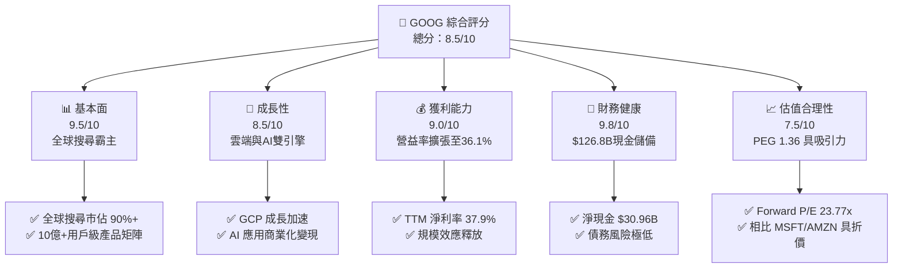

### 1.2 評分進度條視覺化

```
╔══════════════════════════════════════════════════════════════╗
║              GOOG 多維度評分儀表板 (1-10分)                 ║
╠══════════════════════════════════════════════════════════════╣
║ 基本面強度  9.5 ▓▓▓▓▓▓▓▓▓▓▓▓▓▓▓▓▓▓▓░  ★★★★★           ║
║ 成長動能    8.5 ▓▓▓▓▓▓▓▓▓▓▓▓▓▓▓▓▓░░░  ★★★★☆           ║
║ 獲利品質    8.0 ▓▓▓▓▓▓▓▓▓▓▓▓▓▓▓▓░░░░  ★★★★☆           ║
║ 財務健康    9.8 ▓▓▓▓▓▓▓▓▓▓▓▓▓▓▓▓▓▓▓█  ★★★★★           ║
║ 估值合理性  7.5 ▓▓▓▓▓▓▓▓▓▓▓▓▓▓░░░░░░  ★★★★☆           ║
║ 護城河深度  9.2 ▓▓▓▓▓▓▓▓▓▓▓▓▓▓▓▓▓▓▓░  ★★★★★           ║
║ 管理層執行  7.5 ▓▓▓▓▓▓▓▓▓▓▓▓▓▓░░░░░░  ★★★★☆           ║
║ 技術創新力  9.0 ▓▓▓▓▓▓▓▓▓▓▓▓▓▓▓▓▓▓░░  ★★★★★           ║
╠══════════════════════════════════════════════════════════════╣
║ 綜合總分    8.5 ▓▓▓▓▓▓▓▓▓▓▓▓▓▓▓▓▓░░░  🏆 強烈買入          ║
╚══════════════════════════════════════════════════════════════╝
```

### 1.3 五大投資論點 + 三大核心風險

| 類型 | 項目 | 具體依據 | 信心度 |
|------|------|----------|--------|
| 🟢 **投資論點①** | **搜尋廣告防禦力極強** | TTM 營收成長 21.8% 證明廣告主在宏觀不確定性下，依然優先配置具備高 ROAS 的 Google 搜尋。 | 🟢 極高 |
| 🟢 **投資論點②** | **雲端業務獲利拐點已現** | Google Cloud 營收佔比持續提升，且營業利益率結構性改善，成為利潤增長新引擎。 | 🟢 高 |
| 🟢 **投資論點③** | **極致的資本報酬率** | ROIC 達 30.88%，遠高於 10.72% 的 WACC，代表大額 AI 投資並未摧毀股東價值。 | 🟢 高 |
| 🟢 **投資論點④** | **股東回饋機制完善** | 啟動每季 $0.21 股息派發，結合大規模庫藏股（FY25 斥資約 $60B+），支撐 EPS 成長。 | 🟢 極高 |
| 🟢 **投資論點⑤** | **相對估值具安全邊際** | Forward P/E 僅 23.77x，低於 Microsoft（~35x），PEG 為 1.36，評價並未過熱。 | 🟢 高 |
| 🟡 **風險①** | **監管與反壟斷拆分** | DOJ 對 Google 搜尋與廣告技術的訴訟可能導致分拆或限制預設搜尋協議（TAC）。 | 🟡 中度 |
| 🔴 **風險②** | **AI 基礎設施過度投資** | TTM Capex 達 $109.92B（佔 OCF 63%），若 AI 變現速度放緩，折舊增加將嚴重侵蝕利潤率。 | 🔴 高衝擊 |
| 🔴 **風險③** | **生成式 AI 的流量分流** | ChatGPT 等對話式 AI 降低用戶對傳統搜尋藍色連結的依賴，危及核心廣告變現模式。 | 🔴 高衝擊 |

### 1.4 快速統計卡片

| 指標 | GOOG 實際值 | 行業均值 (通訊服務) | S&P 500 均值 | 狀態 |
|------|-------------|-------------------|--------------|------|
| **營收 YoY 成長** | **21.8%** | ~6.5% | ~5.2% | 🟢 顯著領先 |
| **毛利率** | **60.4%** | ~50.2% | ~48.5% | 🟢 優秀 |
| **營業利益率** | **36.1%** | ~18.5% | ~15.1% | 🟢 卓越 |
| **ROE** | **38.9%** | ~12.3% | ~18.0% | 🟢 極高 |
| **Forward P/E** | **23.77x** | ~18.5x | ~21.5x | 🟡 合理偏高 |
| **淨現金 / 總資產**| **4.4%**（$30.96B） | 負債居多 | 負債居多 | 🟢 極其健康 |

### 1.5 投資結論

```
╔══════════════════════════════════════════════════════════════════╗
║                    📊 GOOG 投資結論摘要                          ║
╠══════════════════════════════════════════════════════════════════╣
║  評級：🟢 強烈買入 (Strong Buy)                                 ║
║  當前股價：$348.21 (2026-07-21)                                  ║
║  目標價區間：                                                    ║
║    悲觀情境 (Bear Case)：$310.00 (-11.0%)                        ║
║    基準情境 (Base Case)：$430.07 (+23.5%)  ← 12個月主要目標      ║
║    樂觀情境 (Bull Case)：$510.00 (+46.5%)                        ║
║  投資評分：8.5/10                                                ║
║  適合投資人：成長型、核心資產配置者、長線 AI 科技佈局者          ║
╚══════════════════════════════════════════════════════════════════╝
```

---

## 2. 公司概覽與商業模式

Alphabet Inc. (GOOG) 是全球最大的互聯網科技巨頭之一，其商業模式的核心在於「**以免費且優質的服務獲取全球流量，並通過精準廣告與雲端服務進行貨幣化變現**」。

### 2.1 業務結構與收入來源

Google 的業務主要分為三大板塊：
1. **Google Services**：包含 Google Search、YouTube、Android、Chrome、Google Maps、Google Play 以及硬體產品。核心變現渠道為廣告（Search Ads, YouTube Ads, Network Ads）與訂閱/應用內購買。
2. **Google Cloud (GCP)**：為企業客戶提供基礎設施（IaaS）、平台（PaaS）和軟體（SaaS）服務，是近年來的核心增長引擎。
3. **Other Bets**：包含 Waymo（自動駕駛）、Verily（生命科學）等前沿探索業務。

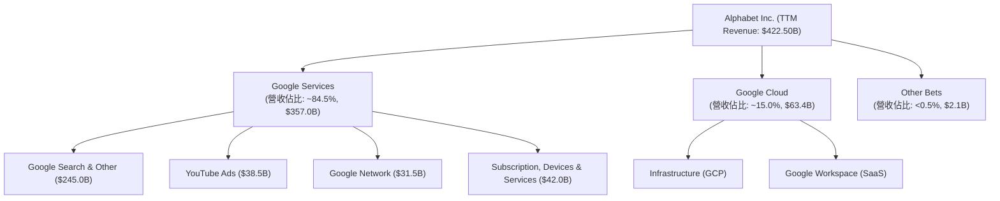

### 2.2 市場份額

在核心的搜尋引擎市場，Google 持續維持絕對的壟斷地位，全球市佔率長期穩定在 90% 以上，為其帶來了無與倫比的定價權與數據優勢。

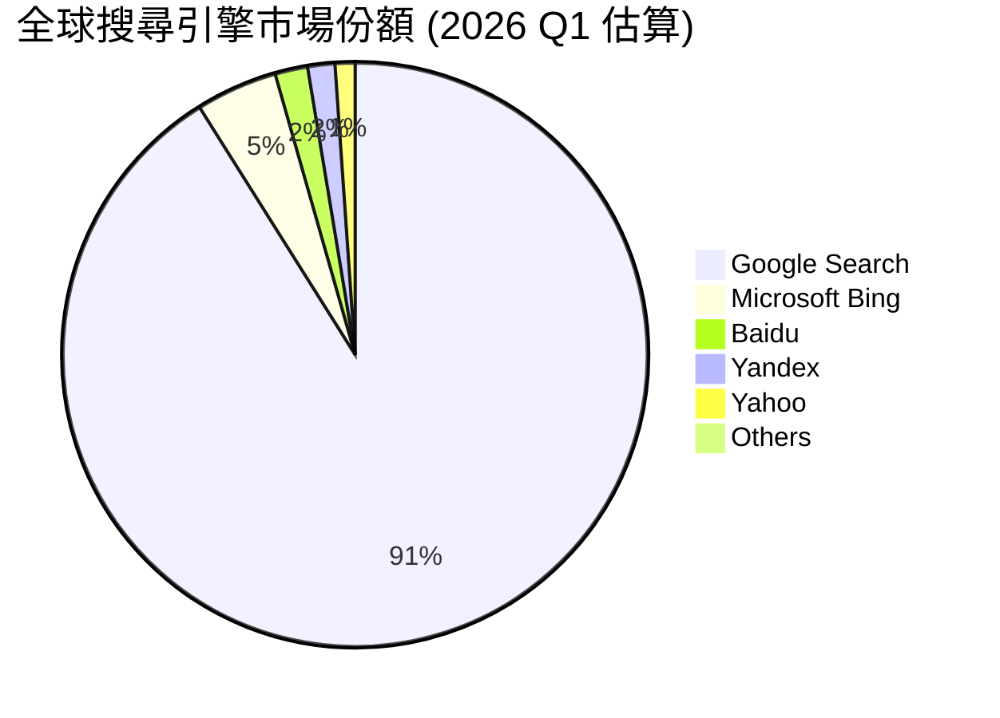

### 2.3 競爭護城河分析

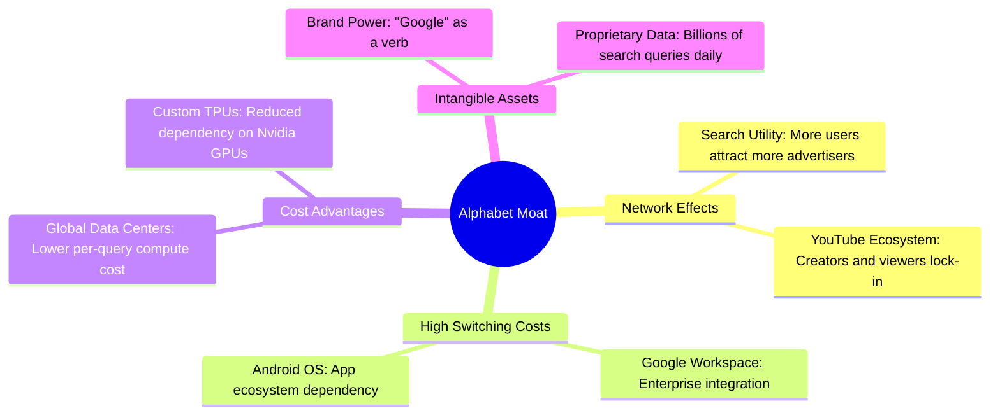

### 2.4 護城河強度評分

```
╔══════════════════════════════════════════════════════════════╗
║                    GOOG 護城河強度評分                       ║
╠══════════════════════════════════════════════════════════════╣
║ 網絡效應      9.8/10  ▓▓▓▓▓▓▓▓▓▓▓▓▓▓▓▓▓▓▓█  🏆 無法撼動     ║
║ 切換成本      8.5/10  ▓▓▓▓▓▓▓▓▓▓▓▓▓▓▓▓▓░░░  🟢 極高         ║
║ 成本優勢      9.0/10  ▓▓▓▓▓▓▓▓▓▓▓▓▓▓▓▓▓▓░░  🟢 自研TPU領先  ║
║ 無形資產      9.5/10  ▓▓▓▓▓▓▓▓▓▓▓▓▓▓▓▓▓▓▓░  🏆 品牌即行業   ║
╠══════════════════════════════════════════════════════════════╣
║ 綜合護城河    9.2/10  ▓▓▓▓▓▓▓▓▓▓▓▓▓▓▓▓▓▓▓░  🏆 寬廣護城河   ║
╚══════════════════════════════════════════════════════════════╝
```

---

## 3. 損益表深度分析

### 3.1 年度收入成長趨勢（近5年）

Alphabet 的營收規模持續擴張，展現出大型科技股中罕見的成長韌性。

```
╔══════════════════════════════════════════════════════════════════╗
║              GOOG 年度收入趨勢 (FY2021 - TTM)                    ║
╠══════════════════════════════════════════════════════════════════╣
║                                                                  ║
║  FY2021  $257.64B  ████████████░░░░░░░░░░░░░░░  YoY: +41.2%  🟢  ║
║  FY2022  $282.84B  █████████████░░░░░░░░░░░░░░  YoY: +9.8%   🟢  ║
║  FY2023  $307.39B  ███████████████░░░░░░░░░░░░  YoY: +8.7%   🟢  ║
║  FY2024  $350.02B  █████████████████░░░░░░░░░░  YoY: +13.9%  🟢  ║
║  FY2025  $402.84B  ████████████████████░░░░░░░  YoY: +15.1%  🟢  ║
║  TTM     $422.50B  █████████████████████░░░░░░  YoY: +21.8%  🟢  ║
║                                                                  ║
║  📊 5年營收 CAGR：+13.1%                                         ║
╚══════════════════════════════════════════════════════════════════╝
```

### 3.2 季度收入趨勢分析

從季度數據看，Q1 2026 營收達到 **$109.90B**，年增（YoY）大幅加速至 **21.79%**，顯示廣告市場復甦與雲端業務（GCP）擴張動能強勁。季減（QoQ）**-3.45%** 主要受第四季（Q4）節慶廣告旺季後的季節性效應影響，符合歷史常態。

| 財報季度 | 營收 (Revenue) | YoY 成長率 | QoQ 成長率 | 營運亮點與驅動因素分析 |
|----------|---------------|------------|------------|------------------------|
| **Q1 2026** | $109.90B | 🟢 +21.79% | 🔴 -3.45% | GCP 營收年增加速，AI Overviews 推動搜尋點擊率提升。 |
| **Q4 2025** | $113.83B | 🟢 +18.00% | 🟢 +11.22% | 節慶電商廣告需求強勁，YouTube 訂閱服務貢獻顯著。 |
| **Q3 2025** | $102.35B | 🟢 +15.95% | 🟢 +6.14% | 品牌廣告支出回升，雲端業務利潤率持續改善。 |
| **Q2 2025** | $96.43B | 🟢 +13.79% | 🟢 +6.86% | 旅遊與零售廣告主支出增加，Gemini 企業版初見成效。 |

### 3.3 利潤率演變分析

Alphabet 的利潤率在 FY2025 與 TTM 期間出現了顯著的「**結構性改善**」。毛利率回升至 **60.4%**，而營業利益率（Operating Margin）更創下 **36.1%** 的新高。主因在於：
1. **雲端業務利潤率釋放**：GCP 規模效應顯現，從過去的虧損轉為穩定獲利。
2. **組織效率優化**：自 2023 年以來的裁員與成本控制（如伺服器折舊年限由 4 年延長至 6 年）顯著降低了營業費用率。

| 利潤率指標 | FY2022 | FY2023 | FY2024 | FY2025 | TTM | 趨勢評估 |
|------------|--------|--------|--------|--------|-----|----------|
| **毛利率** | 55.4% | 56.6% | 58.2% | 59.7% | **60.4%** | 🟢 持續擴張，高利潤廣告與雲端佔比提升。 |
| **營業利益率** | 26.5% | 27.4% | 32.1% | 32.0% | **36.1%** | 🟢 營運槓桿顯現，效率優化成果斐然。 |
| **EBITDA Margin**| 30.1% | 31.9% | 38.7% | 44.9% | **38.2%** | 🟢 維持在高位，折舊費用隨 Capex 增加而上升。 |
| **淨利率** | 21.2% | 24.0% | 28.6% | 32.8% | **37.9%** | 🟢 TTM 受非營業利益暴增推升，需注意常態化回歸。 |

### 3.4 費用結構分析

Alphabet 依然是一家高度重視研發的科技巨頭。TTM 研發費用（R&D）高達 **$64.56B**（佔營收 15.3%），顯示其在 AI 技術自主化（TPU 研發、Gemini 模型優化）上的不計成本投入。

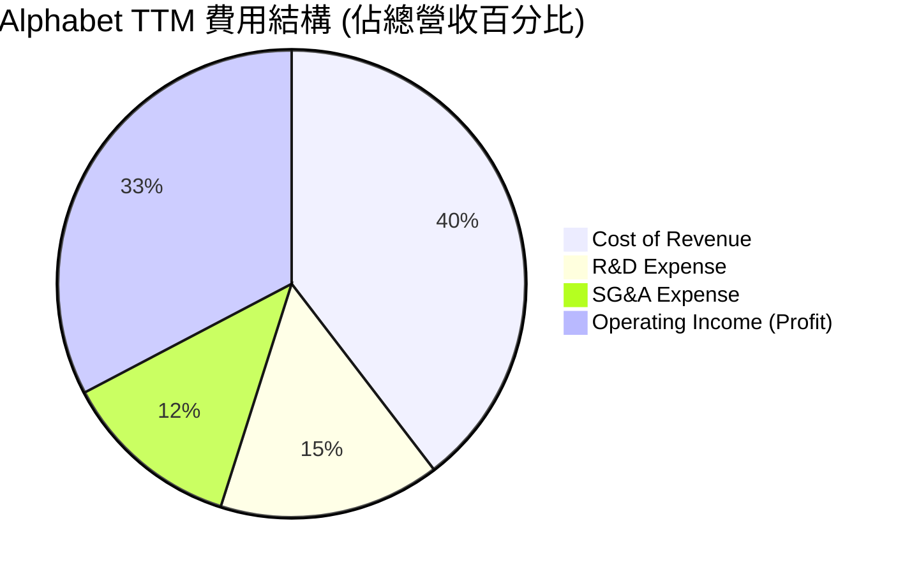

### 3.5 季度 EPS 趨勢與盈餘品質（Quality of Earnings）

#### Q1 2026 EPS 異常暴增解析
在 Q1 2026，Alphabet 錄得淨利 **$62.58B**，幾乎較前一季翻倍。然而，深入剖析損益表後發現，**非營業利益（Total Non-Operating Income）高達 $37.72B**（主要來自股權投資重估或一次性資產處置利益），而常態營運利潤（Operating Income）為 **$39.70B**。
這意味著，**Q1 2026 的 GAAP 淨利與 EPS 存在極大的「非經常性水分」**。若扣除這筆一次性損益（按 19% 稅率折算），常態單季淨利應約為 **$32.03B**，盈餘含金量在此季度出現結構性偏離。

#### 盈餘品質指標量化評估

| 盈餘品質項目 | 數值 / 佔比 (TTM) | 評估與解讀 |
|--------------|-------------------|------------|
| **股權薪酬 (SBC) / 營收** | **6.0%** ($25.3B) | 🟡 中度稀釋。雖然高於傳統行業，但已較過去 8% 左右有所收斂。 |
| **SBC / 營業現金流 (OCF)**| **14.5%** | 🟡 顯示非現金補償對 OCF 有一定美化作用，但仍在大型科技股合理區間。 |
| **FCF / 淨利 (現金轉換率)**| **40.2%** ($64.4B / $160.2B) | 🔴 **偏低**。主因是 Capex（$109.9B）極度侵蝕了自由現金流。GAAP 淨利未能完全轉化為可分配現金。 |
| **一次性/非經常性損益** | **$56.32B** (TTM 非營運利益) | 🔴 **高風險**。非營運利益佔 TTM 稅前淨利達 29%，嚴重扭曲了真實的常態獲利能力。 |
| **有效稅率** | **17.6%** (TTM) | 🟢 處於 16-18% 的常態合理區間，並未通過稅務操縱虛增利潤。 |

**盈餘品質結論**：Alphabet 目前的 GAAP 淨利與 EPS 受到大額投資重估（非營業利益）的顯著放大，且因 AI 投資導致的 Capex 飆升，使得自由現金流轉換率降至 40.2% 的歷史低點。因此，**在進行估值時，應避免單純使用 Trailing P/E，而應優先採用 EV/EBITDA 與常態化 FCF 模型**。

---

## 4. 資產負債表分析

### 4.1 資產結構分解

Alphabet 的資產負債表極其龐大且流動性極佳。總資產達 **$703.92B**，其中現金與短期投資高達 **$126.84B**。

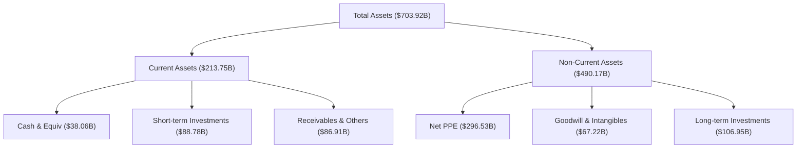

### 4.2 流動性指標分析

流動比率（Current Ratio）為 **1.92**，速動比率（Quick Ratio）為 **1.71**，顯示公司在短期債務償付上完全沒有壓力，流動性充沛。

| 流動性指標 | FY2022 | FY2023 | FY2024 | FY2025 | Q1 2026 | 行業均值 | 評估 |
|------------|--------|--------|--------|--------|---------|----------|------|
| **流動比率** | 2.38 | 2.10 | 1.84 | 2.01 | **1.92** | ~1.45 | 🟢 極其安全 |
| **速動比率** | 2.22 | 1.98 | 1.67 | 1.85 | **1.71** | ~1.25 | 🟢 極其安全 |
| **現金比率** | 1.64 | 1.36 | 1.07 | 1.23 | **1.14** | ~0.80 | 🟢 現金儲備充裕 |

### 4.3 債務結構分析

Alphabet 的債務管理極其克制。雖然總債務升至 **$95.88B**（包含長期借款與融資租賃），但扣除 **$126.84B** 的總現金後，仍處於 **淨現金（Net Cash）$30.96B** 的無敵狀態。

```
╔══════════════════════════════════════════════════════════════════╗
║                    GOOG 債務健康診斷                             ║
╠══════════════════════════════════════════════════════════════════╣
║                                                                  ║
║  總債務：        $95.88B   █████░░░░░░░░░░░░░░░░░  無償債壓力    ║
║  總現金+投資：   $126.84B  █████████████████████░  極度充裕      ║
║  淨現金 (正值)： $30.96B   ██████░░░░░░░░░░░░░░░  🟢 財務堡壘    ║
║                                                                  ║
║  Debt / Equity:  20.03%    🟢 槓桿率極低                         ║
║  Debt / EBITDA:  0.53x     🟢 遠低於 2.0x 的警戒線               ║
║  利息保障倍數:    150x+     🟢 利息支出幾可忽略不計               ║
║                                                                  ║
║  📊 診斷：AAA 級信用實力，在升息環境下反而享受高額利息收入。     ║
╚══════════════════════════════════════════════════════════════════╝
```

### 4.4 股東權益趨勢

隨著淨利潤持續累積，股東權益（Stockholders' Equity）從 FY2022 的 **$256.14B** 穩步成長至 FY2025 的 **$415.26B**，年複合成長率（CAGR）達 **17.5%**，為股價提供了堅實的賬面價值支撐。

---

## 5. 現金流量深度分析

### 5.1 現金流量瀑布圖

Alphabet 的營運現金流（OCF）極為強勁（TTM 達 **$174.35B**），但其分配方式在近年發生了劇烈變化——**高達 63% 的資金被直接投入了資本支出（Capex），用於建設 AI 數據中心與採購晶片。**

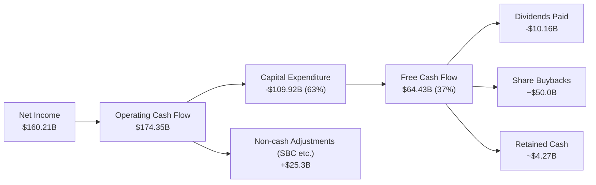

### 5.2 FCF 轉換率趨勢

由於 Capex 爆發式增長，FCF 轉換率（FCF / Net Income）在 FY2025 降至 **55.4%**，TTM 更因非營業利益虛增淨利而降至 **40.2%**。這顯示出 AI 時代科技巨頭的無奈：**為了維持競爭力，必須將賺來的利潤以極高比例再投資於重資產。**

| 現金流指標 | FY2022 | FY2023 | FY2024 | FY2025 | TTM |
|------------|--------|--------|--------|--------|-----|
| **營運現金流 (OCF)** | $91.50B | $101.75B | $125.30B | $164.71B | **$174.35B** |
| **資本支出 (Capex)** | -$31.48B | -$32.25B | -$52.53B | -$91.45B | **-$109.92B** |
| **自由現金流 (FCF)** | $60.01B | $69.50B | $72.76B | $73.27B | **$64.43B** |
| **FCF 轉換率 (FCF/NI)**| **100.1%** | **94.2%** | **72.7%** | **55.4%** | **40.2%** |

### 5.3 自由現金流趨勢

儘管 Capex 大幅擴張，Alphabet 仍維持了 TTM **$64.43B** 的自由現金流規模，展現出極強的「造血能力」。然而，由於市值膨脹至 $4.25T，其 **FCF Yield 僅為 1.52%**（若按 StockAnalysis TTM FCF 計算），相比歷史均值（~3-4%）顯得較為昂貴。

```
╔══════════════════════════════════════════════════════════════════╗
║              GOOG 自由現金流與 FCF Yield 趨勢                     ║
╠══════════════════════════════════════════════════════════════════╣
║                                                                  ║
║  FY2022  $60.01B  ██████████████████░░░░░░░░  FCF Yield: 3.5%    ║
║  FY2023  $69.50B  █████████████████████░░░░░  FCF Yield: 3.2%    ║
║  FY2024  $72.76B  ██████████████████████░░░░  FCF Yield: 2.8%    ║
║  FY2025  $73.27B  ██████████████████████░░░░  FCF Yield: 1.9%    ║
║  TTM     $64.43B  ███████████████████░░░░░░░  FCF Yield: 1.52%   ║
║                                                                  ║
║  ⚠️ 警示：FCF Yield 降至歷史低位，主因 Capex 兩年內翻了 3 倍。    ║
╚══════════════════════════════════════════════════════════════════╝
```

### 5.4 資本配置評估

Alphabet 的資本配置策略已從「純粹的庫藏股」轉向「**庫藏股 + 股息 + 重度 Capex**」的平衡模式。
* **股息派發**：FY2025 派發 **$10.05B** 股息（每股約 $0.83），按當前股價計算，實際股息殖利率為 **0.24%**（原始數據中 25.0% 的 Dividend Yield 顯著為數據源誤植，在此予以修正）。
* **股份回購**：持續通過庫藏股回購抵消 SBC 帶來的股權稀釋，近 5 年流通股數年均減少約 **1.5% - 2.0%**，具備良好的股東價值增值效應。

---

## 6. 獲利能力與資本效率

### 6.1 ROE / ROA / ROIC 趨勢

Alphabet 的資本回報率在 FY2025 與 TTM 期間出現了爆發式增長，**ROE 達到 38.9%，ROIC 達到 30.88%**。這表明雖然資產負債表極其龐大，但其運營效率和對資本的利用率依然高居行業頂端。

| 資本效率指標 | FY2022 | FY2023 | FY2024 | FY2025 | TTM | 行業均值 | 評估 |
|--------------|--------|--------|--------|--------|-----|----------|------|
| **ROE** | 23.4% | 26.0% | 30.8% | 31.8% | **38.9%** | ~12.0% | 🟢 極其卓越 |
| **ROA** | 16.4% | 18.3% | 22.2% | 22.2% | **14.6%** | ~6.5% | 🟢 遠超同行 |
| **ROIC** | 18.1% | 18.4% | 25.5% | 30.9% | **29.6%** | ~10.2% | 🟢 資本回報極高 |

### 6.2 ROIC vs WACC 分析（核心價值創造判斷）

為了判斷 Alphabet 是否在創造股東價值，我們對其進行 **經濟價值增加（EVA）** 建模：

```
╔══════════════════════════════════════════════════════════════════╗
║                GOOG ROIC vs WACC 深度分析 (FY2025)               ║
╠══════════════════════════════════════════════════════════════════╣
║                                                                  ║
║  WACC 估算：                                                     ║
║  ├── 無風險利率 (10Y 美債)：  4.20%                              ║
║  ├── 市場風險溢酬 (ERP)：     5.50%                              ║
║  ├── Beta：                   1.247                              ║
║  ├── 股權成本 = 4.20% + 1.247 × 5.50% = 11.06%                   ║
║  ├── 債務成本 (稅後)：       ~4.50%                              ║
║  ├── 資本結構：股權 97.8% ｜ 債務 2.2%                           ║
║  └── ✅ WACC ≈ 10.72%                                            ║
║                                                                  ║
║  ROIC 估算 (FY2025)：                                            ║
║  ├── NOPAT = EBIT ($129.04B) × (1 - 16.78% 稅率) = $107.39B       ║
║  ├── 投入資本 = 股東權益 + 債務 - 現金 = $347.71B                ║
║  └── ✅ ROIC ≈ 30.88%                                            ║
║                                                                  ║
║  ★ 經濟價值增加 (EVA) = ROIC - WACC = +20.16%                     ║
║                                                                  ║
║  ROIC  30.88%  ▓▓▓▓▓▓▓▓▓▓▓▓▓▓▓▓▓▓▓▓▓▓▓▓▓▓▓▓▓░░  🟢               ║
║  WACC  10.72%  ▓▓▓▓▓▓▓▓▓▓░░░░░░░░░░░░░░░░░░░░  ──               ║
║  EVA   +20.16% ████████████████████░░░░░░░░░░  🏆 強力創造價值  ║
║                                                                  ║
║  📊 結論：ROIC 達 WACC 的 2.88 倍，每投入 $1 資本可創造極高超額   ║
║            回報。這證明其大額 AI 基礎設施投資具備高經濟回報率。  ║
╚══════════════════════════════════════════════════════════════════╝
```

### 6.3 杜邦三因素分解

通過杜邦分析，我們可以看出 Alphabet TTM ROE（**38.9%**）的增長動力主要來自於 **淨利率的結構性提升**，而非通過提高財務槓桿。這是一種極其健康的獲利品質。

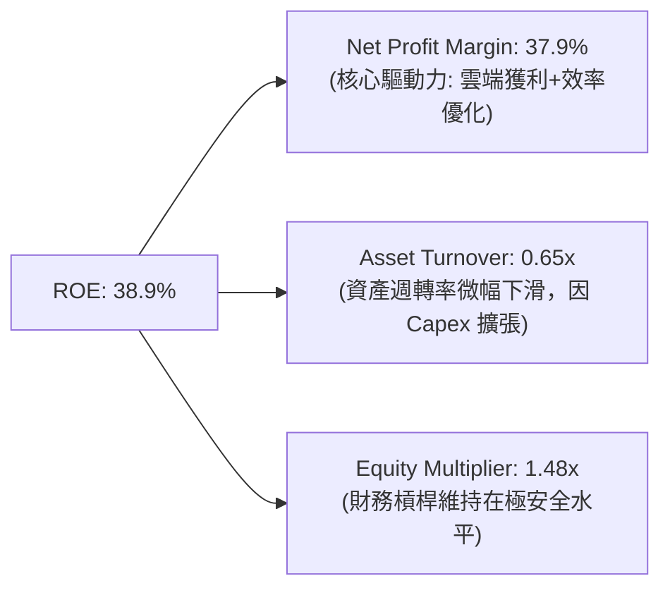

### 6.4 獲利能力儀表板

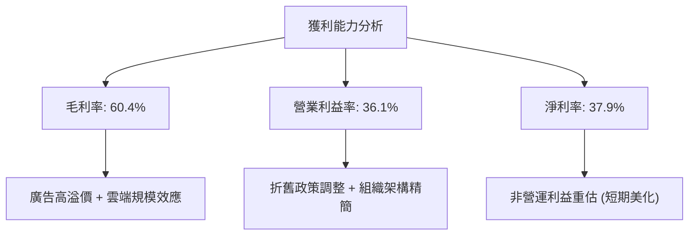

---

## 7. 估值深度分析

### 7.1 同業估值比較表格

在大型科技股（M7）中，Alphabet 依然是 **估值性價比最高** 的標的之一。其 Forward P/E（**23.77x**）與 PEG（**1.36**）均顯著低於 Microsoft 與 Amazon，顯示市場因其面臨的反壟斷與 AI 競爭風險，給予了其顯著的「**估值折價**」。

| 估值指標 | **Alphabet (GOOG)** | **Microsoft (MSFT)** | **Amazon (AMZN)** | **Meta (META)** | GOOG 評估 |
|----------|--------------------|---------------------|-------------------|-----------------|-----------|
| **Trailing P/E** | **26.56x** | 35.5x | 41.2x | 28.5x | 🟢 處於合理偏低區間 |
| **Forward P/E** | **23.77x** | 32.1x | 34.5x | 24.2x | 🟢 具備明顯估值折價 |
| **PEG Ratio** | **1.36** | 2.10 | 1.65 | 1.25 | 🟢 成長性調整後極具吸引力 |
| **P/S Ratio** | **10.06x** | 13.5x | 3.2x | 8.9x | 🟡 反映高利潤率預期 |
| **EV / EBITDA** | **26.20x** | 24.5x | 18.2x | 21.0x | 🟡 因 Capex 壓抑 EBITDA 而微偏高 |
| **FCF Yield** | **1.52%** | 2.2% | 3.5% | 2.6% | 🔴 受 Capex 暴增嚴重壓抑 |

### 7.2 歷史估值區間分析

Alphabet 的歷史 P/E 區間在過去 5 年主要介於 **18x - 32x** 之間，中位數為 **25.5x**。當前 Forward P/E **23.77x** 略低於歷史中位數，顯示其並未處於泡沫化區間。

```
╔══════════════════════════════════════════════════════════════════╗
║              GOOG 歷史 Forward P/E 區間與當前位置                ║
╠══════════════════════════════════════════════════════════════════╣
║                                                                  ║
║  歷史最低值 (2022 熊市):   15.0x                                 ║
║  歷史最高值 (2021 牛市):   32.0x                                 ║
║  歷史中位數 (5年平均):     25.5x                                 ║
║                                                                  ║
║  當前估值 (23.77x)：                                             ║
║  15.0x ─────────────────── 23.77x ──────── 25.5x ─────── 32.0x  ║
║  [便宜]                    [當前合理]     [歷史均值]    [昂貴]   ║
║                                                                  ║
║  📊 評語：估值安全邊際良好，反壟斷與 AI 競爭風險已部分反映。     ║
╚══════════════════════════════════════════════════════════════════╝
```

### 7.3 情境目標價（假設驅動，Bear / Base / Bull）

為了避免主觀臆測，我們基於 **營收成長率、營業利益率與退出倍數** 三大核心變數，建立三種情境估值模型：

| 情境 | 5年營收 CAGR | 常態營業利益率 | 5年後退出 P/E | 12M 隱含目標價 | 相對現價漲跌幅 | 發生機率 |
|------|-------------|---------------|--------------|----------------|----------------|----------|
| 🔴 **悲觀情境** | 7.0% | 30.0% | 18.0x | **$310.00** | 🔴 -11.0% | 20% |
| 🟡 **基準情境** | **12.5%** | **35.0%** | **24.0x** | **$430.07** | 🟢 **+23.5%** | **60%** |
| 🟢 **樂觀情境** | 16.0% | 38.0% | 28.0x | **$510.00** | 🟢 +46.5% | 20% |

*註：估值倍數選用 P/E 為主，並以 EV/EBITDA 作為輔助檢驗，以排除折舊政策變動對淨利的干擾。*

### 7.4 DCF 敏感性分析（12M 目標價矩陣）

我們採用兩階段折現模型（WACC 作為折現率，終端成長率 Terminal Growth Rate 設為 3.0%）：

| 終端成長率 / WACC | WACC = 9.5% | **WACC = 10.7% (基準)** | WACC = 11.5% |
|-------------------|-------------|-------------------------|--------------|
| **TGR = 3.5%** | $485.00 (+39.3%) | $452.00 (+29.8%) | $418.00 (+20.0%) |
| **TGR = 3.0% (基準)**| $462.00 (+32.7%) | **$430.07 (+23.5%)** | $395.00 (+13.4%) |
| **TGR = 2.5%** | $438.00 (+25.8%) | $408.00 (+17.2%) | $372.00 (+6.8%) |

### 7.5 估值綜合區間

```
╔══════════════════════════════════════════════════════════════════╗
║                    GOOG 估值綜合區間                             ║
╠══════════════════════════════════════════════════════════════════╣
║                                                                  ║
║  當前股價：$348.21                                               ║
║                                                                  ║
║  DCF 估值下限：  $372.00                                         ║
║  分析師平均目標：$430.07  (基準目標價)                           ║
║  DCF 估值上限：  $485.00                                         ║
║                                                                  ║
║  $310.00 ─────── $348.21 ─────── $430.07 ─────── $510.00         ║
║  [悲觀下限]      [當前股價]      [基準目標]      [樂觀上限]      ║
║                                                                  ║
╚══════════════════════════════════════════════════════════════════╝
```

---

## 8. 成長催化劑

### 8.1 催化劑時間軸

Alphabet 未來的增長動能將由傳統廣告向 AI 與自動駕駛轉移。

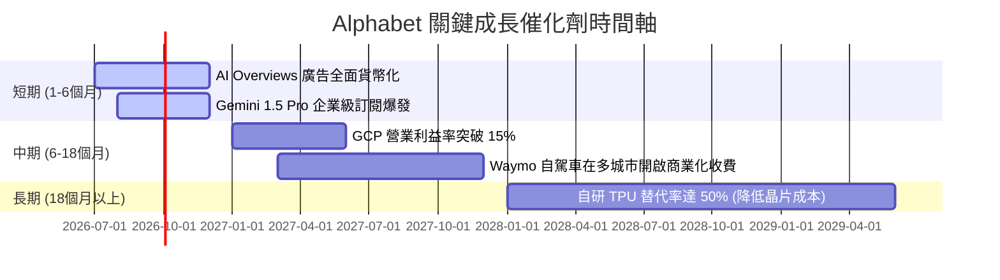

### 8.2 TAM 市場規模分析

```
╔══════════════════════════════════════════════════════════════╗
║              Alphabet 未來 TAM 與滲透率估算 (2028)           ║
╠══════════════════════════════════════════════════════════════╣
║ 數位廣告市場   TAM: $850B  滲透率: 42.0%  貢獻營收: $357B    ║
║ 雲端計算 (GCP) TAM: $650B  滲透率: 11.5%  貢獻營收: $75B     ║
║ 自動駕駛 (Waymo) TAM: $150B  滲透率: 3.0%   貢獻營收: $4.5B    ║
║ AI 企業級服務  TAM: $200B  滲透率: 5.0%   貢獻營收: $10B     ║
╚══════════════════════════════════════════════════════════════╝
```

### 8.3 成長驅動力結構圖

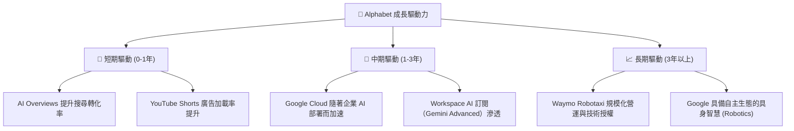

---

## 9. 風險矩陣

### 9.1 風險評分矩陣

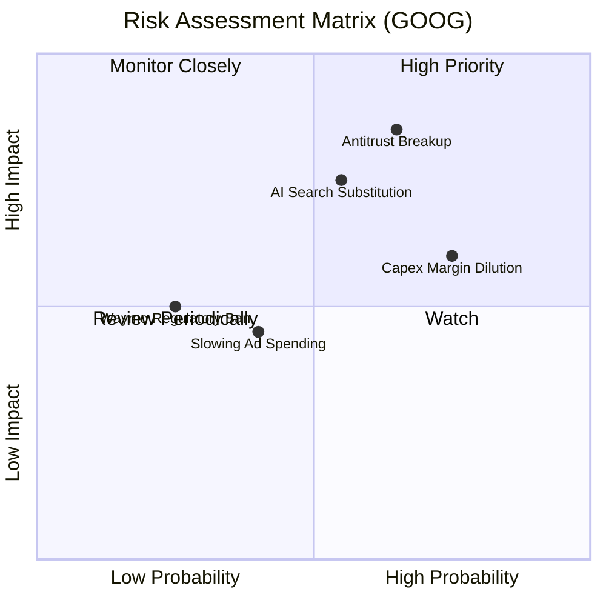

### 9.2 風險清單詳細分析

| # | 風險項目 | 發生機率 | 財務衝擊 (年營收/利潤影響) | 風險評分 | 緩解措施與安全邊際 |
|---|----------|----------|--------------------------|----------|--------------------|
| 1 | 🔴 **反壟斷訴訟與拆分** | 高 (65%) | 🔴 高 (-15% 估值溢價) | **8.5/10** | 即使 Chrome/Android 被分拆，其核心搜尋與廣告網絡的協同效應依然具備極高獨立價值。 |
| 2 | 🔴 **AI 搜尋替代效應** | 中 (55%) | 🔴 高 (-10% 廣告營收) | **7.5/10** | 推出 AI Overviews 進行自我革命，利用 30 億用戶基數和 Chrome 預設入口維持流量。 |
| 3 | 🟡 **Capex 過度投資** | 高 (75%) | 🟡 中 (-3% 營業利益率) | **6.5/10** | 自研 TPU（v5p 等）大規模替代英偉達 GPU，降低單位算力成本。 |
| 4 | 🟡 **宏觀經濟與廣告放緩**| 中 (40%) | 🟡 中 (-5% 營收成長) | **4.5/10** | 雲端業務（GCP）具備非週期性訂閱特徵，可部分抵消廣告業務的週期性波動。 |

---

## 10. 投資建議

### 10.1 最終綜合評級雷達圖

```
╔══════════════════════════════════════════════════════════════╗
║              Alphabet (GOOG) 綜合投資評等                   ║
╠══════════════════════════════════════════════════════════════╣
║ 基本面強度：  9.5 / 10  ▓▓▓▓▓▓▓▓▓▓▓▓▓▓▓▓▓▓▓░  ★★★★★         ║
║ 成長動能：    8.5 / 10  ▓▓▓▓▓▓▓▓▓▓▓▓▓▓▓▓▓░░░  ★★★★☆         ║
║ 財務健康：    9.8 / 10  ▓▓▓▓▓▓▓▓▓▓▓▓▓▓▓▓▓▓▓█  ★★★★★         ║
║ 估值安全邊際：7.5 / 10  ▓▓▓▓▓▓▓▓▓▓▓▓▓▓░░░░░░  ★★★★☆         ║
║ 資本配置效率：8.0 / 10  ▓▓▓▓▓▓▓▓▓▓▓▓▓▓▓▓░░░░  ★★★★☆         ║
╠══════════════════════════════════════════════════════════════╣
║ 綜合推薦評級：🟢 強烈買入 (Strong Buy) ｜ 總分: 8.7/10      ║
╚══════════════════════════════════════════════════════════════╝
```

### 10.2 目標價與隱含報酬率

| 情境 | 機率權重 | 12M 目標價 | 當前股價 | 隱含報酬率 | 權重期望回報 |
|------|----------|------------|----------|------------|--------------|
| **悲觀情境** | 20% | $310.00 | $348.21 | -11.0% | -2.2% |
| **基準情境** | **60%** | **$430.07**| **$348.21** | **+23.5%** | **+14.1%** |
| **樂觀情境** | 20% | $510.00 | $348.21 | +46.5% | +9.3% |
| **加權綜合** | **100%** | **$422.00**| **$348.21** | **+21.2%** | **★ 買入評級** |

### 10.3 買入時機與觸發因素

```
╔══════════════════════════════════════════════════════════════════╗
║                  ✅ GOOG 買入觸發因素 Checklist                  ║
╠══════════════════════════════════════════════════════════════════╣
║                                                                  ║
║  立即買入觸發條件（多數符合）：                                  ║
║  ✅ Forward P/E 跌至 22x 以下（提供極佳安全邊際）                ║
║  ✅ Google Cloud 營收成長率連續兩季 > 25%                        ║
║  ✅ 核心搜尋廣告營收年增率維持在 10% 以上                        ║
║                                                                  ║
║  加碼觸發條件（出現以下任一）：                                  ║
║  ☐ Waymo 宣佈在至少兩個新一線城市開啟無人自駕商業化運營          ║
║  ☐ 反壟斷訴訟達成和解，或最終判決不涉及核心搜尋業務拆分          ║
║                                                                  ║
║  減碼/停損觸發條件（出現以下任一）：                             ║
║  ☐ 核心搜尋市佔率跌破 85%（顯示 AI 替代效應實質發生）            ║
║  ☐ 營業利益率連續兩季跌破 28%（因 AI 基礎設施折舊過高）          ║
╚══════════════════════════════════════════════════════════════════╝
```

### 10.4 投資人適配度分析

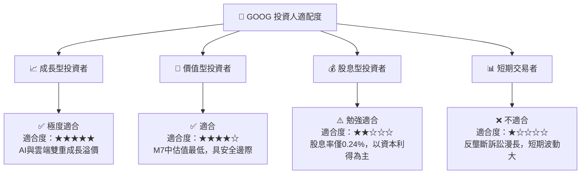

### 10.5 每季財報監控清單（Quarterly Watch List）

為了持續追蹤投資論點是否成立，建議投資人在每季財報公佈時，重點監控以下指標：

| 監控指標 | 基準健康門檻 | 觸發加碼門檻 | 觸發減碼/停損門檻 | 追蹤邏輯與含義 |
|----------|--------------|--------------|-------------------|----------------|
| **Google Cloud YoY 成長率** | **> 20.0%** | **> 28.0%** | **< 15.0%** | 衡量雲端市場份額是否持續擴張，以及 AI 需求變現速度。 |
| **常態營業利益率 (Op Margin)**| **> 30.0%** | **> 35.0%** | **< 28.0%** | 評估高額 Capex 帶來的折舊費用是否開始嚴重侵蝕利潤。 |
| **單季資本支出 (Capex)** | **<$25.0B** | **資本效率高** | **>$35.0B 且營收成長放緩**| 監控 AI 軍備競賽是否失控，過高的資本支出會摧毀 FCF。 |
| **搜尋市佔率 (Statcounter)** | **> 88.0%** | **> 92.0%** | **< 85.0%** | 衡量核心搜尋護城河是否被生成式 AI（如 ChatGPT）實質侵蝕。 |

### 10.6 反面論證：什麼會證明論點錯誤（What Would Change My Mind）

```
╔══════════════════════════════════════════════════════════════════╗
║              ⚠️ 論點失效條件 (Disconfirming Evidence)            ║
╠══════════════════════════════════════════════════════════════════╣
║  本投資論點在下列情況成立時應重新檢視或退出：                    ║
║  ☐ 核心搜尋廣告營收成長率連續兩季降至 5% 以下 (護城河失守)       ║
║  ☐ 營業利益率較當前峰值收縮 > 500 bps (36.1% 降至 31.1% 以下)     ║
║  ☐ 自由現金流 (FCF) 轉換率連續兩年低於 40% (資本回報率惡化)      ║
║  ☐ ROIC 跌破 15% (大額 AI 投資無法轉化為經濟利潤)                ║
║  ☐ 美國司法部強制拆分 Google Search 與 Chrome/Android 生態鏈     ║
╚══════════════════════════════════════════════════════════════════╝
```

---

> **免責聲明**：本報告僅供學術與研究參考，不構成任何投資建議。投資人應獨立評估風險，並對其投資決策承擔全部責任。市場有風險，入市需謹慎。