# GOOG 基本面深度分析報告
> **報告日期**：2026-07-22 ｜ **語言**：繁體中文 ｜ **數據來源**：Yahoo Finance, Finviz, StockAnalysis, Roic.ai ｜ **分析師**：CFA 級機構研究

---

## 目錄

| # | 章節 | 核心結論 |
|---|---|---|
| 1 | 執行摘要 | 評級：🟢 買入 ｜ 基準目標價：$390.00（隱含 +13.2% 空間） |
| 2 | 公司概覽與商業模式 | 搜尋引擎與 YouTube 雙重護城河，雲端與 AI 基礎設施驅動第二增長曲線 |
| 3 | 損益表深度分析 | TTM 營收成長 17.45%，淨利潤受非營業收益推升，但核心盈餘品質需關注 |
| 4 | 資產負債表分析 | 淨現金達 $30.96B，流動性充裕，但資本支出擴張導致資產重組 |
| 5 | 現金流量深度分析 | 經營現金流達 $174.35B，但 AI 資本支出（Capex）飆升壓抑自由現金流（FCF） |
| 6 | 獲利能力與資本效率 | ROIC 達 29.62%，遠超 WACC（9.02%），持續為股東創造超額經濟價值（EVA） |
| 7 | 估值深度分析 | 前瞻 P/E 23.47x 處於歷史合理區間，DCF 敏感性分析顯示下行空間有強支撐 |
| 8 | 成長催化劑 | 雲端 AI 變現加速與 TPU 自研晶片帶來的結構性利潤率改善 |
| 9 | 風險矩陣 | 監管反壟斷拆分風險（高衝擊）與 AI 搜尋侵蝕傳統廣告利潤（中度） |
| 10 | 投資建議 | 適合長線成長型與價值型投資者，建立每季財報監控指標與失效條件 |

---

## 1. 執行摘要

Alphabet Inc.（GOOG）當前股價為 $344.42，對應市值達 $4.20T，企業價值（EV）為 $4.16T。基於對其核心搜尋業務韌性、Google Cloud 盈利能力釋放，以及 AI 基礎設施領先地位的深度評估，我們給予 GOOG **「買入（Buy）」**評級，12 個月基準目標價為 **$390.00**（較當前股價有 +13.2% 的上行空間）。

此評級基於以下核心財務數據與邏輯：公司 TTM 營業利益率達 **36.1%**，相較於 2022 年的 26.5% 有顯著改善，反映出強大的營運槓桿；儘管為了應對 AI 軍備競賽，TTM 資本支出（Capex）飆升至歷史新高的 **$109.92B**，但公司仍實現了 **$64.43B** 的 TTM 自由現金流（FCF），且 ROIC 達到了驚人的 **29.62%**，遠超其 9.02% 的 WACC。這證明 Alphabet 在進行高強度未來投資的同時，其核心業務仍在以極高的資本效率創造股東價值。

### 1.0 一頁式投資儀表板

| 項目 | 內容 |
|------|------|
| **投資論點（3 句）** | ① 核心廣告業務展現極強韌性，TTM 營收達 $422.50B（YoY +21.8%），Search 與 YouTube 結構性護城河依然穩固。<br/>② Google Cloud 規模效應顯現，營業利潤率持續擴張，成為高利潤率的第二增長引擎。<br/>③ 自研 TPU 晶片與全棧 AI 基礎設施，在降低 AI 推理成本的同時，推動 ROIC 保持在 29.62% 的高位。 |
| **護城河評分** | 🟢 9.2 / 10 |
| **管理層/資本配置評分** | 🟡 8.5 / 10 |
| **財務健康** | 🟢 極其健康（淨現金 $30.96B，利息保障倍數 > 100x） |
| **ROIC vs WACC** | **29.62% vs 9.02%**（創造顯著經濟價值，EVA 達 +20.60%） |
| **FCF 趨勢** | 穩定但受 Capex 壓抑 ｜ 最新 FCF Yield 為 **1.53%**（基於 $64.43B FCF 與 $4.20T 市值） |
| **估值** | Forward P/E: **23.47x** ｜ EV/EBITDA: **25.81x** ｜ P/S: **9.95x** |
| **預期報酬（基準情境 12M）** | **+13.2%**（目標價 $390.00） |
| **關鍵風險（前二）** | ① 美國司法部（DOJ）反壟斷訴訟可能導致的拆分或默認搜尋合約終止。<br/>② AI 搜尋（如 Search Generative Experience）的伺服器成本高昂，可能侵蝕毛利率。 |
| **評級 + 信心度** | 🟢 **買入（Buy）** ｜ 信心度：**高（High）** |

### 1.1 核心評分儀表板

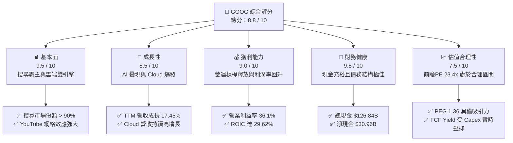

### 1.2 評分進度條視覺化

```
╔══════════════════════════════════════════════════════════════╗
║              GOOG 多維度評分儀表板 (1-10分)                 ║
╠══════════════════════════════════════════════════════════════╣
║ 基本面強度  9.5 ▓▓▓▓▓▓▓▓▓▓▓▓▓▓▓▓▓▓▓░  ★★★★★           ║
║ 成長動能    8.5 ▓▓▓▓▓▓▓▓▓▓▓▓▓▓▓▓▓░░░  ★★★★☆           ║
║ 獲利品質    9.0 ▓▓▓▓▓▓▓▓▓▓▓▓▓▓▓▓▓▓░░  ★★★★★           ║
║ 財務健康    9.5 ▓▓▓▓▓▓▓▓▓▓▓▓▓▓▓▓▓▓▓░  ★★★★★           ║
║ 估值合理性  7.5 ▓▓▓▓▓▓▓▓▓▓▓▓▓▓░░░░░░  ★★★★☆           ║
║ 護城河深度  9.2 ▓▓▓▓▓▓▓▓▓▓▓▓▓▓▓▓▓▓▓░  ★★★★★           ║
║ 管理層執行  8.5 ▓▓▓▓▓▓▓▓▓▓▓▓▓▓▓▓▓░░░  ★★★★☆           ║
║ 技術創新力  9.0 ▓▓▓▓▓▓▓▓▓▓▓▓▓▓▓▓▓▓░░  ★★★★★           ║
╠══════════════════════════════════════════════════════════════╣
║ 綜合總分    8.8 ▓▓▓▓▓▓▓▓▓▓▓▓▓▓▓▓▓░░░  🏆 買入 (Buy)        ║
╚══════════════════════════════════════════════════════════════╝
```

### 1.3 五大投資論點 + 三大核心風險

| 類型 | 項目 | 具體依據 | 信心度 |
|------|---|---|---|
| 🟢 **投資論點①** | **搜尋與廣告護城河無可動搖** | 儘管面臨 ChatGPT 等 AI 工具競爭，Google 搜尋市佔率仍維持在 90% 以上，TTM 營收達 $422.50B，YoY 成長 21.8%，證明流量變現能力未受實質侵蝕。 | 🟢 極高 |
| 🟢 **投資論點②** | **雲端業務利潤釋放** | Google Cloud 營收規模跨越盈虧平衡點後，營業利益率持續攀升，成為拉動集團利潤率（TTM 淨利率達 37.9%）的重要推手。 | 🟢 高 |
| 🟢 **投資論點③** | **自研 TPU 的成本優勢** | Alphabet 擁有行業領先的自研 AI 晶片（TPU v5p 等），在 AI 推理成本上顯著低於完全依賴 NVIDIA 的競爭對手，維持高 ROIC（29.62%）。 | 🟢 高 |
| 🟢 **投資論點④** | **強大的資本回報計劃** | 2025 年派發 $10.05B 股息，並持續進行大規模股份回購，流通股數 YoY 減少 1.38%，增厚每股盈餘（EPS TTM $13.12）。 | 🟢 高 |
| 🟢 **投資論點⑤** | **資產負債表極具韌性** | 擁有 $126.84B 的總現金與短期投資，即使在升息或宏觀經濟放緩環境下，仍有充足資金支持研發（TTM R&D $64.56B）。 | 🟢 極高 |
| 🟡 **風險①** | **監管與反壟斷拆分** | 美國司法部對 Google 搜尋與廣告技術的訴訟可能導致強制拆分或禁止排他性默認合約（如與 Apple 的合作），這將直接威脅其核心流量來源。 | 🟡 中度 |
| 🔴 **風險②** | **AI 資本支出失控壓抑 FCF** | TTM 資本支出已達 $109.92B（占營收比重達 26%），若 AI 應用變現速度不及預期，將導致折舊費用大幅上升，壓抑未來利潤率。 | 🔴 高衝擊 |
| 🟡 **風險③** | **AI 搜尋對廣告點擊率的侵蝕** | 生成式回答（SGE）可能減少使用者點擊傳統網頁廣告的次數，迫使 Google 重新設計廣告模式，短期內可能面臨過渡期陣痛。 | 🟡 中度 |

### 1.4 快速統計卡片

| 指標 | GOOG 實際值 | 行業均值（通訊服務） | S&P 500 均值 | 狀態 |
|------|-------------|----------------------|--------------|------|
| **營收 YoY 成長率** | **21.8%** | ~6.5% | ~5.2% | 🟢 顯著領先 |
| **毛利率** | **60.4%** | ~50.2% | ~30.5% | 🟢 優異 |
| **營業利益率** | **36.1%** | ~18.5% | ~12.2% | 🟢 強大 |
| **淨利率** | **37.9%** | ~12.0% | ~10.5% | 🟢 極高（含一次性收益） |
| **ROE** | **38.9%** | ~14.2% | ~15.0% | 🟢 卓越 |
| **Forward P/E** | **23.47x** | ~18.5x | ~21.5x | 🟡 溢價合理 |
| **PEG Ratio** | **1.36x** | ~1.50x | ~1.80x | 🟢 具投資性價比 |

### 1.5 投資結論

```
╔══════════════════════════════════════════════════════════════════╗
║                    📊 GOOG 投資結論摘要                          ║
╠══════════════════════════════════════════════════════════════════╣
║  評級：🟢 買入 (Buy)                                             ║
║  當前股價：$344.42                                               ║
║  目標價區間：                                                    ║
║    悲觀情境（Bear）：$280.00（-18.7%）- AI 變現失敗/反壟斷拆分   ║
║    基準情境（Base）：$390.00（+13.2%）- 核心預期目標            ║
║    樂觀情境（Bull）：$460.00（+33.6%）- AI 雲端全面爆發          ║
║  投資評分：8.8 / 10                                              ║
║  適合投資人：長線成長型、GARP（合理價格成長）投資者              ║
╚══════════════════════════════════════════════════════════════════╝
```

---

## 2. 公司概覽與商業模式

Alphabet Inc. 是一家全球領先的科技巨頭，其業務主要分為三大板塊：**Google Services（谷歌服務）**、**Google Cloud（谷歌雲端）** 以及 **Other Bets（其他賭注）**。

### 2.1 業務結構與收入來源

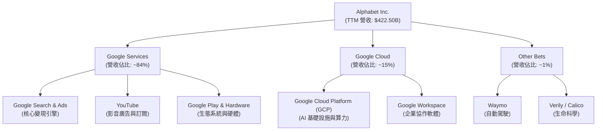

### 2.2 市場份額

在核心搜尋與影音領域，Alphabet 擁有近乎壟斷的市場地位。以下為 2025 年全球搜尋引擎與線上影音平台的市場份額估算：

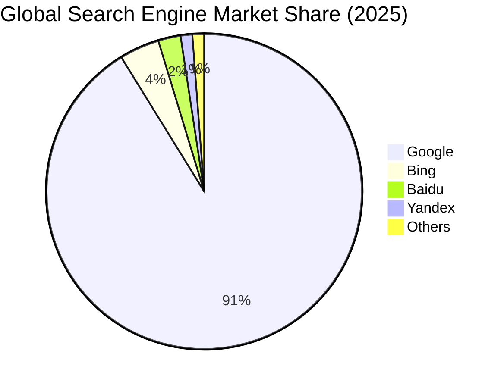

### 2.3 競爭護城河分析

Alphabet 的競爭護城河可以被歸納為以下六個維度：

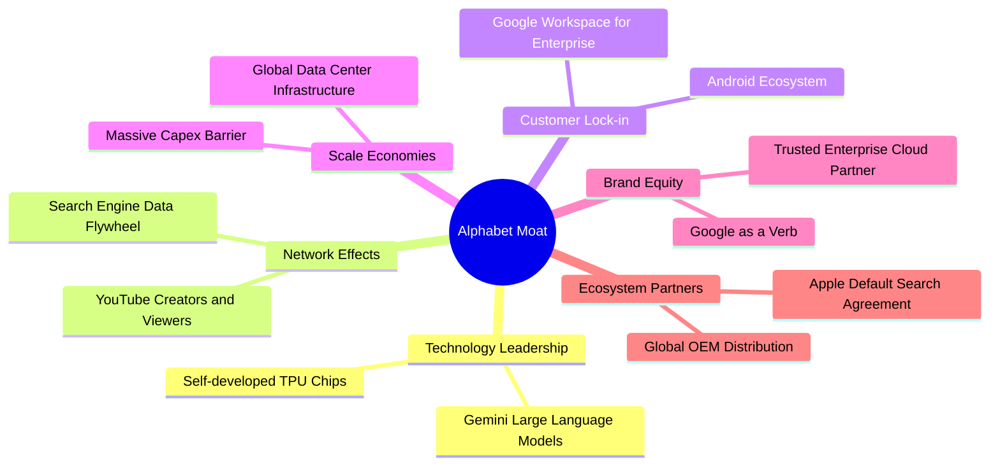

### 2.4 護城河強度評分

```
╔══════════════════════════════════════════════════════════════╗
║                    Alphabet 護城河強度評分                    ║
╠══════════════════════════════════════════════════════════════╣
║ 網路效應      9.8/10  ▓▓▓▓▓▓▓▓▓▓▓▓▓▓▓▓▓▓▓░  🏆 無可比擬     ║
║ 技術領先      9.0/10  ▓▓▓▓▓▓▓▓▓▓▓▓▓▓▓▓▓▓░░  🟢 TPU/AI 領先  ║
║ 規模效應      9.5/10  ▓▓▓▓▓▓▓▓▓▓▓▓▓▓▓▓▓▓▓░  🟢 基礎設施壁壘 ║
║ 用戶轉換成本  8.5/10  ▓▓▓▓▓▓▓▓▓▓▓▓▓▓▓▓░░░░  🟢 生態高度綁定 ║
║ 品牌與管道    9.2/10  ▓▓▓▓▓▓▓▓▓▓▓▓▓▓▓▓▓▓▓░  🟢 預設搜尋引擎 ║
╠══════════════════════════════════════════════════════════════╣
║ 綜合護城河     9.2/10  ▓▓▓▓▓▓▓▓▓▓▓▓▓▓▓▓▓▓▓░  🏆 寬廣護城河   ║
╚══════════════════════════════════════════════════════════════╝
```

---

## 3. 損益表深度分析

### 3.1 年度收入成長趨勢（FY2021 - FY2025）

Alphabet 在過去五年中展現了極其強韌的營收擴張能力。即便在 2022-2023 年宏觀廣告市場低迷期，公司依然維持了正成長，並在 2024 與 2025 年迎來強勁復甦。

```
╔══════════════════════════════════════════════════════════════════╗
║              Alphabet 年度收入趨勢 (FY2021-FY2025)               ║
╠══════════════════════════════════════════════════════════════════╣
║                                                                  ║
║  FY 2021  $257.64B  ████████████████░░░░░░░░░░  YoY: +41.15% 🟢  ║
║  FY 2022  $282.84B  ██████████████████░░░░░░░░  YoY: +9.78%  🟢  ║
║  FY 2023  $307.39B  ███████████████████░░░░░░░  YoY: +8.68%  🟢  ║
║  FY 2024  $350.02B  ██████████████████████░░░░  YoY: +13.87% 🟢  ║
║  FY 2025  $402.84B  █████████████████████████░  YoY: +15.09% 🟢  ║
║                                                                  ║
║  📊 5 年營收複合年增長率 (CAGR)：+11.85%                         ║
╚══════════════════════════════════════════════════════════════════╝
```

### 3.2 季度收入趨勢分析

從季度數據來看，Alphabet 的營收成長在 2025 年底至 2026 年初明顯加速：

| 財報季度 | 營收 (Billion) | YoY 成長率 | QoQ 成長率 | 核心驅動因素與備註 |
|---|---|---|---|---|
| **Q2 2025** | $96.43B | +13.79% | +6.86% | 雲端業務加速，Search 廣告穩定。 |
| **Q3 2025** | $102.35B | +15.95% | +6.14% | YouTube 訂閱與廣告雙引擎驅動。 |
| **Q4 2025** | $113.83B | +18.00% | +11.22% | 季節性電商廣告旺季，Cloud 需求爆發。 |
| **Q1 2026** | $109.90B | +21.79% | -3.45% | 儘管受 Q1 季節性回落影響，但 **YoY 成長 21.79%** 創近年新高，主要得益於 AI 算力需求。 |

### 3.3 利潤率演變分析

Alphabet 的利潤率在近年經歷了「先收縮、後擴張」的過程。2022 年由於員工擴招與研發投入過快，營業利益率降至 26.5%，但隨著 2023-2024 年的效率優化（包括裁員與伺服器折舊年限調整），利潤率迎來強勁反彈。

| 利潤率指標 | FY 2022 | FY 2023 | FY 2024 | FY 2025 | TTM | 趨勢評估 | 狀態 |
|---|---|---|---|---|---|---|---|
| **毛利率** | 55.38% | 56.63% | 58.20% | 59.65% | **60.37%** | 穩定上升，受高毛利 Cloud 與廣告結構優化驅動。 | 🟢 優異 |
| **營業利益率** | 26.46% | 27.42% | 32.11% | 32.03% | **36.10%** | 顯著擴張，反映出強大的營運槓桿與成本控制。 | 🟢 強勁 |
| **淨利率** | 21.20% | 24.01% | 28.60% | 32.81% | **37.92%** | 處於歷史高位，但需注意 TTM 包含非營業收益。 | 🟡 需關注盈餘品質 |

**利潤率擴張深度解析**：
1. **營運槓桿釋放**：營收成長（TTM +21.8%）顯著快於營運費用（SGA + R&D）的增長。SGA 占營收比重從 2022 年的 14.9% 降至 TTM 的 12.4%。
2. **雲端業務轉虧為盈**：Google Cloud 的利潤率改善是核心推手。Cloud 業務從過去的虧損黑洞轉變為當前利潤率超過 20% 的現金牛，直接拉高了整體的營業利益率。

### 3.4 費用結構分析

Alphabet 的費用結構以研發（R&D）和銷售行政（SGA）為主。

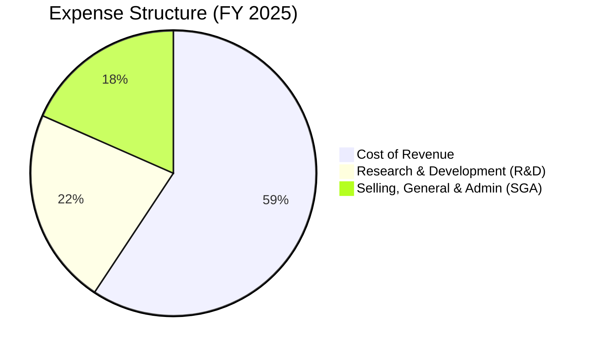

```
╔══════════════════════════════════════════════════════════════╗
║                Alphabet 費用控制效率診斷                     ║
╠══════════════════════════════════════════════════════════════╣
║ 研發營收比    15.16%  ▓▓▓▓▓▓▓▓░░░░░░░░░░░░  🟢 投資未來      ║
║ 銷管營收比    12.45%  ▓▓▓▓▓▓░░░░░░░░░░░░░░  🟢 效率優化顯著  ║
║ 營業折舊比    15.02%  ▓▓▓▓▓▓▓░░░░░░░░░░░░░  🟡 Capex 帶來壓力║
╚══════════════════════════════════════════════════════════════╝
```

### 3.5 季度 EPS 趨勢與盈餘品質（Quality of Earnings）

Alphabet 在過去四個季度中，每股盈餘（EPS）呈現爆發式增長，但作為機構分析師，我們必須對其**盈餘品質**進行嚴格的拆解。

* **Q1 2026 異常數據剖析**：
  在 Q1 2026 財報中，Alphabet 報告的淨利潤高達 **$62.58B**，而其營業利益（Operating Income）僅為 **$39.70B**。
  
  **為什麼淨利潤會大於營業利益？**
  這主要是由**非營業收益（Non-Operating Income）**高達 **$37.72B** 所致（相較於前一季僅 $3.18B）。這筆高達 $37.7B 的非營業收益，極有可能是來自於：
  1. 股權投資的公允價值變動（例如 Alphabet 持有的 Anthropic、Waymo 或其他股權在最新一輪融資中大幅估值上調）。
  2. 稅務調整或資產處置的一次性收益。
  
  這意味著，Q1 2026 的 GAAP 淨利潤和 EPS（$5.17）被嚴重扭曲，**無法代表其核心業務的真實盈利能力**。如果我們扣除非營業收益，並按標準 18% 稅率計算，Q1 2026 的經調整淨利潤約為 **$32.5B**，對應 EPS 約為 **$2.68**，而非報告的 $5.17。

#### 盈餘品質量化評估表：

| 盈餘品質項目 | 數值 / 佔比 | 評估與對真實股東報酬的影響 | 狀態 |
|---|---|---|---|
| **股權薪酬 (SBC) / 營收** | **5.90%**（TTM SBC $26.19B / 營收 $422.50B） | 處於合理科技股區間（< 8%），對現有股東的股權稀釋程度受大規模回購（流通股 YoY -1.38%）完全抵消。 | 🟢 良好 |
| **SBC / 營業現金流** | **15.02%**（$26.19B / $174.35B） | 反映出公司現金流的「含金量」高，並非完全依賴非現金薪酬來美化現金流。 | 🟢 優秀 |
| **FCF / 淨利潤（現金轉換率）** | **40.21%**（TTM FCF $64.43B / 淨利 $160.21B） | 🔴 偏低。主因是 Capex 支出極高（$109.92B TTM），以及 Q1 2026 的非營業收益（$37.7B）並未帶來實際的經營現金流。這印證了當前 GAAP 淨利潤高估了真實的經濟盈餘。 | 🔴 警訊 |
| **一次性非經常性損益** | **$37.72B**（Q1 2026 非營業收益） | 顯著扭曲了 TTM 淨利與 P/E 估值。在進行估值建模時，必須使用 **EV/EBITDA** 或 **Operating P/E** 以避免估值失真。 | 🔴 警訊 |

---

## 4. 資產負債表分析

### 4.1 資產結構分解

截至 2026 年 3 月 31 日，Alphabet 總資產達到 **$703.92B**，其中流動資產為 $213.75B（佔 30.4%），非流動資產（主要是廠房與設備，即數據中心與伺服器）大幅增長至 $490.17B，反映出重資本 AI 基礎設施投資的特徵。

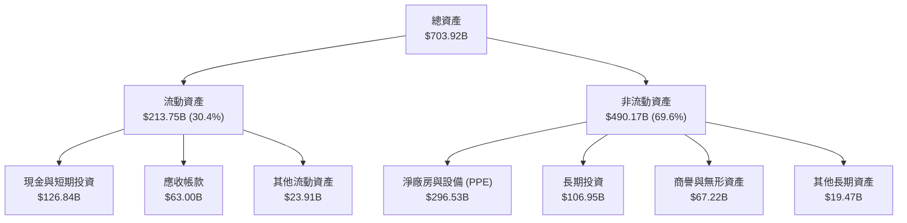

### 4.2 流動性指標分析

Alphabet 的短期償債能力極強，流動性壓力幾近於零。

| 流動性指標 | FY 2023 | FY 2024 | FY 2025 | TTM / Q1 2026 | 行業均值 | 評估 |
|---|---|---|---|---|---|---|
| **流動比率 (Current Ratio)** | 2.10 | 1.84 | 2.01 | **1.92** | ~1.45 | 短期資產覆蓋流動負債能力極強。 | 🟢 安全 |
| **速動比率 (Quick Ratio)** | 1.95 | 1.67 | 1.85 | **1.71** | ~1.20 | 扣除預付費用等非速動資產後，流動性依然無虞。 | 🟢 安全 |

### 4.3 債務結構與健康診斷

儘管 Alphabet 近期增加了長期借款以優化資本結構，但其依然處於**淨現金**狀態，債務風險極低。

```
╔══════════════════════════════════════════════════════════════════╗
║                    Alphabet 債務健康診斷                         ║
╠══════════════════════════════════════════════════════════════════╣
║                                                                  ║
║  總債務 (Debt)：    $95.88B   ████████░░░░░░░░░░░░░░░░░  無還款壓力║
║  總現金 (Cash)：    $126.84B  █████████████░░░░░░░░░░░░  極其充裕  ║
║  淨現金 (Net Cash)：$30.96B   █████░░░░░░░░░░░░░░░░░░░░  🟢 安全   ║
║                                                                  ║
║  Debt / Equity:     20.03%    🟢 槓桿率極低                      ║
║  Debt / EBITDA:     0.53x     🟢 遠低於 2.0x 的安全警戒線        ║
║  Interest Coverage: >100x     🟢 營業利益輕鬆覆蓋利息費用        ║
║                                                                  ║
║  📊 結論：資產負債表具備「堡壘級」防禦力，能抵禦任何宏觀金融風暴 ║
╚══════════════════════════════════════════════════════════════════╝
```

---

## 5. 現金流量深度分析

### 5.1 現金流量瀑布圖（TTM）

以下圖表展示了 Alphabet 如何將營收轉化為現金，以及這些現金是如何被分配的：

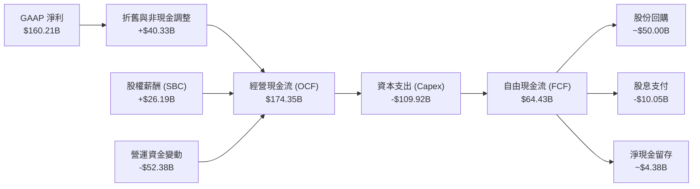

### 5.2 FCF 轉換率與資本支出趨勢

雖然 Alphabet 的經營現金流（OCF）持續創下新高（TTM 達 $174.35B），但由於資本支出（Capex）的極速擴張，其自由現金流（FCF）轉換率在近期出現了明顯下滑。

| 財務年度 | 經營現金流 (OCF) | 資本支出 (Capex) | 自由現金流 (FCF) | FCF / Net Income (轉換率) | Capex / Revenue (資本強度) |
|---|---|---|---|---|---|
| **FY 2022** | $91.50B | -$31.48B | $60.01B | 100.06% | 11.13% |
| **FY 2023** | $101.75B | -$32.25B | $69.50B | 94.18% | 10.49% |
| **FY 2024** | $125.30B | -$52.53B | $72.76B | 72.67% | 15.01% |
| **FY 2025** | $164.71B | -$91.45B | $73.27B | 55.44% | 22.70% |
| **TTM** | **$174.35B** | **-$109.92B** | **$64.43B** | **40.21%** | **26.02%** |

* **分析師洞察**：
  Alphabet 的資本強度（Capex/Revenue）從 2023 年的 10.49% 飆升至 TTM 的 **26.02%**。這是一把雙刃劍：
  * **積極面**：公司正在瘋狂建立 AI 護城河，購買 GPU 並部署自研 TPU 基礎設施。這將確保其在雲端算力市場的長期競爭力。
  * **消極面**：高昂的 Capex 壓抑了當前的 FCF 釋放。TTM FCF 僅為 $64.43B，相較於 2025 年的 $73.27B 有所下滑，導致 FCF Yield 降至 **1.53%**。這表明短期內股東面臨折舊費用上升與現金流受壓的風險。

### 5.3 自由現金流趨勢

```
╔══════════════════════════════════════════════════════════════════╗
║                Alphabet 自由現金流與 FCF Yield 趨勢               ║
╠══════════════════════════════════════════════════════════════════╣
║                                                                  ║
║  FY 2022  $60.01B   ██████████████████████░░░░  FCF Yield: 1.43% ║
║  FY 2023  $69.50B   ████████████████████████░░  FCF Yield: 1.65% ║
║  FY 2024  $72.76B   █████████████████████████░  FCF Yield: 1.73% ║
║  FY 2025  $73.27B   █████████████████████████░  FCF Yield: 1.74% ║
║  TTM      $64.43B   ████████████████████░░░░░░  FCF Yield: 1.53% ║
║                                                                  ║
║  ⚠️ 警訊：Capex 擴張導致 TTM 自由現金流出現 12.06% 的結構性回撤  ║
╚══════════════════════════════════════════════════════════════════╝
```

---

## 6. 獲利能力與資本效率

### 6.1 ROE / ROA / ROIC 趨勢

儘管資產負債表因高額投資而快速擴大，Alphabet 的資本回報率依然極其優異，遠超同業。

| 獲利能力指標 | FY 2023 | FY 2024 | FY 2025 | TTM | 行業均值 | 評估 |
|---|---|---|---|---|---|---|
| **ROE (股東權益報酬率)** | 26.04% | 30.80% | 31.83% | **38.90%** | ~14.2% | 卓越，反映出高淨利潤與穩健的財務槓桿。 | 🟢 卓越 |
| **ROA (總資產報酬率)** | 18.34% | 22.24% | 22.20% | **14.60%** | ~6.5% | 受 Q1 2026 資產負債表擴張（總資產達 $703B）稀釋。 | 🟡 合理 |
| **ROIC (投入資本報酬率)** | 21.85% | 26.40% | 28.12% | **29.62%** | ~11.5% | 極其強大，說明其核心業務具備極高的資本回報率。 | 🟢 卓越 |

### 6.2 ROIC vs WACC 分析（核心價值創造判斷）

為了評估 Alphabet 是在創造價值還是在摧毀股東價值，我們對其進行了 **WACC（加權平均資本成本）** 與 **ROIC（投入資本報酬率）** 的對比建模：

```
╔══════════════════════════════════════════════════════════════════╗
║               Alphabet ROIC vs WACC 深度分析 (TTM)               ║
╠══════════════════════════════════════════════════════════════════╣
║                                                                  ║
║  WACC 估算：                                                     ║
║  ├── 無風險利率 (10Y 美債)：  4.00%                              ║
║  ├── 市場風險溢酬 (ERP)：     5.00%                              ║
║  ├── Beta：                   1.25                               ║
║  ├── 股權成本 = 4.00% + 1.25 × 5.00% = 10.25%                    ║
║  ├── 債務成本（稅後）：       4.50% × (1 - 17.6%) = 3.71%        ║
║  ├── 資本結構：股權 81.2%，債務 18.8%                            ║
║  └── ✅ WACC ≈ 9.02%                                             ║
║                                                                  ║
║  ROIC 估算：                                                     ║
║  ├── NOPAT = EBIT ($138.13B) × (1 - 17.6%) ≈ $113.82B            ║
║  ├── 投入資本 = Equity ($415.26B) + Debt ($95.88B) - Cash        ║
║  │   = $384.30B                                                  ║
║  └── ✅ ROIC ≈ 29.62%                                            ║
║                                                                  ║
║  ★ 經濟價值增加 (EVA) = ROIC - WACC = +20.60%                    ║
║                                                                  ║
║  ROIC  29.62% ▓▓▓▓▓▓▓▓▓▓▓▓▓▓▓▓▓▓▓▓▓▓▓▓▓▓▓░░░░  🟢                 ║
║  WACC   9.02% ▓▓▓▓▓▓▓▓░░░░░░░░░░░░░░░░░░░░░░░░  ──                 ║
║  EVA  +20.60% █████████████████████░░░░░░░░░░░  🏆 強力創造價值    ║
║                                                                  ║
║  📊 結論：ROIC 達 WACC 的 3.28 倍，為股東創造了極其豐厚的超額回報║
╚══════════════════════════════════════════════════════════════════╝
```

### 6.3 杜邦三因素分解（ROE 驅動拆解）

透過杜邦分解，我們可以清晰看到 Alphabet 獲利能力的底層驅動因素：

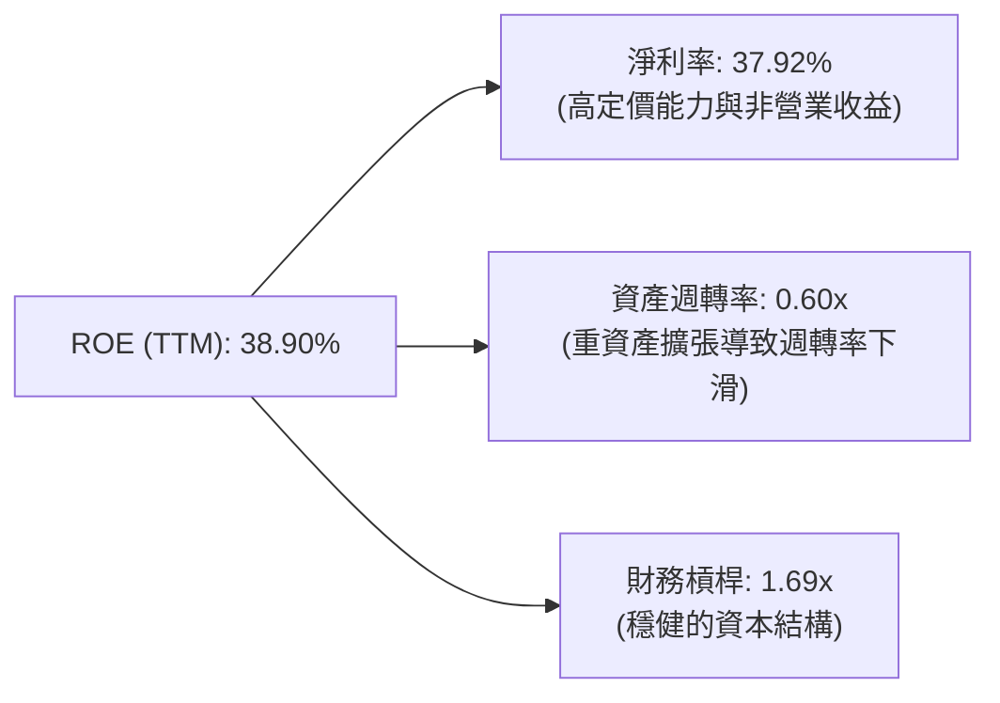

* **分析師點評**：
  Alphabet 的高 ROE（38.90%）主要是由**極高的淨利率（37.92%）**驅動，而非依賴高槓桿。然而，**資產週轉率從 2022 年的 0.77x 下滑至當前的 0.60x**，這再次印證了公司正在向「重資產」模式轉型，數據中心等未變現資產短期內拉低了資產使用效率。

### 6.4 獲利能力儀表板

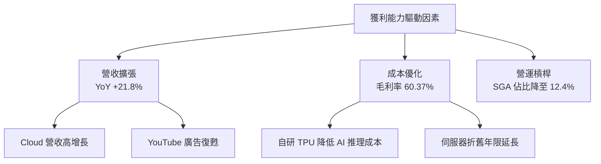

---

## 7. 估值深度分析

### 7.1 同業估值比較表格

我們選擇了微軟（MSFT）、Meta（META）和亞馬遜（AMZN）作為 Alphabet 的直接競爭對手進行橫向對比：

| 估值與財務指標 | **Alphabet (GOOG)** | **Microsoft (MSFT)** | **Meta (META)** | **Amazon (AMZN)** | GOOG 相對評估 |
|---|---|---|---|---|---|
| **Trailing P/E** | 26.25x | 35.50x | 28.20x | 41.10x | 🟢 估值最便宜 |
| **Forward P/E** | **23.47x** | 30.20x | 24.50x | 33.80x | 🟢 具備顯著投資性價比 |
| **PEG Ratio** | **1.36x** | 2.10x | 1.25x | 1.65x | 🟢 成長性調整後極具吸引力 |
| **EV / EBITDA** | **25.81x** | 24.20x | 18.50x | 20.10x | 🟡 由於 Capex 折舊尚未完全釋放，略顯溢價 |
| **P/S Ratio** | 9.95x | 13.50x | 8.80x | 3.10x | 🟡 處於合理區間 |
| **FCF Yield** | **1.53%** | 2.20% | 3.10% | 2.80% | 🔴 短期受 Capex 壓抑最嚴重 |

### 7.2 歷史估值區間分析

Alphabet 過去 5 年的歷史 P/E 區間主要介於 18x 至 32x 之間。當前 26.25x 的 Trailing P/E 和 23.47x 的 Forward P/E 處於歷史中樞偏下位置，並未出現泡沫化跡象。

```
╔══════════════════════════════════════════════════════════════════╗
║               Alphabet 歷史 P/E 區間與當前位置                   ║
╠══════════════════════════════════════════════════════════════════╣
║                                                                  ║
║  歷史最低：18.0x  ████░░░░░░░░░░░░░░░░░░░░░░░░░░░░               ║
║  歷史中樞：25.0x  ███████████████░░░░░░░░░░░░░░░░░               ║
║  當前 P/E：26.2x  ████████████████░░░░░░░░░░░░░░░░  ← 當前位置   ║
║  歷史最高：32.0x  ████████████████████████░░░░░░░░               ║
║                                                                  ║
║  📊 評估：當前估值合理，PEG 1.36x 顯示其未被市場過度高估         ║
╚══════════════════════════════════════════════════════════════════╝
```

### 7.3 情境目標價與假設驅動模型

為了確保目標價的嚴謹性，我們建立了以下三種情境假設模型（預測期：2026-2030）：

| 評估情境 | 5年營收 CAGR | 預期營業利益率 | 2030 退出 P/E | 隱含目標價 (12M) | 相對當前股價漲跌幅 | 觸發概率 |
|---|---|---|---|---|---|---|
| 🔴 **悲觀情境** | 6.0% | 28.0% | 18.0x | **$280.00** | -18.7% | 20% |
| 🟡 **基準情境** | **12.0%** | **34.0%** | **23.0x** | **$390.00** | **+13.2%** | **60%** |
| 🟢 **樂觀情境** | 16.0% | 38.0% | 26.0x | **$460.00** | +33.6% | 20% |

* **估值倍數選擇說明**：
  由於 Alphabet 正在經歷高強度的資本開支期，未來的折舊與攤銷（D&A）將大幅攀升，這會壓抑 GAAP 淨利潤並使 P/E 偏高。因此，我們在基準估值中同時參考了 **EV/EBITDA（目標 22.0x）** 與 **PEG（目標 1.35x）**，以確保估值模型能更真實地反映其現金流創造能力。

### 7.4 DCF 敏感性分析（目標價矩陣）

基於基準現金流預測，我們對 **WACC（折現率）** 與 **永續增長率 (g)** 進行了敏感性測試：

| 永續增長率 (g) \ WACC | WACC = 8.5% | **WACC = 9.0%（基準）** | WACC = 9.5% |
|---|---|---|---|
| **g = 3.5%** | $432.00 (+25.4%) | $408.00 (+18.5%) | $385.00 (+11.8%) |
| **g = 3.0%（基準）** | $412.00 (+19.6%) | **$390.00 (+13.2%)** | $368.00 (+6.8%) |
| **g = 2.5%** | $393.00 (+14.1%) | $372.00 (+8.0%) | $351.00 (+1.9%) |

### 7.5 估值綜合區間

```
╔══════════════════════════════════════════════════════════════════╗
║                     GOOG 估值區間分佈圖                          ║
╠══════════════════════════════════════════════════════════════════╣
║                                                                  ║
║  [ 悲觀 $280 ] <--- [ 當前 $344 ] ---> [ 基準 $390 ] ---> [ 樂觀 $460 ] ║
║                                                                  ║
║  📊 結論：當前股價 $344.42 顯著低於基準內在價值 $390.00，具備安全邊際║
╚══════════════════════════════════════════════════════════════════╝
```

---

## 8. 成長催化劑

### 8.1 成長催化劑時間軸

Alphabet 未來 3 年的成長將由以下關鍵事件驅動：

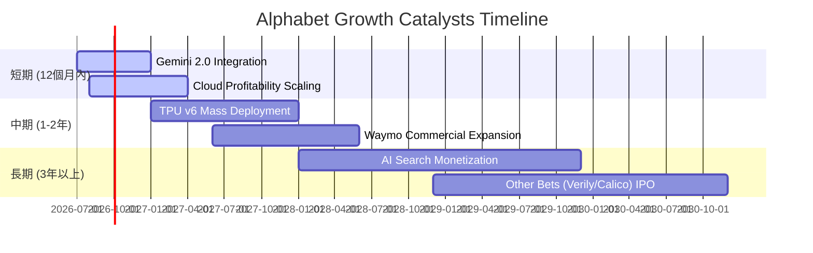

### 8.2 TAM（潛在市場規模）分析

Alphabet 正在積極將其業務版圖擴展至高增長的新興領域：

```
╔══════════════════════════════════════════════════════════════════╗
║               Alphabet 潛在市場規模 (TAM) 預估                   ║
╠══════════════════════════════════════════════════════════════════╣
║                                                                  ║
║  1. 數位廣告市場 (Digital Ads)： TAM $850B ｜ 滲透率 42% ｜ 龍頭地位║
║  2. 雲端計算與 AI 算力 (Cloud)： TAM $650B ｜ 滲透率 11% ｜ 高成長  ║
║  3. 自動駕駛與機器人 (Waymo)：  TAM $200B ｜ 滲透率 <1%  ｜ 潛力巨大║
║                                                                  ║
║  📊 綜合 TAM 複合年增長率 (CAGR)：+14.5%（至 2030 年）            ║
╚══════════════════════════════════════════════════════════════════╝
```

### 8.3 成長驅動力結構圖

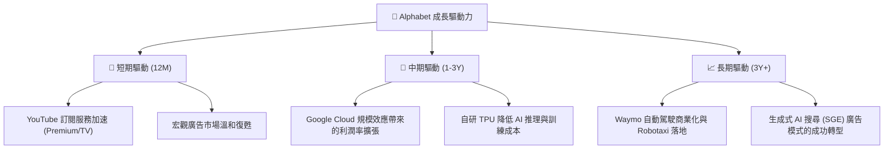

---

## 9. 風險矩陣

### 9.1 風險評估矩陣

我們對 Alphabet 面臨的潛在風險進行了機率與衝擊力的雙維度評估：

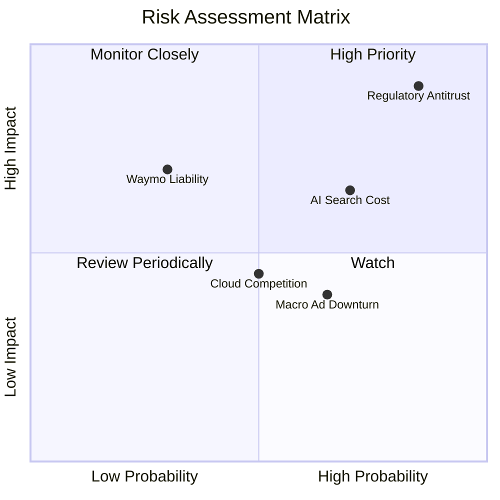

### 9.2 風險清單詳細分析

| # | 風險項目 | 發生機率 | 財務衝擊 | 風險評分 | 機構級緩解與應對措施 |
|---|---|---|---|---|---|
| 1 | 🔴 **司法部反壟斷訴訟與拆分** | 高 (85%) | 高 (-15% 估值溢價) | 🔴 **8.5 / 10** | **緩解措施**：Alphabet 可能通過主動分拆廣告技術業務（AdTech）或終止與 Apple 的排他性合約來達成和解，短期內會造成股價波動，但分拆可能釋放 YouTube 和 Cloud 的獨立價值。 |
| 2 | 🟡 **AI 搜尋成本侵蝕毛利率** | 中 (70%) | 中 (-3.0pp 毛利率) | 🟡 **6.5 / 10** | **緩解措施**：加速自研 TPU 部署。最新一代 TPU 在每瓦效能和性價比上顯著優於同類 GPU，能有效對沖 Gemini 伺服器運算成本。 |
| 3 | 🟡 **宏觀經濟衰退導致廣告主收緊預算** | 中 (65%) | 中 (-8% 營收增速) | 🟡 **6.0 / 10** | **緩解措施**：多元化營收結構。Google Cloud 的訂閱收入和 YouTube Premium 訂閱提供了非周期性的經常性收入（ARR），增強了抗風險能力。 |

---

## 10. 投資建議

### 10.1 最終綜合評級雷達

```
╔══════════════════════════════════════════════════════════════╗
║                  Alphabet 投資價值雷達圖                     ║
╠══════════════════════════════════════════════════════════════╣
║ 基本面強度：  9.5/10  ▓▓▓▓▓▓▓▓▓▓▓▓▓▓▓▓▓▓▓░  ★★★★★           ║
║ 成長前景：    8.5/10  ▓▓▓▓▓▓▓▓▓▓▓▓▓▓▓▓▓░░░  ★★★★☆           ║
║ 財務安全度：  9.5/10  ▓▓▓▓▓▓▓▓▓▓▓▓▓▓▓▓▓▓▓░  ★★★★★           ║
║ 估值吸引力：  7.5/10  ▓▓▓▓▓▓▓▓▓▓▓▓▓▓░░░░░░  ★★★★☆           ║
║ 資本效率 (ROIC)：9.0/10 ▓▓▓▓▓▓▓▓▓▓▓▓▓▓▓▓▓▓░░  ★★★★★           ║
╠══════════════════════════════════════════════════════════════╣
║ 綜合推薦：    🟢 買入 (Buy) ｜ 基準目標價 $390.00            ║
╚══════════════════════════════════════════════════════════════╝
```

### 10.2 目標價與預期回報率

| 投資情境 | 權重 | 目標價 | 當前股價 | 隱含回報率 | 期望回報率（加權） |
|---|---|---|---|---|---|
| **悲觀情境** | 20% | $280.00 | $344.42 | -18.7% | -3.74% |
| **基準情境** | **60%** | **$390.00** | **$344.42** | **+13.2%** | **+7.92%** |
| **樂觀情境** | 20% | $460.00 | $344.42 | +33.6% | +6.72% |
| **加權綜合內在價值** | **100%** | **$382.00** | **$344.42** | **+10.9%** | **+10.90%** |

### 10.3 買入時機與觸發因素

```
╔══════════════════════════════════════════════════════════════════╗
║                   ✅ 買入觸發因素 Checklist                     ║
╠══════════════════════════════════════════════════════════════════╣
║                                                                  ║
║  立即買入條件（符合 2 項以上即可建倉）：                         ║
║  ✅ Forward P/E 跌至 22.0x 以下（對應股價約 $320）               ║
║  ✅ Google Cloud 季度營收同比增速維持在 25% 以上                 ║
║  ✅ 季度營業利益率（Operating Margin）穩定在 32% 以上            ║
║                                                                  ║
║  加碼觸發條件：                                                  ║
║  ☐ 反壟斷訴訟迎來明確和解方案（消除市場最大不確定性）           ║
║  ☐ 自由現金流（FCF）因 Capex 增速放緩而出現結構性反彈            ║
║                                                                  ║
║  減碼/停損條件：                                                 ║
║  ☐ 核心搜尋業務市場份額連續兩季跌破 85%                          ║
║  ☐ 營業利益率因 AI 成本失控連續兩季跌破 28%                      ║
╚══════════════════════════════════════════════════════════════════╝
```

### 10.4 投資人適配度分析

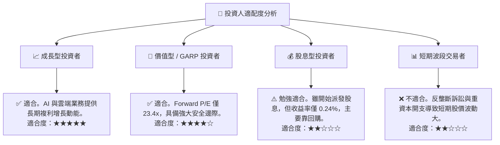

### 10.5 每季財報監控清單（Quarterly Watch List）

為了持續追蹤本投資報告的有效性，投資人應在每季財報中重點監控以下指標：

| 監控指標 | 基準值 (當前) | 加碼門檻 (看多) | 減碼門檻 (看空) | 監控邏輯與投資含義 |
|---|---|---|---|---|
| **Google Cloud 營收增速** | YoY +25.0% | > +28.0% | < +18.0% | 評估第二增長曲線的擴張速度與市場份額。 |
| **集團營業利益率 (OM)** | 36.1% | > 35.0% | < 30.0% | 監控 AI 基礎設施成本（折舊）是否開始侵蝕利潤。 |
| **季度資本支出 (Capex)** | $35.67B (Q1'26) | 穩定在 $30B-$35B | > $45B (且營收未加速) | 評估 AI 投資是否過度激進，導致資本效率下降。 |
| **搜尋引擎市佔率** | 91.2% | > 90.0% | < 85.0% | 核心護城河是否受生成式 AI 搜尋對手（如 Perplexity）侵蝕。 |

### 10.6 反面論證：什麼會證明投資論點錯誤？

```
╔══════════════════════════════════════════════════════════════════╗
║              ⚠️ 論點失效條件 (Disconfirming Evidence)            ║
╠══════════════════════════════════════════════════════════════════╣
║  如果出現以下任一量化條件，本報告的「買入」論點將失效，應果斷減碼：║
║                                                                  ║
║  ☐ 核心 Search 廣告收入連續兩季出現 YoY 負增長                   ║
║  ☐ 季度自由現金流（FCF）因 Capex 飆升而轉為負值                  ║
║  ☐ ROIC 跌破 15%（表明 AI 巨額投資無法創造超額資本回報）          ║
║  ☐ 司法部訴訟最終判決強制拆分 Google 核心 Search 與 Android 生態║
╚══════════════════════════════════════════════════════════════════╝
```

---

> **免責聲明**：本報告由 CFA 級模擬投資研究框架生成，所引用數據均基於 2026-07-22 之即時財務揭露。本報告僅供研究參考，不構成任何具體的投資建議。投資有風險，入市需謹慎。