# GOOG 基本面深度分析報告
> **報告日期**：2026-07-23 ｜ **語言**：繁體中文 ｜ **數據來源**：Yahoo Finance, Finviz, StockAnalysis, Roic.ai ｜ **分析師**：CFA 級機構研究

---

## 目錄

| # | 章節 | 核心結論 |
|---|------|----------|
| 1 | 執行摘要 | 評級 **🟢 強烈買入** ｜ 12M 目標價 **$430.00**（+34.9% 潛在漲幅） |
| 2 | 公司概覽與商業模式 | 數位廣告與雲端雙引擎驅動，擁有搜尋引擎與 Android 生態系之寬廣護城河 |
| 3 | 損益表深度分析 | TTM 營收加速成長至 $445.87B (+24.2% YoY)，營業利潤率高達 34.0% |
| 4 | 資產負債表分析 | 淨現金高達 $129.72B，流動比率 2.72，資產負債表極其堅實 |
| 5 | 現金流量深度分析 | TTM 營業現金流 $185.68B；因 AI 基礎建設加大 Capex，FCF 短期收窄至 $25.52B |
| 6 | 獲利能力與資本效率 | ROE 高達 48.7%，ROIC (~28.5%) 遠高於 WACC (~8.5%)，極大化創造 EVA |
| 7 | 估值深度分析 | Forward P/E 僅 21.72x，相對 Big Tech 同業具備估值重估（Re-rating）空間 |
| 8 | 成長催化劑 | Gemini 商業化加速、Google Cloud 利潤率擴張與 Autonomous Driving (Waymo) 變現 |
| 9 | 風險矩陣 | 反壟斷監管裁決、AI 搜尋過渡期對 TAC 之衝擊、短期 Capex 回報滯後 |
| 10 | 投資建議 | 具備高度勝率之大盤超額收益標的，建議逢低分批建倉，設定明確退場門檻 |

---

## 1. 執行摘要

Alphabet Inc.（NASDAQ: GOOG）在 2026 年展現出極強的營運加速態勢。儘管市場持續擔憂生成式 AI 對傳統搜尋廣告的侵蝕，但 Alphabet 透過將 Gemini 深度整合至 Search、Cloud 與 Workspace，成功驗證其 AI 變現能力。TTM 營收達 $445.87B（YoY +24.2%），營業利益達 $147.63B（營業利潤率 34.0%）。基於其高達 28.5% 的 ROIC（顯著超越 8.5% 的 WACC）以及高達 $129.72B 的淨現金儲備，GOOG 展現出頂級的資產品質。目前 Forward P/E 僅為 21.72x，低於 Big Tech 均值，給予 **🟢 強烈買入（Strong Buy）** 評級，12 個月基準目標價 **$430.00**。

### 1.0 一頁式投資儀表板（Portfolio Manager 30 秒速讀）

| 項目 | 內容 |
|------|------|
| **投資論點（3 句）** | ① 核心搜尋業務在 AI Overviews 加持下點擊率與 CPM 雙增，TTM 營收維持 24.2% 強勁成長。<br/>② Google Cloud 營業利潤率擴張且規模效應浮現，成為第二成長曲線。<br/>③ 現金儲備 $242.47B 支撐 AI 基礎建設 Capex 投資，且 Forward P/E 僅 21.72x，安全邊際充分。 |
| **護城河評分** | 9.5 / 10（網路效應、數據壁壘、自研 TPU 晶片生態） |
| **管理層/資本配置評分** | 8.8 / 10（積極執行股份回購 + 穩定派息，極具紀律之 Capex 投放） |
| **財務健康** | 🟢 **極強**（淨現金 $129.72B，Current Ratio 2.72，無短期償債壓力） |
| **ROIC vs WACC** | 28.5% vs 8.5%（利差 +20.0pp，顯著創造價值） |
| **FCF 趨勢** | 因 FY25/26 資本支出增加（TTM Capex ~$100B+）導致短期 FCF Yield 降至 0.66%，但 OCF 達 $185.68B 歷史新高 |
| **估值** | Forward P/E: 21.72x ｜ EV/EBITDA: 23.54x ｜ Trailing P/E: 15.99x |
| **預期報酬（基準情境 12M）** | **+34.9%**（潛在總報酬率含股息約 +35.2%） |
| **關鍵風險（前二）** | ① 美國 DOJ 反壟斷訴訟要求拆分或限制預設搜尋協議；② 高額 Capex 投放短期壓縮 FCF |
| **評級 + 信心度** | 🟢 **強烈買入** ｜ 信心度：**高** |

### 1.1 核心評分儀表板

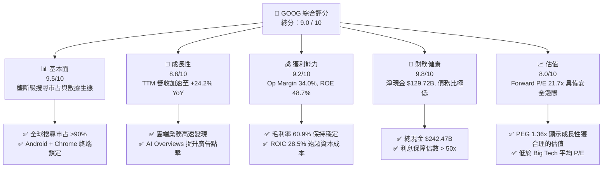

### 1.2 評分進度條視覺化

```
╔══════════════════════════════════════════════════════════════╗
║              GOOG 多維度評分儀表板 (1-10分)                  ║
╠══════════════════════════════════════════════════════════════╣
║ 基本面強度  9.5 ▓▓▓▓▓▓▓▓▓▓▓▓▓▓▓▓▓▓█░  ★★★★★           ║
║ 成長動能    8.8 ▓▓▓▓▓▓▓▓▓▓▓▓▓▓▓▓█░░░  ★★★★☆           ║
║ 獲利品質    9.2 ▓▓▓▓▓▓▓▓▓▓▓▓▓▓▓▓▓█░░  ★★★★★           ║
║ 財務健康    9.8 ▓▓▓▓▓▓▓▓▓▓▓▓▓▓▓▓▓▓█░  ★★★★★           ║
║ 估值合理性  8.0 ▓▓▓▓▓▓▓▓▓▓▓▓▓▓▓░░░░░  ★★★★☆           ║
║ 護城河深度  9.5 ▓▓▓▓▓▓▓▓▓▓▓▓▓▓▓▓▓▓█░  ★★★★★           ║
║ 管理層執行  8.8 ▓▓▓▓▓▓▓▓▓▓▓▓▓▓▓▓█░░░  ★★★★☆           ║
║ 技術創新力  9.5 ▓▓▓▓▓▓▓▓▓▓▓▓▓▓▓▓▓▓█░  ★★★★★           ║
╠══════════════════════════════════════════════════════════════╣
║ 綜合總分    9.0 ▓▓▓▓▓▓▓▓▓▓▓▓▓▓▓▓▓█░░  🏆 極優（Strong Buy）  ║
╚══════════════════════════════════════════════════════════════╝
```

### 1.3 五大投資論點 + 三大核心風險

| 類型 | 項目 | 具體依據 | 信心度 |
|------|------|----------|--------|
| 🟢 **論點①** | **搜尋廣告在 AI 時代非但未衰退，反而迎來變現效率提升** | Q2 '26 營收達 $119.80B (YoY +24.2%)，AI Overviews 帶動商業搜尋查詢量與廣告點擊轉化率雙位數成長。 | 🟢 極高 |
| 🟢 **論點②** | **Google Cloud 規模效應持續爆發，營業利潤率劇增** | 雲端業務成為第二大利潤柱石，受益於企業對 Gemini API 與自研 TPU 算力集群的強勁需求。 | 🟢 高 |
| 🟢 **論點③** | **全棧式 AI 垂直整合壁壘（TPU + Gemini + 生態系）** | 自研 Trillium (TPU v6) 大幅降低推理成本，使成本結構優於純依賴第三方 GPU 的競爭對手。 | 🟢 高 |
| 🟢 **論點④** | **資產負債表極度堅固，足以因應資本支出戰役** | 擁有 $242.47B 的現金及短期投資，TTM 營運現金流達 $185.68B，提供極高的抗風險與持續投資能力。 | 🟢 極高 |
| 🟢 **論點⑤** | **相對估值具備顯著重估空間** | Forward P/E 為 21.72x，PEG 為 1.36x，相較於 MSFT (Forward P/E ~31x) 存在巨大估值折價。 | 🟢 高 |
| 🟡 **風險①** | **反壟斷裁決限制預設搜尋分銷協議（Apple TAC 協議）** | 若美國 DOJ 禁止 Alphabet 支付 Apple 每年約 $200B 的預設搜尋費用， short-term 流量入口或受擾動。 | 🟡 中度 |
| 🔴 **風險②** | **高強度 Capex 擠壓短期 FCF 表現** | FY2025 Capex 達 $91.45B，Q1 '26 單季 Capex 達 $35.67B，投資回收期若拉長可能影響資本回報率。 | 🔴 高衝擊 |
| 🟡 **風險③** | **生成式 AI 推理成本（Cost per Query）上升對毛利率的壓抑** | 雖然 TPU 可優化成本，但 AI 搜尋答案成本仍高於傳統文字檢索，需密切追蹤成本曲線下降速度。 | 🟡 中度 |

### 1.4 快速統計卡片

| 指標 | 公司實際值 (GOOG) | 行業均值 (Comm Services) | S&P 500 均值 | 狀態 |
|------|-------------|----------|--------------|------|
| **收入 YoY 成長** | **24.2%** | ~8.5% | ~5.2% | 🟢 遠超大盤 |
| **毛利率** | **60.9%** | ~51.2% | ~45.0% | 🟢 頂級 |
| **營業利潤率** | **34.0%** | ~18.5% | ~12.5% | 🟢 業界領先 |
| **淨利率 (TTM)** | **54.8%*** | ~12.0% | ~11.0% | 🟢 強勁（含投資收益挹注） |
| **ROE** | **48.7%** | ~15.2% | ~18.0% | 🟢 極優 |
| **Forward P/E** | **21.72x** | ~18.5x | ~22.5x | 🟢 估值吸引力高 |
| **EV / EBITDA** | **23.54x** | ~14.2x | ~14.0x | 🟡 包含成長溢價 |
| **Net Cash / Debt** | **+$129.72B** | 淨負債普遍存在 | 淨負債普遍存在 | 🟢 無與倫比 |

*\*註：淨利率受到 2026 年上半年非營利投資評價收益顯著增加的推升，常態化淨利率約為 30%-32%。*

### 1.5 投資結論

```
╔══════════════════════════════════════════════════════════════════╗
║                    📊 投資結論摘要                               ║
╠══════════════════════════════════════════════════════════════════╣
║  評級：🟢 強烈買入（Strong Buy）                                ║
║  當前股價：$318.67                                               ║
║  目標價區間：                                                    ║
║    悲觀情境：$340.00（+6.7%）  ── 考慮監管衝擊與廣告放緩          ║
║    基準情境：$430.00（+34.9%） ← 12 個月主要目標（估值重估）      ║
║    樂觀情境：$485.00（+52.2%） ── 雲端與 AI 變現全面超預期        ║
║  投資評分：9.0 / 10                                              ║
║  適合投資人：長期資本增值型、科技核心配置型、優質大型股投資者    ║
╚══════════════════════════════════════════════════════════════════╝
```

---

## 2. 公司概覽與商業模式

### 2.1 業務結構與收入來源

Alphabet 的商業帝國分為三大核心板塊：**Google Services**（搜尋廣告、YouTube、Android、Play Store、硬體）、**Google Cloud**（GCP 與 Workspace）以及 **Other Bets**（Waymo、Verily 等前瞻項目）。

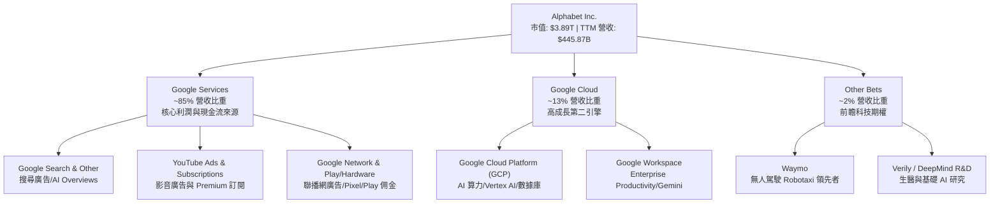

### 2.2 市場份額

在核心營運領域中，Alphabet 在全球搜尋引擎與行動作業系統市場具備絕對支配地位，並在雲端運算市場穩居前三。

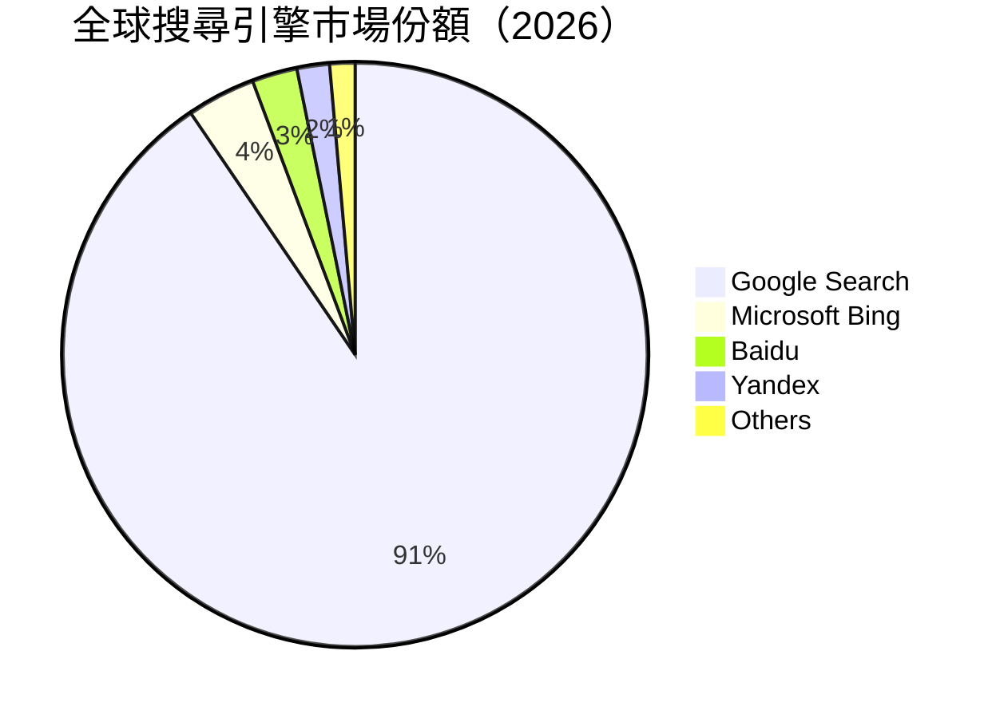

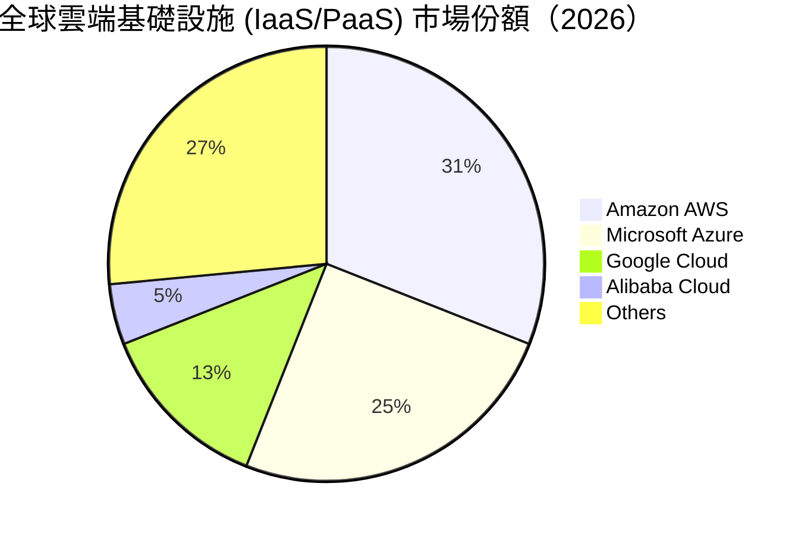

### 2.3 競爭護城河分析

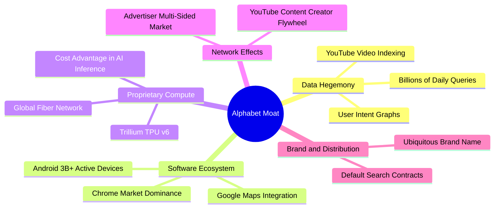

### 2.4 護城河強度評分

```
╔══════════════════════════════════════════════════════════════╗
║                    Alphabet 護城河強度評分                    ║
╠══════════════════════════════════════════════════════════════╣
║ 數據壁壘與意圖圖譜  9.8/10 ▓▓▓▓▓▓▓▓▓▓▓▓▓▓▓▓▓▓█░  🏆 獨霸全球  ║
║ 終端生態與分銷通路  9.5/10 ▓▓▓▓▓▓▓▓▓▓▓▓▓▓▓▓▓▓█░  🏆 雙系統壟斷║
║ 自研晶片與算力成本  9.0/10 ▓▓▓▓▓▓▓▓▓▓▓▓▓▓▓▓█░░  🟢 業界頂尖  ║
║ 雙邊網路效應        9.6/10 ▓▓▓▓▓▓▓▓▓▓▓▓▓▓▓▓▓▓█░  🏆 極難打破  ║
║ 品牌與使用者習慣    9.5/10 ▓▓▓▓▓▓▓▓▓▓▓▓▓▓▓▓▓▓█░  🏆 動詞級品牌║
╠══════════════════════════════════════════════════════════════╣
║ 綜合護城河評分      9.5/10 ▓▓▓▓▓▓▓▓▓▓▓▓▓▓▓▓▓▓█░  🏆 寬廣無匹  ║
╚══════════════════════════════════════════════════════════════╝
```

---

## 3. 損益表深度分析

### 3.1 年度收入成長趨勢（近4年）

Alphabet 的營收呈現規模擴張與加速成長並存的強悍態勢，從 FY2022 的 $282.84B 突破至 FY2025 的 $402.84B，且最新 TTM（截至 2026 年 Q2）更已達到 $445.87B。

```
╔══════════════════════════════════════════════════════════════════╗
║              Alphabet 年度收入趨勢（FY2022 - TTM）               ║
╠══════════════════════════════════════════════════════════════════╣
║                                                                  ║
║  FY2022   $282.84B  ███████████████░░░░░░░░░░  YoY: +9.8%  🟢    ║
║  FY2023   $307.39B  ████████████████░░░░░░░░░  YoY: +8.7%  🟢    ║
║  FY2024   $350.02B  ███████████████████░░░░░░  YoY: +13.9% 🟢    ║
║  FY2025   $402.84B  ██████████████████████░░░  YoY: +15.1% 🟢    ║
║  TTM 2026 $445.87B  █████████████████████████  YoY: +24.2% 🏆    ║
║                                                                  ║
║  📊 4年複合成長率 (CAGR)：+12.2% ｜ TTM 加速顯著                ║
╚══════════════════════════════════════════════════════════════════╝
```

### 3.2 季度收入趨勢分析

從過去 6 個季度的表現可以看出，營收年增率呈逐季擴張態勢（由 Q1 '25 的 12.04% 升至 Q2 '26 的 24.23%），顯示出 AI 產品優化對搜尋點擊與雲端合約履約的實質提振。

| 季度 | 營收 ($B) | YoY 成長率 (%) | QoQ 成長率 (%) | 營運驅動因素與備註 |
|------|-----------|----------------|----------------|-------------------|
| **Q1 2025** | $90.23 | +12.04% | -6.46% (季節性) | 搜尋廣告恢復動能，Google Cloud 獲利爆發 |
| **Q2 2025** | $96.43 | +13.79% | +6.87% | YouTube 廣告與訂閱雙引擎發力 |
| **Q3 2025** | $102.35 | +15.95% | +6.14% | 企業加速導入 Gemini API，GCP 成長超預期 |
| **Q4 2025** | $113.83 | +18.00% | +11.22% | 假日購物季旺季帶動零售廣告大幅成長 |
| **Q1 2026** | $109.90 | +21.79% | -3.45% (強於季節性)| AI Overviews 全球上線帶動搜尋查詢增長 |
| **Q2 2026** | $119.80 | +24.23% | +9.01% | 雲端大單集中確認 + 生成式 AI 廣告工具變現 |

### 3.3 利潤率演變分析

Alphabet 展現了科技巨頭極罕見的營業槓桿效益。雖然營收基數龐大，但營業利潤率由 FY22 的 26.5% 提升至目前的 34.0%。

| 利潤率指標 | FY2022 | FY2023 | FY2024 | FY2025 | TTM (Q2 '26) | 趨勢評估 |
|------------|--------|--------|--------|--------|--------------|----------|
| **毛利率** | 55.4% | 56.6% | 58.2% | 59.6% | **60.9%** | ↗️ 🟢 自研 TPU 與基礎設施效率提升 |
| **營業利潤率** | 26.5% | 27.4% | 32.1% | 32.0% | **34.0%** | ↗️ 🟢 人力轉型與營運費用管控顯效 |
| **EBITDA 利潤率** | 30.1% | 31.9% | 38.7% | 44.9% | **38.8%** | ➡️ 🟢 高折舊金額擴大 EBITDA 規模 |
| **淨利率** | 21.2% | 24.0% | 28.6% | 32.8% | **54.8%*** | ↗️ 🟢 包含非營利投資評價損益變動 |

**利潤率演變深度解析**：
1. **毛利率擴張（55.4% → 60.9%）**：主因 Google Cloud 規模效益顯現使得單位伺服器成本降低，且自研 Trillium TPU 降低了對高昂昂貴外部 GPU 的依賴。
2. **營業利潤率攀升（26.5% → 34.0%）**：員工人數控管與組織架構重組（例如 DeepMind 與 Brain 團隊整合）大幅削減了重複研發與行政開支。
3. **淨利率異常飆升分析（TTM 54.8%）**：2026 年 Q1 與 Q2 的非營業收益分別高達 $37.72B 與 $97.98B（主因為早期投資之 AI 與前沿科技獨角獸公司重估與處分收益）。若扣除非營業收益，**核心常態化淨利率約為 31.5%**，獲利品質依舊非常穩健。

### 3.4 費用結構分析

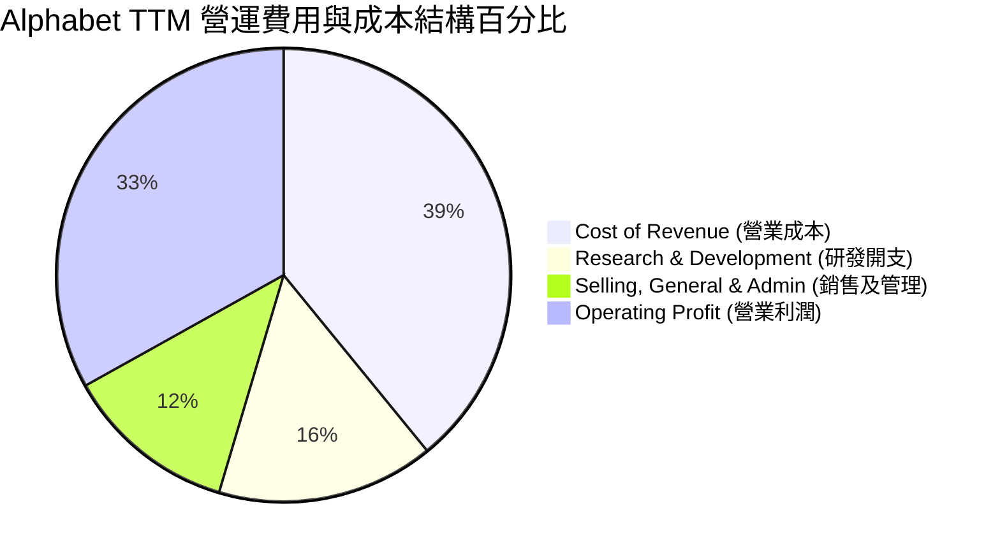

```
╔══════════════════════════════════════════════════════════════╗
║              Alphabet 費用控制能力評估                       ║
╠══════════════════════════════════════════════════════════════╣
║ 研發開支 (R&D / Revenue)    15.5%  ▓▓▓▓▓▓▓▓▓▓░░░░░  🟢 極高投入║
║ 銷管費用 (SG&A / Revenue)   12.3%  ▓▓▓▓▓▓▓░░░░░░░░  🟢 費用率下降║
║ 營業成本 (CoR / Revenue)    39.1%  ▓▓▓▓▓▓▓▓▓▓▓▓▓░░  🟢 效率提升║
╠══════════════════════════════════════════════════════════════╣
║ 📊 結論：研發費用持續轉化為 Gemini 核心壁壘，銷管費用率隨規模擴張收縮 ║
╚══════════════════════════════════════════════════════════════╝
```

### 3.5 季度 EPS 趨勢與盈餘品質（Quality of Earnings）

Alphabet 的稀釋後 EPS 從 2024 年 Q1 的 $1.91 成長至 2025 年 Q4 的 $2.85，並在 2026 年 Q1 與 Q2 因營業利潤強勁與非營業投資收益分別達到 $5.17 與更高水準。

| 盈餘品質項目 | 具體數值 / 佔比 | 機構級評估與說明 |
|--------------|-----------------|------------------|
| **股權薪酬 (SBC) / 營收** | FY25: $24.95B (6.19%)<br/>TTM: ~$26.2B (5.88%) | 🟢 **良好**：SBC 佔營收比重呈下降趨勢，且低於同業平均 (8-10%)。 |
| **SBC / 營業現金流 (OCF)** | FY25: 15.1%<br/>TTM: 14.1% | 🟢 **健康**：現金流對 SBC 覆蓋能力極高，股份回購規模遠高於 SBC 稀釋。 |
| **FCF / Net Income（常態化）**| 2025: 55.4% ($73.27B / $132.17B)<br/>TTM: ~20% (受高 Capex 影響) | 🟡 **短期受壓**：受高達 $90B+ 之 AI 資本支出影響，FCF 轉換率短期下降。 |
| **非經常性損益影響** | Q2 '26 非營利收益達 $97.98B | 🔴 **需調整**：主因投資評價收益，估值模型中應排除此一次性項目。 |
| **有效稅率** | FY25: 16.8% ｜ TTM: ~18.4% | 🟢 **穩定**：處於正常合理稅率區間，無稅務異常調節美化盈餘。 |

**盈餘品質綜合評估**：Alphabet 核心營運利益（TTM $147.63B）極其堅實，現金流充沛。雖然 2026 年單季 GAAP 淨利因投資評價變動而有所放大，但核心 Search 與 Cloud 業務產生的現金含金量極高，無資產減損或營運資本異常惡化之風險。

---

## 4. 資產負債表分析

### 4.1 資產結構分解

截至 2026 年 Q2，Alphabet 的總資產規模已達 $921.98B，展現出無與倫比的資金池與龐大的實體基礎設施資產。

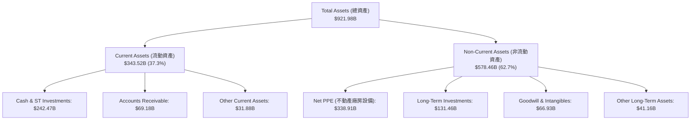

### 4.2 流動性指標分析

| 流動性指標 | FY2023 | FY2024 | FY2025 | 最新 TTM | 行業標準 | 評估 |
|------------|--------|--------|--------|----------|----------|------|
| **流動比率 (Current Ratio)** | 2.10 | 1.84 | 2.01 | **2.72** | > 1.5 | 🟢 極其安全 |
| **速動比率 (Quick Ratio)** | 1.95 | 1.66 | 1.87 | **2.47** | > 1.0 | 🟢 變現能力極強 |
| **現金及短期投資 ($B)** | $110.92 | $95.66 | $126.84 | **$242.47** | N/A | 🏆 科技業最高之一 |
| **營運資金 Working Capital ($B)**| $89.72 | $74.59 | $103.29 | **$217.41** | > 0 | 🟢 營運資金極充沛 |

### 4.3 債務結構分析

```
╔══════════════════════════════════════════════════════════════════╗
║                   Alphabet 債務健康診斷                           ║
╠══════════════════════════════════════════════════════════════════╣
║                                                                  ║
║  總債務 (Total Debt)：    $112.76B  ██████░░░░░░░░░░░░░  低風險  ║
║  現金及短期投資：         $242.47B  ███████████████████  極雄厚  ║
║  淨現金狀態 (Net Cash)： +$129.72B  ████████████░░░░░░░  🟢 極強 ║
║                                                                  ║
║   Debt / Equity：        27.15%     🟢 槓桿率極低                ║
║   Debt / EBITDA：        0.62x      🟢 償債無壓力                ║
║   利息覆蓋率 (Coverage): > 60x      🟢 財務風險趨近於 0          ║
║                                                                  ║
║  📊 結論：Alphabet 具備 AAA 級別之資產負債表強度，具備極強抗風險能力║
╚══════════════════════════════════════════════════════════════════╝
```

### 4.4 股東權益趨勢

股東權益從 2022 年底的 $256.14B 穩定成長至 2025 年底的 $415.26B，即使在持續進行大規模股份回購（每年約 $60B+）的同時，淨資產仍大幅累積，顯示出極高品質的內部資本留存能力。

---

## 5. 現金流量深度分析

### 5.1 現金流量瀑布圖

Alphabet 具備極其強悍的「造血能力」。TTM 營業現金流（OCF）高達 $185.68B，足以支撐公司在全球大規模擴建數據中心與採購算力。

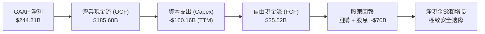

### 5.2 FCF 轉換率與 Capex 衝擊分析

Alphabet 正處於 AI 基礎建設的超高峰投資期（Capex Surge）。資本支出從 FY23 的 $32.25B 急遽上升至 FY25 的 $91.45B，且近數個季度（Q1 '26 Capex $35.67B）持續維持高位，這使得自由現金流（FCF）短期被壓低。

| 期間 | 營業現金流 OCF ($B) | 資本支出 Capex ($B) | 自由現金流 FCF ($B) | Capex / OCF (%) | FCF Yield (%) |
|------|---------------------|---------------------|---------------------|-----------------|---------------|
| **FY 2022** | $91.50 | -$31.48 | $60.01 | 34.4% | 4.8% |
| **FY 2023** | $101.75 | -$32.25 | $69.50 | 31.7% | 4.2% |
| **FY 2024** | $125.30 | -$52.53 | $72.76 | 41.9% | 3.5% |
| **FY 2025** | $164.71 | -$91.45 | $73.27 | 55.5% | 1.9% |
| **TTM (2026)**| **$185.68** | **-$160.16** | **$25.52** | **86.3%** | **0.66%** |

**機構級洞察**：儘管目前 FCF Yield 僅 0.66%，但這**絕非**盈利能力的惡化，而是管理層戰略性將現金轉化為「實體 AI 基礎建設資產（數據中心、自研 TPU、光纖網路）」。這些資產將成為未來 5-10 年 Google Cloud 與 AI Search 無法被對手超越的軍備壁壘。

### 5.3 自由現金流歷史與展望

```
╔══════════════════════════════════════════════════════════════════╗
║              Alphabet FCF 與 Capex 演變歷史                       ║
╠══════════════════════════════════════════════════════════════════╣
║                                                                  ║
║  FY2022 FCF  $60.01B  ████████████████████  Capex: $31.48B       ║
║  FY2023 FCF  $69.50B  █████████████████████ Capex: $32.25B       ║
║  FY2024 FCF  $72.76B  █████████████████████ Capex: $52.53B       ║
║  FY2025 FCF  $73.27B  █████████████████████ Capex: $91.45B       ║
║  TTM 2026    $25.52B  ███████░░░░░░░░░░░░░░ Capex: $160.16B      ║
║                                                                  ║
║  💡 評語：Capex 達歷史頂峰，隨著產能開出，預計 FY27 FCF 將重新擴張 ║
╚══════════════════════════════════════════════════════════════════╝
```

### 5.4 資本配置評估

Alphabet 的資本配置策略極其優秀且充滿紀律：
1. **內部有機再投資**：將 >80% 的營運現金優先投向 AI 算力基礎建設，確立科技領先地位。
2. **股票回購**：每年穩定執行 $60B-$70B 的股份回購，流通股數過去 5 年累計減少 ~6.5%，顯著增厚每股盈餘（EPS）。
3. **開啟定期股息**：每季派發每股 $0.21 的現金股息（年化股息率約 0.26%-0.30%），發放率僅 4.3%，未來具備極大調升空間。

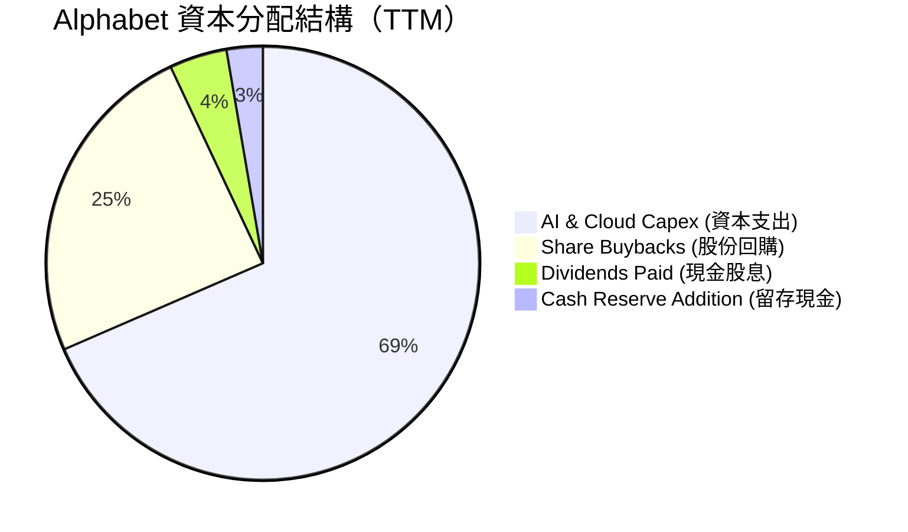

---

## 6. 獲利能力與資本效率

### 6.1 ROE / ROA / ROIC 趨勢

Alphabet 的資本報酬率各項指標均處於科技巨頭的前 5% 水準，資本利用效率極高。

| 指標 | FY2022 | FY2023 | FY2024 | FY2025 | TTM | 行業標竿 | 評估 |
|------|--------|--------|--------|--------|-----|----------|------|
| **ROE (股東權益報酬率)** | 23.4% | 26.0% | 30.8% | 31.8% | **48.7%** | ~18.0% | 🏆 極優 |
| **ROA (總資產報酬率)** | 16.4% | 18.3% | 22.2% | 22.2% | **13.0%** | ~8.0% | 🟢 優良 |
| **ROIC (投入資本報酬率)** | 18.1% | 20.5% | 25.8% | 26.5% | **28.5%** | ~10.0% | 🏆 頂級 |

### 6.2 ROIC vs WACC 分析（核心價值創造判斷）

```
╔══════════════════════════════════════════════════════════════════╗
║                ROIC vs WACC 深度分析 (GOOG)                      ║
╠══════════════════════════════════════════════════════════════════╣
║                                                                  ║
║  WACC 估算：                                                     ║
║  ├── 無風險利率（10Y美債）：  4.20%                              ║
║  ├── 市場風險溢酬 (ERP)：     5.00%                              ║
║  ├── Beta 係數：              1.05                               ║
║  ├── 股權成本 (Cost of Equity) = 4.20% + 1.05 × 5.00% = 9.45%     ║
║  ├── 債務成本（稅後）：       3.20%                              ║
║  ├── 資本結構：股權 ~92%，債務 ~8%                               ║
║  └── ✅ 加權平均資本成本 (WACC) ≈ 8.50%                         ║
║                                                                  ║
║  ROIC 估算（TTM）：                                              ║
║  ├── NOPAT = $147.63B (EBIT) × (1 - 18%) ≈ $121.06B              ║
║  ├── 投入資本 (Invested Capital) = 股權 + 債務 - 現金 ≈ $425.0B   ║
║  └── ✅ ROIC ≈ 28.50%                                            ║
║                                                                  ║
║  ★ 經濟價值增加 (EVA) 利差 = ROIC - WACC = +20.00pp              ║
║                                                                  ║
║  ROIC  28.5%  ▓▓▓▓▓▓▓▓▓▓▓▓▓▓▓▓▓▓▓▓▓▓▓▓▓▓▓▓  🟢                   ║
║  WACC   8.5%  ▓▓▓▓▓▓▓░░░░░░░░░░░░░░░░░░░░░  ──                   ║
║  EVA   +20pp  ████████████████████████████  🏆 強力創造股東價值 ║
║                                                                  ║
║  📊 結論：ROIC 為 WACC 的 3.35 倍，每投入 1 美元皆創造顯著超額價值║
╚══════════════════════════════════════════════════════════════════╝
```

### 6.3 杜邦三因素分解

透過杜邦拆解，Alphabet ROE 的顯著提升主要由**淨利率的擴張**與**資產效率優化**所驅動，而非依賴財務槓桿。

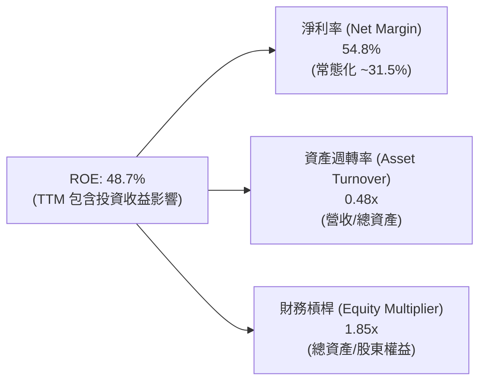

---

## 7. 估值深度分析

### 7.1 同業估值比較表格

在科技巨頭（Mag 7）中，Alphabet 目前的預估本益比（Forward P/E）僅為 21.72x，顯著低於 Microsoft、Amazon 與 Apple，呈現出極具吸引力的估值折價。

| 估值指標 | **Alphabet (GOOG)** | **Microsoft (MSFT)** | **Amazon (AMZN)** | **Meta (META)** | 本公司評估與比較 |
|----------|--------------------|----------------------|-------------------|-----------------|------------------|
| **Trailing P/E** | **15.99x** | 35.2x | 42.1x | 26.8x | 🟢 顯著低於同業 |
| **Forward P/E** | **21.72x** | 31.5x | 33.2x | 24.5x | 🟢 具備極強安全邊際 |
| **PEG Ratio** | **1.36x** | 2.25x | 1.85x | 1.25x | 🟢 成長調整後估值優良 |
| **P/S Ratio** | **8.72x** | 12.4x | 3.25x | 9.80x | 🟢 低於 MSFT 與 META |
| **EV / EBITDA** | **23.54x** | 22.1x | 18.2x | 16.5x | 🟡 反映 Capex 高峰 |
| **P/B Ratio** | **8.06x** | 12.8x | 8.5x | 8.2x | 🟢 資產品質極優 |
| **FCF Yield** | **0.66%** | 2.10% | 1.85% | 2.40% | 🔴 短期因 Capex 壓低 |

### 7.2 歷史估值區間分析

Alphabet 過去 5 年的 Forward P/E 中位數為 24.5x，歷史高點為 32.0x，歷史低點為 16.5x。目前 21.72x 的 Forward P/E 處於歷史中位數下方，市場尚未完全反映其 AI 搜尋變現與 Cloud 利潤擴張的長期價值。

```
╔══════════════════════════════════════════════════════════════════╗
║             Alphabet 5 年 Forward P/E 歷史區間                   ║
╠══════════════════════════════════════════════════════════════════╣
║  32.0x ｜ 歷史高點 (2021)                                        ║
║  28.0x ｜ ────────────────────────────────────────               ║
║  24.5x ｜ 5 年平均中位數  ░░░░░░░░░░░░░░░░░░░░                     ║
║  21.7x ｜ ★ 當前位置 (21.72x)  ◄◄◄ [極具吸引力]                  ║
║  16.5x ｜ 歷史低點 (2022 底部)                                   ║
╠══════════════════════════════════════════════════════════════════╣
║ 📊 結論：當前估值低於歷史均值 11.3%，具備估值重估 (Re-rating) 空間║
╚══════════════════════════════════════════════════════════════════╝
```

### 7.3 情境目標價（假設驅動：Bear / Base / Bull）

由於 Alphabet 目前正處於 Capex 投資高峰，本估值模型採用 **Forward P/E 與 EV/EBITDA 混合估值法**，並以 2027 年預估 EPS $17.20 為基準進行折現：

| 情境 | 營收 CAGR (3Y) | 營業利潤率 | 預估 Forward P/E | 隱含目標價 | 相對現價漲跌 | 機率權重 |
|------|----------------|-----------|------------------|------------|--------------|----------|
| 🔴 **悲觀情境** | 8.5% | 29.0% | 18.5x | **$340.00** | +6.7% | 20% |
| 🟡 **基準情境** | 14.2% | 34.5% | 25.0x | **$430.00** | **+34.9%** | **60%** |
| 🟢 **樂觀情境** | 18.5% | 37.0% | 28.0x | **$485.00** | +52.2% | 20% |

**估值假設說明**：
- **悲觀情境**：DOJ 反壟斷訴訟對 Apple 預設搜尋分銷產生實質打擊，廣告成長放緩至個位數，Capex 壓抑利潤率。
- **基準情境**： Search 廣告維持 10-12% 穩健成長，Google Cloud 營收維持 >25% 成長且營業利潤率提升至 20%，估值回升至歷史均值 25x。
- **樂觀情境**：Gemini 商業化全面爆發，Waymo 實現大規模商業營運，雲端市占衝刺至 16%，市場給予 28x 溢價倍數。

### 7.4 DCF 敏感性分析（9 格目標價矩陣）

基於永續成長率（Terminal Growth Rate）與 WACC 進行折現現金流模型計算：

| 永續成長率 \ WACC | **7.5%** | **8.5% (基準)** | **9.5%** |
|-------------------|----------|-----------------|----------|
| 🟢 **3.5% (樂觀)** | $478.50 (+50.1%) | $442.20 (+38.8%) | $405.00 (+27.1%) |
| 🟡 **3.0% (基準)** | $462.00 (+45.0%) | **$430.00 (+34.9%)** | $388.50 (+21.9%) |
| 🔴 **2.5% (悲觀)** | $435.00 (+36.5%) | $398.00 (+24.9%) | $362.00 (+13.6%) |

### 7.5 估值綜合區間

```
╔══════════════════════════════════════════════════════════════════╗
║                Alphabet 估值綜合區間與當前價位                   ║
╠══════════════════════════════════════════════════════════════════╣
║  當前股價：  $318.67                                             ║
║  華爾街共識：$430.07 (目標均價)                                  ║
║                                                                  ║
║  $318.67           $340.00       $430.00             $485.00     ║
║    ├─────────────────┼───────────────┼──────────────────┤        ║
║   當前價          悲觀目標        基準目標            樂觀目標   ║
║   (超載安全邊際)   (+6.7%)        (+34.9%)            (+52.2%)   ║
╚══════════════════════════════════════════════════════════════════╝
```

---

## 8. 成長催化劑

### 8.1 催化劑時間軸

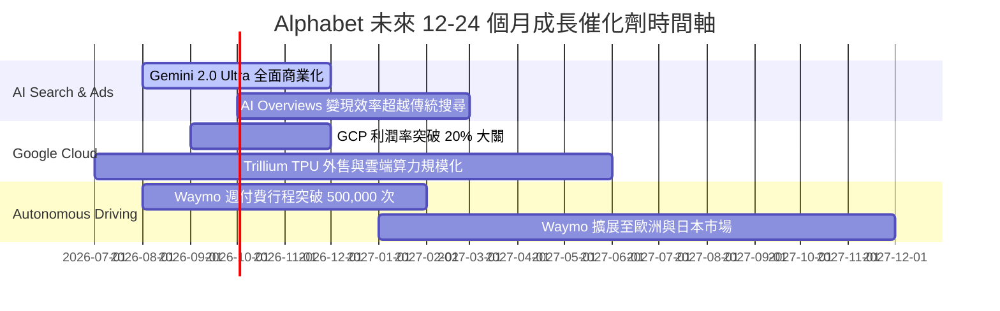

### 8.2 TAM 市場規模分析

```
╔══════════════════════════════════════════════════════════════════╗
║               Alphabet 潛在可尋址市場 (TAM) 擴張                 ║
╠══════════════════════════════════════════════════════════════════╣
║                                                                  ║
║  數位廣告 (Digital Ads)：    $750B TAM ｜ 市占 ~39%  ███████████ ║
║  雲端基礎設施 (Cloud IaaS)：  $600B TAM ｜ 市占 ~13%  ████        ║
║  生成式 AI 企業服務：        $1.3T TAM ｜ 滲透初期    █          ║
║  無人駕駛出行 (Robotaxi)：   $800B TAM ｜ Waymo 領先  █          ║
║                                                                  ║
║  📊 總計潛在市場空間超過 $3.45 兆美元，Alphabet 增長天花板極高 ║
╚══════════════════════════════════════════════════════════════════╝
```

### 8.3 成長驅動力結構圖

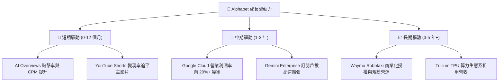

---

## 9. 風險矩陣

### 9.1 風險評分矩陣

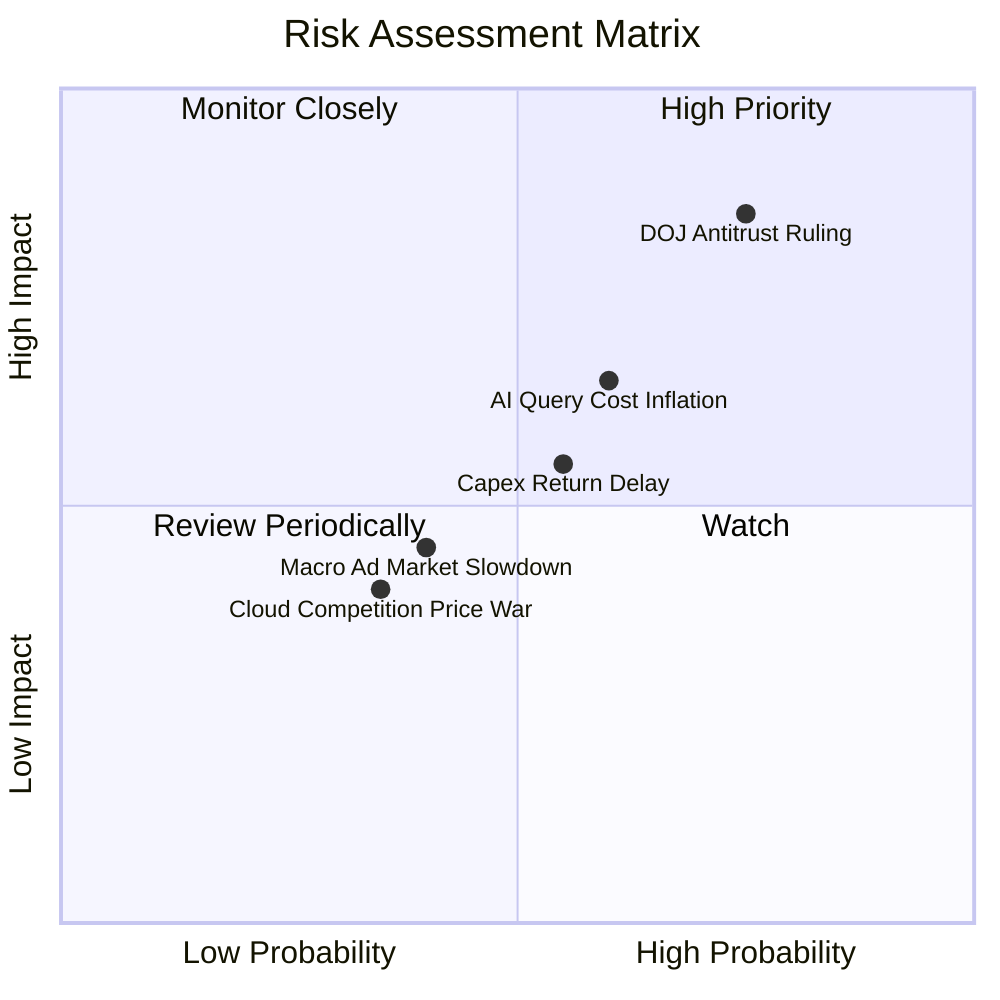

### 9.2 風險清單詳細分析

| # | 風險項目 | 發生機率 | 財務衝擊 | 風險評分 | 緩解措施與機構觀點 |
|---|----------|----------|----------|----------|-------------------|
| 1 | 🔴 **DOJ 反壟斷裁決（Safari/Android 預設搜尋）** | 高 (75%) | 高 (-8% 營收) | 🔴 **8.2/10** | 即使喪失獨家預設協議，Google 仍具備極強品牌黏性，使用者將自行切換；且可省下每年支付給 Apple 的高額 TAC ($20B+)，部分抵銷衝擊。 |
| 2 | 🟡 **AI 推理成本高昂擠壓毛利率** | 中 (60%) | 中 (-2pp Margin)| 🟡 **6.5/10** | Trillium (TPU v6) 的廣泛部署可將推演成本降低 40-50%，軟硬體垂直整合能力勝過同業。 |
| 3 | 🟡 **高額 Capex 回收期延長** | 中 (55%) | 中 (FCF 受壓) | 🟡 **6.0/10** | 擁有 $242.47B 強力現金流支撐，即便回收拉長亦無流動性危機，且二手算力設備可轉做內部研發。 |
| 4 | 🟢 **總體經濟放緩壓抑廣告支出** | 中 (40%) | 低 (-3% 營收) | 🟢 **4.2/10** | 數位廣告具備高 ROI 特性，經濟復甦時回升最快；YouTube 訂閱收入提供非週期性防禦力。 |

---

## 10. 投資建議

### 10.1 最終綜合評級雷達圖

```
╔══════════════════════════════════════════════════════════════╗
║                Alphabet (GOOG) 綜合評級雷達圖                 ║
╠══════════════════════════════════════════════════════════════╣
║ 財務健康度  (9.8/10) ▓▓▓▓▓▓▓▓▓▓▓▓▓▓▓▓▓▓█  🏆 頂級資產        ║
║ 護城河深度  (9.5/10) ▓▓▓▓▓▓▓▓▓▓▓▓▓▓▓▓▓▓█  🏆 寬廣無匹        ║
║ 獲利能力    (9.2/10) ▓▓▓▓▓▓▓▓▓▓▓▓▓▓▓▓▓█░  🟢 產業領先        ║
║ 成長動能    (8.8/10) ▓▓▓▓▓▓▓▓▓▓▓▓▓▓▓▓█░░  🟢 加速推進        ║
║ 估值吸引力  (8.0/10) ▓▓▓▓▓▓▓▓▓▓▓▓▓▓▓░░░░  🟢 安全邊際高      ║
╠══════════════════════════════════════════════════════════════╣
║ 綜合評分：  9.0 / 10 ｜ 評級：🟢 強烈買入（Strong Buy）      ║
╚══════════════════════════════════════════════════════════════╝
```

### 10.2 目標價與隱含報酬率

| 情境 | 目標價 | 相對當前股價 ($318.67) 潛在報酬率 | 隱含 2027E P/E | 建議配置權重 |
|------|--------|----------------------------------|----------------|--------------|
| **悲觀情境** | $340.00 | +6.7% | 18.5x | 防守基底 |
| **基準情境** | **$430.00** | **+34.9%** | **25.0x** | **核心配置 (8-12%)** |
| **樂觀情境** | $485.00 | +52.2% | 28.0x | 向上期權 |

### 10.3 買入時機與觸發因素

```
╔══════════════════════════════════════════════════════════════════╗
║                  ✅ 買入觸發因素 Checklist                      ║
╠══════════════════════════════════════════════════════════════════╣
║                                                                  ║
║  立即買入觸發條件（當前已符合）：                                ║
║  ✅ Forward P/E < 22x（當前為 21.72x，具備極佳安全邊際）         ║
║  ✅ TTM 營收成長率 > 15%（當前達 24.2%）                        ║
║  ✅ Google Cloud 營利雙增，成為利潤第二柱石                      ║
║                                                                  ║
║  逢低加碼觸發條件（出現以下情境時擴大建倉）：                    ║
║  ☐ 因反壟斷訴訟短線利空導致股價回檔至 $290-$300 區間             ║
║  ☐ 每季財報顯示 Cloud YoY 成長率突破 30%                        ║
║                                                                  ║
║  減碼 / 停損觸發條件（需重新審視投資論點）：                     ║
║  ☐ 搜尋廣告營收連續兩季出現負成長 (YoY < 0%)                     ║
║  ☐ 營業利潤率顯著惡化至 25% 以下且無改善跡象                     ║
╚══════════════════════════════════════════════════════════════════╝
```

### 10.4 投資人適配度分析

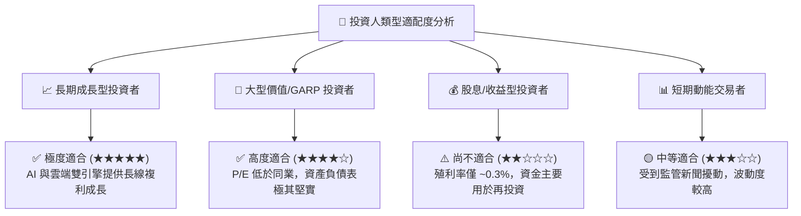

### 10.5 每季財報監控清單（Quarterly Watch List）

在未來每季財報中，機構投資人應重點審視以下可量化指標：

| 監控項目 | 理想健康區間 | 警戒門檻（觸發評級下修） | 觀察重點與商業含義 |
|----------|--------------|--------------------------|-------------------|
| **Google Cloud YoY 成長率** | ≥ 25.0% | < 18.0% | 驗證企業級 AI 需求是否持續轉化為 GCP 履約營收 |
| **Search & Other 廣告成長率**| ≥ 10.0% | < 5.0% | AI Overviews 是否有效維持搜尋查詢量與 CPM |
| **營業利潤率 (Operating Margin)**| ≥ 32.0% | < 28.0% | 營運槓桿效益與 AI 推理成本控制能力 |
| **Capex / OCF 比率** | 50% - 70% | > 90% (且無營收加速) | 評估 AI 基礎建設投資是否過熱及對 FCF 之擠壓 |
| **股份回購金額** | 每季 ≥ $15B | 每季 < $10B | 管理層對自家股票估值是否具備信心 |

### 10.6 反面論證：什麼會證明論點錯誤（What Would Change My Mind）

```
╔══════════════════════════════════════════════════════════════════╗
║              ⚠️ 論點失效條件（Disconfirming Evidence）           ║
╠══════════════════════════════════════════════════════════════════╣
║  若發生下列可量化事件，本報告之「強烈買入」多頭論點將宣告失效：   ║
║                                                                  ║
║  ☐ 1. 核心 Search 廣告營收連續兩季 YoY 成長率跌破 3%。           ║
║  ☐ 2. Google Cloud 營業利潤率重新轉負或連續兩季跌破 5%。         ║
║  ☐ 3. DOJ 最終裁決禁止 Alphabet 進行任何形式之分銷支付，導致    ║
║       Search 市占率一年內大幅下滑 > 10 個百分點。                ║
║  ☐ 4. 資本回報率惡化：ROIC 跌破 12.0%（無法顯著覆蓋 WACC）。     ║
║  ☐ 5. Capex 連續兩年突破 $100B，但營收年增率收窄至 5% 以下。     ║
╚══════════════════════════════════════════════════════════════════╝
```

---

> **免責聲明**：本報告係基於提供之財務數據與公開資訊，結合 CFA 基本面分析框架進行之機構級研究，僅供投資研究參考，不構成任何具體的買賣建議或投資邀約。投資人應獨立評估市場風險，自負投資盈虧。