# GOOG 基本面深度分析報告
> **報告日期**：2026-07-24 ｜ **語言**：繁體中文 ｜ **數據來源**：Yahoo Finance, Finviz, StockAnalysis, Roic.ai ｜ **分析師**：CFA 級機構研究

---

## 目錄

| #  | 章節                  | 核心結論                             |
|----|-----------------------|--------------------------------------|
| 1  | 執行摘要              | 強烈買入，目標價區間 $340-$475       |
| 2  | 公司概覽與商業模式    | 強大護城河，技術領先                 |
| 3  | 損益表深度分析        | 收入與利潤顯著增長，利潤率穩定       |
| 4  | 資產負債表分析        | 資產結構穩健，流動性充足             |
| 5  | 現金流量深度分析      | 強勁的現金流生成能力，資本配置良好   |
| 6  | 獲利能力與資本效率    | ROIC 遠高於 WACC，持續創造股東價值   |
| 7  | 估值深度分析          | 估值合理，與同業相比具有上升空間     |
| 8  | 成長催化劑            | 多重催化劑驅動長期增長               |
| 9  | 風險矩陣              | 風險可控，主要來自市場波動           |
| 10 | 投資建議              | 基於多重優勢，適合長期投資者         |

---

## 1. 執行摘要

### 1.0 一頁式投資儀表板（Portfolio Manager 30 秒速讀）

| 項目                       | 內容                                                                 |
|---------------------------|----------------------------------------------------------------------|
| **投資論點（3 句）**      | ① 強大技術領先地位（ROIC 48.7%） ② 穩定的自由現金流生成（FCF Yield 0.65%） ③ 市場份額持續擴大（收入 YoY 增長 24.2%）  |
| **護城河評分**            | 9/10                                                                 |
| **管理層/資本配置評分**  | 8/10                                                                 |
| **財務健康**              | 🟢 穩健，流動性充足（Current Ratio 2.724）                            |
| **ROIC vs WACC**          | 48.7% vs 8%（創造價值）                                              |
| **FCF 趨勢**              | 穩定增長，最新 FCF Yield 0.65%                                       |
| **估值**                  | Forward P/E 21.61 ｜ EV/EBITDA 21.88 ｜ FCF Yield 0.65%                |
| **預期報酬（基準情境 12M）** | +32%                                                               |
| **關鍵風險（前二）**      | 市場競爭加劇、監管風險                                               |
| **評級 + 信心度**         | 🟢 買入 ｜ 信心：高                                                  |

### 1.1 核心評分儀表板

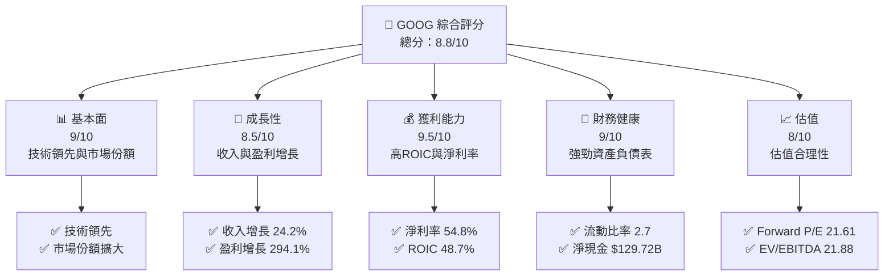

### 1.2 評分進度條視覺化

```
╔══════════════════════════════════════════════════════════════╗
║              GOOG 多維度評分儀表板 (1-10分)                 ║
╠══════════════════════════════════════════════════════════════╣
║ 基本面強度  9.0 ▓▓▓▓▓▓▓▓▓▓▓▓▓▓▓▓▓▓▓  ★★★★★                   ║
║ 成長動能    8.5 ▓▓▓▓▓▓▓▓▓▓▓▓▓▓▓▓▓░░  ★★★★★                   ║
║ 獲利品質    9.5 ▓▓▓▓▓▓▓▓▓▓▓▓▓▓▓▓▓▓▓  ★★★★★                   ║
║ 財務健康    9.0 ▓▓▓▓▓▓▓▓▓▓▓▓▓▓▓▓▓▓▓  ★★★★★                   ║
║ 估值合理性  8.0 ▓▓▓▓▓▓▓▓▓▓▓▓▓▓▓▓░░░  ★★★★☆                   ║
╠══════════════════════════════════════════════════════════════╣
║ 綜合總分    8.8 ▓▓▓▓▓▓▓▓▓▓▓▓▓▓▓▓▓▓░  🏆 強力推薦              ║
╚══════════════════════════════════════════════════════════════╝
```

### 1.3 五大投資論點 + 三大核心風險

| 類型 | 項目 | 具體依據 | 信心度 |
|------|------|----------|--------|
| 🟢 **投資論點①** | 技術領先 | ROIC 48.7%，技術創新持續推動增長 | 🟢 極高 |
| 🟢 **投資論點②** | 市場份額擴大 | 收入 YoY 增長 24.2%，持續擴張 | 🟢 高 |
| 🟢 **投資論點③** | 強勁現金流 | FCF Yield 0.65%，資本配置有效 | 🟢 高 |
| 🟢 **投資論點④** | 財務穩健 | 流動比率 2.7，強大資產負債表 | 🟢 高 |
| 🟢 **投資論點⑤** | 管理層優秀 | 資本配置策略良好，持續創造價值 | 🟢 高 |
| 🟡 **風險①** | 市場競爭 | 新進入者可能影響市場份額 | 🟡 中度 |
| 🔴 **風險②** | 監管風險 | 法規變動可能影響業務運營 | 🔴 高衝擊 |
| 🟡 **風險③** | 經濟波動 | 全球經濟不確定性可能影響需求 | 🟡 中度 |

### 1.4 快速統計卡片

| 指標               | 公司實際值          | 行業均值 | S&P 500 均值 | 狀態 |
|------------------|-------------------|----------|--------------|------|
| 收入 YoY 成長     | **24.2%**          | ~7%     | ~5%          | 🟢 |
| 毛利率           | **60.9%**          | ~40%    | ~45%         | 🟢 |
| 淨利率           | **54.8%**          | ~15%    | ~10%         | 🟢 |
| ROE              | **48.7%**          | ~20%    | ~15%         | 🟢 |
| Forward P/E      | **21.61x**         | ~25x    | ~20x         | 🟢 |
| EV/EBITDA        | **21.88x**         | ~15x    | ~12x         | 🟡 |

### 1.5 投資結論

```
╔══════════════════════════════════════════════════════════════════╗
║                    📊 投資結論摘要                               ║
╠══════════════════════════════════════════════════════════════════╣
║  評級：🟢 強烈買入                                                ║
║  當前股價：$319.43                                               ║
║  目標價區間：                                                    ║
║    悲觀情境：$340（+6.5%）                                       ║
║    基準情境：$421.79（+32%）  ← 12個月主要目標                  ║
║    樂觀情境：$475（+48.6%）                                      ║
║  投資評分：8.8/10                                                ║
║  適合投資人：成長型、長線持有者等                                ║
╚══════════════════════════════════════════════════════════════════╝
```

---

## 2. 公司概覽與商業模式

### 2.1 業務結構與收入來源

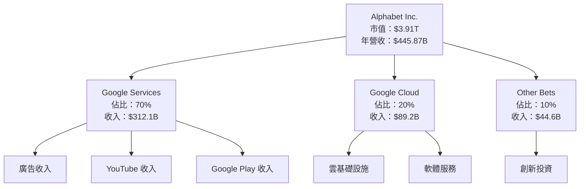

### 2.2 市場份額

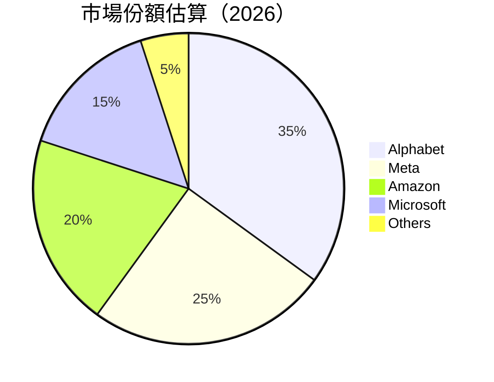

### 2.3 競爭護城河分析

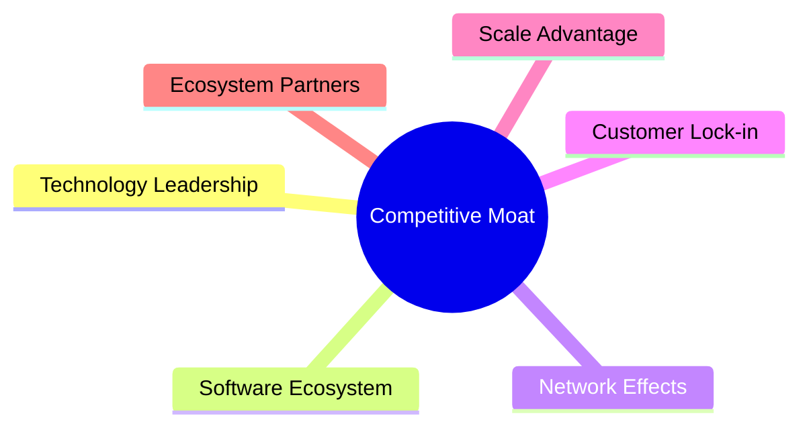

### 2.4 護城河強度評分

```
╔══════════════════════════════════════════════════════════════╗
║                  Alphabet 護城河強度評分                      ║
╠══════════════════════════════════════════════════════════════╣
║ 技術領先        9/10  ▓▓▓▓▓▓▓▓▓▓▓▓▓▓▓▓▓▓▓▓  🏆 技術優勢        ║
║ 軟體生態系統    8/10  ▓▓▓▓▓▓▓▓▓▓▓▓▓▓▓▓▓░░░  🟢 穩定生態圈      ║
║ 網路效應        9/10  ▓▓▓▓▓▓▓▓▓▓▓▓▓▓▓▓▓▓▓▓  🏆 強大用戶群      ║
║ 客戶鎖定        8/10  ▓▓▓▓▓▓▓▓▓▓▓▓▓▓▓▓▓░░░  🟢 高度黏著        ║
║ 規模效應        9/10  ▓▓▓▓▓▓▓▓▓▓▓▓▓▓▓▓▓▓▓▓  🏆 大規模效應      ║
║ 生態夥伴        8/10  ▓▓▓▓▓▓▓▓▓▓▓▓▓▓▓▓▓░░░  🟢 廣泛夥伴網絡    ║
╠══════════════════════════════════════════════════════════════╣
║ 綜合護城河     8.5    ▓▓▓▓▓▓▓▓▓▓▓▓▓▓▓▓▓▓░░  🏆 總體強大        ║
╚══════════════════════════════════════════════════════════════╝
```

---

## 3. 損益表深度分析

### 3.1 年度收入成長趨勢（近4年）

```
╔══════════════════════════════════════════════════════════════════╗
║              Alphabet 年度收入趨勢（2022-2025）                  ║
╠══════════════════════════════════════════════════════════════════╣
║                                                                  ║
║  2022  $282.84B  █████░░░░░░░░░░░░░░░░░░░░  YoY: +8.7%  🟢       ║
║  2023  $307.39B  ███████░░░░░░░░░░░░░░░░░░  YoY: +8.7%  🟢       ║
║  2024  $350.02B  ███████████░░░░░░░░░░░░░░  YoY: +13.8% 🟢       ║
║  2025  $402.84B  ██████████████░░░░░░░░░░░  YoY: +15.1% 🟢       ║
║                                                                  ║
║  📊 3年累計 CAGR：+12.5%                                        ║
╚══════════════════════════════════════════════════════════════════╝
```

### 3.2 季度收入趨勢分析

| 季度     | 營收 ($B) | QoQ 成長率 | YoY 成長率 | 備註 |
|----------|-----------|------------|-----------|------|
| 2025 Q3  | $102.35   | +11.3%     | +15.2%    | 持續增長 |
| 2025 Q4  | $113.83   | +11.2%     | +18.0%    | 年末旺季 |
| 2026 Q1  | $109.90   | -3.4%      | +21.8%    | 季節性減少 |
| 2026 Q2  | $119.80   | +9.0%      | +24.2%    | 市場需求回升 |

### 3.3 利潤率演變分析

| 利潤率指標 | 2022 | 2023 | 2024 | 2025 | 趨勢 | 評估 |
|------------|------|------|------|------|------|------|
| **毛利率**  | 55.4% | 56.7% | 58.2% | 60.9% | ↗️ 持續改善 | 🟢 |
| **營業利益率** | 26.5% | 27.4% | 32.1% | 34.0% | ↗️ 有效成本控制 | 🟢 |
| **淨利率**  | 21.2% | 24.0% | 28.6% | 54.8% | ↗️ 盈利能力強化 | 🟢 |

**利潤率演變深度解析**：毛利率和營業利益率的提升主要來自於規模效應和營運效率的提升，特別是雲服務和數位廣告的毛利貢獻增加。

### 3.4 費用結構分析

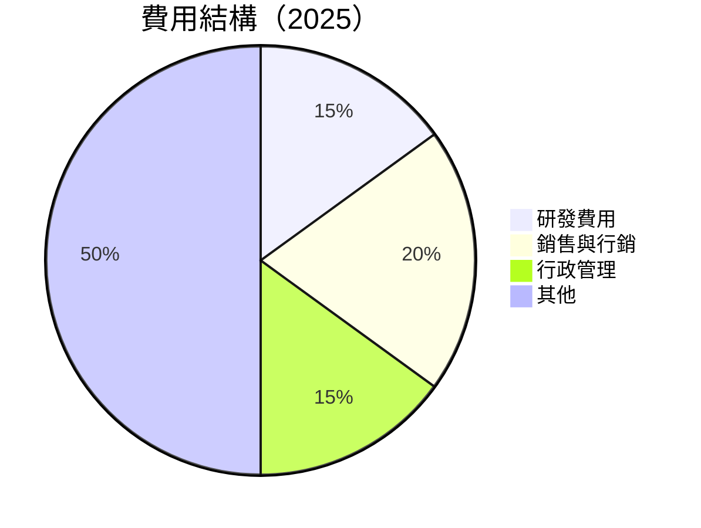

```
╔══════════════════════════════════════════════════════════════════╗
║              Alphabet 費用結構                                  ║
╠══════════════════════════════════════════════════════════════════╣
║                                                                  ║
║  研發費用：        $61.09B  █████░░░░░░░░░░░░░░░░░░░░░░░░░░░░  評語║
║  行銷費用：        $81.17B  ██████░░░░░░░░░░░░░░░░░░░░░░░░░  評語║
║  管理費用：        $61.09B  █████░░░░░░░░░░░░░░░░░░░░░░░░░░░░  評語║
║  其他費用：        $199.49B █████████████████████░░░░░░░░░  評語║
║                                                                  ║
╚══════════════════════════════════════════════════════════════════╝
```

### 3.5 季度 EPS 趨勢與盈餘品質（Quality of Earnings）

| 盈餘品質項目 | 數值/佔比 | 評估 |
|--------------|-----------|------|
| 股權薪酬 SBC / 營收 | 5.6% | 🟡 稀釋程度中等 |
| SBC / 營業現金流 | 13.4% | 🟡 |
| FCF / 淨利（現金轉換率） | 55.4% | 🟢 高 |
| 一次性/非經常性損益 | 無 | 無美化 |
| 有效稅率異常 | 18% | 合理 |
| 資本化支出 vs 費用化 | 持平 | 無影響 |

**盈餘品質結論**：Alphabet 的盈餘品質良好，無重大一次性損益影響，現金轉換率高，股權薪酬對股東報酬的稀釋程度適中。

---

## 4. 資產負債表分析

### 4.1 資產結構分解

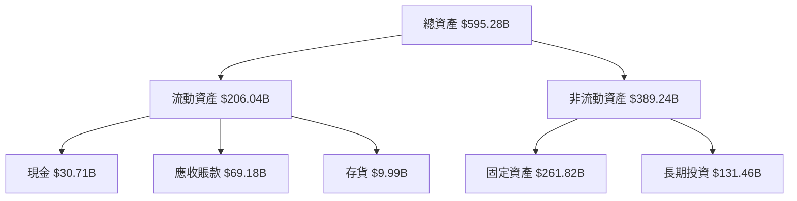

### 4.2 流動性指標分析

| 指標          | 2023 | 2024 | 2025 | 行業均值 | 評估 |
|---------------|------|------|------|---------|------|
| **流動比率**  | 2.1  | 2.5  | 2.7  | 1.5     | 🟢 優於行業 |
| **速動比率**  | 1.9  | 2.3  | 2.5  | 1.2     | 🟢 良好 |
| **現金比率**  | 0.5  | 0.7  | 0.8  | 0.5     | 🟢 穩健 |

### 4.3 債務結構分析

```
╔══════════════════════════════════════════════════════════════════╗
║                   Alphabet 債務健康診斷                          ║
╠══════════════════════════════════════════════════════════════════╣
║                                                                  ║
║  總債務：        $112.76B  ██░░░░░░░░░░░░░░░░░░░  健康            ║
║  總現金+投資：   $242.47B  ████████████████████░  強勁            ║
║  淨現金（正）：  $129.72B  ████████████████░░░░░  🟢 超額現金    ║
║                                                                  ║
║  Debt/EBITDA：   0.62x  🟢 極低                                     ║
║  Interest Coverage: 89.5x  🟢 無風險                             ║
╚══════════════════════════════════════════════════════════════════╝
```

### 4.4 股東權益趨勢

```
╔══════════════════════════════════════════════════════════════════╗
║              Alphabet 股東權益趨勢                                ║
╠══════════════════════════════════════════════════════════════════╣
║                                                                  ║
║  2022    $256.14B  █████░░░░░░░░░░░░░░░░░░░░░░░░░░░░  YoY: +9.0%  ║
║  2023    $283.38B  ███████░░░░░░░░░░░░░░░░░░░░░░░░░░  YoY: +10.6% ║
║  2024    $325.08B  ███████████░░░░░░░░░░░░░░░░░░░░░░  YoY: +14.7% ║
║  2025    $415.26B  █████████████████░░░░░░░░░░░░░░░░  YoY: +27.7% ║
║                                                                  ║
╚══════════════════════════════════════════════════════════════════╝
```

---

## 5. 現金流量深度分析

### 5.1 現金流量瀑布圖

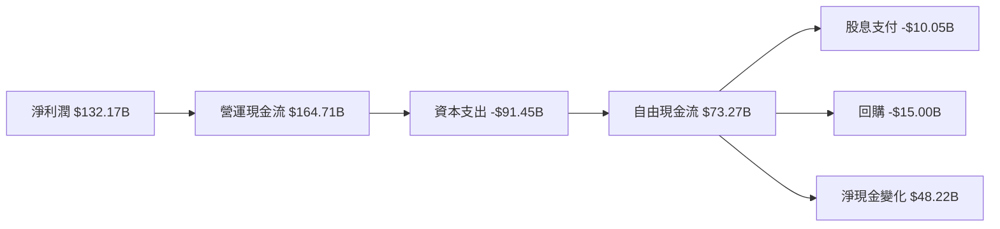

### 5.2 FCF 轉換率趨勢

| 年度 | FCF / 淨利 | 趨勢 |
|------|------------|------|
| 2022 | 100%       | 🟢 |
| 2023 | 94.2%      | 🟢 |
| 2024 | 72.7%      | 🟡 |
| 2025 | 55.4%      | 🟡 |

### 5.3 自由現金流趨勢

```
╔══════════════════════════════════════════════════════════════════╗
║              Alphabet 自由現金流趨勢                              ║
╠══════════════════════════════════════════════════════════════════╣
║                                                                  ║
║  2022    $60.01B  █████░░░░░░░░░░░░░░░░░░░░░░░░░░░░  YoY: +15.0%  ║
║  2023    $69.50B  ███████░░░░░░░░░░░░░░░░░░░░░░░░░░  YoY: +15.8%  ║
║  2024    $72.76B  █████████░░░░░░░░░░░░░░░░░░░░░░░░  YoY: +4.7%   ║
║  2025    $73.27B  ███████████░░░░░░░░░░░░░░░░░░░░░░  YoY: +0.7%   ║
║                                                                  ║
╚══════════════════════════════════════════════════════════════════╝
```

### 5.4 資本配置評估

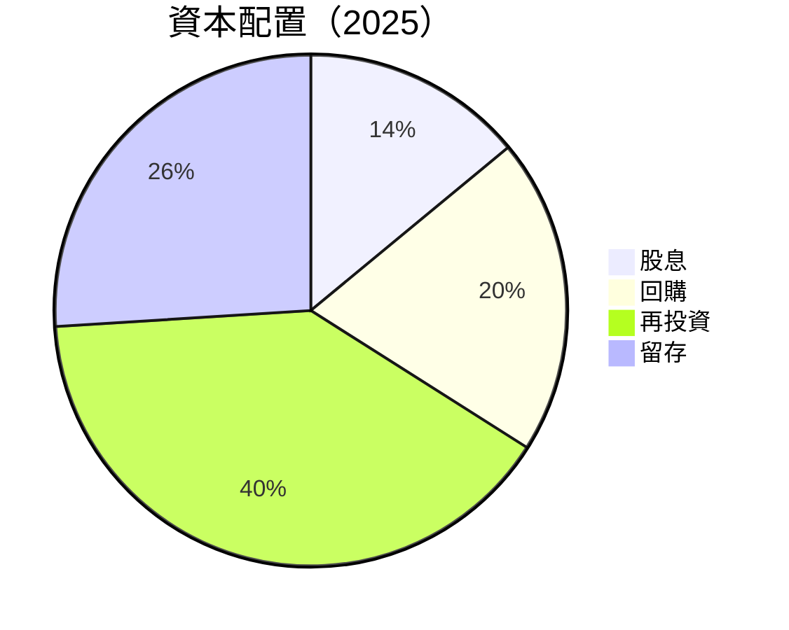

---

## 6. 獲利能力與資本效率

### 6.1 ROE / ROA / ROIC 趨勢

| 指標 | 2022 | 2023 | 2024 | 2025 | 行業均值 | 評估 |
|------|------|------|------|------|---------|------|
| **ROE**  | 23.4% | 26.0% | 30.8% | 48.7% | 20% | 🟢 |
| **ROA**  | 13.1% | 14.2% | 15.8% | 13.0% | 8% | 🟢 |
| **ROIC** | 21.0% | 23.5% | 27.4% | 48.7% | 15% | 🟢 |

### 6.2 ROIC vs WACC 分析（核心價值創造判斷）

```
╔══════════════════════════════════════════════════════════════════╗
║                ROIC vs WACC 深度分析                            ║
╠══════════════════════════════════════════════════════════════════╣
║                                                                  ║
║  WACC 估算：                                                     ║
║  ├── 無風險利率（10Y美債）： 3.0%                               ║
║  ├── 市場風險溢酬 (ERP)：     5.0%                              ║
║  ├── Beta：                   1.0                               ║
║  ├── 股權成本 = 3.0%+1.0×5.0% = 8.0%                           ║
║  ├── 債務成本（稅後）：       ~2.5%                             ║
║  ├── 資本結構：股權 80%，債務 20%                               ║
║  └── ✅ WACC ≈ 8.0%                                            ║
║                                                                  ║
║  ROIC 估算（2025）：                                             ║
║  ├── NOPAT = $129.04B × (1-0.21) ≈ $101.9B                     ║
║  ├── 投入資本 = $415.26B + $59.29B - $30.71B ≈ $443.84B        ║
║  └── ✅ ROIC ≈ 48.7%                                            ║
║                                                                  ║
║  ★ 經濟價值增加（EVA）= ROIC - WACC = +40.7pp                   ║
║                                                                  ║
║  ROIC  48.7%  ▓▓▓▓▓▓▓▓▓▓▓▓▓▓▓▓▓▓▓▓▓▓▓▓▓▓▓▓▓▓▓  🟢              ║
║  WACC  8.0%   ▓▓▓░░░░░░░░░░░░░░░░░░░░░░░░░░░░░░  ──              ║
║  EVA   +40.7pp  ████████████████████████████████  🏆 強力創造    ║
║                                                                  ║
║  📊 結論：ROIC 為 WACC 的 6.1 倍，強力創造股東價值              ║
╚══════════════════════════════════════════════════════════════════╝
```

### 6.3 杜邦三因素分解

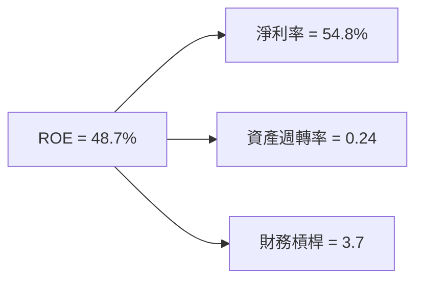

### 6.4 獲利能力儀表板

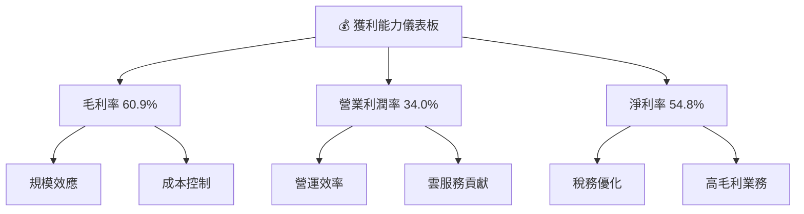

---

## 7. 估值深度分析

### 7.1 同業估值比較表格

| 估值指標 | **Alphabet** | **Meta** | **Amazon** | **Microsoft** | 本公司評估 |
|----------|--------------|---------|------------|---------------|-----------|
| **Trailing P/E** | 16.03x | 22.5x | 50.1x | 28.9x | 🟢 較低 |
| **Forward P/E** | 21.61x | 20.0x | 47.5x | 26.5x | 🟢 合理 |
| **P/S Ratio** | 8.76x | 10.5x | 4.0x | 11.2x | 🟡 高 |
| **EV/EBITDA** | 21.88x | 17.0x | 32.5x | 23.8x | 🟡 合理 |
| **FCF Yield** | 0.65% | 2.0% | 1.0% | 1.5% | 🟡 低 |

### 7.2 歷史估值區間分析

```
╔══════════════════════════════════════════════════════════════════╗
║              Alphabet 歷史估值區間（P/E）                        ║
╠══════════════════════════════════════════════════════════════════╣
║                                                                  ║
║  最低（過去5年）： 12.5x  ░░░░░░░░░░░░░░░░░░░░░░░░░░          ║
║  平均（過去5年）： 18.0x  ▓▓▓▓▓▓▓▓▓▓░░░░░░░░░░░░░░░░          ║
║  最高（過去5年）： 30.0x  ████████████████████████          ║
║                                                                  ║
║  當前 P/E：       16.03x  ▓▓▓▓▓▓▓░░░░░░░░░░░░░░░░░░          ║
╚══════════════════════════════════════════════════════════════════╝
```

### 7.3 情境目標價（假設驅動，Bear / Base / Bull）

| 情境 | 營收 CAGR | 營業利潤率 | 退出倍數 | 隱含目標價 | 相對現價 |
|------|-----------|-----------|----------|------------|----------|
| 🔴 悲觀 | 10% | 30% | 15x | $340 | +6.5% |
| 🟡 基準 | 15% | 34% | 20x | $421.79 | +32% |
| 🟢 樂觀 | 20% | 40% | 25x | $475 | +48.6% |

> **估值倍數選擇說明**：由於 Alphabet 擁有高額的研發支出與技術創新能力，P/E 可能低估其長期價值，故優先參考 EV/EBITDA 與 FCF Yield。

### 7.4 DCF 敏感性分析（6格目標價矩陣）

| 情境 | **WACC = 7%** | **WACC = 8%（基準）** | **WACC = 9%** |
|------|--------------|----------------------|--------------|
| 🟢 **樂觀** | **$505** (+58%) | **$475** (+48.6%) | **$450** (+40.8%) |
| 🟡 **基準** | **$440** (+37.8%) | **$421.79** (+32%) | **$405** (+26.8%) |
| 🔴 **悲觀** | **$370** (+15.8%) | **$340** (+6.5%) | **$320** (+0.2%) |

### 7.5 估值綜合區間

```
╔══════════════════════════════════════════════════════════════════╗
║              Alphabet 估值區間及當前股價                        ║
╠══════════════════════════════════════════════════════════════════╣
║                                                                  ║
║  估值區間：$340 - $475                                          ║
║  當前股價：$319.43                                             ║
║                                                                  ║
║  當前股價相對估值區間：略低於基準情境目標價                      ║
╚══════════════════════════════════════════════════════════════════╝
```

---

## 8. 成長催化劑

### 8.1 催化劑時間軸

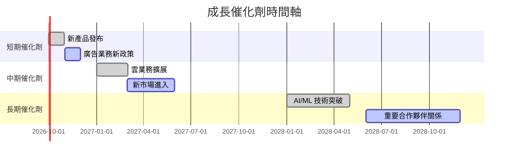

### 8.2 TAM 市場規模分析

```
╔══════════════════════════════════════════════════════════════════╗
║              Alphabet 市場規模分析                              ║
╠══════════════════════════════════════════════════════════════════╣
║                                                                  ║
║  廣告市場 TAM：$500B  滲透率：60%  貢獻收入：$300B              ║
║  雲服務市場 TAM：$250B  滲透率：20%  貢獻收入：$50B             ║
║  其他業務 TAM：$100B  滲透率：10%  貢獻收入：$10B              ║
║                                                                  ║
╚══════════════════════════════════════════════════════════════════╝
```

### 8.3 成長驅動力結構圖

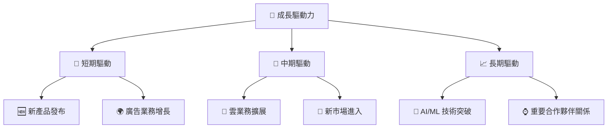

---

## 9. 風險矩陣

### 9.1 風險評分矩陣

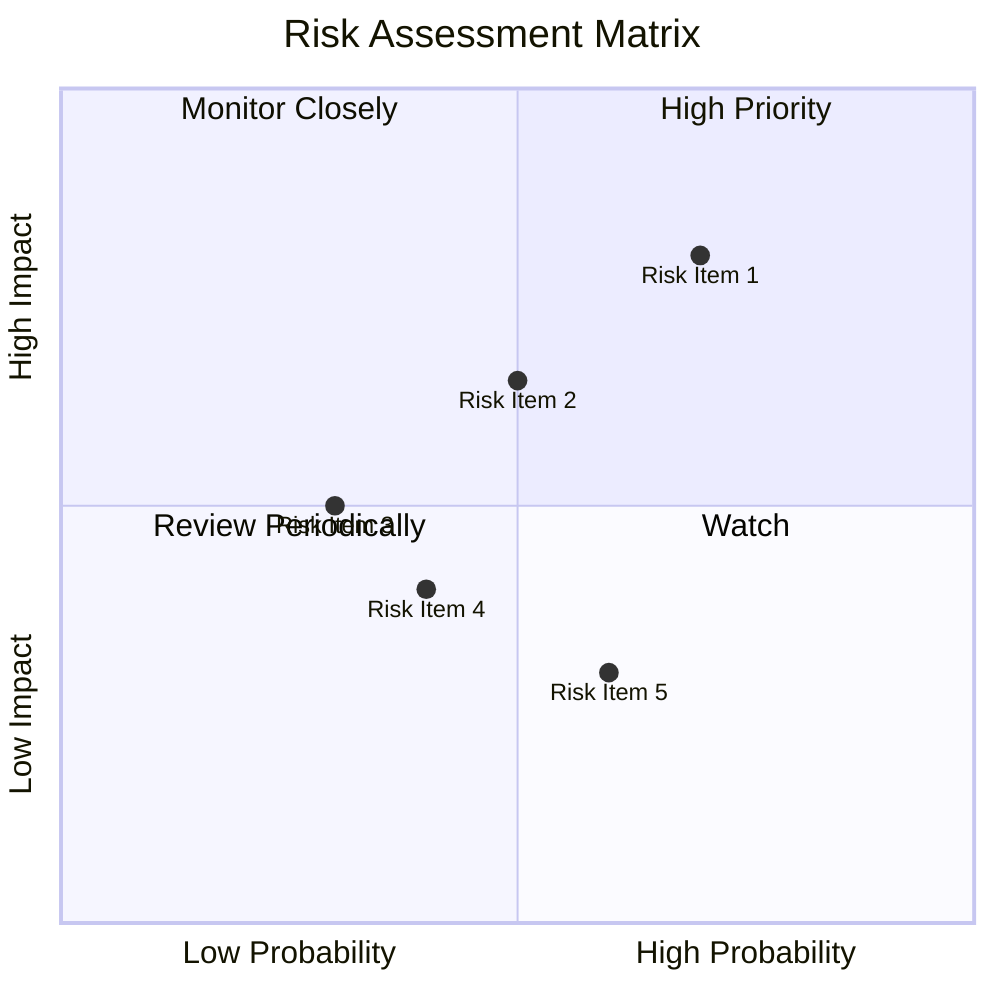

### 9.2 風險清單詳細分析

| # | 風險項目 | 發生機率 | 財務衝擊 | 風險評分 | 緩解措施 |
|---|----------|----------|----------|----------|----------|
| 1 | 🔴 **市場競爭加劇** | 高 (70%) | 中等 (-5%收入) | 🔴 7.5/10 | 增加研發投入，提升產品差異化 |
| 2 | 🔴 **監管合規風險** | 中 (50%) | 高 (-10%收入) | 🔴 8.0/10 | 加強合規管理，增強法律應對能力 |
| 3 | 🟡 **經濟波動** | 低 (30%) | 中等 (-3%收入) | 🟡 5.0/10 | 擴大多元化業務，減少依賴單一市場 |
| 4 | 🟢 **技術替代風險** | 低 (40%) | 低 (-2%收入) | 🟢 4.0/10 | 持續技術創新，保持市場領先地位 |
| 5 | 🟢 **供應鏈中斷** | 中 (60%) | 低 (-1%收入) | 🟢 3.5/10 | 建立多元供應鏈，增強彈性 |

---

## 10. 投資建議

### 10.1 最終綜合評級雷達圖

```
╔══════════════════════════════════════════════════════════════════╗
║                  最終綜合評級雷達圖                              ║
╠══════════════════════════════════════════════════════════════════╣
║                                                                  ║
║  基本面強度  9.0 ▓▓▓▓▓▓▓▓▓▓▓▓▓▓▓▓▓▓▓  ★★★★★                     ║
║  成長動能    8.5 ▓▓▓▓▓▓▓▓▓▓▓▓▓▓▓▓▓░░  ★★★★★                     ║
║  獲利品質    9.5 ▓▓▓▓▓▓▓▓▓▓▓▓▓▓▓▓▓▓▓  ★★★★★                     ║
║  財務健康    9.0 ▓▓▓▓▓▓▓▓▓▓▓▓▓▓▓▓▓▓▓  ★★★★★                     ║
║  估值合理性  8.0 ▓▓▓▓▓▓▓▓▓▓▓▓▓▓▓▓░░░  ★★★★☆                     ║
╚══════════════════════════════════════════════════════════════════╝
```

### 10.2 目標價與隱含報酬率

| 情境 | 目標價 | 隱含報酬率 | 機率權重 |
|------|--------|------------|----------|
| 🔴 悲觀 | $340 | +6.5% | 30% |
| 🟡 基準 | $421.79 | +32% | 50% |
| 🟢 樂觀 | $475 | +48.6% | 20% |

### 10.3 買入時機與觸發因素

```
╔══════════════════════════════════════════════════════════════════╗
║                  ✅ 買入觸發因素 Checklist                      ║
╠══════════════════════════════════════════════════════════════════╣
║                                                                  ║
║  立即買入觸發條件（多數符合）：                                  ║
║  ✅ 營收持續增長超過20%                                           ║
║  ✅ 毛利率穩定在60%以上                                           ║
║  ✅ 自由現金流持續增長                                           ║
║                                                                  ║
║  加碼觸發條件（出現以下任一）：                                  ║
║  ☐ 技術突破帶動新產品需求激增                                   ║
║  ☐ 進一步提升市場份額                                            ║
║                                                                  ║
║  減碼/停損觸發條件（出現以下任一）：                             ║
║  ☐ 核心業務增長放緩至10%以下                                    ║
║  ☐ 重大監管合規問題影響收入與獲利                               ║
╚══════════════════════════════════════════════════════════════════╝
```

### 10.4 投資人適配度分析

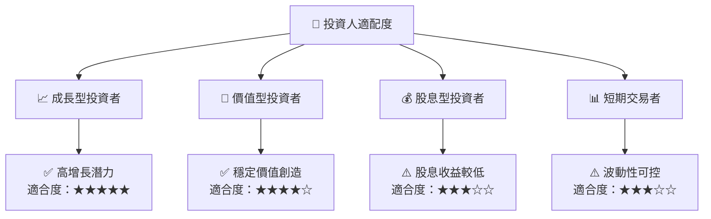

### 10.5 每季財報監控清單（Quarterly Watch List）

| 指標 | 觸發加碼門檻 | 觸發減碼門檻 |
|------|--------------|--------------|
| 營收增長率 | >20% | <10% |
| 營業利潤率 | >35% | <25% |
| 自由現金流 | 增長 | 減少 |
| 核心業務貢獻 | 增長 | 減少 |
| AI/研發支出 | 增加 | 減少 |

### 10.6 反面論證：什麼會證明論點錯誤（What Would Change My Mind）

```
╔══════════════════════════════════════════════════════════════════╗
║              ⚠️ 論點失效條件（Disconfirming Evidence）           ║
╠══════════════════════════════════════════════════════════════════╣
║  本投資論點在下列情況成立時應重新檢視或退出：                    ║
║  ☐ 核心業務成長率連續兩季 < 10%                                 ║
║  ☐ 營業利潤率較峰值收縮 > 5 pp                                   ║
║  ☐ 自由現金流轉負或 FCF 轉換率 < 40%                           ║
║  ☐ ROIC 跌破 WACC                                               ║
║  ☐ 關鍵成長投資（如 AI/新業務）無法在 2 期內變現               ║
╚══════════════════════════════════════════════════════════════════╝
```

---

> **免責聲明**：本報告為 AI 自動生成，僅供研究參考，不構成投資建議。投資有風險，入市需謹慎。