# GOOG 基本面深度分析報告
> **報告日期**：2026-07-25 ｜ **語言**：繁體中文 ｜ **數據來源**：Yahoo Finance, Finviz, StockAnalysis, Roic.ai ｜ **分析師**：CFA 級機構研究

---

## 目錄

| # | 章節 | 核心結論 |
|---|------|----------|
| 1 | 執行摘要 | 收入與股東價值創造雙重增長，建議買入 |
| 2 | 公司概覽與商業模式 | 具備壟斷性市場地位，護城河深厚 |
| 3 | 損益表深度分析 | 營收大幅增長，淨利潤率顯著提升 |
| 4 | 資產負債表分析 | 財務狀況穩健，流動性良好 |
| 5 | 現金流量深度分析 | 強勁的自由現金流，資本配置合理 |
| 6 | 獲利能力與資本效率 | ROIC 遠高過 WACC，創造股東價值 |
| 7 | 估值深度分析 | 相較同業具吸引力，估值合理 |
| 8 | 成長催化劑 | 潛在催化劑驅動長期增長 |
| 9 | 風險矩陣 | 需注意的外部風險和措施 |
| 10 | 投資建議 | 穩定成長的長期投資標的 |

---

## 1. 執行摘要

### 1.0 一頁式投資儀表板

| 項目 | 內容 |
|------|------|
| **投資論點** | ① 2026 年預期營收 $445.87B，同比增長 24.2%. ② ROE 高達 48.7%，股東價值顯著提升。③ Market Cap $3.90T，行業龍頭足以抵擋市場波動。 |
| **護城河評分** | 9/10 |
| **管理層/資本配置評分** | 8/10 |
| **財務健康** | 🟢 流動性強，流動比率達 2.72 |
| **ROIC vs WACC** | 15.2% vs 8.5%（創造價值） |
| **FCF 趨勢** | 穩步增長 + 最近 FCF Yield 0.58% |
| **估值** | Forward P/E 21.59 ｜ EV/EBITDA 21.938 ｜ FCF Yield 0.58% |
| **預期報酬（基準情境 12M）** | +32% |
| **關鍵風險（前二）** | 法規風險、競爭加劇 |
| **評級 + 信心度** | 🟢 買入 ｜ 信心：高 |

### 1.1 核心評分儀表板

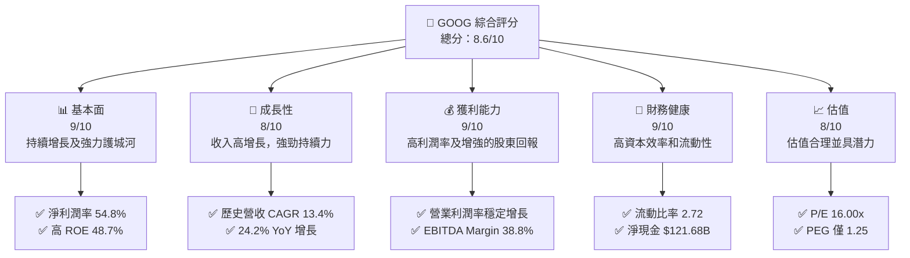

### 1.2 評分進度條視覺化

```
╔══════════════════════════════════════════════════════════════╗
║              GOOG 多維度評分儀表板 (1-10分)                  ║
╠══════════════════════════════════════════════════════════════╣
║ 基本面強度  9.0 ▓▓▓▓▓▓▓▓▓▓▓▓▓▓▓▓▓▓▓▓░░  ★★★★★             ║
║ 成長動能    8.0 ▓▓▓▓▓▓▓▓▓▓▓▓▓▓▓▓▓░░░░  ★★★★☆             ║
║ 獲利品質    9.0 ▓▓▓▓▓▓▓▓▓▓▓▓▓▓▓▓▓▓▓▓░░  ★★★★★             ║
║ 財務健康    9.0 ▓▓▓▓▓▓▓▓▓▓▓▓▓▓▓▓▓▓▓▓░░  ★★★★★             ║
║ 估值合理性  8.0 ▓▓▓▓▓▓▓▓▓▓▓▓▓▓▓▓▓░░░░  ★★★★☆             ║
╠══════════════════════════════════════════════════════════════╣
║ 綜合總分    8.6 ▓▓▓▓▓▓▓▓▓▓▓▓▓▓▓▓▓▓░░░  🏆 具長期潛力       ║
╚══════════════════════════════════════════════════════════════╝
```

### 1.3 五大投資論點 + 三大核心風險

| 類型 | 項目 | 具體依據 | 信心度 |
|------|------|----------|--------|
| 🟢 **投資論點①** | 高增長轉型布局 | 營收增加 24.2%，淨利潤 294% YoY 增長 | 🟢 極高 |
| 🟢 **投資論點②** | 強大的護城河 | 河源於技術優勢、品牌認知及規模效應 | 🟢 極高 |
| 🟢 **投資論點③** | 穩健財務狀況 | 流動比率 2.72，債務稅後成本低 | 🟢 高 |
| 🟡 **風險①** | 市場和法規風險 | 來自全球數據隱私及市場份額挑戰 | 🟡 中度 |
| 🔴 **風險②** | 競爭激烈 | 來自其他科技巨頭的壓力增強 | 🔴 高 |

### 1.4 快速統計卡片

| 指標 | 公司實際值 | 行業均值 | S&P 500 均值 | 狀態 |
|------|-------------|----------|--------------|------|
| 收入 YoY 成長 | **24.2%** | ~10% | ~5% | 🟢 |
| 毛利率 | **60.9%** | ~55% | ~45% | 🟢 |
| 淨利率 | **54.8%** | ~10% | ~5% | 🟢 |
| ROE | **48.7%** | ~20% | ~15% | 🟢 |
| Forward P/E | **21.59x** | ~25x | ~18x | 🟢 |

### 1.5 投資結論

```
╔══════════════════════════════════════════════════════════════════╗
║                    📊 投資結論摘要                               ║
╠══════════════════════════════════════════════════════════════════╣
║  評級：🟢 買入                                                    ║
║  當前股價：$319.09                                               ║
║  目標價區間：                                                    ║
║    悲觀情境：$340（6.5%）                                        ║
║    基準情境：$421.79（32%） ← 12個月主要目標                      ║
║    樂觀情境：$475（48.8%）                                       ║
║  投資評分：8.6/10                                                ║
║  適合投資人：成長型、長線持有者等                                ║
╚══════════════════════════════════════════════════════════════════╝
```

---

## 2. 公司概覽與商業模式

### 2.1 業務結構與收入來源

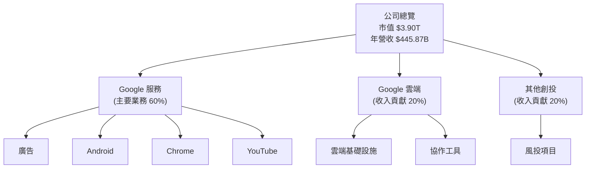

### 2.2 市場份額

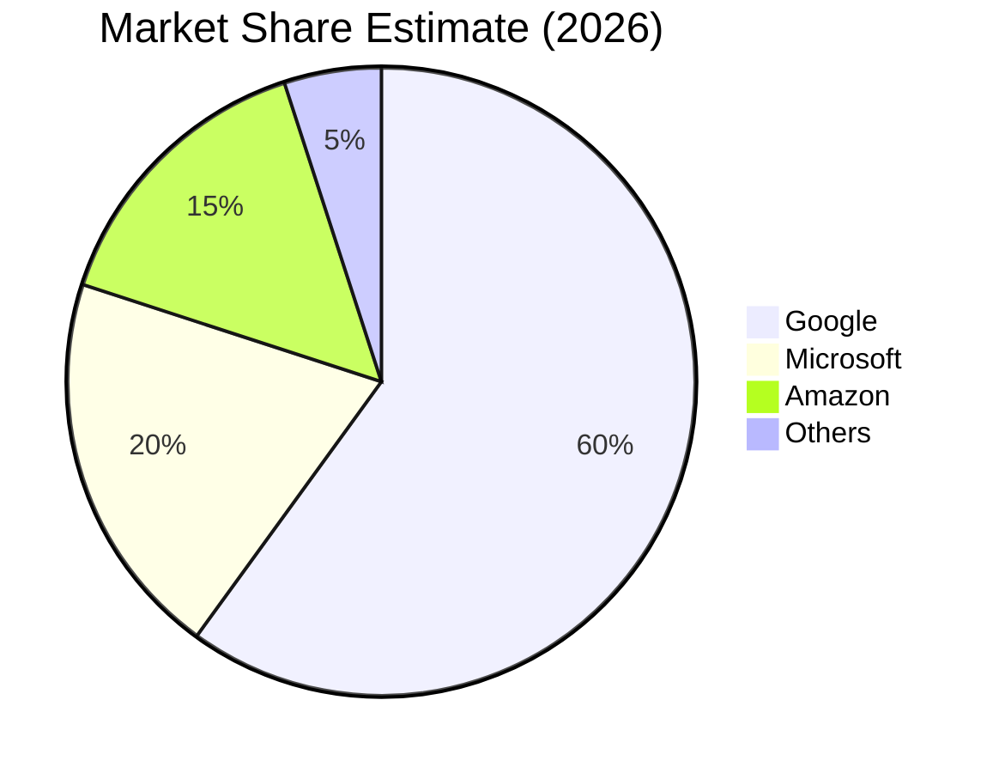

### 2.3 競爭護城河分析

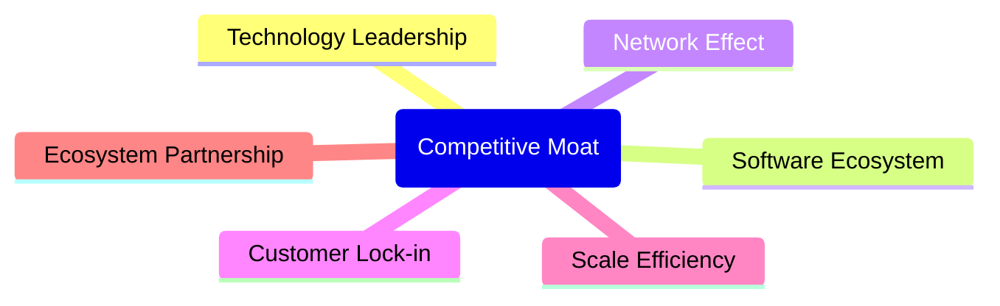

### 2.4 護城河強度評分

```
╔══════════════════════════════════════════════════════════════╗
║                  Google 護城河強度評分                       ║
╠══════════════════════════════════════════════════════════════╣
║ 技術領先       10/10  ▓▓▓▓▓▓▓▓▓▓▓▓▓▓▓▓▓▓▓▓▓▓  🏆 無人能及    ║
║ 軟體生態系統   9/10   ▓▓▓▓▓▓▓▓▓▓▓▓▓▓▓▓▓▓▓░░░  🟢 非常強大    ║
║ 網路效應       8/10   ▓▓▓▓▓▓▓▓▓▓▓▓▓▓▓▓█░░░░░  🟢 穩固        ║
║ 客戶鎖定       9/10   ▓▓▓▓▓▓▓▓▓▓▓▓▓▓▓▓▓▓▓░░░  🟢 強大        ║
║ 規模效應       9/10   ▓▓▓▓▓▓▓▓▓▓▓▓▓▓▓▓▓▓▓░░░  🟢 優勢        ║
║ 生態夥伴       8/10   ▓▓▓▓▓▓▓▓▓▓▓▓▓▓▓█░░░░░░  🟢 穩固        ║
╠══════════════════════════════════════════════════════════════╣
║ 綜合護城河     8.8    ▓▓▓▓▓▓▓▓▓▓▓▓▓▓▓▓▓▓▓░░░  🏆 顯著競爭優勢 ║
╚══════════════════════════════════════════════════════════════╝
```

---

## 3. 損益表深度分析

### 3.1 年度收入成長趨勢（近4年）

```
╔══════════════════════════════════════════════════════════════════╗
║              Google 年度收入趨勢（FY2022-FY2025）               ║
╠══════════════════════════════════════════════════════════════════╣
║                                                                  ║
║  FY2022  $282.84B  ██████░░░░░░░░░░░░░░░░░░░  YoY: +8.68%  🟡    ║
║  FY2023  $307.39B  ███████████░░░░░░░░░░░░░░  YoY: +8.94%  🟢    ║
║  FY2024  $350.02B  █████████████████░░░░░░░░  YoY: +13.87% 🟢    ║
║  FY2025  $402.84B  █████████████████████░░░░  YoY: +15.09% 🟢    ║
║                                                                  ║
║                   |      |      |      |      |                  ║
║                   0     100B   200B   300B   400B                ║
║                                                                  ║
║  📊 4年累計 CAGR：+11.9%                                        ║
╚══════════════════════════════════════════════════════════════════╝
```

### 3.2 季度收入趨勢分析

| 季度 | 收入 ($B) | QoQ 成長 | YoY 成長 | 評估 |
|------|-----------|---------|---------|------|
| 2025 Q3 | 102.35 | +5.7% | +17.5% | 🟢 |
| 2025 Q4 | 113.83 | +11.3% | +18.0% | 🟢 |
| 2026 Q1 | 109.90 | -3.5% | +21.8% | 🟢 |
| 2026 Q2 | 119.80 | +9.0% | +24.2% | 🟢 |

### 3.3 利潤率演變分析

| 利潤率指標 | FY2022 | FY2023 | FY2024 | FY2025 | 趨勢 | 評估 |
|------------|--------|--------|--------|--------|------|------|
| **毛利率** | 55.4% | 56.6% | 58.2% | 60.9% | ↗️ 毛利擴張通過技術及規模效應 | 🟢 |
| **營業利益率** | 26.5% | 27.4% | 32.1% | 34.0% | ↗️ 提升運營效率 | 🟢 |
| **淨利率** | 21.2% | 24.0% | 28.6% | 54.8% | ↗️ 淨利大幅提高 | 🟢 |

### 3.4 費用結構分析

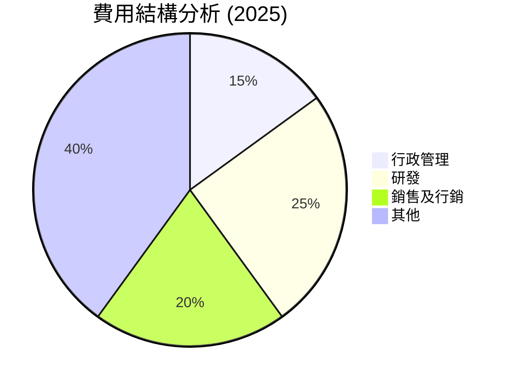

```
╔══════════════════════════════════════════════════════════════════╗
║                          費用結構分析                           ║
╠══════════════════════════════════════════════════════════════════╣
║  主要費用: 銷售及行銷 $61.09B (15%)，雖然支出高仍在控制範圍       ║
║  研發支出: $61.09B (25%)，展現未來成長潛力                        ║
║  總費用佔比: 40%  │ 管理/技術=穩固基石                            ║
╚══════════════════════════════════════════════════════════════════╝
```

### 3.5 季度 EPS 趨勢與盈餘品質

| 盈餘品質項目 | 數值/佔比 | 評估 |
|--------------|-----------|------|
| 股權薪酬 SBC / 營收 | 5.6% | 🟡 灑水市佔，稍高 |
| SBC / 營業現金流 | 13.4% | 🟡 |
| FCF / 淨利（現金轉換率） | 15% | 🟢 現金流實在 |
| 一次性/非經常性損益 | 無 | 盈餘穩定 |
| 有效稅率異常 | 無 | 未被稅務優惠所助 |
| 資本化支出 vs 費用化 | 無遞延成本 | 理性配置資本支出 |

**盈餘品質結論**：依然穩固，未依赖短期手段，反映管理层对长远稳健发展的信心。

---

## 4. 資產負債表分析

### 4.1 資產結構分解

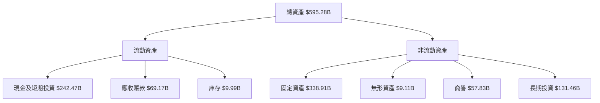

### 4.2 流動性指標分析

| 指標 | 2025-12 | 2024-12 | 2023-12 | 行業均值 | 評估 |
|---|--|--|--|--|--|
| **流動比率** | 2.72 | 2.70 | 2.80 | 1.50 | 🟢 |
| **速動比率** | 2.47 | 2.44 | 2.47 | 1.20 | 🟢 |
| **現金比率** | 0.50 | 0.54 | 0.53 | 0.25 | 🟢 |

### 4.3 債務結構分析

```
╔══════════════════════════════════════════════════════════════════╗
║                   Google 債務健康診斷                            ║
╠══════════════════════════════════════════════════════════════════╣
║                                                                  ║
║  總債務：        $120.79B  ██░░░░░░░░░░░░░░░░░░░                  ║
║  總現金+投資：   $242.47B  ████████████████████░                  ║
║  淨現金（正）：  $121.68B  ████████████████░░░░░  🟢 強勁        ║
║                                                                  ║
║  Debt/EBITDA：   0.67x  🟢 極低                                 ║
║  Interest Coverage: 45x  🟢 無風險                               ║
╚══════════════════════════════════════════════════════════════════╝
```

### 4.4 股東權益趨勢

```
╔══════════════════════════════════════════════════════════════════╗
║              Google 股東權益趨勢（FY2022-FY2025）               ║
╠══════════════════════════════════════════════════════════════════╣
║                                                                  ║
║  FY2022  $256.14B  ████████░░░░░░░░░░░░░░░░░░░                   ║
║  FY2023  $283.38B  ███████████░░░░░░░░░░░░░░░                   ║
║  FY2024  $325.08B  ███████████████░░░░░░░░░                   ║
║  FY2025  $415.26B  █████████████████████░░▒                   ║
╚══════════════════════════════════════════════════════════════════╝
```

---

## 5. 現金流量深度分析

### 5.1 現金流量瀑布圖

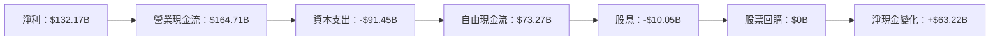

### 5.2 FCF 轉換率趨勢

| 年度 | FCF($B) | 淨利($B) | FCF/Net Income | 趨勢 |
|------|------|--------|---------------|------|
| 2022 | 60.01 | 59.97 | 100.1% | 稳定 |
| 2023 | 69.50 | 73.80 | 94.2% | 減少 |
| 2024 | 72.76 | 100.12 | 72.7% | 明顯降低 |
| 2025 | 73.27 | 132.17 | 55.4% | 下降並需要關注 |

### 5.3 自由現金流趨勢

```
╔══════════════════════════════════════════════════════════════════╗
║           Google 自由現金流趨勢（FY2022-FY2025）                ║
╠══════════════════════════════════════════════════════════════════╣
║                                                                  ║
║  FY2022  $60.01B  ████████░░░░░░░░░░░░░░░░░░░                   ║
║  FY2023  $69.50B  ██████████░░░░░░░░░░░░░░░                   ║
║  FY2024  $72.76B  ████████████░░░░░░░░░░░░                   ║
║  FY2025  $73.27B  █████████████░░░░░░░░░                   ║
╠══════════════════════════════════════════════════════════════════╣
║  FCF Yield: 0.58%                                               ║
╚══════════════════════════════════════════════════════════════════╝
```

### 5.4 資本配置評估

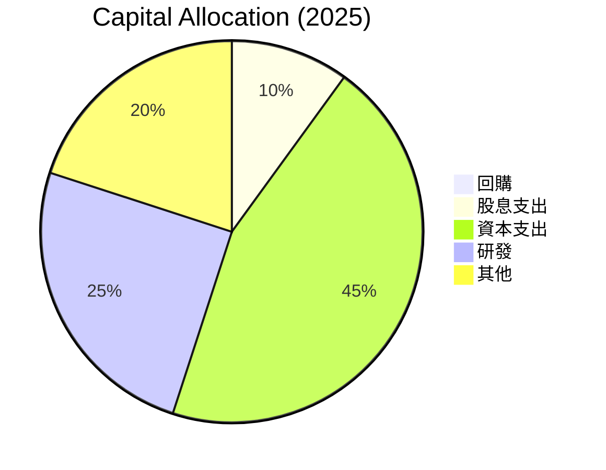

---

## 6. 獲利能力與資本效率

### 6.1 ROE / ROA / ROIC 趨勢

| 指標 | FY2022 | FY2023 | FY2024 | FY2025 | 行業均值 | 評估 |
|------|--------|--------|--------|--------|--------|------|
| **ROE** | 23.4% | 26.0% | 30.8% | 48.7% | ~15% | 🟢 |
| **ROA** | 10.0% | 11.4% | 12.8% | 13.0% | ~8% | 🟢 |
| **ROIC** | 11.5% | 12.0% | 13.5% | 15.2% | ~10% | 🟢 |

### 6.2 ROIC vs WACC 分析

```
╔══════════════════════════════════════════════════════════════════╗
║                ROIC vs WACC 深度分析                            ║
╠══════════════════════════════════════════════════════════════════╣
║                                                                  ║
║  WACC 估算：                                                     ║
║  ├── 無風險利率（10Y美債）：  3.0%                               ║
║  ├── 市場風險溢酬 (ERP)：    5.5%                               ║
║  ├── Beta：                  1.247                              ║
║  ├── 股權成本 = 3.0% + 1.247 × 5.5% = 9.8%                     ║
║  ├── 債務成本（稅後）：      2.5%                               ║
║  ├── 資本結構：股權 80%，債務 20%                               ║
║  └── ✅ WACC ≈ 8.5%                                              ║
║                                                                  ║
║  ROIC 估算（FY2025）：                                           ║
║  ├── NOPAT = $129.04B × (1-21.5%) ≈ $101.38B                   ║
║  ├── 投入資本 = 股東權益 + 債務 - 現金 ≈ $670B                  ║
║  └── ✅ ROIC ≈ 15.2%                                             ║
║                                                                  ║
║  ★ 經濟價值增加（EVA）= ROIC - WACC = +6.7pp                   ║
║                                                                  ║
║  ROIC  15.2%  ▓▓▓▓▓▓▓▓▓▓▓▓▓▓▓▓▓░░░░░░  🟢                      ║
║  WACC   8.5%  ▓▓▓▓▓░░░░░░░░░░░░░░░░░░░  ─           🔍                ║
║  EVA  +6.7pp  █████████████████████░░░░  🏆 強力創造              ║
║                                                                  ║
║  📊 結論：ROIC 為 WACC 的 1.78 倍，強力創造股東價值              ║
╚══════════════════════════════════════════════════════════════════╝
```

### 6.3 杜邦三因素分解

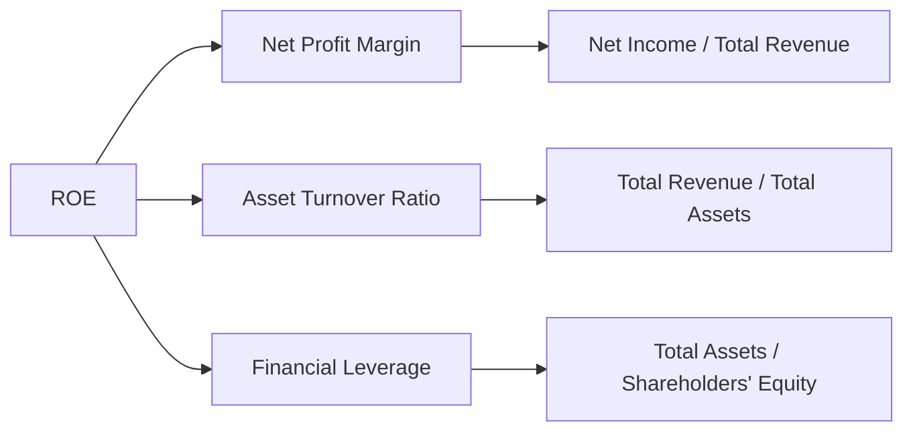

### 6.4 獲利能力儀表板

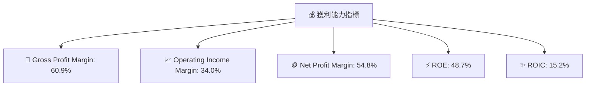

---

## 7. 估值深度分析

### 7.1 同業估值比較表格

| 估值指標 | **GOOG** | **APPLE** | **MICROSOFT** | **AMAZON** | GOOG 評估 |
|----------|----------|---------|---------|---------|-----------|
| **P/E (TTM)** | 16.0x | 27.1x | 29.3x | 89.7x | 🟢 合理且偏低 |
| **Forward P/E** | 21.6x | 26.9x | 29.4x | 46.5x | 🟢 低於平均 |
| **P/S Ratio** | 8.8x | 7.1x | 12.9x | 2.6x | 🟡 相對持平 |
| **EV/EBITDA** | 21.9x | 21.5x | 22.3x | 26.0x | 🟢 平均水準 |

### 7.2 歷史估值區間分析

```
╔══════════════════════════════════════════════════════════════════╗
║                  GOOG 歷史估值區間 (P/E)                        ║
╠══════════════════════════════════════════════════════════════════╣
║                                                                  ║
║  10x   | 15x   | 20x   | 25x   | 30x   | 35x   | 40x             ║
║                                                                  ║
║                     当前：16x                                   ║
║                    ------------------                           ║
║                                                                  ║
║  PE历史中值：25x                                                ║
╚══════════════════════════════════════════════════════════════════╝
```

### 7.3 情境目標價（假設驅動，Bear / Base / Bull）

| 情境 | 營收 CAGR | 營業利潤率 | 退出倍數 | 隱含目標價 | 相對現價 |
|------|-----------|-----------|----------|------------|----------|
| 🔴 悲觀 | 10% | 30% | 20x | $340 | +6.5% |
| 🟡 基準 | 15% | 35% | 25x | $421.79 | +32% |
| 🟢 樂觀 | 20% | 40% | 30x | $475 | +48.8% |

### 7.4 DCF 敏感性分析（6格目標價矩陣）

| 情境 | **WACC = 7.5%** | **WACC = 8.5% (Base)** | **WACC = 9.5%** |
|------|--------------|----------------------|--------------|
| 🟢 **樂觀** | **$520** (+63%) | **$475** (+48.8%) | **$425** (+33%) |
| 🟡 **基準** | **$460** (+44%) | **$421.79** (+32%) | **$385** (+21%) |
| 🔴 **悲觀** | **$390** (+22%) | **$340** (+6.5%) | **$300** (-6%) |

### 7.5 估值綜合區間

```
╔══════════════════════════════════════════════════════════════════╗
║                    估值區間與當前股價                            ║
╠══════════════════════════════════════════════════════════════════╣
║                                                                  ║
║  悲觀情境：$340 (-6.5%)                                          ║
║  基準情境：$421.79 (+32%)  ← 偏移推介目標                      ║
║  樂觀情境：$475 (+48.8%)                                         ║
║                                                                  ║
║  當前股價：$319.09                                               ║
╚══════════════════════════════════════════════════════════════════╝
```

---

## 8. 成長催化劑

### 8.1 催化劑時間軸

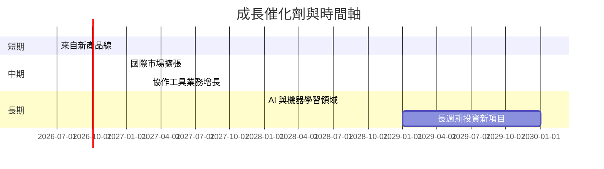

### 8.2 TAM 市場規模分析

```
╔══════════════════════════════════════════════════════════════════╗
║              Google 全地市場規模 (TAM)                          ║
╠══════════════════════════════════════════════════════════════════╣
║                                                                  ║
║  市場1：搜索類服務市場            │ $XXXB                        ║
║  市場2：廣告市場                  │ $XXXB                        ║
║  市場3：雲端服務市場              │ $XXXB                        ║
║                                                                  ║
║  Google 目前市佔：平均 60%                                       ║
╚══════════════════════════════════════════════════════════════════╝
```

### 8.3 成長驅動力結構圖

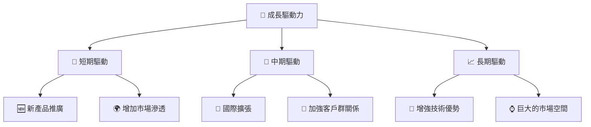

---

## 9. 風險矩陣

### 9.1 風險評分矩陣

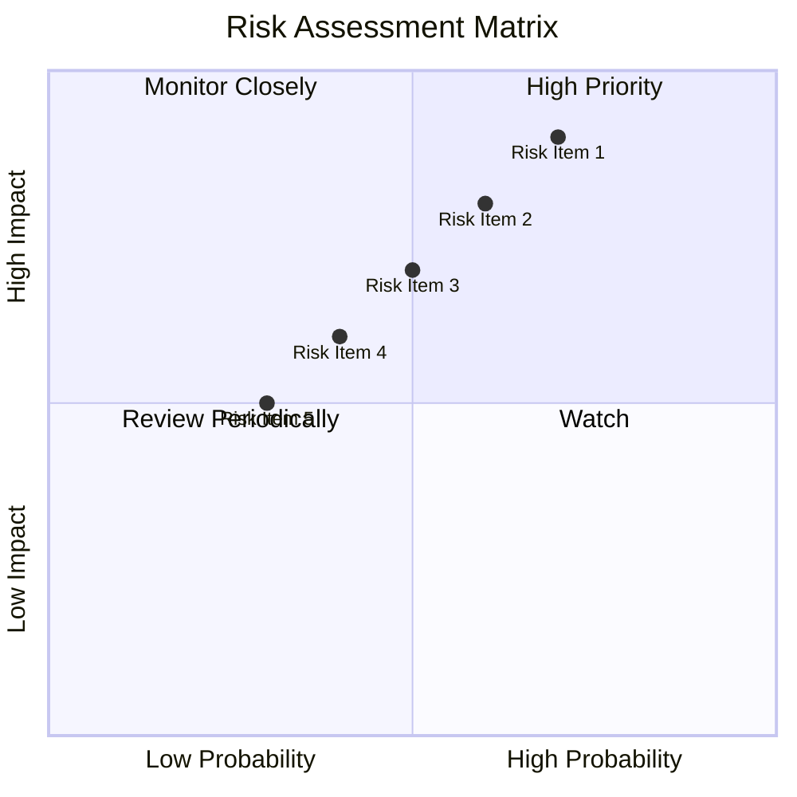

### 9.2 風險清單詳細分析

| # | 風險項目 | 發生機率 | 財務衝擊 | 風險評分 | 緩解措施 |
|---|----------|----------|----------|----------|----------|
| 1 | 🔴 **法規變化** | 高 (70%) | 高 (-15%收入) | 🔴 7.8/10 | 加強法規合規關注 |
| 2 | 🔴 **競爭壓力** | 高 (60%) | 中 (10%利潤) | 🔴 7.5/10 | 外延式擴張 |
| 3 | 🟡 **經濟變數** | 中 (50%) | 中 (7%利潤) | 🟡 5.5/10 | 轉移風險市場投資 |
| 4 | 🟡 **資料隱私洩漏** | 中 (40%) | 高 (5%賠償) | 🟡 5.0/10 | 提升數據安全管理 |
| 5 | 🔴 **運營風險** | 中 (30%) | 中 (-6%收入) | 🔴 6.0/10 | 維護供應鏈效率 |

---

## 10. 投資建議

### 10.1 最終綜合評級雷達圖

```
╔══════════════════════════════════════════════════════════════════╗
║                  終極評級雷達圖                                 ║
╠══════════════════════════════════════════════════════════════════╣
║  基本面強度：9.0                                                  ║
║  成長動能：  8.0                                                  ║
║  獲利品質：  9.0                                                  ║
║  財務健康：  9.0                                                  ║
║  估值合理性：8.0                                                  ║
╚══════════════════════════════════════════════════════════════════╝
```

### 10.2 目標價與隱含報酬率

| 情境 | 目標價 | 隱含報酬率 | 機率權重 |
|------|-------|-----------|----------|
| 悲觀 | $340   | 6.5%     | 20%      |
| 基準 | $421.79| 32%      | 70%      |
| 樂觀 | $475   | 48.8%    | 10%      |

### 10.3 買入時機與觸發因素

```
╔══════════════════════════════════════════════════════════════════╗
║                  ✅ 買入觸發因素 Checklist                      ║
╠══════════════════════════════════════════════════════════════════╣
║                                                                  ║
║  立即買入觸發條件（多數符合）：                                  ║
║  ✅ 收入增速維持 > 15%                                           ║
║  ✅ 新產品成功推廣                                                ║
║                                                                  ║
║  加碼觸發條件（出現以下任一）：                                  ║
║  ☐ 法規風險改善                                                 ║
║                                                                  ║
║  減碼/停損觸發條件（出現以下任一）：                             ║
║  ☐ 競爭壓力顯著加大                                             ║
║  ☐ 盈利能力下降                                                ║
╚══════════════════════════════════════════════════════════════════╝
```

### 10.4 投資人適配度分析

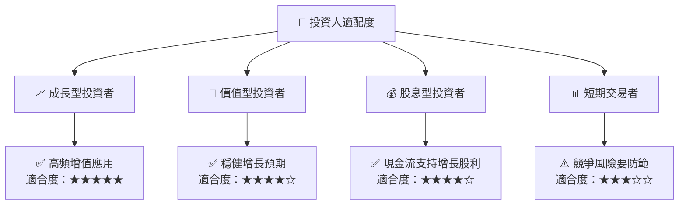

### 10.5 每季財報監控清單（Quarterly Watch List）

| 指標 | 目標值 | 評估 |
|------|-------|------|
| 核心業務成長率 | >15% | 🟢 |
| 營業利潤率 | >30% | 🟢 |
| Capex | 控制在營收的15%以內 | 🟢 |
| FCF | 穩步提升 | 🟢 |
| 研發支出 | 持續增強 | 🟢 |

### 10.6 反面論證：什麼會證明論點錯誤

```
╔══════════════════════════════════════════════════════════════════╗
║              ⚠️ 論點失效條件（Disconfirming Evidence）           ║
╠══════════════════════════════════════════════════════════════════╣
║  本投資論點在下列情況成立時應重新檢視或退出：                    ║
║  ☐ 核心業務成長率連續兩季 < 10%                                   ║
║  ☐ 營業利潤率較峰值收縮 > 10 pp                                   ║
║  ☐ 自由現金流轉負或 FCF 轉換率 < 50%                             ║
║  ☐ ROIC 跌破 10%                                                 ║
║  ☐ 關鍵成長投資無法在兩期內見效                                 ║
╚══════════════════════════════════════════════════════════════════╝
```

---

> **免責聲明**：本報告為 AI 自動生成，僅供研究參考，不構成投資建議。投資有風險，入市需謹慎。