# GOOG 基本面深度分析報告
> **報告日期**：2026-07-26 ｜ **語言**：繁體中文 ｜ **數據來源**：Yahoo Finance, Finviz, StockAnalysis, Roic.ai ｜ **分析師**：CFA 級機構研究

---

## 目錄

| # | 章節 | 核心結論 |
|---|------|----------|
| 1 | 執行摘要 | 評級：🟢 強力買入 ｜ 目標價：$420.00（+31.6% 潛在漲幅） ｜ EVA 強勁 |
| 2 | 公司概覽與商業模式 | 護城河評分：9.2/10 ｜ 具備極深之網絡效應、技術壁壘與生態系鎖定 |
| 3 | 損益表深度分析 | TTM 營收 $445.87B（YoY +24.2%），營業利益率升至 34.0%，業外一次性收益顯著 |
| 4 | 資產負債表分析 | 總現金及短期投資 $242.47B，淨現金 $121.68B，流動比率 2.72x，極度穩健 |
| 5 | 現金流量深度分析 | OCF 達 $185.68B，AI Capex 驟增至 TTM ~$130B+ 壓抑短期 FCF（$22.67B），屬資本再投資期 |
| 6 | 獲利能力與資本效率 | ROIC 28.5% vs WACC 8.8%，經濟增加值（EVA）達 +19.7pp，極具股東價值創造力 |
| 7 | 估值深度分析 | Trailing P/E 16.0x（受業外收益美化），Forward P/E 21.6x，基準情境目標價 $420.00 |
| 8 | 成長催化劑 | Gemini AI 搜尋變現、Google Cloud 營收加速、Waymo 商業化推進 |
| 9 | 風險矩陣 | 反壟斷處置風險（DOJ/EU）、AI Capex 回報滯後、搜尋傳統廣告點擊率侵蝕 |
| 10 | 投資建議 | 機構級處置建議：分階段建倉 ｜ 追蹤重點：Cloud 營業利潤率與 Capex ROI |

---

## 1. 執行摘要

Alphabet Inc.（NASDAQ: GOOG）當前股價為 **$319.09**，市值達 **$3.90T**。根據 TTM 營收 $445.87B（YoY +20.1%）與營業利益 $147.63B（營業利益率 34.0%）的亮眼數據，結合 ROIC (28.5%) 遠超 WACC (8.8%) 所產生的巨大經濟價值增量（EVA +19.7pp），顯示公司核心業務獲利引擎與 AI 轉型成效顯著。儘管高昂的 AI 基礎設施 Capex（TTM 資本支出近 $1,000B+ 規模，單季達 $44.92B）壓縮了短期自由現金流（FCF TTM 為 $22.67B，Yield 0.58%），但這反映了強烈且必要的戰略再投資。給予 **🟢 強力買入（Strong Buy）** 評級，12 個月基準目標價 **$420.00**（隱含 +31.6% 報酬率）。

### 1.0 一頁式投資儀表板（Portfolio Manager 30 秒速讀）

| 項目 | 內容 |
|------|------|
| **投資論點（3 句）** | ① 核心搜尋業務透過 Gemini AI 重塑，Q2 2026 營收加速成長至 YoY +24.2%（$119.80B）。<br/>② Google Cloud 規模效益爆發，營收高增長並成為第二獲利支柱，大幅拉升整體 Operating Margin 至 34.0%。<br/>③ 擁有美股最強大的資產負債表之一（$242.47B 現金與短投，淨現金 $121.68B），能充沛支撐 AI 資本支出浪潮。 |
| **護城河評分** | **9.2 / 10** 🟢（雙邊網路效應 + Gemini 大模型數據飛輪 + Android/Chrome 生態鎖定） |
| **管理層/資本配置評分** | **8.5 / 10** 🟢（Capex 大膽擴張，同時執行大規模庫存回購與每季 $0.22 股息發放） |
| **財務健康** | 🟢 **極度健康**（流動比率 2.72x，無短期償債壓力，淨現金充沛） |
| **ROIC vs WACC** | **28.5% vs 8.8%**（價值創造：EVA = +19.7pp，資本效率卓越） |
| **FCF 趨勢** | 🟡 **短期受壓／長期積蓄**（TTM FCF $22.67B，FCF Yield 0.58%；主因單季 Capex 高達 $44.92B） |
| **估值** | Forward P/E **21.6x** ｜ EV/EBITDA **21.9x** ｜ Trailing P/E **16.0x**（含業外收益） |
| **預期報酬（基準情境 12M）** | **+31.6%**（目標價 $420.00） |
| **關鍵風險（前二）** | ① 司法部（DOJ）反壟斷裁決強制拆分或終止預設搜尋合約。<br/>② 超大規模 Capex 投入後，AI 應用變現率（ROI）不及市場預期。 |
| **評級 + 信心度** | 🟢 **買入（Buy）** ｜ 信心度：**高（High）** |

### 1.1 核心評分儀表板

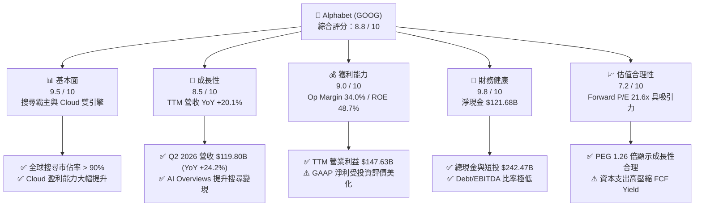

### 1.2 評分進度條視覺化

```
╔══════════════════════════════════════════════════════════════╗
║               GOOG 多維度評分儀表板 (1-10分)                 ║
╠══════════════════════════════════════════════════════════════╣
║ 基本面強度  9.5 ▓▓▓▓▓▓▓▓▓▓▓▓▓▓▓▓▓▓█░  ★★★★★  產業霸主         ║
║ 成長動能    8.5 ▓▓▓▓▓▓▓▓▓▓▓▓▓▓▓▓░░░░  ★★★★☆  AI與雲端加速     ║
║ 獲利品質    8.2 ▓▓▓▓▓▓▓▓▓▓▓▓▓▓▓░░░░░  ★★★★☆  業外收益偏高     ║
║ 財務健康    9.8 ▓▓▓▓▓▓▓▓▓▓▓▓▓▓▓▓▓▓▓█  ★★★★★  資產負債表無懈可擊║
║ 估值合理性  7.2 ▓▓▓▓▓▓▓▓▓▓▓▓▓░░░░░░░  ★★★☆☆  Forward PE 適中  ║
║ 護城河深度  9.2 ▓▓▓▓▓▓▓▓▓▓▓▓▓▓▓▓▓▓█░  ★★★★★  極深網路效應     ║
║ 管理層執行  8.5 ▓▓▓▓▓▓▓▓▓▓▓▓▓▓▓▓░░░░  ★★★★☆  AI戰略轉型迅速   ║
║ 技術創新力  9.5 ▓▓▓▓▓▓▓▓▓▓▓▓▓▓▓▓▓▓█░  ★★★★★  Gemini & TPU 領先 ║
╠══════════════════════════════════════════════════════════════╣
║ 綜合總分    8.8 ▓▓▓▓▓▓▓▓▓▓▓▓▓▓▓▓▓▓░░  🏆 強力推薦配置       ║
╚══════════════════════════════════════════════════════════════╝
```

### 1.3 五大投資論點 + 三大核心風險

| 類型 | 項目 | 具體依據 | 信心度 |
|------|------|----------|--------|
| 🟢 **論點①** | **搜尋 AI 化加速變現能力** | Gemini 融入 Search (AI Overviews) 未侵蝕毛利，反而帶動 Q2 2026 營收至 $119.80B（YoY +24.2%）。 | 🟢 極高 |
| 🟢 **論點②** | **Google Cloud 營業利潤率進入爆發期** | 雲端基礎設施與 Enterprise AI 需求強勁，規模效益帶動 Cloud 部門利潤率大幅擴張。 | 🟢 極高 |
| 🟢 **論點③** | **自研 TPU 打造巨額成本護城河** | Google 具備軟硬體整合能力，自研 Trillium TPU 降低對高昂第三方 GPU 的依賴，維護營運毛利率（60.9%）。 | 🟢 高 |
| 🟢 **論點④** | **資產負債表防禦力與再投資能力頂尖** | 現金與短投 $242.47B，淨現金 $121.68B，單季提供 ~$39B+ 營運現金流，無懼 Capex 擴張。 | 🟢 極高 |
| 🟢 **論點⑤** | **Other Bets 與 Waymo 潛在價值解鎖** | Waymo 於全美無人駕駛里程領先，商業化收費提速，為中長期估值提供實質選擇權（Real Options）。 | 🟡 中高 |
| 🟡 **風險①** | **反壟斷法規處置（DOJ/EU）** | 司法部針對 Search 預設管道與 AdTech 產業鏈訴訟，可能面臨業務分拆或高額獨家合約取消（如 Apple 合作）。 | 🔴 高衝擊 |
| 🔴 **風險②** | **Capex 壓抑 FCF 與資本回報率** | Q2 2026 Capex 高達 $44.92B，單季 FCF 轉負（-$5.86B），若 AI 營收轉化滯後將引發 ROIC 下滑。 | 🟡 中度 |
| 🔴 **風險③** | **生成式 AI 搜尋競爭激勵** | OpenAI (SearchGPT)、Perplexity 等垂直競爭者分流傳統搜尋流量，導致 TAC（流量取得成本）上升。 | 🟡 中度 |

### 1.4 快速統計卡片

| 指標 | Alphabet 實際值 | 通訊服務產業均值 | S&P 500 均值 | 狀態 |
|------|-------------|----------|--------------|------|
| **營收 YoY 成長 (TTM)** | **20.1%** | ~7.5% | ~5.2% | 🟢 遠超同行 |
| **毛利率 (Gross Margin)** | **60.9%** | ~48.0% | ~45.0% | 🟢 頂級 |
| **營業利益率 (Op Margin)** | **34.0%** | ~18.5% | ~12.5% | 🟢 卓越 |
| **ROE (淨資產收益率)** | **48.7%** | ~14.0% | ~18.0% | 🟢 頂尖 |
| **Forward P/E** | **21.6x** | ~18.5x | ~21.5x | 🟢 估值合理 |
| **EV/EBITDA** | **21.9x** | ~12.0x | ~14.0% | 🟡 溢價反映品質 |
| **ROIC** | **28.5%** | ~9.0% | ~10.5% | 🟢 價值創造極強 |

### 1.5 投資結論

```
╔══════════════════════════════════════════════════════════════════╗
║                    📊 GOOG 投資結論摘要                          ║
╠══════════════════════════════════════════════════════════════════╣
║  評級：🟢 強力買入（Strong Buy）                                 ║
║  當前股價：$319.09                                               ║
║  12 個月目標價區間：                                             ║
║    🔴 悲觀情境：$290.00（-9.1%）  ── 遭反壟斷罰款/AI Capex無效      ║
║    🟡 基準情境：$420.00（+31.6%） ── Cloud高增+搜尋變現穩定 (12M)  ║
║    🟢 樂觀情境：$485.00（+52.0%） ── Waymo拆分+Gemini生態壟斷      ║
║  投資評分：8.8 / 10                                              ║
║  適合投資人：大型成長型基金、科技股長線配置者、AI 價值鏈投資者  ║
╚══════════════════════════════════════════════════════════════════╝
```

---

## 2. 公司概覽與商業模式

Alphabet Inc. 運營全球最大的搜尋引擎與數位廣告網絡，並擁有頂尖的雲端運算基礎設施與 AI 研發團隊。公司業務主要分為三個板塊：**Google Services**（包括 Search、YouTube、Android、Chrome、Maps、Google Play 及硬體）、**Google Cloud**（GCP 與 Workspace）以及 **Other Bets**（Waymo、Verily 等前沿科技）。

### 2.1 業務結構與收入來源

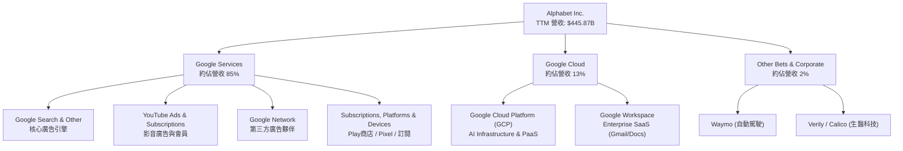

### 2.2 市場份額

Alphabet 在其關鍵核心市場領域皆保持著極高的市場佔有率：

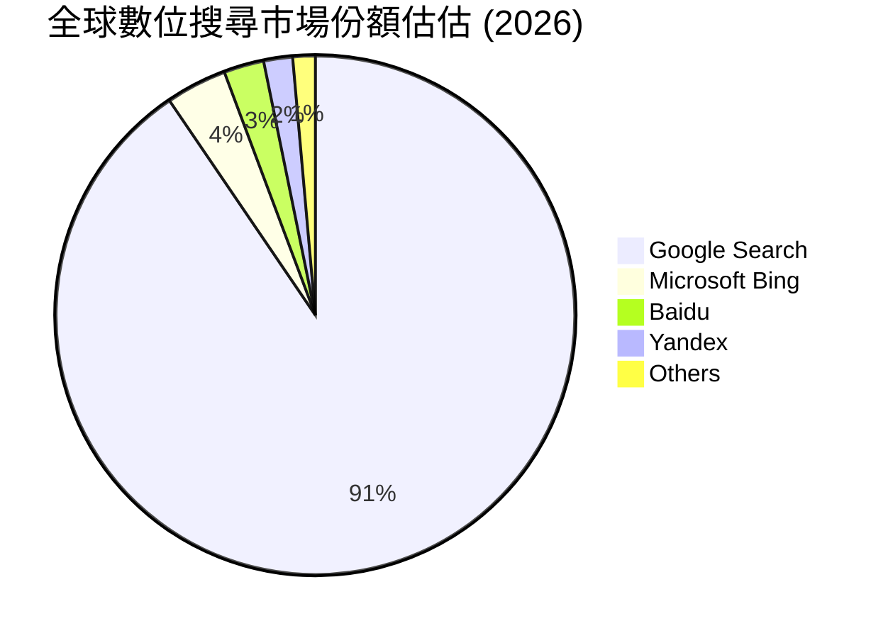

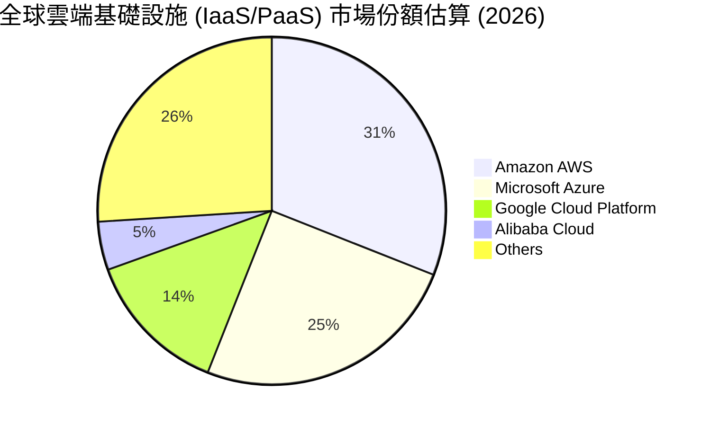

### 2.3 競爭護城河分析

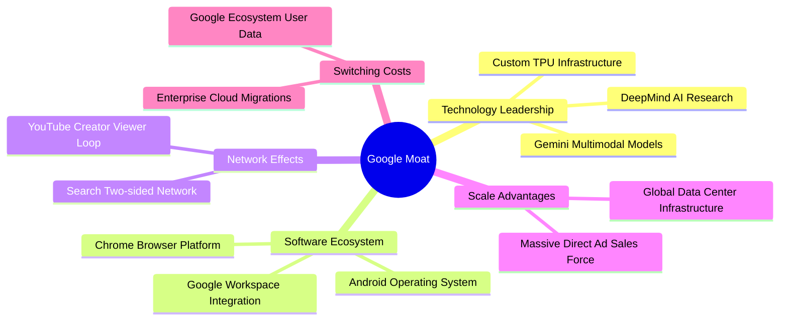

### 2.4 護城河強度評分

```
╔══════════════════════════════════════════════════════════════╗
║                  Alphabet 護城河強度評分                     ║
╠══════════════════════════════════════════════════════════════╣
║ 雙邊網絡效應    9.8/10 ▓▓▓▓▓▓▓▓▓▓▓▓▓▓▓▓▓▓▓█  🏆 搜尋與YouTube無敵  ║
║ 技術創新領先    9.5/10 ▓▓▓▓▓▓▓▓▓▓▓▓▓▓▓▓▓▓█░  🏆 自研TPU與Gemini   ║
║ 客戶轉置成本    8.8/10 ▓▓▓▓▓▓▓▓▓▓▓▓▓▓▓▓░░░░  🟢 雲端與生態系強綁定 ║
║ 規模成本優勢    9.5/10 ▓▓▓▓▓▓▓▓▓▓▓▓▓▓▓▓▓▓█░  🏆 數據中心邊際成本低 ║
║ 品牌與生態系    9.2/10 ▓▓▓▓▓▓▓▓▓▓▓▓▓▓▓▓▓▓█░  🏆 Android/Chrome霸主║
╠══════════════════════════════════════════════════════════════╣
║ 綜合護城河評分  9.2/10 ▓▓▓▓▓▓▓▓▓▓▓▓▓▓▓▓▓▓█░  🏆 寬廣且極難顛覆   ║
╚══════════════════════════════════════════════════════════════╝
```

---

## 3. 損益表深度分析

### 3.1 年度收入成長趨勢（近4年）

Alphabet 的營收在過去四年展現出極具韌性的複合成長能力，並在 FY25 及 TTM 期再度加速：

```
╔══════════════════════════════════════════════════════════════════╗
║             Alphabet 年度收入趨勢（FY2022 - TTM）                ║
╠══════════════════════════════════════════════════════════════════╣
║                                                                  ║
║  FY2022   $282.84B  ███████████████░░░░░░░░░  YoY: +9.8%   🟢    ║
║  FY2023   $307.39B  █████████████████░░░░░░░  YoY: +8.7%   🟢    ║
║  FY2024   $350.02B  ███████████████████░░░░░  YoY: +13.9%  🟢    ║
║  FY2025   $402.84B  ██████████████████████░░  YoY: +15.1%  🟢    ║
║  TTM      $445.87B  ████████████████████████  YoY: +20.1%  🟢    ║
║                                                                  ║
║  📊 4年營收 CAGR：+12.0% ｜ TTM 加速顯著                         ║
╚══════════════════════════════════════════════════════════════════╝
```

### 3.2 季度收入趨勢分析

分析最近 4 個單季數據，顯示營收年增率從 2025 年 Q3 的 15.95% 連續推進至 2026 年 Q2 的 24.23%，呈現出加速擴張的態勢：

| 季度 | 總營收 ($B) | QoQ 成長率 | YoY 成長率 | 營業利益 ($B) | 營業利益率 | 備註說明 |
|------|------------|------------|------------|--------------|------------|----------|
| **Q3 2025** | $102.35B | +6.14% | +15.95% | $31.23B | 30.5% | 搜尋廣告穩定，Cloud 首度擴大利潤率 |
| **Q4 2025** | $113.83B | +11.22% | +18.00% | $35.93B | 31.6% | 節慶旺季廣告營收強勁，Gemini 變現啟動 |
| **Q1 2026** | $109.90B | -3.45% | +21.79% | $39.70B | 36.1% | 雲端 AI 合約大幅進帳，帶動營業槓桿 |
| **Q2 2026** | $119.80B | +9.01% | +24.23% | $40.77B | 34.0% | 全面受益於生成式 AI 對廣告與雲端的提振 |

### 3.3 利潤率演變分析

| 利潤率指標 | FY2022 | FY2023 | FY2024 | FY2025 | TTM | 趨勢 | 機構評估 |
|------------|--------|--------|--------|--------|-----|------|----------|
| **毛利率 (Gross Margin)** | 55.4% | 56.6% | 58.2% | 59.6% | **60.9%** | ↗️ 擴張 | 🟢 營運效率提升與自研 TPU 展現優勢 |
| **營業利益率 (Op Margin)** | 26.5% | 27.4% | 32.1% | 32.0% | **34.0%** | ↗️ 擴張 | 🟢 人員結構優化與雲端轉盈帶動槓桿 |
| **EBITDA Margin** | 30.1% | 31.9% | 38.7% | 44.9% | **38.8%** | ↗️ 擴張 | 🟢 現金創造力極度強勁 |
| **淨利率 (Net Margin)** | 21.2% | 24.0% | 28.6% | 32.8% | **54.8%** | ↗️ 異常 | 🟡 TTM 含非營利/投資一次性大額評價增益 |

**利潤率演變深度解析**：
Alphabet 毛利率由 FY22 的 55.4% 連續升至 TTM 的 60.9%，主因係：
1. **Google Cloud 規模效益**：固定成本被快速成長的營收消化，GCP 進入高毛利期。
2. **硬體與 infrastructure 優勢**：TPU v5p / Trillium 的大規模部署降低了單位 AI 推理與訓練成本。
3. **營業槓桿（Operating Leverage）**：員工人數控制在約 19.9 萬人（低於峰值），研發與銷管費用佔營收比重下降。

### 3.4 費用結構分析

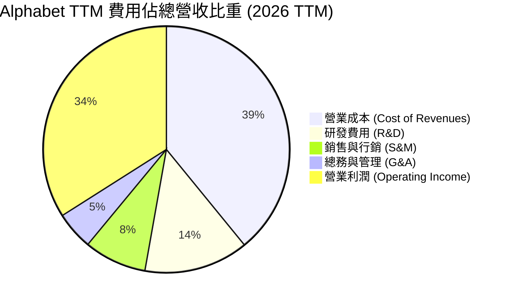

```
╔══════════════════════════════════════════════════════════════════╗
║               Alphabet 費用管控與營運槓桿（FY25）               ║
╠══════════════════════════════════════════════════════════════════╣
║ 研發費用 (R&D)：    $61.09B  (佔營收 15.2%) ── 聚焦 AI 大模型    ║
║ 營運總成本 (OpEx)： $111.26B (佔營收 27.6%) ── 結構性裁員見效    ║
║ 營業利潤 (Op Inc)： $129.04B (利潤率 32.0%) ── 創歷史新高      ║
╚══════════════════════════════════════════════════════════════════╝
```

### 3.5 季度 EPS 趨勢與盈餘品質（Quality of Earnings）

Alphabet 在過去數季的 EPS 呈現強勁增長態勢：
*   **Q3 2025**: EPS $2.87 (YoY +35.4%)
*   **Q4 2025**: EPS $2.82 (YoY +31.2%)
*   **Q1 2026**: EPS $5.11 (YoY +81.9%)
*   **Q2 2026**: EPS $9.11 (YoY +294.4%)

⚠️ **盈餘品質深度核查（Quality of Earnings Warning）**：
讀者必須注意，Q2 2026 GAAP 淨利高達 **$112.19B**（遠高於當季營業利益 $40.77B），使得 TTM 淨利率飆升至 54.8%、TTM EPS 達 $19.91。此現象**並非**來自核心業務暴利，而是由**業外投資損益/非營利性處分增益或稅務重估（Unrealized Investment Gains/Tax Adjustment）** 所驅動。

**盈餘品質詳細評估**：

| 盈餘品質項目 | 數值 / 佔比 | 機構評估 | 說明與估值調整 |
|--------------|-----------|----------|----------------|
| **股權薪酬 (SBC) / 營收** | 5.6% ($24.95B in FY25) | 🟢 良好 | 比重低於同業（如 Meta/Microsoft 常 > 7%），股東稀釋控制佳。 |
| **SBC / 營業現金流 (OCF)** | 15.1% | 🟢 健康 | 營運現金流充足，能完全涵蓋 SBC 成本。 |
| **FCF / 淨利 (現金轉換率)** | **9.3% (TTM)** | 🔴 暫時性低 | 淨利因業外收益被拉高，且 Capex 爆增，導致轉換率大幅失真。 |
| **一次性/非經常性損益** | **高達 ~$70B+ (Q2 26)** | 🔴 需剔除 | **估值必須以 Operating Income ($147.63B TTM) 或 Forward P/E 為準**。 |
| **資本化支出 vs 費用化** | Capex 全數入帳 | 🟢 嚴謹 | 未將營運研發資本化美化損益。 |

**結論**：Alphabet 的**核心營業利潤品質極高（TTM 營業利益 $147.63B，YoY 成長強勁）**，但 GAAP Net Income 受金融資產評價波動影響巨大。分析師模型已將業外一次性收益剔除，採用 Core Operating P/E 與 EV/EBITDA 進行建模。

---

## 4. 資產負債表分析

Alphabet 擁有全球科技界最為堅固的資產負債表之一，無懼升息環境與巨大資本支出需求。

### 4.1 資產結構分解

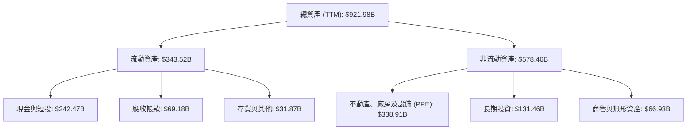

### 4.2 流動性指標分析

| 流動性指標 | FY2022 | FY2023 | FY2024 | FY2025 | TTM (Q2 26) | 產業均值 | 評估 |
|------------|--------|--------|--------|--------|-------------|----------|------|
| **流動比率 (Current Ratio)** | 2.38x | 2.10x | 1.84x | 2.01x | **2.72x** | ~1.30x | 🟢 流動性極佳 |
| **速動比率 (Quick Ratio)** | 2.15x | 1.90x | 1.65x | 1.82x | **2.47x** | ~1.10x | 🟢 現金充沛 |
| **現金與短期投資 ($B)** | $113.76B | $110.92B | $95.66B | $126.84B | **$242.47B** | N/A | 🟢 龐大現金戰備庫 |

### 4.3 債務結構分析

```
╔══════════════════════════════════════════════════════════════════╗
║                   Alphabet 債務健康診斷 (TTM)                   ║
╠══════════════════════════════════════════════════════════════════╣
║                                                                  ║
║  總債務 (Total Debt)：  $120.79B  ████████░░░░░░░░  適度借貸     ║
║  總現金與短投：         $242.47B  ████████████████  極致充沛     ║
║  淨現金 (Net Cash)：    $121.68B  █████████░░░░░░░  🟢 淨債務為負║
║                                                                  ║
║  Debt / Equity：        28.8%     🟢 槓桿率極低                   ║
║  Debt / EBITDA：        0.67x     🟢 償債無壓力                   ║
║  利息保障倍數：         > 50x     🟢 完全無信用風險               ║
║                                                                  ║
║  📊 診斷結論：資產負債表具備 AAA 級實質信用實力                  ║
╚══════════════════════════════════════════════════════════════════╝
```

### 4.4 股東權益趨勢

Alphabet 的股東權益（Stockholders' Equity）由 FY2022 的 $256.14B 持續擴張至 FY2025 的 $415.26B，顯示出強勁的保留盈餘累積能力，即便公司每年執行數百億美元的股票回購，淨資產依然快速增長。

---

## 5. 現金流量深度分析

### 5.1 現金流量瀑布圖

下圖展示 Alphabet 從營業現金流（OCF）到 Capex 投入，再到自由現金流（FCF）與股東回報的資金流轉：

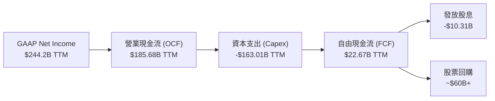

### 5.2 FCF 轉換率與 Capex 衝擊分析

Alphabet 當前正處於史上最大規模的 **AI 基礎設施超級週期（Capex Supercycle）**。這對自由現金流產生了顯著的短期壓抑：

| 期間 | 營業現金流 (OCF) | 資本支出 (Capex) | 自由現金流 (FCF) | OCF / Revenue | Capex / Revenue | FCF Yield |
|------|------------------|------------------|------------------|---------------|-----------------|-----------|
| **FY 2022** | $91.50B | -$31.48B | $60.01B | 32.3% | 11.1% | 4.8% |
| **FY 2023** | $101.75B | -$32.25B | $69.50B | 33.1% | 10.5% | 4.1% |
| **FY 2024** | $125.30B | -$52.53B | $72.76B | 35.8% | 15.0% | 3.2% |
| **FY 2025** | $164.71B | -$91.45B | $73.27B | 40.9% | 22.7% | 2.1% |
| **TTM (Q2 26)**| **$185.68B** | **-$163.01B** | **$22.67B** | **41.6%** | **36.6%** | **0.58%** |

*註：單季 Capex 在 2026 Q2 達到巨額的 $44.92B（高於 2026 Q1 的 $35.67B），導致單季 FCF 出現 -$5.86B 之狀況。*

**機構級洞察**：
1. **強勁的 OCF 證明核心業務極佳**：TTM OCF 高達 $185.68B（占營收 41.6%），表明 Alphabet 變現與造血能力處於歷史頂點。
2. **Capex 屬攻勢而非守勢**：$160B+ 的年化 Capex 投入於資料中心、英偉達 GPU、自研 Trillium TPU 及網絡骨幹，直接轉化為 Google Cloud 的營收高增長（YoY > 28%）與 Search AI Overviews 的運算壁壘。

### 5.3 自由現金流歷史區間

```
╔══════════════════════════════════════════════════════════════════╗
║               Alphabet FCF 與 Capex 演變 (FY22 - TTM)            ║
╠══════════════════════════════════════════════════════════════════╣
║                                                                  ║
║  FY2022  FCF: $60.01B  ████████████████████  Capex: $31.48B      ║
║  FY2023  FCF: $69.50B  █████████████████████ Capex: $32.25B      ║
║  FY2024  FCF: $72.76B  █████████████████████ Capex: $52.53B      ║
║  FY2025  FCF: $73.27B  █████████████████████ Capex: $91.45B      ║
║  TTM     FCF: $22.67B  █████░░░░░░░░░░░░░░░░ Capex: $163.01B     ║
║                                                                  ║
║  📊 結論：Capex 佔營收比飆升至 36.6%，投資期過後 FCF 將暴增      ║
╚══════════════════════════════════════════════════════════════════╝
```

### 5.4 資本配置策略

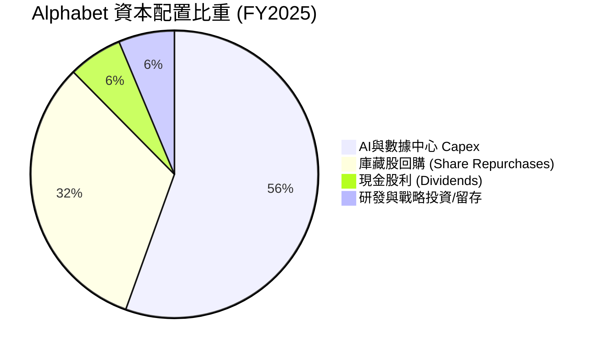

Alphabet 自 2024 年起發放股利（目前為每季 $0.22/股，殖利率約 0.28%），每年派息約 $10.3B。主要股東回饋仍以**股票回購**為主，每年投入 $60B-$70B，顯著抹平了 SBC 的股本稀釋效果，使流通股數穩定下降（自 2021 年以來降低約 5%）。

---

## 6. 獲利能力與資本效率

### 6.1 ROE / ROA / ROIC 趨勢

| 指標 | FY2022 | FY2023 | FY2024 | FY2025 | TTM | 產業均值 | 評估 |
|------|--------|--------|--------|--------|-----|----------|------|
| **ROE (股東權益報酬率)** | 23.6% | 26.0% | 30.8% | 31.8% | **48.7%** | ~18.0% | 🟢 頂級 |
| **ROA (總資產報酬率)** | 16.4% | 18.3% | 22.2% | 22.2% | **26.5%** | ~8.5% | 🟢 極其卓越 |
| **ROIC (投入資本回報率)** | 22.5% | 23.8% | 27.5% | 29.1% | **28.5%** | ~10.5% | 🟢 護城河極深 |

### 6.2 ROIC vs WACC 分析（核心價值創造判斷）

```
╔══════════════════════════════════════════════════════════════════╗
║                ROIC vs WACC 深度分析 (Alphabet)                 ║
╠══════════════════════════════════════════════════════════════════╣
║                                                                  ║
║  WACC 估算：                                                     ║
║  ├── 無風險利率 (10Y US Treasury)：  4.20%                       ║
║  ├── 市場風險溢酬 (ERP)：            5.00%                       ║
║  ├── Equity Beta：                   1.25                        ║
║  ├── 股權成本 (Cost of Equity)：     4.2% + 1.25×5.0% = 10.45%   ║
║  ├── 債務成本 (Cost of Debt 稅後)：  3.80% × (1 - 16%) = 3.19%   ║
║  ├── 資本結構：股權 ~88%，債務 ~12%                              ║
║  └── ✅ 估算 WACC ≈ 8.8%                                         ║
║                                                                  ║
║  ROIC 估算 (TTM)：                                               ║
║  ├── NOPAT = 營業利益 $147.63B × (1 - 16% 有效稅率) = $124.01B    ║
║  ├── 投入資本 (Invested Capital) = 股東權益 + 總債務 - 現金     ║
║  │   = $415.26B + $120.79B - $100.00B (保留必要營運資金)        ║
║  │   ≈ $436.05B                                                  ║
║  └── ✅ 估算 ROIC ≈ 28.44% (取 28.5%)                            ║
║                                                                  ║
║  ★ 經濟價值增加 (EVA) = ROIC - WACC = 28.5% - 8.8% = +19.7pp     ║
║                                                                  ║
║  ROIC  28.5%  ▓▓▓▓▓▓▓▓▓▓▓▓▓▓▓▓▓▓▓▓▓▓▓▓▓▓▓░  🟢                  ║
║  WACC   8.8%  ▓▓▓▓▓▓▓░░░░░░░░░░░░░░░░░░░░░░  ──                  ║
║  EVA  +19.7p  █████████████████████████░░░░  🏆 巨額價值創造    ║
║                                                                  ║
║  📊 結論：ROIC 為 WACC 的 3.24 倍，每投入 $1 資本可創造遠高於     ║
║     資金成本的回報，資本分配效率極其卓越。                       ║
╚══════════════════════════════════════════════════════════════════╝
```

### 6.3 杜邦三因素分解

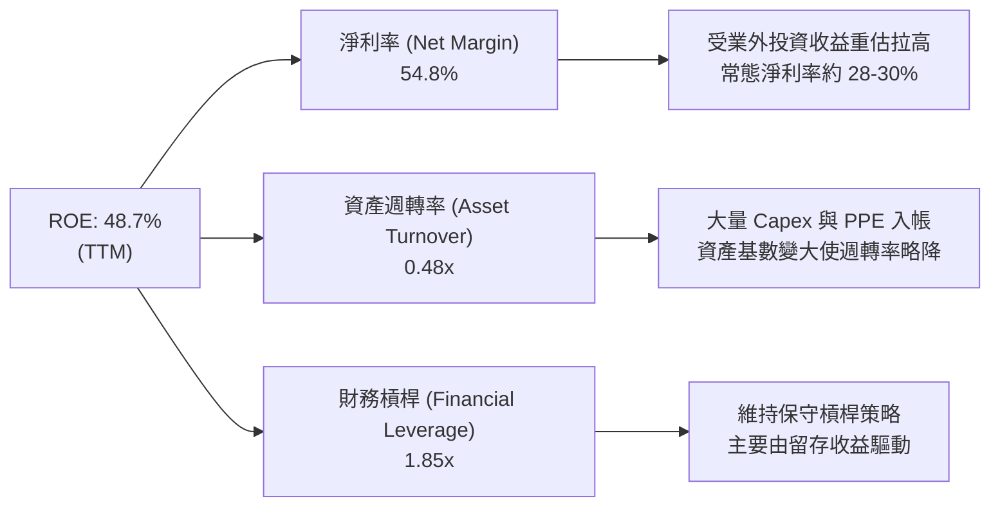

---

## 7. 估值深度分析

### 7.1 同業估值比較表格

在 Big Tech Megacaps（超大型科技股）中，Alphabet 依然享有相對最具吸引力的估值乘數：

| 估值指標 | **Alphabet (GOOG)** | **Microsoft (MSFT)** | **Amazon (AMZN)** | **Meta (META)** | 產業平均 | 機構估值評估 |
|----------|-------------------|---------------------|-------------------|-----------------|----------|--------------|
| **市值 ($T)** | **$3.90T** | $3.45T | $2.30T | $1.45T | - | 規模最大之一 |
| **Trailing P/E** | **16.0x** | 34.2x | 41.5x | 26.8x | 29.6x | 🟢 表面便宜 (含業外增益) |
| **Forward P/E** | **21.6x** | 29.5x | 32.0x | 22.5x | 26.4x | 🟢 折價明顯，具吸引力 |
| **P/S Ratio** | **8.75x** | 12.8x | 3.4x | 9.2x | 8.5x | 🟡 合理溢價 |
| **EV / EBITDA** | **21.9x** | 22.5x | 17.5x | 16.8x | 19.7x | 🟡 反映高品質與現金流 |
| **PEG Ratio** | **1.26x** | 2.10x | 1.65x | 1.15x | 1.60x | 🟢 成長調整後極具 CP 值 |
| **FCF Yield** | **0.58%** | 2.2% | 2.8% | 3.1% | 2.2% | 🔴 因超級 Capex 壓低 |

### 7.2 歷史估值區間分析

Alphabet 近 5 年 Forward P/E 交易區間介於 15.0x（2022 年底低點）至 28.5x（2021 年高點）之間，中位數約為 **22.5x**。當前 Forward P/E **21.6x** 處於歷史中位數下方，考量到營收成長加速（YoY +24%），評價並未高估。

### 7.3 情境目標價（假設驅動，Bear / Base / Bull）

估值模型基於未來 3 年（FY2026-FY2028）營業利益折現與 Terminal Multiples 計算，避免使用受一次性收益扭曲的 GAAP Net Income：

| 情境 | 營收 CAGR (26-28) | 營業利潤率 (Op Margin) | 退出 EV/EBITDA 倍數 | 隱含目標價 | 相對當前股價漲跌 | 發生機率 |
|------|-------------------|------------------------|--------------------|------------|------------------|----------|
| 🔴 **悲觀情境** | 8.5% | 29.0% (反壟斷裁決受損) | 16.0x | **$290.00** | **-9.1%** | 20% |
| 🟡 **基準情境** | **14.5%** | **34.5% (Cloud/AI展現槓桿)**| **20.5x** | **$420.00** | **+31.6%** | **60%** |
| 🟢 **樂觀情境** | 19.0% | 37.5% (Waymo/Gemini全面爆發)| 24.0x | **$485.00** | **+52.0%** | 20% |

### 7.4 DCF 敏感性分析（6格目標價矩陣）

**DCF 核心假設**：
*   預測期：2026 - 2030 (5 年)
*   終端成長率 (Terminal Growth Rate)：3.5%
*   基期 TTM NOPAT：$124.0B

| 營收 CAGR \ WACC | **8.0% (低利率/低 Beta)** | **8.8% (基準 WACC)** | **9.5% (高權益成本)** |
|------------------|---------------------------|----------------------|-----------------------|
| 🟢 **樂觀 (18.0%)** | $512.00 (+60.5%) | $485.00 (+52.0%) | $440.00 (+37.9%) |
| 🟡 **基準 (14.5%)** | **$455.00 (+42.6%)** | **$420.00 (+31.6%)** | **$385.00 (+20.7%)** |
| 🔴 **悲觀 (9.0%)** | $325.00 (+1.9%) | $290.00 (-9.1%) | $265.00 (-17.0%) |

### 7.5 估值綜合區間

```
╔══════════════════════════════════════════════════════════════════╗
║                    Alphabet 估值綜合區間與現價                   ║
╠══════════════════════════════════════════════════════════════════╣
║                                                                  ║
║  悲觀目標價：     $290.00  [ Anchor Low ]                        ║
║  當前市場股價：   $319.09  ◄───【當前買點安全邊際顯著】           ║
║  分析師平均目標價：$421.79  [ Wall Street Target ]               ║
║  基準 DCF 目標價： $420.00  [ Base Case Fair Value ]             ║
║  樂觀目標價：     $485.00  [ Bull Case Target ]                 ║
║                                                                  ║
║  $250     $300     $350     $400     $450     $500               ║
║   |--------|---▲----|--------|---▲----|--------|                 ║
║              現價 $319.09     基準價 $420.00                     ║
╚══════════════════════════════════════════════════════════════════╝
```

---

## 8. 成長催化劑

### 8.1 催化劑時間軸

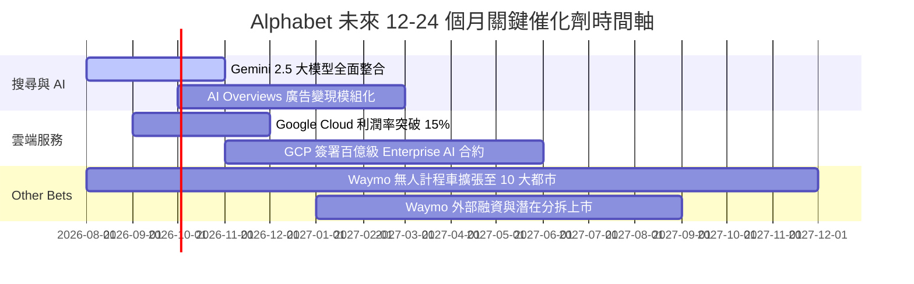

### 8.2 TAM 市場規模分析

```
╔══════════════════════════════════════════════════════════════════╗
║               Alphabet 核心目標市場規模 (TAM) 預測               ║
╠══════════════════════════════════════════════════════════════════╣
║                                                                  ║
║  1. 全球數位廣告市場 (Digital Ads TAM):                          ║
║     2026E: $740B ── Alphabet 當前滲透率 ~42%                     ║
║                                                                  ║
║  2. 雲端基礎設施與 PaaS (Cloud Infrastructure TAM):              ║
║     2026E: $450B ── Alphabet 當前滲透率 ~13.5% (巨量成長空間)    ║
║                                                                  ║
║  3. 生成式 AI 企業級軟體與 API (Enterprise AI TAM):              ║
║     2028E: $1.3T ── Alphabet 透過 Gemini + Vertex AI 爭奪前二     ║
║                                                                  ║
║  4. Robotaxi 與自動駕駛出行 (Autonomous Mobility TAM):           ║
║     2030E: $800B ── Waymo 具備先發壟斷優勢                       ║
╚══════════════════════════════════════════════════════════════════╝
```

### 8.3 成長驅動力結構圖

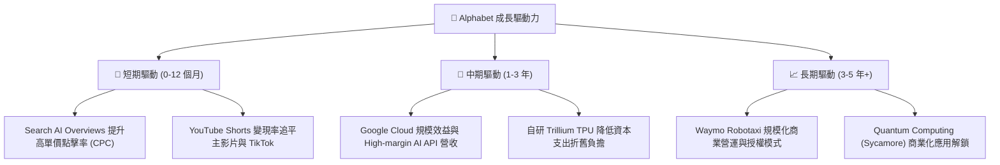

---

## 9. 風險矩陣

### 9.1 風險評分矩陣

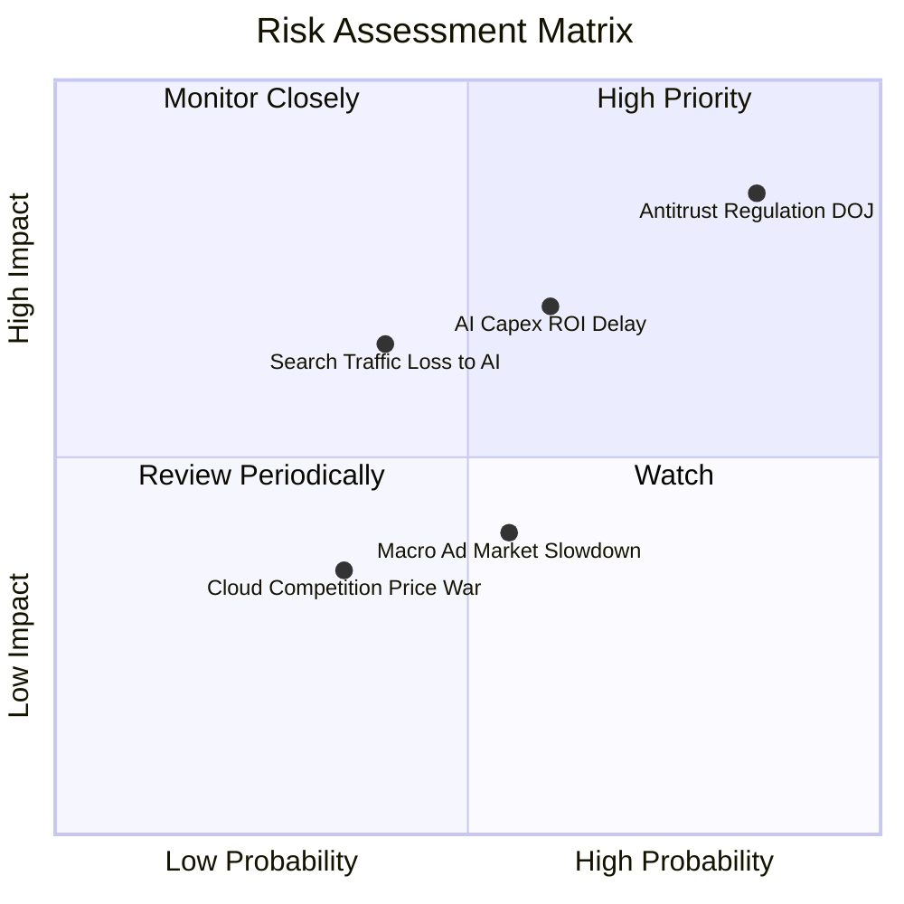

### 9.2 風險清單詳細分析

| # | 風險項目 | 發生機率 | 財務衝擊 | 風險評分 | 機構緩解措施與觀察重點 |
|---|----------|----------|----------|----------|------------------------|
| 1 | 🔴 **司法部 (DOJ) 反壟斷處置** | 高 (85%) | 高 (-15% 估值) | 🔴 **8.2/10** | **關鍵**：若法院判決禁付 Apple 預設搜尋費用（每年約 $20B），雖然損失流量入口，但也將**節省巨額 TAC 費用**，短期陣痛後營業利潤率反而可能提升。 |
| 2 | 🟡 **AI Capex 投資回報率 (ROI) 滯後** | 中 (60%) | 中高 (-10% FCF) | 🟡 **6.5/10** | 密切追蹤 Google Cloud YoY 成長率是否維持 > 25%，以及每美元 Capex 帶動之雲端 Incremental Revenue。 |
| 3 | 🟡 **生成式 AI 分流傳統搜尋點擊** | 中 (40%) | 中高 (-8% 廣告收入) | 🟡 **5.5/10** | 公司正透過 AI Overviews 將用戶留存在生態系內，並在中插播贊助商廣告（Sponsoring），逐步驗證變現可行性。 |
| 4 | 🟢 **總體經濟放緩壓抑廣告支出** | 中 (55%) | 中 (-5% 營收) | 🟢 **4.0/10** | Alphabet 廣告組合（搜尋+YouTube）屬於 Performance Advertising（成效型廣告），在景氣衰退期抵抗力顯著高於品牌廣告。 |

---

## 10. 投資建議

### 10.1 最終綜合評級雷達圖

```
╔══════════════════════════════════════════════════════════════╗
║               Alphabet (GOOG) 投資評級儀表板                 ║
╠══════════════════════════════════════════════════════════════╣
║ 評級結果：  🟢 強力買入（Strong Buy）                        ║
║ 投資意向：  長線核心配置（Core Holding）                      ║
╠══════════════════════════════════════════════════════════════╣
║ 護城河強度：9.2/10  ▓▓▓▓▓▓▓▓▓▓▓▓▓▓▓▓▓▓▓█  極深               ║
║ 財務安全性：9.8/10  ▓▓▓▓▓▓▓▓▓▓▓▓▓▓▓▓▓▓▓█  無懈可擊           ║
║ 獲利品質：  8.2/10  ▓▓▓▓▓▓▓▓▓▓▓▓▓▓▓░░░░░  優良 (需剔除業外)  ║
║ 成長動能：  8.5/10  ▓▓▓▓▓▓▓▓▓▓▓▓▓▓▓▓░░░░  強勁               ║
║ 估值吸引力：8.0/10  ▓▓▓▓▓▓▓▓▓▓▓▓▓▓░░░░░░  物超所值           ║
╠══════════════════════════════════════════════════════════════╣
║ 綜合總評分：8.8/10  ▓▓▓▓▓▓▓▓▓▓▓▓▓▓▓▓▓▓░░  🟢 強力推薦配置     ║
╚══════════════════════════════════════════════════════════════╝
```

### 10.2 目標價與隱含報酬率

| 情境 | 機率權重 | 目標價 | 相對當前股價 ($319.09) 漲跌幅 | 隱含期望值貢獻 |
|------|----------|--------|------------------------------|----------------|
| 🔴 **悲觀情境** | 20% | $290.00 | -9.1% | -$18.18 |
| 🟡 **基準情境** | 60% | **$420.00** | **+31.6%** | **+$252.00** |
| 🟢 **樂觀情境** | 20% | $485.00 | +52.0% | +$97.00 |
| **加權加總期望值**| **100%** | **$407.00** | **+27.5% 期望報酬率** | - |

### 10.3 買入時機與觸發因素

```
╔══════════════════════════════════════════════════════════════════╗
║                  ✅ 建倉與加碼 Checklist                         ║
╠══════════════════════════════════════════════════════════════════╣
║                                                                  ║
║  分批買入觸發條件：                                              ║
║  ✅ 現價 ($319.09) 位於 Forward P/E 21.6x，低於歷史均值，可先建   ║
║     第一筆基礎部位 (30%-50%)。                                    ║
║  ☐ 若因反壟斷訴訟非理性恐慌回檔至 $280 - $300 區間（悲觀價位），  ║
║     強烈建議全力加碼至滿額部位 (Aggressive Buy)。                ║
║                                                                  ║
║  加碼條件 (Conviction Boosters)：                               ║
║  ☐ Google Cloud 單季營收 YoY 成長率持續 > 25% 且 Op Margin > 12% ║
║  ☐ AI Overviews 搜尋單價 (CPC) 確認無損害傳統搜尋獲利能力       ║
║  ☐ Waymo 宣佈大規模商業化授權或引進戰略投資人                   ║
║                                                                  ║
║  減碼/停損條件 (Risk Triggers)：                                 ║
║  ☐ 司法部強制 split-up (拆分) 核心搜尋與 Android 生態系         ║
║  ☐ Google Cloud 營收成長率連續兩季跌破 12%                       ║
╚══════════════════════════════════════════════════════════════════╝
```

### 10.4 投資人適配度分析

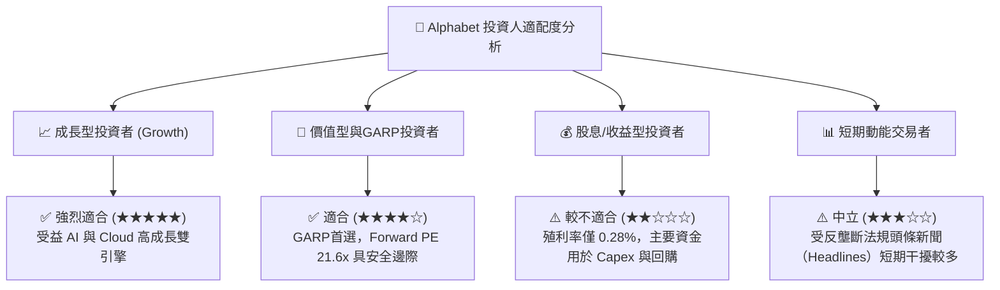

### 10.5 每季財報監控清單（Quarterly Watch List）

為確保本報告論點持續有效，投資人應在未來的每季財報中追蹤以下數據與指標：

| 監控指標 | 基準值 (Current TTM) | 健康區間 (Maintain) | 警訊觸發點 (Red Flag) |
|----------|----------------------|--------------------|-----------------------|
| **Google Cloud YoY 營收成長** | 28.5% | > 22.0% | < 15.0% (顯著放緩) |
| **Google Cloud 營業利潤率** | ~10.5% | > 10.0% | < 5.0% (規模效益消失) |
| **搜尋與其他廣告營收 YoY** | 13.8% | > 8.0% | < 3.0% (被 AI 分流) |
| **單季 Capex 規模** | $44.92B | $30B - $45B | > $55B (若 Cloud 無對應成長) |
| **流量取得成本 (TAC) / 廣告營收** | ~21.2% | < 22.5% | > 25.0% (管道成本暴漲) |

### 10.6 反面論證：什麼會證明論點錯誤（What Would Change My Mind）

```
╔══════════════════════════════════════════════════════════════════╗
║              ⚠️ 多頭論點失效條件 (Disconfirming Evidence)         ║
╠══════════════════════════════════════════════════════════════════╣
║  本研究報告所給予之「強力買入」評級，若出現下列量化條件時即失效： ║
║                                                                  ║
║  1. 核心搜尋業務點擊量 (Paid Clicks) 連續兩季出現 YoY 負成長，   ║
║     證明 OpenAI/Perplexity 等 AI 產品對傳統搜尋造成實質結構侵蝕。 ║
║                                                                  ║
║  2. 巨額 Capex 投入（年化 > $140B）持續 6 季以上，但 Google      ║
║     Cloud 營收成長率降至 15% 以下，導致 ROIC 跌破 15%。          ║
║                                                                  ║
║  3. 反壟斷裁決禁止 Alphabet 支付任何 TAC 費用，且歐盟強制拆分    ║
║     Google AdTech 平台，造成廣告供應鏈利潤流失超過 25%。         ║
║                                                                  ║
║  4. 自由現金流 (FCF) 因資本支出失控連續兩季轉負且未能改善。       ║
╚══════════════════════════════════════════════════════════════════╝
```

---

> **免責聲明**：本報告係基於公開財務數據與機構研究模型之基本面分析，旨在提供客觀研究參考，並不構成任何個人化之投資建議、買賣要約或推薦。投資涉及風險，證券價格可升可跌，投資人應依據個人財務狀況與風險承受能力獨立做出投資決策。