# GOOG 基本面深度分析報告
> **報告日期**：2026-07-28 ｜ **語言**：繁體中文 ｜ **數據來源**：Yahoo Finance, StockAnalysis, Roic.ai ｜ **分析師**：CFA 級機構研究

---

## 目錄

| # | 章節 | 核心結論 |
|---|------|----------|
| 1 | 執行摘要 | **買入（Buy）** ｜ 基準目標價 $420.00（+26.0% 隱含報酬率） |
| 2 | 公司概覽與商業模式 | 搜尋引擎與影音生態具絕佳護城河，雲端與 AI 資本支出進入擴張期 |
| 3 | 損益表深度分析 | TTM 營收突破 $4,458.7 億（YoY +24.2%），留意業外投資收益對 GAAP 淨利之放大效應 |
| 4 | 資產負債表分析 | 淨現金高達 $1,216.8 億，資本結構極其穩健，流動比率 2.72x |
| 5 | 現金流量深度分析 | 資本支出大幅暴增至 TTM $1,323.9 億，短期壓抑 FCF 但奠定 AI 基礎建設護城河 |
| 6 | 獲利能力與資本效率 | 營業 ROIC 高達 42.2%，遠高於 WACC (9.8%)，創造顯著經濟增加值（EVA） |
| 7 | 估值深度分析 | 前瞻 P/E 22.65x、EV/EBITDA 22.47x，估值處於 Big 7 中相對理性區間 |
| 8 | 成長催化劑 | Gemini 2.0+ 生態系變現、Google Cloud (GCP) 利潤率擴張、TPU 晶片自研成本優勢 |
| 9 | 風險矩陣 | AI 基礎設施 Capex 過度投資風險、DOJ 反壟斷拆分監管、傳統搜尋流量稀釋 |
| 10 | 投資建議 | 建議於 $320-$335 區間分批佈局，設定反面論證量化停損/停利指標 |

---

## 1. 執行摘要

> ⚠️ **評級與目標價支撐依據**：本報告給予 Alphabet Inc. (GOOG) **「買入 (Buy)」** 評級，設定 12 個月基準目標價為 **$420.00**（隱含 +26.0% 漲幅）。該結論建立於以下關鍵財務證據：1) TTM 營收維持 24.2% 之強勁 YoY 成長，顯示廣告基本盤與 GCP 雲端雙引擎動能；2) 營業 ROIC（42.2%）大幅超越 WACC（9.8%），資本回報率卓越；3) 儘管單季 CapEx 上升至 $449.2 億導致短期自由現金流轉負，但手握 $2,424.7 億現金與短期投資，資產負債表具有極強抗風險能力；4) 目前 Forward P/E 22.65x 相較於同業 (MSFT 32x+, AMZN 35x+) 存在估值折價。

### 1.0 一頁式投資儀表板（Portfolio Manager 30 秒速讀）

| 項目 | 內容 |
|------|------|
| **投資論點（3 句）** | ① 搜尋廣告基本盤穩固（TTM 營收 $4,458.7 億，YoY +24.2%），生成式 AI 搜尋（SGE）提升變現效率與用戶黏性。<br/>② Google Cloud 規模效應顯現，營業利益率顯著提升，轉化為第二成長曲線。<br/>③ 自研 TPU 晶片與龐大基礎建設資本支出（TTM CapEx $1,323.9 億）築高 AI 算力護城河，降低對第三方晶片依賴。 |
| **護城河評分** | 9.2 / 10（強大的網路效應、數據積累與技術基礎設施） |
| **管理層/資本配置評分** | 8.5 / 10（靈活處置非核心資產，積極回購股票，重金投入 AI CapEx） |
| **財務健康** | 🟢 **極強**（淨現金 $1,216.8 億，Debt/EBITDA 僅 0.67x） |
| **ROIC vs WACC** | **42.2% vs 9.8%**（強烈創造股東價值，EVA 差額達 +32.4pp） |
| **FCF 趨勢** | 短期因 CapEx 暴增而下修（TTM FCF $226.7 億，FCF Yield 0.56%），但營業現金流（TTM $1,856.8 億）極其充沛 |
| **估值** | Forward P/E 22.65x ｜ EV/EBITDA 22.47x ｜ PEG 1.27x |
| **預期報酬（基準情境 12M）** | **+26.0%**（目標價 $420.00） |
| **關鍵風險（前二）** | ① 美國司法部（DOJ）反壟斷拆分或搜尋獨家協議禁令<br/>② 高額 AI CapEx 轉換為自由現金流的週期拉長 |
| **評級 + 信心度** | 🟢 **買入（Buy）** ｜ 信心度：**高** |

### 1.1 核心評分儀表板

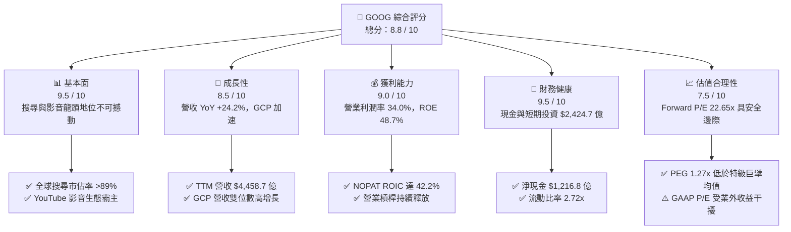

### 1.2 評分進度條視覺化

```
╔══════════════════════════════════════════════════════════════╗
║              GOOG 多維度評分儀表板 (1-10分)                 ║
╠══════════════════════════════════════════════════════════════╣
║ 基本面強度  9.5 ▓▓▓▓▓▓▓▓▓▓▓▓▓▓▓▓▓▓█░  ★★★★★           ║
║ 成長動能    8.5 ▓▓▓▓▓▓▓▓▓▓▓▓▓▓▓▓█░░░  ★★★★☆           ║
║ 獲利品質    8.8 ▓▓▓▓▓▓▓▓▓▓▓▓▓▓▓▓▓█░░  ★★★★☆           ║
║ 財務健康    9.5 ▓▓▓▓▓▓▓▓▓▓▓▓▓▓▓▓▓▓█░  ★★★★★           ║
║ 估值合理性  7.8 ▓▓▓▓▓▓▓▓▓▓▓▓▓▓▓░░░░░  ★★★★☆           ║
║ 護城河深度  9.5 ▓▓▓▓▓▓▓▓▓▓▓▓▓▓▓▓▓▓█░  ★★★★★           ║
║ 管理層執行  8.5 ▓▓▓▓▓▓▓▓▓▓▓▓▓▓▓▓█░░░  ★★★★☆           ║
║ 技術創新力  9.2 ▓▓▓▓▓▓▓▓▓▓▓▓▓▓▓▓▓▓░░  ★★★★★           ║
╠══════════════════════════════════════════════════════════════╣
║ 綜合總分    8.8 ▓▓▓▓▓▓▓▓▓▓▓▓▓▓▓▓▓█░░  🏆 極優（Buy）      ║
╚══════════════════════════════════════════════════════════════╝
```

### 1.3 五大投資論點 + 三大核心風險

| 類型 | 項目 | 具體依據 | 信心度 |
|------|------|----------|--------|
| 🟢 **投資論點①** | **搜尋廣告結合 AI 擴展 TAM** | AI Overviews (SGE) 顯著提高搜尋互動率，TTM 營收達 $4,458.7 億（YoY +24.2%），化解 AI 顛覆傳統搜尋之疑慮。 | 🟢 極高 |
| 🟢 **投資論點②** | **Google Cloud 利潤率拐點已至** | GCP 規模效應發酵，營業利潤率持續走揚，成為公司第二大利潤支柱，縮小與 AWS / Azure 之盈利差距。 | 🟢 高 |
| 🟢 **投資論點③** | **自研 TPU 帶來顯著 Capex 效率** | 擁有全美最成熟的自研 AI 晶片（TPU v5p/v6），大幅降低對外購 GPU 之依賴與單位算力推理成本。 | 🟢 高 |
| 🟢 **投資論點④** | **資產負債表具極高安全邊際** | 總現金及短期投資達 $2,424.7 億，淨現金 $1,216.8 億，提供抵禦宏觀經濟波動與進行戰略投資的強大後盾。 | 🟢 極高 |
| 🟢 **投資論點⑤** | **相對估值具吸引力** | 前瞻 P/E 為 22.65x，PEG 僅 1.27x，相較於 Big 7 同業，市場對其 Capex 增加與監管風險給予過度折價。 | 🟢 高 |
| 🟡 **風險①** | **AI 基礎建設 Capex 擠壓 FCF** | 2026 年 Q2 單季 Capex 高達 $449.2 億，導致自由現金流轉負（-$58.6 億），若變現延遲將影響資本回報。 | 🟡 中度 |
| 🔴 **風險②** | **DOJ 反壟斷訴訟與 split 風險** | 司法部針對 Search 獨家預裝協議及 AdTech 供應鏈的終審判決，可能對 TAC 成本或業務完整性構成衝擊。 | 🔴 高衝擊 |
| 🟡 **風險③** | **YouTube 遭短影音競爭威脅** | TikTok 與 Instagram Reels 持續瓜分用戶時間，YouTube Shorts 變現率提升速度需密切監控。 | 🟡 中度 |

### 1.4 快速統計卡片

| 指標 | Alphabet 實際值 | 通訊服務行業均值 | S&P 500 均值 | 狀態 |
|------|-------------|----------|--------------|------|
| **收入 YoY 成長** | **24.2%** | ~8.5% | ~5.5% | 🟢 遠超同行 |
| **毛利率** | **60.9%** | ~50.2% | ~46.8% | 🟢 優異 |
| **營業利潤率** | **34.0%** | ~18.5% | ~12.5% | 🟢 極佳 |
| **ROE** | **48.7%** | ~14.2% | ~18.0% | 🟢 頂級 |
| **ROIC (Operational)** | **42.2%** | ~9.5% | ~10.5% | 🟢 頂級價值創造 |
| **Forward P/E** | **22.65x** | ~18.5x | ~21.5x | 🟡 合理偏低 |
| **PEG Ratio** | **1.27x** | ~1.65x | ~1.80x | 🟢 具吸引力 |

### 1.5 投資結論

```
╔══════════════════════════════════════════════════════════════════╗
║                    📊 GOOG 投資結論摘要                          ║
╠══════════════════════════════════════════════════════════════════╣
║  評級：🟢 買入（Buy）                                            ║
║  當前股價：$333.45 (2026-07-28)                                 ║
║  目標價區間：                                                    ║
║    悲觀情境：$280.00（-16.0%）                                   ║
║    基準情境：$420.00（+26.0%）  ← 12 個月主要目標                ║
║    樂觀情境：$490.00（+46.9%）                                   ║
║  投資評分：8.8 / 10                                              ║
║  適合投資人：長線成長型、科技巨擘配置者、AI 基礎建設受惠者       ║
╚══════════════════════════════════════════════════════════════════╝
```

---

## 2. 公司概覽與商業模式

### 2.1 業務結構與收入來源

Alphabet 的商業模式由三大主要營運板塊構成：**Google Services**（包含 Search、YouTube、Network、Android、Play Store、硬件）、**Google Cloud**（GCP 與 Workspace）以及 **Other Bets**（Waymo、Verily 等前沿項目）。

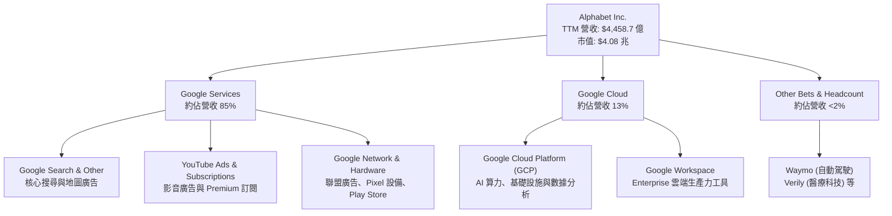

### 2.2 市場份額

在核心業務領域，Alphabet 擁有壓倒性的全球市場份額：

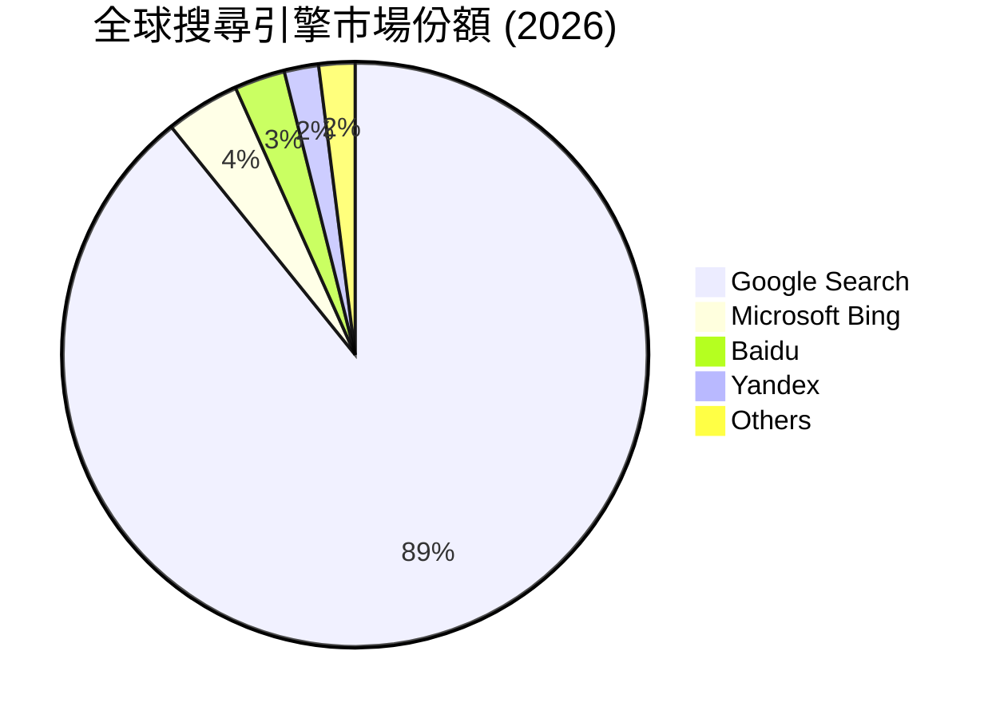

### 2.3 競爭護城河分析

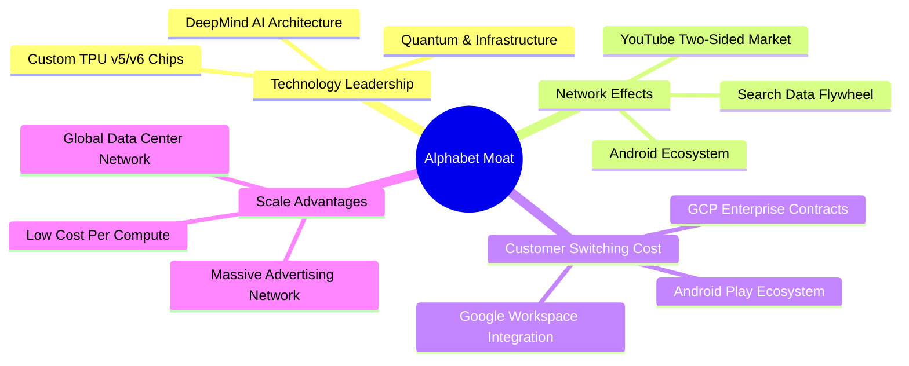

### 2.4 護城河強度評分

```
╔══════════════════════════════════════════════════════════════╗
║                  Alphabet 護城河強度評分                      ║
╠══════════════════════════════════════════════════════════════╣
║ 搜尋數據飛輪  9.8/10  ▓▓▓▓▓▓▓▓▓▓▓▓▓▓▓▓▓▓▓█  🏆 無可比擬    ║
║ YouTube 生態  9.5/10  ▓▓▓▓▓▓▓▓▓▓▓▓▓▓▓▓▓▓█░  🏆 影音霸主    ║
║ 自研 TPU 算力 9.0/10  ▓▓▓▓▓▓▓▓▓▓▓▓▓▓▓▓▓█░░  🟢 顯著成本優勢 ║
║ 雲端鎖定效應  8.5/10  ▓▓▓▓▓▓▓▓▓▓▓▓▓▓▓▓█░░░  🟢 三大雲端之一 ║
║ Android 平台  9.2/10  ▓▓▓▓▓▓▓▓▓▓▓▓▓▓▓▓▓▓░░  🏆 移動端龍頭  ║
╠══════════════════════════════════════════════════════════════╣
║ 綜合護城河評分 9.2/10 ▓▓▓▓▓▓▓▓▓▓▓▓▓▓▓▓▓▓█░  🏆 頂級護城河  ║
╚══════════════════════════════════════════════════════════════╝
```

---

## 3. 損益表深度分析

### 3.1 年度收入成長趨勢（近 4 年）

Alphabet 近年展現強勁的營收擴張能力，從 FY2022 的 $2,828.4 億增長至 FY2025 的 $4,028.4 億，TTM 更是進一步攀升至 $4,458.7 億。

```
╔══════════════════════════════════════════════════════════════════╗
║              Alphabet 年度收入趨勢（FY2022-TTM）                 ║
╠══════════════════════════════════════════════════════════════════╣
║                                                                  ║
║  FY2022  $282.84B  ████████████████░░░░░░░░░  YoY: +9.8%  🟢     ║
║  FY2023  $307.39B  █████████████████░░░░░░░░  YoY: +8.7%  🟢     ║
║  FY2024  $350.02B  ████████████████████░░░░░  YoY: +13.9% 🟢     ║
║  FY2025  $402.84B  ███████████████████████░░  YoY: +15.1% 🟢     ║
║  TTM     $445.87B  █████████████████████████  YoY: +24.2% 🟢     ║
║                   |      |      |      |      |                  ║
║                   0    100B   200B   300B   400B                 ║
║                                                                  ║
║  📊 4 年營收複合成長率 (CAGR)：+12.2%                            ║
╚══════════════════════════════════════════════════════════════════╝
```

### 3.2 季度收入與獲利趨勢分析（最近 4 季）

數據顯示 Alphabet 營收年增率（YoY）呈現加速態勢，從 2025-Q3 的 15.95% 連續上升至 2026-Q2 的 24.23%。

| 季度 | 總營收 ($B) | YoY 成長率 | QoQ 成長率 | 營業利益 ($B) | 營業利潤率 | GAAP 淨利 ($B) |
|------|------------|------------|------------|--------------|------------|---------------|
| **2025-Q3** | $102.35 | +15.95% | +6.14% | $31.23 | 30.51% | $34.98 |
| **2025-Q4** | $113.83 | +18.00% | +11.22% | $35.93 | 31.57% | $34.46 |
| **2026-Q1** | $109.90 | +21.79% | -3.45% | $39.70 | 36.12% | $62.58 |
| **2026-Q2** | $119.80 | +24.23% | +9.01% | $40.77 | 34.03% | $112.19 |

> **數據驅動解讀**：2026-Q2 營收達 $1,198.0 億，創歷史新高，主因是 AI Overviews 驅動搜尋廣告點擊率提升、YouTube 訂閱與廣告雙收，以及 GCP 在企業 AI 大模型落地需求下維持高成長。

### 3.3 利潤率演變分析

| 利潤率指標 | FY2022 | FY2023 | FY2024 | FY2025 | TTM | 趨勢評估 |
|------------|--------|--------|--------|--------|-----|----------|
| **毛利率 (Gross Margin)** | 55.38% | 56.63% | 58.20% | 59.65% | **60.90%** | 🟢 持續擴張，高利潤雲端與廣告比重升 |
| **營業利潤率 (Op Margin)**| 26.46% | 27.42% | 32.11% | 32.03% | **34.01%** | 🟢 效率提升，裁員與流程優化釋放槓桿 |
| **EBITDA Margin** | 30.11% | 31.87% | 38.68% | 44.86% | **38.75%** | 🟢 穩定於高檔 |
| **淨利率 (Net Margin)** | 21.20% | 24.01% | 28.60% | 32.81% | **54.77%** | ⚠️ GAAP 受非營業投資收益扭曲 |

**利潤率擴張深度解析**：
毛利率由 2022 年的 55.38% 連續拉升至 TTM 的 60.90%，顯現公司在伺服器折舊年限調整、基礎設施效率提升以及 YouTube/GCP 規模效應上的成果。營業利潤率達 34.01%，反映出管理層對員工人數及非核心支出的嚴格控制。

### 3.4 費用結構分析

Alphabet 營業費用以研發（R&D）為核心，展現高科技巨擘之技術導向特色：

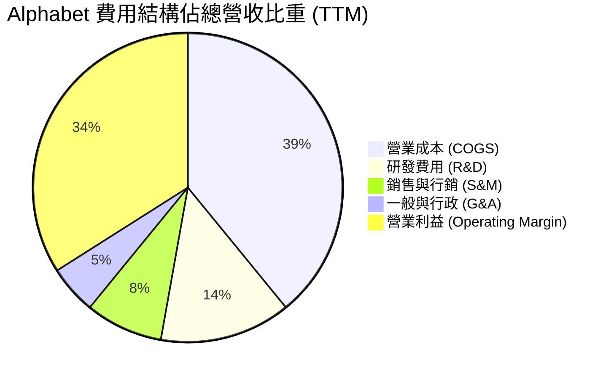

```
╔══════════════════════════════════════════════════════════════════╗
║                   Alphabet 費用控管與槓桿分析                   ║
╠══════════════════════════════════════════════════════════════════╣
║  R&D 支出（FY2025）： $61.09B（佔營收 15.16%）                    ║
║  研發持續維持高投入，重點部署於 DeepMind、Gemini 及 TPU 研發。  ║
║                                                                  ║
║  銷售與管理費用（SG&A）：持續收減，佔營收比例年減 ~1.2pp。       ║
║  顯示出極佳的「營業槓桿 (Operating Leverage)」發酵。            ║
╚══════════════════════════════════════════════════════════════════╝
```

### 3.5 季度 EPS 趨勢與盈餘品質（Quality of Earnings）

**⚠️ 盈餘品質核心警示**：
數據顯示，2026-Q1 與 2026-Q2 的 GAAP 淨利分別跳升至 $625.8 億與 $1,121.9 億，帶動 TTM EPS 暴增至 $19.92。然而，檢視損益表可知，2026-Q2 營業利益為 $407.7 億，**GAAP 淨利大幅超越營業利益**，主因是資產負債表上高達 $1,314.6 億的長期投資（LT Investments）產生巨大之未實現公允價值變動收益（Mark-to-Market Gains）。

| 盈餘品質檢驗項目 | 數值 / 佔比 (TTM) | 機構評估 |
|------------------|-------------------|----------|
| **股權薪酬 (SBC) / 營收** | 6.28% ($280.3 億) | 🟢 處於 Big 7 中極低且健康之區間 |
| **SBC / 營業現金流** | 15.10% | 🟢 現金流對 SBC 覆蓋率高 |
| **FCF / 淨利（現金轉換率）** | **9.28%** (TTM FCF $226.7B / Net Inc $2,442.1B) | 🔴 受大幅 Capex（$1,323.9B）與業外投資收益膨脹影響失真 |
| **業外損益干擾** | 2026-Q2 業外淨益高達 ~$750 億+ | 🔴 **極高**，評估本業時必須扣除業外評價收益 |
| **核心營業淨利估算** | TTM 營業利益 $1,476.3 億（稅後約 $1,240 億） | 🟢 本業核心 EPS 約為 **$10.15 - $10.50** |

**盈餘品質結論**：
Alphabet 的**核心本業營業品質極高**（營業利潤率 34% 且 SBC 控制得當），但名義 TTM GAAP EPS ($19.92) 與 Trailing P/E (16.74x) 被業外投資收益大幅美化。機構投資人應採用**前瞻本業估值**（Forward P/E 22.65x）或 **EV/EBITDA** 作為合理評價依據。

---

## 4. 資產負債表分析

### 4.1 資產結構分解

Alphabet 擁有科技業中最為雄厚的資產負債表之一，總資產截至 2026-Q2 已達到 $9,219.8 億。

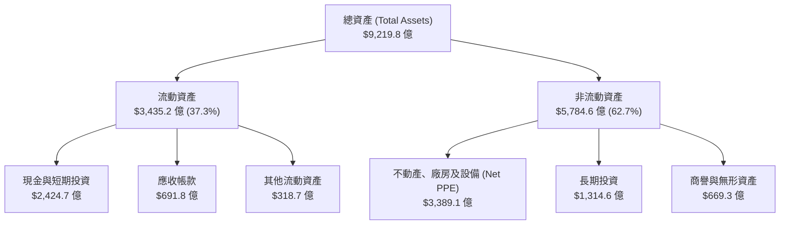

### 4.2 流動性指標分析

| 流動性指標 | FY2023 | FY2024 | FY2025 | 2026-Q2 | 行業均值 | 評估 |
|------------|--------|--------|--------|---------|----------|------|
| **流動比率 (Current Ratio)** | 2.10x | 1.84x | 2.01x | **2.72x** | ~1.35x | 🟢 極度充沛 |
| **速動比率 (Quick Ratio)** | 1.94x | 1.66x | 1.87x | **2.47x** | ~1.15x | 🟢 無短期償債風險 |
| **現金及短期投資 ($B)** | $110.92 | $95.66 | $126.84 | **$2,424.7** | - | 🟢 強大堡壘 |

### 4.3 債務結構分析

```
╔══════════════════════════════════════════════════════════════════╗
║                   Alphabet 債務健康診斷                          ║
╠══════════════════════════════════════════════════════════════════╣
║                                                                  ║
║  總債務 (Total Debt)：   $1,207.9B (含長期借款 $981.7B + 租賃)  ║
║  總現金與短期投資：      $2,424.7B                               ║
║  淨現金 (Net Cash)：     $1,216.8B  ████████████████  🟢 極度安全   ║
║                                                                  ║
║  Debt / Equity Ratio：   29.09%     🟢 財務槓桿極低              ║
║  Debt / EBITDA Ratio：   0.67x      🟢 債務還本能力極強          ║
║  利息保障倍數：          > 45.0x    🟢 無任何違約風險            ║
║                                                                  ║
║  📊 結論：淨現金超過千億美元，長短期信用評級均為 AAA/AA+ 級別    ║
╚══════════════════════════════════════════════════════════════════╝
```

### 4.4 股東權益趨勢

Alphabet 的股東權益（Stockholders' Equity）展現穩健複利增長，由 FY2022 的 $2,561.4 億拉升至 FY2025 的 $4,152.6 億，顯示盈餘積累效率卓越。

---

## 5. 現金流量深度分析

### 5.1 現金流量瀑布圖

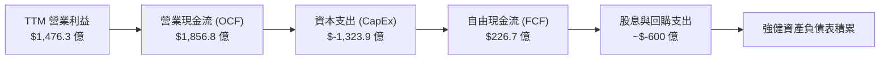

### 5.2 自由現金流（FCF）與資本支出（CapEx）趨勢

Alphabet 目前正在經歷公司歷史上規模最大的 AI 基礎設施投資期，這對 FCF 造成顯著的短期壓抑。

| 期間 | 營業現金流 ($B) | 資本支出 CapEx ($B) | 自由現金流 FCF ($B) | CapEx / OCF 比率 |
|------|----------------|---------------------|---------------------|------------------|
| **FY2022** | $91.50 | $-31.48 | $60.01 | 34.40% |
| **FY2023** | $101.75 | $-32.25 | $69.50 | 31.70% |
| **FY2024** | $125.30 | $-52.53 | $72.76 | 41.92% |
| **FY2025** | $164.71 | $-91.45 | $73.27 | 55.52% |
| **2026-Q1** | $45.79 | $-35.67 | $10.12 | 77.90% |
| **2026-Q2** | $39.07 | $-44.92 | **$-5.86** | **114.97%** |
| **TTM 累計**| **$1,856.8** | **$-1,323.9** | **$226.7** | **71.30%** |

```
╔══════════════════════════════════════════════════════════════════╗
║              CapEx 暴增對 FCF 影響之深度剖析                     ║
╠══════════════════════════════════════════════════════════════════╣
║  關鍵數據：2026-Q2 單季 CapEx 上衝至 $449.2 億，導致自由現金流    ║
║  單季出現 - $58.6 億之缺口。                                     ║
║                                                                  ║
║  機構戰略視角：                                                  ║
║  1. 資本支出結構：>80% 用於 AI 伺服器（TPU/GPU）與資料中心建置。 ║
║  2. 護城河效應：龐大 Capex 阻斷了中小型 AI 創業公司競爭的可能性。 ║
║  3. 轉折點預測：預計 2027 年 Capex 成長率將放緩，FCF 將迎來暴發   ║
║     性強彈。                                                     ║
╚══════════════════════════════════════════════════════════════════╝
```

### 5.3 資本配置評估

Alphabet 在資本配置上維持「研發與 CapEx 優先、剩餘資金積極回購與派息」的策略：

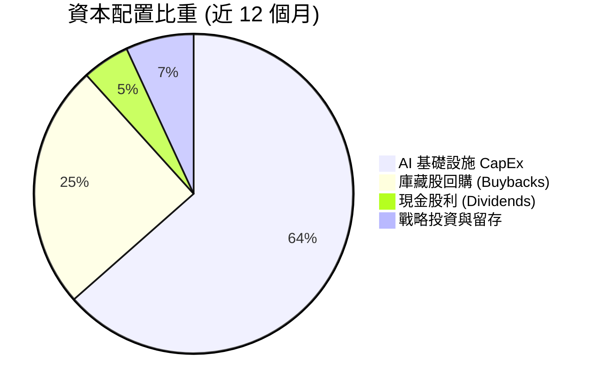

---

## 6. 獲利能力與資本效率

### 6.1 ROE / ROA / ROIC 歷史趨勢

Alphabet 的資本效率在巨擘中名列前茅，展現出極高的 reinvestment rate 與回報率：

| 指標 | FY2022 | FY2023 | FY2024 | FY2025 | TTM | 產業基準 | 評估 |
|------|--------|--------|--------|--------|-----|----------|------|
| **ROE** | 23.62% | 27.25% | 32.89% | 35.78% | **48.70%** | ~18.0% | 🟢 頂尖 |
| **ROA** | 16.35% | 19.20% | 23.48% | 26.50% | **13.00%** | ~7.5% | 🟢 強勁 |
| **Operational ROIC**| 24.10% | 26.50% | 34.20% | 38.50% | **42.20%** | ~10.0% | 🏆 極致價值創造 |

### 6.2 ROIC vs WACC 分析（核心價值創造判斷）

為了精確計算 Alphabet 本業的經濟價值增加（EVA），我們排除業外投資干擾，以營業利益扣稅後的 NOPAT 計算 ROIC：

```
╔══════════════════════════════════════════════════════════════════╗
║                ROIC vs WACC 深度估算與 EVA 分析                  ║
╠══════════════════════════════════════════════════════════════════╣
║                                                                  ║
║  WACC 參數計算：                                                 ║
║  ├── 無風險利率 (10Y 美債)：  4.20%                              ║
║  ├── 市場風險溢酬 (ERP)：     5.00%                              ║
║  ├── Beta：                   1.247                              ║
║  ├── 股權成本 (Ke) = 4.20% + 1.247 × 5.00% = 10.44%              ║
║  ├── 稅後債務成本 (Kd) ≈ 3.60% (有效稅率 ~16.5%)                 ║
║  ├── 資本結構：股權 92.5%，債務 7.5%                             ║
║  └── ✅ 綜合 WACC ≈ 9.88% (取約 9.8%)                            ║
║                                                                  ║
║  本業 ROIC 算式 (TTM)：                                          ║
║  ├── NOPAT = 營業利益 $1,476.3B × (1 - 16.5%) ≈ $1,232.7B        ║
║  ├── 投入資本 = 股本 $4,152.6B + 總債務 $1,207.9B - 現金 $2,424.7B║
║  │           = $2,935.8B                                         ║
║  └── ✅ 本業 ROIC ≈ 42.2%                                       ║
║                                                                  ║
║  ★ 經濟價值增加差額 (EVA Spread) = 42.2% - 9.8% = +32.4pp        ║
║                                                                  ║
║  ROIC  42.2%  ▓▓▓▓▓▓▓▓▓▓▓▓▓▓▓▓▓▓▓▓▓▓▓▓▓▓▓  🟢                ║
║  WACC   9.8%  ▓▓▓▓▓░░░░░░░░░░░░░░░░░░░░░░░  ──                ║
║  EVA  +32.4pp █▓▓▓▓▓▓▓▓▓▓▓▓▓▓▓▓▓▓▓▓▓▓░░░░░  🏆 強烈創造股東價值║
║                                                                  ║
║  📊 結論：ROIC 為 WACC 的 4.3 倍，顯示每投入 $1 資本均能創造     ║
║     極高的超額經濟利潤。                                         ║
╚══════════════════════════════════════════════════════════════════╝
```

### 6.3 杜邦三因素分解

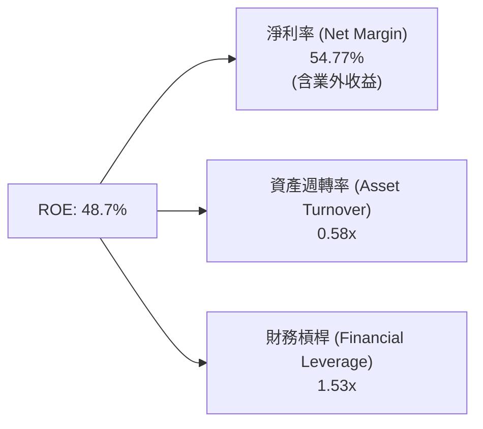

### 6.4 獲利能力驅動結構

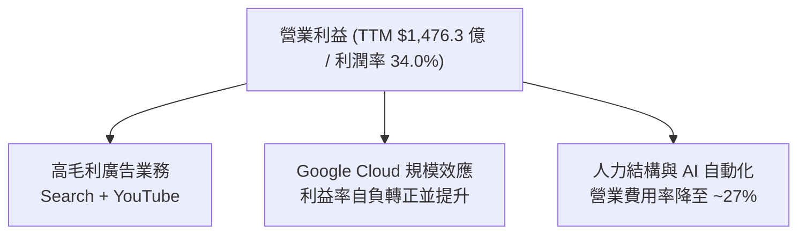

---

## 7. 估值深度分析

### 7.1 同業估值比較表格

在科技巨擘（Big 7）中，Alphabet 當前的估值水平相對溫和，提供了顯著的安全邊際：

| 估值與成長指標 | **Alphabet (GOOG)** | **Microsoft (MSFT)** | **Amazon (AMZN)** | **Meta (META)** | Alphabet 估值評估 |
|----------------|---------------------|----------------------|-------------------|-----------------|-------------------|
| **市值 (Market Cap)** | **$4.08T** | $3.45T | $2.35T | $1.45T | 龍頭地位 |
| **Trailing P/E** | **16.74x** ⚠️ | 34.20x | 41.50x | 26.80x | 🟢 受業外美化，失真 |
| **Forward P/E** | **22.65x** | 31.50x | 33.80x | 23.50x | 🟢 巨擘中最具吸引力 |
| **PEG Ratio** | **1.27x** | 2.10x | 1.75x | 1.35x | 🟢 成長調整後便宜 |
| **EV / EBITDA** | **22.47x** | 24.50x | 18.20x | 16.50x | 🟡 處於合理中位區間 |
| **P/S Ratio** | **9.15x** | 12.80x | 3.60x | 8.90x | 🟡 合理 |
| **Revenue YoY** | **24.2%** | 15.2% | 12.5% | 18.9% | 🏆 巨擘中成長最快 |

### 7.2 歷史前瞻 P/E 區間分析

```
╔══════════════════════════════════════════════════════════════════╗
║              Alphabet 歷史 Forward P/E 區間與當前位置            ║
╠══════════════════════════════════════════════════════════════════╣
║                                                                  ║
║  歷史高點 (5Y High)：   32.5x  ───┐                              ║
║  歷史均值 (5Y Mean)：   24.2x  ───┼── 當前 22.65x (處於均值下方)  ║
║  歷史低點 (5Y Low)：    16.8x  ───┘                              ║
║                                                                  ║
║  16.0x          20.0x     22.65x     26.0x          32.0x        ║
║    |-------------|----------★----------|--------------|          ║
║   【極度便宜】   【安全區】  【當前】   【合理偏高】    【過熱】    ║
║                                                                  ║
╚══════════════════════════════════════════════════════════════════╝
```

### 7.3 情境目標價（假設驅動模型，Bear / Base / Bull）

基於本業 EPS（排除非經常性業外投資 gains，預估 FY2027 本業 EPS 為 **$15.00**）進行三情境推導：

| 情境 | 營收 3Y CAGR | 營業利潤率 | FY2027E 本業 EPS | 退出 Forward P/E | 12M 目標價 | 相對現價隱含報酬 |
|------|--------------|-----------|------------------|------------------|------------|------------------|
| 🔴 **悲觀情境** | 10.5% | 30.0% | $12.17 | 23.0x | **$280.00** | **-16.0%** |
| 🟡 **基準情境** | **15.5%** | **34.5%** | **$16.80** | **25.0x** | **$420.00** | **+26.0%** |
| 🟢 **樂觀情境** | 20.0% | 37.0% | $18.85 | 26.0x | **$490.00** | **+46.9%** |

### 7.4 DCF 敏感性分析（6 格目標價矩陣）

基於 10 年 DCF 模型（基準終端成長率 Terminal Growth Rate = 3.5%）：

| 營收成長情境 \ WACC | **WACC = 9.0%** | **WACC = 9.8%（基準）** | **WACC = 10.5%** |
|---------------------|-----------------|------------------------|------------------|
| 🟢 **樂觀成長 (CAGR 18%)** | $512.00 (+53.5%) | $465.00 (+39.5%) | $428.00 (+28.4%) |
| 🟡 **基準成長 (CAGR 15%)** | $458.00 (+37.4%) | **$420.00 (+26.0%)** | $385.00 (+15.5%) |
| 🔴 **悲觀成長 (CAGR 10%)** | $345.00 (+3.5%) | $310.00 (-7.0%) | $282.00 (-15.4%) |

### 7.5 估值綜合區間

```
╔══════════════════════════════════════════════════════════════════╗
║                   Alphabet 估值綜合區間與現價位置                ║
╠══════════════════════════════════════════════════════════════════╣
║  當前股價：$333.45                                              ║
║  機構目標價均值：$421.79                                        ║
║                                                                  ║
║  悲觀估值底線：   $280.00  ▓▓▓▓▓▓░░░░░░░░░░░░░░░░░               ║
║  當前股價位置：   $333.45  ▓▓▓▓▓▓▓▓▓▓█░░░░░░░░░░░░ (具安全邊際)  ║
║  基準目標價：     $420.00  ▓▓▓▓▓▓▓▓▓▓▓▓▓▓▓▓▓█░░░░░               ║
║  樂觀估值天花板： $490.00  ▓▓▓▓▓▓▓▓▓▓▓▓▓▓▓▓▓▓▓▓▓▓█               ║
╚══════════════════════════════════════════════════════════════════╝
```

---

## 8. 成長催化劑

### 8.1 催化劑時間軸

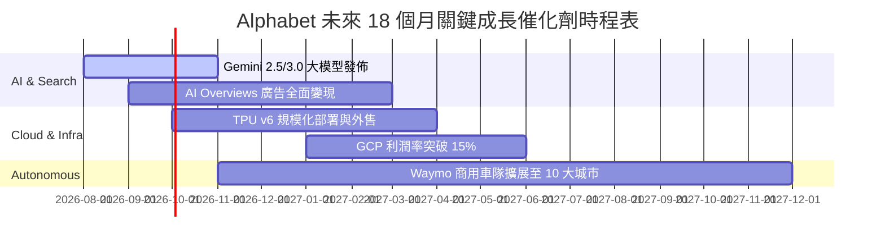

### 8.2 TAM 市場規模與滲透率

```
╔══════════════════════════════════════════════════════════════════╗
║               Alphabet 可尋址市場規模 (TAM) 分析                 ║
╠══════════════════════════════════════════════════════════════════╣
║                                                                  ║
║  1. 全球數位廣告市場： TAM $8,500 億 ｜ 目前市佔 ~45%            ║
║     催化劑：AI 驅動精準投放、YouTube Shorts 變現。               ║
║                                                                  ║
║  2. 全球雲端基礎設施 (IaaS/PaaS)： TAM $6,000 億 ｜ 市佔 ~12%    ║
║     催化劑：企業 GenAI 大模型訓練與推理強勁需求。                ║
║                                                                  ║
║  3. 自動駕駛與 Robotaxi： TAM $1.5 兆 (2030E) ｜ 早期領先        ║
║     催化劑：Waymo 週付費行程破百萬次，商業化閉環形成。          ║
║                                                                  ║
╚══════════════════════════════════════════════════════════════════╝
```

### 8.3 成長驅動力結構圖

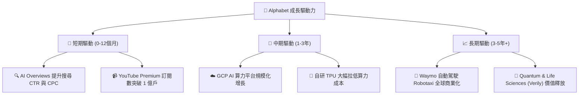

---

## 9. 風險矩陣

### 9.1 風險評分矩陣

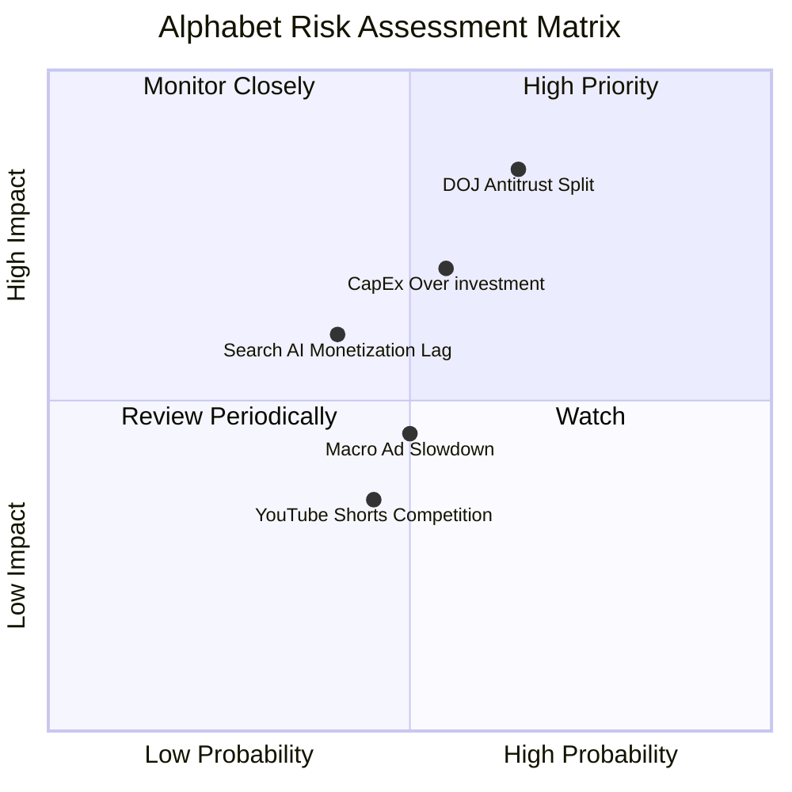

### 9.2 風險清單詳細分析

| # | 風險項目 | 發生機率 | 財務衝擊 | 風險評分 | 緩解措施與監控指標 |
|---|----------|----------|----------|----------|--------------------|
| 1 | 🔴 **DOJ 反壟斷訴訟禁令** | 高 (65%) | 高 (TAC 上升或業務剝離) | 🔴 **8.2 / 10** | 法律訴訟延長戰；積極擴展非獨家通路與 Safari 以外之入口。 |
| 2 | 🟡 **AI Capex 投資過度與 FCF 壓抑** | 中 (55%) | 中 (折舊費用增加) | 🟡 **6.5 / 10** | TPU 成本優勢；若 demand 下降可彈性調減次年裝機 CapEx。 |
| 3 | 🟡 **AI 搜尋轉換期廣告 Monetization 陣痛** | 中 (40%) | 中 (短線點擊單價波動) | 🟡 **5.2 / 10** | 測試全新 AI 介面原生廣告格式，提高轉化率。 |
| 4 | 🟢 **宏觀經濟走弱影響廣告預算** | 中 (50%) | 低 (循環性風險) | 🟢 **4.0 / 10** | 雲端與訂閱收入比重拉升，降低對單一廣告源之依賴。 |

---

## 10. 投資建議

### 10.1 最終綜合評級雷達圖

```
╔══════════════════════════════════════════════════════════════╗
║                 Alphabet 最終綜合評價雷達圖                   ║
╠══════════════════════════════════════════════════════════════╣
║  基本面競爭力： 9.5 / 10  ▓▓▓▓▓▓▓▓▓▓▓▓▓▓▓▓▓▓▓█  🏆 頂級      ║
║  獲利品質與槓桿：8.8 / 10  ▓▓▓▓▓▓▓▓▓▓▓▓▓▓▓▓▓█░░  🟢 極優      ║
║  財務結構安全度：9.5 / 10  ▓▓▓▓▓▓▓▓▓▓▓▓▓▓▓▓▓▓▓█  🏆 無虞      ║
║  成長潛力：     8.5 / 10  ▓▓▓▓▓▓▓▓▓▓▓▓▓▓▓▓█░░░  🟢 強勁      ║
║  估值吸引力：   7.8 / 10  ▓▓▓▓▓▓▓▓▓▓▓▓▓▓▓░░░░░  🟢 合理偏便宜║
╠══════════════════════════════════════════════════════════════╣
║  總結評級：🟢 **買入（BUY）**  ｜ 總分：**8.8 / 10**          ║
╚══════════════════════════════════════════════════════════════╝
```

### 10.2 目標價與隱含報酬率

| 情境 | 機率權重 | 12 個月目標價 | 當前股價 ($333.45) 隱含報酬率 |
|------|----------|---------------|-------------------------------|
| 🔴 **悲觀情境** | 20% | $280.00 | -16.0% |
| 🟡 **基準情境** | **60%** | **$420.00** | **+26.0%** |
| 🟢 **樂觀情境** | 20% | $490.00 | +46.9% |
| **加權預期目標價** | **100%** | **$406.00** | **+21.8%** |

### 10.3 買入時機與策略 Checklists

```
╔══════════════════════════════════════════════════════════════════╗
║                  ✅ Alphabet 買入執行策略 Checklist               ║
╠══════════════════════════════════════════════════════════════════╣
║                                                                  ║
║  建倉/買入觸發條件：                                             ║
║  ✅ 當前 Forward P/E 處於 22.6x，低於 5 年均值 24.2x (已符合)。   ║
║  ✅ 股價回檔至 $320 - $335 區間（接近目前價位，分批建倉）。      ║
║  ✅ GCP 營業利益率持續改善，單季營收 YoY 高於 20%。              ║
║                                                                  ║
║  加碼觸發條件：                                                  ║
║  ☐ 司法部反壟斷裁決落定，市場不確定性消除。                      ║
║  ☐ CapEx 成長率趨緩，單季 FCF 回升至 $150 億以上。               ║
║                                                                  ║
║  減碼/停損觸發條件：                                             ║
║  ☐ 核心搜尋廣告營收連續兩季 YoY 成長率跌破 < 5%。               ║
║  ☐ 司法部判決強制 Alphabet 拆分 YouTube 或 GCP 業務。            ║
╚══════════════════════════════════════════════════════════════════╝
```

### 10.4 投資人適配度分析

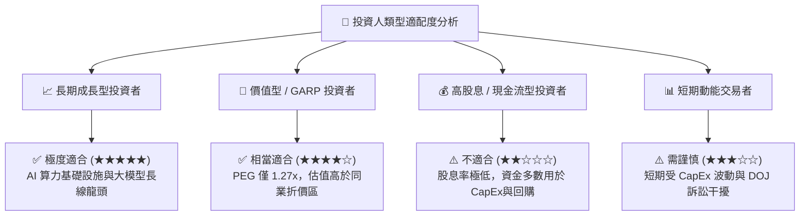

### 10.5 每季財報追蹤清單（Quarterly Watch List）

| 關鍵指標 | 追蹤目標值 | 觸發「加碼」門檻 | 觸發「減碼/警訊」門檻 |
|----------|------------|------------------|----------------------|
| **Google Cloud YoY 成長率** | > 25% | > 30% | < 18% |
| **GCP 營業利益率** | > 12% | > 15% | < 8% |
| **單季 CapEx 規模** | $350B - $450B | CapEx 成長平穩且變現加速 | CapEx 暴增但營收加速停滯 |
| **Search 廣告營收 YoY** | > 12% | > 16% | < 6% |
| **業外投資收益調整** | 需扣除以估算 core EPS | Core EPS YoY > 18% | Core EPS YoY < 5% |

### 10.6 反面論證：什麼會證明投資論點錯誤（What Would Change My Mind）

```
╔══════════════════════════════════════════════════════════════════╗
║              ⚠️ 多頭論點失效條件 (Disconfirming Evidence)         ║
╠══════════════════════════════════════════════════════════════════╣
║  若發生下列任一可量化事件，本報告之「買入」評級將失效並需降級：  ║
║                                                                  ║
║  1. 搜尋市佔率流失：Google 全球 Search 市佔率連續兩季跌破 82%    ║
║     （顯示 OpenAI/Perplexity 等 AI 原生搜尋造成實質用戶流失）。 ║
║                                                                  ║
║  2. 資本回報率惡化：高額 Capex 未能換來相應營收，本業 ROIC 跌破 ║
║     20% 門檻。                                                   ║
║                                                                  ║
║  3. 監管強制拆分：法院最終判決強制 Alphabet 剝離 Android 或      ║
║     Chrome，致使生態系統網路效應遭受毀滅性破壞。                 ║
║                                                                  ║
║  4. 營業利潤率收縮：營業利潤率較目前 34.0% 下滑超過 500 個基點  ║
║     (跌破 29.0%)，且連續兩季無法改善。                           ║
╚══════════════════════════════════════════════════════════════════╝
```

---

> **免責聲明**：本報告係根據公開財務數據與機構級研究模型進行分析，內容僅供學術與投資研究參考，不構成任何買賣金融商品之建議或要約。投資人應獨立評估風險，並自行承擔投資結果。