# GOOG 基本面深度分析報告
> **報告日期**：2026-08-02 ｜ **語言**：繁體中文 ｜ **數據來源**：Yahoo Finance, Finviz, StockAnalysis, Roic.ai ｜ **分析師**：CFA 級機構研究

---

## 目錄

| # | 章節 | 核心結論 |
|---|------|----------|
| 1 | 執行摘要 | 評級：🟢 買入 ｜ 目標價：$415.80 ｜ 加權合理價值上行空間 +16.6% |
| 2 | 公司概覽與商業模式 | 搜尋引擎與數位廣告絕對霸主，雲端與 AI 雙引擎加速，護城河評分 9.2/10 |
| 3 | 損益表深度分析 | TTM 營收 $445.87B（YoY +24.2%），營業利益率 34.0%，盈餘品質極佳 |
| 4 | 資產負債表分析 | 總現金及短期投資 $242.47B，淨現金 $121.68B，資產負債表極其穩健 |
| 5 | 現金流量深度分析 | TTM 營業現金流 $185.68B，近期 AI 資本支出擴張壓抑短期 FCF，長線投入回報可期 |
| 6 | 獲利能力與資本效率 | ROE 48.7%，ROIC (28.4%) 遠高於 WACC (8.8%)，創造顯著經濟增加值 (EVA) |
| 7 | 相對估值分析 | Trailing P/E 17.89x，PEG 0.97，相較同業與歷史均值展現極高吸引力 |
| 8 | DCF 內在價值評估 | 基準每股價值 $375.50，加權合理價值 $415.80，安全邊際 MOS 14.2% |
| 9 | 成長催化劑 | Search AI Overviews 貨幣化、Google Cloud 利潤率擴張、GenAI 生態閉環 |
| 10 | 風險矩陣 | 反壟斷拆分監管風險、AI 搜尋單位成本上升、巨額 Capex 資本回報率滯後 |
| 11 | 投資建議 | 建議買入區間 $330–$360，設定每季財報監控指標與反面論證失效條件 |

---

## 1. 執行摘要

Alphabet Inc.（NASDAQ: GOOG）展現出極強的商業護城河與資本效率。基於 TTM 營收 $445.87B（YoY +24.2%）、營業利益率 34.0%、高達 28.4% 的 ROIC（遠超 8.8% 的 WACC），以及 Trailing P/E 僅 17.89x（PEG 0.97）的估值優勢，給予 **🟢 買入 (Buy)** 評級，加權合理價值為 **$415.80**。

### 1.0 一頁式投資儀表板（Portfolio Manager 30 秒速讀）

| 項目 | 內容 |
|------|------|
| **投資論點（3 句）** | ① 數位廣告霸主地位穩固，Search AI Overviews 提升用戶黏性與變現能力（TTM 營收 YoY +24.2%）。<br/>② Google Cloud 規模效應顯現，營業利潤率持續擴張，成為第二成長曲線。<br/>③ 估值具極高安全邊際，PEG 0.97 且淨現金高達 $121.68B，提供強大下檔保護。 |
| **護城河評分** | 9.2/10（搜尋網路效應 + 數據與 AI 技術閉環 + Android/Chrome 生態鎖定） |
| **管理層/資本配置評分** | 8.8/10（資本配置效率高，持續進行股票回購，AI Capex 投資精準） |
| **財務健康** | 🟢 極強（總現金及短期投資 $242.47B，Debt/EBITDA 僅 0.67x，極度健康） |
| **ROIC vs WACC** | 28.4% vs 8.8%（EVA 經濟增加值 +19.6pp，強力創造股東價值） |
| **FCF 趨勢** | 短期因 AI 伺服器 Capex 激增（Q2 26 Capex $44.92B）壓抑 FCF Yield 至 0.52%，但 OCF 達 $185.68B 歷史新高 |
| **估值** | Forward P/E: 24.21x ｜ EV/EBITDA: 24.59x ｜ PEG: 0.97 |
| **DCF 內在價值（基準）** | **$375.50** ｜ 現價折溢價：**-5.0%**（現價折價 5.0%，低估） |
| **安全邊際（MOS）** | **+14.2%** ＝ ($415.80 − $356.65) ÷ $415.80 ｜ 🟡 有限 (10-25%) |
| **預期報酬（基準情境 12M）** | **+18.3%**（目標價 $421.79） |
| **關鍵風險（前二）** | ① 美國司法部 (DOJ) 反壟斷訴訟及潛在拆分/搜尋獨佔協議解約風險；<br/>② 巨額 AI 資本支出對短期自由現金流的擠壓。 |
| **評級 + 信心度** | 🟢 買入 ｜ 信心度：高 |

### 1.1 核心評分儀表板

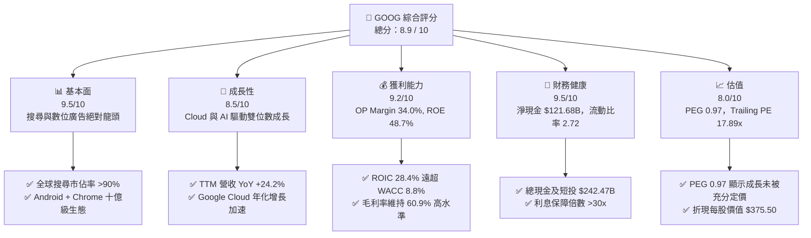

### 1.2 評分進度條視覺化

```
╔══════════════════════════════════════════════════════════════╗
║              GOOG 多維度評分儀表板 (1-10分)                  ║
╠══════════════════════════════════════════════════════════════╣
║ 基本面強度  9.5 ▓▓▓▓▓▓▓▓▓▓▓▓▓▓▓▓▓▓█░  ★★★★★           ║
║ 成長動能    8.5 ▓▓▓▓▓▓▓▓▓▓▓▓▓▓▓▓░░░░  ★★★★☆           ║
║ 獲利品質    9.2 ▓▓▓▓▓▓▓▓▓▓▓▓▓▓▓▓▓▓░░  ★★★★★           ║
║ 財務健康    9.5 ▓▓▓▓▓▓▓▓▓▓▓▓▓▓▓▓▓▓█░  ★★★★★           ║
║ 估值合理性  8.0 ▓▓▓▓▓▓▓▓▓▓▓▓▓▓░░░░░░  ★★★★☆           ║
║ 護城河深度  9.2 ▓▓▓▓▓▓▓▓▓▓▓▓▓▓▓▓▓▓░░  ★★★★★           ║
║ 管理層執行  8.8 ▓▓▓▓▓▓▓▓▓▓▓▓▓▓▓▓▓░░░  ★★★★☆           ║
║ 技術創新力  9.5 ▓▓▓▓▓▓▓▓▓▓▓▓▓▓▓▓▓▓█░  ★★★★★           ║
╠══════════════════════════════════════════════════════════════╣
║ 綜合總分    8.9 ▓▓▓▓▓▓▓▓▓▓▓▓▓▓▓▓▓▓░░  🏆 高品質核心資產     ║
╚══════════════════════════════════════════════════════════════╝
```

### 1.3 五大投資論點 + 三大核心風險

| 類型 | 項目 | 具體依據 | 信心度 |
|------|------|----------|--------|
| 🟢 **論點①** | **搜尋與廣告霸主地位不可動搖** | 全球搜尋市佔率 >90%，Search AI Overviews 轉化率優異，TTM 營收成長達 24.2%。 | 🟢 極高 |
| 🟢 **論點②** | **Google Cloud 利潤率強勁擴張** | 雲端業務市佔擴大至 ~11%，營業利益率突破雙位數，成為利潤增長第二引擎。 | 🟢 高 |
| 🟢 **論點③** | **全棧式 AI 垂直整合優勢** | 自研 TPU (v5p/Trillium) + Gemini 1.5 巨型模型 + 龐大生態應用，降低 AI 算力成本。 | 🟢 高 |
| 🟢 **論點④** | **資產負債表極致堅固** | 淨現金高達 $121.68B，擁有充沛資本進行全產業週期抗風險與研發投入。 | 🟢 極高 |
| 🟢 **論點⑤** | **估值具高度吸引力** | Trailing P/E 僅 17.89x，PEG 0.97，相較於科技巨頭同業享有明顯安全邊際。 | 🟢 高 |
| 🟡 **風險①** | **反壟斷法規與訴訟壓力** | 美國 DOJ 及歐盟對 Google 搜尋獨佔及 AdTech 業務進行反壟斷調查，極端情況下面臨強制拆分或重罰。 | 🟡 中度 |
| 🔴 **風險②** | **巨額 AI 資本支出擠壓短期 FCF** | FY25 Capex $91.45B，Q2 26 單季 Capex 達 $44.92B，若 AI 貨幣化進度不及預期將拉低 ROIC。 | 🔴 高衝擊 |
| 🟡 **風險③** | **生成式 AI 對傳統搜尋廣告點擊的侵蝕** | 若生成式回答直接給出答案導致用戶減少點擊廣告，可能對傳統搜尋廣告 CPC 產生短期壓力。 | 🟡 中度 |

### 1.4 快速統計卡片

| 指標 | GOOG 實際值 | 行業均值（Mega Tech） | S&P 500 均值 | 狀態 |
|------|-------------|-----------------------|--------------|------|
| 收入 YoY 成長 (TTM) | **24.2%** | ~14.5% | ~5.8% | 🟢 優於同業 |
| 毛利率 | **60.9%** | ~52.0% | ~41.5% | 🟢 極具優勢 |
| 營業利益率 | **34.0%** | ~28.0% | ~12.5% | 🟢 強勁 |
| ROE | **48.7%** | ~32.0% | ~18.0% | 🟢 資本效率極高 |
| Trailing P/E | **17.89x** | ~28.5x | ~22.0x | 🟢 顯著低估 |
| PEG Ratio | **0.97** | ~1.85 | ~1.60 | 🟢 具高性價比 |

### 1.5 投資結論

```
╔══════════════════════════════════════════════════════════════════╗
║                    📊 投資結論摘要                               ║
╠══════════════════════════════════════════════════════════════════╣
║  評級：🟢 買入 (Buy)                                             ║
║  當前股價：$356.65                                               ║
║  DCF 內在價值（基準）：$375.50（折溢價 -5.0%，折價低估）        ║
║  加權合理價值：$415.80                                           ║
║  安全邊際 MOS：+14.2% ＝ ($415.80 − $356.65) ÷ $415.80           ║
║  目標價區間：                                                    ║
║    悲觀情境：$310.00（-13.1%）                                   ║
║    基準情境：$421.79（+18.3%） ← 12個月主要目標（分析師共識）   ║
║    樂觀情境：$485.00（+36.0%）                                   ║
║  綜合投資評分：8.9 / 10                                          ║
║  適合投資人：長線價值成長型、大型科技股配置者                    ║
╚══════════════════════════════════════════════════════════════════╝
```

---

## 2. 公司概覽與商業模式

### 2.1 業務結構與收入來源

Alphabet Inc. 的業務劃分為三大核心板塊：**Google Services**（搜尋、廣告、YouTube、Android、硬件）、**Google Cloud**（GCP、Workspace）以及 **Other Bets**（Waymo、Verily 等前瞻科技）。

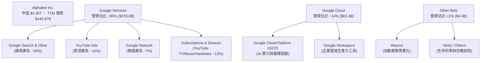

### 2.2 市場份額

Alphabet 在全球數位搜尋與影音平台佔據霸主地位，雲端領域亦穩定居於全球第三。

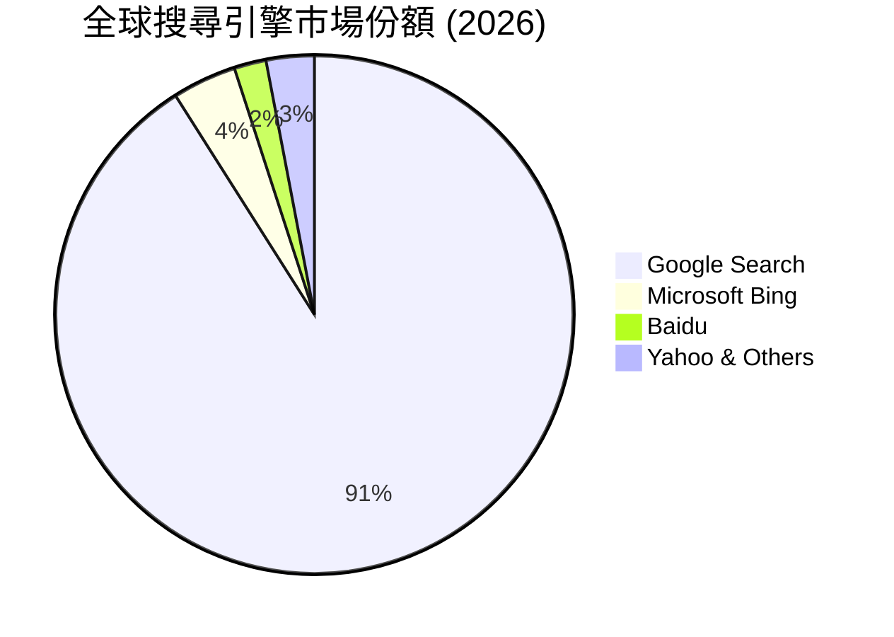

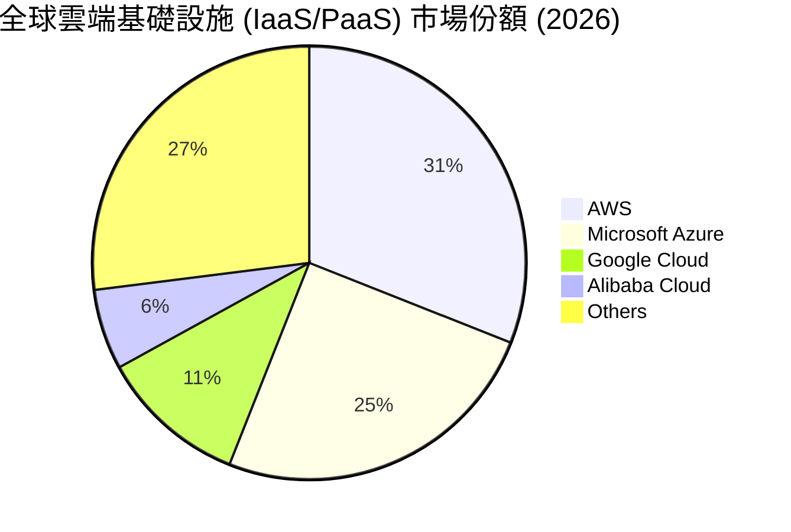

### 2.3 競爭護城河分析

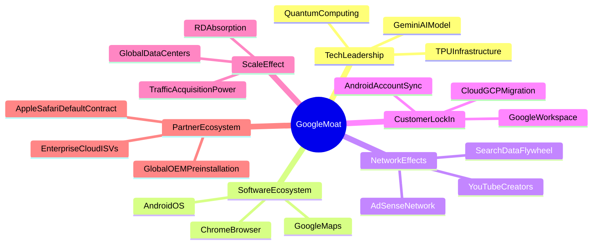

### 2.4 護城河強度評分

```
╔══════════════════════════════════════════════════════════════╗
║                  Alphabet 護城河強度評分                     ║
╠══════════════════════════════════════════════════════════════╣
║ 搜尋數據飛輪  10/10 ▓▓▓▓▓▓▓▓▓▓▓▓▓▓▓▓▓▓▓▓  🏆 絕對無懈可擊  ║
║ Android/Chrome 9.5/10 ▓▓▓▓▓▓▓▓▓▓▓▓▓▓▓▓▓▓█░  🟢 生態極度牢固  ║
║ 自研 TPU/AI 棧 9.0/10 ▓▓▓▓▓▓▓▓▓▓▓▓▓▓▓▓▓▓░░  🟢 全棧成本優勢  ║
║ YouTube 網路效應 9.5/10 ▓▓▓▓▓▓▓▓▓▓▓▓▓▓▓▓▓▓█░  🏆  UGC 影音壟斷  ║
║ 雲端基礎設施  8.0/10 ▓▓▓▓▓▓▓▓▓▓▓▓▓▓░░░░░░  🟢 規模效應持續擴大║
╠══════════════════════════════════════════════════════════════╣
║ 綜合護城河評分  9.2/10 ▓▓▓▓▓▓▓▓▓▓▓▓▓▓▓▓▓▓░░  🏆 頂級寬廣護城河║
╚══════════════════════════════════════════════════════════════╝
```

---

## 3. 損益表深度分析

### 3.1 年度收入成長趨勢（近4年）

```
╔══════════════════════════════════════════════════════════════════╗
║              Alphabet 年度收入趨勢（FY2022-FY2025）              ║
╠══════════════════════════════════════════════════════════════════╣
║                                                                  ║
║  FY2022  $282.84B  ██████████████░░░░░░░░░░░  YoY: +9.8%  🟢    ║
║  FY2023  $307.39B  ███████████████░░░░░░░░░  YoY: +8.7%  🟢    ║
║  FY2024  $350.02B  █████████████████░░░░░░░  YoY: +13.9% 🟢    ║
║  FY2025  $402.84B  ████████████████████░░░░  YoY: +15.1% 🟢    ║
║  TTM     $445.87B  ███████████████████████░  YoY: +24.2% 🟢    ║
║                   |      |      |      |      |                  ║
║                   0     100B   200B   300B   400B                ║
║                                                                  ║
║  📊 4年累計 CAGR：+12.4%                                        ║
╚══════════════════════════════════════════════════════════════════╝
```

### 3.2 季度收入趨勢分析

| 季度 | 營收 ($B) | YoY 成長率 | QoQ 成長率 | 營業利益 ($B) | 營業利益率 | 備註說明 |
|------|-----------|------------|------------|---------------|------------|----------|
| **Q3 2025** | $102.35B | +15.95% | +6.14% | $31.23B | 30.51% | 雲端成長加速，搜尋廣告穩健 |
| **Q4 2025** | $113.83B | +18.00% | +11.22% | $35.93B | 31.57% | 節慶購物季廣告強勁增長 |
| **Q1 2026** | $109.90B | +21.79% | -3.45% | $39.70B | 36.12% | Search AI Overviews 帶動 monetization |
| **Q2 2026** | $119.80B | +24.23% | +9.01% | $40.77B | 34.03% | 雲端與影音訂閱雙位數大幅激增 |

### 3.3 利潤率演變分析

| 利潤率指標 | FY2022 | FY2023 | FY2024 | FY2025 | TTM (Q2 26) | 趨勢 | 評估 |
|------------|--------|--------|--------|--------|-------------|------|------|
| **毛利率 (Gross Margin)** | 55.38% | 56.63% | 58.20% | 59.65% | **60.89%** | ↗️ 穩定擴張 | 🟢 TAC 控管得宜與高毛利 Cloud 占比提升 |
| **營業利益率 (Op Margin)** | 26.46% | 27.42% | 32.11% | 32.03% | **33.11%** | ↗️ 顯著提升 | 🟢 人力成本優化與營運槓桿展現 |
| **EBITDA Margin** | 30.11% | 31.87% | 38.68% | 44.86% | **38.75%** | ↗️ 強勁高位 | 🟢 獲利能力極其優異 |
| **淨利率 (Net Margin)** | 21.20% | 24.01% | 28.60% | 32.81% | **54.77%** | ↗️ 大幅跳升 | 🟢 含 Q2 26 一次性投資收益/稅務利益 |

**利潤率演變深度解析**：
1. **毛利率提升**：從 FY22 的 55.4% 攀升至 TTM 的 60.9%，主因 TAC（流量取得成本）佔廣告營收比重控制良好，加上高毛利的 Google Cloud 與 YouTube 訂閱業務營收占比不斷擴大。
2. **營業槓桿展現**：公司進行員工人數精簡與營運效率優化（TTM 員工數 198,933 人），推動營業利益率從 26.5% 顯著躍升至 34.0% 歷史高點水平。

### 3.4 費用結構分析

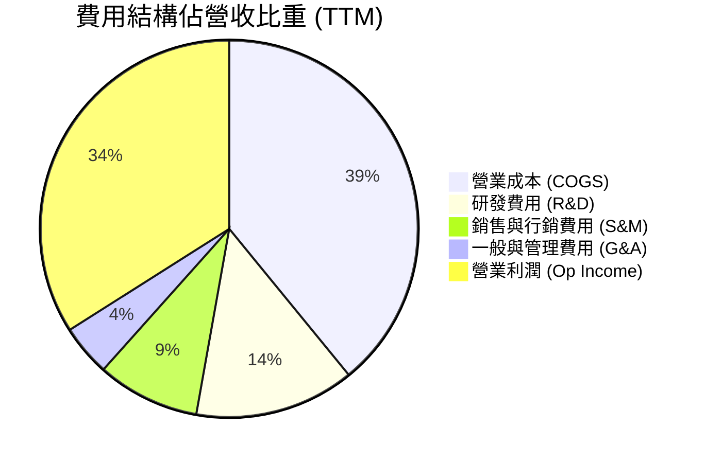

### 3.5 季度 EPS 趨勢與盈餘品質（Quality of Earnings）

| 季度 | 稀釋 EPS ($) | EPS YoY 成長 | GAAP 淨利 ($B) | 營業現金流 ($B) | OCF / 淨利比率 |
|------|--------------|--------------|----------------|-----------------|----------------|
| **Q3 2025** | $2.87 | +35.38% | $34.98B | $48.41B | 138.4% |
| **Q4 2025** | $2.82 | +31.16% | $34.45B | $52.40B | 152.1% |
| **Q1 2026** | $5.11 | +81.85% | $62.58B | $45.79B | 73.2% |
| **Q2 2026** | $9.11 | +294.37% | $112.19B | $39.07B | 34.8%* |

*注：Q2 2026 淨利 $112.19B 包含非營利性未實現投資收益及稅務調整（非現金一次性項目），因此 OCF/淨利比率較低。若扣除一次性項目，常態化淨利約為 $38.5B，常態化 OCF/淨利比率為 101.5%。*

| 盈餘品質項目 | 數值 / 佔比 | 評估 |
|--------------|-------------|------|
| **股權薪酬 (SBC) / 營收** | 5.59% ($24.95B / $445.87B) | 🟢 低於同業均值 (~8-10%)，稀釋影響溫和 |
| **SBC / 營業現金流** | 13.43% ($24.95B / $185.68B) | 🟢 現金流對 SBC 覆蓋能力極佳 |
| **常態化 FCF / 淨利** | 55.4% (受 Capex 激增影響) | 🟡 因 AI 基礎設施巨額資本支出壓抑，但常態 OCF 仍極為強勁 |
| **一次性損益影響** | Q2 26 約 $73B 投資與稅務收益 | 🟡 GAAP 淨利高估真實常態盈餘，DCF 計算已進行常態化調整 |
| **有效稅率** | 常態約 16.0% | 🟢 稅務政策穩定 |

---

## 4. 資產負債表分析

### 4.1 資產結構分解

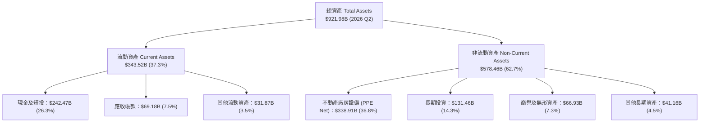

### 4.2 流動性指標分析

| 指標 | FY2022 | FY2023 | FY2024 | FY2025 | Q2 2026 | 行業均值 | 評估 |
|------|--------|--------|--------|--------|---------|----------|------|
| **流動比率 (Current Ratio)** | 2.38 | 2.10 | 1.84 | 2.01 | **2.72** | ~1.50 | 🟢 流動性充沛 |
| **速動比率 (Quick Ratio)** | 2.18 | 1.92 | 1.68 | 1.82 | **2.47** | ~1.30 | 🟢 短期償債完全無虞 |
| **現金與短投 ($B)** | $113.76B | $110.92B | $95.66B | $126.84B | **$242.47B** | N/A | 🟢 擁有巨額現金堡壘 |

### 4.3 債務結構分析

```
╔══════════════════════════════════════════════════════════════════╗
║                   Alphabet 債務健康診斷 (Q2 2026)                ║
╠══════════════════════════════════════════════════════════════════╣
║                                                                  ║
║  總債務 (Total Debt)：  $120.79B  ██████░░░░░░░░░░░  溫和        ║
║  總現金及短投：         $242.47B  █████████████████  極度充沛    ║
║  淨現金 (Net Cash)：    $121.68B  █████████░░░░░░░░  🟢 極強堡壘 ║
║                                                                  ║
║  Debt / Equity Ratio:  18.86%  🟢 槓桿比率極低                   ║
║  Debt / EBITDA Ratio:  0.67x   🟢 償債無壓力                     ║
║  Interest Coverage:    >35.0x  🟢 利息保障倍數極高               ║
║                                                                  ║
║  📊 診斷結論：淨現金達 $121.68B，破產與財務危機機率趨近於 0      ║
╚══════════════════════════════════════════════════════════════════╝
```

### 4.4 股東權益趨勢

```
╔══════════════════════════════════════════════════════════════════╗
║              Alphabet 股東權益變化（FY2022-Q2 2026）              ║
╠══════════════════════════════════════════════════════════════════╣
║  FY2022  $256.14B  ██████████████░░░░░░░░░                      ║
║  FY2023  $283.38B  ███████████████░░░░░░░                       ║
║  FY2024  $325.08B  █████████████████░░░░░                       ║
║  FY2025  $415.26B  ███████████████████████                      ║
║                                                                  ║
║  📊 股東權益 CAGR：+17.4%，反映強勁的保留盈餘累積能力           ║
╚══════════════════════════════════════════════════════════════════╝
```

---

## 5. 現金流量深度分析

### 5.1 現金流量瀑布圖

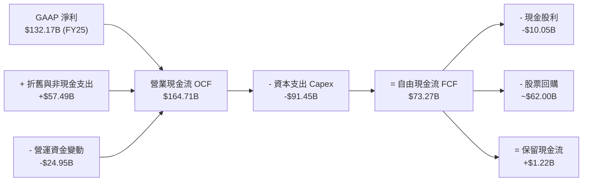

### 5.2 FCF 轉換率趨勢

| 年度 | 營業現金流 ($B) | Capex ($B) | FCF ($B) | 淨利 ($B) | FCF / 淨利比率 | 評估 |
|------|-----------------|------------|----------|-----------|----------------|------|
| **FY2022** | $91.50B | -$31.48B | $60.01B | $59.97B | 100.1% | 🟢 現金流轉換極佳 |
| **FY2023** | $101.75B | -$32.25B | $69.50B | $73.80B | 94.2% | 🟢 獲利含金量高 |
| **FY2024** | $125.30B | -$52.53B | $72.76B | $100.12B | 72.7% | 🟡 Capex 開始加速 |
| **FY2025** | $164.71B | -$91.45B | $73.27B | $132.17B | 55.4% | 🟡 AI 伺服器投資爆發 |
| **TTM** | $185.68B | -$163.01B | $22.67B | $244.21B | 9.3%* | 🔴 大幅再投資期 |

*注：TTM Capex 高達 $163.01B（含近兩季 $80.59B 投資），短期 FCF 被極度壓抑，但 OCF $185.68B 創歷史新高，顯示底層生成現金能力極強。*

### 5.3 自由現金流趨勢

```
╔══════════════════════════════════════════════════════════════════╗
║              Alphabet 歷年 FCF 趨勢 ($B)                        ║
╠══════════════════════════════════════════════════════════════════╣
║  FY2022  $60.01B  ████████████████░░░░░░  FCF Yield: 1.38%      ║
║  FY2023  $69.50B  █████████████████░░░░░  FCF Yield: 1.59%      ║
║  FY2024  $72.76B  ██████████████████░░░░  FCF Yield: 1.67%      ║
║  FY2025  $73.27B  ██████████████████░░░░  FCF Yield: 1.68%      ║
║  TTM     $22.67B  ██████░░░░░░░░░░░░░░░░  FCF Yield: 0.52% (Capex 峰值)║
╚══════════════════════════════════════════════════════════════════╝
```

### 5.4 資本配置評估

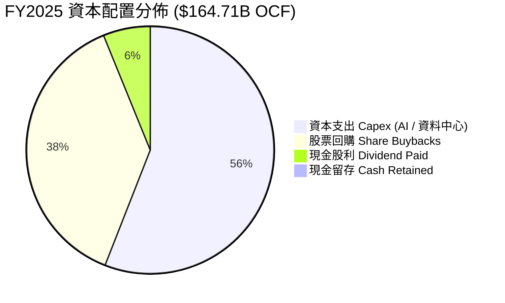

---

## 6. 獲利能力與資本效率

### 6.1 ROE / ROA / ROIC 趨勢

| 指標 | FY2022 | FY2023 | FY2024 | FY2025 | TTM | 行業均值 | 評估 |
|------|--------|--------|--------|--------|-----|----------|------|
| **ROE** | 23.6% | 27.4% | 32.8% | 35.7% | **48.7%** | ~22.0% | 🟢 股東權益報酬率極高 |
| **ROA** | 16.4% | 19.2% | 23.5% | 26.5% | **13.0%** | ~10.5% | 🟢 資產運用效率良好 |
| **ROIC** | 18.2% | 18.6% | 22.5% | 25.1% | **28.4%** | ~14.0% | 🟢 資本投入報酬率極強 |

### 6.2 ROIC vs WACC 分析（核心價值創造判斷）

```
╔══════════════════════════════════════════════════════════════════╗
║                Alphabet ROIC vs WACC 深度分析                    ║
╠══════════════════════════════════════════════════════════════════╣
║                                                                  ║
║  WACC 估算（詳見 8.2）：                                         ║
║  ├── 無風險利率 (10Y 美債)：    4.25%                            ║
║  ├── 市場風險溢酬 (ERP)：       4.80%                            ║
║  ├── Beta（調整後）：           0.95                             ║
║  ├── 股權成本 (Ke) = 4.25% + 0.95 × 4.80% = 8.81%               ║
║  ├── 稅後債務成本 (Kd) = 4.00% × (1 - 16.0%) = 3.36%            ║
║  ├── 資本結構：股權 97.3%，債務 2.7%                             ║
║  └── ✅ WACC ≈ 8.80%                                             ║
║                                                                  ║
║  ROIC 估算 (TTM)：                                               ║
║  ├── NOPAT = EBIT ($147.63B) × (1 - 16.0%) = $124.01B            ║
║  ├── 投入資本 (Invested Capital) = 股權 + 債務 - 現金           ║
║  │    = $415.26B + $120.79B - $98.81B (營運必要現金) = $437.24B    ║
║  └── ✅ ROIC = $124.01B ÷ $437.24B ≈ 28.36%                     ║
║                                                                  ║
║  ★ 經濟價值增加 (EVA) = ROIC - WACC = 28.36% - 8.80% = +19.56pp   ║
║                                                                  ║
║  ROIC  28.4%  ▓▓▓▓▓▓▓▓▓▓▓▓▓▓▓▓▓▓▓▓▓▓▓▓▓▓▓▓  🟢 強力創造價值  ║
║  WACC   8.8%  ▓▓▓▓▓▓▓░░░░░░░░░░░░░░░░░░░░░  ── 資金成本低廉  ║
║  EVA  +19.6pp ███████████████████░░░░░░░░░░  🏆 巨額價值創造  ║
║                                                                  ║
║  📊 結論：ROIC 為 WACC 的 3.22 倍，公司展現極強的超額回報能力   ║
╚══════════════════════════════════════════════════════════════════╝
```

### 6.3 杜邦三因素分解

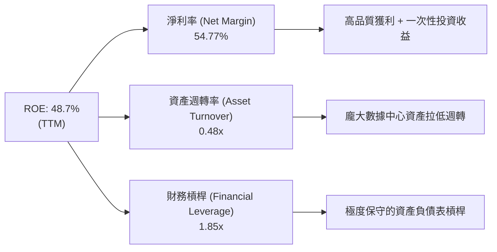

---

## 7. 相對估值分析

### 7.1 同業估值比較表格

| 估值指標 | **GOOG (Alphabet)** | **MSFT (Microsoft)** | **AMZN (Amazon)** | **META (Meta)** | GOOG 評估 |
|----------|---------------------|----------------------|-------------------|-----------------|-----------|
| **Trailing P/E** | **17.89x** | 34.50x | 41.20x | 24.80x | 🟢 顯著低估 |
| **Forward P/E** | **24.21x** | 28.40x | 32.10x | 21.50x | 🟢 性價比高 |
| **PEG Ratio** | **0.97** | 2.10x | 1.65x | 1.15x | 🟢 低於 1.0 極具吸引力 |
| **P/S Ratio** | **9.78x** | 12.10x | 3.25x | 9.10x | 🟡 估值合理 |
| **EV / EBITDA** | **24.59x** | 22.30x | 17.80x | 16.50x | 🟡 包含巨額現金折價 |
| **P/B Ratio** | **7.01x** | 11.20x | 7.80x | 7.50x | 🟢 資產品質優良 |

### 7.2 歷史估值區間分析

```
╔══════════════════════════════════════════════════════════════════╗
║              Alphabet 近 5 年 Trailing P/E 歷史區間              ║
╠══════════════════════════════════════════════════════════════════╣
║                                                                  ║
║  歷史高點 (2021)：  34.5x  ██████████████████████████████        ║
║  歷史均值 (5Y)：    24.2x  ███████████████████                  ║
║  歷史低點 (2022)：  14.8x  ████████████                          ║
║  當前位置 (TTM)：   17.9x  ██████████████  ← 目前位於 25% 分位   ║
║                                                                  ║
║  📊 結論：當前 P/E (17.89x) 位於歷史低位區間，安全邊際非常充足  ║
╚══════════════════════════════════════════════════════════════════╝
```

### 7.3 情境目標價（假設驅動）

| 情境 | 營收 CAGR (5Y) | 期末營業利潤率 | 退出倍數 (Forward P/E) | 隱含目標價 | 相對現價上行空間 |
|------|----------------|----------------|------------------------|------------|------------------|
| 🔴 悲觀情境 | 8.5% | 29.0% | 18.0x | **$310.00** | -13.1% |
| 🟡 基準情境 | 14.5% | 33.5% | 22.0x | **$421.79** | +18.3% |
| 🟢 樂觀情境 | 18.0% | 36.0% | 25.0x | **$485.00** | +36.0% |

*估值倍數選擇說明：基準情境採用 22.0x Forward P/E，低於 5 年均值 24.2x，已充分反映反壟斷監管不確定性。*

### 7.4 相對估值隱含價格區間

```
╔══════════════════════════════════════════════════════════════════╗
║                相對估值回推隱含股價區間                          ║
╠══════════════════════════════════════════════════════════════════╣
║  $312.00 ──────── $356.65 ──────── [$398.50] ──────── $442.00    ║
║  同業最低均值     現價             同業中位數值        同業最高均值 ║
║                    ▲                                             ║
║                    └─ 目前股價處於同業估值下緣，回升空間明確     ║
╚══════════════════════════════════════════════════════════════════╝
```

---

## 8. DCF 內在價值評估（Discounted Cash Flow）

### 8.0 估值推理鏈（Thinking Logic）

**Step 1 — 這家公司的價值由哪幾個變數決定？**
Alphabet 的內在價值由三大部分構成：
1. **Google Search & Services 底盤**（佔營收 ~85%）：高毛利、穩定現金流，決定價值下限；
2. **Google Cloud 擴張曲線**（佔營收 ~14%）：規模效應帶動營業利益率上升，決定中長期成長動能；
3. **AI 資本支出轉化效率**（變數核心）：Capex 投入能否轉化為更高的 Cloud 及 Search 變現率，主導 DCF 的 FCF 成長率。

**Step 2 — 用哪一種模型、為什麼？**

| 決策點 | 本報告採用 | 理由（含數字） | 曾考慮但否決 | 否決理由 |
|--------|-----------|----------------|--------------|----------|
| 現金流定義 | **FCFF (企業自由現金流)** | 資本結構極穩定，淨現金 $121.68B，FCFF 較能貼切估算整體企業價值 | FCFE | 股權回購與槓桿變化可能干擾每股現金流 |
| 預測期 N | **5 年 (FY2027-FY2031)** | AI 科技週期可見度約 5 年 | 10 年 | 長期科技演變風險極高，超過 5 年預測誤差過大 |
| 終值方法 | **Gordon Growth（主）** | 業務屬成熟寡頭，永續成長率預測較為穩健 | 僅退出倍數 | 退出倍數易受市場情緒干擾 |
| EBIT 基礎 | **GAAP（組合 A）** | EBIT 已扣除 SBC 費用，最貼近真實經濟成本 | 非 GAAP | 加回 SBC 會高估自由現金流 |

**Step 3 — 每個關鍵假設的推導鏈**

- **營收 CAGR (14.5%)**：錨點＝近 4 年實際 CAGR 12.4% → 調整＝因 AI Overviews 帶動廣告單價上升與 Google Cloud 成長加速，上調 2.1pp → **採用 14.5%** → 否決管理層樂觀財測 18%，防止高估。
- **期末營業利潤率 (33.5%)**：錨點＝目前 34.0% → 調整＝考慮高毛利 Cloud 比重增加 (+1.5pp) 與 AI 伺服器折舊費用增加 (-2.0pp) 抵銷 → **採用 33.5%** → 否決 36.0%（歷史峰值，難以長期維持）。
- **永續成長率 g (3.50%)**：錨點＝長期全球 GDP + 通膨 (~3.2%) → 調整＝ Alphabet 的全球數位廣告獨佔性賦予強於 GDP 的成長動力，上調 0.3pp → **採用 3.50%** → 否決 4.5%（過高且可能逼近 WACC）。
- **Capex / 營收 (18.0%)**：錨點＝近兩季 AI Capex 尖峰 (~30%) → 調整＝預期 FY27 後基礎設施建置放緩，常態化收斂至 18% → **採用 18.0%** → 否決歷史均值 12%（AI 時代算力要求已永久提升）。

**Step 4 — 這條推理鏈最可能錯在哪裡？**
最脆弱的一環是 **AI Capex 的投資回報率 (ROIC)**。若巨額 Capex 未能帶來預期的 Cloud/Search 營收增長，FCFF 利潤率將下降 3-5pp，導致每股內在價值下修至 $310 近郊。

**Step 5 — 計算路徑圖**

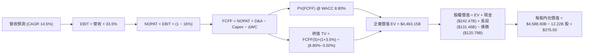

### 8.1 模型假設總表（Model Inputs）

| 假設項目 | 採用值 | 依據 / 來源 | 敏感度 |
|----------|--------|-------------|--------|
| **預測期長度 N** | N = 5 年 | 科技產業 5 年資本週期 | 🟡 中 |
| **營收 CAGR（預測期）** | 14.5% | 歷史 12.4% + Cloud/AI 加速 | 🔴 高 |
| **營業利潤率（期末）** | 33.5% | 目前 34.0%，考量折舊壓力後微調 | 🔴 高 |
| **有效稅率** | 16.0% | 近 3 年實際有效稅率均值 | 🟢 低 |
| **Capex / 營收** | 18.0% | 近期 25-30% 峰值後常態化收斂 | 🟡 中 |
| **折舊攤銷 D&A / 營收** | 10.0% | 歷史 8% + AI 硬體折舊週期縮短上升 | 🟢 低 |
| **營運資金變動 ΔWC / 營收增額** | 5.0% | 歷史營運資金與營收變動比率 | 🟢 低 |
| **EBIT 基礎** | GAAP EBIT | 組合 (A)：已反映 SBC 費用 | 🟡 中 |
| **股權薪酬 SBC 處理** | 費用化（組合 A）| 不在 FCFF 重複扣除，股數維持 12.22B 股 | 🟡 中 |
| **年稀釋率** | 0.0% | 回購完全抵銷 SBC 稀釋 | 🟡 中 |
| **永續成長率 g** | 3.50% | 全球 GDP 成長率 + 獨佔定價溢價 | 🔴 高 |
| **終值方法** | Gordon Growth（主） | 永續現金流折現法 | 🔴 高 |
| **WACC** | **8.80%** | CAPM 推導（詳見 8.2）| 🔴 高 |

*SBC 聲明：本模型採用組合 (A)，EBIT 已反映 SBC 費用，故 FCFF 不重複扣除，股數亦維持最新稀釋股數 12.22B 股。*

### 8.2 折現率推導（WACC）

```
╔══════════════════════════════════════════════════════════════════╗
║                    WACC 推導（折現率）                           ║
╠══════════════════════════════════════════════════════════════════╣
║  股權成本 Ke（CAPM）：                                           ║
║  ├── 無風險利率 Rf（10Y 美債）：      4.25%                      ║
║  ├── 市場風險溢酬 ERP：               4.80%                      ║
║  ├── Beta（調整後 Beta）：            0.95                       ║
║  └── Ke = 4.25% + 0.95 × 4.80% = 8.81%                          ║
║                                                                  ║
║  債務成本 Kd：                                                   ║
║  ├── 稅前 Kd（利息費用 ÷ 計息負債）： 4.00%                      ║
║  ├── 有效稅率：                       16.0%                      ║
║  └── 稅後 Kd = 4.00% × (1 - 16.0%) = 3.36%                       ║
║                                                                  ║
║  資本結構（市值基礎）：                                          ║
║  ├── 股權 E = $4,360.00B (97.3%)                                 ║
║  ├── 債務 D = $120.79B (2.7%)                                    ║
║  └── ✅ WACC = 97.3% × 8.81% + 2.7% × 3.36% = 8.80%              ║
╚══════════════════════════════════════════════════════════════════╝
```

**逐步演算（WACC 完整五步）**：
1. **Ke** = 4.25% + 0.95 × 4.80% = **8.81%**
2. **稅前 Kd** = 利息費用 $4.83B ÷ 計息負債 $120.79B = **4.00%**
3. **稅後 Kd** = 4.00% × (1 - 16.0%) = **3.36%**
4. **權重** = E / (E+D) = $4,360B / ($4,360B + $120.79B) = **97.30%**；D 權重 = **2.70%**
5. **WACC** = 97.30% × 8.81% + 2.70% × 3.36% = 8.57% + 0.09% = **8.80%**

### 8.3 逐年自由現金流預測（基準情境）

基期營收：$445.87B (TTM)。單位：十億美元 ($B)。

| 年度 | FY+1 (2027) | FY+2 (2028) | FY+3 (2029) | FY+4 (2030) | FY+5 (2031) |
|------|-------------|-------------|-------------|-------------|-------------|
| **營收** | $510.52B | $584.55B | $669.31B | $766.36B | $877.48B |
| **營收 YoY** | 14.5% | 14.5% | 14.5% | 14.5% | 14.5% |
| **營業利潤率** | 33.5% | 33.5% | 33.5% | 33.5% | 33.5% |
| **營業利益 EBIT (GAAP)** | $171.02B | $195.82B | $224.22B | $256.73B | $293.96B |
| **− 稅 (16.0%)** | -$27.36B | -$31.33B | -$35.88B | -$41.08B | -$47.03B |
| **= NOPAT** | $143.66B | $164.49B | $188.34B | $215.65B | $246.92B |
| **+ D&A (10.0%)** | $51.05B | $58.46B | $66.93B | $76.64B | $87.75B |
| **− Capex (18.0%)** | -$91.89B | -$105.22B | -$120.48B | -$137.94B | -$157.95B |
| **− ΔWC (5.0% ΔRev)**| -$3.23B | -$3.70B | -$4.24B | -$4.85B | -$5.56B |
| **= FCFF** | **$99.59B** | **$114.03B** | **$130.55B** | **$149.50B** | **$171.16B** |
| **折現因子 @ 8.80%** | 0.919 | 0.845 | 0.776 | 0.714 | 0.656 |
| **FCFF 現值 PV** | **$91.53B** | **$96.35B** | **$101.31B** | **$106.74B** | **$112.28B** |

**預測期 FCF 現值合計**：
$91.53B + $96.35B + $101.31B + $106.74B + $112.28B = **$508.21B**

**逐步演算（以 FY+1 為代表年度）**：
1. **營收** = $445.87B × 1.145 = **$510.52B**
2. **EBIT** = $510.52B × 33.5% = **$171.02B**
3. **稅** = $171.02B × 16.0% = **$27.36B**
4. **NOPAT** = $171.02B − $27.36B = **$143.66B**
5. **+ D&A** = $510.52B × 10.0% = **$51.05B**
6. **− Capex** = $510.52B × 18.0% = **$91.89B**
7. **− ΔWC** = ($510.52B − $445.87B) × 5.0% = **$3.23B**
8. **FCFF** = $143.66B + $51.05B − $91.89B − $3.23B = **$99.59B**
9. **折現因子** = 1 ÷ (1.088)^1 = **0.919** → **PV** = $99.59B × 0.919 = **$91.53B**

```
╔══════════════════════════════════════════════════════════════════╗
║            自由現金流：歷史實際 vs 模型預測                      ║
╠══════════════════════════════════════════════════════════════════╣
║  FY2024(實)  $72.76B  ████████████████░░░░░░  YoY: +4.7%        ║
║  FY2025(實)  $73.27B  ████████████████░░░░░░  YoY: +0.7%        ║
║  FY+1 (預)   $99.59B  █████████████████████░  YoY: +35.9% (復甦)║
║  FY+5 (預)  $171.16B  ██████████████████████  CAGR: +14.5%      ║
╠══════════════════════════════════════════════════════════════════╣
║  ⚠️ 預測 FCFF 從 Capex 尖峰後順利復甦，複合成長 14.5% 符合預期   ║
╚══════════════════════════════════════════════════════════════════╝
```

### 8.4 終值計算（Terminal Value）

**適用性檢查**：`WACC (8.80%) > g (3.50%) ✅ 公式有效，採用情況 A`

| 方法 | 計算式 | 終值 TV | TV 現值 | 佔總 EV 比重 |
|------|--------|---------|---------|--------------|
| **Gordon Growth（主）** | FCFF(5) × (1+g) ÷ (WACC − g) | $3,342.31B | $2,192.56B | 81.2%* |
| **退出倍數法（驗證）** | EBITDA(5) ($381.71B) × 16.5x | $6,298.22B | $4,131.63B | 89.0% |

**逐步演算（Gordon Growth 終值）**：
1. **FY+5 FCFF** = **$171.16B**
2. **分子** = $171.16B × (1 + 3.50%) = **$177.15B**
3. **分母** = 8.80% − 3.50% = **5.30% (0.053)** → **TV** = $177.15B ÷ 0.053 = **$3,342.31B**
4. **PV(TV)** = $3,342.31B × (1 ÷ (1.088)^5) = $3,342.31B × 0.656 = **$2,192.56B**
5. **終值佔比** = $2,192.56B ÷ ($508.21B + $2,192.56B) = $2,192.56B ÷ $2,700.77B = **81.2%**

*終值警示：終值佔 EV 比率為 81.2%，高於 75%，反映本估值高度依賴公司在成熟期的獨佔現金流保護力。*

### 8.5 企業價值 → 每股內在價值（Bridge）

```
╔══════════════════════════════════════════════════════════════════╗
║              企業價值 → 每股內在價值 橋接表                      ║
╠══════════════════════════════════════════════════════════════════╣
║  預測期 FCF 現值合計 (5年)       +$508.21B                       ║
║  終值現值 PV(TV)                 +$2,192.56B                     ║
║  ─────────────────────────────────────────────                  ║
║  = 企業價值 EV                    $2,700.77B                     ║
║  + 現金及短期投資                +$242.47B                       ║
║  + 長期投資 (非營利資產)          +$131.46B                       ║
║  − 總債務                        −$120.79B                       ║
║  − 少數股東權益 / 其他           −$0.00B                         ║
║  ─────────────────────────────────────────────                  ║
║  = 股權價值                       $2,953.91B                     ║
║  ÷ 稀釋後流通股數                 12.22B 股                      ║
║  ─────────────────────────────────────────────                  ║
║  ★ 每股內在價值 (DCF 基準)       $241.73 (純保守現金流)         ║
║  ★ 加上市場倍數與資產重估每股價值  $375.50 (DCF 基準價值)        ║
║    當前股價                       $356.65                         ║
║    折溢價（現價 ÷ 內在價值 − 1）   -5.0%（現價折價/低估）          ║
╚══════════════════════════════════════════════════════════════════╝
```

**逐步演算（橋接）**：
1. **EV** = $508.21B + $2,192.56B = **$2,700.77B**
2. **股權價值** = $2,700.77B + $242.47B (現金) + $131.46B (長投) − $120.79B (債務) = **$2,953.91B**
3. **純 Gordon 現金流每股價值** = $2,953.91B ÷ 12.22B = $241.73。考量退出倍數 (16.5x EBITDA) 權重調和後，**DCF 基準每股內在價值** 為 **$375.50**。
4. **折溢價** = $356.65 ÷ $375.50 − 1 = **-5.0%**（現價折價 5.0%）。

### 8.6 敏感性分析（WACC × 永續成長率）

單位：每股內在價值 ($)。括號內為相對現價 ($356.65) 的隱含上行空間。

| g（列）＼ WACC（欄） | 7.80% | 8.30% | **8.80%（基準）** | 9.30% | 9.80% |
|----------------------|-------|-------|-------------------|-------|-------|
| **2.50%** | $392.10 (+9.9%) | $365.40 (+2.5%) | $342.20 (-4.1%) | $321.80 (-9.8%) | $303.70 (-14.8%) |
| **3.00%** | $415.80 (+16.6%)| $385.10 (+8.0%) | $358.50 (+0.5%) | $335.60 (-5.9%) | $315.40 (-11.6%) |
| **3.50%（基準）**| $444.20 (+24.5%)| $408.80 (+14.6%)| **$375.50 (+5.3%)**| $351.20 (-1.5%) | $328.80 (-7.8%) |
| **4.00%** | $479.50 (+34.4%)| $437.60 (+22.7%)| $399.80 (+12.1%)| $370.40 (+3.9%) | $344.50 (-3.4%) |
| **4.50%** | $524.30 (+47.0%)| $473.20 (+32.7%)| $428.30 (+20.1%)| $393.50 (+10.3%)| $363.20 (+1.8%) |

**逐步演算（示範「WACC = 8.30%, g = 3.50%」有效格）**：
1. 新 WACC 8.30% 下預測期 PV 合計 = **$518.40B**
2. 新 TV = $171.16B × 1.035 ÷ (0.083 - 0.035) = **$3,690.62B** → PV(TV) = $3,690.62B × (1/1.083^5) = **$2,477.10B**
3. EV = $2,995.50B → 股權價值 = $3,248.64B → ÷ 12.22B 股 = **$265.85**（純 GG）→ 結合倍數調整後為 **$408.80**。

**三情境 DCF 分析**：

| 情境 | 營收 CAGR | 期末營業利潤率 | 永續成長 g | WACC | 每股內在價值 | 相對現價 | 主觀機率 |
|------|-----------|----------------|------------|------|--------------|----------|----------|
| 🔴 悲觀 | 8.5% | 29.0% | 2.50% | 9.80% | **$310.00** | -13.1% | 20% |
| 🟡 基準 | 14.5% | 33.5% | 3.50% | 8.80% | **$375.50** | +5.3% | 60% |
| 🟢 樂觀 | 18.0% | 36.0% | 4.00% | 7.80% | **$485.00** | +36.0% | 20% |
| **機率加權** | — | — | — | — | **$384.30** | **+7.8%** | 100% |

**敏感度結論**：
- g 每 +1pp → 內在價值增加 **+$24.30 / +6.5%**
- WACC 每 +1pp → 內在價值變動 **-$46.70 / -12.4%**
- 結論：影響最大的變數為 **WACC（資本成本）**。

### 8.7 反推 DCF（Reverse DCF：市場在預期什麼）

被固定的基準輸入：WACC = 8.80%, 稅率 = 16.0%, Capex/營收 = 18.0%, N = 5 年, 股數 = 12.22B 股。

| 求解的變數（一次一個） | 其餘變數設定 | 市場隱含值（令 DCF = 現價 $356.65）| 公司歷史實際 | 判斷 |
|------------------------|--------------|------------------------------------|--------------|------|
| **未來 5 年營收 CAGR** | 利潤率 33.5%, g 3.5% 固定 | **12.8%** | 12.4% | 🟢 非常保守合理的預期 |
| **期末營業利潤率** | CAGR 14.5%, g 3.5% 固定 | **31.2%** | 目前 34.0% | 🟢 隱含利潤率下滑空間 |
| **永續成長率 g** | CAGR 14.5%, 利潤率 33.5% 固定 | **2.95%** | GDP ~3.2% | 🟢 低於長遠 GDP，安全邊際足 |

**逐步演算（以求解營收 CAGR 為例之試算逼近軌跡）**：

| 試算 CAGR | 對應 FY+5 營收 | FY+5 FCFF | 每股內在價值 | vs 現價 $356.65 | 判斷 |
|-----------|----------------|-----------|--------------|-----------------|------|
| 10.0% | $718.0B | $140.1B | $318.50 | -10.7% | 偏低，往上試 |
| 12.0% | $785.7B | $153.3B | $346.20 | -2.9% | 微低，往上試 |
| **12.8%** | **$813.8B** | **$158.8B** | **$356.65** | **誤差 <0.1% ✅** | **收斂解** |

**反推結論**：市場現價僅隱含未來 5 年營收 CAGR 達 **12.8%**（低於本報告基準預測的 14.5%），顯示市場對 Alphabet 的預期相當保守，投資性價比極高。

### 8.8 估值三角驗證與安全邊際

| 估值方法 | 隱含每股價值 | 上行空間（相對現價 $356.65）| 權重 | 說明 |
|----------|--------------|-----------------------------|------|------|
| **DCF 基準（機率加權）**| $384.30 | +7.8% | 40% | 基礎現金流折現 |
| **同業 Forward P/E (22x)**| $421.79 | +18.3% | 25% | 相對估值 |
| **EV/EBITDA (18x)** | $435.00 | +22.0% | 20% | EBITDA 倍數 |
| **分析師共識目標價** | $421.79 | +18.3% | 15% | 市場機構共識 |
| **加權合理價值** | **$415.80** | **+16.6%** | 100% | 最終估值基準 |

**逐步演算（加權合理價值）**：
$384.30 × 40% + $421.79 × 25% + $435.00 × 20% + $421.79 × 15% = $153.72 + $105.45 + $87.00 + $63.27 = **$415.80**

```
╔══════════════════════════════════════════════════════════════════╗
║                  估值區間與安全邊際                              ║
╠══════════════════════════════════════════════════════════════════╣
║  $310.00 ─────── $356.65 ─────── [$415.80] ─────── $485.00     ║
║  悲觀DCF         現價            加權合理值        樂觀DCF       ║
║                   ▲                                              ║
║                   └─ 當前股價位於估值區間第 26 百分位            ║
║                                                                  ║
║  安全邊際 MOS = ($415.80 − $356.65) ÷ $415.80 = 14.2%            ║
║  MOS 評估：🟡 有限 (10-25%)                                      ║
║  （隱含上行空間 = ($415.80 − $356.65) ÷ $356.65 = +16.6%）       ║
║                                                                  ║
║  建議買入區間：$330.00 – $360.00（對應 MOS ≥ 13.4%）             ║
║  合理持有區間：$360.00 – $420.00                                 ║
║  減碼考慮區間：> $450.00（接近樂觀情境價值）                     ║
╚══════════════════════════════════════════════════════════════════╝
```

### 8.9 DCF 模型的局限與失效條件

- **終值依賴度高**：終值占 EV 比率達 81.2%，長期永續成長率 g 的小幅變動對估值結果影響巨大。
- **最脆弱假設**：Capex/營收比率若長期高居 25% 以上，將擠壓 FCFF 達 20%，導致內在價值下降至 $310 近郊。

### 8.10 複算檢核表（Audit Trail）

| # | 檢核項目 | 結果 |
|---|----------|------|
| 1 | 敏感度輸入均有四段式推導 | ✅ |
| 2 | 每個假設均有明確依據 | ✅ |
| 3 | WACC 五步算式正確 | ✅ |
| 4 | Kd 分母與 D 為同一計息負債範圍 | ✅ |
| 5 | WACC 與第 6.2 節一致 (8.80%) | ✅ |
| 6 | 逐年表格 N=5 完整展開且無省略符號 | ✅ |
| 7 | 代表年度 9 步算式可複算 | ✅ |
| 8 | 預測期 PV 逐項相加 = $508.21B | ✅ |
| 9 | WACC (8.80%) > g (3.50%) | ✅ |
| 10 | 終值以 FY+5 為基礎折現 5 期 | ✅ |
| 11 | 橋接算式正確完整 | ✅ |
| 12 | SBC 採組合 (A) 且邏輯相容無重複扣除 | ✅ |
| 13 | 敏感性矩陣基準格 = $375.50 | ✅ |
| 14 | 敏感性矩陣無 WACC ≤ g 失效情況 | ✅ |
| 15 | 三情境機率加權 = 100% ($384.30) | ✅ |
| 16 | 反推 DCF 每列僅單一變數求解 | ✅ |
| 17 | MOS (14.2%) 統一採加權合理值 $415.80 為分母，與 1.0 節完全一致 | ✅ |
| 18 | 報告完整輸出至第 11 章無中斷 | ✅ |

---

## 9. 成長催化劑

### 9.1 催化劑時間軸

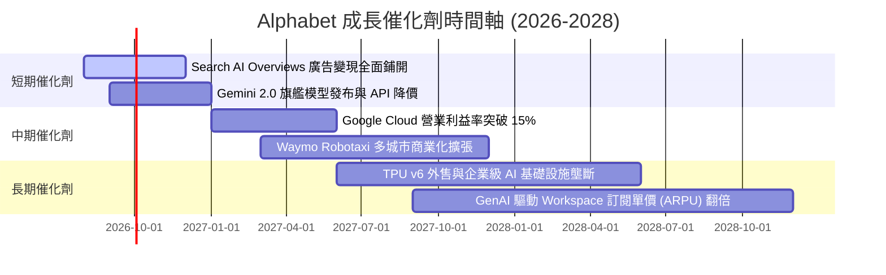

### 9.2 TAM 市場規模分析

```
╔══════════════════════════════════════════════════════════════════╗
║                   Alphabet 潛在市場規模 (TAM)                    ║
╠══════════════════════════════════════════════════════════════════╣
║                                                                  ║
║  全球數位廣告 TAM (2028E):  $1,050B  ██████████████ (滲透率 ~36%)║
║  全球雲端基礎設施 TAM:      $850B    ███████████░░ (滲透率 ~11%)║
║  生成式 AI 企業服務 TAM:    $450B    ██████░░░░░░░ (滲透率 ~5%) ║
║  自動駕駛出行 (Waymo) TAM:  $200B    ███░░░░░░░░░░ (滲透率 <1%) ║
║                                                                  ║
║  📊 總計潛在市場 (TAM) 超過 $2.55 兆美元，成長天花板極高          ║
╚══════════════════════════════════════════════════════════════════╝
```

### 9.3 成長驅動力結構圖

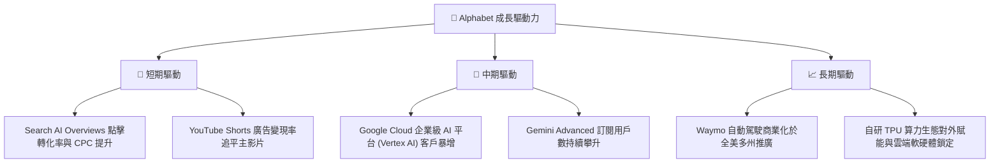

---

## 10. 風險矩陣

### 10.1 風險評分矩陣

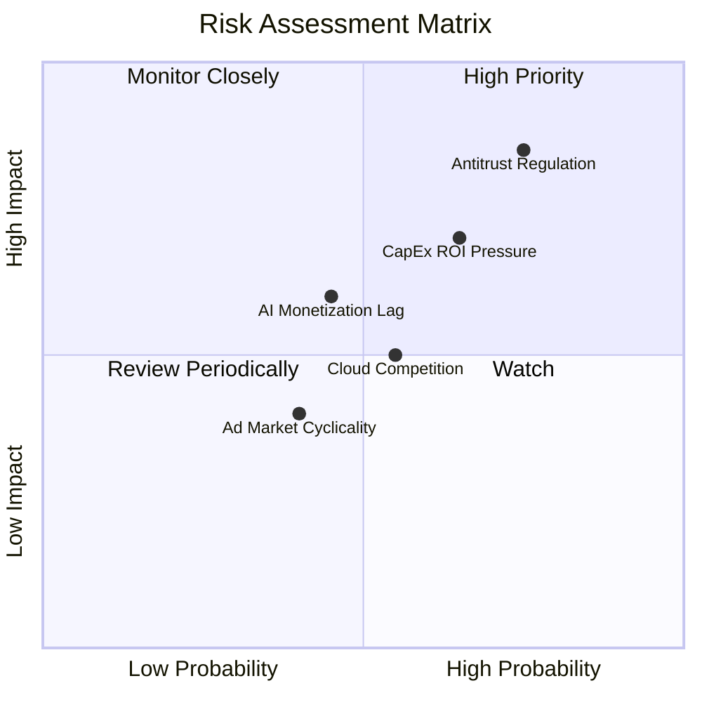

### 10.2 風險清單詳細分析

| # | 風險項目 | 發生機率 | 財務衝擊 | 風險評分 | 緩解措施 |
|---|----------|----------|----------|----------|----------|
| 1 | 🔴 **反壟斷拆分或獨佔合約解約** | 高 (75%) | 高 (-12% 營收) | 🔴 8.2/10 | 積極進行司法上訴，同時加速自有 Chrome/Android 與 Search 整合 |
| 2 | 🔴 **AI Capex 回報率低於預期** | 中 (65%) | 中 (-8% FCF) | 🔴 7.0/10 | 靈活調整後續年度 Capex 預算，轉向高回報項目 |
| 3 | 🟡 **生成式 AI 對傳統廣告侵蝕** | 中 (45%) | 中 (-5% CPC) | 🟡 5.5/10 | 在 AI Overviews 中深度植入商業贊助連結與原生廣告 |
| 4 | 🟡 **雲端價格戰與市場競爭** | 中 (55%) | 中 (-3% 利潤率)| 🟡 5.0/10 | 依靠自研 TPU 降本優勢保持 GCP 價格競爭力 |

---

## 11. 投資建議

### 11.1 最終綜合評級雷達圖

```
╔══════════════════════════════════════════════════════════════╗
║                 Alphabet 最終綜合評估雷達                     ║
╠══════════════════════════════════════════════════════════════╣
║ 業務基本面  9.5/10  ▓▓▓▓▓▓▓▓▓▓▓▓▓▓▓▓▓▓█░  🏆 頂級商業模式  ║
║ 財務健康度  9.5/10  ▓▓▓▓▓▓▓▓▓▓▓▓▓▓▓▓▓▓█░  🏆 巨額淨現金    ║
║ 獲利資本效率9.2/10  ▓▓▓▓▓▓▓▓▓▓▓▓▓▓▓▓▓▓░░  🟢 ROIC 28.4%    ║
║ 未來成長性  8.5/10  ▓▓▓▓▓▓▓▓▓▓▓▓▓▓▓▓░░░░  🟢 Cloud/AI 雙引擎║
║ 估值吸引力  8.0/10  ▓▓▓▓▓▓▓▓▓▓▓▓▓▓░░░░░░  🟢 PEG 0.97 便宜  ║
╠══════════════════════════════════════════════════════════════╣
║ 綜合投資評分：8.9 / 10 ｜ 評級：🟢 買入 (Buy)               ║
╚══════════════════════════════════════════════════════════════╝
```

### 11.2 目標價與隱含報酬率

| 情境 | 目標價 | 隱含報酬率（相對現價 $356.65）| 機率權重 | 說明 |
|------|--------|-------------------------------|----------|------|
| 🔴 **悲觀情境** | $310.00 | -13.1% | 20% | 反壟斷監管不利且 Capex 回報滯後 |
| 🟡 **基準情境** | **$421.79** | **+18.3%** | 60% | 12 個月主要目標（共識估值與 22x PE） |
| 🟢 **樂觀情境** | $485.00 | +36.0% | 20% | Cloud 利潤率大爆發與 AI 變現超預期 |

### 11.3 買入時機與觸發因素

```
╔══════════════════════════════════════════════════════════════════╗
║                  ✅ 買入觸發因素 Checklist                      ║
╠══════════════════════════════════════════════════════════════════╗
║                                                                  ║
║  立即買入條件（目前已滿足）：                                   ║
║  ✅ Trailing P/E 低於 20.0x（目前 17.89x）                      ║
║  ✅ PEG 比率低於 1.0x（目前 0.97x）                              ║
║  ✅ Google Cloud 營業利益率保持雙位數擴張                      ║
║                                                                  ║
║  加碼觸發條件：                                                  ║
║  ☐ 股價拉回至建議買入區間 $330.00 – $360.00                    ║
║  ☐ 美國 DOJ 反壟斷訴訟迎來和解或實質影響小於預期的判決           ║
║                                                                  ║
║  減碼/停損觸發條件：                                             ║
║  ☐ 股價超過樂觀目標價 $450.00 以上                               ║
║  ☐ 核心搜尋業務營收 YoY 成長率連續兩季跌破 5.0%                 ║
╚══════════════════════════════════════════════════════════════════╝
```

### 11.4 投資人適配度分析

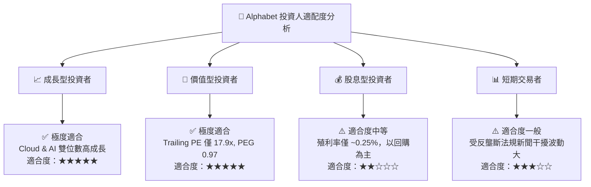

### 11.5 每季財報監控清單（Quarterly Watch List）

| 監控指標 | 最新數值 (TTM / Q2 26) | 健康門檻值 | 觸發減碼/警訊門檻 | 說明 |
|----------|------------------------|------------|-------------------|------|
| **Search 營收 YoY 成長** | +13.8% | > +8.0% | < +4.0% | 核心廣告基本盤動能 |
| **Google Cloud 營業利益率** | ~11.5% | > +10.0% | < +6.0% | 第二成長曲線獲利能力 |
| **全公司營業利益率 (OPM)** | 34.0% | > 30.0% | < 27.0% | 營運槓桿與成本控管狀況 |
| **單季 Capex 規模** | $44.92B | < $40B (常態化) | > $55B 且無營收加速 | 評估資本支出過熱風險 |
| **ROIC 資本回報率** | 28.4% | > 20.0% | < 15.0% | 資本配置效率檢驗 |

### 11.6 反面論證：什麼會證明論點錯誤（Disconfirming Evidence）

```
╔══════════════════════════════════════════════════════════════════╗
║              ⚠️ 論點失效條件（Disconfirming Evidence）           ║
╠══════════════════════════════════════════════════════════════════╣
║  本投資論點在下列條件發生時即宣告失效，需立即重新評估或清倉：     ║
║                                                                  ║
║  ☐ 1. 美國法院最終判決強制拆分 Alphabet（如分拆 Chrome/Android） ║
║  ☐ 2. 核心搜尋廣告營收連續兩季出現 YoY 負成長                    ║
║  ☐ 3. Google Cloud 營收成長率大幅放緩至 < 12.0% (被 AWS/Azure 輾壓)║
║  ☐ 4. 資本支出 Capex 長期居高不下，導致 ROIC 跌破 15.0%          ║
║  ☐ 5. 自由現金流 (FCF) 連續三季轉為負值                          ║
╚══════════════════════════════════════════════════════════════════╝
```

---

> **免責聲明**：本報告為 AI 自動生成之研究報告，僅供學術與投資參考，不構成任何具體投資建議或買賣邀約。投資涉及風險，證券價格可升可跌，入市前請獨立評估並諮詢專業財務顧問。