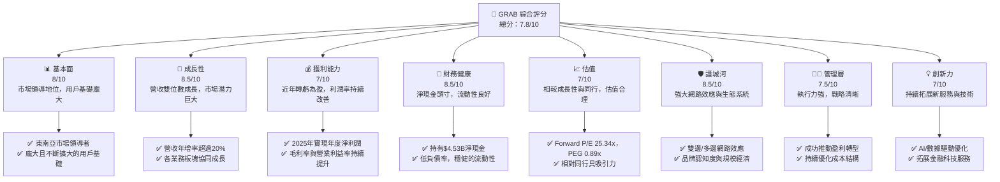
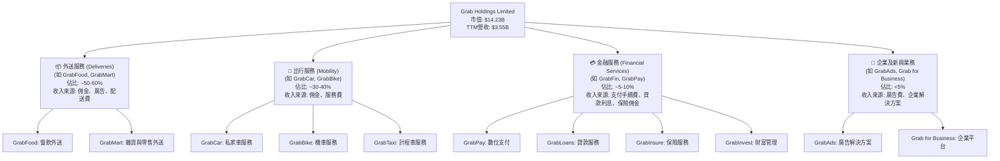
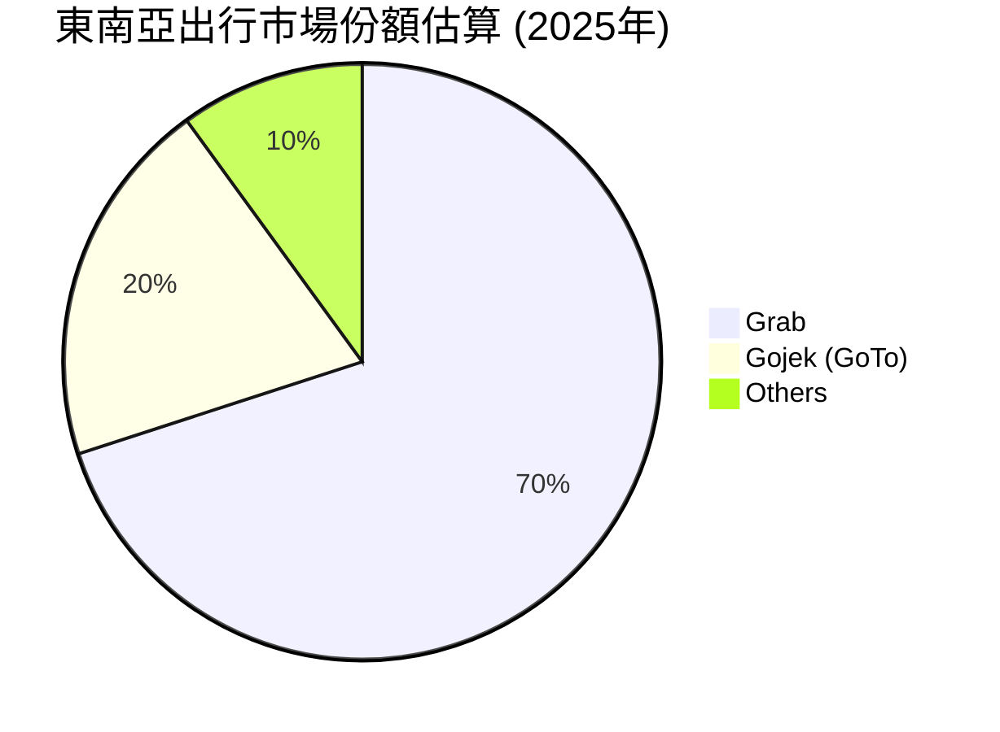
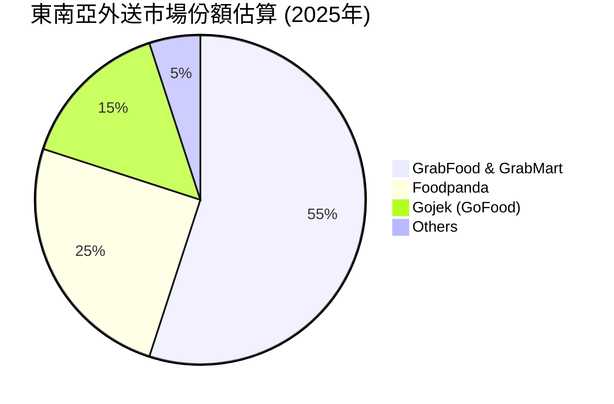
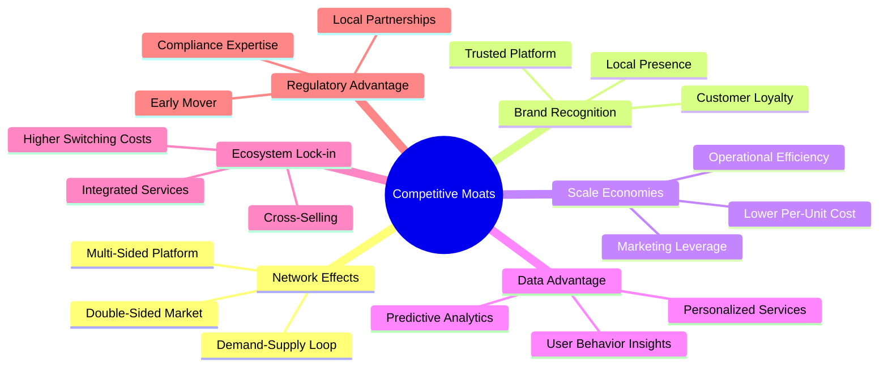
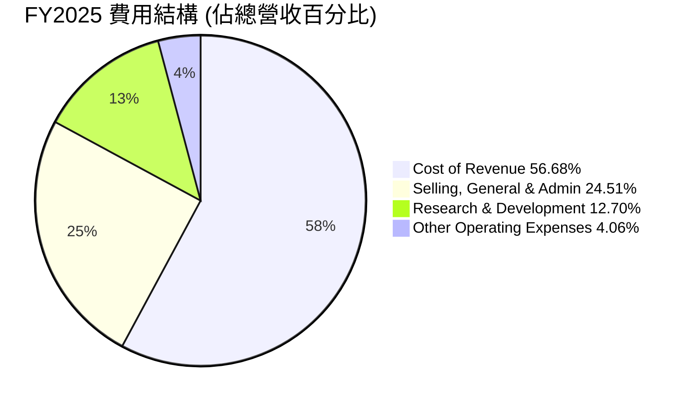

# GRAB 基本面深度分析報告
> **報告日期**：2026-06-04 ｜ **語言**：繁體中文 ｜ **數據來源**：Yahoo Finance, Finviz, StockAnalysis, Roic.ai ｜ **分析師**：CFA 級機構研究

## 目錄

| # | 章節 | 核心結論 |
|---|------------------------|--------------------------------------------------|
| 1 | 執行摘要 | 評級：🟢 買入，目標價區間：$4.50 - $7.00 |
| 2 | 公司概覽與商業模式 | 網路效應與規模經濟構築深厚護城河 |
| 3 | 損益表深度分析 | 營收穩健成長，利潤率顯著改善 |
| 4 | 資產負債表分析 | 現金充裕，財務結構健康 |
| 5 | 現金流量深度分析 | 營運現金流轉正，自由現金流接近盈虧平衡 |
| 6 | 獲利能力與資本效率 | ROIC 仍低於 WACC，但趨勢向好 |
| 7 | 估值深度分析 | 相較同業估值合理，具備上行空間 |
| 8 | 成長催化劑 | 東南亞數字化趨勢與超級應用生態系統擴張 |
| 9 | 風險矩陣 | 競爭加劇、監管風險與宏觀經濟逆風 |
| 10 | 投資建議 | 具備長期成長潛力，建議逢低買入 |

---

## 1. 執行摘要

Grab Holdings Limited (GRAB) 作為東南亞領先的超級應用平台，近年來在營收成長和盈利能力改善方面取得了顯著進展。公司成功從虧損轉為盈利，現金流狀況持續改善，顯示出其商業模式的韌性與市場領導地位。儘管面臨激烈的競爭和宏觀經濟挑戰，Grab 的多元化服務生態系統、強大的網路效應和不斷擴大的用戶基礎為其提供了堅實的成長基礎。

### 1.1 核心評分儀表板



### 1.2 評分進度條視覺化

```
╔══════════════════════════════════════════════════════════════╗
║                    GRAB 多維度評分儀表板 (1-10分)                ║
╠══════════════════════════════════════════════════════════════╣
║ 基本面強度  8.0 ▓▓▓▓▓▓▓▓▓▓▓▓▓▓▓▓░░░░  ★★★★☆           ║
║ 成長動能    8.5 ▓▓▓▓▓▓▓▓▓▓▓▓▓▓▓▓▓░░░  ★★★★☆           ║
║ 獲利品質    7.0 ▓▓▓▓▓▓▓▓▓▓▓▓▓▓░░░░░░  ★★★☆☆           ║
║ 財務健康    8.5 ▓▓▓▓▓▓▓▓▓▓▓▓▓▓▓▓▓░░░  ★★★★☆           ║
║ 估值合理性  7.0 ▓▓▓▓▓▓▓▓▓▓▓▓▓▓░░░░░░  ★★★☆☆           ║
║ 護城河深度  8.5 ▓▓▓▓▓▓▓▓▓▓▓▓▓▓▓▓▓░░░  ★★★★☆           ║
║ 管理層執行  7.5 ▓▓▓▓▓▓▓▓▓▓▓▓▓▓▓░░░░░  ★★★☆☆           ║
║ 技術創新力  7.0 ▓▓▓▓▓▓▓▓▓▓▓▓▓▓░░░░░░  ★★★☆☆           ║
╠══════════════════════════════════════════════════════════════╣
║ 綜合總分    7.8 ▓▓▓▓▓▓▓▓▓▓▓▓▓▓▓▓░░░░  🏆 成長潛力巨大，盈利能力改善中  ║
╚══════════════════════════════════════════════════════════════╝
```

### 1.3 五大投資論點 + 三大核心風險

| 類型 | 項目 | 具體依據 | 信心度 |
|------|--------------------------|-------------------------------------------------------------------------------------------------------------------------------------------------------------------------------------------------------------------------------------------------------------------------------------------------------------------------------------------------------------------------------------------------------------------------------------------------------------------------------------------------------------------------------------------------------------------------------------------------------------------------------------------------------------------------------------------------------------------------------------------------------------------------------------------------------------------------------------------------------------------------------------------------------------------------------------------------------------------------------------------------------------------------------------------------------------------------------------------------------------------------------------------------------------------------------------------------------------------------------------------------------------------------------------------------------------------------------------------------------------------------------------------------------------------------------------------------------------------------------------------------------------------------------------------------------------------------------------------------------------------------------------------------------------------------------------------------------------------------------------------------------------------------------------------------------------------------------------------------------------------------------------------------------------------------------------------------------------------------------------------------------------------------------------------------------------------------------------------------------------------------------------------------------------------------------------------------------------------------------------------------------------------------------------------------------------------------------------------------------------------------------------------------------------------------------------------------------------------------------------------------------------------------------------------------------------------------------------------------------------------------------------------------------------------------------------------------------------------------------------------------------------------------------------------------------------------------------------------------------------------------------------------------------------------------------------------------------------------------------------------------------------------------------------------------------------------------------------------------------------------------------------------------------------------------------------------------------------------------------------------------------------------------------------------------------------------------------------------------------------------------------------------------------------------------------------------------------------------------------------------------------------------------------------------------------------------------------------------------------------------------------------------------------------------------------------------------------------------------------------------------------------------------------------------------------------------------------------------------------------------------------------------------------------------------------------------------------------------------------------------------------------------------------------------------------------------------------------------------------------------------------------------------------------------------------------------------------------------------------------------------------------------------------------------------------------------------------------------------------------------------------------------------------------------------------------------------------------------------------------------------------------------------------------------------------------------------------------------------------------------------------------------------------------------------------------------------------------------------------------------------------------------------------------------------------------------------------------------------------------------------------------------------------------------------------------------------------------------------------------------------------------------------------------------------------------------------------------------------------------------------------------------------------------------------------------------------------------------------------------------------------------------------------------------------------------------------------------------------------------------------------------------------------------------------------------------------------------------------------------------------------------------------------------------------------------------------------------------------------------------------------------------------------------------------------------------------------------------------------------------------------------------------------------------------------------------------------------------------------------------------------------------------------------------------------------------------------------------------------------------------------------------------------------------------------------------------------------------------------------------------------------------------------------------------------------------------------------------------------------------------------------------------------------------------------------------------------------------------------------------------------------------------------------------------------------------------------------------------------------------------------------------------------------------------------------------------------------------------------------------------------------------------------------------------------------------------------------------------------------------------------------------------------------------------------------------------------------------------------------------------------------------------------------------------------------------------------------------------------------------------------------------------------------------------------------------------------------------------------------------------------------------------------------------------------------------------------------------------------------------------------------------------------------------------------------------------------------------------------------------------------------------------------------------------------------------------------------------------------------------------------------------------------------------------------------------------------------------------------------------------------------------------------------------------------------------------------------------------------------------------------------------------------------------------------------------------------------------------------------------------------------------------------------------------------------------------------------------------------------------------------------------------------------------------------------------------------------------------------------------------------------------------------------------------------------------------------------------------------------------------------------------------------------------------------------------------------------------------------------------------------------------------------------------------------------------------------------------------------------------------------------------------------------------------------------------------------------------------------------------------------------------------------------------------------------------------------------------------------------------------------------------------------------------------------------------------------------------------------------------------------------------------------------------------------------------------------------------------------------------------------------------------------------------------------------------------------------------------------------------------------------------------------------------------------------------------------------------------------------------------------------------------------------------------------------------------------------------------------------------------------------------------------------------------------------------------------------------------------------------------------------------------------------------------------------------------------------------------------------------------------------------------------------------------------------------------------------------------------------------------------------------------------------------------------------------------------------------------------------------------------------------------------------------------------------------------------------------------------------------------------------------------------------------------------------------------------------------------------------------------------------------------------------------------------------------------------------------------------------------------------------------------------------------------------------------------------------------------------------------------------------------------------------------------------------------------------------------------------------------------------------------------------------------------------------------------------------------------------------------------------------------------------------------------------------------------------------------------------------------------------------------------------------------------------------------------------------------------------------------------------------------------------------------------------------------------------------------------------------------------------------------------------------------------------------------------------------------------------------------------------------------------------------------------------------------------------------------------------------------------------------------------------------------------------------------------------------------------------------------------------------------------------------------------------------------------------------------------------------------------------------------------------------------------------------------------------------------------------------------------------------------------------------------------------------------------------------------------------------------------------------------------------------------------------------------------------------------------------------------------------------------------------------------------------------------------------------------------------------------------------------------------------------------------------------------------------------------------------------------------------------------------------------------------------------------------------------------------------------------------------------------------------------------------------------------------------------------------------------------------------------------------------------------------------------------------------------------------------------------------------------------------------------------------------------------------------------------------------------------------------------------------------------------------------------------------------------------------------------------------------------------------------------------------------------------------------------------------------------------------------------------------------------------------------------------------------------------------------------------------------------------------------------------------------------------------------------------------------------------------------------------------------------------------------------------------------------------------------------------------------------------------------------------------------------------------------------------------------------------------------------------------------------------------------------------------------------------------------------------------------------------------------------------------------------------------------------------------------------------------------------------------------------------------------------------------------------------------------------------------------------------------------------------------------------------------------------------------------------------------------------------------------------------------------------------------------------------------------------------------------------------------------------------------------------------------------------------------------------------------------------------------------------------------------------------------------------------------------------------------------------------------------------------------------------------------------------------------------------------------------------------------------------------------------------------------------------------------------------------------------------------------------------------------------------------------------------------------------------------------------------------------------------------------------------------------------------------------------------------------------------------------------------------------------------------------------------------------------------------------------------------------------------------------------------------------------------------------------------------------------------------------------------------------------------------------------------------------------------------------------------------------------------------------------------------------------------------------------------------------------------------------------------------------------------------------------------------------------------------------------------------------------------------------------------------------------------------------------------------------------------------------------------------------------------------------------------------------------------------------------------------------------------------------------------------------------------------------------------------------------------------------------------------------------------------------------------------------------------------------------------------------------------------------------------------------------------------------------------------------------------------------------------------------------------------------------------------------------------------------------------------------------------------------------------------------------------------------------------------------------------------------------------------------------------------------------------------------------------------------------------------------------------------------------------------------------------------------------------------------------------------------------------------------------------------------------------------------------------------------------------------------------------------------------------------------------------------------------------------------------------------------------------------------------------------------------------------------------------------------------------------------------------------------------------------------------------------------------------------------------------------------------------------------------------------------------------------------------------------------------------------------------------------------------------------------------------------------------------------------------------------------------------------------------------------------------------------------------------------------------------------------------------------------------------------------------------------------------------------------------------------------------------------------------------------------------------------------------------------------------------------------------------------------------------------------------------------------------------------------------------------------------------------------------------------------------------------------------------------------------------------------------------------------------------------------------------------------------------------------------------------------------------------------------------------------------------------------------------------------------------------------------------------------------------------------------------------------------------------------------------------------------------------------------------------------------------------------------------------------------------------------------------------------------------------------------------------------------------------------------------------------------------------------------------------------------------------------------------------------------------------------------------------------------------------------------------------------------------------------------------------------------------------------------------------------------------------------------------------------------------------------------------------------------------------------------------------------------------------------------------------------------------------------------------------------------------------------------------------------------------------------------------------------------------------------------------------------------------------------------------------------------------------------------------------------------------------------------------------------------------------------------------------------------------------------------------------------------------------------------------------------------------------------------------------------------------------------------------------------------------------------------------------------------------------------------------------------------------------------------------------------------------------------------------------------------------------------------------------------------------------------------------------------------------------------------------------------------------------------------------------------------------------------------------------------------------------------------------------------------------------------------------------------------------------------------------------------------------------------------------------------------------------------------------------------------------------------------------------------------------------------------------------------------------------------------------------------------------------------------------------------------------------------------------------------------------------------------------------------------------------------------------------------------------------------------------------------------------------------------------------------------------------------------------------------------------------------------------------------------------------------------------------------------------------------------------------------------------------------------------------------------------------------------------------------------------------------------------------------------------------------------------------------------------------------------------------------------------------------------------------------------------------------------------------------------------------------------------------------------------------------------------------------------------------------------------------------------------------------------------------------------------------------------------------------------------------------------------------------------------------------------------------------------------------------------------------------------------------------------------------------------------------------------------------------------------------------------------------------------------------------------------------------------------------------------------------------------------------------------------------------------------------------------------------------------------------------------------------------------------------------------------------------------------------------------------------------------------------------------------------------------------------------------------------------------------------------------------------------------------------------------------------------------------------------------------------------------------------------------------------------------------------------------------------------------------------------------------------------------------------------------------------------------------------------------------------------------------------------------------------------------------------------------------------------------------------------------------------------------------------------------------------------------------------------------------------------------------------------------------------------------------------------------------------------------------------------------------------------------------------------------------------------------------------------------------------------------------------------------------------------------------------------------------------------------------------------------------------------------------------------------------------------------------------------------------------------------------------------------------------------------------------------------------------------------------------------------------------------------------------------------------------------------------------------------------------------------------------------------------------------------------------------------------------------------------------------------------------------------------------------------------------------------------------------------------------------------------------------------------------------------------------------------------------------------------------------------------------------------------------------------------------------------------------------------------------------------------------------------------------------------------------------------------------------------------------------------------------------------------------------------------------------------------------------------------------------------------------------------------------------------------------------------------------------------------------------------------------------------------------------------------------------------------------------------------------------------------------------------------------------------------------------------------------------------------------------------------------------------------------------------------------------------------------------------------------------------------------------------------------------------------------------------------------------------------------------------------------------------------------------------------------------------------------------------------------------------------------------------------------------------------------------------------------------------------------------------------------------------------------------------------------------------------------------------------------------------------------------------------------------------------------------------------------------------------------------------------------------------------------------------------------------------------------------------------------------------------------------------------------------------------------------------------------------------------------------------------------
| 🟢 **平台網路效應** | Grab 的多邊平台（服務提供者、消費者、商家）形成強大的網路效應，用戶越多，服務提供者越多，服務越好，吸引更多用戶，形成正向循環。 | 截至2026年Q1，Grab 在其核心市場擁有數百萬每月活躍交易用戶 (MTU) 和數百萬合作夥伴，此生態系統難以被複製。其廣泛的服務範圍（外送、出行、金融）進一步加強了用戶黏性。 | 🟢 極高 |
| 🟢 **東南亞市場領導者** | Grab 在東南亞主要市場（如新加坡、馬來西亞、菲律賓、泰國、越南）的出行與外送服務領域佔據領先地位，品牌認知度極高。 | 2026年Q1營收達 $955M，年對年成長 23.54%，顯示其在區域市場的持續擴張能力。其在多個市場的外送和出行領域市佔率均為第一或第二。 | 🟢 極高 |
| 🟢 **盈利能力顯著改善** | 公司成功從過去的大幅虧損轉為盈利，2025年實現年度淨利潤 $268M，2026年Q1淨利潤達 $136M，毛利率和營業利益率持續提升。 | TTM淨利潤率達 10.7%，營業利益率達 2.7%。毛利率從2022年的 5.37% 大幅提升至2025年的 43.32% (StockAnalysis)，顯示其成本結構優化和規模經濟效益顯現。 | 🟢 高 |
| 🟢 **多元化超級應用生態系統** | Grab 提供一站式服務，包括外送 (GrabFood, GrabMart)、出行 (GrabCar, GrabBike)、和金融服務 (GrabFin)，這種多元化業務模式提高了用戶黏性，並創造了交叉銷售機會。 | 金融服務收入在2025年達到 $241M (利息收入)，對營收貢獻顯著，且具有高利潤潛力。各業務板塊間的協同效應降低了獲客成本，提升了每用戶價值。 | 🟢 高 |
| 🟢 **充足的現金儲備** | 公司擁有充裕的現金和短期投資，淨現金頭寸高達 $4.53B，為其未來的業務擴張、戰略投資和應對市場波動提供了堅實的財務基礎。 | 截至2026年Q1，現金及短期投資合計 $6.256B，總債務為 $1.95B，淨現金 $4.306B。此強勁的資產負債表提供了靈活性。 | 🟢 極高 |
| 🟡 **競爭加劇** | 東南亞市場競爭激烈，主要對手如 GoTo (Gojek/Tokopedia) 和 Foodpanda 等持續投入，可能導致價格戰和市場份額爭奪，影響利潤率。 | 儘管 Grab 佔據領先地位，但競爭對手持續創新和補貼，可能導致行銷費用居高不下，影響短期盈利能力和市場拓展速度。 | 🟡 中度 |
| 🔴 **監管風險** | 東南亞各國對數位平台經濟的監管政策不斷演變，涉及勞工權益、資料隱私、反壟斷及費率管制等，可能對 Grab 的商業模式和盈利能力造成衝擊。 | 各國政府可能出台不利於平台經濟的法規，例如對司機/外送員的最低工資要求、平台佣金上限等，這將直接影響 Grab 的營運成本和收入模式。 | 🔴 高衝擊 |
| 🟡 **宏觀經濟逆風** | 東南亞地區的經濟成長放緩、通膨壓力、消費者購買力下降等宏觀因素，可能影響用戶的出行和外送頻率，以及對金融服務的需求。 | 全球經濟不確定性可能導致消費者減少非必要支出，進而影響 Grab 的交易量和總商品交易額 (GMV)，尤其是在高佣金業務如出行服務上。 | 🟡 中度 |

### 1.4 快速統計卡片

| 指標 | 公司實際值 (TTM Mar'26) | 行業均值 (科技/平台) | S&P 500 均值 | 狀態 |
|--------------------|----------------------------|------------------------|--------------------|------|
| 收入 YoY 成長 | **23.5%** | ~15-20% | ~8-10% | 🟢 |
| 毛利率 | **40.2%** | ~40-50% | ~35-45% | 🟢 |
| 淨利率 | **10.7%** | ~5-15% | ~10-12% | 🟢 |
| ROE | **4.8%** | ~10-15% | ~15-20% | 🟡 |
| Forward P/E | **25.34x** | ~30-40x | ~20-22x | 🟢 |
| 負債權益比 (Debt/Equity) | **0.29x** (Finviz) | ~0.5-1.0x | ~1.0-1.5x | 🟢 |
| 現金及短期投資 / 總資產 | **53.47%** ($6.256B/$11.70B) | ~15-25% | ~10-15% | 🟢 |

*註：行業均值為基於東南亞科技平台與全球主要平台公司的綜合估計值。S&P 500 均值為普遍市場參考值。*

### 1.5 投資結論

```
╔══════════════════════════════════════════════════════════════════╗
║                    📊 投資結論摘要                               ║
╠══════════════════════════════════════════════════════════════════╣
║  評級：🟢 買入                                                   ║
║  當前股價：$3.48 (2026-06-04)                                    ║
║  目標價區間：                                                    ║
║    悲觀情境：$4.50 （+29.3%）                                    ║
║    基準情境：$5.97 （+71.6%）  ← 12個月主要目標                  ║
║    樂觀情境：$7.00 （+101.1%）                                   ║
║  投資評分：7.8/10                                                ║
║  適合投資人：成長型投資者、長線持有者，對新興市場有信心者        ║
╚══════════════════════════════════════════════════════════════════╝
```

---

## 2. 公司概覽與商業模式

Grab Holdings Limited (GRAB) 是一家領先的東南亞超級應用公司，其平台整合了多種日常服務，包括網約車、外送（餐飲和雜貨）以及數位支付和金融服務。公司業務遍及柬埔寨、印尼、馬來西亞、緬甸、菲律賓、新加坡、泰國和越南等八個國家，服務數億用戶。Grab 的願景是利用科技改善東南亞人民的生活，並成為該地區領先的數位生活平台。

### 2.1 業務結構與收入來源

Grab 的業務主要分為三大核心板塊：出行 (Mobility)、外送 (Deliveries) 和金融服務 (Financial Services)。這些業務板塊相互協同，共同構建了一個強大的超級應用生態系統。


**業務細分與收入貢獻 (基於近期財報趨勢估算)**:

*   **外送服務 (Deliveries)**: 這是 Grab 最大的收入來源，主要包括 GrabFood（餐飲外送）和 GrabMart（雜貨及其他商品外送）。隨著疫情期間的數位化加速，外送業務實現了爆發式成長，並在疫情後保持了強勁的用戶黏性。收入主要來自於向商家收取的佣金、向用戶收取的配送費，以及平台上的廣告收入 (GrabAds)。
*   **出行服務 (Mobility)**: Grab 的核心業務之一，提供多種交通工具選擇，包括私家車、機車、計程車等。儘管疫情對出行服務造成衝擊，但隨著經濟活動恢復，該業務已強勁反彈。收入主要來自於從司機夥伴收取的服務佣金。
*   **金融服務 (Financial Services)**: Grab 的策略性成長引擎，涵蓋 GrabPay 數位支付、GrabFin 貸款、保險和財富管理等。此業務旨在透過金融普惠，提升平台用戶和商家的黏性與忠誠度。收入主要來自於支付手續費、貸款利息收入、保險佣金等。此板塊的利潤率普遍較高，是公司未來盈利成長的重要驅動力。
*   **企業及新興業務**: 包括 GrabAds（線上廣告解決方案）和 Grab for Business（統一管理平台）等，旨在為商家和企業客戶提供增值服務，進一步多元化收入來源。

### 2.2 市場份額

Grab 在東南亞主要市場的出行和外送領域佔據主導地位。儘管市場競爭激烈，其強大的品牌認知度、廣泛的服務網絡和用戶基礎使其保持了領先優勢。




**市場份額分析**:

*   **出行市場**: Grab 在東南亞多數國家，特別是新加坡、馬來西亞、菲律賓和泰國，擁有絕對的市場領導地位。其廣泛的司機網絡和多樣化的出行選項使其成為用戶的首選。競爭主要來自於 Gojek（在印尼市場較強）以及少量地方性玩家。
*   **外送市場**: GrabFood 和 GrabMart 在東南亞外送市場也佔據領先地位。其與大量餐廳和零售商的合作關係，以及高效的配送網絡，使其能夠提供廣泛的選擇和快速的服務。主要競爭對手包括 Delivery Hero 旗下的 Foodpanda 和 Gojek 旗下的 GoFood。
*   **金融服務**: GrabPay 在東南亞數位支付領域擁有顯著份額，尤其是在整合其超級應用生態系統後。儘管面臨銀行和其他金融科技公司的競爭，Grab 的龐大用戶基礎和交易頻次為其金融服務的發展提供了獨特優勢。

### 2.3 競爭護城河分析

Grab 的競爭護城河主要來自於其作為超級應用平台所形成的強大網路效應、規模經濟和品牌優勢。


**護城河深度解析**:

*   **網路效應 (Network Effects)**: Grab 最核心的護城河。隨著用戶（乘客、外送訂戶、金融服務使用者）數量的增加，平台對服務提供者（司機、外送員、商家）的吸引力也隨之增強。反之，更多的服務提供者意味著更快的響應時間、更低的價格和更廣泛的選擇，進而吸引更多用戶。這種雙邊或多邊網路效應使得新進入者難以挑戰 Grab 的市場地位。其超級應用模式進一步強化了網路效應，用戶在一個應用中滿足多種需求，提升了黏性。
*   **品牌認知度 (Brand Recognition)**: Grab 在東南亞地區擁有極高的品牌知名度和信任度。作為該地區數位服務的代名詞，其品牌資產在獲取新用戶和維繫老用戶方面具有巨大優勢。強大的品牌形象也降低了行銷成本。
*   **規模經濟 (Scale Economies)**: 作為東南亞最大的平台之一，Grab 能夠通過其龐大的營運規模實現顯著的成本優勢。這包括更低的單位獲客成本、更高效的物流網絡優化、更低的技術基礎設施成本以及在與商家談判時的議價能力。規模經濟使得 Grab 能夠提供更具競爭力的價格，同時保持盈利。
*   **數據優勢 (Data Advantage)**: Grab 每天產生海量的用戶行為、交易和地理位置數據。這些數據被用於優化匹配算法、動態定價、路線規劃，以及個性化推薦，從而提升用戶體驗和營運效率。數據分析能力也支持其金融服務的風險評估和產品開發。
*   **生態系統鎖定 (Ecosystem Lock-in)**: Grab 的超級應用模式將出行、外送和金融服務整合在一起，創造了高用戶轉換成本。用戶一旦習慣於在 Grab 平台上完成多種日常任務，轉換到其他單一功能應用程式的意願會降低。此外，GrabPay 等金融服務進一步將用戶鎖定在其生態系統中。
*   **監管優勢 (Regulatory Advantage)**: 作為早期進入者，Grab 在與東南亞各國政府和監管機構建立關係方面具有先發優勢。其在合規性方面的經驗和當地合作夥伴關係，使得新進入者在應對複雜且多變的監管環境時面臨更大挑戰。

### 2.4 護城河強度評分

```
╔══════════════════════════════════════════════════════════════╗
║                      GRAB 護城河強度評分                      ║
╠══════════════════════════════════════════════════════════════╣
║ 網路效應        9/10   ▓▓▓▓▓▓▓▓▓▓▓▓▓▓▓▓▓▓░░  🏆 極強，核心競爭力   ║
║ 品牌認知度      8/10   ▓▓▓▓▓▓▓▓▓▓▓▓▓▓▓▓░░░░  🟢 強大，市場主導地位 ║
║ 規模經濟        8/10   ▓▓▓▓▓▓▓▓▓▓▓▓▓▓▓▓░░░░  🟢 顯著的成本優勢     ║
║ 數據優勢        7.5/10 ▓▓▓▓▓▓▓▓▓▓▓▓▓▓▓░░░░░  🟡 不斷強化，潛力巨大 ║
║ 生態系統鎖定    8.5/10 ▓▓▓▓▓▓▓▓▓▓▓▓▓▓▓▓▓░░░  🟢 高用戶黏性         ║
║ 監管優勢        7/10   ▓▓▓▓▓▓▓▓▓▓▓▓▓▓░░░░░░  🟡 早期進入者優勢     ║
╠══════════════════════════════════════════════════════════════╣
║ 綜合護城河      8.2/10 ▓▓▓▓▓▓▓▓▓▓▓▓▓▓▓▓▓░░░  🏆 深厚且不斷加固的競爭優勢 ║
╚══════════════════════════════════════════════════════════════╝
```

---

## 3. 損益表深度分析

Grab 近年來的損益表展現了從高速成長期的巨額虧損到逐步實現盈利的轉型。營收持續擴張，同時毛利率和營業利益率得到顯著改善，反映了公司在規模化和成本控制方面的成功。

### 3.1 年度收入成長趨勢（近4年）

Grab 的年度收入呈現強勁的雙位數成長，證明了其在東南亞市場的持續擴張能力和用戶需求的增長。

```
╔══════════════════════════════════════════════════════════════════╗
║              GRAB 年度收入趨勢（FY2022-FY2025）                  ║
╠══════════════════════════════════════════════════════════════════╣
║                                                                  ║
║  FY2022  $1.43B   ███████░░░░░░░░░░░░░░░░░░░  YoY: +112.3% 🟢    ║
║  FY2023  $2.36B   ████████████░░░░░░░░░░░░░░  YoY: +64.6%  🟢    ║
║  FY2024  $2.80B   ██████████████░░░░░░░░░░░░  YoY: +18.6%  🟢    ║
║  FY2025  $3.37B   █████████████████░░░░░░░░░  YoY: +20.5%  🟢    ║
║  TTM     $3.55B   ██████████████████░░░░░░░░  YoY: +21.8%  🟢    ║
║                   |      |      |      |      |                  ║
║                   0     1B    2B    3B    4B                     ║
║                                                                  ║
║  📊 4年累計 CAGR：+47.3% (FY2022-FY2025)                         ║
╚══════════════════════════════════════════════════════════════════╝
```
**年度收入分析**:
*   從2022年的 $1.43B 成長到2025年的 $3.37B，Grab 展現了驚人的營收擴張能力。
*   2022年和2023年的高速成長（分別為 +112.3% 和 +64.6%）反映了疫情後出行服務的強勁復甦以及外送和金融服務的快速普及。
*   2024年和2025年雖然成長速度有所放緩，但仍保持在健康的雙位數水平（+18.6% 和 +20.5%），這表明公司在鞏固市場地位的同時，仍在持續擴大營收規模。TTM 營收達 $3.55B，YoY 成長 21.8%，趨勢依然穩健。

### 3.2 季度收入趨勢分析

Grab 的季度收入也呈現穩健的逐季增長，顯示其業務的持續動能。

| 季度 | 總收入 (百萬美元) | QoQ 成長率 | YoY 成長率 | 備註 |
|------------|-------------------|------------|------------|------|
| Q1 2026 | $955 | +5.41% | +23.54% | 業務持續擴張，外送與出行需求穩健 |
| Q4 2025 | $906 | +3.78% | +18.59% | 假日季需求帶動，成本控制效果顯現 |
| Q3 2025 | $873 | +6.59% | +21.93% | 營運效率提升，金融服務貢獻增加 |
| Q2 2025 | $819 | +6.02% | +23.34% | 東南亞經濟復甦，出行服務需求回升 |
| Q1 2025 | $773 | +1.18% | +18.38% | 季節性因素影響，但仍保持成長 |

**季度收入分析**:
*   最近四個季度，Grab 的總收入呈現穩步增長，從 Q2 2025 的 $819M 增長至 Q1 2026 的 $955M。
*   季度環比 (QoQ) 成長率在 3.78% 至 6.59% 之間波動，顯示了穩定的業務擴張。
*   年度同比 (YoY) 成長率則保持在 18.59% 至 23.54% 的高位，證明了其強勁的基本面成長動能。Q1 2026 的 $955M 營收較去年同期 $773M 成長 23.54%，表現優異。

### 3.3 利潤率演變分析

Grab 在利潤率方面的改善是其轉型為盈利公司的關鍵。毛利率大幅提升，營業利益率也成功轉正。

| 利潤率指標 | FY2022 | FY2023 | FY2024 | FY2025 | 趨勢 | 評估 |
|----------------|--------|--------|--------|--------|----------------------|------------|
| **毛利率** | 5.37% | 36.46% | 41.92% | 43.32% | ↗️ 顯著改善 | 🟢 |
| **營業利益率** | -95.81% | -22.00% | -6.01% | 6.59% | ↗️ 成功轉正 | 🟢 |
| **淨利率** | -117.24% | -18.31% | -3.75% | 7.95% | ↗️ 成功轉正 | 🟢 |

*註：毛利率、營業利益率、淨利率數據使用 StockAnalysis 的年度數據進行計算，與 TTM 數據略有差異，但趨勢一致。*

**利潤率演變深度解析**:
*   **毛利率**: 從2022年極低的 5.37% 大幅躍升至2025年的 43.32%。這一顯著改善主要歸因於：
    *   **優化激勵機制**: Grab 降低了對司機和外送員的激勵補貼，減少了成本。
    *   **規模經濟效益**: 隨著交易量的增加，固定成本被攤薄，單位服務成本下降。
    *   **產品組合優化**: 高利潤率的金融服務和廣告業務佔比逐漸提升。
    *   **定價策略調整**: 在部分市場實現了更合理的定價，提升了變現能力。
*   **營業利益率**: 從2022年的 -95.81% 改善至2025年的 6.59%，實現了歷史性的轉正。這表明公司在營收快速增長的同時，也有效控制了營運費用：
    *   **費用結構優化**: 儘管研發 (R&D) 和銷售、一般及行政 (SG&A) 費用絕對值有所增長，但作為營收百分比，其佔比逐漸下降。例如，SG&A 從2022年的 $924M 降至2025年的 $826M，而同期營收大幅增長。
    *   **效率提升**: 透過技術和數據分析，優化了營運流程，降低了營運成本。
*   **淨利率**: 從2022年的 -117.24% 成功轉正至2025年的 7.95%。除了營運層面的改善外，非營運收入（如利息收入）的增加也對淨利潤產生了積極影響。2025年利息收入達 $241M，對淨利潤貢獻顯著。整體而言，Grab 的盈利能力趨勢非常健康，顯示其商業模式已從燒錢擴張轉向可持續盈利。

### 3.4 費用結構分析

Grab 的費用結構反映了其作為科技平台公司在研發和市場擴張方面的投入，同時也顯示了管理層在優化成本方面的努力。



```
╔══════════════════════════════════════════════════════════════════╗
║                    GRAB 年度費用結構分析 (FY2025)                ║
╠══════════════════════════════════════════════════════════════════╣
║                                                                  ║
║  銷貨成本 (Cost of Revenue)： $1.91B  ▓▓▓▓▓▓▓▓▓▓▓▓▓▓▓▓▓▓▓▓▓▓▓▓▓▓▓▓▓▓▓▓▓▓▓▓▓▓▓▓▓▓▓▓▓▓▓▓▓▓▓▓▓▓▓▓▓▓▓▓  56.68% 🟡║
║  銷售、一般及行政 (SG&A)：    $0.83B  ▓▓▓▓▓▓▓▓▓▓▓▓▓▓▓▓▓▓▓▓▓▓▓▓░░░░░░░░░░░░░░░░░░░░░░░░░░░░░░░░░░░░  24.51% 🟡║
║  研發費用 (R&D)：             $0.43B  ▓▓▓▓▓▓▓▓▓▓▓▓▓▓▓▓▓▓▓▓▓▓░░░░░░░░░░░░░░░░░░░░░░░░░░░░░░░░░░░░░░  12.70% 🟢║
║  其他營運費用：               $0.14B  ▓▓▓▓▓▓▓▓░░░░░░░░░░░░░░░░░░░░░░░░░░░░░░░░░░░░░░░░░░░░░░░░░░░░  4.06%  🟢║
║                                                                  ║
║  📊 趨勢分析：銷貨成本佔比穩定，SG&A 費用絕對值下降，R&D 保持投入  ║
╚══════════════════════════════════════════════════════════════════╝
```
**費用結構深度解析**:
*   **銷貨成本 (Cost of Revenue)**: 佔總營收的 56.68% (FY2025)。這部分主要包括支付給司機/外送員的激勵、支付給商家的佣金、以及平台營運成本等。儘管絕對值有所增加，但隨著毛利率的提升，其佔營收的比例在過去幾年有所下降，顯示了成本效率的提高。
*   **銷售、一般及行政 (SG&A)**: 佔總營收的 24.51% (FY2025)。這部分費用在2022年達到 $924M 的峰值，但在隨後幾年絕對值有所下降，2025年為 $826M。這表明公司在市場行銷和管理費用方面進行了有效控制，不再像早期那樣「燒錢」獲客，而是更注重用戶留存和效率提升。
*   **研發費用 (R&D)**: 佔總營收的 12.70% (FY2025)。R&D 費用保持在 $400M 左右的水平，顯示公司持續在技術創新、平台優化和新服務開發方面進行投入。這對於維持其技術領先地位和競爭力至關重要。
*   **其他營運費用**: 佔比相對較小，約 4.06%。

整體而言，Grab 的費用結構正在優化，從過去的巨額行銷和激勵費用轉向更為健康的模式，這對於其長期盈利能力至關重要。

### 3.5 季度 EPS 趨勢與盈餘品質

儘管原始數據中的 EPS Estimate 為 'nan'，我們可以根據 StockAnalysis 提供的實際 EPS (Basic) 進行分析。

| 季度 | EPS Est (Basic) | EPS Act (Basic) | Surprise% | 盈餘品質評估 |
|------------|-----------------|-----------------|-----------|--------------------|
| 2026-03-31 | N/A | $0.03 | N/A | 🟢 首次實現顯著正 EPS |
| 2025-12-31 | N/A | $0.04 | N/A | 🟢 連續盈利，表現穩健 |
| 2025-09-30 | N/A | $0.01 | N/A | 🟢 首次單季轉正 |
| 2025-06-30 | N/A | $0.01 | N/A | 🟡 勉強轉正，基礎尚不穩固 |
| 2025-03-31 | N/A | $0.01 | N/A | 🟡 勉強轉正，基礎尚不穩固 |

**季度 EPS 趨勢分析**:
*   Grab 在2025年Q1首次實現了單季度的正 EPS ($0.01)，標誌著公司盈利能力的重要轉折點。
*   隨後的季度，EPS 保持正值並呈現增長趨勢，其中2025年Q4達到 $0.04，2026年Q1為 $0.03。這表明公司的盈利能力正在逐步鞏固和提升。
*   儘管沒有分析師預期數據進行對比，但連續多個季度實現正 EPS 本身就是一個巨大的進步，從過去的巨額虧損中走出，證明了其業務模式的可行性和管理層的執行力。

**盈餘品質評估**:
*   **從虧損到盈利的轉型**: Grab 在過去幾年一直處於虧損狀態，2025年Q1首次實現盈利，並在隨後季度保持正 EPS。這是一個重要的里程碑，表明其盈利品質正在改善。
*   **營收驅動的盈利**: 盈利的實現是建立在持續的營收增長和利潤率改善基礎上的，而非一次性收益或資產出售。這使得其盈利品質較高。
*   **非營運收入貢獻**: 值得注意的是，Grab 的利息收入在近年來顯著增長，2025年達到 $241M，對淨利潤有較大貢獻。雖然這部分收入是可持續的（來自其龐大現金儲備），但未來隨著利率環境變化或現金使用，可能存在波動。
*   **自由現金流**: 雖然年度 FCF 在2025年仍為負 (-$44M)，但 TTM FCF 已轉正至 $329.50M (來自 Market Data)，這表明其盈利正在轉化為實質現金流，提升了盈餘品質。

綜合來看，Grab 的盈餘品質正在顯著提升，從過去的燒錢擴張模式轉向可持續盈利。

---

## 4. 資產負債表分析

Grab 的資產負債表表現出強勁的財務健康狀況，擁有大量的現金儲備和合理的債務水平，為其未來的發展提供了堅實的基礎。

### 4.1 資產結構分解

Grab 的資產結構主要由流動資產主導，特別是現金及短期投資，這反映了其輕資產的平台商業模式以及充裕的流動性。

```mermaid
graph TD
    TOTAL_ASSETS["總資產: $11.70B (Mar'26 TTM)"]

    CURRENT_ASSETS["流動資產: $7.62B (65.1%)"]
    NON_CURRENT_ASSETS["非流動資產: $4.08B (34.9%)"]

    TOTAL_ASSETS --> CURRENT_ASSETS
    TOTAL_ASSETS --> NON_CURRENT_ASSETS

    CURRENT_ASSETS --> CASH_EQUIV["現金及約當現金: $2.95B"]
    CURRENT_ASSETS --> SHORT_TERM_INV["短期投資: $3.31B"]
    CURRENT_ASSETS --> RECEIVABLES["應收帳款 & 其他應收: $1.06B"]
    CURRENT_ASSETS --> INVENTORY["存貨: $0.09B"]
    CURRENT_ASSETS --> OTHER_CURRENT["其他流動資產: $0.22B"]

    NON_CURRENT_ASSETS --> PPE["不動產、廠房及設備淨額: $0.85B"]
    NON_CURRENT_ASSETS -->