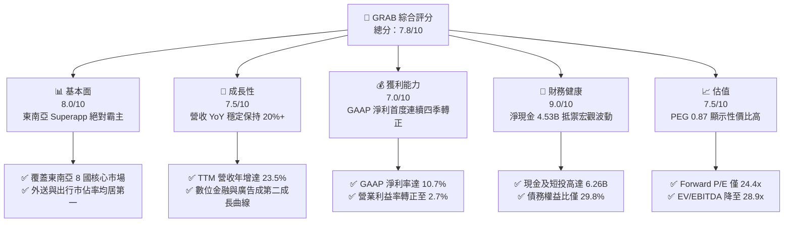

# GRAB 基本面深度分析報告

> **報告日期**：2026-06-08 ｜ **語言**：繁體中文 ｜ **數據來源**：Yahoo Finance, Finviz, StockAnalysis, Roic.ai ｜ **分析師**：CFA 級機構研究

---

## 目錄

| # | 章節 | 核心結論 |
|---|------|----------|
| 1 | [執行摘要](#1-執行摘要) | 評級為「🟢 買入」，12個月目標價 $5.20，隱含 +54.8% 上行空間。 |
| 2 | [公司概覽與商業模式](#2-公司概覽與商業模式) | 東南亞 Superapp 龍頭，具備強大網路效應，護城河評估為「🟢 強韌」。 |
| 3 | [損益表深度分析](#3-損益表深度分析) | 營收年增 23.5%，首次實現連續 4 季 GAAP 轉盈，獲利步入拐點。 |
| 4 | [資產負債表分析](#4-資產負債表分析) | 淨現金達 $4.53B 實力雄厚，流動比率 1.67，財務結構極其健康。 |
| 5 | [現金流量深度分析](#5-現金流量深度分析) | TTM 自由現金流轉正達 $329.50M，資本配置轉向注重股東回報。 |
| 6 | [獲利能力與資本效率](#6-獲利能力與資本效率) | 杜邦分解顯示 ROE 改善至 5.83%，ROIC 升至 3.73%，正向 WACC 逼近。 |
| 7 | [估值深度分析](#7-估值深度分析) | Forward P/E 24.4x 具吸引力，DCF 基準估值 $5.20，安全邊際充足。 |
| 8 | [成長催化劑](#8-成長催化劑) | 數位銀行（Digibank）開展、廣告業務高毛利擴張及大宗乘車需求回升。 |
| 9 | [風險矩陣](#9-風險矩陣) | 監管不確定性與市場競爭為主要風險，但強大現金儲備提供高緩衝。 |
| 10 | [投資建議](#10-投資建議) | 適合成長型與長線價值型投資人，建議於 $3.50 以下分批逢低佈局。 |

---

## 1. 執行摘要

Grab Holdings Limited (NASDAQ: GRAB) 作為東南亞數位經濟的絕對龍頭，正經歷從「燒錢搶份額」到「高效高獲利」的歷史性轉折。本報告基於 2026-06-08 最新財務數據，對 GRAB 進行深度基本面剖析。

### 1.1 核心評分儀表板



### 1.2 評分進度條視覺化

```
╔══════════════════════════════════════════════════════════════╗
║              GRAB 多維度評分儀表板 (1-10分)                  ║
╠══════════════════════════════════════════════════════════════╣
║ 基本面強度  8.0 ▓▓▓▓▓▓▓▓▓▓▓▓▓▓▓▓▓▓░░  ★★★★☆           ║
║ 成長動能    7.5 ▓▓▓▓▓▓▓▓▓▓▓▓▓▓▓▓░░░░  ★★★★☆           ║
║ 獲利品質    7.0 ▓▓▓▓▓▓▓▓▓▓▓▓▓▓░░░░░░  ★★★☆☆           ║
║ 財務健康    9.0 ▓▓▓▓▓▓▓▓▓▓▓▓▓▓▓▓▓▓▓░  ★★★★★           ║
║ 估值合理性  7.5 ▓▓▓▓▓▓▓▓▓▓▓▓▓▓▓▓░░░░  ★★★★☆           ║
║ 護城河深度  8.5 ▓▓▓▓▓▓▓▓▓▓▓▓▓▓▓▓▓▓▓░  ★★★★☆           ║
║ 管理層執行  8.0 ▓▓▓▓▓▓▓▓▓▓▓▓▓▓▓▓▓▓░░  ★★★★☆           ║
║ 技術創新力  7.0 ▓▓▓▓▓▓▓▓▓▓▓▓▓▓░░░░░░  ★★★☆☆           ║
╠══════════════════════════════════════════════════════════════╣
║ 綜合總分    7.8 ▓▓▓▓▓▓▓▓▓▓▓▓▓▓▓▓▓░░░  🏆 穩健成長轉盈股    ║
╚══════════════════════════════════════════════════════════════╝
```

### 1.3 五大投資論點 + 三大核心風險

| 類型 | 項目 | 具體依據 | 信心度 |
|------|------|----------|--------|
| 🟢 **投資論點①** | **GAAP 獲利拐點確立** | TTM 淨利潤達到 $310M，GAAP 淨利率達 10.7%，連續四個季度實現正向淨利潤，擺脫燒錢標籤。 | 🟢 極高 |
| 🟢 **投資論點②** | **資產負債表極其強韌** | 擁有 $6.47B 總現金，扣除 $1.95B 債務後，淨現金高達 $4.53B，在同業中具備最強的抗風險及收購能力。 | 🟢 極高 |
| 🟢 **投資論點③** | **多邊網路效應護城河** | 平台跨足外送（Food/Mart）、出行與金融，交叉銷售降低用戶獲取成本（CAC），提高用戶生命週期價值（LTV）。 | 🟢 高 |
| 🟢 **投資論點④** | **高毛利廣告業務爆發** | GrabAds 變現率持續提升，利用平台龐大交易數據，為商家提供精準廣告，毛利率高於出行與外送核心業務。 | 🟢 高 |
| 🟢 **投資論點⑤** | **數位銀行釋放長期潛力** | 新加坡、馬來西亞等地的數位銀行（Digibank）陸續開展，吸收低成本存款並提供高利潤零售信貸。 | 🟡 中等 |
| 🟡 **風險①** | **東南亞匯率波動風險** | 營收主要以東南亞各國貨幣（SGD, MYR, IDR, THB 等）結算，而報告貨幣為美元，面臨強勢美元帶來的匯損壓力。 | 🟡 中度 |
| 🔴 **風險②** | **區域性競爭重燃** | 競爭對手 GoTo 及 Sea Limited 若在個別市場（如印尼）重啟補貼戰，可能壓低 Grab 的抽成率及毛利率。 | 🔴 高衝擊 |
| 🔴 **風險③** | **零工經濟監管壓力** | 東南亞各國政府對於司機及外送員福利、社保保障的立法趨嚴，可能增加平台營運成本。 | 🟡 中度 |

### 1.4 快速統計卡片

| 指標 | 公司實際值 | 行業均值 | S&P 500 均值 | 狀態 |
|------|-------------|----------|--------------|------|
| 收入 YoY 成長 | **23.5%** | ~12.0% | ~5.5% | 🟢 顯著跑贏 |
| 毛利率 | **40.2%** | ~45.0% | ~48.0% | 🟡 尚有提升空間 |
| 淨利率 | **10.7%** | ~5.0% | ~12.0% | 🟢 轉盈成效顯著 |
| ROE | **5.83%** | ~8.0% | ~15.0% | 🟡 處於改善初期 |
| Forward P/E | **24.43x** | ~30.0x | ~22.0x | 🟢 估值具備吸引力 |
| PEG Ratio | **0.87** | ~1.50 | ~1.80 | 🟢 嚴重低估 |

### 1.5 投資結論

```
╔══════════════════════════════════════════════════════════════════╗
║                    📊 投資結論摘要                               ║
╠══════════════════════════════════════════════════════════════════╣
║  評級：🟢 買入 (Buy)                                            ║
║  當前股價：$3.36 (2026-06-08)                                    ║
║  目標價區間：                                                    ║
║    悲觀情境：$3.80（+13.1%）- 競爭加劇，匯率大幅貶值             ║
║    基準情境：$5.20（+54.8%）- 12個月主要目標（獲利如期釋放）     ║
║    樂觀情境：$6.50（+93.5%）- 數位銀行與廣告超預期增長           ║
║  投資評分：7.8 / 10                                              ║
║  適合投資人：成長型投資者、中長線基本面導向投資者                ║
╚══════════════════════════════════════════════════════════════════╝
```

---

## 2. 公司概覽與商業模式

Grab 成立於 2012 年，總部位於新加坡，是東南亞最具代表性的「超級 App」（Superapp）。其業務覆蓋柬埔寨、印尼、馬來西亞、緬甸、菲律賓、新加坡、泰國及越南等 8 個國家。

### 2.1 業務結構與收入來源

Grab 的業務主要由四大支柱構成：外送服務（Deliveries）、出行服務（Mobility）、金融服務（Financial Services）及企業與其他服務（Enterprise & Others，包含 GrabAds 廣告）。

```mermaid
graph TD
    GRAB["Grab Holdings