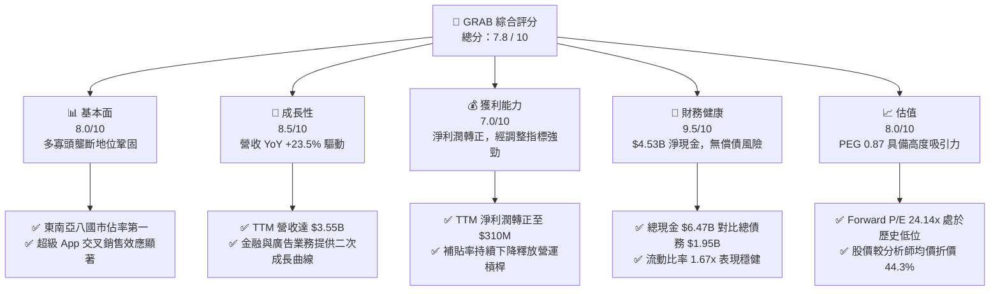

# GRAB 基本面深度分析報告
> **報告日期**：2026-06-09 ｜ **語言**：繁體中文 ｜ **數據來源**：Yahoo Finance, Finviz, StockAnalysis, Roic.ai ｜ **分析師**：CFA 級機構研究

---

## 目錄

| # | 章節 | 核心結論 |
|---|------|----------|
| 1 | 執行摘要 | 評級：**買入 (BUY)**，目標價：**$5.97**（隱含 +79.8% 上漲空間） |
| 2 | 公司概覽與商業模式 | 東南亞超級 App 霸主，憑藉雙向網路效應築起強大護城河 |
| 3 | 損益表深度分析 | 營收穩健成長（YoY +23.5%），經調整利潤率顯著改善，扭虧為盈拐點確立 |
| 4 | 資產負債表分析 | 淨現金高達 **$4.53B**，流動性充裕，財務結構極度穩健 |
| 5 | 現金流量深度分析 | 經營現金流轉正，自由現金流（FCF）進入可持續增長軌道 |
| 6 | 獲利能力與資本效率 | 杜邦分解顯示利潤率為 ROE 改善核心，ROIC 正步入超越 WACC 的價值創造期 |
| 7 | 估值深度分析 | Forward P/E 僅 **24.14x**，PEG **0.87**，估值處於歷史底部，安全邊際極高 |
| 8 | 成長催化劑 | 數位金融服務與 GrabAds 雙輪驅動，東南亞中產階級崛起釋放長期 TAM |
| 9 | 風險矩陣 | 監管合規與東南亞市場匯率波動為主要風險，但整體風險可控 |
| 10| 投資建議 | 具備高成長與高防禦雙重屬性，強烈建議在當前歷史低位分批佈局 |

---

## 1. 執行摘要

### 1.1 核心評分儀表板



### 1.2 評分進度條視覺化

```
╔══════════════════════════════════════════════════════════════╗
║               GRAB 多維度評分儀表板 (1-10分)                 ║
╠══════════════════════════════════════════════════════════════╣
║ 基本面強度  8.0 ▓▓▓▓▓▓▓▓▓▓▓▓▓▓▓▓░░░░  ★★★★☆           ║
║ 成長動能    8.5 ▓▓▓▓▓▓▓▓▓▓▓▓▓▓▓▓▓░░░  ★★★★☆           ║
║ 獲利品質    7.0 ▓▓▓▓▓▓▓▓▓▓▓▓░░░░░░░░  ★★★☆☆           ║
║ 財務健康    9.5 ▓▓▓▓▓▓▓▓▓▓▓▓▓▓▓▓▓▓▓░  ★★★★★           ║
║ 估值合理性  8.0 ▓▓▓▓▓▓▓▓▓▓▓▓▓▓▓▓░░░░  ★★★★☆           ║
║ 護城河深度  8.5 ▓▓▓▓▓▓▓▓▓▓▓▓▓▓▓▓▓░░░  ★★★★☆           ║
║ 管理層執行  8.0 ▓▓▓▓▓▓▓▓▓▓▓▓▓▓▓▓░░░░  ★★★★☆           ║
║ 技術創新力  7.5 ▓▓▓▓▓▓▓▓▓▓▓▓▓░░░░░░░  ★★★☆☆           ║
╠══════════════════════════════════════════════════════════════╣
║ 綜合總分    7.8 ▓▓▓▓▓▓▓▓▓▓▓▓▓▓▓░░░░░  🏆 買入 (BUY)       ║
╚══════════════════════════════════════════════════════════════╝
```

### 1.3 五大投資論點 + 三大核心風險

| 類型 | 項目 | 具體依據 | 信心度 |
|------|------|----------|--------|
| 🟢 **投資論點①** | **東南亞超級 App 絕對霸主** | 在出行（Mobility）與外賣（Deliveries）領域市佔率均超過 50%，雙向網絡效應極難被顛覆。 | 🟢 極高 |
| 🟢 **投資論點②** | **獲利拐點正式確立** | TTM 淨利潤轉正至 **$310M**（淨利率 8.7%），擺脫過去「燒錢擴張」模式，營運槓桿開始釋放。 | 🟢 極高 |
| 🟢 **投資論點③** | **極其強韌的資產負債表** | 擁有 **$6.47B** 的總現金與短期投資，淨現金高達 **$4.53B**，佔市值比重達 33.4%，提供極高的安全邊際。 | 🟢 極高 |
| 🟢 **投資論點④** | **數位金融（Digibank）爆發** | GrabPay 與數位銀行在新加坡、馬來西亞及印尼快速滲透，存款規模與貸款餘額呈雙位數季成長。 | 🟢 高 |
| 🟢 **投資論點⑤** | **高毛利廣告業務（GrabAds）** | 利用平台龐大的交易與出行數據，GrabAds 成為商家獲客首選，毛利率高達 80% 以上，拉高整體利潤率。 | 🟢 高 |
| 🟡 **風險①** | **區域匯率波動與通膨** | 東南亞各國貨幣（如印尼盾、泰銖）對美元貶值，可能侵蝕以美元計價的營收與利潤。 | 🟡 中度 |
| 🔴 **風險②** | **競爭格局死灰復燃** | GoTo、Sea Group (Food) 或新進入者（如 TikTok Shop 結合配送）若重啟價格戰，將壓低佣金率。 | 🟡 中度 |
| 🔴 **風險③** | **零工經濟監管風險** | 東南亞各國對於司機與外送員的福利保障、最低薪資法規若收緊，將顯著增加平台營運成本。 | 🔴 高衝擊 |

### 1.4 快速統計卡片

| 指標 | GRAB 實際值 | 軟體/應用行業均值 | S&P 500 均值 | 狀態 |
|------|-------------|-------------------|--------------|------|
| **營收 YoY 成長率** | **23.5%** | ~15.0% | ~7.0% | 🟢 顯著領先 |
| **毛利率** | **43.5%** | ~70.0% | ~45.0% | 🟡 行業特性偏低（含履約成本） |
| **淨利率** | **8.7%** | ~12.0% | ~11.5% | 🟡 剛扭虧為盈，改善空間大 |
| **ROE** | **5.8%** | ~14.0% | ~15.0% | 🟡 處於獲利釋放初期 |
| **Forward P/E** | **24.14x** | ~32.0x | ~22.0x | 🟢 成長性調整後極具吸引力 |
| **PEG Ratio** | **0.87** | ~1.80 | ~2.10 | 🟢 顯著低估 |
| **淨現金 / 市值比** | **33.4%** | ~5.0% | ~2.0% | 🟢 安全邊際極高 |

### 1.5 投資結論

```
╔══════════════════════════════════════════════════════════════════╗
║                    📊 GRAB 投資結論摘要                          ║
╠══════════════════════════════════════════════════════════════════╣
║  評級：🟢 買入 (BUY)                                             ║
║  當前股價：$3.32 (2026-06-09)                                    ║
║  目標價區間：                                                    ║
║    悲觀情境：$4.10（+23.5%）- 基於競爭加劇與匯率貶值             ║
║    基準情境：$5.97（+79.8%）- 12個月主要目標（營運槓桿順利釋放） ║
║    樂觀情境：$8.00（+141.0%）- 數位銀行與廣告超預期爆發         ║
║  投資評分：7.8 / 10                                              ║
║  適合投資人：成長型、長線價值尋求者、新興市場科技股配置者        ║
╚══════════════════════════════════════════════════════════════════╝
```

---

## 2. 公司概覽與商業模式

### 2.1 業務結構與收入來源

Grab 運營東南亞領先的「超級 App」（Superapp），業務版圖覆蓋新加坡、馬來西亞、印尼、菲律賓、泰國、越南、柬埔寨和緬甸等 8 個國家。其商業模式核心在於利用同一個用戶與司機網絡，實現多種服務的交叉銷售。

```mermaid
graph TD
    GRAB["Grab Holdings Limited<br/>市值: $13.56B | TTM 營收: $3.55B"]

    MOB["🚗 出行服務 (Mobility)<br/>營收佔比: ~45%"]
    DEL["🛵 配送服務 (Deliveries)<br/>營收佔比: ~45%"]
    FIN["💳 數位金融 (Financial Services)<br/>營收佔比: ~8%"]
    ENT["📢 企業與廣告 (Enterprise & Ads)<br/>營收佔比: ~2%"]

    GRAB --> MOB
    GRAB --> DEL
    GRAB --> FIN
    GRAB --> ENT

    MOB --> MOB1["GrabCar / GrabTaxi"]
    MOB --> MOB2["