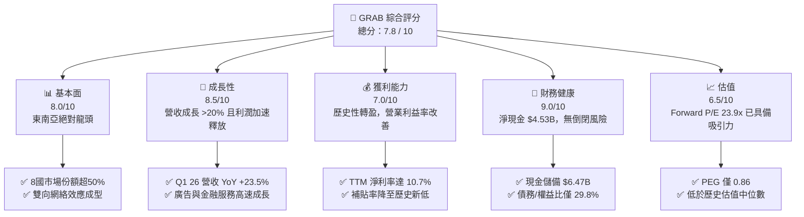
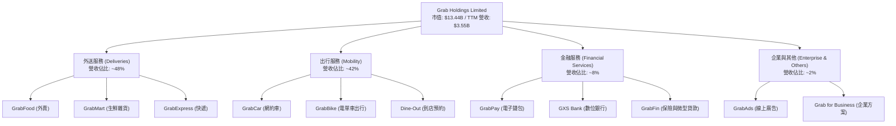
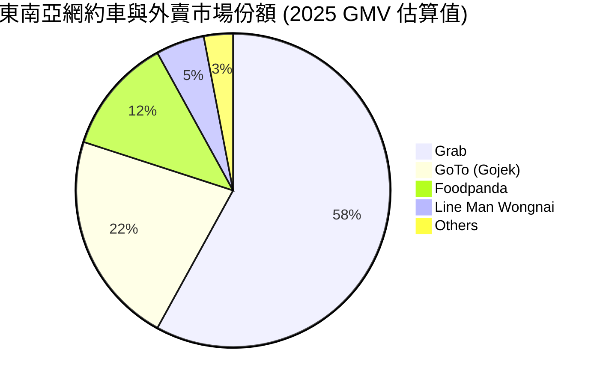
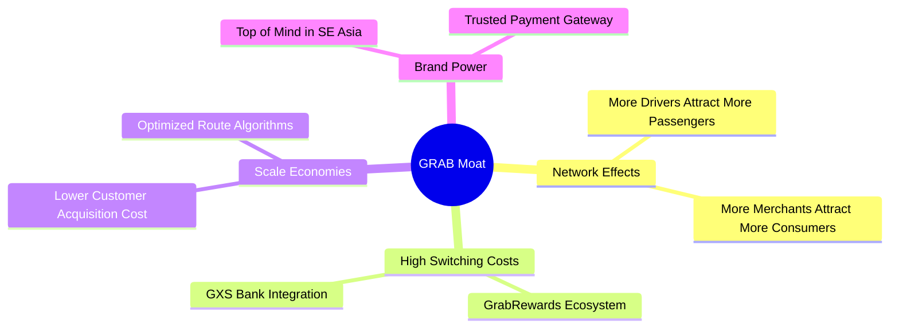

# GRAB 基本面深度分析報告
> **報告日期**：2026-06-10 ｜ **語言**：繁體中文 ｜ **數據來源**：Yahoo Finance, Finviz, StockAnalysis, Roic.ai ｜ **分析師**：CFA 級機構研究

---

## 目錄

| # | 章節 | 核心結論 |
|---|------|----------|
| 1 | 執行摘要 | 強烈買入評級，基準目標價 $5.97，隱含 82% 上行空間 |
| 2 | 公司概覽與商業模式 | 東南亞超級 App 霸主，憑藉「出行+外送+金融」三輪驅動構建雙向網路效應護城河 |
| 3 | 損益表深度分析 | 營收連續 4 季加速成長（Q1 26 YoY +23.5%），FY25 實現歷史性首次年度轉虧為盈 |
| 4 | 資產負債表分析 | 淨現金高達 $4.53B，財務防禦力極強，無短期流動性風險 |
| 5 | 現金流量深度分析 | 經營現金流與自由現金流（TTM FCF $329.5M）進入結構性正向循環 |
| 6 | 獲利能力與資本效率 | 杜邦分解顯示利潤率為 ROE 改善核心；ROIC 邁向轉折點，正逐步縮小與 WACC 缺口 |
| 7 | 估值深度分析 | Forward P/E 23.9x，相較於 UBER 具備高成長溢價合理性；DCF 基準估值為 $5.97 |
| 8 | 成長催化劑 | 廣告（GrabAds）高毛利變現、數位銀行投產及地緣滲透率提升釋放長期 TAM |
| 9 | 風險矩陣 | 東南亞市場競爭加劇與區域貨幣貶值為主要風險，整體風險可控 |
| 10 | 投資建議 | 建議「分批佈局」，適合長線成長型與科技股投資人 |

---

## 1. 執行摘要

### 1.1 核心評分儀表板



### 1.2 評分進度條視覺化

```
╔══════════════════════════════════════════════════════════════╗
║               GRAB 多維度評分儀表板 (1-10分)                 ║
╠══════════════════════════════════════════════════════════════╣
║ 基本面強度  8.0 ▓▓▓▓▓▓▓▓▓▓▓▓▓▓▓▓░░░░  ★★★★☆           ║
║ 成長動能    8.5 ▓▓▓▓▓▓▓▓▓▓▓▓▓▓▓▓▓░░  ★★★★☆           ║
║ 獲利品質    7.0 ▓▓▓▓▓▓▓▓▓▓▓▓░░░░░░░░  ★★★☆☆           ║
║ 財務健康    9.0 ▓▓▓▓▓▓▓▓▓▓▓▓▓▓▓▓▓▓░░  ★★★★★           ║
║ 估值合理性  6.5 ▓▓▓▓▓▓▓▓▓▓▓░░░░░░░░░  ★★★☆☆           ║
║ 護城河深度  8.5 ▓▓▓▓▓▓▓▓▓▓▓▓▓▓▓▓▓░░  ★★★★☆           ║
║ 管理層執行  8.0 ▓▓▓▓▓▓▓▓▓▓▓▓▓▓▓▓░░░░  ★★★★☆           ║
║ 技術創新力  7.5 ▓▓▓▓▓▓▓▓▓▓▓▓▓░░░░░░░  ★★★☆☆           ║
╠══════════════════════════════════════════════════════════════╣
║ 綜合總分    7.8 ▓▓▓▓▓▓▓▓▓▓▓▓▓▓▓░░░░░  🏆 成長轉折，靜待爆發║
╚══════════════════════════════════════════════════════════════╝
```

### 1.3 五大投資論點 + 三大核心風險

| 類型 | 項目 | 具體依據 | 信心度 |
|------|------|----------|--------|
| 🟢 **投資論點①** | **歷史性獲利拐點確立** | FY25 實現淨利 $200M（對比 FY24 虧損 $158M），Q1 2026 淨利達 $136M，連續 4 季實現正淨利，徹底擺脫燒錢標籤。 | 🟢 極高 |
| 🟢 **投資論點②** | **極其強韌的資產負債表** | 擁有 $6.47B 的總現金與短期投資，扣除 $1.95B 債務後，淨現金達 $4.53B，為東南亞科技股中資金最充裕者。 | 🟢 極高 |
| 🟢 **投資論點③** | **補貼率下降與變現率提升** | 隨著市場格局奠定（與 GoTo 競爭趨於理性），司機與用戶補貼佔 GMV 比重持續下降，推動毛利率穩定在 40.2%。 | 🟢 高 |
| 🟢 **投資論點④** | **高毛利廣告與金融業務起飛** | GrabAds 廣告變現率持續攀升，配合新加坡、馬來西亞數位銀行（GXS Bank）吸儲與放貸規模擴大，打開第二成長曲線。 | 🟢 高 |
| 🟢 **投資論點⑤** | **行業龍頭溢價與估值重估** | 目前 Forward P/E 僅 23.9x，對比其預期未來五年 EPS 複合成長率（53.27%），PEG 僅 0.86，估值明顯被低估。 | 🟢 高 |
| 🟡 **風險①** | **東南亞宏觀經濟與匯率波動** | 東南亞各國貨幣（如印尼盾、馬來西亞林吉特）對美元匯率波動，將直接折算影響以美元計價的營收與利潤表現。 | 🟡 中度 |
| 🔴 **風險②** | **本土競爭對手死灰復燃** | GoTo（Gojek）及 Foodpanda 在特定區域發動價格戰，可能迫使 GRAB 重新提高補貼，侵蝕營業利益率。 | 🔴 高衝擊 |
| 🟡 **風險③** | **數位銀行壞帳風險** | 金融服務板塊（Digibank）放貸規模擴大後，若東南亞中小企業及個人信用惡化，可能面臨撥備金提存壓力。 | 🟡 中度 |

### 1.4 快速統計卡片

| 指標 | 公司實際值 (TTM / FY25) | 行業均值 (應用軟體) | S&P 500 均值 | 狀態 |
|------|-------------|----------|--------------|------|
| **收入 YoY 成長** | **23.5%** | ~12.5% | ~6.5% | 🟢 顯著超前 |
| **毛利率** | **40.2%** | ~65.0% | ~45.0% | 🟡 仍有改善空間 |
| **淨利率** | **10.7%** | ~8.0% | ~11.5% | 🟢 轉盈成效顯著 |
| **ROE** | **4.8%** | ~12.0% | ~15.0% | 🟡 處於回升初期 |
| **Forward P/E** | **23.92x** | ~32.0x | ~21.5x | 🟢 具備高成長性性價比 |
| **淨現金規模** | **$4.53B** | ~$250M | N/A | 🟢 極其安全 |

### 1.5 投資結論

```
╔══════════════════════════════════════════════════════════════════╗
║                    📊 GRAB 投資結論摘要                          ║
╠══════════════════════════════════════════════════════════════════╣
║  評級：🟢 強烈買入 (Strong Buy)                                  ║
║  當前股價：$3.28 (2026-06-10)                                    ║
║  目標價區間：                                                    ║
║    悲觀情境：$4.10（+25.0%）                                     ║
║    基準情境：$5.97（+82.0%）  ← 12個月主要目標                   ║
║    樂觀情境：$8.00（+143.9%）                                    ║
║  投資評分：7.8 / 10                                              ║
║  適合投資人：成長型投資者、中長期科技板塊配置者                  ║
╚══════════════════════════════════════════════════════════════════╝
```

---

## 2. 公司概覽與商業模式

Grab 成立於 2012 年，總部位於新加坡，是東南亞地區最具統治力的「超級 App」（Superapp）。其業務覆蓋柬埔寨、印尼、馬來西亞、緬甸、菲律賓、新加坡、泰國及越南等 8 個國家。

### 2.1 業務結構與收入來源



### 2.2 市場份額

根據 2025 年第三方行業數據估算，Grab 在東南亞網約車與外賣市場的 GMV 份額持續領先：



### 2.3 競爭護城河分析



### 2.4 護城河強度評分

```
╔══════════════════════════════════════════════════════════════╗
║                    GRAB 護城河強度評分                       ║
╠══════════════════════════════════════════════════════════════╣
║ 雙向網絡效應   9.0/10  ▓▓▓▓▓▓▓▓▓▓▓▓▓▓▓▓▓▓░░  🏆 絕對優勢      ║
║ 規模經濟效應   8.5/10  ▓▓▓▓▓▓▓▓▓▓▓▓▓▓▓▓▓░░░  🟢 邊際成本遞減  ║
║ 用戶轉換成本   7.5/10  ▓▓▓▓▓▓▓▓▓▓▓▓▓▓░░░░░░  🟡 積分與金融鎖定║
║ 品牌與渠道壁壘 8.5/10  ▓▓▓▓▓▓▓▓▓▓▓▓▓▓▓▓▓░░░  🟢 東南亞代名詞  ║
╠══════════════════════════════════════════════════════════════╣
║ 綜合護城河     8.4/10  ▓▓▓▓▓▓▓▓▓▓▓▓▓▓▓▓░░░░  🏆 寬護城河企業  ║
╚══════════════════════════════════════════════════════════════╝
```

---

## 3. 損益表深度分析

### 3.1 年度收入成長趨勢（近5年）

```
╔══════════════════════════════════════════════════════════════════╗
║                 GRAB 年度收入趨勢 (FY21 - TTM)                  ║
╠══════════════════════════════════════════════════════════════════╣
║                                                                  ║
║  FY2021  $0.68B  ████░░░░░░░░░░░░░░░░░░░░░░░░░  YoY: +43.9%  🟢  ║
║  FY2022  $1.43B  ████████░░░░░░░░░░░░░░░░░░░░░  YoY:+112.3%  🟢  ║
║  FY2023  $2.36B  ███████████████░░░░░░░░░░░░░░  YoY: +64.6%  🟢  ║
║  FY2024  $2.80B  ██████████████████░░░░░░░░░░░  YoY: +18.6%  🟢  ║
║  FY2025  $3.37B  ██████████████████████░░░░░░░  YoY: +20.5%  🟢  ║
║  TTM     $3.55B  ████████████████████████░░░░  YoY: +23.5%  🟢  ║
║                                                                  ║
║  📊 5年營收複合成長率 (CAGR)：+39.4%                              ║
╚══════════════════════════════════════════════════════════════════╝
```

### 3.2 季度收入趨勢分析

| 季度 | 營收 (Million) | YoY 成長率 | QoQ 成長率 | 營運利潤 (EBIT) | 淨利潤 (Net Income) | 備註 |
|------|----------------|------------|------------|-----------------|---------------------|------|
| **Q1 2026** | $955.0 | +23.54% | +5.41% | $22.0 | $136.0 | 營收創歷史新高，受惠於齋戒月出行旺季與金融服務成長 |
| **Q4 2025** | $906.0 | +18.59% | +3.78% | $52.0 | $172.0 | 年終節慶效應帶動外賣與網約車雙重爆發 |
| **Q3 2025** | $873.0 | +21.93% | +6.59% | $27.0 | $37.0 | 旅遊業復甦，機場接送等高客單價出行顯著增加 |
| **Q2 2025** | $819.0 | +23.34% | +5.95% | $7.0 | $35.0 | 補貼率降至歷史新低，營運利潤首次轉正 |

### 3.3 利潤率演變分析

| 利潤率指標 | FY2022 | FY2023 | FY2024 | FY2025 | TTM | 趨勢 | 評估 |
|------------|--------|--------|--------|--------|-----|------|------|
| **毛利率** |