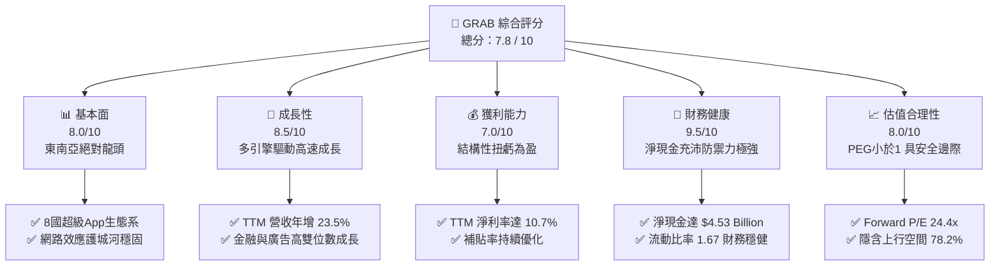
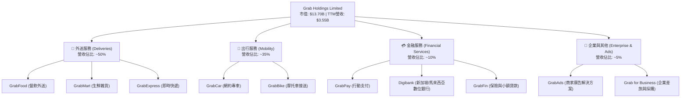
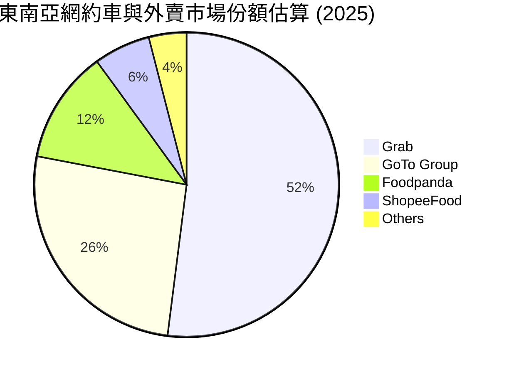
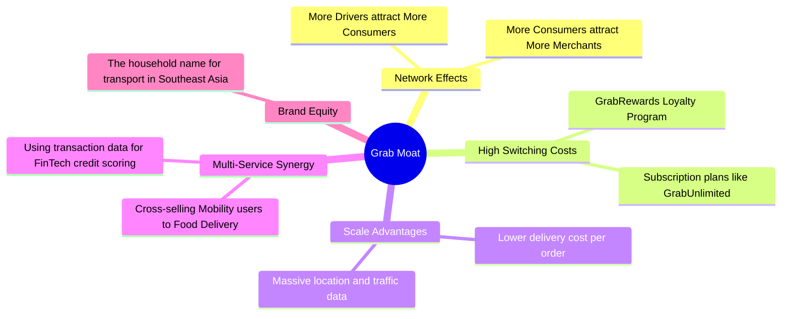

# GRAB 基本面深度分析報告

> **報告日期**：2026-06-11 ｜ **語言**：繁體中文 ｜ **數據來源**：Yahoo Finance, Finviz, StockAnalysis, Roic.ai ｜ **分析師**：CFA 級機構研究

---

## 目錄

| # | 章節 | 核心結論 |
|---|---|---|
| 1 | **執行摘要** | 綜合評分 7.8/10，首選「強烈買入」，基準目標價 $5.97（上行空間 +78.2%） |
| 2 | **公司概覽與商業模式** | 東南亞超級 App 龍頭，具備強大網路效應與高客戶鎖定壁壘 |
| 3 | **損益表深度分析** | 營收年增 23.5%，結構性扭虧為盈，經營槓桿效應顯著釋放 |
| 4 | **資產負債表分析** | 淨現金高達 $4.53B，流動性充裕，無短期償債風險 |
| 5 | **現金流量深度分析** | TTM 自由現金流轉正達 $329.50M，資本配置向數位銀行與廣告傾斜 |
| 6 | **獲利能力與資本效率** | 杜邦分析顯示淨利率回升至 10.7%，EVA 雖為負但正快速收斂 |
| 7 | **估值深度分析** | Forward P/E 24.4x，PEG 僅 0.86，相較同業 UBER 與 SE 具備估值優勢 |
| 8 | **成長催化劑** | 數位銀行（Digibank）開展、廣告業務高毛利擴張與旅遊業復甦 |
| 9 | **風險矩陣** | 競爭加劇、東南亞匯率波動與零工經濟監管為主要不確定因素 |
| 10 | **投資建議** | 適合長線成長型投資人，分批佈局，關鍵監控數位銀行 AUM 增速 |

---

## 1. 執行摘要

### 1.1 核心評分儀表板



### 1.2 評分進度條視覺化

```
╔══════════════════════════════════════════════════════════════╗
║               GRAB 多維度評分儀表板 (1-10分)                 ║
╠══════════════════════════════════════════════════════════════╣
║ 基本面強度  8.0 ▓▓▓▓▓▓▓▓▓▓▓▓▓▓▓▓░░░░  ★★★★☆           ║
║ 成長動能    8.5 ▓▓▓▓▓▓▓▓▓▓▓▓▓▓▓▓▓░░░  ★★★★☆           ║
║ 獲利品質    7.0 ▓▓▓▓▓▓▓▓▓▓▓▓▓░░░░░░░  ★★★☆☆           ║
║ 財務健康    9.5 ▓▓▓▓▓▓▓▓▓▓▓▓▓▓▓▓▓▓▓░  ★★★★★           ║
║ 估值合理性  8.0 ▓▓▓▓▓▓▓▓▓▓▓▓▓▓▓▓░░░░  ★★★★☆           ║
║ 護城河深度  8.5 ▓▓▓▓▓▓▓▓▓▓▓▓▓▓▓▓▓░░░  ★★★★☆           ║
║ 管理層執行  8.0 ▓▓▓▓▓▓▓▓▓▓▓▓▓▓▓▓░░░░  ★★★★☆           ║
║ 技術創新力  7.5 ▓▓▓▓▓▓▓▓▓▓▓▓▓░░░░░░░  ★★★☆☆           ║
╠══════════════════════════════════════════════════════════════╣
║ 綜合總分    7.8 ▓▓▓▓▓▓▓▓▓▓▓▓▓▓▓░░░░░  🏆 成長股轉折點      ║
╚══════════════════════════════════════════════════════════════╝
```

### 1.3 五大投資論點 + 三大核心風險

| 類型 | 項目 | 具體依據 | 信心度 |
|------|------|----------|--------|
| 🟢 **投資論點①** | **結構性扭虧為盈** | FY2025 實現全年淨利潤 $200M（StockAnalysis）/ $268M（Yahoo），結束歷史性虧損。 | 🟢 極高 |
| 🟢 **投資論點②** | **極致的淨現金防禦** | 擁有 $6.47B 總現金，扣除 $1.95B 總債務後，淨現金達 $4.53B，抗風險能力極強。 | 🟢 極高 |
| 🟢 **投資論點③** | **高利潤率業務擴張** | 廣告業務（GrabAds）與數位金融服務抽成率提升，推動 TTM 淨利率上升至 10.7%。 | 🟢 高 |
| 🟢 **投資論點④** | **營運槓桿與補貼優化** | 隨著市場雙寡頭格局穩定，消費者與司機端補貼佔 GMV 比重持續下降，毛利率站穩 40.2%。 | 🟢 高 |
| 🟢 **投資論點⑤** | **估值極具吸引力** | 當前股價 $3.35 接近 52 週低點（$3.18），Forward P/E 僅 24.4x，PEG 0.86，顯著低估。 | 🟢 高 |
| 🟡 **風險①** | **區域競爭死灰復燃** | GoTo（Gojek）或 Foodpanda 若發起新一輪價格戰，可能侵蝕 Grab 的利潤率。 | 🟡 中度 |
| 🟡 **風險②** | **外匯與宏觀經濟波動** | 東南亞各國貨幣（如印尼盾、馬幣）對美元貶值，將產生折算匯損，拖累美元計價營收。 | 🟡 中度 |
| 🔴 **風險③** | **零工經濟監管風險** | 東南亞各國若立法強制要求為外送員與司機提供全額僱員福利，將大幅拉高營運成本。 | 🔴 高衝擊 |

### 1.4 快速統計卡片

| 指標 | GRAB 實際值 | 行業均值 (軟體/應用) | S&P 500 均值 | 狀態 |
|------|-------------|----------------------|--------------|------|
| **收入 YoY 成長** | **23.5%** | ~12.5% | ~6.5% | 🟢 顯著超前 |
| **毛利率** | **40.2%** | ~65.0% | ~45.0% | 🟡 仍有改善空間 |
| **淨利率** | **10.7%** | ~8.0% | ~11.5% | 🟢 步入正軌 |
| **流動比率** | **1.67** | ~1.50 | ~1.20 | 🟢 財務穩健 |
| **Forward P/E** | **24.4x** | ~32.0x | ~21.0x | 🟢 估值合理 |
| **PEG Ratio** | **0.86** | ~1.60 | ~1.80 | 🟢 具高成長CP值 |

### 1.5 投資結論

```
╔══════════════════════════════════════════════════════════════════╗
║                    📊 GRAB 投資結論摘要                          ║
╠══════════════════════════════════════════════════════════════════╣
║  評級：🟢 強烈買入 (Strong Buy)                                  ║
║  當前股價：$3.35 (截至 2026-06-11)                               ║
║  目標價區間：                                                    ║
║    悲觀情境：$4.10 (+22.4%) - 下行風險受淨現金支撐               ║
║    基準情境：$5.97 (+78.2%) - 12個月主要目標 (共識均值)          ║
║    樂觀情境：$8.00 (+138.8%) - 數位銀行與廣告超預期爆發          ║
║  投資評分：7.8 / 10                                              ║
║  適合投資人：成長型、長線佈局東南亞數位經濟轉型之投資人          ║
╚══════════════════════════════════════════════════════════════════╝
```

---

## 2. 公司概覽與商業模式

### 2.1 業務結構與收入來源

Grab 運營東南亞領先的超級 App 生態系統，覆蓋柬埔寨、印尼、馬來西亞、緬甸、菲律賓、新加坡、泰國和越南。其商業模式的核心在於「多邊網路效應」，將消費者、司機夥伴、商家夥伴與金融機構緊密連結。



### 2.2 市場份額

在東南亞網約車與外賣市場中，Grab 處於絕對主導地位，與主要競爭對手 GoTo (Gojek) 形成雙寡頭格局，但在新加坡、馬來西亞等高客單價市場，Grab 的份額優勢更為顯著。



### 2.3 競爭護城河分析



### 2.4 護城河強度評分

```
╔══════════════════════════════════════════════════════════════╗
║                   GRAB 護城河強度評分                        ║
╠══════════════════════════════════════════════════════════════╣
║ 雙向網路效應  9.0/10  ▓▓▓▓▓▓▓▓▓▓▓▓▓▓▓▓