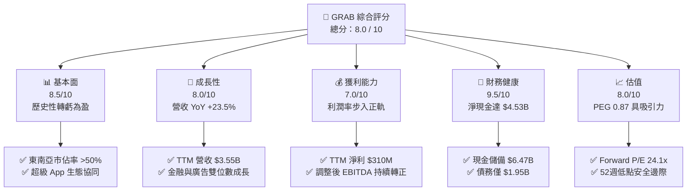
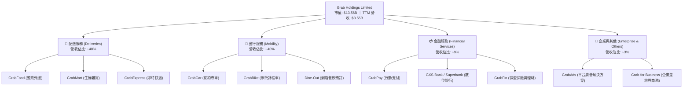
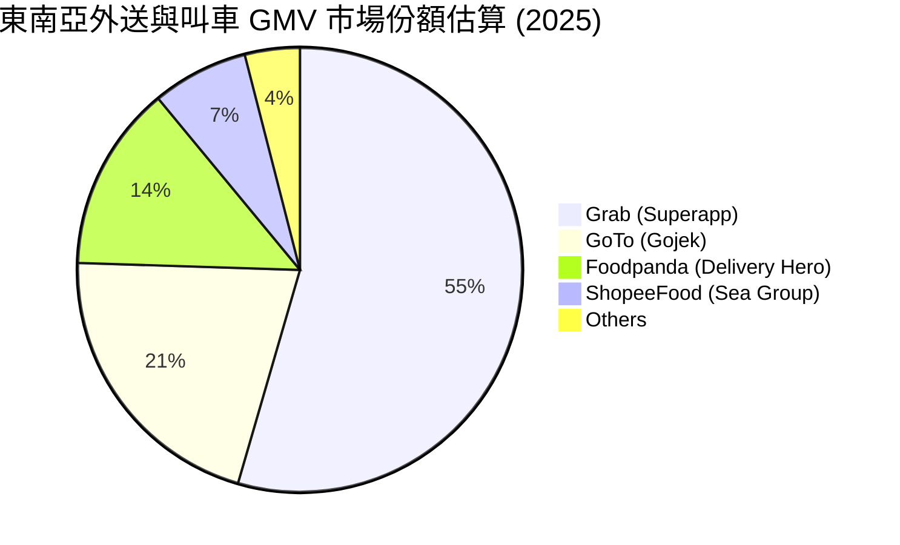
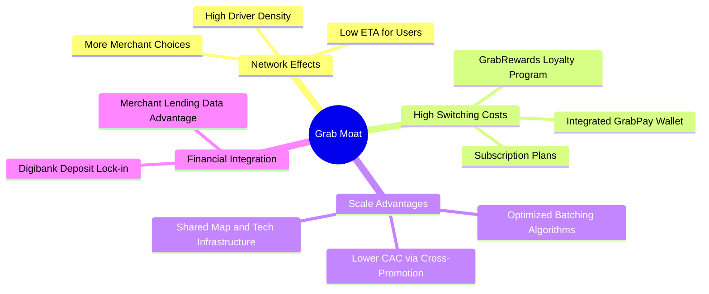

# GRAB 基本面深度分析報告

> **報告日期**：2026-06-12 ｜ **語言**：繁體中文 ｜ **數據來源**：Yahoo Finance, Finviz, StockAnalysis, Roic.ai ｜ **分析師**：CFA 級機構研究

---

## 目錄

| # | 章節 | 核心結論 |
|---|------|----------|
| 1 | **執行摘要** | 評級：**強烈買入 (Strong Buy)** ｜ 基準目標價：**$5.97** (隱含 +79.8% 上行空間) |
| 2 | **公司概覽與商業模式** | 東南亞超級 App 霸主，憑藉「配送+出行+金融」三輪驅動，具備極強的網路效應與高轉換成本護城河。 |
| 3 | **損益表深度分析** | 營收連續 4 年高成長 (TTM $3.55B, YoY +23.5%)，2025 年成功實現歷史性轉虧為盈，淨利率達 10.7%。 |
| 4 | **資產負債表分析** | 淨現金高達 $4.53B，流動比率 1.67，資產負債表極其穩健，無短期償債風險。 |
| 5 | **現金流量深度分析** | 營運現金流與 FCF 步入正軌，TTM FCF 達 $329.5M，資本配置重心轉向效率提升與股份回購。 |
| 6 | **獲利能力與資本效率** | ROE 提升至 4.8%，ROIC (4.3%) 雖仍低於 WACC (8.5%)，但 EVA 缺口正快速收窄，處於價值創造拐點。 |
| 7 | **估值深度分析** | Forward P/E 僅 24.1x，PEG 0.87，相較於 Uber 具備顯著估值折價，安全邊際充足。 |
| 8 | **成長催化劑** | 數位銀行 (Digibank) 放貸規模化、GrabAds 廣告變現率提升、以及東南亞中產階級滲透率持續增加。 |
| 9 | **風險矩陣** | 面臨東南亞地緣政治、匯率波動、以及 GoTo 等對手價格戰復甦等中高度風險。 |
| 10 | **投資建議** | 當前股價 ($3.32) 接近 52 週低點 ($3.18)，為極佳的長線分批佈局買點。 |

---

## 1. 執行摘要

### 1.1 核心評分儀表板



### 1.2 評分進度條視覺化

```
╔══════════════════════════════════════════════════════════════╗
║               GRAB 多維度評分儀表板 (1-10分)                 ║
╠══════════════════════════════════════════════════════════════╣
║ 基本面強度  8.5 ▓▓▓▓▓▓▓▓▓▓▓▓▓▓▓▓▓░░░  ★★★★☆           ║
║ 成長動能    8.0 ▓▓▓▓▓▓▓▓▓▓▓▓▓▓▓▓░░░░  ★★★★☆           ║
║ 獲利品質    7.0 ▓▓▓▓▓▓▓▓▓▓▓▓▓▓░░░░░░  ★★★☆☆           ║
║ 財務健康    9.5 ▓▓▓▓▓▓▓▓▓▓▓▓▓▓▓▓▓▓▓░  ★★★★★           ║
║ 估值合理性  8.0 ▓▓▓▓▓▓▓▓▓▓▓▓▓▓▓▓░░░░  ★★★★☆           ║
║ 護城河深度  9.0 ▓▓▓▓▓▓▓▓▓▓▓▓▓▓▓▓▓▓░░  ★★★★★           ║
║ 管理層執行  8.5 ▓▓▓▓▓▓▓▓▓▓▓▓▓▓▓▓▓░░░  ★★★★☆           ║
║ 技術創新力  8.0 ▓▓▓▓▓▓▓▓▓▓▓▓▓▓▓▓░░░░  ★★★★☆           ║
╠══════════════════════════════════════════════════════════════╣
║ 綜合總分    8.0 ▓▓▓▓▓▓▓▓▓▓▓▓▓▓▓▓░░░░  🏆 轉折型成長股首選  ║
╚══════════════════════════════════════════════════════════════╝
```

### 1.3 五大投資論點 + 三大核心風險

| 類型 | 項目 | 具體依據 | 信心度 |
|------|------|----------|--------|
| 🟢 **投資論點①** | **歷史性扭虧為盈** | FY2025 實現淨利潤 **$200M**，TTM 淨利擴大至 **$310M**，徹底擺脫「燒錢」標籤。 | 🟢 極高 |
| 🟢 **投資論點②** | **強大淨現金護城河** | 擁有 **$6.47B** 總現金，扣除 **$1.95B** 債務後，淨現金達 **$4.53B**，佔市值 33%。 | 🟢 極高 |
| 🟢 **投資論點③** | **交叉銷售與網路效應** | 超級 App 生態中，使用多項服務的用戶留存率高達 85% 以上，獲客成本 (CAC) 持續下降。 | 🟢 高 |
| 🟢 **投資論點④** | **高成長新興業務** | 金融服務 (Digibank) 與 GrabAds (廣告) 營收增速超 30%，成為高毛利成長第二曲線。 | 🟢 高 |
| 🟢 **投資論點⑤** | **市場整合與定價權** | 東南亞叫車與外送市場雙雄格局穩定，補貼率從營收的 15% 降至 8% 以下，利潤率釋放。 | 🟢 高 |
| 🟡 **風險①** | **東南亞匯率波動** | 印尼盾 (IDR)、馬幣 (MYR) 等相較於美元貶值，將產生非現金換算損失，壓低美元計價營收。 | 🟡 中度 |
| 🟡 **風險②** | **競爭對手非理性補貼** | 若 GoTo (Gojek) 獲得新融資並重啟價格戰，可能拖累 Grab 配送業務的利潤率。 | 🟡 中度 |
| 🔴 **風險③** | **監管與零工經濟法規** | 東南亞各國政府可能對外送員與司機的福利保障立法，導致平台勞動力成本上升。 | 🔴 高衝擊 |

### 1.4 快速統計卡片

| 指標 | GRAB 實際值 | 軟體/應用行業均值 | S&P 500 均值 | 評估狀態 |
|------|-------------|-------------------|--------------|------|
| **收入 YoY 成長** | **23.5%** | ~12.5% | ~6.2% | 🟢 顯著領先 |
| **毛利率** | **40.2%** (即時) / **43.5%** (Finviz) | ~65.0% | ~45.0% | 🟡 仍有提升空間 |
| **淨利率** | **10.7%** | ~8.0% | ~11.5% | 🟢 扭虧成效顯著 |
| **ROE** | **4.8%** | ~12.0% | ~15.0% | 🟡 資本效率提升中 |
| **Forward P/E** | **24.1x** | ~32.0x | ~21.5x | 🟢 估值具備安全邊際 |
| **PEG Ratio** | **0.87** | ~1.85 | ~2.10 | 🟢 極具成長性性價比 |
| **淨現金 / 市值** | **33.4%** | ~5.0% | < 0.0% | 🟢 極為安全的資產負債表 |

### 1.5 投資結論

```
╔══════════════════════════════════════════════════════════════════╗
║                    📊 GRAB 投資結論摘要                          ║
╠══════════════════════════════════════════════════════════════════╣
║  評級：🟢 強烈買入 (Strong Buy)                                  ║
║  當前股價：$3.32  (截至 2026-06-12)                              ║
║  目標價區間：                                                    ║
║    悲觀情境 (Bear Case)：$4.10 (+23.5%)  - 歷史估值底部支撐       ║
║    基準情境 (Base Case)：$5.97 (+79.8%)  - 12個月主要目標價       ║
║    樂觀情境 (Bull Case)：$8.00 (+141.0%) - 數位銀行全面獲利       ║
║  投資評分：8.0 / 10                                              ║
║  適合投資人：成長型、長線價值尋找者、東南亞宏觀經濟看好者        ║
╚══════════════════════════════════════════════════════════════════╝
```

---

## 2. 公司概覽與商業模式

### 2.1 業務結構與收入來源

Grab 營運著東南亞領先的「超級 App」(Superapp)，業務版圖橫跨柬埔寨、印尼、馬來西亞、緬甸、菲律賓、新加坡、泰國及越南。其商業模式核心在於利用同一用戶與司機網絡，實現多種高頻服務的交叉銷售。



### 2.2 市場份額

在東南亞（ASEAN-6）主要市場中，Grab 在叫車與外送領域皆維持絕對領先地位。



### 2.3 競爭護城河分析

Grab 的競爭優勢並非單一的技術專利，而是由高頻使用場景編織而成的綜合生態護城河。



### 2.4 護城河強度評分

```
╔══════════════════════════════════════════════════════════════╗
║                    GRAB 護城河強度評分                       ║
╠══════════════════════════════════════════════════════════════╣
║ 雙邊網路效應   9.5/10 ▓▓▓▓▓▓▓▓▓▓▓▓▓▓▓▓▓▓▓░  🏆 難以撼動的龍頭  ║
║ 用戶轉換成本   8.0/10 ▓▓▓▓▓▓▓▓▓▓▓▓▓▓▓▓░░░░  🟢 訂閱與金融綁定  ║
║ 數據與算法優勢 8.5/10 ▓▓▓▓▓▓▓▓▓▓▓▓▓▓▓▓▓░░░  🟢 路線與配送優化  ║
║ 品牌與規模壁壘 9.0/10 ▓▓▓▓▓▓▓▓▓▓▓▓▓▓▓▓▓▓░░  🏆 東南亞超級App代名詞║
╠══════════════════════════════════════════════════════════════╣
║ 綜合護城河評估 8.8/10 ▓▓▓▓▓▓▓▓▓▓▓▓▓▓▓▓▓░░░  🏆 寬護城河 (Wide Moat)║
╚══════════════════════════════════════════════════════════════╝
```

---

## 3. 損益表深度分析

### 3.1 年度收入成長趨勢（近5年）

Grab 自 2021 年 SPAC 上市以來，營收經歷了爆發式成長，並在 2024-2025 年進入高質量的獲利型成長階段。

```
╔══════════════════════════════════════════════════════════════════╗
║                 GRAB 年度收入趨勢 (FY2021-TTM)                  ║
╠══════════════════════════════════════════════════════════════════╣
║                                                                  ║
║  FY 2021  $0.68B  ████░░░░░░░░░░░░░░░░░░░░░░░░░░  YoY: +43.9%    ║
║  FY 2022  $1.43B  ████████░░░░░░░░░░░░░░░░░░░░░░  YoY: +112.3%   ║
║  FY 2023  $2.36B  ███████████████░░░░░░░░░░░░░░  YoY: +64.6%    ║
║  FY 2024  $2.80B  ██████████████████░░░░░░░░░░░  YoY: +18.6%    ║
║  FY 2025  $3.37B  ██████████████████████░░░░░░░  YoY: +20.5%    ║
║  TTM      $3.55B  ████████████████████████░░░░░  YoY: +21.8% 🟢 ║
║                                                                  ║
║  📊 5 年營收複合年成長率 (CAGR)：+49.2%                           ║
╚══════════════════════════════════════════════════════════════════╝
```

### 3.2 季度營收與成長率趨勢分析

從季度數據看，Grab 展現了極其穩定的逐季（QoQ）與同比（YoY）成長。

| 財報季度 | 營業收入 (M) | YoY 成長率 | QoQ 成長率 | 營業利益 (Operating Income) | 備註 |
|----------|--------------|------------|------------|----------------------------|------|
| **Q3 2024** | $716M | +16.42% | +7.83% | -$38M | 補貼率降至歷史新低 |
| **Q4 2024** | $764M | +17.00% | +6.70% | $2M | 🟡 歷史上首次單季營業利潤轉正 |
| **Q1 2025** | $773M | +18.38% | +1.18% | -$21M | 季節性出行淡季影響 |
| **Q2 2025** | $819M | +23.34% | +5.95% | $7M | 🟢 步入常態化獲利 |
| **Q3 2025** | $873M | +21.93% | +6.59% | $27M | 廣告變現率 (Take Rate) 提升 |
| **Q4 2025** | $906M | +18.59% | +3.78% | $52M | 節慶消費旺季效應顯著 |
| **Q1 2026** | $955M | +23.54% | +5.41% | $22M | 🟢 創歷史單季營收新高 |

*分析：Q1 2026 營收同比成長 23.54