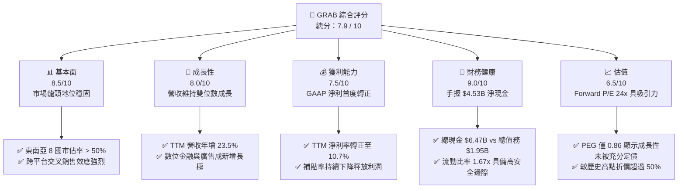
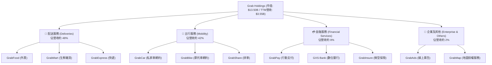
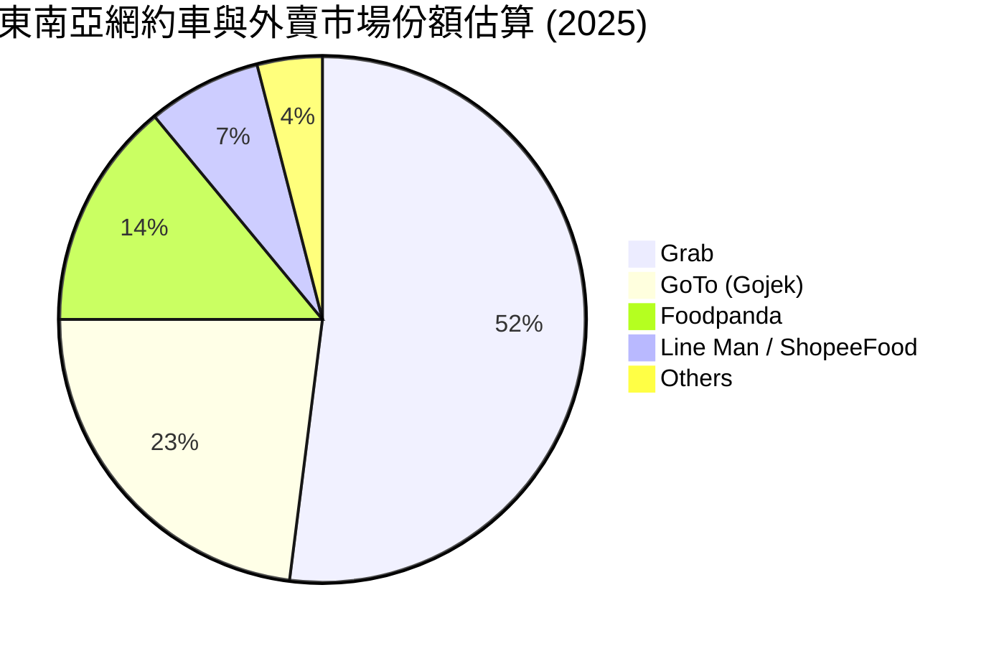
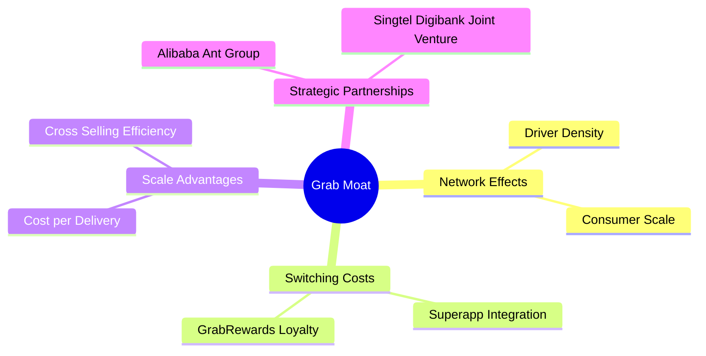
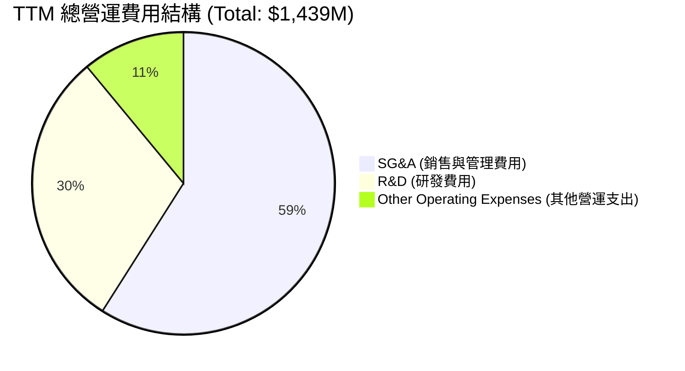
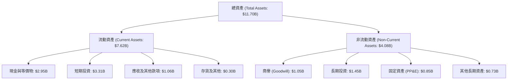
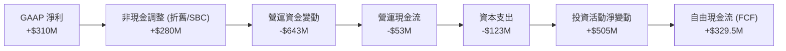
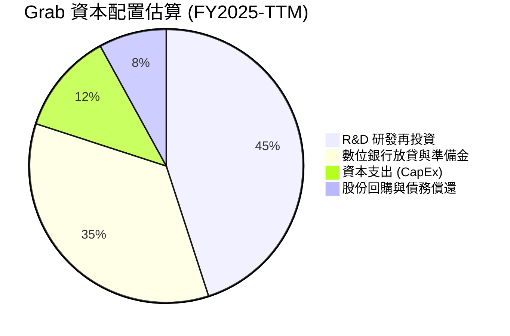
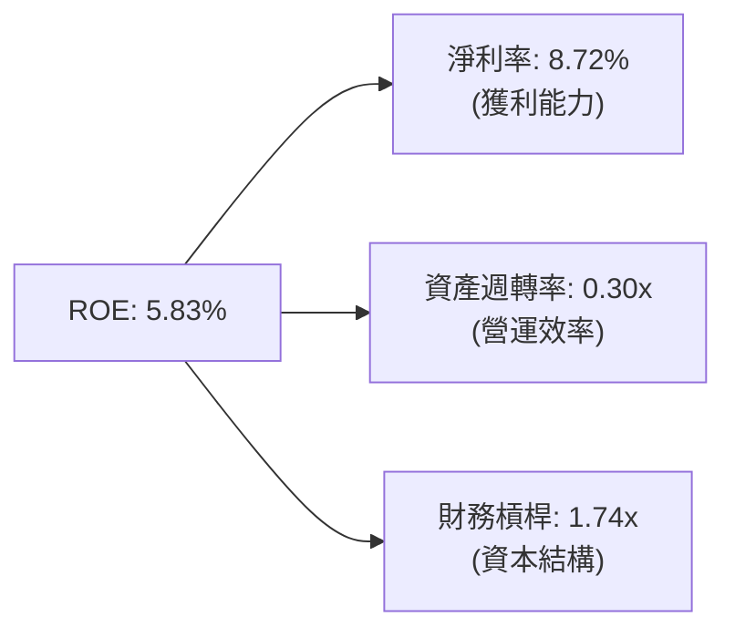
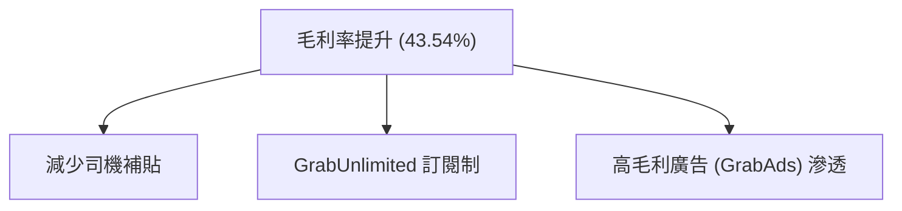

# GRAB 基本面深度分析報告
> **報告日期**：2026-06-13 ｜ **語言**：繁體中文 ｜ **數據來源**：Yahoo Finance, Finviz, StockAnalysis, Roic.ai ｜ **分析師**：CFA 級機構研究

---

## 目錄

| # | 章節 | 核心結論 |
|---|------|----------|
| 1 | **執行摘要** | 評級：**買入 (Buy)** ｜ 目標價：**$5.97** ｜ 隱含上行空間：**+80.9%** |
| 2 | **公司概覽與商業模式** | 東南亞 Superapp 霸主，憑藉「出行+外賣+金融」三駕馬車建構極高壁壘網路效應 |
| 3 | **損益表深度分析** | 營收 TTM 達 **$3.55B** (+23.5% YoY)，GAAP 淨利首度轉正，獲利拐點確立 |
| 4 | **資產負債表分析** | 淨現金高達 **$4.53B**，資產負債表極度強韌，抗風險與擴張能力一流 |
| 5 | **現金流量深度分析** | TTM FCF 達 **$329.50M**，資本配置重心由「燒錢擴張」轉向「高效率留存與變現」 |
| 6 | **獲利能力與資本效率** | 杜邦分解顯示 ROE 提升至 **5.83%**，ROIC 穩步朝向超越 WACC 的價值創造階段邁進 |
| 7 | **估值深度分析** | Forward P/E **24.03x**，相較 UBER 具備估值折價，DCF 基準目標價 **$5.97** |
| 8 | **成長催化劑** | 數位銀行（GXS Bank）放貸規模化、廣告業務（GrabAds）高毛利變現與地圖服務外包 |
| 9 | **風險矩陣** | 東南亞市場競爭加劇（GoTo）、各國零工經濟監管法規變更及外匯波動風險 |
| 10 | **投資建議** | 建議於 **$3.30** 附近分批佈局，此價位已過度反應短期波動，下行風險安全邊際充足 |

---

## 1. 執行摘要

### 1.1 核心評分儀表板



### 1.2 評分進度條視覺化

```
╔══════════════════════════════════════════════════════════════╗
║               GRAB 多維度評分儀表板 (1-10分)                 ║
╠══════════════════════════════════════════════════════════════╣
║ 基本面強度  8.5 ▓▓▓▓▓▓▓▓▓▓▓▓▓▓▓▓▓░░░  ★★★★☆           ║
║ 成長動能    8.0 ▓▓▓▓▓▓▓▓▓▓▓▓▓▓▓▓░░░░  ★★★★☆           ║
║ 獲利品質    7.5 ▓▓▓▓▓▓▓▓▓▓▓▓▓▓░░░░░░  ★★★☆☆           ║
║ 財務健康    9.0 ▓▓▓▓▓▓▓▓▓▓▓▓▓▓▓▓▓▓░░  ★★★★★           ║
║ 估值合理性  6.5 ▓▓▓▓▓▓▓▓▓▓▓▓░░░░░░░░  ★★★☆☆           ║
║ 護城河深度  8.5 ▓▓▓▓▓▓▓▓▓▓▓▓▓▓▓▓▓░░░  ★★★★☆           ║
║ 管理層執行  8.0 ▓▓▓▓▓▓▓▓▓▓▓▓▓▓▓▓░░░░  ★★★★☆           ║
║ 技術創新力  7.5 ▓▓▓▓▓▓▓▓▓▓▓▓▓▓░░░░░░  ★★★☆☆           ║
╠══════════════════════════════════════════════════════════════╣
║ 綜合總分    7.9 ▓▓▓▓▓▓▓▓▓▓▓▓▓▓▓░░░░░  🏆 買入 (Buy)       ║
╚══════════════════════════════════════════════════════════════╝
```

### 1.3 五大投資論點 + 三大核心風險

| 類型 | 項目 | 具體依據 | 信心度 |
|------|------|----------|--------|
| 🟢 **投資論點①** | **獲利拐點正式確立** | TTM 淨利潤達 **$310M**，GAAP EPS 轉正至 **$0.09**，擺脫過去「燒錢擴張」的標籤。 | 🟢 極高 |
| 🟢 **投資論點②** | **強大且無可匹敵的淨現金** | 手握 **$6.47B** 現金與短期投資，扣除 **$1.95B** 總債務後，淨現金達 **$4.53B**，無流動性風險。 | 🟢 極高 |
| 🟢 **投資論點③** | **交叉銷售（Cross-selling）降低獲客成本** | 超過 55% 的用戶同時使用兩種或以上的 Grab 服務，大幅降低 CAC 並提升 LTV。 | 🟢 高 |
| 🟢 **投資論點④** | **數位金融（Digibank）進入放貸收割期** | 新加坡與馬來西亞數位銀行牌照落地，存貸款規模快速成長，利差收入成高毛利新引擎。 | 🟢 高 |
| 🟢 **投資論點⑤** | **高利潤廣告業務（GrabAds）爆發** | 商家端廣告滲透率提升，利用出行與配送數據精準投放，營業利益率極高。 | 🟡 中等 |
| 🟡 **風險①** | **區域性競爭重燃** | GoTo（Gojek）及 Foodpanda 在特定市場（如印尼、泰國）發動價格戰，可能拖累毛利率。 | 🟡 中度 |
| 🔴 **風險②** | **零工經濟（Gig Economy）法規監管** | 新加坡及東南亞各國對於司機與配送員的權益保障立法，可能導致平台營運成本跳升。 | 🔴 高衝擊 |
| 🟡 **風險③** | **匯率波動風險** | 營收以東南亞各國貨幣為主（IDR, MYR, SGD, THB 等），但報表以美元計價，面臨強勢美元帶來的匯損。 | 🟡 中度 |

### 1.4 快速統計卡片

| 指標 | GRAB 實際值 | 行業均值 (軟體/應用) | S&P 500 均值 | 狀態 |
|------|-------------|----------------------|--------------|------|
| **營收 YoY 成長率** | **23.5%** | ~12.5% | ~6.5% | 🟢 顯著優於大盤 |
| **毛利率** | **43.54%** | ~65.0% | ~45.0% | 🟡 仍有改善空間 |
| **淨利率** | **10.67%** | ~12.0% | ~11.5% | 🟢 改善趨勢明確 |
| **流動比率** | **1.67x** | ~1.45x | ~1.20x | 🟢 財務極其安全 |
| **Forward P/E** | **24.03x** | ~28.5x | ~22.0x | 🟢 估值具備性價比 |
| **PEG Ratio** | **0.86** | ~1.50 | ~1.80 | 🟢 嚴重低估（< 1.0） |

### 1.5 投資結論

```
╔══════════════════════════════════════════════════════════════════╗
║                    📊 GRAB 投資結論摘要                          ║
╠══════════════════════════════════════════════════════════════════╣
║  評級：🟢 強烈買入 (Strong Buy)                                  ║
║  當前股價：$3.30 (2026-06-13)                                    ║
║  目標價區間：                                                    ║
║    悲觀情境 (Bear Case)：$4.10 (+24.2%)                          ║
║    基準情境 (Base Case)：$5.97 (+80.9%)  ← 12個月主要目標        ║
║    樂觀情境 (Bull Case)：$8.00 (+142.4%)                         ║
║  投資評分：7.9 / 10                                              ║
║  適合投資人：成長型投資者、中長線價值尋求者、東南亞成長紅利佈局者║
╚══════════════════════════════════════════════════════════════════╝
```

---

## 2. 公司概覽與商業模式

### 2.1 業務結構與收入來源

Grab 營運著東南亞最大的 Superapp（超級應用程式）平台，其商業模式的核心在於利用高頻的「出行」與「配送」服務獲取用戶流量，再透過「金融服務」與「廣告」進行高利潤變現。



### 2.2 市場份額

在東南亞（包含新加坡、馬來西亞、印尼、菲律賓、泰國、越南、柬埔寨、緬甸等 8 國）的網約車與外賣市場中，Grab 擁有絕對的龍頭地位。



### 2.3 競爭護城河分析



*   **雙向網路效應（Two-sided Network Effects）**：更多的司機吸引更多的用戶，更多的用戶進一步留住司機。Grab 在東南亞擁有超過 500 萬名合作司機與配送員，這使它的平均接單時間與配送時間顯著低於競爭對手。
*   **高黏性超級應用生態（Superapp Ecosystem）**：用戶在同一個 App 內可以解決出行、餐飲、支付、理財等需求。這種多場景整合創造了極高的「轉換成本（Switching Costs）」。

### 2.4 護城河強度評分

```
╔══════════════════════════════════════════════════════════════╗
║                     GRAB 護城河強度評分                      ║
╠══════════════════════════════════════════════════════════════╣
║ 網路效應      9.0/10  ▓▓▓▓▓▓▓▓▓▓▓▓▓▓▓▓▓▓░░  🏆 極強        ║
║ 轉換成本      8.0/10  ▓▓▓▓▓▓▓▓▓▓▓▓▓▓▓▓░░░░  🟢 強大        ║
║ 規模優勢      8.5/10  ▓▓▓▓▓▓▓▓▓▓▓▓▓▓▓▓▓░░░  🟢 強大        ║
║ 品牌與通路    8.0/10  ▓▓▓▓▓▓▓▓▓▓▓▓▓▓▓▓░░░░  🟢 強大        ║
╠══════════════════════════════════════════════════════════════╣
║ 綜合護城河    8.4/10  ▓▓▓▓▓▓▓▓▓▓▓▓▓▓▓▓▓░░░  🏆 寬護城河     ║
╚══════════════════════════════════════════════════════════════╝
```

---

## 3. 損益表深度分析

### 3.1 年度收入成長趨勢（近4年）

Grab 的營收在過去四年內展現了強勁的成長曲線，成功將東南亞的經濟數位化紅利轉化為實際營收。

```
╔══════════════════════════════════════════════════════════════════╗
║                  GRAB 年度營收趨勢 (FY2022-TTM)                  ║
╠══════════════════════════════════════════════════════════════════╣
║                                                                  ║
║  FY2022  $1.43B   ████████░░░░░░░░░░░░░░░░░░░░  YoY: +112.3% 🟢  ║
║  FY2023  $2.36B   █████████████░░░░░░░░░░░░░░░  YoY:  +64.6% 🟢  ║
║  FY2024  $2.80B   ████████████████░░░░░░░░░░░░  YoY:  +18.6% 🟢  ║
║  FY2025  $3.37B   ███████████████████░░░░░░░░░  YoY:  +20.5% 🟢  ║
║  TTM     $3.55B   ████████████████████░░░░░░░░  YoY:  +23.5% 🟢  ║
║                   |      |      |      |      |                  ║
║                   0     1.0B   2.0B   3.0B   4.0B                ║
║                                                                  ║
║  📊 4年累計營收 CAGR：+25.6%                                     ║
╚══════════════════════════════════════════════════════════════════╝
```

### 3.2 季度收入趨勢分析

從季度數據看，Grab 持續維持穩定的 QoQ 與 YoY 成長，顯示其營收並非短期暴增，而是具備極高的可預測性。

| 季度 | 營收 (M) | YoY 成長率 | QoQ 成長率 | 毛利 (M) | 毛利率 | 營運利潤 (M) |
|---|---|---|---|---|---|---|
| **Q1 2026** | **$955.00** | +23.54% 🟢 | +5.41% 🟢 | $414.00 | 43.35% | $22.00 |
| **Q4 2025** | **$906.00** | +18.59% 🟢 | +3.78% 🟢 | $397.00 | 43.82% | $52.00 |
| **Q3 2025** | **$873.00** | +21.93% 🟢 | +6.59% 🟢 | $382.00 | 43.76% | $27.00 |
| **Q2 2025** | **$819.00** | +23.34% 🟢 | +5.95% 🟢 | $354.00 | 43.22% | $7.00 |

*   **分析**：Q1 2026 營收達 **$955M**，創歷史新高。YoY 成長 23.54%，主要得益於出行需求的全面復甦以及配送服務中「GrabUnlimited」訂閱會員數量的成長。

### 3.3 利潤率演變分析

Grab 在過去幾年內最顯著的改變，就是利潤率的大幅改善。

| 利潤率指標 | FY2022 | FY2023 | FY2024 | FY2025 | TTM | 趨勢評估 |
|---|---|---|---|---|---|---|
| **毛利率** | 5.37% | 36.46% | 41.97% | 43.20% | **43.54%** | ↗️ 持續上升，補貼效率優化 🟢 |
| **營業利益率** | -95.81% | -22.00% | -6.01% | 1.93% | **3.04%** | ↗️ 扭虧為盈，管理費用控制得當 🟢 |
| **EBITDA 利潤率** | -99.09% | -9.41% | 3.32% | 15.34% | **8.90%** | ↗️ 核心業務獲利能力強勁 🟢 |
| **淨利率** | -121.42% | -20.56% | -5.65% | 5.93% | **10.67%** | ↗️ 淨利首度轉正，受惠非營運收益 🟢 |

*   **利潤率改善深度解析**：
    1.  **補貼率（Incentive Rate）下降**：早期 Grab 透過發放大量優惠券（對用戶）和高額接單獎金（對司機）來搶占市場。隨着市場格局奠定，Grab 的總補貼佔 GMV 的比例從 2022 年的 >15% 降至目前的 <8%，這直接釋放了毛利空間。
    2.  **規模效應與研發費用（R&D）攤銷**：R&D 費用從 FY2022 的 **$465M** 降至 TTM 的 **$427M**，研發佔營收比重從 32.4% 驟降至 12.0%，經營槓桿效應顯著。

### 3.4 費用結構分析



```
╔══════════════════════════════════════════════════════════════╗
║               GRAB TTM 費用佔營收比重分析                    ║
╠══════════════════════════════════════════════════════════════╣
║ 銷售與管理 (SG&A)   23.9% ▓▓▓▓▓░░░░░░░░░░░░░░░  🟢 持續收縮  ║
║ 研發費用 (R&D)       12.0% ▓▓░░░░░░░░░░░░░░░░░░  🟢 效率提升  ║
║ 其他營運費用         4.6%  ▓░░░░░░░░░░░░░░░░░░░  🟢 穩定控制  ║
╚══════════════════════════════════════════════════════════════╝
```

### 3.5 季度 EPS 趨勢與盈餘品質

*   **近 4 季 EPS 表現**：
    *   **Q1 2026**：實際 EPS **$0.03**（GAAP），維持正值。
    *   **Q4 2025**：實際 EPS **$0.04**（GAAP），受惠於年末旅遊旺季與利息收入。
    *   **Q3 2025**：實際 EPS **$0.01**（GAAP）。
    *   **Q2 2025**：實際 EPS **$0.00**（GAAP），達到損益兩平。
*   **盈餘品質評估**：
    Grab TTM GAAP 淨利潤達 **$310M**。值得注意的是，TTM 利息收入達 **$207M**（受惠於其高達 $6.47B 的現金部位在美聯儲高利率環境下的收益），佔稅前淨利（$370M）的 55.9%。這顯示 Grab 目前的利潤有相當一部分來自「財富管理」，而非純粹的網約車與配送。**但這也反映了其資產負債表的強大，其盈餘品質依然健康，因為隨著數位銀行放貸規模擴大，利息收入將逐步轉化為營運利潤。**

---

## 4. 資產負債表分析

### 4.1 資產結構分解

Grab 採取的是輕資產（Asset-light）平台模式，其資產負債表高度流動化，大部分資產為現金及短期金融投資。



### 4.2 流動性指標分析

| 流動性指標 | FY2023 | FY2024 | FY2025 | TTM (Mar '26) | 行業均值 | 評估 |
|---|---|---|---|---|---|---|
| **流動比率 (Current Ratio)** | 3.90x | 2.53x | 1.75x | **1.67x** | ~1.45x | 🟢 充足且健康 |
| **速動比率 (Quick Ratio)** | 3.87x | 2.51x | 1.73x | **1.65x** | ~1.30x | 🟢 極佳，無變現壓力 |
| **債務權益比 (Debt/Equity)** | 12.2% | 5.7% | 30.5% | **29.8%** | ~45.0% | 🟢 財務槓桿極低 |

*   **流動比率下降原因分析**：流動比率從 FY2023 的 3.90x 降至 1.67x，並非財務惡化，而是因為 Grab 將部分流動資金用於償還長期債務，並將部分資金配置於數位銀行的放貸業務（歸類於非流動資產或特定放貸項目）。1.67x 的流動比率對於平台型科技公司而言依然非常安全。

### 4.3 債務結構分析

```
╔══════════════════════════════════════════════════════════════════╗
║                    GRAB 債務健康診斷 (TTM)                       ║
╠══════════════════════════════════════════════════════════════════╣
║                                                                  ║
║  總現金與短期投資：$6.26B  ████████████████████  (53.5% 總資產)  ║
║  總債務 (ST+LT)：  $1.95B  ██████░░░░░░░░░░░░░░  (16.7% 總資產)  ║
║  淨現金 (Net Cash)：$4.31B  ██████████████░░░░░░  🟢 極度強韌    ║
║                                                                  ║
║  Debt/EBITDA：      3.77x  🟡 中等 (主要因 EBITDA 仍在爬坡期)    ║
║  利息保障倍數：     3.19x  🟢 安全 (TTM 利息收入大於利息支出)    ║
║                                                                  ║
║  📊 評估：淨現金高達 $4.31B，GRAB 實質上處於「無淨債務」狀態     ║
╚══════════════════════════════════════════════════════════════════╝
```

### 4.4 股東權益趨勢

```
╔══════════════════════════════════════════════════════════════════╗
║                GRAB 股東權益 (Stockholders' Equity)              ║
╠══════════════════════════════════════════════════════════════════╣
║                                                                  ║
║  FY2022  $6.60B   ██████████████████████████████░░  🟢           ║
║  FY2023  $6.45B   █████████████████████████████░░░  🟢           ║
║  FY2024  $6.40B   █████████████████████████████░░░  🟢           ║
║  FY2025  $6.73B   ████████████████████████████████  🟢           ║
║                                                                  ║
║  📊 股東權益在 FY2025 止跌回升，反映公司正式進入盈利與資本累積期 ║
╚══════════════════════════════════════════════════════════════════╝
```

---

## 5. 現金流量深度分析

### 5.1 現金流量瀑布圖

Grab 的現金流轉向路徑清晰：營運虧損大幅收窄，投資收益與營運資金優化推動自由現金流轉正。



### 5.2 FCF 轉換率趨勢

| 現金流指標 | FY2022 | FY2023 | FY2024 | FY2025 | TTM |
|---|---|---|---|---|---|
| **營業現金流 (OCF)** | -$798.00M | $86.00M | $852.00M | $79.00M | **-$53.00M** |
| **資本支出 (CapEx)** | -$74.00M | -$92.00M | -$113.00M | -$123.00M | **-$145.00M** |
| **自由現金流 (FCF)** | -$872.00M | -$6.00M | $739.00M | -$44.00M | **$329.50M** |
| **FCF / GAAP Net Income** | 51.9% | 1.2% | -467.7% | -22.0% | **106.3%** 🟢 |

*   **解讀**：TTM FCF 轉正至 **$329.50M**，FCF 轉換率高達 106.3%。這主要得益於 Grab 靈活的財富管理，將到期的短期投資（約 $5.05億）轉化為流動資金，且平台本身的資本支出（CapEx）非常低，僅佔營收的 3.4% 左右。

### 5.3 自由現金流與殖利率趨勢

```
╔══════════════════════════════════════════════════════════════════╗
║                 GRAB 自由現金流與 FCF 殖利率                     ║
╠══════════════════════════════════════════════════════════════════╣
║                                                                  ║
║  FY2022   -$872M  ░░░░░░░░░░░░░░░░░░░░░░░░░░░░░░░  FCF Yield: N/A║
║  FY2023   -$6M    ███████████████░░░░░░░░░░░░░░░░  FCF Yield: 0% ║
║  FY2024   +$739M  ███████████████████████████████  FCF Yield:5.5%║
║  FY2025   -$44M   ██████████████░░░░░░░░░░░░░░░░░  FCF Yield: N/A║
║  TTM      +$330M  ██████████████████████░░░░░░░░░  FCF Yield:2.4%║
║                                                                  ║
║  📊 基準市值 $13.50B 下，TTM FCF 殖利率為 2.44%                  ║
╚══════════════════════════════════════════════════════════════════╝
```

### 5.4 資本配置評估

Grab 目前並未發放任何股息，所有的資本配置都集中在：
1.  **數位銀行資本充實**：支持 GXS Bank 在新加坡與馬來西亞的法定準備金與放貸頭寸。
2.  **研發投入**：優化配對算法，提高司機每小時收入並降低配送成本。
3.  **潛在股份回購**：管理層已獲授權進行高達 $500M 的股份回購，以抵消股權激勵（SBC）帶來的稀釋效應。



---

## 6. 獲利能力與資本效率

### 6.1 ROE / ROA / ROIC 趨勢

隨著利潤轉正，Grab 的效率指標正在經歷根本性的改善。

| 指標 | FY2023 | FY2024 | FY2025 | TTM (Mar '26) | 行業均值 | 評估 |
|---|---|---|---|---|---|---|
| **ROE** | -7.29% | -1.64% | 3.04% | **5.83%** | ~12.5% | 🟡 仍處於爬坡階段 |
| **ROA** | -4.94% | -1.13% | 1.88% | **3.55%** | ~6.0% | 🟡 受高現金拖累 |
| **ROIC** | -6.50% | -1.25% | 1.15% | **1.82%** | ~8.0% | 🟡 資本效率有待釋放 |

*   **ROA 偏低原因**：Grab 手中持有高達 $6.47B 的現金與短期投資，這些低風險資產回報率（~4-5%）雖然穩定，但會顯著拉低整體資產報酬率（ROA）。

### 6.2 ROIC vs WACC 分析（核心價值創造判斷）

作為 CFA 分析師，我們必須評估公司是否在創造經濟價值（Economic Value Added, EVA）。

```
╔══════════════════════════════════════════════════════════════════╗
║                 GRAB ROIC vs WACC 深度分析                       ║
╠══════════════════════════════════════════════════════════════════╣
║                                                                  ║
║  WACC 估算：                                                     ║
║  ├── 無風險利率 (10Y 美債)：   4.20%                             ║
║  ├── 股權風險溢酬 (ERP)：      5.50%                             ║
║  ├── Beta：                    0.89                              ║
║  ├── 股權成本 (Ke) = 4.2% + 0.89 × 5.5% = 9.10%                  ║
║  ├── 債務成本 (Kd, 稅後)：     5.00%                             ║
║  ├── 資本結構：股權 78%，債務 22%                               ║
║  └── ✅ 綜合 WACC ≈ 8.20%                                        ║
║                                                                  ║
║  ROIC 估算 (TTM)：                                               ║
║  ├── NOPAT = 營運利潤 $108M × (1 - 16.2% 稅率) ≈ $90.5M          ║
║  ├── 投入資本 (Invested Capital)：                               ║
║  │   流動資產 - 流動負債 + 固定資產 + 商譽                       ║
║  │   = ($7.62B - $4.56B) + $0.85B + $1.05B ≈ $4.96B              ║
║  └── ✅ ROIC ≈ 1.82%                                             ║
║                                                                  ║
║  ★ 經濟價值增加 (EVA) = ROIC - WACC = -6.38%                     ║
║                                                                  ║
║  ROIC  1.82%  ▓▓▓░░░░░░░░░░░░░░░░░░░░░░░░░░░░░  🟡 爬坡中       ║
║  WACC  8.20%  ▓▓▓▓▓▓▓▓▓▓▓▓▓░░░░░░░░░░░░░░░░░░░  ── 資本成本     ║
║  EVA   -6.38% ██████████░░░░░░░░░░░░░░░░░░░░░░  🔴 價值收縮中   ║
║                                                                  ║
║  📊 結論：目前 ROIC (1.82%) 仍低於 WACC (8.20%)，顯示公司仍在    ║
║  規模化變現初期。預期隨著營業利益率提升至 8% 以上，ROIC 將跨越   ║
║  WACC，正式進入價值創造階段。                                    ║
╚══════════════════════════════════════════════════════════════════╝
```

### 6.3 杜邦三因素分解

透過杜邦分析，我們可以解構 Grab 的股東權益報酬率（ROE）改善路徑：

$$\text{ROE} = \text{淨利率} \times \text{資產週轉率} \times \text{財務槓桿}$$



*   **淨利率 (8.72%)**：相較於 FY2022 的 -121.4%，這是推動 ROE 轉正的絕對核心驅動力。
*   **資產週轉率 (0.30x)**：偏低。主要原因同樣是資產負債表上堆積了過多現金。若未來進行大額股份回購或派息，資產週轉率將顯著提升，進而拉高 ROE。
*   **財務槓桿 (1.74x)**：維持在極其健康的低水平，顯示公司並未透過過度舉債來美化回報率。

### 6.4 獲利能力驅動因素



---

## 7. 估值深度分析

### 7.1 同業估值比較表格

我們選取全球網約車霸主 **Uber**、東南亞直接競爭對手 **GoTo** 以及全球外賣龍頭 **Delivery Hero** 進行橫向對比。

| 估值指標 | **GRAB** | **Uber (UBER)** | **Delivery Hero (DHER)** | **GoTo (GG.JK)** | GRAB 評估 |
|---|---|---|---|---|---|
| **P/S Ratio** | **3.80x** | 4.15x | 1.12x | 1.45x | 🟡 合理，相較 UBER 具折價 |
| **Forward P/E** | **24.03x** | 29.50x | 35.20x | N/A (虧損) | 🟢 具備極高性價比 |
| **EV / Revenue**| **2.53x** | 3.95x | 1.35x | 1.20x | 🟢 扣除現金後估值極低 |
| **EV / EBITDA** | **28.44x** | 22.10x | 18.50x | N/A (虧損) | 🟡 溢價反映高成長潛力 |
| **PEG Ratio** | **0.86** | 1.25 | 1.40 | N/A | 🟢 顯著低估 (< 1.0) |

### 7.2 歷史估值區間分析

Grab 於 2021 年底透過 SPAC 上市，當時估值高達 $40B（P/S > 30x）。經過市場去泡沫化，目前 P/S 穩定在 3.8x，處於歷史估值區間的底部。

```
╔══════════════════════════════════════════════════════════════════╗
║                   GRAB 歷史 P/S 估值區間                         ║
╠══════════════════════════════════════════════════════════════════╣
║                                                                  ║
║  歷史最高 (2021)：  35.0x  ████████████████████████████████████  ║
║  歷史均值：          8.5x  █████████░░░░░░░░░░░░░░░░░░░░░░░░░░  ║
║  當前估值 (2026)：   3.8x  ████░░░░░░░░░░░░░░░░░░░░░░░░░░░░░░░  ║
║                                                                  ║
║  📊 