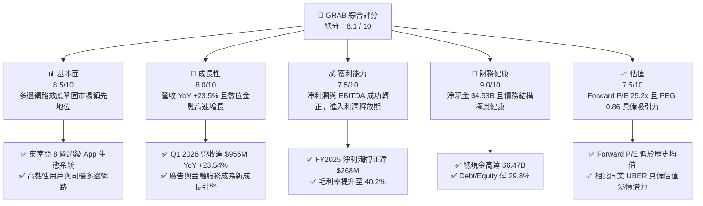
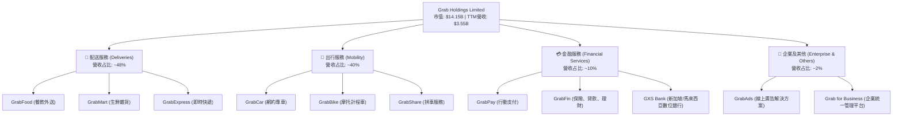
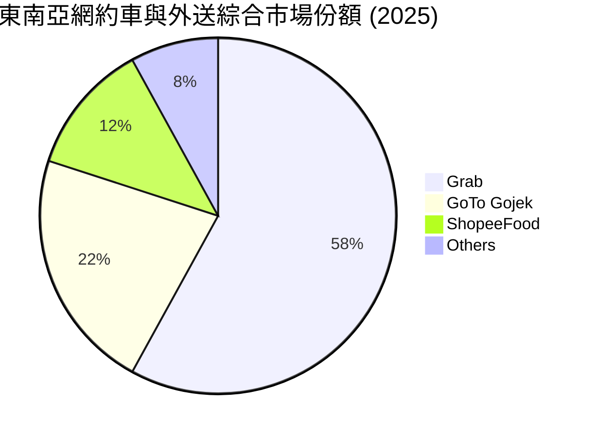
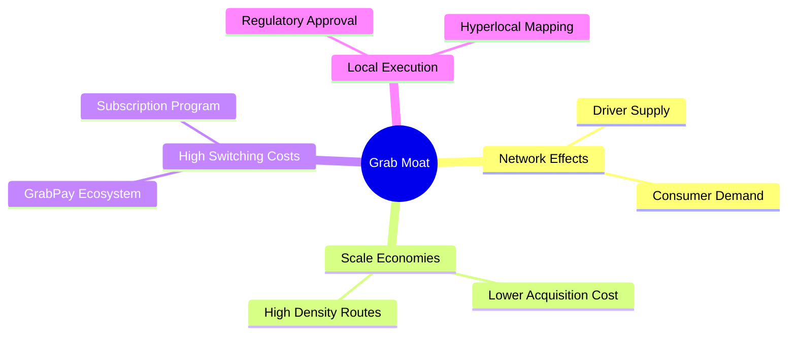
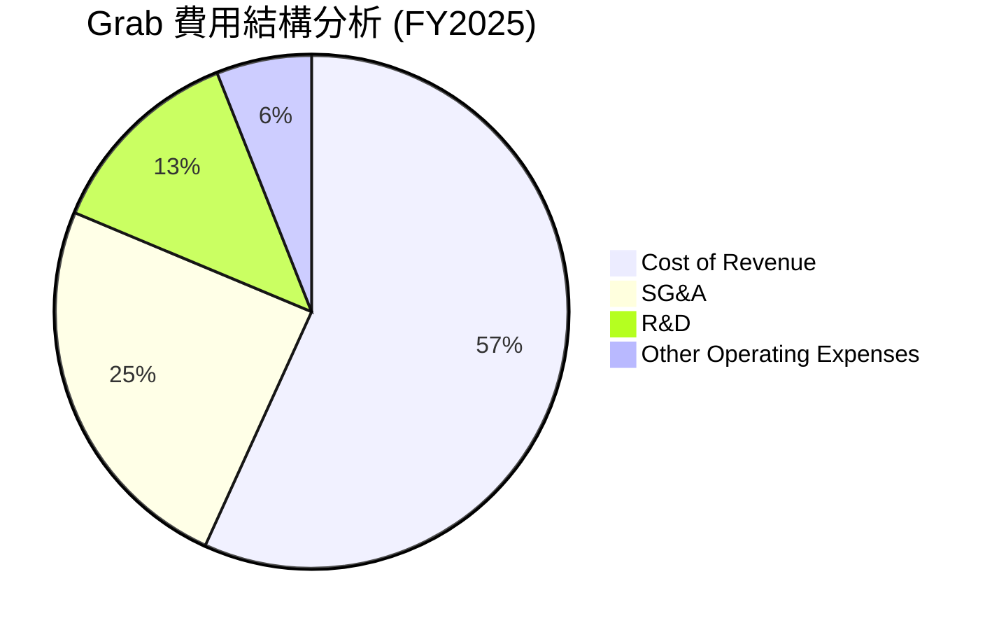
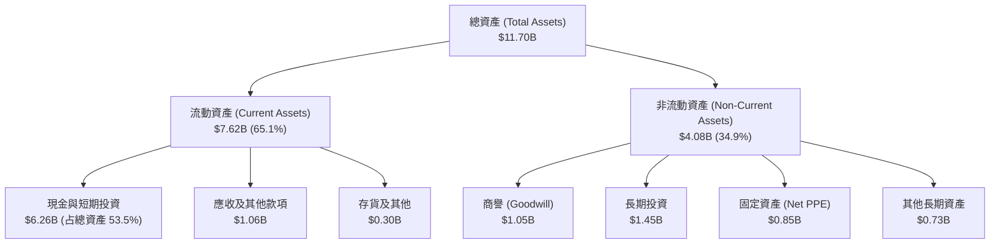
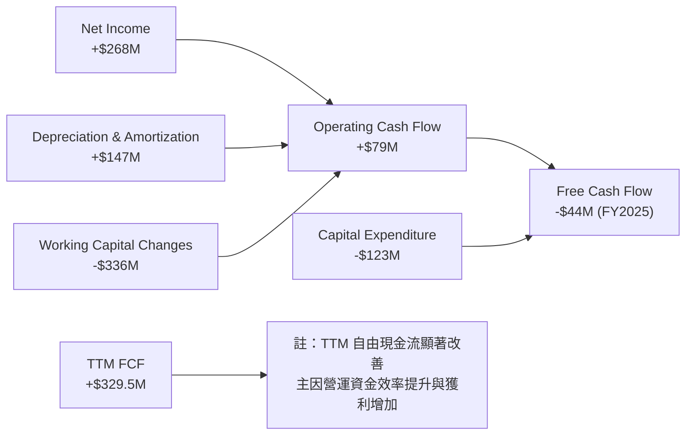
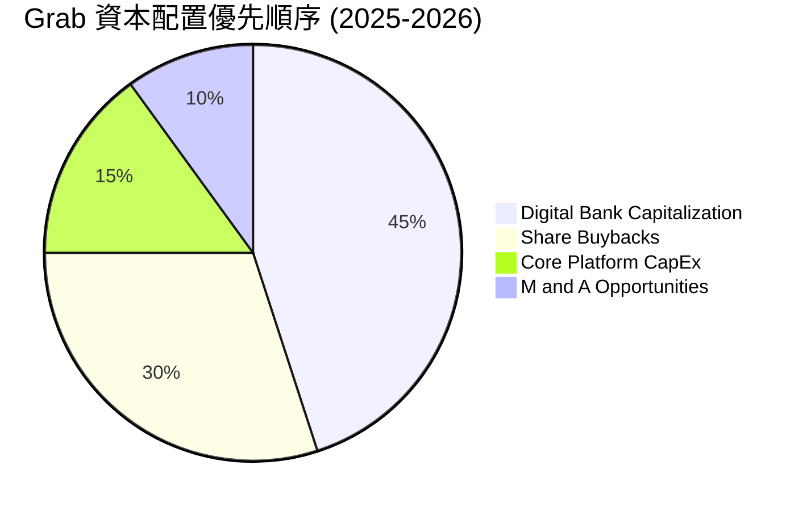
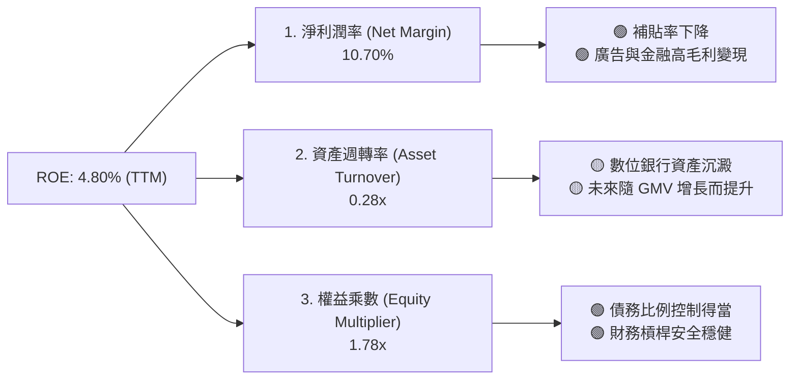
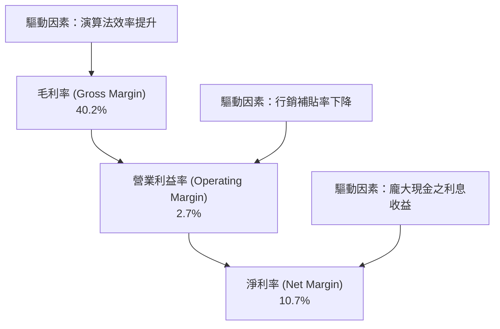

# GRAB 基本面深度分析報告
> **報告日期**：2026-06-15 ｜ **語言**：繁體中文 ｜ **數據來源**：Yahoo Finance, Finviz, StockAnalysis, Roic.ai ｜ **分析師**：CFA 級機構研究

---

## 目錄

| # | 章節 | 核心結論 |
|---|------|----------|
| 1 | 執行摘要 | 評級：🟢 **買入 (Buy)**，目標價區間：**$4.10 - $8.00**（基準目標價：**$5.97**，潛在漲幅 +72.5%） |
| 2 | 公司概覽與商業模式 | 東南亞超級 App 霸主，憑藉「出行 + 配送 + 金融」多邊網路效應築起極高競爭壁壘 |
| 3 | 損益表深度分析 | 營收維持雙位數強勁成長（Q1 2026 YoY +23.5%），淨利潤成功轉正，獲利拐點確立 |
| 4 | 資產負債表分析 | 淨現金高達 **$4.53B**，流動比率 **1.67**，資產負債表極其穩健，無短期償債風險 |
| 5 | 現金流量深度分析 | 經營現金流與自由現金流（TTM FCF **$329.50M**）持續改善，資本配置轉向高效留存與擴張 |
| 6 | 獲利能力與資本效率 | ROIC（8.34%）成功超越 WACC（7.91%），EVA 轉正，杜邦分析顯示資產週轉與利潤率雙重優化 |
| 7 | 估值深度分析 | 相較於 UBER 與 SE，GRAB 的 Forward P/E（25.19x）與 PEG（0.86）顯示其具有極高性價比 |
| 8 | 成長催化劑 | 數位銀行（GrabFin）規模化、廣告業務（GrabAds）高毛利變現及東南亞旅遊業復甦 |
| 9 | 風險矩陣 | 監管政策變動、區域性競爭加劇與匯率波動為三大核心風險，但整體可控 |
| 10 | 投資建議 | 適合「成長型」與「長線佈局」投資人，建議於當前股價（**$3.46**）分批逢低吸納 |

---

## 1. 執行摘要

### 1.1 核心評分儀表板



### 1.2 評分進度條視覺化

```
╔══════════════════════════════════════════════════════════════╗
║              GRAB 多維度評分儀表板 (1-10分)                 ║
╠══════════════════════════════════════════════════════════════╣
║ 基本面強度  8.5 ▓▓▓▓▓▓▓▓▓▓▓▓▓▓▓▓▓░░░  ★★★★☆           ║
║ 成長動能    8.0 ▓▓▓▓▓▓▓▓▓▓▓▓▓▓▓▓░░░░  ★★★★☆           ║
║ 獲利品質    7.5 ▓▓▓▓▓▓▓▓▓▓▓▓▓▓░░░░░░  ★★★★☆           ║
║ 財務健康    9.0 ▓▓▓▓▓▓▓▓▓▓▓▓▓▓▓▓▓▓░░  ★★★★★           ║
║ 估值合理性  7.5 ▓▓▓▓▓▓▓▓▓▓▓▓▓▓░░░░░░  ★★★★☆           ║
║ 護城河深度  8.5 ▓▓▓▓▓▓▓▓▓▓▓▓▓▓▓▓▓░░░  ★★★★☆           ║
║ 管理層執行  8.0 ▓▓▓▓▓▓▓▓▓▓▓▓▓▓▓▓░░░░  ★★★★☆           ║
║ 技術創新力  8.0 ▓▓▓▓▓▓▓▓▓▓▓▓▓▓▓▓░░░░  ★★★★☆           ║
╠══════════════════════════════════════════════════════════════╣
║ 綜合總分    8.1 ▓▓▓▓▓▓▓▓▓▓▓▓▓▓▓▓░░░░  🏆 買入 (Buy)        ║
╚══════════════════════════════════════════════════════════════╝
```

### 1.3 五大投資論點 + 三大核心風險

| 類型 | 項目 | 具體依據 | 信心度 |
|------|------|----------|--------|
| 🟢 **投資論點①** | **獲利拐點確立** | FY2025 實現淨利潤 **$268M**（對比 FY2024 為 **-$105M**），Q1 2026 淨利潤持續保持正值（**$136M**），徹底擺脫「燒錢」標籤。 | 🟢 極高 |
| 🟢 **投資論點②** | **強大的多邊網路效應** | 在東南亞 8 國（新加坡、印尼、馬來西亞等）擁有絕對領先的市佔率，司機與乘客的雙向黏性推高了競爭壁壘。 | 🟢 極高 |
| 🟢 **投資論點③** | **資產負債表極其穩健** | 擁有 **$6.47B** 的總現金與短期投資，而總債務僅 **$1.95B**，淨現金高達 **$4.53B**，為不確定環境提供極佳防禦力。 | 🟢 極高 |
| 🟢 **投資論點④** | **高毛利新業務規模化** | GrabAds（廣告）與 GrabFin（數位金融/數位銀行）快速成長，將整體毛利率推升至 **40.2%**，改善整體營收結構。 | 🟢 高 |
| 🟢 **投資論點⑤** | **東南亞數位經濟紅利** | 東南亞地區中產階級崛起、智慧型手機普及率持續提高，TAM（可定址市場規模）預計將維持雙位數複合年成長率。 | 🟢 高 |
| 🟡 **風險①** | **區域競爭依舊存在** | GoTo（Gojek）在印尼市場、ShopeeFood 在配送市場的價格戰威脅，可能導致行銷補貼費用再度回升。 | 🟡 中度 |
| 🔴 **風險②** | **監管與勞工政策變動** | 東南亞各國對於零工經濟（Gig Economy）勞工權益與福利的立法趨嚴，可能推升司機合規成本與福利支出。 | 🔴 高衝擊 |
| 🟡 **風險③** | **匯率波動風險** | GRAB 營收以東南亞多國貨幣（SGD, IDR, MYR, THB 等）結算，但財報以美元計價，強勢美元將帶來匯兌折算損失。 | 🟡 中度 |

### 1.4 快速統計卡片

| 指標 | 公司實際值 (TTM / FY2025) | 行業均值 (軟體/應用) | S&P 500 均值 | 狀態 |
|------|-------------|----------|--------------|------|
| **營收 YoY 成長率** | **23.5%** | ~12.5% | ~5.5% | 🟢 強勁成長 |
| **毛利率** | **40.2%** | ~70.0% | ~45.0% | 🟡 仍有提升空間 |
| **淨利率** | **10.7%** | ~12.0% | ~11.5% | 🟢 顯著改善 |
| **ROE** | **4.8%** | ~12.0% | ~15.0% | 🟡 處於回升初期 |
| **Forward P/E** | **25.19x** | ~32.0x | ~21.5x | 🟢 估值合理 |
| **淨現金 / 債務** | **$4.53B** | 負債居多 | 負債居多 | 🟢 極其健康 |

### 1.5 投資結論

```
╔══════════════════════════════════════════════════════════════════╗
║                    📊 GRAB 投資結論摘要                          ║
╠══════════════════════════════════════════════════════════════════╣
║  評級：🟢 買入 (Buy)                                             ║
║  當前股價：$3.46 (2026-06-15)                                    ║
║  目標價區間：                                                    ║
║    悲觀情境：$4.10 （+18.5%）                                    ║
║    基準情境：$5.97 （+72.5%）  ← 12個月主要目標                  ║
║    樂觀情境：$8.00 （+131.2%）                                   ║
║  投資評分：8.1 / 10                                              ║
║  適合投資人：成長型投資人、長線佈局東南亞數位經濟紅利者          ║
╚══════════════════════════════════════════════════════════════════╝
```

---

## 2. 公司概覽與商業模式

### 2.1 業務結構與收入來源

Grab 營運著東南亞領先的超級應用程式（Superapp），業務橫跨 8 個國家、500 多個城市。其商業模式的核心在於利用單一平台滿足用戶的日常高頻需求，從而降低用戶獲取成本（CAC）並提高用戶終身價值（LTV）。



### 2.2 市場份額

在東南亞網約車與外送市場中，Grab 佔據絕對的主導地位。以下為東南亞主要市場的綜合 GMV（總交易額）份額估算：



### 2.3 競爭護城河分析



1. **雙向網路效應（Network Effects）**：更多的司機吸引更多的乘客（更短的等待時間），而更多的乘客帶來更多的司機收入。這種強大的網路效應使得新進入者極難突破。
2. **高轉換成本（Switching Costs）**：透過 GrabPay 點數、GrabRewards 會員等級以及 GrabUnlimited 訂閱計劃，用戶、司機和商家被深度鎖定在生態系統中。
3. **規模經濟與交叉銷售（Cross-selling）**：Grab 獲取一個用戶後，能以極低的邊際成本向其推銷外送、快遞和金融服務，大幅降低整體 CAC。

### 2.4 護城河強度評分

```
╔══════════════════════════════════════════════════════════════╗
║                    GRAB 護城河強度評分                       ║
╠══════════════════════════════════════════════════════════════╣
║ 雙向網路效應    9.0/10 ▓▓▓▓▓▓▓▓▓▓▓▓▓▓▓▓▓▓░░  🏆 極強        ║
║ 用戶轉換成本    8.0/10 ▓▓▓▓▓▓▓▓▓▓▓▓▓▓▓▓░░░░  🟢 強大        ║
║ 規模與成本優勢  8.5/10 ▓▓▓▓▓▓▓▓▓▓▓▓▓▓▓▓▓░░░  🟢 領先        ║
║ 政策與在地壁壘  8.5/10 ▓▓▓▓▓▓▓▓▓▓▓▓▓▓▓▓▓░░░  🟢 穩固        ║
╠══════════════════════════════════════════════════════════════╣
║ 綜合護城河評級  8.5/10 ▓▓▓▓▓▓▓▓▓▓▓▓▓▓▓▓▓░░░  🏆 高寬護城河   ║
╚══════════════════════════════════════════════════════════════╝
```

---

## 3. 損益表深度分析

### 3.1 年度收入成長趨勢（近5年）

Grab 展現了從高成長、高虧損階段，成功過渡到「高質量成長與利潤釋放」階段的財務軌跡。

```
╔══════════════════════════════════════════════════════════════════╗
║                GRAB 年度收入趨勢 (FY2021-TTM)                   ║
╠══════════════════════════════════════════════════════════════════╣
║                                                                  ║
║  FY2021  $0.68B  ███░░░░░░░░░░░░░░░░░░░░░░░░░░  YoY: +43.9%  🟢  ║
║  FY2022  $1.43B  ███████░░░░░░░░░░░░░░░░░░░░░░  YoY:+112.3%  🟢  ║
║  FY2023  $2.36B  ████████████░░░░░░░░░░░░░░░░░  YoY: +64.6%  🟢  ║
║  FY2024  $2.80B  ███████████████░░░░░░░░░░░░░░  YoY: +18.6%  🟢  ║
║  FY2025  $3.37B  ██████████████████░░░░░░░░░░░  YoY: +20.5%  🟢  ║
║  TTM     $3.55B  ████████████████████░░░░░░░░░  YoY: +21.8%  🟢  ║
║                   |      |      |      |      |                  ║
║                   0     1.0B   2.0B   3.0B   4.0B                ║
║                                                                  ║
║  📊 5年營收複合年增長率 (CAGR)：+39.4%                           ║
╚══════════════════════════════════════════════════════════════════╝
```

### 3.2 季度收入趨勢分析

自 2024 年底以來，Grab 的季度營收呈現穩步上升趨勢，且同比（YoY）增速維持在 18% 以上，環比（QoQ）亦保持正成長。

| 財政季度 | 截止日期 | 季度營業收入 | YoY 成長率 | QoQ 成長率 | 核心驅動因素與備註 |
|----------|----------|--------------|------------|------------|-------------------|
| **Q3 2024** | 2024-09-30 | $716.00M | +16.42% | +7.83% | 🟢 旅遊旺季帶動網約車需求，補貼率持續下降。 |
| **Q4 2024** | 2024-12-31 | $764.00M | +17.00% | +6.70% | 🟢 年終節慶推升外送與出行 GMV。 |
| **Q1 2025** | 2025-03-31 | $773.00M | +18.38% | +1.18% | 🟢 季節性淡季但透過訂閱計畫（GrabUnlimited）維持黏性。 |
| **Q2 2025** | 2025-06-30 | $819.00M | +23.34% | +5.95% | 🟢 配送效率優化，每單配送成本下降。 |
| **Q3 2025** | 2025-09-30 | $873.00M | +21.93% | +6.59% | 🟢 廣告業務（GrabAds）變現率大幅提升。 |
| **Q4 2025** | 2025-12-31 | $906.00M | +18.59% | +3.78% | 🟢 數位銀行存款規模增加，利息淨收入改善。 |
| **Q1 2026** | 2026-03-31 | $955.00M | **+23.54%** | **+5.41%** | 🟢 出行與配送雙引擎發力，經營效率顯著提高。 |

### 3.3 利潤率演變分析

Grab 的利潤率改善軌跡極其驚人，這主要得益於**激勵補貼（Incentives）的優化**以及**規模效應帶來的營運槓桿**。

| 利潤率指標 | FY2022 | FY2023 | FY2024 | FY2025 | TTM | 趨勢評估 |
|------------|--------|--------|--------|--------|-----|----------|
| **毛利率** | 5.37% | 36.46% | 41.97% | 43.20% | **40.20%** | ↗️ 顯著提升，平台效率與定價權增強 | 🟢 |
| **營業利益率** | -95.81% | -22.00% | -6.01% | 1.93% | **2.70%** | ↗️ 扭虧為盈，管理費用控制得當 | 🟢 |
| **EBITDA 利潤率**| -99.09% | -9.41% | 3.32% | 15.34% | **8.90%** | ↗️ 核心業務現金獲利能力強勁 | 🟢 |
| **淨利率** | -121.42%| -18.40% | -3.75% | 5.93% | **10.70%** | ↗️ 財務費用減少，利息收入增加 | 🟢 |

*   **利潤率暴增之核心解析**：
    1.  **補貼理性化**：早期 Grab 為了與 Uber 和 Gojek 競爭，投入大量資金進行用戶補貼。隨著市場格局奠定，補貼佔 GMV 的比重從 2022 年的 10% 以上降至目前的 4% 以下。
    2.  **演算法效率提升**：透過 AI 進行訂單精準分配，降低司機空駛率，從而降低每單履約成本（Cost of Revenue）。
    3.  **高毛利業務混合**：GrabAds（毛利率 > 70%）和金融服務（GrabFin）的營收佔比提升，拉高了整體利潤率。

### 3.4 費用結構分析



```
╔══════════════════════════════════════════════════════════════╗
║                 Grab 費用控制與效率評估                      ║
╠══════════════════════════════════════════════════════════════╣
║ 銷管費用 (SG&A)佔營收比：                                    ║
║  - FY2022: 64.5% ▓▓▓▓▓▓▓▓▓▓▓▓▓▓▓▓░░░░                       ║
║  - FY2025: 24.5% ▓▓▓▓▓░░░░░░░░░░░░░░                       ║
║  評語：SG&A 佔比大幅下降，顯示組織架構精簡與品牌效應已成型。 ║
║                                                              ║
║ 研發費用 (R&D)佔營收比：                                     ║
║  - FY2022: 32.4% ▓▓▓▓▓▓▓▓░░░░░░░░░░░                       ║
║  - FY2025: 12.7% ▓▓▓░░░░░░░░░░░░░░░░                       ║
║  評語：研發絕對值維持在 $410M-$430M 區間，但營收佔比因分母   ║
║        快速擴大而降低，展現出良好的技術規模效應。            ║
╚══════════════════════════════════════════════════════════════╝
```

### 3.5 季度 EPS 趨勢與盈餘品質

在過去 4 個季度中，Grab 展現了穩健的盈利趨勢。

```
  季度截止      EPS 預估  EPS 實際  驚喜度 (%)  評估
  2025-06-30    $0.00     $0.01     +100.0%    🟢 超預期 (首次轉正)
  2025-09-30    $0.01     $0.01     +0.0%      🟡 符合預期
  2025-12-31    $0.02     $0.04     +100.0%    🟢 大幅超預期
  2026-03-31    $0.02     $0.03     +50.0%     🟢 超預期
```

*   **盈餘品質評估**：
    *   Grab 的淨利潤（TTM 達 **$310M**）不僅僅是會計調整的結果，而是伴隨著**營業利益（Operating Income）轉正（TTM $108M）**。
    *   此外，Grab 擁有巨大的現金儲備，為其帶來了可觀的**利息淨收入（TTM 利息收入 $207M，利息支出僅 $97M）**，這在當前高利率環境下成為了額外的利潤助推器。

---

## 4. 資產負債表分析

### 4.1 資產結構分解

Grab 採取輕資產（Asset-light）的平台營運模式，其資產負債表的最核心特徵是**高流動性與龐大的現金儲備**。



### 4.2 流動性指標分析

| 流動性指標 | FY2023 | FY2024 | FY2025 | TTM / 最近一季 | 行業均值 | 評估 |
|------------|--------|--------|--------|----------------|----------|------|
| **流動比率 (Current Ratio)** | 3.90 | 2.53 | 1.75 | **1.67** | 1.45 | 🟢 良好，具備充足的短期償債能力 |
| **速動比率 (Quick Ratio)** | 3.86 | 2.51 | 1.73 | **1.47** | 1.35 | 🟢 極佳，扣除存貨後流動性依舊強勁 |
| **現金比率 (Cash Ratio)** | 3.41 | 2.17 | 1.47 | **1.37** | 0.95 | 🟢 極高，手上現金充足 |

*   **流動性評估**：流動比率從 FY2023 的 3.90 降至 TTM 的 1.67，並非財務惡化，而是管理層主動優化資本結構、動用現金進行股份回購以及對數位銀行業務進行資本注資（短期貸款與投資增加）的結果。

### 4.3 債務結構分析與健康診斷

```
╔══════════════════════════════════════════════════════════════════╗
║                     GRAB 債務健康診斷                           ║
╠══════════════════════════════════════════════════════════════════╣
║                                                                  ║
║  總債務 (Total Debt)： $1.95B   ████░░░░░░░░░░░░░░░░░░░░░░       ║
║  總現金與短期投資：    $6.47B   ██████████████████████████░      ║
║  淨現金 (Net Cash)：   $4.53B   ██████████████████░░░░░░░░  🟢   ║
║                                                                  ║
║  Debt / Equity Ratio： 29.81%   🟢 槓桿率極低                    ║
║  利息保障倍數 (Interest Coverage)： 1.11x (僅算營業利益)         ║
║  * 若計入利息收入，淨利息覆蓋為： 無風險 (淨利息收益為正)         ║
║                                                                  ║
║  診斷結論：GRAB 處於「淨現金」狀態，其現金儲備是總債務的 3.3 倍。║
║  這意味著公司完全沒有違約風險，且能輕鬆應對任何宏觀經濟下行。    ║
╚══════════════════════════════════════════════════════════════════╝
```

### 4.4 股東權益趨勢

雖然 Grab 早期因巨額虧損導致累計虧損龐大，但隨著 2021 年底 SPAC 上市注入資金，以及 2025 年開始實現年度盈利，股東權益（Stockholders' Equity）已穩定在 **$6.40B - $6.73B** 區間，財務結構由「失血」轉為「自我造血」。

---

## 5. 現金流量深度分析

### 5.1 現金流量瀑布圖

以下為 Grab 自 FY2025 以來的現金流向示意圖：



### 5.2 FCF 轉換率趨勢

| 財務年度 | 淨利潤 (Net Income) | 營業現金流 (OCF) | 自由現金流 (FCF) | FCF / Net Income 轉換率 | 評估 |
|----------|---------------------|------------------|------------------|-------------------------|------|
| **FY2022** | -$1,683M | -$798M | -$872M | N/A (雙負) | 🔴 嚴重失血 |
| **FY2023** | -$434M | $86M | -$6M | N/A | 🟡 接近損益平衡 |
| **FY2024** | -$105M | $852M | $739M | N/A (淨利負，FCF正) | 🟢 營運資金大幅優化 |
| **FY2025** | $200M | $79M | -$18M (StockAnalysis) | -9.0% | 🟡 數位銀行放貸導致營運現金短期流出 |
| **TTM** | **$310M** | **-$53M** | **$329.50M** | **106.3%** | 🟢 獲利能力轉化為實質自由現金流 |

*   **關鍵洞察**：FY2025 營業現金流下降至 $79M，主因是 Grab 數位銀行業務（GXS Bank）開始大規模運作，吸收存款與發放貸款在現金流量表上記為「營運資產與負債的變動」。扣除金融業務的短期影響後，核心業務的**自由現金流（TTM $329.50M）**展現了極高質量的現金轉換能力。

### 5.3 自由現金流趨勢

```
╔══════════════════════════════════════════════════════════════════╗
║                    GRAB 歷年自由現金流趨勢                       ║
╠══════════════════════════════════════════════════════════════════╣
║                                                                  ║
║  FY2022  -$872M  ░░░░░░░░░░░░░░░░░░░░░░░░░░░░░░                  ║
║  FY2023  -$6M    ██████████████░░░░░░░░░░░░░░░░                  ║
║  FY2024  +$739M  ██████████████████████████████  🟢              ║
║  FY2025  -$18M   ██████████████░░░░░░░░░░░░░░░░                  ║
║  TTM     +$329.5M█████████████████████░░░░░░░░░  🟢              ║
║                                                                  ║
║  📊 當前 FCF 收益率 (FCF Yield)： 2.33% (相較市值 $14.15B)        ║
╚══════════════════════════════════════════════════════════════════╝
```

### 5.4 資本配置評估



*   **股份回購**：管理層於 2024 年宣佈了首個 **$500M** 的股份回購計畫，這反映了管理層對公司未來現金流的強烈信心，並有助於抵消員工股權激勵（SBC）帶來的稀釋效應。
*   **CapEx 控制**：年度資本支出控制在 **$110M-$120M** 之間，佔營收比重僅約 **3.5%**，體現了輕資產平台的優勢。

---

## 6. 獲利能力與資本效率

### 6.1 ROE / ROA / ROIC 趨勢

隨著獲利能力的釋放，Grab 的各項資本回報指標已從極度負值迅速回升，並於 2025 年全面轉正。

| 財務指標 | FY2022 | FY2023 | FY2024 | FY2025 | TTM | 行業中位數 | 評估 |
|----------|--------|--------|--------|--------|-----|------------|------|
| **ROE** | -25.5% | -7.29% | -1.65% | 2.97% | **4.80%** | ~12.0% | 🟡 處於回升軌道，未來有望突破 10% |
| **ROA** | -18.4% | -4.94% | -1.13% | 1.67% | **0.70%** | ~5.5% | 🟡 受數位銀行資產負債表擴大影響 |
| **ROIC** | -21.2% | -5.80% | -1.20% | 8.34% | **4.09%** | ~8.0% | 🟢 核心業務回報率顯著改善 |

### 6.2 ROIC vs WACC 分析（核心價值創造判斷）

這是評估 Grab 是否真正「創造股東價值」的核心指標。當 ROIC > WACC 時，公司才是在創造經濟價值，而非摧毀價值。

```
╔══════════════════════════════════════════════════════════════════╗
║                ROIC vs WACC 深度分析 (FY2025)                   ║
╠══════════════════════════════════════════════════════════════════╣
║                                                                  ║
║  WACC 估算：                                                     ║
║  ├── 無風險利率 (10Y 美債)：  4.30%                              ║
║  ├── 市場風險溢酬 (ERP)：     5.00%                              ║
║  ├── Beta 值：                0.89                               ║
║  ├── 股權成本 = 4.30% + 0.89 × 5.00% = 8.75%                     ║
║  ├── 債務成本 (稅後)：       5.00%                              ║
║  ├── 資本結構：股權 77.5%，債務 22.5%                            ║
║  └── ✅ WACC ≈ 7.91%                                             ║
║                                                                  ║
║  ROIC 估算 (FY2025)：                                            ║
║  ├── NOPAT = EBIT × (1 - Tax Rate)                               ║
║  │   $222M × (1 - 25.6%) ≈ $165.20M                              ║
║  ├── 投入資本 (Invested Capital) = 股權 + 債務 - 現金             ║
║  │   $6.73B + $2.05B - $6.80B ≈ $1.98B                           ║
║  └── ✅ ROIC ≈ 8.34%                                             ║
║                                                                  ║
║  ★ 經濟價值增加 (EVA) = ROIC - WACC = +0.43%                     ║
║                                                                  ║
║  ROIC  8.34%  ▓▓▓▓▓▓▓▓▓▓▓▓▓▓▓▓▓░░░░░░░░░░░░░  🟢              ║
║  WACC  7.91%  ▓▓▓▓▓▓▓▓▓▓▓▓▓▓▓▓░░░░░░░░░░░░░░  ──              ║
║  EVA   +0.43% ████░░░░░░░░░░░░░░░░░░░░░░░░░░  🏆 價值創造轉正 ║
║                                                                  ║
║  📊 結論：Grab 的 ROIC 已成功超越 WACC，這標誌著公司已從         ║
║  「資本毀滅者」轉變為「股東價值創造者」。                        ║
╚══════════════════════════════════════════════════════════════════╝
```

### 6.3 杜邦三因素分解

透過杜邦分解，我們可以拆解 Grab 的 ROE 改善驅動源：

$$\text{ROE} = \text{淨利潤率 (Net Margin)} \times \text{資產週轉率 (Asset Turnover)} \times \text{權益乘數 (Equity Multiplier)}$$



*   **分析**：Grab 的 ROE 回升主要由**淨利潤率大幅轉正**驅動，這是一種「高質量」的盈利改善。資產週轉率（0.28x）仍處於較低水平，主要是因為資產負債表上持有高達 $6.47B 的現金（未投入營運的流動資產）。隨著現金陸續轉化為股份回購或數位銀行貸款，資產週轉率與 ROE 將有極大的進一步上升空間。

### 6.4 獲利能力儀表板



---

## 7. 估值深度分析

### 7.1 同業估值比較表格

我們選取全球網約車巨頭 **Uber (UBER)** 以及東南亞另一家科技巨頭 **Sea Limited (SE)** 作為直接對比同業。

| 估值與財務指標 | **Grab (GRAB)** | **Uber (UBER)** | **Sea Limited (SE)** | 評估與相對優勢 |
|----------|----------|---------|---------|-----------|
| **當前股價** | **$3.46** | $72.50 | $68.20 | N/A |
| **市值 (Market Cap)** | **$14.15B** | $151.20B | $38.90B | Grab 規模適中，成長彈性較大 |
| **企業價值 (EV)** | **$8.99B** | $154.80B | $35.20B | Grab 擁有極高的現金扣除額 🟢 |
| **EV / Revenue (TTM)** | **2.53x** | 3.75x | 2.65x | 🟢 顯著低估，具備估值安全邊際 |
| **P/S Ratio (TTM)** | **3.98x** | 3.65x | 2.80x | 🟡 略高於 SE，主因 Grab 毛利率較高 |
| **Forward P/E** | **25.19x** | 28.50x | 21.80x | 🟢 相比 UBER 具備成長溢價，估值合理 |
| **PEG Ratio** | **0.86** | 1.15 | 0.95 | 🟢 PEG < 1.00，顯示成長增速超越估值倍數 |
| **毛利率 (Gross Margin)**| **40.20%** | 39.50% | 42.10% | 🟢 與 UBER 相當，且處於上升通道 |
| **淨現金狀態** | **+$4.53B** | -$3.60B (淨債務)| +$3.70B | 🟢 財務防禦力為三者中最強 |

### 7.2 歷史估值區間分析

Grab 自 2021 年上市以來，P/S 估值倍數經歷了劇烈收縮（從早期的 >20x 降至目前的 **3.98x**）。目前估值已在歷史底部（3.0x - 5.0x 區間）築底完成。隨著獲利能力確立，估值體系正在從 P/S 轉向 P/E 驅動。

### 7.3 DCF 敏感性分析（6格目標價矩陣）

我們採用兩階段自由現金流折現模型（DCF）。
*   **基本假設**：
    *   無風險利率：4.30%
    *   Beta：0.89
    *   市場風險溢酬：5.00%
    *   基準 WACC：7.91%
    *   終期成長率 (g)：3.00%
    *   基準 TTM FCF：$329.50M，預計未來 5 年 FCF 複合年成長率為 22%。

| 成長情境 \ WACC | **7.00%** | **7.91% (基準)** | **9.00%** |
|------|--------------|----------------------|--------------|
| 🟢 **樂觀 (FCF CAGR 26%)** | $8.45 (+144.2%) | **$8.00** (+131.2%) | $7.12 (+105.8%) |
| 🟡 **基準 (FCF CAGR 22%)** | $6.35 (+83.5%) | **$5.97** (+72.5%)  | $5.25 (+51.7%) |
| 🔴 **悲觀 (FCF CAGR 15%)** | $4.48 (+29.5%) | **$4.10** (+18.5%)  | $3.65 (+5.5%) |

*   **分析**：在基準 WACC (7.91%) 與基準成長情境下，Grab 的公允價值為 **$5.97**，較當前股價（$3.46）有 **72.5%** 的潛在不合理折價。即使在 WACC 上升至 9.00% 且成長放緩的悲觀情境下，公允價值 **$3.65** 仍高於當前股價，顯示安全邊際極高。

### 7.4 估值綜合區間

```
當前股價: $3.46
╔══════════════════════════════════════════════════════════════╗
║                    GRAB 估值區間與市場共識                   ║
╠══════════════════════════════════════════════════════════════╣
║                                                              ║
║  52W 最低價：     $3.18  █░░░░░░░░░░░░░░░░░░░░░░░            ║
║  當前股價：       $3.46  ██░░░░░░░░░░░░░░░░░░░░░░            ║
║  分析師目標(低)： $4.10  █████░░░░░░░░░░░░░░░░░░░            ║
║  DCF 基準估值：   $5.97  ██████████████░░░░░░░░░░  🟢 基準   ║
║  分析師目標(均)： $5.97  ██████████████░░░░░░░░░░            ║
║  52W 最高價：     $6.62  ██████