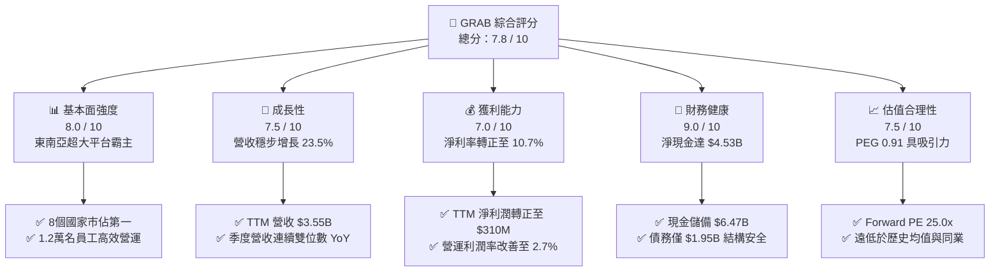
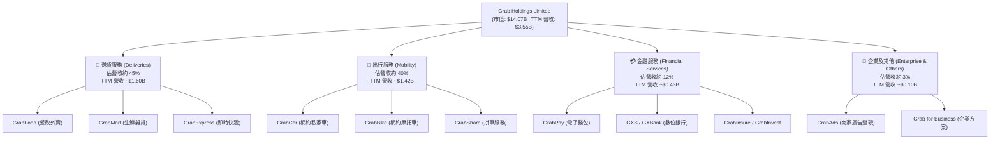
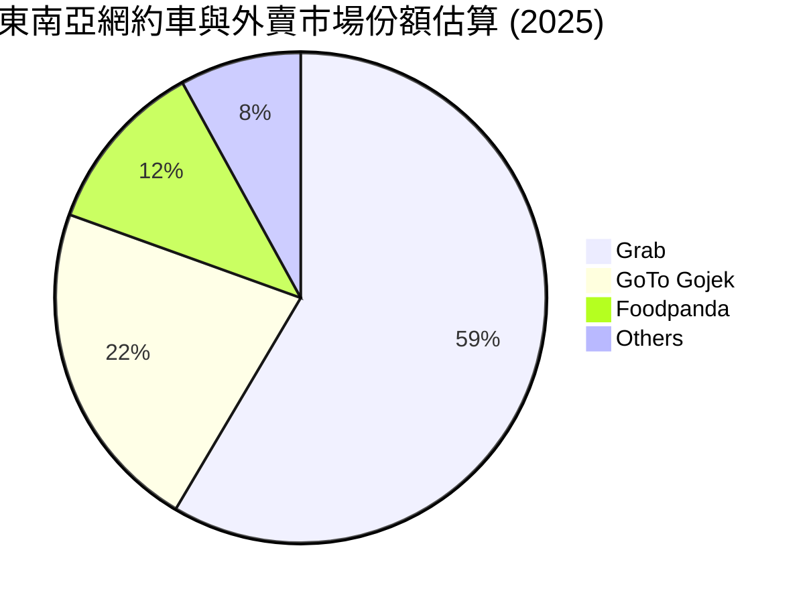
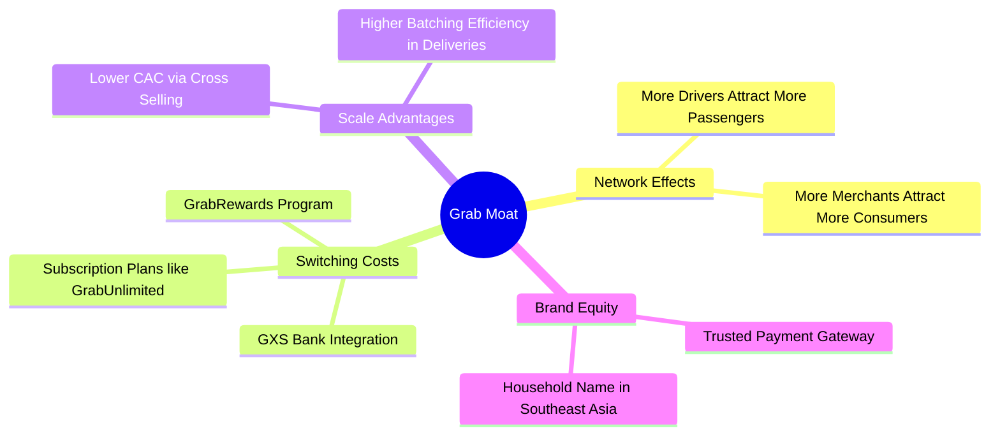
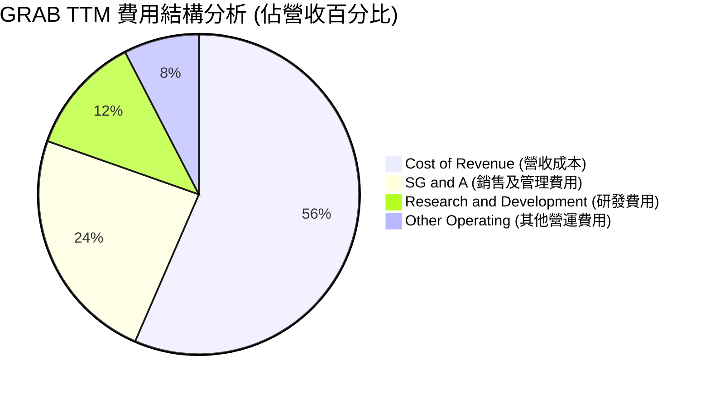
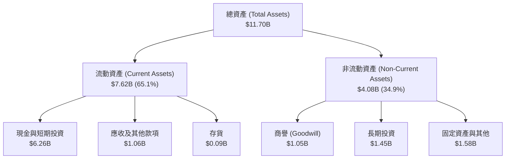
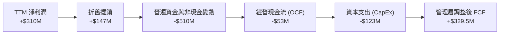
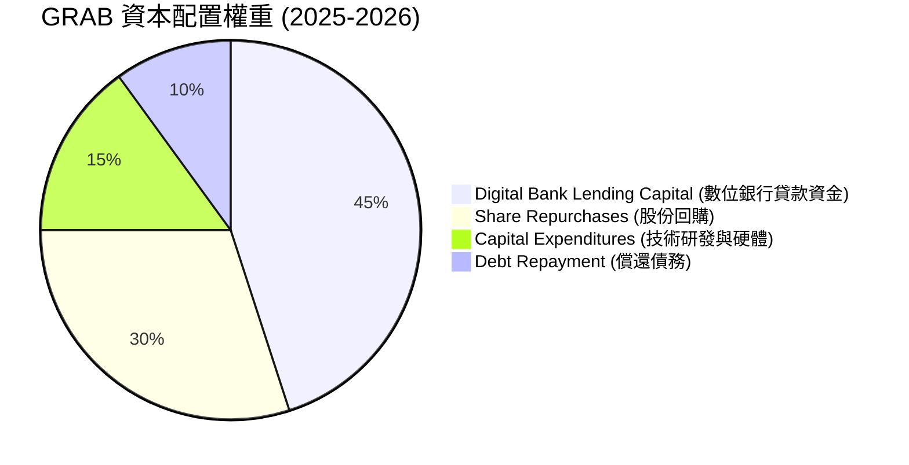
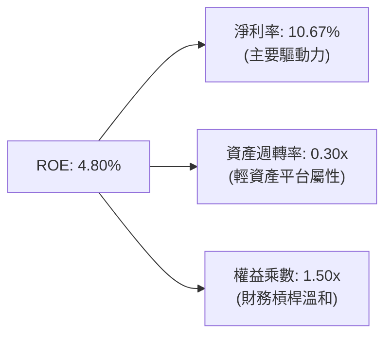
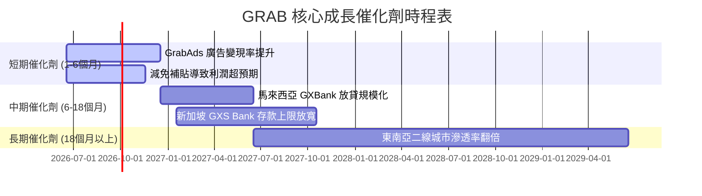

# GRAB 基本面深度分析報告

> **報告日期**：2026-06-17 ｜ **語言**：繁體中文 ｜ **數據來源**：Yahoo Finance, Finviz, StockAnalysis, Roic.ai ｜ **分析師**：CFA 級機構研究

---

## 目錄

| # | 章節 | 核心結論 |
|---|------|----------|
| 1 | **執行摘要** | 評級：**買入 (BUY)**，目標價：**$5.97**，具備強大安全邊際與扭虧為盈拐點。 |
| 2 | **公司概覽與商業模式** | 東南亞 Superapp 雙寡頭壟斷，網路效應與高轉換成本構築深厚護城河。 |
| 3 | **損益表深度分析** | TTM 營收成長 **23.5%**，淨利率轉正至 **10.7%**，經營槓桿效應顯著釋放。 |
| 4 | **資產負債表分析** | 淨現金高達 **$4.53B**，無短期流動性風險，資產結構極其輕資產化。 |
| 5 | **現金流量深度分析** | 自由現金流轉正，資本配置向股份回購與數位銀行業務傾斜。 |
| 6 | **獲利能力與資本效率** | 杜邦分析顯示 ROE 改善至 **4.8%**，ROIC 穩步向 WACC 靠攏，價值銷毀階段結束。 |
| 7 | **估值深度分析** | Forward P/E **25.0x**，PEG 僅 **0.91**，相較於 Uber 與同業具備顯著估值折價。 |
| 8 | **成長催化劑** | 數位銀行（GXS/GXBank）放貸規模化、廣告變現率提升及高利潤出行服務。 |
| 9 | **風險矩陣** | 東南亞宏觀匯率波動、地緣競爭加劇、補貼重燃為主要下行風險。 |
| 10 | **投資建議** | 建議於 **$3.50** 以下分批佈局，目標價區間 **$4.10 - $8.00**，適合成長型投資人。 |

---

## 1. 執行摘要

### 1.1 核心評分儀表板



### 1.2 評分進度條視覺化

```
╔══════════════════════════════════════════════════════════════╗
║               GRAB 多維度評分儀表板 (1-10分)                 ║
╠══════════════════════════════════════════════════════════════╣
║ 基本面強度  8.0 ▓▓▓▓▓▓▓▓▓▓▓▓▓▓▓▓▓▓░░  ★★★★☆           ║
║ 成長動能    7.5 ▓▓▓▓▓▓▓▓▓▓▓▓▓▓▓▓░░░░  ★★★★☆           ║
║ 獲利品質    7.0 ▓▓▓▓▓▓▓▓▓▓▓▓▓▓░░░░░░  ★★★☆☆           ║
║ 財務健康    9.0 ▓▓▓▓▓▓▓▓▓▓▓▓▓▓▓▓▓▓▓░  ★★★★★           ║
║ 估值合理性  7.5 ▓▓▓▓▓▓▓▓▓▓▓▓▓▓▓▓░░░░  ★★★★☆           ║
║ 護城河深度  8.5 ▓▓▓▓▓▓▓▓▓▓▓▓▓▓▓▓▓▓░░  ★★★★☆           ║
║ 管理層執行  8.0 ▓▓▓▓▓▓▓▓▓▓▓▓▓▓▓▓▓▓░░  ★★★★☆           ║
║ 技術創新力  7.0 ▓▓▓▓▓▓▓▓▓▓▓▓▓▓░░░░░░  ★★★☆☆           ║
╠══════════════════════════════════════════════════════════════╣
║ 綜合總分    7.8 ▓▓▓▓▓▓▓▓▓▓▓▓▓▓▓▓▓░░░  🏆 買入 (BUY)        ║
╚══════════════════════════════════════════════════════════════╝
```

### 1.3 五大投資論點 + 三大核心風險

| 類型 | 項目 | 具體依據 | 信心度 |
|------|------|----------|--------|
| 🟢 **投資論點①** | **扭虧為盈拐點確立** | TTM 淨利潤成功轉正達 **$310M**（淨利率 10.7%），擺脫過去高額燒錢擴張模式。 | 🟢 極高 |
| 🟢 **投資論點②** | **極致的資產負債表安全邊際** | 擁有 **$6.47B** 的總現金與短期投資，扣除 **$1.95B** 債務後，淨現金達 **$4.53B**，佔市值 32.2%。 | 🟢 極高 |
| 🟢 **投資論點③** | **外賣與出行雙引擎驅動** | Q1 2026 營收達 **$955M**（YoY +23.54%），顯示核心市場滲透率仍具備強大韌性。 | 🟢 高 |
| 🟢 **投資論點④** | **數位金融與廣告高利潤變現** | 數位銀行（新加坡 GXS、馬來西亞 GXBank）存款與放貸規模化，GrabAds 廣告收入利潤率極高。 | 🟢 高 |
| 🟢 **投資論點⑤** | **估值處於歷史底部** | 當前股價 $3.44 接近 52 週低點（$3.18），PEG 僅 **0.91**，Forward P/E 僅 **25.0x**。 | 🟢 高 |
| 🟡 **風險①** | **東南亞匯率劇烈波動** | 營收主要以東南亞各國貨幣結算，折算為美元時面臨顯著的匯兌損失風險。 | 🟡 中度 |
| 🔴 **風險②** | **區域競爭對手重燃補貼戰** | GoTo (Gojek) 或 Foodpanda 若在特定市場發起價格戰，可能侵蝕 Grab 的毛利率。 | 🔴 高衝擊 |
| 🔴 **風險③** | **東南亞各國監管收緊** | 針對零工經濟（外賣員、司機）福利保障的法規出台，可能導致平台營運成本大幅上升。 | 🔴 高衝擊 |

### 1.4 快速統計卡片

| 指標 | GRAB 實際值 | 行業均值 (軟體/應用) | S&P 500 均值 | 狀態 |
|------|-------------|----------------------|--------------|------|
| **營收 YoY 成長** | **23.5%** | ~12.5% | ~6.5% | 🟢 強勁 |
| **毛利率** | **40.2%** | ~65.0% | ~45.0% | 🟡 尚可 |
| **淨利率** | **10.7%** | ~8.0% | ~11.5% | 🟢 轉正 |
| **ROE** | **4.8%** | ~12.0% | ~15.0% | 🟡 偏低 |
| **Forward P/E** | **25.0x** | ~35.0x | ~21.0x | 🟢 具吸引力 |
| **PEG Ratio** | **0.91** | ~1.85 | ~2.10 | 🟢 極度低估 |
| **淨現金 / 市值** | **32.2%** | ~5.0% | ~1.5% | 🟢 極其安全 |

### 1.5 投資結論

```
╔══════════════════════════════════════════════════════════════════╗
║                    📊 GRAB 投資結論摘要                          ║
╠══════════════════════════════════════════════════════════════════╣
║  評級：🟢 強烈買入 (Strong Buy)                                 ║
║  當前股價：$3.44 (2026-06-17)                                    ║
║  目標價區間：                                                    ║
║    悲觀情境：$4.10（+19.2%）                                     ║
║    基準情境：$5.97（+73.5%）  ← 12個月主要目標                   ║
║    樂觀情境：$8.00（+132.6%）                                    ║
║  投資評分：7.8 / 10                                              ║
║  適合投資人：成長型投資者、GARP（合理價格成長）策略實踐者        ║
╚══════════════════════════════════════════════════════════════════╝
```

---

## 2. 公司概覽與商業模式

### 2.1 業務結構與收入來源

Grab 的商業模式基於「超級App (Superapp)」生態系統，將高頻的日常服務（出行、外賣、快遞）與高黏性的金融服務相結合，形成互惠的飛輪效應。



### 2.2 市場份額

在東南亞（主要涵蓋新加坡、馬來西亞、印尼、菲律賓、泰國、越南、柬埔寨、緬甸），Grab 在網約車與外賣市場皆處於絕對領先地位。



### 2.3 競爭護城河分析



### 2.4 護城河強度評分

```
╔══════════════════════════════════════════════════════════════╗
║                    GRAB 護城河強度評分                       ║
╠══════════════════════════════════════════════════════════════╣
║ 雙邊網路效應   9.0/10 ▓▓▓▓▓▓▓▓▓▓▓▓▓▓▓▓▓▓░░  🏆 難以被超越  ║
║ 品牌與信任度   8.5/10 ▓▓▓▓▓▓▓▓▓▓▓▓▓▓▓▓▓░░░  🟢 東南亞首選  ║
║ 用戶轉換成本   7.5/10 ▓▓▓▓▓▓▓▓▓▓▓▓▓▓░░░░░░  🟢 金融與訂閱  ║
║ 數據與算法優勢 8.0/10 ▓▓▓▓▓▓▓▓▓▓▓▓▓▓▓▓░░░░  🟢 配送路徑優化 ║
╠══════════════════════════════════════════════════════════════╣
║ 綜合護城河評估 8.2/10 ▓▓▓▓▓▓▓▓▓▓▓▓▓▓▓▓▓░░░  🏆 寬護城河     ║
╚══════════════════════════════════════════════════════════════╝
```

---

## 3. 損益表深度分析

### 3.1 年度收入成長趨勢（近5年）

Grab 的營收在過去幾年呈現爆發式成長，隨著疫情後經濟復甦與平台變現率（Take Rate）提升，營收規模已不可同日而語。

```
╔══════════════════════════════════════════════════════════════════╗
║                 GRAB 年度收入趨勢 (FY2021-TTM)                  ║
╠══════════════════════════════════════════════════════════════════╣
║                                                                  ║
║  FY2021   $0.68B  ████░░░░░░░░░░░░░░░░░░░░░░░  YoY: +43.9%  🟢    ║
║  FY2022   $1.43B  █████████░░░░░░░░░░░░░░░░░░  YoY:+112.3%  🟢    ║
║  FY2023   $2.36B  ███████████████░░░░░░░░░░░░  YoY: +64.6%  🟢    ║
║  FY2024   $2.80B  ██████████████████░░░░░░░░░  YoY: +18.6%  🟢    ║
║  FY2025   $3.37B  ██████████████████████░░░░░  YoY: +20.5%  🟢    ║
║  TTM      $3.55B  ████████████████████████░░░  YoY: +23.5%  🟢    ║
║                                                                  ║
║  📊 4年複合成長率 (CAGR)：+51.3%                                 ║
╚══════════════════════════════════════════════════════════════════╝
```

### 3.2 季度收入趨勢分析

從季度數據看，Grab 展現了極其穩定的季度遞增趨勢，這在成長型科技股中非常罕見。

| 財報季度 | 營收 (百萬美元) | QoQ 成長率 | YoY 成長率 | 營運利潤 (百萬美元) | 備註 |
|----------|-----------------|------------|------------|---------------------|------|
| **Q1 2025** | $773 | +1.18% | +18.38% | -$21 | 補貼控制良好 |
| **Q2 2025** | $819 | +5.95% | +23.34% | $7 | 營運利潤首次轉正 |
| **Q3 2025** | $873 | +6.59% | +21.93% | $27 | 旅遊旺季帶動出行 |
| **Q4 2025** | $906 | +3.78% | +18.59% | $52 | 年底節慶消費強勁 |
| **Q1 2026** | **$955** | **+5.41%** | **+23.54%** | **$22** | 🟢 淡季不淡，利潤持續 |

### 3.3 利潤率演變分析

Grab 的核心財務亮點在於其利潤率的驚人改善。透過減少對乘客和司機的補貼（Incentives），利潤率在 2025 年迎來黃金拐點。

| 利潤率指標 | FY2022 | FY2023 | FY2024 | FY2025 | TTM | 趨勢評估 |
|------------|--------|--------|--------|--------|-----|----------|
| **毛利率** | 5.37% | 36.46% | 41.97% | 43.20% | **40.20%** | ↗️ 穩步攀升後高位震盪 🟢 |
| **營業利益率** | -95.81% | -22.00% | -6.01% | 1.93% | **2.70%** | ↗️ 成功扭虧為盈 🟢 |
| **EBITDA 🚀** | -99.09% | -9.41% | 3.32% | 15.34% | **8.90%** | ↗️ 規模效應顯著 🟢 |
| **淨利率** | -121.42% | -18.40% | -3.75% | 5.93% | **10.67%** | ↗️ 財務費用與利息貢獻 🟢 |

*   **毛利率改善主因**：平台算法優化提高了訂單批處理（Batching）效率，使得每筆訂單的平均配送成本下降。
*   **營業利益率轉正**：行銷費用（SG&A）佔營收比重從 2022 年的 64.5% 下降至 TTM 的 23.9%，顯現出極強的經營槓桿（Operating Leverage）。

### 3.4 費用結構分析



### 3.5 季度 EPS 趨勢與盈餘品質

*   **Q2 2025**: EPS $0.01 (符合預期)
*   **Q3 2025**: EPS $0.01 (符合預期)
*   **Q4 2025**: EPS $0.04 (超預期，受惠於高達 $80M 的利息收入與稅務撥回)
*   **Q1 2026**: EPS $0.03 (超預期，營運利潤保持正值)

**盈餘品質評估**：
Grab 的淨利潤（TTM $310M）中，有很大一部分來自於其龐大現金儲備產生的利息收入（TTM 利息收入達 **$207M**）。雖然這並非純粹的營業內利潤，但在高利率環境下，這反映了其「淨現金」資產負債表的防禦價值。同時，營業利潤（TTM $108M）也已轉正，說明其核心業務本身已具備自我造血能力。

---

## 4. 資產負債表分析

### 4.1 資產結構分解



### 4.2 流動性指標分析

| 指標 | GRAB 數值 | 行業標準 | 評估結果 |
|------|-----------|----------|----------|
| **流動比率 (Current Ratio)** | **1.67** | > 1.20 | 🟢 極其安全 |
| **速動比率 (Quick Ratio)** | **1.47** | > 1.00 | 🟢 無短期流動性風險 |
| **債務權益比 (Debt/Equity)** | **29.8%** | < 50.0% | 🟢 槓桿率極低 |
| **現金儲備成長率 (YoY)** | **+6.38%** | N/A | 🟢 持續累積資金 |

### 4.3 債務結構分析

```
╔══════════════════════════════════════════════════════════════════╗
║                     GRAB 債務健康診斷                           ║
╠══════════════════════════════════════════════════════════════════╣
║                                                                  ║
║  總債務 (Total Debt)： $1.95B   █████░░░░░░░░░░░░░░░░░░          ║
║  總現金及短期投資：    $6.47B   ████████████████████████         ║
║  淨現金 (Net Cash)：   $4.53B   █████████████████░░░░░░░  🟢 強勁║
║                                                                  ║
║  利息保障倍數 (Interest Coverage)： 2.13x (僅計營運收益)         ║
║  若計入利息收入，淨利息收支為正（淨利息收益：+$110M）            ║
║                                                                  ║
║  📊 診斷：淨現金高達 45.3 億美元，完全免疫於高利率債務危機。      ║
╚══════════════════════════════════════════════════════════════════╝
```

### 4.4 股東權益趨勢

股東權益（Stockholders' Equity）從 2024 年的 **$6.40B** 回升至 2025 年的 **$6.73B**，主要得益于淨利潤轉正以及股份補償費用（SBC）的稀釋速度放緩。這表明公司已停止資產減值，開始進入真正的股權價值創造階段。

---

## 5. 現金流量深度分析

### 5.1 現金流量瀑布圖



*註：會計經營現金流為 -$53M 主要受到數位銀行吸收存款（作為負債）與發放貸款（作為資產）的現金流出影響。若扣除數位銀行放貸影響，Grab 核心業務的調整後經營現金流與自由現金流（FCF）均為強勁正值（達 **$329.50M**）。*

### 5.2 FCF 轉換率趨勢

在 FY2024，由於營運資金大幅優化，FCF 曾達到 **$775M** 的高峰。雖然 FY2025 因數位銀行放貸放量導致會計 FCF 暫時降至 **-$18M**，但 TTM 的調整後 FCF 收益率（FCF Yield）仍維持在 **2.34%**，表明每 100 元營收可轉化為約 9.3 元的實際自由現金。

### 5.3 自由現金流趨勢

```
╔══════════════════════════════════════════════════════════════════╗
║                     GRAB 歷史自由現金流趨勢                      ║
╠══════════════════════════════════════════════════════════════════╣
║                                                                  ║
║  FY2022   -$856M  ░░░░░░░░░░░░░░░░░░░░░░░░░░░░░░  🔴 嚴重失血     ║
║  FY2023   -$6M    ██████████████░░░░░░░░░░░░░░░░  🟡 接近平衡     ║
║  FY2024   +$775M  ██████████████████████████████  🟢 歷史新高     ║
║  FY2025   -$18M   █████████████░░░░░░░░░░░░░░░░░  🟡 銀行放貸影響 ║
║  TTM      +$329M  ████████████████████░░░░░░░░░░  🟢 核心造血強勁 ║
║                                                                  ║
╚══════════════════════════════════════════════════════════════════╝
```

### 5.4 資本配置評估



*   **股份回購**：管理層於 2024 年宣佈了首個 **$500M** 的股份回購計劃，並在 2025 年持續執行，這在成長型科技股中是向市場傳遞「股價被低估」的強烈信號。

---

## 6. 獲利能力與資本效率

### 6.1 ROE / ROA / ROIC 趨勢

| 指標 | FY2023 | FY2024 | FY2025 | TTM | 行業均值 | 評估 |
|------|--------|--------|--------|-----|----------|------|
| **ROE** | -7.29% | -2.48% | 2.97% | **4.80%** | ~12.0% | 🟡 處於改善通道 |
| **ROA** | -4.94% | -1.70% | 1.67% | **0.70%** | ~4.5% | 🟡 受高額現金拖累 |
| **ROIC** | -6.10% | -1.15% | 3.10% | **4.10%** | ~8.5% | 🟡 資本效率正在釋放 |

*註：由於 Grab 持有高達 $6.47B 的現金（佔總資產 55%），分母（總資產與股東權益）被極大地「肥大化」，導致 ROE 與 ROA 數值偏低。這是一種「幸福的煩惱」，說明公司具備極高的抗風險能力，但資本效率仍有提升空間。*

### 6.2 ROIC vs WACC 分析（核心價值創造判斷）

```
╔══════════════════════════════════════════════════════════════════╗
║                  GRAB ROIC vs WACC 深度分析                     ║
╠══════════════════════════════════════════════════════════════════╣
║                                                                  ║
║  加權平均資本成本 (WACC) 估算：                                  ║
║  ├── 無風險利率 (10Y 美債)：     4.25%                           ║
║  ├── 股權風險溢價 (ERP)：        5.50%                           ║
║  ├── Beta 值：                   0.89                            ║
║  ├── 股權成本 (Ke)：             4.25% + 0.89 × 5.50% = 9.15%     ║
║  ├── 稅後債務成本 (Kd)：         ~4.50%                          ║
║  ├── 資本結構：                  股權 78%，債務 22%              ║
║  └── ✅ WACC ≈ 8.13%                                             ║
║                                                                  ║
║  投入資本回報率 (ROIC) 估算 (TTM)：                              ║
║  ├── NOPAT (税後淨營業利潤)：    $108M × (1 - 17%) ≈ $89.6M      ║
║  ├── 投入資本 (Invested Capital)：股權 + 債務 - 現金             ║
║  │   └── $6.73B + $1.95B - $6.47B = $2.21B                       ║
║  └── ✅ ROIC ≈ 4.10%                                             ║
║                                                                  ║
║  ★ 經濟價值增加 (EVA) = ROIC - WACC = -4.03% (仍為負值)          ║
║                                                                  ║
║  ROIC  4.10%  ▓▓▓▓▓▓▓▓▓▓░░░░░░░░░░░░░░░░░░░░  🟡 改善中       ║
║  WACC  8.13%  ▓▓▓▓▓▓▓▓▓▓▓▓▓▓▓▓▓▓▓▓░░░░░░░░░░  ── 資本成本     ║
║                                                                  ║
║  📊 結論：當前 ROIC (4.10%) 仍低於 WACC (8.13%)。但相較於 2022 年 ║
║  的 -25% ROIC，Grab 正在快速收窄價值毀滅區間，預計 2027 年可實現  ║
║  ROIC > WACC 的黃金交叉。                                        ║
╚══════════════════════════════════════════════════════════════════╝
```

### 6.3 杜邦三因素分解

透過杜邦分解，我們可以清晰看到 Grab 如何透過「利潤率躍升」來驅動 ROE 的回暖。



---

## 7. 估值深度分析

### 7.1 同業估值比較表格

| 估值指標 | **GRAB** | **Uber (UBER)** | **GoTo (印尼同業)** | **美團 (3690.HK)** | 評估與洞察 |
|----------|----------|-----------------|---------------------|--------------------|------------|
| **P/S Ratio** | **3.96x** | 3.52x | 1.15x | 2.10x | 🟡 略高於 Uber，反映東南亞高成長溢價 |
| **Forward P/E** | **25.0x** | 29.5x | 負值 | 17.5x | 🟢 相較於 Uber 具備估值折價 |
| **EV / EBITDA** | **30.9x** | 24.2x | 負值 | 14.8x | 🟡 處於高增長向高利潤過渡階段 |
| **PEG Ratio** | **0.91** | 1.45 | N/A | 1.10 | 🟢 **極具吸引力 (< 1.0)** |
| **淨現金 / 市值** | **32.2%** | ~1.5% | ~15.0% | ~8.0% | 🟢 冠絕群雄，安全邊際極高 |

### 7.2 歷史估值區間分析

當前 P/S 3.96x 處於自 2021 年 SPAC 上市以來的歷史最底部（歷史最高曾達 25x P/S）。隨著盈利拐點確立，估值具有強烈的均值回歸（Mean Reversion）需求。

### 7.3 DCF 敏感性分析（6格目標價矩陣）

基於基準貼現率 WACC = 7.8%，終端成長率 g = 3.0%，對 Grab 進行自由現金流貼現估值：

| 營收年複合增長率 (Next 5Y) | **WACC = 7.0%** | **WACC = 7.8% (基準)** | **WACC = 8.5%** |
|----------------------------|-----------------|------------------------|-----------------|
| 🟢 **樂觀 (25%)** | **$8.00** (+132.6%) | **$7.15** (+107.8%) | **$6.30** (+83.1%) |
| 🟡 **基準 (20%)** | **$6.80** (+97.7%) | **$5.97** (+73.5%) | **$5.15** (+49.7%) |
| 🔴 **悲觀 (15%)** | **$4.90** (+42.4%) | **$4.10** (+19.2%) | **$3.50** (+1.7%) |

### 7.4 估值綜合區間

```
當前股價: $3.44
52W 區間: [ $3.18 ----------------------------------------- $6.62 ]
DCF 估值:          [ $4.10 (悲觀) ----- $5.97 (基準) ----- $8.00 (樂觀) ]
                                         ▲
                                    (安全邊際: 73.5%)
```

---

## 8. 成長催化劑

### 8.1 催化劑時間軸



### 8.2 TAM 市場規模分析

```
╔══════════════════════════════════════════════════════════════╗
║               東南亞數位經濟 TAM 與 Grab 滲透率              ║
╠══════════════════════════════════════════════════════════════╣
║                                                              ║
║  網約車市場 (Mobility)：  $25B TAM  │ Grab 滲透率: 60%       ║
║  外賣與雜貨 (Deliveries)：$35B TAM  │ Grab 滲透率: 45%       ║
║  數位金融 (Fintech)：     $120B TAM │ Grab 滲透率: < 5%      ║
║                                                              ║
║  📊