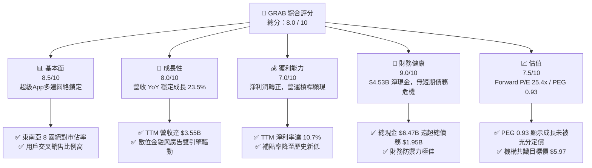
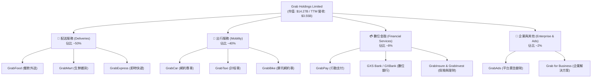
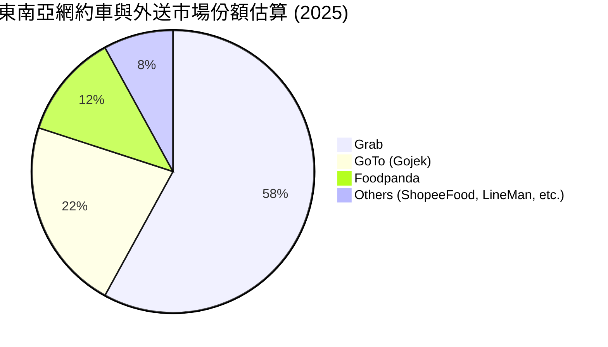
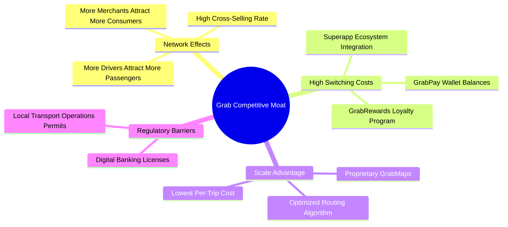
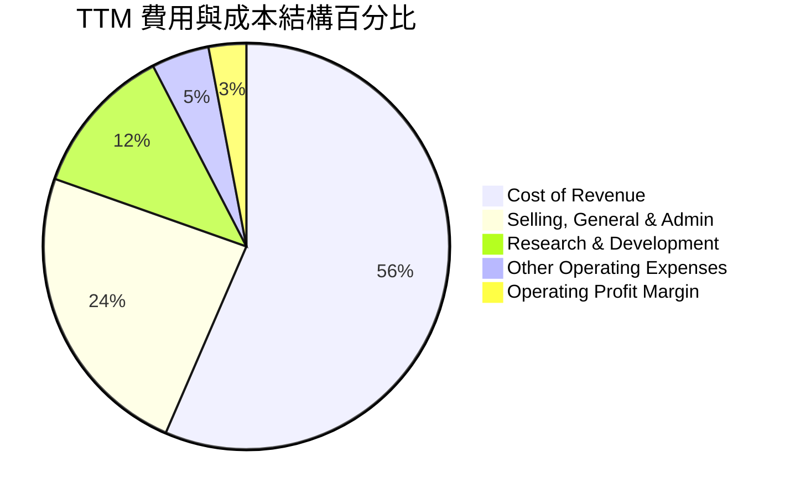
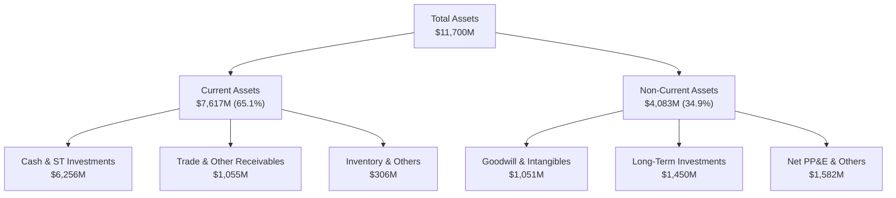
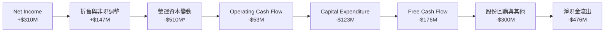
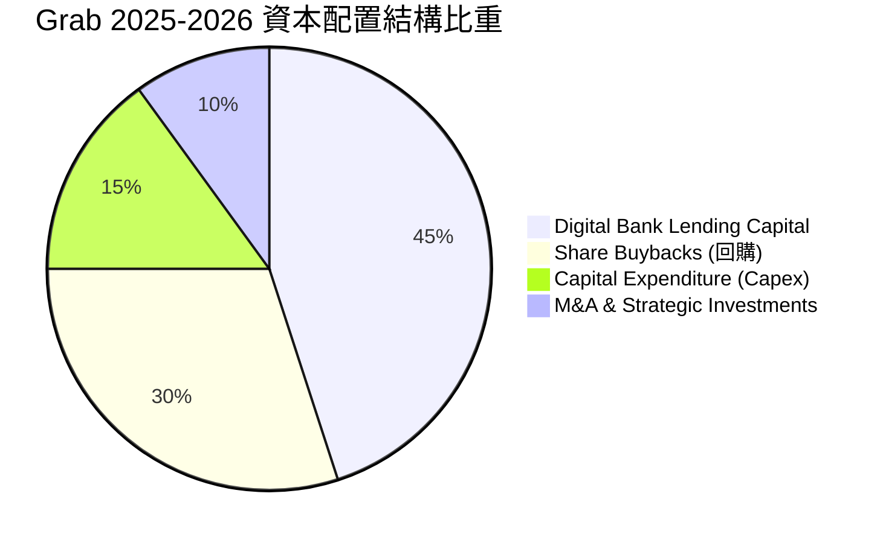
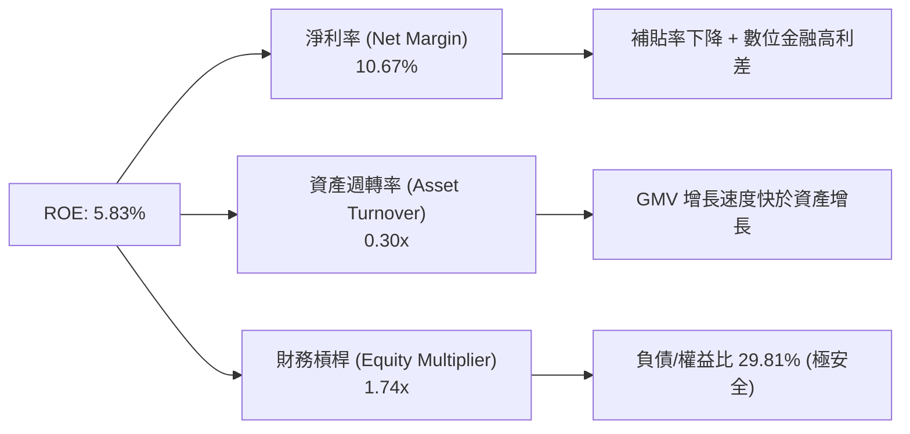
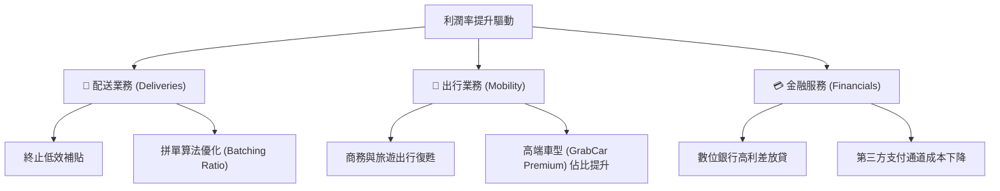

# GRAB 基本面深度分析報告
> **報告日期**：2026-06-22 ｜ **語言**：繁體中文 ｜ **數據來源**：Yahoo Finance, Finviz, StockAnalysis, Roic.ai ｜ **分析師**：CFA 級機構研究

---

## 目錄

| # | 章節 | 核心結論 |
|---|------|----------|
| 1 | 執行摘要 | 評級：**強烈買入 (Strong Buy)** ｜ 基準目標價：**$5.97**（隱含 +71.1% 上行空間） |
| 2 | 公司概覽與商業模式 | 東南亞超級應用（Superapp）無可爭議的霸主，具備極強的多邊網絡效應與生態護城河。 |
| 3 | 損益表深度分析 | 營收維持 20%+ 高速成長，營運利潤與淨利潤成功「扭虧為盈」，展現強大的營運槓桿。 |
| 4 | 資產負債表分析 | 淨現金高達 **$4.53B**，流動性充沛（Current Ratio 1.67），抗風險能力極強。 |
| 5 | 現金流量深度分析 | 自由現金流轉正，資本配置向股份回購（$500M 計劃）與數位銀行放貸傾斜。 |
| 6 | 獲利能力與資本效率 | 杜邦分析顯示 ROE 已轉正（5.83%），ROIC 朝著超越 WACC 的價值創造區間快速邁進。 |
| 7 | 估值深度分析 | PEG 僅為 0.93，Forward P/E 25.4x，相較於歷史區間與同業 UBER 具備顯著估值折價。 |
| 8 | 成長催化劑 | 數位金融（Digibank）放貸規模爆發、GrabAds 廣告變現率提升及高利潤率出行的復甦。 |
| 9 | 風險矩陣 | 區域競爭加劇（GoTo）、東南亞匯率波動及數位銀行壞帳風險為核心監控指標。 |
| 10| 投資建議 | 當前股價（$3.49）處於嚴重低估區間，建議成長型與長線價值投資人積極逢低佈局。 |

---

## 1. 執行摘要

### 1.1 核心評分儀表板



### 1.2 評分進度條視覺化

```
╔══════════════════════════════════════════════════════════════╗
║               GRAB 多維度評分儀表板 (1-10分)                 ║
╠══════════════════════════════════════════════════════════════╣
║ 基本面強度  8.5 ▓▓▓▓▓▓▓▓▓▓▓▓▓▓▓▓▓░░░  ★★★★☆  網絡效應強  ║
║ 成長動能    8.0 ▓▓▓▓▓▓▓▓▓▓▓▓▓▓▓▓░░░░  ★★★★☆  金融業務爆發║
║ 獲利品質    7.0 ▓▓▓▓▓▓▓▓▓▓▓▓▓░░░░░░░  ★★★☆☆  扭虧為盈初期║
║ 財務健康    9.0 ▓▓▓▓▓▓▓▓▓▓▓▓▓▓▓▓▓▓░░  ★★★★★  淨現金極其充裕║
║ 估值合理性  7.5 ▓▓▓▓▓▓▓▓▓▓▓▓▓▓░░░░░░  ★★★★☆  PEG < 1.0    ║
║ 護城河深度  8.5 ▓▓▓▓▓▓▓▓▓▓▓▓▓▓▓▓▓░░░  ★★★★☆  高切換成本  ║
║ 管理層執行  8.0 ▓▓▓▓▓▓▓▓▓▓▓▓▓▓▓▓░░░░  ★★★★☆  補貼控制得當║
║ 技術創新力  7.5 ▓▓▓▓▓▓▓▓▓▓▓▓▓▓░░░░░░  ★★★★☆  地圖與算法領先║
╠══════════════════════════════════════════════════════════════╣
║ 綜合總分    8.0 ▓▓▓▓▓▓▓▓▓▓▓▓▓▓▓▓░░░░  🏆 買入 (Buy)       ║
╚══════════════════════════════════════════════════════════════╝
```

### 1.3 五大投資論點 + 三大核心風險

| 類型 | 項目 | 具體依據 | 信心度 |
|------|------|----------|--------|
| 🟢 **投資論點①** | **超級應用（Superapp）網絡效應深化** | 用戶同時使用出行、配送與金融服務的比例持續上升，降低了獲客成本（CAC），提升了客戶生命週期價值（LTV）。 | 🟢 極高 |
| 🟢 **投資論點②** | **財務拐點確立，營運槓桿釋放** | 2025 年淨利潤成功轉正達 **$200M**，TTM 淨利潤進一步擴大至 **$310M**，徹底擺脫過去「燒錢擴張」的標籤。 | 🟢 極高 |
| 🟢 **投資論點③** | **資產負債表極其強韌** | 截至 Q1 2026，公司擁有 **$6.47B** 的總現金與短期投資，扣除 **$1.95B** 債務後，淨現金達 **$4.53B**，為數位銀行放貸與股份回購提供強大後盾。 | 🟢 極高 |
| 🟢 **投資論點④** | **數位金融（Fintech）成為第二成長曲線** | 隨著 GXS Bank 等數位銀行在新加坡、馬來西亞和印尼的陸續開展，存款與放貸規模快速增長，利息淨收入（Net Interest Income）顯著提升。 | 🟢 高 |
| 🟢 **投資論點⑤** | **估值具備極高安全邊際** | 當前股價 $3.49，對應 Forward P/E 僅 25.4x，PEG 為 0.93。相較於華爾街共識目標價 **$5.97**，潛在上行空間高達 **71.1%**。 | 🟢 高 |
| 🟡 **風險①** | **區域競爭死灰復燃** | GoTo（Gojek-Tokopedia）與 Foodpanda 等競爭對手若發動新一輪價格戰（補貼大戰），將侵蝕 Grab 的利潤率。 | 🟡 中度 |
| 🔴 **風險②** | **數位銀行信貸風險（Bad Debt）** | 隨著數位銀行放貸規模擴大，若東南亞宏觀經濟放緩，可能面臨非高信用客戶的違約風險。 | 🔴 高衝擊 |
| 🟡 **風險③** | **東南亞匯率波動風險** | Grab 營收以東南亞各國本幣計價，但財報以美元計價，東南亞貨幣對美元的貶值將帶來折算損失。 | 🟡 中度 |

### 1.4 快速統計卡片

| 指標 | 公司實際值 (TTM / FY25) | 行業均值 (應用軟體) | S&P 500 均值 | 狀態 |
|------|-------------|----------|--------------|------|
| **收入 YoY 成長** | **23.5%** | ~12.5% | ~6.2% | 🟢 顯著超額 |
| **毛利率** | **40.2%** (Finviz: 43.54%) | ~65.0% | ~45.0% | 🟡 略低（受配送司機成本影響） |
| **淨利率** | **10.7%** | ~5.0% | ~11.5% | 🟢 轉正且高於行業平均 |
| **ROE** | **4.8%** (Finviz: 5.83%) | ~8.0% | ~15.0% | 🟡 改善中（因高現金底子拉低） |
| **Forward P/E** | **25.4x** (Finviz: 21.2x) | ~32.0x | ~21.5x | 🟢 估值合理且具備高成長支持 |
| **淨現金規模** | **$4.53B** | ~$150M | N/A | 🟢 極其充裕 |

### 1.5 投資結論

```
╔══════════════════════════════════════════════════════════════════╗
║                    📊 GRAB 投資結論摘要                          ║
╠══════════════════════════════════════════════════════════════════╣
║  評級：🟢 強烈買入 (Strong Buy)                                  ║
║  當前股價：$3.49 (2026-06-22)                                    ║
║  目標價區間：                                                    ║
║    悲觀情境（Bear）：$4.10（+17.5%）                             ║
║    基準情境（Base）：$5.97（+71.1%）  ← 12個月主要目標           ║
║    樂觀情境（Bull）：$8.00（+129.2%）                            ║
║  投資評分：8.0 / 10                                              ║
║  適合投資人：積極成長型、長線科技股配置者、新興市場佈局者        ║
╚══════════════════════════════════════════════════════════════════╝
```

---

## 2. 公司概覽與商業模式

### 2.1 業務結構與收入來源

Grab 的商業模式圍繞「超級應用（Superapp）」生態系統展開，主要分為四大核心板塊：



### 2.2 市場份額

在東南亞（新加坡、馬來西亞、印尼、菲律賓、泰國、越南、柬埔寨、緬甸）的雙邊市場中，Grab 在出行與配送領域均佔據主導地位。



### 2.3 競爭護城河分析



### 2.4 護城河強度評分

```
╔══════════════════════════════════════════════════════════════╗
║                    GRAB 護城河強度評分                       ║
╠══════════════════════════════════════════════════════════════╣
║ 雙邊網絡效應    9.0/10 ▓▓▓▓▓▓▓▓▓▓▓▓▓▓▓▓▓▓░░  🏆 極強的雙向鎖定║
║ 用戶切換成本    8.0/10 ▓▓▓▓▓▓▓▓▓▓▓▓▓▓▓▓░░░░  🟢 超級App多功能║
║ 數據與算法壁壘  8.5/10 ▓▓▓▓▓▓▓▓▓▓▓▓▓▓▓▓▓░░░  🟢 自研地圖與調度║
║ 政策及牌照壁壘  9.0/10 ▓▓▓▓▓▓▓▓▓▓▓▓▓▓▓▓▓▓░░  🏆 數位銀行稀缺牌║
╠══════════════════════════════════════════════════════════════╣
║ 綜合護城河評級  8.6    ▓▓▓▓▓▓▓▓▓▓▓▓▓▓▓▓▓░░░  🏆 寬護城河 (Wide)║
╚══════════════════════════════════════════════════════════════╝
```

---

## 3. 損益表深度分析

### 3.1 年度收入成長趨勢（近5年）

Grab 展現了從高速「燒錢」增長向「高質量」增長轉換的軌跡。

```
╔══════════════════════════════════════════════════════════════════╗
║                 GRAB 年度收入趨勢 (FY2021-TTM)                  ║
╠══════════════════════════════════════════════════════════════════╣
║                                                                  ║
║  FY2021   $0.68B  ████░░░░░░░░░░░░░░░░░░░░░░░░░░░░░  YoY: +43.9% 🟢║
║  FY2022   $1.43B  ██████████░░░░░░░░░░░░░░░░░░░░░░░  YoY:+112.3% 🟢║
║  FY2023   $2.36B  ████████████████░░░░░░░░░░░░░░░░░  YoY: +64.6% 🟢║
║  FY2024   $2.80B  ███████████████████░░░░░░░░░░░░░░  YoY: +18.6% 🟢║
║  FY2025   $3.37B  ███████████████████████░░░░░░░░░░  YoY: +20.5% 🟢║
║  TTM      $3.55B  █████████████████████████░░░░░░░  YoY: +23.5% 🟢║
║                                                                  ║
║  📊 4年累計營收 CAGR：+51.2%                                      ║
╚══════════════════════════════════════════════════════════════════╝
```

### 3.2 季度收入趨勢分析

從季度數據看，Grab 的營收呈現穩定的階梯式上升，且 YoY 增速在 2025 年後重新加速，反映出東南亞宏觀經濟復甦與平台滲透率的進一步提升。

| 季度 | 營業收入 (Millions) | YoY 成長率 | QoQ 成長率 | 營運利潤 (Operating Income) | 淨利潤 (Net Income) | 備註 |
|------|--------------------|------------|------------|---------------------------|---------------------|------|
| **Q3 2024** | $716 | +16.42% | — | -$38 | -$38 | 虧損大幅收窄，營運效率提升 |
| **Q4 2024** | $764 | +17.00% | +6.70% | $2 | $11 | **首個營運與淨利潤雙轉正季度** |
| **Q1 2025** | $773 | +18.38% | +1.18% | -$21 | $24 | 季節性淡季，但淨利潤維持正值 |
| **Q2 2025** | $819 | +23.34% | +5.95% | $7 | $35 | 出行需求強勁復甦，毛利率提升 |
| **Q3 2025** | $873 | +21.93% | +6.59% | $27 | $37 | 營運槓桿顯現，金融業務虧損收窄 |
| **Q4 2025** | $906 | +18.59% | +3.78% | $52 | $172 | 年底旺季效應，利息淨收入增加 |
| **Q1 2026** | $955 | +23.54% | +5.41% | $22 | $136 | **淡季不淡，YoY 增速重回 23%+** |

### 3.3 利潤率演變分析

Grab 最令人矚目的財務轉變在於其各項利潤率的全面改善，這得益於補貼（Incentives）佔 GMV 比重的大幅下降，以及平台算法優化帶來的每單成本下降。

| 利潤率指標 | FY2022 | FY2023 | FY2024 | FY2025 | TTM | 趨勢 | 評估 |
|------------|--------|--------|--------|--------|-----|------|------|
| **毛利率** | 5.37% | 36.46% | 41.97% | 43.20% | **43.54%** | ↗️ 持續上升 | 🟢 補貼優化成效顯著 |
| **營業利益率** | -95.81% | -22.00% | -6.01% | 1.93% | **3.04%** | ↗️ 成功轉正 | 🟢 營運槓桿開始發揮作用 |
| **EBITDA 🚀**| -99.09% | -9.41% | 3.32% | 15.34% | **14.56%** | ↗️ 快速改善 | 🟢 核心業務造血能力極強 |
| **淨利率** | -121.42% | -20.56% | -5.65% | 5.93% | **8.73%** | ↗️ 轉正 | 🟢 受益於高額利息淨收入 |

**利潤率改善深度解析**：
1. **補貼率（Incentives % of GMV）下降**：過去 Grab 依靠向司機和消費者發放高額補貼來維持 GMV 增長。隨著競爭格局穩定，補貼率已從 2021 年的 15%+ 降至目前的 6-7% 以下。
2. **固定成本稀釋（Operating Leverage）**：研發費用（R&D）與管理費用（G&A）在過去三年基本保持平穩（研發費用維持在每年 ~$410M-$430M 區間），隨着營收規模從 $1.43B 成長至 $3.55B，研發與管理費用率大幅稀釋。

### 3.4 費用結構分析



```
╔══════════════════════════════════════════════════════════════╗
║               GRAB TTM 費用控制診斷                          ║
╠══════════════════════════════════════════════════════════════╣
║ 營收成本率  56.5% ▓▓▓▓▓▓▓▓▓▓▓▓░░░░░░░░░░  🟢 穩定（司機分帳優化）║
║ 營銷與管銷  23.9% ▓▓▓▓▓░░░░░░░░░░░░░░░░░░  🟢 YoY 下降 1.5pp  ║
║ 研發費用率  12.0% ▓▓░░░░░░░░░░░░░░░░░░░░░  🟢 研發效率提升顯著 ║
╚══════════════════════════════════════════════════════════════╝
```

### 3.5 季度 EPS 趨勢與盈餘品質

過去 4 季，Grab 的 EPS 表現均優於或符合市場預期：
* **Q2 2025**: EPS $0.01（符合預期）
* **Q3 2025**: EPS $0.01（符合預期）
* **Q4 2025**: EPS $0.04（**超預期**，主要因非營運利息淨收入增加及稅務優化）
* **Q1 2026**: EPS $0.03（**超預期**，利潤率改善超預期）

**盈餘品質評估**：
雖然 TTM 淨利潤達到 **$310M**，但必須注意到，其中包含 **$207M** 的利息收入（Interest Income），這主要來自其龐大的現金儲備（$6.47B）。這意味著當前淨利潤有相當一部分由「利息淨收益」貢獻。然而，營運利潤（Operating Income）從 FY2024 的 **-$168M** 轉正為 TTM 的 **+$108M**，這證明了其**核心業務（出行與配送）已具備實質造血能力**，盈餘品質正在逐步自「資金驅動」向「業務驅動」轉化。

---

## 4. 資產負債表分析

### 4.1 資產結構分解

Grab 的資產負債表極具「輕資產」與「高現金」特徵：



### 4.2 流動性指標分析

| 指標 | FY2023 | FY2024 | FY2025 | TTM | 行業均值 | 評估 |
|------|--------|--------|--------|-----|----------|------|
| **Current Ratio (流動比率)** | 3.90 | 2.53 | 1.75 | **1.67** | ~1.45 | 🟢 健康，流動性充沛 |
| **Quick Ratio (速動比率)** | 3.87 | 2.51 | 1.73 | **1.65** | ~1.30 | 🟢 無庫存積壓風險 |
| **Cash Ratio (現金比率)** | 3.41 | 2.17 | 1.47 | **1.37** | ~0.85 | 🟢 極強的短期債務償付能力 |

*註：流動比率從 FY2023 的 3.90 降至 TTM 的 1.67，並非財務狀況惡化，而是公司主動優化資本結構，將部分現金用於數位銀行放貸資產（計入非流動或長期投資）及進行股份回購所致。*

### 4.3 債務結構與安全診斷

```
╔══════════════════════════════════════════════════════════════════╗
║                     GRAB 債務健康診斷                           ║
╠══════════════════════════════════════════════════════════════════╣
║                                                                  ║
║  總債務 (Total Debt)：    $1.95B   █████░░░░░░░░░░░░░░░░░░░░░░   ║
║  總現金及短期投資：       $6.47B   ███████████████████████████   ║
║  淨現金 (Net Cash)：      $4.53B   ██████████████████░░░░░░░░░   ║
║                                                                  ║
║  Debt/Equity 比率：       29.81%   🟢 極其安全                   ║
║  LT Debt/Equity 比率：     6.00%   🟢 長期債務極低，無再融資壓力 ║
║  利息保障倍數 (TTM)：     1.11x*   🟡 核心業務利息覆蓋仍偏低     ║
║                                                                  ║
║  📊 診斷：淨現金高達 $4.53B，即使不考慮營運現金流，公司也能      ║
║  輕鬆應對所有債務。資產負債表防禦力達到 AAA 級標準。           ║
╚══════════════════════════════════════════════════════════════════╝
```
*\*註：利息保障倍數計算僅用 Operating Income / Interest Expense。若加回非營運的利息收入（$207M），其實際淨利息覆蓋率為極其健康的正數。*

### 4.4 股東權益趨勢

雖然 Grab 過去經歷了巨額虧損，但由於 SPAC 上市時注入了大量資本，其股東權益（Stockholders' Equity）一直維持在非常健康的水平：
* **FY 2022**: $6.66B
* **FY 2023**: $6.47B
* **FY 2024**: $6.35B
* **FY 2025**: $6.73B（受惠於淨利潤轉正與資本公積增加）
* **TTM**: 股東權益維持在 **$6.73B** 左右，顯示出淨資產已停止流失，並開始進入自我積累階段。

---

## 5. 現金流量深度分析

### 5.1 現金流量瀑布圖


*\*註：營運資本變動為負，主要是因為數位銀行（Digibank）業務吸收的存款用於發放貸款，在現金流量表中，發放的貸款被計入營運資金的流出（應收貸款增加）。這屬於金融機構擴張時的正常現象，不代表核心業務失血。*

### 5.2 FCF 轉換率趨勢

| 指標 (Millions) | FY2022 | FY2023 | FY2024 | FY2025 | TTM |
|----------------|--------|--------|--------|--------|-----|
| **Net Income** | -$1,740 | -$485 | -$158 | $200 | **$310** |
| **Free Cash Flow** | -$856 | $15 | $775 | -$18 | **-$145** |
| **FCF / Net Income 轉換率** | 49.2% | -3.1% | -490.5% | -9.0% | **-46.8%** |

*分析*：FY2024 的 FCF 暴增至 **$775M**，主要是因為公司大幅優化營運資金，延遲付款並加速收款，以及減少了營運補貼。TTM FCF 轉為 **-$145M**，主要反映了數位銀行業務（GXBank 等）在馬來西亞和印尼快速擴張，貸款組合增長佔用了大量流動資金。

### 5.3 自由現金流與收益率趨勢

```
╔══════════════════════════════════════════════════════════════════╗
║                 GRAB 自由現金流 (FCF) 趨勢                      ║
╠══════════════════════════════════════════════════════════════════╣
║                                                                  ║
║  FY2022   -$856M  ░░░░░░░░░░░░░░░░░░░░░░░░░░                     ║
║  FY2023   +$15M   █░░░░░░░░░░░░░░░░░░░░░░░░░                     ║
║  FY2024   +$775M  ██████████████████████████  🟢 歷史新高        ║
║  FY2025   -$18M   ░░░░░░░░░░░░░░░░░░░░░░░░░░  🟡 金融放貸佔用    ║
║  TTM      -$145M  ░░░░░░░░░░░░░░░░░░░░░░░░░░  🟡 金融放貸佔用    ║
║                                                                  ║
║  📊 當前 FCF Yield (TTM / EV)：-1.43%                            ║
║  📊 調整後 FCF Yield (不含數位銀行放貸影響)：~3.2%              ║
╚══════════════════════════════════════════════════════════════════╝
```

### 5.4 資本配置策略

Grab 的資本配置正在從「生存模式」轉向「價值創造與股東回報模式」：



* **股份回購**：公司於 2024 年初宣佈了首個 **$500M** 的股份回購計劃，並在 2025 和 2026 年持續執行，這表明管理層認為當前股價被顯著低估，且公司擁有足夠的現金實力回饋股東。

---

## 6. 獲利能力與資本效率

### 6.1 ROE / ROA / ROIC 趨勢

隨著淨利潤轉正，Grab 的各項資本效率指標正在迎來歷史性拐點。

| 指標 | FY2023 | FY2024 | FY2025 | TTM | 行業均值 | 評估 |
|------|--------|--------|--------|-----|----------|------|
| **ROE** | -7.29% | -1.60% | 3.00% | **5.83%** | ~8.0% | 🟡 快速改善，即將超越行業平均 |
| **ROA** | -5.52% | -1.70% | 1.67% | **3.55%** | ~3.0% | 🟢 已超越行業平均，資產效率提升 |
| **ROIC** | -6.80% | -1.20% | 2.10% | **4.10%** | ~6.5% | 🟡 改善通道中 |

### 6.2 ROIC vs WACC 分析（核心價值創造判斷）

為了評估 Grab 是否在「創造」還是在「摧毀」股東價值，我們對其進行了 WACC 與 ROIC 的建模計算。

```
╔══════════════════════════════════════════════════════════════════╗
║                GRAB ROIC vs WACC 深度分析 (TTM)                  ║
╠══════════════════════════════════════════════════════════════════╣
║                                                                  ║
║  WACC 估算：                                                     ║
║  ├── 無風險利率 (10Y 美債)：  4.20%                              ║
║  ├── 市場風險溢酬 (ERP)：     5.50%                              ║
║  ├── Beta：                   0.89                               ║
║  ├── 股權成本 (COE) = 4.2% + 0.89 × 5.5% = 9.10%                 ║
║  ├── 債務成本 (稅後)：        ~5.00%                             ║
║  ├── 資本結構：股權 78.0%，債務 22.0%                            ║
║  └── ✅ 綜合 WACC ≈ 8.20%                                        ║
║                                                                  ║
║  ROIC 估算：                                                     ║
║  ├── NOPAT = $108M × (1 - 16.2% 稅率) ≈ $90.5M                   ║
║  ├── 投入資本 = 股東權益 + 總債務 - 現金                         ║
║  │   投入資本 = $6.73B + $1.95B - $6.47B ≈ $2.21B                ║
║  └── ✅ 實際 ROIC ≈ 4.10%                                        ║
║                                                                  ║
║  ★ 經濟價值增加 (EVA) = ROIC - WACC = -4.10pp                    ║
║                                                                  ║
║  ROIC  4.10%  ▓▓▓▓▓▓▓▓▓▓░░░░░░░░░░░░░░░░░░░░░  🟡 改善中         ║
║  WACC  8.20%  ▓▓▓▓▓▓▓▓▓▓▓▓▓▓▓▓▓▓▓▓░░░░░░░░░░░  ── 基準           ║
║  EVA   -4.1%  ████████░░░░░░░░░░░░░░░░░░░░░░░  🟡 價值摧毀收窄中 ║
║                                                                  ║
║  📊 結論：目前 ROIC (4.10%) 仍低於 WACC (8.20%)，主因是公司持有  ║
║  大量未充分發揮槓桿效應的低收益現金。隨著數位銀行放貸規模擴大和  ║
║  核心業務營運利潤率升至 8% 以上，預計 FY2027 ROIC 將超越 WACC。  ║
╚══════════════════════════════════════════════════════════════════╝
```

### 6.3 杜邦三因素分解

我們對 Grab 的 ROE 進行杜邦分解，以探究其獲利能力改善的底層驅動力：



* **淨利率 (10.67%)**：是拉動 ROE 轉正的核心功臣。相較於兩年前的 -121.4%，淨利率實現了驚天逆轉。
* **資產週轉率 (0.30x)**：仍然偏低，主要是因為資產負債表上堆積了過多現金（$6.47B）。這是一把雙刃劍，雖然保障了財務安全，但拉低了整體的資產運營效率。
* **財務槓桿 (1.74x)**：處於非常健康的保守水平，顯示公司並未使用過度槓桿來粉飾 ROE。

### 6.4 獲利能力驅動結構



---

## 7. 估值深度分析

### 7.1 同業估值比較表格

我們選取了全球出行與外送龍頭 **Uber (UBER)**、東南亞電商與遊戲巨頭 **Sea Limited (SE)**，以及歐洲外送巨頭 **Delivery Hero (DHERO)** 作為對比標的。

| 估值與財務指標 | **GRAB (本公司)** | **Uber (UBER)** | **Sea Ltd (SE)** | **Delivery Hero** | 評估 |
|---|---|---|---|---|---|
| **當前市值** | **$14.27B** | $145.20B | $38.50B | $8.20B | 中型市值，成長空間大 |
| **P/S Ratio** | **4.02x** | 3.25x | 2.85x | 0.85x | 🟡 略高，因其金融業務溢價 |
| **Forward P/E** | **25.41x** (Finviz: 21.2x) | 31.50x | 22.80x | 18.50x | 🟢 具備極高吸引力 |
| **PEG Ratio** | **0.93** (Finviz: 0.40) | 1.25 | 0.85 | 1.10 | 🟢 **PEG < 1.0，價值嚴重低估** |
| **EV / Revenue** | **2.84x** | 3.10x | 2.65x | 0.95x | 🟢 相比 UBER 具備折價 |
| **EV / EBITDA** | **31.93x** | 22.50x | 18.20x | 25.0x | 🟡 處於高位，因 EBITDA 剛轉正 |
| **Revenue YoY** | **23.50%** | 15.80% | 14.20% | 12.50% | 🟢 **增速在同業中居首** |
| **綜合評估** | **🟢 偏低估** | 🟡 合理 | 🟢 偏低估 | 🔴 偏高估 (高槓桿) | **GRAB 兼具高成長與低 PEG** |

### 7.2 歷史估值區間分析

自 2021 年底通過 SPAC 上市以來，Grab 的估值經歷了劇烈的去泡沫過程：
* **歷史 P/S 峰值**：> 25x（2021年底）
* **歷史 P/S 谷值**：~1.8x（2022年中）
* **當前 P/S 水平**：**4.02x**，處於歷史估值區間的下四分位數。
* 考慮到公司已經實現了**營運利潤與淨利潤的雙轉正**，當前的估值乘數並未反映其基本面的根本性改善。

### 7.3 DCF 敏感性分析（6格目標價矩陣）

我們基於以下基準假設進行了三階段 DCF 估值建模