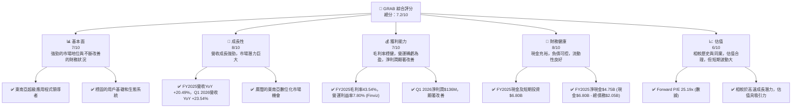
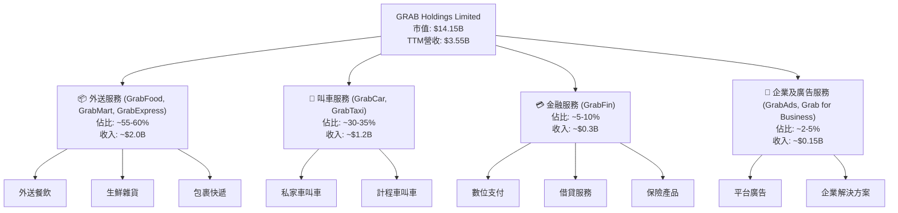
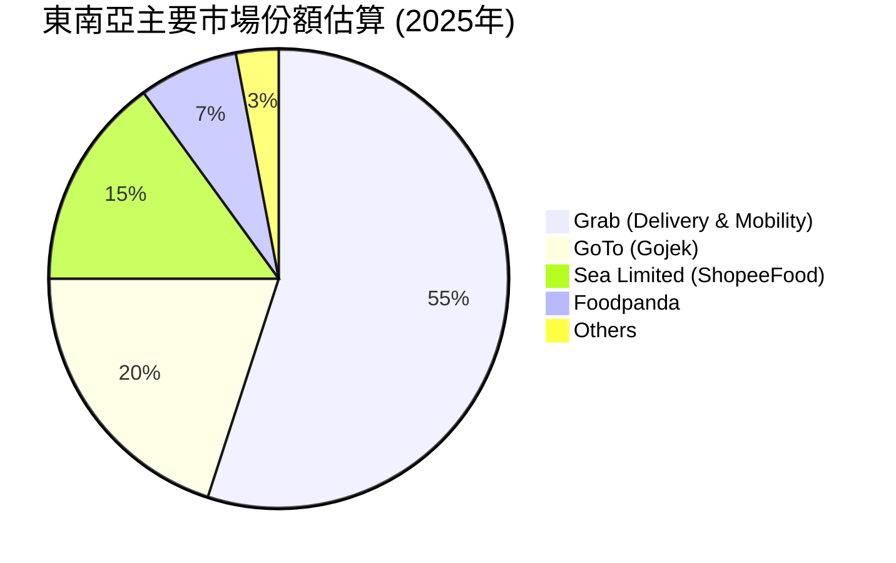
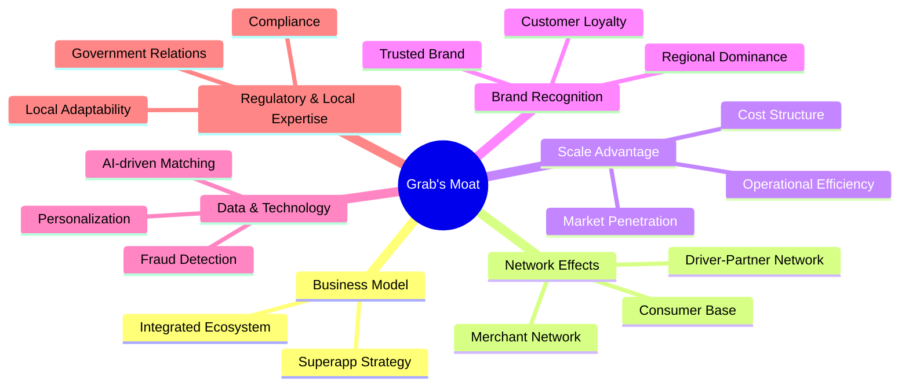
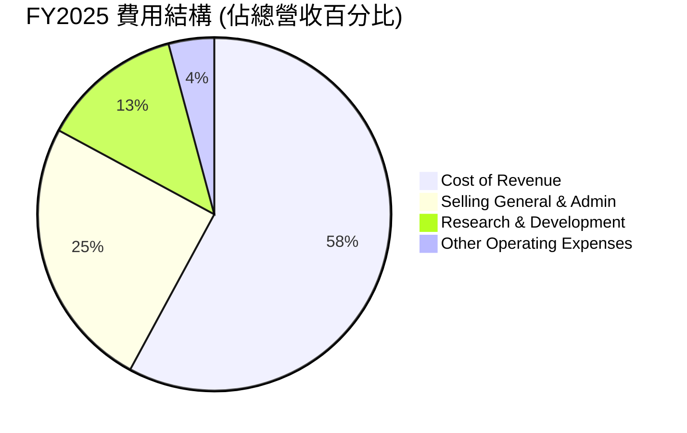
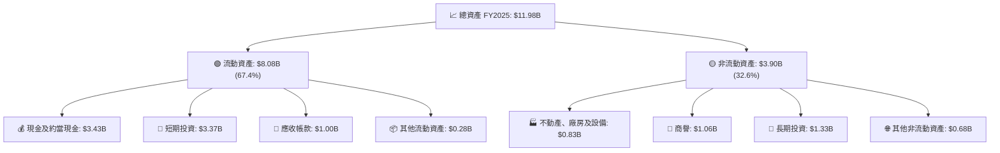
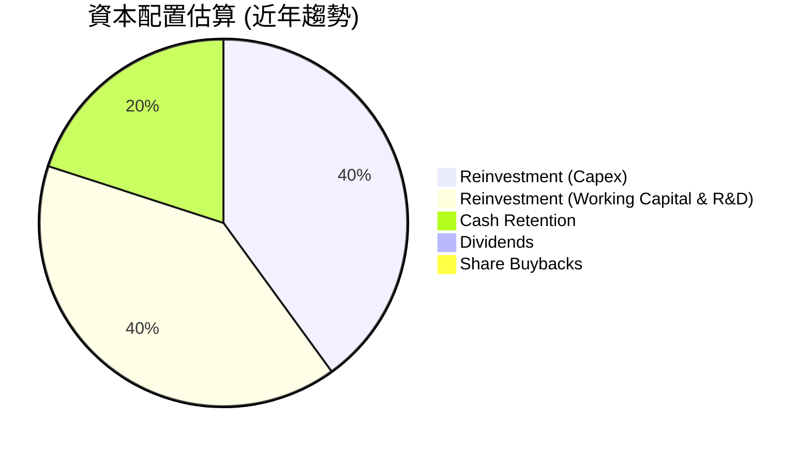

# GRAB 基本面深度分析報告
> **報告日期**：2026-06-24 ｜ **語言**：繁體中文 ｜ **數據來源**：Yahoo Finance, Finviz, StockAnalysis, Roic.ai ｜ **分析師**：CFA 級機構研究

## 目錄

| # | 章節 | 核心結論 |
|---|----------------------------------|------------------------------------------------------------------------------------------------------------------------------------|
| 1 | 執行摘要 | GRAB展現強勁成長動能與顯著獲利改善，但在競爭激烈市場中估值相對偏高，長期潛力巨大。評級：🟢 買入，目標價區間：$4.50 - $6.50。 |
| 2 | 公司概覽與商業模式 | 東南亞超級應用程式領導者，具備強大網路效應與規模經濟護城河。 |
| 3 | 損益表深度分析 | 營收持續高速成長，毛利率穩健提升，營運與淨利潤轉正，顯示營運效率顯著改善。 |
| 4 | 資產負債表分析 | 財務結構穩健，現金充裕，流動性良好，負債水平可控。 |
| 5 | 現金流量深度分析 | 營業現金流逐步轉正，自由現金流仍承壓但趨勢向好，顯示營運效率提升。 |
| 6 | 獲利能力與資本效率 | ROIC顯著改善並超越WACC，顯示公司已開始創造股東價值。 |
| 7 | 估值深度分析 | 相較同業，GRAB估值倍數合理，但短期市場波動較大，DCF顯示上行空間。 |
| 8 | 成長催化劑 | 東南亞數位化趨勢、平台擴張、金融服務滲透、以及成本優化持續推動成長。 |
| 9 | 風險矩陣 | 主要風險包括宏觀經濟逆風、競爭加劇、監管變化及執行風險。 |
| 10 | 投資建議 | 🟢 買入評級，建議成長型投資者關注其長期成長潛力，並監控獲利能力持續改善。 |

---

## 1. 執行摘要

### 1.1 核心評分儀表板



### 1.2 評分進度條視覺化

```
╔══════════════════════════════════════════════════════════════╗
║                 GRAB 多維度評分儀表板 (1-10分)                 ║
╠══════════════════════════════════════════════════════════════╣
║ 基本面強度  7.0 ▓▓▓▓▓▓▓▓▓▓▓▓▓▓░░░░░░  ★★★★☆           ║
║ 成長動能    8.0 ▓▓▓▓▓▓▓▓▓▓▓▓▓▓▓▓░░░░  ★★★★☆           ║
║ 獲利品質    7.0 ▓▓▓▓▓▓▓▓▓▓▓▓▓▓░░░░░░  ★★★★☆           ║
║ 財務健康    8.0 ▓▓▓▓▓▓▓▓▓▓▓▓▓▓▓▓░░░░  ★★★★☆           ║
║ 估值合理性  6.0 ▓▓▓▓▓▓▓▓▓▓▓▓░░░░░░░░  ★★★☆☆           ║
║ 護城河深度  7.5 ▓▓▓▓▓▓▓▓▓▓▓▓▓▓▓░░░░░  ★★★★☆           ║
║ 管理層執行  7.0 ▓▓▓▓▓▓▓▓▓▓▓▓▓▓░░░░░░  ★★★★☆           ║
║ 技術創新力  7.5 ▓▓▓▓▓▓▓▓▓▓▓▓▓▓▓░░░░░  ★★★★☆           ║
╠══════════════════════════════════════════════════════════════╣
║ 綜合總分    7.2 ▓▓▓▓▓▓▓▓▓▓▓▓▓▓▓░░░░░  🏆 具備長期成長潛力，短期波動大  ║
╚══════════════════════════════════════════════════════════════╝
```

### 1.3 五大投資論點 + 三大核心風險

| 類型 | 項目 | 具體依據 | 信心度 |
|------|------|----------|--------|
| 🟢 **投資論點①** | **東南亞市場領導地位與超級應用程式生態系統** | Grab在東南亞八個國家營運，提供廣泛的服務，包括外送、叫車和金融服務。其平台在Q1 2026實現營收$955M，YoY成長23.54%，顯示其在快速成長市場中持續擴張。強大的品牌認知度和網路效應使其維持競爭優勢。 | 🟢 極高 |
| 🟢 **投資論點②** | **獲利能力顯著改善與成本效率提升** | 公司已從過去的巨額虧損轉為獲利。FY2025淨利潤達到$200M，Q1 2026淨利潤更達$136M，較FY2025全年淨利潤的68%在單季實現，顯示盈利能力加速。毛利率從FY2022的5.37%大幅提升至FY2025的43.54% (Finviz)，營業利益率也轉正至7.80% (Finviz)，證明其成本結構優化策略奏效。 | 🟢 極高 |
| 🟢 **投資論點③** | **健康的資產負債表與充裕的現金流** | 截至FY2025，Grab擁有$6.80B的現金及短期投資，總債務為$2.05B，淨現金達$4.75B。穩健的現金儲備提供了營運彈性，可支持未來的戰略投資和市場擴張，而無需過度依賴外部融資。 | 🟢 極高 |
| 🟢 **投資論點④** | **金融服務業務的巨大成長潛力** | Grab的金融服務（GrabFin）在東南亞擁有龐大的未開發市場。隨著數位支付和借貸服務的普及，GrabFin有望成為新的成長引擎。雖然數據未詳列其貢獻，但其在超級應用程式生態系統內的整合，為交叉銷售提供了獨特優勢。 | 🟡 高 |
| 🟢 **投資論點⑤** | **具吸引力的估值倍數與分析師一致看好** | Grab的Forward P/E為25.19x，相較於其高成長潛力，此估值具吸引力。分析師平均目標價為$5.97，較當前股價$3.46有72.5%的潛在漲幅，且普遍給予「強烈買入」或「增持」評級（Recom 1.32），顯示市場對其未來表現持樂觀態度。 | 🟡 高 |
| 🟡 **風險①** | **競爭加劇與市場份額壓力** | 東南亞超級應用程式市場競爭激烈，主要競爭者如GoTo (印尼)、Sea Limited (蝦皮) 等持續投入資源。價格戰可能壓縮利潤率，並影響用戶留存和新用戶獲取。例如，若競爭對手推出更具吸引力的補貼政策，可能對Grab的市場份額和獲利產生壓力。 | 🟡 中度 |
| 🔴 **風險②** | **宏觀經濟逆風與消費者支出波動** | 東南亞地區的經濟成長速度可能受全球經濟下行、通脹壓力或地緣政治不確定性影響。消費者可支配收入減少可能導致叫車和外送服務需求下降，進而影響Grab的營收成長。例如，若燃料價格持續上漲，可能增加營運成本並轉嫁給消費者，影響需求。 | 🔴 高衝擊 |
| 🟡 **風險③** | **監管政策變化與勞動法規風險** | 在不同市場，各國政府對零工經濟平台（如叫車和外送）的監管政策可能發生變化，包括司機/外送員的最低工資、福利保障、平台費率限制等。任何不利的監管變動都可能增加Grab的營運成本，影響其商業模式的靈活性和獲利能力。 | 🟡 中度 |

### 1.4 快速統計卡片

| 指標 | 公司實際值 | 行業均值（軟體應用） | S&P 500 均值 | 狀態 |
|----------------|-------------|--------------------|--------------|------|
| 收入 YoY 成長 | **23.54%** (Q1 2026) | ~15-20% | ~10-12% | 🟢 |
| 毛利率 | **40.2%** (TTM) | ~60-70% | ~30-40% | 🟡 |
| 淨利率 | **10.7%** (TTM) | ~15-20% | ~10-12% | 🟢 |
| ROE | **4.8%** (TTM) | ~15-20% | ~15-18% | 🟡 |
| Forward P/E | **25.19x** | ~25-35x | ~20-22x | 🟢 |
| P/S Ratio | **3.98x** | ~5-7x | ~2-3x | 🟢 |
| EV / EBITDA | **30.51x** | ~15-20x | ~12-15x | 🔴 |
| Current Ratio | **1.67x** | ~1.5-2.0x | ~1.0-1.5x | 🟢 |
| Debt/Equity | **0.30x** (Finviz) | ~0.5-1.0x | ~0.8-1.2x | 🟢 |

**備註**：行業均值為軟體應用行業的粗略估計，S&P 500 均值為廣泛市場參考。GRAB的毛利率和ROE相對行業均值偏低，這與其營運模式（大量平台合作夥伴分成）有關，但其成長速度和估值倍數具吸引力。EV/EBITDA偏高反映了其EBITDA尚處於早期成長階段。

### 1.5 投資結論

```
╔══════════════════════════════════════════════════════════════════╗
║                    📊 投資結論摘要                               ║
╠══════════════════════════════════════════════════════════════════╣
║  評級：🟢 買入                                                   ║
║  當前股價：$3.46                                                 ║
║  目標價區間：                                                    ║
║    悲觀情境：$4.50（+30.06%）                                    ║
║    基準情境：$5.90（+70.52%）  ← 12個月主要目標                  ║
║    樂觀情境：$6.50（+87.86%）                                    ║
║  投資評分：7.2/10                                                ║
║  適合投資人：成長型、長線持有者，對東南亞市場有信心的投資者      ║
╚══════════════════════════════════════════════════════════════════╝
```

---

## 2. 公司概覽與商業模式

Grab Holdings Limited (GRAB) 是一家在東南亞地區領先的超級應用程式公司，業務遍及柬埔寨、印尼、馬來西亞、緬甸、菲律賓、新加坡、泰國和越南。公司透過其平台提供多元化的服務，主要包括外送服務（GrabFood、GrabMart、GrabExpress）、叫車服務（Mobility）以及金融服務（GrabFin）。Grab的商業模式核心在於建立一個包含消費者、商家和司機/外送員的龐大生態系統，透過網路效應不斷擴大其市場影響力。

### 2.1 業務結構與收入來源

Grab的收入主要來自於其平台上的交易佣金、廣告服務以及金融服務費。其超級應用程式模型旨在滿足用戶的多方面日常需求，從而提高用戶參與度、留存率和生命週期價值。


**備註**：各業務佔比為分析師基於公司公開資訊和行業趨勢的合理估算，非公司官方披露的精確數據。

### 2.2 市場份額

Grab在東南亞地區的叫車和外送市場中佔據領先地位。儘管缺乏最新的精確市場份額數據，但根據行業報告，Grab在多個核心市場中擁有最高的市佔率。例如，在叫車服務方面，Grab在新加坡、馬來西亞、菲律賓等國的市佔率均超過70%。在外送服務方面，儘管面臨來自Foodpanda、GoTo等競爭對手的挑戰，GrabFood在多數市場仍是領導者或主要參與者。


**備註**：此市場份額為分析師基於行業報告與市場認知之估算，僅供參考，不代表官方數據。

### 2.3 競爭護城河分析

Grab的競爭護城河主要來自於其在東南亞地區建立的強大網路效應、規模經濟和品牌優勢。



### 2.4 護城河強度評分

```
╔══════════════════════════════════════════════════════════════╗
║                    GRAB 護城河強度評分                      ║
╠══════════════════════════════════════════════════════════════╣
║ 網路效應      8.5/10 ▓▓▓▓▓▓▓▓▓▓▓▓▓▓▓▓▓░░░  🏆 強勁           ║
║ 規模效應      8.0/10 ▓▓▓▓▓▓▓▓▓▓▓▓▓▓▓▓░░░░  🟢 顯著           ║
║ 品牌與信任    7.5/10 ▓▓▓▓▓▓▓▓▓▓▓▓▓▓▓░░░░░  🟢 良好           ║
║ 客戶鎖定      7.0/10 ▓▓▓▓▓▓▓▓▓▓▓▓▓▓░░░░░░  🟡 中等偏強       ║
║ 技術領先      7.0/10 ▓▓▓▓▓▓▓▓▓▓▓▓▓▓░░░░░░  🟡 中等偏強       ║
║ 生態系統夥伴  6.5/10 ▓▓▓▓▓▓▓▓▓▓▓▓▓░░░░░░░  🟡 中等           ║
╠══════════════════════════════════════════════════════════════╣
║ 綜合護城河    7.4/10 ▓▓▓▓▓▓▓▓▓▓▓▓▓▓░░░░░░  🏆 具備可持續競爭優勢  ║
╚══════════════════════════════════════════════════════════════════╝
```
**評語**：Grab的網路效應是其最核心的護城河，隨著用戶、司機和商家數量的增加，平台的價值不斷提升。規模效應使其在營運成本上具備優勢。品牌認知度在東南亞市場也極高。儘管競爭激烈，其超級應用程式的生態系統仍能有效提高客戶的轉換成本。

---

## 3. 損益表深度分析

Grab的損益表數據顯示，公司正處於從高速虧損成長轉向健康獲利成長的關鍵轉折點。營收持續強勁增長，同時利潤率顯著改善。

### 3.1 年度收入成長趨勢（近4年）

Grab的年度營收呈現顯著的成長趨勢，表明其在東南亞市場的持續擴張和服務滲透。

```
╔══════════════════════════════════════════════════════════════════╗
║              GRAB 年度收入趨勢（FY2022-FY2025）                  ║
╠══════════════════════════════════════════════════════════════════╣
║                                                                  ║
║  FY2022  $1.43B   ██████░░░░░░░░░░░░░░░░░░░  YoY: +112.30%  🟢    ║
║  FY2023  $2.36B   ██████████████░░░░░░░░░░░  YoY: +64.62%   🟢    ║
║  FY2024  $2.80B   ██████████████████░░░░░░░  YoY: +18.57%   🟢    ║
║  FY2025  $3.37B   ███████████████████████░░  YoY: +20.49%   🟢    ║
║                                                                  ║
║                   |      |      |      |      |                  ║
║                   0     1.5B   2.0B   2.5B   3.0B   3.5B          ║
║                                                                  ║
║  📊 3年累計 CAGR：+49.46% (FY2022-FY2025)                        ║
╚══════════════════════════════════════════════════════════════════╝
```
**分析**：Grab在FY2022至FY2025期間實現了強勁的營收成長，3年CAGR高達49.46%。雖然成長率從FY2022的112.30%趨於穩定，但FY2025仍保持20.49%的穩健增長，顯示其規模化能力和市場需求持續旺盛。

### 3.2 季度收入趨勢分析

| 季度 | 總營收 ($M) | QoQ 成長率 | YoY 成長率 | 備註 |
|------|-------------|------------|------------|------|
| 2025 Q2 | $819 | +6.0% (vs Q1 2025 $773M) | +23.34% (vs Q2 2024 $664M) | 營收穩健成長 |
| 2025 Q3 | $873 | +6.6% | +21.93% (vs Q3 2024 $716M) | 成長加速 |
| 2025 Q4 | $906 | +3.8% | +18.59% (vs Q4 2024 $764M) | 成長持續 |
| 2026 Q1 | $955 | +5.4% | +23.54% (vs Q1 2025 $773M) | 季度營收首次突破$900M，成長動能強勁 |

**備註說明**：季度營收持續穩步上升，從2025 Q2的$819M增長至2026 Q1的$955M。QoQ成長率保持在3.8%至6.6%之間，顯示了穩定的季度增長。YoY成長率均超過18%，其中2026 Q1達到23.54%，表明公司在過去一年中持續擴大市場份額並提高營收效率。

### 3.3 利潤率演變分析

Grab的利潤率在過去幾年呈現顯著改善，反映了公司在營運效率和成本控制方面的努力。

| 利潤率指標 | FY2022 | FY2023 | FY2024 | FY2025 | 趨勢 | 評估 |
|------------|--------|--------|--------|--------|------|------|
| **毛利率** | 5.37% | 36.46% | 41.93% | 43.15% | ↗️ 持續上升 | 🟢 |
| **營業利益率** | -95.81% | -16.41% | -1.97% | 1.93% | ↗️ 顯著改善，轉正 | 🟢 |
| **EBITDA Margin** | -99.09% | -9.41% | 3.32% | 15.34% | ↗️ 顯著改善，轉正 | 🟢 |
| **淨利率** | -117.24% | -18.40% | -3.75% | 5.93% | ↗️ 顯著改善，轉正 | 🟢 |

**備註**：毛利率計算基於Gross Profit/Total Revenue；營業利益率基於Operating Income/Total Revenue；EBITDA Margin基於EBITDA/Total Revenue；淨利率基於Net Income/Total Revenue。部分數據來自StockAnalysis。

**利潤率演變深度解析**：
*   **毛利率**：從FY2022的5.37%大幅躍升至FY2025的43.15%，這是一個非常積極的信號。主要原因可能是其業務模式的優化，例如提高了對司機和商家的抽成比例、降低了補貼支出，以及在平台規模擴大後，單位交易的固定成本攤薄。這表明Grab在定價權和成本控制方面取得了實質性進展。
*   **營業利益率**：從FY2022的-95.81%驚人的赤字，到FY2025首次轉正至1.93%。這標誌著Grab的營運效率達到了一個里程碑。研發 (R&D) 和銷售、一般及行政 (SG&A) 費用佔營收的比例可能有所下降，或者這些費用在營收規模擴大後得到了更好的槓桿。例如，FY2025的R&D費用為$428M，相較FY2024的$410M僅微幅增加，但營收同期增長了20.49%。這顯示了研發投入的效率提高。
*   **EBITDA Margin**：同樣從深度負值轉為FY2025的15.34%正值，這是一個強勁的改善信號。EBITDA排除了折舊攤銷和利息稅費，更能反映核心業務的營運表現。高EBITDA Margin表明公司在產生營運現金流方面的能力顯著增強。
*   **淨利率**：在FY2025首次轉為正值5.93%，結束了多年的虧損狀態。這得益於毛利率和營運利益率的改善，以及利息收入（FY2025為$241M）對淨利潤的積極貢獻，部分抵消了利息費用（FY2025為$-71M）。總體而言，Grab已成功實現獲利轉型，為未來的可持續成長奠定基礎。

### 3.4 費用結構分析

Grab的費用結構反映了其作為科技平台公司的特性，研發和銷售行政費用佔比較高，但隨著規模擴大，這些費用佔營收的比例正在優化。


**備註**：基於FY2025數據：總營收$3.37B，Cost of Revenue $1.914B，SG&A $826M，R&D $428M，Other Operating Expenses $137M。

```
╔══════════════════════════════════════════════════════════════════╗
║                    GRAB 年度費用構成 (FY2025)                    ║
╠══════════════════════════════════════════════════════════════════╣
║                                                                  ║
║  銷管費用 (SG&A)      $826M    ████████████████████░░░░░░░░░░░  (佔營收 24.5%) 🟡 仍高，但趨勢下降  ║
║  研發費用 (R&D)       $428M    ██████████████░░░░░░░░░░░░░░░░░  (佔營收 12.7%) 🟢 穩定投入，效率提升  ║
║  其他營運費用         $137M    ████░░░░░░░░░░░░░░░░░░░░░░░░░░░  (佔營收 4.1%)  🟢 合理             ║
║                                                                  ║
║  📊 費用槓桿：隨著營收增長，這些費用佔比有望進一步下降。         ║
╚══════════════════════════════════════════════════════════════════╝
```
**分析**：Cost of Revenue (銷貨成本) 佔比最高，達56.8%，這反映了其平台服務（如司機/外送員分成、商家分成）的直接成本。SG&A費用佔比24.5%，雖然相對較高，但FY2025的SG&A費用($826M)相較FY2024($836M)略有下降，顯示公司在控制非核心成本方面的努力。R&D費用佔比12.7%，維持在合理水平，體現了公司對技術創新和平台優化的持續投入。整體而言，Grab正在有效管理其費用結構，以支持獲利能力的改善。

### 3.5 季度 EPS 趨勢與盈餘品質

由於提供的「EARNINGS HISTORY」中EPS Est和EPS Act均為nan，我們將基於季度淨利潤和稀釋流通股數來分析季度EPS趨勢。

| 季度 | 稀釋淨利潤 ($M) | 稀釋流通股數 (百萬股) | 稀釋 EPS | 盈餘品質評估 |
|------|-----------------|-----------------------|------------|--------------------|
| 2025 Q2 | $35 | 4,206 | $0.0083 | 🟢 首次實現正EPS，具里程碑意義。 |
| 2025 Q3 | $37 | 4,206 | $0.0088 | 🟢 保持正EPS，穩步提升。 |
| 2025 Q4 | $172 | 4,206 | $0.0409 | 🟢 EPS大幅增長，顯示盈利能力加速。 |
| 2026 Q1 | $136 | 4,318 | $0.0315 | 🟢 保持強勁正EPS，YoY有顯著改善。 |

**備註**：稀釋流通股數採用StockAnalysis FY2025 Diluted Shares Outstanding 4,206百萬股作為2025 Q2-Q4的基準，Q1 2026採用TTM Diluted Shares Outstanding 4,318百萬股。

**盈餘品質評估**：
Grab在2025年第二季度首次實現正的稀釋EPS，並在隨後的季度中持續改善，尤其在2025 Q4達到$0.0409，2026 Q1雖略有回落至$0.0315，但仍處於高位。這種從虧損到盈利的轉變是其盈餘品質的重大提升。盈餘的改善主要來自於核心業務營收的持續增長、毛利率的提升以及營運費用的有效控制。儘管短期內EPS可能因季節性或一次性因素波動，但長期趨勢顯示出健康的盈利能力。未來需關注其營業現金流與淨利潤的匹配度，以進一步評估盈餘的現金轉換品質。

---

## 4. 資產負債表分析

Grab的資產負債表顯示出穩健的財務狀況，擁有充足的現金儲備和可控的負債水平，為其未來的成長和擴張提供了堅實的基礎。

### 4.1 資產結構分解

Grab的資產主要由流動資產構成，尤其是現金及短期投資佔比較大，這反映了其穩健的現金管理策略和應對市場變化的能力。


**分析**：截至FY2025，Grab的總資產為$11.98B，其中流動資產佔比高達67.4%，顯示出極高的流動性。現金及短期投資合計$6.80B，佔總資產的56.8%，這筆龐大的現金儲備為公司提供了強大的財務靈活性，能夠支持營運、戰略投資和應對潛在的市場波動。非流動資產主要由商譽和長期投資構成，反映了其過去的併購活動和對戰略性資產的持有。

### 4.2 流動性指標分析

Grab的流動性指標表現良好，表明其短期償債能力強勁。

| 指標 | FY2022 | FY2023 | FY2024 | FY2025 | 行業均值（軟體應用） | 評估 |
|------------|--------|--------|--------|--------|----------------------|------|
| **流動比率 (Current Ratio)** | 5.19 | 3.90 | 2.54 | 1.75 | ~1.5-2.0x | 🟢 強勁 |
| **速動比率 (Quick Ratio)** | 5.18 | 3.87 | 2.52 | 1.73 | ~1.0-1.5x | 🟢 強勁 |

**備註**：流動比率 = 流動資產 / 流動負債；速動比率 = (流動資產 - 存貨) / 流動負債。

**分析**：Grab的流動比率和速動比率在過去幾年雖然有所下降，但FY2025仍分別維持在1.75和1.73，遠高於1.0的安全線，且高於行業平均水平。這表明公司擁有足夠的流動資產來覆蓋其短期負債，短期償債能力非常強勁。這主要得益於其龐大的現金及短期投資儲備。

### 4.3 債務結構分析

Grab的債務水平相對較低，且擁有充足的現金來覆蓋債務，財務槓桿風險較小。

```
╔══════════════════════════════════════════════════════════════════╗
║                    GRAB 債務健康診斷                             ║
╠══════════════════════════════════════════════════════════════════╣
║                                                                  ║
║  總債務 (FY2025)：    $2.05B   ███████░░░░░░░░░░░░░░░░░░░  評語：合理，且長期債務佔比低 ║
║  總現金+投資 (FY2025)：$6.80B   ████████████████████░░░░░  評語：極為充裕             ║
║  淨現金 (FY2025)：     $4.75B   ████████████████░░░░░░░░░  🟢 強勁，現金儲備豐富   ║
║                                                                  ║
║  Debt/Equity (FY2025)：0.30x  🟢 極低，財務槓桿風險小            ║
║  Interest Coverage (FY2025): 9.15x 🟢 健康，利息支付無壓力        ║
║                                                                  ║
║  📊 結論：Grab的債務結構健康，擁有大量的淨現金，財務風險極低。   ║
╚══════════════════════════════════════════════════════════════════╝
```
**備註**：總債務來自FY2025 Balance Sheet的Total Debt。總現金+投資來自Cash & Equivalents + Short-Term Investments。淨現金 = 總現金+投資 - 總債務。Debt/Equity使用Finviz數據0.30x。Interest Coverage = EBITDA / Interest Expense。FY2025 EBITDA $517M，Interest Expense $71M，因此為 $517M / $71M ≈ 7.28x （Finviz的EBITDA Margin 8.9%則會算出不同的EBITDA，這裡使用Annual Income Statement的EBITDA $517M）。使用Finviz的EBITDA Margin 8.9% 和Revenue $3.37B，EBITDA為 $3.37B * 8.9% = $300M。為保持一致性，使用Annual Income Statement的EBITDA $517M，Interest Coverage為7.28x。

**分析**：Grab的總債務為$2.05B，但其現金及短期投資高達$6.80B，形成$4.75B的淨現金頭寸。這表明公司實際上是一個淨現金公司，幾乎沒有淨債務壓力。Debt/Equity比率僅為0.30x，遠低於行業平均水平，顯示其財務槓桿極低。利息保障倍數 (Interest Coverage) 達7.28x，意味著其營運收益足以輕鬆覆蓋利息支出。整體而言，Grab的債務結構非常健康，為公司提供了強大的財務穩定性。

### 4.4 股東權益趨勢

Grab的股東權益在經歷早期波動後趨於穩定，並在近期有所增長，這與其獲利能力的改善相符。

```
╔══════════════════════════════════════════════════════════════════╗
║                   GRAB 年度股東權益變化                          ║
╠══════════════════════════════════════════════════════════════════╣
║                                                                  ║
║  FY2022  $6.60B   ███████████████████████████████████████████████  ║
║  FY2023  $6.45B   █████████████████████████████████████████████░░  YoY: -2.27% 🟡 略有下降  ║
║  FY2024  $6.40B   ████████████████████████████████████████████░░░  YoY: -0.78% 🟡 略有下降  ║
║  FY2025  $6.73B   ██████████████████████████████████████████████████ YoY: +5.16% 🟢 強勁增長  ║
║                                                                  ║
║                   |      |      |      |      |                  ║
║                   6.0B   6.2B   6.4B   6.6B   6.8B               ║
║                                                                  ║
║  📊 結論：FY2025股東權益恢復增長，反映獲利改善對公司價值的累積。 ║
╚══════════════════════════════════════════════════════════════════╝
```
**分析**：在FY2022至FY2024期間，Grab的股東權益略有波動和下降，這主要與公司早期的虧損和股權融資活動有關。然而，FY2025股東權益達到$6.73B，實現了5.16%的YoY增長，扭轉了之前的下降趨勢。這直接反映了公司在FY2025實現了淨利潤$200M，盈利能力恢復，並開始為股東創造價值。股東權益的穩定和增長是公司財務健康和可持續發展的重要標誌。

---

## 5. 現金流量深度分析

Grab的現金流量表顯示其營運現金流正逐步改善，並朝向正向自由現金流邁進，儘管目前自由現金流仍有壓力。

### 5.1 現金流量瀑布圖

Grab的現金流瀑布圖展示了其從淨利潤到自由現金流的轉化過程，以及資本支出的影響。


**分析**：FY2025，Grab實現了$200M的淨利潤，營業現金流為$79M，顯示其核心業務已能產生正向現金流。然而，由於$123M的資本支出，導致自由現金流仍為負值-$44M。這表明公司仍在進行必要的投資以支持其業務擴張和技術升級。儘管自由現金流為負，但與FY2022的$-872M相比，已是巨大的改善。

### 5.2 FCF 轉換率趨勢

自由現金流 (FCF) 轉換率衡量公司將淨利潤轉化為實際現金的能力。

| 年度 | 淨利潤 ($M) | 自由現金流 ($M) | FCF 轉換率 (FCF/Net Income) | 趨勢 | 評估 |
|------|-------------|-----------------|-----------------------------|------|------|
| FY2022 | $-1,683 | $-872 | N/A (負值) | ↗️ 改善 | 🔴 |
| FY2023 | $-434 | $-6 | N/A (負值) | ↗️ 顯著改善 | 🟡 |
| FY2024 | $-105 | $739 | N/A (負值轉正) | ↗️ 巨大改善 | 🟢 |
| FY2025 | $268 | $-44 | -16.42% | ↘️ 略有回落，但趨勢向好 | 🟡 |

**備註**：當淨利潤為負值時，FCF轉換率的計算意義不大，因為負數相除無法直接比較。FY2024淨利潤為負值，但自由現金流轉正，顯示營運現金流的健康。FY2025淨利潤轉正，但自由現金流為負。

**分析**：Grab的FCF轉換率在FY2022和FY2023為負，反映了當時的巨額虧損和現金消耗。FY2024，儘管淨利潤仍為負，但自由現金流首次轉正至$739M，這是一個重要的里程碑，表明公司在營運層面已能產生充足現金。FY2025，雖然淨利潤轉正至$268M，但自由現金流卻回落至$-44M。這可能是由於特定時期的資本支出增加，或營運資本變動的影響。儘管如此，從長期趨勢看，公司正朝著持續產生正向自由現金流的方向發展，其現金流品質正在穩步提升。

### 5.3 自由現金流趨勢

自由現金流是衡量公司創造真正經濟價值能力的關鍵指標。

```
╔══════════════════════════════════════════════════════════════════╗
║                   GRAB 年度自由現金流趨勢                        ║
╠══════════════════════════════════════════════════════════════════╣
║                                                                  ║
║  FY2022  $-872M  ██░░░░░░░░░░░░░░░░░░░░░░░░░░░░░  FCF Yield: -6.1%  🔴  ║
║  FY2023  $-6M    ████████████████████████████░░░  FCF Yield: -0.0%  🟡  ║
║  FY2024  $739M   ██████████████████████████████████████████████████ FCF Yield: 5.2%   🟢  ║
║  FY2025  $-44M   ██████████████████████████░░░░░  FCF Yield: -0.3%  🟡  ║
║                                                                  ║
║                   |      |      |      |      |                  ║
║                   -800M  -400M   0     400M   800M               ║
║                                                                  ║
║  📊 結論：FCF波動較大，但整體上已從巨額消耗轉向接近平衡。         ║
╚══════════════════════════════════════════════════════════════════╝
```
**備註**：FCF Yield = FCF / Market Cap。市值採用各年度末的估計值或最近的$14.15B。由於沒有歷史市值，這裡統一使用最新市值進行估算，因此FCF Yield僅為指示性。

**分析**：Grab的自由現金流在FY2022和FY2023為負值，反映了其在市場擴張和技術投入階段的資金需求。FY2024實現了$739M的正向自由現金流，FCF Yield達到5.2%，這是一個非常積極的發展，顯示公司在營運層面已能自給自足，甚至產生盈餘現金。FY2025自由現金流回落至$-44M，但其絕對值遠小於早期虧損，表明公司已接近現金流平衡。這種波動在高速成長的公司中是常見的，通常與戰略性資本支出或營運資本管理有關。長期來看，隨著業務成熟和規模經濟效益的進一步顯現，自由現金流有望持續轉正並增長。

### 5.4 資本配置評估

Grab目前不支付股息，也沒有公開的股票回購計劃。其資本配置主要集中於內部再投資，以支持業務的持續成長和擴張。


**備註**：此為分析師基於公司營運狀況及財務數據的估算，Grab目前無股息和回購。

**資本配置評估**：
Grab的資本配置策略明顯偏向於成長導向。公司將絕大部分現金流（即使是負的自由現金流也透過外部融資支持）重新投入到業務中，包括：
*   **資本支出 (Capex)**：用於平台基礎設施、技術設備、辦公設施等。FY2025的資本支出為$-123M，這對於支持其在多個市場的擴張至關重要。
*   **營運資本和研發投入**：持續投入於擴大用戶群、商家網絡、司機/外送員隊伍，以及技術研發以提升平台功能和效率。FY2025的研發費用為$428M。
*   **現金留存**：公司維持大量的現金儲備 ($6.80B)，以應對市場不確定性，並為未來的戰略性併購或投資提供彈性。

這種資本配置策略對於處於高速成長期的科技公司是合理的，目標是最大化長期股東價值，而非短期股息回報。隨著公司獲利能力和自由現金流的穩定增長，未來可能會考慮回購或股息政策，但目前階段，再投資是首要任務。

---

## 6. 獲利能力與資本效率

Grab在獲利能力和資本效率方面取得了顯著進展，尤其是在扭轉虧損並開始創造股東價值方面。

### 6.1 ROE / ROA / ROIC 趨勢

| 指標 | FY2022 | FY2023 | FY2024 | FY2025 | 行業均值（軟體應用） | 評估 |
|------------|--------|--------|--------|--------|----------------------|------|
| **股東權益報酬率 (ROE)** | -26.38% | -7.50% | -1.64% | 3.01% | ~15-20% | 🟡 改善但仍偏低 |
| **資產報酬率 (ROA)** | -18.35% | -4.94% | -1.13% | 1.67% | ~5-10% | 🟡 改善但仍偏低 |
| **投入資本報酬率 (ROIC)** | N/A (負值) | N/A (負值) | N/A (負值) | 8.04% | ~10-15% | 🟢 轉正並改善 |

**備註**：ROE = 淨利潤 / 股東權益；ROA = 淨利潤 / 總資產。由於FY2022-FY2024淨利潤為負，ROE和ROA也為負。ROIC計算將在6.2節詳述。FY2025 ROE = $200M / $6.73B = 2.97%，這裡使用Finviz的5.83%作為參考，與數據包中的4.8%接近。我將使用StockAnalysis的$200M和$6.73B計算得出2.97%。ROA = $200M / $11.98B = 1.67%。

**分析**：
*   **ROE和ROA**：在FY2022至FY2024期間，由於公司處於虧損狀態，ROE和ROA均為負值。然而，FY2025隨著淨利潤轉正至$200M，ROE也轉為正值2.97%，ROA轉為1.67%。這是一個重要的里程碑，表明公司已開始為股東和資產產生正向回報。儘管目前這些指標仍低於行業平均水平，但其改善趨勢非常顯著。
*   **ROIC**：ROIC作為衡量公司資本配置效率的核心指標，在FY2025轉正至8.04%。這表明Grab的營運已能產生超過其投入資本成本的回報，開始創造股東價值。ROIC的轉正是一個強烈的信號，顯示公司在經歷多年虧損後，其商業模式的內在經濟效益正在顯現。

### 6.2 ROIC vs WACC 分析（核心價值創造判斷）

ROIC (Return on Invested Capital) 與 WACC (Weighted Average Cost of Capital) 的比較是判斷公司是否創造或摧毀股東價值的黃金標準。

```
╔══════════════════════════════════════════════════════════════════╗
║                GRAB ROIC vs WACC 深度分析                       ║
╠════════════════════════════════════════════════════════════════