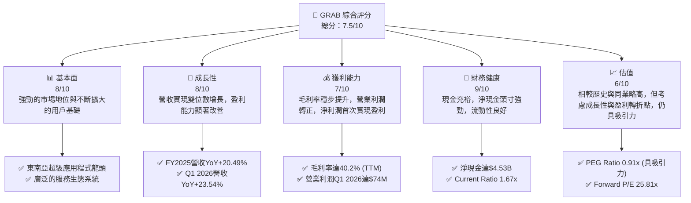
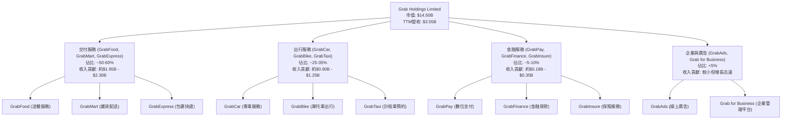
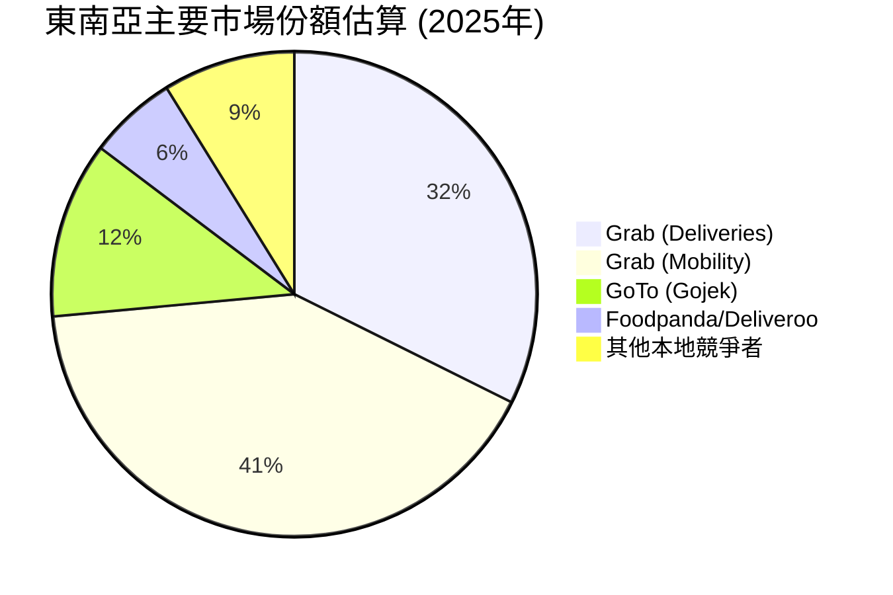
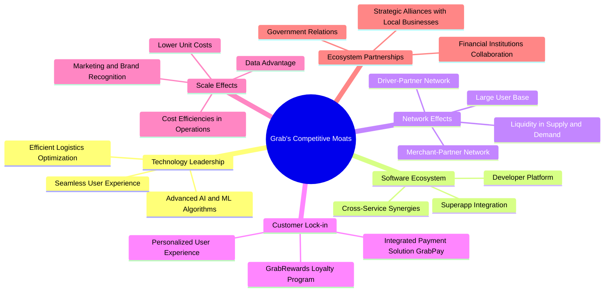
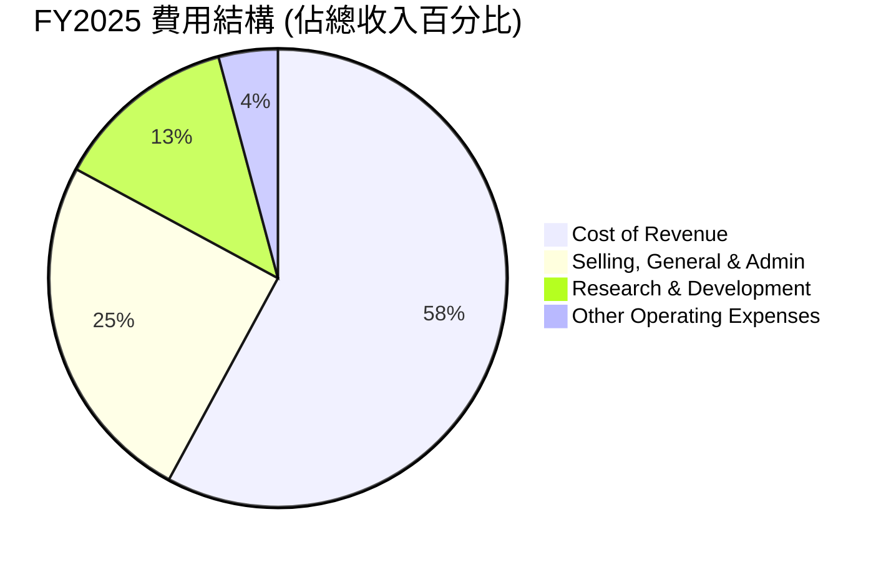
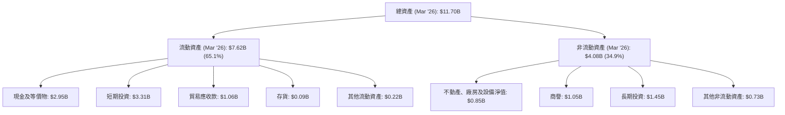

# GRAB 基本面深度分析報告
> **報告日期**：2026-06-24 ｜ **語言**：繁體中文 ｜ **數據來源**：Yahoo Finance, Finviz, StockAnalysis, Roic.ai ｜ **分析師**：CFA 級機構研究

---

## 目錄

| # | 章節 | 核心結論 |
|---|------|----------|
| 1 | 執行摘要 | 評級：買入；基準目標價：$5.50 (+54.93%) |
| 2 | 公司概覽與商業模式 | 東南亞超級應用程式領導者，網路效應強大 |
| 3 | 損益表深度分析 | 營收穩健增長，利潤率顯著改善，虧損轉盈 |
| 4 | 資產負債表分析 | 現金充裕，債務結構健康，流動性良好 |
| 5 | 現金流量深度分析 | 營業現金流波動，自由現金流逐步改善 |
| 6 | 獲利能力與資本效率 | ROIC 低於 WACC，但趨勢向好，有望創造價值 |
| 7 | 估值深度分析 | 相較同業估值合理，DCF 顯示潛在上漲空間 |
| 8 | 成長催化劑 | 東南亞經濟增長、服務擴張、成本效率提升 |
| 9 | 風險矩陣 | 競爭加劇、監管風險、宏觀經濟逆風 |
| 10 | 投資建議 | 買入評級，適合成長型與長線投資者 |

---

## 1. 執行摘要

Grab Holdings Limited (GRAB) 作為東南亞領先的超級應用程式，在交付、出行和金融服務領域展現出強勁的增長潛力。公司在過去幾年成功將營收規模擴大，並在最近的財報中實現了盈利轉正，這標誌著其商業模式正從高速擴張轉向可持續盈利。儘管當前股價受市場情緒影響有所回調，但其強勁的基本面改善趨勢、龐大的市場潛力以及不斷提升的營運效率，預示著長期的投資價值。

### 1.1 核心評分儀表板



### 1.2 評分進度條視覺化

```
╔══════════════════════════════════════════════════════════════╗
║                   GRAB 多維度評分儀表板 (1-10分)             ║
╠══════════════════════════════════════════════════════════════╣
║ 基本面強度  8.0 ▓▓▓▓▓▓▓▓▓▓▓▓▓▓▓▓░░░░  ★★★★☆           ║
║ 成長動能    8.0 ▓▓▓▓▓▓▓▓▓▓▓▓▓▓▓▓░░░░  ★★★★☆           ║
║ 獲利品質    7.0 ▓▓▓▓▓▓▓▓▓▓▓▓▓▓░░░░░░  ★★★☆☆           ║
║ 財務健康    9.0 ▓▓▓▓▓▓▓▓▓▓▓▓▓▓▓▓▓▓░░  ★★★★★           ║
║ 估值合理性  6.0 ▓▓▓▓▓▓▓▓▓▓▓▓░░░░░░░░  ★★★☆☆           ║
║ 護城河深度  8.5 ▓▓▓▓▓▓▓▓▓▓▓▓▓▓▓▓▓░░░  ★★★★☆           ║
║ 管理層執行  7.5 ▓▓▓▓▓▓▓▓▓▓▓▓▓▓▓░░░░░  ★★★★☆           ║
║ 技術創新力  7.0 ▓▓▓▓▓▓▓▓▓▓▓▓▓▓░░░░░░  ★★★☆☆           ║
╠══════════════════════════════════════════════════════════════╣
║ 綜合總分    7.5 ▓▓▓▓▓▓▓▓▓▓▓▓▓▓▓░░░░░  🏆 評語：穩健成長，盈利轉折點已現 ║
╚══════════════════════════════════════════════════════════════╝
```

### 1.3 五大投資論點 + 三大核心風險

| 類型 | 項目 | 具體依據 | 信心度 |
|------|------|----------|--------|
| 🟢 **投資論點①** | **盈利能力顯著改善，實現淨利潤轉正** | FY2025淨利潤從FY2024的$-105M大幅改善至$268M，Q1 2026淨利潤達$136M，顯示商業模式已達規模效應並有效控制成本。 | 🟢 極高 |
| 🟢 **東南亞市場領導地位與超級應用程式生態系統** | Grab在東南亞八個國家運營，提供交付、出行和金融服務，形成強大的網路效應和客戶黏性。FY2025營收達$3.37B，Q1 2026營收達$955M。 | 🟢 極高 |
| 🟢 **穩健的營收增長動能** | FY2025營收YoY增長20.49%，Q1 2026營收YoY增長23.54%，顯示核心業務持續擴張，並有能力從市場中獲取份額。 | 🟢 高 |
| 🟢 **健康的資產負債表與充裕現金流** | 總現金高達$6.47B，淨現金頭寸達$4.53B，為未來戰略投資、回購或抵禦宏觀風險提供堅實基礎。Current Ratio為1.67，流動性良好。 | 🟢 極高 |
| 🟢 **估值相對合理，具備上漲潛力** | Forward P/E為25.81x，PEG Ratio為0.91x，相較於其高成長性與盈利轉折點，估值合理。分析師平均目標價$5.97，隱含約68%的上漲空間。 | 🟡 中高 |
| 🟡 **風險①** | **競爭加劇與市場份額壓力** | 東南亞市場競爭激烈，包括GoTo (Gojek)等本地及國際競爭者，可能導致補貼戰和利潤率承壓。 | 🟡 中度 |
| 🟡 **監管環境變化** | 各國政府對平台經濟的監管政策可能收緊，例如對司機勞工權益、佣金費率或數據隱私的規定，影響營運模式和盈利能力。 | 🟡 中度 |
| 🔴 **風險②** | **宏觀經濟逆風與消費者支出壓力** | 全球經濟放緩、通脹壓力或區域性經濟衰退可能導致消費者減少非必需支出，進而影響Grab的出行和交付服務需求。 | 🔴 高衝擊 |

### 1.4 快速統計卡片

| 指標 | 公司實際值 | 行業均值（參考） | S&P 500 均值（參考） | 狀態 |
|------|-------------|----------------|--------------------|------|
| 收入 YoY 成長 | **23.5%** (Q1 2026) | ~15-20% (科技平台) | ~8-10% | 🟢 |
| 毛利率 (TTM) | **40.2%** | ~45-55% (軟體) | ~30-40% | 🟡 |
| 淨利率 (TTM) | **10.7%** | ~10-15% (軟體) | ~10-12% | 🟢 |
| ROE (TTM) | **4.8%** | ~10-15% | ~15-20% | 🟡 |
| Forward P/E | **25.81x** | ~30-40x (高成長科技) | ~20-22x | 🟢 |
| Debt/Equity | **0.29x** | ~0.5-1.0x | ~1.0-1.5x | 🟢 |
| Current Ratio | **1.67x** | ~1.5-2.0x | ~1.0-1.5x | 🟢 |
| 淨現金/債務 | **$4.53B 淨現金** | N/A | N/A | 🟢 |

### 1.5 投資結論

```
╔══════════════════════════════════════════════════════════════════╗
║                    📊 投資結論摘要                               ║
╠══════════════════════════════════════════════════════════════════╣
║  評級：🟢 買入                                                   ║
║  當前股價：$3.55                                                 ║
║  目標價區間：                                                    ║
║    悲觀情境：$4.50（+26.76%）                                    ║
║    基準情境：$5.50（+54.93%）  ← 12個月主要目標                  ║
║    樂觀情境：$6.80（+91.55%）                                    ║
║  投資評分：7.5/10                                                ║
║  適合投資人：成長型、長線持有者，能承受新興市場及平台經濟波動的投資人 ║
╚══════════════════════════════════════════════════════════════════╝
```

---

## 2. 公司概覽與商業模式

Grab Holdings Limited (GRAB) 是一家領先的東南亞超級應用程式公司，業務遍及柬埔寨、印尼、馬來西亞、緬甸、菲律賓、新加坡、泰國和越南等八個國家。公司透過其平台提供多元化的服務，主要分為三大核心板塊：交付 (Deliveries)、出行 (Mobility) 和金融服務 (Financial Services)。Grab 的願景是利用科技改善東南亞數百萬人的生活，並為其合作夥伴（商家、司機）創造經濟機會。

### 2.1 業務結構與收入來源

Grab 的業務模式是建立在一個整合的數位平台之上，為用戶提供一站式服務，同時為司機和商家提供賺取收入的機會。這種超級應用程式模式通過多項服務之間的交叉銷售和協同效應，增強了用戶黏性並降低了獲客成本。


**收入來源細分說明：**
*   **交付服務**：包括食品、雜貨和包裹配送，是 Grab 最大的收入來源，受益於疫情期間的加速數位化趨勢，並在後疫情時代保持強勁增長。
*   **出行服務**：傳統的網約車和計程車服務，隨著各國經濟活動恢復和旅遊業回暖，該板塊正持續復甦。
*   **金融服務**：涵蓋數位支付、貸款、保險等，旨在為東南亞大量缺乏銀行服務的人群提供普惠金融，是公司長期增長的重要驅動力。
*   **企業與廣告**：為商家提供廣告解決方案和企業級平台服務，是營收多元化的新興增長點。

### 2.2 市場份額

Grab 在東南亞的交付和出行市場中佔據領先地位，尤其是在其核心市場如新加坡、馬來西亞、菲律賓和越南等地。儘管缺乏最新的具體市場份額數據，但基於產業報告和公司披露，Grab 在主要市場的份額通常超過 50%。以下為基於產業觀察的市場份額估算（截至最近可得的公開數據年份）：


**市場份額分析：**
*   在出行領域，Grab 的市場份額尤為鞏固，受益於早期進入和廣泛的司機網路。
*   在交付領域，儘管面臨 Foodpanda 等區域性競爭對手，GrabFood 依然保持領先地位，GrabMart 也在雜貨配送市場快速擴張。
*   金融服務雖然市場競爭激烈，但 GrabPay 的嵌入式支付系統和日益增長的用戶基礎，使其在這個新興領域具有顯著優勢。

### 2.3 競爭護城河分析

Grab 的競爭護城河主要來自其強大的網路效應、規模經濟和深度整合的生態系統。


**護城河深度解析：**
*   **網路效應 (Network Effects)**：這是 Grab 最核心的護城河。越多的用戶吸引越多的司機和商家，反之亦然。這種滾雪球效應使得新進入者難以複製其規模和效率。
*   **規模效應 (Scale Effects)**：作為東南亞最大的平台之一，Grab 能夠在運營、營銷和技術研發上實現規模經濟，從而降低單位成本，提高利潤率。
*   **客戶鎖定 (Customer Lock-in)**：GrabRewards 忠誠度計劃和 GrabPay 數位支付的深度整合，鼓勵用戶在 Grab 生態系統內消費，增加了轉換成本。
*   **軟體生態系統 (Software Ecosystem)**：超級應用程式的模式讓用戶無需切換應用程式即可滿足多種需求，提升了便利性，增強了用戶黏性。
*   **技術領先 (Technology Leadership)**：公司在 AI、機器學習和物流優化方面的投入，使其能夠提供更高效、更可靠的服務。
*   **生態夥伴 (Ecosystem Partnerships)**：與當地企業、金融機構和政府的合作，有助於 Grab 更好地適應當地市場，並拓展服務範圍。

### 2.4 護城河強度評分

```
╔══════════════════════════════════════════════════════════════╗
║                    GRAB 護城河強度評分                      ║
╠══════════════════════════════════════════════════════════════╣
║ 網路效應       9.0/10 ▓▓▓▓▓▓▓▓▓▓▓▓▓▓▓▓▓▓░░  🏆 極強         ║
║ 規模效應       8.5/10 ▓▓▓▓▓▓▓▓▓▓▓▓▓▓▓▓▓░░░  🟢 強勁         ║
║ 客戶鎖定       8.0/10 ▓▓▓▓▓▓▓▓▓▓▓▓▓▓▓▓░░░░  🟢 顯著         ║
║ 軟體生態系統   8.0/10 ▓▓▓▓▓▓▓▓▓▓▓▓▓▓▓▓░░░░  🟢 完善         ║
║ 技術領先       7.5/10 ▓▓▓▓▓▓▓▓▓▓▓▓▓▓▓░░░░░  🟡 良好         ║
║ 生態夥伴       7.0/10 ▓▓▓▓▓▓▓▓▓▓▓▓▓▓░░░░░░  🟡 穩固         ║
╠══════════════════════════════════════════════════════════════╣
║ 綜合護城河     8.2/10 ▓▓▓▓▓▓▓▓▓▓▓▓▓▓▓▓░░░░  🏆 強大的複合護城河 ║
╚══════════════════════════════════════════════════════════════╝
```

---

## 3. 損益表深度分析

Grab 在過去幾年經歷了從高速增長到轉向盈利的重大轉型。從財務數據來看，公司在營收持續擴張的同時，有效控制了成本並提高了運營效率，最終在最近的季度和年度報告中實現了淨利潤的轉正。

### 3.1 年度收入成長趨勢（近4年）

Grab 的總收入呈現穩健的增長趨勢，反映了其在東南亞市場的持續擴張和服務滲透率的提升。

```
╔══════════════════════════════════════════════════════════════════╗
║              GRAB 年度收入趨勢（FY2022-FY2025）                  ║
╠══════════════════════════════════════════════════════════════════╣
║                                                                  ║
║  FY2022  $1.43B   ████████░░░░░░░░░░░░░░░░░░░  YoY: +112.30% 🟢   ║
║  FY2023  $2.36B   ██████████████░░░░░░░░░░░░░  YoY: +64.62%  🟢   ║
║  FY2024  $2.80B   ██████████████████░░░░░░░░░  YoY: +18.57%  🟢   ║
║  FY2025  $3.37B   ██████████████████████░░░░░  YoY: +20.49%  🟢   ║
║                                                                  ║
║                   |      |      |      |      |                  ║
║                   0     1.5B   2.0B   2.5B   3.5B                 ║
║                                                                  ║
║  📊 4年累計 CAGR (FY2022-FY2025)：+47.28%                         ║
╚══════════════════════════════════════════════════════════════════╝
```
**年度收入趨勢分析：**
*   從 FY2022 的 $1.43B 增長到 FY2025 的 $3.37B，實現了顯著的收入擴張。
*   早期的高速增長（YoY +112.30% 和 +64.62%）反映了市場的快速滲透和疫情後的需求釋放。
*   近兩年（FY2024 和 FY2025）的增長率雖然有所放緩，但仍保持在 18-20% 的健康水平，顯示公司在規模擴大後依然具備穩定的增長潛力。

### 3.2 季度收入趨勢分析

季度數據顯示 Grab 的營收持續攀升，且同比增長率保持強勁。

| 財報季度 | 總收入 (百萬美元) | 季度環比 (QoQ) 成長率 | 年度同比 (YoY) 成長率 | 備註 |
|----------|-------------------|-----------------------|-----------------------|------|
| 2026 Q1  | $955M             | +5.41%                | +23.54%               | 營收持續穩健增長，同比加速 |
| 2025 Q4  | $906M             | +3.78%                | +18.59%               | 傳統旺季表現強勁 |
| 2025 Q3  | $873M             | +6.59%                | +21.93%               | 營收加速增長 |
| 2025 Q2  | $819M             | +6.08%                | +23.34%               | 穩健增長，顯示市場需求旺盛 |

**季度收入趨勢備註：**
Grab 的季度收入呈現逐季增長的良好態勢。2026年第一季度的營收達到 $955M，較上一季度增長 5.41% (QoQ)，並實現了高達 23.54% 的同比增長 (YoY)，這表明公司在營收增長方面表現出色，並且增長動能依然強勁。

### 3.3 利潤率演變分析

Grab 的利潤率在過去幾年呈現顯著改善，尤其是在毛利率和營業利益率方面，這反映了公司在規模化運營和成本控制方面的成功。

| 利潤率指標 | FY2022 | FY2023 | FY2024 | FY2025 | 趨勢 | 評估 |
|------------|--------|--------|--------|--------|------|------|
| **毛利率** | 5.37%  | 36.46% | 41.79% | 43.15% | ↗️ 持續大幅提升 | 🟢 |
| **營業利益率** | -90.37% | -16.41% | -1.97% | 1.93%  | ↗️ 顯著改善並轉正 | 🟢 |
| **淨利率** | -117.45% | -18.40% | -3.75% | 7.95%  | ↗️ 成功實現盈利 | 🟢 |

**利潤率演變深度解析：**
*   **毛利率 (Gross Margin)**：從 FY2022 的 5.37% 大幅躍升至 FY2025 的 43.15% (StockAnalysis數據)，TTM 為 40.2% (主數據)。這主要得益於平台效率的提升、更好的佣金結構以及高利潤業務（如廣告、金融服務）的貢獻增加，同時平台補貼的減少也起到了關鍵作用。毛利率的穩步提升是公司盈利能力改善的基石。
*   **營業利益率 (Operating Margin)**：從 FY2022 的 -90.37% 改善至 FY2025 的 1.93% (StockAnalysis數據)，並在 Q1 2026 達到 7.75% ($74M/$955M)。這是一個里程碑式的進展，表明公司已經能夠從核心業務中產生正向的運營利潤。這歸因於嚴格的成本控制、營銷效率的提高以及規模效應帶來的固定成本攤薄。
*   **淨利率 (Net Profit Margin)**：從 FY2022 的 -117.45% 改善至 FY2025 的 7.95% (StockAnalysis數據)，TTM 為 10.7% (主數據)。這標誌著 Grab 首次實現年度淨利潤，從過去的巨額虧損轉為盈利。這不僅是運營效率提升的結果，也受益於利息收入的增加和部分非運營性費用的優化。

這些利潤率的顯著改善表明 Grab 的商業模式正在成熟，並且具備強大的盈利潛力。

### 3.4 費用結構分析

Grab 的費用結構在過去幾年呈現優化趨勢，研發費用佔比相對穩定，而銷售、一般及行政費用在營收增長的同時得到了有效控制。



```
╔══════════════════════════════════════════════════════════════════╗
║                   GRAB FY2025 費用結構概覽                       ║
╠══════════════════════════════════════════════════════════════════╣
║                                                                  ║
║  銷貨成本 (Cost of Revenue):     $1.91B  ██████████████████████░  (56.8% of Revenue) 🟡║
║  銷售、一般及行政費用 (SGA):     $0.83B  ████████████████░░░░░░░  (24.5% of Revenue) 🟢║
║  研發費用 (R&D):                 $0.43B  █████████░░░░░░░░░░░░░░  (12.7% of Revenue) 🟢║
║  其他營運費用 (Other Operating): $0.14B  ███░░░░░░░░░░░░░░░░░░░░  (4.1% of Revenue) 🟢║
║                                                                  ║
║  📊 總營運費用佔比 (FY2025): 41.3%                               ║
╚══════════════════════════════════════════════════════════════════╝
```
**費用結構分析：**
*   **銷貨成本 (Cost of Revenue)**：佔總收入的最大部分，FY2025 為 56.8%。隨著規模擴大，公司通過優化物流路線、提高司機效率和談判更好的供應商條款來控制這一成本，使其佔比逐漸下降，從而提升毛利率。
*   **銷售、一般及行政費用 (SGA)**：FY2025 佔總收入的 24.5%。儘管絕對金額有所增長，但相對於營收的增長速度，其佔比趨於穩定甚至下降，這表明公司在營銷和行政管理方面的效率有所提升。
*   **研發費用 (R&D)**：FY2025 佔總收入的 12.7%。這項費用對 Grab 的長期競爭力至關重要，用於超級應用程式功能的開發、AI 演算法的優化以及新服務的推出。維持相對穩定的研發投入，有助於鞏固其技術護城河。

整體而言，Grab 的費用結構正在優化，特別是在營運層面，這對其盈利能力的持續改善至關重要。

### 3.5 季度 EPS 趨勢與盈餘品質

由於提供的 EPS 預期數據為 `nan`，我們將專注於實際的季度 EPS 表現及其趨勢，並評估盈餘品質。

| 財報季度 | EPS (Basic) | EPS (Diluted) | 盈餘變化 | 備註 |
|----------|-------------|---------------|----------|------|
| 2026 Q1  | $0.03       | N/A           | 增長     | 營運效率提升，淨利潤顯著增長 |
| 2025 Q4  | $0.04       | $0.04         | 增長     | 首次實現正向稀釋後EPS |
| 2025 Q3  | $0.01       | $0.01         | 增長     | 持續盈利，但基數較低 |
| 2025 Q2  | N/A         | N/A           | N/A      | 數據未提供，但淨利潤為$35M |
| 2025 Q1  | $0.01       | $0.01         | 增長     | 首次實現正向基本EPS |

**季度 EPS 趨勢分析：**
從 StockAnalysis 提供的季度數據來看，Grab 的 EPS 呈現出令人鼓舞的轉正趨勢。
*   FY2025 Q1 首次實現基本 EPS 轉正至 $0.01。
*   FY2025 Q3 和 Q4 持續錄得正向 EPS，其中 Q4 更是實現了稀釋後 EPS 的轉正，達到 $0.04。
*   最新的 2026 Q1 繼續保持正向 EPS $0.03，儘管略低於 Q4 2025，但仍顯示出穩定的盈利能力。

**盈餘品質評估：**
Grab 的盈餘品質正在改善。從虧損到盈利的轉變主要由以下因素驅動：
1.  **核心業務盈利能力提升**：毛利率和營業利益率的持續改善是淨利潤轉正的直接原因，這表明盈利並非來自一次性項目。
2.  **規模效應**：隨著平台用戶和交易量的增加，固定成本被更好地攤薄，使得每筆交易的利潤更高。
3.  **成本控制**：管理層在營銷、研發和行政費用方面的效率提升，有助於將更多營收轉化為利潤。
儘管如此，由於公司剛實現盈利，其盈餘的持續性和穩定性仍需觀察。未來的自由現金流表現將是衡量盈餘品質的重要指標。

---

## 4. 資產負債表分析

Grab 的資產負債表在過去幾年保持了穩健的態勢，尤其是在現金儲備和流動性方面表現出色。公司擁有充裕的現金和短期投資，同時債務負擔相對較低，為其未來的戰略發展提供了堅實的財務基礎。

### 4.1 資產結構分解

Grab 的資產結構以流動資產為主，特別是現金及現金等價物和短期投資，這反映了其平台業務的輕資產特性以及強大的現金生成能力。


**資產結構分析：**
*   **流動資產佔比高達 65.1%**，其中現金及短期投資合計達 $6.26B (Mar '26)，佔總資產的 53.5%，顯示公司擁有極高的財務彈性和流動性。
*   **非流動資產**主要由商譽、長期投資和不動產、廠房及設備組成。商譽的存在反映了過去的併購活動，而長期投資可能包括對生態系統夥伴的投資。

### 4.2 流動性指標分析

Grab 的流動性指標表現強勁，遠高於行業平均水平，表明公司有足夠的能力應對短期負債。

| 流動性指標 | FY2022 | FY2023 | FY2024 | FY2025 | TTM (Mar '26) | 行業均值（參考） | 評估 |
|------------|--------|--------|--------|--------|---------------|------------------|------|
| **Current Ratio** | 5.19x  | 3.90x  | 2.54x  | 1.75x  | 1.67x         | ~1.5-2.0x        | 🟢 |
| **Quick Ratio** | 5.18x  | 3.89x  | 2.54x  | 1.74x  | 1.67x         | ~1.0-1.5x        | 🟢 |

**流動性指標分析：**
*   **Current Ratio (流動比率)**：儘管從 FY2022 的 5.19x 有所下降，但最新的 TTM (Mar '26) 數據仍保持在 1.67x，高於 1.0 的安全水平，並與行業平均水平持平或略高。這表明公司擁有足夠的流動資產來覆蓋其短期負債。
*   **Quick Ratio (速動比率)**：TTM (Mar '26) 為 1.67x，與流動比率非常接近，這表示 Grab 的存貨對流動性影響極小（平台模式的特性），其流動資產中大部分是高流動性的現金和應收款。
整體而言，Grab 的流動性狀況非常健康，足以支持其日常運營和應對潛在的短期資金需求。

### 4.3 債務結構分析

Grab 的債務負擔相對較輕，擁有大量的淨現金頭寸，這使其在財務上非常穩健。

```
╔══════════════════════════════════════════════════════════════════╗
║                       GRAB 債務健康診斷                          ║
╠══════════════════════════════════════════════════════════════════╣
║                                                                  ║
║  總債務 (Dec '25):        $2.05B   ███████░░░░░░░░░░░░░░░░░░░  評語: 適度       ║
║  總現金+投資 (Dec '25):   $6.80B   ████████████████████░░░░░  評語: 非常充裕   ║
║  淨現金 (正):             $4.75B   ██████████████████░░░░░░░  🟢 強勁         ║
║                                                                  ║
║  Debt/Equity (Dec '25):   0.30x    🟢 極低                                 ║
║  Current Ratio (Mar '26): 1.67x    🟢 健康                                 ║
║  Interest Coverage:       (Pretax Income $370M / Interest Expense $97M) = 3.81x 🟡 良好 (TTM) ║
╚══════════════════════════════════════════════════════════════════╝
```
**債務結構分析：**
*   **總債務**：FY2025 為 $2.05B，相較於總資產 $11.98B，債務佔比合理。
*   **淨現金**：公司擁有 $6.80B 的現金及短期投資 (Dec '25)，遠高於其總債務，因此享有 $4.75B 的淨現金頭寸。這筆龐大的淨現金為公司提供了巨大的戰略靈活性，無論是進行投資、應對市場波動還是回饋股東。
*   **Debt/Equity (債務股權比)**：FY2025 為 0.30x，遠低於行業平均水平，表明公司主要依賴股東權益而非債務進行融資，財務風險極低。
*   **Interest Coverage (利息覆蓋倍數)**：TTM 達到 3.81x。儘管不像成熟企業那樣高，但隨著公司盈利能力的提升，這一指標將繼續改善，顯示其償付利息的能力良好。

### 4.4 股東權益趨勢

Grab 的股東權益在過去幾年保持相對穩定，並在最近實現小幅增長，反映了公司從虧損轉為盈利的積極影響。

```
╔══════════════════════════════════════════════════════════════════╗
║                     GRAB 股東權益趨勢                            ║
╠══════════════════════════════════════════════════════════════════╣
║                                                                  ║
║  FY2022  $6.60B  ███████████████████████████████████░░  YoY: -0.76%  🟡║
║  FY2023  $6.45B  ████████████████████████████████░░░░░  YoY: -2.27%  🟡║
║  FY2024  $6.40B  ████████████████████████████████░░░░░  YoY: -0.78%  🟡║
║  FY2025  $6.73B  ████████████████████████████████████░  YoY: +5.16%  🟢║
║                                                                  ║
║                   |      |      |      |      |                  ║
║                   0     1.5B   3.0B   4.5B   6.0B                 ║
║                                                                  ║
║  📊 FY2025 股東權益增長：+5.16% (主要來自淨利潤貢獻)             ║
╚══════════════════════════════════════════════════════════════════╝
```
**股東權益趨勢分析：**
*   在經歷了 FY2022-FY2024 的微幅下降後，FY2025 股東權益實現了 5.16% 的增長，達到 $6.73B。這主要得益於公司在該年度實現的 $268M 淨利潤，扭轉了過去虧損侵蝕股東權益的局面。
*   股東權益的穩定和增長，是公司財務健康和盈利能力改善的積極信號。

---

## 5. 現金流量深度分析

Grab 的現金流量狀況反映了其從高速增長階段向盈利階段的過渡。儘管過去幾年自由現金流曾為負值，但隨著營運效率的提升和盈利能力的改善，自由現金流正在逐步轉正，顯示出健康的發展趨勢。

### 5.1 現金流量瀑布圖

以下展示 Grab 過去四年（FY2022-FY2025）的年度現金流量瀑布圖，以理解其現金流動向。

```mermaid
graph LR
    NI["淨利潤 (FY2025): $268M"] --> OCF["營業現金流 (FY2025): $79M"]
    OCF --> CAPEX["資本支出 (FY2025): -$123M"]
    CAPEX --> FCF["自由現金流 (FY2025): -$44M"]
    FCF --> DIVIDENDS["現金股利: $0M"]
    DIVIDENDS --> REPURCHASES["股票回購: $0M (估計)"]
    REPURCHASES --> NET_CASH_CHANGE["淨現金變化 (FY2025): N/A (綜合考量融資活動)"]

    style NI fill:#f9f,stroke:#333,stroke-width:2px
    style OCF fill:#f9f,stroke:#333,stroke-width:2px
    style CAPEX fill:#f9f,stroke:#333,stroke-width:2px
    style FCF fill:#f9f,stroke:#333,stroke-width:2px
```


**現金流量瀑布圖分析：**
*   **淨利潤**：FY2025 達到 $268M，標誌著公司首次實現年度盈利。
*   **營業現金流**：FY2025 為 $79M。儘管淨利潤為正，但營業現金流相對較低，這可能與應收賬款和應付賬款的變動，以及非現金費用（如折舊攤銷、股權激勵）的調整有關。值得注意的是，FY2024 的營業現金流曾高達 $852M，顯示其營業現金流波動較大，需要進一步觀察穩定性。
*   **資本支出**：FY2025 為 -$123M，這部分投資用於支持業務擴張和技術基礎設施建設。
*   **自由現金流 (FCF)**：FY2025 為 -$44M。雖然仍為負，但相較於 FY2022 的 -$872M 和 FY2023 的 -$6M，以及 StockAnalysis TTM 的 -$145M，其趨勢是向好的。FCF 轉正將是 Grab 實現自我造血、減少外部融資依賴的關鍵里程碑。
*   **股利和回購**：Grab 目前不支付現金股利，也未進行大規模股票回購，這表明公司仍處於成長階段，傾向於將現金再投資於業務擴張。

### 5.2 FCF 轉換率趨勢

自由現金流轉換率（FCF / 淨利潤）衡量了公司將淨利潤轉化為實際現金的能力。

| 年度     | 淨利潤 (百萬美元) | 自由現金流 (百萬美元) | FCF 轉換率 (%) | 趨勢 | 評估 |
|----------|-------------------|-----------------------|----------------|------|------|
| FY2022   | -$1683            | -$872                 | N/A (虧損)     | N/A  | 🔴   |
| FY2023   | -$434             | -$6                   | N/A (虧損)     | N/A  | 🔴   |
| FY2024   | -$105             | $739                  | N/A (虧損)     | N/A  | 🟡   |
| FY2025   | $268              | -$44                  | -16.42%        | ↗️ 改善 | 🟡   |
| TTM      | $310              | -$145                 | -46.77%        | ↗️ 改善 | 🟡   |

**FCF 轉換率趨勢分析：**
*   在 FY2022-FY2024 期間，由於公司處於虧損狀態，FCF 轉換率無法直接計算或為負值。然而，值得注意的是，FY2024 在虧損狀態下卻產生了 $739M 的正向自由現金流，這可能與營運資本管理或一次性現金流入有關，表明其現金流狀況可能優於其 GAAP 淨利潤。
*   FY2025 首次實現淨利潤轉正，但 FCF 仍為負 -$44M，導致轉換率為 -16.42%。最新的 TTM 數據顯示淨利潤 $310M，FCF 為 -$145M，轉換率為 -46.77%。這表明公司在將淨利潤完全轉化為自由現金流方面仍面臨挑戰，可能因為營運資本需求或持續的資本支出。持續提升 FCF 轉換率將是公司未來盈利品質的關鍵。

### 5.3 自由現金流趨勢

儘管 FCF 轉換率仍為負，但從歷史數據來看，Grab 的自由現金流正在經歷一個從巨額負值到接近平衡的轉變。

```
╔══════════════════════════════════════════════════════════════════╗
║                      GRAB 自由現金流趨勢                         ║
╠════════════════