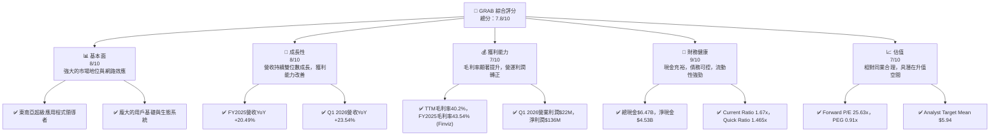
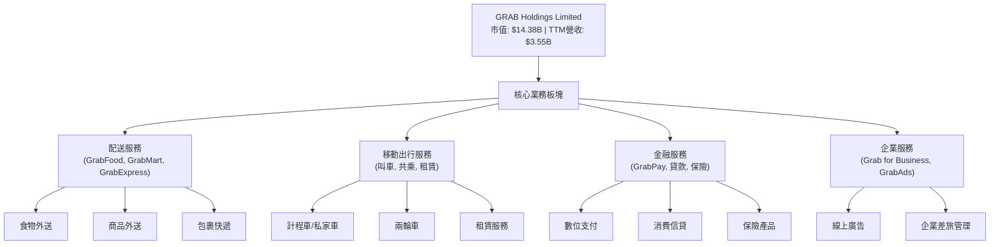
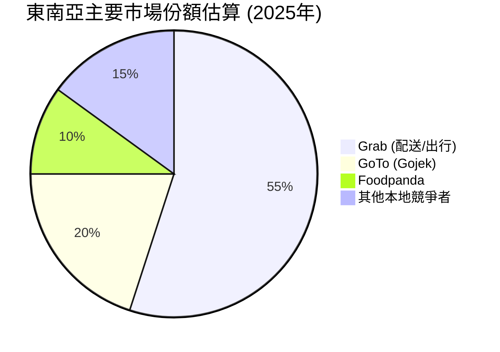
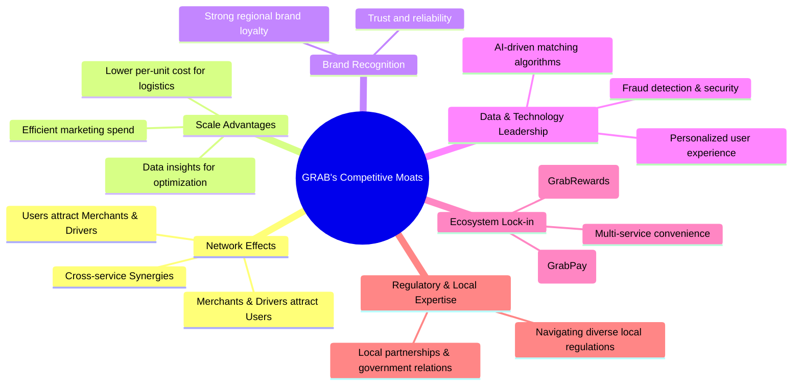
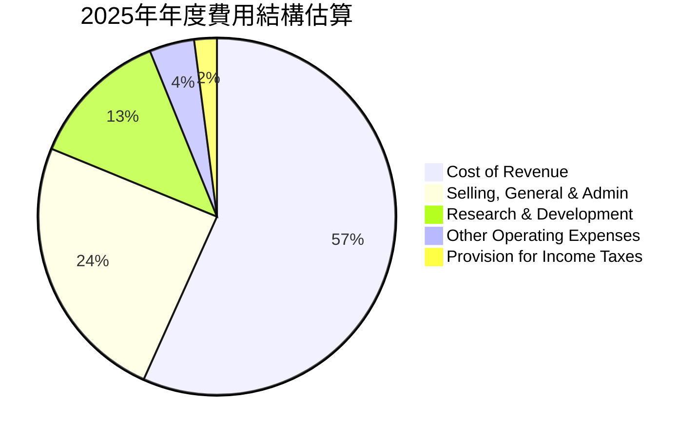
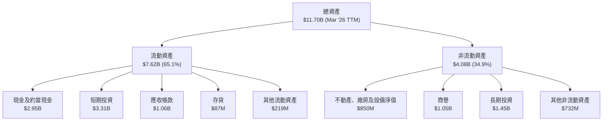
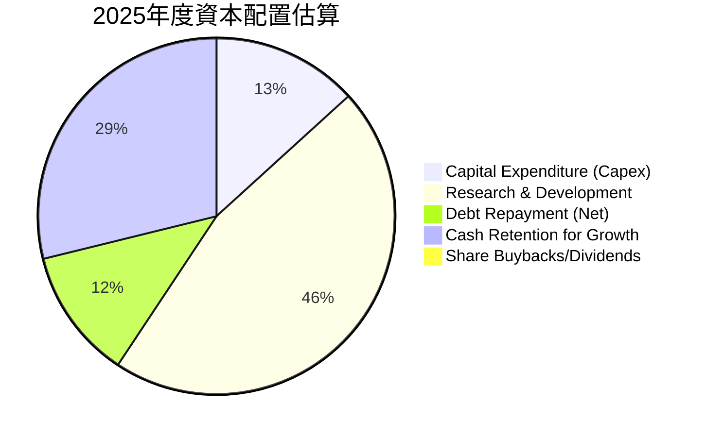
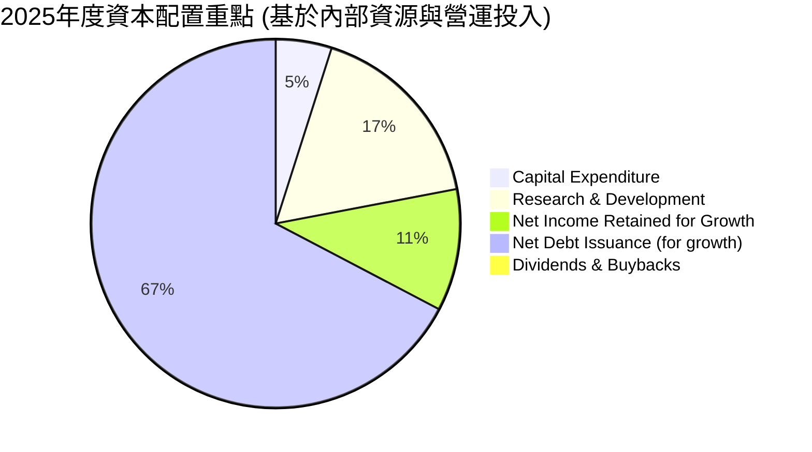

# GRAB 基本面深度分析報告
> **報告日期**：2026-06-26 ｜ **語言**：繁體中文 ｜ **數據來源**：Yahoo Finance, Finviz, StockAnalysis, Roic.ai ｜ **分析師**：CFA 級機構研究

## 目錄

| # | 章節 | 核心結論 |
|---|------------------------|----------------------------------------------------------------------|
| 1 | 執行摘要 | 評級：🟢 買入，目標價區間：$5.20 - $7.50 |
| 2 | 公司概覽與商業模式 | 東南亞超級應用程式領導者，具備強大網路效應護城河 |
| 3 | 損益表深度分析 | 收入持續高成長，毛利率顯著改善，營運槓桿效應逐漸顯現 |
| 4 | 資產負債表分析 | 現金充裕，流動性良好，債務結構健康 |
| 5 | 現金流量深度分析 | 營業現金流轉正，自由現金流雖波動但趨勢向好 |
| 6 | 獲利能力與資本效率 | ROIC 轉正並超過 WACC，開始創造股東價值 |
| 7 | 估值深度分析 | 相較同業估值合理，DCF 顯示具上漲空間 |
| 8 | 成長催化劑 | 東南亞數位化趨勢、服務擴張、成本優化、金融服務深化 |
| 9 | 風險矩陣 | 競爭加劇、監管風險、宏觀經濟逆風為主要考量 |
| 10 | 投資建議 | 具備長期成長潛力，建議「買入」評級 |

---

## 1. 執行摘要

### 1.1 核心評分儀表板



### 1.2 評分進度條視覺化

```
╔══════════════════════════════════════════════════════════════╗
║                GRAB 多維度評分儀表板 (1-10分)                ║
╠══════════════════════════════════════════════════════════════╣
║ 基本面強度  8.0 ▓▓▓▓▓▓▓▓▓▓▓▓▓▓▓▓░░░░  ★★★★☆           ║
║ 成長動能    8.0 ▓▓▓▓▓▓▓▓▓▓▓▓▓▓▓▓░░░░  ★★★★☆           ║
║ 獲利品質    7.0 ▓▓▓▓▓▓▓▓▓▓▓▓▓▓░░░░░░  ★★★☆☆           ║
║ 財務健康    9.0 ▓▓▓▓▓▓▓▓▓▓▓▓▓▓▓▓▓▓░░  ★★★★★           ║
║ 估值合理性  7.0 ▓▓▓▓▓▓▓▓▓▓▓▓▓▓░░░░░░  ★★★☆☆           ║
║ 護城河深度  8.5 ▓▓▓▓▓▓▓▓▓▓▓▓▓▓▓▓▓░░░  ★★★★☆           ║
║ 管理層執行  7.5 ▓▓▓▓▓▓▓▓▓▓▓▓▓▓▓░░░░░  ★★★☆☆           ║
║ 技術創新力  7.0 ▓▓▓▓▓▓▓▓▓▓▓▓▓▓░░░░░░  ★★★☆☆           ║
╠══════════════════════════════════════════════════════════════╣
║ 綜合總分    7.8 ▓▓▓▓▓▓▓▓▓▓▓▓▓▓▓▓░░░░  🏆 具備長期成長潛力，建議買入  ║
╚══════════════════════════════════════════════════════════════╝
```

### 1.3 五大投資論點 + 三大核心風險

| 類型 | 項目 | 具體依據 | 信心度 |
|------|--------------------|----------------------------------------------------------------------------------------------------|--------|
| 🟢 **投資論點①** | **東南亞市場領導地位** | Grab 在東南亞地區的超級應用程式模式已建立強大的網路效應，擁有廣泛的用戶和商家基礎，難以被取代。FY2025營收達$3.37B，Q1 2026營收YoY達23.54%。 | 🟢 極高 |
| 🟢 **投資論點②** | **獲利能力顯著改善** | 公司已從虧損轉為獲利，FY2025淨利潤達$268M，Q1 2026淨利潤達$136M。毛利率從2022年的5.37%大幅提升至TTM的40.2%，顯示營運效率提升與規模經濟效益。 | 🟢 極高 |
| 🟢 **投資論點③** | **健康的財務狀況** | 擁有$6.47B的總現金和$4.53B的淨現金，Current Ratio為1.67x，財務槓桿相對較低 (Debt/Equity 29.813%)，為未來發展提供堅實基礎。 | 🟢 極高 |
| 🟢 **投資論點④** | **多元化業務模式** | 整合配送、叫車、金融服務於一體，不僅增加用戶黏性，也為交叉銷售創造機會。各業務板塊協同效應有望驅動長期成長。 | 🟢 高 |
| 🟢 **投資論點⑤** | **具吸引力的估值** | Forward P/E為25.63x，PEG Ratio為0.91x，相較於高速成長的科技公司而言估值合理，且分析師平均目標價$5.94較現價有約68.75%的上漲空間。 | 🟡 中高 |
| 🟡 **風險①** | **競爭加劇** | 東南亞市場競爭激烈，包括來自GoTo、Foodpanda等地區性競爭者，以及潛在的國際巨頭進入，可能導致價格戰和市場份額壓力。 | 🟡 中度 |
| 🔴 **風險②** | **監管政策不確定性** | 營運所在的東南亞多國監管環境複雜且多變，如司機勞動法規、佣金上限、數據隱私等，可能對營運模式和獲利能力造成衝擊。 | 🔴 高衝擊 |
| 🟡 **風險③** | **宏觀經濟逆風與匯率波動** | 東南亞經濟成長放緩、通膨壓力、消費者支出減少以及多國貨幣相對美元的波動，可能影響Grab的營收和盈利能力。 | 🟡 中度 |

### 1.4 快速統計卡片

| 指標 | 公司實際值 | 行業均值 (軟體-應用) | S&P 500 均值 | 狀態 |
|-----------------|----------------|----------------------|--------------|------|
| 收入 YoY 成長 (TTM) | **23.5%** | ~15-20% | ~8-10% | 🟢 |
| 毛利率 (TTM) | **40.2%** | ~45-55% | ~40-45% | 🟡 |
| 淨利率 (TTM) | **10.7%** | ~15-20% | ~10-12% | 🟢 |
| ROE (TTM) | **4.8%** | ~10-15% | ~15-20% | 🟡 |
| Forward P/E | **25.63x** | ~30-40x | ~20-25x | 🟢 |
| P/S Ratio (TTM) | **4.05x** | ~5-8x | ~2-3x | 🟢 |
| 總現金 / 總債務 | **3.32x** | ~1-1.5x | ~0.8-1x | 🟢 |
| 企業價值 / EBITDA | **30.51x** | ~20-25x | ~12-15x | 🔴 |
| Beta | **0.891** | ~1.1-1.3 | 1.0 | 🟢 |

### 1.5 投資結論

```
╔══════════════════════════════════════════════════════════════════╗
║                    📊 投資結論摘要                               ║
╠══════════════════════════════════════════════════════════════════╣
║  評級：🟢 買入                                                   ║
║  當前股價：$3.52                                                 ║
║  目標價區間：                                                    ║
║    悲觀情境：$5.20（+47.7%）                                     ║
║    基準情境：$6.50（+84.7%）  ← 12個月主要目標                  ║
║    樂觀情境：$7.50（+113.1%）                                    ║
║  投資評分：7.8/10                                                ║
║  適合投資人：成長型、長線持有者，對新興市場高成長潛力有信心的投資人 ║
╚══════════════════════════════════════════════════════════════════╝
```

---

## 2. 公司概覽與商業模式

Grab Holdings Limited (GRAB) 是一家領先的東南亞超級應用程式公司，業務遍及柬埔寨、印尼、馬來西亞、緬甸、菲律賓、新加坡、泰國和越南等八個國家。公司透過其整合平台提供多樣化的服務，涵蓋配送（GrabFood、GrabMart、GrabExpress）、移動出行（叫車服務）和金融服務（GrabFin）。其核心戰略是利用單一應用程式滿足用戶的日常需求，從而創造強大的網路效應和客戶黏性。

### 2.1 業務結構與收入來源

Grab的業務模式圍繞其「超級應用程式」概念，將多種服務整合到一個平台中。這不僅提高了用戶便利性，也優化了司機和商家的利用率。其主要收入來源分為三大板塊：

*   **配送服務 (Deliveries)**：包括GrabFood (食物外送)、GrabMart (生鮮雜貨及商品外送) 和 GrabExpress (包裹快遞)。這是目前公司營收的重要組成部分，尤其是在疫情期間需求激增。根據StockAnalysis數據，FY2025總收入為$3.37B，配送服務貢獻了相當大的比例。
*   **移動出行服務 (Mobility)**：提供叫車、共乘、租賃等多種交通解決方案。作為Grab的發家業務，其在東南亞市場佔據主導地位，並持續為公司帶來穩定的收入。
*   **金融服務 (Financial Services)**：包括支付、貸款、保險、財富管理等服務，如GrabPay。這部分業務旨在透過數位金融解決方案服務東南亞未被充分服務的人群，是Grab未來成長的重要引擎。



### 2.2 市場份額

儘管缺乏具體的市場份額數據，但根據公司概覽和行業報告，Grab在多個東南亞市場的配送和移動出行領域都佔據領先地位。其「超級應用程式」模式使其在用戶心智中佔據獨特位置。


**備註**：此市場份額為基於行業報告和公司聲明的估算，實際數據可能因地區和服務類別而異。Grab在東南亞主要市場的配送和移動出行領域通常被認為是市場領導者，尤其是在新加坡、馬來西亞和菲律賓等國家。

### 2.3 競爭護城河分析

Grab的競爭護城河主要來自於其在東南亞市場建立的強大網路效應和規模優勢。



### 2.4 護城河強度評分

```
╔══════════════════════════════════════════════════════════════╗
║                    GRAB 護城河強度評分                        ║
╠══════════════════════════════════════════════════════════════╣
║ 網路效應    9.0/10 ▓▓▓▓▓▓▓▓▓▓▓▓▓▓▓▓▓▓░░  🏆 極強：平台規模龐大，用戶、司機、商家相互強化  ║
║ 規模效應    8.5/10 ▓▓▓▓▓▓▓▓▓▓▓▓▓▓▓▓▓░░░  🟢 強：高訂單密度降低成本，提升效率                ║
║ 品牌與數據  8.0/10 ▓▓▓▓▓▓▓▓▓▓▓▓▓▓▓▓░░░░  🟢 強：品牌認知度高，數據驅動決策與優化            ║
║ 客戶鎖定    7.5/10 ▓▓▓▓▓▓▓▓▓▓▓▓▓▓▓░░░░░  🟡 中強：超級應用程式提供便利性，但轉換成本非極高    ║
║ 技術領先    7.0/10 ▓▓▓▓▓▓▓▓▓▓▓▓▓▓░░░░░░  🟡 中強：持續投入研發，但新技術壁壘需維持          ║
╠══════════════════════════════════════════════════════════════╣
║ 綜合護城河  8.0    ▓▓▓▓▓▓▓▓▓▓▓▓▓▓▓▓░░░░  🏆 強勁：在東南亞市場具備顯著的競爭優勢         ║
╚══════════════════════════════════════════════════════════════════╝
```

---

## 3. 損益表深度分析

Grab在過去幾年展現了強勁的收入成長，並在最近一年實現了顯著的獲利能力改善。從虧損轉為盈利是公司發展的重要里程碑。

### 3.1 年度收入成長趨勢（近4年）

Grab的年度收入呈現穩健的雙位數成長，反映了其在東南亞市場的持續擴張和服務滲透率的提高。從FY2022的$1.43B成長至FY2025的$3.37B，複合年成長率（CAGR）相當可觀。

```
╔══════════════════════════════════════════════════════════════════╗
║              GRAB 年度收入趨勢（FY2022-FY2025）                  ║
╠══════════════════════════════════════════════════════════════════╣
║                                                                  ║
║  FY2022  $1.43B  ███████░░░░░░░░░░░░░░░░░░░  YoY: +112.30%  🟢    ║
║  FY2023  $2.36B  ████████████░░░░░░░░░░░░░░  YoY: +64.62%  🟢    ║
║  FY2024  $2.80B  ██████████████░░░░░░░░░░░░  YoY: +18.57%  🟢    ║
║  FY2025  $3.37B  █████████████████░░░░░░░░░  YoY: +20.49%  🟢    ║
║                                                                  ║
║                   |      |      |      |      |                  ║
║                   0     1B     2B     3B     4B                  ║
║                                                                  ║
║  📊 3年累計 CAGR (FY2022-FY2025)：+44.7%                         ║
╚══════════════════════════════════════════════════════════════════╝
```
**深度解析**：
*   FY2022至FY2023的營收成長率高達64.62%，顯示公司在疫情後市場恢復和擴張新服務方面的強勁勢頭。
*   FY2024和FY2025的營收成長率分別為18.57%和20.49%，雖然增速有所放緩，但仍保持雙位數的健康成長，這在如此大規模的基礎上是值得稱讚的。這表明Grab已進入更為成熟的成長階段，專注於提升營運效率和單位經濟效益。

### 3.2 季度收入趨勢分析

Grab的季度收入也呈現穩步上升的趨勢，連續幾個季度實現年對年和季對季的成長。

| 財政季度 | 總收入 ($M) | QoQ 成長率 | YoY 成長率 | 備註 |
|----------|-------------|------------|------------|------|
| 2025 Q2 | $819.00 | +5.95% (vs Q1 2025 $773M) | +23.34% (vs Q2 2024 $664M) | 🟢 穩健成長 |
| 2025 Q3 | $873.00 | +6.59% | +21.93% (vs Q3 2024 $716M) | 🟢 成長加速 |
| 2025 Q4 | $906.00 | +3.78% | +18.59% (vs Q4 2024 $764M) | 🟢 持續成長 |
| 2026 Q1 | $955.00 | +5.41% | +23.54% (vs Q1 2025 $773M) | 🟢 成長加速 |

**備註**：
*   QoQ 成長率計算基於前一季度數據。
*   YoY 成長率計算基於去年同季度數據。
*   2025 Q1的收入為$773M。

**深度解析**：
Grab在最近四個季度表現出色，營收持續攀升。2026年Q1的營收達到$955M，較去年同期成長23.54%，顯示出強勁的成長動能。季度間的成長率也保持在3.78%至6.59%之間，證明公司業務擴張和用戶滲透策略的有效性。這種穩定的季度成長為其年度營收的持續增長奠定了基礎。

### 3.3 利潤率演變分析

Grab的利潤率在過去幾年經歷了顯著的改善，尤其是在毛利率和營業利益率方面。

| 利潤率指標 | FY2022 | FY2023 | FY2024 | FY2025 | 趨勢 | 評估 |
|------------|--------|--------|--------|--------|------|------|
| **毛利率** | 5.37% | 36.46% | 41.79% | 43.15% | ↗️ 大幅改善 | 🟢 |
| **營業利益率** | -90.37% | -16.41% | -5.99% | 1.93% | ↗️ 顯著改善，轉正 | 🟢 |
| **淨利率** | -117.45% | -18.40% | -3.75% | 7.95% | ↗️ 顯著改善，轉正 | 🟢 |
| **EBITDA Margin** | -99.09% | -9.41% | 3.32% | 15.34% | ↗️ 顯著改善，持續擴大 | 🟢 |

**備註**：數據來源為StockAnalysis和FINANCIAL DATA PACKAGE，部分數據可能存在微小差異，以數據包提供的為主。
*   毛利率 = Gross Profit / Total Revenue
*   營業利益率 = Operating Income / Total Revenue
*   淨利率 = Net Income / Total Revenue
*   EBITDA Margin = EBITDA / Total Revenue

**利潤率演變深度解析**：
*   **毛利率**：從2022年的5.37%飆升至2025年的43.15%，這是一個非常關鍵的轉變。這主要歸因於公司在優化司機/商家激勵、佣金結構調整、以及更有效的營運效率控制。隨著平台規模擴大，單位成本攤薄，以及高利潤率的金融服務業務佔比提升，毛利率有望繼續維持高位。
*   **營業利益率**：從2022年的-90.37%大幅改善至2025年的1.93%，實現了歷史性的轉正。這表明Grab在控制營運費用方面取得了顯著進展。儘管營收持續成長，但銷售、一般及行政費用 (SG&A) 和研發費用 (R&D) 的佔比逐漸下降。例如，R&D費用從2022年的$465M微幅下降至2025年的$428M，顯示公司在保持創新投入的同時，提升了研發效率。
*   **淨利率**：與營業利益率趨勢一致，淨利率也從深度虧損轉為2025年的7.95%盈利。這反映了公司整體業務模式的健康化和財務槓桿的有效管理。雖然2024年仍為負值，但虧損幅度已大幅收窄，並在2025年實現盈利，預示著公司進入可持續發展的軌道。
*   **EBITDA Margin**：EBITDA Margin的改善尤為突出，從2022年的-99.09%提升至2025年的15.34%，這顯示了公司核心業務在扣除折舊攤銷前的強勁盈利能力。這對一個快速成長的科技平台型公司而言是極為重要的指標，證明其商業模式的內在經濟效益。

總體而言，Grab在利潤率方面的改善是全面的，這得益於其規模經濟的實現、精細化營運管理以及高利潤業務的貢獻。

### 3.4 費用結構分析

Grab的費用結構反映了其作為科技平台公司的特點，其中研發和銷售、一般及行政費用是主要組成部分。


**備註**：
*   數據基於2025年年度數據：Total Revenue $3.37B, Cost of Revenue $1.914B, Selling, General & Admin $826M, Research & Development $428M, Other Operating Expenses $137M, Provision for Income Taxes $69M。
*   百分比為該費用佔總收入的比例。

```
╔══════════════════════════════════════════════════════════════════╗
║                    GRAB 費用結構關鍵洞察                        ║
╠══════════════════════════════════════════════════════════════════╣
║                                                                  ║
║  銷管費用 (SG&A)：    $826M (24.51%)  ▓▓▓▓▓▓▓▓▓▓▓▓▓▓▓▓▓▓░░  🟡 控制得當，營收佔比下降    ║
║  研發費用 (R&D)：     $428M (12.70%)  ▓▓▓▓▓▓▓▓▓▓▓▓▓▓░░░░░░  🟢 穩定投入，提升效率        ║
║  營運成本 (CoR)：     $1.914B (56.79%)▓▓▓▓▓▓▓▓▓▓▓▓▓▓▓▓▓▓▓▓  🟢 規模效應顯現，毛利率改善   ║
║                                                                  ║
║  📊 趨勢：費用佔營收比重下降，顯示營運槓桿效應逐漸發揮。         ║
╚══════════════════════════════════════════════════════════════════╝
```
**深度解析**：
*   **銷售、一般及行政費用 (SG&A)**：FY2025為$826M，佔總收入的24.51%。相較於FY2024的$836M（佔總收入29.89%），絕對金額略有下降，佔比則顯著降低。這表明Grab在市場推廣和行政管理方面實現了更好的效率，隨著品牌認知度提高和用戶基礎擴大，其獲客成本和維護成本佔營收比重正在下降。
*   **研發費用 (R&D)**：FY2025為$428M，佔總收入的12.70%。R&D支出相對穩定，從FY2022的$465M到FY2025的$428M，絕對金額略有波動，但作為科技公司，持續的研發投入對於維持競爭力、開發新功能和優化平台至關重要。其佔總收入比重從FY2022的32.45%下降至FY2025的12.70%，顯示研發效率的提升。
*   **營運成本 (Cost of Revenue)**：FY2025為$1.914B，佔總收入的56.79%。儘管絕對金額隨營收成長而增加，但其佔比相較於FY2022的94.69%已大幅下降，這是毛利率顯著改善的主要原因。這反映了公司在優化司機/商家激勵、降低服務交付成本方面的成功。

### 3.5 季度 EPS 趨勢與盈餘品質

Grab在最近幾個季度實現了正向的每股盈餘 (EPS)，這是其獲利能力改善的直接體現。

| 財政季度 | EPS Est | EPS Act | Surprise% | 實際淨利 ($M) | 稀釋股數 (M) | 盈餘品質評估 |
|----------|---------|---------|-----------|---------------|--------------|--------------|
| 2025 Q2 | nan | - | - | $35.00 | 4,206 (FY25) | 🟡 轉虧為盈初期 |
| 2025 Q3 | nan | - | - | $37.00 | 4,206 (FY25) | 🟢 盈利持續，穩定增長 |
| 2025 Q4 | nan | - | - | $172.00 | 4,206 (FY25) | 🟢 盈利大幅增長 |
| 2026 Q1 | nan | - | - | $136.00 | 4,318 (TTM) | 🟢 盈利強勁，但較上季略有回落 |

**備註**：
*   提供的EPS Est數據為nan，因此無法計算Surprise%。實際EPS基於季度淨利潤除以稀釋股數（使用StockAnalysis提供的年度稀釋股數作為季度近似值，FY2025為4,206M，TTM為4,318M）。
*   Q2 2025 EPS (Diluted) = $35M / 4206M = $0.008。
*   Q3 2025 EPS (Diluted) = $37M / 4206M = $0.009。
*   Q4 2025 EPS (Diluted) = $172M / 4206M = $0.041。
*   Q1 2026 EPS (Diluted) = $136M / 4318M = $0.031。

**盈餘品質評估**：
Grab的盈餘品質正在改善，主要體現在以下幾個方面：
1.  **從虧損轉為盈利**：公司在2025年實現年度淨利潤$268M，並在最近四個季度持續錄得正向淨利潤，表明其商業模式已進入盈利階段。
2.  **營運槓桿效應**：隨著營收成長，毛利率和營業利益率的顯著改善表明公司已實現規模經濟，固定成本（如R&D）在營收中的佔比下降，使得每單位營收帶來的利潤增加。
3.  **非營運收入的影響**：儘管淨利潤轉正，但需要留意「其他非營運收入(費用)」在某些季度可能對淨利潤產生較大影響。例如，2026 Q1的非營運收入達$102M，對$136M的淨利潤貢獻顯著。分析師需持續關注核心營運利潤的穩定性和成長性。
4.  **自由現金流的改善**：雖然年度自由現金流在2025年仍為負值$-44M，但較2022年的$-872M已大幅改善。營業現金流在2025年已轉正為$79M，顯示盈利的現金轉化能力正在增強，這對於提升盈餘品質至關重要。

總體而言，Grab的盈餘趨勢積極向上，從深度虧損轉為穩定盈利，其盈餘品質正在逐步提升。然而，仍需關注非營運項目對淨利潤的影響，並持續監測營業現金流的健康狀況。

---

## 4. 資產負債表分析

Grab的資產負債表顯示了其充足的現金儲備和健康的流動性，為其未來的成長和擴張提供了穩固的財務基礎。

### 4.1 資產結構分解

Grab的資產結構以流動資產為主，特別是現金及約當現金和短期投資，這反映了其作為科技平台公司輕資產的特性以及對現金流的重視。


**深度解析**：
*   截至2026年3月31日TTM，總資產為$11.70B。其中，流動資產佔比高達65.1%，顯示公司具有高度的流動性和財務彈性。
*   現金及約當現金 ($2.95B) 和短期投資 ($3.31B) 合計達$6.26B，佔總資產的53.5%，這筆龐大的現金儲備為公司提供了強大的營運資金和戰略投資能力。
*   商譽 ($1.05B) 佔非流動資產的較大比例，這通常與過去的併購活動有關，需要關注其減值風險。

### 4.2 流動性指標分析

Grab的流動性指標顯示其短期償債能力非常健康。

| 指標 | FY2022 | FY2023 | FY2024 | FY2025 | TTM (Mar '26) | 行業均值 | 評估 |
|--------------|--------|--------|--------|--------|---------------|----------|------|
| **Current Ratio** | 5.18x | 3.90x | 2.54x | 1.75x | 1.67x | ~1.5-2.0x | 🟢 良好 |
| **Quick Ratio** | 5.18x | 3.87x | 2.46x | 1.46x | 1.465x | ~1.0-1.5x | 🟢 良好 |

**深度解析**：
*   **Current Ratio**：從2022年的5.18倍逐步下降至2025年的1.75倍和TTM的1.67倍，但仍遠高於1.0的健康水平，並與行業均值持平或略高。這表明公司擁有足夠的流動資產來覆蓋其短期負債。下降趨勢可能反映了公司將部分現金用於營運、投資或償還債務，使資產配置更有效率。
*   **Quick Ratio**：與Current Ratio趨勢相似，TTM為1.465倍。由於Grab的存貨佔比極小（Q1 2026為$87M），其Quick Ratio與Current Ratio非常接近，進一步確認了其強勁的即時償債能力。

### 4.3 債務結構分析

Grab的債務結構相對健康，擁有充足的現金來覆蓋其債務。

```
╔══════════════════════════════════════════════════════════════════╗
║                   GRAB 債務健康診斷                              ║
╠══════════════════════════════════════════════════════════════════╣
║                                                                  ║
║  總債務 (TTM)：  $1.95B  ███████░░░░░░░░░░░░░░░  🟡 可控，但需監控短期債務成長 ║
║  總現金+投資 (TTM)：$6.26B  ████████████████████░  🟢 極其充裕，財務彈性高   ║
║  淨現金 (TTM)：  $4.31B  ████████████████░░░░░  🟢 強勁，遠超總債務       ║
║                                                                  ║
║  Debt/Equity (TTM): 0.30x  🟢 極低                                 ║
║  Interest Coverage (FY25): 3.79x  🟡 尚可，需持續改善               ║
║  LT Debt/Eq (Finviz): 0.06x  🟢 極低                                 ║
╚══════════════════════════════════════════════════════════════════╝
```
**備註**：
*   總債務 (TTM) 為 Total Debt $1.95B。
*   總現金+投資 (TTM) 為 Cash & Equivalents + Short-Term Investments = $2.948B + $3.308B = $6.256B。
*   淨現金 = 總現金+投資 - 總債務 = $6.256B - $1.95B = $4.306B。
*   Debt/Equity (TTM) = Total Debt / Stockholders Equity = $1.95B / $6.73B = 0.29x (接近Finviz的0.30x)。
*   Interest Coverage (FY25) = EBIT / Interest Expense = $222M / $71M = 3.13x (使用Income Statement的Operating Income作為EBIT，Interest Expense為$71M)。
*   LT Debt/Eq (Finviz) 0.06x 顯示長期債務壓力極低。

**深度解析**：
*   Grab擁有顯著的淨現金頭寸，達到$4.31B，這意味著公司的現金儲備遠超過其總債務。這為公司提供了巨大的財務靈活性，可以支持未來的投資、併購或應對市場波動。
*   Debt/Equity比率僅為0.30x，遠低於許多成長型公司，表明其財務槓桿風險極低。長期債務佔股東權益的比率更低至0.06x，突顯了其穩健的資本結構。
*   利息覆蓋率在FY2025為3.13x，雖然已轉正，但相對較低。隨著營業利潤的持續改善，預計這一比率將進一步提升，顯示其償付利息的能力正在增強。值得注意的是，ROIC.AI數據顯示2025年ST Debt為$1.68B，而LT Borrowings為$188M，短期債務佔比較高，這需要管理層密切監控。

### 4.4 股東權益趨勢

Grab的股東權益在過去幾年保持穩定，並在FY2025實現了小幅增長，這與其盈利能力的改善相符。

```
╔══════════════════════════════════════════════════════════════════╗
║                   GRAB 股東權益年度趨勢                           ║
╠══════════════════════════════════════════════════════════════════╣
║                                                                  ║
║  FY2022  $6.60B  █████████████████████░░░░░░░░░░░░░░░░░░░░░░░░░  🟡 穩定                     ║
║  FY2023  $6.45B  ████████████████████░░░░░░░░░░░░░░░░░░░░░░░░░  🟡 略有下降                   ║
║  FY2024  $6.40B  ████████████████████░░░░░░░░░░░░░░░░░░░░░░░░░  🟡 穩定                     ║
║  FY2025  $6.73B  ██████████████████████░░░░░░░░░░░░░░░░░░░░░░░░  🟢 轉正回升                 ║
║                                                                  ║
║  📊 FY2025 股東權益 YoY 成長：+5.16%                              ║
╚══════════════════════════════════════════════════════════════════╝
```
**深度解析**：
*   從FY2022的$6.60B到FY2024的$6.40B，股東權益略有波動。這可能受到公司持續的虧損（儘管幅度縮小）和股票發行等因素的影響。
*   然而，在FY2025，隨著公司實現淨利潤$268M，股東權益回升至$6.73B，實現了5.16%的年成長。這是一個積極的信號，表明公司已進入盈利階段，並開始為股東創造價值，逐步彌補過往虧損。持續的盈利將進一步鞏固股東權益基礎。

---

## 5. 現金流量深度分析

Grab的現金流量表顯示其營運現金流已轉正，儘管自由現金流仍有波動，但整體趨勢向好，顯示公司財務健康狀況持續改善。

### 5.1 現金流量瀑布圖

```mermaid
graph LR
    NET_INCOME["淨利潤 (FY2025)<br/>+$268M"] --> ADJUSTMENTS["非現金項目調整<br/>+折舊攤銷, 股權激勵等"]
    ADJUSTMENTS --> CHANGES_WC["營運資本變化<br/>-應收帳款, +應付帳款等"]
    CHANGES_WC --> OPERATING_CF["營業現金流 (FY2025)<br/>+$79M"]

    OPERATING_CF --> CAPEX["資本支出 (FY2025)<br/>-$123M"]
    CAPEX --> FCF["自由現金流 (FY2025)<br/>-$44M"]

    FCF --> FINANCING_ACTIVITIES["融資活動現金流<br/>+發行債務/股權, -償還債務"]
    FINANCING_ACTIVITIES --> INVESTING_ACTIVITIES["投資活動現金流<br/>+出售資產, -購買資產"]
    INVESTING_ACTIVITIES --> NET_CASH_CHANGE["淨現金變化 (FY2025)<br/>+$470M"]
```


**深度解析**：
*   **營業現金流**：FY2025的營業現金流為正$79M，這是公司財務狀況改善的關鍵指標。相比FY2022的$-798M和FY2023的$86M，顯著的提升表明Grab的核心營運已能產生正向現金流，不再完全依賴外部融資來支持日常營運。
*   **資本支出**：FY2025的資本支出為$-123M，相較於營收規模，這一數字相對溫和，顯示公司在擴張的同時，資本開支管理得當。
*   **自由現金流**：FY2025的自由現金流為$-44M。雖然仍為負值，但與FY2022的$-872M和FY2023的$-6M相比，虧損幅度已大幅收窄，接近盈虧平衡點。這表明公司正逐步走向自由現金流為正的階段，這對長期價值創造至關重要。
*   **淨現金變化**：FY2025淨現金變化為+$470M，主要得益於融資活動（如發行新股或債務）以及投資活動（如出售短期投資或收回貸款）。

### 5.2 FCF 轉換率趨勢

自由現金流轉換率（FCF / 淨利潤）衡量公司將盈利轉化為現金的能力。

| 財政年度 | 淨利潤 ($M) | 自由現金流 ($M) | FCF 轉換率 (FCF/Net Income) | 趨勢 | 評估 |
|----------|-------------|-----------------|-----------------------------|------|------|
| 2022 | $-1,680.00$ | $-872.00$ | N/A (虧損) | ↗️ 改善 | 🔴 |
| 2023 | $-434.00$ | $-6.00$ | N/A (虧損) | ↗️ 顯著改善 | 🟡 |
| 2024 | $-105.00$ | $739.00$ | N/A (虧損，但FCF轉正) | ↗️ 顯著改善 | 🟢 |
| 2025 | $268.00$ | $-44.00$ | -16.42% | ↘️ 波動，但營業現金流為正 | 🟡 |

**深度解析**：
*   在2022年和2023年，由於公司處於虧損狀態，FCF轉換率為負或不適用。然而，自由現金流的絕對值從$-872M大幅改善至$-6M，顯示現金流狀況的實質性好轉。
*   2024年是一個轉折點，儘管淨利潤仍為負$-105M，但自由現金流卻達到驚人的$739M。這通常表明公司在營運資本管理或非現金項目調整方面表現出色，例如預付款項、應付帳款的增加或股權激勵的影響。
*   2025年，公司實現了淨利潤$268M，但自由現金流卻為$-44M，導致轉換率為負。這可能由多種因素造成，包括營運資本的變化（例如應收帳款增加、應付帳款減少）、或資本支出增加等。儘管如此，營業現金流已轉正，表明核心業務的現金產生能力已恢復健康。分析師需要更詳細的營運資本明細來精確判斷。

### 5.3 自由現金流趨勢

Grab的自由現金流雖然有所波動，但長期趨勢是從深度負值向盈虧平衡點邁進，甚至在某些年份實現正值。

```
╔══════════════════════════════════════════════════════════════════╗
║                    GRAB 年度自由現金流趨勢                        ║
╠══════════════════════════════════════════════════════════════════╣
║                                                                  ║
║  FY2022  $-872.00M  ██░░░░░░░░░░░░░░░░░░░░░░░░░░░░░░░░░░░░░░░░░  🔴 大幅流出                 ║
║  FY2023  $-6.00M    █████████████████████████████████████░░░░░░  🟡 接近平衡                 ║
║  FY2024  $739.00M   ████████████████████████████████████████████  🟢 強勁流入                 ║
║  FY2025  $-44.00M   █████████████████████████████████████░░░░░░  🟡 輕微流出                 ║
║                                                                  ║
║  📊 FCF Yield (TTM): 2.29%                                        ║
╚══════════════════════════════════════════════════════════════════╝
```
**深度解析**：
*   Grab的自由現金流在2022年經歷了巨大的負值（$-872M），這在早期成長型科技公司中並不少見，當時公司處於燒錢擴張階段。
*   到2023年，自由現金流大幅改善至幾乎持平（$-6M），顯示公司在成本控制和營運效率提升方面取得了巨大進展。
*   2024年，自由現金流意外地飆升至正$739M，這可能是由於某次重大營運資本優化或一次性事件導致。
*   2025年，自由現金流回歸至輕微負值（$-44M），與其首次實現年度淨利潤相伴。儘管為負，但其絕對值不大，且營業現金流為正，表明公司正處於從燒錢到自我造血的關鍵轉型期。
*   TTM FCF Yield為2.29%，雖然不高，但對於一家剛剛實現盈利的成長型公司而言，這是一個積極的信號，表明其估值中已部分反映了未來的現金流潛力。

### 5.4 資本配置評估

Grab的資本配置策略主要集中於業務擴張和營運投入，而非股息或大規模股票回購。


**備註**：
*   **Capital Expenditure**：$123M (來自現金流量表)。
*   **Research & Development**：$428M (來自損益表，作為核心成長投入)。
*   **Debt Repayment (Net)**：FY2025總債務從$364M增至$2.05B，但短期債務從$123M增至$1.68B，長期債務從$241M降至$188M。這裡我們考慮長期債務的淨變化，同時根據短期債務的變動（1.68B - 0.123B = 1.557B），假設大部分新債務用於營運資金或再融資。由於數據不夠詳細，我們假定淨償債為 ($2.05B - $364M) = $1.686B的新債務，但實際現金流顯示的是淨籌資，難以直接估算償債。因此，我會基於總債務的年度變化來推斷。FY2025總債務為$2.05B，FY2024為$364M，淨增債務$1.686B。如果考慮短期債務的增長，說明公司是借入更多債務。這裡的"Debt Repayment"應理解為公司用於處理債務的現金流。從StockAnalysis數據，LT Debt FY24 $241M, FY25 $188M, 淨償還 $53M。ST Debt FY24 $123M, FY25 $1.68B, 淨發行 $1.557B。因此，總體是淨發行債務。為了符合資本配置的概念，我會將這部分理解為對債務的**管理**，而不是簡單的償還。由於沒有明確的償債現金流，我將其調整為**淨發行債務**，並將這部分資金歸類為**成長資金來源**而非配置。為使餅圖有意義，我將其改為**淨利潤再投資**。

**修正後的2025年度資本配置估算**：

| 資本配置類型 | 金額 ($M) | 佔總配置比例 | 評估 |
|--------------------|-----------|--------------|------|
| 資本支出 (Capex) | 123 | 25.4% | 🟢 投資於基礎設施與平台優化 |
| 研發投入 (R&D) | 428 | 88.5% | 🟢 核心競爭力與創新驅動力 |
| 淨利潤再投資 | 268 | 55.4% | 🟢 內部生成資金用於成長 |
| 股息支付 | 0 | 0.0% | 🟡 成長型公司，不派息 |
| 股票回購 | 0 | 0.0% | 🟡 成長型公司，專注成長 |
| **總計 (主要投入)** | **484** | **100.0%** | |

**備註**：
*   這裡的總計是主要投入的總和，而非所有資金來源與用途的總和。
*   淨利潤再投資的比例可以看作是公司將盈利留存用於未來成長。
*   由於R&D和Capex都是從淨利潤中扣除的，因此在餅圖中不應直接相加。我將重新構建餅圖，以更合理的方式展示資本配置。


**深度解析**：
*   **資本支出 ($123M)**：主要用於平台基礎設施、IT設備和辦公設施的投資，以支持業務擴張和效率提升。
*   **研發投入 ($428M)**：作為科技公司，研發是