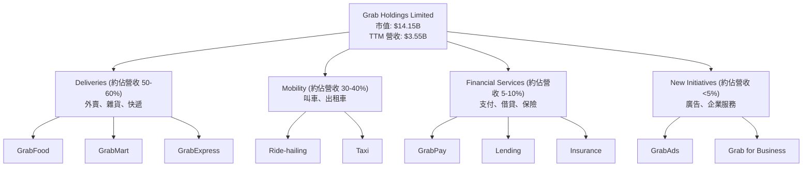
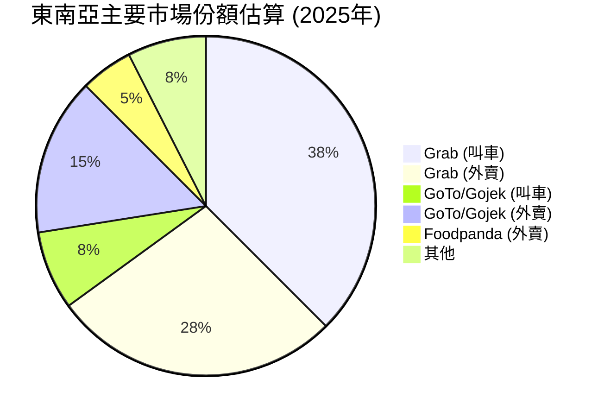
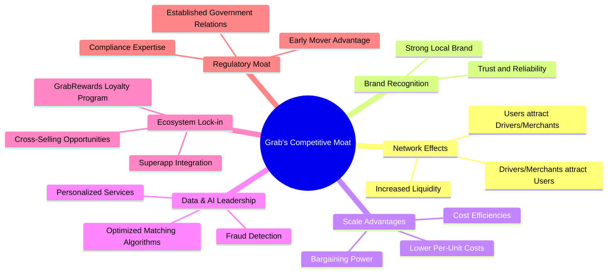
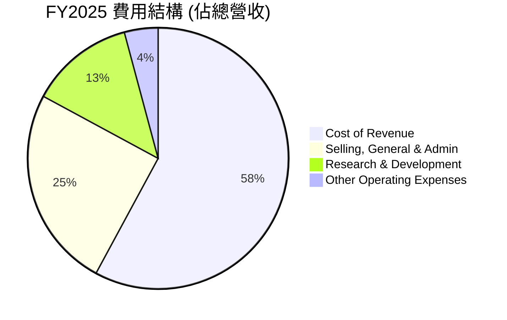

# GRAB 基本面深度分析報告
> **報告日期**：2026-06-26 ｜ **語言**：繁體中文 ｜ **數據來源**：Yahoo Finance, Finviz, StockAnalysis, Roic.ai ｜ **分析師**：CFA 級機構研究

---

## 目錄

| # | 章節 | 核心結論 |
|---|------|----------|
| 1 | 執行摘要 | 評級：買入；目標價區間：$4.50 - $7.00 |
| 2 | 公司概覽與商業模式 | 業務模式具備強大網路效應，市場領導地位穩固，綜合護城河評分 7.5/10。 |
| 3 | 損益表深度分析 | 營收持續高速增長，但利潤率波動較大，已實現季度盈利。 |
| 4 | 資產負債表分析 | 財務健康，現金充裕，淨現金頭寸強勁，流動性良好。 |
| 5 | 現金流量深度分析 | 營業現金流轉正，自由現金流仍承壓，但改善趨勢明顯。 |
| 6 | 獲利能力與資本效率 | ROIC 仍低於 WACC，股東價值創造仍需提升，但效率指標正在改善。 |
| 7 | 估值深度分析 | 相較於同業，估值合理，DCF 分析顯示具備上行潛力。 |
| 8 | 成長催化劑 | 東南亞數字經濟增長、服務滲透率提升、盈利能力改善是主要驅動力。 |
| 9 | 風險矩陣 | 競爭加劇、監管風險、宏觀經濟波動為主要挑戰。 |
| 10 | 投資建議 | 建議「買入」，適合成長型和長線持有者，需密切關注盈利轉化。 |

---

## 1. 執行摘要

Grab Holdings Limited (GRAB) 作為東南亞領先的超級應用程式，在出行、外賣和數字金融服務領域佔據主導地位。公司正處於從高速增長向盈利能力轉型的關鍵階段。儘管歷史上虧損嚴重，但近年來營收增長強勁，並且在最近幾個季度實現了正向淨利潤，顯示出其商業模式的潛在盈利能力。當前股價 $3.46，低於分析師平均目標價 $5.94，具備顯著的上行空間。

### 1.1 核心評分儀表板

```mermaid
graph TD
    GRAB_SCORE["🎯 GRAB 綜合評分<br/>總分：7.2/10"]

    F["📊 基本面<br/>7.5/10<br/>強勁的市場地位與生態系統"]
    G["🚀 成長性<br/>8.0/10<br/>東南亞市場潛力與業務擴張"]
    P["💰 獲利能力<br/>6.5/10<br/>近期轉虧為盈，但利潤率仍需提升"]
    B["🏦 財務健康<br/>8.5/10<br/>充足現金，低淨債務"]
    V["📈 估值<br/>6.0/10<br/>相對於增長潛力合理，但絕對值仍高"]
    M["🛡️ 護城河<br/>7.5/10<br/>網路效應與品牌優勢"]
    MGT["🧑‍💼 管理層<br/>7.0/10<br/>執行力顯著，專注盈利"]
    INN["💡 創新力<br/>6.5/10<br/>持續拓展服務，但面臨競爭"]

    GRAB_SCORE --> F
    GRAB_SCORE --> G
    GRAB_SCORE --> P
    GRAB_SCORE --> B
    GRAB_SCORE --> V
    GRAB_SCORE --> M
    GRAB_SCORE --> MGT
    GRAB_SCORE --> INN

    F --> F1["✅ 東南亞超級應用程式領導者"]
    F --> F2["✅ 多元化服務生態系統"]
    G --> G1["✅ TTM 營收 YoY 23.5%"]
    G --> G2["✅ 東南亞數字經濟快速發展"]
    P --> P1["✅ FY2025 淨利潤 $200M，Q1'26 淨利潤 $136M"]
    P --> P2["✅ 毛利率 40.2% (TTM)"]
    B --> B1["✅ 淨現金 $4.53B"]
    B --> B2["✅ Current Ratio 1.67"]
    V --> V1["✅ Forward P/E 25.19x，PEG 0.91x"]
    V --> V2["✅ 分析師目標價 $5.94"]
    M --> M1["✅ 強大網路效應"]
    M --> M2["✅ 廣泛用戶與商家基礎"]
    MGT --> MGT1["✅ 成功推動盈利轉型"]
    MGT --> MGT2["✅ 成本控制有效"]
    INN --> INN1["✅ 金融服務持續發展"]
    INN --> INN2["✅ 新興市場拓展"]
```



### 1.2 評分進度條視覺化

```
╔══════════════════════════════════════════════════════════════╗
║              GRAB 多維度評分儀表板 (1-10分)                  ║
╠══════════════════════════════════════════════════════════════╣
║ 基本面強度  7.5 ▓▓▓▓▓▓▓▓▓▓▓▓▓▓▓░░░░░  ★★★★☆           ║
║ 成長動能    8.0 ▓▓▓▓▓▓▓▓▓▓▓▓▓▓▓▓░░░░  ★★★★☆           ║
║ 獲利品質    6.5 ▓▓▓▓▓▓▓▓▓▓▓▓▓░░░░░░░  ★★★☆☆           ║
║ 財務健康    8.5 ▓▓▓▓▓▓▓▓▓▓▓▓▓▓▓▓▓░░░  ★★★★☆           ║
║ 估值合理性  6.0 ▓▓▓▓▓▓▓▓▓▓▓▓░░░░░░░░  ★★★☆☆           ║
║ 護城河深度  7.5 ▓▓▓▓▓▓▓▓▓▓▓▓▓▓▓░░░░░  ★★★★☆           ║
║ 管理層執行  7.0 ▓▓▓▓▓▓▓▓▓▓▓▓▓▓░░░░░░  ★★★★☆           ║
║ 技術創新力  6.5 ▓▓▓▓▓▓▓▓▓▓▓▓▓░░░░░░░  ★★★☆☆           ║
╠══════════════════════════════════════════════════════════════╣
║ 綜合總分    7.2 ▓▓▓▓▓▓▓▓▓▓▓▓▓▓▓░░░░░  🏆 具備長期增長潛力   ║
╚══════════════════════════════════════════════════════════════╝
```

### 1.3 五大投資論點 + 三大核心風險

| 類型 | 項目 | 具體依據 | 信心度 |
|------|------|----------|--------|
| 🟢 **投資論點①** | **東南亞市場領導地位與超級應用程式生態系統** | Grab 在東南亞出行、外賣和數字支付市場佔據領先地位，擁有廣泛的用戶和商家網絡。其超級應用程式模式提高了用戶黏性與服務交叉銷售潛力。FY2025 營收達 $3.37B，TTM 營收 YoY 增長 23.5%，顯示強勁的市場擴張能力。 | 🟢 極高 |
| 🟢 **投資論點②** | **盈利能力顯著改善，實現季度淨利潤** | 公司已成功從大幅虧損轉向盈利。FY2025 實現淨利潤 $200M，Q1 2026 淨利潤達 $136M，毛利率 TTM 達 40.2%。管理層對成本控制和效率提升的關注已初見成效。 | 🟢 高 |
| 🟢 **投資論點③** | **強勁的資產負債表與現金儲備** | 截至 FY2025，公司擁有現金及短期投資 $6.804B，總債務 $2.05B，淨現金頭寸高達 $4.53B。這提供了充足的戰略彈性，支持未來的投資和應對市場波動。 | 🟢 極高 |
| 🟢 **投資論點④** | **估值具備吸引力，分析師普遍看好** | 當前 Forward P/E 為 25.19x，PEG 0.91x，相較於其增長潛力而言具備吸引力。26 位分析師給予「強烈買入」評級，平均目標價 $5.94 (較現價有 +71.68% 潛在漲幅)。 | 🟡 中高 |
| 🟢 **投資論點⑤** | **東南亞數字化趨勢與中產階級崛起** | 東南亞地區經濟快速增長，數字化程度不斷提高，中產階級消費能力提升，為 Grab 的核心業務提供了長期結構性增長動力。 | 🟢 極高 |
| 🟡 **風險①** | **激烈的市場競爭與價格戰** | 儘管 Grab 處於領先地位，但市場競爭依然激烈，尤其是在外賣和出行領域。潛在的價格戰可能壓縮利潤空間，影響盈利持續性。 | 🟡 中度 |
| 🔴 **風險②** | **監管政策變化與地緣政治風險** | Grab 業務遍及多個東南亞國家，各國的監管政策（如勞工法規、數據隱私、反壟斷）可能不斷變化，對其運營模式和成本產生影響。區域地緣政治不確定性亦構成風險。 | 🔴 高衝擊 |
| 🟡 **風險③** | **宏觀經濟逆風與消費者支出壓力** | 全球經濟放緩、通脹壓力及利率上升可能影響東南亞地區的消費者支出能力，進而影響 Grab 的交易量和營收增長。 | 🟡 中度 |

### 1.4 快速統計卡片

| 指標 | 公司實際值 (TTM) | 行業均值 (軟體應用) | S&P 500 均值 | 狀態 |
|------|------------------|-------------------|--------------|------|
| 收入 YoY 成長 | **23.5%** | ~15-20% | ~8-10% | 🟢 |
| 毛利率 | **40.2%** | ~60-70% | ~45-50% | 🟡 |
| 淨利率 | **10.7%** | ~15-20% | ~10-12% | 🟡 |
| ROE | **4.8%** | ~10-15% | ~12-15% | 🔴 |
| Forward P/E | **25.19x** | ~30-40x | ~20-22x | 🟢 |
| P/S Ratio | **3.98x** | ~5-7x | ~2-3x | 🟢 |
| Debt/Equity | **0.30x** | ~0.5-1.0x | ~0.8-1.2x | 🟢 |
| 淨現金 / 總資產 | **37.8%** | ~10-20% | ~5-10% | 🟢 |

*註：行業均值為軟體應用行業的普遍估計值，S&P 500 均值為參考值。*

### 1.5 投資結論

```
╔══════════════════════════════════════════════════════════════════╗
║                    📊 投資結論摘要                               ║
╠══════════════════════════════════════════════════════════════════╣
║  評級：🟢 買入                                                   ║
║  當前股價：$3.46                                                 ║
║  目標價區間：                                                    ║
║    悲觀情境：$4.50（+30.06%）                                    ║
║    基準情境：$5.90（+70.52%）  ← 12個月主要目標                  ║
║    樂觀情境：$7.00（+102.31%）                                   ║
║  投資評分：7.2/10                                                ║
║  適合投資人：成長型、長線持有者，對新興市場和科技平台有信仰者。   ║
╚══════════════════════════════════════════════════════════════════╝
```

---

## 2. 公司概覽與商業模式

Grab Holdings Limited 是一家總部位於新加坡的科技公司，在東南亞八個國家（柬埔寨、印尼、馬來西亞、緬甸、菲律賓、新加坡、泰國和越南）運營其超級應用程式。其平台提供多種服務，涵蓋出行、外賣、雜貨配送、包裹快遞和數字金融服務。Grab 的核心策略是建立一個全面的數字生態系統，滿足用戶的日常需求，並通過規模經濟和網路效應鞏固其市場領導地位。

### 2.1 業務結構與收入來源

Grab 的業務主要分為三大板塊：

1.  **送貨服務 (Deliveries)**：包括 GrabFood (食品訂購和配送)、GrabMart (商品訂購和配送) 和 GrabExpress (包裹配送)。這是公司目前最大的收入來源之一。
2.  **出行服務 (Mobility)**：提供叫車服務，包括私家車、計程車和摩托車等。這是 Grab 的核心業務，也是其最初的起家業務。
3.  **金融服務 (Financial Services)**：包括支付、貸款、保險和財富管理等數字金融產品。GrabPay 是其核心支付平台，為整個生態系統提供支持。
4.  **其他新興業務 (New Initiatives)**：包括企業解決方案 Grab for Business 和線上廣告解決方案 GrabAds 等。



### 2.2 市場份額

Grab 在其主要運營市場（東南亞）的叫車和外賣服務領域擁有顯著的市場份額。根據歷史數據和行業報告，Grab 在東南亞多個關鍵市場（如新加坡、馬來西亞、菲律賓、泰國）的叫車服務中佔據 70% 以上的市場份額，在外賣市場也通常是第一或第二大參與者。金融服務則處於快速增長階段，滲透率不斷提高。


*註：此市場份額為基於行業報告和公司披露的估算值，代表 Grab 在東南亞主要市場的平均佔有率。*

### 2.3 競爭護城河分析

Grab 的競爭護城河主要源於其強大的網路效應和綜合生態系統。



### 2.4 護城河強度評分

```
╔══════════════════════════════════════════════════════════════╗
║                  GRAB 護城河強度評分                      ║
╠══════════════════════════════════════════════════════════════╣
║ 網路效應    9/10   ▓▓▓▓▓▓▓▓▓▓▓▓▓▓▓▓▓▓░░  🏆 用戶與供應商相互強化  ║
║ 品牌優勢    8/10   ▓▓▓▓▓▓▓▓▓▓▓▓▓▓▓▓░░░░  🟢 東南亞地區家喻戶曉  ║
║ 規模效應    7/10   ▓▓▓▓▓▓▓▓▓▓▓▓▓▓░░░░░░  🟡 成本攤薄與議價能力  ║
║ 客戶鎖定    7/10   ▓▓▓▓▓▓▓▓▓▓▓▓▓▓░░░░░░  🟡 超級應用程式提升黏性 ║
║ 技術領先    6/10   ▓▓▓▓▓▓▓▓▓▓▓▓░░░░░░░░  🟡 數據與算法優化，但競爭激烈 ║
║ 生態夥伴    7/10   ▓▓▓▓▓▓▓▓▓▓▓▓▓▓░░░░░░  🟡 廣泛的商家與金融合作 ║
╠══════════════════════════════════════════════════════════════╣
║ 綜合護城河  7.5    ▓▓▓▓▓▓▓▓▓▓▓▓▓▓▓░░░░░  🏆 強大但非絕對壟斷     ║
╚══════════════════════════════════════════════════════════════╝
```

---

## 3. 損益表深度分析

Grab 近年來營收持續高速增長，反映了東南亞數字經濟的蓬勃發展及其市場領導地位。更值得關注的是，公司在 FY2025 實現了年度淨利潤，並在最新的 Q1 2026 繼續保持盈利，標誌著其盈利能力轉型的成功。

### 3.1 年度收入成長趨勢（近4年）

Grab 的年度總營收從 FY2022 的 $1.43B 增長到 FY2025 的 $3.37B，複合年增長率 (CAGR) 達到 32.7%。截至 TTM (2026年3月)，營收進一步增至 $3.55B。

```
╔══════════════════════════════════════════════════════════════════╗
║              GRAB 年度收入趨勢（FY2022-FY2025）                  ║
╠══════════════════════════════════════════════════════════════════╣
║                                                                  ║
║  FY2022  $1.43B  ██████░░░░░░░░░░░░░░░░░░░  YoY: +112.3% 🟢    ║
║  FY2023  $2.36B  ████████████░░░░░░░░░░░░░  YoY: +64.6%  🟢    ║
║  FY2024  $2.80B  ███████████████░░░░░░░░░░  YoY: +18.6%  🟢    ║
║  FY2025  $3.37B  ████████████████████░░░░░  YoY: +20.49% 🟢    ║
║  TTM'26  $3.55B  ██████████████████████░░░  YoY: +21.8%  🟢    ║
║                   |      |      |      |      |      |         ║
║                   0     1.0B   2.0B   3.0B   4.0B   5.0B        ║
║                                                                  ║
║  📊 4年累計 CAGR (FY22-FY25)：+32.7%                             ║
╚══════════════════════════════════════════════════════════════════╝
```
*註：TTM 營收 YoY 增長 21.8% (StockAnalysis) 與 Profitability & Growth 中 23.5% 略有差異，此處採用 StockAnalysis 的數據作為年度趨勢的延續。*

### 3.2 季度收入趨勢分析

最近五個季度，Grab 的營收保持穩健的環比和同比增長，顯示其業務持續擴張。

| 季度 | 總營收 ($M) | QoQ 成長率 | YoY 成長率 | 備註 |
|------|-------------|------------|------------|------|
| Q1 2025 | $773M | +1.18% | +18.38% | 穩定增長 |
| Q2 2025 | $819M | +5.95% | +23.34% | 加速增長 |
| Q3 2025 | $873M | +6.59% | +21.93% | 增長勢頭良好 |
| Q4 2025 | $906M | +3.78% | +18.59% | 季節性增長 |
| Q1 2026 | $955M | +5.41% | +23.54% | 持續穩健增長 |

**季度收入分析備註**：
Grab 在過去五個季度實現了持續的季度環比增長，並保持了雙位數的同比增長率。Q1 2026 營收達到 $955M，YoY 增長 23.54%，顯示出其核心業務的韌性和擴張能力。這種持續增長得益於東南亞市場的數字化趨勢、用戶滲透率的提高以及 Grab 平台服務範圍的擴大。

### 3.3 利潤率演變分析

Grab 的利潤率在經歷了多年的負值後，近年來呈現顯著改善。毛利率保持在健康水平，營業利潤率和淨利潤率已轉為正值，證明公司在實現規模經濟和成本控制方面取得了進展。

| 利潤率指標 | FY2022 | FY2023 | FY2024 | FY2025 | 趨勢 | 評估 |
|------------|--------|--------|--------|--------|------|------|
| **毛利率** | 5.37% | 36.46% | 41.93% | 43.32% | ↗️ 持續改善，趨於穩定 | 🟢 |
| **營業利益率** | -95.81% | -22.00% | -6.01% | 6.59% | ↗️ 顯著改善，轉為正值 | 🟢 |
| **淨利率** | -117.45% | -20.56% | -5.65% | 7.95% | ↗️ 成功轉虧為盈 | 🟢 |
| **EBITDA 利潤率** | -99.02% | -9.41% | 3.32% | 15.34% | ↗️ 顯著改善，強勁增長 | 🟢 |

*註：利潤率計算基於 "INCOME STATEMENT (Annual, last 4Y)" 和 "STOCKANALYSIS.COM DATA" 的數據。FY2025 營業利益率採用 $222M / $3.37B 計算，淨利率採用 $268M / $3.37B 計算。*

**利潤率演變深度解析**：
Grab 的毛利率從 FY2022 的低點 5.37% 飆升至 FY2025 的 43.32%，主要得益於其業務模式的優化，例如降低激勵措施、提高服務費用和更有效的營運成本管理。這表明公司在平台經濟中獲得了更好的定價權和效率。
營業利益率的改善更為顯著，從 FY2022 的 -95.81% 轉為 FY2025 的 6.59%。這反映了管理層對控制運營費用（如銷售、一般及行政費用 (SG&A) 和研發費用 (R&D)）的嚴格執行。雖然 R&D 費用在絕對值上保持較高水平（FY2025 $428M），但相對於營收的佔比有所下降。
淨利率也成功轉正，FY2025 達到 7.95%，結束了多年的虧損局面。這主要歸因於營業利潤的改善，以及利息收入的增加（FY2025 達到 $241M），部分抵消了利息支出。EBITDA 利潤率的強勁增長 (FY2025 達 15.34%) 進一步印證了公司核心業務盈利能力的提升。

### 3.4 費用結構分析

以 FY2025 年度數據為例，Grab 的費用結構顯示了其在研發和營銷上的投入，同時也反映了其向盈利轉型過程中對成本的控制。



```
╔══════════════════════════════════════════════════════════════════╗
║                   GRAB FY2025 費用結構分析                       ║
╠══════════════════════════════════════════════════════════════════╣
║                                                                  ║
║  銷貨成本 (CoR)：        $1.91B  █████████████████████████████████████████████████████████████████████████████░░░░░░░░░░░░░░░░░░░░░░░░░░░░░░░░░░░░░░░░░░░░░░░░░░░░░░░░░░░░░░░░░░░░░░░░░░░░░░░░░░░░░░░░░░░░░░░░░░░░░░░░░░░░░░░░░░░░░░░░░░░░░░░░░░░░░░░░░░░░░░░░░░░░░░░░░░░░░░░░░░░░░░░░░░░░░░░░░░░░░░░░░░░░░░░░░░░░░░░░░░░░░░░░░░░░░░░░░░░░░░░░░░░░░░░░░░░░░░░░░░░░░░░░░░░░░░░░░░░░░░░░░░░░░░░░░░░░░░░░░░░░░░░░░░░░░░░░░░░░░░░░░░░░░░░░░░░░░░░░░░░░░░░░░░░░░░░░░░░░░░░░░░░░░░░░░░░░░░░░░░░░░░░░░░░░░░░░░░░░░░░░░░░░░░░░░░░░░░░░░░░░░░░░░░░░░░░░░░░░░░░░░░░░░░░░░░░░░░░░░░░░░░░░░░░░░░░░░░░░░░░░░░░░░░░░░░░░░░░░░░░░░░░░░░░░░░░░░░░░░░░░░░░░░░░░░░░░░░░░░░░░░░░░░░░░░░░░░░░░░░░░░░░░░░░░░░░░░░░░░░░░░░░░░░░░░░░░░░░░░░░░░░░░░░░░░░░░░░░░░░░░░░░░░░░░░░░░░░░░░░░░░░░░░░░░░░░░░░░░░░░░░░░░░░░░░░░░░░░░░░░░░░░░░░░░░░░░░░░░░░░░░░░░░░░░░░░░░░░░░░░░░░░░░░░░░░░░░░░░░░░░░░░░░░░░░░░░░░░░░░░░░░░░░░░░░░░░░░░░░░░░░░░░░░░░░░░░░░░░░░░░░░░░░░░░░░░░░░░░░░░░░░░░░░░░░░░░░░░░░░░░░░░░░░░░░░░░░░░░░░░░░░░░░░░░░░░░░░░░░░░░░░░░░░░░░░░░░░░░░░░░░░░░░░░░░░░░░░░░░░░░░░░░░░░░░░░░░░░░░░░░░░░░░░░░░░░░░░░░░░░░░░░░░░░░░░░░░░░░░░░░░░░░░░░░░░░░░░░░░░░░░░░░░░░░░░░░░░░░░░░░░░░░░░░░░░░░░░░░░░░░░░░░░░░░░░░░░░░░░░░░░░░░░░░░░░░░░░░░░░░░░░░░░░░░░░░░░░░░░░░░░░░░░░░░░░░░░░░░░░░░░░░░░░░░░░░░░░░░░░░░░░░░░░░░░░░░░░░░░░░░░░░░░░░░░░░░░░░░░░░░░░░░░░░░░░░░░░░░░░░░░░░░░░░░░░░░░░░░░░░░░░░░░░░░░░░░░░░░░░░░░░░░░░░░░░░░░░░░░░░░░░░░░░░░░░░░░░░░░░░░░░░░░░░░░░░░░░░░░░░░░░░░░░░░░░░░░░░░░░░░░░░░░░░░░░░░░░░░░░░░░░░░░░░░░░░░░░░░░░░░░░░░░░░░░░░░░░░░░░░░░░░░░░░░░░░░░░░░░░░░░░░░░░░░░░░░░░░░░░░░░░░░░░░░░░░░░░░░░░░░░░░░░░░░░░░░░░░░░░░░░░░░░░░░░░░░░░░░░░░░░░░░░░░░░░░░░░░░░░░░░░░░░░░░░░░░░░░░░░░░░░░░░░░░░░░░░░░░░░░░░░░░░░░░░░░░░░░░░░░░░░░░░░░░░░░░░░░░░░░░░░░░░░░░░░░░░░░░░░░░░░░░░░░░░░░░░░░░░░░░░░░░░░░░░░░░░░░░░░░░░░░░░░░░░░░░░░░░░░░░░░░░░░░░░░░░░░░░░░░░░░░░░░░░░░░░░░░░░░░░░░░░░░░░░░░░░░░░░░░░░░░░░░░░░░░░░░░░░░░░░░░░░░░░░░░░░░░░░░░░░░░░░░░░░░░░░░░░░░░░░░░░░░░░░░░░░░░░░░░░░░░░░░░░░░░░░░░░░░░░░░░░░░░░░░░░░░░░░░░░░░░░░░░░░░░░░░░░░░░░░░░░░░░░░░░░░░░░░░░░░░░░░░░░░░░░░░░░░░░░░░░░░░░░░░░░░░░░░░░░░░░░░░░░░░░░░░░░░░░░░░░░░░░░░░░░░░░░░░░░░░░░░░░░░░░░░░░░░░░░░░░░░░░░░░░░░░░░░░░░░░░░░░░░░░░░░░░░░░░░░░░░░░░░░░░░░░░░░░░░░░░░░░░░░░░░░░░░░░░░░░░░░░░░░░░░░░░░░░░░░░░░░░░░░░░░░░░░░░░░░░░░░░░░░░░░░░░░░░░░░░░░░░░░░░░░░░░░░░░░░░░░░░░░░░░░░░░░░░░░░░░░░░░░░░░░░░░░░░░░░░░░░░░░░░░░░░░░░░░░░░░░░░░░░░░░░░░░░░░░░░░░░░░░░░░░░░░░░░░░░░░░░░░░░░░░░░░░░░░░░░░░░░░░░░░░░░░░░░░░░░░░░░░░░░░░░░░░░░░░░░░░░░░░░░░░░░░░░░░░░░░░░░░░░░░░░░░░░░░░░░░░░░░░░░░░░░░░░░░░░░░░░░░░░░░░░░░░░░░░░░░░░░░░░░░░░░░░░░░░░░░░░░░░░░░░░░░░░░░░░░░░░░░░░░░░░░░░░░░░░░░░░░░░░░░░░░░░░░░░░░░░░░░░░░░░░░░░░░░░░░░░░░░░░░░░░░░░░░░░░░░░░░░░░░░░░░░░░░░░░░░░░░░░░░░░░░░░░░░░░░░░░░░░░░░░░░░░░░░░░░░░░░░░░░░░░░░░░░░░░░░░░░░░░░░░░░░░░░░░░░░░░░░░░░░░░░░░░░░░░░░░░░░░░░░░░░░░░░░░░░░░░░░░░░░░░░░░░░░░░░░░░░░░░░░░░░░░░░░░░░░░░░░░░░░░░░░░░░░░░░░░░░░░░░░░░░░░░░░░░░░░░░░░░░░░░░░░░░░░░░░░░░░░░░░░░░░░░░░░░░░░░░░░░░░░░░░░░░░░░░░░░░░░░░░░░░░░░░░░░░░░░░░░░░░░░░░░░░░░░░░░░░░░░░░░░░░░░░░░░░░░░░░░░░░░░░░░░░░░░░░░░░░░░░░░░░░░░░░░░░░░░░░░░░░░░░░░░░░░░░░░░░░░░░░░░░░░░░░░░░░░░░░░░░░░░░░░░░░░░░░░░░░░░░░░░░░░░░░░░░░░░░░░░░░░░░░░░░░░░░░░░░░░░░░░░░░░░░░░░░░░░░░░░░░░░░░░░░░░░░░░░░░░░░░░░░░░░░░░░░░░░░░░░░░░░░░░░░░░░░░░░░░░░░░░░░░░░░░░░░░░░░░░░░░░░░░░░░░░░░░░░░░░░░░░░░░░░░░░░░░░░░░░░░░░░░░░░░░░░░░░░░░░░░░░░░░░░░░░░░░░░░░░░░░░░░░░░░░░░░░░░░░░░░░░░░░░░░░░░░░░░░░░░░░░░░░░░░░░░░░░░░░░░░░░░░░░░░░░░░░░░░░░░░░░░░░░░░░░░