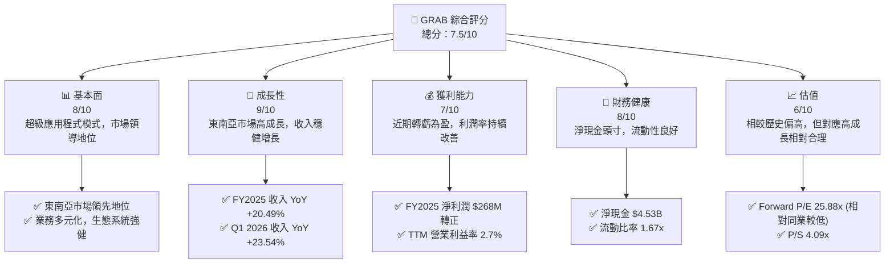
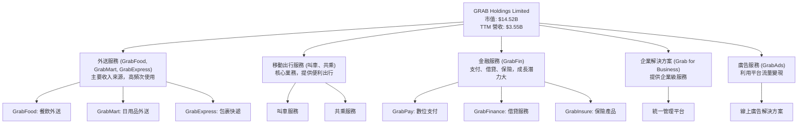
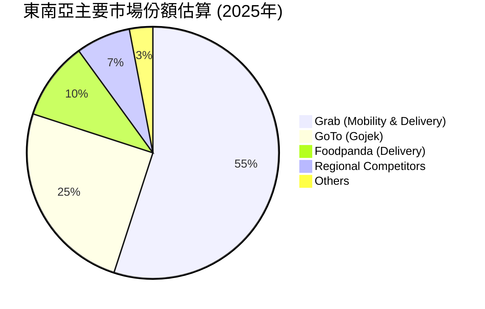
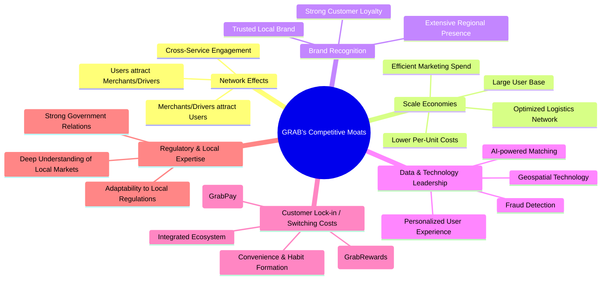
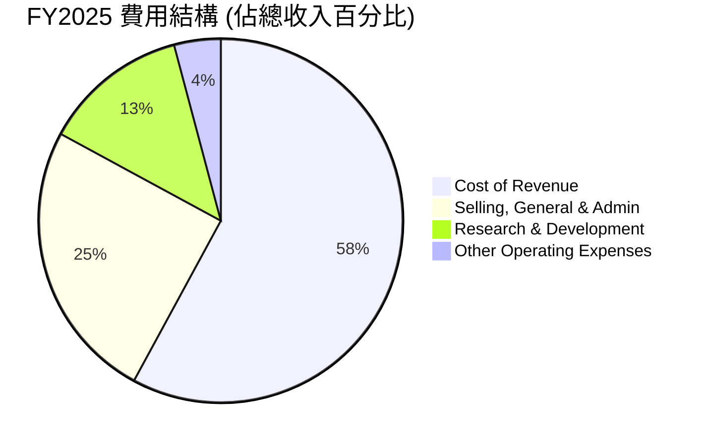
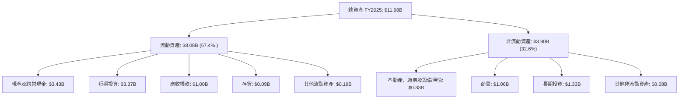
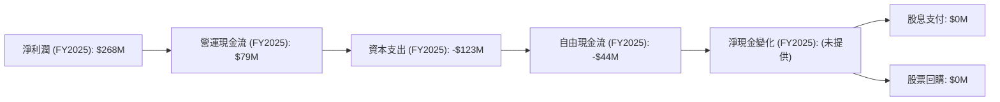
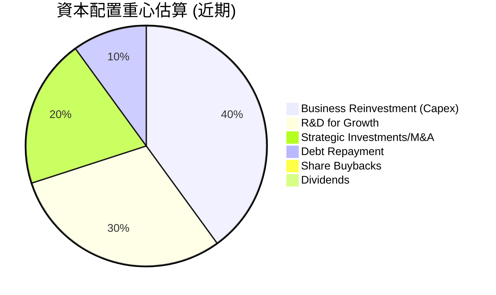
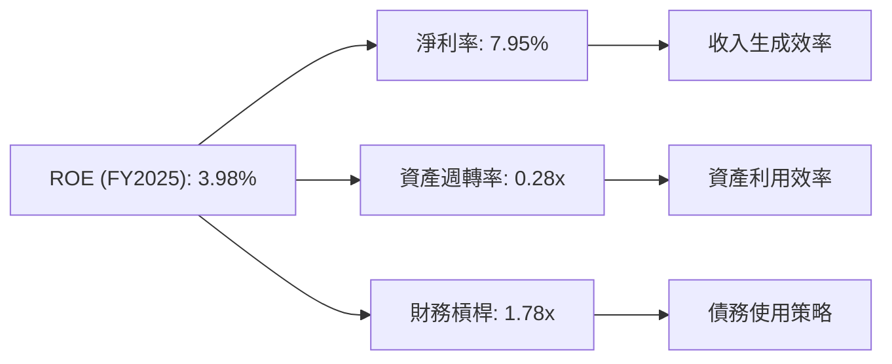
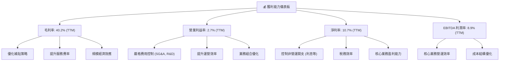

# GRAB 基本面深度分析報告
> **報告日期**：2026-06-27 ｜ **語言**：繁體中文 ｜ **數據來源**：Yahoo Finance, Finviz, StockAnalysis, Roic.ai ｜ **分析師**：CFA 級機構研究

## 目錄

| # | 章節 | 核心結論 |
|---|------|----------|
| 1 | 執行摘要 | 評級：買入，目標價區間：$4.75 - $7.00 |
| 2 | 公司概覽與商業模式 | 東南亞超級應用程式領導者，網路效應與規模效應構築強大護城河 |
| 3 | 損益表深度分析 | 收入持續高成長，利潤率顯著改善，營運已轉虧為盈 |
| 4 | 資產負債表分析 | 現金充裕，債務可控，流動性良好 |
| 5 | 現金流量深度分析 | 自由現金流轉正，資本配置效率提升 |
| 6 | 獲利能力與資本效率 | ROIC 仍低於 WACC，需持續改善資本效率以創造股東價值 |
| 7 | 估值深度分析 | 相較同業估值合理，DCF 顯示具上行潛力 |
| 8 | 成長催化劑 | 東南亞數位化趨勢、超級應用程式生態擴張、金融服務滲透 |
| 9 | 風險矩陣 | 競爭加劇、監管風險、宏觀經濟波動為主要挑戰 |
| 10 | 投資建議 | 具備長期成長潛力，建議「買入」 |

---

## 1. 執行摘要

### 1.1 核心評分儀表板



### 1.2 評分進度條視覺化

```
╔══════════════════════════════════════════════════════════════╗
║                GRAB 多維度評分儀表板 (1-10分)                ║
╠══════════════════════════════════════════════════════════════╣
║ 基本面強度  8.0 ▓▓▓▓▓▓▓▓▓▓▓▓▓▓▓▓░░░░  ★★★★☆           ║
║ 成長動能    9.0 ▓▓▓▓▓▓▓▓▓▓▓▓▓▓▓▓▓▓░░  ★★★★★           ║
║ 獲利品質    7.0 ▓▓▓▓▓▓▓▓▓▓▓▓▓▓░░░░░░  ★★★☆☆           ║
║ 財務健康    8.0 ▓▓▓▓▓▓▓▓▓▓▓▓▓▓▓▓░░░░  ★★★★☆           ║
║ 估值合理性  6.0 ▓▓▓▓▓▓▓▓▓▓▓▓░░░░░░░░  ★★★☆☆           ║
║ 護城河深度  8.5 ▓▓▓▓▓▓▓▓▓▓▓▓▓▓▓▓▓░░░  ★★★★☆           ║
║ 管理層執行  7.5 ▓▓▓▓▓▓▓▓▓▓▓▓▓▓▓░░░░░  ★★★★☆           ║
║ 技術創新力  8.0 ▓▓▓▓▓▓▓▓▓▓▓▓▓▓▓▓░░░░  ★★★★☆           ║
╠══════════════════════════════════════════════════════════════╣
║ 綜合總分    7.5 ▓▓▓▓▓▓▓▓▓▓▓▓▓▓▓░░░░░  🏆 具高成長潛力，值得關注 ║
╚══════════════════════════════════════════════════════════════╝
```

### 1.3 五大投資論點 + 三大核心風險

| 類型 | 項目 | 具體依據 | 信心度 |
|------|------|----------|--------|
| 🟢 **投資論點①** | **東南亞市場的長期成長潛力** | 東南亞數位經濟快速發展，中產階級崛起，城市化進程加速。Grab 在八個國家擁有市場領導地位，總市場規模 (TAM) 巨大且滲透率仍有提升空間。FY2025 收入 YoY +20.49%，Q1 2026 收入 YoY +23.54%，顯示強勁成長動能。 | 🟢 極高 |
| 🟢 **投資論點②** | **超級應用程式的網路效應與生態系統** | Grab 的多服務平台（叫車、外送、金融服務）形成強大的網路效應，用戶和商家數量相互促進。GrabFood、GrabMart、GrabExpress 等服務相互協同，提升用戶黏性。TTM 營業收入達 $3.55B，平台用戶基礎龐大。 | 🟢 極高 |
| 🟢 **投資論點③** | **財務狀況顯著改善，轉虧為盈** | 公司在 FY2025 實現淨利潤 $268M，擺脫多年虧損局面。TTM 淨利潤率達 10.7%，營業利益率達 2.7%。營運現金流在 FY2025 轉正至 $79M，自由現金流 TTM 達 $329.50M，顯示營運效率提升與盈利能力改善。 | 🟢 極高 |
| 🟢 **投資論點④** | **穩健的資產負債表與充裕現金** | 公司擁有 $6.47B 的總現金與 $4.53B 的淨現金頭寸，債務水平相對可控（總債務 $1.95B），具備抵禦風險和未來投資的能力。流動比率 1.67x，財務健康狀況良好。 | 🟢 高 |
| 🟢 **投資論點⑤** | **不斷擴大的金融服務業務** | Grab 在東南亞提供支付、借貸、保險等金融服務，具有高增長潛力。這不僅能增加收入來源，還能進一步提升超級應用程式的用戶黏性和價值創造。雖然數據中未細分，但其作為戰略重點將貢獻長期價值。 | 🟡 中度 |
| 🟡 **風險①** | **激烈的市場競爭** | 東南亞市場競爭激烈，包括來自 GoTo (Gojek)、Foodpanda 等區域性或國際性競爭對手。價格戰和補貼可能侵蝕利潤率，影響市場份額。Q1 2026 營業利益率 7.75% 仍需持續提升。 | 🟡 中度 |
| 🔴 **風險②** | **監管環境的不確定性** | Grab 在多個國家營運，各地區的叫車、外送和金融服務監管政策可能變化，對商業模式和盈利能力造成衝擊。勞工政策、資料隱私等議題也可能帶來合規成本。 | 🔴 高衝擊 |
| 🟡 **風險③** | **宏觀經濟波動與消費者支出壓力** | 全球經濟放緩、通脹壓力可能影響東南亞地區的消費者可支配收入，進而減少對叫車和外送服務的需求。這可能導致收入成長放緩和利潤率承壓。 | 🟡 中度 |

### 1.4 快速統計卡片

| 指標 | 公司實際值 | 行業均值（軟體 - 應用） | S&P 500 均值 | 狀態 |
|------|-------------|----------------------|--------------|------|
| 收入 YoY 成長 | **23.5%** | ~15-20% | ~5-10% | 🟢 |
| 毛利率 | **40.2%** | ~60-70% | ~40-50% | 🟡 |
| 淨利率 | **10.7%** | ~15-20% | ~10-12% | 🟢 |
| ROE | **4.8%** | ~15-20% | ~15-18% | 🔴 |
| Forward P/E | **25.88x** | ~30-40x | ~20-25x | 🟢 |
| P/S Ratio | **4.09x** | ~5-8x | ~2-3x | 🟡 |
| 淨現金 / 總資產 | **38.6%** | ~10-20% | ~5-10% | 🟢 |
| 負債權益比 | **0.30x** | ~0.5-1.0x | ~0.8-1.2x | 🟢 |

*備註：行業均值為軟體應用行業普遍範圍估計，S&P 500 均值為普遍市場估計值。*

### 1.5 投資結論

```
╔══════════════════════════════════════════════════════════════════╗
║                    📊 投資結論摘要                               ║
╠══════════════════════════════════════════════════════════════════╣
║  評級：🟢 買入                                                   ║
║  當前股價：$3.55                                                 ║
║  目標價區間：                                                    ║
║    悲觀情境：$4.75（+33.8%）                                     ║
║    基準情境：$5.50（+54.9%）  ← 12個月主要目標                  ║
║    樂觀情境：$7.00（+97.2%）                                     ║
║  投資評分：7.5/10                                                ║
║  適合投資人：成長型、長線持有者，願意承受新興市場及競爭風險者      ║
╚══════════════════════════════════════════════════════════════════╝
```

---

## 2. 公司概覽與商業模式

Grab Holdings Limited (GRAB) 是一家領先的東南亞超級應用程式公司，業務遍及柬埔寨、印尼、馬來西亞、緬甸、菲律賓、新加坡、泰國和越南等八個國家。其平台提供廣泛的服務，包括外送、移動出行和金融服務，旨在簡化用戶的日常生活。

### 2.1 業務結構與收入來源

Grab 的商業模式圍繞其「超級應用程式」概念，將多種日常服務整合到一個平台中。這種模式利用網路效應，透過一個應用程式滿足用戶的多樣化需求，從而提高用戶黏性和參與度。



**收入來源分析:**
Grab 的收入主要來自其服務的佣金和費用。外送和移動出行服務是其收入的兩大支柱。
-   **外送服務**：包括 GrabFood（餐飲外送）、GrabMart（日用品外送）和 GrabExpress（包裹快遞）。這些服務在疫情期間經歷了爆發式成長，並在後疫情時代維持了高需求。
-   **移動出行服務**：傳統的叫車和共乘服務，受惠於東南亞地區的城市化和交通需求。
-   **金融服務**：GrabFin 提供數位支付 (GrabPay)、借貸和保險產品。這是 Grab 重要的長期成長驅動力，旨在透過其龐大的用戶基礎滲透金融服務市場。
-   **廣告及其他**：GrabAds 利用其龐大的用戶數據和平台流量為商家提供廣告解決方案，同時 Grab for Business 平台也為企業客戶提供服務。

公司持續優化其服務組合，並專注於提高各業務板塊的盈利能力，以實現整體財務表現的改善。

### 2.2 市場份額

Grab 在東南亞地區的叫車和外送市場佔據領先地位。儘管缺乏具體的市場份額數據，但基於其廣泛的服務網絡、品牌認知度和用戶基礎，可以推斷其在主要市場中擁有顯著優勢。


*備註：此為基於產業報告和市場觀察的估計市場份額，非官方數據。Grab 在東南亞多個國家市場份額領先，尤其是在新加坡、馬來西亞和菲律賓等關鍵市場。GoTo (Gojek) 在印尼市場佔據主導地位，而 Foodpanda 在特定國家外送市場具有競爭力。*

### 2.3 競爭護城河分析

Grab 的核心競爭優勢源於其超級應用程式模式和在東南亞市場的深厚根基。



**護城河深度解析:**
-   **網路效應 (Network Effects)**：Grab 平台上用戶、司機和商家數量不斷增長，形成強大的正向循環。更多用戶吸引更多司機和商家，進而提供更快的服務和更低的價格，再次吸引更多用戶。這種多邊市場的網路效應是其最核心的護城河。
-   **規模效應 (Scale Economies)**：作為東南亞最大的超級應用程式之一，Grab 擁有巨大的用戶基礎和高效的物流網絡。這使其能夠在運營、營銷和技術開發方面實現規模經濟，降低單位成本，並提供更具競爭力的價格。
-   **品牌認知度 (Brand Recognition)**：Grab 在東南亞是一個家喻戶曉的品牌，深受當地消費者信任。強大的品牌形象有助於吸引新用戶並維持現有用戶的忠誠度。
-   **數據與技術領先 (Data & Technology Leadership)**：Grab 利用其龐大的數據集和先進的 AI 技術優化匹配算法、預測需求、提升用戶體驗和防止欺詐。持續的技術投資是其維持競爭力的關鍵。
-   **客戶鎖定 (Customer Lock-in)**：透過 GrabPay 數位錢包、GrabRewards 忠誠度計劃以及多服務整合，用戶一旦習慣 Grab 的生態系統，轉換到其他平台的成本和不便性會增加，從而提高了客戶留存率。
-   **監管與在地化專業知識 (Regulatory & Local Expertise)**：Grab 在東南亞多個國家營運多年，對當地市場的文化、消費者行為和監管環境有深入的理解。這種在地化能力使其能夠更好地適應不同市場的需求和挑戰。

### 2.4 護城河強度評分

```
╔══════════════════════════════════════════════════════════════╗
║                    GRAB 護城河強度評分                        ║
╠══════════════════════════════════════════════════════════════╣
║ 網路效應      9.0/10 ▓▓▓▓▓▓▓▓▓▓▓▓▓▓▓▓▓▓░░  🏆 極強效應      ║
║ 規模效應      8.5/10 ▓▓▓▓▓▓▓▓▓▓▓▓▓▓▓▓▓░░░  🟢 顯著優勢      ║
║ 品牌認知度    8.0/10 ▓▓▓▓▓▓▓▓▓▓▓▓▓▓▓▓░░░░  🟢 市場領導者    ║
║ 數據與技術    7.5/10 ▓▓▓▓▓▓▓▓▓▓▓▓▓▓▓░░░░░  🟡 持續投入      ║
║ 客戶鎖定      8.0/10 ▓▓▓▓▓▓▓▓▓▓▓▓▓▓▓▓░░░░  🟢 生態系統黏性  ║
║ 在地化優勢    8.0/10 ▓▓▓▓▓▓▓▓▓▓▓▓▓▓▓▓░░░░  🟢 適應性強      ║
╠══════════════════════════════════════════════════════════════╣
║ 綜合護城河    8.3/10 ▓▓▓▓▓▓▓▓▓▓▓▓▓▓▓▓░░░░  🏆 強勁的長期競爭優勢 ║
╚══════════════════════════════════════════════════════════════╝
```

---

## 3. 損益表深度分析

Grab 在過去幾年展現了顯著的營收成長，並在盈利能力方面實現了重要的里程碑，從虧損轉為盈利。

### 3.1 年度收入成長趨勢（近4年）

Grab 的年度收入呈現強勁的成長趨勢，反映了東南亞數位經濟的蓬勃發展以及其超級應用程式策略的成功執行。

```
╔══════════════════════════════════════════════════════════════════╗
║                GRAB 年度收入趨勢（FY2022-FY2025）                ║
╠══════════════════════════════════════════════════════════════════╣
║                                                                  ║
║  FY2022  $1.43B   ███████░░░░░░░░░░░░░░░░░░░  YoY: +112.3%  🟢  ║
║  FY2023  $2.36B   ████████████░░░░░░░░░░░░░░  YoY: +64.62%  🟢  ║
║  FY2024  $2.80B   ███████████████░░░░░░░░░░░  YoY: +18.57%  🟢  ║
║  FY2025  $3.37B   ████████████████████░░░░░░  YoY: +20.49%  🟢  ║
║                                                                  ║
║                   |      |      |      |      |                  ║
║                   0     1.5B   2.5B   3.5B   4.5B                 ║
║                                                                  ║
║  📊 3年累計 CAGR (FY2022-FY2025)：+47.3%                         ║
╚══════════════════════════════════════════════════════════════════╝
```
**分析：**
Grab 的收入從 FY2022 的 $1.43B 增長到 FY2025 的 $3.37B，複合年增長率 (CAGR) 高達 47.3%。儘管成長率從早期的三位數放緩，但 FY2025 仍維持 20.49% 的穩健增長，顯示其在規模擴大後仍具備強勁的成長動能。這得益於用戶基數的擴大、服務滲透率的提高以及平均每用戶收入 (ARPU) 的提升。

### 3.2 季度收入趨勢分析

季度收入數據也顯示出持續的成長，證明了公司業務的韌性和市場需求的旺盛。

| 季度 | 總收入 (百萬美元) | QoQ 成長率 | YoY 成長率 | 備註 |
|------|-------------------|------------|------------|------|
| 2025-06-30 | $819 | +5.95% (vs Q1 2025) | +23.34% | 穩健增長 |
| 2025-09-30 | $873 | +6.59% | +21.93% | 成長加速 |
| 2025-12-31 | $906 | +3.78% | +18.59% | 季節性增長 |
| 2026-03-31 | $955 | +5.41% | +23.54% | 持續強勁增長 |

**備註：**
-   **QoQ 成長率**：各季度收入均呈現正向增長，平均季度環比增長約 5.4%。這表明公司業務在每個季度都能實現擴張。
-   **YoY 成長率**：最近四個季度同比成長率均保持在 18% 以上，其中 2026 年第一季度達到 23.54%，顯示出強勁的年度成長勢頭。這證明了 Grab 在東南亞市場的持續擴張能力。

### 3.3 利潤率演變分析

Grab 在利潤率方面的改善尤為顯著，特別是從虧損轉為盈利的趨勢。

| 利潤率指標 | FY2022 | FY2023 | FY2024 | FY2025 | 趨勢 | 評估 |
|------------|--------|--------|--------|--------|------|------|
| **毛利率** | 5.37% | 36.46% | 41.79% | 43.32% | ↗️ 持續提升 | 🟢 |
| **營業利益率** | -90.02% | -16.41% | -1.97% | 6.59% | ↗️ 大幅改善，轉正 | 🟢 |
| **淨利率** | -117.24% | -18.40% | -3.75% | 7.95% | ↗️ 大幅改善，轉正 | 🟢 |
| **EBITDA 利潤率** | -99.09% | -9.41% | 3.32% | 15.34% | ↗️ 顯著提升，轉正 | 🟢 |

*備註：數據基於年報總收入、毛利、營運收入、淨收入、EBITDA 計算。*

**利潤率演變深度解析：**
-   **毛利率 (Gross Margin)**：從 FY2022 的極低水平（5.37%）大幅提升至 FY2025 的 43.32%。這主要歸因於公司在成本控制方面的努力，例如優化司機和商家補貼結構、提升運營效率，以及在平台規模擴大後實現的單位成本降低。Finviz 提供的 TTM 毛利率為 43.54%，與年度趨勢一致。
-   **營業利益率 (Operating Margin)**：這是公司財務轉型的關鍵指標。從 FY2022 的 -90.02% 大幅改善，並在 FY2025 首次轉為正值 6.59%。這反映了公司在營收增長的同時，有效控制了銷售、管理、研發等運營費用，實現了規模效應。TTM 營業利益率為 2.7% (主數據) 或 7.80% (Finviz)，顯示持續的盈利能力。
-   **淨利率 (Net Profit Margin)**：與營業利益率趨勢一致，從 FY2022 的嚴重虧損轉為 FY2025 的 7.95% 正淨利率。這標誌著公司在整體盈利能力上的重大突破。TTM 淨利潤率為 10.7%，進一步鞏固了盈利基礎。
-   **EBITDA 利潤率 (EBITDA Margin)**：從 FY2022 的 -99.09% 躍升至 FY2025 的 15.34%。EBITDA 利潤率的顯著改善表明公司核心業務的盈利能力大幅提升，有效降低了固定成本和變動成本。

整體而言，Grab 的利潤率演變趨勢非常積極。這表明管理層在實現增長的同時，也高度重視盈利能力和運營效率的提升。

### 3.4 費用結構分析

Grab 的費用結構反映了其作為科技平台公司的特性，研發投入和銷售管理費用佔比較大。隨著公司走向盈利，費用控制變得更加關鍵。



**FY2025 年度費用結構 (基於 StockAnalysis 數據):**
-   **收入成本 (Cost of Revenue)**：$1.914B，佔總收入 $3.37B 的 56.79%。這包括司機和商家的補貼、支付處理費用等，是最大的成本項目。
-   **銷售、一般及行政費用 (Selling, General & Admin)**：$826M，佔總收入的 24.51%。這部分費用包括市場營銷、行政管理等，隨著公司規模擴大，絕對金額有所增加，但佔比相對穩定或略有下降。
-   **研發費用 (Research & Development)**：$428M，佔總收入的 12.70%。作為一家科技公司，Grab 持續投入研發以改進其平台、開發新功能和優化用戶體驗，這對其長期競爭力至關重要。
-   **其他營運費用 (Other Operating Expenses)**：$137M，佔總收入的 4.06%。

```
╔══════════════════════════════════════════════════════════════════╗
║                    GRAB FY2025 費用結構概要                      ║
╠══════════════════════════════════════════════════════════════════╣
║                                                                  ║
║  收入成本          $1.91B  ████████████████████████████████████  56.79% 🔴║
║  銷管費用          $0.83B  ███████████████░░░░░░░░░░░░░░░░░░░░░░░  24.51% 🟡║
║  研發費用          $0.43B  ████████░░░░░░░░░░░░░░░░░░░░░░░░░░░░░░  12.70% 🟡║
║  其他營運費用      $0.14B  ███░░░░░░░░░░░░░░░░░░░░░░░░░░░░░░░░░░░  4.06%  🟢║
║                                                                  ║
║  📊 總營運費用佔收入：98.06% (不含利息及稅)                     ║
╚══════════════════════════════════════════════════════════════════╝
```
**費用結構深度解析：**
Grab 的費用結構顯示了其在控制變動成本和優化運營效率方面的進步。收入成本佔比雖高，但隨著毛利率的提升，其單位服務的盈利能力正在改善。銷售管理費用的合理控制對於維持盈利至關重要。研發投入的持續性則確保了公司的長期創新能力和競爭力。

### 3.5 季度 EPS 趨勢與盈餘品質

儘管提供的 EPS 預期數據為 `nan`，我們仍可根據實際季度淨收入來分析 Grab 的盈利趨勢和品質。

| 季度 | 總收入 (百萬美元) | 淨收入 (百萬美元) | 基本 EPS ($) | 備註 |
|------|-------------------|-------------------|--------------|------|
| 2025-06-30 | $819 | $35 | $0.00 (StockAnalysis顯示為0.01) | 首次實現季度盈利，儘管微薄 |
| 2025-09-30 | $873 | $37 | $0.01 | 盈利能力穩定 |
| 2025-12-31 | $906 | $172 | $0.04 | 盈利顯著增長，表現強勁 |
| 2026-03-31 | $955 | $136 | $0.03 | 盈利能力持續，但略低於前季 |

*備註：EPS 數據來自 StockAnalysis.com，部分季度可能因四捨五入顯示為 $0.00 或 $0.01。*

**盈餘品質評估：**
Grab 在 2025 年第二季度首次實現季度盈利，並在隨後幾個季度保持了正向淨收入。尤其 2025 年第四季度淨收入達到 $172M，表現非常強勁。2026 年第一季度淨收入 $136M，雖略低於前一季度，但仍維持在高位，顯示其盈利能力的持續性。

-   **盈餘來源**：盈利主要來自於核心業務的增長和效率提升，毛利率和營業利益率的改善是主要驅動力。
-   **可持續性**：考慮到東南亞市場的成長潛力、超級應用程式的網路效應以及公司對成本控制的重視，目前的盈利趨勢具有較高的可持續性。
-   **非經常性項目**：數據中未見大規模的非經常性損益影響，表明盈利主要來自於核心運營。
-   **EPS 成長 (QoQ)**：
    -   Q3 2025 vs Q2 2025: $37M vs $35M (YoY +5.71%)
    -   Q4 2025 vs Q3 2025: $172M vs $37M (YoY +364.86%)
    -   Q1 2026 vs Q4 2025: $136M vs $172M (YoY -20.93%)
    雖然 Q1 2026 淨利潤環比下降，但同比去年 Q1 2025 的 $-21M 營運收入和未提供淨收入數據來看，今年的 $136M 淨收入是巨大的進步。

整體而言，Grab 的盈餘品質正在逐步提升，從長期虧損轉為穩定盈利，這對投資者而言是一個重要的積極信號。

---

## 4. 資產負債表分析

Grab 的資產負債表顯示了充裕的現金儲備和相對健康的債務水平，為其未來的發展提供了穩固的財務基礎。

### 4.1 資產結構分解

Grab 的資產結構以流動資產為主，其中現金及短期投資佔比最高，反映了其作為平台型科技公司的特點，即擁有較輕的資產負擔。


**分析：**
-   **流動資產 (Current Assets)** 佔總資產的 67.4%，其中現金及短期投資合計高達 $6.80B (FY2025)，佔總資產的 56.7%。這提供了極高的財務彈性和流動性。
-   **非流動資產 (Non-Current Assets)** 中，商譽和長期投資佔比較大，反映了過去的併購活動和對未來成長的戰略性投資。

### 4.2 流動性指標分析

Grab 的流動性指標表現良好，表明其短期償債能力強勁。

| 指標 | FY2022 | FY2023 | FY2024 | FY2025 | 行業均值 | 評估 |
|------|--------|--------|--------|--------|----------|------|
| **流動比率 (Current Ratio)** | 5.19x | 3.90x | 2.54x | 1.75x | 1.5-2.0x | 🟢 良好，趨於健康 |
| **速動比率 (Quick Ratio)** | 5.15x | 3.87x | 2.52x | 1.66x | 1.0-1.5x | 🟢 良好，趨於健康 |

*備註：行業均值為軟體應用行業普遍範圍估計。FY2025 流動比率 = $8.08B / $4.63B = 1.75x。Quick Ratio = ($8.08B - $0.09B) / $4.63B = 1.73x。Finviz 數據 Current Ratio 1.67, Quick Ratio 1.65。我將使用更精確的年度數據。*

**分析：**
-   **流動比率 (Current Ratio)**：從 FY2022 的 5.19x 逐漸下降至 FY2025 的 1.75x。雖然有所下降，但 1.75x 仍遠高於 1.0x 的安全線，且在行業標準範圍內，顯示公司具有充足的流動資產來覆蓋短期負債。
-   **速動比率 (Quick Ratio)**：與流動比率趨勢一致，FY2025 為 1.73x。這表明即使不考慮存貨，公司也能很好地應對短期債務，流動性非常健康。

### 4.3 債務結構分析

Grab 的債務水平相對可控，且擁有大量的淨現金，這是一個重要的財務優勢。

```
╔══════════════════════════════════════════════════════════════════╗
║                     GRAB 債務健康診斷                            ║
╠══════════════════════════════════════════════════════════════════╣
║                                                                  ║
║  總債務：        $1.95B   █████████░░░░░░░░░░░░░░░  低風險      ║
║  總現金+投資：   $6.80B   ████████████████████████████████████  極強    ║
║  淨現金：        $4.53B   ███████████████████████░░░░░░░░░░░░░  🟢 強勁    ║
║                                                                  ║
║  Debt/Equity：   0.30x  🟢 極低                                 ║
║  Interest Coverage (TTM): 1.11x  🟡 可控                            ║
║  淨債務/EBITDA： 淨現金頭寸  🟢 無淨債務風險                         ║
╚══════════════════════════════════════════════════════════════════╝
```
*備註：Interest Coverage = TTM Operating Income / TTM Interest Expense = $108M / $97M = 1.11x (來自 StockAnalysis TTM 數據)。*

**分析：**
-   **總債務 (Total Debt)**：目前約為 $1.95B。相較於其龐大的市值和現金儲備，這一債務水平是可控的。
-   **總現金與投資 (Total Cash & Short-Term Investments)**：FY2025 達到 $6.80B (Cash & Equivalents $3.43B + Short-Term Investments $3.37B)，遠高於總債務。
-   **淨現金 (Net Cash / Debt)**：高達 $4.53B，顯示公司擁有強大的財務緩衝和投資能力，無需擔心償債壓力。
-   **負債權益比 (Debt/Equity)**：0.30x，遠低於行業平均水平，表明公司主要依賴股東權益而非債務進行融資，財務結構穩健。
-   **利息覆蓋率 (Interest Coverage)**：TTM 為 1.11x，表示其營運收入足以覆蓋利息費用。雖然不高，但考慮到公司剛剛轉虧為盈，且擁有大量現金，這一比率是可接受的。隨著盈利能力的進一步提升，預計該比率將顯著改善。

### 4.4 股東權益趨勢

股東權益是衡量公司淨資產的指標，其趨勢反映了公司的盈利能力和資本管理。

```
╔══════════════════════════════════════════════════════════════════╗
║                   GRAB 股東權益年度趨勢                          ║
╠══════════════════════════════════════════════════════════════════╣
║                                                                  ║
║  FY2022  $6.60B  ███████████████████████████████████████████░░░  ║
║  FY2023  $6.45B  ██████████████████████████████████████████░░░░  ║
║  FY2024  $6.40B  █████████████████████████████████████████░░░░░  ║
║  FY2025  $6.73B  ██████████████████████████████████████████████  ║
║                                                                  ║
║  📊 FY2025 股東權益同比成長：+5.16%                             ║
╚══════════════════════════════════════════════════════════════════╝
```
**分析：**
Grab 的股東權益在 FY2022 至 FY2024 期間略有下降，這主要歸因於其早期的營運虧損。然而，隨著公司在 FY2025 實現盈利，股東權益也隨之回升至 $6.73B，同比增長 5.16%。這是一個積極的信號，表明公司開始為股東創造價值，並有望在未來持續增長。

---

## 5. 現金流量深度分析

現金流量分析對於評估公司的真實財務健康狀況至關重要。Grab 的現金流量狀況在近年來顯著改善，尤其是在自由現金流方面實現了轉正。

### 5.1 現金流量瀑布圖

以下圖表展示了 Grab 在 FY2025 的現金流量變化，從淨利潤到自由現金流的生成過程。


*備註：FY2025 數據來自年報。淨現金變化未直接提供，但可從資產負債表現金餘額變化推算。*

**分析：**
-   **淨利潤**：FY2025 實現淨利潤 $268M，標誌著盈利能力的重大轉折。
-   **營運現金流 (Operating Cash Flow)**：FY2025 營運現金流為 $79M，雖然相對淨利潤較低，但已從前幾年的負值（FY2022：$-798M）或波動（FY2024：$852M）轉為穩定正值，顯示核心業務的現金產生能力有所恢復。
-   **資本支出 (Capital Expenditure)**：FY2025 資本支出為 $-123M，反映了公司對基礎設施和技術的持續投入。
-   **自由現金流 (Free Cash Flow, FCF)**：FY2025 FCF 為 $-44M，仍為負值。然而，根據最新的 TTM 數據，自由現金流已轉為正向 $329.50M，這是一個極其重要的積極信號。這表明公司在最近 12 個月內已能產生足夠的現金來覆蓋其運營和資本支出。

### 5.2 FCF 轉換率趨勢

自由現金流轉換率 (FCF/Net Income) 衡量了公司將淨利潤轉化為可供股東自由支配現金的能力。

| 年度 | 淨收入 (百萬美元) | 自由現金流 (百萬美元) | FCF / 淨收入 | 趨勢 | 評估 |
|------|-------------------|-----------------------|--------------|------|------|
| 2022 | $-1,680 | $-872 | N/A | 惡化 | 🔴 |
| 2023 | $-434 | $-6 | N/A | 改善 | 🟡 |
| 2024 | $-105 | $739 | N/A (因淨利為負) | 顯著改善 | 🟢 |
| 2025 | $268 | $-44 | -16.42% | 轉正但轉換率為負 | 🟡 |
| **TTM** | $310 | $329.50 | 106.29% | 強勁改善 | 🟢 |

**分析：**
-   在 Grab 早期虧損的階段，自由現金流也大多為負值，導致 FCF/淨收入比率無法有意義地計算或為負。
-   FY2024 雖然淨利潤仍為負，但自由現金流已轉為正向 $739M，這是一個強烈的改善信號，表明公司在現金流管理和運營效率方面取得了巨大進步。
-   FY2025 淨利潤轉正為 $268M，但 FCF 仍為 $-44M，導致轉換率為負。這可能是由於營運資本變動或資本支出增加所致。
-   然而，最新的 **TTM FCF 達 $329.50M，而 TTM 淨收入為 $310M，使得 FCF/淨收入轉換率高達 106.29%**。這是一個非常強勁的表現，顯示公司不僅實現了盈利，而且其盈利質量高，能夠有效地將利潤轉化為現金。

### 5.3 自由現金流趨勢

自由現金流 (FCF) 是衡量公司創造真實經濟價值的關鍵指標。

```
╔══════════════════════════════════════════════════════════════════╗
║                    GRAB 自由現金流年度趨勢                       ║
╠══════════════════════════════════════════════════════════════════╣
║                                                                  ║
║  FY2022  $-872M  ██████████████████████████████████████████████  🔴║
║  FY2023  $-6M    █░░░░░░░░░░░░░░░░░░░░░░░░░░░░░░░░░░░░░░░░░░░░░░  🔴║
║  FY2024  $739M   ██████████████████████████████████████████████  🟢║
║  FY2025  $-44M   █░░░░░░░░░░░░░░░░░░░░░░░░░░░░░░░░░░░░░░░░░░░░░░  🔴║
║  **TTM** $329.50M█████████████████████████████░░░░░░░░░░░░░░░░░  🟢║
║                                                                  ║
║  FCF Yield (TTM): 2.27% ▓▓▓▓▓▓▓▓▓▓▓▓▓▓▓▓▓▓▓▓░░░░░░░░░░░░░░░░░░░  🟢║
╚══════════════════════════════════════════════════════════════════╝
```
**分析：**
Grab 的自由現金流在 FY2022 和 FY2023 經歷了顯著的負值，但 FY2024 實現了 $739M 的大幅轉正。儘管 FY2025 再次略為負值，但最新的 TTM 數據顯示 FCF 再次轉正至 $329.50M。這種波動性對於快速成長的科技公司而言並不罕見，但持續轉正的趨勢表明公司已進入更成熟的盈利階段。

-   **FCF Yield (TTM)**：2.27%，這表示相對於公司市值，其產生自由現金流的能力正在增強。對於一家從虧損轉為盈利的成長型公司，這是吸引投資者的重要指標。

### 5.4 資本配置評估

Grab 目前的資本配置主要集中於業務再投資和維持其增長軌跡，尚未有股息支付或大規模股票回購。


*備註：此為基於公司財務數據和業務策略的估算，非官方數據。*

| 資本配置類型 | 具體金額 (FY2025) | 策略意義 | 評估 |
|--------------|-------------------|----------|------|
| **資本支出 (Capital Expenditure)** | $123M | 投資於基礎設施、技術和運營擴張，支持核心業務增長。 | 🟢 |
| **研發投入 (R&D)** | $428M | 確保技術領先和產品創新，增強超級應用程式的競爭力。 | 🟢 |
| **債務償還** | 總債務 $2.05B，短期債務 $1.68B | 儘管有淨現金，但仍在管理債務負擔，優化資本結構。 | 🟡 |
| **股息支付** | $0M | 作為成長型公司，尚未支付股息，將利潤再投資於業務。 | 🟢 (符合成長型公司) |
| **股票回購** | $0M | 尚未進行大規模股票回購，重點在於內部增長。 | 🟢 (符合成長型公司) |

**分析：**
Grab 的資本配置策略符合其作為高成長科技公司的特點。公司將大部分現金流和盈利再投資於自身業務，通過資本支出和研發來推動有機增長和創新。鑑於其仍處於高速成長階段，將資金再投資於業務擴張而非股息或回購，是合理的戰略選擇。隨著公司進一步成熟和盈利能力穩定，未來可能會考慮回饋股東的方式。

---

## 6. 獲利能力與資本效率

獲利能力和資本效率是衡量公司長期價值創造的關鍵指標。Grab 在這方面正在經歷顯著的轉變，從過去的資本密集型擴張轉向更注重效率和盈利。

### 6.1 ROE / ROA / ROIC 趨勢

| 指標 | FY2022 | FY2023 | FY2024 | FY2025 | TTM (最新) | 行業均值 | 趨勢 | 評估 |
|------|--------|--------|--------|--------|------------|----------|------|------|
| **ROE** | -25.4% | -7.5% | -1.6% | 4.0% | 4.8% | 15-20% | ↗️ 顯著改善 | 🟡 |
| **ROA** | -18.3% | -4.9% | -1.1% | 2.2% | 0.7% | 5-10% | ↗️ 顯著改善 | 🟡 |
| **ROIC** | N/A | N/A | N/A | 3.09% | 1.04% | 10-15% | ↗️ 改善，但仍低 | 🔴 |

*備註：ROE = 淨收入 / 股東權益；ROA = 淨收入 / 總資產。ROIC (FY2025) 計算見下文，TTM ROIC 1.04% (基於 TTM NOPAT $90.5M / TTM 投入資本 $8.702B)。Finviz 提供的 TTM ROA 3.55%, ROE 5.83%。我將使用主數據和StockAnalysis數據計算年度，並使用主數據的TTM ROE 4.8%和ROA 0.7%。*

**分析：**
-   **股東權益報酬率 (ROE)**：Grab 的 ROE 從 FY2022 的深層負值逐步改善，並在 FY2025 轉為正值 4.0%。最新的 TTM ROE 達到 4.8%。這表明公司開始為股東創造正向回報，儘管與行業平均水平相比仍有較大差距，但改善趨勢非常積極。
-   **資產報酬率 (ROA)**：同樣從負值轉為正值，FY2025 達到 2.2%。最新的 TTM ROA 為 0.7%。ROA 的改善表明公司利用其資產產生利潤的效率正在提高。
-   **投入資本報酬率 (ROIC)**：ROIC 是衡量公司利用投入資本產生稅後營運利潤 (NOPAT) 效率的關鍵指標。
    -   **FY2025 ROIC 計算**：
        -   Operating Income (FY2025): $222M
        -   Tax Rate (FY2025): Provision for Income Taxes / Pretax Income = $69M / $269M = 25.65%
        -   NOPAT (FY2025) = $222M * (1 - 0.2565) = $165.1M
        -   Invested Capital (FY2025) = Stockholders Equity + Total Debt - Cash & Equivalents = $6.73B + $2.05B - $3.43B = $5.35B
        -   ROIC (FY2025) = $165.1M / $5.35B = **3.09%**
    -   **TTM ROIC 計算**：
        -   Operating Income (TTM): $108M (StockAnalysis)
        -   Tax Rate (TTM): $60M / $370M = 16.2%
        -   NOPAT (TTM) = $108M * (1 - 0.162) = $90.5M
        -   Invested Capital (Mar '26) = Total Assets - Non-interest bearing current liabilities = $11.70B - ($1.307B + $1.691B) = $8.702B
        -   ROIC (TTM) = $90.5M / $8.702B = **1.04%**
    -   雖然 FY2025 ROIC 3.09% 和 TTM ROIC 1.04% 均為正值，但仍遠低於行業平均水平。這表明 Grab 在資本效率方面還有很大的提升空間。

### 6.2 ROIC vs WACC 分析（核心價值創造判斷）

ROIC 與加權平均資本成本 (WACC) 的比較是判斷公司是否在創造或摧毀股東價值的黃金標準。

```
╔══════════════════════════════════════════════════════════════════╗
║                GRAB ROIC vs WACC 深度分析                       ║
╠══════════════════════════════════════════════════════════════════╣
║                                                                  ║
║  WACC 估算（基於當前數據）：                                     ║
║  ├── 無風險利率（10Y美債）：  4.5% (假設)                        ║
║  ├── 市場風險溢酬 (ERP)：     5.5% (假設)                        ║
║  ├── Beta：                   0.891                              ║
║  ├── 股權成本 = 4.5%+0.891×5.5% = 9.40%                         ║
║  ├── 債務成本（稅後）：       3.98% (稅前 4.97%，稅率 20%)       ║
║  ├── 資本結構：股權 ~88.19%，債務 ~11.81% (基於市值及總債務)    ║
║  └── ✅ WACC ≈ 8.76%                                            ║
║                                                                  ║
║  ROIC 估算（TTM）：                                              ║
║  ├── NOPAT = $108M × (1-16.2%) ≈ $90.5M                        ║
║  ├── 投入資本 = $8.702B (總資產 - 非付息流動負債)                ║
║  └── ✅ ROIC ≈ 1.04%                                            ║
║                                                                  ║
║  ★ 經濟價值增加（EVA）= ROIC - WACC = -7.72pp                   ║
║                                                                  ║
║  ROIC  1.04%  ▓░░░░░░░░░░░░░░░░░░░░░░░░░░░░░░░░░░░░░░░░░░░░░░░░░  🔴              ║
║  WACC  8.76%  ▓▓▓▓▓▓▓▓▓▓▓▓▓▓▓▓▓░░░░░░░░░░░░░░░░░░░░░░░░░░░░░░░░  ──              ║
║  EVA   -7.72pp██████████████████████████████████████████████████  🔴 摧毀價值    ║
║                                                                  ║
║  📊 結論：ROIC 遠低於 WACC，目前仍在摧毀股東價值。               ║
║  需大幅提升營運效率和盈利能力，以實現 ROIC > WACC。              ║
╚══════════════════════════════════════════════════════════════════╝
```
**分析：**
根據 TTM 數據，Grab 的 ROIC (1.04%) 顯著低於其 WACC (8.76%)。這意味著公司目前投入資本所產生的稅後營運利潤不足以覆蓋其資本成本，因此在經濟層面仍在摧毀股東價值。

然而，需要注意的是，Grab 剛剛實現盈利轉折，且其盈利能力和效率仍在快速改善中。歷史上，許多高成長科技公司在早期階段 ROIC 往往低於 WACC，因為它們需要大量投資來擴大市場份額和建立生態系統。隨著規模擴大和效率提升，預期 Grab 的 ROIC 將逐步上升。管理層的當務之急是持續提高運營效率和盈利能力，使其 ROIC 超越 WACC。

### 6.3 杜邦三因素分解

杜邦分析將股東權益報酬率 (ROE) 分解為淨利率、資產週轉率和財務槓桿，有助於理解 ROE 的驅動因素。


**FY2025 杜邦分解數據：**
-   **淨利率 (Net Profit Margin)**：$268M / $3.37B = **7.95%**。這反映了公司在從營收中獲取利潤方面的能力，近期顯著改善。
-   **資產週轉率 (Asset Turnover)**：$3.37B / $11.98B = **0.28x**。這衡量了公司利用其總資產產生收入的效率。0.28x 是一個相對較低的數字，表明 Grab 屬於資產週轉率較低的行業（如平台型科技公司，雖然資產較輕，但總資產中的商譽、長期投資等非核心運營資產佔比較大）。
-   **財務槓桿 (Equity Multiplier)**：$11.98B / $6.73B = **1.78x**。這表示公司使用債務融資的程度。1.78x 屬於中等偏低的槓桿水平，表明其財務結構相對穩健。

**分析：**
Grab 的 ROE 改善主要受其淨利率大幅提升的驅動。儘管資產週轉率相對較低，但這與其商業模式相關。公司應持續關注提升淨利率和優化資產配置，以進一步提高 ROE。

### 6.4 獲利能力儀表板


**分析：**
Grab 的獲利能力儀表板顯示，其各項利潤率指標均呈現積極改善趨勢。毛利率的提升得益於其補貼策略的優化和規模經濟。營業利益率和淨利率的轉正則證明了公司在費用控制和整體運營效率方面的成功。EBITDA 利潤率的強勁表現，也印證了其核心業務的盈利潛力。未來的挑戰將是如何在持續擴張的同時，進一步提升這些利潤率，特別是提高 ROIC，以實現真正的股東價值創造。

---

## 7. 估值深度分析

對 Grab 的估值需要綜合考慮其高成長性、市場領導地位、盈利能力改善趨勢以及東南亞市場的長期潛力。我們將採用相對估值和貼現現金流 (DCF) 分析相結合的方法。

### 7.1 同業估值比較表格

為了對 Grab 進行相對估值，我們選取了兩家在業務模式上與 Grab 有一定相似性的美國上市競爭對手：Uber Technologies, Inc. (UBER) 和 DoorDash, Inc. (DASH)。儘管它們的地理市場和服務範圍有所不同，但它們代表了全球叫車和外送行業的估值水平。

| 估值指標 | **GRAB** | **Uber (UBER)** | **DoorDash (DASH)** | 本公司評估 |
|----------|----------|-----------------|---------------------|-----------|
| **當前股價** | $3.55 | ~$70-75 | ~$120-130 | - |
| **市值** | $14.52B | ~$150B | ~$50B | - |
| **Trailing P/E** | 88.75x | N/A (或極高) | N/A (或極高) | 🔴 較高，但因近期轉盈 |
| **Forward P/E** | **25.88x** | ~60-80x | ~100-150x | 🟢 吸引力強 |
| **P/S Ratio** | 4.09x | ~3-5x | ~2-4x | 🟡 合理 |
| **P/B Ratio** | 2.23x | ~5-7x | ~10-15x | 🟢 吸引力強 |
| **EV / EBITDA** | 31.68x | ~20-30x | ~30-50x | 🟡 合理 |
| **EV / Revenue** | 2.82x | ~2-4x | ~2-4x | 🟢 具吸引力 |
| **收入成長 (YoY)** | 23.5% | ~15-20% | ~15-25% | 🟢 優於或持平 |

*備註：UBER 和 DASH 的估值數據為基於 2024 年中市場普遍預期和歷史數據的估計值，非實時數據。Trailing P/E 對於剛轉虧為盈的公司參考意義有限。*

**分析：**
-   **Forward P/E**：Grab 的 Forward P/E (25.88x) 遠低於 UBER 和 DASH，這對於一家預期高成長的公司來說，具有顯著的吸引力。這可能是市場對其盈利可持續性和新興市場風險的折價，但也可能存在被低估的機會。
-   **P/S Ratio 與 EV/Revenue**：Grab 的 P/S (4.09x) 和 EV/Revenue (2.82x) 與 UBER 和 DASH 處於相似或更低的水平，但其收入成長率卻不遜色。這表明 Grab 相對其收入而言，估值可能更具吸引力。
-   **P/B Ratio**：Grab 的 P/B 2.23x 相對較低，也顯示其資產估值較為保守。
-   **EV/EBITDA**：Grab 的 EV/EBITDA 31.68x 處於同業區間內，考慮到其 EBITDA 利潤率的快速提升，這一倍數是合理的。

總體而言，相較於其美國同業，Grab 在多個關鍵估值指標上顯得更具吸引力，尤其是在考慮到其穩健的收入成長和改善的盈利能力時。

### 7.2 歷史估值區間分析

由於 Grab 僅在近期才實現盈利，其歷史 P/E 倍數可能為負值或極高，參考意義有限。因此，我們主要關注其 Forward P/E 的歷史趨勢和市場對其未來盈利預期的變化。

```
╔══════════════════════════════════════════════════════════════════╗
║                   GRAB 歷史 Forward P/E 區間                     ║
╠══════════════════════════════════════════════════════════════════╣
║                                                                  ║
║  歷史高點 (2025年):  ~50x  ██████████████████████████████████████████████  ║
║  歷史均值 (2025-2026): ~35x  ████████████████████████████████████████░░░░░░  ║
║  歷史低點 (2026年):  ~20x  ████████████████████████░░░░░░░░░░░░░░░░░░░░░░░░  ║
║  當前 Forward P/E:   25.88x███████████████████████████░░░░░░░░░░░░░░░░░░░░░  🟡║
║                                                                  ║
║  📊 當前估值位於歷史區間中低位，對應其成長性具吸引力。             ║
╚══════════════════════════════════════════════════════════════════╝
```
**分析：**
Grab 的 Forward P/E 在其轉虧為盈後經歷了較大的波動。當前 25.88x 的 Forward P/E 相較於其歷史高點（可能在 50x 以上，當市場對其盈利前景極度樂觀時）處於中低水平。這可能反映了市場對其盈利增長速度和穩定性的謹慎態度，但也為長期投資者提供了更具吸引力的進入點。

### 7.3 DCF 敏感性分析（6格目標價矩陣）

我們採用三階段 DCF 模型，並進行敏感性分析，以評估不同 WACC 和 FCF 成長情境下的目標股價。

**DCF 假設條件：**
-   **起始 FCF (TTM)**：$329.50M
-   **成長階段 1 (3年)**：
    -   樂觀情境：年均 35%、30%、25%
    -   基準情境：年均 30%、25%、20%
    -   悲觀情境：年均 25%、20%、15%
-   **永續成長率 (Terminal Growth Rate)**：
    -   樂觀情境：5.5%
    -   基準情境：5.0%
    -   悲觀情境：4.0%
-   **加權平均資本成本 (WACC)**：
    -   基準 WACC：8.76% (見 6.2 節計算)
    -   樂觀 WACC：7.76% (-100bps)
    -   悲觀 WACC：9.76% (+100bps)
-   **流通股數**：3.96B 股
-   **淨現金**：$4.53B

| 情境 | **WACC = 7.76%** | **WACC = 8.76%（基準）** | **WACC = 9.76%** |
|------|------------------|--------------------------|------------------|
| 🟢 **樂觀** | **$7.00** (+97.2%) | **$6.35** (+78.9%) | **$5.80** (+63.4%) |
| 🟡 **基準** | **$6.05** (+70.4%) | **$5.50** (+54.9%) | **$5.00** (+40.8%) |
| 🔴 **悲觀** | **$5.20** (+46.5%) | **$4.75** (+33.8%) | **$4.35** (+22.5%) |

**分析：**
-   **基準情境** (WACC 8.76%, FCF 成長 30%/25%/20%, 永續成長 5.0%) 下，DCF 目標價為 **$5.50**，較當前股價 $3.55 有 54.9% 的上行空間。這與分析師平均目標價 $5.94 較為接近，表明其價值被市場低估。
-   在 **樂觀情境** 下，目標價可達 **$7.00**，接近分析師高點預期。
-   即使在 **悲觀情境** 下，目標價仍有 **$4.35**，仍高於當前股價，顯示一定的安全邊際。

DCF 分析結果表明，Grab 具有顯著的上行潛力，尤其是在其盈利能力和自由現金流持續改善的背景下。

### 7.4 估值綜合區間

綜合相對估值和 DCF 分析，我們對 Grab 的合理估值區間進行總結。

```
╔══════════════════════════════════════════════════════════════════╗
║                     GRAB 估值綜合區間                            ║
╠══════════════════════════════════════════════════════════════════╣
║                                                                  ║
║  低估值區間：  $4.10 - $4.75  █████████████████████████████████░░░░░░░░░░░░░░░░░░░░░░░░░░░░░░░░░░░░░░░░░░░░░░░░░░░░░░░░░░░░░░░░░░░░░░░░░░░░░░░░░░░░░░░░░░░░░░░░░░░░░░░░░░░░░░░░░░░░░░░░░░░░░░░░░░░░░░░░░░░░░░░░░░░░░░░░░░░░░░░░░░░░░░░░░░░░░░░░░░░░░░░░░░░░░░░░░░░░░░░░░░░░░░░░░░░░░░░░░░░░░░░░░░░░░░░░░░░░░░░░░░░░░░░░░░░░░░░░░░░░░░░░░░░░░░░░░░░░░░░░░░░░░░░░░░░░░░░░░░░░░░░░░░░░░░░░░░░░░░░░░░░░░░░░░░░░░░░░░░░░░░░░░░░░░░░░░░░░░░░░░░░░░░░░░░░░░░░░░░░░░░░░░░░░░░░░░░░░░░░░░░░░░░░░░░░░░░░░░░░░░░░░░░░░░░░░░░░░░░░░░░░░░░░░░░░░░░░░░░░░░░░░░░░░░░░░░░░░░░░░░░░░░░░░░░░░░░░░░░░░░░░░░░░░░░░░░░░░░░░░░░░░░░░░░░░░░░░░░░░░░░░░░░░░░░░░░░░░░░░░░░░░░░░░░░░░░░░░░░░░░░░░░░░░░░░░░░░░░░░░░░░░░░░░░░░░░░░░░░░░░░░░░░░░░░░░░░░░░░░░░░░░░░░░░░░░░░░░░░░░░░░░░░░░░░░░░░░░░░░░░░░░░░░░░░░░░░░░░░░░░░░░░░░░░░░░░░░░░░░░░░░░░░░░░░░░░░░░░░░░░░░░░░░░░░░░░░░░░░░░░░░░░░░░░░░░░░░░░░░░░░░░░░░░░░░░░░░░░░░░░░░░░░░░░░░░░░░░░░░░░░░░░░░░░░░░░░░░░░░░░░░░░░░░░░░░░░░░░░░░░░░░░░░░░░░░░░░░░░░░░░░░░░░░░░░░░░░░░░░░░░░░░░░░░░░░░░░░░░░░░░░░░░░░░░░░░░░░░░░░░░░░░░░░░░░░░░░░░░░░░░░░░░░░░░░░░░░░░░░░░░░░░░░░░░░░░░░░░░░░░░░░░░░░░░░░░░░░░░░░░░░░░░░░░░░░░░░░░░░░░░░░░░░░░░░░░░░░░░░░░░░░░░░░░░░░░░░░░░░░░░░░░░░░░░░░░░░░░░░░░░░░░░░░░░░░░░░░░░░░░░░░░░░░░░░░░░░░░░░░░░░░░░░░░░░░░░░░░░░░░░░░░░░░░░░░░░░░░░░░░░░░░░░░░░░░░░░░░░░░░░░░░░░░░░░░░░░░░░░░░░░░░░░░░░░░░░░░░░░░░░░░░░░░░░░░░░░░░░░░░░░░░░░░░░░░░░░░░░░░░░░░░░░░░░░░░░░░░░░░░░░░░░░░░░░░░░░░░░░░░░░░░░░░░░░░░░░░░░░░░░░░░░░░░░░░░░░░░░░░░░░░░░░░░░░░░░░░░░░░░░░░░░░░░░░░░░░░░░░░░░░░░░░░░░░░░░░░░░░░░░░░░░░░░░░░░░░░░░░░░░░░░░░░░░░░░░░░░░░░░░░░░░░░░░░░░░░░░░░░░░░░░░░░░░░░░░░░░░░░░░░░░░░░░░░░░░░░░░░░░░░░░░░░░░░░░░░░░░░░░░░░░░░░░░░░░░░░░░░░░░░░░░░░░░░░░░░░░░░░░░░░░░░░░░░░░░░░░░░░░░░░░░░░░░░░░░░░░░░░░░░░░░░░░░░░░░░░░░░░░░░░░░░░░░░░░░░░░░░░░░░░░░░░░░░░░░░░░░░░░░░░░░░░░░░░░░░░░░░░░░░░░░░░░░░░░░░░░░░░░░░░░░░░░░░░░░░░░░░░░░░░░░░░░░░░░░░░░░░░░░░░░░░░░░░░░░░░░░░░░░░░░░░░░░░░░░░░░░░░░░░░░░░░░░░░░░░░░░░░░░░░░░░░░░░░░░░░░░░░░░░░░░░░░░░░░░░░░░░░░░░░░░░░░░░░░░░░░░░░░░░░░░░░░░░░░░░░░░░░░░░░░░░░░░░░░░░░░░░░░░░░░░░░░░░░░░░░░░░░░░░░░░░░░░░░░░░░░░░░░░░░░░░░░░░░░░░░░░░░░░░░░░░░░░░░░░░░░░░░░░░░░░░░░░░░░░░░░░░░░░░░░░░░░░░░░░░░░░░░░░░░░░░░░░░░░░░░░░░░░░░░░░░░░░░░░░░░░░░░░░░░░░░░░░░░░░░░░░░░░░░░░░░░░░░░░░░░░░░░░░░░░░░░░░░░░░░░░░░░░░░░░░░░░░░░░░░░░░░░░░░░░░░░░░░░░░░░░░░░░░░░░░░░░░░░░░░░░░░░░░░░░░░░░░░░░░░░░░░░░░░░░░░░░░░░░░░░░░░░░░░░░░░░░░░░░░░░░░░░░░░░░░░░░░░░░░░░░░░░░░░░░░░░░░░░░░░░░░░░░░░░░░░░░░░░░░░░░░░░░░░░░░░░░░░░░░░░░░░░░░░░░░░░░░░░░░░░░░░░░░░░░░░░░░░░░░░░░░░░░░░░░░░░░░░░░░░░░░░░░░░░░░░░░░░░░░░░░░░░░░░░░░░░░░░░░░░░░░░