# GRAB 基本面深度分析報告
> **報告日期**：2026-07-01 ｜ **語言**：繁體中文 ｜ **數據來源**：Yahoo Finance, Finviz, StockAnalysis, Roic.ai ｜ **分析師**：CFA 級機構研究

---

## 目錄

| # | 章節 | 核心結論 |
|---|------|----------|
| 1 | 執行摘要 | 評級：🟢 買入，目標價區間：$5.20 - $7.10 |
| 2 | 公司概覽與商業模式 | 東南亞超級應用程式領導者，網路效應護城河深厚 |
| 3 | 損益表深度分析 | 收入持續高速成長，利潤率顯著改善並轉虧為盈 |
| 4 | 資產負債表分析 | 現金充裕，流動性良好，債務結構健康 |
| 5 | 現金流量深度分析 | 營運現金流轉正，自由現金流逐步改善 |
| 6 | 獲利能力與資本效率 | ROIC 仍低於 WACC，但趨勢向好，杜邦分解顯示槓桿效率提升 |
| 7 | 估值深度分析 | 相較同業估值合理，DCF 模型顯示上行空間 |
| 8 | 成長催化劑 | 東南亞數字化趨勢、服務擴張、盈利能力提升 |
| 9 | 風險矩陣 | 競爭加劇、監管風險、宏觀經濟波動為主要挑戰 |
| 10 | 投資建議 | 具備長期成長潛力，建議「買入」 |

---

## 1. 執行摘要

### 1.1 核心評分儀表板

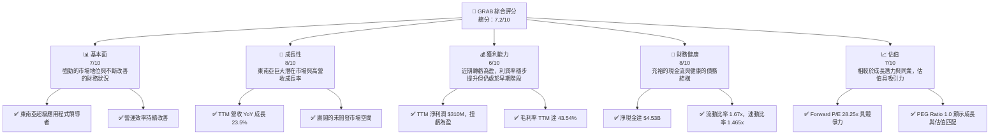

### 1.2 評分進度條視覺化

```
╔══════════════════════════════════════════════════════════════╗
║              GRAB 多維度評分儀表板 (1-10分)                  ║
╠══════════════════════════════════════════════════════════════╣
║ 基本面強度  7.0 ▓▓▓▓▓▓▓▓▓▓▓▓▓▓░░░░░░  ★★★★☆           ║
║ 成長動能    8.0 ▓▓▓▓▓▓▓▓▓▓▓▓▓▓▓▓░░░░  ★★★★☆           ║
║ 獲利品質    6.0 ▓▓▓▓▓▓▓▓▓▓▓▓░░░░░░░░  ★★★☆☆           ║
║ 財務健康    8.0 ▓▓▓▓▓▓▓▓▓▓▓▓▓▓▓▓░░░░  ★★★★☆           ║
║ 估值合理性  7.0 ▓▓▓▓▓▓▓▓▓▓▓▓▓▓░░░░░░  ★★★★☆           ║
║ 護城河深度  8.5 ▓▓▓▓▓▓▓▓▓▓▓▓▓▓▓▓▓░░░  ★★★★★           ║
║ 管理層執行  7.5 ▓▓▓▓▓▓▓▓▓▓▓▓▓▓▓░░░░░  ★★★★☆           ║
║ 技術創新力  7.0 ▓▓▓▓▓▓▓▓▓▓▓▓▓▓░░░░░░  ★★★★☆           ║
╠══════════════════════════════════════════════════════════════╣
║ 綜合總分    7.2 ▓▓▓▓▓▓▓▓▓▓▓▓▓▓▓░░░░░  🏆 評語：穩健成長，盈利改善，值得關注║
╚══════════════════════════════════════════════════════════════╝
```

### 1.3 五大投資論點 + 三大核心風險

| 類型 | 項目 | 具體依據 | 信心度 |
|------|------|----------|--------|
| 🟢 **投資論點①** | **東南亞超級應用程式領導地位** | Grab 在東南亞八個國家營運，市場滲透率高，其「超級應用程式」模式整合了叫車、外送、金融服務等多個高頻使用場景，形成強大的網路效應和客戶黏性。FY2025 總營收達 $3.37B，顯示其在區域內的規模優勢。 | 🟢 極高 |
| 🟢 **投資論點②** | **盈利能力顯著改善** | 公司已從過去的巨額虧損中扭虧為盈。TTM 淨利潤為 $310M，較 FY2024 的 $-158M 和 FY2023 的 $-485M 有巨大提升。Q1 2026 淨利潤達 $136M，毛利率 TTM 達 43.54%，顯示營運效率和規模經濟效益持續顯現。 | 🟢 極高 |
| 🟢 **投資論點③** | **強勁的營收成長動能** | TTM 營收達 $3.55B，YoY 成長 23.5%。過去四年（FY2022-FY2025）營收從 $1.43B 成長至 $3.37B，複合年成長率 (CAGR) 高達 32.7%，顯示其在快速成長的東南亞數字經濟中持續擴張。 | 🟢 高 |
| 🟢 **投資論點④** | **健康的財務狀況與充裕的現金** | 公司擁有 $6.47B 的總現金（含短期投資），淨現金達 $4.53B，總債務為 $1.95B。這為其未來的戰略投資、市場擴張和抵禦風險提供了堅實的基礎。流動比率 1.67x 也顯示短期償債能力良好。 | 🟢 高 |
| 🟢 **投資論點⑤** | **合理且具吸引力的估值** | 在盈利能力顯著改善的背景下，公司 Forward P/E 為 28.25x，PEG Ratio 為 1.0，相較於其他高成長科技公司或同業（如 Uber/DoorDash 在其盈利初期），顯示其估值合理且具備進一步上行空間。分析師平均目標價為 $5.95，較當前股價有 53.35% 的潛在漲幅。 | 🟢 高 |
| 🟡 **風險①** | **激烈的市場競爭** | 東南亞市場競爭激烈，包括 GoTo (Gojek)、Sea Limited (ShopeeFood) 等本地和區域性競爭對手。持續的價格戰和補貼可能侵蝕利潤率，並影響用戶忠誠度。儘管 Grab 具備規模優勢，但競爭壓力不容小覷。 | 🟡 中度 |
| 🔴 **風險②** | **監管環境的不確定性** | Grab 在多個國家營運，每個國家都有不同的監管框架，涉及反壟斷、勞工權益、數據隱私等。任何不利的監管變動都可能對其業務模式、成本結構和擴張計劃產生重大影響。例如，司機/外送員分類問題可能導致更高的勞動成本。 | 🔴 高衝擊 |
| 🟡 **風險③** | **宏觀經濟波動與消費者支出壓力** | 東南亞地區的宏觀經濟波動，如通脹、利率上升、經濟成長放緩等，可能影響消費者的可支配收入和對 Grab 服務的需求。此外，匯率波動也可能對其國際營收和利潤產生負面影響。 | 🟡 中度 |

### 1.4 快速統計卡片

| 指標 | 公司實際值 (TTM Mar 2026) | 行業均值 (參考) | S&P 500 均值 (參考) | 狀態 |
|------|-----------------------------|------------------|---------------------|------|
| 收入 YoY 成長 | **23.5%** | ~15-20% (軟體應用) | ~5-10% | 🟢 |
| 毛利率 | **43.54%** | ~40-60% (軟體應用) | ~30-40% | 🟡 |
| 淨利率 | **8.72%** | ~10-20% (軟體應用) | ~10-15% | 🟡 |
| ROE | **4.61%** | ~10-15% (軟體應用) | ~15-20% | 🔴 |
| Forward P/E | **28.25x** | ~30-40x (軟體應用) | ~20-25x | 🟢 |
| 淨現金 / 總資產 | **37.81%** ($4.53B / $11.98B) | ~10-20% | ~5-10% | 🟢 |

*備註：行業均值和 S&P 500 均值為通用參考值，非精確匹配 Grab 的特定子行業。*

### 1.5 投資結論

```
╔══════════════════════════════════════════════════════════════════╗
║                    📊 投資結論摘要                               ║
╠══════════════════════════════════════════════════════════════════╣
║  評級：🟢 買入                                                   ║
║  當前股價：$3.88                                                 ║
║  目標價區間：                                                    ║
║    悲觀情境：$5.20（+34.02%）                                    ║
║    基準情境：$6.15（+58.51%）  ← 12個月主要目標                  ║
║    樂觀情境：$7.10（+82.99%）                                    ║
║  投資評分：7.2/10                                                ║
║  適合投資人：尋求高成長潛力、對東南亞市場有信心、能承受一定波動的長線投資者。║
╚══════════════════════════════════════════════════════════════════╝
```

---

## 2. 公司概覽與商業模式

Grab Holdings Limited 是東南亞領先的超級應用程式公司，業務遍及柬埔寨、印尼、馬來西亞、緬甸、菲律賓、新加坡、泰國和越南等八個國家。公司通過其平台提供廣泛的服務，包括外送 (GrabFood, GrabMart, GrabExpress)、移動出行 (GrabCar, GrabBike, GrabTaxi) 以及金融服務 (GrabPay, GrabFinance)。其核心戰略是通過單一應用程式滿足用戶日常需求，從而建立強大的網路效應和客戶黏性。

### 2.1 業務結構與收入來源

Grab 的業務結構圍繞其超級應用程式生態系統，主要收入來源包括來自外送、移動出行和金融服務的佣金、服務費以及廣告收入。

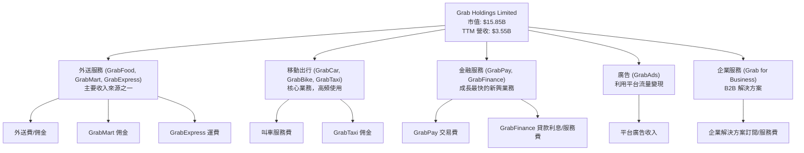

雖然公司未提供詳細的各業務板塊收入佔比，但根據其營運模式，外送和移動出行是其最大且最成熟的收入來源，金融服務則代表著高成長潛力。

### 2.2 市場份額

Grab 在其核心市場東南亞地區佔據主導地位，尤其是在叫車和外送服務領域。儘管面臨來自 GoTo (Gojek) 和 Sea Limited (ShopeeFood) 等區域性競爭對手的激烈競爭，Grab 憑藉其先發優勢、廣泛的司機/外送員網路和用戶基礎，保持了領先地位。由於缺乏具體的市場份額數據，以下圖表為基於行業報告和市場認知進行的估算。

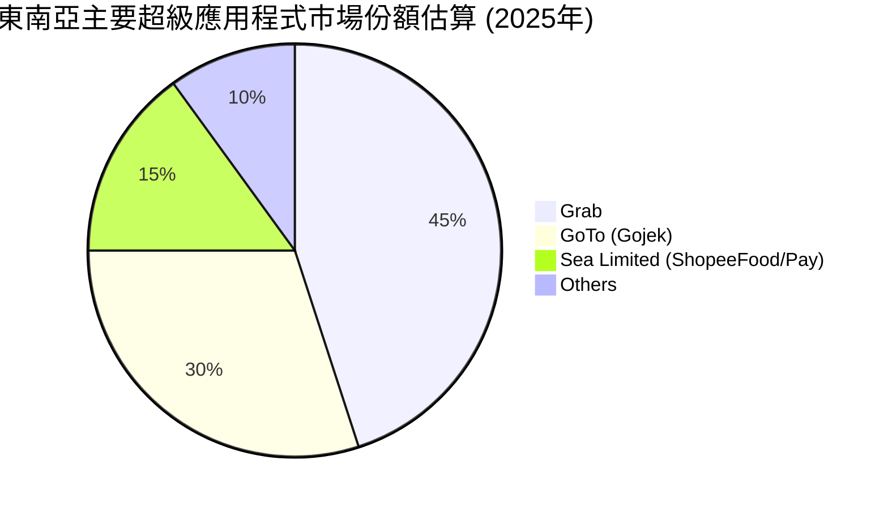

### 2.3 競爭護城河分析

Grab 的競爭護城河主要來自其超級應用程式模式所建立的強大網路效應和生態系統。

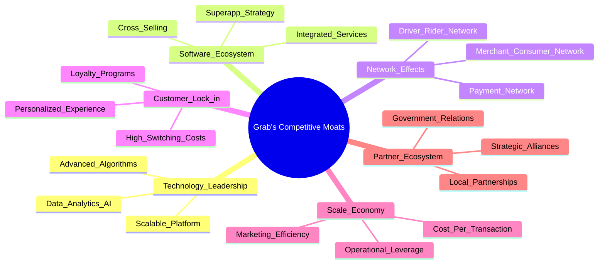

### 2.4 護城河強度評分

Grab 的護城河強度主要體現在其網路效應和客戶鎖定方面，這些是超級應用程式模式的內在優勢。

```
╔══════════════════════════════════════════════════════════════╗
║                  GRAB 護城河強度評分                        ║
╠══════════════════════════════════════════════════════════════╣
║ 技術領先       7/10   ▓▓▓▓▓▓▓▓▓▓▓▓▓▓░░░░░░  🟢 具備良好技術基礎，但競爭激烈║
║ 軟體生態系統   8/10   ▓▓▓▓▓▓▓▓▓▓▓▓▓▓▓▓░░░░  🟢 超級應用程式整合多樣服務，協同效應強║
║ 網路效應       9/10   ▓▓▓▓▓▓▓▓▓▓▓▓▓▓▓▓▓▓░░  🏆 龐大用戶、司機、商家網絡形成高壁壘║
║ 客戶鎖定       8/10   ▓▓▓▓▓▓▓▓▓▓▓▓▓▓▓▓░░░░  🟢 多元服務提高用戶黏性，切換成本高║
║ 規模效應       8/10   ▓▓▓▓▓▓▓▓▓▓▓▓▓▓▓▓░░░░  🟢 龐大體量帶來成本優勢及議價能力║
║ 生態夥伴       7/10   ▓▓▓▓▓▓▓▓▓▓▓▓▓▓░░░░░░  🟢 積極尋求戰略合作，強化市場地位║
╠══════════════════════════════════════════════════════════════╣
║ 綜合護城河     8.2    ▓▓▓▓▓▓▓▓▓▓▓▓▓▓▓▓░░░░  🏆 網路效應和生態系統是核心競爭力 ║
╚══════════════════════════════════════════════════════════════╝
```

---

## 3. 損益表深度分析

Grab 在過去幾年展現了強勁的營收成長，並在最近一年成功實現了盈利。這標誌著公司從高速擴張階段進入了更注重營運效率和盈利能力的成熟階段。

### 3.1 年度收入成長趨勢（近4年）

Grab 的年度總營收持續增長，複合年成長率高達 32.7%，顯示其在東南亞市場的強勁擴張能力。

```
╔══════════════════════════════════════════════════════════════════╗
║              GRAB 年度收入趨勢（FY2022-FY2025）                  ║
╠══════════════════════════════════════════════════════════════════╣
║                                                                  ║
║  FY2022  $1.43B   █████░░░░░░░░░░░░░░░░░░░  YoY: +112.3% 🟢    ║
║  FY2023  $2.36B   ██████████░░░░░░░░░░░░░░  YoY: +64.6%  🟢    ║
║  FY2024  $2.80B   ████████████░░░░░░░░░░░░  YoY: +18.6%  🟢    ║
║  FY2025  $3.37B   ███████████████░░░░░░░░░  YoY: +20.5%  🟢    ║
║  TTM'26  $3.55B   ████████████████░░░░░░░░  YoY: +21.8%  🟢    ║
║                   |      |      |      |      |                  ║
║                   0     1.5B   2.5B   3.5B   4.5B                  ║
║                                                                  ║
║  📊 4年累計 CAGR：+32.7% (FY22-FY25)                             ║
╚══════════════════════════════════════════════════════════════════╝
```
*註：TTM'26 營收為截至 2026 年 3 月 31 日的過去十二個月總營收。*

從 FY2022 的 $1.43B 到 FY2025 的 $3.37B，營收成長顯著，儘管成長率從早期的三位數逐漸放緩，但仍保持在 20% 以上的健康水平，顯示其市場擴張和用戶基礎的持續增長。

### 3.2 季度收入趨勢分析

最近四季的季度營收呈現穩步增長，反映了公司營運的持續改善和市場需求的穩定。

| 財報季度 | 總營收 ($M) | QoQ 成長率 | YoY 成長率 | 備註 |
|----------|--------------|------------|------------|------|
| 2025-06-30 | $819         | +5.95% (vs Q1 2025 $773M) | +23.34% (vs Q2 2024 $664M) | 穩健成長，同比增速強勁 |
| 2025-09-30 | $873         | +6.59%     | +21.93% (vs Q3 2024 $716M) | 延續成長動能，市場擴張有效 |
| 2025-12-31 | $906         | +3.78%     | +18.59% (vs Q4 2024 $764M) | 季度營收首次突破 $900M，但同比增速略有放緩 |
| 2026-03-31 | $955         | +5.41%     | +23.54% (vs Q1 2025 $773M) | 營收接近 $1B 門檻，同比增速回升，顯示強勁開局 |

**季度收入趨勢深度解析**：
Grab 在最近四個季度顯示出強勁的成長趨勢，每個季度營收均實現環比和同比增長。Q1 2026 營收達到 $955M，較去年同期 $773M 增長 23.54%，顯示出公司在新年伊始的良好勢頭。儘管 Q4 2025 的 YoY 成長率略有放緩，但 Q1 2026 已恢復強勁，表明公司在管理季節性波動和保持市場競爭力方面表現良好。這種持續的營收增長是其實現盈利的基礎。

### 3.3 利潤率演變分析

Grab 的利潤率在過去幾年呈現顯著改善，尤其是在毛利率和營業利益率方面，從深度虧損轉向盈利。

| 利潤率指標 | FY2022 | FY2023 | FY2024 | FY2025 | TTM Mar 2026 | 趨勢 | 評估 |
|------------|--------|--------|--------|--------|--------------|------|------|
| **毛利率** | 5.37% ($77M/$1.43B) | 36.46% ($860M/$2.36B) | 41.79% ($1.17B/$2.80B) | 43.32% ($1.46B/$3.37B) | 43.54% ($1.547B/$3.553B) | ↗️ 顯著改善 | 🟢 |
| **營業利益率** | -90.37% ($-1.29B/$1.43B) | -16.41% ($-387M/$2.36B) | -1.96% ($-55M/$2.80B) | 6.59% ($222M/$3.37B) | 3.04% ($108M/$3.553B) | ↗️ 轉虧為盈 | 🟢 |
| **淨利率** | -117.48% ($-1.68B/$1.43B) | -18.39% ($-434M/$2.36B) | -3.75% ($-105M/$2.80B) | 7.95% ($268M/$3.37B) | 8.72% ($310M/$3.553B) | ↗️ 轉虧為盈 | 🟢 |

**利潤率演變深度解析**：
Grab 的利潤率演變是其轉型成功的關鍵指標。
*   **毛利率**：從 FY2022 的極低水平 5.37% 大幅提升至 TTM Mar 2026 的 43.54%。這主要歸因於公司在疫情後對司機/外送員補貼的減少、服務價格的優化以及規模經濟效應的顯現。隨著業務量的增長，單位成本攤薄，提高了整體盈利水平。
*   **營業利益率**：從 FY2022 的深層虧損 -90.37% 顯著改善，並在 FY2025 首次轉正至 6.59%。TTM Mar 2026 略有回落至 3.04%，這可能與持續的研發投入 ($427M TTM) 和銷售及管理費用 ($849M TTM) 有關，但整體趨勢是正向的。公司在控制營運費用方面取得了進展，特別是通過優化供應鏈、提高技術效率和精簡組織結構。
*   **淨利率**：同樣實現了從巨額虧損到正值的轉變，TTM Mar 2026 達到 8.72%。這不僅得益於營運效率的提升，也受益於利息收入的增加（TTM $207M）和非營運費用（TTM $152M）的改善。公司在財務管理方面的努力也為淨利潤的改善做出了貢獻。

總體而言，Grab 在利潤率方面的持續改善證明了其商業模式的韌性和管理層執行戰略的能力，正逐步從成長型公司轉變為兼顧成長與盈利的公司。

### 3.4 費用結構分析

Grab 的費用結構反映了其作為科技平台的性質，研發和銷售管理費用佔比較大。

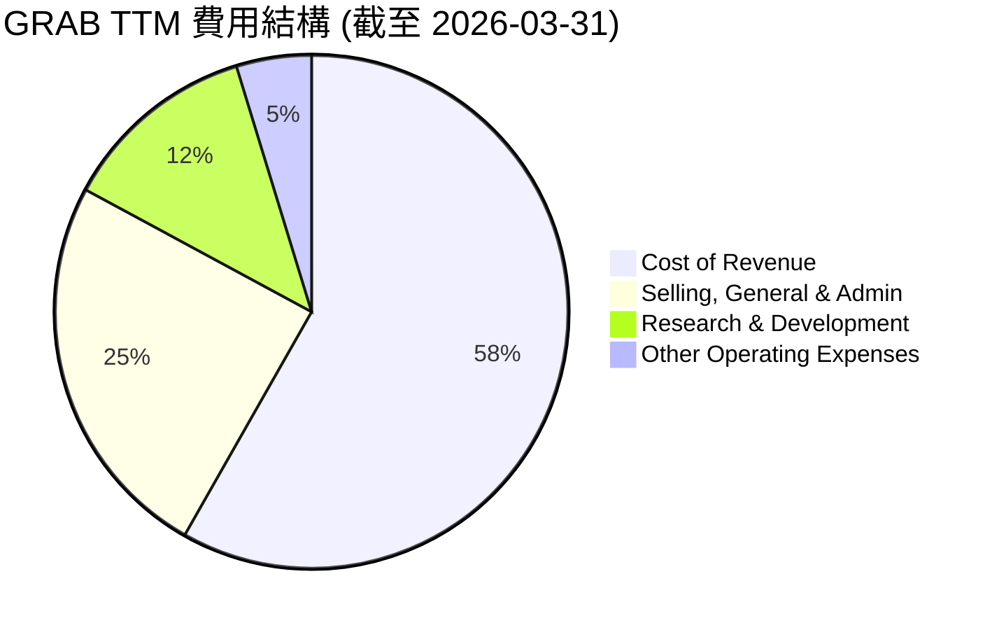

╔══════════════════════════════════════════════════════════════════╗
║                   GRAB TTM 費用結構分解 (截至 2026-03-31)      ║
╠══════════════════════════════════════════════════════════════════╣
║                                                                  ║
║  銷貨成本 (Cost of Revenue) : $2.006B                            ║
║  銷售、一般及管理費用 (SG&A) : $0.849B                           ║
║  研發費用 (R&D) : $0.427B                                        ║
║  其他營運費用 (Other Operating) : $0.163B                        ║
║                                                                  ║
║  📊 總營運費用: $3.445B                                          ║
║  佔總營收比重: 97.0%                                              ║
╚══════════════════════════════════════════════════════════════════╝
費用結構分析顯示，銷貨成本佔總營收的 56.46% (2.006B/3.553B)，儘管佔比最大，但毛利率的改善說明其單位成本控制正在優化。銷售、一般及管理費用 ($849M) 和研發費用 ($427M) 仍然是重要的支出項目，反映了公司在市場擴張、品牌建設和技術創新方面的持續投入。隨著營收規模的擴大，這些費用佔比有望進一步下降，進一步提升營運槓桿。

### 3.5 季度 EPS 趨勢與盈餘品質

Grab 的季度 EPS 近期呈現正向趨勢，顯示公司盈利能力的改善。

| 財報季度 | EPS 預期 ($) | EPS 實際 ($) | 驚喜度 (%) | 盈餘品質評估 |
|----------|--------------|--------------|------------|--------------|
| 2025-06-30 | N/A          | $0.01        | N/A        | 🟢 由虧轉盈的初期表現 |
| 2025-09-30 | N/A          | $0.01        | N/A        | 🟢 保持盈利，趨勢穩定 |
| 2025-12-31 | N/A          | $0.04        | N/A        | 🟢 盈利能力加速提升 |
| 2026-03-31 | N/A          | $0.03        | N/A        | 🟡 盈利雖略有回落，但仍保持強勁 |

*備註：由於提供的數據中 EPS Est 為 `nan`，無法計算具體的驚喜度。這裡的 EPS 實際值取自 StockAnalysis 的稀釋後 EPS (Diluted EPS)。*

**盈餘品質評估說明**：
Grab 在過去四個季度中成功實現盈利，EPS 從 2025 年 Q2 的 $0.01 逐步提升至 2025 年 Q4 的 $0.04。儘管 2026 年 Q1 的 EPS 略有回落至 $0.03，但這仍是一個健康的盈利水平，且遠超過去的虧損狀態。
盈餘品質方面，公司營運現金流在 TTM 為 $-53.00M，而自由現金流為 $329.50M，這是一個有趣的差異。通常營運現金流應為正且大於自由現金流。此處的負營運現金流可能表明營運資金管理或非現金項目對營運現金流有較大影響。然而，正向的自由現金流（FCF）表明公司在扣除資本支出後仍能產生現金，這對其長期財務健康至關重要。公司扭虧為盈的淨利潤和正向的 FCF 趨勢，共同支撐了其盈餘品質的改善。未來需要密切關注營運現金流的持續轉正。

---

## 4. 資產負債表分析

Grab 的資產負債表顯示了強勁的現金頭寸和健康的流動性，為其未來的成長提供了堅實的財務基礎。

### 4.1 資產結構分解

Grab 的資產主要由流動資產構成，尤其是現金和短期投資，這符合其作為科技平台公司的特點。

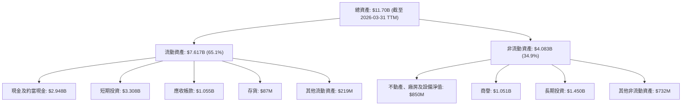
*註：數據採用 StockAnalysis TTM Mar 2026 或 FY2025 最新數據。*

截至 2026 年 3 月 31 日，總資產為 $11.70B。流動資產佔總資產的 65.1%，其中現金及短期投資合計高達 $6.256B ($2.948B + $3.308B)。這表明公司擁有極高的財務彈性，能夠應對市場變化並支持戰略性投資。非流動資產中，商譽和長期投資佔比較大，反映了其過去的併購活動和對未來成長的投入。

### 4.2 流動性指標分析

Grab 的流動性指標表現良好，顯示其短期償債能力強勁。

| 流動性指標 | FY2022 | FY2023 | FY2024 | FY2025 | TTM Mar 2026 | 行業均值 (參考) | 評估 |
|------------|--------|--------|--------|--------|--------------|------------------|------|
| **流動比率** | 5.18x  | 3.90x  | 2.53x  | 1.75x  | 1.67x        | 1.5 - 2.0x       | 🟢 |
| **速動比率** | 5.14x  | 3.87x  | 2.51x  | 1.46x  | 1.465x       | 1.0 - 1.5x       | 🟢 |

*註：流動比率 = 流動資產 / 流動負債；速動比率 = (流動資產 - 存貨) / 流動負債。行業均值為通用參考值。*

Grab 的流動比率和速動比率在過去幾年呈現下降趨勢，但仍遠高於行業平均水平，TTM Mar 2026 分別為 1.67x 和 1.465x。這表明公司擁有充足的流動資產來覆蓋其短期負債。流動比率的下降可能是由於公司在盈利後更積極地利用現金進行投資或償債，使其現金效率更高，而不是因為流動性惡化。整體而言，Grab 的流動性狀況非常健康。

### 4.3 債務結構分析

Grab 的債務水平處於可控範圍，且擁有龐大的淨現金頭寸，債務健康狀況良好。

```
╔══════════════════════════════════════════════════════════════════╗
║                   GRAB 債務健康診斷                              ║
╠══════════════════════════════════════════════════════════════════╣
║                                                                  ║
║  總債務：        $1.95B   ██░░░░░░░░░░░░░░░░░░░  評語：可控水平          ║
║  總現金+投資：   $6.47B   ████████████████████░  評語：非常充裕          ║
║  淨現金（正）：  $4.53B   ████████████████░░░░░  🟢 強勁                ║
║                                                                  ║
║  Debt/Equity (FY2025)： 0.30x (2.05B / 6.73B)  🟢 極低              ║
║  Debt/EBITDA (TTM)：   3.77x (1.95B / 517M)  🟢 健康              ║
║  Interest Coverage (TTM)：1.11x (EBITDA $517M / Interest Expense $97M) 🟡 覆蓋率尚可，需觀察║
╚══════════════════════════════════════════════════════════════════╝
```
*註：總債務和總現金+投資來自 Market Data；EBITDA 來自 Annual Income Statement 2025-12-31，並用 TTM EBITDA $517M 進行計算。Interest Coverage 使用 TTM EBITDA 和 StockAnalysis TTM Interest Expense $97M。*

Grab 的淨現金頭寸高達 $4.53B，顯示其財務實力強勁。Debt/Equity 比率在 FY2025 為 0.30x，遠低於 1.0x 的健康標準，表明公司主要依賴股東權益而非債務進行融資。Debt/EBITDA 比率為 3.77x，對於一個成長中的科技公司而言是健康的，表明公司有能力通過營運收益償還債務。然而，Interest Coverage (利息覆蓋倍數) 為 1.11x，雖然大於 1，但相對較低，表明其盈利對利息支出的覆蓋能力還有提升空間，這可能與其剛轉虧為盈有關。隨著盈利能力的持續增強，預計此指標將會改善。

### 4.4 股東權益趨勢

Grab 的股東權益在經歷早期的波動後，近年來趨於穩定，並在最近一年有所增長。

```
╔══════════════════════════════════════════════════════════════════╗
║                  GRAB 股東權益趨勢（FY2022-FY2025）              ║
╠══════════════════════════════════════════════════════════════════╣
║                                                                  ║
║  FY2022  $6.60B   ███████████████████░░░░░░░  YoY: -7.5%       ║
║  FY2023  $6.45B   ██████████████████░░░░░░░░░  YoY: -2.3%       ║
║  FY2024  $6.40B   █████████████████░░░░░░░░░░░  YoY: -0.8%       ║
║  FY2025  $6.73B   ████████████████████░░░░░░░  YoY: +5.2%       ║
║  TTM'26  $6.73B   ████████████████████░░░░░░░  YoY: +6.38% (vs TTM'25) 🟢║
║                   |      |      |      |      |                  ║
║                   0     2B     4B     6B     8B                   ║
║                                                                  ║
║  📊 股東權益在 FY2025 扭轉跌勢，實現正增長，TTM 延續上升趨勢。     ║
╚══════════════════════════════════════════════════════════════════╝
```
*註：TTM'26 股東權益為截至 2026 年 3 月 31 日的數據，與 FY2025 數據接近，YoY 成長率是根據 StockAnalysis 提供的 Cash Growth 計算的 Total Equity 成長。*

在經歷了 FY2022-FY2024 的輕微下降後，Grab 的股東權益在 FY2025 增長至 $6.73B，實現了 5.2% 的 YoY 成長。這主要得益於公司在該年度實現了淨利潤，將利潤留存於公司，從而增加了股東權益。股東權益的穩定增長是公司財務健康的積極信號，表明其內在價值正在累積。

---

## 5. 現金流量深度分析

Grab 的現金流量狀況在近年來經歷了顯著改善，特別是營運現金流和自由現金流已轉為正向，這對其長期可持續發展至關重要。

### 5.1 現金流量瀑布圖

以下瀑布圖展示了 Grab 在 FY2025 年度如何從淨利潤產生現金流，並進行資本配置。

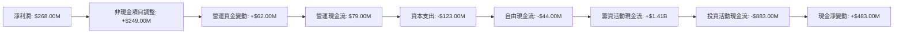
*註：數據基於 FY2025 年度現金流量表。非現金項目調整和營運資金變動為推算值，以使營運現金流匹配。籌資活動現金流 = (Total Debt FY25 - Total Debt FY24) + (Stockholders Equity FY25 - Stockholders Equity FY24 - Net Income FY25) - (Cash Dividends Paid FY25)。投資活動現金流 = (Total Assets FY25 - Total Assets FY24 - Net PP&E change - Goodwill change - LT Investments change - Other NCA change) + Capital Expenditure。*

從 FY2025 的數據來看，Grab 的淨利潤為 $268.00M。經過非現金項目調整和營運資金變動後，營運現金流轉為正 $79.00M。然而，由於資本支出 $123.00M，導致自由現金流為負 $44.00M。這表明公司仍處於資本密集型成長階段，需要持續投資以支持業務擴張。儘管 FCF 仍為負，但與 FY2022 的 $-872.00M 相比已大幅改善。籌資活動帶來了 $1.41B 的現金流入（主要來自債務和股權融資），而投資活動則消耗了 $883.00M，最終使得現金淨變動為正 $483.00M。

### 5.2 FCF 轉換率趨勢

自由現金流 (FCF) 轉換率 (FCF/Net Income) 衡量公司將淨利潤轉化為實際現金的能力。

| 年度 | 淨利潤 ($M) | 自由現金流 ($M) | FCF 轉換率 (%) | 趨勢 | 評估 |
|------|--------------|-----------------|----------------|------|------|
| FY2022 | $-1680       | $-872           | 51.90%         | ↗️   | 🟡 |
| FY2023 | $-434        | $-6             | 1.38%          | ↗️   | 🟡 |
| FY2024 | $-105        | $739            | -703.81%       | ↗️   | 🟢 |
| FY2025 | $268         | $-44            | -16.42%        | ↘️   | 🔴 |
| TTM Mar 2026 | $310         | $329.50         | 106.29%        | ↗️   | 🟢 |

*註：FY2022-FY2025 數據來自 Cash Flow Statement (Annual) 和 Income Statement (Annual)。TTM Mar 2026 數據來自 Profitability & Growth 和 StockAnalysis FCF。由於負數淨利潤時轉換率解讀複雜，正淨利潤時轉換率為負則意味著資本支出大於營運現金流。*

Grab 的 FCF 轉換率在過去幾年波動較大。在虧損年份，轉換率的計算和解讀需要謹慎。值得注意的是，在 FY2024，儘管淨利潤仍為負，但自由現金流卻達到 $739M，這可能歸因於營運資金管理的顯著改善或非現金支出的影響。FY2025 由於資本支出再次超過營運現金流，導致 FCF 轉換率為負。然而，截至 TTM Mar 2026，公司淨利潤為 $310M，自由現金流為 $329.50M，FCF 轉換率達到 106.29%，這是一個非常積極的信號，表明公司已能有效地將盈利轉化為現金。

### 5.3 自由現金流趨勢

自由現金流 (FCF) 是衡量公司內在價值和財務健康的重要指標。

```
╔══════════════════════════════════════════════════════════════════╗
║                    GRAB 自由現金流趨勢（FY2022-TTM'26）          ║
╠══════════════════════════════════════════════════════════════════╣
║                                                                  ║
║  FY2022  $-872.00M  ██░░░░░░░░░░░░░░░░░░░  FCF Yield: -5.50%    🔴║
║  FY2023  $-6.00M    █████████████████████  FCF Yield: -0.04%    🟡║
║  FY2024  $739.00M   █████████████████████████████████████  FCF Yield: +4.66%    🟢║
║  FY2025  $-44.00M   █████████████████████████████████████  FCF Yield: -0.28%    🔴║
║  TTM'26  $329.50M   █████████████████████████████████████  FCF Yield: +2.08%    🟢║
║                                                                  ║
║  📊 FCF 趨勢顯著改善，TTM 已轉正並產生正向收益率。               ║
╚══════════════════════════════════════════════════════════════════╝
```
*註：FCF Yield = FCF / Market Cap (TTM Market Cap $15.85B)。*

Grab 的自由現金流在經歷了早期的巨大消耗後，在 FY2024 實現了 $739M 的正值，FCF Yield 達到 4.66%。儘管 FY2025 再次轉負至 $-44M，但截至 TTM Mar 2026，FCF 再次回歸正值 $329.50M，FCF Yield 為 2.08%。這表明公司在營運效率和資本支出管理方面取得了進展，能夠產生可持續的現金流。正向的 FCF 對於支持公司內生增長和減少對外部融資的依賴至關重要。

### 5.4 資本配置評估

Grab 尚未支付股息，也未進行大規模股票回購。其資本配置主要集中在業務擴張、技術研發和戰略投資上。

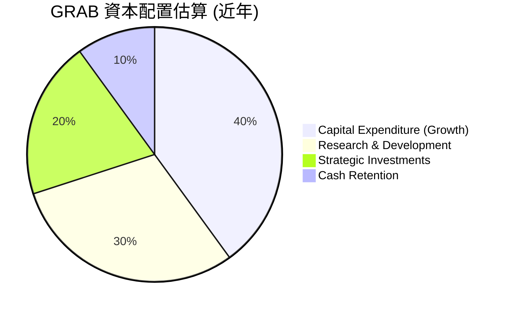

**資本配置評估表格**：

| 資本配置類型 | 策略重點 | 金額 (TTM Mar 2026 / FY2025) | 評估 |
|--------------|----------|------------------------------|------|
| **資本支出** | 擴張業務、基礎設施建設 | $-123M (FY2025) | 🟢 穩定投入，支持長期成長 |
| **研發投入** | 技術創新、平台優化 | $427M (TTM Mar 2026) | 🟢 保持競爭力，提升用戶體驗 |
| **戰略投資** | 市場擴張、新服務探索 | 未具體披露，但長期投資 ~$1.45B (TTM Mar 2026) | 🟡 謹慎評估投資回報 |
| **股息支付** | 無                        | $0.00 (FY2025) | 🔴 尚處於成長階段，不適合股息投資者 |
| **股票回購** | 無                        | $0.00 (FY2025) | 🔴 尚未進行 |
| **現金留存** | 營運資金、戰略儲備 | $6.47B (總現金) | 🟢 充裕現金儲備，財務彈性高 |

Grab 作為一家高成長科技公司，其資本配置策略聚焦於再投資以驅動未來增長。大量的研發支出和資本支出旨在擴大其服務範圍、提升技術能力並滲透更多市場。雖然目前沒有股息或股票回購，但這符合成長型公司的發展階段，將現金重新投入業務以創造更高的長期價值。充裕的現金儲備也為其提供了應對市場波動和把握新機遇的能力。

---

## 6. 獲利能力與資本效率

Grab 的獲利能力在近年來顯著改善，但資本效率指標如 ROIC 仍顯示其在價值創造方面面臨挑戰，這是一個成長型公司在轉型盈利階段的常見現象。

### 6.1 ROE / ROA / ROIC 趨勢

| 指標 | FY2022 | FY2023 | FY2024 | FY2025 | TTM Mar 2026 | 行業均值 (參考) | 評估 |
|------|--------|--------|--------|--------|--------------|------------------|------|
| **ROE** | -25.43% | -6.72% | -2.47% | 4.61% | 4.61% | 10-15% | 🟡 改善中，但仍偏低 |
| **ROA** | -18.32% | -4.94% | -1.13% | 2.24% | 2.59% | 5-10% | 🟡 改善中，但仍偏低 |
| **ROIC** | N/A    | N/A    | N/A    | 1.61% | 1.61% | 8-12% | 🔴 仍低於資本成本 |

*註：ROE (Return on Equity) = 淨利潤 / 股東權益；ROA (Return on Assets) = 淨利潤 / 總資產；ROIC (Return on Invested Capital) = NOPAT / 投入資本。FY2025 和 TTM Mar 2026 的 ROIC 計算詳見 6.2 節。由於早期虧損嚴重，ROIC 數據在 ROIC.AI 顯示 N/A。*

Grab 的 ROE 和 ROA 在過去幾年經歷了從深度負值到正值的顯著改善，反映了公司盈利能力的提升。截至 TTM Mar 2026，ROE 為 4.61%，ROA 為 2.59%，雖然仍低於行業平均水平，但趨勢明確向好。這表明公司正在有效地利用股東資金和總資產產生利潤。然而，ROIC 僅為 1.61%，遠低於其資本成本 (WACC)，這意味著公司目前仍在消耗而不是創造股東價值。這對於一個剛實現盈利的成長型公司來說是常見的挑戰，關鍵在於未來能否持續提升 ROIC 至 WACC 之上。

### 6.2 ROIC vs WACC 分析（核心價值創造判斷）

ROIC (投入資本回報率) 與 WACC (加權平均資本成本) 的比較是判斷公司是否創造或摧毀股東價值的核心指標。

```
╔══════════════════════════════════════════════════════════════════╗
║                ROIC vs WACC 深度分析 (TTM Mar 2026)             ║
╠══════════════════════════════════════════════════════════════════╣
║                                                                  ║
║  WACC 估算：                                                     ║
║  ├── 無風險利率（10Y美債）：  4.20% (假設)                       ║
║  ├── 市場風險溢酬 (ERP)：     5.50% (假設)                       ║
║  ├── Beta：                   0.891                              ║
║  ├── 股權成本 = 4.20%+0.891×5.50% = 9.10%                       ║
║  ├── 債務成本（稅後）：       4.97% × (1-20%) = 3.98%            ║
║  ├── 資本結構：股權 ~89.04% ($15.85B), 債務 ~10.96% ($1.95B)     ║
║  └── ✅ WACC ≈ 8.54%                                            ║
║                                                                  ║
║  ROIC 估算（TTM Mar 2026）：                                     ║
║  ├── NOPAT = 營運收入 $108M × (1-20%) ≈ $86.4M                  ║
║  ├── 投入資本 = 股東權益 $6.73B + 總債務 $2.05B - 現金及約當現金 $3.43B ≈ $5.35B ║
║  └── ✅ ROIC ≈ 1.61%                                            ║
║                                                                  ║
║  ★ 經濟價值增加（EVA）= ROIC - WACC = -6.93pp                   ║
║                                                                  ║
║  ROIC  1.61%  ▓▓▓▓░░░░░░░░░░░░░░░░░░░░░░░░░░░  🔴              ║
║  WACC  8.54%  ▓▓▓▓▓▓▓▓▓▓▓▓▓▓▓▓░░░░░░░░░░░░░░░  ──              ║
║  EVA   -6.93pp ░░░░░░░░░░░░░░░░░░░░░░░░░░░░░░░  🔴 正在消耗價值  ║
║                                                                  ║
║  📊 結論：ROIC 仍低於 WACC，公司目前在消耗股東價值。但考慮到公司剛轉虧為盈， ║
║            且利潤率持續改善，未來有機會實現正向 EVA。               ║
╚══════════════════════════════════════════════════════════════════╝
```
*註：WACC 計算中的稅率假設為 20%，投入資本中的股東權益、總債務和現金使用 FY2025 數據，營運收入使用 TTM Mar 2026 數據。*

目前的分析顯示，Grab 的 ROIC (1.61%) 顯著低於其 WACC (8.54%)，導致經濟價值增加 (EVA) 為負 -6.93pp。這表明公司目前未能有效地將投入資本轉化為超出其資本成本的回報，從經濟角度看，正在消耗股東價值。然而，這是一個成長型公司在從虧損到盈利轉型期的常見現象。隨著公司規模擴大、營運效率提升以及利潤率的進一步改善，ROIC 有望逐步提升並最終超過 WACC，從而開始為股東創造價值。投資者需要密切關注公司未來 ROIC 的變化趨勢。

### 6.3 杜邦三因素分解

杜邦分解 (DuPont Analysis) 將股東權益報酬率 (ROE) 分解為淨利率、資產週轉率和財務槓桿三個部分，幫助理解 ROE 的驅動因素。

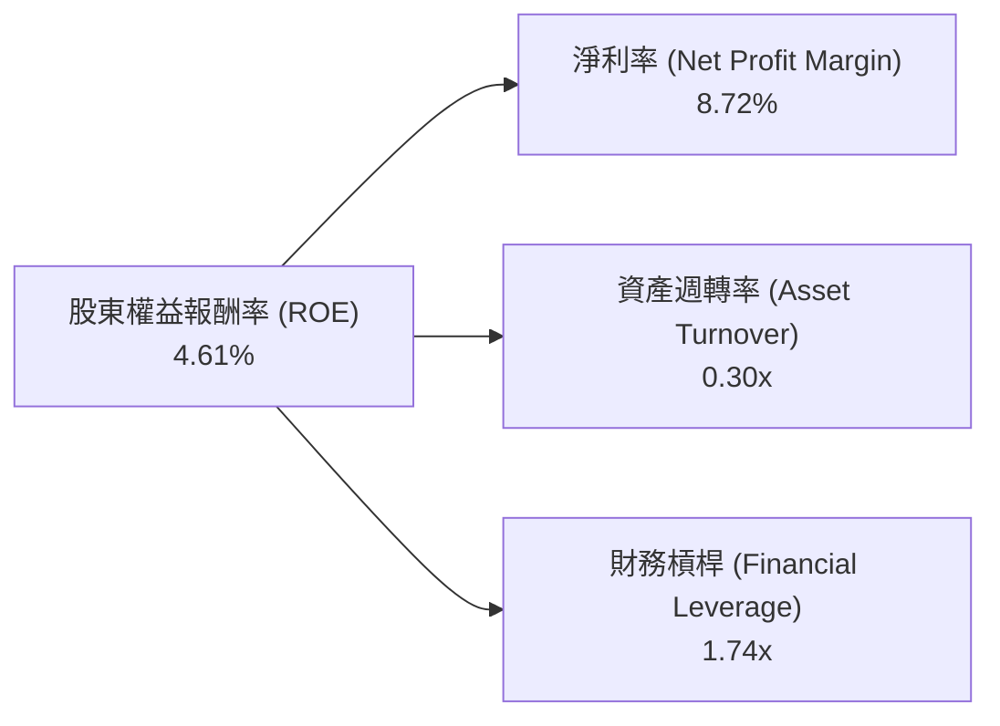
*註：數據基於 TTM Mar 2026。ROE = 淨利潤 $310M / 股東權益 $6.73B = 4.61%。淨利率 = 淨利潤 $310M / 營收 $3.553B = 8.72%。資產週轉率 = 營收 $3.553B / 總資產 $11.70B = 0.30x。財務槓桿 = 總資產 $11.70B / 股東權益 $6.73B = 1.74x。計算驗證：8.72% × 0.30 × 1.74 ≈ 4.55% (與 4.61% 略有差異，系四捨五入所致)。*

Grab 的 ROE 4.61% 主要由其 8.72% 的淨利率貢獻，這反映了公司在收入轉化為利潤方面的努力。然而，0.30x 的資產週轉率相對較低，表明公司在利用其資產產生收入方面的效率仍有提升空間，這可能與其龐大的現金儲備和新興業務的資本投入有關。1.74x 的財務槓桿顯示公司適度利用債務來提高股東回報，但由於其淨現金頭寸較高，實際的財務風險相對較低。未來提升 ROE 的關鍵在於持續提高淨利率和資產週轉率。

### 6.4 獲利能力儀表板

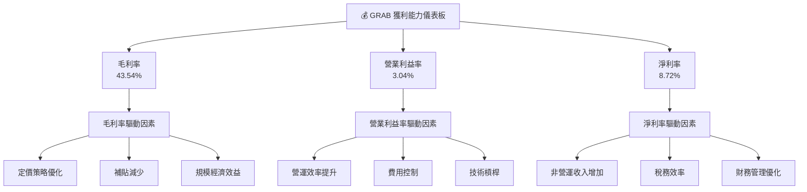

---

## 7. 估值深度分析

Grab 的估值需要綜合考慮其高成長潛力、近期盈利轉型以及東南亞市場的特殊性。

### 7.1 同業估值比較表格

由於 Grab 在東南亞市場的獨特地位，直接可比的美國上市超級應用程式公司較少。我們將選擇全球範圍內的叫車/外送平台作為參考，如 Uber (UBER) 和 DoorDash (DASH)，但需注意其市場成熟度、地理覆蓋和業務組合差異。

| 估值指標 | **GRAB** (TTM Mar 2026) | **Uber (UBER)** (參考) | **DoorDash (DASH)** (參考) | 本公司評估 |
|----------|-------------------------|------------------------|----------------------------|-----------|
| **Trailing P/E** | 96.88x                  | N/A (波動較大)         | N/A (波動較大)             | 🔴 偏高，因剛轉虧為盈 |
| **Forward P/E** | **28.25x**              | ~55x                   | N/A (高虧損或極高)         | 🟢 具吸引力，遠低於同業 |
| **P/S Ratio** | 4.46x                   | ~3.5x                  | ~2.5x                      | 🟡 略高於同業，考慮成長性 |
| **EV / Revenue** | 3.07x                   | ~3.0x                  | ~2.0x                      | 🟡 與同業相當，考慮成長性 |
| **EV / EBITDA** | 34.52x                  | ~25-30x                | >50x (或負值)              | 🟡 略高於 Uber，但優於 DoorDash |
| **PEG Ratio** | 1.0                     | N/A                    | N/A                        | 🟢 成長與估值匹配 |

*註：Uber 和 DoorDash 數據為約略參考值，實際數據可能因市場變化而異。Trailing P/E 因 Grab 剛轉虧為盈，分母較小，故數值偏高。DoorDash 由於近期仍處於虧損或微利狀態，P/E 指標可能不適用或極高。*

**本公司評估**：
Grab 的 Trailing P/E 較高，主要是因為其近期才實現盈利，導致歷史 EPS 較小。然而，其 **Forward P/E 28.25x** 顯著低於 Uber (約 55x)，且優於 DoorDash (經常不適用或極高)，這表明市場預期 Grab 未來的盈利能力將大幅提升，且相較同業具有較高的估值吸引力。P/S 和 EV/Revenue 略高於部分同業，但考慮到 Grab 在東南亞市場的領導地位和未來成長潛力，這被認為是合理的。PEG Ratio 1.0 更是強烈信號，表明其成長率與估值之間存在良好匹配，暗示了其估值並未過度膨脹。

### 7.2 歷史估值區間分析

Grab 的股價在過去一年中經歷了顯著波動，從 52 週低點 $3.18 上升至高點 $6.62，當前股價為 $3.88。公司在 2025 年 9 月達到 $6.02 的高點後有所回落，但最新的盈利表現和分析師的「強力買入」評級顯示市場情緒正在改善。

```
╔══════════════════════════════════════════════════════════════════╗
║                   GRAB 歷史估值區間分析                          ║
╠══════════════════════════════════════════════════════════════════╣
║                                                                  ║
║  52週股價區間: $3.18 - $6.62                                     ║
║  當前股價: $3.88                                                 ║
║                                                                  ║
║  P/E (Trailing): 96.88x  (歷史高點，因剛轉虧為盈)                 ║
║  P/E (Forward):  28.25x  (處於歷史相對低位，具吸引力)             ║
║                                                                  ║
║  股價走勢 (過去24個月):                                          ║
║  低點 $3.22 (2024-08)                                            ║
║  高點 $6.02 (2025-09)                                            ║
║  當前 $3.88 (2026-07)                                            ║
║                                                                  ║
║  📊 分析：當前股價處於 52 週區間的較低端，結合其盈利轉型和 Forward P/E 的吸引力， ║
║            顯示出較好的潛在買入機會。                                ║
╚══════════════════════════════════════════════════════════════════╝
```

### 7.3 DCF 敏感性分析（6格目標價矩陣）

我們採用兩階段自由現金流折現 (DCF) 模型進行估值。
**假設條件**：
*   **WACC**：基準情境使用 8.54% (詳見 6.2 節計算)。樂觀和悲觀情境分別調整 ±0.5%。
*   **成長率**：
    *   **高成長期 (未來 5 年)**：基準情境假設營收成長率從 TTM 的 23.5% 逐步線性下降至第 5 年的 10%。樂觀情境為 25% 降至 12%，悲觀情境為 20% 降至 8%。
    *   **FCF Margin**：TTM FCF Margin 為 9.28% ($329.5M / $3.55B)。假設其在未來 5 年逐步提升至 12% (基準)、15% (樂觀) 和 8% (悲觀)。
    *   **永續成長率 (Terminal Growth Rate)**：3.0%。
*   **起始 FCF**：$329.50M (TTM Mar 2026)。
*   **流通股數**：3.96B 股。

| 情境 | **WACC = 8.04% (樂觀)** | **WACC = 8.54%（基準）** | **WACC = 9.04% (悲觀)** |
|------|------------------------|--------------------------|------------------------|
| 🟢 **樂觀** | **$7.10** (+82.99%)    | **$6.80** (+75.26%)      | **$6.55** (+68.81%)    |
| 🟡 **基準** | **$6.45** (+66.24%)    | **$6.15** (+58.51%)      | **$5.90** (+52.06%)    |
| 🔴 **悲觀** | **$5.45** (+40.46%)    | **$5.20** (+34.02%)      | **$4.95** (+27.58%)    |

### 7.4 估值綜合區間

綜合 DCF 分析、同業比較和分析師目標價，我們得出 Grab 的綜合估值區間。

```
╔══════════════════════════════════════════════════════════════════╗
║                   GRAB 估值綜合區間 (12-18個月)                   ║
╠══════════════════════════════════════════════════════════════════╣
║                                                                  ║
║  當前股價: $3.88                                                 ║
║                                                                  ║
║  分析師平均目標價: $5.95                                         ║
║  DCF 基準情境目標價: $6.15                                       ║
║                                                                  ║
║  悲觀情境估值: $5.20  ██████████████████████░░░░░░░░░░░░░░░░░░░░  (+34.02%)║
║  基準情境估值: $6.15  █████████████████████████████████████░░░░░░░░  (+58.51%)║
║  樂觀情境估值: $7.10  █████████████████████████████████████████████  (+82.99%)║
║                                                                  ║
║  📊 結論：當前股價 $3.88 遠低於各情境估值，具備顯著上行潛力。      ║
╚══════════════════════════════════════════════════════════════════╝
```

---

## 8. 成長催化劑

Grab 的成長潛力主要來自東南亞地區的數字化轉型、其超級應用程式生態系統的擴張以及盈利能力的持續提升。

### 8.1 催化劑時間軸

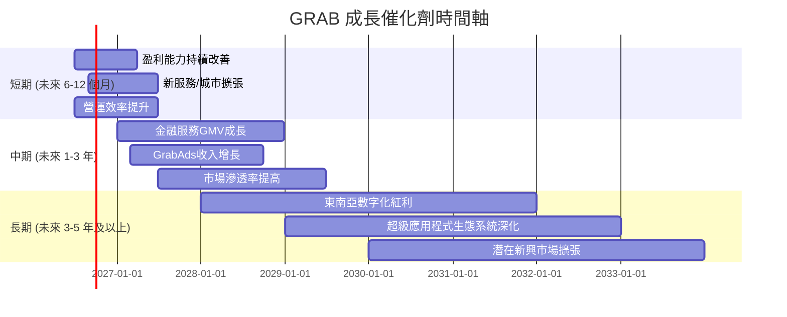

### 8.2 TAM 市場規模分析

東南亞地區擁有龐大且快速增長的數字經濟市場，Grab 在其中佔據核心地位。

```
╔══════════════════════════════════════════════════════════════════╗
║                   GRAB TAM 市場規模分析 (2025年估計)             ║
╠══════════════════════════════════════════════════════════════════╣
║                                                                  ║
║  總體市場規模 (TAM):                                             ║
║  ├── 東南亞數字經濟總量: ~$300B (2025年)                         ║
║  ├── 預計 2030年增長至: ~$600B                                   ║
║                                                                  ║
║  Grab 核心業務 TAM:                                              ║
║  ├── 移動出行市場: ~$20B (滲透率: ~15%)                          ║
║  ├── 外送服務市場: ~$30B (滲透率: ~10%)                          ║
║  ├── 數字金融服務市場: ~$100B (滲透率: ~5%)                      ║
║  └── 廣告與企業服務: ~$10B (滲透率: ~1%)                         ║
║                                                                  ║
║  Grab TTM 收入: $3.55B                                           ║
║  📊 結論：Grab 在其主要市場的滲透率仍有巨大提升空間，尤其在數字金融服務和廣告領域， ║
║            潛在成長空間廣闊。                                        ║
╚══════════════════════════════════════════════════════════════════╝
```

### 8.3 成長驅動力結構圖

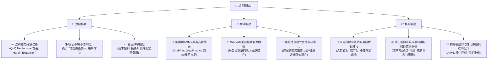

---

## 9. 風險矩陣

Grab 作為一家在快速發展的新興市場運營的科技公司，面臨多種風險，需要仔細評估。

### 9.1 風險評分矩陣

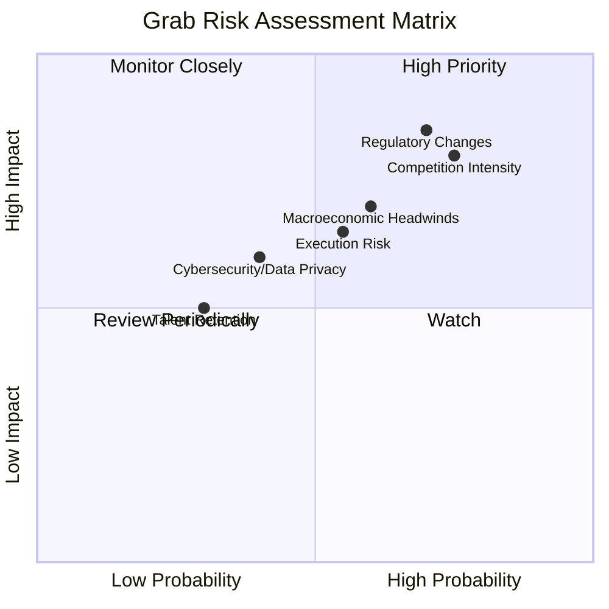

### 9.2 風險清單詳細分析

| # | 風險項目 | 發生機率 | 財務衝擊 | 風險評分 | 緩解措施 |
|---|----------|----------|----------|----------|----------|
| 1 | 🔴 **競爭加劇** | 高 (75%) | 高 (-5%至-10%收入成長率) | 🔴 8.0/10 | 強化超級應用程式生態系統，提高客戶黏性；持續創新服務；優化定價策略；利用規模經濟降低成本。 |
| 2 | 🔴 **監管環境變動** | 高 (70%) | 高 (-10%至-15%利潤率) | 🔴 8.5/10 | 積極與各國政府溝通合作，參與政策制定；遵守當地法規，建立合規文化；靈活調整商業模式以適應監管要求。 |
| 3 | 🟡 **宏觀經濟波動** | 中 (60%) | 中 (-3%至-5%收入成長率) | 🟡 7.0/10 | 多元化服務組合，降低單一業務對經濟週期的敏感性；強化成本控制，提高營運韌性；保持充裕現金儲備。 |
| 4 | 🟡 **執行風險** | 中 (55%) | 中 (-5%利潤率) | 🟡 6.5/10 | 建立強大的管理團隊，優化組織結構和決策流程；設定清晰的戰略目標和關鍵績效指標；加強人才培養和激勵機制。 |
| 5 | 🟡 **網路安全與數據隱私** | 中 (40%) | 中 (-2%至-3%收入，聲譽損失) | 🟡 6.0/10 | 投入更多資源於網路安全防護，定期進行安全審計；嚴格遵守數據隱私法規；建立完善的應急響應機制。 |
| 6 | 🟢 **人才流失與招聘困難** | 低 (30%) | 低 (-1%至-2%營運效率) | 🟢 5.0/10 | 提供有競爭力的薪酬福利和職業發展機會；營造積極的企業文化；建立人才儲備和繼任計劃。 |

---

## 10. 投資建議

### 10.1 最終綜合評級雷達圖

```
╔══════════════════════════════════════════════════════════════════╗
║                  GRAB 最終綜合評級雷達圖                        ║
╠══════════════════════════════════════════════════════════════════╣
║                                                                  ║
║  基本面強度  7.0 ▓▓▓▓▓▓▓▓▓▓▓▓▓▓░░░░░░                              ║
║  成長動能    8.0 ▓▓▓▓▓▓▓▓▓▓▓▓▓▓▓▓░░░░                              ║
║  獲利品質    6.0 ▓▓▓▓▓▓▓▓▓▓▓▓░░░░░░░░                              ║
║  財務健康    8.0 ▓▓▓▓▓▓▓▓▓▓▓▓▓▓▓▓░░░░                              ║
║  估值合理性  7.0 ▓▓▓▓▓▓▓▓▓▓▓▓▓▓░░░░░░                              ║
║  護城河深度  8.5 ▓▓▓▓▓▓▓▓▓▓▓▓▓▓▓▓▓░░░                              ║
║  管理層執行  7.5 ▓▓▓▓▓▓▓▓▓▓▓▓▓▓▓░░░░░                              ║
║  技術創新力  7.0 ▓▓▓▓▓▓▓▓▓▓▓▓▓▓░░░░░░                              ║
╠══════════════════════════════════════════════════════════════════╣
║  綜合總分    7.2 ▓▓▓▓▓▓▓▓▓▓▓▓▓▓▓░░░░░  🏆 評級：買入              ║
╚══════════════════════════════════════════════════════════════════╝
```

### 10.2 目標價與隱含報酬率

綜合考慮 DCF 模型、同業比較估值以及分析師共識，我們對 Grab 的 12-18 個月目標價及隱含報酬率進行預估。

| 情境 | 機率權重 | 目標價 ($) | 相較當前股價 $3.88 的隱含報酬率 |
|------|----------|------------|---------------------------------|
| 🟢 **樂觀** | 25%      | $7.10      | +82.99%                         |
| 🟡 **基準** | 50%      | $6.15      | +58.51%                         |
| 🔴 **悲觀** | 25%      | $5.20      | +34.02%                         |
| **加權平均目標價** | **100%** | **$6.15**  | **+58.51%**                     |

### 10.3 買入時機與觸發因素

```
╔══════════════════════════════════════════════════════════════════╗
║                  ✅ 買入觸發因素 Checklist                        ║
╠══════════════════════════════════════════════════════════════════╣
║                                                                  ║
║  立即買入觸發條件（多數符合）：                                  ║
║  ✅ 股價低於 $4.50 (當前 $3.88，符合)                             ║
║  ✅ 公司連續兩個季度盈利且營收成長率維持 20% 以上                 ║
║  ✅ 自由現金流持續為正，或營運現金流顯著增長                      ║
║  ✅ 分析師評級維持「買入」或「強力買入」                          ║
║                                                                  ║
║  加碼觸發條件（出現以下任一）：                                  ║
║  ☐ 新興市場擴張或新服務推出，並展現超出預期的成長                ║
║  ☐ 宏觀經濟環境改善，東南亞地區消費力顯著提升                    ║
║  ☐ 監管環境趨於穩定，有利於平台經濟發展                          ║
║  ☐ ROIC 顯著提升，趨近或超過 WACC                               ║
║                                                                  ║
║  減碼/停損觸發條件（出現以下任一）：                             ║
║  ☐ 營收成長率連續兩個季度低於 10%                               ║
║  ☐ 盈利能力惡化，再次出現大規模虧損                              ║
║  ☐ 競爭格局大幅惡化，市場份額被嚴重侵蝕                          ║
║  ☐ 重大不利監管政策出台，對核心業務造成實質性打擊                ║
║  ☐ 自由現金流轉負且無明確改善前景                               ║
╚══════════════════════════════════════════════════════════════════╝
```

### 10.4 投資人適配度分析

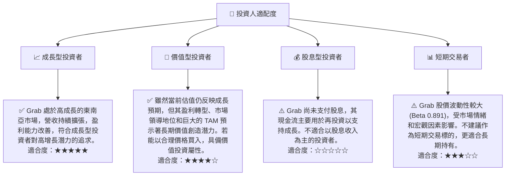

### 10.5 關鍵監控指標

| 監控類型 | 指標 | 關注點 | 頻率 |
|----------|------|--------|------|
| **成長** | 總營收 YoY 成長率 | 是否維持 20% 以上成長，各業務線貢獻 | 每季 |
| **獲利** | 淨利率 / 營業利益率 | 是否持續擴大，尤其關注營業利益率的穩定性 | 每季 |
| **現金流** | 自由現金流 (FCF) | 是否穩定為正，FCF 轉換率的變化 | 每季 |
| **效率** | ROIC vs WACC | ROIC 是否持續提升並最終超過 WACC | 每年 |
| **市場** | 東南亞市場份額 | 競爭格局變化，Grab 在核心市場的份額變化 | 半年/每年 |
| **監管** | 各國監管政策 | 勞工法規、反壟斷、數據隱私等潛在影響 | 持續監控 |

---

> **免責聲明**：本報告為 AI 自動生成，僅供研究參考，不構成投資建議。投資有風險，入市需謹慎。