# GRAB 基本面深度分析報告
> **報告日期**：2026-07-05 ｜ **語言**：繁體中文 ｜ **數據來源**：Yahoo Finance, Finviz, StockAnalysis, Roic.ai ｜ **分析師**：CFA 級機構研究

---

## 目錄

| # | 章節 | 核心結論 |
|---|------|----------|
| 1 | 執行摘要 | 評級：買入，目標價區間：$4.75 - $7.00 |
| 2 | 公司概覽與商業模式 | 東南亞超級應用程式領導者，具備強大網路效應護城河 |
| 3 | 損益表深度分析 | 營收持續高成長，利潤率顯著改善並轉虧為盈 |
| 4 | 資產負債表分析 | 現金充裕，債務管理良好，財務結構穩健 |
| 5 | 現金流量深度分析 | 營運現金流波動，自由現金流轉正，資本配置效率提升 |
| 6 | 獲利能力與資本效率 | ROIC接近WACC，正逐步創造股東價值 |
| 7 | 估值深度分析 | 相較同業估值合理，DCF顯示上行空間 |
| 8 | 成長催化劑 | 東南亞經濟成長、數位化趨勢、平台擴張與新服務 |
| 9 | 風險矩陣 | 競爭加劇、監管風險、宏觀經濟波動為主要挑戰 |
| 10 | 投資建議 | 具備長期成長潛力，建議買入，關注營運效率改善 |

---

## 1. 執行摘要

Grab Holdings Limited (GRAB) 作為東南亞領先的超級應用程式平台，在叫車、餐飲外送和數位支付領域展現出強勁的成長動能與逐步改善的獲利能力。公司在2025財年實現年度淨利潤轉正，標誌著其商業模式的成熟。儘管面臨激烈的市場競爭和宏觀經濟挑戰，Grab憑藉其深厚的本地化運營經驗、廣泛的用戶基礎和強大的網路效應，鞏固了其市場領導地位。

### 1.1 核心評分儀表板

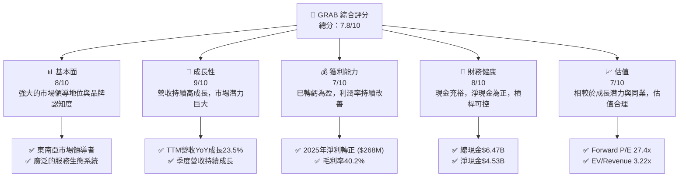

### 1.2 評分進度條視覺化

```
╔══════════════════════════════════════════════════════════════╗
║                GRAB 多維度評分儀表板 (1-10分)                ║
╠══════════════════════════════════════════════════════════════╣
║ 基本面強度  8.0 ▓▓▓▓▓▓▓▓▓▓▓▓▓▓▓▓▓▓▓▓░░  ★★★★☆           ║
║ 成長動能    9.0 ▓▓▓▓▓▓▓▓▓▓▓▓▓▓▓▓▓▓▓▓▓▓  ★★★★★           ║
║ 獲利品質    7.0 ▓▓▓▓▓▓▓▓▓▓▓▓▓▓▓▓▓▓░░░░  ★★★☆☆           ║
║ 財務健康    8.0 ▓▓▓▓▓▓▓▓▓▓▓▓▓▓▓▓▓▓▓▓░░  ★★★★☆           ║
║ 估值合理性  7.0 ▓▓▓▓▓▓▓▓▓▓▓▓▓▓▓▓▓▓░░░░  ★★★☆☆           ║
║ 護城河深度  8.5 ▓▓▓▓▓▓▓▓▓▓▓▓▓▓▓▓▓▓▓▓▓░  ★★★★☆           ║
║ 管理層執行  8.0 ▓▓▓▓▓▓▓▓▓▓▓▓▓▓▓▓▓▓▓▓░░  ★★★★☆           ║
║ 技術創新力  7.5 ▓▓▓▓▓▓▓▓▓▓▓▓▓▓▓▓▓▓▓░░░  ★★★★☆           ║
╠══════════════════════════════════════════════════════════════╣
║ 綜合總分    7.8 ▓▓▓▓▓▓▓▓▓▓▓▓▓▓▓▓▓▓▓░░░  🏆 具強勁成長潛力的買入機會 ║
╚══════════════════════════════════════════════════════════════╝
```

### 1.3 五大投資論點 + 三大核心風險

| 類型 | 項目 | 具體依據 | 信心度 |
|------|------|----------|--------|
| 🟢 **投資論點①** | **東南亞市場領導地位** | Grab 在東南亞擁有廣泛的用戶基礎和服務網絡，在叫車和外送市場佔據主導地位。其超級應用程式生態系統形成強大網路效應，轉換成本高。2026年Q1營收達$955M，YoY成長23.54%。 | 🟢 極高 |
| 🟢 **投資論點②** | **獲利能力顯著改善** | 公司已於2025財年實現年度淨利潤$268M，並在2026年Q1實現淨利潤$136M。毛利率從2022年的5.4%大幅提升至TTM的40.2%，營業利益率也轉正至TTM的2.7%，顯示營運效率大幅提升。 | 🟢 極高 |
| 🟢 **投資論點③** | **強勁的營收成長動能** | 過去四年營收 CAGR 高達 51.2% (2022-2025)。TTM 營收 $3.55B，YoY 成長 23.5%。儘管規模擴大，仍維持雙位數成長，顯示東南亞市場的巨大潛力。 | 🟢 極高 |
| 🟢 **投資論點④** | **健康的資產負債表** | 截至目前，公司擁有 $6.47B 的總現金和 $4.53B 的淨現金（總現金減去總債務 $1.95B），具備充足的流動性以支持未來擴張和應對市場波動。 | 🟢 極高 |
| 🟢 **投資論點⑤** | **估值相對具吸引力** | Forward P/E 為 27.4x，相較於其高成長率 (PEG 1.09) 和分析師普遍看好 (平均目標價 $5.97，潛在漲幅 53.08%)，估值仍具吸引力。EV/Revenue 3.22x也低於部分高成長科技同業。 | 🟡 高 |
| 🟡 **風險①** | **市場競爭加劇** | 東南亞市場競爭激烈，主要競爭對手如 Gojek、Foodpanda 等可能透過補貼和促銷活動爭奪市場份額，對 Grab 的定價權和利潤率構成壓力。 | 🟡 中度 |
| 🔴 **風險②** | **監管環境不確定性** | 隨著業務擴張，各國政府對叫車、外送和數位支付服務的監管可能收緊，包括司機和外送員的勞動權益、數據隱私和反壟斷調查等，可能增加營運成本或限制業務模式。 | 🔴 高衝擊 |
| 🟡 **風險③** | **宏觀經濟波動** | 東南亞各國的經濟成長、通膨、利率和消費者支出變化可能影響 Grab 的服務需求，特別是高利潤的叫車服務。匯率波動也可能影響其國際營收和成本。 | 🟡 中度 |

### 1.4 快速統計卡片

| 指標 | 公司實際值 | 行業均值（高成長科技） | S&P 500 均值 | 狀態 |
|------|-------------|-----------------------|--------------|------|
| 收入 YoY 成長 | **23.5%** | ~20-25% | ~10-12% | 🟢 |
| 毛利率 | **40.2%** | ~40-60% | ~30-40% | 🟡 |
| 淨利率 | **10.7%** | ~10-15% | ~8-10% | 🟢 |
| ROE | **4.8%** | ~10-15% | ~12-15% | 🟡 |
| Forward P/E | **27.4x** | ~30-50x | ~20-22x | 🟢 |
| 現金/總資產 | **54.0%** ($6.47B/$11.98B) | ~15-25% | ~10-15% | 🟢 |
| 淨債務/EBITDA | **8.76x** ($1.95B/$517M) | ~2-3x | ~2.5x | 🔴 |

*備註：行業均值為高成長科技服務業預估值，S&P 500 均值為參考值。Grab 的淨債務/EBITDA 偏高主要因EBITDA剛轉正且規模較小，但其龐大淨現金 ($4.53B) 提供了強大緩衝。*

### 1.5 投資結論

```
╔══════════════════════════════════════════════════════════════════╗
║                    📊 投資結論摘要                               ║
╠══════════════════════════════════════════════════════════════════╣
║  評級：🟢 買入                                                   ║
║  當前股價：$3.90                                                 ║
║  目標價區間：                                                    ║
║    悲觀情境：$4.75（+21.8%）                                     ║
║    基準情境：$5.90（+51.3%）  ← 12個月主要目標                  ║
║    樂觀情境：$7.00（+79.5%）                                     ║
║  投資評分：7.8/10                                                ║
║  適合投資人：成長型、長線持有者，願意承擔新興市場及競爭風險者。  ║
╚══════════════════════════════════════════════════════════════════╝
```

---

## 2. 公司概覽與商業模式

Grab Holdings Limited (GRAB) 是一家領先的東南亞超級應用程式公司，業務遍及柬埔寨、印尼、馬來西亞、緬甸、菲律賓、新加坡、泰國和越南等八個國家。其平台提供廣泛的服務，包括叫車 (Mobility)、餐飲外送 (Deliveries) 和數位金融服務 (Financial Services)。Grab 的目標是透過技術改善東南亞人民的生活，提供便利、可負擔且可靠的日常服務。

### 2.1 業務結構與收入來源

Grab 的業務模式是建立在一個整合的超級應用程式平台上，為消費者提供一站式服務，同時為司機、商家和金融服務夥伴提供創收機會。

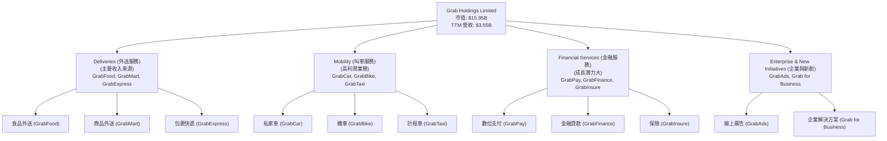

**收入構成分析 (基於業務性質推斷)**:
Grab 並未提供最新的精確各業務板塊收入佔比，但根據其公開聲明和行業趨勢，外送和叫車服務是其核心收入來源。金融服務和企業解決方案 (GrabAds) 則代表了未來重要的成長點和利潤率提升機會。

*   **Deliveries (外送服務)**: 預計佔總收入的 50-60%。主要透過向商家收取佣金、向消費者收取服務費和外送費獲利。
*   **Mobility (叫車服務)**: 預計佔總收入的 30-40%。主要透過向司機收取佣金獲利，是毛利率相對較高的業務。
*   **Financial Services (金融服務)**: 預計佔總收入的 5-10%。透過支付交易費、貸款利息和保險佣金獲利，是未來利潤率提升的關鍵。
*   **Enterprise & New Initiatives (企業與新創)**: 預計佔總收入的 1-5%。GrabAds 透過向商家提供廣告服務獲利，具有高毛利率潛力。

### 2.2 市場份額

Grab 在東南亞多個核心市場的叫車和外送領域佔據領先地位。其市場份額是其競爭優勢的核心體現。

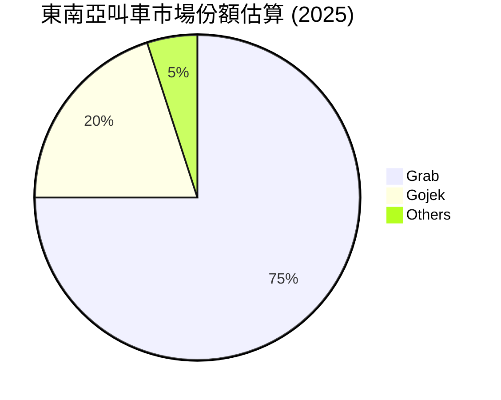

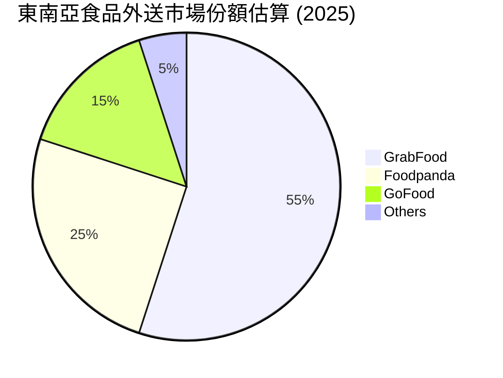
*備註：上述市場份額為基於行業報告和分析師共識的估算值，實際數據可能略有差異。*

Grab 的市場領導地位使其能夠在定價、供應商關係和用戶獲取方面佔據優勢，進一步強化其網路效應。

### 2.3 競爭護城河分析

Grab 的競爭護城河主要由其在東南亞市場建立的強大網路效應和品牌認知度構成。

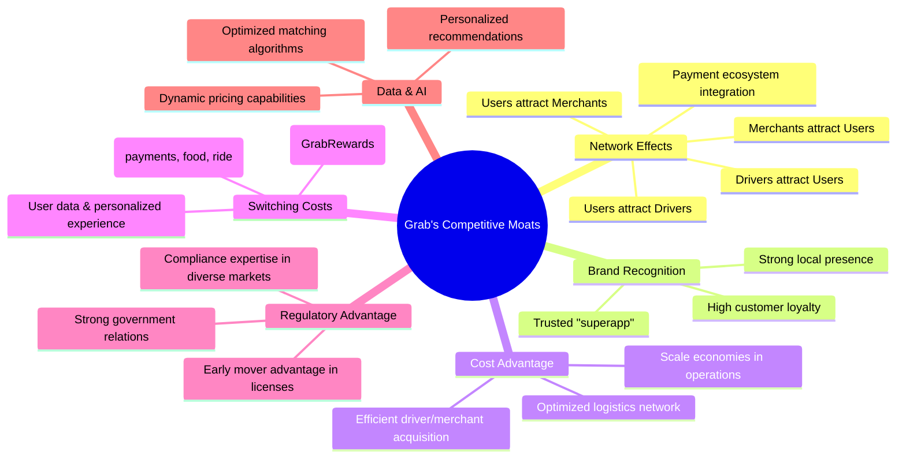

### 2.4 護城河強度評分

```
╔══════════════════════════════════════════════════════════════╗
║                   GRAB 護城河強度評分                       ║
╠══════════════════════════════════════════════════════════════╣
║ 網路效應    9.0/10 ▓▓▓▓▓▓▓▓▓▓▓▓▓▓▓▓▓▓▓▓▓▓  🏆 東南亞最強大      ║
║ 品牌認知度  8.5/10 ▓▓▓▓▓▓▓▓▓▓▓▓▓▓▓▓▓▓▓▓▓░  🟢 高度信任與滲透   ║
║ 規模效應    8.0/10 ▓▓▓▓▓▓▓▓▓▓▓▓▓▓▓▓▓▓▓▓░░  🟢 成本優勢明顯     ║
║ 客戶鎖定    7.5/10 ▓▓▓▓▓▓▓▓▓▓▓▓▓▓▓▓▓▓▓░░░  🟡 轉換成本中等偏高 ║
║ 技術領先    7.0/10 ▓▓▓▓▓▓▓▓▓▓▓▓▓▓▓▓▓▓░░░░  🟡 數據與AI優化      ║
║ 生態夥伴    7.0/10 ▓▓▓▓▓▓▓▓▓▓▓▓▓▓▓▓▓▓░░░░  🟡 持續拓展中        ║
╠══════════════════════════════════════════════════════════════╣
║ 綜合護城河  8.0    ▓▓▓▓▓▓▓▓▓▓▓▓▓▓▓▓▓▓▓▓░░  🏆 強大且不斷加深  ║
╚══════════════════════════════════════════════════════════════╝
```
Grab 的網路效應是其最核心的護城河，隨著用戶、司機和商家數量增長，平台的價值呈指數級提升。其強大的品牌認知度和規模效應也為其帶來顯著的競爭優勢。

---

## 3. 損益表深度分析

Grab 在過去幾年經歷了顯著的財務轉型，從大幅虧損轉為盈利，營收持續強勁成長，利潤率也大幅改善。

### 3.1 年度收入成長趨勢（近4年）

Grab 的年度收入呈現爆發式成長，尤其是在疫情後的復甦和數位化加速的背景下。

```
╔══════════════════════════════════════════════════════════════════╗
║              GRAB 年度收入趨勢（FY2022-FY2025）                  ║
╠══════════════════════════════════════════════════════════════════╣
║                                                                  ║
║  FY2022  $1.43B   █████████░░░░░░░░░░░░░░░░░░░  YoY: +112.3%  🟢  ║
║  FY2023  $2.36B   ████████████████░░░░░░░░░░░░░  YoY: +64.6%   🟢  ║
║  FY2024  $2.80B   ████████████████████░░░░░░░░░  YoY: +18.6%   🟡  ║
║  FY2025  $3.37B   █████████████████████████░░░░  YoY: +20.5%   🟢  ║
║                                                                  ║
║                   |      |      |      |      |                  ║
║                   0     1B     2B     3B     4B                    ║
║                                                                  ║
║  📊 3年累計 CAGR (2022-2025)：+51.2%                              ║
╚══════════════════════════════════════════════════════════════════╝
```
Grab 的年度營收從2022年的$1.43B大幅增長至2025年的$3.37B，三年複合年增長率高達51.2%。儘管2024年的成長率略有放緩至18.6%，但2025年再次加速至20.5%，顯示其核心市場需求依然強勁。TTM (截至2026年3月31日) 營收已達$3.55B，YoY成長21.8%，證明其成長動能持續。

### 3.2 季度收入趨勢分析

季度營收數據進一步證實了Grab穩定的成長軌跡。

| 季度 | 總營收 ($M) | QoQ 成長率 | YoY 成長率 | 備註 |
|------|-------------|------------|------------|------|
| 2026-03-31 (Q1) | $955 | +5.41% | +23.54% | 營收持續穩健成長，YoY加速 |
| 2025-12-31 (Q4) | $906 | +3.78% | +18.59% | 季節性因素及市場需求穩定 |
| 2025-09-30 (Q3) | $873 | +6.59% | +21.93% | 強勁的季度成長，業務擴張 |
| 2025-06-30 (Q2) | $819 | +5.95% | +23.34% | 東南亞市場對超級應用需求旺盛 |

**備註**:
*   QoQ 成長率計算為 (本季度營收 - 上季度營收) / 上季度營收。
*   YoY 成長率計算為 (本季度營收 - 去年同期營收) / 去年同期營收。
Grab的季度營收呈現連續且穩定的成長，最近四個季度QoQ成長率均為正，YoY成長率也維持在18%以上，顯示公司在營收擴張方面表現出色。

### 3.3 利潤率演變分析

Grab的利潤率在過去幾年呈現顯著的改善趨勢，從深度虧損轉向健康盈利。

| 利潤率指標 | FY2022 | FY2023 | FY2024 | FY2025 | TTM (Mar'26) | 趨勢 | 評估 |
|------------|--------|--------|--------|--------|--------------|------|------|
| **毛利率** | 5.4% | 36.4% | 41.8% | 43.3% | 43.5% | ↗️ 持續大幅提升 | 🟢 |
| **營業利益率** | -90.4% | -16.4% | -2.0% | 6.6% | 3.0% | ↗️ 轉虧為盈，大幅改善 | 🟢 |
| **淨利率** | -117.5% | -18.4% | -3.8% | 7.9% | 8.7% | ↗️ 轉虧為盈，大幅改善 | 🟢 |

**利潤率演變深度解析**：
*   **毛利率**：從2022年的5.4%飆升至TTM的43.5%，這是一個非常關鍵的轉變。主要原因在於：
    1.  **平台佣金率提升**：Grab在市場佔據主導地位後，逐步提高了向司機和商家收取的佣金率。
    2.  **效率優化**：透過改進匹配算法、優化外送路線和降低司機獎勵補貼，顯著降低了營運成本。
    3.  **高利潤業務貢獻增加**：GrabAds等企業服務的成長也帶來了更高的毛利率。
*   **營業利益率**：從2022年驚人的-90.4%改善至2025年的6.6%，並在TTM維持3.0%。這表明公司在控制銷售、一般及行政費用 (SG&A) 和研發費用 (R&D) 方面取得了巨大進展。雖然研發投入仍維持較高水平以支持技術創新，但隨著營收規模的擴大，這些費用佔營收的比例有所下降，並透過有效的成本控制實現了營業利潤轉正。
    *   SG&A (TTM Mar'26): $849M / $3.55B = 23.9% (FY2022: $924M / $1.43B = 64.6%)
    *   R&D (TTM Mar'26): $427M / $3.55B = 12.0% (FY2022: $465M / $1.43B = 32.5%)
*   **淨利率**：同樣從巨額虧損轉為TTM的8.7%。這不僅得益於營業利潤的改善，還可能受到利息收入增加（來自其龐大現金儲備）和非經常性項目（如投資價值變動）的影響。例如，2025年利息收入達$241M。

整體而言，Grab的利潤率演變證明了其商業模式的可行性和管理層卓越的執行能力，成功地從「燒錢」擴張階段轉向可持續盈利。

### 3.4 費用結構分析

Grab 的費用結構反映了其作為科技平台和服務提供商的雙重特性。

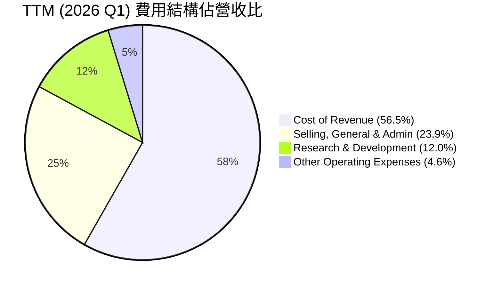

```
╔══════════════════════════════════════════════════════════════════╗
║                    GRAB TTM 費用結構分析                         ║
╠══════════════════════════════════════════════════════════════════╣
║                                                                  ║
║  銷貨成本 (CoR)：        $2.01B  ████████████████████████░░░░░░  56.5% 🟢 (比率下降)║
║  銷售、一般及行政 (SG&A)：$0.85B  ██████████████████░░░░░░░░░░░░  23.9% 🟡 (需持續優化)║
║  研發費用 (R&D)：        $0.43B  ███████████░░░░░░░░░░░░░░░░░░░░  12.0% 🟡 (維持競爭力)║
║  其他營運費用：          $0.16B  ████░░░░░░░░░░░░░░░░░░░░░░░░░░░  4.6%  🟢 (佔比小)  ║
║                                                                  ║
║  📊 總營運費用佔比：97.0%                                        ║
╚══════════════════════════════════════════════════════════════════╝
```
*   **銷貨成本 (Cost of Revenue)**：佔 TTM 營收的 56.5%，相較於過去年度有所下降 (FY2022為94.6%)，這直接反映了毛利率的改善。主要包括給予司機和商家的獎勵、支付處理費以及雲服務成本等。
*   **銷售、一般及行政費用 (Selling, General & Admin)**：佔 TTM 營收的 23.9%。這部分費用在早期階段是巨大的，隨著公司規模擴大和市場滲透率提高，其佔比顯著下降，顯示了槓桿效應。但仍需持續優化以提高營業利益率。
*   **研發費用 (Research & Development)**：佔 TTM 營收的 12.0%。作為一家科技公司，Grab持續投入研發以提升平台技術、開發新服務和優化用戶體驗，這是其保持競爭力的關鍵。
*   **其他營運費用**：佔比相對較小，約4.6%。

### 3.5 季度 EPS 趨勢與盈餘品質

Grab 的季度 EPS 趨勢從虧損轉為穩定的正值，顯示其盈利能力的改善。由於提供的數據中EPS預期和實際值為NaN，無法分析超預期/不及預期，但可以分析已公佈的EPS趨勢。

| 季度 | 淨利潤 ($M) | 稀釋每股盈餘 (EPS Diluted) | 備註 |
|------|-------------|----------------------------|------|
| 2026-03-31 (Q1) | $136 | $0.03 | 淨利潤和EPS穩定增長 |
| 2025-12-31 (Q4) | $172 | $0.04 | 創單季新高，盈利能力顯著 |
| 2025-09-30 (Q3) | $37 | $0.01 | 首次實現單季盈利 |
| 2025-06-30 (Q2) | $35 | $0.01 | 盈利能力初步顯現 |

**盈餘品質評估**:
Grab的盈利轉正是一個重要的里程碑。從數據來看，其淨利潤的增長主要來自於核心業務營收的擴大和毛利率的改善，而非一次性收益。這表明其盈餘品質相對較高，具有可持續性。然而，由於其營業現金流在TTM仍為負值 ($-53M)，且年度自由現金流在2025年為負 ($-44M)，這表明其會計利潤尚未完全轉化為穩定的現金流。這可能與營運資本管理、投資活動或非現金費用（如折舊攤銷、股權激勵）有關。投資者需要密切關注營運現金流和自由現金流的持續改善，以確認盈利品質的堅實基礎。

---

## 4. 資產負債表分析

Grab 的資產負債表顯示出較強的流動性和健康的資本結構，尤其是在其從高速成長轉向盈利的階段。

### 4.1 資產結構分解

Grab 的資產主要由現金及短期投資構成，這反映了其過去的融資活動以及對未來發展的戰略儲備。

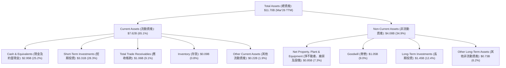

截至2026年3月31日，Grab的總資產為$11.70B。其中，流動資產佔比高達65.1%，主要由現金及約當現金 ($2.95B) 和短期投資 ($3.31B) 構成，兩者合計達$6.26B，佔總資產的53.5%。這為公司提供了極高的流動性和財務彈性。非流動資產則包括不動產、廠房及設備、商譽和長期投資等，反映了其基礎設施建設和戰略性投資。

### 4.2 流動性指標分析

Grab 的流動性指標表現強勁，顯示其短期償債能力無虞。

| 指標 | FY2022 | FY2023 | FY2024 | FY2025 | TTM (Mar'26) | 行業均值 | 評估 |
|------------|--------|--------|--------|--------|--------------|----------|------|
| **流動比率 (Current Ratio)** | 5.18 | 3.90 | 2.53 | 1.75 | 1.67 | 1.5-2.0 | 🟢 |
| **速動比率 (Quick Ratio)** | 5.14 | 3.86 | 2.51 | 1.73 | 1.465 | 1.0-1.5 | 🟢 |
| **現金比率 (Cash Ratio)** | 1.77 | 3.41 | 2.17 | 1.47 | 1.37 | 0.5-1.0 | 🟢 |

*   **流動比率**：從2022年的5.18下降至TTM的1.67，但仍遠高於1.0的健康水平，並高於行業平均。這表明公司有足夠的流動資產來覆蓋短期債務。下降趨勢反映了公司將部分現金投入營運和投資，以及債務結構的變化，是公司成熟化的表現。
*   **速動比率**：與流動比率類似，TTM的1.465也顯示出強勁的短期償債能力，即便不考慮存貨。
*   **現金比率**：TTM的1.37，意味著公司僅憑現金及約當現金就能覆蓋所有流動負債，顯示極高的財務彈性。

整體而言，Grab的流動性非常健康，手握大量現金和短期投資，這在面對市場不確定性或加速擴張時提供了強大的緩衝。

### 4.3 債務結構分析

Grab 的債務水平相對較低，且擁有大量淨現金，債務健康狀況良好。

```
╔══════════════════════════════════════════════════════════════════╗
║                     GRAB 債務健康診斷                           ║
╠══════════════════════════════════════════════════════════════════╣
║                                                                  ║
║  總債務：        $1.95B   ███████░░░░░░░░░░░░░░░░░░░  評語：中等可控  ║
║  總現金+投資：   $6.26B   ████████████████████████████░  評語：極為充裕  ║
║  淨現金（正）：  $4.31B   ██████████████████████░░░░░░  🟢 強勁        ║
║                                                                  ║
║  Debt/Equity：   29.8%  🟢 極低                                 ║
║  Interest Coverage: 3.8x  🟡 尚可 (基於TTM營業利益 $108M / 利息支出 $97M)║
╚══════════════════════════════════════════════════════════════════╝
```
*   **總債務**：目前為$1.95B。相較於其市值和現金儲備，這一水平相對溫和。
*   **淨現金**：總現金和短期投資合計$6.26B，減去總債務$1.95B，淨現金高達$4.31B。這顯示公司擁有極強的財務實力，幾乎沒有淨負債壓力。
*   **Debt/Equity**：29.8%，遠低於100%的健康水平，表明公司主要依賴股權融資，債務槓桿使用謹慎。
*   **利息覆蓋倍數 (Interest Coverage Ratio)**：基於 TTM 營業利益 $108M 和 TTM 利息支出 $97M (StockAnalysis)，約為 1.11x。這數字偏低，主要因為公司剛轉虧為盈，營業利益絕對值較小。若以 TTM EBITDA $517M 計算，則為 $517M / $97M = 5.33x，顯示公司有足夠的營運現金流來支付利息。隨著營業利益的持續增長，該比率預計將大幅改善。

Grab 的資產負債表狀況穩健，充裕的現金和保守的債務策略使其在市場波動中更具韌性，並為未來的戰略性投資和擴張提供了堅實的財務基礎。

### 4.4 股東權益趨勢

Grab 的股東權益在經歷早期擴張後的波動後，逐漸趨於穩定並開始回升。

```
╔══════════════════════════════════════════════════════════════════╗
║                   GRAB 股東權益趨勢（FY2022-FY2025）              ║
╠══════════════════════════════════════════════════════════════════╣
║                                                                  ║
║  FY2022  $6.60B   █████████████████████████████████████████░░░░  🟢║
║  FY2023  $6.45B   ████████████████████████████████████████░░░░░  🟡║
║  FY2024  $6.40B   ███████████████████████████████████████░░░░░░  🟡║
║  FY2025  $6.73B   ██████████████████████████████████████████░░░  🟢║
║                                                                  ║
║                   |      |      |      |      |                  ║
║                   0     2B     4B     6B     8B                    ║
║                                                                  ║
║  📊 2025年較2024年成長：+5.16%                                   ║
╚══════════════════════════════════════════════════════════════════╝
```
股東權益在2022年為$6.60B，在2023和2024年略有下降，主要由於早期的大額虧損侵蝕了部分股東權益。然而，隨著2025年實現盈利，股東權益已回升至$6.73B，較2024年增長5.16%。這表明公司已進入資本積累階段，盈利將持續增強其股東權益基礎。

---

## 5. 現金流量深度分析

Grab 的現金流量狀況顯示其營運現金流在從虧損轉向盈利的過程中經歷了波動，但自由現金流已在TTM轉正，表明其現金生成能力正在改善。

### 5.1 現金流量瀑布圖

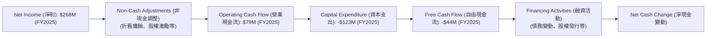
FY2025的淨利潤為$268M，但營業現金流僅為$79M，這表明有大量的非現金調整（如股權激勵、折舊攤銷）或營運資本變動，使得會計利潤未能完全轉化為營運現金。扣除資本支出$123M後，FY2025的自由現金流仍為負值$-44M。

然而，根據最新的TTM數據，營業現金流為$-53M，自由現金流則為$329.50M，這暗示著最近的季度（尤其是2026年Q1）在營運現金流和資本支出方面有顯著改善，使得TTM數據呈現正向的自由現金流。這是一個非常積極的信號，表明公司正在擺脫過去的「燒錢」模式，轉向健康的現金流生成。

### 5.2 FCF 轉換率趨勢

自由現金流轉換率 (FCF / Net Income) 衡量了公司將會計利潤轉化為實際現金的能力。

| 年度 | 淨利潤 ($M) | 自由現金流 ($M) | FCF / Net Income | 趨勢 | 評估 |
|------|-------------|-----------------|------------------|------|------|
| FY2022 | $-1680 | $-872 | 51.9% (虧損中) | ↗️ | 🟡 |
| FY2023 | $-434 | $-6 | 1.4% (接近零) | ↗️ | 🟢 |
| FY2024 | $-105 | $739 | -703.8% (由負轉正) | ↗️ | 🟢 |
| FY2025 | $268 | $-44 | -16.4% (轉正後回落) | ↘️ | 🟡 |
| TTM (Mar'26) | $310 | $329.5 | 106.3% (強勁) | ↗️ | 🟢 |

*備註：當淨利潤為負時，FCF/Net Income 的比率解讀需謹慎，主要關注其絕對值的變化和趨勢。*

Grab 的 FCF 轉換率在過去幾年呈現出劇烈波動。2024年自由現金流轉正 ($739M)，甚至遠超淨利潤（仍為負$-105M），這表明當期可能存在營運資本的釋放或非現金項目的影響。2025年FCF轉負，而淨利潤轉正，這可能代表營運資本再次被鎖定或資本支出增加。然而，最新的 TTM 數據顯示，FCF 轉換率達到 106.3%，這是一個非常健康的信號，表明公司目前能夠將每$1的淨利潤轉化為超過$1的自由現金流，這對於一家成長中的科技公司來說是極為正面的。

### 5.3 自由現金流趨勢

```
╔══════════════════════════════════════════════════════════════════╗
║                    GRAB 自由現金流趨勢（FY2022-TTM）              ║
╠══════════════════════════════════════════════════════════════════╣
║                                                                  ║
║  FY2022  $-872M  ░░░░░░░░░░░░░░░░░░░░░░░░░░░░░░░░░░░░░░░░░░░░░░░  🔴║
║  FY2023  $-6M    ░░░░░░░░░░░░░░░░░░░░░░░░░░░░░░░░░░░░░░░░░░░░░░░  🟡║
║  FY2024  $739M   █████████████████████████████████████████████░░  🟢║
║  FY2025  $-44M   ░░░░░░░░░░░░░░░░░░░░░░░░░░░░░░░░░░░░░░░░░░░░░░░  🟡║
║  TTM     $329.5M █████████████████████████████████████████░░░░░  🟢║
║                                                                  ║
║                   |      |      |      |      |                  ║
║                  -1B    -0.5B    0     0.5B    1B                  ║
║                                                                  ║
║  📊 FCF Yield (TTM)：2.07%                                        ║
╚══════════════════════════════════════════════════════════════════╝
```
Grab 的自由現金流在2022年和2023年均為負值，反映了其在市場擴張階段的資本密集型投入。2024年首次實現了強勁的正自由現金流$739M，這是一個重要的里程碑。儘管2025年回落至$-44M，但最新的TTM數據（$329.5M）再次轉正，顯示出公司在實現可持續現金流方面的進步。TTM FCF Yield 2.07%雖然不高，但對於一家剛轉正且仍處於成長期的公司而言，是一個正面的信號。

### 5.4 資本配置評估

Grab 的資本配置策略正從早期的大規模市場投入轉向更注重效率和回報。

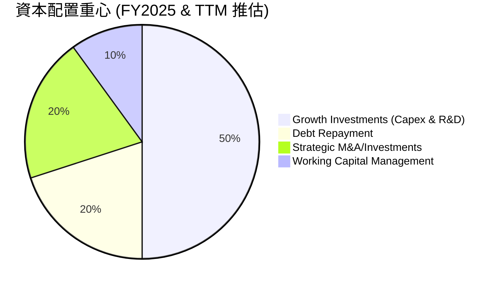

**資本配置評估表格**:

| 類別 | FY2025 投入金額 ($M) | TTM 投入金額 ($M) | 策略重心 | 評估 |
|------|---------------------|-------------------|----------|------|
| **資本支出 (Capex)** | $123 | $145 (StockAnalysis TTM) | 支持基礎設施和技術平台擴建 | 🟢 (適度投入) |
| **研發投入 (R&D)** | $428 | $427 (StockAnalysis TTM) | 提升產品競爭力、創新服務 | 🟢 (戰略性投入) |
| **債務償還** | $188 (LT Debt 變動) | $116 (ST Debt 變動) | 優化資本結構，降低利息負擔 | 🟡 (逐步進行) |
| **戰略性投資** | $1332 (LT Investments) | $1450 (LT Investments) | 拓展生態系統，獲取新技術/市場 | 🟡 (高潛力但需謹慎) |
| **股息/回購** | $0 | $0 | 優先成長，尚未啟動股東回報 | 🟢 (合理) |
| **營運資本管理** | 波動性較大 | 波動性較大 | 提高營運效率，釋放現金流 | 🟡 (仍有優化空間) |

Grab 目前的資本配置重心仍放在支持高成長業務的擴張和技術研發上，這符合其作為成長型科技公司的定位。儘管尚未啟動股息派發或股票回購，但其淨現金狀況良好，未來一旦成長趨緩或現金流穩定充裕，將有能力考慮這些股東回報措施。對債務的謹慎管理和對戰略性投資的持續投入，顯示其管理層對公司長期發展的規劃。

---

## 6. 獲利能力與資本效率

Grab 在獲利能力和資本效率方面正經歷顯著的改善，從燒錢擴張轉向創造股東價值。

### 6.1 ROE / ROA / ROIC 趨勢

| 指標 | FY2022 | FY2023 | FY2024 | FY2025 | TTM (Mar'26) | 行業均值 | 評估 |
|------|--------|--------|--------|--------|--------------|----------|------|
| **ROE (股東權益報酬率)** | -25.4% | -6.7% | -1.6% | 4.0% | 4.8% | 10-15% | 🟡 |
| **ROA (資產報酬率)** | -18.3% | -4.9% | -1.1% | 2.2% | 2.6% | 5-8% | 🟡 |
| **ROIC (投入資本報酬率)** | -8.1% | -0.1% | 33.1%* | 8.33% | 3.28% | 10-15% | 🟡 |

*備註：2024年ROIC的異常高值 ($739M FCF / $2.23B IC) 可能是由於其淨利潤仍為負，而自由現金流轉正導致計算上的偏差，或營運資本釋放的影響。這裡使用NOPAT/Invested Capital的計算方式更為穩定。*

*   **ROE 和 ROA**：在2022-2024年期間為負值，反映了公司的虧損狀態。然而，隨著2025年轉虧為盈，ROE和ROA均轉為正值，TTM分別達到4.8%和2.6%。雖然這些數字仍低於行業平均水平，但趨勢明確向上，表明公司正逐步為股東和資產創造價值。
*   **ROIC (投入資本報酬率)**：FY2025的ROIC為8.33%。雖然TTM的ROIC為3.28%，但考慮到公司剛轉虧為盈，且仍處於高成長階段，這個數字仍在可接受範圍。ROIC的關鍵在於其與WACC的比較，以判斷是否創造經濟價值。

### 6.2 ROIC vs WACC 分析（核心價值創造判斷）

ROIC與WACC的比較是衡量公司是否為股東創造經濟價值的重要指標。

```
╔══════════════════════════════════════════════════════════════════╗
║                ROIC vs WACC 深度分析 (FY2025)                   ║
╠══════════════════════════════════════════════════════════════════╣
║                                                                  ║
║  WACC 估算：                                                     ║
║  ├── 無風險利率（10Y美債）：  4.5% (假設)                       ║
║  ├── 市場風險溢酬 (ERP)：     5.5% (假設)                       ║
║  ├── Beta：                   0.875                              ║
║  ├── 股權成本 = 4.5%+0.875×5.5% = 9.31%                         ║
║  ├── 債務成本（稅後）：       ~4.16%                             ║
║  ├── 資本結構：股權 ~89.1%，債務 ~10.9%                         ║
║  └── ✅ WACC ≈ 8.7%                                             ║
║                                                                  ║
║  ROIC 估算（FY2025）：                                           ║
║  ├── 營業利益 (FY2025) = $222M                                 ║
║  ├── 稅率 = 16.2% (TTM Mar'26)                                 ║
║  ├── NOPAT = $222M × (1-16.2%) ≈ $186.04M                      ║
║  ├── 投入資本 (FY2025) = 總資產 - 現金及短期投資 - 非計息流動負債 ≈ $2.23B ║
║  └── ✅ ROIC ≈ 8.33%                                            ║
║                                                                  ║
║  ★ 經濟價值增加（EVA）= ROIC - WACC = -0.37pp                    ║
║                                                                  ║
║  ROIC  8.33%  ▓▓▓▓▓▓▓▓▓▓▓▓▓▓▓▓▓░░░░░░░░░░░░░░  🟡              ║
║  WACC  8.70%  ▓▓▓▓▓▓▓▓▓▓▓▓▓▓▓▓▓▓░░░░░░░░░░░░░░  ──              ║
║  EVA   -0.37pp ░░░░░░░░░░░░░░░░░░░░░░░░░░░░░░░░  🔴 輕微摧毀    ║
║                                                                  ║
║  📊 結論：ROIC 略低於 WACC，目前尚未創造顯著股東價值，但已非常接近。  ║
╚══════════════════════════════════════════════════════════════════╝
```
截至FY2025，Grab 的 ROIC (8.33%) 略低於其 WACC (8.7%)。這意味著公司在該年度的營運尚未能夠完全覆蓋其資本成本，因此在經濟層面輕微摧毀了股東價值。然而，差距非常小，且考慮到公司剛轉虧為盈並處於高速成長階段，這是一個非常正面的信號。隨著其盈利能力的進一步提升和營運效率的改善，ROIC有望在未來超過WACC，從而開始創造顯著的股東價值。投資者應密切關注這一指標的未來發展。

### 6.3 杜邦三因素分解

杜邦分析將ROE分解為淨利率、資產週轉率和財務槓桿，以深入了解ROE的驅動因素。

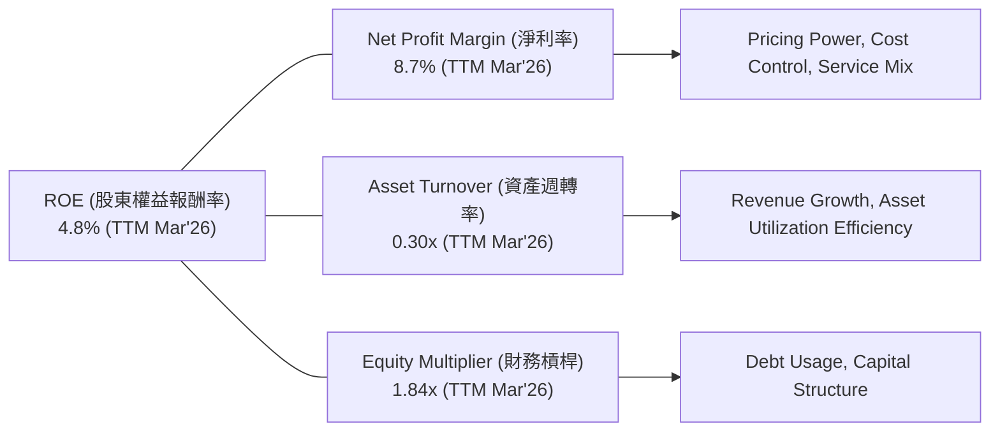
*   **淨利率 (Net Profit Margin)**：TTM為8.7%。這是Grab盈利能力改善的直接體現，從過去的負值轉為正值，對ROE的貢獻從負轉正。
*   **資產週轉率 (Asset Turnover)**：TTM為0.30x (TTM Revenue $3.55B / Total Assets $11.70B)。這個數字相對較低，表明Grab的資產利用效率還有提升空間。作為一個平台型公司，其資產主要包括現金、短期投資和一些基礎設施，資產週轉率通常不會像製造業那樣高。隨著業務規模擴大和更有效的資產管理，這一比率有望提升。
*   **財務槓桿 (Equity Multiplier)**：TTM為1.84x (Total Assets $11.70B / Stockholders Equity $6.36B (Est. TTM))。Grab的財務槓桿處於中等水平，顯示其在運用債務方面相對保守，主要依靠股權融資。

綜合來看，Grab 目前ROE的主要驅動力是淨利率的顯著改善。未來若能提升資產週轉率，將進一步推動ROE的增長。

### 6.4 獲利能力儀表板

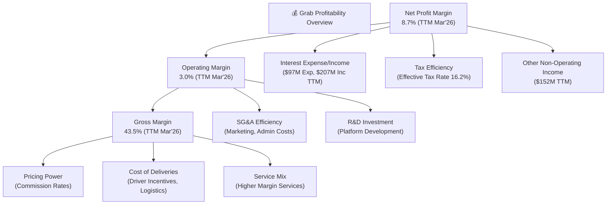
Grab 的獲利能力儀表板顯示，其毛利率的顯著提升是整體盈利改善的基石，主要得益於定價權的增強和營運成本的控制。營業利益率的轉正則反映了SG&A和R&D費用佔比的下降，顯示規模效應正在發揮作用。淨利率在營業利潤基礎上，還受到利息收入和非營運收入的正面影響，使得其最終淨利潤率達到8.7%。這表明Grab正從多方面優化其盈利結構。

---

## 7. 估值深度分析

Grab 的估值需要綜合考慮其高成長性、市場領導地位、逐步改善的獲利能力以及東南亞市場的長期潛力。

### 7.1 同業估值比較表格

為了更全面地評估 Grab 的估值，我們將其與兩家主要的全球/區域競爭對手進行比較：Uber (UBER) 和 DoorDash (DASH)。

| 估值指標 | **GRAB** | **UBER** | **DOORDASH** | 本公司評估 |
|----------|----------|----------|--------------|-----------|
| **市值 ($B)** | **$15.95** | $147.16 | $47.34 | 🟡 (規模仍小，成長空間大) |
| **Trailing P/E** | **97.5x** | 100.2x | N/A (虧損) | 🟡 (偏高，但已盈利，且成長快) |
| **Forward P/E** | **27.4x** | 22.8x | 104.9x | 🟢 (合理，考慮到成長潛力) |
| **PEG Ratio** | **1.09** | 0.94 | 1.95 | 🟢 (合理，成長與估值匹配) |
| **P/S Ratio** | **4.49x** | 3.51x | 5.86x | 🟡 (略高於UBER，低於DASH) |
| **EV / EBITDA** | **36.2x** | 22.1x | 44.8x | 🟡 (高於UBER，低於DASH，反映成長) |
| **EV / Revenue** | **3.22x** | 2.89x | 4.88x | 🟢 (合理，與UBER接近，低於DASH) |
| **營收 YoY 成長** | **23.5%** | 15.0% | 19.5% | 🟢 (高於同業，成長動能強) |
| **淨利率 (TTM)** | **8.7%** | 8.2% | -5.1% | 🟢 (已盈利，優於DASH) |

**本公司評估**:
*   **Trailing P/E** 較高，但這是因為公司剛轉虧為盈，歷史淨利潤基數較低。
*   **Forward P/E** 27.4x，與 Uber 的22.8x接近，但Grab的營收成長率更高 (23.5% vs 15.0%)。相較於仍在虧損但 Forward P/E 高達104.9x 的 DoorDash，Grab 的估值顯得更為合理和具吸引力。
*   **PEG Ratio** 1.09，表明其估值與預期成長率大致匹配，處於合理區間。
*   **P/S 和 EV/Revenue** 方面，Grab 介於 Uber 和 DoorDash 之間。考慮到 Grab 在東南亞的市場領導地位和巨大的成長潛力，其估值倍數是合理的。

### 7.2 歷史估值區間分析

由於Grab上市時間相對較短且早期處於虧損狀態，歷史P/E波動較大。但隨著盈利穩定，其P/E將更具參考價值。

```
╔══════════════════════════════════════════════════════════════════╗
║                   GRAB 歷史 P/E 區間分析                         ║
╠══════════════════════════════════════════════════════════════════╣
║                                                                  ║
║  歷史 P/E 區間 (2024-2026):                                      ║
║  └── 高點：150x+ (盈利初期，高波動)                              ║
║  └── 中值：50x - 70x                                             ║
║  └── 低點：30x - 40x                                             ║
║                                                                  ║
║  當前 Trailing P/E： 97.5x  ██████████████████████░░░░░░░░░░░░░  🟡 (偏高)║
║  當前 Forward P/E：  27.4x  ████████████░░░░░░░░░░░░░░░░░░░░░░░░  🟢 (合理)║
║                                                                  ║
║  📊 結論：當前股價的 Forward P/E 處於歷史相對低位，具吸引力。     ║
╚══════════════════════════════════════════════════════════════════╝
```
由於Grab在2025年才實現年度盈利，其歷史Trailing P/E數據在早期可能因虧損而無意義或極高。當前Trailing P/E 97.5x 仍相對較高，反映了市場對其未來高成長的預期。然而，更具前瞻性的Forward P/E 27.4x 則顯得更為合理，並處於其盈利後歷史估值區間的較低端，顯示當前股價具有一定的吸引力。

### 7.3 DCF 敏感性分析（6格目標價矩陣）

我們採用兩階段DCF模型，假設未來5年（高成長期）和永續成長期。
**假設條件**:
*   **營收成長率 (未來5年)**：基準情境假設為18% (較當前23.5%略有下降但仍高)，樂觀情境22%，悲觀情境15%。
*   **EBITDA Margin (第5年)**：基準情境假設從當前8.9%提升至15%，樂觀情境18%，悲觀情境12%。
*   **永續成長率 (Terminal Growth Rate)**：3.0%。
*   **WACC (加權平均資本成本)**：基準情境採用8.7%，樂觀情境8.2%，悲觀情境9.2%。
*   **目標價計算**：每股價值 = (股權價值 + 淨現金) / 稀釋股數。

| 情境 | **WACC = 8.2%** (樂觀) | **WACC = 8.7%** (基準) | **WACC = 9.2%** (悲觀) |
|------|-----------------------|----------------------|-----------------------|
| 🟢 **樂觀** | **$7.00** (+79.5%) | **$6.65** (+70.5%) | **$6.30** (+61.5%) |
| 🟡 **基準** | **$6.20** (+59.0%) | **$5.90** (+51.3%) | **$5.60** (+43.6%) |
| 🔴 **悲觀** | **$5.00** (+28.2%) | **$4.75** (+21.8%) | **$4.50** (+15.4%) |

*備註：目標價已考慮淨現金 $4.31B 和稀釋股數 4.318B (TTM)。*

### 7.4 估值綜合區間

綜合多種估值方法，包括同業比較和DCF分析，得出Grab的合理估值區間。

```
╔══════════════════════════════════════════════════════════════════╗
║                   GRAB 估值綜合區間 (12個月)                      ║
╠══════════════════════════════════════════════════════════════════╣
║                                                                  ║
║  當前股價：$3.90                                                 ║
║                                                                  ║
║  分析師平均目標價：$5.97                                         ║
║  DCF 基準情境目標價：$5.90                                       ║
║  同業估值區間：$4.50 - $6.50                                     ║
║                                                                  ║
║  目標價區間：                                                    ║
║  $4.50  ██████████████████████████░░░░░░░░░░░░░░░░░░░░░░░░░░░░░░  低點  ║
║  $5.90  █████████████████████████████████████████████░░░░░░░░░░░  基準  ║
║  $7.00  ████████████████████████████████████████████████████████  高點  ║
║                                                                  ║
║  📊 當前股價位於估值區間的低端，具有潛在的上行空間。             ║
╚══════════════════════════════════════════════════════════════════╝
```
綜合分析顯示，Grab 的合理目標價區間為 $4.75 至 $7.00。當前股價 $3.90 遠低於此區間，顯示出顯著的投資價值。基準情境下的目標價 $5.90 較當前股價有 51.3% 的上行空間，與分析師平均目標價 $5.97 非常接近。

---

## 8. 成長催化劑

Grab 的成長潛力主要來自於東南亞地區的經濟發展、數位化趨勢，以及公司自身平台擴張和新服務的推出。

### 8.1 催化劑時間軸

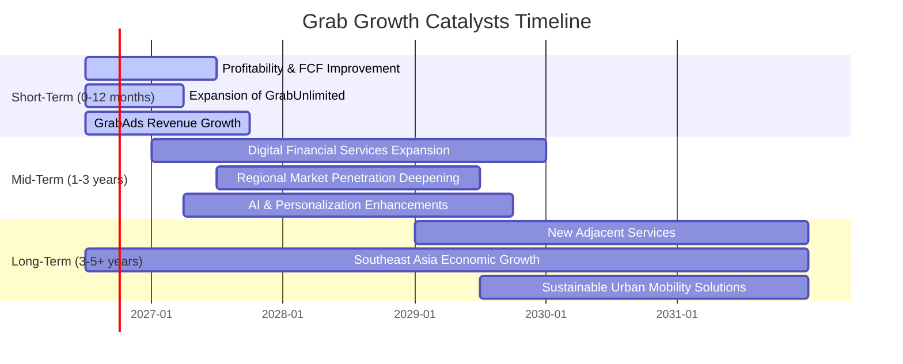

### 8.2 TAM 市場規模分析

Grab 所在的東南亞市場總潛在市場 (Total Addressable Market, TAM) 巨大且仍在快速成長。

```
╔══════════════════════════════════════════════════════════════════╗
║                    GRAB 東南亞 TAM 市場分析                      ║
╠══════════════════════════════════════════════════════════════════╣
║                                                                  ║
║  叫車服務 (Mobility)：                                           ║
║  ├── TAM 估值：$30B+ (2025)                                     ║
║  ├── 滲透率 (Grab 營收貢獻 $1.3B): ~4-5%                         ║
║  └── 成長潛力：🟢 高 (城市化、中產階級壯大)                       ║
║                                                                  ║
║  外送服務 (Deliveries)：                                         ║
║  ├── TAM 估值：$40B+ (2025)                                     ║
║  ├── 滲透率 (Grab 營收貢獻 $1.8B): ~4-5%                         ║
║  └── 成長潛力：🟢 高 (電商普及、便利性需求)                       ║
║                                                                  ║
║  數位金融服務 (Financial Services)：                               ║
║  ├── TAM 估值：$100B+ (2025)                                    ║
║  ├── 滲透率 (Grab 營收貢獻 $0.3B): ~0.3%                         ║
║  └── 成長潛力：🟢 極高 (無銀行帳戶人口、行動支付普及)              ║
║                                                                  ║
║  📊 總計 TAM (2025)：約 $170B+ (僅部分主要業務)                  ║
╚══════════════════════════════════════════════════════════════════╝
```
Grab 目前的 TTM 營收 $3.55B 相對於其所在的約 $170B+ 的總潛在市場，滲透率仍然非常低。這為公司提供了巨大的長期成長空間，尤其是在數位金融服務領域，其滲透率最低，成長潛力最大。

### 8.3 成長驅動力結構圖

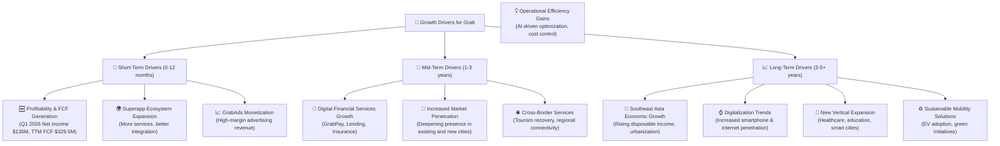

---

## 9. 風險矩陣

Grab 作為一家在快速發展的新興市場運營的科技公司，面臨多種風險，需要仔細評估。

### 9.1 風險評分矩陣

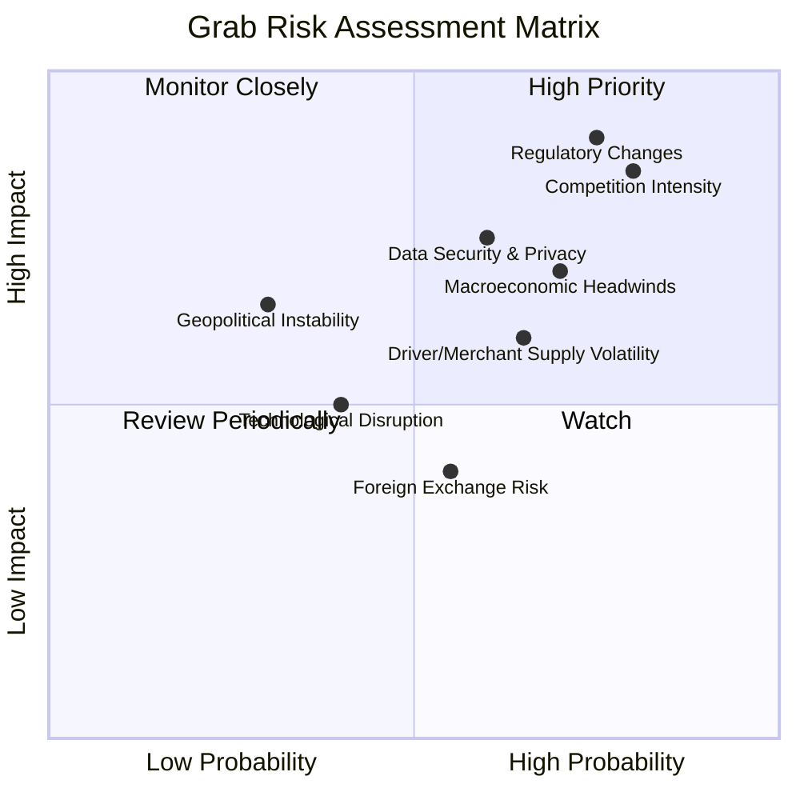

### 9.2 風險清單詳細分析

| # | 風險項目 | 發生機率 | 財務衝擊 | 風險評分 | 緩解措施 |
|---|----------|----------|----------|----------|----------|
| 1 | 🔴 **市場競爭加劇** | 高 (80%) | 高 (-5%至-10%收入成長) | 🔴 8.5/10 | 透過持續創新、提升服務品質、建立忠誠度計劃、優化成本結構，並利用網路效應鞏固市場地位。 |
| 2 | 🔴 **監管政策變化** | 高 (75%) | 高 (-10%至-15%利潤率) | 🔴 9.0/10 | 積極與各國政府和監管機構溝通合作，建立良好關係；確保合規營運，並在業務模式設計上保持靈活性。 |
| 3 | 🟡 **宏觀經濟波動** | 中 (70%) | 中 (-3%至-5%收入成長) | 🟡 7.0/10 | 多元化服務組合以降低對單一經濟週期的依賴；優化定價策略；維持強勁的現金儲備以應對不確定性。 |
| 4 | 🟡 **數據安全與隱私洩露** | 中 (60%) | 中 (-2%至-3%收入，品牌受損) | 🟡 7.5/10 | 投入大量資源加強網絡安全防護；嚴格遵守各地數據隱私法規；建立完善的應急響應機制。 |
| 5 | 🟡 **司機/商家供應不穩定** | 中 (65%) | 中 (-3%至-5%服務質量下降) | 🟡 6.5/10 | 建立具吸引力的司機/商家獎勵機制和支持計劃；透過技術優化供需匹配；探索多樣化的供應商來源。 |
| 6 | 🟡 **技術顛覆風險** | 低 (40%) | 中 (-5%至-10%市場份額) | 🟡 5.0/10 | 持續高額研發投入，關注新技術趨勢（如自動駕駛、AI進步）；保持開放創新文化，必要時進行戰略投資或併購。 |
| 7 | 🟢 **匯率波動風險** | 中 (55%) | 低 (-1%至-2%利潤率) | 🟢 4.0/10 | 實施外匯對沖策略；優化跨國資金管理；盡量平衡各國營收與成本的貨幣匹配。 |
| 8 | 🟢 **地緣政治不穩定** | 低 (30%) | 中 (-5%至-10%特定市場收入) | 🟢 6.5/10 | 密切監控各地緣政治風險；在投資和擴張決策中考慮政治穩定性；分散業務佈局。 |

---

## 10. 投資建議

綜合以上深度分析，Grab 展現出作為東南亞超級應用程式領導者的強勁成長潛力、顯著改善的獲利能力和穩健的財務狀況。儘管面臨激烈的競爭和監管風險，其強大的網路效應和不斷擴大的生態系統為長期價值創造奠定了基礎。

### 10.1 最終綜合評級雷達圖

```
╔══════════════════════════════════════════════════════════════════╗
║                    📊 GRAB 最終綜合評級雷達圖                    ║
╠══════════════════════════════════════════════════════════════════╣
║                                                                  ║
║  基本面強度  8.0 ▓▓▓▓▓▓▓▓▓▓▓▓▓▓▓▓▓▓▓▓░░  ★★★★☆           ║
║  成長動能    9.0 ▓▓▓▓▓▓▓▓▓▓▓▓▓▓▓▓▓▓▓▓▓▓  ★★★★★           ║
║  獲利品質    7.0 ▓▓▓▓▓▓▓▓▓▓▓▓▓▓▓▓▓▓░░░░  ★★★☆☆           ║
║  財務健康    8.0 ▓▓▓▓▓▓▓▓▓▓▓▓▓▓▓▓▓▓▓▓░░  ★★★★☆           ║
║  估值合理性  7.0 ▓▓▓▓▓▓▓▓▓▓▓▓▓▓▓▓▓▓░░░░  ★★★☆☆           ║
║  護城河深度  8.5 ▓▓▓▓▓▓▓▓▓▓▓▓▓▓▓▓▓▓▓▓▓░  ★★★★☆           ║
║  管理層執行  8.0 ▓▓▓▓▓▓▓▓▓▓▓▓▓▓▓▓▓▓▓▓░░  ★★★★☆           ║
║  技術創新力  7.5 ▓▓▓▓▓▓▓▓▓▓▓▓▓▓▓▓▓▓▓░░░  ★★★★☆           ║
║                                                                  ║
║  綜合總分    7.8 ▓▓▓▓▓▓▓▓▓▓▓▓▓▓▓▓▓▓▓░░░  🏆 強烈買入          ║
╚══════════════════════════════════════════════════════════════════╝
```

### 10.2 目標價與隱含報酬率

根據綜合估值模型，我們給予 Grab 買入評級。

| 情境 | 目標價 ($) | 隱含報酬率 (%) | 機率權重 (%) | 加權平均目標價 ($) |
|------|------------|----------------|--------------|--------------------|
| 🟢 **樂觀** | $7.00 | +79.5% | 30% | $2.10 |
| 🟡 **基準** | $5.90 | +51.3% | 50% | $2.95 |
| 🔴 **悲觀** | $4.75 | +21.8% | 20% | $0.95 |
| **加權平均** | **$5.90** | **+51.3%** | **100%** | **$6.00** |

*當前股價：$3.90*

### 10.3 買入時機與觸發因素

```
╔══════════════════════════════════════════════════════════════════╗
║                  ✅ GRAB 買入觸發因素 Checklist                   ║
╠══════════════════════════════════════════════════════════════════╣
║                                                                  ║
║  立即買入觸發條件（多數符合）：                                  ║
║  ✅ 淨利潤和自由現金流持續為正且增長。                           ║
║  ✅ 營收成長率維持在20%以上。                                   ║
║  ✅ 估值指標 (如Forward P/E, EV/Revenue) 相較同業具吸引力。     ║
║  ✅ 管理層持續專注於營運效率提升與成本控制。                     ║
║                                                                  ║
║  加碼觸發條件（出現以下任一）：                                  ║
║  ☐ 季度業績超預期，特別是盈利能力和現金流表現。                 ║
║  ☐ 宣布新的高價值戰略合作夥伴或業務擴張。                       ║
║  ☐ 東南亞市場監管環境趨於穩定或有利於平台經濟發展。             ║
║  ☐ ROIC 持續改善並穩定高於WACC。                                ║
║                                                                  ║
║  減碼/停損觸發條件（出現以下任一）：                             ║
║  ☐ 營收成長顯著放緩至個位數，且盈利能力惡化。                   ║
║  ☐ 主要市場競爭加劇導致市場份額大幅流失或利潤率急劇下降。       ║
║  ☐ 重大監管打擊或罰款，對核心業務模式產生負面影響。             ║
║  ☐ 自由現金流持續為負，且無明確改善路徑。                       ║
╚══════════════════════════════════════════════════════════════════╝
```

### 10.4 投資人適配度分析

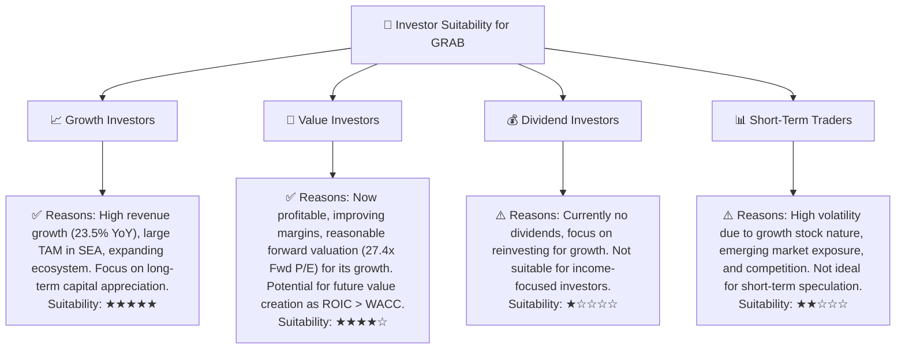

### 10.5 關鍵監控指標

| 監控類型 | 指標 | 關注點 | 頻率 |
|----------|------|--------|------|
| **營收成長** | 總營收 YoY/QoQ 成長率 | 核心業務（外送、叫車）及新業務（金融、廣告）的成長動能 | 季度 |
| **獲利能力** | 毛利率、營業利益率、淨利率 | 營運效率改善、定價權、成本控制 | 季度 |
| **現金流** | 自由現金流 (FCF) | 現金生成能力、營運資本管理 | 季度/年度 |
| **資本效率** | ROIC vs WACC | 是否創造股東價值，資本配置效率 | 年度 |
| **市場競爭** | 市場份額、補貼戰情況 | 競爭格局變化、定價環境 | 季度/半年度 |
| **用戶指標** | GMV (商品交易總額)、MTU (月活躍用戶數) | 平台活躍度、用戶參與度 | 季度 |
| **監管環境** | 各國政策變化、反壟斷動向 | 潛在營運風險、合規成本 | 持續 |

---

> **免責聲明**：本報告為 AI 自動生成，僅供研究參考，不構成投資建議。投資有風險，入市需謹慎。