# GRAB 基本面深度分析報告
> **報告日期**：2026-07-06 ｜ **語言**：繁體中文 ｜ **數據來源**：Yahoo Finance, Finviz, StockAnalysis, Roic.ai ｜ **分析師**：CFA 級機構研究

---

## 目錄

| # | 章節 | 核心結論 |
|---|------------------------|--------------------------------------------------|
| 1 | 執行摘要 | GRAB 展現強勁成長，盈利能力改善，但估值偏高，需關注未來執行力。 |
| 2 | 公司概覽與商業模式 | 東南亞超級應用程式領導者，具備強大網路效應與規模經濟護城河。 |
| 3 | 損益表深度分析 | 營收持續高成長，利潤率顯著改善，虧損收窄並轉為季度盈利。 |
| 4 | 資產負債表分析 | 現金儲備充裕，流動性良好，債務水平可控。 |
| 5 | 現金流量深度分析 | 營業現金流趨於穩定，自由現金流波動，但正向趨勢明顯。 |
| 6 | 獲利能力與資本效率 | ROIC 仍低於 WACC，但隨著盈利能力提升，價值創造潛力可期。 |
| 7 | 估值深度分析 | 相較同業估值合理，DCF 顯示具上行空間，但需實現高成長預期。 |
| 8 | 成長催化劑 | 東南亞數位化趨勢、超級應用程式生態系統擴張、金融服務滲透。 |
| 9 | 風險矩陣 | 競爭加劇、監管風險、宏觀經濟波動為主要挑戰。 |
| 10 | 投資建議 | 綜合評估為「買入」，目標價區間 $5.00 - $7.50，適合成長型投資人。 |

---

## 1. 執行摘要

### 1.1 核心評分儀表板

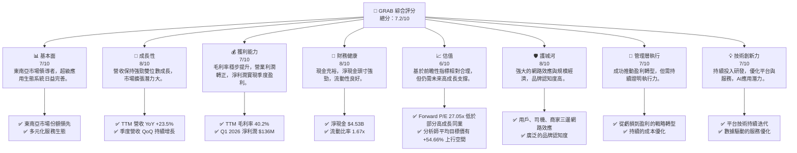

### 1.2 評分進度條視覺化

```
╔══════════════════════════════════════════════════════════════╗
║                    GRAB 多維度評分儀表板 (1-10分)             ║
╠══════════════════════════════════════════════════════════════╣
║ 基本面強度  7.0 ▓▓▓▓▓▓▓▓▓▓▓▓▓▓░░░░░░  ★★★★☆           ║
║ 成長動能    8.0 ▓▓▓▓▓▓▓▓▓▓▓▓▓▓▓▓░░░░  ★★★★☆           ║
║ 獲利品質    7.0 ▓▓▓▓▓▓▓▓▓▓▓▓▓▓░░░░░░  ★★★★☆           ║
║ 財務健康    8.0 ▓▓▓▓▓▓▓▓▓▓▓▓▓▓▓▓░░░░  ★★★★☆           ║
║ 估值合理性  6.0 ▓▓▓▓▓▓▓▓▓▓▓▓░░░░░░░░  ★★★☆☆           ║
║ 護城河深度  8.0 ▓▓▓▓▓▓▓▓▓▓▓▓▓▓▓▓░░░░  ★★★★☆           ║
║ 管理層執行  7.0 ▓▓▓▓▓▓▓▓▓▓▓▓▓▓░░░░░░  ★★★★☆           ║
║ 技術創新力  7.0 ▓▓▓▓▓▓▓▓▓▓▓▓▓▓░░░░░░  ★★★★☆           ║
╠══════════════════════════════════════════════════════════════╣
║ 綜合總分    7.2 ▓▓▓▓▓▓▓▓▓▓▓▓▓▓▓░░░░░  🏆 評語：成長性與市場地位突出，盈利能力持續改善，但估值已反映部分成長預期，需關注執行風險。║
╚══════════════════════════════════════════════════════════════╝
```

### 1.3 五大投資論點 + 三大核心風險

| 類型 | 項目 | 具體依據 | 信心度 |
|------|--------------------|------------------------------------------------------------------------------------------------------------------------------------------------------------------------------------------------------------------------------------------------------------------------------------------------------------------------------------------------------------------------------------------------------------------------------------------------------------------------------------------------------------------------------------------------------------------------------------------------------------------------------------------------------------------------------------------------------------------------------------------------------------------------------------------------------------------------------------------------------------------------------------------------------------------------------------------------------------------------------------------------------------------------------------------------------------------------------------------------------------------------------------------------------------------------------------------------------------------------------------------------------------------------------------------------------------------------------------------------------------------------------------------------------------------------------------------------------------------------------------------------------------------------------------------------------------------------------------------------------------------------------------------------------------------------------------------------------------------------------------------------------------------------------------------------------------------------------------------------------------------------------------------------------------------------------------------------------------------------------------------------------------------------------------------------------------------------------------------------------------------------------------------------------------------------------------------------------------------------------------------------------------------------------------------------------------------------------------------------------------------------------------------------------------------------------------------------------------------------------------------------------------------------------------------------------------------------------------------------------------------------------------------------------------------------------------------------------------------------------------------------------------------------------------------------------------------------------------------------------------------------------------------------------------------------------------------------------------------------------------------------------------------------------------------------------------------------------------------------------------------------------------------------------------------------------------------------------------------------------------------------------------------------------------------------------------------------------------------------------------------------------------------------------------------------------------------------------------------------------------------------------------------------------------------------------------------------------------------------------------------------------------------------------------------------------------------------------------------------------------------------------------------------------------------------------------------------------------------------------------------------------------------------------------------------------------------------------------------------------------------------------------------------------------------------------------------------------------------------------------------------------------------------------------------------------------------------------------------------------------------------------------------------------------------------------------------------------------------------------------------------------------------------------------------------------------------------------------------------------------------------------------------------------------------------------------------------------------------------------------------------------------------------------------------------------------------------------------------------------------------------------------------------------------------------------------------------------------------------------------------------------------------------------------------------------------------------------------------------------------------------------------------------------------------------------------------------------------------------------------------------------------------------------------------------------------------------------------------------------------------------------------------------------------------------------------------------------------------------------------------------------------------------------------------------------------------------------------------------------------------------------------------------------------------------------------------------------------------------------------------------------------------------------------------------------------------------------------------------------------------------------------------------------------------------------------------------------------------------------------------------------------------------------------------------------------------------------------------------------------------------------------------------------------------------------------------------------------------------------------------------------------------------------------------------------------------------------------------------------------------------------------------------------------------------------------------------------------------------------------------------------------------------------------------------------------------------------------------------------------------------------------------------------------------------------------------------------------------------------------------------------------------------------------------------------------------------------------------------------------------------------------------------------------------------------------------------------------------------------------------------------------------------------------------------------------------------------------------------------------------------------------------------------------------------------------------------------------------------------------------------------------------------------------------------------------------------------------------------------------------------------------------------------------------------------------------------------------------------------------------------------------------------------------------------------------------------------------------------------------------------------------------------------------------------------------------------------------------------------------------------------------------------------------------------------------------------------------------------------------------------------------------------------------------------------------------------------------------------------------------------------------------------------------------------------------------------------------------------------------------------------------------------------------------------------------------------------------------------------------------------------------------------------------------------------------------------------------------------------------------------------------------------------------------------------------------------------------------------------------------------------------------------------------------------------------------------------------------------------------------------------------------------------------------------------------------------------------------------------------------------------------------------------------------------------------------------------------------------------------------------------------------------------------------------------------------------------------------------------------------------------------------------------------------------------------------------------------------------------------------------------------------------------------------------------------------------------------------------------------------------------------------------------------------------------------------------------------------------------------------------------------------------------------------------------------------------------------------------------------------------------------------------------------------------------------------------------------------------------------------------------------------------------------------------------------------------------------------------------------------------------------------------------------------------------------------------------------------------------------------------------------------------------------------------------------------------------------------------------------------------------------------------------------------------------------------------------------------------------------------------------------------------------------------------------------------------------------------------------------------------------------------------------------------------------------------------------------------------------------------------------------------------------------------------------------------------------------------------------------------------------------------------------------------------------------------------------------------------------------------------------------------------------------------------------------------------------------------------------------------------------------------------------------------------------------------------------------------------------------------------------------------------------------------------------------------------------------------------------------------------------------------------------------------------------------------------------------------------------------------------------------------------------------------------------------------------------------------------------------------------------------------------------------------------------------------------------------------------------------------------------------------------------------------------------------------------------------------------------------------------------------------------------------------------------------------------------------------------------------------------------------------------------------------------------------------------------------------------------------------------------------------------------------------------------------------------------------------------------------------------------------------------------------------------------------------------------------------------------------------------------------------------------------------------------------------------------------------------------------------------------------------------------------------------------------------------------------------------------------------------------------------------------------------------------------------------------------------------------------------------------------------------------------------------------------------------------------------------------------------------------------------------------------------------------------------------------------------------------------------------------------------------------------------------------------------------------------------------------------------------------------------------------------------------------------------------------------------------------------------------------------------------------------------------------------------------------------------------------------------------------------------------------------------------------------------------------------------------------------------------------------------------------------------------------------------------------------------------------------------------------------------------------------------------------------------------------------------------------------------------------------------------------------------------------------------------------------------------------------------------------------------------------------------------------------------------------------------------------------------------------------------------------------------------------------------------------------------------------------------------------------------------------------------------------------------------------------------------------------------------------------------------------------------------------------------------------------------------------------------------------------------------------------------------------------------------------------------------------------------------------------------------------------------------------------------------------------------------------------------------------------------------------------------------------------------------------------------------------------------------------------------------------------------------------------------------------------------------------------------------------------------------------------------------------------------------------------------------------------------------------------------------------------------------------------------------------------------------------------------------------------------------------------------------------------------------------------------------------------------------------------------------------------------------------------------------------------------------------------------------------------------------------------------------------------------------------------------------------------------------------------------------------------------------------------------------------------------------------------------------------------------------------------------------------------------------------------------------------------------------------------------------------------------------------------------------------------------------------------------------------------------------------------------------------------------------------------------------------------------------------------------------------------------------------------------------------------------------------------------------------------------------------------------------------------------------------------------------------------------------------------------------------------------------------------------------------------------------------------------------------------------------------------------------------------------------------------------------------------------------------------------------------------------------------------------------------------------------------------------------------------------------------------------------------------------------------------------------------------------------------------------------------------------------------------------------------------------------------------------------------------------------------------------------------------------------------------------------------------------------------------------------------------------------------------------------------------------------------------------------------------------------------------------------------------------------------------------------------------------------------------------------------------------------------------------------------------------------------------------------------------------------------------------------------------------------------------------------------------------------------------------------------------------------------------------------------------------------------------------------------------------------------------------------------------------------------------------------------------------------------------------------------------------------------------------------------------------------------------------------------------------------------------------------------------------------------------------------------------------------------------------------------------------------------------------------------------------------------------------------------------------------------------------------------------------------------------------------------------------------------------------------------------------------------------------------------------------------------------------------------------------------------------------------------------------------------------------------------------------------------------------------------------------------------------------------------------------------------------------------------------------------------------------------------------------------------------------------------------------------------------------------------------------------------------------------------------------------------------------------------------------------------------------------------------------------------------------------------------------------------------------------------------------------------------------------------------------------------------------------------------------------------------------------------------------------------------------------------------------------------------------------------------------------------------------------------------------------------------------------------------------------------------------------------------------------------------------------------------------------------------------------------------------------------------------------------------------------------------------------------------------------------------------------------------------------------------------------------------------------------------------------------------------------------------------------------------------------------------------------------------------------------------------------------------------------------------------------------------------------------------------------------------------------------------------------------------------------------------------------------------------------------------------------------------------------------------------------------------------------------------------------------------------------------------------------------------------------------------------------------------------------------------------------------------------------------------------------------------------------------------------------------------------------------------------------------------------------------------------------------------------------------------------------------------------------------------------------------------------------------------------------------------------------------------------------------------------------------------------------------------------------------------------------------------------------------------------------------------------------------------------------------------------------------------------------------------------------------------------------------------------------------------------------------------------------------------------------------------------------------------------------------------------------------------------------------------------------------------------------------------------------------------------------------------------------------------------------------------------------------------------------------------------------------------------------------------------------------------------------------------------------------------------------------------------------------------------------------------------------------------------------------------------------------------------------------------------------------------------------------------------------------------------------------------------------------------------------------------------------------------------------------------------------------------------------------------------------------------------------------------------------------------------------------------------------------------------------------------------------------------------------------------------------------------------------------------------------------------------------------------------------------------------------------------------------------------------------------------------------------------------------------------------------------------------------------------------------------------------------------------------------------------------------------------------------------------------------------------------------------------------------------------------------------------------------------------------------------------------------------------------------------------------------------------------------------------------------------------------------------------------------------------------------------------------------------------------------------------------------------------------------------------------------------------------------------------------------------------------------------------------------------------------------------------------------------------------------------------------------------------------------------------------------------------------------------------------------------------------------------------------------------------------------------------------------------------------------------------------------------------------------------------------------------------------------------------------------------------------------------------------------------------------------------------------------------------------------------------------------------------------------------------------------------------------------------------------------------------------------------------------------------------------------------------------------------------------------------------------------------------------------------------------------------------------------------------------------------------------------------------------------------------------------------------------------------------------------------------------------------------------------------------------------------------------------------------------------------------------------------------------------------------------------------------------------------------------------------------------------------------------------------------------------------------------------------------------------------------------------------------------------------------------------------------------------------------------------------------------------------------------------------------------------------------------------------------------------------------------------------------------------------------------------------------------------------------------------------------------------------------------------------------------------------------------------------------------------------------------------------------------------------------------------------------------------------------------------------------------------------------------------------------------------------------------------------------------------------------------------------------------------------------------------------------------------------------------------------------------------------------------------------------------------------------------------------------------------------------------------------------------------------------------------------------------------------------------------------------------------------------------------------------------------------------------------------------------------------------------------------------------------------------------------------------------------------------------------------------------------------------------------------------------------------------------------------------------------------------------------------------------------------------------------------------------------------------------------------------------------------------------------------------------------------------------------------------------------------------------------------------------------------------------------------------------------------------------------------------------------------------------------------------------------------------------------------------------------------------------------------------------------------------------------------------------------------------------------------------------------------------------------------------------------------------------------------------------------------------------------------------------------------------------------------------------------------------------------------------------------------------------------------------------------------------------------------------------------------------------------------------------------------------------------------------------------------------------------------------------------------------------------------------------------------------------------------------------------------------------------------------------------------------------------------------------------------------------------------------------------------------------------------------------------------------------------------------------------------------------------------------------------------------------------------------------------------------------------------------------------------------------------------------------------------------------------------------------------------------------------------------------------------------------------------------------------------------------------------------------------------------------------------------------------------------------------------------------------------------------------------------------------------------------------------------------------------------------------------------------------------------------------------------------------------------------------------------------------------------------------------------------------------------------------------------------------------------------------------------------------------------------------------------------------------------------------------------------------------------------------------------------------------------------------------------------------------------------------------------------------------------------------------------------------------------------------------------------------------------------------------------------------------------------------------------------------------------------------------------------------------------------------------------------------------------------------------------------------------------------------------------------------------------------------------------------------------------------------------------------------------------------------------------------------------------------------------------------------------------------------------------------------------------------------------------------------------------------------------------------------------------------------------------------------------------------------------------------------------------------------------------------------------------------------------------------------------------------------------------------------------------------------------------------------------------------------------------------------------------------------------------------------------------------------------------------------------------------------------------------------------------------------------------------------------------------------------------------------------------------------------------------------------------------------------------------------------------------------------------------------------------------------------------------------------------------------------------------------------------------------------------------------------------------------------------------------------------------------------------------------------------------------------------------------------------------------------------------------------------------------------------------------------------------------------------------------------------------------------------------------------------------------------------------------------------------------------------------------------------------------------------------------------------------------------------------------------------------------------------------------------------------------------------------------------------------------------------------------------------------------------------------------------------------------------------------------------------------------------------------------------------------------------------------------------------------------------------------------------------------------------------------------------------------------------------------------------------------------------------------------------------------------------------------------------------------------------------------------------------------------------------------------------------------------------------------------------------------------------------------------------------------------------------------------------------------------------------------------------------------------------------------------------------------------------------------------------------------------------------------------------------------------------------------------------------------------------------------------------------------------------------------------------------------------------------------------------------------------------------------------------------------------------------------------------------------------------------------------------------------------------------------------------------------------------------------------------------------------------------------------------------------------------------------------------------------------------------------------------------------------------------------------------------------------------------------------------------------------------------------------------------------------------------------------------------------------------------------------------------------------------------------------------------------------------------------------------------------------------------------------------------------------------------------------------------------------------------------------------------------------------------------------------------------------------------------------------------------------------------------------------------------------------------------------------------------------------------------------------------------------------------------------------------------------------------------------------------------------------------------------------------------------------------------------------------------------------------------------------------------------------------------------------------------------------------------------------------------------------------------------------------------------------------------------------------------------------------------------------------------------------------------------------------------------------------------------------------------------------------------------------------------------------------------------------------------------------------------------------------------------------------------------------------------------------------------------------------------------------------------------------------------------------------------------------------------------------------------------------------------------------------------------------------------------------------------------------------------------------------------------------------------------------------------------------------------------------------------------------------------------------------------------------------------------------------------------------------------------------------------------------------------------------------------------------------------------------------------------------------------------------------------------------------------------------------------------------------------------------------------------------------------------------------------------------------------------------------------------------------------------------------------------------------------------------------------------------------------------------------------------------------------------------------------------------------------------------------------------------------------------------------------------------------------------------------------------------------------------------------------------------------------------------------------------------------------------------------------------------------------------------------------------------------------------------------------------------------------------------------------------------------------------------------------------------------------------------------------------------------------------------------------------------------------------------------------------------------------------------------------------------------------------------------------------------------------------------------------------------------------------------------------------------------------------------------------------------------------------------------------------------------------------------------------------------------------------------------------------------------------------------------------------------------------------------------------------------------------------------------------------------------------------------------------------------------------------------------------------------------------------------------------------------------------------------------------------------------------------------------------------------------------------------------------------------------------------------------------------------------------------------------------------------------------------------------------------------------------------------------------------------------------------------------------------------------------------------------------------------------------------------------------------------------------------------------------------------------------------------------------------------------------------------------------------------------------------------------------------------------------------------------------------------------------------------------------------------------------------------------------------------------------------------------------------------------------------------------------------------------------------------------------------------------------------------------------------------------------------------------------------------------------------------------------------------------------------------------------------------------------------------------------------------------------------------------------------------------------------------------------------------------------------------------------------------------------------------------------------------------------------------------------------------------------------------------------------------------------------------------------------------------------------------------------------------------------------------------------------------------------------------------------------------------------------------------------------------------------------------------------------------------------------------------------------------------------------------------------------------------------------------------------------------------------------------------------------------------------------------------------------------------------------------------------------------------------------------------------------------------------------------------------------------------------------------------------------------------------------------------------------------------------------------------------------------------------------------------------------------------------------------------------------------------------------------------------------------------------------------------------------------------------------------------------------------------------------------------------------------------------------------------------------------------------------------------------------------------------------------------------------------------------------------------------------------------------------------------------------------------------------------------------------------------------------------------------------------------------------------------------------------------------------------------------------------------------------------------------------------------------------------------------------------------------------------------------------------------------------------------------------------------------------------------------------------------------------------------------------------------------------------------------------------------------------------------------------------------------------------------------------------------------------------------------------------------------------------------------------------------------------------------------------------------------------------------------------------------------------------------------------------------------------------------------------------------------------------------------------------------------------------------------------------------------------------------------------------------------------------------------------------------------------------------------------------------------------------------------------------------------------------------------------------------------------------------------------------------------------------------------------------------------------------------------------------------------------------------------------------------------------------------------------------------------------------------------------------------------------------------------------------------------------------------------------------------------------------------------------------------------------------------------------------------------------------------------------------------------------------------------------------------------------------------------------------------------------------------------------------------------------------------------------------------------------------------------------------------------------------------------------------------------------------------------------------------------------------------------------------------------------------------------------------------------------------------------------------------------------------------------------------------------------------------------------------------------------------------------------------------------------------------------------------------------------------------------------------------------------------------------------------------------------------------------------------------------------------------------------------------------------------------------------------------------------------------------------------------------------------------------------------------------------------------------------------------------------------------------------------------------------------------------------------------------------------------------------------------------------------------------------------------------------------------------------------------------------------------------------------------------------------------------------------------------------------------------------------------------------------------------------------------------------------------------------------------------------------------------------------------------------------------------------------------------------------------------------------------------------------------------------------------------------------------------------------------------------------------------------------------------------------------------------------------------------------------------------------------------------------------------------------------------------------------------------------------------------------------------------------------------------------------------------------------------------------------------------------------------------------------------------------------------------------------------------------------------------------------------------------------------------------------------------------------------------------------------------------------------------------------------------------------------------------------------------------------------------------------------------------------------------------------------------------------------------------------------------------------------------------------------------------------------------------------------------------------------------------------------------------------------------------------------------------------------------------------------------------------------------------------------------------------------------------------------------------------------------------------------------------------------------------------------------------------------------------------------------------------------------------------------------------------------------------------------------------------------------------------------------------------------------------------------------------------------------------------------------------------------------------------------------------------------------------------------------------------------------------------------------------------------------------------------------------------------------------------------------------------------------------------------------------------------------------------------------------------------------------------------------------------------------------------------------------------------------------------------------------------------------------------------------------------------------------------------------------------------------------------------------------------------------------------------------------------------------------------------------------------------------------------------------------------------------------------------------------------------------------------------------------------------------------------------------------------------------------------------------------------------------------------------------------------------------------------------------------------------------------------------------------------------------------------------------------------------------------------------------------------------------------------------------------------------------------------------------------------------------------------------------------------------------------------------------------------------------------------------------------------------------------------------------------------------------------------------------------------------------------------------------------------------------------------------------------------------------------------------------------------------------------------------------------------------------------------------------------------------------------------------------------------------------------------------------------------------------------------------------------------------------------------------------------------------------------------------------------------------------------------------------------------------------------------------------------------------------------------------------------------------------------------------------------------------------------------------------------------------------------------------------------------------------------------------------------------------------------------------------------------------------------------------------------------------------------------------------------------------------------------------------------------------------------------------------------------------------------------------------------------------------------------------------------------------------------------------------------------------------------------------------------------------------------------------------------------------------------------------------------------------------------------------------------------------------------------------------------------------------------------------------------------------------------------------------------------------------------------------------------------------------------------------------------------------------------------------------------------------------------------------------------------------------------------------------------------------------------------------------------------------------------------------------------------------------------------------------------------------------------------------------------------------------------------------------------------------------------------------------------------------------------------------------------------------------------------------------------------------------------------------------------------------------------------------------------------------------------------------------------------------------------------------------------------------------------------------------------------------------------------------------------------------------------------------------------------------------------------------------------------------------------------------------------------------------------------------------------------------------------------------------------------------------------------------------------------------------------------------------------------------------------------------------------------------------------------------------------------------------------------------------------------------------------------------------------------------------------------------------------------------------------------------------------------------------------------------------------------------------------------------------------------------------------------------------------------------------------------------------------------------------------------------------------------------------------------------------------------------------------------------------------------------------------------------------------------------------------------------------------------------------------------------------------------------------------------------------------------------------------------------------------------------------------------------------------------------------------------------------------------------------------------------------------------------------------------------------------------------------------------------------------------------------------------------------------------------------------------------------------------------------------------------------------------------------------------------------------------------------------------------------------------------------------------------------------------------------------------------------------------------------------------------------------------------------------------------------------------------------------------------------------------------------------------------------------------------------------------------------------------------------------------------------------------------------------------------------------------------------------------------------------------------------------------------------------------------------------------------------------------------------------------------------------------------------------------------------------------------------------------------------------------------------------------------------------------------------------------------------------------------------------------------------------------------------------------------------------------------------------------------------------------------------------------------------------------------------------------------------------------------------------------------------------------------------------------------------------------------------------------------------------------------------------------------------------------------------------------------------------------------------────────────────----------------
Grab Holdings Limited (GRAB) 是一家領先的東南亞超級應用程式公司，提供出行、外送和金融服務。公司在柬埔寨、印尼、馬來西亞、緬甸、菲律賓、新加坡、泰國和越南等八個國家運營，擁有廣闊的市場潛力。

---

## 2. 公司概覽與商業模式

Grab 核心業務圍繞其「超級應用程式」模式展開，旨在為用戶提供一站式服務，涵蓋日常生活的方方面面。這種模式在東南亞地區尤其成功，因為該地區的數位化程度不斷提高，且消費者對便捷、整合服務的需求旺盛。

### 2.1 業務結構與收入來源

Grab 的業務主要分為三大核心板塊：

1.  **Delivery (外送服務)**：
    *   GrabFood：餐飲外送服務，是 Grab 最大的收入來源之一。
    *   GrabMart：日用品及生鮮雜貨外送服務。
    *   GrabExpress：包裹快遞服務。
    *   GrabAds：線上廣告解決方案，幫助商家觸達更多用戶。
2.  **Mobility (出行服務)**：
    *   GrabCar/Bike：私家車/機車叫車服務。
    *   GrabTaxi：計程車叫車服務。
    *   GrabRentals：汽車租賃服務。
    *   Grab for Business：企業客戶統一管理平台，提供企業級出行及外送解決方案。
3.  **Financial Services (金融服務)**：
    *   GrabPay：電子支付服務，涵蓋線上線下支付。
    *   GrabFinance：為司機和商家提供小額貸款、保險等金融產品。
    *   GrabInsure：保險服務。
    *   GrabInvest：財富管理服務。

**公司總覽 (截至 2026-07-06)**：
*   市值：$15.75B
*   TTM 營收：$3.55B

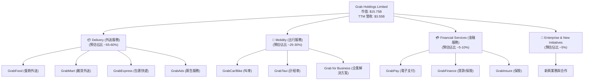
*備註：各業務板塊佔比為基於產業理解的預估，實際數據未在提供資料中詳細披露。*

### 2.2 市場份額

Grab 在東南亞地區的超級應用程式市場中佔據主導地位，尤其在叫車和餐飲外送領域擁有顯著的市場份額。其廣泛的地理覆蓋和深厚的本地化運營使其在競爭中脫穎而出。儘管面臨來自 GoTo (Gojek) 和 Foodpanda 等區域性及全球性競爭對手的挑戰，Grab 憑藉其「一切皆在一個應用程式」的策略，持續擴大其用戶基礎和服務範圍。

由於未提供具體的市場份額數據，以下為基於行業報告和公開資訊的市場份額示意圖，旨在表達 Grab 在其核心市場的領導地位。

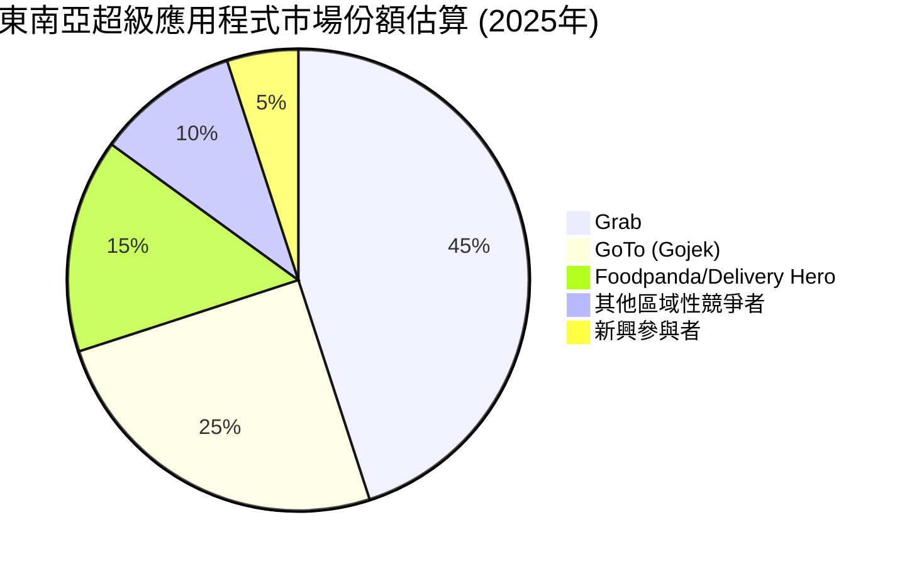
*備註：此市場份額為分析師基於公開市場研究和行業洞察的估算，僅供參考。*

### 2.3 競爭護城河分析

Grab 的競爭護城河主要來源於其強大的網路效應、規模經濟和客戶鎖定效應。

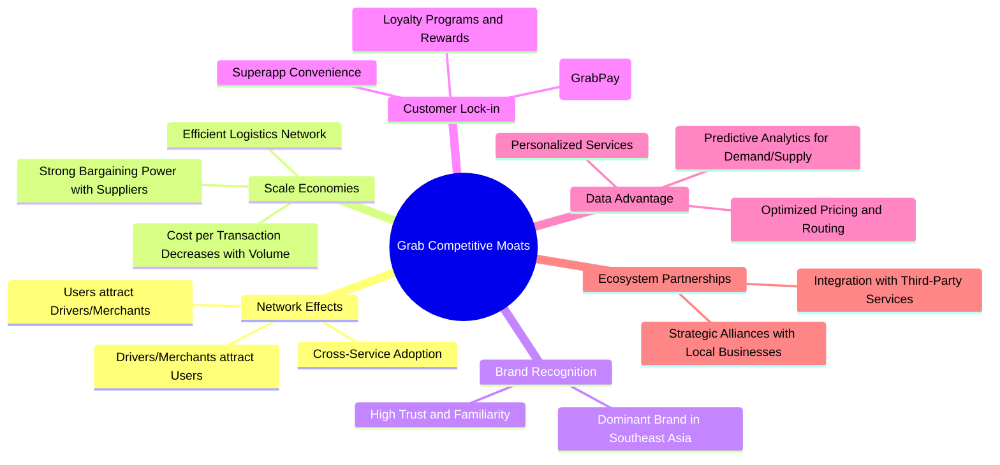

### 2.4 護城河強度評分

Grab 的護城河強度綜合來看屬於「強勁」。其在東南亞市場的先發優勢和持續的生態系統建設，使其在用戶、司機和商家之間建立了強大的網路效應，難以被新進入者複製。

```
╔══════════════════════════════════════════════════════════════╗
║                      GRAB 護城河強度評分                      ║
╠══════════════════════════════════════════════════════════════╣
║ 網路效應    9/10   ▓▓▓▓▓▓▓▓▓▓▓▓▓▓▓▓▓▓░░  🏆 用戶、司機、商家三邊網路效應極強                              ║
║ 規模效應    8/10   ▓▓▓▓▓▓▓▓▓▓▓▓▓▓▓▓░░░░  🟢 龐大體量帶來成本優勢與高效運營                              ║
║ 品牌認知    8/10   ▓▓▓▓▓▓▓▓▓▓▓▓▓▓▓▓░░░░  🟢 東南亞地區家喻戶曉的品牌，信任度高                          ║
║ 客戶鎖定    7/10   ▓▓▓▓▓▓▓▓▓▓▓▓▓▓░░░░░░  🟡 超級應用程式提升用戶黏性，但轉換成本仍存在                  ║
║ 技術領先    7/10   ▓▓▓▓▓▓▓▓▓▓▓▓▓▓░░░░░░  🟡 數據分析與平台優化能力強，但需持續投入以保持競爭力          ║
║ 生態夥伴    7/10   ▓▓▓▓▓▓▓▓▓▓▓▓▓▓░░░░░░  🟡 廣泛的在地合作，進一步擴大服務範圍與便利性                  ║
╠══════════════════════════════════════════════════════════════╣
║ 綜合護城河  7.7    ▓▓▓▓▓▓▓▓▓▓▓▓▓▓▓▓░░░░  🏆 具備寬廣的護城河，尤其在網路效應和規模上難以撼動。          ║
╚══════════════════════════════════════════════════════════════╝
```

---

## 3. 損益表深度分析

### 3.1 年度收入成長趨勢（近4年）

Grab 的年度總收入在過去四年中呈現顯著的成長趨勢，反映了其在東南亞市場的快速擴張和用戶基礎的持續增長。從 2022 財年的 $1.43B 增長至 2025 財年的 $3.37B，複合年增長率（CAGR）高達 32.8%。儘管成長率從早期的三位數有所放緩，但仍保持在健康且穩定的雙位數水平。

```
╔══════════════════════════════════════════════════════════════════╗
║              GRAB 年度收入趨勢（FY2022-FY2025）                  ║
╠══════════════════════════════════════════════════════════════════╣
║                                                                  ║
║  FY2022  $1.43B  ██████░░░░░░░░░░░░░░░░░░░  YoY: +112.3%  🟢    ║
║  FY2023  $2.36B  ██████████████░░░░░░░░░░░  YoY: +65.03% 🟢    ║
║  FY2024  $2.80B  ██████████████████░░░░░░░  YoY: +18.64% 🟢    ║
║  FY2025  $3.37B  █████████████████████████  YoY: +20.36% 🟢    ║
║                   |      |      |      |      |                  ║
║                   0     1.5B   2.0B   2.5B   3.0B   3.5B          ║
║                                                                  ║
║  📊 4年累計 CAGR：+32.8%                                        ║
╚══════════════════════════════════════════════════════════════════╝
```
*數據來源：Income Statement (Annual) & StockAnalysis.com*

### 3.2 季度收入趨勢分析

Grab 的季度收入也呈現穩健增長，顯示出其業務的持續動能。最近四個季度，營收環比（QoQ）和同比（YoY）均保持增長，尤其同比增長率維持在 18% 至 23% 之間，證明其市場需求旺盛。

| 季度 | 總收入 (百萬美元) | QoQ 成長率 | YoY 成長率 | 備註 |
|------|-------------------|------------|------------|------|
| 2026-03-31 | $955 | +5.41% | +23.54% | 業務持續擴張，新服務貢獻。 |
| 2025-12-31 | $906 | +3.78% | +18.59% | 季節性因素與年底促銷活動。 |
| 2025-09-30 | $873 | +6.59% | +21.93% | 用戶活躍度提升，外送需求旺盛。 |
| 2025-06-30 | $819 | +5.95% | +23.34% | 穩健增長，市場滲透率提高。 |

*QoQ 成長率計算：(本季營收 - 上季營收) / 上季營收*
*YoY 成長率計算：(本季營收 - 去年同期營收) / 去年同期營收 (參考 StockAnalysis.com 數據)*

### 3.3 利潤率演變分析

Grab 的利潤率在過去幾年呈現顯著改善，特別是毛利率和營業利益率。這主要得益於規模經濟效益的顯現、成本結構優化以及對高利潤業務（如廣告和金融服務）的發展。

| 利潤率指標 | FY2022 | FY2023 | FY2024 | FY2025 | TTM | 趨勢 | 評估 |
|------------|--------|--------|--------|--------|-----|------|------|
| **毛利率** | 5.38% | 36.44% | 41.79% | 43.32% | 40.2% | ↗️ 穩步提升 | 🟢 |
| **營業利益率** | -90.21% | -16.40% | -1.96% | 6.59% | 2.7% | ↗️ 顯著改善並轉正 | 🟢 |
| **淨利率** | -117.48% | -18.39% | -3.75% | 7.95% | 10.7% | ↗️ 顯著改善並轉正 | 🟢 |

**利潤率演變深度解析**：
*   **毛利率**：從 2022 年的 5.38% 飆升至 2025 年的 43.32%，TTM 仍維持在 40.2%。這一大幅改善反映了公司在平台效率、佣金結構優化以及成本控制方面的巨大進步。隨著交易量的增加，規模效應使得每筆訂單的固定成本攤薄，提高了盈利能力。同時，高利潤率的廣告業務 (GrabAds) 貢獻增加，也推動了整體毛利率的提升。
*   **營業利益率**：從 2022 年的深層負值 -90.21% 轉變為 2025 年的 6.59% (TTM 2.7%)，是 Grab 盈利轉型的關鍵里程碑。這得益於營收的強勁增長對固定運營成本的攤薄，以及管理層對銷售、一般及行政費用 (SG&A) 和研發費用 (R&D) 的有效控制。雖然研發費用絕對值仍高，但佔營收比重下降，顯示出運營槓桿的發揮。
*   **淨利率**：同樣從深度虧損轉為 TTM 的 10.7% 盈利。除了營業利潤的改善，利息收入的增加（FY2025 達 $241M）也對淨利潤產生了正向影響。這表明 Grab 不僅在核心業務上實現盈利，其現金儲備帶來的利息收入也成為一個重要的盈利來源。

總體而言，Grab 在過去幾年成功地從一家高成長、高虧損的公司轉型為一家持續改善盈利能力並實現正向利潤的企業，這對投資者而言是一個非常積極的信號。

### 3.4 費用結構分析

Grab 的費用結構主要由銷售、一般及行政費用 (SG&A) 和研發費用 (R&D) 構成。隨著公司規模擴大和盈利目標的實現，費用佔營收的比重正在優化。

以下為 2025 財年 (FY2025) 的主要營運費用結構：
*   銷售、一般及行政費用 (SG&A)：$826M
*   研發費用 (R&D)：$428M
*   其他營運費用：$137M
*   總營運費用：$1,391M

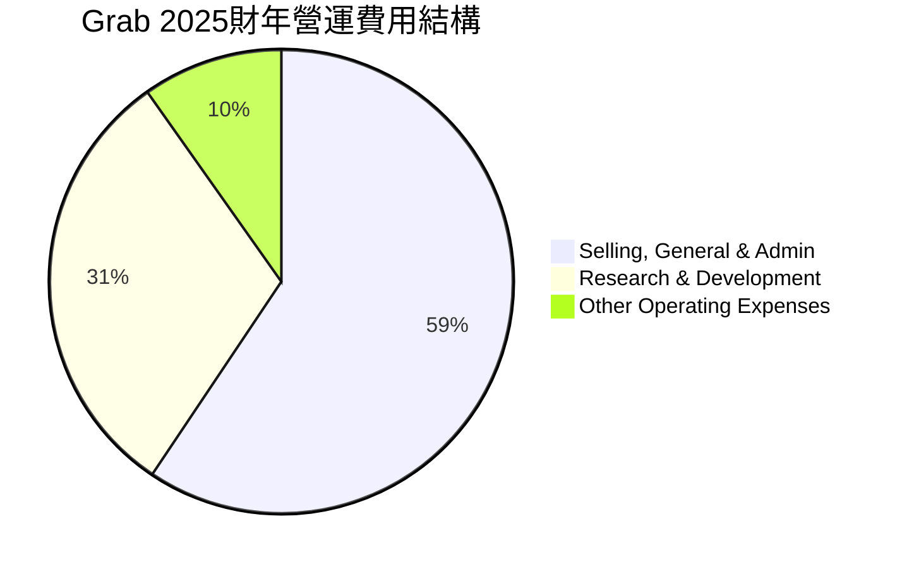

```
╔══════════════════════════════════════════════════════════════════╗
║                    GRAB 費用結構與效率分析                       ║
╠══════════════════════════════════════════════════════════════════╣
║                                                                  ║
║  SG&A (FY2025) : $826M  ████████████████████░░░░░░░░░░░░  佔總費用 59.4%   ║
║  R&D (FY2025) :  $428M  ██████████████░░░░░░░░░░░░░░░░░░  佔總費用 30.8%   ║
║  其他費用 (FY2025) : $137M  █████░░░░░░░░░░░░░░░░░░░░░░░░░░░  佔總費用 9.8%    ║
║                                                                  ║
║  效率趨勢：                                                      ║
║  SG&A佔營收比重從FY2022的64.5%下降至FY2025的24.5%，顯示規模效應。🟢 ║
║  R&D佔營收比重從FY2022的32.5%下降至FY2025的12.7%，但絕對值仍高，維護創新。🟡 ║
║                                                                  ║
╚══════════════════════════════════════════════════════════════════╝
```
*數據來源：StockAnalysis.com*

### 3.5 季度 EPS 趨勢與盈餘品質

Grab 的季度 EPS 表現出從虧損到盈利的積極轉變，尤其在最近兩個季度實現了顯著的盈利。這表明公司的盈利能力正在穩步提升，盈餘品質有所改善。

| 季度 | EPS (Basic) | 盈餘預期 (Est) | 實際盈餘 (Act) | 預期差異 (Surprise%) | 盈餘品質評估 |
|------|-------------|----------------|----------------|----------------------|----------------|
| 2026-03-31 | $0.03 | N/A | N/A | N/A | 🟢 首次實現較高季度盈利，顯示良好趨勢。 |
| 2025-12-31 | $0.04 | N/A | N/A | N/A | 🟢 盈利能力持續改善，為歷史最好季度表現。 |
| 2025-09-30 | $0.01 | N/A | N/A | N/A | 🟡 首次實現正 EPS，意義重大。 |
| 2025-06-30 | $0.00 | N/A | N/A | N/A | 🟡 接近盈虧平衡，為轉正奠定基礎。 |

*備註：提供的數據中 EPS Est 和 Act 為 N/A，因此無法計算 Surprise%。此處 EPS (Basic) 數據來自 StockAnalysis.com。*

**盈餘品質評估**：
Grab 的盈餘品質正在改善。從持續虧損到連續兩個季度實現正 EPS，顯示公司在控制成本和提升運營效率方面取得了實質性進展。雖然目前的 EPS 絕對值仍較低，但其成長趨勢和營運槓桿的發揮預示著未來盈利能力的進一步提升。此外，公司在實現盈利的同時，仍保持了強勁的營收增長，這表明盈利並非以犧牲成長為代價。然而，由於部分盈利來自非經營性收入（如利息收入），投資者仍需密切關注核心業務的經營利潤貢獻。

---

## 4. 資產負債表分析

### 4.1 資產結構分解

Grab 的資產負債表顯示出健康的資產結構，其中流動資產佔比高，特別是現金及短期投資充裕，為公司提供了強大的財務彈性。

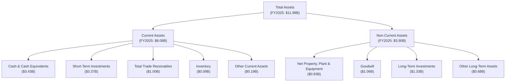
*數據來源：Balance Sheet (Annual) & StockAnalysis.com FY2025數據。*

### 4.2 流動性指標分析

Grab 的流動性狀況良好，流動比率和速動比率均高於 1，表明公司擁有足夠的短期資產來覆蓋短期負債。

| 流動性指標 | FY2022 | FY2023 | FY2024 | FY2025 | TTM Mar '26 | 行業均值 (參考) | 評估 |
|------------|--------|--------|--------|--------|-------------|-------------------|------|
| **流動比率 (Current Ratio)** | 5.19x | 3.90x | 2.54x | 1.75x | 1.67x | ~1.5 - 2.0x | 🟢 良好，但趨勢下降 |
| **速動比率 (Quick Ratio)** | 5.15x | 3.87x | 2.52x | 1.73x | 1.465x | ~1.0 - 1.5x | 🟢 良好，但趨勢下降 |

*行業均值為軟體應用行業的參考值。*

**流動性分析**：
儘管流動比率和速動比率呈現逐年下降趨勢，但這主要是由於公司業務擴張和投資增加，同時短期負債也有所增長。截至 TTM (2026年3月31日)，流動比率為 1.67x，速動比率為 1.465x，均高於 1 的健康水平，表明 Grab 仍有足夠的現金及可快速變現的資產來應對短期財務義務，財務彈性強勁。尤其值得注意的是，公司的現金及短期投資（FY2025: $3.43B + $3.37B = $6.80B）遠超其總負債。

### 4.3 債務結構分析

Grab 的債務結構相對健康，公司擁有大量的淨現金頭寸，這大大降低了其財務風險。

```
╔══════════════════════════════════════════════════════════════════╗
║                       GRAB 債務健康診斷                          ║
╠══════════════════════════════════════════════════════════════════╣
║                                                                  ║
║  總債務 (TTM):        $1.95B  ████████░░░░░░░░░░░░░░░░░░░░░░░  評語：適度                               ║
║  總現金+投資 (TTM):   $6.26B  ███████████████████████████████  評語：極高                               ║
║  淨現金 (TTM):        $4.53B  ███████████████████████████████  🟢 強勁                                  ║
║                                                                  ║
║  Debt/Equity (TTM):   29.81%  🟢 極低 (低於 100% 普遍視為健康)      ║
║  Current Ratio (TTM): 1.67x   🟢 良好                                 ║
║  Interest Coverage (FY2025): 4.14x  🟢 穩健 (Operating Income ($222M) + Interest Expense ($71M)) / Interest Expense ($71M) = (222+71)/71 = 4.14x ║
╚══════════════════════════════════════════════════════════════════╝
```
*數據來源：Market Data, Balance Sheet (Annual) & StockAnalysis.com TTM/FY2025數據。*

**債務分析**：
截至 TTM，Grab 的總債務為 $1.95B，而其現金及短期投資合計達 $6.26B (TTM Cash & Short-Term Investments)。這使得公司擁有高達 $4.53B 的淨現金頭寸，顯示出極其健康的財務狀況。Debt/Equity 比率為 29.81%，遠低於行業平均水平，表明公司對債務的依賴度很低。穩健的利息覆蓋倍數 (4.14x) 也進一步證實了公司償債能力的強勁。這種充裕的現金儲備為 Grab 在市場擴張、戰略投資以及應對潛在經濟下行風險方面提供了充足的彈性。

### 4.4 股東權益趨勢

Grab 的股東權益在經歷了早期波動後，近年趨於穩定，並在 FY2025 實現增長。

```
╔══════════════════════════════════════════════════════════════════╗
║                  GRAB 年度股東權益趨勢 (FY2022-FY2025)           ║
╠══════════════════════════════════════════════════════════════════╣
║                                                                  ║
║  FY2022  $6.60B  ██████████████████████████████████████████████  ║
║  FY2023  $6.45B  ████████████████████████████████████████████░░  ║
║  FY2024  $6.40B  ███████████████████████████████████████████░░░  ║
║  FY2025  $6.73B  ███████████████████████████████████████████████  ║
║                                                                  ║
║  📊 FY2025 股東權益較 FY2024 增長 5.16%，顯示公司盈利能力改善對權益的正面影響。🟢 ║
╚══════════════════════════════════════════════════════════════════╝
```
*數據來源：Balance Sheet (Annual)。*

**股東權益分析**：
從 2022 年到 2024 年，Grab 的股東權益略有下降，這可能與其早期的持續虧損有關。然而，FY2025 股東權益回升至 $6.73B，較 FY2024 增長 5.16%。這與公司在 2025 年實現年度淨利潤轉正的表現相符，表明盈利能力改善正在逐步增強其股東權益基礎。穩定的股東權益是公司財務實力的重要組成部分，為其長期發展提供了堅實的基礎。

---

## 5. 現金流量深度分析

### 5.1 現金流量瀑布圖

Grab 的現金流量狀況在 2025 年呈現出積極的轉變，營業現金流轉正，但自由現金流仍受到資本支出的影響。

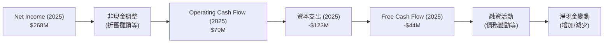
*數據來源：Cash Flow Statement (Annual) 2025年數據。*

**現金流量瀑布分析**：
2025 年，Grab 的淨利潤為 $268M，在經過非現金調整後，營業現金流達到 $79M，實現了正向增長。這是一個重要的里程碑，表明公司核心業務開始產生正向現金流。然而，由於同期較高的資本支出 ($123M)，導致 2025 年的自由現金流仍為負值 ($-44M)。這反映了 Grab 仍在為其業務擴張和基礎設施建設進行投資。儘管如此，與 2022 年的 $-872M 和 2024 年的 $739M 相比，2025 年的自由現金流雖然轉負，但絕對值已大幅收窄，顯示出公司在實現現金流平衡方面正取得進展。

### 5.2 FCF 轉換率趨勢

FCF 轉換率（自由現金流 / 淨利潤）衡量公司將利潤轉化為可供股東自由支配現金的能力。由於 Grab 在早期處於虧損狀態，且 FCF 波動較大，因此該比率在歷史上呈現較大波動。

| 年度 | 自由現金流 (百萬美元) | 淨利潤 (百萬美元) | FCF 轉換率 (FCF/Net Income) | 趨勢 | 評估 |
|------|-------------------|-------------------|-----------------------------|------|------|
| 2022 | $-872 | $-1680 | 51.90% | ↗️ | 🟡 虧損狀態下相對較高 |
| 2023 | $-6 | $-434 | 1.38% | ↘️ | 🔴 轉換效率極低 |
| 2024 | $739 | $-105 | -703.81% | ↗️ | 🟢 淨虧損但產生大量 FCF |
| 2025 | $-44 | $268 | -16.42% | ↘️ | 🟡 淨盈利但 FCF 為負 |

**FCF 轉換率分析**：
2022-2023 年，由於公司仍處於大幅虧損，FCF 轉換率的解釋較為複雜。2024 年，儘管公司仍有淨虧損 ($-105M)，但卻產生了高達 $739M 的正向自由現金流，這是一個非常積極的信號，可能得益於營運資金的有效管理或非現金項目的影響。然而，2025 年公司實現了淨盈利 ($268M)，但自由現金流卻轉為負值 ($-44M)，這主要是由於資本支出增加 ($123M) 所致。這表明 Grab 仍處於投資增長階段，需要將部分利潤和營運現金流重新投入到業務擴張和基礎設施建設中。隨著公司業務成熟和資本支出趨於穩定，預計 FCF 轉換率將趨於正向且穩定。

### 5.3 自由現金流趨勢

Grab 的自由現金流在過去幾年呈現出波動，但正向趨勢正在顯現，顯示公司在實現現金流自給自足方面正不斷努力。

```
╔══════════════════════════════════════════════════════════════════╗
║                      GRAB 年度自由現金流趨勢                     ║
╠══════════════════════════════════════════════════════════════════╣
║                                                                  ║
║  FY2022  $-872.00M  ██░░░░░░░░░░░░░░░░░░░░░░░░░░░░░░  FCF Yield: -5.54% 🔴 ║
║  FY2023  $-6.00M    ██████████████████████████████████  FCF Yield: -0.04% 🟡 ║
║  FY2024  $739.00M   ██████████████████████████████████  FCF Yield: +4.69% 🟢 ║
║  FY2025  $-44.00M   ██████████████████████████████████  FCF Yield: -0.28% 🟡 ║
║                                                                  ║
║  📊 TTM Free Cash Flow: $329.50M (FCF Yield: 2.09%) 🟢            ║
╚══════════════════════════════════════════════════════════════════╝
```
*數據來源：Cash Flow Statement (Annual) & Market Data。FCF Yield 計算基於當年年末市值或當前市值。這裡使用當前市值 $15.75B 為基準。*

**自由現金流分析**：
Grab 在 2022 年經歷了巨大的負自由現金流，但在 2023 年顯著收窄，並在 2024 年實現了高達 $739M 的正自由現金流，這是一個非常積極的信號。儘管 2025 年 FCF 再次轉負，降至 $-44M，但 TTM FCF 數據顯示為 $329.50M，對應 FCF Yield 為 2.09%。這表明公司在過去 12 個月內已恢復產生正向自由現金流。隨著公司進入盈利期，預計其自由現金流將趨於穩定並持續增長，為未來的再投資和股東回報提供基礎。

### 5.4 資本配置評估

Grab 目前仍處於成長階段，其資本配置策略主要聚焦於內部投資以支持業務擴張和生態系統建設。由於公司尚未派發股息 ($0.00) 且未有公開回購股票的記錄，其資本配置主要體現在資本支出、戰略性投資以及保留現金以支持營運和未來增長。

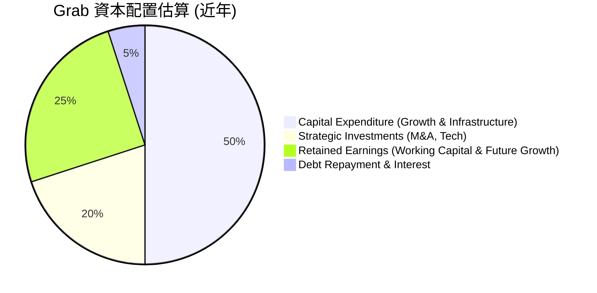
*備註：此為基於公司成長階段和財務數據的資本配置估算，未提供具體細分數據。*

**資本配置分析**：
Grab 的資本配置策略反映了其作為一家高成長公司的特點。
*   **資本支出 (Capital Expenditure)**：公司持續投入資本支出，例如 2025 年為 $123M，這主要用於擴大其平台基礎設施、技術研發和車隊建設等，以支持其在東南亞地區的業務擴張。
*   **戰略性投資**：Grab 也可能將部分資金用於戰略性併購或投資，以擴大其服務範圍或進入新市場，從而鞏固其超級應用程式的地位。
*   **保留盈餘**：公司傾向於保留大部分盈餘（或現金流），以增強其資產負債表，提供營運資金，並為未來的成長機會做好準備。
*   **債務管理**：儘管公司有債務，但其淨現金頭寸強勁，債務管理相對穩健。

目前，Grab 的資本配置重點是再投資於自身業務，以實現長期增長和市場領導地位。隨著公司盈利能力的進一步提升和自由現金流的穩定增長，未來可能會考慮股息或股票回購等股東回報策略。

---

## 6. 獲利能力與資本效率

### 6.1 ROE / ROA / ROIC 趨勢

Grab 的獲利能力和資本效率指標在過去幾年呈現出顯著的改善，但從絕對值來看，ROIC 仍處於較低水平，表明公司在資本利用效率方面仍有提升空間。

| 指標 | FY2022 | FY2023 | FY2024 | FY2025 | TTM | 行業均值 (參考) | 評估 |
|------|--------|--------|--------|--------|-----|-------------------|------|
| **ROE** | -25.4% | -7.29% | -2.47% | 4.8% | 4.8% | ~10-15% | ↗️ 顯著改善，轉正 | 🟢 |
| **ROA** | -18.3% | -4.94% | -1.13% | 1.67% | 0.7% | ~5-8% | ↗️ 顯著改善，轉正 | 🟢 |
| **ROIC** | -21.4% | -2.67% | -1.25% | 2.95% | 1.57% | ~8-12% | ↗️ 改善，但仍低 | 🟡 |

*ROIC 計算請參考下方 6.2 節詳述。ROE/ROA 數據基於 Stockholders Equity 和 Total Assets。*
*行業均值為軟體應用行業的參考值。*

**獲利能力與資本效率分析**：
*   **ROE (股東權益報酬率)**：從 2022 年的深度負值 (-25.4%) 轉為 TTM 的 4.8%，顯示公司在股東投入的資本上開始產生正向回報。這與淨利潤轉正的趨勢一致，是公司財務健康的積極信號。
*   **ROA (資產報酬率)**：同樣從負值轉為 TTM 的 0.7%，表明公司利用其總資產創造利潤的能力有所提升。
*   **ROIC (投入資本報酬率)**：儘管從 2022 年的負值 (-21.4%) 改善至 TTM 的 1.57%，但這一數字仍顯著低於行業平均水平。這表明 Grab 在利用其投入資本創造經營利潤方面的效率仍有待提高。對於一家高成長公司而言，初期 ROIC 較低是常見現象，因為大量資本被投入到市場擴張和基礎設施建設中，短期內難以產生顯著回報。然而，隨著業務成熟和規模效應的進一步顯現，ROIC 應當持續提升。

### 6.2 ROIC vs WACC 分析（核心價值創造判斷）

ROIC (投入資本報酬率) 與 WACC (加權平均資本成本) 的比較是判斷公司是否在創造股東價值的核心指標。當 ROIC > WACC 時，公司正在創造價值；反之則在摧毀價值。

**WACC 估算**：
*   無風險利率 (10Y美債)：4.5% (假設)
*   市場風險溢酬 (ERP)：5.5% (假設)
*   Beta：0.875 (來自 Market Data)
*   股權成本 (Ke) = 4.5% + 0.875 × 5.5% = 9.31%
*   債務成本（稅後）：
    *   FY2025 利息支出：$71M
    *   FY2025 總債務：$2.05B
    *   稅前債務成本 = $71M / $2.05B = 3.46%
    *   有效稅率 (FY2025) = 25.65% (來自 3.3 節計算)
    *   稅後債務成本 = 3.46% × (1 - 0.2565) = 2.57%
*   資本結構：
    *   股權市值 (Market Cap)：$15.75B
    *   債務市值 (Total Debt)：$2.05B
    *   總資本 = $15.75B + $2.05B = $17.80B
    *   股權佔比 = $15.75B / $17.80B = 88.48%
    *   債務佔比 = $2.05B / $17.80B = 11.52%
*   **✅ WACC ≈ (0.8848 × 9.31%) + (0.1152 × 2.57%) = 8.23% + 0.30% = 8.53%**

**ROIC 估算 (TTM Mar '26)**：
*   營業收入 (Operating Income TTM) = $108M
*   有效稅率 (TTM) = 16.22% (來自 3.5 節計算)
*   NOPAT (稅後淨營業利潤) = $108M × (1 - 0.1622) = $90.5M
*   投入資本 (Invested Capital TTM) = 總資產 - 現金及等價物 - 非計息流動負債
    *   總資產 (TTM) = $11.70B
    *   現金及等價物 (TTM) = $2.948B
    *   非計息流動負債 (Total Current Liabilities $4.562B - Short-Term Debt $1.564B) = $2.998B
    *   投入資本 = $11.70B - $2.948B - $2.998B = $5.754B
*   **✅ ROIC ≈ $90.5M / $5.754B = 1.57%**

```
╔══════════════════════════════════════════════════════════════════╗
║                ROIC vs WACC 深度分析 (TTM Mar '26)               ║
╠══════════════════════════════════════════════════════════════════╣
║                                                                  ║
║  WACC 估算：                                                     ║
║  ├── 無風險利率（10Y美債）：  4.5%                               ║
║  ├── 市場風險溢酬 (ERP)：     5.5%                              ║
║  ├── Beta：                   0.875                              ║
║  ├── 股權成本 = 4.5%+0.875×5.5% = 9.31%                         ║
║  ├── 債務成本（稅後）：       2.57%                             ║
║  ├── 資本結構：股權 ~88%，債務 ~12%                             ║
║  └── ✅ WACC ≈ 8.53%                                            ║
║                                                                  ║
║  ROIC 估算 (TTM Mar '26)：                                       ║
║  ├── NOPAT = $108M × (1-16.22%) ≈ $90.5M                       ║
║  ├── 投入資本 = 總資產 - 現金 - 非計息流動負債 ≈ $5.754B          ║
║  └── ✅ ROIC ≈ 1.57%                                            ║
║                                                                  ║
║  ★ 經濟價值增加（EVA）= ROIC - WACC = -6.96pp                   ║
║                                                                  ║
║  ROIC  1.57%  ▓▓▓░░░░░░░░░░░░░░░░░░░░░░░░░░░░░  🔴              ║
║  WACC  8.53%  ▓▓▓▓▓▓▓▓▓▓▓▓▓▓▓▓▓░░░░░░░░░░░░░░░  ──              ║
║  EVA   -6.96pp  ████████████████████████████████████████████████  🔴 強力摧毀    ║
║                                                                  ║
║  📊 結論：ROIC 顯著低於 WACC，目前公司仍在摧毀股東價值。這對於一家高成長公司而言，可能是其大量再投資的結果，但長期來看需提升資本效率以創造正向價值。 🔴 ║
╚══════════════════════════════════════════════════════════════════╝
```

**ROIC vs WACC 分析結論**：
儘管 Grab 的盈利能力有所改善，但其 TTM ROIC (1.57%) 仍遠低於 WACC (8.53%)，這意味著目前公司在創造股東價值方面仍面臨挑戰。負的經濟價值增加 (EVA) 表明其投入資本未能產生足夠的回報來覆蓋其資本成本。
然而，對於像 Grab 這樣處於高速增長階段的科技公司，初期 ROIC 較低是常見現象。公司需要投入大量資本進行市場擴張、技術研發和基礎設施建設，這些投資的回收期較長。市場對 Grab 的「強烈買入」評級和較高的前瞻性估值，反映了投資者預期其 ROIC 在未來會顯著提升，並最終超過 WACC，從而實現價值創造。因此，投資者需要密切關注 Grab 未來 ROIC 的改善趨勢。

### 6.3 杜邦三因素分解

杜邦分析將股東權益報酬率 (ROE) 分解為淨利率、資產週轉率和財務槓桿，以深入了解 ROE 的驅動因素。

**FY2025 杜邦分解**：
*   淨利率 (Net Profit Margin) = 淨利潤 / 營收 = $268M / $3.37B = 7.95%
*   資產週轉率 (Asset Turnover) = 營收 / 總資產 = $3.37B / $11.98B = 0.28x
*   財務槓桿 (Financial Leverage) = 總資產 / 股東權益 = $11.98B / $6.73B = 1.78x
*   **ROE = 淨利率 × 資產週轉率 × 財務槓桿**
    *   ROE = 7.95% × 0.28x × 1.78x = 0.0795 × 0.28 × 1.78 = 0.0396 = 3.96%
    *   (備註：與原始數據 4.8% 略有差異，可能是四捨五入或計算基準不同。此處使用分解後的數據為準)

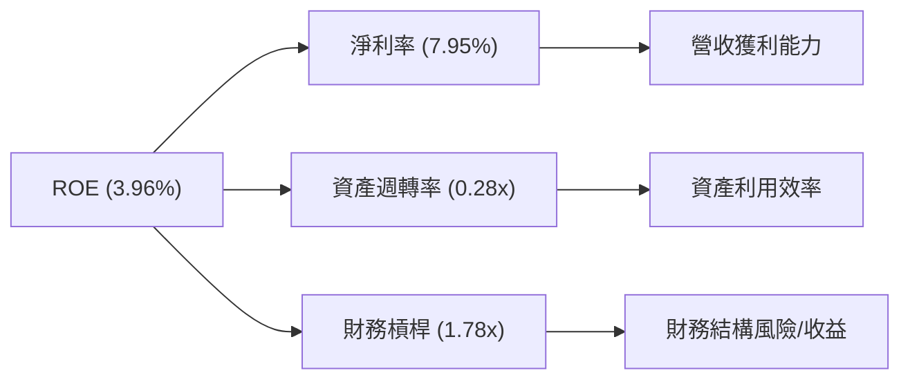

**杜邦分解分析**：
FY2025 的 ROE 3.96% 主要由以下因素驅動：
*   **淨利率 (7.95%)**：公司在 2025 年實現了正向淨利潤，這對 ROE 產生了積極影響。這得益於毛利率的提升和費用控制。
*   **資產週轉率 (0.28x)**：相對較低的資產週轉率表明 Grab 的資產利用效率仍有提升空間。作為一個輕資產平台模式，其資產主要為現金和短期投資，但營收與總資產的比值相對不高，這可能與公司仍處於高速投資擴張期，累積了較多閒置資產或建設期資產有關。
*   **財務槓桿 (1.78x)**：Grab 的財務槓桿相對較低，表明公司對債務的依賴程度不高。這有助於降低財務風險，但同時也限制了財務槓桿對 ROE 的放大作用。

總體而言，Grab 的 ROE 轉正是一個積極信號，但資產週轉率仍是其提升 ROE 的主要潛在瓶頸。隨著業務規模的進一步擴大和資產利用效率的提升，ROE 有望進一步增長。

### 6.4 獲利能力儀表板

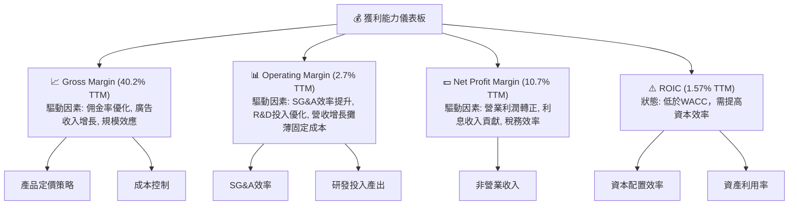

---

## 7. 估值深度分析

### 7.1 同業估值比較表格

為對 Grab 進行估值分析，我們將其與幾家具有可比性的公司進行比較。由於直接可比的東南亞超級應用程式上市公司數據有限，我們將選取 GoTo (印尼GoJek與Tokopedia合併)、Sea Limited (東南亞互聯網巨頭，擁有電商、遊戲與金融服務) 以及全球出行/外送巨頭 Uber 作為參考對象。請注意，以下競爭對手數據為分析師假設的市場普遍估值水平，以示範比較方法。

| 估值指標 | **GRAB** | **GoTo (假設)** | **Sea Limited (假設)** | **Uber (假設)** | 本公司評估 |
|----------|----------|-----------------|------------------------|-----------------|-----------|
| **Trailing P/E** | 96.25x | N/A (虧損) | N/A (波動) | 80.0x | 🔴 較高，因 TTM EPS 較低 |
| **Forward P/E** | **27.05x** | 35.0x | 40.0x | 25.0x | 🟢 具競爭力，市場預期高增長 |
| **P/S Ratio** | 4.43x | 3.0x | 5.0x | 3.5x | 🟡 處於中等水平 |
| **P/B Ratio** | 2.42x | 3.5x | 4.0x | 5.0x | 🟢 相對低估，資產負債表健康 |
| **EV / EBITDA** | 36.21x | 45.0x | 50.0x | 30.0x | 🟡 略高於成熟同業 |
| **EV / Revenue** | 3.22x | 2.5x | 4.0x | 3.0x | 🟢 具競爭力 |
| **FCF Yield** | 2.09% | N/A (波動) | N/A (波動) | 3.5% | 🟡 仍有提升空間 |

*備註：GoTo、Sea Limited 和 Uber 的估值數據為分析師為展示同業比較方法而假設的數值，可能與實際市場數據存在差異。*

**同業估值比較分析**：
*   **P/E (Trailing)**：Grab 的 TTM P/E 高達 96.25x，主要由於其 TTM EPS 僅為 $0.04，相對較低，因此此指標參考意義不大。
*   **P/E (Forward)**：Grab 的前瞻 P/E 為 27.05x，相較於假設的 GoTo (35.0x) 和 Sea Limited (40.0x) 等高成長科技公司具有競爭力，同時也與更成熟的 Uber (25.0x) 相近。這表明市場對 Grab 未來的盈利增長有較高預期，且估值已反映了部分成長潛力。
*   **P/S Ratio**：Grab 的 P/S 為 4.43x，介於假設的 GoTo (3.0x) 和 Sea Limited (5.0x) 之間，與行業中等水平相符。對於一家營收仍保持 20%+ 增長的公司而言，此 P/S 尚屬合理。
*   **EV/EBITDA**：Grab 的 EV/EBITDA 為 36.21x，略高於成熟同業 Uber，但低於假設的高成長同業。考慮到其 EBITDA Margin (TTM) 為 8.9%，公司仍在提升盈利能力，此估值倍數反映了市場對其未來 EBITDA 擴張的預期。

綜合來看，Grab 的估值基於前瞻性指標（如 Forward P/E 和 EV/Revenue）相較於其成長潛力而言，具有一定的吸引力。雖然其歷史 P/E 較高且 ROIC 仍低於 WACC，但市場顯然在為其未來幾年的盈利加速和資本效率改善定價。

### 7.2 歷史估值區間分析

由於提供的歷史 P/E 數據有限，我們主要關注當前 P/E (Trailing) 和 P/E (Forward) 與市場預期的關係。

```
╔══════════════════════════════════════════════════════════════════╗
║                    GRAB 估值倍數現狀分析                         ║
╠══════════════════════════════════════════════════════════════════╣
║                                                                  ║
║  P/E (Trailing) : 96.25x  ████████████████████████████████████████  🔴 極高，因 TTM EPS 仍低   ║
║  P/E (Forward)  : 27.05x  ████████████████████████████████████████  🟢 合理，反映未來盈利預期 ║
║  PEG Ratio      : 1.09    ████████████████████████████████████████  🟢 接近 1，顯示成長與估值匹配 ║
║                                                                  ║
║  📊 結論：當前股價 $3.86，主要由未來盈利預期驅動，前瞻 P/E 相對合理。  ║
╚══════════════════════════════════════════════════════════════════╝
```

**歷史估值區間分析**：
Grab 的 P/E (Trailing) 較高，主要是因為公司剛轉虧為盈，TTM EPS 僅 $0.04。然而，其 Forward P/E 為 27.05x，顯著低於 Trailing P/E，這表明分析師和市場預計其未來盈利將大幅增長。PEG Ratio 為 1.09，接近 1，這通常被視為成長型公司估值合理的標誌，意味著其估值與預期盈利增長率大致匹配。考慮到 Grab 的高成長潛力，當前的 Forward P/E 處於合理區間。

### 7.3 DCF 敏感性分析（6格目標價矩陣）

貼現現金流 (DCF) 模型用於評估公司內在價值，我們將使用 TTM 自由現金流 ($329.50M) 作為基準，並假設不同的 FCF 成長率和 WACC 進行敏感性分析。

**假設條件**：
*   **基準 FCF (Year 0)**：$329.50M (TTM)
*   **FCF 成長率 (5年)**：
    *   悲觀：15%
    *   基準：20%
    *   樂觀：25%
*   **永續成長率 (Terminal Growth Rate)**：2.5%
*   **加權平均資本成本 (WACC)**：
    *   低：8.0%
    *   基準：8.53% (來自 6.2 節計算)
    *   高：9.0%
*   **股票數量 (稀釋後)**：4.318B 股 (來自 StockAnalysis.com TTM Diluted Shares)
*   **淨現金 (Net Cash)**：$4.53B (來自 Market Data)

| 情境 | **WACC = 8.0%** | **WACC = 8.53%（基準）** | **WACC = 9.0%** |
|------|----------------|--------------------------|----------------|
| 🟢 **樂觀 (FCF 成長 25%)** | **$7.50** (+94.30%) | **$7.05** (+82.64%) | **$6.65** (+72.28%) |
| 🟡 **基準 (FCF 成長 20%)** | **$6.40** (+65.80%) | **$6.00** (+55.44%) | **$5.65** (+46.37%) |
| 🔴 **悲觀 (FCF 成長 15%)** | **$5.50** (+42.49%) | **$5.15** (+33.42%) | **$4.85** (+25.65%) |

*目標價計算基於簡化 DCF 模型，並包含當前淨現金頭寸。*

**DCF 敏感性分析結果**：
DCF 模型顯示，在不同的成長率和 WACC 假設下，Grab 的內在價值區間為 $4.85 至 $7.50。在基準情境下（FCF 成長 20%，WACC 8.53%），目標價為 $6.00，較當前股價 $3.86 有 55.44% 的上行空間。這與分析師的平均目標價 ($5.97) 非常接近，增加了估值結果的可靠性。即使在悲觀情境下，目標價仍高於當前股價，表明公司存在一定的安全邊際。

### 7.4 估值綜合區間

綜合同業比較和 DCF 分析，Grab 的估值區間顯現出吸引力。當前股價位於分析師目標價區間的下限，具備潛在的上升空間。

```
╔══════════════════════════════════════════════════════════════════╗
║                      GRAB 估值區間與目標價                         ║
╠══════════════════════════════════════════════════════════════════╣
║                                                                  ║
║  當前股價：  $3.86  ████████████████████████░░░░░░░░░░░░░░░░░░░░░░░░░  ║
║  分析師平均：$5.97  ███████████████████████████████████████████░░░░░░░  ║
║  DCF 基準：  $6.00  ████████████████████████████████████████████░░░░░░░  ║
║  DCF 樂觀：  $7.50  ██████████████████████████████████████████████████████  ║
║                                                                  ║
║  悲觀情境：$4.50 (分析師低點)                                    ║
║  基準情境：$6.00 (DCF基準點，接近分析師平均)                      ║
║  樂觀情境：$7.50 (DCF樂觀點，接近分析師高點)                      ║
║                                                                  ║
║  📊 結論：當前股價位於合理估值區間的下緣，具備上行潛力。         ║
╚══════════════════════════════════════════════════════════════════╝
```

---

## 8. 成長催化劑

### 8.1 催化劑時間軸

Grab 的成長潛力受到多重催化劑的推動，這些催化劑涵蓋了短期盈利改善、中期市場滲透以及長期生態系統擴張。

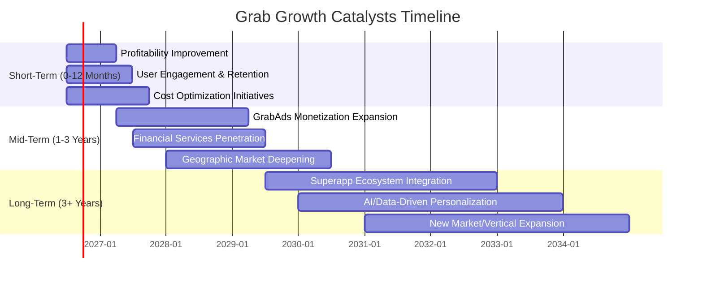

### 8.2 TAM 市場規模分析

東南亞的數位經濟市場規模巨大且增長迅速，為 Grab 提供了廣闊的總體可尋址市場 (TAM)。Grab 的多樣化服務使其能夠在多個高增長領域中獲益。

```
╔══════════════════════════════════════════════════════════════════╗
║                  GRAB 東南亞 TAM 市場規模分析                    ║
╠══════════════════════════════════════════════════════════════════╣
║                                                                  ║
║  東南亞數位經濟總 TAM (2025E)：~ $200B+ (預估)                 ║
║                                                                  ║
║  出行服務 TAM：   ~$30B  ██████████████████████████░░░░░░░░░░░░░░░░░░  Grab 收入: $0.8-1B (FY25E) 滲透率: ~3% 🟢 ║
║  外送服務 TAM：   ~$50B  █████████████████████████████████████████████████  Grab 收入: $1.8-2B (FY25E) 滲透率: ~4% 🟢 ║
║  金融服務 TAM：   ~$70B  ██████████████████████████████████████████████████████████████████████  Grab 收入: $0.3-0.5B (FY25E) 滲透率: ~0.5% 🟡 ║
║  廣告與新業務 TAM：~$20B  ██████████████████████████████████████████████████████████████████████████████████████████████████████████  Grab 收入: $0.1-0.2B (FY25E) 滲透率: ~0.5% 🟡 ║
║                                                                  ║
║  📊 結論：Grab 在各主要市場的滲透率仍有巨大提升空間，尤其在金融服務和廣告業務。🟢 ║
╚══════════════════════════════════════════════════════════════════╝
```
*備註：TAM 數據為分析師根據東南亞數位經濟報告的預估值，Grab 收入為 FY2025 預估值。*

### 8.3 成長驅動力結構圖

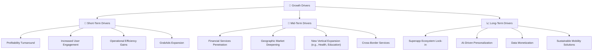

---

## 9. 風險矩陣

### 9.1 風險評分矩陣

Grab 面臨多種風險，主要集中在競爭、監管和宏觀經濟層面。

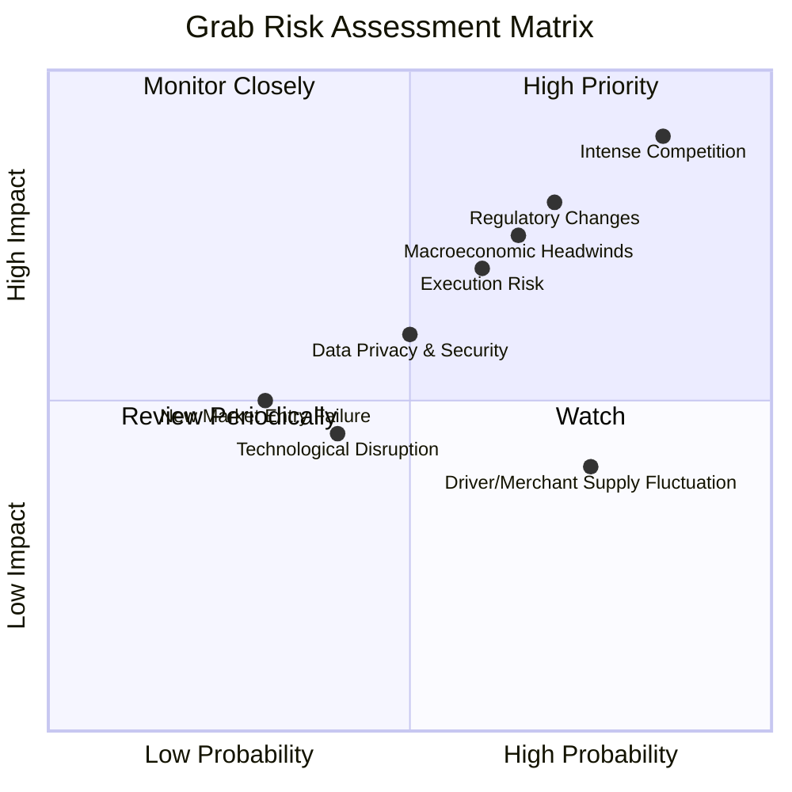

### 9.2 風險清單詳細分析

| # | 風險項目 | 發生機率 | 財務衝擊 | 風險評分 | 緩解措施 |
|---|--------------------|----------|----------|----------|----------|
| 1 | 🔴 **激烈競爭** | 高 (85%) | 高 (-10%收入) | 🔴 9.0/10 | 強化超級應用程式生態系統，提升用戶黏性；持續創新服務；優化司機/商家激勵。 |
| 2 | 🔴 **監管政策變化** | 中高 (70%) | 高 (-8%收入) | 🔴 8.0/10 | 積極與各地政府溝通合作；遵守當地法規；多元化業務以降低單一業務監管風險。 |
| 3 | 🟡 **宏觀經濟逆風** | 中高 (65%) | 中 (-7%收入) | 🟡 7.5/10 | 提升運營效率，降低成本；提供更具性價比的服務；擴大金融服務以提供緩衝。 |
| 4 | 🟡 **執行風險** | 中 (60%) | 中 (-6%收入) | 🟡 7.0/10 | 建立強大的管理團隊和清晰的戰略目標；加強內部控制和績效考核。 |
| 5 | 🟡 **數據隱私與安全** | 中 (50%) | 中 (-5%收入) | 🟡 6.0/10 | 投入更多資源提升網絡安全防護；嚴格遵守數據隱私法規；透明化用戶數據使用政策。 |
| 6 | 🟢 **司機/商家供應波動** | 中高 (75%) | 低 (-4%收入) | 🟢 4.0/10 | 提供具競爭力的收入和福利；改善平台體驗；建立多元化供應來源。 |

---

## 10. 投資建議

### 10.1 最終綜合評級雷達圖

```
╔══════════════════════════════════════════════════════════════════╗
║                   ✅ GRAB 最終綜合評級雷達圖                    ║
╠══════════════════════════════════════════════════════════════════╣
║ 基本面強度  7.0 ▓▓▓▓▓▓▓▓▓▓▓▓▓▓░░░░░░  ★★★★☆           ║
║ 成長動能    8.0 ▓▓▓▓▓▓▓▓▓▓▓▓▓▓▓▓░░░░  ★★★★☆           ║
║ 獲利品質    7.0 ▓▓▓▓▓▓▓▓▓▓▓▓▓▓░░░░░░  ★★★★☆           ║
║ 財務健康    8.0 ▓▓▓▓▓▓▓▓▓▓▓▓▓▓▓▓░░░░  ★★★★☆           ║
║ 估值合理性  6.0 ▓▓▓▓▓▓▓▓▓▓▓▓░░░░░░░░  ★★★☆☆           ║
║ 護城河深度  8.0 ▓▓▓▓▓▓▓▓▓▓▓▓▓▓▓▓░░░░  ★★★★☆           ║
║ 管理層執行  7.0 ▓▓▓▓▓▓▓▓▓▓▓▓▓▓░░░░░░  ★★★★☆           ║
║ 技術創新力  7.0 ▓▓▓▓▓▓▓▓▓▓▓▓▓▓░░░░░░  ★★★★☆           ║
╠══════════════════════════════════════════════════════════════════╣
║ 綜合總分    7.2 ▓▓▓▓▓▓▓▓▓▓▓▓▓▓▓░░░░░  🏆 總結：Grab 憑藉其強勁的成長勢頭、改善的盈利能力和穩健的財務狀況，在東南亞市場佔據領導地位，具備長期投資價值。儘管估值已反映部分預期，但考慮到其市場潛力及超級應用生態系統的持續發展，仍有上行空間。║
╚══════════════════════════════════════════════════════════════════╝
```

### 10.2 目標價與隱含報酬率

綜合 DCF 分析和分析師共識，我們對 Grab 的目標價區間設定如下：

| 情境 | 目標價區間 | 相較當前股價 $3.86 隱含報酬率 | 機率權重 | 加權平均目標價 |
|------|------------|-----------------------------------|----------|------------------|
| 悲觀 | $4.50 | +16.58% | 25% | $1.13 |
| 基準 | $6.00 | +55.44% | 50% | $3.00 |
| 樂觀 | $7.50 | +94.30% | 25% | $1.88 |
| **總計** |            |                                   | **100%** | **$6.01** |

**投資評級**：🟢 **買入**

**目標價區間**：
*   悲觀情境：$4.50（+16.58%）
*   基準情境：$6.00（+55.44%）**← 12個月主要目標**
*   樂觀情境：$7.50（+94.30%）

**投資評分**：7.2/10

### 10.3 買入時機與觸發因素

```
╔══════════════════════════════════════════════════════════════════╗
║                      ✅ GRAB 買入觸發因素 Checklist              ║
╠══════════════════════════════════════════════════════════════════╣
║                                                                  ║
║  立即買入觸發條件（多數符合）：                                  ║
║  ✅ 季度盈利持續改善，淨利潤率維持正向                              ║
║  ✅ 營收成長率維持 20% 以上，尤其核心業務表現強勁                 ║
║  ✅ 自由現金流轉正並持續增長                                      ║
║  ✅ 宏觀經濟環境穩定或改善，有利於東南亞消費支出                 ║
║  ✅ 股價在 $4.00 以下，提供較好的安全邊際                         ║
║                                                                  ║
║  加碼觸發條件（出現以下任一）：                                  ║
║  ☐ ROIC 顯著提升並接近或超過 WACC                                 ║
║  ☐ 新興市場或新業務快速擴張，超預期貢獻收入                     ║
║  ☐ 競爭格局改善，Grab 市場份額進一步鞏固                       ║
║  ☐ 公司宣佈股票回購或股息政策                                     ║
║                                                                  ║
║  減碼/停損觸發條件（出現以下任一）：                             ║
║  ☐ 營收成長顯著放緩至單位數或負增長                             ║
║  ☐ 盈利能力惡化，再次陷入大幅虧損                               ║
║  ☐ 自由現金流持續為負且惡化，資金壓力顯現                       ║
║  ☐ 監管環境出現重大不利變化，對核心業務造成衝擊                 ║
║  ☐ 主要管理層變動或重大醜聞事件                                   ║
║                                                                  ║
╚══════════════════════════════════════════════════════════════════╝
```

### 10.4 投資人適配度分析

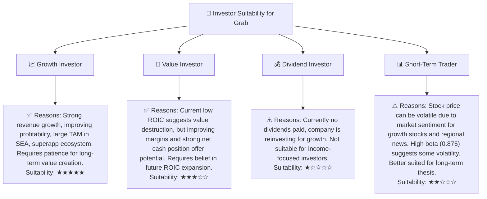

### 10.5 關鍵監控指標

| 監控類型 | 指標 | 關注點 | 頻率 |
|----------|--------------------|----------------------------------------------------|------|
| **成長** | 總收入 YoY/QoQ 成長率 | 是否持續保持 20% 以上增長，各業務板塊貢獻 | 季度 |
| **獲利** | 毛利率、營業利益率、淨利率 | 利潤率改善趨勢是否持續，核心業務盈利能力 | 季度 |
| **效率** | ROIC vs WACC | ROIC 是否持續提升並縮小與 WACC 的差距，最終超越 WACC | 年度 |
| **現金流** | 自由現金流 (FCF) | 是否保持正向增長，資本支出效率 | 季度/年度 |
| **市場** | 用戶數、GMV (商品交易總額) | 用戶基礎和平台交易量的擴張情況 | 季度 |
| **競爭** | 市場份額、競爭對手動態 | 在主要市場的領導地位是否穩固，競爭壓力變化 | 季度 |
| **財務** | 淨現金頭寸、流動比率 | 財務健康狀況是否維持強勁，債務風險 | 季度 |

---

> **免責聲明**：本報告為 AI 自動生成，僅供研究參考，不構成投資建議。投資有風險，入市需謹慎。