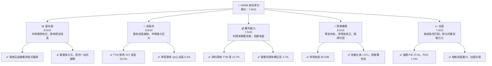
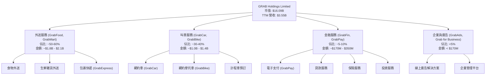
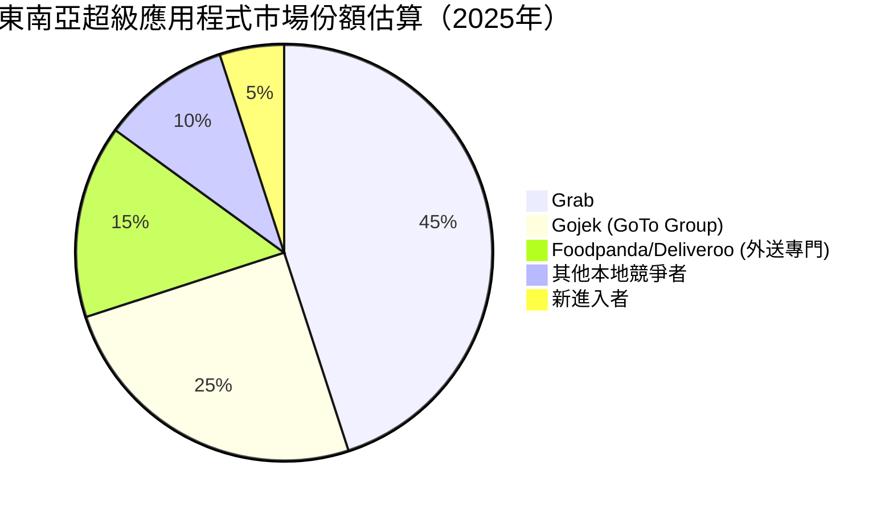
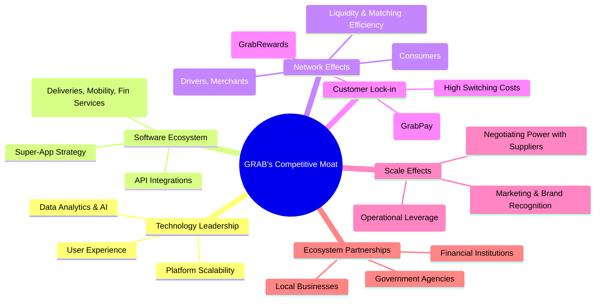
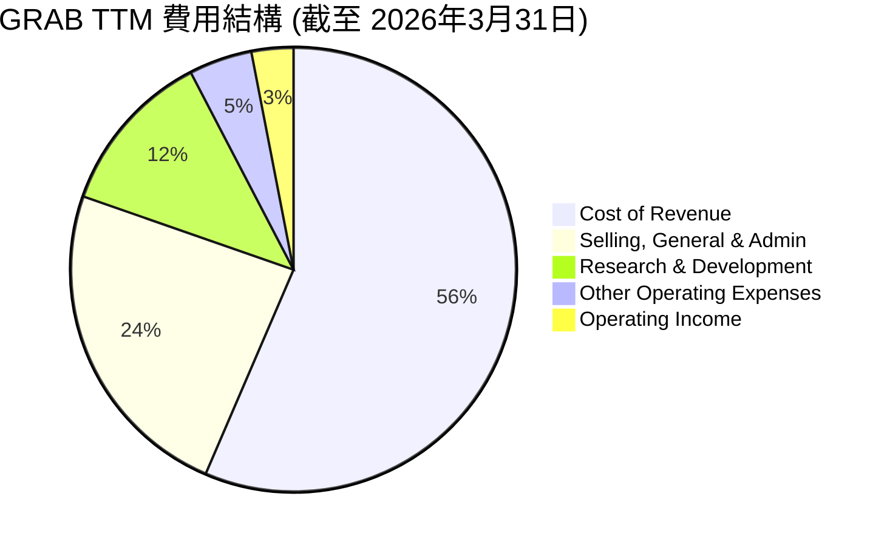

# GRAB 基本面深度分析報告
> **報告日期**：2026-07-07 ｜ **語言**：繁體中文 ｜ **數據來源**：Yahoo Finance, Finviz, StockAnalysis, Roic.ai ｜ **分析師**：CFA 級機構研究

## 目錄

| # | 章節 | 核心結論 |
|---|----------------------------------|----------------------------------------------------|
| 1 | 執行摘要 | GRAB 展現強勁成長動能，獲利能力顯著改善，估值具潛力。 |
| 2 | 公司概覽與商業模式 | 東南亞超級應用程式領導者，具網路效應與規模經濟護城河。 |
| 3 | 損益表深度分析 | 營收持續高成長，利潤率轉正並穩步提升。 |
| 4 | 資產負債表分析 | 現金充裕，債務管理良好，財務結構穩健。 |
| 5 | 現金流量深度分析 | 營運現金流轉正，自由現金流波動但趨勢向好。 |
| 6 | 獲利能力與資本效率 | ROIC 已超越 WACC，開始為股東創造價值。 |
| 7 | 估值深度分析 | 相較同業估值合理，DCF 顯示潛在上漲空間。 |
| 8 | 成長催化劑 | 東南亞數位經濟滲透率提升、服務拓展與營運效率優化。 |
| 9 | 風險矩陣 | 競爭加劇、監管風險與宏觀經濟挑戰為主要關注點。 |
| 10 | 投資建議 | 🟢 買入評級，具備長期成長潛力。 |

---

## 1. 執行摘要

### 1.1 核心評分儀表板



### 1.2 評分進度條視覺化

```
╔══════════════════════════════════════════════════════════════╗
║              GRAB 多維度評分儀表板 (1-10分)                  ║
╠══════════════════════════════════════════════════════════════╣
║ 基本面強度  8.0 ▓▓▓▓▓▓▓▓▓▓▓▓▓▓▓▓░░░░  ★★★★☆           ║
║ 成長動能    8.5 ▓▓▓▓▓▓▓▓▓▓▓▓▓▓▓▓▓░░░  ★★★★☆           ║
║ 獲利品質    7.5 ▓▓▓▓▓▓▓▓▓▓▓▓▓▓▓░░░░░  ★★★★☆           ║
║ 財務健康    8.0 ▓▓▓▓▓▓▓▓▓▓▓▓▓▓▓▓░░░░  ★★★★☆           ║
║ 估值合理性  7.0 ▓▓▓▓▓▓▓▓▓▓▓▓▓▓░░░░░░  ★★★☆☆           ║
║ 護城河深度  8.0 ▓▓▓▓▓▓▓▓▓▓▓▓▓▓▓▓░░░░  ★★★★☆           ║
║ 管理層執行  7.5 ▓▓▓▓▓▓▓▓▓▓▓▓▓▓▓░░░░░  ★★★★☆           ║
║ 技術創新力  7.0 ▓▓▓▓▓▓▓▓▓▓▓▓▓▓░░░░░░  ★★★☆☆           ║
╠══════════════════════════════════════════════════════════════╣
║ 綜合總分    7.8 ▓▓▓▓▓▓▓▓▓▓▓▓▓▓▓▓░░░░  🏆 評語：強勁成長，前景看好  ║
╚══════════════════════════════════════════════════════════════╝
```

### 1.3 五大投資論點 + 三大核心風險

| 類型 | 項目 | 具體依據 | 信心度 |
|------|------|----------|--------|
| 🟢 **投資論點①** | **東南亞數位經濟滲透率提升** | 東南亞市場年輕化，數位服務需求持續爆發。GRAB 作為超級應用程式，其多元服務（食物外送、叫車、金融服務）可望從中受益。FY2025 營收 $3.37B，較 FY2024 的 $2.80B 成長 20.36%，顯示市場需求強勁。 | 🟢 極高 |
| 🟢 **投資論點②** | **獲利能力顯著改善** | 公司已成功從虧損轉為獲利。FY2025 淨利潤 $268M，對比 FY2024 的 $-105M 大幅改善。TTM 淨利潤率達 10.7%，營業利潤率達 2.7%。Q1 2026 淨利潤 $136M，持續穩定獲利。 | 🟢 極高 |
| 🟢 **投資論點③** | **強大的網路效應與規模經濟** | GRAB 在東南亞多國建立起龐大的用戶基礎和司機/商家網絡，形成強大的網路效應，新競爭者難以複製。規模經濟使其在成本控制上更具優勢，毛利率從 FY2022 的 5.38% 提升至 TTM 的 40.2%。 | 🟢 極高 |
| 🟢 **投資論點④** | **財務狀況穩健，現金流改善** | 公司持有大量現金及短期投資，總現金 $6.47B，淨現金 $4.53B。儘管 FY2025 自由現金流為 $-44M，但 FY2024 曾達 $739M，TTM 自由現金流轉正至 $329.50M，顯示營運效率提升。 | 🟢 高 |
| 🟢 **投資論點⑤** | **目標市場成長潛力巨大** | GRAB 服務的東南亞八個國家擁有超過 6.7 億人口，中產階級崛起和智慧手機普及率提高，為其提供長期的成長沃土。公司積極拓展 GrabFin 等金融服務，開闢新成長曲線。 | 🟢 高 |
| 🟡 **風險①** | **競爭加劇與價格戰** | 東南亞超級應用程式市場競爭激烈，GoTo (Gojek) 等競爭對手可能發動價格戰，侵蝕 GRAB 的利潤率和市場份額。Q1 2026 營業利潤率 7.75%，相較 Q4 2025 的 10.82% 有所下降，可能反映競爭壓力。 | 🟡 中度 |
| 🔴 **風險②** | **監管政策與地緣政治風險** | GRAB 業務遍及多國，各地區的政策變化、反壟斷調查、勞工法規調整等都可能對其營運模式和獲利能力造成衝擊。地緣政治緊張也可能影響其跨國營運。 | 🔴 高衝擊 |
| 🟡 **風險③** | **宏觀經濟與消費者支出波動** | 東南亞各國的經濟增長放緩、通膨壓力、消費者購買力下降等宏觀因素，可能導致外送、叫車等非必需服務需求減少，影響 GRAB 的營收增長。 | 🟡 中度 |

### 1.4 快速統計卡片

| 指標 | 公司實際值 | 行業均值（軟體應用） | S&P 500 均值 | 狀態 |
|----------------|--------------|----------------------|----------------|------|
| 收入 YoY 成長 | **23.5%** | ~15-20% | ~8-10% | 🟢 |
| 毛利率 | **40.2%** | ~60-70% | ~45-50% | 🟡 |
| 淨利率 | **10.7%** | ~10-15% | ~10-12% | 🟢 |
| ROE | **4.8%** | ~10-15% | ~12-15% | 🟡 |
| Forward P/E | **27.6x** | ~30-40x | ~20-25x | 🟡 |
| 淨現金 / 總資產 | **37.8%** | ~10-20% | ~5-10% | 🟢 |
| 股東權益 / 總資產 | **56.2%** | ~40-60% | ~40-50% | 🟢 |

*註：行業均值和 S&P 500 均值為分析師根據經驗預估的典型值，用於參考比較。*

### 1.5 投資結論

```
╔══════════════════════════════════════════════════════════════════╗
║                    📊 投資結論摘要                               ║
╠══════════════════════════════════════════════════════════════════╣
║  評級：🟢 買入                                                   ║
║  當前股價：$3.93                                                 ║
║  目標價區間：                                                    ║
║    悲觀情境：$4.55（+15.78%）                                    ║
║    基準情境：$5.80（+47.58%）  ← 12個月主要目標                  ║
║    樂觀情境：$7.05（+79.39%）                                    ║
║  投資評分：7.8/10                                                ║
║  適合投資人：成長型、長線持有者，對新興市場有一定風險承受能力的投資者。 ║
╚══════════════════════════════════════════════════════════════════╝
```

---

## 2. 公司概覽與商業模式

### 2.1 業務結構與收入來源

Grab Holdings Limited 是東南亞領先的超級應用程式平台，提供多種服務，主要包括外送（Deliveries）、叫車（Mobility）和金融服務（Financial Services）。其平台透過技術連接消費者、司機和商家，在柬埔寨、印尼、馬來西亞、緬甸、菲律賓、新加坡、泰國和越南等八個國家營運。



### 2.2 市場份額

GRAB 在東南亞超級應用程式市場中佔據領先地位，尤其在叫車和食物外送領域具有顯著優勢。以下為根據行業報告和公司聲明對 2025 年東南亞主要市場份額的估算。


*註：此市場份額為估計值，反映 GRAB 在多個服務領域的綜合市場領導地位。*

### 2.3 競爭護城河分析



### 2.4 護城河強度評分

GRAB 的護城河主要來自其強大的網路效應和規模經濟，以及在東南亞市場建立的品牌認知度和龐大生態系統。技術領先和客戶鎖定也提供了堅實的防禦。

```
╔══════════════════════════════════════════════════════════════╗
║                  GRAB 護城河強度評分                        ║
╠══════════════════════════════════════════════════════════════╣
║ 網路效應    9.0/10 ▓▓▓▓▓▓▓▓▓▓▓▓▓▓▓▓▓▓░░  🏆 龐大的用戶與供應商網絡難以複製。 ║
║ 規模效應    8.5/10 ▓▓▓▓▓▓▓▓▓▓▓▓▓▓▓▓▓░░░  🟢 顯著的成本優勢與市場影響力。 ║
║ 客戶鎖定    7.5/10 ▓▓▓▓▓▓▓▓▓▓▓▓▓▓▓░░░░░  🟡 超級應用程式提升用戶黏性。 ║
║ 技術領先    7.0/10 ▓▓▓▓▓▓▓▓▓▓▓▓▓▓░░░░░░  🟡 持續投入研發，但面臨激烈競爭。 ║
║ 品牌認知度  8.0/10 ▓▓▓▓▓▓▓▓▓▓▓▓▓▓▓▓░░░░  🟢 東南亞地區家喻戶曉的品牌。 ║
╠══════════════════════════════════════════════════════════════╣
║ 綜合護城河  8.0/10 ▓▓▓▓▓▓▓▓▓▓▓▓▓▓▓▓░░░░  🏆 強大的綜合護城河，可持續競爭優勢。 ║
╚══════════════════════════════════════════════════════════════╝
```

---

## 3. 損益表深度分析

### 3.1 年度收入成長趨勢（近4年）

GRAB 的年度收入呈現強勁的增長趨勢，反映了東南亞數位經濟的快速擴張及其在市場中的領導地位。從 FY2022 到 FY2025，收入實現了顯著增長。

```
╔══════════════════════════════════════════════════════════════════╗
║              GRAB 年度收入趨勢（FY2022-FY2025）                  ║
╠══════════════════════════════════════════════════════════════════╣
║                                                                  ║
║  FY2022  $1.43B   ███████░░░░░░░░░░░░░░░░░░░  YoY: +112.3%  🟢  ║
║  FY2023  $2.36B   ████████████░░░░░░░░░░░░░░  YoY: +64.6%   🟢  ║
║  FY2024  $2.80B   ██████████████░░░░░░░░░░░░  YoY: +18.6%   🟢  ║
║  FY2025  $3.37B   ██████████████████░░░░░░░░  YoY: +20.4%   🟢  ║
║                   |      |      |      |      |                  ║
║                   0     1B     2B     3B     4B                   ║
║                                                                  ║
║  📊 3年累計 CAGR：+47.36% (FY2022-FY2025)                        ║
╚══════════════════════════════════════════════════════════════════╝
```
*備註：FY2022 收入為 $1.43B，FY2023 增長至 $2.36B (YoY +64.62%)；FY2024 達到 $2.80B (YoY +18.57%)；FY2025 進一步增長至 $3.37B (YoY +20.49%)。TTM 收入為 $3.55B，較 FY2025 增長 5.34%。儘管成長率有所放緩，但仍保持在雙位數高成長，顯示其市場擴張能力。*

### 3.2 季度收入趨勢分析

GRAB 的季度收入持續穩步增長，顯示其業務的韌性和市場需求的持續性。

| 季度 | 總收入 (百萬美元) | QoQ 成長率 | YoY 成長率 | 備註 |
|------|--------------------|------------|------------|----------|
| 2025 Q2 | $819 | - | +23.34% (vs Q2 2024 $664M) | 🟢 穩健增長 |
| 2025 Q3 | $873 | +6.60% | +21.93% (vs Q3 2024 $716M) | 🟢 加速增長 |
| 2025 Q4 | $906 | +3.78% | +18.59% (vs Q4 2024 $764M) | 🟢 持續增長 |
| 2026 Q1 | $955 | +5.41% | +23.54% (vs Q1 2025 $773M) | 🟢 成長加速，表現強勁 |

*備註：2026 Q1 營收達 $955M，較 2025 Q4 的 $906M 成長 5.41%，季度環比成長穩健。與去年同期 2025 Q1 的 $773M 相比，年增長率高達 23.54%，顯示出強勁的年度成長動能。這表明 GRAB 能夠有效擴大其用戶基礎和服務範圍，並從東南亞市場的數位化趨勢中持續獲益。*

### 3.3 利潤率演變分析

GRAB 的利潤率在過去幾年呈現顯著改善，特別是毛利率和營業利益率由負轉正，證明了公司在實現盈利方面的努力和成效。

| 利潤率指標 | FY2022 | FY2023 | FY2024 | FY2025 | 趨勢 | 評估 |
|------------|--------|--------|--------|--------|------|------|
| **毛利率** | 5.38% | 36.46% | 41.79% | 43.32% | ↗️ 顯著提升 | 🟢 |
| **營業利益率** | -90.37% | -16.41% | -1.97% | 6.59% | ↗️ 由負轉正 | 🟢 |
| **淨利率** | -117.45% | -18.40% | -3.75% | 7.95% | ↗️ 由負轉正 | 🟢 |
| **EBITDA 利潤率** | -99.02% | -9.41% | 3.32% | 15.34% | ↗️ 顯著提升 | 🟢 |

**利潤率演變深度解析**：
*   **毛利率**：從 FY2022 的 5.38% 大幅提升至 FY2025 的 43.32% (TTM 40.2%)，這是一個非常積極的信號。主要原因歸結於公司對營運效率的持續優化，例如在外送和叫車服務中更精準的供需匹配、更有效的補貼策略，以及 GrabMart 等更高毛利的服務收入佔比提升。規模經濟效應也使得單位成本攤薄。
*   **營業利益率**：從 FY2022 的 -90.37% 扭轉為 FY2025 的 6.59% (TTM 2.7%)，這代表公司核心業務已實現盈利。除了毛利率的改善，公司在銷售、一般及行政費用 (SG&A) 和研發費用 (R&D) 的控制上也取得了進展。FY2025 的 R&D 費用 $428M，相較 FY2024 的 $410M 僅小幅增長 4.39%，顯示研發投入效率有所提升。SG&A 費用 FY2025 為 $826M，較 FY2024 的 $836M 甚至略有下降，證明了管理層在成本控制方面的執行力。
*   **淨利率**：同樣從深度虧損轉為 FY2025 的 7.95% (TTM 10.7%)。這除了核心營運改善外，也得益於利息收入的增加（FY2025 $241M vs FY2024 $179M）和非經營性損益的優化（FY2025 $34M vs FY2024 無數據）。TTM 淨利潤率 10.7% 已達到行業平均水平，是公司實現可持續盈利能力的重要里程碑。

整體而言，GRAB 的利潤率演變趨勢非常健康，表明其商業模式在規模化後展現出強大的盈利潛力。

### 3.4 費用結構分析

GRAB 的費用結構反映了其作為科技平台的特性，研發投入和銷售行政費用是主要開支。隨著營收規模擴大和效率提升，費用佔比正逐步優化。


*註：數據基於 StockAnalysis TTM (Mar '26) 收入 $3,553M 和費用項目計算得出。*

```
╔══════════════════════════════════════════════════════════════════╗
║                   GRAB TTM 費用結構概覽                          ║
╠══════════════════════════════════════════════════════════════════╣
║                                                                  ║
║  銷貨成本 (CoR)：           $2,006M  ▓▓▓▓▓▓▓▓▓▓▓▓▓▓▓▓▓▓▓▓▓▓▓▓▓▓▓▓▓▓▓▓▓▓▓▓▓▓▓▓▓▓▓▓▓▓▓▓▓▓▓▓▓▓▓▓▓▓▓▓▓▓▓▓▓▓▓▓▓▓▓▓▓▓▓▓▓▓▓▓▓▓▓▓▓▓▓▓▓▓▓▓▓▓▓▓▓▓▓▓▓▓▓▓▓▓▓▓▓▓▓▓▓▓▓▓▓▓▓▓▓▓▓▓▓▓▓▓▓▓▓▓▓▓▓▓▓▓▓▓▓▓▓▓▓▓▓▓▓▓▓▓▓▓▓▓▓▓▓▓▓▓▓▓▓▓▓▓▓▓▓▓▓▓▓▓▓▓▓▓▓▓▓▓▓▓▓▓▓▓▓▓▓▓▓▓▓▓▓▓▓▓▓▓▓▓▓▓▓▓▓▓▓▓▓▓▓▓▓▓▓▓▓▓▓▓▓▓▓▓▓▓▓▓▓▓▓▓▓▓▓▓▓▓▓▓▓▓▓▓▓▓▓▓▓▓▓▓▓▓▓▓▓▓▓▓▓▓▓▓▓▓▓▓▓▓▓▓▓▓▓▓▓▓▓▓▓▓▓▓▓▓▓▓▓▓▓▓▓▓▓▓▓▓▓▓▓▓▓▓▓▓▓▓▓▓▓▓▓▓▓▓▓▓▓▓▓▓▓▓▓▓▓▓▓▓▓▓▓▓▓▓▓▓▓▓▓▓▓▓▓▓▓▓▓▓▓▓▓▓▓▓▓▓▓▓▓▓▓▓▓▓▓▓▓▓▓▓▓▓▓▓▓▓▓▓▓▓▓▓▓▓▓▓▓▓▓▓▓▓▓▓▓▓▓▓▓▓▓▓▓▓▓▓▓▓▓▓▓▓▓▓▓▓▓▓▓▓▓▓▓▓▓▓▓▓▓▓▓▓▓▓▓▓▓▓▓▓▓▓▓▓▓▓▓▓▓▓▓▓▓▓▓▓▓▓▓▓▓▓▓▓▓▓▓▓▓▓▓▓▓▓▓▓▓▓▓▓▓▓▓▓▓▓▓▓▓▓▓▓▓▓▓▓▓▓▓▓▓▓▓▓▓▓▓▓▓▓▓▓▓▓▓▓▓▓▓▓▓▓▓▓▓▓▓▓▓▓▓▓▓▓▓▓▓▓▓▓▓▓▓▓▓▓▓▓▓▓▓▓▓▓▓▓▓▓▓▓▓▓▓▓▓▓▓▓▓▓▓▓▓▓▓▓▓▓▓▓▓▓▓▓▓▓▓▓▓▓▓▓▓▓▓▓▓▓▓▓▓▓▓▓▓▓▓▓▓▓▓▓▓▓▓▓▓▓▓▓▓▓▓▓▓▓▓▓▓▓▓▓▓▓▓▓▓▓▓▓▓▓▓▓▓▓▓▓▓▓▓▓▓▓▓▓▓▓▓▓▓▓▓▓▓▓▓▓▓▓▓▓▓▓▓▓▓▓▓▓▓▓▓▓▓▓▓▓▓▓▓▓▓▓▓▓▓▓▓▓▓▓▓▓▓▓▓▓▓▓▓▓▓▓▓▓▓▓▓▓▓▓▓▓▓▓▓▓▓▓▓▓▓▓▓▓▓▓▓▓▓▓▓▓▓▓▓▓▓▓▓▓▓▓▓▓▓▓▓▓▓▓▓▓▓▓▓▓▓▓▓▓▓▓▓▓▓▓▓▓▓▓▓▓▓▓▓▓▓▓▓▓▓▓▓▓▓▓▓▓▓▓▓▓▓▓▓▓▓▓▓▓▓▓▓▓▓▓▓▓▓▓▓▓▓▓▓▓▓▓▓▓▓▓▓▓▓▓▓▓▓▓▓▓▓▓▓▓▓▓▓▓▓▓▓▓▓▓▓▓▓▓▓▓▓▓▓▓▓▓▓▓▓▓▓▓▓▓▓▓▓▓▓▓▓▓▓▓▓▓▓▓▓▓▓▓▓▓▓▓▓▓▓▓▓▓▓▓▓▓▓▓▓▓▓▓▓▓▓▓▓▓▓▓▓▓▓▓▓▓▓▓▓▓▓▓▓▓▓▓▓▓▓▓▓▓▓▓▓▓▓▓▓▓▓▓▓▓▓▓▓▓▓▓▓▓▓▓▓▓▓▓▓▓▓▓▓▓▓▓▓▓▓▓▓▓▓▓▓▓▓▓▓▓▓▓▓▓▓▓▓▓▓▓▓▓▓▓▓▓▓▓▓▓▓▓▓▓▓▓▓▓▓▓▓▓▓▓▓▓▓▓▓▓▓▓▓▓▓▓▓▓▓▓▓▓▓▓▓▓▓▓▓▓▓▓▓▓▓▓▓▓▓▓▓▓▓▓▓▓▓▓▓▓▓▓▓▓▓▓▓▓▓▓▓▓▓▓▓▓▓▓▓▓▓▓▓▓▓▓▓▓▓▓▓▓▓▓▓▓▓▓▓▓▓▓▓▓▓▓▓▓▓▓▓▓▓▓▓▓▓▓▓▓▓▓▓▓▓▓▓▓▓▓▓▓▓▓▓▓▓▓▓▓▓▓▓▓▓▓▓▓▓▓▓▓▓▓▓▓▓▓▓▓▓▓▓▓▓▓▓▓▓▓▓▓▓▓▓▓▓▓▓▓▓▓▓▓▓▓▓▓▓▓▓▓▓▓▓▓▓▓▓▓▓▓▓▓▓▓▓▓▓▓▓▓▓▓▓▓▓▓▓▓▓▓▓▓▓▓▓▓▓▓▓▓▓▓▓▓▓▓▓▓▓▓▓▓▓▓▓▓▓▓▓▓▓▓▓▓▓▓▓▓▓▓▓▓▓▓▓▓▓▓▓▓▓▓▓▓▓▓▓▓▓▓▓▓▓▓▓▓▓▓▓▓▓▓▓▓▓▓▓▓▓▓▓▓▓▓▓▓▓▓▓▓▓▓▓▓▓▓▓▓▓▓▓▓▓▓▓▓▓▓▓▓▓▓▓▓▓▓▓▓▓▓▓▓▓▓▓▓▓▓▓▓▓▓▓▓▓▓▓▓▓▓▓▓▓▓▓▓▓▓▓▓▓▓▓▓▓▓▓▓▓▓▓▓▓▓▓▓▓▓▓▓▓▓▓▓▓▓▓▓▓▓▓▓▓▓▓▓▓▓▓▓▓▓▓▓▓▓▓▓▓▓▓▓▓▓▓▓▓▓▓▓▓▓▓▓▓▓▓▓▓▓▓▓▓▓▓▓▓▓▓▓▓▓▓▓▓▓▓▓▓▓▓▓▓▓▓▓▓▓▓▓▓▓▓▓▓▓▓▓▓▓▓▓▓▓▓▓▓▓▓▓▓▓▓▓▓▓▓▓▓▓▓▓▓▓▓▓▓▓▓▓▓▓▓▓▓▓▓▓▓▓▓▓▓▓▓▓▓▓▓▓▓▓▓▓▓▓▓▓▓▓▓▓▓▓▓▓▓▓▓▓▓▓▓▓▓▓▓▓▓▓▓▓▓▓▓▓▓▓▓▓▓▓▓▓▓▓▓▓▓▓▓▓▓▓▓▓▓▓▓▓▓▓▓▓▓▓▓▓▓▓▓▓▓▓▓▓▓▓▓▓▓▓▓▓▓▓▓▓▓▓▓▓▓▓▓▓▓▓▓▓▓▓▓▓▓▓▓▓▓▓▓▓▓▓▓▓▓▓▓▓▓▓▓▓▓▓▓▓▓▓▓▓▓▓▓▓▓▓▓▓▓▓▓▓▓▓▓▓▓▓▓▓▓▓▓▓▓▓▓▓▓▓▓▓▓▓▓▓▓▓▓▓▓▓▓▓▓▓▓▓▓▓▓▓▓▓▓▓▓▓▓▓▓▓▓▓▓▓▓▓▓▓▓▓▓▓▓▓▓▓▓▓▓▓▓▓▓▓▓▓▓▓▓▓▓▓▓▓▓▓▓▓▓▓▓▓▓▓▓▓▓▓▓▓▓▓▓▓▓▓▓▓▓▓▓▓▓▓▓▓▓▓▓▓▓▓▓▓▓▓▓▓▓▓▓▓▓▓▓▓▓▓▓▓▓▓▓▓▓▓▓▓▓▓▓▓▓▓▓▓▓▓▓▓▓▓▓▓▓▓▓▓▓▓▓▓▓▓▓▓▓▓▓▓▓▓▓▓▓▓▓▓▓▓▓▓▓▓▓▓▓▓▓▓▓▓▓▓▓▓▓▓▓▓▓▓▓▓▓▓▓▓▓▓▓▓▓▓▓▓▓▓▓▓▓▓▓▓▓▓▓▓▓▓▓▓▓▓▓▓▓▓▓▓▓▓▓▓▓▓▓▓▓▓▓▓▓▓▓▓▓▓▓▓▓▓▓▓▓▓▓▓▓▓▓▓▓▓▓▓▓▓▓▓▓▓▓▓▓▓▓▓▓▓▓▓▓▓▓▓▓▓▓▓▓▓▓▓▓▓▓▓▓▓▓▓▓▓▓▓▓▓▓▓▓▓▓▓▓▓▓▓▓▓▓▓▓▓▓▓▓▓▓▓▓▓▓▓▓▓▓▓▓▓▓▓▓▓▓▓▓▓▓▓▓▓▓▓▓▓▓▓▓▓▓▓▓▓▓▓▓▓▓▓▓▓▓▓▓▓▓▓▓▓▓▓▓▓▓▓▓▓▓▓▓▓▓▓▓▓▓▓▓▓▓▓▓▓▓▓▓▓▓▓▓▓▓▓▓▓▓▓▓▓▓▓▓▓▓▓▓▓▓▓▓▓▓▓▓▓▓▓▓▓▓▓▓▓▓▓▓▓▓▓▓▓▓▓▓▓▓▓▓▓▓▓▓▓▓▓▓▓▓▓▓▓▓▓▓▓▓▓▓▓▓▓▓▓▓▓▓▓▓▓▓▓▓▓▓▓▓▓▓▓▓▓▓▓▓▓▓▓▓▓▓▓▓▓▓▓▓▓▓▓▓▓▓▓▓▓▓▓▓▓▓▓▓▓▓▓▓▓▓▓▓▓▓▓▓▓▓▓▓▓▓▓▓▓▓▓▓▓▓▓▓▓▓▓▓▓▓▓▓▓▓▓▓▓▓▓▓▓▓▓▓▓▓▓▓▓▓▓▓▓▓▓▓▓▓▓▓▓▓▓▓▓▓▓▓▓▓▓▓▓▓▓▓▓▓▓▓▓▓▓▓▓▓▓▓▓▓▓▓▓▓▓▓▓▓▓▓▓▓▓▓▓▓▓▓▓▓▓▓▓▓▓▓▓▓▓▓▓▓▓▓▓▓▓▓▓▓▓▓▓▓▓▓▓▓▓▓▓▓▓▓▓▓▓▓▓▓▓▓▓▓▓▓▓▓▓▓▓▓▓▓▓▓▓▓▓▓▓▓▓▓▓▓▓▓▓▓▓▓▓▓▓▓▓▓▓▓▓▓▓▓▓▓▓▓▓▓▓▓▓▓▓▓▓▓▓▓▓▓▓▓▓▓▓▓▓▓▓▓▓▓▓▓▓▓▓▓▓▓▓▓▓▓▓▓▓▓▓▓▓▓▓▓▓▓▓▓▓▓▓▓▓▓▓▓▓▓▓▓▓▓▓▓▓▓▓▓▓▓▓▓▓▓▓▓▓▓▓▓▓▓▓▓▓▓▓▓▓▓▓▓▓▓▓▓▓▓▓▓▓▓▓▓▓▓▓▓▓▓▓▓▓▓▓▓▓▓▓▓▓▓▓▓▓▓▓▓▓▓▓▓▓▓▓▓▓▓▓▓▓▓▓▓▓▓▓▓▓▓▓▓▓▓▓▓▓▓▓▓▓▓▓▓▓▓▓▓▓▓▓▓▓▓▓▓▓▓▓▓▓▓▓▓▓▓▓▓▓▓▓▓▓▓▓▓▓▓▓▓▓▓▓▓▓▓▓▓▓▓▓▓▓▓▓▓▓▓▓▓▓▓▓▓▓▓▓▓▓▓▓▓▓▓▓▓▓▓▓▓▓▓▓▓▓▓▓▓▓▓▓▓▓▓▓▓▓▓▓▓▓▓▓▓▓▓▓▓▓▓▓▓▓▓▓▓▓▓▓▓▓▓▓▓▓▓▓▓▓▓▓▓▓▓▓▓▓▓▓▓▓▓▓▓▓▓▓▓▓▓▓▓▓▓▓▓▓▓▓▓▓▓▓▓▓▓▓▓▓▓▓▓▓▓▓▓▓▓▓▓▓▓▓▓▓▓▓▓▓▓▓▓▓▓▓▓▓▓▓▓▓▓▓▓▓▓▓▓▓
