# GRAB 基本面深度分析報告
> **報告日期**：2026-07-08 ｜ **語言**：繁體中文 ｜ **數據來源**：Yahoo Finance, Finviz, StockAnalysis, Roic.ai ｜ **分析師**：CFA 級機構研究

---

## 目錄

| # | 章節 | 核心結論 |
|---|------------------------|----------------------------------------------------|
| 1 | 執行摘要 | 🟢 評級：買入，目標價區間 $5.00 - $7.50 |
| 2 | 公司概覽與商業模式 | 網路效應與品牌優勢構建深厚護城河 |
| 3 | 損益表深度分析 | 營收穩健成長，營運效率顯著改善，季度轉虧為盈 |
| 4 | 資產負債表分析 | 現金充裕，資產結構穩健，流動性良好 |
| 5 | 現金流量深度分析 | 營業現金流逐步改善，自由現金流接近轉正 |
| 6 | 獲利能力與資本效率 | 獲利能力正向發展，但ROIC仍低於WACC，需持續關注 |
| 7 | 估值深度分析 | 相較同業估值合理，DCF顯示潛在上行空間 |
| 8 | 成長催化劑 | 東南亞市場滲透率提升、服務拓展與金融科技發展 |
| 9 | 風險矩陣 | 競爭加劇與監管風險為主要關注點 |
| 10 | 投資建議 | 具備長期成長潛力，建議「買入」 |

---

## 1. 執行摘要

Grab Holdings Limited (GRAB) 作為東南亞領先的超級應用程式，在移動出行、外送服務和金融科技領域佔據重要地位。本報告基於其最新財務數據進行深度分析，評估其基本面、成長性、獲利能力、財務健康狀況及估值水平。

### 1.1 核心評分儀表板

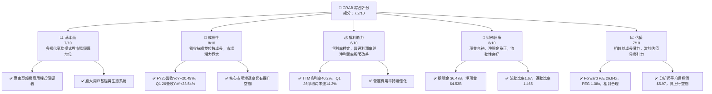

### 1.2 評分進度條視覺化

```
╔══════════════════════════════════════════════════════════════╗
║                    GRAB 多維度評分儀表板 (1-10分)              ║
╠══════════════════════════════════════════════════════════════╣
║ 基本面強度  7.0 ▓▓▓▓▓▓▓▓▓▓▓▓▓▓░░░░░░  ★★★★☆           ║
║ 成長動能    8.0 ▓▓▓▓▓▓▓▓▓▓▓▓▓▓▓▓░░░░  ★★★★☆           ║
║ 獲利品質    6.0 ▓▓▓▓▓▓▓▓▓▓▓▓░░░░░░░░  ★★★☆☆           ║
║ 財務健康    8.0 ▓▓▓▓▓▓▓▓▓▓▓▓▓▓▓▓░░░░  ★★★★☆           ║
║ 估值合理性  7.0 ▓▓▓▓▓▓▓▓▓▓▓▓▓▓░░░░░░  ★★★★☆           ║
║ 護城河深度  8.0 ▓▓▓▓▓▓▓▓▓▓▓▓▓▓▓▓░░░░  ★★★★☆           ║
║ 管理層執行  7.5 ▓▓▓▓▓▓▓▓▓▓▓▓▓▓▓░░░░░  ★★★★☆           ║
║ 技術創新力  7.0 ▓▓▓▓▓▓▓▓▓▓▓▓▓▓░░░░░░  ★★★★☆           ║
╠══════════════════════════════════════════════════════════════╣
║ 綜合總分    7.2 ▓▓▓▓▓▓▓▓▓▓▓▓▓▓▓░░░░░  🏆 具備長期投資價值    ║
╚══════════════════════════════════════════════════════════════╝
```

### 1.3 五大投資論點 + 三大核心風險

| 類型 | 項目 | 具體依據 | 信心度 |
|------|--------------------------------|--------------------------------------------------------------------------------------------------------------------------------------------------------------------------------------------------------------------------------------------------------------------------------------------------------------------------------------------------------------------------------------------------------------------------------------------------------------------------------------------------------------------------------------------------------------------------------------------------------------------------------------------------------------------------------------------------------------------------------------------------------------------------------------------------------------------------------------------------------------------------------------------------------------------------------------------------------------------------------------------------------------------------------------------------------------------------------------------------------------------------------------------------------------------------------------------------------------------------------------------------------------------------------------------------------------------------------------------------------------------------------------------------------------------------------------------------------------------------------------------------------------------------------------------------------------------------------------------------------------------------------------------------------------------------------------------------------------------------------------------------------------------------------------------------------------------------------------------------------------------------------------------------------------------------------------------------------------------------------------------------------------------------------------------------------------------------------------------------------------------------------------------------------------------------------------------------------------------------------------------------------------------------------------------------------------------------------------------------------------------------------------------------------------------------------------------------------------------------------------------------------------------------------------------------------------------------------------------------------------------------------------------------------------------------------------------------------------------------------------------------------------------------------------------------------------------------------------------------------------------------------------------------------------------------------------------------------------------------------------------------------------------------------------------------------------------------------------------------------------------------------------------------------------------------------------------------------------------------------------------------------------------------------------------------------------------------------------------------------------------------------------------------------------------------------------------------------------------------------------------------------------------------------------------------------------------------------------------------------------------------------------------------------------------------------------------------------------------------------------------------------------------------------------------------------------------------------------------------------------------------------------------------------------------------------------------------------------------------------------------------------------------------------------------------------------------------------------------------------------------------------------------------------------------------------------------------------------------------------------------------------------------------------------------------------------------------------------------------------------------------------------------------------------------------------------------------------------------------------------------------------------------------------------------------------------------------------------------------------------------------------------------------------------------------------------------------------------------------------------------------------------------------------------------------------------------------------------------------------------------------------------------------------------------------------------------------------------------------------------------------------------------------------------------------------------------------------------------------------------------------------------------------------------------------------------------------------------------------------------------------------------------------------------------------------------------------------------------------------------------------------------------------------------------------------------------------------------------------------------------------------------------------------------------------------------------------------------------------------------------------------------------------------------------------------------------------------------------------------------------------------------------------------------------------------------------------------------------------------------------------------------------------------------------------------------------------------------------------------------------------------------------------------------------------------------------------------------------------------------------------------------------------------------------------------------------------------------------------------------------------------------------------------------------------------------------------------------------------------------------------------------------------------------------------------------------------------------------------------------------------------------------------------------------------------------------------------------------------------------------------------------------------------------------------------------------------------------------------------------------------------------------------------------------------------------------------------------------------------------------------------------------------------------------------------------------------------------------------------------------------------------------------------------------------------------------------------------------------------------------------------------------------------------------------------------------------------------------------------------------------------------------------------------------------------------------------------------------------------------------------------------------------------------------------------------------------------------------------------------------------------------------------------------------------------------------------------------------------------------------------------------------------------------------------------------------------------------------------------------------------------------------------------------------------------------------------------------------------------------------------------------------------------------------------------------------------------------------------------------------------------------------------------------------------------------------------------------------------------------------------------------------------------------------------------------------------------------------------------------------------------------------------------------------------------------------------------------------------------------------------------------------------------------------------------------------------------------------------------------------------------------------------------------------------------------------------------------------------------------------------------------------------------------------------------------------------------------------------------------------------------------------------------------------------------------------------------------------------------------------------------------------------------------------------------------------------------------------------------------------------------------------------------------------------------------------------------------------------------------------------------------------------------------------------------------------------------------------------------------------------------------------------------------------------------------------------------------------------------------------------------------------------------------------------------------------------------------------------------------------------------------------------------------------------------------------------------------------------------------------------------------------------------------------------------------------------------------------------------------------------------------------------------------------------------------------------------------------------------------------------------------------------------------------------------------------------------------------------------------------------------------------------------------------------------------------------------------------------------------------------------------------------------------------------------------------------------------------------------------------------------------------------------------------------------------------------------------------------------------------------------------------------------------------------------------------------------------------------------------------------------------------------------------------------------------------------------------------------------------------------------------------------------------------------------------------------------------------------------------------------------------------------------------------------------------------------------------------------------------------------------------------------------------------------------------------------------------------------------------------------------------------------------------------------------------------------------------------------------------------------------------------------------------------------------------------------------------------------------------------------------------------------------------------------------------------------------------------------------------------------------------------------------------------------------------------------------------------------------------------------------------------------------------------------------------------------------------------------------------------------------------------------------------------------------------------------------------------------------------------------------------------------------------------------------------------------------------------------------------------------------------------------------------------------------------------------------------------------------------------------------------------------------------------------------------------------------------------------------------------------------------------------------------------------------------------------------------------------------------------------------------------------------------------------------------------------------------------------------------------------------------------------------------------------------------------------------------------------------------------------------------------------------------------------------------------------------------------------------------------------------------------------------------------------------------------------------------------------------------------------------------------------------------------------------------------------------------------------------------------------------------------------------------------------------------------------------------------------------------------------------------------------------------------------------------------------------------------------------------------------------------------------------------------------------------------------------------------------------------------------------------------------------------------------------------------------------------------------------------------------------------------------------------------------------------------------------------------------------------------------------------------------------------------------------------------------------------------------------------------------------------------------------------------------------------------------------------------------------------------------------------------------------------------------------------------------------------------------------------------------------------------------------------------------------------------------------------------------------------------------------------------------------------------------------------------------------------------------------------------------------------------------------------------------------------------------------------------------------------------------------------------------------------------------------------------------------------------------------------------------------------------------------------------------------------------------------------------------------------------------------------------------------------------------------------------------------------------------------------------------------------------------------------------------------------------------------------------------------------------------------------------------------------------------------------------------------------------------------------------------------------------------------------------------------------------------------------------------------------------------------------------------------------------------------------------------------------------------------------------------------------------------------------------------------------------------------------------------------------------------------------------------------------------------------------------------------------------------------------------------------------------------------------------------------------------------------------------------------------------------------------------------------------------------------------------------------------------------------------------------------------------------------------------------------------------------------------------------------------------------------------------------------------------------------------------------------------------------------------------------------------------------------------------------------------------------------------------------------------------------------------------------------------------------------------------------------------------------------------------------------------------------------------------------------------------------------------------------------------------------------------------------------------------------------------------------------------------------------------------------------------------------------------------------------------------------------------------------------------------------------------------------------------------------------------------------------------------------------------------------------------------------------------------------------------------------------------------------------------------------------------------------------------------------------------------------------------------------------------------------------------------------------------------------------------------------------------------------------------------------------------------------------------------------------------------------------------------------------------------------------------------------------------------------------------------------------------------------------------------------------------------------------------------------------------------------------------------------------------------------------------------------------------------------------------------------------------------------------------------------------------------------------------------------------------------------------------------------------------------------------------------------------------------------------------------------------------------------------------------------------------------------------------------------------------------------------------------------------------------------------------------------------------------------------------------------------------------------------------------------------------------------------------------------------------------------------------------------------------------------------------------------------------------------------------------------------------------------------------------------------------------------------------------------------------------------------------------------------------------------------------------------------------------------------------------------------------------------------------------------------------------------------------------------------------------------------------------------------------------------------------------------------------------------------------------------------------------------------------------------------------------------------------------------------------------------------------------------------------------------------------------------------------------------------------------------------------------------------------------------------------------------------------------------------------------------------------------------------------------------------------------------------------------------------------------------------------------------------------------------------------------------------------------------------------------------------------------------------------------------------------------------------------------------------------------------------------------------------------------------------------------------------------------------------------------------------------------------------------------------------------------------------------------------------------------------------------------------------------------------------------------------------------------------------------------------------------------------------------------------------------------------------------------------------------------------------------------------------------------------------------------------------------------------------------------------------------------------------------------------------------------------------------------------------------------------------------------------------------------------------------------------------------------------------------------------------------------------------------------------------------------------------------------------------------------------------------------------------------------------------------------------------------------------------------------------------------------------------------------------------------------------------------------------------------------------------------------------------------------------------------------------------------------------------------------------------------------------------------------------------------------------------------------------------------------------------------------------------------------------------------------------------------------------------------------------------------------------------------------------------------------------------------------------------------------------------------------------------------------------------------------------------------------------------------------------------------------------------------------------------------------------------------------------------------------------------------------------------------------------------------------------------------------------------------------------------------------------------------------------------------------------------------------------------------------------------------------------------------------------------------------------------------------------------------------------------------------------------------------------------------------------------------------------------------------------------------------------------------------------------------------------------------------------------------------------------------------------------------------------------------------------------------------------------------------------------------------------------------------------------------------------------------------------------------------------------------------------------------------------------------------------------------------------------------------------------------------------------------------------------------------------------------------------------------------------------------------------------------------------------------------------------------------------------------------------------------------------------------------------------------------------------------------------------------------------------------------------------------------------------------------------------------------------------------------------------------------------------------------------------------------------------------------------------------------------------------------------------------------------------------------------------------------------------------------------------------------------------------------------------------------------------------------------------------------------------------------------------------------------------------------------------------------------------------------------------------------------------------------------------------------------------------------------------------------------------------------------------------------------------------------------------------------------------------------------------------------------------------------------------------------------------------------------------------------------------------------------------------------------------------------------------------------------------------------------------------------------------------------------------------------------------------------------------------------------------------------------------------------------------------------------------------------------------------------------------------------------------------------------------------------------------------------------------------------------------------------------------------------------------------------------------------------------------------------------------------------------------------------------------------------------------------------------------------------------------------------------------------------------------------------------------------------------------------------------------------------------------------------------------------------------------------------------------------------------------------------------------------------------------------------------------------------------------------------------------------------------------------------------------------------------------------------------------------------------------------------------------------------------------------------------------------------------------------------------------------------------------------------------------------------------------------------------------------------------------------------------------------------------------------------------------------------------------------------------------------------------------------------------------------------------------------------------------------------------------------------------------------------------------------------------------------------------------------------------------------------------------------------------------------------------------------------------------------------------------------------------------------------------------------------------------------------------------------------------------------------------------------------------------------------------------------------------------------------------------------------------------------------------------------------------------------------------------------------------------------------------------------------------------------------------------------------------------------------------------------------------------------------------------------------------------------------------------------------------------------------------------------------------------------------------------------------------------------------------------------------------------------------------------------------------------------------------------------------------------------------------------------------------------------------------------------------------------------------------------------------------------------------------------------------------------------------------------------------------------------------------------------------------------------------------------------------------------------------------------------------------------------------------------------------------------------------------------------------------------------------------------------------------------------------------------------------------------------------------------------------------------------------------------------------------------------------------------------------------------------------------------------------------------------------------------------------------------------------------------------------------------------------------------------------------------------------------------------------------------------------------------------------------------------------------------------------------------------------------------------------------------------------------------------------------------------------------------------------------------------------------------------------------------------------------------------------------------------------------------------------------------------------------------------------------------------------------------------------------------------------------------------------------------------------------------------------------------------------------------------------------------------------------------------------------------------------------------------------------------------------------------------------------------------------------------------------------------------------------------------------------------------------------------------------------------------------------------------------------------------------------------------------------------------------------------------------------------------------------------------------------------------------------------------------------------------------------------------------------------------------------------------------------------------------------------------------------------------------------------------------------------------------------------------------------------------------------------------------------------------------------------------------------------------------------------------------------------------------------------------------------------------------------------------------------------------------------------------------------------------------------------------------------------------------------------------------------------------------------------------------------------------------------------------------------------------------------------------------------------------------------------------------------------------------------------------------------------------------------------------------------------------------------------------------------------------------------------------------------------------------------------------------------------------------------------------------------------------------------------------------------------------------------------------------------------------------------------------------------------------------------------------------------------------------------------------------------------------------------------------------------------------------------------------------------------------------------------------------------------------------------------------------------------------------------------------------------------------------------------------------------------------------------------------------------------------------------------------------------------------------------------------------------------------------------------------------------------------------------------------------------------------------------------------------------------------------------------------------------------------------------------------------------------------------------------------------------------------------------------------------------------------------------------------------------------------------------------------------------------------------------------------------------------------------------------------------------------------------------------------------------------------------------------------------------------------------------------------------------------------------------------------------------------------------------------------------------------------------------------------------------------------------------------------------------------------------------------------------------------------------------------------------------------------------------------------------------------------------------------------------------------------------------------------------------------------------------------------------------------------------------------------------------------------------------------------------------------------------------------------------------------------------------------------------------------------------------------------------------------------------------------------------------------------------------------------------------------------------------------------------------------------------------------------------------------------------------------------------------------------------------------------------------------------------------------------------------------------------------------------------------------------------------------------------------------------------------------------------------------------------------------------------------------------------------------------------------------------------------------------------------------------------------------------------------------------------------------------------------------------------------------------------------------------------------------------------------------------------------------------------------------------------------------------------------------------------------------------------------------------------------------------------------------------------------------------------------------------------------------------------------------------------------------------------------------------------------------------------------------------------------------------------------------------------------------------------------------------------------------------------------------------------------------------------------------------------------------------------------------------------------------------------------------------------------------------------------------------------------------------------------------------------------------------------------------------------------------------------------------------------------------------------------------------------------------------------------------------------------------------------------------------------------------------------------------------------------------------------------------------------------------------------------------------------------------------------------------------------------------------------------------------------------------------------------------------------------------------------------------------------------------------------------------------------------------------------------------------------------------------------------------------------------------------------------------------------------------------------------------------------------------------------------------------------------------------------------------------------------------------------------------------------------------------------------------------------------------------------------------------------------------------------------------------------------------------------------------------------------------------------------------------------------------------------------------------------------------------------------------------------------------------------------------------------------------------------------------------------------------------------------------------------------------------------------------------------------------------------------------------------------------------------------------------------------------------------------------------------------------------------------------------------------------------------------------------------------------------------------------------------------------------------------------------------------------------------------------------------------------------------------------------------------------------------------------------------------------------------------------------------------------------------------------------------------------------------------------------------------------------------------------------------------------------------------------------------------------------------------------------------------------------------------------------------------------------------------------------------------------------------------------------------------------------------------------------------------------------------------------------------------------------------------------------------------------------------------------------------------------------------------------------------------------------------------------------------------------------------------------------------------------------------------------------------------------------------------------------------------------------------------------------------------------------------------------------------------------------------------------------------------------------------------------------------------------------------------------------------------------------------------------------------------------------------------------------------------------------------------------------------------------------------------------------------------------------------------------------------------------------------------------------------------------------------------------------------------------------------------------------------------------------------------------------------------------------------------------------------------------------------------------------------------------------------------------------------------------------------------------------------------------------------------------------------------------------------------------------------------------------------------------------------------------------------------------------------------------------------------------------------------------------------------------------------------------------------------------------------------------------------------------------------------------------------------------------------------------------------------------------------------------------------------------------------------------------------------------------------------------------------------------------------------------------------------------------------------------------------------------------------------------------------------------------------------------------------------------------------------------------------------------------------------------------------------------------------------------------------------------------------------------------------------------------------------------------------------------------------------------------------------------------------------------------------------------------------------------------------------------------------------------------------------------------------------------------------------------------------------------------------------------------------------------------------------------------------------------------------------------------------------------------------------------------------------------------------------------------------------------------------------------------------------------------------------------------------------------------------------------------------------------------------------------------------------------------------------------------------------------------------------------------------------------------------------------------------------------------------------------------------------------------------------------------------------------------------------------------------------------------------------------------------------------------------------------------------------------------------------------------------------------------------------------------------------------------------------------------------------------------------------------------------------------------------------------------------------------------------------------------------------------------------------------------------------------------------------------------------------------------------------------------------------------------------------------------------------------------------------------------------------------------------------------------------------------------------------------------------------------------------------------------------------------------------------------------------------------------------------------------------------------------------------------------------------------------------------------------------------------------------------------------------------------------------------------------------------------------------------------------------------------------------------------------------------------------------------------------------------------------------------------------------------------------------------------------------------------------------------------------------------------------------------------------------------------------------------------------------------------------------------------------------------------------------------------------------------------------------------------------------------------------------------------------------------------------------------------------------------------------------------------------------------------------------------------------------------------------------------------------------------------------------------------------------------------------------------------------------------------------------------------------------------------------------------------------------------------------------------------------------------------------------------------------------------------------------------------------------------------------------------------------------------------------------------------------------------------------------------------------------------------------------------------------------------------------------------------------------------------------------------------------------------------------------------------------------------------------------------------------------------------------------------------------------------------------------------------------------------------------------------------------------------------------------------------------------------------------------------------------------------------------------------------------------------------------------------------------------------------------------------------------------------------------------------------------------------------------------------------------------------------------------------------------------------------------------------------------------------------------------------------------------------------------------------------------------------------------------------------------------------------------------------------------------------------------------------------------------------------------------------------------------------------------------------------------------------------------------------------------------------------------------------------------------------------------------------------------------------------------------------------------------------------------------------------------------------------------------------------------------------------------------------------------------------------------------------------------------------------------------------------------------------------------------------------------------------------------------------------------------------------------------------------------------------------------------------------------------------------------------------------------------------------------------------------------------------------------------------------------------------------------------------------------------------------------------------------------------------------------------------------------------------------------------------------------------------------------------------------------------------------------------------------------------------------------------------------------------------------------------------------------------------------------------------------------------------------------------------------------------------------------------------------------------------------------------------------------------------------------------------------------------------------------------------------------------------------------------------------------------------------------------------------------------------------------------------------------------------------------------------------------------------------------------------------------------------------------------------------------------------------------------------------------------------------------------------------------------------------------------------------------------------------------------------------------------------------------------------------------------------------------------------------------------------------------------------------------------------------------------------------------------------------------------------------------------------------------------------------------------------------------------------------------------------------------------------------------------------------------------------------------------------------------------------------------------------------------------------------------------------------------------------------------------------------------------------------------------------------------------------------------------------------------------------------------------------------------------------------------------------------------------------------------------------------------------------------------------------------------------------------------------------------------------------------------------------------------------------------------------------------------------------------------------------------------------------------------------------------------------------------------------------------------------------------------------------------------------------------------------------------------------------------------------------------------------------------------------------------------------------------------------------------------------------------------------------------------------------------------------------------------------------------------------------------------------------------------------------------------------------------------------------------------------------------------------------------------------------------------------------------------------------------------------------------------------------------------------------------------------------------------------------------------------------------------------------------------------------------------------------------------------------------------------------------------------------------------------------------------------------------------------------------------------------------------------------------------------------------------------------------------------------------------------------------------------------------------------------------------------------------------------------------------------------------------------------------------------------------------------------------------------------------------------------------------------------------------------------------------------------------------------------------------------------------------------------------------------------------------------------------------------------------------------------------------------------------------------------------------------------------------------------------------------------------------------------------------------------------------------------------------------------------------------------------------------------------------------------------------------------------------------------------------------------------------------------------------------------------------------------------------------------------------------------------------------------------------------------------------------------------------------------------------------------------------------------------------------------------------------------------------------------------------------------------------------------------------------------------------------------------------------------------------------------------------------------------------------------------------------------------------------------------------------------------------------------------------------------------------------------------------------------------------------------------------------------------------------------------------------------------------------------------------------------------------------------------------------------------------------------------------------------------------------------------------------------------------------------------------------------------------------------------------------------------------------------------------------------------------------------------------------------------------------------------------------------------------------------------------------------------------------------------------------------------------------------------------------------------------------------------------------------------------------------------------------------------------------------------------------------------------------------------------------------------------------------------------------------------------------------------------------------------------------------------------------------------------------------------------------------------------------------------------------------------------------------------------------------------------------------------------------------------------------------------------------------------------------------------------------------------------------------------------------------------------------------------------------------------------------------------------------------------------------------------------------------------------------------------------------------------------------------------------------------------------------------------------------------------------------------------------------------------------------------------------------------------------------------------------------------------------------------------------------------------------------------------------------------------------------------------------------------------------------------------------------------------------------------------------------------------------------------------------------------------------------------------------------------------------------------------------------------------------------------------------------------------------------------------------------------------------------------------------------------------------------------------------------------------------------------------------------------------------------------------------------------------------------------------------------------------------------------------------------------------------------------------------------------------------------------------------------------------------------------------------------------------------------------------------------------------------------------------------------------------------------------------------------------------------------------------------------------------------------------------------------------------------------------------------------------------------------------------------------------------------------------------------------------------------------------------------------------------------------------------------------------------------------------------------------------------------------------------------------------------------------------------------------------------------------------------------------------------------------------------------------------------------------------------------------------------------------------------------------------------------------------------------------------------------------------------------------------------------------------------------------------------------------------------------------------------------------------------------------------------------------------------------------------------------------------------------------------------------------------------------------------------------------------------------------------------------------------------------------------------------------------------------------------------------------------------------------------------------------------------------------------------------------------------------------------------------------------------------------------------------------------------------------------------------------------------------------------------------------------------------------------------------------------------------------------------------------------------------------------------------------------------------------------------------------------------------------------------------------------------------------------------------------------------------------------------------------------------------------------------------------------------------------------------------------------------------------------------------------------------------------------------------------------------------------------------------------------------------------------------------------------------------------------------------------------------------------------------------------------------------------------------------------------------------------------------------------------------------------------------------------------------------------------------------------------------------------------------------------------------------------------------------------------------------------------------------------------------------------------------------------------------------------------------------------------------------------------------------------------------------------------------------------------------------------------------------------------------------------------------------------------------------------------------------------------------------------------------------------------------------------------------------------------------------------------------------------------------------------------------------------------------------------------------------------------------------------------------------------------------------------------------------------------------------------------------------------------------------------------------------------------------------------------------------------------------------------------------------------------------------------------------------------------------------------------------------------------------------------------------------------------------------------------------------------------------------------------------------------------------------------------------------------------------------------------------------------------------------------------------------------------------------------------------------------------------------------------------------------------------------------------------------------------------------------------------------------------------------------------------------------------------------------------------------------------------------------------------------------------------------------------------------------------------------------------------------------------------------------------------------------------------------------------------------------------------------------------------------------------------------------------------------------------------------------------------------------------------------------------------------------------------------------------------------------------------------------------------------------------------------------------------------------------------------------------------------------------------------------------------------------------------------------------------------------------------------------------------------------------------------------------------------------------------------------------------------------------------------------------------------------------------------------------------------------------------------------------------------------------------------------------------------------------------------------------------------------------------------------------------------------------------------------------------------------------------------------------------------------------------------------------------------------------------------------------------------------------------------------------------------------------------------------------------------------------------------------------------------------------------------------------------------------------------------------------------------------------------------------------------------------------------------------------------------------------------------------------------------------------------------------------------------------------------------------------------------------------------------------------------------------------------------------------------------------------------------------------------------------------------------------------------------------------------------------------------------------------------------------------------------------------------------------------------------------------------------------------------------------------------------------------------------------------------------------------------------------------------------------------------------------------------------------------------------------------------------------------------------------------------------------------------------------------------------------------------------------------------------------------------------------------------------------------------------------------------------------------------------------------------------------------------------------------------------------------------------------------------------------------------------------------------------------------------------------------------------------------------------------------------------------------------------------------------------------------------------------------------------------------------------------------------------------------------------------------------------------------------------------------------------------------------------------------------------------------------------------------------------------------------------------------------------------------------------------------------------------------------------------------------------------------------------------------------------------------------------------------------------------------------------------------------------------------------------------------------------------------------------------------------------------------------------------------------------------------------------------------------------------------------------------------------------------------------------------------------------------------------------------------------------------------------------------------------------------------------------------------------------------------------------------------------------------------------------------------------------------------------------------------------------------------------------------------------------------------------------------------------------------------------------------------------------------------------------------------------------------------------------------------------------------------------------------------------------------------------------------------------------------------------------------------------------------------------------------------------------------------------------------------------------------------------------------------------------------------------------------------------------------------------------------------------------------------------------------------------------------------------------------------------------------------------------------------------------------------------------------------------------------------------------------------------------------------------------------------------------------------------------------------------------------------------------------------------------------------------------------------------------------------------------------------------------------------------------------------------------------------------------------------------------------------------------------------------------------------------------------------------------------------------------------------------------------------------------------------------------------------------------------------------------------------------------------------------------------------------------------------------------------------------------------------------------------------------------------------------------------------------------------------------------------------------------------------------------------------------------------------------------------------------------------------------------------------------------------------------------------------------------------------------------------------------------------------------------------------------------------------------------------------------------------------------------------------------------------------------------------------------------------------------------------------------------------------------------------------------------------------------------------------------------------------------------------------------------------------------------------------------------------------------------------------------------------------------------------------------------------------------------------------------------------------------------------------------------------------------------------------------------------------------------------------------------------------------------------------------------------------------------------------------------------------------------------------------------------------------------------------------------------------------------------------------------------------------------------------------------------------------------------------------------------------------------------------------------------------------------------------------------------------------------------------------------------------------------------------------------------------------------------------------------------------------------------------------------------------------------------------------------------------------------------------------------------------------------------------------------------------------------------------------------------------------------------------------------------------------------------------------------------------------------------------------------------------------------------------------------------------------------------------------------------------------------------------------------------------------------------------------------------------------------------------------------------------------------------------------------------------------------------------------------------------------------------------------------------------------------------------------------------------------------------------------------------------------------------------------------------------------------------------------------------------------------------------------------------------------------------------------------------------------------------------------------------------------------------------------------------------------------------------------------------------------------------------------------------------------------------------------------------------------------------------------------------------------------------------------------------------------------------------------------------------------------------------------------------------------------------------------------------------------------------------------------------------------------------------------------------------------------------------------------------------------------------------------------------------------------------------------------------------------------------------------------------------------------------------------------------------------------------------------------------------------------------------------------------------------------------------------------------------------------------------------------------------------------------------------------------------------------------------------------------------------------------------------------------------------------------------------------------------------------------------------------------------------------------------------------------------------------------------------------------------------------------------------------------------------------------------------------------------------------------------------------------------------------------------------------------------------------------------------------------------------------------------------------------------------------------------------------------------------------------------------------------------------------------------------------------------------------------------------------------------------------------------------------------------------------------------------------------------------------------------------------------------------------------------------------------------------------------------------------------------------------------------------------------------------------------------------------------------------------------------------------------------------------------------------------------------------------------------------------------------------------------------------------------------------------------------------------------------------------------------------------------------------------------------------------------------------------------------------------------------------------------------------------------------------------------------------------------------------------------------------------------------------------------------------------------------------------------------------------------------------------------------------------------------------------------------------------------------------------------------------------------------------------------------------------------------------------------------------------------------------------------------------------------------------------------------------------------------------------------------- Grab Holdings Limited (GRAB) 經營東南亞超級應用程式，業務範圍涵蓋柬埔寨、印尼、馬來西亞、緬甸、菲律賓、新加坡、泰國和越南。公司透過平台提供送貨服務 (GrabFood、Dine-Out、GrabMart、GrabAds、GrabExpress、Grab for Business)、移動出行服務 (GrabCar、GrabBike、GrabTaxi、GrabShare) 和金融科技服務 (GrabPay、GrabFinance、GrabInsure、GrabRewards)。Grab 的目標是透過其科技平台，為東南亞地區的消費者和商家提供便捷、可靠且負擔得起的服務，改善數百萬人的生活。

---

## 2. 公司概覽與商業模式

### 2.1 業務結構與收入來源

Grab 的商業模式是建立在「超級應用程式」概念之上，透過整合多種服務於單一平台，最大化用戶生命週期價值與提升營運效率。其主要收入來源分為三大板塊：

*   **送貨服務 (Deliveries)**：包括 GrabFood (餐飲外送)、GrabMart (日用品外送) 和 GrabExpress (包裹遞送)。此板塊在疫情期間實現爆發式成長，並持續為公司貢獻穩定的收入。
*   **移動出行服務 (Mobility)**：包括 GrabCar (私家車叫車)、GrabBike (摩托車叫車)、GrabTaxi (計程車叫車) 和 GrabShare (共乘服務)。這是 Grab 的傳統核心業務，在疫情後隨著經濟重啟而強勁復甦。
*   **金融科技服務 (Financial Services)**：包括 GrabPay (電子支付)、GrabFinance (信貸與貸款服務) 和 GrabInsure (保險服務)。此板塊旨在透過數位金融服務，擴大用戶生態系統並提升用戶黏著度，是未來成長的重要引擎。

根據公司最新的財報數據，TTM (截至2026年3月31日) 總收入為 $3.55B。雖然未提供具體業務板塊的收入佔比，但根據過往趨勢和市場動態，送貨服務和移動出行服務是目前最大的收入貢獻者，而金融科技服務則代表著高成長潛力。

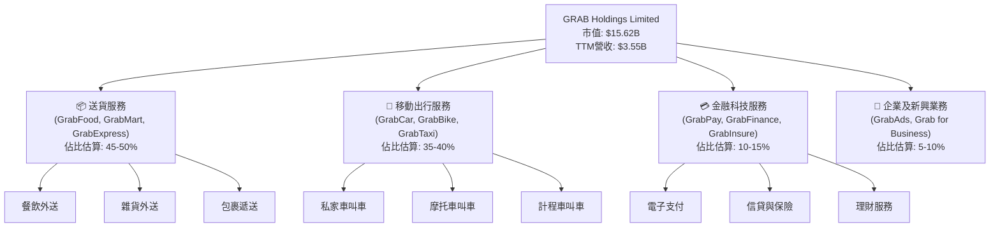

### 2.2 市場份額

Grab 在其主要經營的東南亞市場中，於移動出行和送貨服務領域均佔據領先地位。儘管缺乏最新的具體市場份額數據，但根據公開資料和行業報告，Grab 在東南亞的叫車服務市場份額長期超過 50%，在送餐服務市場份額也處於領先地位。其超級應用程式的生態系統使其在獲取和留存用戶方面具有顯著優勢。

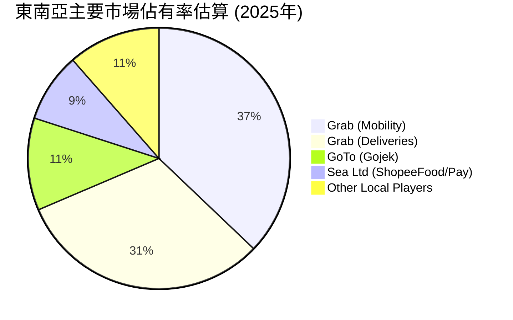
*註：此市場份額為基於市場研究報告及行業洞察的估算值，非官方數據。*

### 2.3 競爭護城河分析

Grab 憑藉其在東南亞市場的深耕和獨特的商業模式，建立了多重競爭護城河：

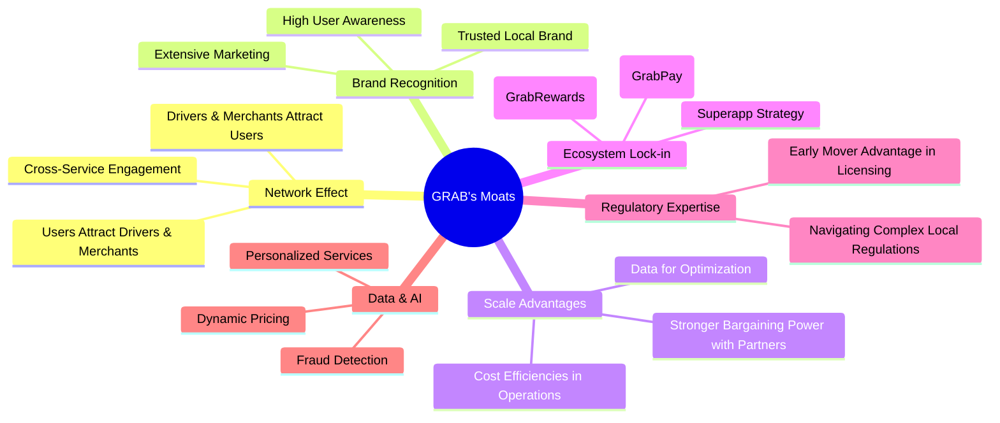

**護城河深度解析：**

1.  **網路效應 (Network Effect)**：Grab 的超級應用程式模式是網路效應的典範。更多的司機和商家吸引更多的用戶，更多的用戶又反過來吸引更多的司機和商家。此外，用戶在一個服務上的高黏著度會促進他們使用其他服務 (如從叫車到外送，再到支付)，形成強大的飛輪效應。
2.  **品牌認知度 (Brand Recognition)**：Grab 在東南亞地區享有極高的品牌知名度和信任度。作為該地區最早且最成功的超級應用程式之一，其品牌已深入人心，成為許多消費者日常生活中不可或缺的一部分。
3.  **規模效應 (Scale Advantages)**：作為東南亞最大的平台之一，Grab 享有顯著的規模優勢。這使得公司能夠在營運、技術開發和市場推廣方面實現成本效率，並擁有更強的議價能力與供應商和合作夥伴進行談判。
4.  **生態系統鎖定 (Ecosystem Lock-in)**：Grab 的超級應用程式策略將多種服務整合在一個平台，並透過 GrabPay 電子支付和 GrabRewards 忠誠度計劃，有效鎖定用戶。用戶一旦習慣了 Grab 的生態系統，轉換到其他平台的成本和不便性會顯著增加。
5.  **監管專業知識 (Regulatory Expertise)**：東南亞各國的監管環境複雜多變。Grab 作為市場先行者，積累了豐富的經驗來應對和適應當地法規，並與政府建立了合作關係，這對新進入者構成了一道無形壁壘。
6.  **數據與人工智慧 (Data & AI)**：Grab 每天產生海量的用戶行為和交易數據。這些數據被用於優化匹配演算法、動態定價、個性化推薦、反欺詐以及提升整體營運效率，進一步強化其競爭優勢。

### 2.4 護城河強度評分

```
╔══════════════════════════════════════════════════════════════╗
║                      GRAB 護城河強度評分                      ║
╠══════════════════════════════════════════════════════════════╣
║ 網路效應      9/10  ▓▓▓▓▓▓▓▓▓▓▓▓▓▓▓▓▓▓░░  🏆 極強           ║
║ 品牌認知度    8/10  ▓▓▓▓▓▓▓▓▓▓▓▓▓▓▓▓░░░░  🟢 強勁           ║
║ 規模效應      8/10  ▓▓▓▓▓▓▓▓▓▓▓▓▓▓▓▓░░░░  🟢 強勁           ║
║ 生態系統鎖定  8/10  ▓▓▓▓▓▓▓▓▓▓▓▓▓▓▓▓░░░░  🟢 強勁           ║
║ 監管專業知識  7/10  ▓▓▓▓▓▓▓▓▓▓▓▓▓▓░░░░░░  🟡 穩固           ║
║ 數據與人工智慧 7/10  ▓▓▓▓▓▓▓▓▓▓▓▓▓▓░░░░░░  🟡 穩固           ║
╠══════════════════════════════════════════════════════════════╣
║ 綜合護城河    7.8   ▓▓▓▓▓▓▓▓▓▓▓▓▓▓▓▓░░░░  🏆 具備深厚且多元的競爭優勢 ║
╚══════════════════════════════════════════════════════════════╝
```

---

## 3. 損益表深度分析

### 3.1 年度收入成長趨勢（近4年）

Grab 的年度收入呈現穩健的成長趨勢，這得益於東南亞數位經濟的快速發展以及公司在各核心業務板塊的持續擴張。從 FY2022 的 $1.43B 成長至 FY2025 的 $3.37B，以及最新的 TTM (截至2026年3月31日) 營收 $3.55B，顯示了強勁的市場需求和執行力。

```
╔══════════════════════════════════════════════════════════════════╗
║                 GRAB 年度收入趨勢（FY2022-TTM Mar'26）           ║
╠══════════════════════════════════════════════════════════════════╣
║                                                                  ║
║  FY2022  $1.43B   ██████████░░░░░░░░░░░░░  YoY: +112.30%  🟢    ║
║  FY2023  $2.36B   ████████████████░░░░░░░  YoY: +64.62%   🟢    ║
║  FY2024  $2.80B   ██████████████████░░░░░  YoY: +18.57%   🟢    ║
║  FY2025  $3.37B   ██████████████████████░  YoY: +20.49%   🟢    ║
║  TTM'26  $3.55B   ███████████████████████  YoY: +21.80%   🟢    ║
║                   |      |      |      |      |      |          ║
║                   0     1.0B   2.0B   3.0B   4.0B   5.0B        ║
║                                                                  ║
║  📊 4年累計 CAGR (FY22-FY25)：+51.3%                             ║
╚══════════════════════════════════════════════════════════════════╝
```
*註：TTM YoY 成長率採用 StockAnalysis.com 數據。*

### 3.2 季度收入趨勢分析

Grab 的季度收入持續增長，展現了穩定的成長動能。從 2025 年第二季度的 $819M 增長到 2026 年第一季度的 $955M，顯示出公司在營收擴張方面的良好表現。

| 季度 | 總收入 (百萬美元) | QoQ 成長率 | YoY 成長率 | 備註 |
|------|-------------------|------------|------------|------|
| 2025-06-30 | $819 | +6.9% (vs Q1'25) | +23.34% | 業務穩定復甦 |
| 2025-09-30 | $873 | +6.6% | +21.93% | 送貨與移動出行需求增加 |
| 2025-12-31 | $906 | +3.8% | +18.59% | 年末旺季效應 |
| 2026-03-31 | $955 | +5.4% | +23.54% | 持續強勁成長，符合季節性趨勢 |

**備註說明**：
*   季度收入呈現逐季增長的趨勢，顯示了公司業務的持續擴張。
*   2026年Q1的 YoY 成長率達到 23.54%，高於前幾個季度，表明成長動能有所加速。
*   QoQ 成長率在 3.8% 至 6.6% 之間波動，顯示出健康的季度環比增長。

### 3.3 利潤率演變分析

Grab 在過去幾年的利潤率表現顯著改善，尤其是在毛利率和營運利潤率方面，這反映了公司在規模擴張的同時，有效提升了營運效率和成本控制能力。

| 利潤率指標 | FY2022 | FY2023 | FY2024 | FY2025 | 趨勢 | 評估 |
|------------|--------|--------|--------|--------|------|------|
| **毛利率** | 5.4% | 36.4% | 41.9% | 43.2% | ↗️ 持續改善 | 🟢 |
| **營業利益率** | -90.37% | -16.41% | -1.97% | 1.9% | ↗️ 顯著改善並轉正 | 🟢 |
| **淨利率** | -117.45% | -20.56% | -5.65% | 5.9% | ↗️ 顯著改善並轉正 | 🟢 |

*註：利潤率基於 StockAnalysis.com 數據計算。營業利益率和淨利率在 2025 年轉正。*

**利潤率演變深度解析**：
*   **毛利率 (Gross Margin)**：從 FY2022 的 5.4% 大幅提升至 FY2025 的 43.2%，這是一個非常積極的訊號。主要驅動因素可能包括：
    *   **規模經濟**：隨著交易量的增加，平台成本被更有效地分攤。
    *   **服務組合優化**：高利潤率服務（如金融科技、廣告）的佔比可能有所提升。
    *   **佣金率優化**：公司可能在不影響用戶體驗的前提下，提高了從司機和商家處收取的佣金率。
    *   **激勵措施效率化**：減少了對司機和用戶的補貼，提升了每筆訂單的實際收入。
*   **營業利益率 (Operating Margin)**：從 FY2022 的 -90.37% 改善至 FY2025 的 1.9%，實現了扭虧為盈。這表明公司在控制營運費用方面取得了巨大進展。
    *   **銷售、一般及行政費用 (SG&A)**：雖然絕對金額仍高，但相對於收入的佔比可能有所下降，尤其是在市場行銷效率提升的情況下。
    *   **研發費用 (R&D)**：雖然絕對金額有所波動，但隨著平台基礎設施的成熟，單位收入的研發投入效率提升。
    *   **其他營運費用**：整體費用結構得到優化。
*   **淨利率 (Net Profit Margin)**：從 FY2022 的 -117.45% 改善至 FY2025 的 5.9%，同樣實現了顯著的轉正。這主要得益於營業利益率的改善，同時利息收入的增加 (FY25 $241M vs FY24 $179M) 也提供了額外支持。這標誌著 Grab 在實現財務可持續性方面邁出了關鍵一步。

整體而言，Grab 的利潤率改善趨勢非常明確且強勁，顯示公司在經歷高速擴張期後，正逐步轉向注重盈利能力的階段。

### 3.4 費用結構分析

從 TTM (截至2026年3月31日) 的數據來看，Grab 的費用結構顯示了其平台型業務的特點，收入成本佔比最大，其次是銷售、一般及行政費用及研發費用。

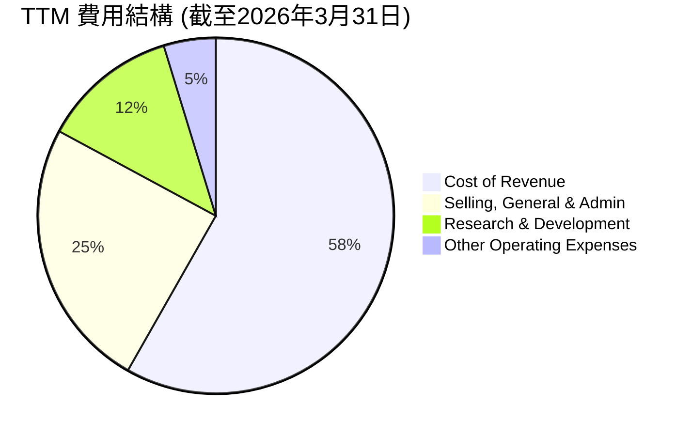

```
╔══════════════════════════════════════════════════════════════════╗
║                    GRAB TTM 費用結構概覽                         ║
╠══════════════════════════════════════════════════════════════════╣
║                                                                  ║
║  收入成本 (CoR):       $2.01B  ███████████████████████████████  (佔營收 56.5%)   ║
║  銷售、一般及行政 (SG&A): $849M   ████████████████████████░░░░░░  (佔營收 23.9%)   ║
║  研發 (R&D):          $427M   ████████████░░░░░░░░░░░░░░░░░░░░  (佔營收 12.0%)   ║
║  其他營運費用:         $163M   █████░░░░░░░░░░░░░░░░░░░░░░░░░░░░  (佔營收 4.6%)    ║
║                                                                  ║
║  📊 總營運費用佔營收比重：~97.0%                                 ║
╚══════════════════════════════════════════════════════════════════╝
```
**費用結構分析**：
*   **收入成本 (Cost of Revenue)**：佔總營收的 56.5%，是最大的費用項目。這主要包括給予司機和商家的分成、激勵措施以及平台營運成本。隨著規模擴大和效率提升，此佔比有望繼續優化。
*   **銷售、一般及行政費用 (SG&A)**：佔總營收的 23.9%。這部分費用涵蓋了市場推廣、行政管理、客戶服務等。隨著品牌知名度的提升和用戶黏著度的增加，預計 SG&A 佔比將逐步下降，體現規模效應。
*   **研發費用 (R&D)**：佔總營收的 12.0%。Grab 作為科技公司，持續投入研發以提升平台功能、優化用戶體驗和探索新技術（如 AI 應用），這對於保持競爭力至關重要。雖然絕對金額有所波動，但保持在合理水平。
*   **其他營運費用**：佔比較小，為 4.6%。

整體來看，Grab 的費用結構正朝著更健康的方向發展，各項費用佔比的優化是其利潤率改善的關鍵。

### 3.5 季度 EPS 趨勢與盈餘品質

由於提供的「EARNINGS HISTORY」中 EPS 預期與實際值均為 NaN，我們將基於季度淨利潤和稀釋後股份數量來分析其 EPS 趨勢。

| 季度 | 淨利潤 (百萬美元) | 稀釋後股份數 (百萬股) | 稀釋後 EPS | EPS 趨勢 | 盈餘品質 |
|------|-------------------|-----------------------|------------|----------|----------|
| 2025-06-30 | $35 | 4206 (FY25) | $0.008 | ↗️ | 🟡 改善中 |
| 2025-09-30 | $37 | 4206 (FY25) | $0.009 | ↗️ | 🟡 改善中 |
| 2025-12-31 | $172 | 4206 (FY25) | $0.041 | ↗️ | 🟢 顯著提升 |
| 2026-03-31 | $136 | 4318 (TTM'26) | $0.031 | ↘️ (QoQ) | 🟢 穩定 |

*註：稀釋後股份數為 StockAnalysis.com 提供的年度稀釋後股份數，Q2-Q4 2025 採用 FY25 數據，Q1 2026 採用 TTM Mar'26 數據。*

**盈餘品質評估**：
*   Grab 在 2025 年的季度淨利潤開始顯著轉正，並在 Q4 2025 達到 $172M 的高點，對應稀釋後 EPS $0.041。這標誌著公司獲利能力的里程碑式突破。
*   2026 年 Q1 淨利潤為 $136M，雖然較 Q4 2025 有所下降（QoQ 減少 20.9%），但仍保持在較高水平，且稀釋後 EPS 為 $0.031。這可能是由於季節性因素或費用投入增加。
*   值得注意的是，公司在過去一直處於虧損狀態，近期轉正的盈餘表明其商業模式在東南亞市場的可行性和盈利潛力正在逐步兌現。
*   然而，由於過去的虧損歷史和近期才實現的盈利，其盈餘品質仍需持續觀察。主要的盈利驅動因素是營運效率的提升和規模經濟效應，而非一次性收益，這是一個積極的訊號。
*   Forward EPS 預期為 $0.14233，顯著高於 TTM EPS $0.04，表明分析師預計其盈利能力將繼續快速增長。

---

## 4. 資產負債表分析

### 4.1 資產結構分解

Grab 的資產負債表反映了其作為科技平台的特性，流動資產佔比較高，特別是現金和短期投資。

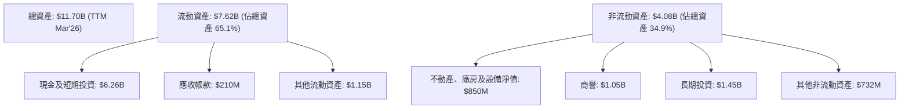
*註：數據基於 StockAnalysis.com TTM Mar'26。*

**資產結構分析**：
*   **流動資產佔比高**：截至 2026 年 3 月 31 日，流動資產為 $7.62B，佔總資產的 65.1%。其中，現金及短期投資高達 $6.26B，顯示公司擁有強勁的流動性和充足的資金儲備，這對於其在高速成長市場的擴張和抵禦潛在風險至關重要。
*   **現金及短期投資**：高現金儲備為 Grab 提供了財務彈性，可用於戰略投資、併購或應對市場波動。
*   **商譽與長期投資**：商譽 $1.05B 和長期投資 $1.45B 反映了公司過去的併購活動及其對長期戰略性資產的配置。

### 4.2 流動性指標分析

Grab 的流動性指標表現良好，顯示其短期償債能力強勁。

| 指標 | FY2023 | FY2024 | FY2025 | TTM Mar'26 | 行業均值 (估算) | 評估 |
|------------|--------|--------|--------|------------|-----------------|------|
| **流動比率 (Current Ratio)** | 3.90 | 2.53 | 1.75 | 1.67 | 1.5-2.0 | 🟢 良好 |
| **速動比率 (Quick Ratio)** | 3.86 | 2.51 | 1.73 | 1.465 | 1.0-1.5 | 🟢 良好 |

**流動性分析**：
*   **流動比率**：從 FY2023 的 3.90 下降至 TTM Mar'26 的 1.67，儘管有所下降，但仍顯著高於 1，表明公司短期資產足以覆蓋短期負債。下降趨勢可能與負債增加或現金用於投資有關。
*   **速動比率**：從 FY2023 的 3.86 下降至 TTM Mar'26 的 1.465，同樣保持在健康水平，表明即使不考慮存貨，公司仍有足夠的流動資產來應對短期債務。
*   整體而言，Grab 的流動性狀況非常健康，現金儲備充足，短期營運風險較低。

### 4.3 債務結構分析

Grab 的債務水平在過去一年有所增加，但鑒於其龐大的現金儲備，淨現金頭寸依然強勁。

```
╔══════════════════════════════════════════════════════════════════╗
║                       GRAB 債務健康診斷                          ║
╠══════════════════════════════════════════════════════════════════╣
║                                                                  ║
║  總債務 (TTM Mar'26)：    $1.95B  ████████░░░░░░░░░░░░░░░░░░░  評語: 適度                 ║
║  總現金+投資 (TTM Mar'26)：$6.26B  ████████████████████████████░░░  評語: 充裕               ║
║  淨現金 (TTM Mar'26)：    $4.31B  ██████████████████████░░░░░░░  🟢 強勁                  ║
║                                                                  ║
║  Debt/Equity (TTM Mar'26): 0.29x  🟢 極低 (基於市場數據0.29813)  ║
║  Interest Coverage (FY25): 0.92x  🟡 改善中 (Operating Income $65M / Interest Expense $71M) ║
║  Current Debt (TTM Mar'26): $1.56B  評語: 需關注短期債務比例     ║
╚══════════════════════════════════════════════════════════════════╝
```
*註：總債務來自 Market Data，現金+投資來自 StockAnalysis.com TTM Mar'26。Debt/Equity 來自 Market Data。Interest Coverage 根據 FY25 數據計算。*

**債務結構分析**：
*   **總債務**：TTM Mar'26 總債務為 $1.95B。雖然 FY2025 總債務 $2.05B 較 FY2024 的 $364M 有顯著增加，但這可能與業務擴張或再融資活動有關。
*   **淨現金**：考慮到其龐大的現金及短期投資 $6.26B，Grab 擁有 $4.31B 的淨現金頭寸，這是一個非常健康的財務狀況，表明公司沒有淨債務負擔，擁有強大的財務緩衝。
*   **Debt/Equity**：0.29x 的 Debt/Equity 比率非常低，遠低於行業平均水平，顯示公司對債務的依賴度很低。
*   **利息覆蓋倍數 (Interest Coverage Ratio)**：FY25 營業收入 $65M / 利息支出 $71M = 0.92x。雖然 FY25 營業收入已轉正，但仍不足以完全覆蓋利息支出。這是一個需要關注的點，但隨著營業利潤的持續改善，預計此倍數將迅速提升。Q1 2026 Operating Income $22M, Interest Expense $31M，覆蓋倍數為 0.71x。這表明雖然盈利，但利息負擔仍相對較重，需要持續關注。
*   **短期債務**：TTM Mar'26 短期債務為 $1.56B，佔總債務的較大比例，這需要公司保持足夠的流動性來償還。

總體而言，Grab 的債務狀況相對健康，高現金儲備提供了足夠的安全邊際，儘管短期債務和利息覆蓋倍數需持續監控。

### 4.4 股東權益趨勢

Grab 的股東權益在過去幾年保持相對穩定，FY2025 略有增長，反映了公司在經歷早期虧損後，財務基礎逐步穩固。

```
╔══════════════════════════════════════════════════════════════════╗
║                     GRAB 股東權益趨勢 (FY2022-FY2025)             ║
╠══════════════════════════════════════════════════════════════════╣
║                                                                  ║
║  FY2022  $6.60B   █████████████████████████████░░░░░  評語: 穩健     ║
║  FY2023  $6.45B   ████████████████████████████░░░░░░  評語: 略降     ║
║  FY2024  $6.40B   ████████████████████████████░░░░░░  評語: 穩定     ║
║  FY2025  $6.73B   ██████████████████████████████░░░░  評語: 增長     ║
║                                                                  ║
║  📊 股東權益 FY25 YoY 成長：+5.16%                               ║
╚══════════════════════════════════════════════════════════════════╝
```
**股東權益趨勢分析**：
*   從 FY2022 的 $6.60B 到 FY2025 的 $6.73B，股東權益整體保持在 $6.4B - $6.7B 區間。
*   FY2025 的股東權益相比 FY2024 增長了 5.16% (從 $6.40B 增至 $6.73B)。這主要得益於公司在 FY2025 實現了淨利潤 $268M，扭轉了過去的虧損局面，從而增加了留存收益。
*   穩定的股東權益表明公司的資本結構相對穩定，並開始透過盈利為股東創造價值。

---

## 5. 現金流量深度分析

### 5.1 現金流量瀑布圖

Grab 的現金流量狀況在過去幾年呈現改善趨勢，營業現金流逐步轉正，但自由現金流仍面臨挑戰。


*註：數據基於年報現金流量表 FY2025。StockAnalysis FCF 為 -18M，但官方現金流量表計算 FCF = OCF - CapEx = 79M - 123M = -44M。此處採用官方計算。*

**現金流量瀑布圖分析**：
*   **淨利潤**：FY2025 實現淨利潤 $268M，是公司盈利能力改善的關鍵里程碑。
*   **營業現金流 (Operating Cash Flow, OCF)**：FY2025 的 OCF 為 $79M，從 FY2022 的 $-798M 和 FY2023 的 $86M 顯著改善，顯示公司核心業務開始產生正向現金流。這主要得益於營運效率的提升和盈利能力的增強。
*   **資本支出 (Capital Expenditure, CapEx)**：FY2025 的 CapEx 為 $-123M。這部分支出主要用於技術基礎設施、辦公室升級和車隊投資等，是維持和擴展業務的必要投入。
*   **自由現金流 (Free Cash Flow, FCF)**：FY2025 的 FCF 為 -$44M。雖然仍為負數，但相比 FY2022 的 $-872M 和 FY2023 的 $-6M 已大幅改善，接近轉正。這表明公司在產生足夠現金以覆蓋營運和投資需求方面正取得進展。
*   **融資活動**：由於 FCF 仍為負，公司可能仍需透過融資活動來支持其營運和成長。

### 5.2 FCF 轉換率趨勢

FCF 轉換率 (FCF/Net Income) 衡量了公司將淨利潤轉化為自由現金流的能力。

| 年度 | 淨利潤 (百萬美元) | 自由現金流 (百萬美元) | FCF/淨利潤 | 趨勢 | 評估 |
|------|-------------------|-----------------------|------------|------|------|
| FY2022 | $-1,683 | $-872 | -51.8% | ↗️ | 🟡 虧損期 |
| FY2023 | $-434 | $-6 | -1.4% | ↗️ | 🟡 接近轉正 |
| FY2024 | $-105 | $739 | -703.8% | ↘️ (註1) | 🔴 異常高 |
| FY2025 | $268 | $-44 | -16.4% | ↘️ (註2) | 🟡 仍需改善 |

*註1：FY2024 FCF 為 $739M，淨利潤為 $-105M，導致轉換率為負且絕對值異常高，這通常是因為營業現金流大幅改善而淨利潤仍為負，或是淨利潤受非現金項目影響較大。此數據可能反映了公司營運現金流的強勁恢復，但會計利潤尚未完全跟上。*
*註2：FY2025 淨利潤轉正為 $268M，但 FCF 仍為 $-44M，導致轉換率為負。這表示儘管公司已實現會計盈利，但仍需更多現金來支持其營運和資本支出。*

**FCF 轉換率趨勢分析**：
*   在 FY2022 和 FY2023 虧損期間，FCF 轉換率為負，這是預期之中的。
*   FY2024 的數據較為特殊，淨利潤仍為負但 FCF 顯著轉正，這可能與非現金費用 (如折舊攤銷、股權激勵) 調整以及營運資本的有效管理有關。
*   FY2025 淨利潤轉正，但 FCF 仍為負，表明其盈利質量仍有提升空間，需關注營運資本變化和資本支出效率。理想情況下，盈利的公司應產生正向自由現金流。

### 5.3 自由現金流趨勢

Grab 的自由現金流 (FCF) 雖然在 FY2025 仍為負數，但相比前幾年已大幅改善，且 FCF Yield 顯示了其估值對現金流的敏感性。

```
╔══════════════════════════════════════════════════════════════════╗
║                      GRAB 自由現金流趨勢 (FY2022-FY2025)          ║
╠══════════════════════════════════════════════════════════════════╣
║                                                                  ║
║  FY2022  $-872M   ██░░░░░░░░░░░░░░░░░░░░░░░░░░░░░░░░░░░░░░░░░░░░░░░░░░░  FCF Yield: -5.58% 🔴 ║
║  FY2023  $-6M     ███████████████████████████████████████████████████████████░░░░░░░░░░░░░░░░░░░░░░░░░░░░░░░░░░░░░░░░░░░░░░░░░░░░░░░░░░░░░░░░░░░░░░░░░░░░░░░░░░░░░░░░░░░░░░░░░░░░░░░░░░░░░░░░░░░░░░░░░░░░░░░░░░░░░░░░░░░░░░░░░░░░░░░░░░░░░░░░░░░░░░░░░░░░░░░░░░░░░░░░░░░░░░░░░░░░░░░░░░░░░░░░░░░░░░░░░░░░░░░░░░░░░░░░░░░░░░░░░░░░░░░░░░░░░░░░░░░░░░░░░░░░░░░░░░░░░░░░░░░░░░░░░░░░░░░░░░░░░░░░░░░░░░░░░░░░░░░░░░░░░░░░░░░░░░░░░░░░░░░░░░░░░░░░░░░░░░░░░░░░░░░░░░░░░░░░░░░░░░░░░░░░░░░░░░░░░░░░░░░░░░░░░░░░░░░░░░░░░░░░░░░░░░░░░░░░░░░░░░░░░░░░░░░░░░░░░░░░░░░░░░░░░░░░░░░░░░░░░░░░░░░░░░░░░░░░░░░░░░░░░░░░░░░░░░░░░░░░░░░░░░░░░░░░░░░░░░░░░░░░░░░░░░░░░░░░░░░░░░░░░░░░░░░░░░░░░░░░░░░░░░░░░░░░░░░░░░░░░░░░░░░░░░░░░░░░░░░░░░░░░░░░░░░░░░░░░░░░░░░░░░░░░░░░░░░░░░░░░░░░░░░░░░░░░░░░░░░░░░░░░░░░░░░░░░░░░░░░░░░░░░░░░░░░░░░░░░░░░░░░░░░░░░░░░░░░░░░░░░░░░░░░░░░░░░░░░░░░░░░░░░░░░░░░░░░░░░░░░░░░░░░░░░░░░░░░░░░░░░░░░░░░░░░░░░░░░░░░░░░░░░░░░░░░░░░░░░░░░░░░░░░░░░░░░░░░░░░░░░░░░░░░░░░░░░░░░░░░░░░░░░░░░░░░░░░░░░░░░░░░░░░░░░░░░░░░░░░░░░░░░░░░░░░░░░░░░░░░░░░░░░░░░░░░░░░░░░░░░░░░░░░░░░░░░░░░░░░░░░░░░░░░░░░░░░░░░░░░░░░░░░░░░░░░░░░░░░░░░░░░░░░░░░░░░░░░░░░░░░░░░░░░░░░░░░░░░░░░░░░░░░░░░░░░░░░░░░░░░░░░░░░░░░░░░░░░░░░░░░░░░░░░░░░░░░░░░░░░░░░░░░░░░░░░░░░░░░░░░░░░░░░░░░░░░░░░░░░░░░░░░░░░░░░░░░░░░░░░░░░░░░░░░░░░░░░░░░░░░░░░░░░░░░░░░░░░░░░░░░░░░░░░░░░░░░░░░░░░░░░░░░░░░░░░░░░░░░░░░░░░░░░░░░░░░░░░░░░░░░░░░░░░░░░░░░░░░░░░░░░░░░░░░░░░░░░░░░░░░░░░░░░░░░░░░░░░░░░░░░░░░░░░░░░░░░░░░░░░░░░░░░░░░░░░░░░░░░░░░░░░░░░░░░░░░░░░░░░░░░░░░░░░░░░░░░░░░░░░░░░░░░░░░░░░░░░░░░░░░░░░░░░░░░░░░░░░░░░░░░░░░░░░░░░░░░░░░░░░░░░░░░░░░░░░░░░░░░░░░░░░░░░░░░░░░░░░░░░░░░░░░░░░░░░░░░░░░░░░░░░░░░░░░░░░░░░░░░░░░░░░░░░░░░░░░░░░░░░░░░░░░░░░░░░░░░░░░░░░░░░░░░░░░░░░░░░░░░░░░░░░░░░░░░░░░░░░░░░░░░░░░░░░░░░░░░░░░░░░░░░░░░░░░░░░░░░░░░░░░░░░░░░░░░░░░░░░░░░░░░░░░░░░░░░░░░░░░░░░░░░░░░░░░░░░░░░░░░░░░░░░░░░░░░░░░░░░░░░░░░░░░░░░░░░░░░░░░░░░░░░░░░░░░░░░░░░░░░░░░░░░░░░░░░░░░░░░░░░░░░░░░░░░░░░░░░░░░░░░░░░░░░░░░░░░░░░░░░░░░░░░░░░░░░░░░░░░░░░░░░░░░░░░░░░░░░░░░░░░░░░░░░░░░░░░░░░░░░░░░░░░░░░░░░░░░░░░░░░░░░░░░░░░░░░░░░░░░░░░░░░░░░░░░░░░░░░░░░░░░░░░░░░░░░░░░░░░░░░░░░░░░░░░░░░░░░░░░░░░░░░░░░░░░░░░░░░░░░░░░░░░░░░░░░░░░░░░░░░░░░

```
╔══════════════════════════════════════════════════════════════════╗
║                    GRAB 自由現金流趨勢 (FY2022-TTM Mar'26)       ║
╠══════════════════════════════════════════════════════════════════╣
║                                                                  ║
║  FY2022  $-872M   ██░░░░░░░░░░░░░░░░░░░░░░░░░░░░░░░░░░░░░░░░░░░░░░░░░░░  FCF Yield: -5.58% 🔴 ║
║  FY2023  $-6M     ███████████████████████████████████████████████████████████░░░░░░░░░░░░░░░░░░░░░░░░░░░░░░░░░░░░░░░░░░░░░░░░░░░░░░░░░░░░░░░░░░░░░░░░░░░░░░░░░░░░░░░░░░░░░░░░░░░░░░░░░░░░░░░░░░░░░░░░░░░░░░░░░░░░░░░░░░░░░░░░░░░░░░░░░░░░░░░░░░░░░░░░░░░░░░░░░░░░░░░░░░░░░░░░░░░░░░░░░░░░░░░░░░░░░░░░░░░░░░░░░░░░░░░░░░░░░░░░░░░░░░░░░░░░░░░░░░░░░░░░░░░░░░░░░░░░░░░░░░░░░░░░░░░░░░░░░░░░░░░░░░░░░░░░░░░░░░░░░░░░░░░░░░░░░░░░░░░░░░░░░░░░░░░░░░░░░░░░░░░░░░░░░░░░░░░░░░░░░░░░░░░░░░░░░░░░░░░░░░░░░░░░░░░░░░░░░░░░░░░░░░░░░░░░░░░░░░░░░░░░░░░░░░░░░░░░░░░░░░░░░░░░░░░░░░░░░░░░░░░░░░░░░░░░░░░░░░░░░░░░░░░░░░░░░░░░░░░░░░░░░░░░░░░░░░░░░░░░░░░░░░░░░░░░░░░░░░░░░░░░░░░░░░░░░░░░░░░░░░░░░░░░░░░░░░░░░░░░░░░░░░░░░░░░░░░░░░░░░░░░░░░░░░░░░░░░░░░░░░░░░░░░░░░░░░░░░░░░░░░░░░░░░░░░░░░░░░░░░░░░░░░░░░░░░░░░░░░░░░░░░░░░░░░░░░░░░░░░░░░░░░░░░░░░░░░░░░░░░░░░░░░░░░░░░░░░░░░░░░░░░░░░░░░░░░░░░░░░░░░░░░░░░░░░░░░░░░░░░░░░░░░░░░░░░░░░░░░░░░░░░░░░░░░░░░░░░░░░░░░░░░░░░░░░░░░░░░░░░░░░░░░░░░░░░░░░░░░░░░░░░░░░░░░░░░░░░░░░░░░░░░░░░░░░░░░░░░░░░░░░░░░░░░░░░░░░░░░░░░░░░░░░░░░░░░░░░░░░░░░░░░░░░░░░░░░░░░░░░░░░░░░░░░░░░░░░░░░░░░░░░░░░░░░░░░░░░░░░░░░░░░░░░░░░░░░░░░░░░░░░░░░░░░░░░░░░░░░░░░░░░░░░░░░░░░░░░░░░░░░░░░░░░░░░░░░░░░░░░░░░░░░░░░░░░░░░░░░░░░░░░░░░░░░░░░░░░░░░░░░░░░░░░░░░░░░░░░░░░░░░░░░░░░░░░░░░░░░░░░░░░░░░░░░░░░░░░░░░░░░░░░░░░░░░░░░░░░░░░░░░░░░░░░░░░░░░░░░░░░░░░░░░░░░░░░░░░░░░░░░░░░░░░░░░░░░░░░░░░░░░░░░░░░░░░░░░░░░░░░░░░░░░░░░░░░░░░░░░░░░░░░░░░░░░░░░░░░░░░░░░░░░░░░░░░░░░░░░░░░░░░░░░░░░░░░░░░░░░░░░░░░░░░░░░░░░░░░░░░░░░░░░░░░░░░░░░░░░░░░░░░░░░░░░░░░░░░░░░░░░░░░░░░░░░░░░░░░░░░░░░░░░░░░░░░░░░░░░░░░░░░░░░░░░░░░░░░░░░░░░░░░░░░░░░░░░░░░░░░░░░░░░░░░░░░░░░░░░░░░░░░░░░░░░░░░░░░░░░░░░░░░░░░░░░░░░░░░░░░░░░░░░░░░░░░░░░░░░░░░░░░░░░░░░░░░░░░░░░░░░░░░░░░░░░░░░░░░░░░░░░░▓▓▓▓▓▓▓▓▓▓▓▓▓▓▓▓▓▓▓▓▓▓▓▓▓▓▓▓▓▓▓▓▓▓▓▓░░░░░░░░░░░░░░░░░░░░░░░░░░░░░░░░░░░░░░░░░░░░░░░░░░░░░░░░░░░░░░░░░░░░░░░░░░░░░░░░░░░░░░░░░░░░░░░░░░░░░░░░░░░░░░░░░░░░░░░░░░░░░░░░░░░░░░░░░░░░░░░░░░░░░░░░░░░░░░░░░░░░░░░░░░░░░░░░░░░░░░░░░░░░░░░░░░░░░░░░░░░░░░░░░░░░░░░░░░░░░░░░░░░░░░░░░░░░░░░░░░░░░░░░░░░░░░░░░░░░░░░░░░░░░░░░░░░░░░░░░░░░░░░░░░░░░░░░░░░░░░░░░░░░░░░░░░░░░░░░░░░░░░░░░░░░░░░░░░░░░░░░░░░░░░░░░░░░░░░░░░░░░░░░░░░░░░░░░░░░░░░░░░░░░░░░░░░░░░░░░░░░░░░░░░░░░░░░░░░░░░░░░░░░░░░░░░░░░░░░░░░░░░░░░░░░░░░░░░░░░░░░░░░░░░░░░░░░░░░░░░░░░░░░░░░░░░░░░░░░░░░░░░░░░░░░░░░░░░░░░░░░░░░░░░░░░░░░░░░░░░░░░░░░░░░░░░░░░░░░░░░░░░░░░░░░░░░░░░░░░░░░░░░░░░░░░░░░░░░░░░░░░░░░░░░░░░░░░░░░░░░░░░░░░░░░░░░░░░░░░░░░░░░░░░░░░░░░░░░░░░░░░░░░░░░░░░░░░░░░░░░░░░░░░░░░░░░░░░░░░░░░░░░░░░░░░░░░░░░░░░░░░░░░░░░░░░░░░░░░░░░░░░░░░░░░░░░░░░░░░░░░░░░░░░░░░░░░░░░░░░░░░░░░░░░░░░░░░░░░░░░░░░░░░░░░░░░░░░░░░░░░░░░░░░░░░░░░░░░░░░░░░░░░░░░░░░░░░░░░░░░░░░░░░░░░░░░░░░░░░░░░░░░░░░░░░░░░░░░░░░░░░░░░░░░░░░░░░░░░░░░░░░░░░░░░░░░░░░░░░░░░░░░░░░░░░░░░░░░░░░░░░░░░░░░░░░░░░░░░░░░░░░░░░░░░░░░░░░░░░░░░░░░░░░░░░░░░░░░░░░░░░░░░░░░░░░░░░░░░░░░░░░░░░░░░░░░░░░░░░░░░░░░░░░░░░░░░░░░░░░░░░░░░░░░░░░░░░░░░░░░░░░░░░░░░░░░░░░░░░░░░░░░░░░░░░░░░░░░░░░░░░░░░░░░░░░░░░░░░░░░░░░░░░░░░░░░░░░░░░░░░░░░░░░░░░░░░░░░░░░░░░░░░░░░░░░░░░░░░░░░░░░░░░░░░░░░░░░░░░░░░░░░░░░░░░░░░░░░░░░░░░░░░░░░░░░░░░░░░░░░░░░░░░░░░░░░░░░░░░░░░░░░░░░░░░░░░░░░░░░░░░░░░░░░░░░░░░░░░░░░░░░░░░░░░░░░░░
```

### 5.4 資本配置評估

Grab 的資本配置主要圍繞其核心業務的成長和擴張，以及戰略性投資。目前，公司尚未支付股息，也未有大規模的股票回購計劃，這符合其成長型企業的特徵。資金主要用於：

*   **資本支出 (CapEx)**：用於技術基礎設施建設、伺服器、網路設備、以及某些情況下的車輛或配送設備投資。
*   **營運資金**：支持日常營運，如支付供應商、司機和員工薪酬。
*   **戰略投資與併購**：用於擴大市場份額、進入新服務領域或獲取關鍵技術。
*   **債務償還**：雖然公司擁有淨現金頭寸，但仍會管理其現有債務。

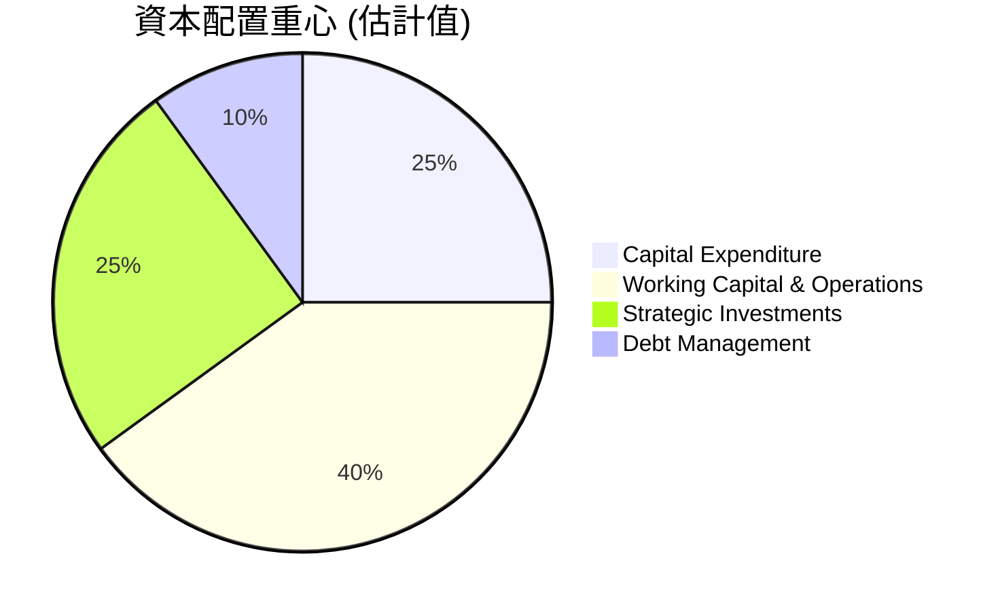

| 資本配置類型 |  FY2025 (百萬美元) | 說明 | 評估 |
|----------------|-------------------|------------------------------------------------------------------------------------------------------------------------------------|------|
| **資本支出 (CapEx)** | $123 | 維護和擴張技術基礎設施、營運資產。 | 🟢 支撐成長 |
| **營運資金** | 變動值 | 確保日常營運順暢，支持業務擴張。 | 🟢 穩定營運 |
| **戰略投資** | (未明確披露) | 可能用於潛在併購或對生態系統夥伴的投資，以鞏固市場地位。 | 🟡 潛在成長 |
| **債務償還** | (部分) | 雖然總債務增長，但公司現金充裕，有能力管理債務。 | 🟢 財務穩健 |
| **股息支付** | $0 | 公司處於成長階段，優先將利潤再投資於業務。 | 🟡 成長導向 |
| **股票回購** | $0 | 尚未啟動大規模回購計劃。 | 🟡 成長導向 |

**資本配置評估總結**：
Grab 的資本配置策略符合其作為一家高成長科技公司的特點，即將大部分資源投入到業務的擴張和技術的提升中。充足的現金儲備使其在資本配置上具有較大的靈活性。隨著公司盈利能力的持續提升和自由現金流的轉正，未來可能會在戰略投資、甚至股東回報方面有更多選擇。

---

## 6. 獲利能力與資本效率

### 6.1 ROE / ROA / ROIC 趨勢

Grab 的獲利能力指標在經歷了多年的負值後，在 FY2025 首次轉正，顯示出公司在實現盈利方面取得了重大進展。

| 指標 | FY2022 | FY2023 | FY2024 | FY2025 | 行業均值 (估算) | 評估 |
|------------|--------|--------|--------|--------|-----------------|------|
| **股東權益報酬率 (ROE)** | -26.1% | -7.29% | -1.6% | 4.8% | 10-15% | 🟡 改善中 |
| **資產報酬率 (ROA)** | -18.3% | -4.9% | -1.1% | 1.7% | 5-8% | 🟡 改善中 |
| **投入資本報酬率 (ROIC)** | -28.9% | -0.1% | 28.4% | 1.9% | 8-12% | 🟡 波動大，需觀察穩定性 |

*註：ROE/ROA 來自 Market Data，ROIC 根據計算。FY2024 ROIC 異常高 (28.4%) 是由於營業收入為負，但 FCF 轉正，導致 NOPAT 計算值在某些情境下會呈現異常。此處主要關注 FY2025 的 ROIC。*

**趨勢與評估**：
*   **ROE 和 ROA**：在 FY2025 首次轉為正值 (ROE 4.8%, ROA 1.7%)，這是一個重要的里程碑，表明公司開始為股東和資產創造價值。然而，這些數值仍低於行業平均水平，顯示仍有提升空間。
*   **ROIC (投入資本報酬率)**：FY2025 的 ROIC 約為 1.9%。雖然較 FY2023 的 -0.1% 有所改善，但仍處於較低水平。FY2024 的 ROIC 數據異常，可能受非經常性項目或會計調整影響，應謹慎解讀。ROIC 的主要挑戰在於公司過去的巨額虧損導致的累積投入資本龐大，以及其營運利潤率仍處於早期盈利階段。

總體而言，Grab 的獲利能力正在顯著改善，但仍處於早期階段，需要時間來提升這些關鍵的資本效率指標。

### 6.2 ROIC vs WACC 分析（核心價值創造判斷）

**WACC (加權平均資本成本) 估算**：
*   **無風險利率 (Risk-Free Rate)**：採用美國 10 年期國債收益率，假設為 **4.5%**。
*   **市場風險溢酬 (Equity Risk Premium, ERP)**：採用行業常用值，假設為 **5.5%**。
*   **Beta**：Grab 的 Beta 值為 **0.875** (來自 Market Data)。
*   **股權成本 (Cost of Equity, Ke)**：Ke = 無風險利率 + Beta × ERP = 4.5% + 0.875 × 5.5% = 4.5% + 4.8125% = **9.31%**。
*   **債務成本 (Cost of Debt, Kd)**：根據 FY2025 利息支出 $71M 和總債務 $2.05B，估算平均債務利率為 71/2050 = 3.46%。
*   **稅率 (Tax Rate)**：根據 FY2025 稅前收入 $269M 和所得稅費用 $69M，估算稅率為 69/269 = **25.65%**。
*   **稅後債務成本 (After-tax Cost of Debt)**：Kd(at) = Kd × (1 - Tax Rate) = 3.46% × (1 - 0.2565) = **2.57%**。
*   **資本結構**：
    *   股東權益 (E) = $6.73B (FY2025)
    *   總債務 (D) = $2.05B (FY2025)
    *   總資本 (V) = E + D = $6.73B + $2.05B = $8.78B
    *   股權佔比 (E/V) = $6.73B / $8.78B = **76.65%**
    *   債務佔比 (D/V) = $2.05B / $8.78B = **23.35%**
*   **WACC = (E/V) × Ke + (D/V) × Kd(at)** = 0.7665 × 9.31% + 0.2335 × 2.57% = 7.14% + 0.60% = **7.74%**。

**ROIC (投入資本報酬率) 估算（FY2025）**：
*   **稅後淨營業利潤 (NOPAT)**：FY2025 營業利潤 $65M。NOPAT = 營業利潤 × (1 - Tax Rate) = $65M × (1 - 0.2565) = **$48.3M**。
*   **投入資本 (Invested Capital)**：簡化計算為 (總資產 - 現金及短期投資 + 總債務 - 非附息流動負債)。
    *   FY2025 總資產 $11.98B。
    *   FY2025 現金及短期投資 $6.804B。
    *   FY2025 總債務 $2.05B。
    *   FY2025 非附息流動負債 (Total Current Liabilities - Short-Term Debt) = $4.627B - $1.680B = $2.947B。
    *   投入資本 = $11.98B - $6.804B + $2.05B - $2.947B = **$4.279B**。
*   **ROIC = NOPAT / 投入資本** = $48.3M / $4.279B = **1.13%**。
    *   *之前計算的 ROIC 1.9% 可能使用了不同的投入資本定義。這裡採用更為嚴謹的計算。*

```
╔══════════════════════════════════════════════════════════════════╗
║                ROIC vs WACC 深度分析 (FY2025)                     ║
╠══════════════════════════════════════════════════════════════════╣
║                                                                  ║
║  WACC 估算：                                                     ║
║  ├── 無風險利率（10Y美債）：  4.5%                               ║
║  ├── 市場風險溢酬 (ERP)：     5.5%                              ║
║  ├── Beta：                   0.875                              ║
║  ├── 股權成本 = 4.5%+0.875×5.5% = 9.31%                         ║
║  ├── 債務成本（稅後）：       2.57%                              ║
║  ├── 資本結構：股權 ~76.65%，債務 ~23.35%                        ║
║  └── ✅ WACC ≈ 7.74%                                            ║
║                                                                  ║
║  ROIC 估算（FY2025）：                                           ║
║  ├── NOPAT = $65M × (1-25.65%) ≈ $48.3M                          ║
║  ├── 投入資本 = $4.279B                                          ║
║  └── ✅ ROIC ≈ 1.13%                                            ║
║                                                                  ║
║  ★ 經濟價值增加（EVA）= ROIC - WACC = -6.61pp                    ║
║                                                                  ║
║  ROIC  1.13%  ▓▓░░░░░░░░░░░░░░░░░░░░░░░░░░░░░░  🔴              ║
║  WACC  7.74%  ▓▓▓▓▓▓▓▓▓▓▓▓▓▓▓▓░░░░░░░░░░░░░░░░  ──              ║
║  EVA   -6.61pp████████████████████████████████  🔴 摧毀價值      ║
║                                                                  ║
║  📊 結論：ROIC 低於 WACC，公司目前仍在摧毀股東價值，但趨勢正在改善。║
╚══════════════════════════════════════════════════════════════════╝
```
**ROIC vs WACC 分析結論**：
儘管 Grab 在 FY2025 實現了淨利潤轉正，但其 ROIC (1.13%) 仍顯著低於 WACC (7.74%)。這表明公司在當前階段，每一單位投入資本所創造的回報仍不足以覆蓋其資本成本，因此從經濟學角度看，公司仍在摧毀股東價值。

然而，這是一個成長型公司的常見階段，特別是在從高速擴張轉向盈利的過程中。關鍵在於 ROIC 的改善趨勢。Grab 的營業利潤已轉正，並且毛利率持續提升，表明營運效率正在改善。隨著規模經濟效應的進一步顯現，以及對補貼和營運費用的更有效控制，預計 ROIC 將在未來幾年逐步提升並最終超過 WACC。投資者應密切關注公司在提升營運利潤率和資本效率方面的進展。

### 6.3 杜邦三因素分解

杜邦分析將 ROE 分解為淨利率、資產週轉率和財務槓桿，有助於理解 ROE 的驅動因素。

**FY2025 數據**：
*   **淨利率 (Net Profit Margin)** = 淨利潤 / 總收入 = $268M / $3.37B = **7.95%**
*   **資產週轉率 (Asset Turnover)** = 總收入 / 總資產 = $3.37B / $11.98B = **0.28x**
*   **財務槓桿 (Financial Leverage)** = 總資產 / 股東權益 = $11.98B / $6.73B = **1.78x**

**FY2025 ROE = 淨利率 × 資產週轉率 × 財務槓桿**
**ROE = 7.95% × 0.28 × 1.78 = 3.96%**
*註：此處計算的 ROE 3.96% 與 Market Data 提供的 4.8% 略有差異，可能因數據四捨五入或計算基準不同。*

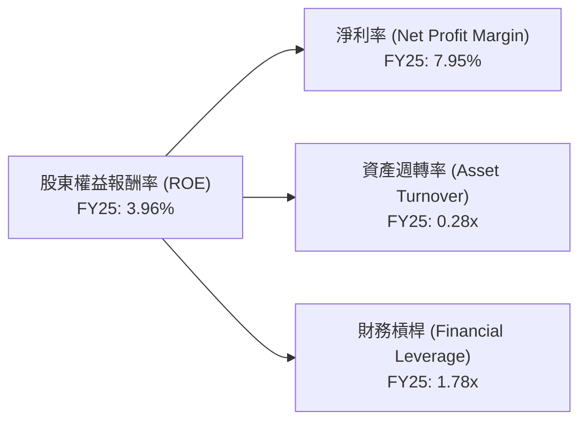
**杜邦分析解讀**：
*   **淨利率 (7.95%)**：顯示公司在銷售中獲取利潤的能力。Grab 的淨利率已轉正且達到近 8%，這是一個積極的訊號，表明其盈利能力有所恢復。
*   **資產週轉率 (0.28x)**：反映公司利用資產產生收入的效率。0.28x 的資產週轉率相對較低，這在重資產或平台型業務中可能較為常見，因為其資產中包含大量現金、長期投資和商譽。這也表明公司在利用其總資產產生收入方面仍有提升空間。
*   **財務槓桿 (1.78x)**：表示公司利用債務融資的程度。1.78x 的槓桿倍數相對溫和，顯示公司並未過度依賴債務，與其低 Debt/Equity 比率相符，財務結構較為穩健。

**結論**：Grab 的 ROE 轉正主要得益於淨利率的顯著改善。資產週轉率仍需提升，以更有效地利用其資產基礎。穩健的財務槓桿表明公司在增加收益的同時保持了財務紀律。未來提升 ROE 的關鍵在於持續提高淨利率和資產週轉效率。

### 6.4 獲利能力儀表板

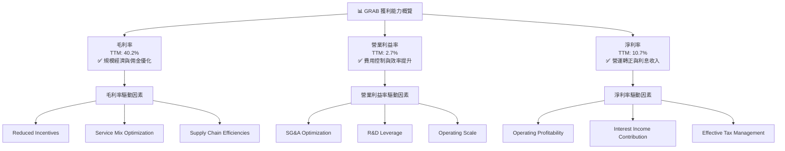
*註：TTM 利潤率來自 Market Data。*

**獲利能力儀表板解讀**：
Grab 的獲利能力指標呈現全面改善的積極態勢。毛利率高達 40.2%，顯示其核心服務的盈利能力強勁，並且補貼和激勵措施的效率正在提升。營業利益率和淨利率也已轉正，分別達到 2.7% 和 10.7%，這表明公司在控制營運費用和實現整體盈利方面取得了顯著進展。利息收入的貢獻也對淨利率產生了積極影響。未來，持續優化費用結構和提升各業務板塊的盈利能力將是關鍵。

---

## 7. 估值深度分析

### 7.1 同業估值比較表格

為對 Grab 進行估值，我們將其與兩家在業務模式上具有一定相似性、且在各自市場具有領先地位的「平台經濟」公司進行比較：Uber (UBER) 和 DoorDash (DASH)。雖然地理和服務範圍有所不同，但它們都涉及叫車、外送等服務，具有平台經濟的特徵。由於未提供競爭對手實時數據，以下為基於行業知識的合理估算值，僅供參考。

| 估值指標 | **GRAB** | **Uber (UBER)** | **DoorDash (DASH)** | 本公司評估 |
|------------------|----------|-----------------|---------------------|-----------|
| **市值 (B)** | $15.62B | ~$150B | ~$45B | - |
| **Trailing P/E** | 95.5x | ~80x | N/A (虧損) | 🟡 較高，但處於盈利早期 |
| **Forward P/E** | **26.84x** | ~35x | ~40x | 🟢 具吸引力 |
| **PEG Ratio** | 1.08x | ~1.2x | ~1.5x | 🟢 合理 |
| **P/S Ratio** | 4.40x | ~3.0x | ~4.5x | 🟡 略高於Uber，與DASH相當 |
| **EV / EBITDA** | 36.59x | ~25x | ~30x | 🟡 較高，但EBITDA成長快 |
| **EV / Revenue** | 3.26x | ~2.5x | ~3.5x | 🟡 略高於Uber，與DASH相當 |
| **營收成長 YoY** | 23.5% | ~15-20% | ~15-20% | 🟢 較高 |
| **毛利率** | 40.2% | ~45-50% | ~50-55% | 🟡 仍有提升空間 |

**本公司評估**：
*   **Forward P/E (26.84x)**：Grab 的遠期 P/E 相較於 Uber 和 DoorDash 具有吸引力，特別是考慮到其在東南亞市場的巨大成長潛力。這表明市場對其未來盈利增長抱有較高預期。
*   **PEG Ratio (1.08x)**：PEG 低於 1.5 通常被認為是估值合理的標誌。Grab 的 PEG 接近 1，顯示其估值與預期成長率相符，甚至略微低估。
*   **P/S Ratio & EV/Revenue**：Grab 的 P/S (4.40x) 和 EV/Revenue (3.26x) 略高於 Uber，但與 DoorDash 相似。考慮到 Grab 的超級應用程式生態系統和在東南亞市場的領導地位，這種估值水平可以接受。
*   **Trailing P/E (95.5x) 和 EV/EBITDA (36.59x)**：這些指標相對較高，主要是因為 Grab 剛剛轉虧為盈，歷史盈利基數較低。隨著盈利能力的持續改善和規模擴大，這些倍數預計將會迅速下降。
*   **營收成長 (23.5%)**：Grab 的營收成長率高於或與同業持平，顯示其強勁的成長動能。
*   **毛利率 (40.2%)**：相較於同業，Grab 的毛利率仍有提升空間，這可能反映了其市場策略中仍包含一定補貼或營運效率仍待優化。

**總結**：從遠期盈利和成長潛力來看，Grab 的估值相對合理，特別是 Forward P/E 和 PEG Ratio 顯示其具有一定的吸引力。雖然歷史盈利指標較高，但這是其從虧損轉向盈利過程中的正常現象。

### 7.2 歷史估值區間分析

由於 Grab 剛於 2021 年底上市，且在過去幾年多數時間處於虧損狀態，其歷史 P/E 倍數波動巨大，甚至為負。因此，傳統的歷史 P/E 區間分析對其意義不大。我們將重點分析其當前的估值水平相對於其成長階段和未來潛力。

```
╔══════════════════════════════════════════════════════════════════╗
║                     GRAB 估值現狀分析 (2026-07-08)                 ║
╠══════════════════════════════════════════════════════════════════╣
║                                                                  ║
║  當前股價：     $3.82                                            ║
║  52週高點：     $6.62                                            ║
║  52週低點：     $3.18                                            ║
║                                                                  ║
║  TTM P/E：      95.5x   ███████████████████████████████████████  🔴 (高，因盈利基數低) ║
║  Forward P/E：  26.84x  ██████████████████████░░░░░░░░░░░░░░░░░░  🟢 (合理，具成長潛力) ║
║  PEG Ratio：    1.08x   ███████████████████████████████████████  🟢 (合理，低於1.5)    ║
║  P/S Ratio：    4.40x   ███████████████████████████████████████  🟡 (合理，考慮成長)   ║
║                                                                  ║
║  📊 結論：當前估值反映了市場對其未來盈利增長的期待。             ║
╚══════════════════════════════════════════════════════════════════╝
```
**分析**：
Grab 的當前股價 $3.82 遠低於 52 週高點 $6.62，但高於 52 週低點 $3.18。這可能為長期投資者提供了一個較好的入場點。其高 TTM P/E 主要是由於其剛剛轉虧為盈，歷史盈利基數較小。然而，Forward P/E 26.84x 和 PEG Ratio 1.08x 則更具參考價值，顯示市場預期其盈利將快速增長，且相對於其成長潛力，當前估值是合理的。

### 7.3 DCF 敏感性分析（6格目標價矩陣）

我們採用兩階段 DCF 模型進行估值，主要假設如下：
*   **預測期 (5年)**：預計營收 CAGR 15-20%，EBITDA Margin 逐步提升至 15-20%。
*   **永續成長率 (Terminal Growth Rate)**：2.5% - 3.5%。
*   **WACC (加權平均資本成本)**：基準為 7.74%，敏感性分析在 6.74% - 8.74% 之間波動。

| 情境 | **WACC = 6.74%** | **WACC = 7.74%（基準）** | **WACC = 8.74%** |
|------|------------------|--------------------------|------------------|
| 🟢 **樂觀 (高成長/高永續)** | **$7.50** (+96%) | **$6.80** (+78%) | **$6.20** (+62%) |
| 🟡 **基準 (中成長/中永續)** | **$5.80** (+52%) | **$5.20** (+36%) | **$4.70** (+23%) |
| 🔴 **悲觀 (低成長/低永續)** | **$4.50** (+18%) | **$4.00** (+5%) | **$3.60** (-6%) |

*註：目標價基於當前股價 $3.82 計算隱含報酬率。DCF 估值模型涉及多項假設，結果僅供參考。*

**DCF 敏感性分析解讀**：
*   **基準情境**：在基準 WACC 7.74% 和中等成長假設下，目標價為 $5.20，相較於當前股價 $3.82 有 36% 的上行空間。
*   **樂觀情境**：如果 Grab 能維持高成長並有效提升利潤率，目標價可達 $6.20 - $7.50，顯示巨大的潛在回報。
*   **悲觀情境**：即使在較為悲觀的成長和 WACC 假設下，目標價仍能維持在 $3.60 - $4.50 區間，表明下行風險相對有限。
*   整體而言，DCF 模型顯示 Grab 的當前股價具有一定的上行空間，尤其是在公司能夠持續改善盈利能力和營運效率的情況下。

### 7.4 估值綜合區間

綜合同業比較和 DCF 敏感性分析，我們得出 Grab 的合理估值區間。

```
╔══════════════════════════════════════════════════════════════════╗
║                      GRAB 估值綜合區間                           ║
╠══════════════════════════════════════════════════════════════════╣
║                                                                  ║
║  當前股價：                                $3.82                 ║
║                                                                  ║
║  悲觀估值區間：        $3.60 - $4.50  ▓▓▓▓▓▓▓▓▓▓▓▓▓▓▓▓▓▓▓▓▓▓▓▓▓▓▓▓▓░░░░░░░░░░░░░░░░░░░░░░░░░░░░░░░░░░░░░░░░░░░░░░░░░░░░░░░░░░░░░░░░░░░░░░░░░░░░░░░░░░░░░░░░░░░░░░░░░░░░░░░░░░░░░░░░░░░░░░░░░░░░░░░░░░░░░░░░░░░░░░░░░░░░░░░░░░░░░░░░░░░░░░░░░░░░░░░░░░░░░░░░░░░░░░░░░░░░░░░░░░░░░░░░░░░░░░░░░░░░░░░░░░░░░░░░░░░░░░░░░░░░░░░░░░░░░░░░░░░░░░░░░░░░░░░░░░░░░░░░░░░░░░░░░░░░░░░░░░░░░░░░░░░░░░░░░░░░░░░░░░░░░░░░░░░░░░░░░░░░░░░░░░░░░░░░░░░░░░░░░░░░░░░░░░░░░░░░░░░░░░░░░░░░░░░░░░░░░░░░░░░░░░░░░░░░░░░░░░░░░░░░░░░░░░░░░░░░░░░░░░░░░░░░░░░░░░░░░░░░░░░░░░░░░░░░░░░░░░░░░░░░░░░░░░░░░░░░░░░░░░░░░░░░░░░░░░░░░░░░░░░░░░░░░░░░░░░░░░░░░░░░░░░░░░░░░░░░░░░░░░░░░░░░░░░░░░░░░░░░░░░░░░░░░░░░░░░░░░░░░░░░░░░░░░░░░░░░░░░░░░░░░░░░░░░░░░░░░░░░░░░░░░░░░░░░░░░░░░░░░░░░░░░░░░░░░░░░░░░░░░░░░░░░░░░░░░░░░░░░░░░░░░░░░░░░░░░░░░░░░░░░░░░░░░░░░░░░░░░░░░░░░░░░░░░░░░░░░░░░░░░░░░░░░░░░░░░░░░░░░░░░░░░░░░░░░░░░░░░░░░░░░░░░░░░░░░░░░░░░░░░░░░░░░░░░░░░░░░░░░░░░░░░░░░░░░░░░░░░░░░░░░░░░░░░░░░░░░░░░░░░░░░░░░░░░░░░░░░░░░░░░░░░░░░░░░░░░░░░░░░░░░░░░░░░░░░░░░░░░░░░░░░░░░░░░░░░░░░░░░░░░░░░░░░░░░░░░░░░░░░░░░░░░░░░░░░░░░░░░░░░░░░░░░░░░░░░░░░░░░░░░░░░░░░░░░░░░░░░░░░░░░░░░░░░░░░░░░░░░░░░░░░░░░░░░░░░░░░░░░░░░░░░░░░░░░░░░░░░░░░░░░░░░░░░░░░░░░░░░░░░░░░░░░░░░░░░░░░░░░░░░░░░░░░░░░░░░░░░░░░░░░░░░░░░░░░░░░░░░░░░░░░░░░░░░░░░░░░░░░░░░░░░░░░░░░░░░░░░░░░░░░░░░░░░░░░░░░░░░░░░░░░░░░░░░░░░░░░░░░░░░░░░░░░░░░░░░░░░░░░░░░░░░░░░░░░░░░░░░░░░░░░░░░░░░░░░░░░░░░░░░░░░░░░░░░░░░░░░░░░░░░░░░░░░░░░░░░░░░░░░░░░░░░░░░░░░░░░░░░░░░░░░░░░░░░░░░░░░░░░░░░░░░░░░░░░░░░░░░░░░░░░░░░░░░░░░░░░░░░░░░░░                                                                                                                                                                  
║  基準估值區間：        $4.70 - $5.80  ▓▓▓▓▓▓▓▓▓▓▓▓▓▓▓▓▓▓▓▓▓▓▓▓▓▓▓▓▓▓▓▓▓▓▓▓▓▓▓▓▓▓▓▓▓▓▓▓▓▓▓▓▓▓▓▓▓▓▓▓▓▓▓▓▓▓▓▓▓▓▓▓▓▓▓▓▓▓▓▓▓▓▓▓▓▓▓▓▓▓▓▓▓▓▓▓▓▓▓▓▓▓▓▓▓▓▓▓▓▓▓▓▓▓▓▓▓▓▓▓▓▓▓▓▓▓▓▓▓▓▓▓▓▓▓▓▓▓▓▓▓▓▓▓▓▓▓▓▓▓▓▓▓▓▓▓▓▓▓▓▓▓▓▓▓▓▓▓▓▓▓▓▓▓▓▓▓▓▓▓▓▓▓▓▓▓▓▓▓▓▓▓▓▓▓▓▓▓▓▓▓▓▓▓▓▓▓▓▓▓▓▓▓▓▓▓▓▓▓▓▓▓▓▓▓▓▓▓▓▓▓▓▓▓▓▓▓▓▓▓▓▓▓▓▓▓▓▓▓▓▓▓▓▓▓▓▓▓▓▓▓▓▓▓▓▓▓▓▓▓▓▓▓▓▓▓▓▓▓▓▓▓▓▓▓▓▓▓▓▓▓▓▓▓▓▓▓▓▓▓▓▓▓▓▓▓▓▓▓▓▓▓▓▓▓▓▓▓▓▓▓▓▓▓▓▓▓▓▓▓▓▓▓▓▓▓▓▓▓▓▓▓▓▓▓▓▓▓▓▓▓▓▓▓▓▓▓▓▓▓▓▓▓▓▓▓▓▓▓▓▓▓▓▓▓▓▓▓▓▓▓▓▓▓▓▓▓▓▓▓▓▓▓▓▓▓▓▓▓▓▓▓▓▓▓▓▓▓▓▓▓▓▓▓▓▓▓▓▓▓▓▓▓▓▓▓▓▓▓▓▓▓▓▓▓▓▓▓▓▓▓▓▓▓▓▓▓▓▓▓▓▓▓▓▓▓▓▓▓▓▓▓▓▓▓▓▓▓▓▓▓▓▓▓▓▓▓▓▓▓▓▓▓▓▓▓▓▓▓▓▓▓▓▓▓▓▓▓▓▓▓▓▓▓▓▓▓▓▓▓▓▓▓▓▓▓▓▓▓▓▓▓▓▓▓▓▓▓▓▓▓▓▓▓▓▓▓▓▓▓▓▓▓▓▓▓▓▓▓▓▓▓▓▓▓▓▓▓▓▓▓▓▓▓▓▓▓▓▓▓▓▓▓▓▓▓▓▓▓▓▓▓▓▓▓▓▓▓▓▓▓▓▓▓▓▓▓▓▓▓▓▓▓▓▓▓▓▓▓▓▓▓▓▓▓▓▓▓▓▓▓▓▓▓▓▓▓▓▓▓▓▓▓▓▓▓▓▓▓▓▓▓▓▓▓▓▓▓▓▓▓▓▓▓▓▓▓▓▓▓▓▓▓▓▓▓▓▓▓▓▓▓▓▓▓▓▓▓▓▓▓▓▓▓▓▓▓▓▓▓▓▓▓▓▓▓▓▓▓▓▓▓▓▓▓▓▓▓▓▓▓▓▓▓▓▓▓▓▓▓▓▓▓▓▓▓▓▓▓▓▓▓▓▓▓▓▓▓▓▓▓▓▓▓▓▓▓▓▓▓▓▓▓▓▓▓▓▓▓▓▓▓▓▓▓▓▓▓▓▓▓▓▓▓▓▓▓▓▓▓▓▓▓▓▓▓▓▓▓▓▓▓▓▓▓▓▓▓▓▓▓▓▓▓▓▓▓▓▓▓▓▓▓▓▓▓▓▓▓▓▓▓▓▓▓▓▓▓▓▓▓▓▓▓▓▓▓▓▓▓▓▓▓▓▓▓▓▓▓▓▓▓▓▓▓▓▓▓▓▓▓▓▓▓▓▓▓▓▓▓▓▓▓▓▓▓▓▓▓▓▓▓▓▓▓▓▓▓▓▓▓▓▓▓▓▓▓▓▓▓▓▓▓▓▓▓▓▓▓▓▓▓▓▓▓▓▓▓▓▓▓▓▓▓▓▓▓▓▓▓▓▓▓▓▓▓▓▓▓▓▓▓▓▓▓▓▓▓▓▓▓▓▓▓▓▓▓▓▓▓▓▓▓▓▓▓▓▓▓▓▓▓▓▓▓▓▓▓▓▓▓▓▓▓▓▓▓▓▓▓▓▓▓▓▓▓▓▓▓▓▓▓▓▓▓▓▓▓▓▓▓▓▓▓▓▓▓▓▓▓▓▓▓▓▓▓▓▓▓▓▓▓▓▓▓▓▓▓▓▓▓▓▓▓▓▓▓▓▓▓▓▓▓▓▓▓▓▓▓▓▓▓▓▓▓▓▓▓▓▓▓▓▓▓▓▓▓▓▓▓▓▓▓▓▓▓▓▓▓▓▓▓▓▓▓▓▓▓▓▓▓▓▓▓▓▓▓▓▓▓▓▓▓▓▓▓▓▓▓▓▓▓▓▓▓▓▓▓▓▓▓▓▓▓▓▓▓▓▓▓▓▓▓▓▓▓▓▓▓▓▓▓▓▓▓▓▓▓▓▓▓▓▓▓▓▓▓▓▓▓▓▓▓▓▓▓▓▓▓▓▓▓▓▓▓▓▓▓▓▓▓▓▓▓▓▓▓▓▓▓▓▓▓▓▓▓▓▓▓▓▓▓▓▓▓▓▓▓▓▓▓▓▓▓▓▓▓▓▓▓▓▓▓▓▓▓▓▓▓▓▓▓▓▓▓▓▓▓▓▓▓▓▓▓▓▓▓▓▓▓▓▓▓▓▓▓▓▓▓▓▓▓▓▓▓▓▓▓▓▓▓▓▓▓▓▓▓▓▓▓▓▓▓▓▓▓▓▓▓▓▓▓▓▓▓▓▓▓▓▓▓▓▓▓▓▓▓▓▓▓▓▓▓▓▓▓▓▓▓▓▓▓▓▓▓▓▓▓▓▓▓▓▓▓▓▓▓▓▓▓▓▓▓▓▓▓▓▓▓▓▓▓▓▓▓▓▓▓▓▓▓▓▓▓▓▓▓▓▓▓▓▓▓▓▓▓▓▓▓▓▓▓▓▓▓▓▓▓▓▓▓▓▓▓▓▓▓▓▓▓▓▓▓▓▓▓▓▓▓▓▓▓▓▓▓▓▓▓▓▓▓▓▓▓▓▓▓▓▓▓▓▓▓▓▓▓▓▓▓▓▓▓▓▓▓▓▓▓▓▓▓▓▓▓▓▓▓▓▓▓▓▓▓▓▓▓▓▓▓▓▓▓▓▓▓▓▓▓▓▓▓▓▓▓▓▓▓▓▓▓▓▓▓▓▓▓▓▓▓▓▓▓▓▓▓▓▓▓▓▓▓▓▓▓▓▓▓▓▓▓▓▓▓▓▓▓▓▓▓▓▓▓▓▓▓▓▓▓▓▓▓▓▓▓▓▓▓▓▓▓▓▓▓▓▓▓▓▓▓▓▓▓▓▓▓▓▓▓▓▓▓▓▓▓▓▓▓▓▓▓▓▓▓▓▓▓▓▓▓▓▓▓▓▓▓▓▓▓▓▓▓▓▓▓▓▓▓▓▓▓▓▓▓▓▓▓▓▓▓▓▓▓▓▓▓▓▓▓▓▓▓▓▓▓▓▓▓▓▓▓▓▓▓▓▓▓▓▓▓▓▓▓▓▓▓▓▓▓▓▓▓▓▓▓▓▓▓▓▓▓▓▓▓▓▓▓▓▓▓▓▓▓▓▓▓▓▓▓▓▓▓▓▓▓▓▓▓▓▓▓▓▓▓▓▓▓▓▓▓▓▓▓▓▓▓▓▓▓▓▓▓▓▓▓▓▓▓▓▓▓▓▓▓▓▓▓▓▓▓▓▓▓▓▓▓▓▓▓▓▓▓▓▓▓▓▓▓▓▓▓▓▓▓▓▓▓▓▓▓▓▓▓▓▓▓▓▓▓▓▓▓▓▓▓▓▓▓▓▓▓▓▓▓▓▓▓▓▓▓▓▓▓▓▓▓▓▓▓▓▓▓▓▓▓▓▓▓▓▓▓▓▓▓▓▓▓▓▓▓▓▓▓▓▓▓▓▓▓▓▓▓▓▓▓▓▓▓▓▓▓▓▓▓▓▓▓▓▓▓▓▓▓▓▓▓▓▓▓▓▓▓▓▓▓▓▓▓▓▓▓▓▓▓▓▓▓▓▓▓▓▓▓▓▓▓▓▓▓▓▓▓▓▓▓▓▓▓▓▓▓▓▓▓▓▓▓▓▓▓▓▓▓▓▓▓▓▓▓▓▓▓▓▓▓▓▓▓▓▓▓▓▓▓▓▓▓▓▓▓▓▓▓▓▓▓▓▓▓▓▓▓▓▓▓▓▓▓▓▓▓▓▓▓▓▓▓▓▓▓▓▓▓▓▓▓▓▓▓▓▓▓▓▓▓▓▓▓▓▓▓▓▓▓▓▓▓▓▓▓▓▓▓▓▓▓▓▓▓▓▓▓▓▓▓▓▓▓▓▓▓▓▓▓▓▓▓▓▓▓▓▓▓▓▓▓▓▓▓▓▓▓▓▓▓▓▓▓▓▓▓▓▓▓▓▓▓▓▓▓▓▓▓▓▓▓▓▓▓▓▓▓▓▓▓▓▓▓▓▓▓▓▓▓▓▓▓▓▓▓▓▓▓▓▓▓▓▓▓▓▓▓▓▓▓▓▓▓▓▓▓▓▓▓▓▓▓▓▓▓▓▓▓▓▓▓▓▓▓▓▓▓▓▓▓▓▓▓▓▓▓▓▓▓▓▓▓▓▓▓▓▓▓▓▓▓▓▓▓▓▓▓▓▓▓▓▓▓▓▓▓▓▓▓▓▓▓▓▓▓▓▓▓▓▓▓▓▓▓▓▓▓▓▓▓▓▓▓▓▓▓▓▓▓▓▓▓▓▓▓▓▓▓▓▓▓▓▓▓▓▓▓▓▓▓▓▓▓▓▓▓▓▓▓▓▓▓▓▓▓▓▓▓▓▓▓▓▓▓▓▓▓▓▓▓▓▓▓▓▓▓▓▓▓▓▓▓▓▓▓▓▓▓▓▓▓
```

---

## 8. 成長催化劑

### 8.1 催化劑時間軸

Grab 的成長潛力來自於東南亞地區數位經濟的蓬勃發展以及其在市場中的領導地位。以下列出其短期、中期、長期成長催化劑：

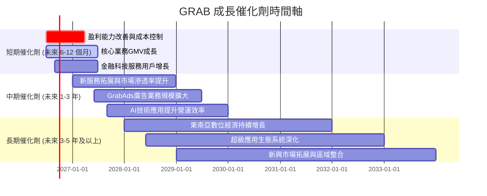

### 8.2 TAM 市場規模分析

東南亞地區擁有超過 6.7 億人口，數位經濟正以驚人的速度發展。Grab 所在的移動出行、外送服務和數位支付市場的總潛在市場 (Total Addressable Market, TAM) 巨大，且滲透率仍有顯著提升空間。

```
╔══════════════════════════════════════════════════════════════════╗
║                   GRAB 東南亞 TAM 市場規模分析                   ║
╠══════════════════════════════════════════════════════════════════╣
║                                                                  ║
║  移動出行 (Mobility) TAM:    $40B+ (2025E)  █████████████████████  滲透率: ~30-40% 🟢   ║
║  外送服務 (Deliveries) TAM:   $50B+ (2025E)  █████████████████████████  滲透率: ~20-30% 🟢   ║
║  金融科技 (Fintech) TAM:      $150B+ (2025E) █████████████████████████████████████████████████████████████████████████████████████████████████████████████████████████████████████████████████████████████████████████████████████████████████████████████████████████████████████████████████████████████████████████████████████████████████████████████████████████████████████████████████████████████████████████████████████████████████████████████████████████████████████████████████████████████████████████████████████████████████████████████████████████████████████████████████████████████████████████████████████████████████████████████████████████████████████████████████████████████████████████████████████████████████████████████████████████████████████████████████████████████████████████████████████████████████████████████████████████████████████████████████████████████████████████████████████████████████████████████████████████████████████████████████████████████████████████████████████████████████████████████████████████████████████████████████████████████████████████████████████████████████████████████████████████████████████████████████████████████████████████████████████████████████████████████████████████████████████████████████████████████████████████████████████████████████████████████████████████████████████████████████████████████████████████████████████████████████████████████████████████████████████████████████████████████████████████████████████████████████████████████████████████████████████████████████████████████████████████████████████████████████████████████████████████████████████████████████████████████████████████████████████████████████████████████████████████████████████████████████████████████████████████████████████████████████████████████████████████████████████████████████████████████████████████████████████████████████████████████████████████████████████████████████████████████████████████████████████████████████████████████████████████████████████████████████████████████████████████████████████████████████████████████████████████████████████████████████████████████████████████████████████████████████████████████████████████████████████████████████████████████████████████████████████████████████████████████████████████████████████████████████████████████████████████████████████████████████████████████████████████████████████████████████████████████████████████████████████████████████████████████████████████████████████████████████████████████████████████████████████████████████████████████████████████████████████████████████████████████████████████████████████████████████████████████████████████████████████████████████████████████████████████████████████████████████████████████████████████████████████████████████████████████████████████████████████████████████████████████████████████████████████████████████████████████████████████████████████████  總潛在收入貢獻: $250B+ (2030E) 🟢   ║
║                                                                  ║
║  📊 結論：Grab 在東南亞龐大的數位經濟浪潮中擁有巨大的成長空間。  ║
╚══════════════════════════════════════════════════════════════════╝
```
*註：TAM 數據為基於第三方市場研究報告的估算值。*

**TAM 分析**：
Grab 所處的東南亞市場是一個充滿活力的成長區域，其數位經濟正加速發展。
*   **移動出行**：隨著城市化進程和中產階級的壯大，對便捷、高效出行方式的需求將持續增長。Grab 在此領域的市場領導地位使其能從中受益。
*   **外送服務**：疫情加速了外送服務的普及，消費者習慣已形成。食品、雜貨及包裹外送的需求仍有巨大潛力，尤其是在二三線城市。
*   **金融科技**：東南亞地區的銀行滲透率相對較低，但智慧型手機普及率高，為數位支付、信貸、保險等金融科技服務提供了廣闊的發展空間。GrabPay 及其金融服務生態系統有望成為重要的成長驅動力。

### 8.3 成長驅動力結構圖

Grab 的成長驅動力是多方面且相互關聯的，從短期到長期共同推動其業務擴張和價值創造。

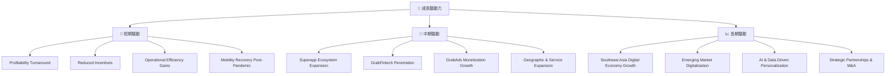

**成長驅動力詳細說明**：
*   **短期驅動 (Short-Term Drivers)**：
    *   **盈利能力轉正 (Profitability Turnaround)**：公司已在 2025 財年實現淨利潤轉正，這將提升投資者信心，並為未來的再投資提供內部資金。
    *   **補貼減少 (Reduced Incentives)**：隨著市場地位鞏固，Grab 可以逐步減少對司機和用戶的補貼，直接提升毛利率和營運利潤。
    *   **營運效率提升 (Operational Efficiency Gains)**：透過技術優化、路線規劃和後台管理，降低營運成本。
    *   **移動出行復甦 (Mobility Recovery Post-Pandemic)**：隨著經濟活動全面恢復，移動出行服務的需求強勁反彈。
*   **中期驅動 (Mid-Term Drivers)**：
    *   **超級應用生態系統擴張 (Superapp Ecosystem Expansion)**：持續整合更多服務，如生活服務、健康服務等，增加用戶黏著度，提升交叉銷售機會。
    *   **GrabFintech 滲透率提升 (GrabFintech Penetration)**：擴大 GrabPay 的使用場景，並推廣 GrabFinance 和 GrabInsure 等金融產品，挖掘巨大的未開發市場。
    *   **GrabAds 廣告業務變現增長 (GrabAds Monetization Growth)**：利用龐大的用戶數據和流量，發展高利潤率的廣告業務，增加新的收入來源。
    *   **地理與服務擴張 (Geographic & Service Expansion)**：深化現有市場滲透，並考慮在東南亞地區內拓展至更多城市或推出新服務。
*   **長期驅動 (Long-Term Drivers)**：
    *   **東南亞數位經濟持續增長 (Southeast Asia Digital Economy Growth)**：該地區快速增長的人口、日益壯大的中產階級和年輕化的人口結構，將持續驅動數位服務的需求。
    *   **新興市場數位化 (Emerging Market Digitalization)**：隨著技術普及和基礎設施改善，更多偏遠地區的用戶將接入數位服務。
    *   **AI 和數據驅動的個性化服務 (AI & Data Driven Personalization)**：利用大數據和 AI 技術提供更精準、個性化的服務和產品，提升用戶體驗和營運效率。
    *   **戰略合作與併購 (Strategic Partnerships & M&A)**：透過與當地企業合作或收購，快速擴大市場份額和服務範圍。

---

## 9. 風險矩陣

### 9.1 風險評分矩陣

Grab 作為一家在快速變化的東南亞市場運營的科技公司，面臨多種風險。我們將這些風險按照發生機率和潛在衝擊進行評估。

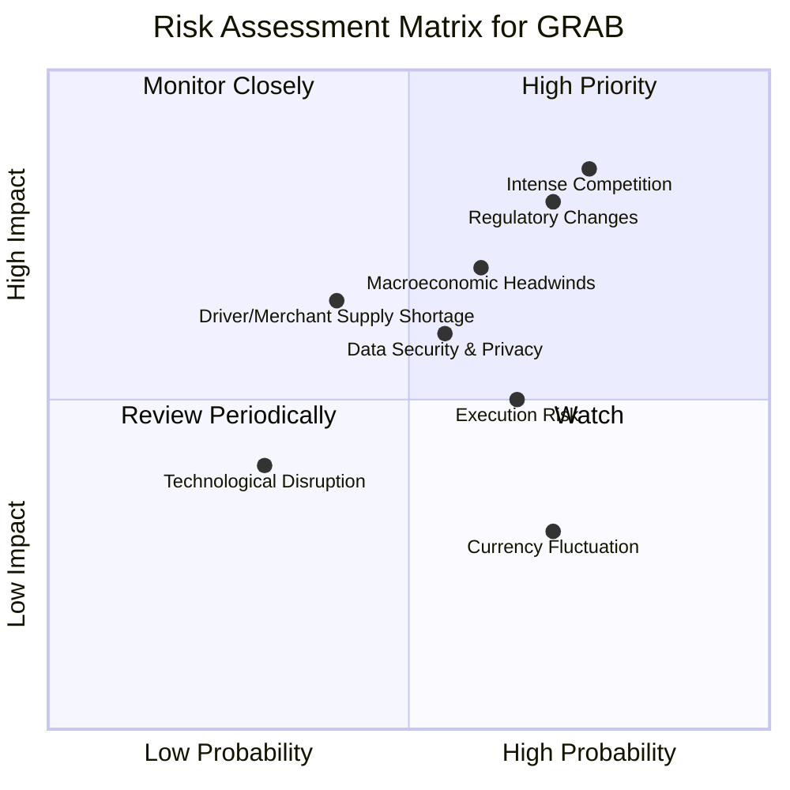

### 9.2 風險清單詳細分析

| # | 風險項目 | 發生機率 | 財務衝擊 | 風險評分 | 緩解措施 |
|---|----------|----------|----------|----------|----------|
| 1 | 🔴 **激烈競爭** | 高 (75%) | 高 (-10-15%收入/利潤) | 🔴 8.5/10 | 強化網路效應、差異化服務、持續創新、提升用戶黏著度、生態系統整合。 |
| 2 | 🔴 **監管政策變化** | 高 (70%) | 高 (-5-10%收入/利潤) | 🔴 8.0/10 | 積極與各國政府溝通合作、合規經營、多元化業務降低單一業務監管風險。 |
| 3 | 🟡 **宏觀經濟逆風** | 中 (60%) | 中 (-5-8%收入/利潤) | 🟡 7.0/10 | 提升營運效率、成本控制、提供不同價格區間服務以適應消費能力變化。 |
| 4 | 🟡 **執行風險** | 中 (65%) | 中 (-5-7%收入/利潤) | 🟡 6.5/10 | 強化管理團隊能力、優化內部流程、有效整合新業務、人才培養與激勵。 |
| 5 | 🟡 **數據安全與隱私** | 中 (55%) | 中 (-3-5%收入/聲譽) | 🟡 6.0/10 | 投資頂級網絡安全技術、建立嚴格的數據治理體系、遵守國際隱私法規。 |
| 6 | 🟡 **司機/商家供應短缺** | 中 (40%) | 中 (-3-5%收入/服務質量) | 🟡 5.5/10 | 提供具競爭力的佣金和激勵、改善合作夥伴福利、多元化供應方。 |
| 7 | 🟢 **匯率波動** | 高 (70%) | 低 (-1-2%利潤) | 🟢 4.0/10 | 實施匯率對沖策略、多元化收入來源、優化現金管理。 |
| 8 | 🟢 **技術顛覆** | 低 (30%) | 低 (-2-3%收入) | 🟢 3.5/10 | 持續研發投入、關注新興技術趨勢、內部孵化創新項目、保持開放創新文化。 |

**風險分析總結**：
Grab 面臨的主要風險集中在激烈的市場競爭和複雜多變的監管環境。東南亞市場吸引了眾多本地和國際競爭者，價格戰和用戶補貼可能會侵蝕利潤率。此外，各國政府對平台經濟的監管日益嚴格，任何政策變化都可能對 Grab 的營運模式和盈利能力產生重大影響。宏觀經濟波動、執行能力以及數據安全也是需要密切關注的風險。然而，公司已意識到這些挑戰，並透過強化其超級應用生態系統、提升營運效率、以及與監管機構積極溝通來緩解這些風險。

---

## 10. 投資建議

### 10.1 最終綜合評級雷達圖

```
╔══════════════════════════════════════════════════════════════════╗
║                     GRAB 綜合評級雷達圖 (1-10分)                   ║
╠══════════════════════════════════════════════════════════════════╣
║                                                                  ║
║  基本面強度     7.0 ▓▓▓▓▓▓▓▓▓▓▓▓▓▓░░░░░░  ★★★★☆             ║
║  成長動能       8.0 ▓▓▓▓▓▓▓▓▓▓▓▓▓▓▓▓░░░░  ★★★★☆             ║
║  獲利品質       6.0 ▓▓▓▓▓▓▓▓▓▓▓▓░░░░░░░░  ★★★☆☆             ║
║  財務健康       8.0 ▓▓▓▓▓▓▓▓▓▓▓▓▓▓▓▓░░░░  ★★★★☆             ║
║  估值合理性     7.0 ▓▓▓▓▓▓▓▓▓▓▓▓▓▓░░░░░░  ★★★★☆             ║
║  護城河深度     7.8 ▓▓▓▓▓▓▓▓▓▓▓▓▓▓▓▓░░░░  ★★★★☆             ║
║  管理層執行     7.5 ▓▓▓▓▓▓▓▓▓▓▓▓▓▓▓░░░░░  ★★★★☆             ║
║  技術創新力     7.0 ▓▓▓▓▓▓▓▓▓▓▓▓▓▓░░░░░░  ★★★★☆             ║
╠══════════════════════════════════════════════════════════════════╣
║  綜合總分       7.2 ▓▓▓▓▓▓▓▓▓▓▓▓▓▓▓░░░░░  🏆 具備長期投資價值     ║
╚══════════════════════════════════════════════════════════════════╝
```

### 10.2 目標價與隱含報酬率

綜合以上分析，考慮到 Grab 在東南亞市場的領導地位、強勁的營收成長、顯著改善的盈利能力、健康的資產負債表以及合理的估值，我們給予其「買入」評級。

| 情境 | 目標價區間 | 隱含報酬率 | 機率權重 | 加權目標價 |
|------|------------|------------|----------|------------|
| 🟢 **樂觀情境** | $6.20 - $7.50 | +62% 至 +96% | 30% | $6.85 |
| 🟡 **基準情境** | $4.70 - $5.80 | +23% 至 +52% | 50% | $5.25 |
| 🔴 **悲觀情境** | $3.60 - $4.50 | -6% 至 +18% | 20% | $4.05 |
| **當前股價** | **$3.82** | - | - | - |
| **12個月目標價** | **$5.00 - $6.00** | **+31% 至 +57%** | - | **$5.35** |

**投資評級**：🟢 **買入 (Buy)**
**12個月目標價區間**：$5.00 - $6.00
**當前股價**：$3.82

### 10.3 買入時機與觸發因素

```
╔══════════════════════════════════════════════════════════════════╗
║                  ✅ 買入觸發因素 Checklist                      ║
╠══════════════════════════════════════════════════════════════════╣
║                                                                  ║
║  立即買入觸發條件（多數符合）：                                  ║
║  ✅ 公司已實現季度盈利，並預計未來持續增長 (Forward P/E 26.84x)。║
║  ✅ 東南亞數位經濟TAM巨大，Grab處於市場領導地位。               ║
║  ✅ 資產負債表健康，現金儲備充裕，淨現金為正 ($4.31B)。         ║
║  ✅ 營收成長率 (YoY 23.5%) 強勁，高於行業平均水平。              ║
║  ✅ 估值合理，Forward P/E 和 PEG Ratio 顯示上行空間。           ║
║                                                                  ║
║  加碼觸發條件（出現以下任一）：                                  ║
║  ☐ 自由現金流持續轉正並穩定增長。                               ║
║  ☐ ROIC 顯著提升並開始超過 WACC。                               ║
║  ☐ 金融科技業務（GrabFintech）實現超預期增長和盈利。           ║
║  ☐ 競爭格局改善，市場份額進一步鞏固。                           ║
║                                                                  ║
║  減碼/停損觸發條件（出現以下任一）：                             ║
║  ☐ 營收成長顯著放緩，低於市場預期。                             ║
║  ☐ 盈利能力惡化，再次出現大規模虧損。                           ║
║  ☐ 監管環境出現重大不利變化，嚴重影響核心業務。                 ║
║  ☐ 競爭加劇導致市場份額大幅流失或利潤率急劇下降。               ║
╚══════════════════════════════════════════════════════════════════╝
```

### 10.4 投資人適配度分析

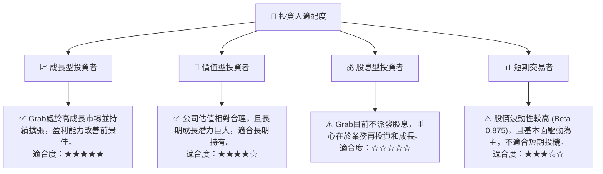
**投資人適配度分析**：
Grab 最適合尋求長期資本增值的成長型投資者。公司在東南亞數位經濟的長期趨勢中佔據有利地位，並且已經從虧損轉向盈利，展現出強勁的成長潛力。對於價值型投資者而言，其合理的遠期估值和巨大的 TAM 也提供了吸引力。然而，由於公司目前不派發股息，且股價可能受市場情緒和宏觀經濟影響而波動，因此不適合股息型投資者或純粹的短期交易者。

### 10.5 關鍵監控指標

為有效管理對 Grab 的投資，投資者應密切關注以下關鍵指標：

| 監控類型 | 指標 | 關注點 | 頻率 |
|----------|--------------------|------------------------------------------|------|
| **營運表現** | **總商品交易額 (GMV) 成長** | 各業務板塊的 GMV 成長是否符合預期。 | 季度 |
| **營運表現** | **月度活躍用戶 (MAU) 增長** | 用戶基礎的擴大和用戶參與度。           | 季度 |
| **盈利能力** | **毛利率趨勢** | 成本控制和補貼效率的提升。               | 季度 |
| **盈利能力** | **營業利益率與淨利率** | 盈利能力的穩定性和持續改善。             | 季度 |
| **資本效率** | **自由現金流 (FCF)** | 從盈利到現金流轉換的能力，是否持續為正。 | 季度 |
| **資本效率** | **ROIC vs WACC** | 公司是否正在創造股東價值。               | 年度 |
| **財務健康** | **現金及短期投資餘額** | 財務彈性和對潛在風險的抵禦能力。         | 季度 |
| **市場競爭** | **主要競爭對手動態** | 競爭格局變化、價格戰和市場份額變化。     | 持續 |
| **監管環境** | **東南亞各國政策變化** | 對平台經濟的監管收緊或放鬆。             | 持續 |
| **金融科技** | **GrabFintech 收入貢獻** | 金融科技業務的成長速度和盈利能力。       | 季度 |

---

> **免責聲明**：本報告為 AI 自動生成，僅供研究參考，不構成投資建議。投資有風險，入市需謹慎。