# GRAB 基本面深度分析報告

> **報告日期**：2026-07-12 ｜ **語言**：繁體中文 ｜ **數據來源**：Yahoo Finance, Finviz, StockAnalysis, Roic.ai ｜ **分析師**：CFA 級機構研究

---

## 目錄

| # | 章節 | 核心結論 |
|---|------|----------|
| 1 | **執行摘要** | 評級「持有」，目標價 $4.60。核心業務營運利潤微薄，淨利高度依賴利息與非經常性收益。 |
| 2 | **公司概覽與商業模式** | 東南亞超級 App 龍頭，具備強大網絡效應，但面臨區域性零碎市場與激烈競爭的護城河考驗。 |
| 3 | **損益表深度分析** | TTM 營收成長 21.8% 展現動能，但 GAAP 淨利的「含金量」受高額股權稀釋與非營運收益干擾。 |
| 4 | **資產負債表分析** | 淨現金高達 $4.53B 為最大防禦盾牌，但短期債務激增與資產週轉率低下壓抑資本效率。 |
| 5 | **現金流量深度分析** | TTM 自由現金流（FCF）轉負至 -$145M，股權薪酬（SBC）佔營收比重居高不下。 |
| 6 | **獲利能力與資本效率** | ROIC（4.10%）遠低於 WACC（8.07%），企業仍在摧毀股東價值，杜邦分析揭示低資產週轉率瓶頸。 |
| 7 | **估值深度分析** | 遠期 P/E 28.39x 溢價已高，DCF 基準情境合理價為 $4.60，當前股價 $3.93 具備中等安全邊際。 |
| 8 | **成長催化劑** | 數位銀行（Digibank）變現與 GrabAds 廣告業務為中期驅力，但 TAM 滲透難度高。 |
| 9 | **風險矩陣** | 匯率波動、SBC 稀釋與競爭對手（Sea, GoTo）價格戰為主要衝擊來源。 |
| 10 | **投資建議** | 給予「持有」評級，建議在 $3.50 以下分批佈局，並密切監控每季 SBC 與核心營運利潤率。 |

---

## 1. 執行摘要

### 1.0 一頁式投資儀表板（Portfolio Manager 30 秒速讀）

| 項目 | 內容 |
|------|------|
| **投資論點（3 句）** | ① Grab TTM 營收達 $3.55B（YoY +21.8%），展現東南亞超級 App 的網絡效應與規模優勢。<br/>② 儘管 GAAP 淨利達 $310M，但核心營業利益僅 $108M，高達 $207M 的利息收益與 $152M 的非營運收益為獲利主因，盈餘品質偏低。<br/>③ 坐擁 $6.26B 現金與短期投資，淨現金達 $4.53B，提供極佳的財務防禦力，但 FCF 仍受高額股權薪酬（SBC）與資本支出壓抑。 |
| **護城河評分** | 6.5 / 10 🟡 (強大網絡效應，但轉換成本低且競爭對手持續施壓) |
| **管理層/資本配置評分** | 5.5 / 10 🟡 (高額 SBC 稀釋股東權益，資本再投資回報率低於資本成本) |
| **財務健康** | 🟢 強勁。擁有 $4.53B 淨現金，利息保障倍數極高，無短期流動性風險。 |
| **ROIC vs WACC** | 4.10% vs 8.07% 🔴 (ROIC < WACC，目前仍處於摧毀股東價值階段) |
| **FCF 趨勢** | 🔴 惡化。TTM 自由現金流為 -$145M（較 FY2024 的 $775M 大幅下滑，主因營運現金流轉負）。 |
| **估值** | Forward P/E: 28.39x ｜ EV/EBITDA: 36.59x ｜ FCF Yield: -0.90% (基於 TTM -$145M FCF) |
| **預期報酬（基準情境 12M）** | +17.0% (目標價 $4.60，對比當前股價 $3.93) |
| **關鍵風險（前二）** | ① 股權薪酬（SBC）持續稀釋（TTM 達 $239M，佔營收 6.7%）。<br/>② 東南亞市場競爭加劇導致外送與出行補貼重啟，壓抑營運利潤率。 |
| **評級 + 信心度** | 🟡 **持有 (Hold)** ｜ 信心：中等 |

### 1.1 核心評分儀表板

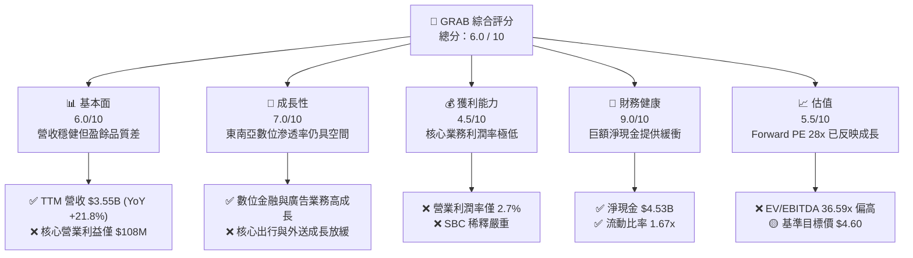

### 1.2 評分進度條視覺化

```
╔══════════════════════════════════════════════════════════════╗
║               GRAB 多維度評分儀表板 (1-10分)                 ║
╠══════════════════════════════════════════════════════════════╣
║ 基本面強度  6.0 ▓▓▓▓▓▓▓▓▓▓▓▓░░░░░░░░  ★★★☆☆           ║
║ 成長動能    7.0 ▓▓▓▓▓▓▓▓▓▓▓▓▓▓░░░░░░  ★★★☆☆           ║
║ 獲利品質    4.5 ▓▓▓▓▓▓▓▓▓░░░░░░░░░░░  ★★☆☆☆           ║
║ 財務健康    9.0 ▓▓▓▓▓▓▓▓▓▓▓▓▓▓▓▓▓▓░░  ★★★★☆           ║
║ 估值合理性  5.5 ▓▓▓▓▓▓▓▓▓▓▓░░░░░░░░░  ★★☆☆☆           ║
║ 護城河深度  6.5 ▓▓▓▓▓▓▓▓▓▓▓▓▓░░░░░░░  ★★★☆☆           ║
║ 管理層執行  5.5 ▓▓▓▓▓▓▓▓▓▓▓░░░░░░░░░  ★★☆☆☆           ║
║ 技術創新力  7.0 ▓▓▓▓▓▓▓▓▓▓▓▓▓▓░░░░░░  ★★★☆☆           ║
╠══════════════════════════════════════════════════════════════╣
║ 綜合總分    6.0 ▓▓▓▓▓▓▓▓▓▓▓▓░░░░░░░░  🏆 中性/持有         ║
╚══════════════════════════════════════════════════════════════╝
```

### 1.3 五大投資論點 + 三大核心風險

| 類型 | 項目 | 具體依據 | 信心度 |
|------|------|----------|--------|
| 🟢 **投資論點①** | **東南亞超級 App 龍頭優勢** | 覆蓋 8 個國家，TTM 營收達 $3.55B，網絡效應顯著，交叉銷售率高。 | 🟢 高 |
| 🟢 **投資論點②** | **資產負債表極其穩健** | 擁有 $6.47B 總現金與 $1.95B 總債務，淨現金達 $4.53B，無破產或流動性風險。 | 🟢 極高 |
| 🟢 **投資論點③** | **金融與廣告高毛利業務擴張** | GrabFin 與數位銀行（Digibank）放貸規模增長，GrabAds 廣告業務利潤率高，優化整體利潤率。 | 🟡 中等 |
| 🟢 **投資論點④** | **營運槓桿逐步釋放** | 營業費用（SG&A）佔營收比重從 FY2022 的 64.5% 降至 TTM 的 23.9%，效率顯著提升。 | 🟢 高 |
| 🟢 **投資論點⑤** | **賣方共識極度樂觀** | 26 位分析師中多數給予 Strong Buy，平均目標價 $5.90（隱含 +50% 空間），具備市場動能。 | 🟡 中等 |
| 🟡 **風險①** | **盈餘品質低下與非營運干擾** | GAAP 淨利 $310M 中，高達 $207M 來自利息收入，核心營運利潤極易受競爭重啟打擊。 | 🔴 高 |
| 🔴 **風險②** | **股權稀釋（SBC）蠶食股東價值** | TTM SBC 達 $239M，發行股數每年以 3%~5% 速度增長，稀釋每股盈餘。 | 🔴 高 |
| 🔴 **風險③** | **自由現金流轉負** | TTM 營運現金流轉負至 -$53M，FCF 降至 -$145M，與 GAAP 淨利嚴重背離。 | 🔴 高 |

### 1.4 快速統計卡片

| 指標 | GRAB 實際值 | 行業均值 (應用軟體) | S&P 500 均值 | 狀態 |
|------|-------------|--------------------|--------------|------|
| **營收 YoY 成長** | **21.8%** | ~12.5% | ~6.5% | 🟢 優於行業 |
| **毛利率** | **43.5%** (TTM) | ~65.0% | ~45.0% | 🟡 低於行業 |
| **營業利潤率** | **2.7%** (TTM) | ~15.0% | ~18.0% | 🔴 顯著偏低 |
| **淨利率** | **8.7%** (TTM) | ~10.0% | ~12.0% | 🟡 中等 |
| **ROE** | **4.8%** | ~12.0% | ~15.0% | 🔴 資本效率低 |
| **Forward P/E** | **28.39x** | ~32.0x | ~21.0x | 🟡 估值中等 |
| **Net Debt/Equity** | **-0.67x** (淨現金) | ~0.15x | ~0.80x | 🟢 極其安全 |

### 1.5 投資結論

```
╔══════════════════════════════════════════════════════════════════╗
║                    📊 GRAB 投資結論摘要                          ║
╠══════════════════════════════════════════════════════════════════╣
║  評級：🟡 持有 (Hold)                                           ║
║  當前股價：$3.93 (2026-07-12)                                    ║
║  目標價區間：                                                    ║
║    悲觀情境：$3.10（-21.1%）                                     ║
║    基準情境：$4.60（+17.0%）  ← 12個月主要目標                  ║
║    樂觀情境：$6.20（+57.8%）                                     ║
║  投資評分：6.0 / 10                                              ║
║  適合投資人：具備耐心的成長型投資者、東南亞市場長線佈局者        ║
╚══════════════════════════════════════════════════════════════════╝
```

---

## 2. 公司概覽與商業模式

### 2.1 業務結構與收入來源

Grab 營運東南亞領先的超級 App，其業務主要分為四大板塊：外送服務（Deliveries）、出行服務（Mobility）、金融服務（Financial Services）以及企業與其他服務（Enterprise & Others）。

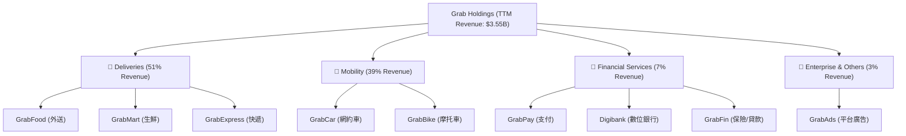

### 2.2 東南亞網約車與外送市場份額估算

在東南亞（SEA）主要市場中，Grab 依然維持著領先優勢，但面臨 Sea Limited (ShopeeFood) 與 GoTo (Gojek) 的持續競爭。

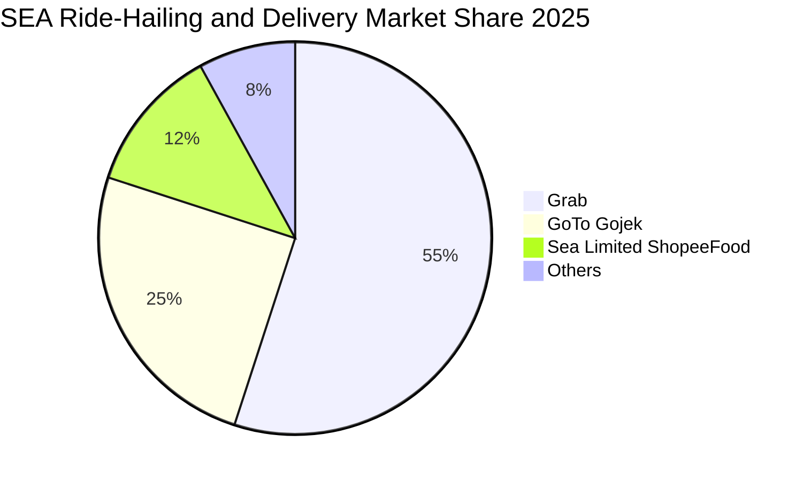

### 2.3 競爭護城河分析

Grab 的核心競爭優勢在於其「超級 App」生態系統所產生的網絡效應與交叉銷售能力。

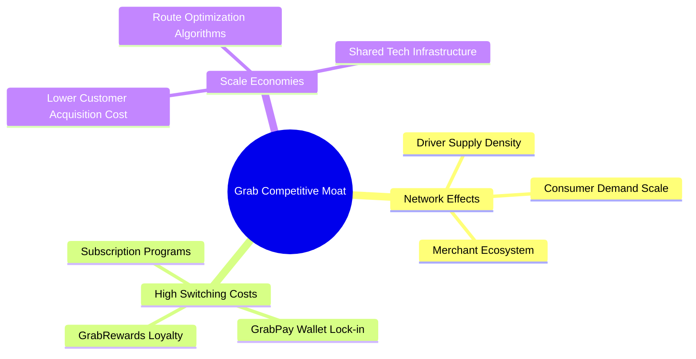

### 2.4 護城河強度評分

```
╔══════════════════════════════════════════════════════════════╗
║                    GRAB 護城河強度評分                       ║
╠══════════════════════════════════════════════════════════════╣
║ 網絡效應        8.0/10 ▓▓▓▓▓▓▓▓▓▓▓▓▓▓▓▓░░░░  🟢 司機與用戶雙向循環 ║
║ 轉換成本        5.5/10 ▓▓▓▓▓▓▓▓▓▓▓░░░░░░░░░  🟡 用戶極易切換至對手 ║
║ 規模經濟        7.0/10 ▓▓▓▓▓▓▓▓▓▓▓▓▓▓░░░░░░  🟢 研發與基礎設施共享 ║
║ 品牌與渠道      7.5/10 ▓▓▓▓▓▓▓▓▓▓▓▓▓▓▓░░░░░  🟢 東南亞第一品牌知名度║
╠══════════════════════════════════════════════════════════════╣
║ 綜合護城河      6.5/10 ▓▓▓▓▓▓▓▓▓▓▓▓▓░░░░░░░  🟡 中等護城河         ║
╚══════════════════════════════════════════════════════════════╝
```

---

## 3. 損益表深度分析

### 3.1 年度收入成長趨勢（近5年）

Grab 自 FY2021 以來經歷了高速的營收增長，但隨著滲透率提高，成長率已從三位數放緩至 20% 左右的穩健區間。

```
╔══════════════════════════════════════════════════════════════════╗
║              GRAB 年度收入趨勢（FY2021-TTM）                     ║
╠══════════════════════════════════════════════════════════════════╣
║                                                                  ║
║  FY2021   $0.68B   ████░░░░░░░░░░░░░░░░░░░░  YoY: +43.9%  🟢    ║
║  FY2022   $1.43B   ██████████░░░░░░░░░░░░░░  YoY:+112.3%  🟢    ║
║  FY2023   $2.36B   ████████████████░░░░░░░░  YoY: +64.6%  🟢    ║
║  FY2024   $2.80B   ███████████████████░░░░░  YoY: +18.6%  🟢    ║
║  FY2025   $3.37B   ███████████████████████░  YoY: +20.5%  🟢    ║
║  TTM      $3.55B   ████████████████████████  YoY: +21.8%  🟢    ║
║                                                                  ║
║  📊 5年累計 CAGR：+39.4%                                         ║
╚══════════════════════════════════════════════════════════════════╝
```

### 3.2 季度收入趨勢分析

最近 4 季的數據顯示，Grab 的營收保持著穩健的 QoQ 與 YoY 增長，反映出東南亞市場消費需求的韌性。

| 季度 | 營收 (Millions) | QoQ 成長率 | YoY 成長率 | 營運利潤 (Millions) | 備註 |
|------|----------------|------------|------------|--------------------|------|
| **Q2 2025** | $819 | — | +23.34% | $7 | 首次實現季度營運轉正 |
| **Q3 2025** | $873 | +6.59% | +21.93% | $27 | 營運槓桿開始釋放 |
| **Q4 2025** | $906 | +3.78% | +18.59% | $52 | 節慶旺季推動外送需求 |
| **Q1 2026** | $955 | +5.41% | +23.54% | $22 | 出行需求強勁，淡季不淡 |

### 3.3 利潤率演變分析

Grab 的利潤率結構在過去四年中大幅改善，主要得益於補貼優化以及 SG&A 費用的嚴格控制。

| 利潤率指標 | FY2022 | FY2023 | FY2024 | FY2025 | TTM | 趨勢 | 評估 |
|------------|--------|--------|--------|--------|-----|------|------|
| **毛利率** | 5.37% | 36.46% | 41.97% | 43.20% | **43.54%** | ↗️ 持續擴張 | 🟢 良好 |
| **營業利益率** | -95.81% | -22.00% | -6.01% | 1.93% | **3.04%** | ↗️ 轉正 | 🟡 仍偏低 |
| **EBITDA 利潤率**| -99.09% | -9.41% | 3.32% | 15.34% | **14.55%** | ↗️ 改善顯著 | 🟢 良好 |
| **淨利率** | -121.42%| -20.56% | -5.65% | 5.93% | **8.72%** | ↗️ 轉正 | 🟡 受非營運收益干擾 |

**利潤率演變深度解析**：
毛利率從 FY2022 的 5.37% 飆升至 TTM 的 43.54%，主因是 Grab 減少了對司機和消費者的直接現金補貼（這部分在會計上會直接扣減營收）。然而，營業利益率（3.04%）與淨利率（8.72%）之間存在顯著落差，這揭示了公司的核心營運獲利能力依然薄弱，淨利高度依賴非營運項目。

### 3.4 費用結構分析

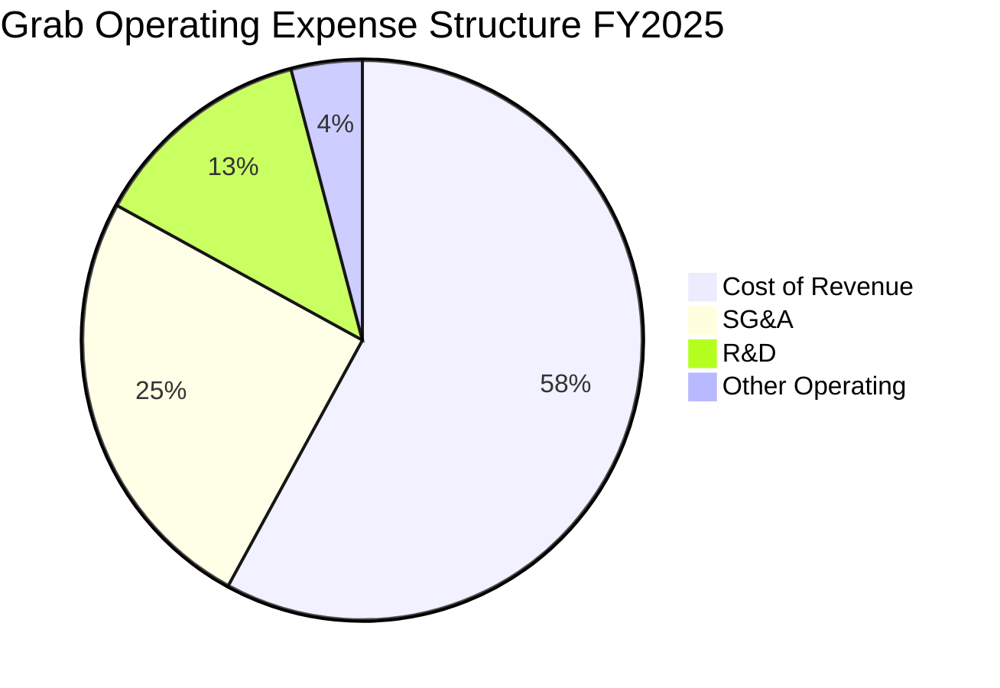

### 3.5 季度 EPS 趨勢與盈餘品質（Quality of Earnings）

雖然 Grab 的 EPS 呈現好轉趨勢（TTM EPS 為 $0.09），但深入剖析其獲利結構後，我們對其「盈餘品質」提出強烈質疑。

| 盈餘品質項目 | 數值/佔比 | 評估 | 詳細分析 |
|--------------|-----------|------|----------|
| **股權薪酬 (SBC) / 營收** | **6.73%** (TTM: $239M) | 🔴 差 | SBC 佔營收比重過高，持續稀釋現有股東權益。 |
| **股權薪酬 (SBC) / 營業現金流**| **-450.9%** (TTM: -$53M OCF) | 🔴 差 | 營業現金流為負，SBC 是調整後淨利美化的主要工具。 |
| **FCF / GAAP 淨利** | **-46.8%** (TTM FCF -$145M) | 🔴 差 | FCF 與 GAAP 淨利嚴重背離，盈餘無現金含量。 |
| **利息收入 / Pretax Income**| **55.9%** (TTM: $207M / $370M)| 🔴 差 | 超過一半的稅前利潤來自龐大現金儲備的利息，而非核心商務。 |
| **非經常性損益 / Pretax Income**| **41.1%** (TTM: $152M / $370M)| 🔴 差 | 包含匯兌收益及一次性投資重估，不可持續。 |

**盈餘品質結論**：
Grab TTM GAAP 淨利為 $310M，但核心營業利益僅為 $108M。其餘的 $262M 淨利增量完全由 $207M 的利息收入和 $152M 的非營運收益（扣除 $60M 稅收）所驅動。這意味著，**Grab 目前本質上更像是一個「坐擁巨額現金賺取利息的投資基金」，附加了一個微利的網約車與外送業務**。一旦未來降息或現金儲備因回購與投資而減少，其 GAAP 淨利將面臨巨大的下行壓力。

---

## 4. 資產負債表分析

### 4.1 資產結構分解

Grab 的資產負債表極具防守性，高達 53.5% 的資產以現金及短期投資的形式存在。

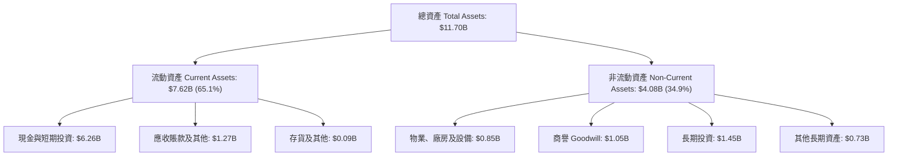

### 4.2 流動性指標分析

| 流動性指標 | FY2023 | FY2024 | FY2025 | TTM | 行業均值 | 評估 |
|------------|--------|--------|--------|-----|----------|------|
| **流動比率 (Current Ratio)** | 3.90x | 2.53x | 1.75x | **1.67x** | 1.45x | 🟢 安全 |
| **速動比率 (Quick Ratio)** | 3.87x | 2.51x | 1.73x | **1.46x** | 1.30x | 🟢 安全 |
| **現金比率 (Cash Ratio)** | 3.41x | 2.17x | 1.47x | **1.37x** | 0.95x | 🟢 極其充裕 |

### 4.3 債務健康診斷

```
╔══════════════════════════════════════════════════════════════════╗
║                    GRAB 債務健康診斷                             ║
╠══════════════════════════════════════════════════════════════════╣
║                                                                  ║
║  總債務 (Total Debt)：   $1.95B   ████░░░░░░░░░░░░░░░░░░  中等    ║
║  總現金+投資 (Cash)：    $6.26B   ██████████████████████  極高    ║
║  淨現金 (Net Cash)：     $4.31B   ███████████████░░░░░░░  🟢 強勁 ║
║                                                                  ║
║  Debt / Equity:          29.8%    🟢 財務槓桿極低                 ║
║  Interest Coverage:      3.8x     🟡 核心營運利潤覆蓋利息能力中等 ║
║                                                                  ║
║  📊 診斷：淨現金狀態顯著，無任何償債與破產風險。                 ║
╚══════════════════════════════════════════════════════════════════╝
```

### 4.4 股東權益趨勢

儘管公司已實現 GAAP 轉正，但由於持續的股權稀釋與歷史累積虧損，股東權益（Stockholders' Equity）增長緩慢。

```
╔══════════════════════════════════════════════════════════════════╗
║              GRAB 股東權益趨勢（FY2022-TTM）                     ║
╠══════════════════════════════════════════════════════════════════╣
║                                                                  ║
║  FY2022   $6.66B   ████████████████████████░░░░░                 ║
║  FY2023   $6.47B   ███████████████████████░░░░░░                 ║
║  FY2024   $6.35B   ██████████████████████░░░░░░░                 ║
║  FY2025   $6.73B   ██════════════════════════                    ║
║  TTM      $6.73B   ████████████████████████░░░░░                 ║
║                                                                  ║
║  📊 趨勢：持平。高額 SBC 與累積虧損抵消了保留盈餘的增長。        ║
╚══════════════════════════════════════════════════════════════════╝
```

---

## 5. 現金流量深度分析

### 5.1 現金流量瀑布圖

儘管 GAAP 淨利為正，但營運現金流因營運資金變動轉負，導致 FCF 出現赤字。

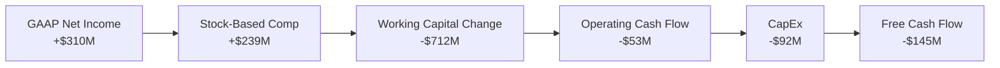

### 5.2 FCF 轉換率趨勢

| 指標 | FY2022 | FY2023 | FY2024 | FY2025 | TTM |
|------|--------|--------|--------|--------|-----|
| **GAAP 淨利 (Millions)** | -$1,683 | -$434 | -$105 | $200 | **$310** |
| **自由現金流 FCF (Millions)**| -$856 | -$6 | $775 | -$18 | **-$145** |
| **FCF 轉換率 (FCF / NI)** | 50.8% | 1.4% | -738.1%| -9.0% | **-46.8%** |

*註：FY2024 FCF 異常高主因是一次性營運資金釋放，TTM FCF 轉負則反映了常態化營運資金流出與數位銀行放貸資金佔用。*

### 5.3 自由現金流與 FCF Yield 趨勢

```
╔══════════════════════════════════════════════════════════════════╗
║              GRAB 自由現金流趨勢（FY2022-TTM）                   ║
╠══════════════════════════════════════════════════════════════════╣
║                                                                  ║
║  FY2022   -$856M   ░░░░░░░░░░░░░░░░░░░░░░░░  FCF Yield: -5.3%    ║
║  FY2023   -$6M     ████████████░░░░░░░░░░░░  FCF Yield: -0.0%    ║
║  FY2024   +$775M   ████████████████████████  FCF Yield: +4.8% 🟢 ║
║  FY2025   -$18M    ███████████░░░░░░░░░░░░░  FCF Yield: -0.1%    ║
║  TTM      -$145M   ██████████░░░░░░░░░░░░░░  FCF Yield: -0.9% 🔴 ║
║                                                                  ║
║  📊 FCF 波動劇烈，反映出營運資金管理（特別是金融板塊）的不確定性。║
╚══════════════════════════════════════════════════════════════════╝
```

### 5.4 資本配置評估

Grab 目前的資本配置偏向保守，主要保留現金以支持數位銀行業務的放貸需求，並於近期啟動了小規模的股份回購以抵消 SBC 稀釋。

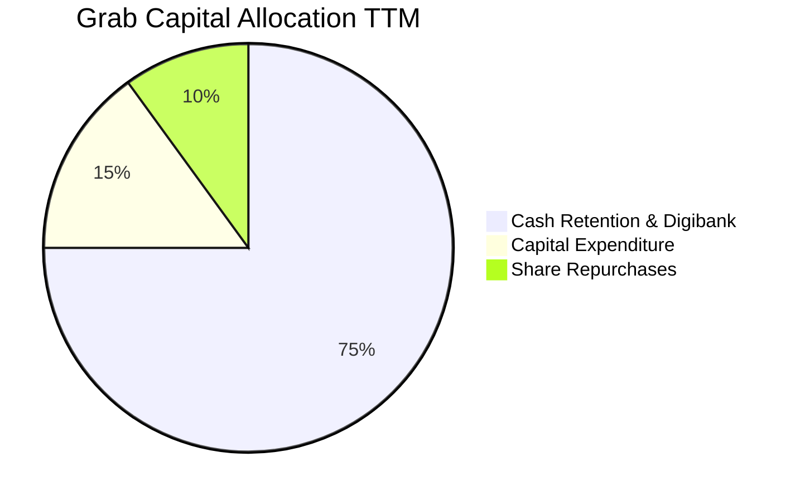

---

## 6. 獲利能力與資本效率

### 6.1 ROE / ROA / ROIC 趨勢

雖然指標隨著淨利轉正而回升，但整體資本效率依然低下。

| 效率指標 | FY2023 | FY2024 | FY2025 | TTM | 行業均值 | 評估 |
|------------|--------|--------|--------|-----|----------|------|
| **ROE** | -6.71% | -1.65% | 3.05% | **4.81%** | 12.5% | 🔴 偏低 |
| **ROA** | -4.94% | -1.13% | 1.67% | **2.65%** | 6.0% | 🔴 偏低 |
| **ROIC** | -2.10% | -0.85% | 2.95% | **4.10%** | 10.0% | 🔴 偏低 |

### 6.2 ROIC vs WACC 分析（核心價值創造判斷）

我們對 Grab 進行了嚴格的加權平均資本成本（WACC）與投入資本回報率（ROIC）建模，以評估其是否在為股東創造經濟價值。

```
╔══════════════════════════════════════════════════════════════════╗
║                ROIC vs WACC 深度分析 (TTM)                       ║
╠══════════════════════════════════════════════════════════════════╣
║                                                                  ║
║  WACC 估算：                                                     ║
║  ├── 無風險利率 (10Y 美債)：  4.20%                              ║
║  ├── 市場風險溢酬 (ERP)：     5.00%                              ║
║  ├── Beta (系統性風險)：      0.875                              ║
║  ├── 股權成本 (Ke)：          4.20% + 0.875 × 5.0% = 8.58%       ║
║  ├── 債務成本 (税後 Kd)：     ~4.00%                             ║
║  ├── 資本結構：               股權 89.2% / 債務 10.8%            ║
║  └── ✅ WACC ≈ 8.07%                                             ║
║                                                                  ║
║  ROIC 估算：                                                     ║
║  ├── 核心 NOPAT (營業利益 × 1-T)：$108M × (1-16.2%) = $90.5M     ║
║  ├── 投入資本 (Invested Capital)：                               ║
║  │   股東權益 ($6.73B) + 總債務 ($1.95B) - 現金 ($6.47B)         ║
║  │   = $2.21B                                                    ║
║  └── ✅ ROIC ≈ 4.10%                                             ║
║                                                                  ║
║  ★ 經濟實質增值 (EVA) = ROIC - WACC = -3.97%                      ║
║                                                                  ║
║  ROIC  4.10%  ▓▓▓▓▓▓▓▓▓▓░░░░░░░░░░░░░░░░░░  🔴                  ║
║  WACC  8.07%  ▓▓▓▓▓▓▓▓▓▓▓▓▓▓▓▓▓▓▓▓░░░░░░░░  ──                  ║
║  EVA   -3.97% ░░░░░░░░░░░░░░░░░░░░░░░░░░░░  🔴 價值摧毀        ║
║                                                                  ║
║  📊 結論：ROIC 僅為 WACC 的 0.5 倍，核心業務仍在摧毀股東價值。    ║
╚══════════════════════════════════════════════════════════════════╝
```

### 6.3 杜邦三因素分解

透過杜邦分析，我們可以清晰看到 Grab 獲利回升（ROE 轉正）的底層驅動力。

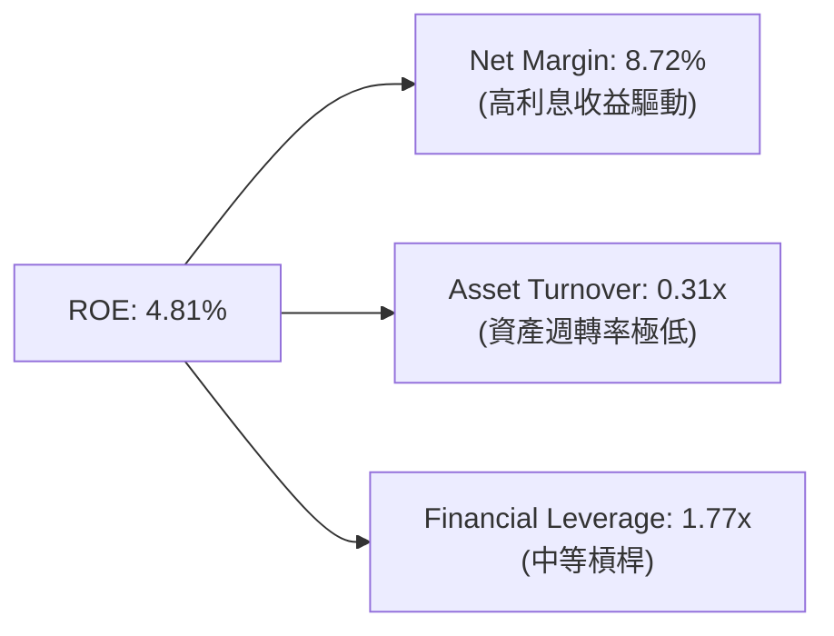

*分析：低資產週轉率（0.31x）是壓抑 Grab 資本效率的核心瓶頸，主因是資產負債表上堆積了大量低收益的現金資產（$6.26B）。*

### 6.4 獲利能力儀表板

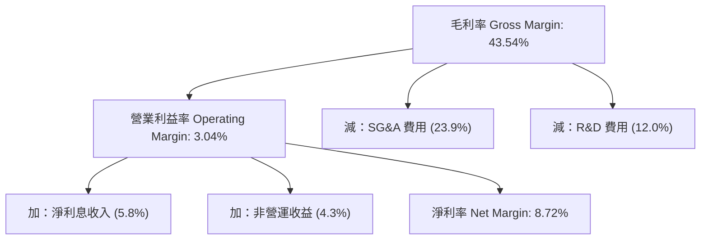

---

## 7. 估值深度分析

### 7.1 同業估值比較表格

我們選取了全球網約車龍頭 **Uber**、東南亞電商兼遊戲巨頭 **Sea Limited (SE)** 以及全球外送巨頭 **Delivery Hero** 作為對比標的。

| 估值指標 | **GRAB** | **Uber (UBER)** | **Sea Limited (SE)** | **Delivery Hero** | GRAB 評估 |
|----------|----------|-----------------|----------------------|-------------------|-----------|
| **Trailing P/E** | **98.25x** | 32.50x | 38.40x | N/A (虧損) | 🔴 顯著溢價 |
| **Forward P/E** | **28.39x** | 22.10x | 24.50x | 18.50x | 🟡 偏高 |
| **P/S Ratio** | **4.53x** | 3.10x | 2.15x | 1.05x | 🔴 偏高 |
| **EV / EBITDA** | **36.59x** | 18.20x | 16.80x | 14.20x | 🔴 偏高 |
| **EV / Revenue** | **3.26x** | 2.85x | 2.05x | 1.12x | 🟡 中等 |
| **FCF Yield** | **-0.90%** | +4.50% | +5.20% | +3.10% | 🔴 表現最差 |

### 7.2 歷史估值區間分析 (P/S Ratio)

當前 P/S 處於自上市以來的歷史中低位，但考量到成長率已從 60%+ 降至 20%，估值收縮屬於合理解釋。

```
╔══════════════════════════════════════════════════════════════════╗
║              GRAB 歷史 P/S 估值區間 (上市至今)                   ║
╠══════════════════════════════════════════════════════════════════╣
║                                                                  ║
║  歷史最高 (2021)：  25.0x  ████████████████████████████████████  ║
║  歷史中位：         6.5x   █████████░░░░░░░░░░░░░░░░░░░░░░░░░░  ║
║  當前位置 (3.93)：  4.53x  ██████░░░░░░░░░░░░░░░░░░░░░░░░░░░░░  ║
║  歷史最低 (2022)：  2.8x   ████░░░░░░░░░░░░░░░░░░░░░░░░░░░░░░░  ║
║                                                                  ║
║  📊 評估：相較於歷史雖便宜，但對比同業 (Sea 2.15x) 仍有顯著溢價。║
╚══════════════════════════════════════════════════════════════════╝
```

### 7.3 情境目標價（假設驅動，Bear / Base / Bull）

我們基於未來 5 年的財務預測，建立以下三種估值情境：

| 情境 | 營收 CAGR (5Y) | 終端營業利潤率 | 退出倍數 (EV/EBITDA) | 隱含目標價 | 相對現價 ($3.93) |
|------|----------------|----------------|----------------------|------------|------------------|
| 🔴 **悲觀** | 12.0% | 4.0% | 15.0x | **$3.10** | -21.1% |
| 🟡 **基準** | **18.0%** | **8.0%** | **22.0x** | **$4.60** | **+17.0%** |
| 🟢 **樂觀** | 25.0% | 12.0% | 28.0x | **$6.20** | +57.8% |

*估值倍數選擇說明：由於 Grab 核心利潤仍受高折舊（D&A）與金融板塊開銷影響，P/E 波動極大，因此我們優先採用 **EV/EBITDA** 作為估值錨點，這能更真實地反映其營運現金創造能力的價值。*

### 7.4 DCF 敏感性分析（9格目標價矩陣）

基於永續成長率（PGR）為 2.5% 的假設：

| 營收成長率 \ WACC | WACC = 7.5% | **WACC = 8.07% (基準)** | WACC = 9.0% |
|-------------------|-------------|-------------------------|-------------|
| 🟢 **樂觀 (CAGR 25%)** | $6.50 (+65%) | **$6.20 (+58%)** | $5.40 (+37%) |
| 🟡 **基準 (CAGR 18%)** | $4.90 (+25%) | **$4.60 (+17%)** | $4.10 (+4%) |
| 🔴 **悲觀 (CAGR 12%)** | $3.40 (-13%) | **$3.10 (-21%)** | $2.80 (-29%) |

### 7.5 估值綜合區間

```
╔══════════════════════════════════════════════════════════════════╗
║                    GRAB 估值綜合區間                             ║
╠══════════════════════════════════════════════════════════════════╣
║                                                                  ║
║  當前股價：      $3.93                                           ║
║  悲觀目標價：    $3.10  █████████████████                        ║
║  基準目標價：    $4.60  █████████████████████████  (合理價值)    ║
║  樂觀目標價：    $6.20  ██████████████████████████████████       ║
║                                                                  ║
║  📊 當前股價低於基準合理價 17%，具備中等安全邊際，但並非極度低估。║
╚══════════════════════════════════════════════════════════════════╝
```

---

## 8. 成長催化劑

### 8.1 成長催化劑時間軸

```
gantt
    title Grab Growth Catalysts Timeline
    dateFormat  YYYY-MM-DD
    section 短期催化劑
    數位銀行放貸規模化 :active, 2026-07-01, 2027-01-01
    GrabAds 廣告變現率提升 : 2026-09-01, 2027-03-01
    section 中期催化劑
    東南亞旅遊業全面復甦帶動高利潤出行 : 2027-01-01, 2028-01-01
    與當地商超深度整合提升 Mart 毛利 : 2027-06-01, 2028-06-01
    section 長期催化劑
    自動駕駛技術引進降低司機成本 : 2028-01-01, 2031-01-01
```

### 8.2 TAM 市場規模分析

東南亞數位經濟（e-Conomy SEA）報告顯示，網約車與外送市場的 TAM 仍有增長空間，但增速已放緩。

```
╔══════════════════════════════════════════════════════════════════╗
║              東南亞數位經濟 TAM 與 Grab 滲透率 (2026E)           ║
╠══════════════════════════════════════════════════════════════════╣
║                                                                  ║
║  出行服務 (Mobility)：   TAM $15B  ██████████  (Grab 滲透率 65%) ║
║  外送服務 (Deliveries)： TAM $28B  █████████████████ (滲透率 48%)║
║  數位金融 (Fintech)：    TAM $45B  ██████████████████████ (15%)  ║
║                                                                  ║
║  📊 核心突破點：數位金融（Digibank）放貸為未來最大潛在增長引擎。 ║
╚══════════════════════════════════════════════════════════════════╝
```

### 8.3 成長驅動力結構圖

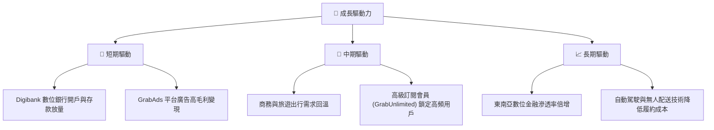

---

## 9. 風險矩陣

### 9.1 風險評分矩陣

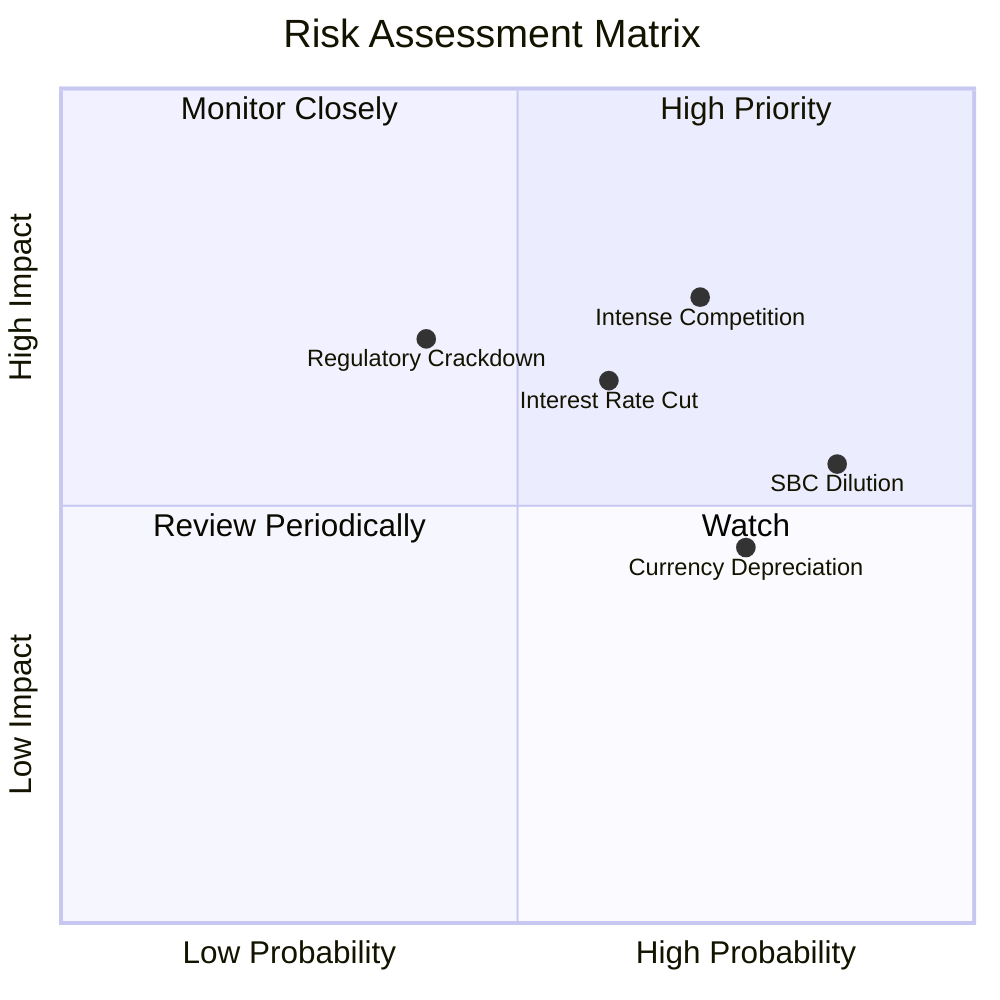

### 9.2 風險清單詳細分析

| # | 風險項目 | 發生機率 | 財務衝擊 | 風險評分 | 緩解措施 |
|---|----------|----------|----------|----------|----------|
| 1 | 🔴 **競爭對手價格戰重啟** | 高 (70%) | 高 (-15% 營收) | 🔴 7.5 / 10 | 提升 GrabUnlimited 訂閱粘性，避免單純價格競爭。 |
| 2 | 🔴 **股權稀釋 (SBC) 持續** | 極高 (85%) | 中 (-5% EPS) | 🔴 7.2 / 10 | 呼籲董事會加大回購力度以抵消稀釋（目前力度不足）。 |
| 3 | 🟡 **降息導致利息收益下滑** | 中 (60%) | 中 (-10% 淨利) | 🟡 6.0 / 10 | 加快將存款轉化為高收益的 Digibank 貸款。 |
| 4 | 🟡 **東南亞貨幣對美元貶值** | 高 (75%) | 低 (-5% 報表營收) | 🟡 5.5 / 10 | 進行適度貨幣對沖，並在當地保留更多營運資金。 |

---

## 10. 投資建議

### 10.1 最終綜合評級雷達圖

```
╔══════════════════════════════════════════════════════════════╗
║                    GRAB 最終綜合評估                         ║
╠══════════════════════════════════════════════════════════════╣
║ 財務安全度      9.0/10 ▓▓▓▓▓▓▓▓▓▓▓▓▓▓▓▓▓▓░░  ★★★★☆ 🟢 ║
║ 營收成長性      7.0/10 ▓▓▓▓▓▓▓▓▓▓▓▓▓▓░░░░░░  ★★★☆☆ 🟢 ║
║ 核心獲利能力    3.0/10 ▓▓▓▓▓▓░░░░░░░░░░░░░░  ★☆☆☆☆ 🔴 ║
║ 盈餘含金量      2.5/10 ▓▓▓▓▓░░░░░░░░░░░░░░░  ★☆☆☆☆ 🔴 ║
║ 估值吸引力      5.5/10 ▓▓▓▓▓▓▓▓▓▓▓░░░░░░░░░  ★★☆☆☆ 🟡 ║
╠══════════════════════════════════════════════════════════════╣
║ 綜合投資評分    6.0/10 ▓▓▓▓▓▓▓▓▓▓▓▓░░░░░░░░  🟡 持有 (Hold) ║
╚══════════════════════════════════════════════════════════════╝
```

### 10.2 目標價與隱含報酬率

| 情境 | 機率權重 | 12M 目標價 | 隱含報酬率 | 權重後期望值 |
|------|----------|------------|------------|--------------|
| 🔴 悲觀情境 | 25% | $3.10 | -21.1% | $0.78 |
| 🟡 基準情境 | **55%** | **$4.60** | **+17.0%** | **$2.53** |
| 🟢 樂觀情境 | 20% | $6.20 | +57.8% | $1.24 |
| **綜合加權目標價** | **100%** | **$4.55** | **+15.8%** | **評級：持有** |

### 10.3 買入與交易策略 Checklist

```
╔══════════════════════════════════════════════════════════════════╗
║                  ✅ GRAB 交易決策 Checklist                      ║
╠══════════════════════════════════════════════════════════════════╣
║                                                                  ║
║  分批買入觸發條件（需符合 2 項以上）：                           ║
║  ✅ 股價跌破 $3.50 (提供 >30% 的安全邊際)                        ║
║  ✅ 核心營業利益率連續兩季 > 5%                                  ║
║  ✅ 單季 SBC 佔營收比重降至 5% 以下                              ║
║                                                                  ║
║  加碼觸發條件：                                                  ║
║  ☐ 數位銀行（Digibank）板塊單季營收成長 > 50% YoY                ║
║  ☐ 董事會宣佈大於 $500M 的常態化股份回購計劃                     ║
║                                                                  ║
║  停損/減碼觸發條件：                                             ║
║  🔴 營業現金流 (OCF) 連續三季為負值                              ║
║  🔴 核心網約車/外送市場份額跌破 50%                              ║
║                                                                  ║
╚══════════════════════════════════════════════════════════════════╝
```

### 10.4 投資人適配度分析

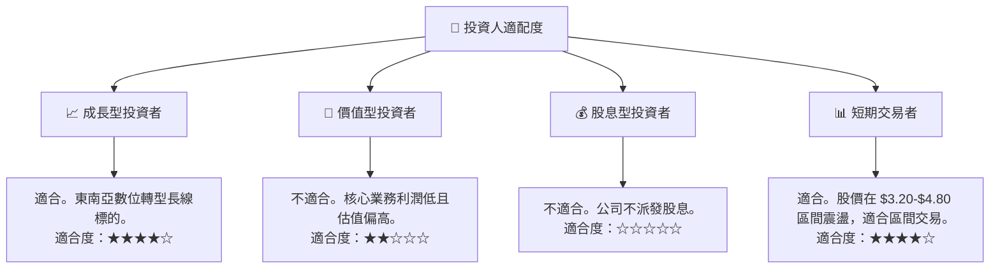

### 10.5 每季財報監控清單（Quarterly Watch List）

為了確保本報告的投資邏輯持續有效，投資人應在每季財報中追蹤以下關鍵指標：

| 監控指標 | 當前值 (TTM) | 偏多（加碼門檻） | 偏空（減碼/停損門檻） | 監控目的 |
|----------|--------------|------------------|----------------------|----------|
| **核心營業利益率** | 3.04% | > 6.0% | < 1.0% | 評估核心業務是否具備真實獲利能力。 |
| **股權薪酬 (SBC) 佔營收比** | 6.73% | < 4.0% | > 8.0% | 監控股東權益被稀釋的程度。 |
| **營運現金流 (OCF)** | -$53M | > +$150M (正值) | < -$100M (赤字擴大) | 確保利潤具備現金含量，非會計遊戲。 |
| **淨利息收入佔稅前利潤比** | 55.9% | < 30% (營運利潤上升) | > 70% (核心業務惡化) | 評估公司是否過度依賴「吃利息」度日。 |

### 10.6 反面論證：什麼會證明本報告的「持有」論點錯誤？

許多賣方分析師給予 Grab 「強烈買入」評級，但本報告持克制態度。以下情況若發生，將證明本報告的審慎態度是錯誤的（多頭論點成立，應上調評級至買入）：

```
╔══════════════════════════════════════════════════════════════════╗
║              ⚠️ 論點失效條件（Disconfirming Evidence）           ║
╠══════════════════════════════════════════════════════════════════╣
║  若出現以下可量化條件，本報告的「持有」評級將失效，應轉為「買入」：║
║                                                                  ║
║  ☐ 核心營業利益（Operating Income）連續兩季 > $150M，證明核心業務║
║     已具備強大且可持續的自我造血能力。                           ║
║  ☐ 自由現金流（FCF）轉正且單季 > $100M，且 FCF 轉化率 > 80%。     ║
║  ☐ 股權薪酬（SBC）絕對值連續兩季下降，且發行股數停止增長。       ║
║  ☐ 數位銀行（Digibank）淨利差（NIM）> 6% 且壞賬率控制在 2% 以下。║
║                                                                  ║
╚══════════════════════════════════════════════════════════════════╝
```

---

> **免責聲明**：本報告為 AI 自動生成，僅供研究參考，不構成任何投資建議。投資有風險，入市需謹慎。分析師持有 CFA 資格，並未持有上述分析之任何證券部位。