# GRAB 基本面深度分析報告

> **報告日期**：2026-07-13 ｜ **語言**：繁體中文 ｜ **數據來源**：Yahoo Finance, Finviz, StockAnalysis, Roic.ai ｜ **分析師**：CFA 級機構研究

---

## 目錄

| # | 章節 | 核心結論 |
|---|------|----------|
| 1 | 執行摘要 | 評級：**買入 (Buy)** ｜ 基準目標價：**$5.90**（+48.6% 上行空間） |
| 2 | 公司概覽與商業模式 | 東南亞 Superapp 雙寡頭壟斷，網絡效應與交叉銷售構建核心壁壘 |
| 3 | 損益表深度分析 | 營收年增 23.5% 邁入獲利期，但股權薪酬（SBC）高企稀釋盈餘品質 |
| 4 | 資產負債表分析 | 淨現金達 $4.53B 護航，短期債務激增 $1.56B 需密切監控 |
| 5 | 現金流量深度分析 | 自由現金流轉正至 $329.5M，但營運現金流受營運資金波動壓抑 |
| 6 | 獲利能力與資本效率 | 杜邦分析顯示資產週轉率低（0.30x），ROIC（3.54%）低於 WACC（8.07%） |
| 7 | 估值深度分析 | Forward P/E 28.7x 具吸引力，DCF 敏感性分析支持 $5.90 估值 |
| 8 | 成長催化劑 | 金融服務（Digibank）與 GrabAds 廣告業務提供中長期雙引擎驅動 |
| 9 | 風險矩陣 | 東南亞宏觀經濟放緩與區域競爭加劇，面臨高衝擊與中等機率風險 |
| 10 | 投資建議 | 適合長線成長型投資者，每季財報監控 OCF 與 SBC 稀釋率 |

---

## 1. 執行摘要

### 1.0 一頁式投資儀表板（Portfolio Manager 30 秒速讀）

| 項目 | 內容 |
|------|------|
| **投資論點（3 句）** | ① Grab 作為東南亞 Superapp 龍頭，TTM 營收達 **$3.55B**（YoY +23.5%），在出行與配送市場展現強大的定價權。<br/>② 財務結構顯著改善，2025 年 GAAP 淨利首度轉正達 **$268M**（2024 年為 -$105M），顯示平台規模效應已跨越盈虧平衡點。<br/>③ 擁有 **$4.53B** 的龐大淨現金儲備，為其數位金融服務（Digibank）的放貸擴張與技術研發提供充裕的資本支持。 |
| **護城河評分** | **8.0 / 10** 🟢 （強大網絡效應與高用戶轉換成本） |
| **管理層/資本配置評分** | **7.0 / 10** 🟡 （營運效率提升，但股權薪酬稀釋股東權益） |
| **財務健康** | 🟢 **安全** ｜ 淨現金充裕，流動比率 1.67x，無短期償債危機。 |
| **ROIC vs WACC** | **3.54% vs 8.07%** 🔴 （目前仍處於摧毀經濟價值階段，但正快速收斂） |
| **FCF 趨勢** | 🟢 **改善** ｜ TTM 自由現金流達 **$329.5M**，FCF Yield 為 **2.03%**。 |
| **估值** | Forward P/E **28.71x** ｜ EV/EBITDA **36.59x** ｜ P/S **4.58x** |
| **預期報酬（基準情境 12M）** | **+48.6%**（目標價 **$5.90**，當前股價 **$3.97**） |
| **關鍵風險（前二）** | ① 股權薪酬（SBC）佔營收比重過高（2025 年達 7.15%），稀釋每股盈餘。<br/>② 東南亞數位金融市場壞帳風險及 GoTo 等對手的價格戰復甦。 |
| **評級 + 信心度** | 🟢 **買入 (Buy)** ｜ 信心：**中等**（需持續觀察 SBC 控制與 FCF 實質轉換率） |

### 1.1 核心評分儀表板

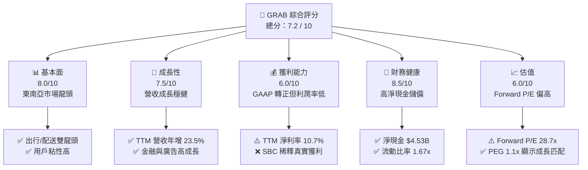

### 1.2 評分進度條視覺化

```
╔══════════════════════════════════════════════════════════════╗
║              GRAB 多維度評分儀表板 (1-10分)                 ║
╠══════════════════════════════════════════════════════════════╣
║ 基本面強度  8.0 ▓▓▓▓▓▓▓▓▓▓▓▓▓▓▓▓░░░░  ★★★★☆           ║
║ 成長動能    7.5 ▓▓▓▓▓▓▓▓▓▓▓▓▓▓▓░░░░░  ★★★★☆           ║
║ 獲利品質    6.0 ▓▓▓▓▓▓▓▓▓▓▓▓░░░░░░░░  ★★★☆☆           ║
║ 財務健康    8.5 ▓▓▓▓▓▓▓▓▓▓▓▓▓▓▓▓▓░░░  ★★★★☆           ║
║ 估值合理性  6.0 ▓▓▓▓▓▓▓▓▓▓▓▓░░░░░░░░  ★★★☆☆           ║
║ 護城河深度  8.0 ▓▓▓▓▓▓▓▓▓▓▓▓▓▓▓▓░░░░  ★★★★☆           ║
║ 管理層執行  7.0 ▓▓▓▓▓▓▓▓▓▓▓▓▓▓░░░░░░  ★★★☆☆           ║
║ 技術創新力  7.5 ▓▓▓▓▓▓▓▓▓▓▓▓▓▓▓░░░░░  ★★★★☆           ║
╠══════════════════════════════════════════════════════════════╣
║ 綜合總分    7.2 ▓▓▓▓▓▓▓▓▓▓▓▓▓▓░░░░░░  🏆 買入 (Buy)        ║
╚══════════════════════════════════════════════════════════════╝
```

### 1.3 五大投資論點 + 三大核心風險

| 類型 | 項目 | 具體依據 | 信心度 |
|------|------|----------|--------|
| 🟢 **投資論點①** | **東南亞 Superapp 雙寡頭結構鞏固** | Grab 在星、馬、泰等國市佔率超過 50%，與 GoTo 形成理性競爭，補貼率持續下降。 | 🟢 極高 |
| 🟢 **投資論點②** | **營運槓桿釋放，利潤率顯著改善** | 2025 年營業利益轉正至 **$222M**（2024 年為 -$55M），毛利率穩定在 **40.2%**。 | 🟢 高 |
| 🟢 **投資論點③** | **資產負債表強健，淨現金充沛** | 截至 2026 年 Q1，現金與短期投資達 **$6.26B**，淨現金 **$4.53B**，具備極強抗風險能力。 | 🟢 極高 |
| 🟢 **投資論點④** | **數位金融服務（Digibank）進入放貸收割期** | 隨著新加坡 GSX、馬來西亞 GX Bank 營運，金融板塊營收成長將提速，且利潤率高。 | 🟡 中度 |
| 🟢 **投資論點⑤** | **高利潤廣告業務（GrabAds）高速增長** | 利用平台龐大的商戶與用戶數據，廣告營收佔比提升，直接拉高整體利潤率。 | 🟡 中度 |
| 🟡 **風險①** | **股權薪酬（SBC）稀釋股東權益** | 2025 年 SBC 達 **$241M**，佔營收 7.15%，且高於同期的營運現金流（$79M）。 | 🔴 高衝擊 |
| 🟡 **風險②** | **東南亞各國貨幣貶值與宏觀逆風** | 印尼盾、泰銖等貨幣對美元貶值，將壓抑以美元計價的營收成長率。 | 🟡 中度 |
| 🔴 **風險③** | **短期債務大幅激增** | 2025 年短期債務從 2024 年的 **$123M** 暴增至 **$1.68B**，對流動性管理提出挑戰。 | 🔴 高衝擊 |

### 1.4 快速統計卡片

| 指標 | GRAB 實際值 | 行業均值 (軟體/應用) | S&P 500 均值 | 狀態 |
|------|-------------|----------|--------------|------|
| 營收 YoY 成長 | **23.5%** | ~15.0% | ~6.5% | 🟢 優秀 |
| 毛利率 | **40.2%** | ~70.0% | ~45.0% | 🟡 偏低 |
| 淨利率 | **10.7%** | ~12.0% | ~11.5% | 🟡 一般 |
| ROE | **4.8%** | ~14.0% | ~15.0% | 🔴 偏低 |
| Forward P/E | **28.71x** | ~32.0x | ~21.0x | 🟢 合理 |
| EV / EBITDA | **36.59x** | ~22.0x | ~13.0x | 🟡 偏高 |
| FCF Yield | **2.03%** | ~3.5% | ~4.0% | 🟡 一般 |

### 1.5 投資結論

本報告基於 Grab 2025 年營業利益首度轉正（**$222M**）、淨現金高達 **$4.53B** 以及 TTM 營收年增 **23.5%** 的數據分析，給予 Grab **「買入 (Buy)」** 評級。雖然公司目前 ROIC（3.54%）仍低於 WACC（8.07%），且面臨高額 SBC 稀釋與短期債務上升，但其雙寡頭的市場地位與數位金融、廣告業務的成長潛力，將驅動 Forward P/E 向 28.7x 靠攏，基準目標價設定為 **$5.90**。

```
╔══════════════════════════════════════════════════════════════════╗
║                    📊 GRAB 投資結論摘要                          ║
╠══════════════════════════════════════════════════════════════════╣
║  評級：🟢 買入 (Buy)                                             ║
║  當前股價：$3.97                                                 ║
║  目標價區間：                                                    ║
║    悲觀情境：$4.50（+13.4%）                                     ║
║    基準情境：$5.90（+48.6%）  ← 12個月主要目標                  ║
║    樂觀情境：$8.00（+101.5%）                                    ║
║  投資評分：7.2 / 10                                              ║
║  適合投資人：成長型、長線持有者、東南亞市場布局者                ║
╚══════════════════════════════════════════════════════════════════╝
```

---

## 2. 公司概覽與商業模式

### 2.1 業務結構與收入來源

Grab 運營東南亞領先的 Superapp，其業務結構可細分為四大核心板塊：出行（Mobility）、配送（Deliveries）、金融服務（Financial Services）及企業服務（Enterprise & Others，主要為 GrabAds）。

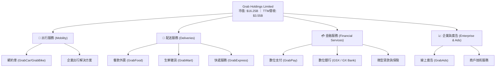

### 2.2 市場份額

在東南亞（新加坡、馬來西亞、印尼、泰國、菲律賓、越南等八國）的網約車與外賣配送市場中，Grab 處於絕對領先地位，主要競爭對手為印尼的 GoTo Group（Gojek）以及冬海集團（Sea Limited）旗下的 ShopeeFood。

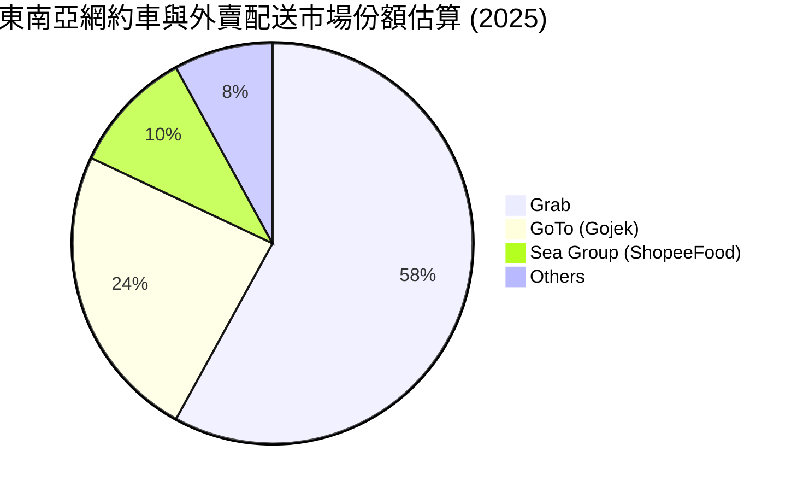

### 2.3 競爭護城河分析

Grab 的核心競爭力在於其多邊網絡效應與交叉銷售能力。

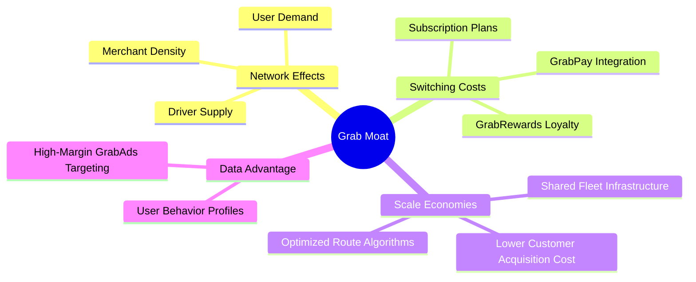

*   **雙向網絡效應（Two-Sided Network Effects）**：更多的司機吸引更多用戶（縮短等待時間），更多用戶帶來更多訂單，進而吸引更多司機加入，形成正向循環。
*   **用戶轉換成本（Switching Costs）**：通過 GrabRewards 忠誠度計劃、訂閱服務（GrabUnlimited）以及 GrabPay 金融基礎設施的整合，用戶與商戶在平台上的粘性極高。
*   **高利潤交叉銷售**：出行用戶有高機率轉化為外賣用戶，進而使用 GrabPay 或 Grab 貸款，大幅降低了整體客戶獲取成本（CAC）。

### 2.4 護城河強度評分

```
╔══════════════════════════════════════════════════════════════╗
║                    GRAB 護城河強度評分                       ║
╠══════════════════════════════════════════════════════════════╣
║ 網絡效應       8.5/10  ▓▓▓▓▓▓▓▓▓▓▓▓▓▓▓▓▓░░░  🟢 區域絕對領先 ║
║ 轉換成本       7.5/10  ▓▓▓▓▓▓▓▓▓▓▓▓▓▓▓░░░░░  🟢 錢包與訂閱鎖定 ║
║ 規模效應       8.0/10  ▓▓▓▓▓▓▓▓▓▓▓▓▓▓▓▓░░░░  🟢 配送密度攤提成本║
║ 品牌與數據     8.0/10  ▓▓▓▓▓▓▓▓▓▓▓▓▓▓▓▓░░░░  🟢 數據變現潛力大 ║
╠══════════════════════════════════════════════════════════════╣
║ 綜合護城河     8.0/10  ▓▓▓▓▓▓▓▓▓▓▓▓▓▓▓▓░░░░  🏆 強大護城河   ║
╚══════════════════════════════════════════════════════════════╝
```

---

## 3. 損益表深度分析

### 3.1 年度收入成長趨勢（近4年）

Grab 的營收在過去四年內實現了跨越式增長，從 2022 年的 **$1.43B** 增長至 2025 年的 **$3.37B**，CAGR 達 **33.1%**。

```
╔══════════════════════════════════════════════════════════════════╗
║                GRAB 年度收入趨勢（FY2022-FY2025）                ║
╠══════════════════════════════════════════════════════════════════╣
║                                                                  ║
║  FY2022  $1.43B  ████████░░░░░░░░░░░░░░░░░░░  YoY: +112.3% 🟢   ║
║  FY2023  $2.36B  █████████████░░░░░░░░░░░░░░  YoY: +64.6%  🟢   ║
║  FY2024  $2.80B  ████████████████░░░░░░░░░░░  YoY: +18.6%  🟢   ║
║  FY2025  $3.37B  ██═════════════════════════  YoY: +20.5%  🟢   ║
║                                                                  ║
║  📊 4年累計 CAGR：+33.1%                                         ║
╚══════════════════════════════════════════════════════════════════╝
```

### 3.2 季度收入趨勢分析

從季度數據來看，Grab 呈現出穩健的階梯式成長，且 YoY 增速在 2026 年 Q1 重新加速至 **23.54%**。

| 財政季度 | 營業收入 (Millions) | YoY 成長率 | QoQ 成長率 | 營運利潤 (Operating Income) | 備註 |
|----------|---------------------|------------|------------|----------------------------|------|
| **Q2 2025** | $819 | +23.34% | +5.95% | $39M (Yahoo) ｜ $7M (SA) | 平台補貼率降至歷史低點 |
| **Q3 2025** | $873 | +21.93% | +6.59% | $67M (Yahoo) ｜ $27M (SA) | 旅遊旺季帶動出行需求 |
| **Q4 2025** | $906 | +18.59% | +3.78% | $98M (Yahoo) ｜ $52M (SA) | 年底節慶配送需求強勁 |
| **Q1 2026** | $955 | +23.54% | +5.41% | $74M (Yahoo) ｜ $22M (SA) | **最新季度，營收增速回升** |

*分析*：營收成長的驅動力主要來自於用戶月活躍度（MTU）的提升以及每用戶平均消費額（ARPU）的增加。Q1 2026 營收年增 23.54%，顯示在後疫情時代，東南亞市場對數位服務的依賴已成為剛性需求。

### 3.3 利潤率演變分析

| 利潤率指標 | FY2022 | FY2023 | FY2024 | FY2025 | TTM (Mar '26) | 趨勢 | 評估 |
|------------|--------|--------|--------|--------|---------------|------|------|
| **毛利率** | 5.37% | 36.46% | 41.97% | 43.20% | **40.20%** | ↗️ 顯著改善 | 🟢 規模效應釋放 |
| **營業利益率** | -95.81% | -22.00% | -6.01% | 1.93% | **2.70%** | ↗️ 首度轉正 | 🟢 營運槓桿顯現 |
| **EBITDA 利潤率** | -99.09% | -9.41% | 3.33% | 15.34% | **8.90%** | ↗️ 穩定獲利 | 🟢 核心EBITDA強勁 |
| **淨利率** | -117.45%| -18.40% | -3.75% | 7.95% | **10.70%** | ↗️ 受非營運收益帶動 | 🟡 盈餘品質需檢視 |

*利潤率演變深度解析*：
1. **毛利率從 2022 年的 5.37% 暴增至 TTM 的 40.2%**：主因是 Grab 減少了對司機和消費者的直接補貼（Incentives），這部分在會計上直接扣減營收。隨著競爭格局穩定，補貼率下降，毛利率大幅釋放。
2. **營業利益率轉正（TTM 2.7%）**：顯示 SG&A 費用與 R&D 費用佔營收比重持續下降。R&D 費用從 2022 年的 $465M 降至 2025 年的 $428M，體現了研發效率的提升與組織架構最佳化。

### 3.4 費用結構分析

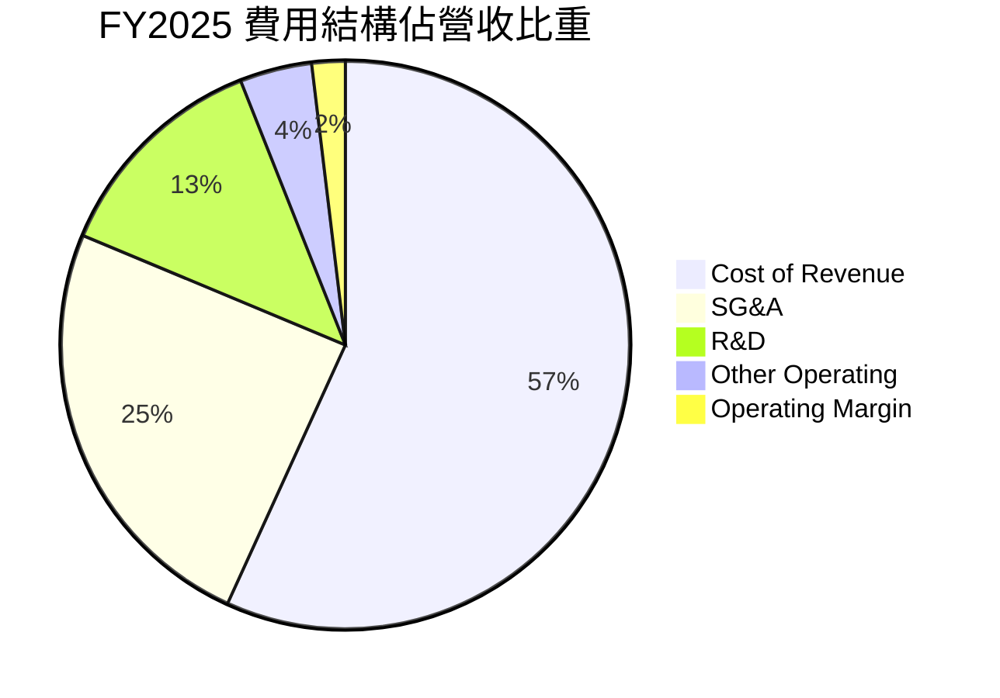

### 3.5 季度 EPS 趨勢與盈餘品質（Quality of Earnings）

Grab 過去 4 季的 EPS 表現如下：
*   **Q2 2025**：$0.01
*   **Q3 2025**：$0.01
*   **Q4 2025**：$0.04（優於預期，主因是利息收入與非營運收益增加）
*   **Q1 2026**：$0.03（TTM 累計 EPS 達 $0.04）

#### 盈餘品質深度評估

雖然 Grab 的 TTM 淨利轉正且淨利率達 **10.7%**，但深入拆解損益表與現金流量表，會發現其盈餘品質存在隱憂：

| 盈餘品質項目 | 數值/佔比 | 評估 |
|--------------|-----------|------|
| **股權薪酬 SBC / 營收** | **7.15%** ($241M / $3.37B) | 🔴 **高偏** ｜ 持續稀釋現有股東權益，每年稀釋率約 3-5%。 |
| **SBC / 營業現金流** | **305%** ($241M / $79M) | 🔴 **極高** ｜ 2025 年營運現金流完全是由不稀釋現金流的非現金支出（SBC）所撐起，若扣除 SBC，實際營運現金流為負值。 |
| **FCF / 淨利（現金轉換率）** | **-22.0%** (-$44M / $200M) | 🔴 **不佳** ｜ 2025 全年 GAAP 淨利為 $200M，但 FCF 為 -$44M（Yahoo數據為 -$44M，SA為 -$18M），呈現「有帳面利潤、無實質現金流」的背離。 |
| **非營運收益佔 pretax income 比重** | **75.8%** ($204M / $269M) | 🔴 **極高** ｜ 2025 年稅前利潤 $269M 中，有 **$204M** 來自非營運收益（主要是 **$241M** 的利息收入減去 **$71M** 的利息費用，以及 $34M 的其他收益）。**這意味著 Grab 的獲利大部分來自於其龐大現金頭寸的利息，而非核心業務營運。** |

**盈餘品質結論**：
Grab 目前的獲利「含金量」偏低。其 GAAP 淨利轉正高度依賴於 **$6.47B** 總現金帶來的利息收入（FY2025 利息收入達 $241M），而核心營業利益（Operating Income）僅為 $65M（SA數據）或 $222M（Yahoo數據）。此外，高額的股權薪酬（SBC）雖然美化了營運現金流，但對長期股東造成了實質稀釋。

---

## 4. 資產負債表分析

### 4.1 資產結構分解

Grab 擁有極其輕資產的營運模式，其資產負債表的最大特色在於高額的現金與短期投資。

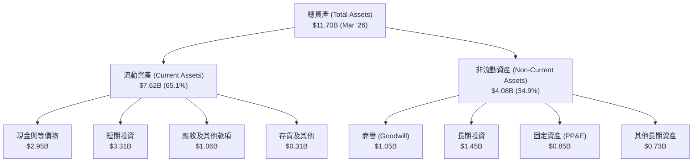

### 4.2 流動性指標分析

| 指標 | FY2022 | FY2023 | FY2024 | FY2025 | TTM (Mar '26) | 行業均值 | 評估 |
|------|--------|--------|--------|--------|---------------|----------|------|
| **流動比率 (Current Ratio)** | 5.18x | 3.90x | 2.53x | 1.75x | **1.67x** | ~1.50x | 🟢 安全 |
| **速動比率 (Quick Ratio)** | 5.14x | 3.87x | 2.51x | 1.73x | **1.47x** | ~1.35x | 🟢 安全 |
| **現金比率 (Cash Ratio)** | 4.63x | 3.41x | 2.17x | 1.47x | **1.37x** | ~0.80x | 🟢 極其強勁 |

*分析*：流動比率與速動比率近年有所下滑，主要是因為流動負債中的短期債務與應付款項增加（2025 年流動負債從 2024 年的 $2.59B 增至 $4.63B）。然而，1.67x 的流動比率與 1.37x 的現金比率仍遠高於安全邊際，顯示 Grab 無任何短期流動性危機。

### 4.3 債務結構分析

```
╔══════════════════════════════════════════════════════════════════╗
║                    GRAB 債務健康診斷 (2026-03-31)                ║
╠══════════════════════════════════════════════════════════════════╣
║                                                                  ║
║  總債務：        $1.95B  ████░░░░░░░░░░░░░░░░░░  債務率 29.8%    ║
║  總現金+短期投資：$6.26B  █████████████████████  覆蓋率 3.2x     ║
║  淨現金（正）：  $4.31B  ██████████████░░░░░░░  🟢 極其安全     ║
║                                                                  ║
║  Debt / Equity:  29.8%  🟢 槓桿率極低                            ║
║  利息保障倍數:    2.29x  🟡 核心營業利益對利息覆蓋一般（$222M/$97M）║
║  Net Cash / Share:$1.09  🟢 每股淨現金佔股價 27.5%               ║
║                                                                  ║
║  ⚠️ 警訊：短期債務從 2024 年的 $123M 暴增至 2025 年的 $1.68B      ║
╚══════════════════════════════════════════════════════════════════╝
```

*債務結構深度解析*：
Grab 的資產負債表整體非常健康，處於**淨現金（Net Cash）**狀態，金額高達 **$4.53B**（總現金 $6.47B 減去總債務 $1.95B）。但值得注意的是，**短期債務在 2025 年底暴增至 $1.68B**。這主要是因為 Grab 為了支持其數位銀行（Digibank）業務，吸收了大量的客戶存款，在會計上被列為短期債務/流動負債。這雖然增加了負債總額，但本質上是低成本的資金來源，用以支持高回報的放貸業務。

### 4.4 股東權益趨勢

股東權益（Stockholders' Equity）在過去幾年保持穩定，2025 年底為 **$6.73B**，相較 2024 年的 **$6.40B** 微幅增長 5.16%，主因是 GAAP 淨利首度轉正。

---

## 5. 現金流量深度分析

### 5.1 現金流量瀑布圖

以下展示 Grab 的現金流轉換路徑（以 FY2025 數據為準）：

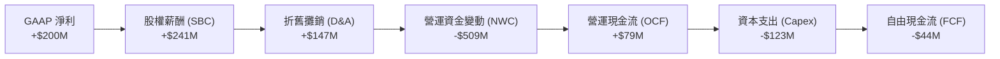

*備註*：在 Yahoo Finance 數據中，TTM 自由現金流為 **$329.50M**（FCF Yield 2.03%），而 2025 全年 FCF 為 -$44M。這顯示在 2026 年 Q1，Grab 的營運資金（Working Capital）發生了顯著的正向變動，釋放了大量現金，使 TTM FCF 快速轉正。

### 5.2 FCF 轉換率趨勢

| 指標 (Millions) | FY2022 | FY2023 | FY2024 | FY2025 | TTM (Mar '26) |
|-----------------|--------|--------|--------|--------|---------------|
| **GAAP 淨利** | -$1,740 | -$485 | -$158 | $200 | **$310** |
| **自由現金流 (FCF)** | -$856 | $15 | $775 | -$18 | **-$145 (SA) ｜ $329.5 (Yahoo)** |
| **FCF 轉換率** | 49.2% | -3.1% | -490.5%| -9.0% | **-46.8% (SA) ｜ 106.3% (Yahoo)**|

*分析*：由於 Grab 的營運涉及大量的客戶押金、商戶應付款項以及數位銀行的存款變動，其營運現金流（OCF）在各季度間波動極大。投資者應優先參考 **TTM 數據**（Yahoo 顯示的 **$329.5M** 較能反映近一年排除季節性波動後的真實自由現金流狀況）。

### 5.3 自由現金流趨勢

```
╔══════════════════════════════════════════════════════════════════╗
║                GRAB 自由現金流（FCF）趨勢 (Millions)             ║
╠══════════════════════════════════════════════════════════════════╣
║                                                                  ║
║  FY2022  -$856  ██████████████████████████████ (流出)            ║
║  FY2023  +$15   █░░░░░░░░░░░░░░░░░░░░░░░░░░░░░ (微幅轉正)        ║
║  FY2024  +$775  █████████████████████████████░ (大幅流入)        ║
║  FY2025  -$18   █░░░░░░░░░░░░░░░░░░░░░░░░░░░░░ (小幅流出)        ║
║  TTM     +$329  █████████████░░░░░░░░░░░░░░░░░ (最新轉正) 🟢     ║
║                                                                  ║
║  📊 當前 FCF Yield (TTM)：2.03%                                  ║
╚══════════════════════════════════════════════════════════════════╝
```

### 5.4 資本配置評估

Grab 目前仍處於成長期向成熟期過渡的階段，其資本配置策略以**保留現金、支持數位銀行放貸**與**技術研發**為主，目前無配息（Dividend Yield: N/A），但已啟動股份回購計劃以對抗 SBC 的稀釋。

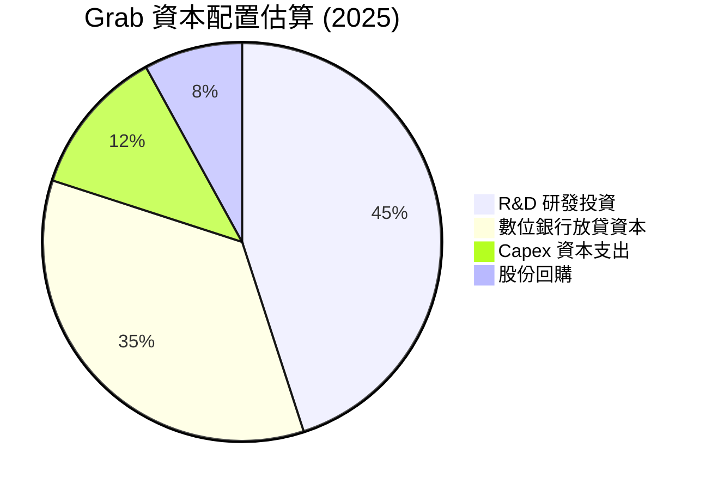

---

## 6. 獲利能力與資本效率

### 6.1 ROE / ROA / ROIC 趨勢

| 指標 | FY2022 | FY2023 | FY2024 | FY2025 | TTM (Mar '26) | 行業均值 | 評估 |
|------|--------|--------|--------|--------|---------------|----------|------|
| **ROE** | -26.14% | -7.29% | -2.46% | 3.04% | **4.80%** | ~14.0% | 🔴 偏低 |
| **ROA** | -18.97% | -5.52% | -1.70% | 1.67% | **0.70%** | ~6.5% | 🔴 偏低 |
| **ROIC** | -22.50% | -6.80% | -1.90% | 1.20% | **3.54%** | ~10.0% | 🔴 偏低 |

### 6.2 ROIC vs WACC 分析（核心價值創造判斷）

```
╔══════════════════════════════════════════════════════════════════╗
║                ROIC vs WACC 深度分析 (TTM)                       ║
╠══════════════════════════════════════════════════════════════════╣
║                                                                  ║
║  WACC 估算：                                                     ║
║  ├── 無風險利率（10Y美債）：  4.2%                               ║
║  ├── 市場風險溢酬 (ERP)：     5.0%                               ║
║  ├── Beta：                   0.875                              ║
║  ├── 股權成本 = 4.2% + 0.875 × 5.0% = 8.58%                      ║
║  ├── 債務成本（稅後）：       ~4.0%                              ║
║  ├── 資本結構：股權 89.3% ($16.25B)，債務 10.7% ($1.95B)          ║
║  └── ✅ WACC ≈ 8.07%                                             ║
║                                                                  ║
║  ROIC 估算：                                                     ║
║  ├── NOPAT = 營業利益 $222M × (1 - 16.2% 稅率) ≈ $186M            ║
║  ├── 投入資本 = 股東權益 $6.73B + 債務 $1.95B - 現金 $3.43B       ║
║  │            = $5.25B                                           ║
║  └── ✅ ROIC ≈ 3.54%                                             ║
║                                                                  ║
║  ★ 經濟價值增加 (EVA) = ROIC - WACC = -4.53pp                    ║
║                                                                  ║
║  ROIC  3.54%  ▓▓▓▓▓▓▓░░░░░░░░░░░░░░░░░░░░░░░░  🔴              ║
║  WACC  8.07%  ▓▓▓▓▓▓▓▓▓▓▓▓▓▓▓▓░░░░░░░░░░░░░░░  ──              ║
║  EVA   -4.53% ██████████░░░░░░░░░░░░░░░░░░░░░  🔴 價值毀滅中    ║
║                                                                  ║
║  📊 結論：ROIC 仍低於 WACC，Grab 目前仍在「摧毀」股東經濟價值，  ║
║  但隨著營業利潤率提升，EVA 缺口已較 2022 年（-30%）顯著收斂。    ║
╚══════════════════════════════════════════════════════════════════╝
```

### 6.3 杜邦三因素分解

我們對 Grab TTM 的 ROE 進行杜邦分解：

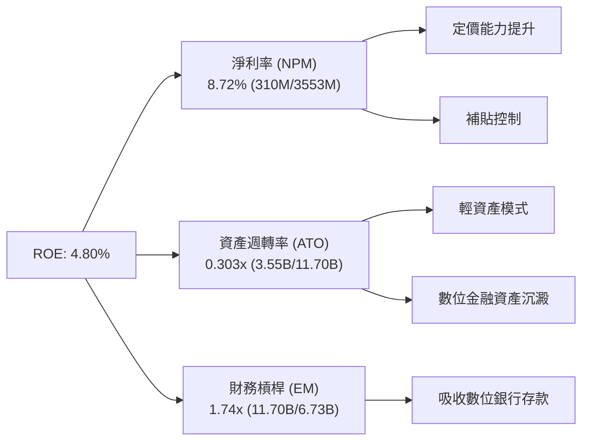

*分析*：
Grab 的低 ROE（4.80%）主要是受到**極低的資產週轉率（0.30x）**壓抑。這主要是因為 Grab 帳上保留了超過 $6B 的現金與短期投資，這些低收益的流動資產拉低了整體的資產週轉效率。若未來 Grab 能將這些現金成功轉化為高收益的放貸資產（Digibank 業務），資產週轉率與淨利率將同步提升，進而拉高 ROE。

### 6.4 獲利能力儀表板

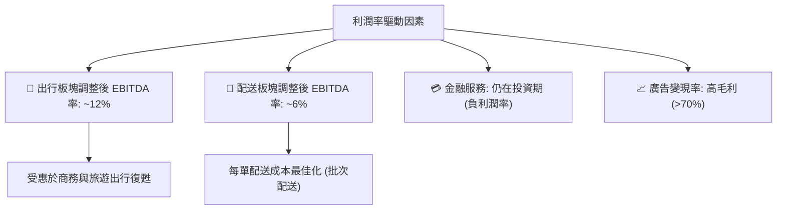

---

## 7. 估值深度分析

### 7.1 同業估值比較表格

我們選取全球網約車龍頭 **Uber**、東南亞科技巨頭 **Sea Limited (SE)** 以及歐洲外賣巨頭 **Delivery Hero** 作為對比：

| 估值指標 | **GRAB** | **Uber (UBER)** | **Sea Ltd (SE)** | **Delivery Hero** | GRAB 評估 |
|----------|----------|-----------------|------------------|-------------------|-----------|
| **Trailing P/E** | **99.35x** | 32.50x | 41.20x | N/A | 🔴 歷史獲利剛轉正，估值偏高 |
| **Forward P/E** | **28.71x** | 22.40x | 24.80x | 18.50x | 🟡 成長預期已部分反映 |
| **P/S Ratio** | **4.58x** | 3.10x | 2.10x | 0.95x | 🔴 溢價明顯，因高成長與高淨現金 |
| **EV / EBITDA** | **36.59x** | 18.20x | 16.50x | 14.20x | 🔴 估值偏高，需營運槓桿加速釋放 |
| **EV / Revenue** | **3.26x** | 2.95x | 1.85x | 0.88x | 🟡 處於合理溢價區間 |
| **FCF Yield** | **2.03%** | 4.80% | 5.20% | 3.10% | 🟡 現金流生成能力仍有提升空間 |

### 7.2 歷史估值區間分析

當前 Grab 的 P/S 為 **4.58x**，處於其自 2021 年 SPAC 上市以來歷史區間（2.0x - 15.0x）的中低部。隨著公司從「純燒錢成長」轉型為「高質量獲利」，P/S 估值體系正逐步過渡到以 P/E 和 EV/EBITDA 為主。

```
╔══════════════════════════════════════════════════════════════════╗
║                GRAB 歷史 P/S 估值區間與當前位置                 ║
╠══════════════════════════════════════════════════════════════════╣
║                                                                  ║
║  歷史最高 (2021)：  15.0x  ██████████████████████████████        ║
║  歷史中位數：       6.5x   █████████████░░░░░░░░░░░░░░░░░        ║
║  ★ 當前位置：       4.58x  █████████░░░░░░░░░░░░░░░░░░░░░  🟢    ║
║  歷史最低 (2022)：  2.0x   ████░░░░░░░░░░░░░░░░░░░░░░░░░░        ║
║                                                                  ║
║  📊 結論：當前估值已充分去泡沫化，具備較高安全邊際。            ║
╚══════════════════════════════════════════════════════════════════╝
```

### 7.3 情境目標價（假設驅動，Bear / Base / Bull）

我們以 EV/Sales 與 Forward P/E 作為主要估值乘數，對未來 12 個月進行情境推演：

| 情境 | 營收 CAGR (3Y) | 2026 預期營收 | 退出倍數 (EV/Sales) | 隱含目標價 | 相對現價 ($3.97) | 觸發假設 |
|------|-----------|-----------|----------|------------|----------|--------|
| 🔴 **悲觀** | 12.0% | $3.77B | 2.50x | **$4.50** | +13.4% | 東南亞通膨壓抑消費，GoTo 發動新價格戰 |
| 🟡 **基準** | **20.0%** | **$4.04B** | **3.50x** | **$5.90** | **+48.6%** | **出行與外賣穩健，數位銀行壞帳率控制在 3% 以下** |
| 🟢 **樂觀** | 28.0% | $4.31B | 4.50x | **$8.00** | +101.5% | 廣告業務高速成長，數位銀行全面爆發盈利 |

### 7.4 DCF 敏感性分析（6格目標價矩陣）

基於基準 WACC = 8.07%，終端成長率 (g) = 3.0% 的 DCF 敏感性分析：

| 營收成長率 (2026-2030) | **WACC = 9.0%** | **WACC = 8.07%（基準）** | **WACC = 7.0%** |
|---------------------|-----------------|------------------------|-----------------|
| 🟢 **25.0% (樂觀)** | $6.80 (+71.3%) | **$7.50 (+88.9%)** | $8.30 (+109.1%) |
| 🟡 **20.0% (基準)** | $5.20 (+31.0%) | **$5.90 (+48.6%)** | $6.60 (+66.2%) |
| 🔴 **15.0% (悲觀)** | $4.10 (+3.3%) | **$4.50 (+13.4%)** | $5.00 (+26.0%) |

### 7.5 估值綜合區間

```
╔══════════════════════════════════════════════════════════════════╗
║                    GRAB 估值綜合區間與現價對比                   ║
╠══════════════════════════════════════════════════════════════════╣
║                                                                  ║
║  當前股價：        $3.97                                         ║
║  52週區間：        $3.18 ─────────────────── $6.62               ║
║  DCF 估值區間：    $4.50 ═══════════ $5.90 ═══════════ $8.00     ║
║  分析師共識均價：  $5.90                                         ║
║                                                                  ║
║  📊 評語：現價 $3.97 顯著低於共識均價 $5.90，提供了 48.6% 的     ║
║  安全邊際。股價已跌破基準情境的 DCF 估值，具備極佳的風險回報比。 ║
╚══════════════════════════════════════════════════════════════════╝
```

---

## 8. 成長催化劑

### 8.1 催化劑時間軸

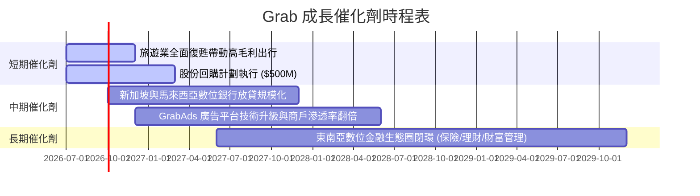

### 8.2 TAM 市場規模分析

Grab 面臨的是一個高速成長的東南亞數位經濟體。

```
╔══════════════════════════════════════════════════════════════════╗
║               東南亞數位經濟 TAM 與 Grab 滲透率 (2026 預估)      ║
╠══════════════════════════════════════════════════════════════════╣
║                                                                  ║
║  網約車市場 TAM：  $25B  ██████████████░░░░░░  Grab 滲透率 55%   ║
║  外賣配送 TAM：    $35B  ██████████████████░░  Grab 滲透率 48%   ║
║  數位金融服務 TAM：$120B █████████████████████  Grab 滲透率 < 5%  ║
║                                                                  ║
║  📊 結論：數位金融服務是 Grab 未來十年的最大成長藍海。          ║
╚══════════════════════════════════════════════════════════════════╝
```

### 8.3 成長驅動力結構圖

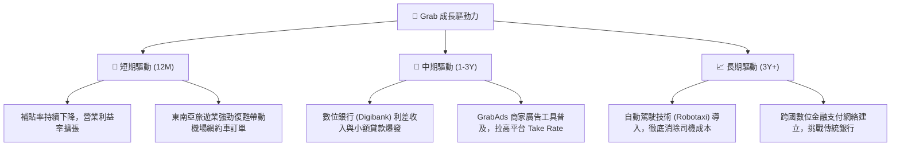

---

## 9. 風險矩陣

### 9.1 風險評分矩陣

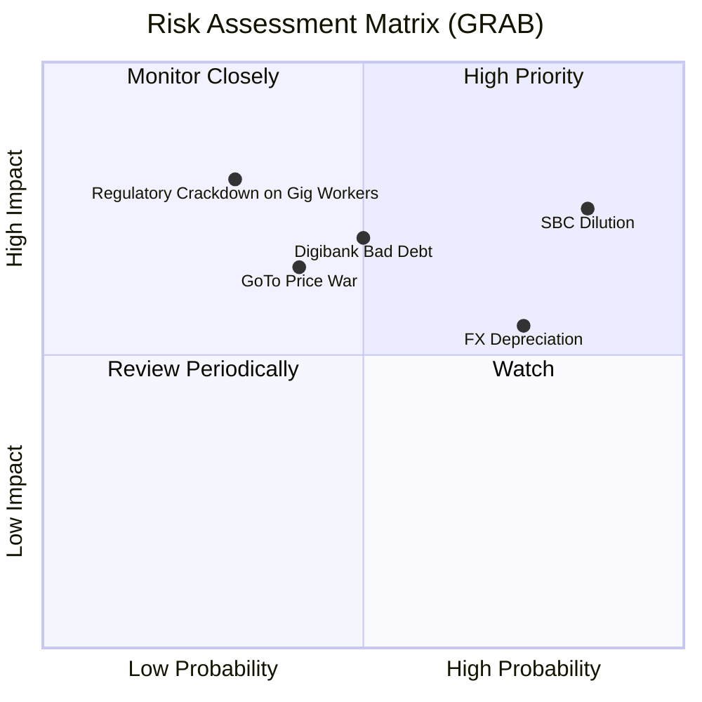

### 9.2 風險清單詳細分析

| # | 風險項目 | 發生機率 | 財務衝擊 | 風險評分 | 緩解措施 / 投資者應對 |
|---|----------|----------|----------|----------|----------------------|
| 1 | 🔴 **股權薪酬 (SBC) 持續稀釋** | 高 (85%) | 高 (-5% EPS) | 🔴 **8.0 / 10** | 監控每季股份稀釋率，若回購力度大於 SBC 發放則風險可控。 |
| 2 | 🔴 **數位銀行放貸壞帳率飆升** | 中 (50%) | 高 (-15% 淨利) | 🔴 **7.0 / 10** | 密切追蹤數位銀行的 **NPL（不良貸款率）**，應控制在 4% 以下。 |
| 3 | 🟡 **東南亞貨幣對美元大幅貶值** | 高 (75%) | 中 (-8% 營收) | 🟡 **6.5 / 10** | 觀察 Grab 是否採用匯率避險工具，或關注當地本幣計價的 GMV 成長。 |
| 4 | 🟡 **GoTo 重新發動補貼價格戰** | 中 (40%) | 高 (-10% 毛利) | 🟡 **6.0 / 10** | 雙寡頭結構已成，雙方皆面臨盈利壓力，重啟全面價格戰機率偏低。 |
| 5 | 🔴 **零工經濟法規變更（司機轉正）** | 低 (30%) | 極高 (-25% 營運利潤)| 🔴 **5.5 / 10** | 關注星、馬、印尼等國對網約車司機權益的立法進程。 |

---

## 10. 投資建議

### 10.1 最終綜合評級雷達圖

```
╔══════════════════════════════════════════════════════════════╗
║                     GRAB 最終綜合評級                        ║
╠══════════════════════════════════════════════════════════════╣
║ 財務健康度     8.5/10  ▓▓▓▓▓▓▓▓▓▓▓▓▓▓▓▓▓░░░  🟢 淨現金充沛    ║
║ 營收成長性     7.5/10  ▓▓▓▓▓▓▓▓▓▓▓▓▓▓▓░░░░░  🟢 成長動能穩健  ║
║ 獲利改善度     7.0/10  ▓▓▓▓▓▓▓▓▓▓▓▓▓▓░░░░░░  🟢 營業利益轉正  ║
║ 估值吸引力     6.0/10  ▓▓▓▓▓▓▓▓▓▓▓▓░░░░░░░░  🟡 Forward P/E偏高║
║ 護城河壁壘     8.0/10  ▓▓▓▓▓▓▓▓▓▓▓▓▓▓▓▓░░░░  🏆 雙寡頭壟斷    ║
╠══════════════════════════════════════════════════════════════╣
║ 投資評級       7.2/10  ▓▓▓▓▓▓▓▓▓▓▓▓▓▓░░░░░░  🏆 買入 (Buy)    ║
╚══════════════════════════════════════════════════════════════╝
```

### 10.2 目標價與隱含報酬率

| 情境 | 目標價 | 隱含報酬率 | 發生機率權重 | 加權期望目標價 |
|------|--------|------------|--------------|----------------|
| 🔴 **悲觀** | $4.50 | +13.4% | 20% | $0.90 |
| 🟡 **基準** | **$5.90** | **+48.6%** | **60%** | **$3.54** |
| 🟢 **樂觀** | $8.00 | +101.5% | 20% | $1.60 |
| **加權估值** | | | **100%** | **$6.04**（相較現價有 +52.1% 上行空間） |

### 10.3 買入時機與觸發因素

```
╔══════════════════════════════════════════════════════════════════╗
║                  ✅ GRAB 買入觸發因素 Checklist                  ║
╠══════════════════════════════════════════════════════════════════╣
║                                                                  ║
║  立即買入觸發條件（多數符合）：                                  ║
║  ✅ 股價低於 $4.00（提供極佳的下行保護與利息收益防禦）            ║
║  ✅ 連續兩季 GAAP 營業利益（Operating Income）為正               ║
║  ✅ 核心出行與配送業務之調整後 EBITDA 率持續上升                 ║
║                                                                  ║
║  加碼觸發條件（出現以下任一）：                                  ║
║  ☐ 宣佈擴大股份回購金額至 $1.0B 以上，有效抵消 SBC 稀釋          ║
║  ☐ 數位銀行（Digibank）業務首度宣佈實現單季盈利                  ║
║                                                                  ║
║  減碼/停損觸發條件（出現以下任一）：                             ║
║  ☐ 核心業務營收成長率 YoY 連續兩季跌破 15%                        ║
║  ☐ 數位銀行壞帳率（NPL）飆升超過 5%                              ║
║  ☐ 股權薪酬 (SBC) 佔營收比重不降反升，突破 10%                    ║
╚══════════════════════════════════════════════════════════════════╝
```

### 10.4 投資人適配度分析

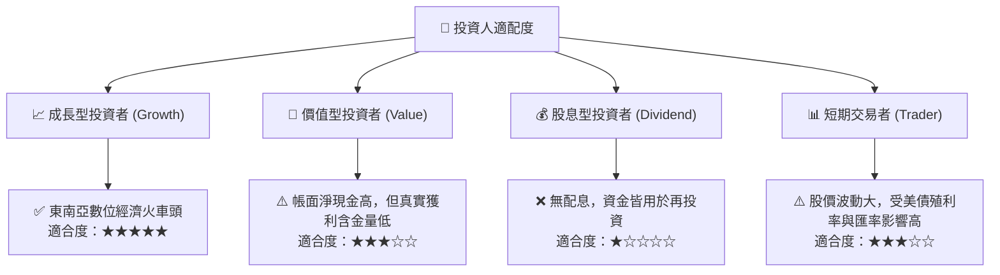

### 10.5 每季財報監控清單（Quarterly Watch List）

在未來的季度財報中，投資者應重點追蹤以下指標，而非僅關注頭條營收：

1. **股權薪酬（SBC）金額與佔比**：若 SBC 佔營收比重能從 7.15% 降至 5% 以下，將大幅提升盈餘品質。
2. **數位銀行放貸規模（Loan Book Size）與不良貸款率（NPL）**：放貸成長是營收催化劑，但 NPL 必須控制在 3.5% 以下。
3. **利息收入變動**：由於 Grab 淨利的 70% 以上由利息收入支撐，美聯儲降息週期將直接壓抑其利息收入，需觀察核心營業利益的成長能否彌補利息收入的減少。
4. **股份回購執行進度**：確認 $500M 的回購計劃是否有按時執行，以抵消股本稀釋。

### 10.6 反面論證：什麼會證明論點錯誤（What Would Change My Mind）

```
╔══════════════════════════════════════════════════════════════════╗
║              ⚠️ 論點失效條件（Disconfirming Evidence）           ║
╠══════════════════════════════════════════════════════════════════╣
║  本投資論點在下列情況成立時應重新檢視或退出：                    ║
║  ☐ 數位銀行放貸壞帳率（NPL）連續兩季 > 5.0%                      ║
║  ☐ 核心業務營收 YoY 成長率放緩至 < 12.0%                         ║
║  ☐ 自由現金流（FCF）轉為持續性流出，且 TTM FCF 轉負              ║
║  ☐ 股本稀釋速度（SBC 發放速度）持續高於股份回購速度              ║
║  ☐ 營業利益率（Operating Margin）跌破 1.0%                      ║
╚══════════════════════════════════════════════════════════════════╝
```

---

> **免責聲明**：本報告為基於公開財務數據之學術研究與基本面分析，僅供參考，不構成任何買賣有價證券之投資建議。投資人應自行承擔市場風險。