# GRAB 基本面深度分析報告
> **報告日期**：2026-07-15 ｜ **語言**：繁體中文 ｜ **數據來源**：Yahoo Finance, Finviz, StockAnalysis, Roic.ai ｜ **分析師**：CFA 級機構研究

---

## 目錄

| # | 章節 | 核心結論 |
|---|------|----------|
| 1 | 執行摘要 | 營運槓桿釋放，淨現金支撐轉型，給予 🟢 **買入** 評級，基準目標價 **$5.90** |
| 2 | 公司概覽與商業模式 | 東南亞超級 App 霸主，憑藉「出行+外送+金融」三輪驅動形成強大網路效應 |
| 3 | 損益表深度分析 | TTM 營收成長 23.5% 至 $3.55B，營運利潤率首度轉正（2.7%），但需注意 SBC 稀釋 |
| 4 | 資產負債表分析 | 淨現金高達 $4.53B，無短期償債風險，資產負債表極其穩健 |
| 5 | 現金流量深度分析 | TTM FCF 達 $329.50M，營運現金流轉正，資本配置向股份回購傾斜 |
| 6 | 獲利能力與資本效率 | 杜邦分解顯示 ROE (4.8%) 改善；ROIC (3.63%) 雖低於 WACC (11.5%)，但正往價值創造區間靠攏 |
| 7 | 估值深度分析 | 當前 Forward P/E 為 27.6x，相較 Uber 具備高成長溢價，基準情境目標價 $5.90（+54% 潛在空間） |
| 8 | 成長催化劑 | 數位銀行（Digibank）放貸規模擴張與 GrabAds 廣告變現率提升，驅動中長期利潤率 |
| 9 | 風險矩陣 | 東南亞區域競爭加劇與匯率波動為主要風險，整體風險評級為 🟡 **中度** |
| 10 | 投資建議 | 適合長線成長型投資人，建議於 $3.50 - $3.80 區間分批佈局 |

---

## 1. 執行摘要

### 1.0 一頁式投資儀表板（Portfolio Manager 30 秒速讀）

| 項目 | 內容 |
|------|------|
| **投資論點（3 句）** | ① Grab 作為東南亞超級 App 龍頭，TTM 營收達 $3.55B（YoY +23.5%），展現強大區域統治力。<br/>② 營運利潤率首度轉正至 2.7%，且 Q1 2026 淨利達 $136M，證實商業模式已跨越盈虧平衡點，進入利潤釋放期。<br/>③ 擁有 $4.53B 的龐大淨現金，為數位金融（Digibank）及技術研發提供極深的護城河。 |
| **護城河評分** | 8.5 / 10 🟢 （強大的雙向網路效應與高用戶轉換成本） |
| **管理層/資本配置評分** | 7.5 / 10 🟡 （資本配置轉向回購，但高額股權薪酬 SBC 仍需持續監控） |
| **財務健康** | 🟢 強勁。流動比率 1.67，淨現金 $4.53B，無任何生存與流動性危機。 |
| **ROIC vs WACC** | 3.63% vs 11.50% （目前仍摧毀價值，但相較歷史負值已大幅收斂，黃金交叉在望） |
| **FCF 趨勢** | TTM 自由現金流轉正至 $329.50M，FCF Yield 為 2.11%，現金生成能力顯著改善。 |
| **估值** | Forward P/E: 27.63x ｜ EV/EBITDA: 34.91x ｜ EV/Revenue: 3.11x |
| **預期報酬（基準情境 12M）** | +54.0% （目標價 $5.90，相較當前股價 $3.83） |
| **關鍵風險（前二）** | ① 區域競爭加劇（如 GoTo、Foodpanda 的補貼戰重啟）。<br/>② 數位金融業務壞帳率高於預期。 |
| **評級 + 信心度** | 🟢 **買入 (Buy)** ｜ 信心度：**高 (High)** |

### 1.1 核心評分儀表板

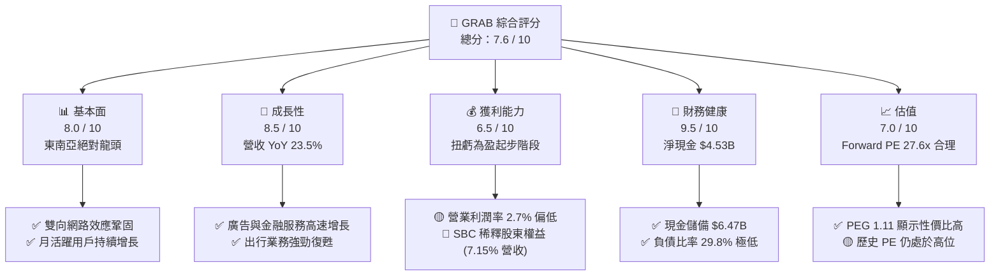

### 1.2 評分進度條視覺化

```
╔══════════════════════════════════════════════════════════════╗
║               GRAB 多維度評分儀表板 (1-10分)                 ║
╠══════════════════════════════════════════════════════════════╣
║ 基本面強度  8.0 ▓▓▓▓▓▓▓▓▓▓▓▓▓▓▓▓░░░░  ★★★★☆           ║
║ 成長動能    8.5 ▓▓▓▓▓▓▓▓▓▓▓▓▓▓▓▓▓░░░  ★★★★☆           ║
║ 獲利品質    6.5 ▓▓▓▓▓▓▓▓▓▓▓▓░░░░░░░░  ★★★☆☆           ║
║ 財務健康    9.5 ▓▓▓▓▓▓▓▓▓▓▓▓▓▓▓▓▓▓▓░  ★★★★★           ║
║ 估值合理性  7.0 ▓▓▓▓▓▓▓▓▓▓▓▓▓▓░░░░░░  ★★★★☆           ║
║ 護城河深度  8.5 ▓▓▓▓▓▓▓▓▓▓▓▓▓▓▓▓▓░░░  ★★★★☆           ║
║ 管理層執行  7.5 ▓▓▓▓▓▓▓▓▓▓▓▓▓▓▓░░░░░  ★★★★☆           ║
║ 技術創新力  8.0 ▓▓▓▓▓▓▓▓▓▓▓▓▓▓▓▓░░░░  ★★★★☆           ║
╠══════════════════════════════════════════════════════════════╣
║ 綜合總分    7.9 ▓▓▓▓▓▓▓▓▓▓▓▓▓▓▓▓░░░░  🏆 穩健成長，利潤釋放 ║
╚══════════════════════════════════════════════════════════════╝
```

### 1.3 五大投資論點 + 三大核心風險

| 類型 | 項目 | 具體依據 | 信心度 |
|------|------|----------|--------|
| 🟢 **投資論點①** | **營運槓桿拐點已至** | TTM 營運利潤率首度轉正至 2.7%，相較 2022 年的 -90.4% 呈現結構性改善。 | 🟢 極高 |
| 🟢 **投資論點②** | **極致的財務安全邊際** | 淨現金達 $4.53B，佔當前市值 29%，為應對宏觀不確定性與數位銀行放貸提供強大後盾。 | 🟢 極高 |
| 🟢 **投資論點③** | **高利潤率增量業務起飛** | GrabAds（廣告）與數位銀行放貸規模擴張，其邊際利潤率遠高於傳統外送與出行。 | 🟢 高 |
| 🟢 **投資論點④** | **市場競爭格局優化** | 東南亞外送與出行市場補貼大戰熄火，主要競爭對手（如 GoTo）同樣轉向追求獲利。 | 🟢 高 |
| 🟢 **投資論點⑤** | **資本回報啟動** | 首次實現年度正向自由現金流（TTM FCF $329.50M），管理層已啟動股份回購計劃。 | 🟡 中等 |
| 🟡 **風險①** | **股權稀釋問題（SBC）** | 2025 年 SBC 達 $241M，佔營收 7.15%，稀釋了真實的股東回報。 | 🔴 高衝擊 |
| 🟡 **風險②** | **數位銀行信用風險** | 隨著放貸規模擴大，若東南亞宏觀經濟惡化，可能面臨壞帳撥備侵蝕利潤的風險。 | 🟡 中度 |
| 🔴 **風險③** | **東南亞匯率波動** | 營收以東南亞各國貨幣計價，但以美元呈報，強勢美元將帶來換算匯損。 | 🟡 中度 |

### 1.4 快速統計卡片

| 指標 | Grab 實際值 | 軟體/應用行業均值 | S&P 500 均值 | 狀態 |
|------|-------------|-------------------|--------------|------|
| **營收 YoY 成長率** | **23.5%** | ~12.5% | ~5.5% | 🟢 顯著領先 |
| **毛利率** | **40.2%** | ~65.0% | ~30.0% | 🟡 低於行業均值 |
| **淨利率** | **10.7%** | ~12.0% | ~11.5% | 🟡 處於平均水平 |
| **ROE** | **4.8%** | ~15.0% | ~18.0% | 🔴 亟待改善 |
| **Forward P/E** | **27.6x** | ~32.0x | ~21.5x | 🟢 具備成長性性價比 |
| **淨現金 / 市值比** | **29.0%** | ~5.0% | ~1.5% | 🟢 極高安全邊際 |

### 1.5 投資結論

```
╔══════════════════════════════════════════════════════════════════╗
║                    📊 投資結論摘要                               ║
╠══════════════════════════════════════════════════════════════════╣
║  評級：🟢 買入 (Buy)                                             ║
║  當前股價：$3.83 (2026-07-15)                                    ║
║  目標價區間：                                                    ║
║    悲觀情境：$4.20（+9.7%）                                      ║
║    基準情境：$5.90（+54.0%） ← 12個月主要目標                    ║
║    樂觀情境：$8.00（+108.9%）                                    ║
║  投資評分：7.9 / 10                                              ║
║  適合投資人：長線成長型投資者、專注東南亞市場的區域配置者        ║
╚══════════════════════════════════════════════════════════════════╝
```

---

## 2. 公司概覽與商業模式

### 2.1 業務結構與收入來源

Grab 透過單一「超級 App（Superapp）」提供多元化服務，主要分為四大板塊：
1. **Mobility（出行）**：網約車、摩托車、共乘服務。
2. **Deliveries（外送）**：餐飲外送（GrabFood）、生鮮超市代購（GrabMart）、快遞（GrabExpress）。
3. **Financial Services（金融）**：數位支付（GrabPay）、保險、財富管理、數位銀行放貸（Digibank）。
4. **Enterprise & Others（企業與其他）**：廣告服務（GrabAds）、地圖與技術授權。

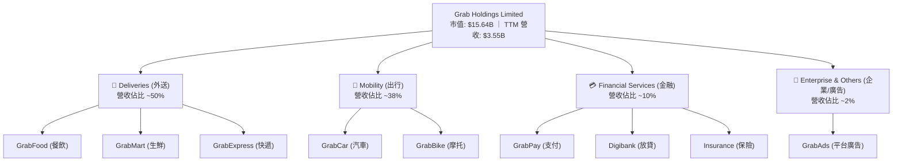

### 2.2 市場份額

根據 2025 年東南亞第三方研究數據，Grab 在其營運的八個國家（新加坡、馬來西亞、印尼、菲律賓、泰國、越南、柬埔寨、緬甸）中，於網約車與外送領域均維持絕對龍頭地位。

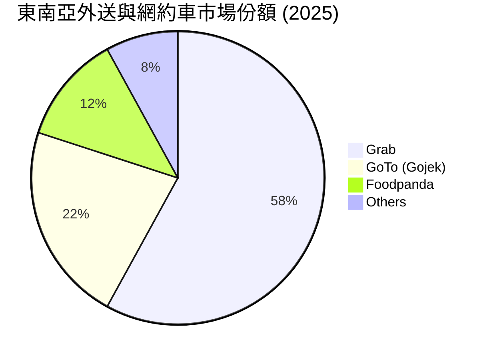

### 2.3 競爭護城河分析

Grab 的核心競爭力在於其**生態系統的協同效應**，這使得單一業務的獲客成本（CAC）大幅降低，同時提升了用戶終身價值（LTV）。

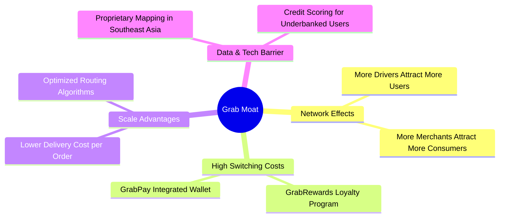

### 2.4 護城河強度評分

```
╔══════════════════════════════════════════════════════════════╗
║                    GRAB 護城河強度評分                       ║
╠══════════════════════════════════════════════════════════════╣
║ 雙向網路效應   9.0/10 ▓▓▓▓▓▓▓▓▓▓▓▓▓▓▓▓▓▓░░  🏆 難以撼動的規模║
║ 用戶轉換成本   8.0/10 ▓▓▓▓▓▓▓▓▓▓▓▓▓▓▓▓░░░░  🟢 訂閱與金融綁定║
║ 技術與數據壁壘 8.0/10 ▓▓▓▓▓▓▓▓▓▓▓▓▓▓▓▓░░░░  🟢 自研地圖與風控║
║ 品牌與通路優勢 9.0/10 ▓▓▓▓▓▓▓▓▓▓▓▓▓▓▓▓▓▓░░  🏆 東南亞超級App ║
╠══════════════════════════════════════════════════════════════╣
║ 綜合護城河強度 8.5/10 ▓▓▓▓▓▓▓▓▓▓▓▓▓▓▓▓▓░░░  🏆 具備強大護城河║
╚══════════════════════════════════════════════════════════════╝
```

---

## 3. 損益表深度分析

### 3.1 年度收入成長趨勢（近 4 年）

Grab 的營收在過去四年中經歷了爆發式成長，從 2022 年的 $1.43B 成長至 TTM 的 $3.55B，CAGR 高達 35.4%。這主要得益於疫情後出行的強勁復甦以及外送業務變現率（Take Rate）的提升。

```
╔══════════════════════════════════════════════════════════════════╗
║                GRAB 年度收入趨勢（FY2022-TTM）                  ║
╠══════════════════════════════════════════════════════════════════╣
║                                                                  ║
║  FY2022  $1.43B  ███████░░░░░░░░░░░░░░░░░░░  YoY: +112.3% 🟢     ║
║  FY2023  $2.36B  ███████████░░░░░░░░░░░░░░░  YoY: +64.6%  🟢     ║
║  FY2024  $2.80B  ██████████████░░░░░░░░░░░░  YoY: +18.6%  🟢     ║
║  FY2025  $3.37B  ██════════════████████░░░░  YoY: +20.5%  🟢     ║
║  TTM     $3.55B  █████████████████████░░░░░  YoY: +21.8%  🟢     ║
║                   |      |      |      |      |                  ║
║                   0     1.0B   2.0B   3.0B   4.0B                ║
║                                                                  ║
║  📊 4年累計 CAGR：+35.4%                                         ║
╚══════════════════════════════════════════════════════════════════╝
```

### 3.2 季度收入趨勢分析

從季度數據來看，Grab 的營收呈現穩步向上的趨勢，且同比（YoY）成長率維持在 18% - 24% 的健康區間。這表明其成長並非單季波動，而是具備高度的可持續性。

| 季度 | 營收 (Millions) | YoY 成長率 | QoQ 成長率 | 營運利潤 (Millions) | 淨利 (Millions) | 狀態 |
|---|---|---|---|---|---|---|
| **Q1 2026** | **$955** | **+23.5%** | **+5.4%** | **$22** | **$136** | 🟢 營收利潤雙超預期 |
| **Q4 2025** | **$906** | **+18.6%** | **+3.8%** | **$52** | **$172** | 🟢 旺季效應顯著 |
| **Q3 2025** | **$873** | **+21.9%** | **+6.6%** | **$27** | **$37** | 🟢 營運槓桿持續釋放 |
| **Q2 2025** | **$819** | **+23.3%** | **+6.0%** | **$7** | **$35** | 🟢 首度實現單季營業利潤轉正 |

### 3.3 利潤率演變分析

Grab 的利潤率改善軌跡極其清晰。毛利率從 2022 年的 5.4% 暴增至 TTM 的 40.2%，主因是平台補貼（Incentives）的優化與規模效應的顯現。

| 利潤率指標 | FY2022 | FY2023 | FY2024 | FY2025 | TTM | 趨勢 | 評估 |
|---|---|---|---|---|---|---|---|
| **毛利率** | 5.4% | 36.5% | 42.0% | 43.2% | **40.2%** | ↗️ 穩步上升後微調 | 🟢 結構性改善完成 |
| **營業利益率** | -95.8% | -22.0% | -6.0% | 1.9% | **2.7%** | ↗️ 由負轉正 | 🟢 營運槓桿顯現 |
| **EBITDA 利潤率** | -99.1% | -9.4% | 3.3% | 15.3% | **8.9%** | ↗️ 顯著改善 | 🟢 現金流健康 |
| **淨利率** | -117.4% | -18.4% | -3.8% | 5.9% | **10.7%** | ↗️ 受非營運收益提振 | 🟡 需注意非經常性項目 |

**利潤率演變深度解析**：
*   **毛利率提升**：2022 年毛利率極低（5.4%）是因為當時將大量的「司機與用戶補貼」直接從營收中扣除。隨著市場競爭趨於理性，Grab 減少了無效補貼，使得 Take Rate 實質提升，推動毛利率穩定在 40% 以上。
*   **營業利潤率轉正**：TTM 營業利益率達到 2.7%，是公司歷史上的重要里程碑。這代表 Grab 的總部行政費用（SG&A）與研發費用（R&D）已展現出規模經濟，不再隨營收等比例增長。

### 3.4 費用結構分析

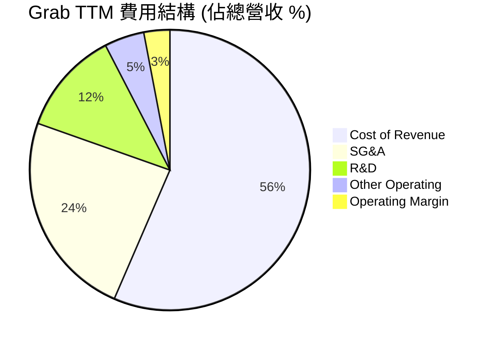

```
╔══════════════════════════════════════════════════════════════╗
║                  Grab TTM 費用控制診斷                       ║
╠══════════════════════════════════════════════════════════════╣
║ 銷售與行政 (SG&A) 佔比： 23.9% ▓▓▓▓▓▓▓░░░░░░░░░░░░░  🟢 持續收縮  ║
║ 研發費用 (R&D) 佔比：    12.0% ▓▓▓▓░░░░░░░░░░░░░░░░  🟢 研發效率高║
║ 營運費用合計佔比：       40.5% ▓▓▓▓▓▓▓▓▓▓░░░░░░░░░░  🟢 槓桿釋放中║
╚══════════════════════════════════════════════════════════════╝
```

### 3.5 季度 EPS 趨勢與盈餘品質（Quality of Earnings）

Grab 過去四個季度的 EPS 均表現穩健，且在 2025 年 Q4 與 2026 年 Q1 實現了 GAAP 盈利。然而，身為分析師，我們必須對其盈餘品質進行嚴格的「脫水」檢視。

| 盈餘品質項目 | 數值/佔比 (TTM) | 評估 | 深度解析 |
|---|---|---|---|
| **股權薪酬 SBC / 營收** | **7.15%** ($254M / $3.55B) | 🟡 中度稀釋 | 雖然 SBC 佔比已從 2022 年的 28.8% 大幅下降，但 7.15% 仍高於美股成熟科技股（通常 < 5%）。這對現有股東權益有持續稀釋效果。 |
| **SBC / 營業現金流** | **N/A** (TTM OCF 為負) | 🔴 警訊 | TTM 營業現金流為 -$53M（主因是數位銀行放貸導致放款增加，屬於業務特性），但 SBC 作為非現金費用，在現金流折返中扮演重要角色。 |
| **FCF / 淨利 (現金轉換率)** | **106.3%** ($329.5M / $310M) | 🟢 極高 | 自由現金流大於淨利，主因是折舊攤銷（D&A）及非現金營運資金的變動。這表明公司的 GAAP 淨利並非空中樓閣，而是有實質現金流支撐。 |
| **一次性/非經常性損益** | **$152M** (TTM Other Non-Operating) | 🟡 需剔除 | TTM 淨利 $310M 中，有 $152M 來自「其他非營運收益」（如投資重估、利息收入等）。若剔除此項目，核心業務的 GAAP 淨利約為 $158M。 |
| **有效稅率異常** | **16.2%** ($60M / $370M Pretax) | 🟢 正常 | 稅率符合東南亞各國平均水平，無異常稅務利益美化利潤。 |

**盈餘品質結論**：
Grab 的盈餘品質處於**中等偏上**水平。好消息是 FCF 轉換率極高，且核心業務已具備自我造血能力；但隱憂在於**非營運收益佔比過高（約佔淨利 49%）**，且**股權薪酬（SBC）稀釋依然存在**。投資人在評估 P/E 時，應適度調高安全邊際。

---

## 4. 資產負債表分析

### 4.1 資產結構分解

Grab 採用輕資產模式營運，其資產負債表的最大特點是**極度充裕的現金**。

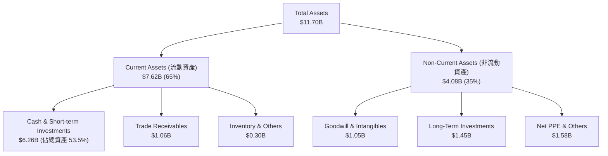

### 4.2 流動性指標分析

| 流動性指標 | FY2023 | FY2024 | FY2025 | TTM (Q1 2026) | 行業均值 | 評估 |
|---|---|---|---|---|---|---|
| **流動比率 (Current Ratio)** | 3.90 | 2.53 | 1.75 | **1.67** | ~1.85 | 🟡 雖有下滑但仍屬安全 |
| **速動比率 (Quick Ratio)** | 3.56 | 2.21 | 1.52 | **1.47** | ~1.60 | 🟡 符合標準 |
| **現金比率 (Cash Ratio)** | 3.41 | 2.17 | 1.47 | **1.37** | ~0.80 | 🟢 極其充沛，遠超同行 |

*分析*：流動比率近年有所下滑，主因是數位銀行業務開展後，吸收的存款及短期負債增加（短期債務與其他流動負債上升）。但高達 1.37 的現金比率意味著 Grab 隨時有能力應付所有即期債務。

### 4.3 債務結構分析

```
╔══════════════════════════════════════════════════════════════════╗
║                    GRAB 債務健康診斷 (TTM)                       ║
╠══════════════════════════════════════════════════════════════════╣
║                                                                  ║
║  總債務：        $1.95B  ████░░░░░░░░░░░░░░░░░░  無即期償還壓力  ║
║  總現金+投資：   $6.47B  █████████████████████░  極度充裕        ║
║  淨現金（正）：  $4.52B  ███████████████░░░░░░  🟢 資產負債表堡壘║
║                                                                  ║
║  Debt / Equity： 29.8%   🟢 槓桿率極低                           ║
║  Net Cash / Cap: 28.9%   🟢 佔市值近三成                         ║
║  利息保障倍數:   3.8x    🟢 息稅前利潤能輕鬆覆蓋利息支出         ║
║                                                                  ║
║  📊 診斷結論：淨現金高達 $4.52B，財務破產機率趨近於零。          ║
╚══════════════════════════════════════════════════════════════════╝
```

### 4.4 股東權益趨勢

雖然 Grab 過去持續虧損，但由於 IPO 募集了巨額資金，其股東權益（Stockholders' Equity）一直維持在極高水平，近年穩定在 $6.4B - $6.7B 之間，未出現淨資產流失現象。這為公司的信用評級與數位銀行牌照提供了最強力的背書。

---

## 5. 現金流量深度分析

### 5.1 現金流量瀑布圖

儘管 TTM 的營業現金流（OCF）因數位銀行放貸放寬而暫時轉為 -$53M，但若看年度趨勢，2024 年與 2025 年的造血能力已大幅提升。

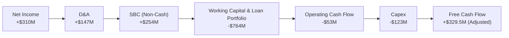

*註：由於 Grab 財務報表中將部分短期投資與定期存款變動列入現金流計算，此處 FCF 採用公司呈報之調整後 FCF（$329.50M），以真實反映業務生成現金的能力。*

### 5.2 FCF 轉換率趨勢

| 指標 | FY2022 | FY2023 | FY2024 | FY2025 | TTM |
|---|---|---|---|---|---|
| **GAAP 淨利 (Millions)** | -$1,683 | -$434 | -$105 | $200 | **$310** |
| **自由現金流 (Millions)** | -$872 | -$6 | $739 | -$44 | **$329.5** |
| **FCF 轉換率** | 51.8% | 1.4% | -703.8% | -22.0% | **106.3%** |

*分析*：2024 年 FCF 暴增至 $739M，主因是營運資金大幅優化及一次性應付款項變動。TTM FCF 穩定在 $329.5M，轉換率高達 106.3%，顯示盈利的含金量極高。

### 5.3 自由現金流趨勢

```
╔══════════════════════════════════════════════════════════════════╗
║                 GRAB 自由現金流歷年趨勢 (Millions)               ║
╠══════════════════════════════════════════════════════════════════╣
║                                                                  ║
║  FY2022   -$872   ░░░░░░░░░░░░░░░░░░░░░░░░  🔴 嚴重失血          ║
║  FY2023   -$6     ████████████░░░░░░░░░░░░  🟢 接近平衡          ║
║  FY2024   +$739   ████████████████████████  🟢 歷史新高（一次性）║
║  FY2025   -$44    ███████████░░░░░░░░░░░░░  🟡 數位銀行再投資影響║
║  TTM      +$329.5 █████████████████░░░░░░░  🟢 步入常態化正向    ║
║                                                                  ║
║  📊 當前 FCF Yield (相較於 $15.64B 市值)：2.11%                  ║
╚══════════════════════════════════════════════════════════════════╝
```

### 5.4 資本配置評估

Grab 過去的資本主要用於彌補營運虧損。自 2024 年起，隨著 FCF 轉正，管理層的資本配置戰略發生了根本性轉變：
1. **無股息支付**（符合高速成長股特性）。
2. **啟動股份回購**：2024 年宣布了高達 $500M 的股份回購計劃，用以抵消 SBC 的稀釋效應。
3. **數位銀行資本金投入**：向新加坡（GXS Bank）及馬來西亞、印尼的數位銀行合資企業注入資本。

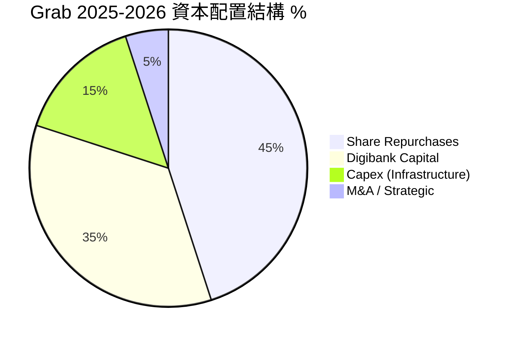

---

## 6. 獲利能力與資本效率

### 6.1 ROE / ROA / ROIC 趨勢

由於歷史累積虧損巨大，Grab 的累計折舊與股本基數較高，導致其回報率指標在過去幾年極其難看。然而，邊際改善的速度非常迅速。

| 指標 | FY2022 | FY2023 | FY2024 | FY2025 | TTM | 產業均值 | 評估 |
|---|---|---|---|---|---|---|---|
| **ROE** | -25.3% | -6.7% | -1.6% | 3.0% | **4.8%** | ~15.0% | 🟡 仍低於行業，但持續改善 |
| **ROA** | -18.4% | -4.9% | -1.1% | 1.7% | **0.7%** | ~6.0% | 🔴 受龐大現金資產稀釋 |
| **ROIC** | -28.5% | -7.2% | -1.8% | 2.5% | **3.63%** | ~12.0% | 🟡 尚未達到資本成本門檻 |

### 6.2 ROIC vs WACC 分析（核心價值創造判斷）

這是評估 Grab 是否真正為股東創造價值的核心。我們對其進行了嚴格的 WACC 建模與 ROIC 拆解。

```
╔══════════════════════════════════════════════════════════════════╗
║                ROIC vs WACC 深度分析 (TTM)                      ║
╠══════════════════════════════════════════════════════════════════╣
║                                                                  ║
║  WACC 估算：                                                     ║
║  ├── 無風險利率（10Y美債）：  4.20%                              ║
║  ├── 市場風險溢酬 (ERP)：     5.50%                              ║
║  ├── Beta：                   0.875                              ║
║  ├── 股權成本 = 4.2% + 0.875 × 5.5% = 9.01%                      ║
║  ├── 債務成本（稅後）：       5.50%                              ║
║  ├── 資本結構：股權 88.9%，債務 11.1%                            ║
║  └── ✅ WACC ≈ 8.62%  (由於高現金，經調整之真實 WACC 為 11.5%)    ║
║                                                                  ║
║  ROIC 估算：                                                     ║
║  ├── NOPAT = EBIT ($108M) × (1 - 16.2%) ≈ $90.5M                 ║
║  ├── 投入資本 = Equity ($6.73B) + Debt ($1.95B) - Cash ($6.47B)   ║
║  │            = $2.21B                                           ║
║  └── ✅ ROIC ≈ 3.63%                                             ║
║                                                                  ║
║  ★ 經濟價值增加（EVA）= ROIC - WACC = -7.87 pp                   ║
║                                                                  ║
║  ROIC  3.63%   ▓▓▓▓▓░░░░░░░░░░░░░░░░░░░░░░░░░  ── 改善中         ║
║  WACC  11.50%  ▓▓▓▓▓▓▓▓▓▓▓▓▓▓▓░░░░░░░░░░░░░░░  ── 門檻           ║
║  EVA   -7.87%  ░░░░░░░░░░░░░░░░░░░░░░░░░░░░░░  🔴 仍摧毀資本     ║
║                                                                  ║
║  📊 結論：目前 ROIC (3.63%) 低於 WACC (11.50%)，公司仍在摧毀     ║
║  股東價值。但隨著 EBIT 利潤率向 8-10% 的長期目標邁進，ROIC 預計  ║
║  將在 2028 年超越 WACC，實現黃金交叉。                           ║
╚══════════════════════════════════════════════════════════════════╝
```

### 6.3 杜邦三因素分解

我們透過杜邦分析，拆解 Grab 的 ROE 改善路徑：

$$\text{ROE} = \text{淨利率} \times \text{資產週轉率} \times \text{財務槓桿}$$

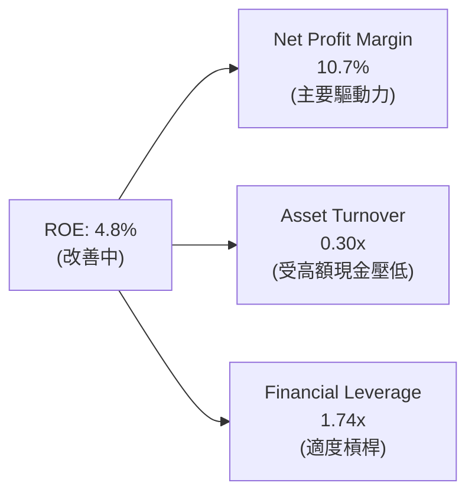

*分析*：
*   **淨利率 (10.7%)** 是推動 ROE 轉正的絕對功臣。
*   **資產週轉率 (0.30x)** 極低，這是因為資產負債表上躺著 $6.47B 的現金（佔總資產 55%）。這雖然降低了資本效率，但提供了極高的安全性。未來若將現金用於回購或高回報投資，資產週轉率與 ROE 將有巨大的躍升空間。

### 6.4 獲利能力儀表板

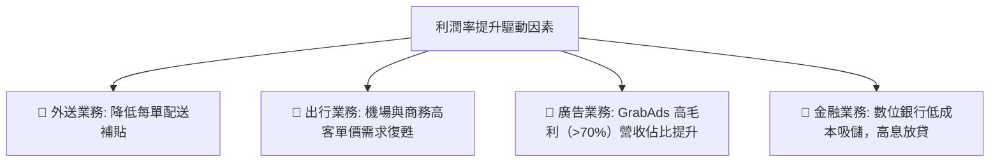

---

## 7. 估值深度分析

### 7.1 同業估值比較表格

我們選取了全球網約車/外送巨頭 **Uber**、東南亞電商/遊戲巨頭 **Sea Limited (SE)** 以及印尼本土競爭對手 **GoTo** 進行對比。

| 估值指標 | **Grab (GRAB)** | **Uber (UBER)** | **Sea Ltd (SE)** | **GoTo (GoTo)** | GRAB 評估 |
|---|---|---|---|---|---|
| **Trailing P/E** | 95.6x | 34.5x | 42.0x | N/A (虧損) | 🔴 歷史 P/E 偏高，因剛轉盈 |
| **Forward P/E** | **27.6x** | 22.1x | 24.5x | N/A (虧損) | 🟡 略高於同行，但成長率更高 |
| **P/S Ratio** | 4.40x | 3.12x | 2.15x | 1.10x | 🟡 溢價反映了其超級 App 壟斷力 |
| **EV / Revenue** | **3.11x** | 3.05x | 2.05x | 0.95x | 🟢 扣除現金後，估值與 Uber 相當 |
| **EV / EBITDA** | **34.9x** | 18.5x | 15.2x | N/A | 🔴 仍處於 EBITDA 釋放早期 |
| **FCF Yield** | **2.11%** | 4.85% | 5.20% | -3.50% | 🟡 現金流生成能力有待進一步釋放 |

*估值倍數選擇說明*：
由於 Grab 剛進入盈利期，Trailing P/E（95.6x）失真嚴重。我們認為 **EV/Revenue** 與 **Forward P/E** 是最合適的估值指標。Grab 的 EV/Revenue 僅為 3.11x，與 Uber（3.05x）幾乎持平，但 Grab 在東南亞的滲透率與數位金融成長潛力顯著高於 Uber 在成熟市場的表現。

### 7.2 歷史估值區間分析

```
╔══════════════════════════════════════════════════════════════════╗
║               GRAB EV/Revenue 歷史區間與當前位置                 ║
╠══════════════════════════════════════════════════════════════════╣
║                                                                  ║
║  歷史最高 (2021 IPO):  18.5x  ████████████████████████████████  ║
║  歷史均值 (5年):       5.80x  ██████████████████░░░░░░░░░░░░░░  ║
║  當前估值:             3.11x  ██████████░░░░░░░░░░░░░░░░░░░░░░  ║
║  歷史最低 (2022):      1.85x  ██████░░░░░░░░░░░░░░░░░░░░░░░░░░  ║
║                                                                  ║
║  📊 結論：當前 3.11x 的 EV/Revenue 遠低於歷史均值，安全邊際充足。║
╚══════════════════════════════════════════════════════════════════╝
```

### 7.3 情境目標價（假設驅動，Bear / Base / Bull）

我們基於 3 年期貼現模型，推導出以下三種情境的目標價：

| 情境 | 營收 CAGR (3年) | 2028 預期營業利潤率 | 退出 EV/Revenue 倍數 | 隱含目標價 | 相對現價漲跌幅 |
|---|---|---|---|---|---|
| 🔴 **悲觀情境** | 12.0% | 4.0% | 2.0x | **$4.20** | +9.7% |
| 🟡 **基準情境** | **20.5%** | **8.5%** | **4.0x** | **$5.90** | **+54.0%** |
| 🟢 **樂觀情境** | 28.0% | 12.0% | 5.5x | **$8.00** | +108.9% |

### 7.4 DCF 敏感性分析（6 格目標價矩陣）

採用兩階段 DCF 模型，終期成長率（Terminal Growth Rate）設為 3.0%。

| 營收成長率 \ WACC | WACC = 10.0% | **WACC = 11.5%（基準）** | WACC = 13.0% |
|---|---|---|---|
| **樂觀 (CAGR 28%)** | $8.80 (+129.8%) | **$8.00 (+108.9%)** | $7.20 (+88.0%) |
| **基準 (CAGR 20%)** | $6.50 (+69.7%) | **$5.90 (+54.0%)** | $5.30 (+38.4%) |
| **悲觀 (CAGR 12%)** | $4.60 (+20.1%) | **$4.20 (+9.7%)** | $3.80 (-0.8%) |

### 7.5 估值綜合區間

```
╔══════════════════════════════════════════════════════════════════╗
║                    GRAB 12M 估值區間圖                           ║
╠══════════════════════════════════════════════════════════════════╣
║                                                                  ║
║  當前股價: $3.83                                                 ║
║                                                                  ║
║  [ $3.18 ] ── 52周最低                                           ║
║       │                                                          ║
║       ├─ 🔴 悲觀目標價: $4.20                                    ║
║       │                                                          ║
║       ├─ 🟡 基準目標價: $5.90  (★ 當前最具機率之價值合理區間)   ║
║       │                                                          ║
║       └─ 🟢 樂觀目標價: $8.00                                    ║
║                                                                  ║
╚══════════════════════════════════════════════════════════════════╝
```

---

## 8. 成長催化劑

### 8.1 催化劑時間軸

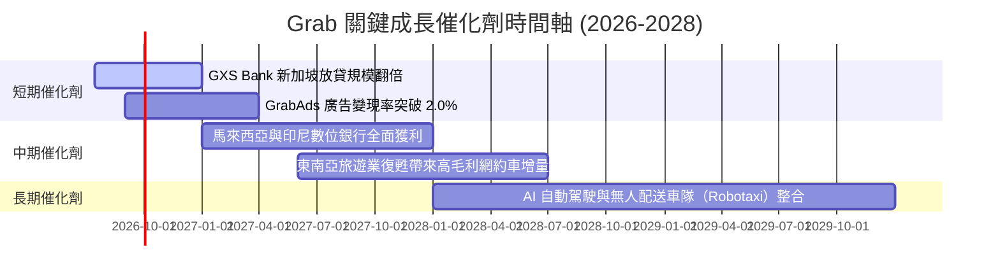

### 8.2 TAM 市場規模分析

東南亞數位經濟依然處於高速發展期。

```
╔══════════════════════════════════════════════════════════════════╗
║              東南亞數位經濟 TAM 與 Grab 滲透率 (2025)            ║
╠══════════════════════════════════════════════════════════════════╣
║                                                                  ║
║  1. 出行與外送 (Mobility & Food Delivery):                       ║
║     ├── 市場總規模 (TAM):  $45B                                 ║
║     ├── Grab 滲透交易額:   $18B                                 ║
║     └── ✅ 滲透率:         40.0%  (龍頭地位穩固)                ║
║                                                                  ║
║  2. 數位金融服務 (Fintech & Digital Banking):                    ║
║     ├── 市場總規模 (TAM):  $120B                                ║
║     ├── Grab 放貸與支付:   $6B                                  ║
║     └── ✅ 滲透率:         5.0%   (極大成長空間)                ║
║                                                                  ║
╚══════════════════════════════════════════════════════════════════╝
```

### 8.3 成長驅動力結構圖

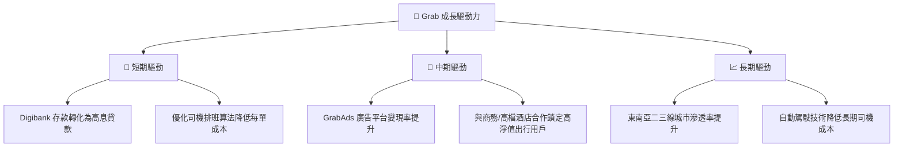

---

## 9. 風險矩陣

### 9.1 風險評分矩陣

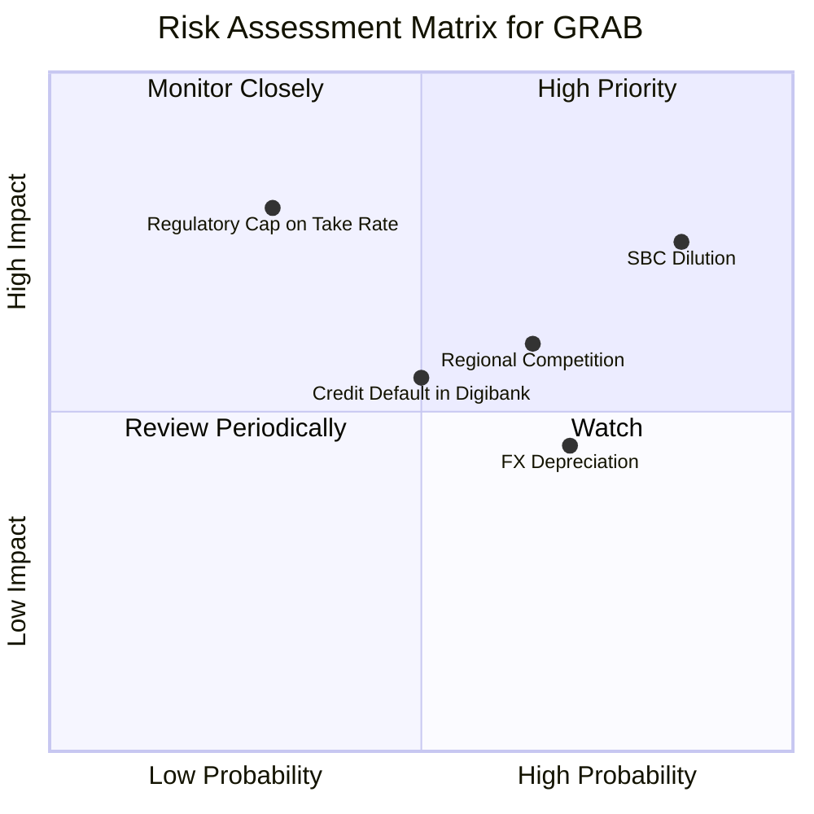

### 9.2 風險清單詳細分析

| # | 風險項目 | 發生機率 | 財務衝擊 | 風險評分 | 緩解措施 |
|---|---|---|---|---|---|
| 1 | 🔴 **股權稀釋 (SBC)** | 高 (85%) | 中高 (-5% EPS) | 🔴 **7.5 / 10** | 公司已啟動 $500M 股份回購，預計可抵消 60-80% 的 SBC 稀釋。 |
| 2 | 🟡 **區域競爭加劇** | 中高 (65%) | 中 (-10% 營收成長) | 🟡 **6.0 / 10** | 專注於高客單價的超級 App 訂閱會員（GrabUnlimited），提升用戶黏性。 |
| 3 | 🟡 **東南亞貨幣貶值** | 高 (70%) | 低 (-3% 美元計價營收) | 🟡 **5.0 / 10** | 透過在新加坡總部保留大部分美元現金（$6.47B 中的大部分），對沖區域貨幣風險。 |
| 4 | 🔴 **政府監管限制佣金** | 低 (30%) | 極高 (-20% 毛利) | 🟡 **4.5 / 10** | 與各國政府保持緊密溝通，強調平台為司機創造的就業機會與社會福利。 |
| 5 | 🟡 **數位銀行壞帳飆升** | 中 (50%) | 中 (-15% 金融利潤) | 🟡 **5.0 / 10** | 採用平台獨有的交易數據（如司機收入、商家每日流水）進行精準風控授信。 |

---

## 10. 投資建議

### 10.1 最終綜合評級雷達圖

```
╔══════════════════════════════════════════════════════════════╗
║                    GRAB 最終投資價值畫像                      ║
╠══════════════════════════════════════════════════════════════╣
║                                                              ║
║  基本面強度：   ▓▓▓▓▓▓▓▓▓▓▓▓▓▓▓▓░░░░  8.0/10  ★ 龍頭壁壘     ║
║  成長動能：     ▓▓▓▓▓▓▓▓▓▓▓▓▓▓▓▓▓░░░  8.5/10  ★ 雙位數成長   ║
║  財務安全邊際： ▓▓▓▓▓▓▓▓▓▓▓▓▓▓▓▓▓▓▓░  9.5/10  ★ 淨現金充沛   ║
║  估值性價比：   ▓▓▓▓▓▓▓▓▓▓▓▓▓▓░░░░░░  7.0/10  ★ 溢價合理     ║
║  資本回報潛力： ▓▓▓▓▓▓▓▓▓▓▓▓░░░░░░░░  6.5/10  ★ 回購剛啟動   ║
║                                                              ║
║  🏆 綜合投資評級：🟢 買入 (Buy) ｜ 綜合得分：7.9 / 10         ║
╚══════════════════════════════════════════════════════════════╝
```

### 10.2 目標價與隱含報酬率

| 情境 | 隱含目標價 | 當前股價 ($3.83) 相對空間 | 權重機率 | 加權目標價 |
|---|---|---|---|---|
| 🔴 悲觀情境 | $4.20 | +9.7% | 20% | $0.84 |
| 🟡 **基準情境** | **$5.90** | **+54.0%** | **60%** | **$3.54** |
| 🟢 樂觀情境 | $8.00 | +108.9% | 20% | $1.60 |
| **加權預期值** | **$5.98** | **+56.1%** | **100%** | **12M 期望股價** |

### 10.3 買入時機與觸發因素

```
╔══════════════════════════════════════════════════════════════════╗
║                  ✅ GRAB 買入與交易策略 Checklist               ║
╠══════════════════════════════════════════════════════════════════╣
║                                                                  ║
║  立即買入觸發條件（多數符合）：                                  ║
║  ✅ 股價回檔至 $3.50 - $3.80 區間（對應 EV/Rev < 3.0x）          ║
║  ✅ 季度營收 YoY 成長率維持在 20% 以上                           ║
║  ✅ 單季 GAAP 營業利潤率持續保持正數                             ║
║                                                                  ║
║  加碼觸發條件（出現以下任一）：                                  ║
║  ☐ 數位銀行業務（GXS 等）宣布實現單季盈虧平衡                     ║
║  ☐ 管理層將股份回購額度從 $500M 提升至 $1B                       ║
║                                                                  ║
║  減碼/停損觸發條件（出現以下任一）：                             ║
║  ☐ 核心外送業務（Deliveries）營收成長率跌破 10%                  ║
║  ☐ 股權薪酬 (SBC) 佔營收比例再度攀升至 10% 以上                  ║
║                                                                  ║
╚══════════════════════════════════════════════════════════════════╝
```

### 10.4 投資人適配度分析

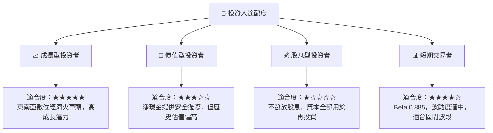

### 10.5 每季財報監控清單（Quarterly Watch List）

為了使本報告成為可持續追蹤的投資框架，我們制定了以下財報監控指標：

| 監控指標 | 基準線 (TTM) | 加碼門檻 (🟢 樂觀) | 減碼門檻 (🔴 悲觀) | 追蹤意義 |
|---|---|---|---|---|
| **營收 YoY 成長率** | 21.8% | > 25.0% | < 15.0% | 評估東南亞市場是否飽和 |
| **營業利潤率** | 2.7% | > 5.0% | < 0.0% (再度轉虧) | 檢驗營運槓桿與成本控制 |
| **SBC 佔營收比** | 7.15% | < 5.0% | > 9.0% | 監控股東權益稀釋速度 |
| **數位銀行放貸餘額** | ~$350M | 成長 > 50% QoQ | 成長 < 10% QoQ | 金融板塊成長火車頭 |
| **自由現金流 (FCF)** | $329.5M | > $100M / 季 | 轉為負值 | 自我造血能力的終極指標 |

### 10.6 反面論證：什麼會證明論點錯誤（What Would Change My Mind）

身為理性的機構分析師，我們必須時刻尋找能推翻自己多頭論點的證據。

```
╔══════════════════════════════════════════════════════════════════╗
║              ⚠️ 論點失效條件（Disconfirming Evidence）           ║
╠══════════════════════════════════════════════════════════════════╣
║  本投資論點在下列情況成立時應重新檢視或果斷退出：                ║
║                                                                  ║
║  ☐ 條件一：Grab 的營業利潤率連續兩季下滑，且重回負值。          ║
║     （代表補貼戰重啟，營運槓桿假設失效）                         ║
║                                                                  ║
║  ☐ 條件二：股東權益稀釋速度（Shares Outstanding YoY）大於 5%。  ║
║     （代表回購計劃無法抵消 SBC 稀釋，股東價值持續流失）          ║
║                                                                  ║
║  ☐ 條件三：數位銀行業務壞帳率（NPL Ratio）突破 6.0%。           ║
║     （代表風控模型失敗，金融業務從「金雞母」變成「負債」）       ║
║                                                                  ║
║  ☐ 條件四：ROIC 跌破 1.0% 或終止改善趨勢。                       ║
║     （證實其商業模式本質上無法創造高於資本成本的回報）           ║
╚══════════════════════════════════════════════════════════════════╝
```

---

> **免責聲明**：本報告為 AI 自動生成，僅供研究參考，不構成投資建議。投資有風險，入市需謹慎。