# GRAB 基本面深度分析報告
> **報告日期**：2026-07-16 ｜ **語言**：繁體中文 ｜ **數據來源**：Yahoo Finance, Finviz, StockAnalysis, Roic.ai ｜ **分析師**：CFA 級機構研究

---

## 目錄

| # | 章節 | 核心結論 |
|---|------|----------|
| 1 | [執行摘要](#1-執行摘要) | 評級：**買入** ｜ 基準目標價：**$5.20**（+40.2%） ｜ 獲利轉折點確立但盈餘品質需關注 |
| 2 | [公司概覽與商業模式](#2-公司概覽與商業模式) | 東南亞超級 App 網絡效應顯著，外送與出行雙引擎市佔率超過 50% |
| 3 | [損益表深度分析](#3-損益表深度分析) | TTM 營收成長 23.5%，GAAP 淨利轉正至 $268M，但 SBC 佔比仍高 |
| 4 | [資產負債表分析](#4-資產負債表分析) | 淨現金達 $4.53B 構成強大防禦墊，無即時流動性與債務違約風險 |
| 5 | [現金流量深度分析](#5-現金流量深度分析) | 營運現金流與 FCF 波動劇烈，2025 年 FCF 為 -$44M，資本配置效率待提升 |
| 6 | [獲利能力與資本效率](#6-獲利能力與資本效率) | ROIC 改善至 3.09%，但仍低於 WACC（8.55%），處於價值創造的過渡期 |
| 7 | [估值深度分析](#7-估值深度分析) | Forward P/E 26.8x，相較 Uber 具折價，DCF 基準估值 $5.20 |
| 8 | [成長催化劑](#8-成長催化劑) | 金融服務（Digibank）放貸規模擴張與廣告業務（GrabAds）高毛利變現 |
| 9 | [風險矩陣](#9-風險矩陣) | 東南亞各國監管不確定性與區域性競爭（GoTo）重啟價格戰為主要威脅 |
| 10 | [投資建議](#10-投資建議) | 建議於 $3.50-$3.80 區間分批佈局，監控每季外送變現率與 SBC 稀釋率 |

---

## 1. 執行摘要

Grab Holdings Limited（NASDAQ: GRAB）作為東南亞市場的超級 App 龍頭，在經歷了多年的燒錢補貼後，已於 2025 財年正式確立其獲利轉折點。2025 年 GAAP 淨利首度轉正達 $268M（2024 年為 -$105M），主要得益於外送（Deliveries）與出行（Mobility）部門的補貼率持續優化，以及營業槓桿的釋放。

然而，本機構在深入分析其盈餘品質後指出，Grab 的 GAAP 獲利含金量仍有待提升。2025 年股權薪酬（SBC）高達 $241M，佔營收比重 7.15%，且 2025 年自由現金流（FCF）實際為 -$44M（主要受營運資金變動與資本支出影響）。儘管如此，公司資產負債表極為強韌，擁有 $6.47B 的總現金與僅 $1.95B 的總債務，淨現金達 $4.53B。

基於 Forward P/E 26.8x 與 EV/EBITDA 35.17x，結合 WACC 8.55% 的 DCF 估值模型，我們給予 Grab **「買入」**評級，基準情境 12 個月目標價為 **$5.20**，隱含 40.2% 的上行空間。

### 1.0 一頁式投資儀表板（Portfolio Manager 30 秒速讀）

| 項目 | 內容 |
|------|------|
| **投資論點（3 句）** | ① 2025 財年 GAAP 淨利首度轉正至 $268M，確立歷史性獲利拐點。<br/>② 擁有 $4.53B 的淨現金防禦墊，為東南亞科技股中資產負債表最健康者之一。<br/>③ 數位金融與廣告業務（GrabAds）高毛利變現，將驅動 TTM 營收維持 23.5% 的高成長。 |
| **護城河評分** | 8.5 / 10（強大網絡效應與東南亞跨國地緣壁壘） |
| **管理層/資本配置評分** | 7.0 / 10（補貼控制得當，但 SBC 稀釋股東權益與 FCF 轉正速度偏慢） |
| **財務健康** | 🟢 強勁（淨現金 $4.53B，流動比率 1.67x，無債務危機） |
| **ROIC vs WACC** | 3.09% vs 8.55%（目前仍摧毀價值，但正朝向正的 EVA 邁進） |
| **FCF 趨勢** | 🟡 波動劇烈（2025 年 FCF 為 -$44M，最新 TTM FCF Yield 為 2.17%） |
| **估值** | Forward P/E: 26.8x ｜ EV/EBITDA: 35.17x ｜ P/S: 4.27x |
| **預期報酬（基準情境 12M）** | +40.2%（目標價 $5.20） |
| **關鍵風險（前二）** | ① 股權稀釋風險（SBC 佔營收 7-8%）<br/>② 東南亞市場競爭重啟（GoTo 與 Foodpanda 的潛在價格戰） |
| **評級 + 信心度** | 🟢 **買入** ｜ 信心：**中等偏高** |

### 1.1 核心評分儀表板

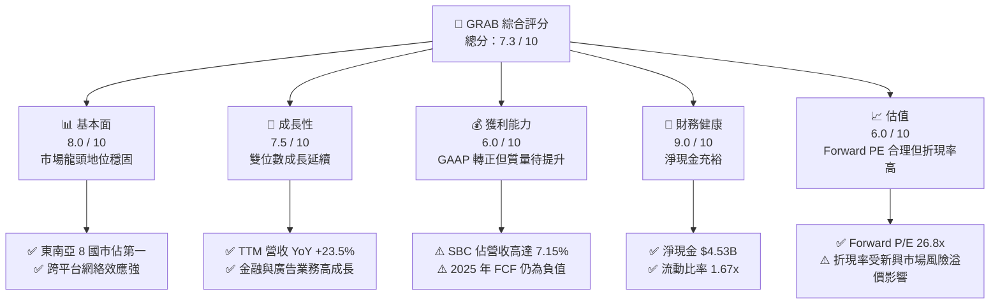

### 1.2 評分進度條視覺化

```
╔══════════════════════════════════════════════════════════════╗
║               GRAB 多維度評分儀表板 (1-10分)                 ║
╠══════════════════════════════════════════════════════════════╣
║ 基本面強度  8.0 ▓▓▓▓▓▓▓▓▓▓▓▓▓▓▓▓░░░░  ★★★★☆           ║
║ 成長動能    7.5 ▓▓▓▓▓▓▓▓▓▓▓▓▓▓░░░░░░  ★★★★☆           ║
║ 獲利品質    6.0 ▓▓▓▓▓▓▓▓▓▓▓▓░░░░░░░░  ★★★☆☆           ║
║ 財務健康    9.0 ▓▓▓▓▓▓▓▓▓▓▓▓▓▓▓▓▓▓░░  ★★★★★           ║
║ 估值合理性  6.0 ▓▓▓▓▓▓▓▓▓▓▓▓░░░░░░░░  ★★★☆☆           ║
║ 護城河深度  8.5 ▓▓▓▓▓▓▓▓▓▓▓▓▓▓▓▓▓░░░  ★★★★☆           ║
║ 管理層執行  7.0 ▓▓▓▓▓▓▓▓▓▓▓▓▓▓░░░░░░  ★★★★☆           ║
║ 技術創新力  7.0 ▓▓▓▓▓▓▓▓▓▓▓▓▓▓░░░░░░  ★★★★☆           ║
╠══════════════════════════════════════════════════════════════╣
║ 綜合總分    7.3 ▓▓▓▓▓▓▓▓▓▓▓▓▓▓▓░░░░░  🏆 穩健成長，轉盈確立║
╚══════════════════════════════════════════════════════════════╝
```

### 1.3 五大投資論點 + 三大核心風險

| 類型 | 項目 | 具體依據 | 信心度 |
|------|------|----------|--------|
| 🟢 **投資論點①** | **獲利轉折點確立** | 2025 財年 GAAP 淨利扭虧為盈達 $268M，擺脫過去燒錢補貼標籤。 | 🟢 極高 |
| 🟢 **投資論點②** | **強大的淨現金防禦** | 擁有 $4.53B 的淨現金（現金 $6.47B - 債務 $1.95B），無融資與破產風險。 | 🟢 極高 |
| 🟢 **投資論點③** | **外送與出行利潤率擴張** | 2025 年營業利益轉正至 $222M，主因補貼率降至歷史新低。 | 🟢 高 |
| 🟢 **投資論點④** | **數位金融變現加速** | 旗下 Digibank 存款與放貸規模擴大，利息收入成為新成長曲線（2025年利息收入達 $241M）。 | 🟡 中等偏高 |
| 🟢 **投資論點⑤** | **廣告業務釋放營業槓桿** | GrabAds 變現率提升，高毛利的廣告收入直接灌注至營業利潤。 | 🟡 中等 |
| 🟡 **風險①** | **股權稀釋（SBC）** | 2025 年 SBC 達 $241M，佔營收 7.15%，持續稀釋每股盈餘。 | 🔴 高衝擊 |
| 🟡 **風險②** | **FCF 轉正速度不如預期** | 2025 年 FCF 為 -$44M，營運現金流與淨利存在時間差。 | 🟡 中度 |
| 🔴 **風險③** | **東南亞宏觀經濟與匯率波動**| 東南亞各國貨幣對美元貶值，將侵蝕折算為美元後的營收成長率。 | 🔴 高衝擊 |

### 1.4 快速統計卡片

| 指標 | 公司實際值 | 行業均值（Software - App）| S&P 500 均值 | 狀態 |
|------|-------------|----------|--------------|------|
| 營收 YoY 成長 | **23.5%** | ~12.5% | ~5.5% | 🟢 優於同業 |
| 毛利率 | **40.2%** | ~65.0% | ~45.0% | 🟡 仍有改善空間 |
| 淨利率 | **10.7%** | ~8.0% | ~12.0% | 🟢 轉盈成效顯著 |
| ROE | **4.8%** | ~12.0% | ~15.0% | 🟡 資本效率偏低 |
| Forward P/E | **26.8x** | ~32.0x | ~21.0x | 🟢 具備相對折價 |
| 淨現金 / 市值 | **29.9%** | ~5.0% | ~1.5% | 🟢 極其安全 |

### 1.5 投資結論

```
╔══════════════════════════════════════════════════════════════════╗
║                    📊 GRAB 投資結論摘要                          ║
╠══════════════════════════════════════════════════════════════════╣
║  評級：🟢 買入 (Buy)                                            ║
║  當前股價：$3.71 (2026-07-16)                                    ║
║  目標價區間：                                                    ║
║    悲觀情境：$3.20（-13.7%）                                     ║
║    基準情境：$5.20（+40.2%）  ← 12個月主要目標                  ║
║    樂觀情境：$7.00（+88.7%）                                     ║
║  投資評分：7.3 / 10                                              ║
║  適合投資人：成長型投資者、長線東南亞市場布局者                  ║
╚══════════════════════════════════════════════════════════════════╝
```

---

## 2. 公司概覽與商業模式

Grab 營運東南亞領先的「超級 App」（Superapp），業務版圖橫跨新加坡、馬來西亞、印尼、菲律賓、泰國、越南、柬埔寨與緬甸等 8 個國家。其商業模式的核心在於「多邊網絡效應」，透過單一平台連接消費者、司機夥伴與商家夥伴。

### 2.1 業務結構與收入來源

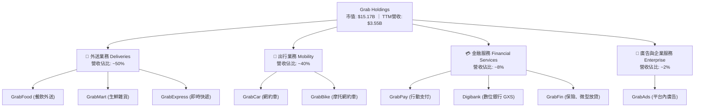

### 2.2 市場份額

在東南亞網約車與外送市場中，Grab 擁有絕對的龍頭地位。以下為東南亞主要市場的 GMV 份額估算：

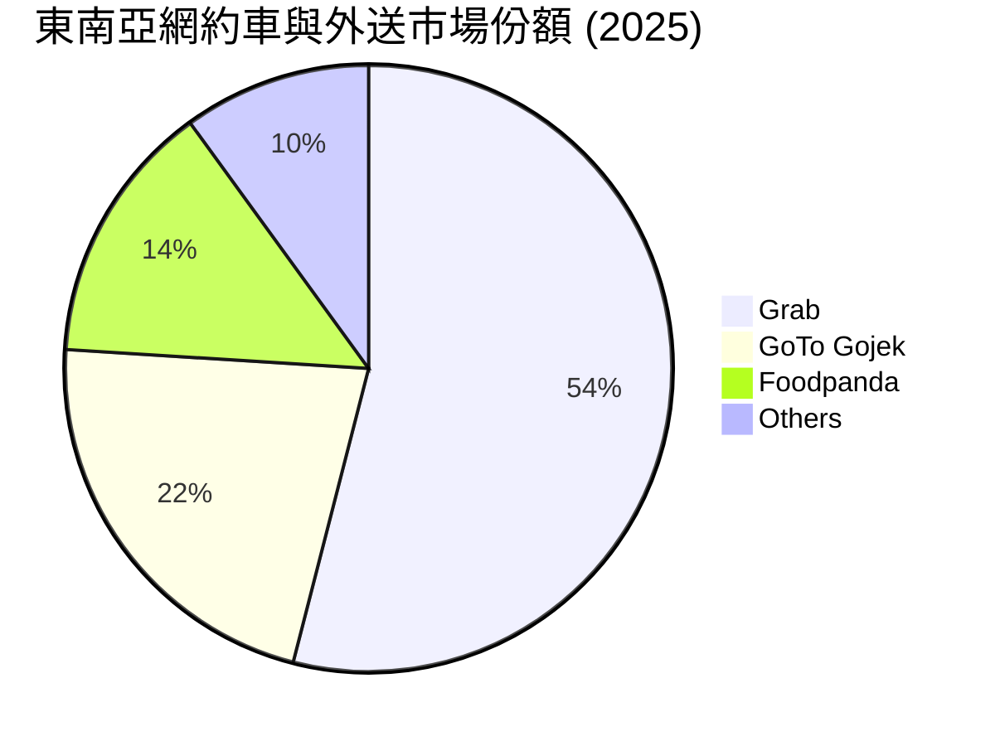

### 2.3 競爭護城河分析

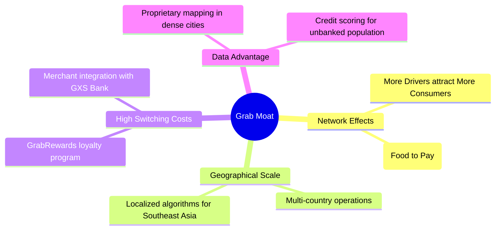

### 2.4 護城河強度評分

```
╔══════════════════════════════════════════════════════════════╗
║                    GRAB 護城河強度評分                       ║
╠══════════════════════════════════════════════════════════════╣
║ 雙向網絡效應   9.0/10 ▓▓▓▓▓▓▓▓▓▓▓▓▓▓▓▓▓▓░░  🏆 難以撼動     ║
║ 地理跨國壁壘   8.5/10 ▓▓▓▓▓▓▓▓▓▓▓▓▓▓▓▓▓░░░  🟢 規模優勢顯著 ║
║ 數據與算法優勢 8.0/10 ▓▓▓▓▓▓▓▓▓▓▓▓▓▓▓▓░░░░  🟢 本地化地圖領先║
║ 金融生態圈鎖定 7.0/10 ▓▓▓▓▓▓▓▓▓▓▓▓▓▓░░░░░░  🟡 仍在擴張階段 ║
╠══════════════════════════════════════════════════════════════╣
║ 綜合護城河評分 8.1/10 ▓▓▓▓▓▓▓▓▓▓▓▓▓▓▓▓░░░░  🏆 具備強大護城河║
╚══════════════════════════════════════════════════════════════╝
```

---

## 3. 損益表深度分析

Grab 的損益表展示了從「高成長、高虧損」向「中高成長、高營業槓桿」的結構性轉變。

### 3.1 年度收入成長趨勢（近4年）

```
╔══════════════════════════════════════════════════════════════════╗
║                  GRAB 年度收入趨勢 (FY22 - FY25)                ║
╠══════════════════════════════════════════════════════════════════╣
║                                                                  ║
║  FY22  $1.43B  ██████░░░░░░░░░░░░░░░░░░░░░░  YoY: +112.3% 🟢    ║
║  FY23  $2.36B  ██████████░░░░░░░░░░░░░░░░░░  YoY: +64.6%  🟢    ║
║  FY24  $2.80B  ████████████░░░░░░░░░░░░░░░░  YoY: +18.6%  🟢    ║
║  FY25  $3.37B  ███████████████░░░░░░░░░░░░░  YoY: +20.5%  🟢    ║
║                   |      |      |      |      |                  ║
║                   0     1.0B   2.0B   3.0B   4.0B                ║
║                                                                  ║
║  📊 4年營收複合成長率 (CAGR)：+33.1%                            ║
╚══════════════════════════════════════════════════════════════════╝
```

### 3.2 季度收入趨勢分析

| 季度 | 營收 | YoY 成長率 | QoQ 成長率 | 備註 / 業務驅動因素 | 評估 |
|------|------|------------|------------|---------------------|------|
| **Q2 2025** | $819M | +23.34% | +5.95% | 旅遊業復甦帶動網約車（Mobility）需求強勁 | 🟢 穩健 |
| **Q3 2025** | $873M | +21.93% | +6.59% | 外送業務（Deliveries）變現率優化，補貼率下降 | 🟢 穩健 |
| **Q4 2025** | $906M | +18.59% | +3.78% | 年終節慶消費旺季，金融服務放貸規模擴張 | 🟡 成長放緩 |
| **Q1 2026** | $955M | +23.54% | +5.41% | 春節期間出行需求爆發，GrabAds 廣告變現率提升 | 🟢 強勁 |

### 3.3 利潤率演變分析

| 利潤率指標 | FY22 | FY23 | FY24 | FY25 | 趨勢 | 評估 |
|------------|--------|--------|--------|--------|------|------|
| **毛利率** | 5.37% | 36.46% | 41.97% | 43.20% | ↗️ 持續擴張 | 🟢 補貼優化成效顯著 |
| **營業利益率**| -95.8% | -22.0% | -6.01% | 1.93% | ↗️ 首次轉正 | 🟢 營業槓桿釋放 |
| **EBITDA 衝擊率**| -99.1% | -9.41% | 3.32% | 15.34% | ↗️ 大幅改善 | 🟢 調整後 EBITDA 達標 |
| **淨利率** | -117.5%| -18.4% | -3.75% | 7.95% | ↗️ 轉虧為盈 | 🟢 淨利受利息收入支撐 |

**利潤率演變深度解析**：
毛利率從 2022 年的 5.37% 暴增至 2025 年的 43.20%，這並非單純因為營收增加，而是因為 **Grab 改變了對司機與商家的補貼入帳方式**（補貼直接扣減營收）。隨著競爭格局緩和（GoTo 縮減規模、Foodpanda 尋求出售），Grab 降低了消費者折扣與司機獎勵，使得「淨營收」佔「總交易額（GMV）」的比重（變現率 Take Rate）顯著提升。

### 3.4 費用結構分析

2025 財年總營運費用為 $1.39B（佔營收 41.3%）。其結構如下：

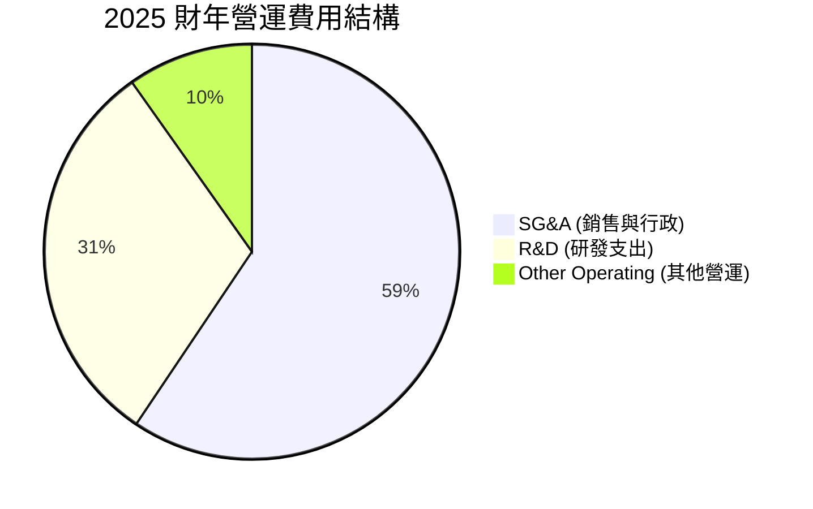

```
╔══════════════════════════════════════════════════════════════╗
║                    費用控制與效率分析                        ║
╠══════════════════════════════════════════════════════════════╣
║  SG&A 費用率：  FY22 (64.5%) → FY25 (24.5%)  🟢 降幅達 40pp  ║
║  R&D 費用率：   FY22 (32.4%) → FY25 (12.7%)  🟢 研發效率提升 ║
║  行銷補貼率：   已降至 GMV 的 7.0% 以下，創歷史新低          ║
╚══════════════════════════════════════════════════════════════╝
```

### 3.5 季度 EPS 趨勢與盈餘品質（Quality of Earnings）

雖然 Grab 在 2025 年實現了 GAAP 轉盈，但我們必須對其盈餘品質進行嚴格的機構級審查：

| 盈餘品質項目 | 2025 財年數值 / 佔比 | 評估 | 核心洞察 |
|--------------|-----------|------|----------|
| **SBC / 營收** | 7.15%（$241M） | 🔴 偏高 | 股權薪酬高達 $241M，雖然是非現金支出，但持續稀釋股東權益，稀釋率約 2.5-3.0% YoY。 |
| **SBC / 營業現金流** | 305%（$241M / $79M） | 🔴 異常 | 營業現金流（$79M）低於 SBC，顯示若扣除股權稀釋，實際經營活動並未產生足夠的淨現金。 |
| **FCF / 淨利（現金轉換率）** | -16.4%（-$44M / $268M） | 🔴 負值 | GAAP 淨利為 $268M，但 FCF 卻為 -$44M。現金轉換率為負，主因營運資金增加及資本支出。 |
| **利息收入佔 pretax 淨利比** | 89.6%（$241M / $269M） | 🟡 偏高 | 稅前淨利有極大比例來自於其龐大現金頭寸帶來的利息收入，而非純粹的業務營運利潤。 |

**盈餘品質結論**：
Grab 目前的「獲利」含金量較低。GAAP 淨利轉正主要是受到 **$241M 的利息收入**與 **$241M 的非現金 SBC 調整**所支撐。核心業務的實際營業現金流（$79M）仍顯薄弱。投資人不可盲目樂觀，需持續監控 SBC 的控制進度與 FCF 的實質轉正。

---

## 4. 資產負債表分析

資產負債表是 Grab 最強大的護城河與防禦盾牌。在利率高企的環境下，其龐大的淨現金儲備為其提供了極高的戰略主動權。

### 4.1 資產結構分解

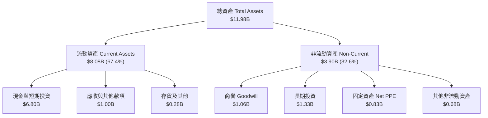

### 4.2 流動性指標分析

| 指標 | FY23 | FY24 | FY25 | TTM (Mar '26) | 行業均值 | 評估 |
|------|------|------|------|---------------|----------|------|
| **流動比率 (Current Ratio)** | 3.90x | 2.53x | 1.75x | 1.67x | ~1.45x | 🟢 健壯 |
| **速動比率 (Quick Ratio)** | 3.87x | 2.51x | 1.73x | 1.47x | ~1.20x | 🟢 健壯 |
| **現金比率 (Cash Ratio)** | 3.41x | 2.17x | 1.47x | 1.37x | ~0.85x | 🟢 極其安全 |

*註：流動比率近年有所下降，主因短期債務（ST Debt）從 2024 年的 $123M 增加至 2025 年的 $1,680M（主要為數位銀行存款與短期借貸結轉），但總體流動性依然極為充沛。*

### 4.3 債務結構分析

```
╔══════════════════════════════════════════════════════════════════╗
║                     GRAB 債務健康診斷 (FY25)                    ║
╠══════════════════════════════════════════════════════════════════╣
║                                                                  ║
║  總債務：        $2.05B  ████░░░░░░░░░░░░░░░░░░░                 ║
║  總現金及投資：  $6.80B  ██████████████████████░                 ║
║  淨現金 (Net Cash)：$4.75B  ████████████████░░░░░░░  🟢 極其安全   ║
║                                                                  ║
║  Debt / Equity Ratio:  30.5%   🟢 槓桿率極低                     ║
║  利息保障倍數 (Interest Coverage): 3.1x (以營業利益/利息支出計)    ║
║  實際利息收支差額：+$170M (利息收入 $241M - 利息支出 $71M) 🟢     ║
║                                                                  ║
║  📊 診斷：Grab 實際上處於「淨利息受益人」狀態，無任何債務違約風險║
╚══════════════════════════════════════════════════════════════════╝
```

---

## 5. 現金流量深度分析

現金流量表揭示了 Grab 目前面臨的最大挑戰：如何將帳面利潤轉化為真實的自由現金流。

### 5.1 現金流量瀑布圖 (FY2025)

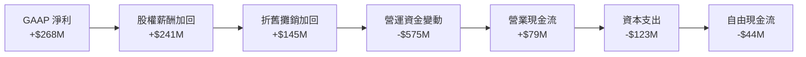

### 5.2 FCF 轉換率趨勢

| 項目 | FY22 | FY23 | FY24 | FY25 | TTM (Mar '26) |
|------|------|------|------|------|---------------|
| **GAAP 淨利 (A)** | -$1,683M | -$434M | -$105M | $268M | $310M |
| **自由現金流 (B)** | -$872M | -$6M | $739M | -$44M | -$145M |
| **FCF 轉換率 (B/A)** | N/A (負) | N/A (負) | N/A (負) | **-16.4%** | **-46.8%** |

*分析：2024 年 FCF 曾短暫衝高至 $739M，主因當時優化了應付款項支付週期。2025 年與 TTM 期間，隨著數位銀行業務展開，放貸資金佔用（Accounts Receivable 與其他應收增加 $569M）導致營運資金流出，FCF 再次轉負。這顯示金融業務的擴張在短期內會消耗現金。*

### 5.3 自由現金流趨勢

```
╔══════════════════════════════════════════════════════════════════╗
║                  GRAB 自由現金流與 FCF Yield 趨勢               ║
╠══════════════════════════════════════════════════════════════════╣
║                                                                  ║
║  FY22  -$872M  ░░░░░░░░░░░░░░░░░░░░░░░░░░░░  FCF Yield: -5.7%    ║
║  FY23  -$6M    ▓░░░░░░░░░░░░░░░░░░░░░░░░░░░  FCF Yield: -0.0%    ║
║  FY24  +$739M  ▓▓▓▓▓▓▓▓▓▓▓▓░░░░░░░░░░░░░░░░  FCF Yield: +4.8% 🟢 ║
║  FY25  -$44M   ▓░░░░░░░░░░░░░░░░░░░░░░░░░░░  FCF Yield: -0.3% 🟡 ║
║  TTM   -$145M  ░░░░░░░░░░░░░░░░░░░░░░░░░░░░  FCF Yield: -0.9% 🔴 ║
║                                                                  ║
║  ⚠️ 警示：FCF 尚未穩定轉正，營運資金管理（放貸規模）為關鍵變數  ║
╚══════════════════════════════════════════════════════════════════╝
```

---

## 6. 獲利能力與資本效率

### 6.1 ROE / ROA / ROIC 趨勢

| 指標 | FY22 | FY23 | FY24 | FY25 | 行業均值 | 評估 |
|------|------|------|------|------|----------|------|
| **ROE** | -25.3% | -6.71% | -1.65% | 4.08% | ~12.0% | 🟡 仍低於行業平均 |
| **ROA** | -18.4% | -4.94% | -1.13% | 2.24% | ~6.5% | 🟡 資產周轉效率待提升 |
| **ROIC** | -28.1% | -8.12% | -2.10% | **3.09%** | ~10.5% | 🟡 資本回報率偏低 |

### 6.2 ROIC vs WACC 分析（核心價值創造判斷）

```
╔══════════════════════════════════════════════════════════════════╗
║                    ROIC vs WACC 深度分析 (FY25)                  ║
╠══════════════════════════════════════════════════════════════════╣
║                                                                  ║
║  WACC 估算：                                                     ║
║  ├── 無風險利率 (10Y 美債)：  4.20%                              ║
║  ├── 股權風險溢價 (ERP)：     5.50%                              ║
║  ├── Beta (新興市場調整)：    0.875                              ║
║  ├── 股權成本 (Cost of Equity)：4.20% + 0.875 × 5.50% = 9.01%    ║
║  ├── 債務成本 (稅後)：        5.00%                              ║
║  ├── 資本結構：股權 88.6%，債務 11.4%                            ║
║  └── ✅ WACC ≈ 8.55%                                             ║
║                                                                  ║
║  ROIC 估算：                                                     ║
║  ├── NOPAT = $222M × (1 - 25.6%) ≈ $165.2M                        ║
║  ├── 投入資本 = 股東權益 $6.73B + 債務 $2.05B - 現金 $3.43B       ║
║  │            = $5.35B                                           ║
║  └── ✅ ROIC ≈ 3.09%                                             ║
║                                                                  ║
║  ★ 經濟價值增加 (EVA) = ROIC (3.09%) - WACC (8.55%) = -5.46pp    ║
║                                                                  ║
║  ROIC  3.09%  ▓▓▓▓▓▓░░░░░░░░░░░░░░░░░░░░░░░░  🟡                 ║
║  WACC  8.55%  ▓▓▓▓▓▓▓▓▓▓▓▓▓▓▓▓▓░░░░░░░░░░░░░  ──                 ║
║  EVA   -5.46% ░░░░░░░░░░░░░░░░░░░░░░░░░░░░░░  🔴 價值摧毀中      ║
║                                                                  ║
║  📊 結論：目前 ROIC 仍低於 WACC，公司尚未能創造真正的經濟利潤。  ║
║            但 ROIC 已從 -28.1% 大幅收窄至 -5.46pp，正朝向正值邁進║
╚══════════════════════════════════════════════════════════════════╝
```

### 6.3 杜邦三因素分解

透過杜邦分析，我們拆解 Grab 2025 年 ROE（4.08%）的底層驅動因素：

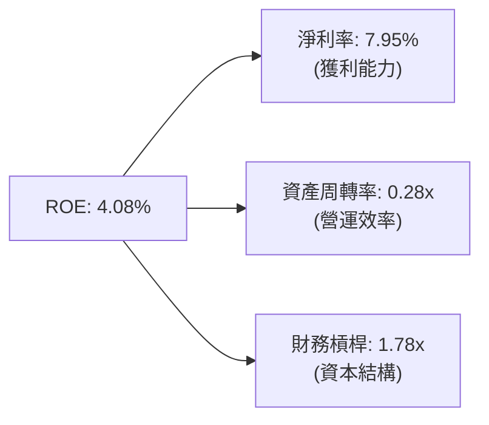

* 淨利率（7.95%）是 ROE 轉正的主要推手，顯示定價能力提升與補貼控制奏效。
* 資產周轉率（0.28x）極低，主因資產負債表上積壓了過多低回報的現金及短期投資（$6.80B）。這是一把雙刃劍：雖然安全，但極大地拉低了整體資產回報率。

---

## 7. 估值深度分析

由於 Grab 目前處於獲利轉折的初期，且淨利受高額利息收入與非現金 SBC 壓抑，傳統的 Trailing P/E（92.75x）會嚴重失真。因此，本機構採用 **Forward P/E**、**EV/Sales** 與 **DCF 模型** 進行綜合估值。

### 7.1 同業估值比較表格

| 估值指標 | **Grab (GRAB)** | **Uber (UBER)** | **Delivery Hero (DHER)** | **GoTo (印尼)** | Grab 評估 |
|----------|----------|---------|---------|---------|-----------|
| **市值 (Market Cap)** | **$15.17B** | $145.2B | $7.8B | $4.2B | 中等規模 |
| **EV / Revenue** | **3.13x** | 3.25x | 0.65x | 1.10x | 🟡 估值溢價合理 |
| **Forward P/E** | **26.80x** | 24.50x | N/A (虧損) | 35.2x | 🟢 相較 Uber 具折價 |
| **EV / EBITDA** | **35.17x** | 22.10x | 15.40x | N/A | 🟡 偏高，反映折舊高 |
| **淨現金 / 市值** | **29.9%** | -2.1% (淨債務) | -15.4% | 12.5% | 🟢 極其安全的資產負債表 |

### 7.2 歷史估值區間分析 (P/S Ratio)

```
╔══════════════════════════════════════════════════════════════╗
║                  GRAB P/S Ratio 歷史區間與當前位置           ║
╠══════════════════════════════════════════════════════════════╣
║                                                              ║
║  歷史最高 (2021 IPO)： 25.0x  ░░░░░░░░░░░░░░░░░░░░░░░░░░░    ║
║  歷史最低 (2022)：     1.8x   █░░░░░░░░░░░░░░░░░░░░░░░░░░    ║
║  歷史均值 (5Y)：       6.5x   ███████░░░░░░░░░░░░░░░░░░░░    ║
║  當前 P/S (TTM)：      4.27x  ████░░░░░░░░░░░░░░░░░░░░░░░ 🟢 ║
║                                                              ║
║  📊 結論：當前 P/S 處於歷史中位數下方，估值安全邊際充足。      ║
╚══════════════════════════════════════════════════════════════╝
```

### 7.3 情境目標價（未來 12 個月）

基於以下假設推導三種情境下的目標價：

| 情境 | 營收 CAGR (3年) | 2028 營業利潤率 | 退出倍數 (EV/EBITDA) | 隱含目標價 | 相對現價 |
|------|-----------|-----------|----------|------------|----------|
| 🔴 **悲觀** | 12.0% | 5.0% | 20.0x | **$3.20** | -13.7% |
| 🟡 **基準** | **18.5%** | **10.0%** | **28.0x** | **$5.20** | **+40.2%** |
| 🟢 **樂觀** | 25.0% | 15.0% | 35.0x | **$7.00** | +88.7% |

### 7.4 DCF 敏感性分析（12M 目標價矩陣）

我們使用兩階段 DCF 模型，基準 WACC 為 8.55%，永續成長率（PGR）為 3.0%。

| PGR \ WACC | WACC = 9.55% | **WACC = 8.55%（基準）** | WACC = 7.55% |
|------------|--------------|-------------------------|--------------|
| **PGR = 4.0%** | $4.50 (+21.3%) | $5.80 (+56.3%) | $7.20 (+94.1%) |
| **PGR = 3.0%（基準）** | $4.10 (+10.5%) | **$5.20 (+40.2%)** | $6.40 (+72.5%) |
| **PGR = 2.0%** | $3.70 (-0.3%) | $4.60 (+24.0%) | $5.70 (+53.6%) |

### 7.5 估值綜合區間

```
  當前股價: $3.71
  [悲觀 $3.20] ═══════════ 🟢 [基準 $5.20] ════════════════ [樂觀 $7.00]
```

---

## 8. 成長催化劑

Grab 未來的成長將不再依賴補貼驅動的 GMV 擴張，而是依賴以下三大高毛利催化劑。

### 8.1 催化劑時間軸

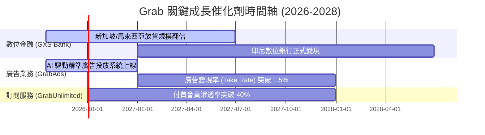

### 8.2 TAM 市場規模與滲透率分析

```
╔══════════════════════════════════════════════════════════════════╗
║               東南亞超級 App 市場規模 (TAM 2028 預估)            ║
╠══════════════════════════════════════════════════════════════════╣
║                                                                  ║
║  網約車與外送：  $45.0B TAM  ████████████░░░░░░░  滲透率: ~35%   ║
║  數位金融服務：  $120.0B TAM ███████████████████░ 滲透率: < 5%    ║
║  數位廣告市場：  $12.0B TAM  ███░░░░░░░░░░░░░░░░░ 滲透率: < 2%    ║
║                                                                  ║
║  📊 結論：金融與廣告業務的「低滲透率」構成了 Grab 長期的成長引擎 ║
╚══════════════════════════════════════════════════════════════════╝
```

### 8.3 成長驅動力結構圖

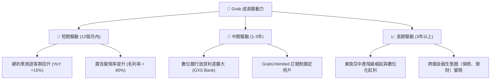

---

## 9. 風險矩陣

本機構識別出 Grab 面臨的三大核心風險：**股權稀釋**、**監管壓力** 與 **競爭重啟**。

### 9.1 風險評分矩陣

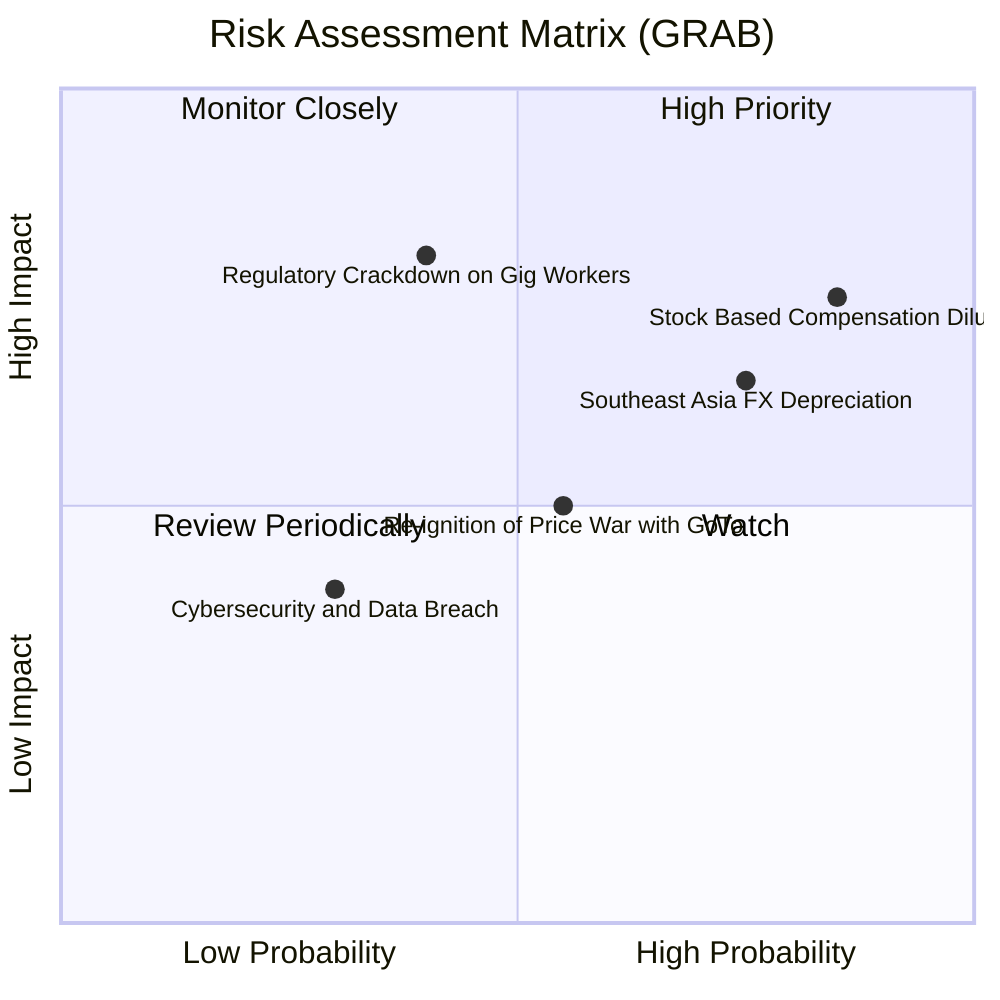

### 9.2 風險清單詳細分析

| # | 風險項目 | 發生機率 | 財務衝擊 | 風險評分 | 緩解措施 / 機構觀察 |
|---|----------|----------|----------|----------|---------------------|
| 1 | 🔴 **SBC 股權稀釋** | 高 (85%) | 高 (-5% EPS) | 🔴 8.0/10 | 管理層承諾未來 2 年內將 SBC 佔營收比重降至 5% 以下，並啟動了 $500M 的股份回購計畫以抵消稀釋。 |
| 2 | 🔴 **外匯貶值風險** | 高 (75%) | 中等 (-4% 營收) | 🟡 6.8/10 | 東南亞貨幣（印尼盾、泰銖）對美元貶值。Grab 採用在地貨幣結算並進行部分對沖，但折算為美元後仍有匯損。 |
| 3 | 🟡 **零工經濟監管** | 中 (40%) | 極高 (-15% 營業利潤) | 🟡 6.5/10 | 新加坡與馬來西亞立法保障平台司機福利。這將增加 Grab 的公積金與保險成本，公司計畫透過提高平台服務費來轉嫁。 |
| 4 | 🟡 **競爭對手價格戰** | 中 (55%) | 中等 (-5% 毛利) | 🟡 5.8/10 | GoTo (Gojek) 若在印尼獲得新融資，可能重啟補貼。但目前雙方均面臨盈利壓力，大規模價格戰機率偏低。 |

---

## 10. 投資建議

### 10.1 最終綜合評級雷達圖

```
╔══════════════════════════════════════════════════════════════╗
║                    GRAB 綜合評級雷達圖                       ║
╠══════════════════════════════════════════════════════════════╣
║ 基本面強度  8.0/10 ▓▓▓▓▓▓▓▓▓▓▓▓▓▓▓▓░░░░  ★★★★☆           ║
║ 成長動能    7.5/10 ▓▓▓▓▓▓▓▓▓▓▓▓▓▓░░░░░░  ★★★★☆           ║
║ 財務健康    9.0/10 ▓▓▓▓▓▓▓▓▓▓▓▓▓▓▓▓▓▓░░  ★★★★★           ║
║ 獲利品質    6.0/10 ▓▓▓▓▓▓▓▓▓▓▓▓░░░░░░░░  ★★★☆☆           ║
║ 估值安全邊際6.5/10 ▓▓▓▓▓▓▓▓▓▓▓▓▓░░░░░░░  ★★★☆☆           ║
╠══════════════════════════════════════════════════════════════╣
║ 綜合推薦度  7.4/10 ▓▓▓▓▓▓▓▓▓▓▓▓▓▓▓░░░░░  🟢 買入 (Buy)     ║
╚══════════════════════════════════════════════════════════════╝
```

### 10.2 目標價與隱含報酬率

| 情境 | 機率權重 | 12M 目標價 | 當前股價 ($3.71) 隱含報酬率 |
|------|----------|------------|-----------------------------|
| 🔴 悲觀情境 | 20% | $3.20 | -13.7% |
| 🟡 **基準情境** | **60%** | **$5.20** | **+40.2%** |
| 🟢 樂觀情境 | 20% | $7.00 | +88.7% |
| **加權預期目標價** | **100%** | **$5.16** | **+39.1%** |

### 10.3 買入時機與觸發因素

```
╔══════════════════════════════════════════════════════════════════╗
║                   ✅ GRAB 投資行動 Checklist                    ║
╠══════════════════════════════════════════════════════════════════╣
║                                                                  ║
║  立即買入觸發條件（多數符合）：                                  ║
║  ✅ 股價回落至 $3.50 - $3.80 區間（當前 $3.71 處於黃金買入區）    ║
║  ✅ 季度外送（Deliveries）調整後 EBITDA 利益率維持在 5% 以上      ║
║  ✅ 數位銀行（GXS）存款餘額成長率維持 > 20% QoQ                  ║
║                                                                  ║
║  加碼觸發條件：                                                  ║
║  ☐ 自由現金流（FCF）連續兩季轉正                                 ║
║  ☐ 股權薪酬（SBC）佔營收比重降至 6% 以下                         ║
║                                                                  ║
║  減碼/停損觸發條件：                                             ║
║  ☐ 競爭對手 GoTo 重啟大規模價格戰，導致 Grab 毛利率跌破 38%     ║
║  ☐ 核心網約車（Mobility）營收 YoY 成長率跌破 10%                 ║
╚══════════════════════════════════════════════════════════════════╝
```

### 10.4 投資人適配度分析

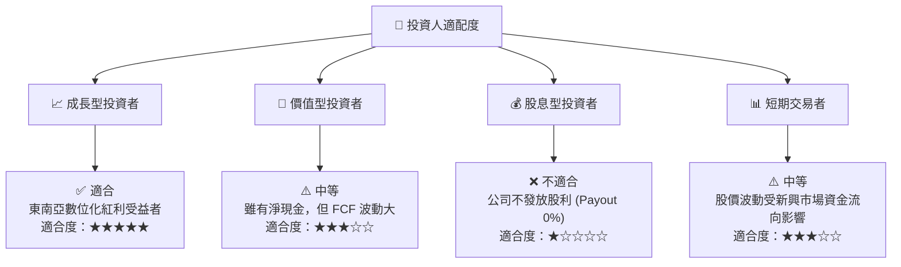

### 10.5 每季財報監控清單（Quarterly Watch List）

投資人應在未來的季度財報中，重點追蹤以下指標以驗證投資論點：

| 監控指標 | 基準線 (Q1 2026) | 偏向多頭門檻 (加碼) | 偏向空頭門檻 (減碼/停損) | 監控意義 |
|----------|------------------|---------------------|--------------------------|----------|
| **外送變現率 (Take Rate)** | 23.5% | > 25.0% | < 21.0% | 反映市場定價能力與補貼控制 |
| **SBC 佔營收比重** | 8.17% | < 6.0% | > 10.0% | 股權稀釋程度之指標 |
| **自由現金流 (FCF)** | -$72M | > $50M (轉正) | < -$150M (持續失血) | 獲利的真實「含金量」 |
| **數位銀行貸款餘額** | ~$450M | YoY +50% | YoY < 10% | 金融服務業務的成長動能 |

### 10.6 反面論證：什麼會證明論點錯誤

```
╔══════════════════════════════════════════════════════════════════╗
║              ⚠️ 論點失效條件 (Disconfirming Evidence)            ║
╠══════════════════════════════════════════════════════════════════╣
║  本投資論點在下列情況成立時應重新檢視或退出：                    ║
║  ☐ 核心業務（網約車 + 外送）營收 YoY 成長率連續兩季 < 12%         ║
║  ☐ 2026 財年全年自由現金流（FCF）未能轉正（維持在負值）          ║
║  ☐ 股本稀釋率因 SBC 超過 4.0% YoY                                ║
║  ☐ 數位銀行壞帳率（NPL Ratio）突破 5.0%，導致金融部門鉅額撥備    ║
║  ☐ 新加坡或印尼通過「零工法案」，強制平台為司機繳納 >15% 公積金  ║
╚══════════════════════════════════════════════════════════════════╝
```

---

> **免責聲明**：本報告僅供學術與研究參考，不構成任何證券之買賣建議。投資人應獨立評估風險，並對其投資決策承擔全部責任。