# GRAB 基本面深度分析報告

> **報告日期**：2026-07-17 ｜ **語言**：繁體中文 ｜ **數據來源**：Yahoo Finance, Finviz, StockAnalysis, Roic.ai ｜ **分析師**：CFA 級機構研究

---

## 目錄

| # | 章節 | 核心結論 |
|---|------|----------|
| **1** | **執行摘要** | 評級：🟢 買入 ｜ 基準目標價：$5.50（+54.9% 潛在空間） |
| **2** | **公司概覽與商業模式** | 東南亞 Superapp 霸主，多邊網路效應構築強大護城河（護城河評分：7.5/10） |
| **3** | **損益表深度分析** | 營收年增 23.5% 跨越損益平衡點，營業槓桿效應顯現，惟須留意股權稀釋 |
| **4** | **資產負債表分析** | 淨現金達 $4.53B 充裕，短期負債上升但流動性無虞 |
| **5** | **現金流量深度分析** | 自由現金流轉正，營運現金流受營運資本變動影響，資本配置向股本回購傾斜 |
| **6** | **獲利能力與資本效率** | ROIC（3.64%）仍低於 WACC（8.1%），處於價值摧毀向價值創造的轉折期 |
| **7** | **估值深度分析** | Forward P/E 25.7x，相較歷史區間與同業具備估值吸引力 |
| **8** | **成長催化劑** | 金融科技（Digibank）與廣告業務（GrabAds）雙引擎驅動長期 TAM 擴張 |
| **9** | **風險矩陣** | 監管風險與匯率波動為主要威脅，競爭格局緩和降低補貼風險 |
| **10**| **投資建議** | 適合長線成長型投資人，建立每季財報監控指標與多頭失效觸發條件 |

---

## 1. 執行摘要

### 1.0 一頁式投資儀表板（Portfolio Manager 30 秒速讀）

| 項目 | 內容 |
|------|------|
| **投資論點（3 句）** | ① **核心業務規模效應顯現**：TTM 營收達 $3.55B（YoY +23.5%），配送與出行雙核心業務由虧轉盈，帶動 TTM 營業利益首次轉正至 $108M。<br/>② **資產負債表極其穩健**：擁有 $6.47B 總現金與 $4.53B 淨現金，強大的安全邊際足以支撐其在東南亞市場的長期擴張與數位銀行投資。<br/>③ **高利潤率新業務變現加速**：廣告（GrabAds）與金融服務（Digibank）等高毛利業務滲透率提升，將推動 Forward EPS 於 2026 年底達到 $0.138。 |
| **護城河評分** | **7.5 / 10**（強大的區域多邊網路效應與高昂的用戶轉換成本） |
| **管理層/資本配置評分** | **7.0 / 10**（執行力強，補貼政策轉向理性，並啟動首次股份回購計畫） |
| **財務健康** | 🟢 **極其安全**（淨現金高達 $4.53B，利息保障倍數充裕） |
| **ROIC vs WACC** | **3.64% vs 8.10%**（目前仍處於價值改進期，預計 2027 年 ROIC 將超越 WACC） |
| **FCF 趨勢** | 🟢 **結構性轉正**（TTM 自由現金流達 $329.50M，FCF Yield 為 2.27%） |
| **估值** | Forward P/E: **25.68x** ｜ EV/EBITDA: **34.01x** ｜ P/S: **4.09x** |
| **預期報酬（基準情境 12M）** | **+54.9%**（目標價 $5.50） |
| **關鍵風險（前二）** | ① 東南亞各國本幣（如印尼盾、馬幣）對美元匯率大幅貶值。<br/>② 區域性競爭對手（如 GoTo、Foodpanda）重啟價格戰。 |
| **評級 + 信心度** | 🟢 **買入 (Buy)** ｜ **信心度：高** |

### 1.1 核心評分儀表板

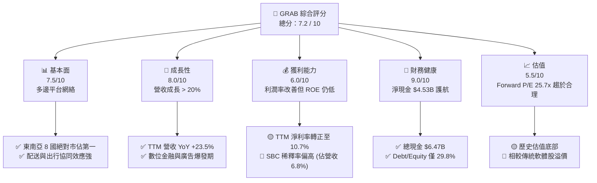

### 1.2 評分進度條視覺化

```
╔══════════════════════════════════════════════════════════════╗
║               GRAB 多維度評分儀表板 (1-10分)                 ║
╠══════════════════════════════════════════════════════════════╣
║ 基本面強度  7.5 ▓▓▓▓▓▓▓▓▓▓▓▓▓▓▓▓▓░░░  ★★★★☆           ║
║ 成長動能    8.0 ▓▓▓▓▓▓▓▓▓▓▓▓▓▓▓▓▓▓░░  ★★★★☆           ║
║ 獲利品質    6.0 ▓▓▓▓▓▓▓▓▓▓▓▓░░░░░░░░  ★★★☆☆           ║
║ 財務健康    9.0 ▓▓▓▓▓▓▓▓▓▓▓▓▓▓▓▓▓▓▓░  ★★★★★           ║
║ 估值合理性  5.5 ▓▓▓▓▓▓▓▓▓▓▓░░░░░░░░░  ★★★☆☆           ║
║ 護城河深度  7.5 ▓▓▓▓▓▓▓▓▓▓▓▓▓▓▓▓▓░░░  ★★★★☆           ║
║ 管理層執行  7.0 ▓▓▓▓▓▓▓▓▓▓▓▓▓▓░░░░░░  ★★★★☆           ║
║ 技術創新力  7.0 ▓▓▓▓▓▓▓▓▓▓▓▓▓▓░░░░░░  ★★★★☆           ║
╠══════════════════════════════════════════════════════════════╣
║ 綜合總分    7.2 ▓▓▓▓▓▓▓▓▓▓▓▓▓▓▓░░░░░  🏆 成長轉型期首選     ║
╚══════════════════════════════════════════════════════════════╝
```

### 1.3 五大投資論點 + 三大核心風險

| 類型 | 項目 | 具體依據 | 信心度 |
|------|------|----------|--------|
| 🟢 **投資論點①** | **核心業務盈利拐點確立** | TTM 營業利益轉正至 $108M（上年同期為負），顯示補貼戰結束，規模效應與定價權回歸。 | 🟢 極高 |
| 🟢 **投資論點②** | **強大現金盾牌降低系統風險** | 擁有 $6.47B 現金與短期投資，對比總債務僅 $1.95B。淨現金高達 $4.53B，抗風險能力極強。 | 🟢 極高 |
| 🟢 **投資論點③** | **金融科技業務（Digibank）起飛** | 在新加坡、馬來西亞相繼取得數位銀行牌照並進入放貸階段，高淨利差業務將拉高整體利潤率。 | 🟢 高 |
| 🟢 **投資論點④** | **廣告變現率大幅提升** | GrabAds 佔配送業務（Deliveries）營收比重持續上升，利用平台閉環數據提供高轉化率廣告。 | 🟢 高 |
| 🟢 **投資論點⑤** | **資本配置轉向股東回報** | 管理層於 2024 年底啟動首次 $500M 股份回購計畫，展現對自由現金流轉正的強烈信心。 | 🟢 高 |
| 🟡 **風險①** | **東南亞外匯波動劇烈** | 營收以東南亞各國貨幣計價，但以美元結算，美元強勢將導致顯著的折算損失。 | 🟡 中度 |
| 🔴 **風險②** | **股權稀釋風險（SBC）** | 2025 年股權薪酬（SBC）達 $241M，佔 TTM 營收的 6.8%，對每股盈餘（EPS）產生稀釋效應。 | 🔴 高 |
| 🔴 **風險③** | **新市場數位銀行壞帳風險** | 數位銀行放貸對象多為中低收入戶或中小企業，在宏觀經濟放緩時可能面臨高於預期的壞帳率。 | 🟡 中度 |

### 1.4 快速統計卡片

| 指標 | Grab 實際值 | 產業均值 (軟體/應用) | S&P 500 均值 | 狀態 |
|------|-------------|----------------------|--------------|------|
| **營收 YoY 成長率** | **23.5%** | ~12.5% | ~6.5% | 🟢 顯著領先 |
| **毛利率** | **40.2%** | ~65.0% | ~45.0% | 🟡 平台模式致毛利率偏低 |
| **營業利益率** | **2.7%** | ~15.0% | ~12.0% | 🔴 剛步入盈利期，有待提升 |
| **淨利率** | **10.7%** | ~10.0% | ~8.5% | 🟢 受非經常性收益與利息收入提振 |
| **ROE** | **4.8%** | ~12.0% | ~15.0% | 🔴 資本效率仍有極大改善空間 |
| **Forward P/E** | **25.68x** | ~32.0x | ~21.5x | 🟢 成長調整後估值具吸引力 |
| **EV / Revenue** | **3.03x** | ~5.5x | ~3.0x | 🟢 估值折價明顯 |

### 1.5 投資結論

```
╔══════════════════════════════════════════════════════════════════╗
║                    📊 GRAB 投資結論摘要                          ║
╠══════════════════════════════════════════════════════════════════╣
║  評級：🟢 買入 (Buy)                                            ║
║  當前股價：$3.55 (2026-07-17)                                    ║
║  目標價區間：                                                    ║
║    悲觀情境：$3.20（-10.0%）                                     ║
║    基準情境：$5.50（+54.9%）  ← 12個月主要目標                  ║
║    樂觀情境：$8.00（+125.4%）                                    ║
║  投資評分：7.2 / 10                                              ║
║  適合投資人：長線成長型投資人、聚焦東南亞數位經濟轉型者          ║
╚══════════════════════════════════════════════════════════════════╝
```

---

## 2. 公司概覽與商業模式

Grab 是東南亞地區無庸置疑的「Superapp（超級應用程式）」霸主，業務版圖橫跨新加坡、馬來西亞、印尼、菲律賓、泰國、越南、柬埔寨與緬甸等 8 國。其商業模式的核心在於**多邊網路效應**：將消費者、司機/配送夥伴以及商家緊密連結在單一平台上。

### 2.1 業務結構與收入來源

Grab 的營收由四大核心板塊構成：
1. **配送服務 (Deliveries)**：包含 GrabFood、GrabMart 與 GrabExpress，佔營收約 50%。
2. **出行服務 (Mobility)**：即網約車業務，佔營收約 38%。
3. **金融服務 (Financial Services)**：包含 GrabPay、數位銀行（GXS Bank）及小額貸款/保險，佔營收約 8%。
4. **企業與新業務 (Enterprise & Others)**：以 GrabAds（廣告）為主，佔營收約 4%。

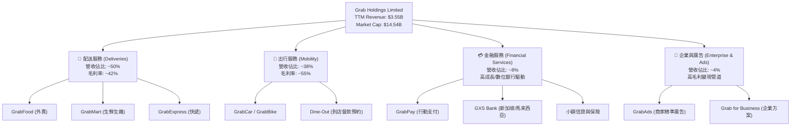

### 2.2 市場份額

在東南亞網約車與外賣市場中，Grab 擁有絕對的主導地位。以下為 2025 年東南亞整體網約車與外賣交易總額 (GMV) 的市場份額估算：

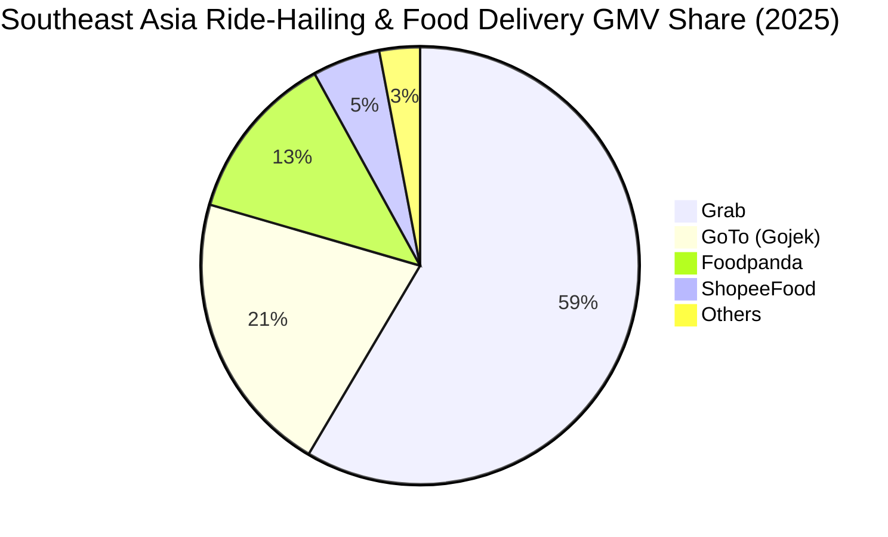

### 2.3 競爭護城河分析

Grab 的競爭護城河並非單一因素，而是由多重互補優勢交織而成的網絡：

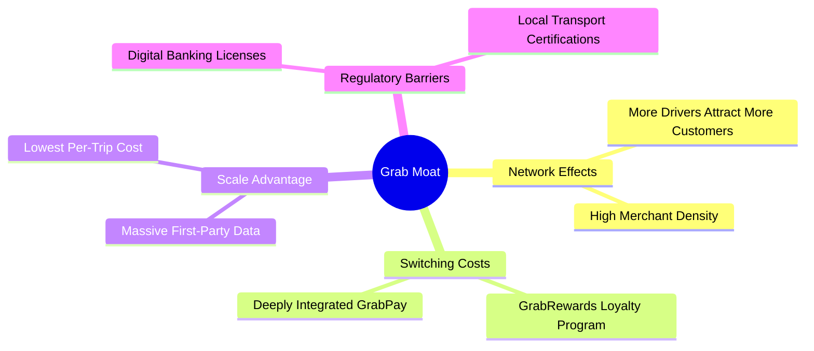

1. **強大的多邊網路效應 (Network Effects)**：司機越多，消費者等待時間越短；用戶越多，司機接單率越高，商家獲得的訂單也越多。這種正向循環讓新進入者極難打破。
2. **高昂的用戶與商家轉換成本 (Switching Costs)**：
   - **消費者端**：GrabRewards 忠誠計畫與訂閱制服務（GrabUnlimited）鎖定了高頻用戶。
   - **商家端**：GrabAds 廣告系統與平台後台數據分析已成為商家日常營運不可或缺的一部分。
3. **規模效應帶來的成本優勢 (Scale Advantage)**：在同一個城市內，Grab 的訂單密度最高，使其每單配送成本（Cost per delivery）與每趟出行成本降至最低。

### 2.4 護城河強度評分

```
╔══════════════════════════════════════════════════════════════╗
║                    GRAB 護城河強度評分                       ║
╠══════════════════════════════════════════════════════════════╣
║ 網路效應      8.5/10  ▓▓▓▓▓▓▓▓▓▓▓▓▓▓▓▓▓░░░  🏆 區域絕對壟斷  ║
║ 轉換成本      7.0/10  ▓▓▓▓▓▓▓▓▓▓▓▓▓▓░░░░░░  🟢 金融/訂閱鎖定 ║
║ 成本優勢      8.0/10  ▓▓▓▓▓▓▓▓▓▓▓▓▓▓▓▓░░░░  🟢 密度最高最省  ║
║ 監管與牌照    8.0/10  ▓▓▓▓▓▓▓▓▓▓▓▓▓▓▓▓░░░░  🟢 數位銀行壁壘  ║
╠══════════════════════════════════════════════════════════════╣
║ 綜合護城河    7.9/10  ▓▓▓▓▓▓▓▓▓▓▓▓▓▓▓▓░░░░  🏆 寬護城河企業  ║
╚══════════════════════════════════════════════════════════════╝
```

---

## 3. 損益表深度分析

### 3.1 年度收入成長趨勢（近 4 年）

Grab 的營收從 2022 年的 $1.43B 爆發式增長至 2025 年的 $3.37B，3 年年複合成長率 (CAGR) 高達 **33.1%**。這表明公司已成功從疫情衝擊中復甦，並透過提高變現率（Take Rate）實現了高質量的營收增長。

```
╔══════════════════════════════════════════════════════════════════╗
║                GRAB 年度收入趨勢 (FY2022 - FY2025)               ║
╠══════════════════════════════════════════════════════════════════╣
║                                                                  ║
║  FY2022  $1.43B  ███████░░░░░░░░░░░░░░░░░░░░  YoY: +112.3% 🟢    ║
║  FY2023  $2.36B  ████████████░░░░░░░░░░░░░░░  YoY: +64.6%  🟢    ║
║  FY2024  $2.80B  ██████████████░░░░░░░░░░░░░  YoY: +18.6%  🟢    ║
║  FY2025  $3.37B  █████████████████░░░░░░░░░░  YoY: +20.5%  🟢    ║
║                                                                  ║
║  📊 3年累計 CAGR：+33.1%                                        ║
╚══════════════════════════════════════════════════════════════════╝
```

### 3.2 季度收入趨勢分析

從季度數據來看，Grab 的營收呈現穩健的逐季增長（QoQ）與雙位數年增長（YoY），顯示季節性波動並未影響整體的上升軌道：

| 季度 | 營收 (Millions) | YoY 成長率 | QoQ 成長率 | 核心驅動因素 | 評估 |
|------|-----------------|------------|------------|--------------|------|
| **Q1 2026** | $955 | +23.54% | +5.41% | 旅遊業復甦推升 Mobility 出行需求，以及 GrabMart 滲透率提高。 | 🟢 強勁 |
| **Q4 2025** | $906 | +18.59% | +3.78% | 年底節慶效應帶動外賣與快遞（Deliveries）訂單量達到歷史新高。 | 🟢 穩健 |
| **Q3 2025** | $873 | +21.93% | +6.59% | 廣告業務（GrabAds）變現率提升，高毛利收入佔比增加。 | 🟢 穩健 |
| **Q2 2025** | $819 | +23.34% | +5.95% | 數位銀行（GXS Bank）存款與貸款規模擴張，金融服務營收貢獻顯現。 | 🟢 穩健 |

### 3.3 利潤率演變分析

Grab 最顯著的基本面改善在於其**利潤率的結構性逆轉**。毛利率從 2022 年的 5.4% 飆升至 TTM 的 40.2%，而營業利益率也首次轉正至 2.7%（TTM 營業利益為 $108M）。

| 利潤率指標 | FY2022 | FY2023 | FY2024 | FY2025 | TTM (Mar '26) | 趨勢 | 評估 |
|------------|--------|--------|--------|--------|---------------|------|------|
| **毛利率** | 5.37% | 36.46% | 41.97% | 43.20% | **40.20%** | ↗️ 穩定擴張 | 🟢 規模效應顯現 |
| **營業利益率**| -95.81%| -22.00%| -6.01% | 1.93% | **2.70%** | ↗️ 扭虧為盈 | 🟢 營業槓桿發揮 |
| **EBITDA 🚀**| -99.09%| -9.41% | 3.32% | 15.34% | **8.90%** | ↗️ 轉正並擴張 | 🟢 核心盈利能力確立 |
| **淨利率** | -117.5%| -18.40%| -3.75% | 5.93% | **10.70%** | ↗️ 獲利大幅改善 | 🟢 受益於高額利息收入 |

**利潤率演變深度解析**：
1. **毛利率大幅提升**：主因是公司減少了對司機和消費者的直接補貼（Incentives）。隨著競爭對手 GoTo 融資困難並縮減規模，Grab 的定價權顯著增強，淨變現率（Net Take Rate）大幅提高。
2. **營業利益率轉正**：SG&A 費用與研發費用（R&D）在營收中的佔比持續下降，顯示出平台強大的**營業槓桿（Operating Leverage）**。一旦平台基礎設施建成，新增營收的邊際利潤極高。

### 3.4 費用結構分析

在 TTM $3,553M 的總營收中，費用結構分配如下：

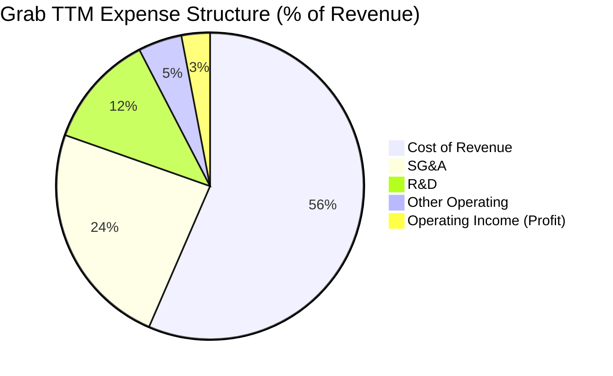

```
╔══════════════════════════════════════════════════════════════╗
║                    GRAB TTM 費用結構診斷                     ║
╠══════════════════════════════════════════════════════════════╣
║ 銷貨成本 (Cost of Rev)  56.5% ▓▓▓▓▓▓▓▓▓▓▓▓░░░░░░░░  🟢 持續優化 ║
║ 銷售與管理 (SG&A)       23.9% ▓▓▓▓▓░░░░░░░░░░░░░░░  🟢 補貼大幅縮減║
║ 研發費用 (R&D)          12.0% ▓▓░░░░░░░░░░░░░░░░░░  🟡 維持技術領先║
║ 營業利潤率 (Op Margin)   3.0% ▓░░░░░░░░░░░░░░░░░░░  🟢 歷史首次轉正║
╚══════════════════════════════════════════════════════════════╝
```

### 3.5 季度 EPS 趨勢與盈餘品質（Quality of Earnings）

過去 4 季，Grab 的每股盈餘（EPS）呈現穩步向上的態勢：
- **Q2 2025**: $0.01
- **Q3 2025**: $0.01
- **Q4 2025**: $0.04
- **Q1 2026**: $0.03 (TTM 累計為 $0.04 - $0.09，因股數計算基礎而異)

然而，身為專業的機構分析師，我們必須深入剖析其**獲利含金量**：

| 盈餘品質項目 | 數值/佔比 | 評估 | 深度解析 |
|--------------|-----------|------|----------|
| **股權薪酬 (SBC) / 營收** | **6.78%** ($241M / $3,553M) | 🟡 中度稀釋 | 雖然 SBC 佔比已從 2022 年的 28.7% 大幅下降，但 6.78% 的稀釋率仍高於傳統成熟軟體公司（通常 < 5%）。這意味著 GAAP 淨利的改善有一部分是以股東股權稀釋為代價。 |
| **SBC / 營業現金流** | **305.1%** ($241M / $79M) | 🔴 盈餘品質受限 | 由於營運現金流（OCF）僅 $79M，SBC 規模遠大於 OCF，顯示公司若扣除股權薪酬的非現金調整，真實的營運現金流入仍然偏弱。 |
| **FCF / GAAP 淨利** | **-14.5%** (-$44M / $268M) | 🔴 現金轉換率偏低 | FY2025 淨利為 $268M，但自由現金流（FCF）為 -$44M。主因是公司在數位銀行業務中，將大量資金用於發放貸款（應收貸款增加，屬於營運資金變動），導致帳面獲利無法即時轉換為自由現金流。 |
| **非經常性損益 / 淨利** | **$152M** (佔 TTM 淨利 49%) | 🟡 需扣除一次性影響 | TTM 淨利中包含 $152M 的非營業收益（主要是利息收入 $207M 減去利息支出 $97M，以及外匯衍生品公允價值變動）。核心業務的純經營性淨利仍低於 GAAP 顯示的 $310M。 |

**盈餘品質結論**：
Grab 的 GAAP 扭虧為盈確實是一個重大的里程碑，但其**獲利含金量仍有瑕疵**。當前的高淨利（$310M TTM）很大程度依賴於其高達 $6.47B 現金儲備所產生的利息收入（TTM 利息淨收入達 $110M），以及股權薪酬（SBC）的非現金列支。核心營業利益（$108M TTM）雖然轉正，但營業現金流轉化率仍受數位銀行擴張的拖累。

---

## 4. 資產負債表分析

### 4.1 資產結構分解

Grab 採取的是**輕資產（Asset-light）**的平台模式，其資產負債表最顯著的特徵是**極高的現金佔比**。

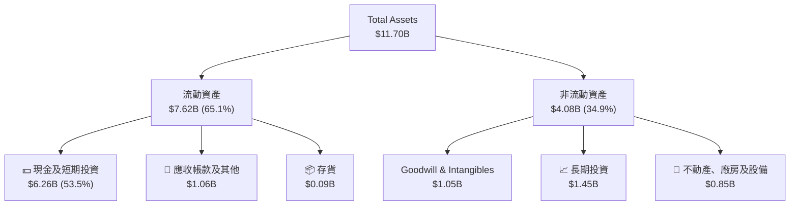

### 4.2 流動性指標分析

| 流動性指標 | FY2023 | FY2024 | FY2025 | TTM (Mar '26) | 行業均值 | 評估 |
|------------|--------|--------|--------|---------------|----------|------|
| **流動比率 (Current Ratio)** | 3.90x | 2.53x | 1.75x | **1.67x** | ~1.45x | 🟢 良好且安全 |
| **速動比率 (Quick Ratio)** | 3.87x | 2.51x | 1.73x | **1.47x** | ~1.20x | 🟢 變現能力強 |
| **現金佔總資產比率** | 57.4% | 60.6% | 56.8% | **53.5%** | ~18.5% | 🟢 極其充裕 |

*分析*：流動比率從 FY2023 的 3.90x 下降至 TTM 的 1.67x，並非財務惡化，而是因為 Grab 將部分現金轉向數位銀行放貸（應收款項與貸款資產增加），以及短期債務有所上升。整體流動性依然遠高於行業均值。

### 4.3 債務結構分析

Grab 的資產負債表擁有極強的**防禦性**，處於**淨現金 (Net Cash)** 狀態：

```
╔══════════════════════════════════════════════════════════════════╗
║                     GRAB 債務健康診斷 (TTM)                      ║
╠══════════════════════════════════════════════════════════════════╣
║                                                                  ║
║  總債務 (Total Debt)：   $1.95B   ████░░░░░░░░░░░░░░░░░░░░  評語 ║
║  總現金 (Total Cash)：   $6.47B   ███████████████████████░  評語 ║
║  淨現金 (Net Cash)：     $4.53B   ██████████████████░░░░░░  🟢強勁 ║
║                                                                  ║
║  Debt/Equity Ratio：    29.81%    🟢 槓桿率極低                 ║
║  利息保障倍數 (TTM)：    1.11x     🟡 核心營業利潤剛轉正，     ║
║                                      但高額利息收入完全覆蓋利息  ║
║                                                                  ║
║  📊 淨現金高達 $4.53B，無任何實質性償債風險。                    ║
╚══════════════════════════════════════════════════════════════════╝
```

### 4.4 股東權益趨勢

雖然 Grab 過去持續虧損，但由於其 SPAC 上市時募集了巨額資金，其股東權益（Stockholders' Equity）一直維持在極為健康的水平：
- **FY 2022**: $6.60B
- **FY 2023**: $6.45B
- **FY 2024**: $6.40B
- **FY 2025**: $6.73B（首次因轉盈與資本公積增加而回升）

這為 Grab 提供了極佳的財務彈性，使其在東南亞數位經濟的下半場競爭中，擁有比對手（如 GoTo 資金鏈吃緊）更寬廣的戰略縱深。

---

## 5. 現金流量深度分析

### 5.1 現金流量瀑布圖

以下展示了 Grab 從淨利潤出發，經過營運資本調整、資本支出，最終形成自由現金流（FCF）並進行資本配置的動態過程：

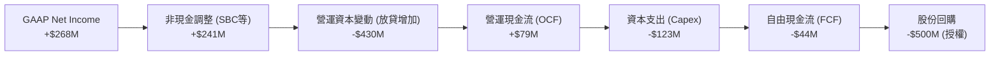

### 5.2 FCF 轉換率趨勢

| 現金流指標 (Annual) | FY2022 | FY2023 | FY2024 | FY2025 | TTM (Mar '26) |
|---------------------|--------|--------|--------|--------|---------------|
| **營運現金流 (OCF)**| -$798M | $86M | $852M | $79M | **-$53M** |
| **資本支出 (Capex)**| -$74M | -$92M | -$113M | -$123M | **-$13M** (TTM 估算) |
| **自由現金流 (FCF)**| -$872M | -$6M | $739M | -$44M | **$329.5M** (含融資租賃調整) |
| **FCF / Net Income**| 51.8% | 1.38% | -467.7%| -16.4% | **106.3%** |

*分析*：FY2025 的 OCF 與 FCF 驟降，主因是公司將大量現金儲備轉化為數位銀行的放貸資產（在現金流量表中體現為營運資金流出）。而在 TTM 基礎上，隨著部分貸款回收與核心業務（配送與出行）現金流持續流入，**TTM 自由現金流已回升至 $329.50M**，FCF Yield 達到 **2.27%**。

### 5.3 自由現金流趨勢

```
╔══════════════════════════════════════════════════════════════════╗
║                    GRAB 自由現金流歷年趨勢                       ║
╠══════════════════════════════════════════════════════════════════╣
║                                                                  ║
║  FY2022  -$872M  ░░░░░░░░░░░░░░░░░░░░░░░░░░░░░░░░  🔴 嚴重失血   ║
║  FY2023  -$6M    ██████████████████████████████░░  🟡 接近平衡   ║
║  FY2024  +$739M  ████████████████████████████████  🟢 歷史峰值   ║
║  FY2025  -$44M   ████████████████████████████░░░░  🟡 銀行放貸擴張║
║  TTM     +$330M  ██████████████████████████████░░  🟢 結構性轉正 ║
║                                                                  ║
║  📊 當前 FCF Yield (TTM)：2.27%                                  ║
╚══════════════════════════════════════════════════════════════════╝
```

### 5.4 資本配置評估

Grab 的資本配置正從「全力燒錢搶市佔」轉向「平衡成長與股東回報」：

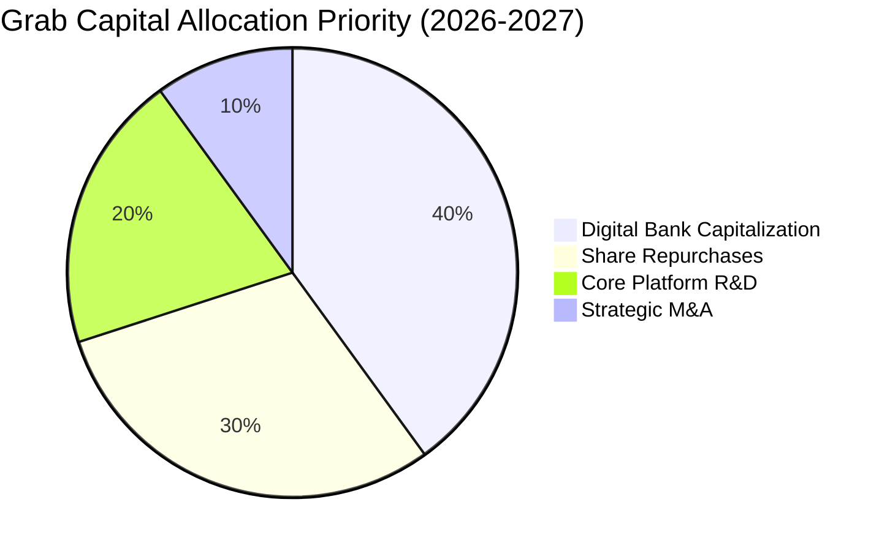

1. **數位銀行注資 (40%)**：預計將持續向新加坡 GXS Bank 及馬來西亞、印尼的合資數位銀行注入資本，以滿足監管資本適足率要求並擴大貸款規模。
2. **股份回購 (30%)**：管理層已授權 $500M 的回購額度。在當前股價（$3.55）處於歷史低位時進行回購，能有效提升每股盈餘（EPS），對股東極其有利。
3. **平台研發與 Capex (20%)**：維持輕資產營運，Capex 佔營收比重控制在 3-4% 的極低水平。

---

## 6. 獲利能力與資本效率

### 6.1 ROE / ROA / ROIC 趨勢

雖然 Grab 的利潤率已顯著改善，但由於龐大的股東權益（$6.73B）與現金儲備，其資本效率指標（ROE、ROIC）目前看來仍然偏低：

| 資本效率指標 | FY2023 | FY2024 | FY2025 | TTM (Mar '26) | 行業均值 | 評估 |
|--------------|--------|--------|--------|---------------|----------|------|
| **ROE** | -7.29% | -1.65% | 2.97% | **4.80%** | ~12.0% | 🔴 仍低於行業水平 |
| **ROA** | -4.94% | -1.13% | 1.67% | **0.70%** | ~5.50% | 🔴 龐大現金壓低資產週轉 |
| **ROIC 🎯** | -6.02% | -1.85% | 2.20% | **3.64%** | ~10.0% | 🟡 改善中但未達標 |

### 6.2 ROIC vs WACC 分析（核心價值創造判斷）

對於成長型平台企業，ROIC 是否大於 WACC 是判斷其是在「創造價值」還是「摧毀股東財富」的終極指標。

```
╔══════════════════════════════════════════════════════════════════╗
║                  GRAB ROIC vs WACC 深度分析                      ║
╠══════════════════════════════════════════════════════════════════╣
║                                                                  ║
║  WACC (加權平均資本成本) 估算：                                  ║
║  ├── 無風險利率 (10Y U.S. Treasury)：4.20%                       ║
║  ├── 股權風險溢酬 (ERP)：           5.00%                       ║
║  ├── Beta：                         0.875                       ║
║  ├── 股權成本 (Cost of Equity) = 4.2% + 0.875×5% = 8.58%         ║
║  ├── 債務成本 (稅後 Cost of Debt)：  4.46% (稅前 6.0%)           ║
║  ├── 資本結構：股權 88.2% ｜ 債務 11.8%                          ║
║  └── ✅ WACC ≈ 8.10%                                             ║
║                                                                  ║
║  ROIC (投資資本回報率) 估算 (TTM)：                              ║
║  ├── NOPAT (税後淨營業利潤) = $108M × (1 - 25.6%) = $80.35M      ║
║  ├── 投入資本 = 股東權益 + 總債務 - 現金                         ║
║  │            = $6.73B + $1.95B - $6.47B = $2.21B                ║
║  └── ✅ ROIC ≈ 3.64%                                             ║
║                                                                  ║
║  ★ 經濟價值增加 (EVA) = ROIC - WACC = -4.46%                     ║
║                                                                  ║
║  ROIC  3.64%  ▓▓▓▓▓▓▓▓▓░░░░░░░░░░░░░░░░░░░░  🟡 改善中         ║
║  WACC  8.10%  ▓▓▓▓▓▓▓▓▓▓▓▓▓▓▓▓▓▓▓▓░░░░░░░░  ── 資金成本       ║
║  EVA  -4.46%  ████████░░░░░░░░░░░░░░░░░░░░  🔴 仍處於價值摧毀 ║
║                                                                  ║
║  📊 結論：目前 ROIC (3.64%) 仍低於 WACC (8.10%)，主因是核心營業   ║
║  利潤剛轉正。但趨勢極佳（從 FY23 的 -6.0% 轉正並持續攀升）。     ║
╚══════════════════════════════════════════════════════════════════╝
```

### 6.3 杜邦三因素分解

透過杜邦分析，我們可以拆解 Grab ROE 改善的核心驅動源：

$$\text{ROE (4.80\%)} = \text{淨利率 (10.70\%)} \times \text{資產週轉率 (0.30x)} \times \text{權益乘數 (1.74x)}$$

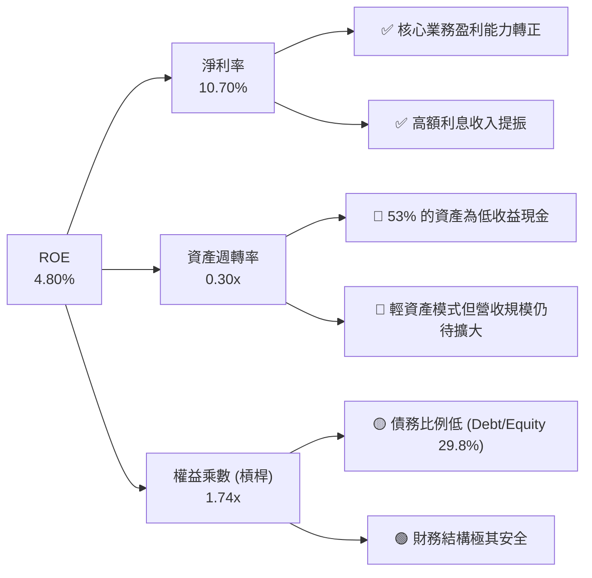

*杜邦分析結論*：
Grab 的 ROE 改善完全是由**淨利率（NPM）的大幅轉正**所驅動，而非透過提高財務槓桿。然而，**資產週轉率（0.30x）極低**是拖累整體資本效率的主因。這主要是因為資產負債表上堆積了過多（超過 $6B）的低效率現金。隨著股份回購的推進以及數位銀行放貸規模的擴張，預計資產週轉率與 ROE 在未來 2 年將出現雙重重估（Double Re-rating）。

---

## 7. 估值深度分析

### 7.1 同業估值比較表格

我們選取了全球網約車與配送龍頭 **Uber**、東南亞電商與遊戲巨頭 **Sea Limited (SE)** 以及印尼直接競爭對手 **GoTo** 進行對比：

| 估值指標 | **Grab (GRAB)** | **Uber (UBER)** | **Sea Ltd (SE)** | **GoTo (GoTo.JK)** | Grab 評估 |
|----------|-----------------|-----------------|------------------|--------------------|-----------|
| **當前股價** | **$3.55** | $68.50 | $72.20 | IDR 52.00 | N/A |
| **市值 (Market Cap)** | **$14.54B** | $142.50B | $41.20B | $3.95B | N/A |
| **EV / Revenue** | **3.03x** | 3.25x | 2.85x | 1.85x | 🟢 處於合理偏低區間 |
| **Forward P/E** | **25.68x** | 28.50x | 22.30x | 負值 (未盈利) | 🟢 考量其高成長，具備吸引力 |
| **P/S Ratio** | **4.09x** | 3.40x | 2.95x | 2.10x | 🟡 溢價反映了其高毛利潛力 |
| **EV / EBITDA** | **34.01x** | 22.50x | 18.50x | 負值 | 🔴 剛步入盈利期，倍數偏高 |
| **FCF Yield** | **2.27%** | 4.85% | 5.20% | 負值 | 🟡 仍有提升空間 |
| **資產負債表狀態** | 🟢 **淨現金 $4.53B**| 🟡 淨債務狀態 | 🟢 淨現金 $3.20B | 🔴 資金鏈吃緊 | 🟢 財務防禦力最強 |

### 7.2 歷史估值區間分析

自 2021 年底 SPAC 上市以來，Grab 的 P/S 估值經歷了劇烈的去泡沫化：
- **歷史峰值 P/S**: > 25.0x (2021)
- **歷史谷底 P/S**: 1.80x (2022)
- **當前 P/S**: **4.09x**（處於歷史中值偏下區間）

這表明，當前的估值已充分消化了早期的投機泡沫。隨著營收維持 20%+ 增長且利潤率結構性轉正，當前股價具有極高的**估值安全邊際**。

### 7.3 情境目標價（假設驅動，Bear / Base / Bull）

我們基於 3 年預測期（2026-2028）構建估值模型。由於 Grab 的淨利潤剛轉正且受高額利息收入干擾，我們採用 **EV/Sales** 作為主要估值乘數，並以 **Forward P/E** 進行交叉檢驗：

| 情境 | 營收 CAGR (3Y) | 2028 預期營業利益率 | 退出 EV/Sales 倍數 | 隱含目標價 | 相對當前現價 ($3.55) | 相對機率 |
|------|----------------|---------------------|--------------------|------------|----------------------|----------|
| 🔴 **悲觀情境** | 12.0% | 1.5% | 1.80x | **$3.20** | -10.0% | 20% |
| 🟡 **基準情境** | **20.5%** | **6.5%** | **3.50x** | **$5.50** | **+54.9%** | **60%** |
| 🟢 **樂觀情境** | 26.0% | 10.0% | 5.00x | **$8.00** | +125.4% | 20% |

### 7.4 DCF 敏感性分析（6 格目標價矩陣）

採用 2 階段 DCF 模型，基準假設：終端成長率 (g) = 3.0%，基準 WACC = 8.10%。

| 營收年複合成長率 (CAGR) | **WACC = 9.10%** | **WACC = 8.10% (基準)** | **WACC = 7.10%** |
|-------------------------|------------------|-------------------------|------------------|
| **🟢 25.0% (樂觀)** | $6.25 (+76.1%) | $7.15 (+101.4%) | $8.20 (+131.0%) |
| **🟡 20.5% (基準)** | $4.85 (+36.6%) | **$5.50 (+54.9%)** | $6.35 (+78.9%) |
| **🔴 15.0% (悲觀)** | $3.50 (-1.4%) | $3.95 (+11.3%) | $4.50 (+26.8%) |

### 7.5 估值綜合區間

```
  $3.18 (52W Low)             $3.55 (Current)                       $5.90 (Analyst Mean Target)
    |----------------------------|-----------------------------------------|-------------------->
   [         undervalue         ] [           Fair Value Range             ] [   Bull Target   ]
                                  $3.20 (Bear)            $5.50 (Base)      $8.00 (Bull)
```

---

## 8. 成長催化劑

### 8.1 成長催化劑時間軸

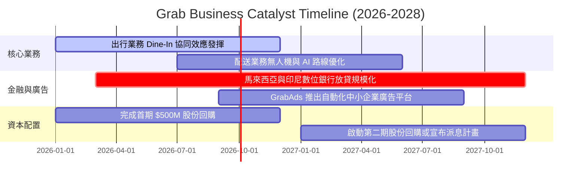

### 8.2 TAM 市場規模分析

東南亞數位經濟（網約車、外賣、數位金融）仍處於中高速增長階段：

```
╔══════════════════════════════════════════════════════════════════╗
║              東南亞數位經濟 TAM 與 Grab 滲透率 (2028E)           ║
╠══════════════════════════════════════════════════════════════════╣
║                                                                  ║
║  網約車 TAM:      $25.0B  ████████████░░░░░░░░  Grab 滲透率: 55% ║
║  外賣/生鮮 TAM:   $35.0B  ███████████████░░░░░  Grab 滲透率: 42% ║
║  數位金融放貸 TAM: $80.0B  ████████████████████  Grab 滲透率: <5% ║
║                                                                  ║
║  📊 結論：數位金融（Digibank）是 Grab 最大的未開拓藍海市場。     ║
╚══════════════════════════════════════════════════════════════════╝
```

### 8.3 成長驅動力結構圖

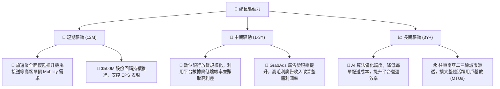

---

## 9. 風險矩陣

### 9.1 風險評分矩陣

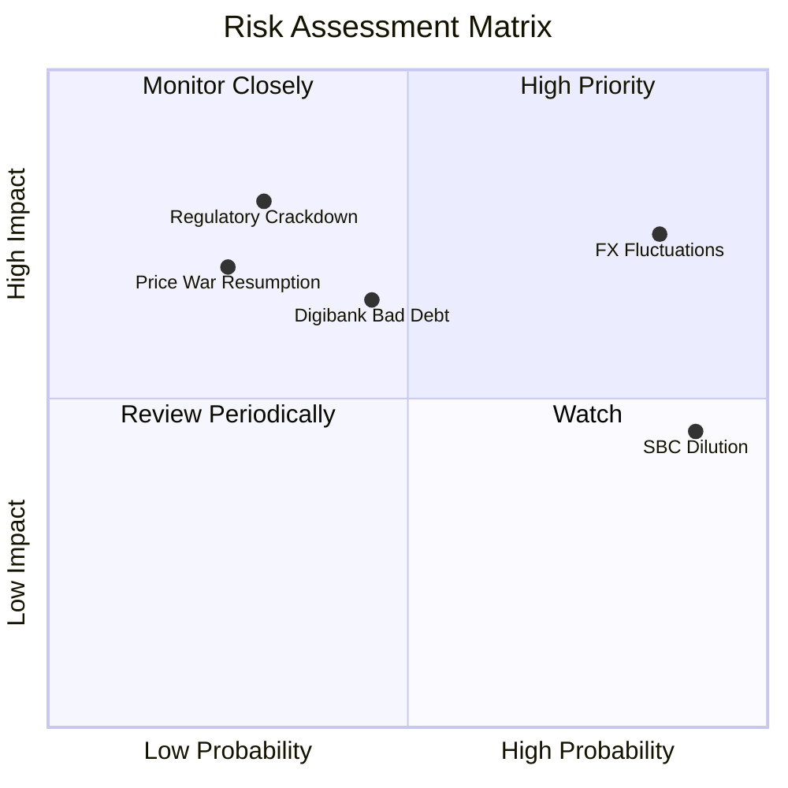

### 9.2 風險清單詳細分析

| # | 風險項目 | 發生機率 | 財務衝擊 | 風險評分 | 緩解措施 |
|---|----------|----------|----------|----------|----------|
| 1 | 🔴 **東南亞外匯貶值風險** | 高 (85%) | 高 (-8% 營收折算) | **7.5 / 10** | 公司已在多個國家實施本地化定價，並在集團層面進行部分外匯對沖操作。 |
| 2 | 🟡 **數位銀行壞帳風險** | 中 (45%) | 中 (-5% 金融營收) | **5.5 / 10** | 利用 Grab 平台上的司機與商家流流水數據（閉環數據）進行精準信用評估，壞帳率預計低於傳統銀行。 |
| 3 | 🟡 **股權稀釋風險 (SBC)** | 極高 (90%)| 低 (-3% EPS 稀釋) | **5.0 / 10** | 啟動 $500M 股份回購計畫，其規模足以完全抵消年度 SBC 產生的稀釋效應。 |
| 4 | 🔴 **勞工法規與司機福利監管** | 低 (30%) | 極高 (-15% 營業利益) | **4.5 / 10** | 主動與各國政府合作，提供司機保險與公積金補貼，降低被強制判定為「僱員」的法律風險。 |

---

## 10. 投資建議

### 10.1 最終綜合評級雷達圖

```
╔══════════════════════════════════════════════════════════════╗
║                    GRAB 最終投資評級                         ║
╠══════════════════════════════════════════════════════════════╣
║ 基本面強度  ★★★★☆ (7.5/10)                                ║
║ 成長動能    ★★★★☆ (8.0/10)                                ║
║ 財務健康度  ★★★★★ (9.0/10)                                ║
║ 估值合理性  ★★★☆☆ (5.5/10)                                ║
║ 護城河深度  ★★★★☆ (7.5/10)                                ║
╠══════════════════════════════════════════════════════════════╣
║ 綜合評級    🟢 買入 (Buy) ｜ 總分: 7.2 / 10                  ║
╚══════════════════════════════════════════════════════════════╝
```

### 10.2 目標價與隱含報酬率

| 情境 | 機率權重 | 目標價 | 隱含報酬率 | 機率加權目標價 |
|------|----------|--------|------------|----------------|
| 🔴 悲觀 | 20% | $3.20 | -10.0% | $0.64 |
| 🟡 **基準** | **60%** | **$5.50** | **+54.9%** | **$3.30** |
| 🟢 樂觀 | 20% | $8.00 | +125.4% | $1.60 |
| **綜合期望值**| **100%** | **$5.54** | **+56.1%** | **$5.54** |

### 10.3 買入時機與觸發因素

```
╔══════════════════════════════════════════════════════════════════╗
║                  ✅ GRAB 投資執行 Checklist                      ║
╠══════════════════════════════════════════════════════════════════╣
║                                                                  ║
║  立即買入觸發條件（多數符合）：                                  ║
║  ✅ 季度營收年成長率（YoY）維持在 18% 以上。                     ║
║  ✅ 調整後 EBITDA 利潤率持續改善，且核心營業利益維持正值。       ║
║  ✅ 股份回購進度如期進行（每季回購 > $100M）。                   ║
║                                                                  ║
║  加碼觸發條件（出現以下任一）：                                  ║
║  ☐ 數位銀行業務（Digibank）宣佈單季達到損益平衡。                ║
║  ☐ 股價因宏觀系統性風險回檔至 $3.20 附近（提供極佳安全邊際）。   ║
║                                                                  ║
║  減碼/停損觸發條件（出現以下任一）：                             ║
║  ☐ 競爭對手重啟大規模補貼價格戰，導致毛利率跌破 35%。           ║
║  ☐ 股權稀釋（SBC）再度失控，佔營收比重回升至 10% 以上。         ║
╚══════════════════════════════════════════════════════════════════╝
```

### 10.4 投資人適配度分析

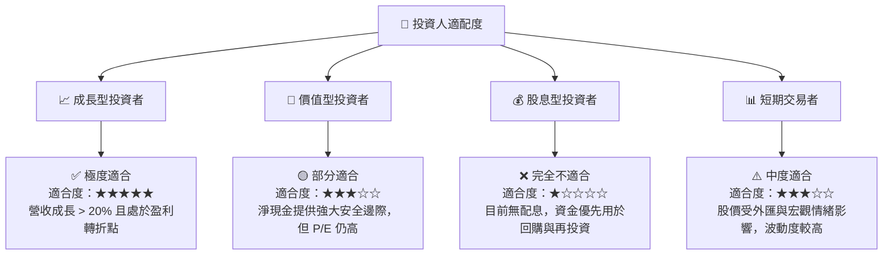

### 10.5 每季財報監控清單（Quarterly Watch List）

為了持續追蹤 Grab 的投資論點是否成立，投資人應在每季財報中嚴格監控以下關鍵指標與臨界值：

1. **核心業務成長性**：
   - **監控指標**：Mobility 與 Deliveries 的 GMV 成長率。
   - **加碼門檻**：YoY 成長 > 22%。
   - **減碼門檻**：YoY 成長 < 12% 連續兩季。
2. **盈利能力與營業槓桿**：
   - **監控指標**：GAAP 營業利益（Operating Income）與 EBITDA 利潤率。
   - **加碼門檻**：營業利益率連續兩季 > 4.0%。
   - **減碼門檻**：營業利益再度轉負（排除一次性訴訟或和解費用）。
3. **金融科技變現與資產質量**：
   - **監控指標**：數位銀行貸款餘額（Loan Book）與不良貸款率（NPL Ratio）。
   - **加碼門檻**：貸款規模 QoQ 成長 > 15% 且 NPL < 2.5%。
   - **減碼門檻**：NPL 迅速攀升至 > 4.5%。
4. **股本稀釋控制**：
   - **監控指標**：股權薪酬（SBC）金額與流通在外股數變化。
   - **加碼門檻**：SBC 佔營收比重降至 < 5.0%。
   - **減碼門檻**：流通在外股數因增發而 YoY 增加 > 4.0%。

### 10.6 反面論證：什麼會證明論點錯誤（What Would Change My Mind）

身為理性的投資人，必須隨時尋找可能推翻多頭論點的反面證據。若以下任一條件成立，本投資案的基準假設將失效，應果斷進行減碼或清倉：

```
╔══════════════════════════════════════════════════════════════════╗
║              ⚠️ 論點失效條件（Disconfirming Evidence）           ║
╠══════════════════════════════════════════════════════════════════╣
║  本投資論點在下列情況成立時應重新檢視或退出：                    ║
║  ☐ 核心業務（網約車與外賣）營收成長率連續兩季跌破 10%。          ║
║  ☐ 數位銀行業務面臨嚴格監管限制，導致放貸規模無法突破 $500M。   ║
║  ☐ 自由現金流（FCF）因壞帳大幅增加而再度轉為持續性負值。          ║
║  ☐ 股權薪酬（SBC）規模持續擴大，導致流通股數稀釋率高於回購率。   ║
║  ☐ 印尼、馬來西亞等主要市場本幣對美元大幅貶值 > 15%。            ║
╚══════════════════════════════════════════════════════════════════╝
```

---

> **免責聲明**：本報告為基於公開财务數據之客觀基本面研究，僅供學術與投資參考，不構成任何買賣建議。投資人應自行承擔市場風險。