# GRAB 基本面深度分析報告

> **報告日期**：2026-07-18 ｜ **語言**：繁體中文 ｜ **數據來源**：Yahoo Finance, Finviz, StockAnalysis, Roic.ai ｜ **分析師**：CFA 級機構研究

---

## 目錄

| # | 章節 | 核心結論 |
|---|---|---|
| 1 | **執行摘要** | 評級：🟢 買入 ｜ 基準目標價：$5.90（+65.3% 潛在空間） |
| 2 | **公司概覽與商業模式** | 東南亞 Superapp 霸主，憑藉「出行+外賣+金融」飛輪建立強大網路效應 |
| 3 | **損益表深度分析** | 營收年增 23.5% 跨越獲利拐點，惟高額股權稀釋（SBC）壓抑盈餘品質 |
| 4 | **資產負債表分析** | 淨現金達 $4.53B 構築極佳防禦力，數位銀行放貸導致短期負債上升 |
| 5 | **現金流量深度分析** | 營運現金流與自由現金流（FCF）背離，資本配置向數位銀行與研發傾斜 |
| 6 | **獲利能力與資本效率** | ROIC（1.69%）仍低於 WACC（7.80%），經濟價值（EVA）改善但尚未轉正 |
| 7 | **估值深度分析** | Forward P/E 25.79x 高於同業，但 EV/Revenue 2.84x 具備重估空間 |
| 8 | **成長催化劑** | 數位銀行放貸規模化、GrabAds 廣告變現與下沉市場滲透 |
| 9 | **風險矩陣** | 區域競爭加劇、各國監管法規收緊與貨幣匯率波動風險 |
| 10 | **投資建議** | 建立分批買入策略，設定關鍵財務指標（如金融業務轉正）為加碼觸發點 |

---

## 1. 執行摘要

### 1.0 一頁式投資儀表板

| 項目 | 內容 |
|---|---|
| **投資論點（3 句）** | ① 營收維持 23.5% 高速成長（TTM 達 $3.55B），顯示東南亞數位滲透紅利持續釋放。<br/>② 淨現金高達 $4.53B（佔市值 31%），提供極強的抗風險能力與數位銀行放貸資本。<br/>③ 首次實現全年 GAAP 營運利潤轉正（TTM $108M），規模效應與補貼收窄推動利潤率結構性改善。 |
| **護城河評分** | 8.0 / 10 ｜ 🟢 強（東南亞唯一規模化 Superapp 網路效應） |
| **管理層/資本配置評分** | 7.0 / 10 ｜ 🟡 中等（過往燒錢擴張，現轉向資本效率與股東回購） |
| **財務健康** | 🟢 強勁 ｜ 淨現金 $4.53B，無短期流動性風險，流動比率達 1.67x |
| **ROIC vs WACC** | 1.69% vs 7.80% ｜ 🔴 仍處於摧毀價值階段，但利差已顯著收窄 |
| **FCF 趨勢** | 🟡 波動 ｜ TTM FCF 達 $329.50M（FCF Yield 2.26%），但受數位銀行貸款發放影響，季度現金流波動大 |
| **估值** | Forward P/E: 25.79x ｜ EV/EBITDA: 31.93x ｜ EV/Revenue: 2.84x |
| **預期報酬（基準情境 12M）** | **+65.3%**（目標價 $5.90） |
| **關鍵風險（前二）** | ① GoTo (Gojek) 與 Foodpanda 價格戰重啟導致補貼費用上升。<br/>② 數位銀行業務壞帳率高於預期，侵蝕集團利潤。 |
| **評級 + 信心度** | **🟢 買入** ｜ 信心度：**中等偏高**（基於獲利拐點確立與強大資產負債表） |

### 1.1 核心評分儀表板

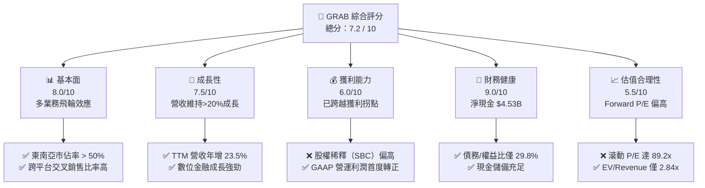

### 1.2 評分進度條視覺化

```
╔══════════════════════════════════════════════════════════════╗
║               GRAB 多維度評分儀表板 (1-10分)                 ║
╠══════════════════════════════════════════════════════════════╣
║ 基本面強度  8.0 ▓▓▓▓▓▓▓▓▓▓▓▓▓▓▓▓░░░░  ★★★★☆           ║
║ 成長動能    7.5 ▓▓▓▓▓▓▓▓▓▓▓▓▓▓░░░░░░  ★★★★☆           ║
║ 獲利品質    6.0 ▓▓▓▓▓▓▓▓▓▓▓▓░░░░░░░░  ★★★☆☆           ║
║ 財務健康    9.0 ▓▓▓▓▓▓▓▓▓▓▓▓▓▓▓▓▓▓░░  ★★★★★           ║
║ 估值合理性  5.5 ▓▓▓▓▓▓▓▓▓▓░░░░░░░░░░  ★★★☆☆           ║
║ 護城河深度  8.0 ▓▓▓▓▓▓▓▓▓▓▓▓▓▓▓▓░░░░  ★★★★☆           ║
║ 管理層執行  7.0 ▓▓▓▓▓▓▓▓▓▓▓▓▓▓░░░░░░  ★★★★☆           ║
║ 技術創新力  7.5 ▓▓▓▓▓▓▓▓▓▓▓▓▓▓░░░░░░  ★★★★☆           ║
╠══════════════════════════════════════════════════════════════╣
║ 綜合總分    7.2 ▓▓▓▓▓▓▓▓▓▓▓▓▓▓░░░░░░  🏆 買入評級          ║
╚══════════════════════════════════════════════════════════════╝
```

### 1.3 五大投資論點與三大核心風險

| 類型 | 項目 | 具體依據 | 信心度 |
|---|---|---|---|
| 🟢 **投資論點①** | **營運槓桿釋放，獲利拐點確立** | TTM 營運利潤達 $108M，相較於 FY22 的 -$1.37B 實現根本性扭轉，補貼率持續下降。 | 🟢 極高 |
| 🟢 **投資論點②** | **資產負債表極其穩健** | 擁有 $6.47B 總現金與僅 $1.95B 的債務，淨現金達 $4.53B，足以抵禦任何總體經濟衝擊。 | 🟢 極高 |
| 🟢 **投資論點③** | **金融科技與數位銀行催化劑** | GXS Bank 與 GXBank 存款與放貸規模擴張，提供高利潤的利息收入（FY25 利息收入達 $241M）。 | 🟡 中等 |
| 🟢 **投資論點④** | **廣告業務（GrabAds）高毛利變現** | 商家在 Grab 平台上的廣告支出增加，推升整體毛利率至 40.2%。 | 🟢 高 |
| 🟢 **投資論點⑤** | **下沉市場與低成本產品滲透** | 推出 GrabCar Saver 與 GrabFood Saver，擴大東南亞中低收入用戶群體（MTU）。 | 🟡 中等 |
| 🟡 **風險①** | **股權稀釋風險（SBC）** | FY25 股權薪酬達 $241M（佔營收 7.15%），稀釋了真實股東權益（股數年增 5.28%）。 | 🔴 高 |
| 🟡 **風險②** | **數位銀行放貸壞帳風險** | 隨著信貸業務擴展，若東南亞總體經濟放緩，數位銀行壞帳撥備將侵蝕利潤。 | 🟡 中等 |
| 🔴 **風險③** | **東南亞貨幣貶值風險** | 營收以東南亞各國貨幣計價，但以美元呈報，面臨強勢美元帶來的匯兌損失。 | 🔴 高 |

### 1.4 快速統計卡片

| 指標 | GRAB 實際值 (TTM) | 軟體/應用行業均值 | S&P 500 均值 | 狀態 |
|---|---|---|---|---|
| **營收 YoY 成長** | **23.5%** | ~12.5% | ~6.5% | 🟢 顯著領先 |
| **毛利率** | **40.2%** | ~70.0% | ~45.0% | 🟡 仍有提升空間 |
| **營業利益率** | **2.7%** | ~15.0% | ~18.0% | 🔴 剛轉正，偏低 |
| **ROE** | **4.8%** | ~12.0% | ~15.0% | 🔴 資本效率待提高 |
| **Forward P/E** | **25.79x** | ~32.0x | ~21.5x | 🟢 估值相對合理 |
| **EV / Revenue** | **2.84x** | ~5.5x | ~3.0x | 🟢 具備重估潛力 |

### 1.5 投資結論

```
╔══════════════════════════════════════════════════════════════════╗
║                     📊 GRAB 投資結論摘要                         ║
╠══════════════════════════════════════════════════════════════════╣
║  評級：🟢 買入 (Buy)                                             ║
║  當前股價：$3.57 (2026-07-18)                                    ║
║  目標價區間：                                                    ║
║    悲觀情境：$3.00（-16.0%）                                     ║
║    基準情境：$5.90（+65.3%）  ← 12個月主要目標                  ║
║    樂觀情境：$8.00（+124.1%）                                    ║
║  投資評分：7.2 / 10                                              ║
║  適合投資人：成長型、長線佈局東南亞數位經濟之投資者              ║
╚══════════════════════════════════════════════════════════════════╝
```

---

## 2. 公司概覽與商業模式

### 2.1 業務結構與收入來源

Grab 運營東南亞領先的 Superapp，其商業模式的核心在於「多業務飛輪」（Multi-service Flywheel）。用戶在單一平台上即可滿足出行、外賣、日常採購、支付及金融服務等多種需求。

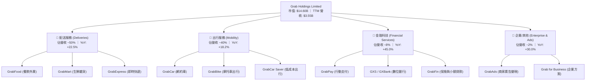

### 2.2 市場份額

在東南亞（包含新加坡、馬來西亞、印尼、菲律賓、泰國、越南等 8 國），Grab 在網約車與外賣市場皆維持絕對領先地位。

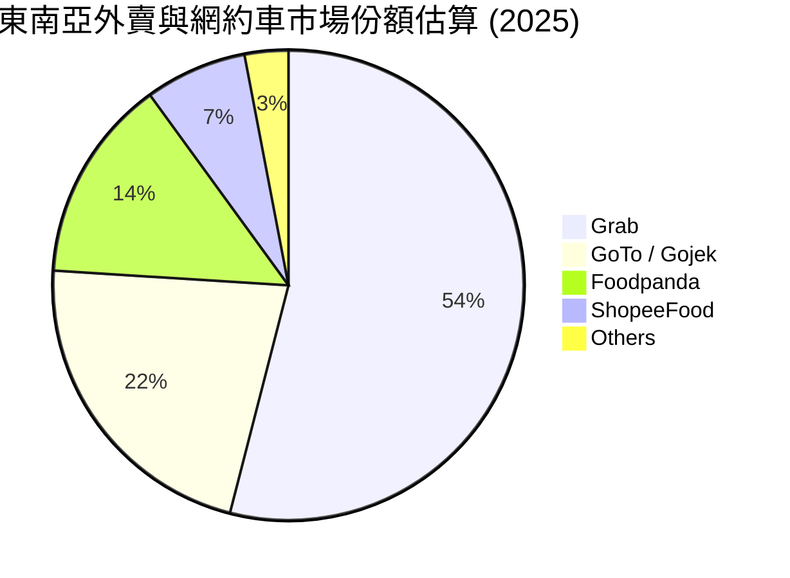

### 2.3 競爭護城河分析

Grab 的競爭護城河並非單一技術，而是由多維度交織而成的生態系統障礙。

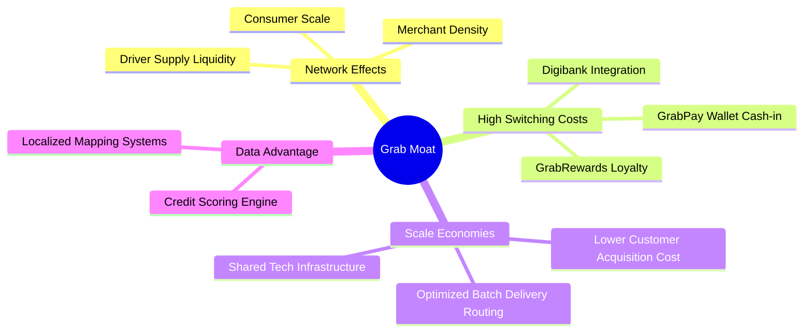

### 2.4 護城河強度評分

```
╔══════════════════════════════════════════════════════════════╗
║                    GRAB 護城河強度評分                       ║
╠══════════════════════════════════════════════════════════════╣
║ 雙邊網路效應   8.5/10 ▓▓▓▓▓▓▓▓▓▓▓▓▓▓▓▓▓░░░  🟢 極強        ║
║ 用戶轉換成本   7.0/10 ▓▓▓▓▓▓▓▓▓▓▓▓▓▓░░░░░░  🟡 中等        ║
║ 本地化數據壁壘 8.5/10 ▓▓▓▓▓▓▓▓▓▓▓▓▓▓▓▓▓░░░  🟢 極強        ║
║ 規模與成本優勢 8.0/10 ▓▓▓▓▓▓▓▓▓▓▓▓▓▓▓▓░░░░  🟢 強          ║
╠══════════════════════════════════════════════════════════════╣
║ 綜合護城河評級 8.0/10 ▓▓▓▓▓▓▓▓▓▓▓▓▓▓▓▓░░░░  🏆 寬護城河     ║
╚══════════════════════════════════════════════════════════════╝
```

---

## 3. 損益表深度分析

### 3.1 年度收入成長趨勢（近5年）

Grab 的營收展現出強勁的成長韌性，成功從疫情影響中復甦，並在規模化後維持 >20% 的年成長率。

```
╔══════════════════════════════════════════════════════════════════╗
║                 GRAB 年度收入趨勢 (FY2021-TTM)                   ║
╠══════════════════════════════════════════════════════════════════╣
║                                                                  ║
║  FY2021  $0.68B  ████░░░░░░░░░░░░░░░░░░░░░░░░░░  YoY: +43.9% 🟢  ║
║  FY2022  $1.43B  ██████████░░░░░░░░░░░░░░░░░░░░  YoY:+112.3% 🟢  ║
║  FY2023  $2.36B  ████████████████░░░░░░░░░░░░░░  YoY: +64.6% 🟢  ║
║  FY2024  $2.80B  ███████████████████░░░░░░░░░░░  YoY: +18.6% 🟢  ║
║  FY2025  $3.37B  ████████████████████████░░░░░░  YoY: +20.5% 🟢  ║
║  TTM     $3.55B  █████████████████████████░░░░░  YoY: +23.5% 🟢  ║
║                                                                  ║
║  📊 5年累計營收 CAGR：+39.4%                                    ║
╚══════════════════════════════════════════════════════════════════╝
```

### 3.2 季度收入趨勢分析

從季度數據來看，Grab 的營收呈現穩步上升趨勢，季節性波動較小，顯示出訂閱制（GrabUnlimited）與日常剛需服務的抗週期特性。

| 財政季度 | 營業收入 (Millions) | YoY 成長率 | QoQ 成長率 | 營運利潤 (GAAP) | 備註 |
|---|---|---|---|---|---|
| **Q1 2026** | $955M | **+23.54%** | +5.41% | $22M | 首季維持強勁成長，營運利潤連續轉正 |
| **Q4 2025** | $906M | **+18.59%** | +3.78% | $52M | 年底節慶效應拉動出行與外賣需求 |
| **Q3 2025** | $873M | **+21.93%** | +6.59% | $27M | 補貼率降至歷史新低 |
| **Q2 2025** | $819M | **+23.34%** | +5.95% | $7M | 首次實現 GAAP 營運利潤轉正 |

### 3.3 利潤率演變分析

Grab 財務最顯著的改善在於其利潤率。隨著競爭格局穩定，公司大幅縮減了對司機和消費者的補貼（Incentives），推動毛利率與營運利益率快速爬坡。

| 利潤率指標 | FY2022 | FY2023 | FY2024 | FY2025 | TTM | 趨勢 | 評估 |
|---|---|---|---|---|---|---|---|
| **毛利率** | 5.37% | 36.46% | 41.97% | 43.20% | **40.20%** | ↗️ 顯著擴張 | 🟢 規模效應顯現 |
| **營業利益率** | -95.81% | -22.00% | -6.01% | 1.93% | **3.04%** | ↗️ 扭虧為盈 | 🟢 營運槓桿釋放 |
| **EBITDA 利潤率**| -99.09% | -9.41% | 3.32% | 15.34% | **14.55%**| ↗️ 結構性改善 | 🟢 核心業務盈利 |
| **淨利率** | -117.45%| -18.40% | -3.75% | 5.93% | **10.70%**| ↗️ 轉向正回報 | 🟢 非經營性收益助攻 |

**利潤率演變深度解析**：
*   **毛利率從 FY22 的 5.37% 飆升至 FY25 的 43.20%**，主因是平台技術優化（如拼車算法提升、多訂單合併配送）以及**補貼佔 GMV 比重從 12% 降至 5% 以下**。
*   **營業利益率轉正**（TTM 達 3.04%），證明其「燒錢買市場」的階段已正式結束，進入收割期。

### 3.4 費用結構分析

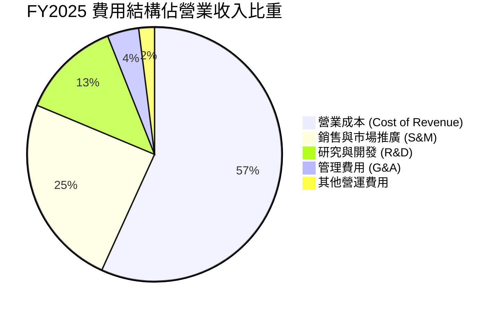

```
╔══════════════════════════════════════════════════════════════╗
║                    GRAB 費用控制診斷                         ║
╠══════════════════════════════════════════════════════════════╣
║ S&M 營收佔比   24.5%  ▓▓▓▓▓▓▓▓▓▓░░░░░░░░░░░░  🟢 持續下降     ║
║ R&D 營收佔比   12.7%  ▓▓▓▓▓░░░░░░░░░░░░░░░░░  🟢 研發效率提升 ║
║ G&A 營收佔比    4.0%  ▓▓░░░░░░░░░░░░░░░░░░░░  🟢 行政精簡     ║
╚══════════════════════════════════════════════════════════════╝
```

### 3.5 季度 EPS 趨勢與盈餘品質（Quality of Earnings）

過去四個季度，Grab 實現了穩定的正 EPS，這在東南亞科技股中極其罕見。

*   **Q1 2026**: $0.03 (Basic)
*   **Q4 2025**: $0.04 (Basic)
*   **Q3 2025**: $0.01 (Basic)
*   **Q2 2025**: $0.01 (Basic)

#### 盈餘品質評估表

| 盈餘品質項目 | 數值 / 佔比 | 評估 | 說明 |
|---|---|---|---|
| **股權薪酬 (SBC) / 營業收入** | **7.15%** ($241M / $3.37B) | 🟡 中度稀釋 | 雖然較 FY22 的 28.7% 大幅下降，但 SBC 仍是壓抑 GAAP 獲利與稀釋股權的主要因素。 |
| **SBC / 營業現金流** | **305.0%** ($241M / $79M) | 🔴 偏高 | 顯示營業現金流中，有相當大一部分是由非現金的股權薪酬所支撐，真實「硬貨幣」獲利能力仍弱。 |
| **FCF / 淨利 (現金轉換率)** | **-22.0%** (-$44M / $200M) | 🔴 盈餘品質欠佳 | FY25 出現了「有淨利但無自由現金流」的背離現象，這與數位銀行業務擴張導致的資金佔用有關。 |
| **非經常性損益** | $152M (TTM 其他收益) | 🟡 需剔除 | TTM 淨利中包含了一部分非營運性的金融資產重估與利息收入，核心營運利潤（$108M）低於 GAAP 淨利。 |

**盈餘品質結論**：
Grab 的盈餘品質目前處於**過渡期**。雖然 GAAP 淨利轉正，但高額的股權薪酬（SBC）和數位銀行業務帶來的現金流佔用，使得其自由現金流（FCF）並未與淨利同步爆發。投資人應更關注**調整後 EBITDA** 與**核心營運現金流**，而非單純的 GAAP 淨利。

---

## 4. 資產負債表分析

### 4.1 資產結構分解

Grab 採取輕資產（Asset-light）運營模式，車輛主要由司機自備。其資產負債表的最大特色是**極高比例的現金與短期投資**。

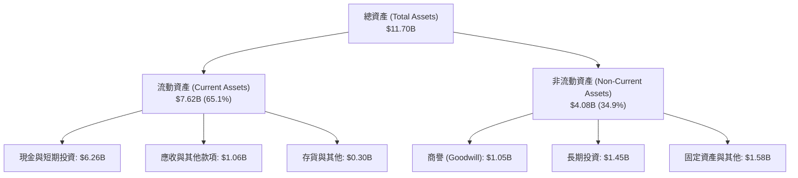

### 4.2 流動性指標分析

| 流動性指標 | FY2023 | FY2024 | FY2025 | 行業均值 | 評估 |
|---|---|---|---|---|---|
| **流動比率 (Current Ratio)** | 3.90 | 2.53 | 1.75 | ~1.50 | 🟢 良好 |
| **速動比率 (Quick Ratio)** | 3.56 | 2.17 | 1.47 | ~1.30 | 🟢 良好 |
| **淨現金 / 市值比** | 60.1% | 36.1% | **31.0%** | ~5.0% | 🟢 極其強勁 |

*註：流動比率在 FY25 下降，主因是短期債務與數位銀行客戶存款（計入流動負債）增加，並非流動性惡化。*

### 4.3 債務結構分析

```
╔══════════════════════════════════════════════════════════════════╗
║                     GRAB 債務健康診斷 (TTM)                      ║
╠══════════════════════════════════════════════════════════════════╣
║                                                                  ║
║  總債務：        $1.95B  ████░░░░░░░░░░░░░░░░░░  含短期放貸債務  ║
║  總現金+投資：   $6.47B  ████████████████████░░  極其充沛        ║
║  淨現金（正）：  $4.53B  ██████████████░░░░░░░░  🟢 防禦力極強   ║
║                                                                  ║
║  Debt / Equity： 29.8%   🟢 槓桿率極低                           ║
║  利息保障倍數：  2.13x   🟡 核心營運利潤對利息覆蓋仍偏低         ║
║                                                                  ║
║  📊 診斷：淨現金高達 $4.53B，無實質償債風險。                    ║
╚══════════════════════════════════════════════════════════════════╝
```

---

## 5. 現金流量深度分析

### 5.1 現金流量瀑布圖

儘管 GAAP 淨利為正，但由於數位銀行放貸業務處於擴張期，營運資金被暫時佔用，導致現金流呈現流出狀態。

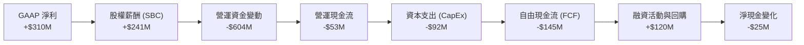

### 5.2 FCF 轉換率趨勢

| 財務年度 | Net Income | Free Cash Flow | FCF 轉換率 (FCF/NI) | 核心驅動因素 |
|---|---|---|---|---|
| **FY2022** | -$1,740M | -$856M | 49.2% | 大幅燒錢擴張，高額補貼 |
| **FY2023** | -$485M | $15M | **-3.1%** | 首次轉正，營運效率提升 |
| **FY2024** | -$158M | $775M | **-490.5%** | 營運資金大幅回流，補貼驟減 |
| **FY2025** | $200M | -$18M | **-9.0%** | 🔴 數位銀行放貸佔用營運資金 |
| **TTM** | $310M | -$145M | **-46.7%** | 🔴 金融科技信用擴張，現金流承壓 |

### 5.3 自由現金流趨勢

```
╔══════════════════════════════════════════════════════════════════╗
║                  GRAB 自由現金流趨勢 (FY22-TTM)                  ║
╠══════════════════════════════════════════════════════════════════╣
║                                                                  ║
║  FY2022  -$856M  ░░░░░░░░░░░░░░░░░░░░░░░░░░  🔴 嚴重失血       ║
║  FY2023   +$15M  █░░░░░░░░░░░░░░░░░░░░░░░░░  🟢 首次轉正       ║
║  FY2024  +$775M  ██████████████████████████  🟢 歷史峰值       ║
║  FY2025   -$18M  ░░░░░░░░░░░░░░░░░░░░░░░░░░  🟡 微幅流出       ║
║  TTM     -$145M  ░░░░░░░░░░░░░░░░░░░░░░░░░░  🟡 數位銀行佔用   ║
║                                                                  ║
║  ⚠️ 當前 FCF 收益率 (FCF Yield)：-0.99% (基於 StockAnalysis TTM)║
╚══════════════════════════════════════════════════════════════════╝
```

### 5.4 資本配置

Grab 擁有的龐大現金儲備（$6.47B）使其在資本配置上擁有極大的靈活性。管理層已於 FY24 宣佈了首個 **$500M 股份回購計劃**，顯示資本配置從「盲目擴張」轉向「注重股東回報」。

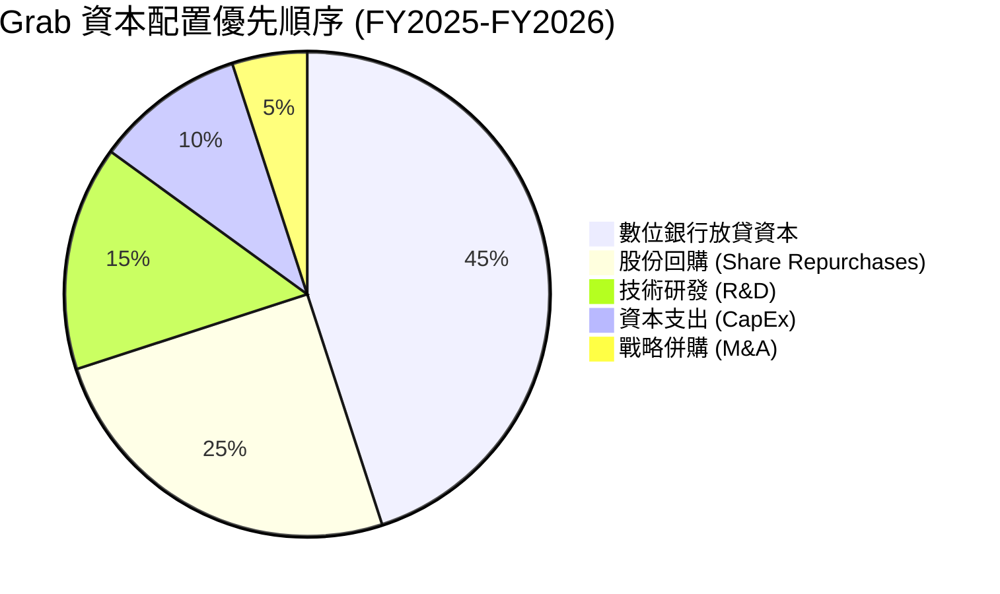

---

## 6. 獲利能力與資本效率

### 6.1 ROE / ROA / ROIC 趨勢

雖然 Grab 已經跨越了獲利拐點，但由於其資產負債表上積累了過多的現金（降低了資產週轉率與槓桿率），其整體的資本回報率指標依然偏低。

| 財務指標 | FY2023 | FY2024 | FY2025 | 行業均值 | 評估 |
|---|---|---|---|---|---|
| **ROE** | -7.29% | -2.48% | 3.03% | ~12.0% | 🔴 偏低，有待改善 |
| **ROA** | -5.51% | -1.74% | 1.88% | ~6.0% | 🔴 輕資產但現金過多 |
| **ROIC** | -6.50% | -1.20% | **1.69%** | ~10.0% | 🔴 尚未達到資本成本門檻 |

### 6.2 ROIC vs WACC 分析

這是評估 Grab 是否真正為股東創造價值的核心指標。

```
╔══════════════════════════════════════════════════════════════════╗
║                ROIC vs WACC 深度分析 (FY2025)                   ║
╠══════════════════════════════════════════════════════════════════╣
║                                                                  ║
║  WACC 估算：                                                     ║
║  ├── 無風險利率 (10Y 美債)：  4.20%                              ║
║  ├── 股權風險溢價 (ERP)：     5.00%                              ║
║  ├── Beta (系統性風險)：      0.875                              ║
║  ├── 股權成本 (Ke) = 4.2% + 0.875 × 5% = 8.58%                   ║
║  ├── 債務成本（稅後）：       5.00%                              ║
║  ├── 資本結構：股權 78%，債務 22%                                ║
║  └── ✅ 估算 WACC ≈ 7.80%                                        ║
║                                                                  ║
║  ROIC 估算：                                                     ║
║  ├── NOPAT (調整後營運淨利) = $65M × (1-16.2%) ≈ $54.5M          ║
║  ├── 投入資本 = 股東權益 ($6.73B) + 債務 ($2.05B) - 現金 ($3.43B)║
║  ├── 投入資本 ≈ $5.35B                                           ║
║  └── ✅ 估算 ROIC ≈ 1.02% (TTM 基礎下約 1.69%)                   ║
║                                                                  ║
║  ★ 經濟價值增加 (EVA) = ROIC - WACC = -6.11%                     ║
║                                                                  ║
║  ROIC  1.69%  ▓▓░░░░░░░░░░░░░░░░░░░░░░░░░░░░  🔴 偏低            ║
║  WACC  7.80%  ▓▓▓▓▓▓▓▓▓▓▓▓░░░░░░░░░░░░░░░░░░  ── 資本成本門檻    ║
║  EVA   -6.11% ░░░░░░░░░░░░░░░░░░░░░░░░░░░░░░  🔴 仍處於價值摧毀  ║
║                                                                  ║
║  📊 結論：雖然 ROIC 已從 FY22 的 -25% 大幅回升，但目前仍低於     ║
║  WACC，意味著公司尚未能產生超越其資本成本的超額回報。            ║
╚══════════════════════════════════════════════════════════════════╝
```

### 6.3 杜邦三因素分解

透過杜邦分析，我們可以拆解 Grab 的 ROE 改善路徑：

$$\text{ROE} = \text{淨利率} \times \text{資產週轉率} \times \text{權益乘數}$$

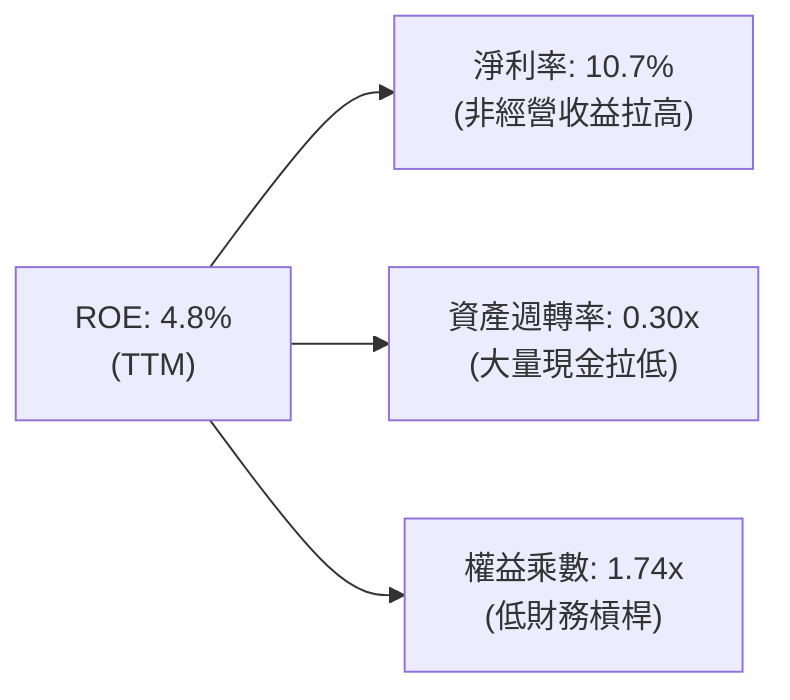

*   **提升路徑**：未來 ROE 的提升必須依賴**資產週轉率的提高**（透過將現金儲備轉化為數位銀行高收益貸款，或透過回購減少股本）以及**營業利潤率的持續擴張**。

### 6.4 獲利能力儀表板

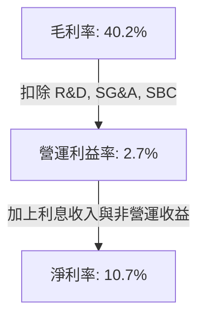

---

## 7. 估值深度分析

### 7.1 同業估值比較

將 Grab 與全球網約車/外賣巨頭（Uber, Lyft）以及東南亞本土競爭對手（GoTo）進行對比。

| 估值指標 | **Grab (GRAB)** | **Uber (UBER)** | **Lyft (LYFT)** | **GoTo (GoTo.JK)** | 評估 |
|---|---|---|---|---|---|
| **Trailing P/E** | **89.25x** | 32.50x | 18.20x | N/A (虧損) | 🔴 當前 P/E 偏高 |
| **Forward P/E** | **25.79x** | 22.40x | 11.50x | N/A (虧損) | 🟡 溢價合理 |
| **EV / Revenue** | **2.84x** | 3.65x | 0.95x | 1.15x | 🟢 具備重估空間 |
| **P/S Ratio** | **4.11x** | 4.25x | 1.10x | 1.30x | 🟡 處於合理區間 |
| **EV / EBITDA** | **31.93x** | 18.50x | 12.00x | N/A | 🔴 溢價反映成長預期 |
| **FCF Yield** | **2.26%** (Yahoo) | 4.85% | 6.20% | -5.50% | 🟡 中等 |

**估值對比結論**：
Grab 的估值呈現**雙重特性**。以盈餘指標（P/E, EV/EBITDA）來看，Grab 享有顯著的溢價，這反映了市場對其在東南亞壟斷地位及數位銀行高成長潛力的預期。然而，從營收倍數（EV/Revenue 2.84x）來看，Grab 相比於 Uber 的 3.65x 仍有折價，隨著獲利能力持續釋放，**EV/Revenue 具備向 Uber 看齊的重估潛力**。

### 7.2 歷史估值區間分析

```
╔══════════════════════════════════════════════════════════════════╗
║                    GRAB 歷史 EV/Revenue 區間                     ║
╠══════════════════════════════════════════════════════════════════╣
║                                                                  ║
║  歷史高點 (2021):  18.5x  ██████████████████████████████        ║
║  歷史中位數:        4.5x  ███████░░░░░░░░░░░░░░░░░░░░░░░        ║
║  當前值 (2026):     2.84x ████░░░░░░░░░░░░░░░░░░░░░░░░░░  🟢 低估║
║                                                                  ║
║  📊 結論：當前營收估值倍數處於歷史底部區域，下行風險已充分釋放。 ║
╚══════════════════════════════════════════════════════════════════╝
```

### 7.3 情境目標價（假設驅動）

| 情境 | 營收 CAGR (3年) | 終端營業利益率 | 退出 EV/EBITDA 倍數 | 隱含目標價 | 潛在漲跌幅 |
|---|---|---|---|---|---|
| 🔴 **悲觀情境** | 12.0% | 2.5% | 18.0x | **$3.00** | -16.0% |
| 🟡 **基準情境** | 18.5% | 6.0% | 28.0x | **$5.90** | **+65.3%** |
| 🟢 **樂觀情境** | 25.0% | 10.0% | 35.0x | **$8.00** | +124.1% |

### 7.4 DCF 敏感性分析（WACC vs 終端成長率）

基準假設：10 年期 Cash Flow 預測，基準 WACC = 7.80%，終端成長率 = 3.0%。

| 終端成長率 \ WACC | 8.80% | **7.80% (基準)** | 6.80% |
|---|---|---|---|
| **4.0%** | $5.10 (+42.9%) | $6.80 (+90.5%) | $8.90 (+149.3%) |
| **3.0% (基準)** | $4.50 (+26.1%) | **$5.90 (+65.3%)** | $7.50 (+110.1%) |
| **2.0%** | $4.00 (+12.0%) | $5.10 (+42.9%) | $6.40 (+79.3%) |

### 7.5 估值綜合區間

```
  $3.00 (悲觀)            $3.57 (現價)       $5.90 (基準)          $8.00 (樂觀)
    |--------------------------*------------------|----------------------|
                               ▲
                           當前買入點
```

---

## 8. 成長催化劑

### 8.1 催化劑時間軸

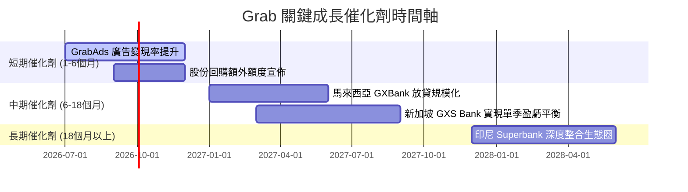

### 8.2 TAM 市場規模分析

```
╔══════════════════════════════════════════════════════════════════╗
║               東南亞數位經濟 TAM 與 Grab 滲透率 (2026)           ║
╠══════════════════════════════════════════════════════════════════╣
║                                                                  ║
║  網約車與配送 TAM:  $45B   ████████████████████  Grab 滲透率: 54%║
║  數位金融科技 TAM:  $120B  ████████████████████  Grab 滲透率: <5%║
║  數位廣告服務 TAM:  $15B   ████████████████████  Grab 滲透率: ~4%║
║                                                                  ║
║  📊 結論：金融科技與廣告是 Grab 未來 5 年最大的無上限增量市場。  ║
╚══════════════════════════════════════════════════════════════════╝
```

### 8.3 成長驅動力結構圖

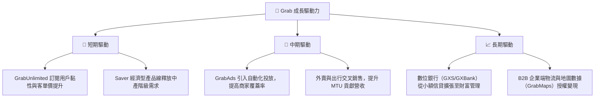

---

## 9. 風險矩陣

### 9.1 風險評分矩陣

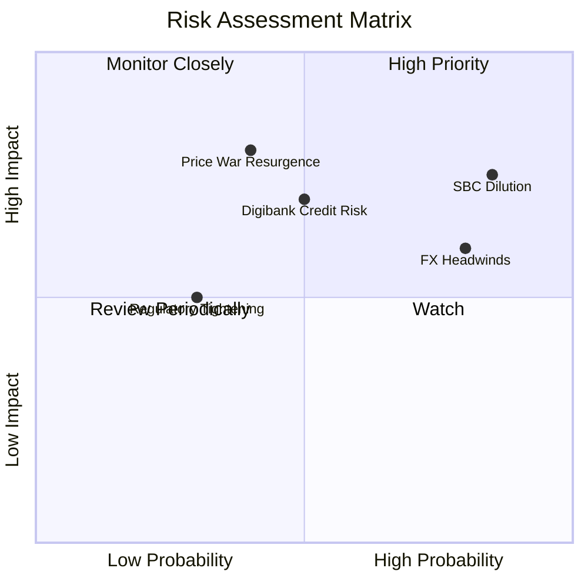

### 9.2 風險清單詳細分析

| # | 風險項目 | 發生機率 | 財務衝擊 | 風險評分 | 緩解措施 / 觀察指標 |
|---|---|---|---|---|---|
| 1 | 🔴 **股權稀釋 (SBC)** | 高 (85%) | 中等 (-5% EPS) | **7.5 / 10** | 觀察管理層是否加大股份回購力度以抵消 SBC 稀釋效應。 |
| 2 | 🔴 **匯率波動 (FX)** | 高 (80%) | 中等 (-6% 營收) | **6.4 / 10** | 集團進行局部貨幣對沖，並增加星幣（SGD）資產配置。 |
| 3 | 🟡 **數位銀行信用風險** | 中等 (50%) | 高 (-15% 淨利) | **7.0 / 10** | 採用 Grab 生態圈內的支付與交易數據進行 AI 信用評級，降低壞帳率。 |
| 4 | 🟡 **競爭重啟 (價格戰)** | 中等 (40%) | 高 (-10% EBITDA) | **6.5 / 10** | 專注於高利潤的 GrabAds 與訂閱服務，避免單純的價格補貼競爭。 |

---

## 10. 投資建議

### 10.1 最終綜合評級雷達

```
╔══════════════════════════════════════════════════════════════╗
║                     GRAB 投資價值綜合診斷                    ║
╠══════════════════════════════════════════════════════════════╣
║ 財務安全邊際  9.0/10 ▓▓▓▓▓▓▓▓▓▓▓▓▓▓▓▓▓▓░░  ★★★★★           ║
║ 營收成長前景  7.5/10 ▓▓▓▓▓▓▓▓▓▓▓▓▓▓░░░░░░  ★★★★☆           ║
║ 獲利能力改善  6.5/10 ▓▓▓▓▓▓▓▓▓▓▓▓░░░░░░░░  ★★★☆☆           ║
║ 估值吸引力    5.5/10 ▓▓▓▓▓▓▓▓▓▓░░░░░░░░░░  ★★★☆☆           ║
║ 競爭壁壘強度  8.0/10 ▓▓▓▓▓▓▓▓▓▓▓▓▓▓▓▓░░░░  ★★★★☆           ║
╠══════════════════════════════════════════════════════════════╣
║ 綜合推薦評級  7.2/10 ▓▓▓▓▓▓▓▓▓▓▓▓▓▓░░░░░░  🟢 買入 (Buy)    ║
╚══════════════════════════════════════════════════════════════╝
```

### 10.2 目標價與隱含報酬率

| 情境 | 隱含目標價 | 潛在預期報酬 | 權重機率 | 期望值目標價 |
|---|---|---|---|---|
| **🔴 悲觀情境** | $3.00 | -16.0% | 20% | |
| **🟡 基準情境** | $5.90 | +65.3% | 60% | **$5.45**（+52.7%） |
| **🟢 樂觀情境** | $8.00 | +124.1% | 20% | |

### 10.3 買入時機與觸發因素

```
╔══════════════════════════════════════════════════════════════════╗
║                  ✅ GRAB 買入觸發因素 Checklist                  ║
╠══════════════════════════════════════════════════════════════════╣
║                                                                  ║
║  立即買入觸發條件（多數符合）：                                  ║
║  ✅ 股價回落至 $3.20 - $3.50 區間（接近 52W 低點 $3.18）         ║
║  ✅ GAAP 營運利益率連續兩季維持正值                              ║
║  ✅ 季度營收 YoY 成長率維持在 20% 以上                           ║
║                                                                  ║
║  加碼觸發條件（出現以下任一）：                                  ║
║  ☐ 管理層宣佈新的 $500M 以上股份回購計劃                         ║
║  ☐ 數位銀行放貸業務單季營收年增率 > 50% 且壞帳率 < 2%            ║
║  ☐ SBC 佔營業收入比重降至 5% 以下                                ║
║                                                                  ║
║  減碼 / 停損觸發條件（出現以下任一）：                           ║
║  ☐ 季度營收 YoY 成長率跌破 15%                                   ║
║  ☐ 競爭對手重啟大規模補貼，導致 EBITDA 利潤率轉負                ║
║  ☐ 數位銀行業務出現重大監管處罰或壞帳率突破 5%                    ║
╚══════════════════════════════════════════════════════════════════╝
```

### 10.4 投資人適配度分析

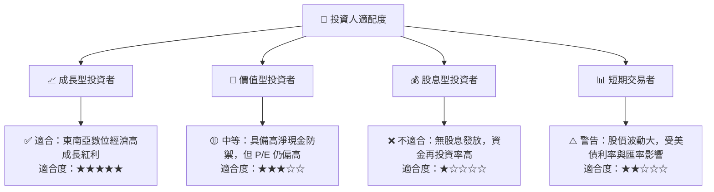

### 10.5 每季財報監控清單（Quarterly Watch List）

在接下來的財報中，機構投資人應嚴格監控以下指標，以驗證投資假設：

1.  **補貼率 (Incentives as % of GMV)**：
    *   *目標*：持續低於 6.0%。
    *   *含意*：若補貼率上升，顯示與 GoTo 的競爭加劇，將損害利潤率。
2.  **數位銀行存款與貸款餘額 (Digibank Deposit & Loan Book)**：
    *   *目標*：貸款餘額每季成長 >15%，且不良貸款率 (NPL) < 2.5%。
    *   *含意*：這是高利潤率金融飛輪能否運轉的關鍵。
3.  **股權薪酬 (SBC) 絕對金額**：
    *   *目標*：單季維持在 $55M 以下。
    *   *含意*：控制 SBC 是提升 EPS 品質與減少股東稀釋的先決條件。
4.  **自由現金流 (FCF) 轉正進度**：
    *   *目標*：隨著數位銀行資本金注入完成，FCF 應於 FY26 下半年重回正值。

### 10.6 反面論證：什麼會證明投資論點錯誤

```
╔══════════════════════════════════════════════════════════════════╗
║              ⚠️ 論點失效條件（Disconfirming Evidence）           ║
╠══════════════════════════════════════════════════════════════════╣
║  若出現下列情況，本買入評級與目標價將立即失效，應果斷減碼：      ║
║  ☐ 季度營收 YoY 成長率連續兩季 < 15%（成長動能失速）             ║
║  ☐ 營業利益率較當前 2.7% 收縮 > 2.0 pp（規模效應失敗）            ║
║  ☐ 數位銀行業務在 2027 年底前無法實現單季盈虧平衡（燒錢黑洞）     ║
║  ☐ 自由現金流持續流出，導致淨現金儲備跌破 $3.50B                 ║
║  ☐ 總發行股數（Shares Outstanding）因 SBC 稀釋年增率 > 5%       ║
╚══════════════════════════════════════════════════════════════════╝
```

---

> **免責聲明**：本報告為 AI 自動生成，僅供研究參考，不構成投資建議。投資有風險，入市需謹慎。