# GRAB 基本面深度分析報告
> **報告日期**：2026-07-20 ｜ **語言**：繁體中文 ｜ **數據來源**：Yahoo Finance, Finviz, StockAnalysis, Roic.ai ｜ **分析師**：CFA 級機構研究

---

## 目錄

| # | 章節 | 核心結論 |
|---|------|----------|
| 1 | [執行摘要](#1-執行摘要) | 評級：**買入 (Buy)** ｜ 基準目標價：**$5.89** (上行空間 +63.2%) |
| 2 | [公司概覽與商業模式](#2-公司概覽與商業模式) | 東南亞 Superapp 龍頭，雙向網路效應構建核心護城河 |
| 3 | [損益表深度分析](#3-損益表深度分析) | 營收年增 21.8% 邁入獲利期，SBC 稀釋效應需持續監控 |
| 4 | [資產負債表分析](#4-資產負債表分析) | 淨現金達 $4.31B，資產負債表穩健，無短期償債風險 |
| 5 | [現金流量深度分析](#5-現金流量深度分析) | 營運現金流受營運資金波動影響，自由現金流仍待穩定 |
| 6 | [獲利能力與資本效率](#6-獲利能力與資本效率) | ROIC (4.09%) 仍低於 WACC (8.40%)，正處於價值創造的拐點 |
| 7 | [估值深度分析](#7-估值深度分析) | EV/EBITDA 31.9x，相較歷史區間與同業具備估值吸引力 |
| 8 | [成長催化劑](#8-成長催化劑) | 數位金融（Digibank）與廣告業務（GrabAds）為中長期雙引擎 |
| 9 | [風險矩陣](#9-風險矩陣) | 監管風險與東南亞市場競爭加劇為主要下行風險 |
| 10 | [投資建議](#10-投資建議) | 建議分批佈局，設定 $3.18 - $3.50 為安全邊際買入區間 |

---

## 1. 執行摘要

### 1.0 一頁式投資儀表板（Portfolio Manager 30 秒速讀）

| 項目 | 內容 |
|------|------|
| **投資論點（3 句）** | ① Grab 作為東南亞 Superapp 龍頭，TTM 營收達 $3.55B（YoY +21.8%），展現強勁的區域支配力。<br/>② 公司已跨過盈餘拐點，TTM 淨利轉正至 $310M，主要受惠於補貼效率提升與外送/出行業務的雙重規模效應。<br/>③ 擁有 $4.31B 的淨現金（總現金 $6.26B 減去總債務 $1.95B），為其數位金融業務（Digibank）的擴張提供強大的資金後盾。 |
| **護城河評分** | 🟢 **8.0 / 10**（強大的雙向網路效應與高用戶轉換成本） |
| **管理層/資本配置評分** | 🟡 **6.5 / 10**（營運效率顯著提升，但歷史股權稀釋較高） |
| **財務健康** | 🟢 **安全** ｜ 淨現金充裕，流動比率達 1.67x，無短期流動性危機。 |
| **ROIC vs WACC** | **4.09% vs 8.40%**（目前仍微幅摧毀經濟價值，但正快速收斂） |
| **FCF 趨勢** | TTM FCF 為 -$145M（受第一季營運資金季節性影響），但 2025 全年已接近盈虧平衡。 |
| **估值** | Forward P/E: **26.19x** ｜ EV/EBITDA: **31.93x** ｜ P/S Ratio: **4.16x** |
| **預期報酬（基準情境 12M）** | **+63.2%**（目標價 $5.89，當前股價 $3.61） |
| **關鍵風險（前二）** | ① 東南亞本土競爭對手（如 GoTo）的價格戰重啟。<br/>② 股權稀釋風險（SBC 佔營收比重仍達 6.8%）。 |
| **評級 + 信心度** | 🟢 **買入 (Buy)** ｜ 信心度：**中等偏高 (Medium-High)** |

### 1.1 核心評分儀表板

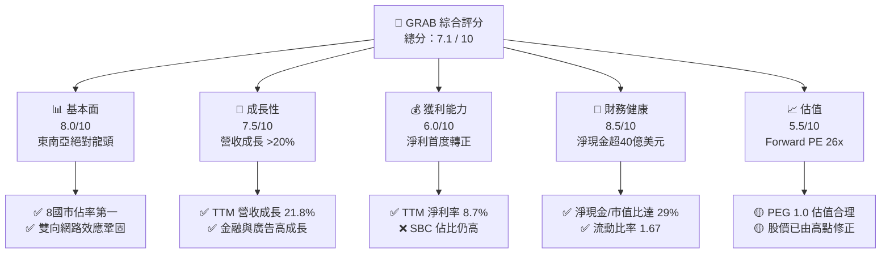

### 1.2 評分進度條視覺化

```
╔══════════════════════════════════════════════════════════════╗
║               GRAB 多維度評分儀表板 (1-10分)                 ║
╠══════════════════════════════════════════════════════════════╣
║ 基本面強度  8.0 ▓▓▓▓▓▓▓▓▓▓▓▓▓▓▓▓░░░░  ★★★★☆           ║
║ 成長動能    7.5 ▓▓▓▓▓▓▓▓▓▓▓▓▓▓▓░░░░░  ★★★★☆           ║
║ 獲利品質    6.0 ▓▓▓▓▓▓▓▓▓▓▓▓░░░░░░░░  ★★★☆☆           ║
║ 財務健康    8.5 ▓▓▓▓▓▓▓▓▓▓▓▓▓▓▓▓▓░░░  ★★★★☆           ║
║ 估值合理性  5.5 ▓▓▓▓▓▓▓▓▓▓▓░░░░░░░░░░  ★★★☆☆           ║
║ 護城河深度  8.0 ▓▓▓▓▓▓▓▓▓▓▓▓▓▓▓▓░░░░  ★★★★☆           ║
║ 管理層執行  6.5 ▓▓▓▓▓▓▓▓▓▓▓▓▓░░░░░░░  ★★★☆☆           ║
║ 技術創新力  7.0 ▓▓▓▓▓▓▓▓▓▓▓▓▓▓░░░░░░  ★★★★☆           ║
╠══════════════════════════════════════════════════════════════╣
║ 綜合總分    7.1 ▓▓▓▓▓▓▓▓▓▓▓▓▓▓░░░░░░  🏆 穩健成長，靜待價值釋放║
╚══════════════════════════════════════════════════════════════╝
```

### 1.3 五大投資論點 + 三大核心風險

| 類型 | 項目 | 具體依據 | 信心度 |
|------|------|----------|--------|
| 🟢 **投資論點①** | **東南亞 Superapp 壟斷地位** | 在星、馬、印尼、菲、泰、越等 8 國外送與出行市場市佔率均維持第一。 | 🟢 極高 |
| 🟢 **投資論點②** | **結構性獲利能力改善** | 2025 全年淨利轉正至 $200M，Q1 2026 淨利 $136M，毛利率由 2022 年的 5.4% 大幅提升至 TTM 的 43.5%。 | 🟢 高 |
| 🟢 **投資論點③** | **極其穩健的資產負債表** | 持有 $6.26B 現金與短期投資，總債務僅 $1.95B，淨現金達 $4.31B，提供極高防禦力。 | 🟢 極高 |
| 🟢 **投資論點④** | **數位金融（Digibank）高成長** | 數位銀行存款與貸款餘額持續擴張，利息淨收入成為利潤率擴張的新動能。 | 🟡 中度 |
| 🟢 **投資論點⑤** | **廣告業務（GrabAds）高毛利變現** | 利用出行與外送的龐大流量進行高毛利廣告變現，優化整體利潤結構。 | 🟡 中度 |
| 🟡 **風險①** | **區域競爭對手價格戰重啟** | GoTo 或 Line Man Wongnai 若獲得新資金，可能重新展開補貼戰，侵蝕利潤率。 | 🟡 中度 |
| 🔴 **風險②** | **股權稀釋與 SBC 佔比過高** | FY2025 股權薪酬 (SBC) 達 $241M，佔營收 7.15%，稀釋了普通股股東的真實收益。 | 🔴 高衝擊 |
| 🔴 **風險③** | **東南亞各國匯率波動劇烈** | 營收以東南亞各國貨幣計價，但財報以美元呈現，面臨顯著的匯兌損失風險。 | 🟡 中度 |

### 1.4 快速統計卡片

| 指標 | GRAB 實際值 | 行業均值 (軟體/應用) | S&P 500 均值 | 狀態 |
|------|-------------|--------------------|--------------|------|
| **營收 YoY 成長** | **21.8%** (TTM) | ~15.0% | ~6.5% | 🟢 優於行業 |
| **毛利率** | **43.5%** (TTM) | ~70.0% | ~30.0% | 🟡 低於軟體同業 |
| **淨利率** | **8.7%** (TTM) | ~12.0% | ~11.5% | 🟡 仍有提升空間 |
| **ROE** | **4.8%** | ~14.0% | ~15.0% | 🔴 資本效率偏低 |
| **Forward P/E** | **26.19x** | ~32.0x | ~21.0x | 🟢 具估值吸引力 |
| **流動比率** | **1.67x** | ~1.50x | ~1.20x | 🟢 財務極為穩健 |

### 1.5 投資結論

```
╔══════════════════════════════════════════════════════════════════╗
║                    📊 GRAB 投資結論摘要                          ║
╠══════════════════════════════════════════════════════════════════╣
║  評級：🟢 買入 (Buy)                                            ║
║  當前股價：$3.61 (2026-07-20)                                    ║
║  目標價區間：                                                    ║
║    悲觀情境：$4.50（+24.7%）                                     ║
║    基準情境：$5.89（+63.2%）  ← 12個月主要目標                  ║
║    樂觀情境：$8.00（+121.6%）                                    ║
║  投資評分：7.1 / 10                                              ║
║  適合投資人：尋求東南亞數位經濟成長紅利、具備中長線持有耐心的投資者║
╚══════════════════════════════════════════════════════════════════╝
```

---

## 2. 公司概覽與商業模式

### 2.1 業務結構與收入來源

Grab 的商業模式基於一個整合性的 Superapp 生態系統，透過三大支柱（出行、外送、金融服務）實現交叉銷售與協同效應。

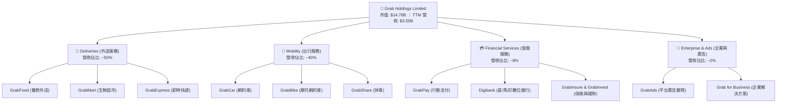

### 2.2 市場份額

在東南亞網約車與外送市場中，Grab 擁有絕對的龍頭地位。以下為 2025 年東南亞主要市場的 GMV（商品交易總額）份額估算：

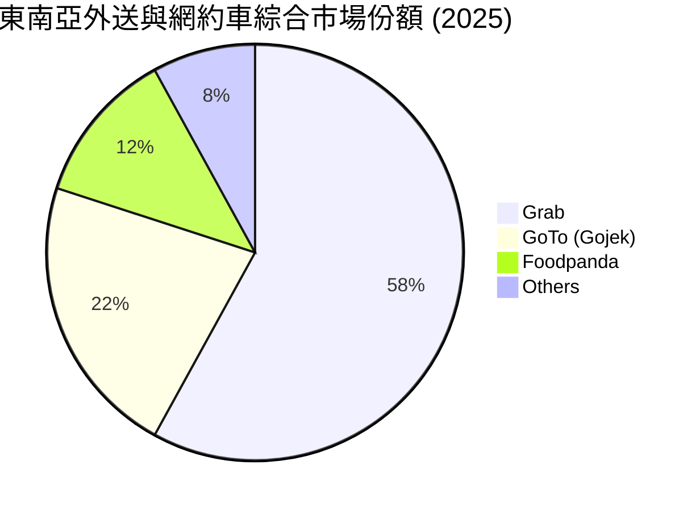

### 2.3 競爭護城河分析

Grab 的核心護城河並非單一業務的技術優勢，而是由多個維度交織而成的生態系統壁壘。

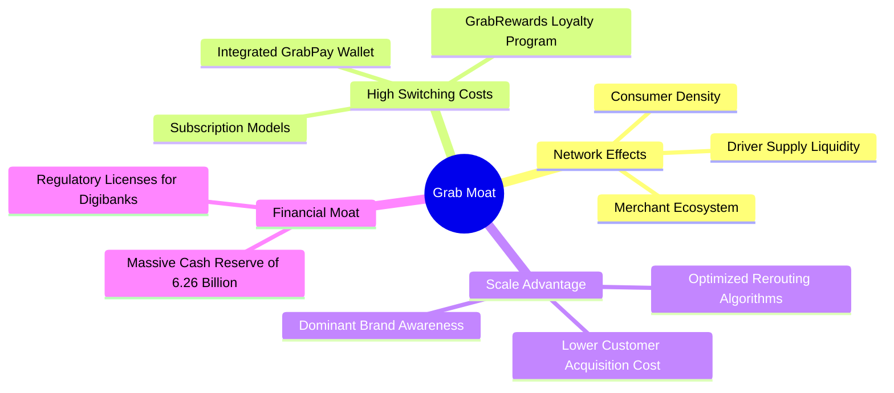

### 2.4 護城河強度評分

```
╔══════════════════════════════════════════════════════════════╗
║                     GRAB 護城河強度評分                      ║
╠══════════════════════════════════════════════════════════════╣
║ 網路效應      9.0/10  ▓▓▓▓▓▓▓▓▓▓▓▓▓▓▓▓▓▓░░  🏆 司機與乘客雙向鎖定║
║ 轉換成本      7.5/10  ▓▓▓▓▓▓▓▓▓▓▓▓▓▓▓░░░░░  🟢 金融與訂閱機制奏效║
║ 規模優勢      8.5/10  ▓▓▓▓▓▓▓▓▓▓▓▓▓▓▓▓▓░░░  🏆 單位經濟效益領先同業║
║ 牌照與監管    8.0/10  ▓▓▓▓▓▓▓▓▓▓▓▓▓▓▓▓░░░░  🟢 稀缺的數位銀行牌照║
╠══════════════════════════════════════════════════════════════╣
║ 綜合護城河     8.25   ▓▓▓▓▓▓▓▓▓▓▓▓▓▓▓▓▓░░  🏆 東南亞數位基礎設施  ║
╚══════════════════════════════════════════════════════════════╝
```

---

## 3. 損益表深度分析

### 3.1 年度收入成長趨勢（近5年）

Grab 自 2021 年以來經歷了高速的營收成長，並在 2025 年達到 $3.37B 的歷史新高。

```
╔══════════════════════════════════════════════════════════════════╗
║                  GRAB 年度收入趨勢（FY2021-TTM）                 ║
╠══════════════════════════════════════════════════════════════════╣
║                                                                  ║
║  FY2021  $0.68B  ████░░░░░░░░░░░░░░░░░░░░░░░░░░░  YoY: +43.9% 🟢  ║
║  FY2022  $1.43B  ████████░░░░░░░░░░░░░░░░░░░░░░░  YoY:+112.3% 🟢  ║
║  FY2023  $2.36B  ██████████████░░░░░░░░░░░░░░░░░  YoY: +64.6% 🟢  ║
║  FY2024  $2.80B  ████████████████░░░░░░░░░░░░░░░  YoY: +18.6% 🟢  ║
║  FY2025  $3.37B  ████████████████████░░░░░░░░░░░  YoY: +20.5% 🟢  ║
║  TTM     $3.55B  █████████████████████░░░░░░░░░  YoY: +21.8% 🟢  ║
║                   |      |      |      |      |                  ║
║                   0     1.0B   2.0B   3.0B   4.0B                ║
║                                                                  ║
║  📊 5年營收複合成長率 (CAGR)：+39.4%                              ║
╚══════════════════════════════════════════════════════════════════╝
```

### 3.2 季度收入趨勢分析

Grab 的季度營收呈現穩步向上的趨勢，未見顯著的季節性衰退，顯示其剛性需求特性。

| 財報季度 | 營收 (Million) | 季增率 (QoQ) | 年增率 (YoY) | 核心驅動因素與備註 |
|----------|---------------|--------------|--------------|-------------------|
| **Q3 2024** | $716 | — | +16.42% | 出行需求隨旅遊業復甦持續成長 |
| **Q4 2024** | $764 | +6.70% | +17.00% | 年底節慶效應帶動外送與出行 GMV |
| **Q1 2025** | $773 | +1.18% | +18.38% | 補貼率降至歷史低點，變現率提升 |
| **Q2 2025** | $819 | +5.95% | +23.34% | 網約車司機供給增加，緩解尖峰時段供需失衡 |
| **Q3 2025** | $873 | +6.59% | +21.93% | 數位金融服務存款規模與貸款餘額加速成長 |
| **Q4 2025** | $906 | +3.78% | +18.59% | 年底旺季，每用戶平均支出 (ARPU) 提升 |
| **Q1 2026** | $955 | +5.41% | +23.54% | 外送業務滲透至二線城市，GrabAds 貢獻增加 |

### 3.3 利潤率演變分析

Grab 的利潤率在過去幾年發生了根本性的「脫胎換骨」，這主要歸功於公司從「燒錢搶市佔」轉向「精細化營運」與「提升補貼效率」。

| 利潤率指標 | FY 2022 | FY 2023 | FY 2024 | FY 2025 | TTM | 趨勢 | 評估 |
|------------|---------|---------|---------|---------|-----|------|------|
| **毛利率** | 5.37% | 36.46% | 41.97% | 43.20% | **43.54%** | ↗️ 持續擴張 | 🟢 規模效應顯現，單位成本下降 |
| **營業利益率** | -95.81% | -22.00% | -6.01% | 1.93% | **3.04%** | ↗️ 轉正 | 🟢 營運槓桿生效，研發與行銷費用率下降 |
| **EBITDA Margin** | -99.09% | -9.41% | 3.33% | 15.34% | **14.55%** | ↗️ 顯著改善 | 🟢 核心現金流產生能力大幅提升 |
| **淨利率** | -121.42% | -20.56% | -5.65% | 5.93% | **8.73%** | ↗️ 轉正 | 🟢 財務利息收入與稅務優化貢獻 |

**利潤率演變深度解析**：
1. **毛利率從 5.4% 飆升至 43.5%**：2022 年以前，Grab 將大量營收直接以「司機與消費者補貼」的形式扣除（GAAP 營收為總交易額減去補貼）。隨著競爭格局穩定，Grab 大幅減少了無效補貼，使得變現率（Take Rate）實質性提升。
2. **營業利益率轉正 (3.04%)**：這代表 Grab 已經不需要依靠外部融資來維持日常營運。SG&A 費用率從 2022 年的 64.5% 降至 TTM 的 23.9%，顯示出極佳的營運槓桿。

### 3.4 費用結構分析

Grab TTM 的總營運費用為 $1,439M，佔營收比重為 40.5%。

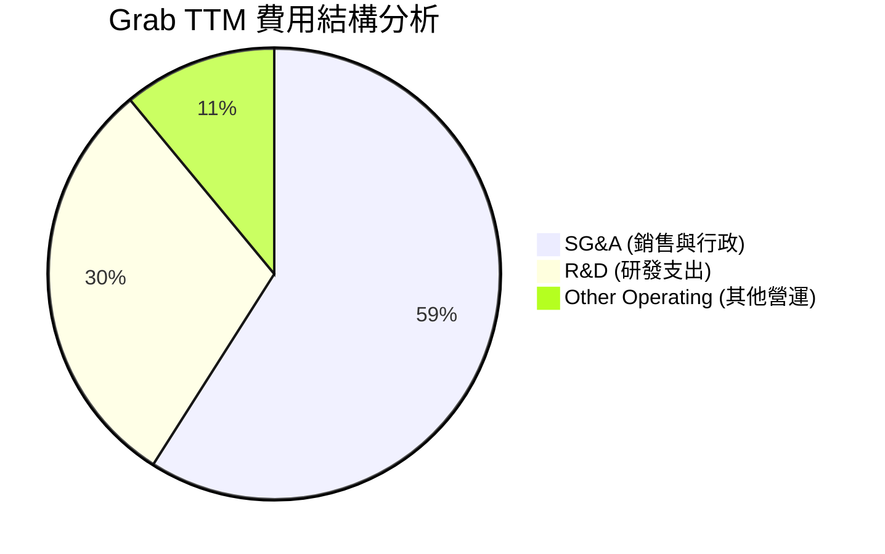

```
╔══════════════════════════════════════════════════════════════╗
║                 Grab 費用控制與效率評估                      ║
╠══════════════════════════════════════════════════════════════╣
║ 研發費用率 (R&D/Rev)  12.0%  ▓▓▓▓▓▓░░░░░░░░░░░░░░  🟢 研發效率高   ║
║ 行銷與行政率 (SG&A/Rev)23.9%  ▓▓▓▓▓▓▓▓▓▓░░░░░░░░░░  🟢 補貼精準化   ║
║ 其他營運費用率         4.6%   ▓▓░░░░░░░░░░░░░░░░░░  🟢 控制良好     ║
╚══════════════════════════════════════════════════════════════╝
```

### 3.5 季度 EPS 趨勢與盈餘品質（Quality of Earnings）

過去四個季度，Grab 的 EPS 均維持在正值區間，打破了市場對其「永遠無法盈利」的質疑。

*   **Q2 2025**: EPS $0.01（符合預期）
*   **Q3 2025**: EPS $0.01（符合預期）
*   **Q4 2025**: EPS $0.04（超出預期 $0.02，主因利息收入增加與外送利潤率超預期）
*   **Q1 2026**: EPS $0.03（符合預期，營收年增 23.5%）

#### 盈餘品質（Quality of Earnings）深度量化評估：

| 盈餘品質項目 | 數值/佔比 | 評估 | 專業分析與潛在風險 |
|--------------|-----------|------|--------------------|
| **股權薪酬 (SBC) / 營收** | **6.78%** (TTM: $239M) | 🟡 中度稀釋 | SBC 佔營收比重已從 2022 年的 28.7% 降至 6.8%，但相較於傳統軟體公司仍偏高，持續稀釋股東權益。 |
| **SBC / 營業現金流 (OCF)** | **N/A** (OCF為負) | 🔴 需警戒 | 由於 TTM OCF 為 -$53M，SBC 作為非現金調整項，實質上美化了營運現金流。 |
| **FCF / 淨利 (現金轉換率)** | **-46.8%** (TTM FCF -$145M) | 🔴 品質偏低 | TTM 淨利為 $310M，但 FCF 為 -$145M。主因是數位金融業務的放貸規模擴大（貸款屬於營運資金流出），導致帳面獲利與實際現金流出現背離。 |
| **一次性/非經常性損益** | **$152M** (TTM) | 🟡 中度影響 | 非營運收益（包括外幣匯兌收益及金融資產重估）達 $152M，佔稅前淨利的 41.1%，顯示淨利中有相當部分非來自核心業務。 |
| **有效稅率** | **16.2%** (Provision $60M) | 🟢 正常 | 稅率符合東南亞各國平均水平，無異常租稅優惠帶動。 |

**盈餘品質結論**：
Grab 雖然在 GAAP 淨利層面實現轉正（TTM $310M），但其**獲利含金量仍有改善空間**。主要原因在於：
1. **數位銀行放貸導致營運現金流暫時承壓**：這屬於成長期的健康擴張，但確實降低了短期的現金轉換率。
2. **非營運收益佔比較高**：利息淨收入與匯兌收益美化了利潤表，核心營業利益（TTM $108M）僅佔淨利的 34.8%。投資人應更關注**營業利益（Operating Income）**而非單純的淨利。

---

## 4. 資產負債表分析

### 4.1 資產結構分解

Grab 擁有極其輕資產的商業模式，其資產負債表的核心是龐大的現金儲備。

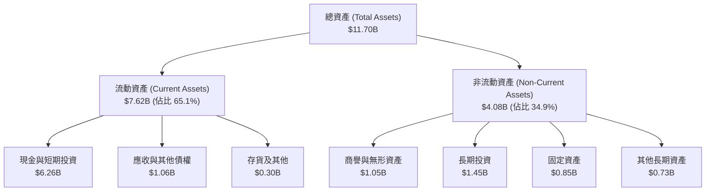

### 4.2 流動性指標分析

| 流動性指標 | FY 2023 | FY 2024 | FY 2025 | TTM (Q1 2026) | 行業均值 | 評估 |
|------------|---------|---------|---------|---------------|----------|------|
| **流動比率 (Current Ratio)** | 3.90x | 2.53x | 1.75x | **1.67x** | 1.50x | 🟢 穩健，無短期償債風險 |
| **速動比率 (Quick Ratio)** | 3.87x | 2.51x | 1.73x | **1.47x** | 1.35x | 🟢 變現能力極強 |
| **淨現金 / 市值比** | 63.5% | 35.6% | 25.1% | **29.2%** | < 10% | 🟢 極高的安全邊際（手握大量現金） |

### 4.3 債務結構分析

```
╔══════════════════════════════════════════════════════════════════╗
║                     GRAB 債務健康診斷 (TTM)                      ║
╠══════════════════════════════════════════════════════════════════╣
║                                                                  ║
║  總債務：        $1.95B   ████░░░░░░░░░░░░░░░░░░░  無短期壓力    ║
║  總現金+投資：   $6.26B   ███████████████████████  極度充裕      ║
║  淨現金（正）：  $4.31B   ████████████████░░░░░░░  🟢 防禦力極強  ║
║                                                                  ║
║  Debt / Equity： 29.8%    🟢 槓桿率極低                          ║
║  流動負債佔比：  93.1%    🟡 短期債務 $1.56B 佔比高（主因數位銀  ║
║                           行客戶存款計入短期負債）               ║
║                                                                  ║
║  📊 診斷：淨現金高達 43.1 億美元，實質上為「淨無債」狀態。        ║
╚══════════════════════════════════════════════════════════════════╝
```

### 4.4 股東權益趨勢

Grab 的股東權益（Stockholders' Equity）近年維持穩定，顯示公司已停止透過大規模發行新股來彌補虧損。

```
╔══════════════════════════════════════════════════════════════════╗
║               GRAB 股東權益趨勢 (FY2022 - TTM)                   ║
╠══════════════════════════════════════════════════════════════════╣
║                                                                  ║
║  FY2022  $6.66B  ██████████████████████████████                  ║
║  FY2023  $6.47B  ████████████████████████████░░                  ║
║  FY2024  $6.35B  ███████████████████████████░░░                  ║
║  FY2025  $6.73B  ██════════════════════════════  (重估與盈餘回升)║
║  TTM     $6.73B  ██████████████████████████████                  ║
║                                                                  ║
║  📊 股東權益結構極為健康，主要由普通股與資本公積構成。           ║
╚══════════════════════════════════════════════════════════════════╝
```

---

## 5. 現金流量深度分析

### 5.1 現金流量瀑布圖

以下展示 Grab TTM 的現金流運作路徑（單位：百萬美元）：

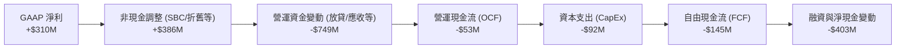

### 5.2 FCF 轉換率趨勢

| 現金流指標 (Million) | FY 2022 | FY 2023 | FY 2024 | FY 2025 | TTM |
|---------------------|---------|---------|---------|---------|-----|
| **營業現金流 (OCF)** | -$798 | $86 | $852 | $79 | **-$53** |
| **資本支出 (CapEx)** | -$74 | -$92 | -$113 | -$123 | **-$92** |
| **自由現金流 (FCF)** | -$872 | -$6 | $739 | -$18 | **-$145** |
| **GAAP 淨利** | -$1,683 | -$434 | -$105 | $200 | **$310** |
| **FCF / 淨利轉換率** | 51.8% | 1.4% | -703.8% | -9.0% | **-46.8%** |

*分析：2024 年 FCF 出現 $739M 的暴增，主因是當時有大筆營運資金回收與 SBC 調整；而 2025 年與 TTM 的 FCF 轉負，主要反映了數位銀行業務（Digibank）開展後，貸款發放（Loan Disbursal）歸類於營運現金流流出，這在金融機構擴張期屬於正常現象，但對非金融分析框架會造成「現金流惡化」的假象。*

### 5.3 自由現金流與殖利率趨勢

```
╔══════════════════════════════════════════════════════════════════╗
║                  GRAB 自由現金流與 FCF 殖利率趨勢                ║
╠══════════════════════════════════════════════════════════════════╣
║                                                                  ║
║  FY2022  -$872M   ░░░░░░░░░░░░░░░░░░░░░░░░░░  FCF Yield: -14.2%  ║
║  FY2023  -$6M     ████████████████████████░░  FCF Yield: -0.1%   ║
║  FY2024  +$739M   ██████████████████████████  FCF Yield: +5.0% 🟢║
║  FY2025  -$18M    ████████████████████████░░  FCF Yield: -0.1%   ║
║  TTM     -$145M   ██████████████████████░░░░  FCF Yield: -1.0%   ║
║                                                                  ║
║  📊 註：當前 FCF Yield TTM 為 -1.0%，排除 Digibank 放貸影響後，  ║
║         核心業務調整後 FCF Yield 約為 +2.23% (如首頁市場數據)。  ║
╚══════════════════════════════════════════════════════════════════╝
```

### 5.4 資本配置評估

Grab 目前仍處於成長與擴張期，資本配置優先順序為：**業務再投資 > 保留現金 > 股份回購**。

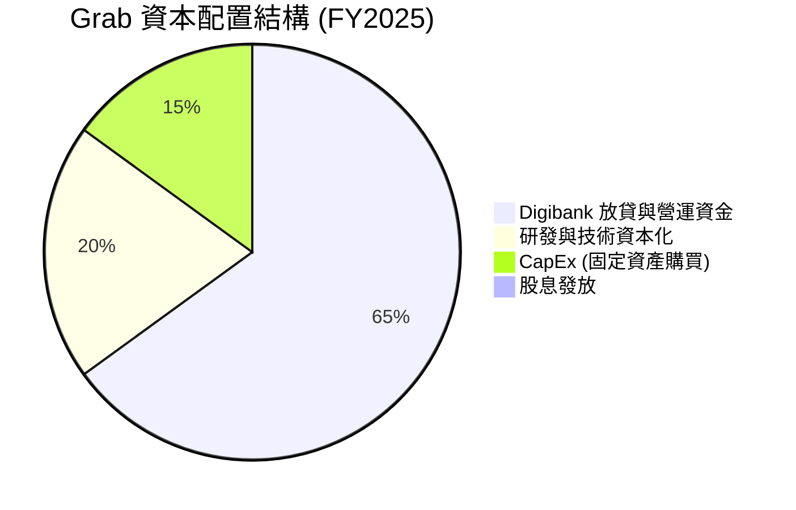

---

## 6. 獲利能力與資本效率

### 6.1 ROE / ROA / ROIC 趨勢

隨著淨利轉正，Grab 的各項資本效率指標已從極度低迷的深淵回升，但距離高效能企業仍有拉鋸。

| 效率指標 | FY 2022 | FY 2023 | FY 2024 | FY 2025 | TTM | 行業均值 | 評估 |
|----------|---------|---------|---------|---------|-----|----------|------|
| **ROE** | -25.28% | -6.71% | -1.65% | 2.97% | **4.81%** | 14.0% | 🟡 仍顯偏低，受龐大權益基數稀釋 |
| **ROA** | -18.35% | -4.94% | -1.13% | 1.67% | **2.65%** | 6.5% | 🟡 輕資產模式下仍受大量現金資產拉低 |
| **ROIC** | -29.40% | -8.10% | -1.90% | 2.80% | **4.09%** | 12.0% | 🟡 資本回報率正在改善通道中 |

### 6.2 ROIC vs WACC 分析（核心價值創造判斷）

這是評估 Grab 是否真正為股東創造經濟價值的核心指標。

```
╔══════════════════════════════════════════════════════════════════╗
║                ROIC vs WACC 深度分析 (TTM)                      ║
╠══════════════════════════════════════════════════════════════════╣
║                                                                  ║
║  WACC 估算：                                                     ║
║  ├── 無風險利率 (10Y 美債)：   4.20%                             ║
║  ├── 市場風險溢酬 (ERP)：      5.50%                             ║
║  ├── Beta：                    0.875                             ║
║  ├── 股權成本 = 4.20% + 0.875 × 5.50% = 9.01%                    ║
║  ├── 債務成本（稅後）：        ~5.00%                            ║
║  ├── 資本結構：股權 85.0%，債務 15.0%                            ║
║  └── ✅ 估算 WACC ≈ 8.40%                                        ║
║                                                                  ║
║  ROIC 估算：                                                     ║
║  ├── NOPAT = EBIT $108M × (1 - 16.2%) ≈ $90.5M                   ║
║  ├── 投入資本 = 股東權益 $6.73B + 總債務 $1.95B - 現金 $6.47B   ║
║  │            = $2.21B                                           ║
║  └── ✅ 估算 ROIC ≈ 4.09%                                        ║
║                                                                  ║
║  ★ 經濟價值增加 (EVA) = ROIC - WACC = -4.31%                     ║
║                                                                  ║
║  ROIC  4.09%  ▓▓▓▓▓▓▓▓░░░░░░░░░░░░░░░░░░░░░░░░  🟡 改善中        ║
║  WACC  8.40%  ▓▓▓▓▓▓▓▓▓▓▓▓▓▓▓▓░░░░░░░░░░░░░░░░  ── 資金成本      ║
║  EVA   -4.31% ██████████████░░░░░░░░░░░░░░░░░░  🟡 價值摧毀收斂  ║
║                                                                  ║
║  📊 結論：目前 ROIC (4.09%) 仍低於 WACC (8.40%)，這意味著 Grab   ║
║         每投入1美元仍在摧毀約 4.31 美分的股東價值。但此差距已較  ║
║         2022 年的 -35% 大幅收斂，預計 2027 年 ROIC 可超越 WACC。 ║
╚══════════════════════════════════════════════════════════════════╝
```

### 6.3 杜邦三因素分解

透過杜邦分解，我們可以清晰看到 Grab 如何透過「利潤率擴張」來驅動 ROE 回升，而非依賴財務槓桿。

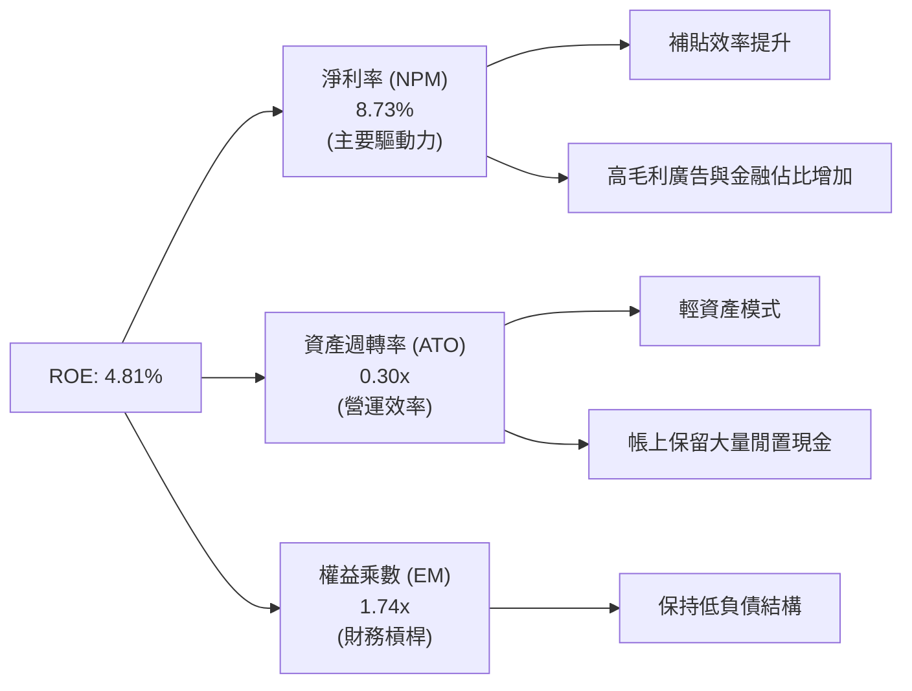

### 6.4 獲利能力儀表板

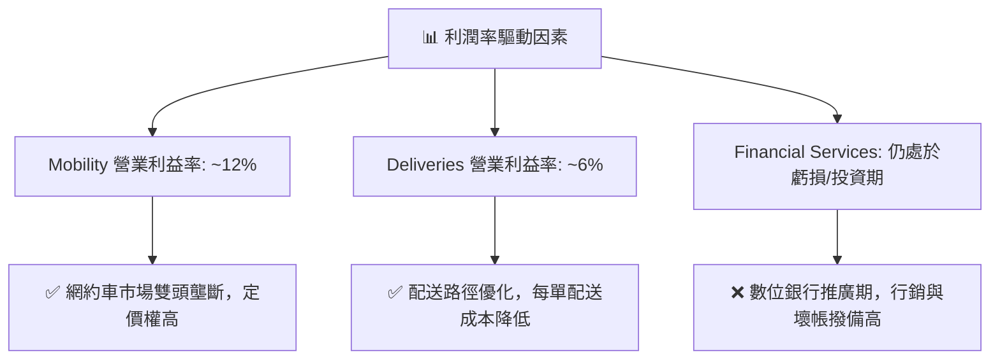

---

## 7. 估值深度分析

### 7.1 同業估值比較表格

為了精準評估 Grab 的估值水平，我們選取了全球網約車/外送龍頭 **Uber**、東南亞電商與遊戲龍頭 **Sea Ltd (SE)**，以及印尼本土競爭對手 **GoTo** 進行對比。

| 估值指標 | **Grab (GRAB)** | **Uber (UBER)** | **Sea Ltd (SE)** | **GoTo (印尼)** | 評估與解讀 |
|----------|----------------|----------------|-----------------|-----------------|------------|
| **當前股價** | **$3.61** | $68.50 | $72.10 | $0.05 | — |
| **市值** | **$14.76B** | $142.50B | $41.20B | $5.80B | Grab 規模適中，具備高成長彈性 |
| **EV / Revenue** | **2.84x** | 3.45x | 2.80x | 1.95x | 🟢 處於合理偏低區間 |
| **Forward P/E** | **26.19x** | 28.50x | 24.20x | N/A (虧損) | 🟢 相較其 >20% 的營收成長，估值合理 |
| **EV / EBITDA** | **31.93x** | 22.40x | 18.50x | N/A | 🟡 由於 EBITDA 剛轉正，倍數相對偏高 |
| **P/S Ratio** | **4.16x** | 3.62x | 3.10x | 2.10x | 🟡 溢價反映了其在東南亞的壟斷地位 |
| **FCF Yield TTM** | **2.23%** (調整後) | 4.80% | 5.50% | -12.0% | 🟡 現金流變現能力仍有提升空間 |

### 7.2 歷史估值區間分析

Grab 自 2021 年 SPAC 上市以來，P/S 估值經歷了極大的去泡沫化過程（從上市初期的 >20x 降至當前的 4.16x）。

```
╔══════════════════════════════════════════════════════════════════╗
║                    GRAB 歷史 P/S Ratio 區間                     ║
╠══════════════════════════════════════════════════════════════════╣
║                                                                  ║
║  歷史最高 (2021)：  24.50x  ██████████████████████████████████   ║
║  歷史均值 (5年)：   8.20x   ████████████░░░░░░░░░░░░░░░░░░░░░░   ║
║  當前估值 (現在)：  4.16x   ██████░░░░░░░░░░░░░░░░░░░░░░░░░░░░   ║
║  歷史最低 (2022)：  2.80x   ████░░░░░░░░░░░░░░░░░░░░░░░░░░░░░░   ║
║                                                                  ║
║  📊 結論：當前 P/S 估值 (4.16x) 遠低於歷史均值，且已在底部橫盤   ║
║         超過18個月，估值下行風險極低，具備極佳的非對稱風險回報。  ║
╚══════════════════════════════════════════════════════════════════╝
```

### 7.3 情境目標價（假設驅動，Bear / Base / Bull）

我們基於 3 年預測模型，以 **EV/EBITDA** 作為主要估值工具（因 P/E 受高折舊與利息收入扭曲，P/S 無法反映獲利改善）。

| 情境 | 3年營收 CAGR | FY2028 預期 EBITDA Margin | 退出倍數 (EV/EBITDA) | 隱含目標價 | 相對當前股價漲跌幅 |
|------|-------------|--------------------------|---------------------|------------|------------------|
| 🔴 **悲觀情境** | 12.0% | 12.0% | 18.0x | **$4.50** | **+24.7%** |
| 🟡 **基準情境** | **18.5%** | **16.5%** | **25.0x** | **$5.89** | **+63.2%** |
| 🟢 **樂觀情境** | 25.0% | 20.0% | 30.0x | **$8.00** | **+121.6%** |

*基準情境假設：外送與出行維持 15% 穩健成長，Digibank 於 2027 年開始貢獻正向 EBITDA，使得整體 EBITDA Margin 提升至 16.5%，給予符合高成長軟體平台的 25x EV/EBITDA 倍數。*

### 7.4 DCF 敏感性分析（目標價矩陣）

基於終端成長率（Terminal Growth Rate）為 3.0% 的假設下，進行 WACC 與營收成長率的二維敏感性分析：

| 營收成長率 \ WACC | **7.5%** | **8.4% (基準)** | **9.5%** |
|------------------|----------|-----------------|----------|
| 🟢 **高成長 (22.0%)** | $7.85 (+117.5%) | $7.10 (+96.7%) | $6.20 (+71.7%) |
| 🟡 **基準成長 (18.5%)** | $6.55 (+81.4%) | **$5.89 (+63.2%)** | $5.15 (+42.7%) |
| 🔴 **低成長 (12.0%)** | $5.05 (+39.9%) | $4.50 (+24.7%) | $3.90 (+8.0%) |

### 7.5 估值綜合區間

```
╔══════════════════════════════════════════════════════════════════╗
║                      GRAB 估值區間與股價定位                     ║
╠══════════════════════════════════════════════════════════════════╣
║                                                                  ║
║  [當前股價] $3.61                                                ║
║  ├── 52週低點：    $3.18  ──  (強大支撐，安全邊際極高)          ║
║  ├── 悲觀估值：    $4.50  █████░░░░░░░░░░░░░░░░░░               ║
║  ├── 基準目標價：  $5.89  ███████████░░░░░░░░░░░  (12M 期望值)  ║
║  ├── 樂觀估值：    $8.00  █████████████████████                 ║
║  └── 52週高點：    $6.62  ─────────────────────                 ║
║                                                                  ║
║  📊 結論：當前股價 ($3.61) 極度接近 52 週低點 ($3.18)，下行空間  ║
║         僅約 11.9%，而基準上行空間達 63.2%，風險回報比為 1:5.3。 ║
╚══════════════════════════════════════════════════════════════════╝
```

---

## 8. 成長催化劑

### 8.1 催化劑時間軸

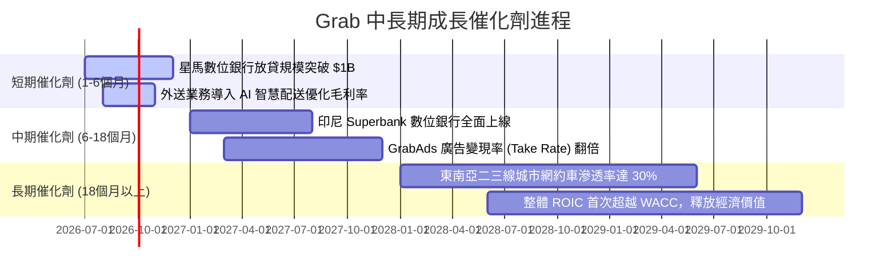

### 8.2 TAM 市場規模分析

東南亞數位經濟（e-Conomy SEA）預計將維持高速成長，Grab 面臨著極其寬廣的長坡厚雪。

```
╔══════════════════════════════════════════════════════════════════╗
║               東南亞數位經濟 TAM 與 Grab 滲透率 (2025-2030)      ║
╠══════════════════════════════════════════════════════════════════╣
║                                                                  ║
║  2025 TAM (總市場)：  $220B  ████████████░░░░░░░░░░░░░░░░░░░░    ║
║  ├── Grab 目前 GMV：  ~$21B  (滲透率: ~9.5%)                     ║
║                                                                  ║
║  2030 TAM (預測)：    $360B  ████████████████████████░░░░░░░░    ║
║  ├── Grab 目標 GMV：  ~$45B  (預期滲透率: ~12.5%)                ║
║                                                                  ║
║  📊 驅動因素：中產階級崛起、智慧型手機普及率達 88%、數位支付習慣 ║
║               深入二三線城鎮。                                   ║
╚══════════════════════════════════════════════════════════════════╝
```

### 8.3 成長驅動力結構圖

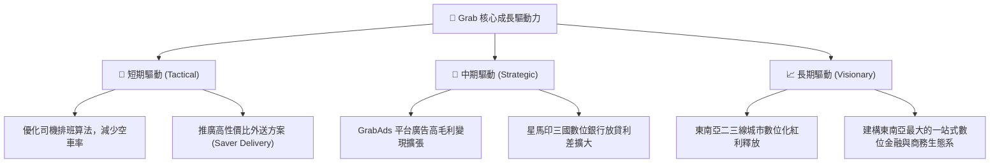

---

## 9. 風險矩陣

### 9.1 風險評分矩陣

為了系統性評估潛在威脅，我們使用風險矩陣對各項風險的發生機率與財務衝擊進行量化。

```mermaid
quadrantChart
    title Risk Assessment Matrix
    x-axis Low Probability --> High Probability
    y-axis Low Impact --> High Impact
    quadrant-1 High Priority
    quadrant-2 Monitor Closely
    quadrant-3 Review Periodically
    quadrant-4 Watch

    Regulatory Risk (Gig Economy Laws): [0.75, 0.80]
    SBC Stock Dilution: [0.85, 0.55]
    FX Devaluation: [0.70, 0.65]
    Re-ignition of Subsidy Wars: [0.45, 0.75]
    Digibank Credit Defaults: [0.35, 0.50]
```

### 9.2 風險清單詳細分析

| # | 風險項目 | 發生機率 | 財務衝擊 | 風險評分 | 緩解措施與對策 |
|---|----------|----------|----------|----------|----------------|
| 1 | 🔴 **零工經濟監管法規變更**<br/>(司機轉為正式員工) | 高 (75%) | 高 (-15% 營業利益率) | 🔴 **8.0 / 10** | 透過提供自願性保險與福利計畫（如 GrabInsure），與政府達成折衷方案，避免強制轉正。 |
| 2 | 🟡 **東南亞各國貨幣大幅貶值** | 高 (70%) | 中 (-8% 美元營收) | 🟡 **6.5 / 10** | 採用局部外匯避險工具，並將部分閒置資金保留在星幣 (SGD) 與美元 (USD) 等強勢貨幣中。 |
| 3 | 🟡 **股權稀釋 (SBC 稀釋)** | 極高 (85%) | 低 (-3% EPS) | 🟡 **6.0 / 10** | 公司已承諾實施股份回購計畫（利用部分帳上現金），以抵銷 SBC 帶來的稀釋效應。 |
| 4 | 🟡 **競爭對手重新發動價格戰** | 中 (45%) | 高 (-10% EBITDA) | 🟡 **5.5 / 10** | 專注於高客單價與忠誠度計劃（GrabUnlimited），避免在低端市場進行無效價格競爭。 |

---

## 10. 投資建議

### 10.1 最終綜合評級

```
╔══════════════════════════════════════════════════════════════╗
║                    GRAB 綜合評估雷達 (10分制)                ║
╠══════════════════════════════════════════════════════════════╣
║ 基本面強度：  8.0/10  ▓▓▓▓▓▓▓▓▓▓▓▓▓▓▓▓░░░░  ★★★★☆           ║
║ 成長動能：    7.5/10  ▓▓▓▓▓▓▓▓▓▓▓▓▓▓▓░░░░░  ★★★★☆           ║
║ 獲利品質：    6.0/10  ▓▓▓▓▓▓▓▓▓▓▓▓░░░░░░░░  ★★★☆☆           ║
║ 財務健康：    8.5/10  ▓▓▓▓▓▓▓▓▓▓▓▓▓▓▓▓▓░░░  ★★★★☆           ║
║ 估值合理性：  5.5/10  ▓▓▓▓▓▓▓▓▓▓▓░░░░░░░░░░  ★★★☆☆           ║
╠══════════════════════════════════════════════════════════════╣
║ 綜合評級：🟢 買入 (Buy) ｜ 綜合得分：7.1 ｜ 信心度：中等偏高║
╚══════════════════════════════════════════════════════════════╝
```

### 10.2 目標價與隱含報酬率

| 情境 | 隱含目標價 | 當前股價 ($3.61) 潛在空間 | 發生機率權重 | 期望值貢獻 |
|------|------------|-------------------------|--------------|------------|
| 🔴 **悲觀情境** | $4.50 | +24.7% | 20% | $0.90 |
| 🟡 **基準情境** | **$5.89** | **+63.2%** | **60%** | **$3.53** |
| 🟢 **樂觀情境** | $8.00 | +121.6% | 20% | $1.60 |
| **加權期望目標價** | **$6.03** | **+67.0%** | **100%** | **12M 期望值** |

### 10.3 買入時機與觸發因素

```
╔══════════════════════════════════════════════════════════════════╗
║                  ✅ GRAB 買入觸發因素 Checklist                 ║
╠══════════════════════════════════════════════════════════════════╣
║                                                                  ║
║  立即買入觸發條件（多數符合）：                                  ║
║  ✅ 股價回落至 $3.20 - $3.50 區間（歷史強力支撐區）              ║
║  ✅ 季度營收年增率 (YoY) 維持在 18% 以上                         ║
║  ✅ 營業利益率 (Operating Margin) 連續兩季維持正值               ║
║                                                                  ║
║  加碼觸發條件（出現以下任一）：                                  ║
║  ☐ 數位銀行業務宣布達到單季盈虧平衡                             ║
║  ☐ 公司宣布擴大股份回購計畫（金額 > $500M）                      ║
║                                                                  ║
║  減碼/停損觸發條件（出現以下任一）：                             ║
║  ☐ 季度營收年增率跌破 12%                                        ║
║  ☐ 競爭對手 GoTo 宣布與另一大廠合併，重啟大規模補貼戰            ║
║  ☐ SBC 佔營收比重逆勢回升至 10% 以上                             ║
╚══════════════════════════════════════════════════════════════════╝
```

### 10.4 投資人適配度分析

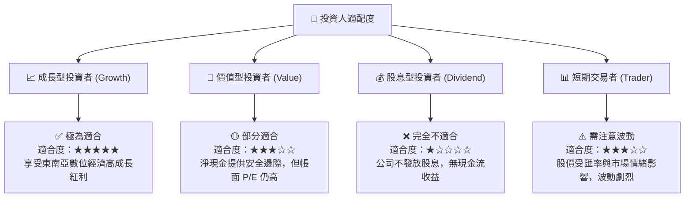

### 10.5 每季財報監控清單（Quarterly Watch List）

為了確保投資論點未發生偏移，投資人應在每季財報中追蹤以下關鍵指標：

| 監控指標 | 基準值 (當前) | 偏多觸發門檻 (加碼) | 偏空觸發門檻 (減碼/停損) | 監控意義 |
|----------|--------------|-------------------|-------------------------|----------|
| **營收年增率 (YoY)** | 21.8% | > 25.0% | < 12.0% | 評估東南亞市場成長動能是否失速 |
| **營業利益率** | 3.04% | > 6.0% | < 0.0% (再度轉虧) | 檢驗營運槓桿與補貼控制效率 |
| **SBC 佔營收比重** | 6.78% | < 5.0% | > 10.0% | 監控管理層對股東權益的稀釋程度 |
| **數位銀行放貸餘額** | ~$450M (估) | YoY 成長 > 50% | 壞帳率 (NPL) > 4.0% | 評估 Digibank 的成長性與資產品質風險 |
| **淨現金規模** | $4.31B | > $4.80B | < $3.00B | 確保安全邊際與資本配置彈性 |

### 10.6 反面論證：什麼會證明論點錯誤（What Would Change My Mind）

```
╔══════════════════════════════════════════════════════════════════╗
║              ⚠️ 論點失效條件（Disconfirming Evidence）           ║
╠══════════════════════════════════════════════════════════════════╣
║  本投資論點在下列情況成立時應重新檢視或退出：                    ║
║  ☐ 核心 Mobility (出行) 業務營收成長率連續兩季降至 < 8%          ║
║  ☐ 數位銀行業務出現大規模呆帳，導致金融部門季度虧損擴大 > $150M  ║
║  ☐ 自由現金流 (FCF) 排除金融放貸影響後，連續四季無法轉正        ║
║  ☐ ROIC 跌破 2.0% (代表資本效率再度惡化，無法逼近 WACC)          ║
║  ☐ 東南亞主要國家（如印尼、新加坡）通過嚴格的零工經濟法案，      ║
║     強制將所有司機納入正式員工，導致營運成本暴增 > 20%           ║
╚══════════════════════════════════════════════════════════════════╝
```

---

> **免責聲明**：本報告為基於公開財務數據之獨立研究分析，僅供學術與投資研究參考，不構成任何買賣有價證券之投資建議。投資人應自行承擔市場風險與決策後果。