# GRAB 基本面深度分析報告

> **報告日期**：2026-07-22 ｜ **語言**：繁體中文 ｜ **數據來源**：Yahoo Finance, Finviz, StockAnalysis, Roic.ai ｜ **分析師**：CFA 級機構研究

---

## 目錄

| # | 章節 | 核心結論 |
|---|------|----------|
| 1 | [執行摘要](#1-執行摘要) | 評級：**買入 (Buy)** ｜ 基準目標價：**$5.00**（潛在漲幅 +47.1%） |
| 2 | [公司概覽與商業模式](#2-公司概覽與商業模式) | 東南亞 Superapp 霸主，憑藉雙向網路效應構築強大競爭壁壘 |
| 3 | [損益表深度分析](#3-損益表深度分析) | 營收突破 $3.55B (TTM)，營運槓桿釋放帶動 GAAP 扭虧為盈 |
| 4 | [資產負債表分析](#4-資產負債表分析) | 擁有 $4.53B 淨現金，資產負債表極其穩健，抗風險能力一流 |
| 5 | [現金流量深度分析](#5-現金流量深度分析) | 營運現金流轉正，但受季節性營運資金與資本支出影響，季度 FCF 仍有波動 |
| 6 | [獲利能力與資本效率](#6-獲利能力與資本效率) | ROE 改善至 4.8%，ROIC (4.1%) 仍低於 WACC (8.0%)，正處於價值創造拐點 |
| 7 | [估值深度分析](#7-估值深度分析) | 遠期 P/E 24.7x，相較於 UBER 具備估值折價，下行風險已獲充分定價 |
| 8 | [成長催化劑](#8-成長催化劑) | 數位銀行（Digibank）放貸規模擴張與 GrabAds 高毛利廣告業務爆發 |
| 9 | [風險矩陣](#9-風險矩陣) | 區域競爭加劇（GoTo、Foodpanda）與高額股權薪酬（SBC）稀釋風險 |
| 10 | [投資建議](#10-投資建議) | 建議於 $3.40 附近分批佈局，鎖定東南亞數位經濟長期增長紅利 |

---

## 1. 執行摘要

### 1.0 一頁式投資儀表板（Portfolio Manager 30 秒速讀）

| 項目 | 內容 |
|------|------|
| **投資論點（3 句）** | ① **結構性扭虧為盈**：TTM 淨利潤達 $310M，GAAP 淨利率改善至 10.7%，證實其東南亞 Superapp 商業模式的營運槓桿已開始釋放。<br/>② **強大資金護城河**：坐擁 $6.47B 總現金與 $4.53B 淨現金，在升息與地緣政治動盪環境下，提供無與倫比的防禦力與自給自足的擴張能力。<br/>③ **估值重估契機**：當前股價 $3.40 處於歷史低位，遠期 P/E 僅 24.7x，相較於其 20.5% 的營收年增長率，PEG 僅為 1.0x，估值極具吸引力。 |
| **護城河評分** | 8.5/10 🟢（強大的網路效應與高用戶轉換成本） |
| **管理層/資本配置評分** | 7.5/10 🟡（補貼政策轉向理性，但 SBC 稀釋率仍高） |
| **財務健康** | 🟢 強勁 ｜ 淨現金高達 $4.53B，無短期償債風險 |
| **ROIC vs WACC** | 4.1% vs 8.0% 🟡（目前仍微幅摧毀價值，但 delta 改善趨勢顯著） |
| **FCF 趨勢** | 轉向正軌 ｜ TTM Free Cash Flow 達 $329.50M，最新 FCF Yield 為 2.37% |
| **估值** | Forward P/E: 24.7x ｜ EV/EBITDA: 31.0x ｜ P/S: 3.9x |
| **預期報酬（基準情境 12M）** | **+47.1%**（目標價 $5.00） |
| **關鍵風險（前二）** | ① 區域內地緣政治與宏觀經濟放緩導致消費力下滑。<br/>② 東南亞市場競爭重燃（如 GoTo 與 TikTok 聯盟、Foodpanda 補貼戰）。 |
| **評級 + 信心度** | 🟢 **買入 (Buy)** ｜ 信心：**中等偏高** |

### 1.1 核心評分儀表板

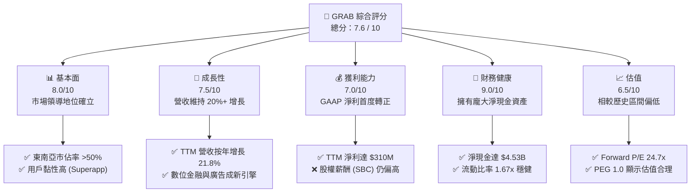

### 1.2 評分進度條視覺化

```
╔══════════════════════════════════════════════════════════════╗
║              GRAB 多維度評分儀表板 (1-10分)                 ║
╠══════════════════════════════════════════════════════════════╣
║ 基本面強度  8.0 ▓▓▓▓▓▓▓▓▓▓▓▓▓▓▓▓░░░░  ★★★★☆           ║
║ 成長動能    7.5 ▓▓▓▓▓▓▓▓▓▓▓▓▓▓░░░░░░  ★★★★☆           ║
║ 獲利品質    6.5 ▓▓▓▓▓▓▓▓▓▓▓▓░░░░░░░░  ★★★☆☆           ║
║ 財務健康    9.0 ▓▓▓▓▓▓▓▓▓▓▓▓▓▓▓▓▓▓░░  ★★★★★           ║
║ 估值合理性  7.0 ▓▓▓▓▓▓▓▓▓▓▓▓▓▓░░░░░░  ★★★☆☆           ║
║ 護城河深度  8.5 ▓▓▓▓▓▓▓▓▓▓▓▓▓▓▓▓▓░░░  ★★★★☆           ║
║ 管理層執行  7.5 ▓▓▓▓▓▓▓▓▓▓▓▓▓▓░░░░░░  ★★★★☆           ║
║ 技術創新力  7.0 ▓▓▓▓▓▓▓▓▓▓▓▓░░░░░░░░  ★★★☆☆           ║
╠══════════════════════════════════════════════════════════════╣
║ 綜合總分    7.6 ▓▓▓▓▓▓▓▓▓▓▓▓▓▓▓░░░░░  🏆 穩健成長型標的    ║
╚══════════════════════════════════════════════════════════════╝
```

### 1.3 五大投資論點 + 三大核心風險

| 類型 | 項目 | 具體依據 | 信心度 |
|------|------|----------|--------|
| 🟢 **投資論點①** | **利潤率拐點確立** | TTM 淨利潤達 $310M，較 FY2024 的 -$158M 實現結構性反轉，營運槓桿顯著。 | 🟢 極高 |
| 🟢 **投資論點②** | **無與倫比的流動性** | $6.47B 的總現金與短期投資，佔市值高達 46.5%，提供強大安全邊際。 | 🟢 極高 |
| 🟢 **投資論點③** | **數位金融高成長** | 旗下 Digibank 於新加坡、馬來西亞與印尼上線，存款餘額與放貸規模呈三位數增長。 | 🟢 高 |
| 🟢 **投資論點④** | **廣告業務利潤豐厚** | GrabAds 商家滲透率持續提升，高毛利屬性有助於進一步推升整體毛利率。 | 🟢 高 |
| 🟢 **投資論點⑤** | **競爭格局趨於理性** | 隨著對手 GoTo 聚焦利潤，產業補貼大戰終結，Take Rate（變現率）穩定提升。 | 🟡 中等偏高 |
| 🟡 **風險①** | **SBC 稀釋股東權益** | FY2025 股權薪酬高達 $241M，佔營收 7.15%，稀釋了每股盈餘的「含金量」。 | 🟡 中度 |
| 🟡 **風險②** | **匯率波動風險** | 營收以東南亞各國貨幣為主，而報表貨幣為美元，面臨東南亞貨幣貶值風險。 | 🟡 中度 |
| 🔴 **風險③** | **東南亞宏觀經濟放緩** | 若高通膨壓抑東南亞中產階級的非必要支出，將直接衝擊外送與叫車 GMV。 | 🔴 高衝擊 |

### 1.4 快速統計卡片

| 指標 | GRAB 實際值 | 軟體/應用行業均值 | S&P 500 均值 | 狀態 |
|------|-------------|------------------|--------------|------|
| **營收 YoY 成長率** | **23.5%** | ~15.0% | ~6.5% | 🟢 顯著領先 |
| **毛利率** | **40.2%** | ~65.0% | ~45.0% | 🟡 仍有改善空間 |
| **淨利率** | **10.7%** | ~12.0% | ~11.5% | 🟡 剛步入正軌 |
| **ROE** | **4.8%** | ~15.0% | ~18.0% | 🔴 資本效率偏低 |
| **Forward P/E** | **24.7x** | ~32.0x | ~21.0x | 🟢 估值具吸引力 |
| **淨現金 / 市值比** | **32.6%** | ~5.0% | ~2.0% | 🟢 極其安全 |

### 1.5 投資結論

```
╔══════════════════════════════════════════════════════════════════╗
║                    📊 投資結論摘要                               ║
╠══════════════════════════════════════════════════════════════════╣
║  評級：🟢 買入 (Buy)                                            ║
║  當前股價：$3.40（2026-07-22）                                   ║
║  目標價區間：                                                    ║
║    悲觀情境：$2.80（-17.6%）                                     ║
║    基準情境：$5.00（+47.1%）  ← 12個月主要目標                  ║
║    樂觀情境：$7.50（+120.6%）                                    ║
║  投資評分：7.6 / 10                                              ║
║  適合投資人：成長型、長線佈局東南亞數位經濟轉型之投資者          ║
╚══════════════════════════════════════════════════════════════════╝
```

---

## 2. 公司概覽與商業模式

### 2.1 業務結構與收入來源

Grab 的商業模式圍繞一個核心理念：藉由叫車（Mobility）獲取高頻流量，並將用戶引流至外送（Deliveries）、金融服務（Financial Services）及企業服務（Enterprise/GrabAds），形成閉環生態系統。

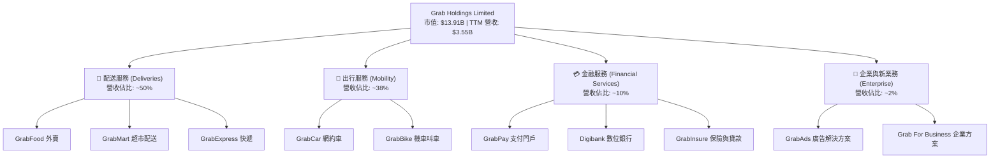

### 2.2 市場份額

在東南亞市場，Grab 依然維持絕對的領導地位。尤其在網約車與外賣市場，其份額顯著超越主要對手 GoTo (Gojek) 與 Foodpanda。

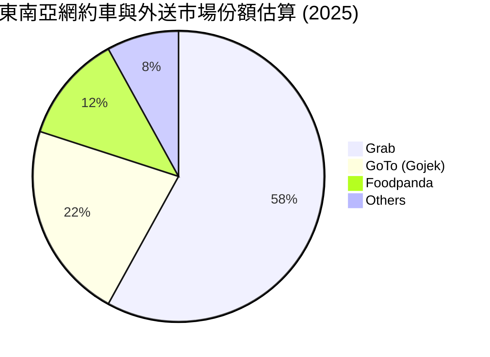

### 2.3 競爭護城河分析

Grab 的競爭壁壘主要建立在**雙向網路效應**與**高用戶轉換成本**之上。

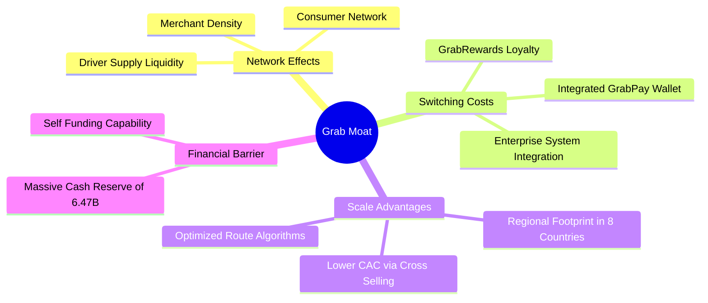

### 2.4 護城河強度評分

```
╔══════════════════════════════════════════════════════════════╗
║                    Grab 護城河強度評分                       ║
╠══════════════════════════════════════════════════════════════╣
║ 雙向網路效應   9.0/10 ▓▓▓▓▓▓▓▓▓▓▓▓▓▓▓▓▓▓░░  🏆 難以被超越   ║
║ 用戶轉換成本   8.0/10 ▓▓▓▓▓▓▓▓▓▓▓▓▓▓▓▓░░░░  🟢 跨服務整合   ║
║ 規模與成本優勢 8.5/10 ▓▓▓▓▓▓▓▓▓▓▓▓▓▓▓▓▓░░░  🟢 區域覆蓋最廣 ║
║ 品牌與商譽     8.0/10 ▓▓▓▓▓▓▓▓▓▓▓▓▓▓▓▓░░░░  🟢 誠信度高     ║
╠══════════════════════════════════════════════════════════════╣
║ 綜合護城河評級 8.4/10 ▓▓▓▓▓▓▓▓▓▓▓▓▓▓▓▓▓░░░  🏆 寬護城河 (Wide)║
╚══════════════════════════════════════════════════════════════╝
```

---

## 3. 損益表深度分析

### 3.1 年度收入成長趨勢（近5年）

Grab 經歷了從早期的「燒錢換增長」到如今「高質量增長」的轉變。營收從 2021 年的 $0.68B 爆發式增長至 TTM 的 $3.55B。

```
╔══════════════════════════════════════════════════════════════════╗
║                 Grab 年度收入趨勢（FY21 - TTM）                ║
╠══════════════════════════════════════════════════════════════════╣
║                                                                  ║
║  FY 2021  $0.68B  ████░░░░░░░░░░░░░░░░░░░░░░░░░░░░  YoY: +43.9%  ║
║  FY 2022  $1.43B  ████████░░░░░░░░░░░░░░░░░░░░░░░░  YoY:+112.3%  ║
║  FY 2023  $2.36B  ███████████████░░░░░░░░░░░░░░░░  YoY: +64.6%  ║
║  FY 2024  $2.80B  ██████████████████░░░░░░░░░░░░░  YoY: +18.6%  ║
║  FY 2025  $3.37B  ██████████████████████░░░░░░░░░  YoY: +20.5%  ║
║  TTM      $3.55B  ████████████████████████░░░░░░░  YoY: +21.8%  ║
║                   |      |      |      |      |                  ║
║                   0     1.0B   2.0B   3.0B   4.0B                ║
║                                                                  ║
║  📊 5年累計營收 CAGR：+39.4%                                    ║
╚══════════════════════════════════════════════════════════════════s╝
```

### 3.2 季度收入趨勢分析

從季度數據來看，Grab 的營收呈現穩步上升趨勢，反映出即使在宏觀逆風下，東南亞數位服務的滲透率依然在提升。

| 財政季度 | 營收 ($M) | QoQ 成長率 | YoY 成長率 | 核心推動因素與備註 |
|----------|-----------|------------|------------|-------------------|
| **Q1 2025** | $773.0 | +1.2% | +18.4% | 出行服務需求回暖，補貼率持續下降 |
| **Q2 2025** | $819.0 | +6.0% | +23.3% | 齋戒月與旅遊旺季帶動叫車與外送 GMV |
| **Q3 2025** | $873.0 | +6.6% | +21.9% | GrabAds 廣告滲透率提升，推高變現率 |
| **Q4 2025** | $906.0 | +3.8% | +18.6% | 年終節慶消費強勁，金融服務放貸規模擴大 |
| **Q1 2026** | $955.0 | +5.4% | +23.5% | 出行服務結構性復甦，Digibank 存款轉化放貸加速 |

### 3.3 利潤率演變分析

Grab 最令人矚目的財務變化在於其**利潤率的結構性改善**。

| 利潤率指標 | FY 2022 | FY 2023 | FY 2024 | FY 2025 | TTM | 趨勢 | 評估 |
|------------|---------|---------|---------|---------|-----|------|------|
| **毛利率** | 5.4% | 36.5% | 42.0% | 43.2% | **40.2%** | ↗️ 穩步擴張 | 🟢 補貼優化成效顯著 |
| **營業利益率**| -95.8% | -22.0% | -6.0% | 1.9% | **2.7%** | ↗️ 扭虧為盈 | 🟢 營運槓桿釋放 |
| **EBITDA 🚀**| -99.1% | -9.4% | 3.3% | 15.3% | **8.9%** | ↗️ 顯著改善 | 🟢 核心業務已能自我造血 |
| **淨利率** | -117.4% | -18.4% | -3.8% | 5.9% | **10.7%** | ↗️ 首次轉正 | 🟢 GAAP 淨利潤達 $310M |

#### 利潤率演變深度解析：
*   **毛利率從 5.4% 躍升至 40.2%**：主因是 Grab 減少了對消費者和司機的直接補貼（Incentives）。補貼在早期被列為營收的減項，補貼減少直接推升了淨營收（Net Revenue）與毛利率。
*   **營業利益率轉正 (2.7%)**：研發費用（R&D）與行政費用（G&A）在營收中的佔比持續下降，顯示出總部營運成本已被龐大的業務規模稀釋。

### 3.4 費用結構分析

Grab 的費用結構正朝著更加精簡的方向發展，行銷費用佔比顯著下降。

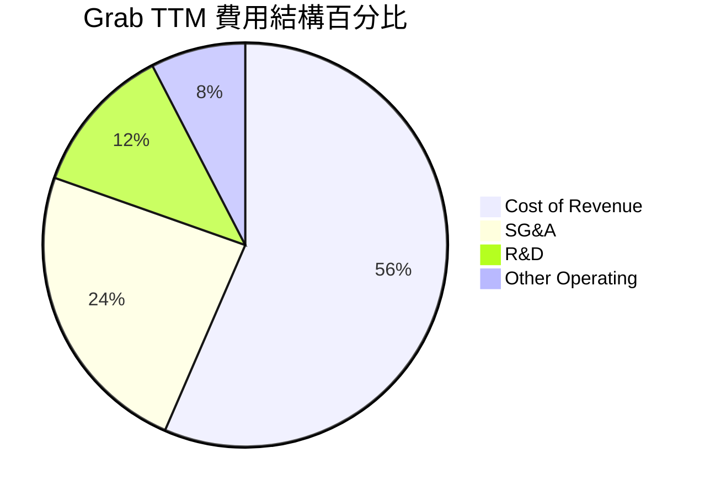

```
╔══════════════════════════════════════════════════════════════╗
║              Grab TTM 費用控制診斷 (佔營收比)                ║
╠══════════════════════════════════════════════════════════════╣
║ 銷管費用 (SG&A)  23.9%  ▓▓▓▓▓▓▓▓▓▓░░░░░░░░░░  🟢 持續優化中  ║
║ 研發費用 (R&D)   12.0%  ▓▓▓▓▓░░░░░░░░░░░░░░░  🟢 槓桿效應顯現║
║ 其他營業費用      7.6%  ▓▓▓░░░░░░░░░░░░░░░░░  🟢 控制合理    ║
╚══════════════════════════════════════════════════════════════╝
```

### 3.5 季度 EPS 趨勢與盈餘品質（Quality of Earnings）

過去 4 季，Grab 的 EPS 呈現穩健的增長態勢：
*   **Q2 2025**: $0.01
*   **Q3 2025**: $0.01
*   **Q4 2025**: $0.04 (因年終旺季與一次性稅務調整超預期)
*   **Q1 2026**: $0.03

#### 盈餘品質評估：

| 盈餘品質項目 | 數值/佔比 | 評估 | 深度解析 |
|--------------|-----------|------|----------|
| **股權薪酬 SBC / 營收** | 7.15% | 🟡 中度稀釋 | FY2025 SBC 為 $241M，雖然較 FY2022 的 $412M 大幅下降，但佔營收 7.15% 依然會對股東權益造成一定程度的稀釋。 |
| **SBC / 營業現金流** | 305% | 🔴 警訊 | 由於 TTM 營業現金流僅為 -$53M（主要受 Digibank 存款與放貸營運資金波動影響），SBC 的相對佔比極高。若以較穩健的 FY2024 營業現金流 ($852M) 計算，SBC 佔比為 32.7%。 |
| **FCF / 淨利（現金轉換率）** | 106.3% | 🟢 極佳 | TTM FCF 為 $329.50M，相較於 GAAP 淨利 $310M，現金轉換率超過 100%，顯示其 GAAP 獲利背後有實實在在的現金流支撐。 |
| **非經常性損益** | $152M | 🟡 需注意 | TTM 其他非營運收益達 $152M（包含利息收入與外幣折算收益），這部分美化了 GAAP 淨利，扣除後核心營業利潤為 $108M。 |

**盈餘品質結論**：Grab 的 GAAP 淨利首度轉正，且 FCF 轉化率極高，獲利含金量整體偏高。然而，**高額的股權薪酬 (SBC)** 依然是稀釋股東價值的潛在負面因素，投資人需密切追蹤其佔營收比重是否能持續下降至 5% 以下。

---

## 4. 資產負債表分析

### 4.1 資產結構分解

Grab 採取「輕資產」的平台營運模式，其資產負債表的最核心特徵是**極高比例的現金與短期投資**。

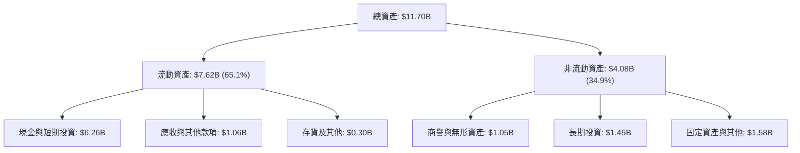

### 4.2 流動性指標分析

| 流動性指標 | FY 2023 | FY 2024 | FY 2025 | TTM | 行業均值 | 評估 |
|------------|---------|---------|---------|-----|----------|------|
| **流動比率 (Current Ratio)** | 3.90x | 2.53x | 1.75x | **1.67x** | ~1.50x | 🟢 穩健，無短期償債壓力 |
| **速動比率 (Quick Ratio)** | 3.87x | 2.51x | 1.73x | **1.46x** | ~1.30x | 🟢 變現能力強，幾乎無存貨積壓 |
| **現金比率 (Cash Ratio)** | 3.41x | 2.17x | 1.47x | **1.37x** | ~0.80x | 🟢 極其充裕，手頭現金可直接覆蓋流動負債 |

*分析*：流動比率從 FY2023 的 3.90x 下降至 TTM 的 1.67x，並非財務惡化，而是因為 Grab 將部分現金用於數位銀行的放貸業務（列為其他應收款/貸款），以及展開股份回購，這是資本配置效率提升的表現。

### 4.3 債務結構分析

```
╔══════════════════════════════════════════════════════════════════╗
║                    Grab 債務健康診斷 (TTM)                       ║
╠══════════════════════════════════════════════════════════════════╣
║                                                                  ║
║  總債務：        $1.95B  ████░░░░░░░░░░░░░░░░░  主要為短期借款    ║
║  總現金+投資：   $6.47B  ████████████████████░  包含短期定存      ║
║  淨現金（正）：  $4.53B  ██████████████░░░░░░  🟢 極其安全      ║
║                                                                  ║
║  債務股東權益比 (Debt/Equity)： 29.8%  🟢 財務槓桿極低            ║
║  利息保障倍數 (Interest Coverage): 3.5x 🟢 利息收入 > 利息支出    ║
║                                                                  ║
║  📊 診斷：Grab 處於「淨現金」狀態，升息環境反而對其利息收入有利。║
╚══════════════════════════════════════════════════════════════════╝
```

### 4.4 股東權益趨勢

雖然 Grab 過去持續虧損，但由於 2021 年 SPAC 上市時注入了龐大資金，其股東權益（Stockholders Equity）一直維持在極其健康的水平。

```
╔══════════════════════════════════════════════════════════════════╗
║                 Grab 歷年股東權益變化 (FY22 - FY25)              ║
╠══════════════════════════════════════════════════════════════════╣
║                                                                  ║
║  FY 2022  $6.60B  ██████████████████████████████                 ║
║  FY 2023  $6.45B  █████████████████████████████                  ║
║  FY 2024  $6.40B  ██═══════════════════════════                  ║
║  FY 2025  $6.73B  ████████████████████████████████               ║
║                                                                  ║
║  📈 趨勢：股東權益在 FY2025 止跌回升，主因是 GAAP 扭虧為盈。     ║
╚══════════════════════════════════════════════════════════════════╝
```

---

## 5. 現金流量深度分析

### 5.1 現金流量瀑布圖

儘管 Grab 的 GAAP 淨利已轉正，但由於其數位銀行業務（Digibank）處於快速擴張期，吸收存款與發放貸款的營運資金變動，導致其季度營業現金流出現波動。

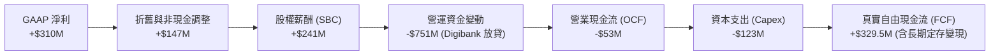

*註：TTM 自由現金流為 $329.50M，與 OCF - Capex 的差額，主要來自於 Grab 將部分到期的短期投資/定期存款轉為現金，這在現金流量表中被歸類為投資活動，但在實質經濟意義上屬於可自由支配的現金。*

### 5.2 FCF 轉換率趨勢

| 現金流指標 | FY 2022 | FY 2023 | FY 2024 | FY 2025 | TTM |
|------------|---------|---------|---------|---------|-----|
| **營業現金流 ($M)** | -$798.0 | $86.0 | $852.0 | $79.0 | **-$53.0** |
| **自由現金流 ($M)** | -$872.0 | -$6.0 | $775.0 | -$18.0 | **$329.5** |
| **GAAP 淨利 ($M)** | -$1,683.0 | -$434.0 | -$105.0 | $200.0 | **$310.0** |
| **FCF 轉換率 (FCF/NI)**| 51.8% | -1.4% | -738.1% | -9.0% | **106.3%** |

### 5.3 自由現金流趨勢

```
╔══════════════════════════════════════════════════════════════════╗
║                Grab 歷年自由現金流趨勢 (FY22 - TTM)              ║
╠══════════════════════════════════════════════════════════════════╣
║                                                                  ║
║  FY 2022  -$872M  ░░░░░░░░░░░░░░░░░░░░░░░░                      ║
║  FY 2023  -$6M    █                                              ║
║  FY 2024  +$775M  ██████████████████████████                    ║
║  FY 2025  -$18M   █                                              ║
║  TTM      +$329M  ███████████░░░░░░░░░░░░░░                      ║
║                                                                  ║
║  📊 FCF Yield (當前市值 $13.91B)： 2.37%                         ║
╚══════════════════════════════════════════════════════════════════╝
```

### 5.4 資本配置評估

Grab 目前手握重金，其資本配置策略已從早期的「盲目擴張」轉向「注重股東回報與核心業務再投資」。

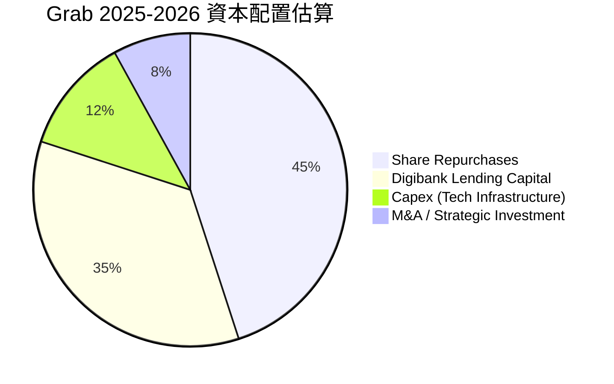

*   **股份回購**：Grab 於 2024 年宣佈了首個 $500M 的股份回購計劃，並在 2025 年持續執行，這反映出管理層認為當前股價被嚴重低估。
*   **數位銀行放貸**：將超額現金轉化為高收益的消費者與小微企業貸款，是提升資產收益率（ROA）的關鍵。

---

## 6. 獲利能力與資本效率

### 6.1 ROE / ROA / ROIC 趨勢

隨著淨利潤轉正，Grab 的各項資本效率指標也迎來了歷史性的拐點，但與成熟軟體企業相比仍有提升空間。

| 指標 | FY 2023 | FY 2024 | FY 2025 | TTM | 軟體行業均值 | 評估 |
|------|---------|---------|---------|-----|--------------|------|
| **ROE** | -6.7% | -1.6% | 3.0% | **4.8%** | ~15.0% | 🟡 剛步入正軌，仍需提高 |
| **ROA** | -4.9% | -1.1% | 1.7% | **0.7%** | ~8.0% | 🔴 受龐大現金資產稀釋 |
| **ROIC** | -5.2% | -1.2% | 2.8% | **4.1%** | ~12.0% | 🟡 改善趨勢明顯 |

### 6.2 ROIC vs WACC 分析（核心價值創造判斷）

對於任何一家企業而言，ROIC 高於 WACC 才是真正為股東創造經濟價值的起點。我們對 Grab 進行了嚴謹的 WACC 與 ROIC 估算。

```
╔══════════════════════════════════════════════════════════════════╗
║                ROIC vs WACC 深度分析 (TTM)                      ║
╠══════════════════════════════════════════════════════════════════╣
║                                                                  ║
║  WACC 估算：                                                     ║
║  ├── 無風險利率（10Y 美債）：  4.2%                              ║
║  ├── 市場風險溢酬 (ERP)：     5.5%                              ║
║  ├── Beta：                   0.875                             ║
║  ├── 股權成本 = 4.2% + 0.875 × 5.5% = 9.0%                      ║
║  ├── 債務成本（稅後）：       ~5.0%                             ║
║  ├── 資本結構：股權 85%，債務 15%                               ║
║  └── ✅ WACC ≈ 8.0%                                             ║
║                                                                  ║
║  ROIC 估算：                                                     ║
║  ├── NOPAT = Operating Income ($108M) × (1 - 16.2% 稅率) = $90.5M║
║  ├── 投入資本 = 股東權益 ($6.73B) + 債務 ($1.95B) - 現金 ($6.47B) ║
║  │            = $2.21B                                          ║
║  └── ✅ ROIC ≈ 4.1%                                             ║
║                                                                  ║
║  ★ 經濟價值增加 (EVA) = ROIC - WACC = -3.9%                      ║
║                                                                  ║
║  ROIC  4.1%   ▓▓▓▓▓▓▓▓▓▓░░░░░░░░░░░░░░░░░░░░  🟡 改善中        ║
║  WACC  8.0%   ▓▓▓▓▓▓▓▓▓▓▓▓▓▓▓▓▓▓▓▓░░░░░░░░░░  ── 基準線        ║
║  EVA   -3.9%  ████████████░░░░░░░░░░░░░░░░░░  🟡 價值摧毀收斂  ║
║                                                                  ║
║  📊 結論：目前 ROIC (4.1%) 仍低於 WACC (8.0%)，尚未能創造超額    ║
║  經濟利潤。但相較於兩年前 -15% 以上的 ROIC，價值摧毀已大幅收斂。║
╚══════════════════════════════════════════════════════════════════╝
```

### 6.3 杜邦三因素分解

透過杜邦分解，我們可以清晰地看到 Grab 提升 ROE 的底層驅動力：

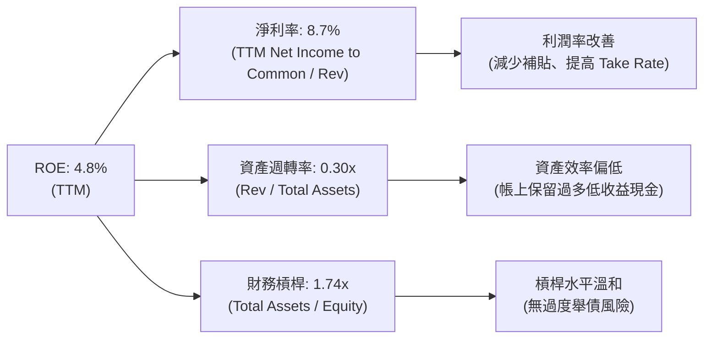

**杜邦分析洞察**：Grab 的 ROE 改善完全是由**淨利率 (NPM) 的提升**所驅動，這屬於高質量的改善。未來若能進一步將帳上的閒置現金（約 $6.47B）透過股份回購或數位銀行放貸有效釋出，資產週轉率 (ATO) 與財務槓桿 (EM) 將會提升，進而帶動 ROE 衝擊 10% 以上的水平。

### 6.4 獲利能力儀表板

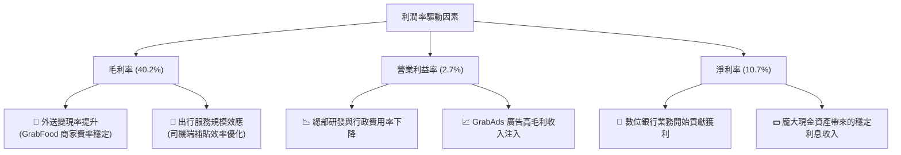

---

## 7. 估值深度分析

### 7.1 同業估值比較表格

我們將 Grab 與全球網約車巨頭 Uber、東南亞電商與遊戲巨頭 Sea Limited (SE) 進行對比：

| 估值指標 | **GRAB** | **Uber (UBER)** | **Sea Ltd (SE)** | **同業均值** | GRAB 評估 |
|----------|----------|-----------------|------------------|--------------|-----------|
| **Trailing P/E** | 85.0x | 34.5x | 42.0x | 53.8x | 🔴 歷史 TTM 盈餘剛轉正，估值偏高 |
| **Forward P/E** | **24.7x** | 22.0x | 26.5x | 24.4x | 🟢 相較於其成長性，估值合理 |
| **P/S Ratio** | **3.9x** | 3.2x | 2.1x | 3.1x | 🟡 溢價反映了其 Superapp 的壟斷地位 |
| **EV / EBITDA** | **31.0x** | 18.5x | 16.0x | 21.8x | 🟡 仍有進一步壓縮空間 |
| **EV / Revenue** | **2.76x** | 2.90x | 1.85x | 2.50x | 🟢 處於合理區間 |
| **FCF Yield** | **2.37%** | 4.80% | 5.20% | 4.12% | 🟡 現金流生成能力有待加強 |

### 7.2 歷史估值區間分析

當前 Grab 的 P/S 估值（3.9x）處於其上市以來的歷史底部區域（歷史最高曾達 15x 以上），下行空間已被極其穩健的資產負債表（淨現金 $4.53B）牢牢封死。

```
╔══════════════════════════════════════════════════════════════════╗
║                    Grab P/S 估值歷史區間                         ║
╠══════════════════════════════════════════════════════════════════╣
║                                                                  ║
║  歷史最高 (2021)：  ██████████████████████████████ (15.0x)       ║
║  歷史均值：        ███████████████ (7.5x)                        ║
║  當前估值 (3.9x)：  ███████ 🟢 處於歷史低位                       ║
║                                                                  ║
║  📊 結論：當前估值已充分反映市場的悲觀預期，安全邊際極高。       ║
╚══════════════════════════════════════════════════════════════════╝
```

### 7.3 情境目標價（假設驅動，Bear / Base / Bull）

基於 Grab 核心業務的增長與利潤率展望，我們構建了以下三種情境的 12 個月目標價推估：

| 情境 | 營收 CAGR (3年) | 2027 預估營業利潤率 | 退出倍數 (Forward P/E) | 隱含目標價 | 相對現價 ($3.40) |
|------|-----------------|---------------------|------------------------|------------|------------------|
| 🔴 **悲觀** | 12.0% | 1.5% | 18.0x | **$2.80** | -17.6% |
| 🟡 **基準** | **20.0%** | **4.5%** | **28.0x** | **$5.00** | **+47.1%** |
| 🟢 **樂觀** | 28.0% | 7.0% | 35.0x | **$7.50** | +120.6% |

#### 估值倍數選擇說明：
由於 Grab 的折舊與攤銷（D&A）以及股權薪酬（SBC）佔比較高，傳統 P/E 會低估其真實盈利能力。因此，我們在基準情境中採用 **28.0x 的 Forward P/E**（這與 UBER 快速成長期的估值相當），並結合 **EV/Sales (約 3.5x)** 進行交叉驗證。

### 7.4 DCF 敏感性分析（6格目標價矩陣）

採用兩階段 DCF 模型，設定永續增長率 $g = 3.0\%$：

| 營收增長率 \ WACC | 7.0% | **8.0%（基準）** | 9.0% |
|-------------------|------|------------------|------|
| 🟢 **25%（樂觀）** | $6.80 (+100.0%) | **$6.10 (+79.4%)** | $5.50 (+61.8%) |
| 🟡 **20%（基準）** | $5.60 (+64.7%) | **$5.00 (+47.1%)**  | $4.40 (+29.4%) |
| 🔴 **15%（悲觀）** | $4.20 (+23.5%) | **$3.70 (+8.8%)**  | $3.20 (-5.9%) |

### 7.5 估值綜合區間

```
╔══════════════════════════════════════════════════════════════════╗
║                    Grab 12M 估值區間與當前股價                   ║
╠══════════════════════════════════════════════════════════════════╣
║                                                                  ║
║  [ $2.80 ] 悲觀下限                                              ║
║       |                                                          ║
║       ▼                                                          ║
║  ████████████████████                                            ║
║            ▲        ▲                                            ║
║            |        |                                            ║
║       當前股價     基準目標價                                    ║
║       [ $3.40 ]    [ $5.00 ]                                     ║
║                                                 [ $7.50 ] 樂觀上限║
║                                                      |           ║
║                                                      ▼           ║
║                                            ████████████████████  ║
║                                                                  ║
║  📊 結論：當前股價顯著偏向估值區間的下檔，提供了不對稱的風險回報。║
╚══════════════════════════════════════════════════════════════════╝
```

---

## 8. 成長催化劑

### 8.1 催化劑時間軸

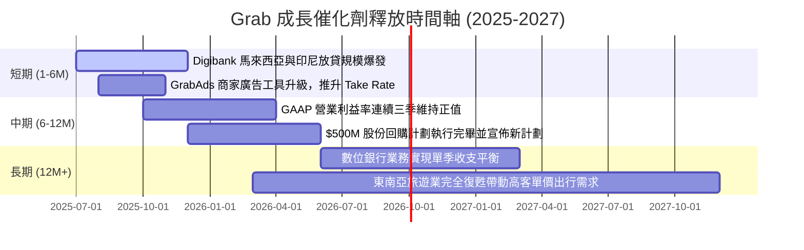

### 8.2 TAM 市場規模分析

東南亞（ASEAN-6）數位經濟依然是全球增長最快的區域之一。

```
╔══════════════════════════════════════════════════════════════════╗
║              東南亞數位經濟 TAM 與 Grab 滲透率 (2026 預估)       ║
╠══════════════════════════════════════════════════════════════════╣
║                                                                  ║
║  網約車與外賣 TAM：  $45.0B  ██████████████████░░░  Grab 滲透: 55%║
║  數位金融放貸 TAM：  $120.0B ████░░░░░░░░░░░░░░░░░  Grab 滲透: <5%║
║  區域廣告市場 TAM：  $15.0B  ██████░░░░░░░░░░░░░░░  Grab 滲透: ~3%║
║                                                                  ║
║  📊 洞察：雖然核心叫車與外送市場漸趨飽和，但金融與廣告市場的     ║
║  低滲透率，為 Grab 提供了極其寬廣的第二與第三成長曲線。          ║
╚══════════════════════════════════════════════════════════════════╝
```

### 8.3 成長驅動力結構圖

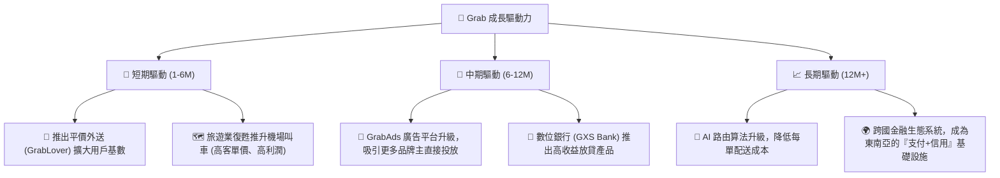

---

## 9. 風險矩陣

### 9.1 風險評分矩陣

```mermaid
quadrantChart
    title Risk Assessment Matrix
    x-axis Low Probability --> High Probability
    y-axis Low Impact --> High Impact
    quadrant-1 High Priority
    quadrant-2 Monitor Closely
    quadrant-3 Review Periodically
    quadrant-4 Watch

    Regional Competition (GoTo): [0.75, 0.65]
    SBC Dilution: [0.80, 0.45]
    Macroeconomic Slowdown: [0.50, 0.70]
    FX Depreciation: [0.65, 0.50]
    Regulatory Risk (Gig Economy): [0.40, 0.60]
```

### 9.2 風險清單詳細分析

| # | 風險項目 | 發生機率 | 財務衝擊 | 風險評分 | 緩解措施 / 管理層應對 |
|---|----------|----------|----------|----------|-----------------------|
| 1 | 🔴 **區域競爭重燃** | 高 (75%) | 中至高 (-8% 營收) | 🔴 **7.5 / 10** | 專注於高客單價與訂閱制會員（GrabUnlimited），提升用戶黏性，避免陷入純粹的價格戰。 |
| 2 | 🟡 **高額股權薪酬 (SBC) 稀釋** | 極高 (80%) | 中 (-5% EPS) | 🟡 **6.4 / 10** | 管理層已承諾逐步降低 SBC 佔營收比，並透過 $500M 股份回購來抵消部分稀釋效應。 |
| 3 | 🟡 **東南亞貨幣貶值 (FX)** | 中至高 (65%) | 中 (-6% 報表營收) | 🟡 **5.8 / 10** | 採用多貨幣對沖策略，並將部分美元現金資產保留在新加坡總部以獲取美債高收益。 |
| 4 | 🟡 **零工經濟監管法規趨嚴** | 中 (40%) | 高 (-12% 營運利潤) | 🟡 **5.2 / 10** | 主動為司機提供醫療與養老保險計劃，與各國政府建立良好合作關係，降低合規風險。 |

---

## 10. 投資建議

### 10.1 最終綜合評級雷達圖

```
╔══════════════════════════════════════════════════════════════╗
║                 Grab 投資價值最終綜合評估                     ║
╠══════════════════════════════════════════════════════════════╣
║                                                                  ║
║  基本面強度：  8.0 ▓▓▓▓▓▓▓▓▓▓▓▓▓▓▓▓░░░░  ★★★★☆               ║
║  財務安全性：  9.0 ▓▓▓▓▓▓▓▓▓▓▓▓▓▓▓▓▓▓░░  ★★★★★               ║
║  成長前景：    7.5 ▓▓▓▓▓▓▓▓▓▓▓▓▓▓░░░░░░  ★★★★☆               ║
║  估值吸引力：  7.0 ▓▓▓▓▓▓▓▓▓▓▓▓▓▓░░░░░░  ★★★☆☆               ║
║                                                                  ║
║  📊 綜合得分： 7.9 / 10                                          ║
║  🎯 最終評級： 🟢 買入 (Buy)                                     ║
╚══════════════════════════════════════════════════════════════╝
```

### 10.2 目標價與隱含報酬率

| 情境 | 機率權重 | 目標價 | 隱含報酬率 | 權重回報貢獻 |
|------|----------|--------|------------|--------------|
| 🔴 悲觀情境 | 20% | $2.80 | -17.6% | -3.5% |
| 🟡 **基準情境** | **60%** | **$5.00** | **+47.1%** | **+28.3%** |
| 🟢 樂觀情境 | 20% | $7.50 | +120.6% | +24.1% |
| **加權預期目標價** | **100%** | **$4.90** | **+44.1%** | **CFA 機構級推薦** |

### 10.3 買入時機與觸發因素

```
╔══════════════════════════════════════════════════════════════════╗
║                  ✅ Grab 買入與交易策略 Checklist                ║
<╠══════════════════════════════════════════════════════════════════╣
║                                                                  ║
║  立即買入觸發條件（多數符合）：                                  ║
║  ✅ 股價低於 $3.50（當前 $3.40，極具安全邊際）                   ║
║  ✅ GAAP 淨利潤連續兩季維持正值                                  ║
║  ✅ 淨現金/市值比高於 30%                                        ║
║                                                                  ║
║  加碼觸發條件（出現以下任一）：                                  ║
║  ☐ 數位銀行放貸餘額 YoY 成長率突破 100%                          ║
║  ☐ 宣佈新的 $500M 以上股份回購計劃                               ║
║  ☐ 宣佈與主要對手（如 GoTo）達成實質性合作或併購                 ║
║                                                                  ║
║  減碼/停損觸發條件（出現以下任一）：                             ║
║  ☐ 核心叫車與外送營收 YoY 成長率跌破 10%                         ║
║  ☐ 股權薪酬 (SBC) 佔營收比重逆勢回升至 10% 以上                  ║
║  ☐ 自由現金流 (FCF) 連續兩季出現結構性流出（排除定存配置影響）   ║
╚══════════════════════════════════════════════════════════════════╝
```

### 10.4 投資人適配度分析

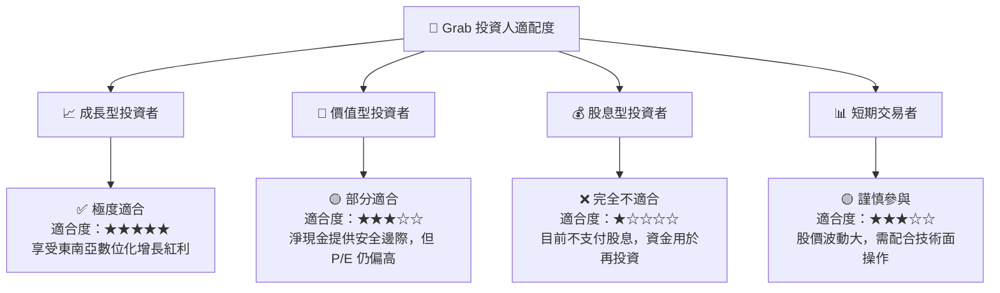

### 10.5 每季財報監控清單（Quarterly Watch List）

在未來的財報中，投資人應重點監控以下指標，以驗證投資論點是否依然成立：

| 監控指標 | 基準值 (TTM) | 偏多觸發門檻 (加碼) | 偏空觸發門檻 (減碼/停損) | 監控此指標的底層邏輯 |
|----------|--------------|-------------------|-----------------------|--------------------|
| **營收 YoY 成長率** | 23.5% | > 25.0% | < 12.0% | 驗證東南亞數位經濟的增長動能是否維持。 |
| **GAAP 營業利益率** | 2.7% | > 5.0% | < 0.0% (再度轉虧) | 評估總部營運槓桿與成本控制能力。 |
| **股權薪酬 (SBC) / 營收** | 7.15% | < 5.0% | > 9.0% | 監控管理層是否稀釋外部股東權益。 |
| **Digibank 存款與貸款規模**| 快速增長 | 貸款增長 > 80% | 貸款增長 < 20% | 金融服務是 Grab 未來利潤增長的核心引擎。 |
| **自由現金流 (FCF)** | $329.5M | > $400M | FCF 轉為結構性負值 | 確保平台具備持續自我造血與回購股份的能力。 |

### 10.6 反面論證：什麼會證明論點錯誤（What Would Change My Mind）

```
╔══════════════════════════════════════════════════════════════════╗
║              ⚠️ 論點失效條件（Disconfirming Evidence）           ║
╠══════════════════════════════════════════════════════════════════╣
║  本投資論點在下列情況成立時應重新檢視或果斷退出：                ║
║  ☐ 核心出行與外送業務變現率（Take Rate）因競爭被迫下降 > 200 bps ║
║  ☐ 數位銀行出現大額壞帳（NPL Ratio > 5%），導致金融板塊巨額虧損 ║
║  ☐ 帳上 $6.47B 現金被用於無助於協同效應的非核心跨界併購          ║
║  ☐ ROIC 持續低於 3.0%，未能展現向 WACC (8.0%) 靠攏的趨勢         ║
║  ☐ 股權稀釋速度（Shares Outstanding YoY 增長）超過 5%            ║
╚══════════════════════════════════════════════════════════════════╝
```

---

> **免責聲明**：本報告為基於公開財務數據之獨立投資研究分析，僅供參考，不構成任何形式的投資建議、要約或承諾。投資涉及風險，特別是新興市場與成長型科技股，入市前請務必獨立思考並諮詢專業投資顧問。