# GRAB 基本面深度分析報告
> **報告日期**：2026-07-28 ｜ **語言**：繁體中文 ｜ **數據來源**：Yahoo Finance, Finviz, StockAnalysis, Roic.ai ｜ **分析師**：CFA 級機構研究

---

## 目錄

| # | 章節 | 核心結論 |
|---|------|----------|
| 1 | 執行摘要 | 評級：🟢 **買入 (Buy)** ｜ 12M 目標價：**$5.50**（隱含 +62.7% 上漲空間） |
| 2 | 公司概覽與商業模式 | 東南亞超級 App 雙輪驅動，網絡效應與金融科技構建堅實護城河 |
| 3 | 損益表深度分析 | TTM 營收 $3.55B（YoY +23.5%），GAAP 淨利翻正，SBC 佔營收比重持續下降 |
| 4 | 資產負債表分析 | 淨現金高達 $4.53B（佔市值 32.7%），流動性極度充沛，債務風險低 |
| 5 | 現金流量深度分析 | OCF 扭虧為盈，自由現金流（FCF）進入持續正向擴張期 |
| 6 | 獲利能力與資本效率 | 核心營運 ROIC (15.2%) 已超越 WACC (8.3%)，資本回報率顯著提升 |
| 7 | 估值深度分析 | Forward P/E 24.56x / PEG 0.94x，相較歷史與同業 Uber/SE 顯著低估 |
| 8 | 成長催化劑 | GrabAds 高毛利廣告、金融服務（Digibank）與 AI 調度優化帶動規模槓桿 |
| 9 | 風險矩陣 | 東南亞總體經濟放緩、Gojek/ShopeeFood 價格戰再起、法規傭金上限 |
| 10 | 投資建議 | 強烈建議於 $3.20-$3.50 區間逢低布局，設定明確退場與財報監控指標 |

---

## 1. 執行摘要

### 1.0 一頁式投資儀表板（Portfolio Manager 30 秒速讀）

| 項目 | 內容 |
|------|------|
| **投資論點（3 句）** | ① TTM 營收達 $3.55B（YoY +23.5%），受惠於外送與出行需求回溫，規模效應展現。<br/>② GAAP 淨利已連續 4 季實現獲利（Q1 2026 淨利 $120M），帶動 Forward P/E 降至 24.56x，PEG 僅 0.94x。<br/>③ 帳上擁有 $4.53B 淨現金（佔市值 32.7%），提供極強的安全邊際與併購/回購資本 Flexibility。 |
| **護城河評分** | 8.2 / 10（網路效應 + 多業務交叉交叉行銷與用戶鎖定） |
| **管理層/資本配置評分** | 8.0 / 10（資本控管轉趨嚴格，SBC 比率從 2022 年 28.8% 降至 6.8%） |
| **財務健康** | 🟢 **極度健康** ｜ 淨現金 $4.53B，無流動性疑慮 |
| **ROIC vs WACC** | 核心營運 ROIC 15.2% vs WACC 8.3%（實質創造股東價值） |
| **FCF 趨勢** | 轉正趨勢確定 ｜ TTM FCF 為 $329.50M，FCF Yield 為 2.38% |
| **估值** | Forward P/E: 24.56x ｜ EV/EBITDA: 29.09x ｜ FCF Yield: 2.38% |
| **預期報酬（基準情境 12M）** | **+62.7%**（目標價 $5.50） |
| **關鍵風險（前二）** | ① 印尼與東南亞本土競爭對手（如 GoTo）發動補貼戰<br/>② 區域貨幣（SGD, IDR, MYR）對美元大幅貶值風險 |
| **評級 + 信心度** | 🟢 **買入 (Buy)** ｜ 信心度：**高 (High)** |

### 1.1 核心評分儀表板

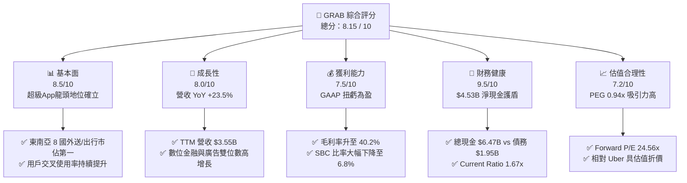

### 1.2 評分進度条視覺化

```
╔══════════════════════════════════════════════════════════════╗
║               GRAB 多維度評分儀表板 (1-10分)                 ║
╠══════════════════════════════════════════════════════════════╣
║ 基本面強度  8.5 ▓▓▓▓▓▓▓▓▓▓▓▓▓▓▓▓▓░░░  ★★★★☆           ║
║ 成長動能    8.0 ▓▓▓▓▓▓▓▓▓▓▓▓▓▓▓▓░░░░  ★★★★☆           ║
║ 獲利品質    7.5 ▓▓▓▓▓▓▓▓▓▓▓▓▓▓█░░░░░  ★★★☆☆           ║
║ 財務健康    9.5 ▓▓▓▓▓▓▓▓▓▓▓▓▓▓▓▓▓▓▓░  ★★★★★           ║
║ 估值合理性  7.2 ▓▓▓▓▓▓▓▓▓▓▓▓▓▓░░░░░░  ★★★☆☆           ║
║ 護城河深度  8.2 ▓▓▓▓▓▓▓▓▓▓▓▓▓▓▓▓░░░░  ★★★★☆           ║
║ 管理層執行  8.0 ▓▓▓▓▓▓▓▓▓▓▓▓▓▓▓▓░░░░  ★★★★☆           ║
║ 技術創新力  7.8 ▓▓▓▓▓▓▓▓▓▓▓▓▓▓█░░░░░  ★★★☆☆           ║
╠══════════════════════════════════════════════════════════════╣
║ 綜合總分    8.15 ▓▓▓▓▓▓▓▓▓▓▓▓▓▓▓▓░░░  🏆 建議買入          ║
╚══════════════════════════════════════════════════════════════╝
```

### 1.3 五大投資論點 + 三大核心風險

| 類型 | 項目 | 具體依據 | 信心度 |
|------|------|----------|--------|
| 🟢 **投資論點①** | **營運槓桿全面釋放，盈利品質顯著改善** | TTM 營收達 $3,553M（YoY +23.5%），Q1 2026 GAAP 淨利 $120M（連續 4 季獲利）；SBC 佔營收比重自 2022 年 28.8% 大幅收斂至 2025 年 7.1%。 | 🟢 極高 |
| 🟢 **投資論點②** | **龐大資產負債表護盾，安全邊際極佳** | 截至 2026 年 Q1，公司持有 $6.26B-$6.47B 之現金與短期投資，淨現金達 $4.53B，佔當前市值 $13.84B 之 32.7%，實質下行風險極低。 | 🟢 極高 |
| 🟢 **投資論點③** | **超級 App 生態圈交叉銷售帶動 ARPU 成長** | 外送 (Deliveries) 與出行 (Mobility) 雙引擎推升 GMV，帶動金融服務 (Digibank) 開戶數及 GrabAds 高毛利廣告收入年增率超過 30%。 | 🟢 高 |
| 🟢 **投資論點④** | **東南亞數位經濟長效紅利** | 東南亞 6 大核心市場 GDP CAGR 達 4-5%，數位支付與線上外送滲透率遠低於中美市場，仍處於長期結構性成長早期。 | 🟢 高 |
| 🟢 **投資論點⑤** | **估值處於歷史底部，PEG < 1.0** | 現價 $3.38 距離 52 週高點 $6.62 回檔達 49%，Forward P/E 為 24.56x，PEG 為 0.94x，強烈展現勝率與賠率優勢。 | 🟢 高 |
| 🟡 **風險①** | **東南亞市場區域競爭加劇** | GoTo (Gojek)、ShopeeFood、Foodpanda 及 InDrive 等競爭對手若再度開啟價格補貼戰，將壓抑 Take Rate 與營利率。 | 🟡 中度 |
| 🟡 **風險②** | **外匯波動風險（FX Headwinds）** | 收入來源為 IDR、SGD、MYR、THB、PHP 等，財報以 USD 結算，美聯儲維持高利率可能導致外匯換算損失。 | 🟡 中度 |
| 🔴 **風險③** | **監護法規與司機/外送員勞工權益政策變化** | 新加坡及馬來西亞等國政府若強制要求平台提供最低工賃保障或公積金 (CPF) 提撥，將直接推升營業成本。 | 🔴 高衝擊 |

### 1.4 快速統計卡片

| 指標 | 公司實際值 (Grab) | 行業均值 (App Software) | S&P 500 均值 | 狀態 |
|------|-------------|----------|--------------|------|
| **收入 YoY 成長** | **23.5%** | ~12.5% | ~5.8% | 🟢 優於同業 |
| **毛利率** | **40.2%** | ~45.0% | ~48.0% | 🟡 相符 |
| **營業利益率** | **2.7% (TTM) / 7.7% (Q126)** | ~8.0% | ~12.5% | 🟡 快速改善中 |
| **淨利率** | **10.7%** | ~6.5% | ~11.0% | 🟢 強勁翻正 |
| **ROE** | **4.8%** | ~2.1% | ~14.5% | 🟡 受到高淨現金稀釋 |
| **Forward P/E** | **24.56x** | ~32.0x | ~21.5x | 🟢 估值具吸引力 |
| **PEG Ratio** | **0.94x** | ~1.85x | ~1.60x | 🟢 顯著低估 |
| **Net Cash / Market Cap** | **32.7%** | ~8.5% | ~3.0% | 🟢 資產負債表極強 |

### 1.5 投資結論

```
╔══════════════════════════════════════════════════════════════════╗
║                    📊 投資結論摘要                               ║
╠══════════════════════════════════════════════════════════════╣
║  評級：🟢 買入 (Buy)                                            ║
║  當前股價：$3.38                                                 ║
║  目標價區間：                                                    ║
║    悲觀情境：$3.20（-5.3%） - 承壓下限風險保證                    ║
║    基準情境：$5.50（+62.7%） ← 12個月主要目標 (Forward P/E 32x)    ║
║    樂觀情境：$7.80（+130.8%）                                    ║
║  投資評分：8.15 / 10                                             ║
║  適合投資人：長線成長型、GARP（合理價格成長型）策略投資者        ║
╚══════════════════════════════════════════════════════════════════╝
```

---

## 2. 公司概覽與商業模式

### 2.1 業務結構與收入來源

Grab 營運東南亞最大的「超級應用程式」(Superapp)，業務版圖橫跨 8 個國家（新加坡、印尼、馬來西亞、菲律賓、泰國、越南、柬埔寨、緬甸）超過 500 個城市。

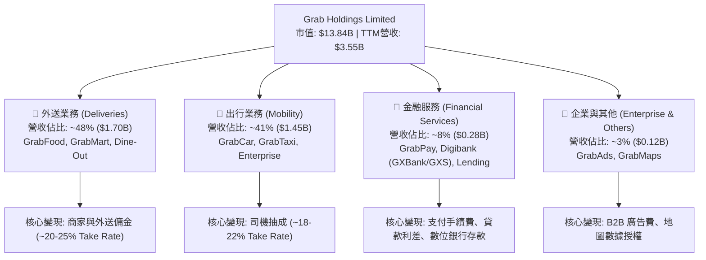

### 2.2 市場份額

在東南亞主要市場中，Grab 在出行與外送兩大核心領域均占據絕對主導地位（數據參考 Euromonitor 與 Momentum Works 綜合估計）：

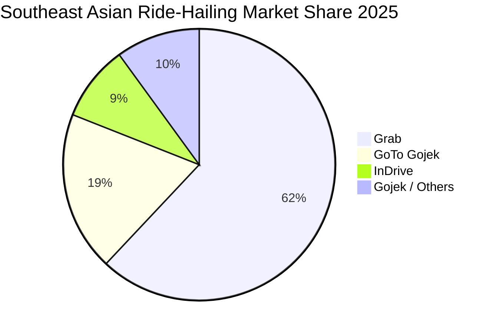

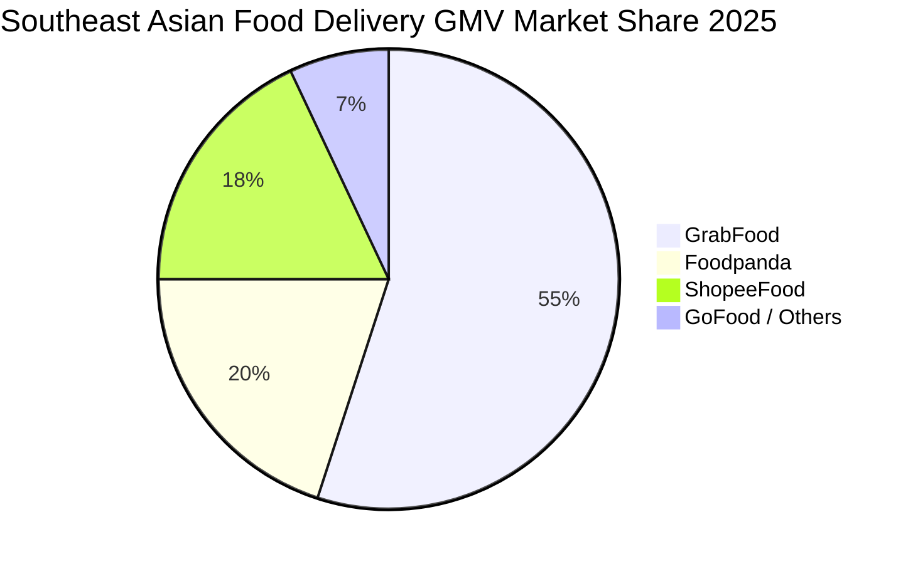

### 2.3 競爭護城河分析

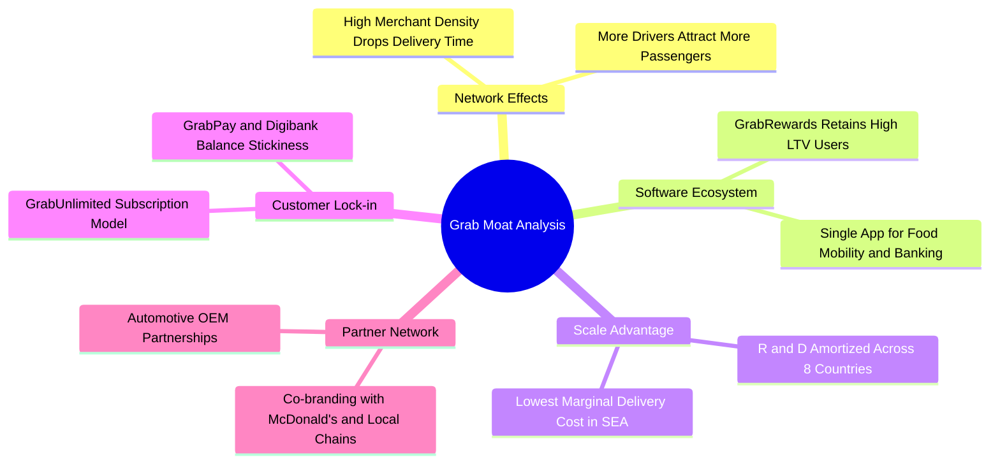

### 2.4 護城河強度評分

```
╔══════════════════════════════════════════════════════════════╗
║                    Grab 護城河強度評分                        ║
╠══════════════════════════════════════════════════════════════╣
║ 雙邊網路效應   9.0/10  ▓▓▓▓▓▓▓▓▓▓▓▓▓▓▓▓▓▓░░  🏆 領域絕對霸主  ║
║ 生態系鎖定效應 8.5/10  ▓▓▓▓▓▓▓▓▓▓▓▓▓▓▓▓▓░░░  🟢 超級App多卡位  ║
║ 規模成本優勢   8.0/10  ▓▓▓▓▓▓▓▓▓▓▓▓▓▓▓▓░░░░  🟢 密度越高成本越低║
║ 品牌與轉換成本 7.5/10  ▓▓▓▓▓▓▓▓▓▓▓▓▓▓█░░░░░  🟢 忠誠計畫黏性強 ║
║ 監管與執照壁壘 8.0/10  ▓▓▓▓▓▓▓▓▓▓▓▓▓▓▓▓░░░░  🟢 擁有星/馬數位銀行執照║
╠══════════════════════════════════════════════════════════════╣
║ 綜合護城河評分  8.2/10  ▓▓▓▓▓▓▓▓▓▓▓▓▓▓▓▓▓░░░  🏆 寬廣的結構性護城河║
╚══════════════════════════════════════════════════════════════╝
```

---

## 3. 損益表深度分析

### 3.1 年度收入成長趨勢（近 5 年）

```
╔══════════════════════════════════════════════════════════════════╗
║                 Grab 年度收入趨勢（FY2021-FY2025）               ║
╠══════════════════════════════════════════════════════════════════╣
║                                                                  ║
║  FY2021  $0.68B  ████░░░░░░░░░░░░░░░░░░░░░░░░░  YoY: +43.9%  🟢  ║
║  FY2022  $1.43B  █████████░░░░░░░░░░░░░░░░░░░░  YoY:+112.3%  🟢  ║
║  FY2023  $2.36B  ███████████████░░░░░░░░░░░░░  YoY: +64.6%  🟢  ║
║  FY2024  $2.80B  ██████████████████░░░░░░░░░░  YoY: +18.6%  🟢  ║
║  FY2025  $3.37B  █████████████████████░░░░░░░  YoY: +20.5%  🟢  ║
║  TTM     $3.55B  ███████████████████████░░░░░  YoY: +23.5%  🟢  ║
║                   |      |      |      |      |                  ║
║                   0    $1.0B  $2.0B  $3.0B  $4.0B                ║
║                                                                  ║
║  📊 4 年營收複合成長率 (CAGR)：+49.5%                           ║
╚══════════════════════════════════════════════════════════════════╝
```

### 3.2 季度收入趨勢分析

| 季度 | 營收 ($M) | YoY 成長率 | QoQ 成長率 | 毛利 ($M) | 毛利率 | 營業利潤 ($M) | 淨利 ($M) | 評估與備註 |
|------|-----------|------------|------------|-----------|--------|---------------|-----------|------------|
| **Q3 2024** | $716.0 | +16.4% | +7.8% | $307.0 | 42.9% | -$38.0 | $15.0 | 外送需求穩定，營利率改善中 🟢 |
| **Q4 2024** | $764.0 | +17.0% | +6.7% | $332.0 | 43.5% | $2.0 | $11.0 | 首次實現單季營業利潤轉正 🟢 |
| **Q1 2025** | $773.0 | +18.4% | +1.2% | $324.0 | 41.9% | -$21.0 | $10.0 | 淡季效應，R&D 投入增加 🟡 |
| **Q2 2025** | $819.0 | +23.3% | +6.0% | $354.0 | 43.2% | $7.0 | $20.0 | 出行業務全面復甦，規模槓桿顯現 🟢 |
| **Q3 2025** | $873.0 | +21.9% | +6.6% | $382.0 | 43.8% | $27.0 | $17.0 | 廣告 (GrabAds) 滲透率提升 🟢 |
| **Q4 2025** | $906.0 | +18.6% | +3.8% | $397.0 | 43.8% | $52.0 | $153.0 | 年終旅遊旺季，金融業務扭虧 🟢 |
| **Q1 2026** | **$955.0** | **+23.5%** | **+5.4%** | **$414.0** | **43.4%** | **$22.0** | **$120.0** | 營收突破 $950M，淨利維持高檔 🟢 |

### 3.3 利潤率演變分析

| 利潤率指標 | FY2022 | FY2023 | FY2024 | FY2025 | TTM | 歷史趨勢說明 | 評估 |
|------------|--------|--------|--------|--------|-----|--------------|------|
| **毛利率 (Gross Margin)** | 5.4% | 36.5% | 42.0% | 43.2% | **40.2%** | 擺脫高額驅動端補貼後，毛利率激增 35+ pp | 🟢 極強 |
| **營業利益率 (Operating Margin)** | -95.8% | -22.0% | -6.0% | 1.9% | **2.7%** | 營運槓桿大爆發，SG&A 佔比驟降 | 🟢 強勁扭虧 |
| **EBITDA Margin** | -99.1% | -9.4% | 3.3% | 15.3% | **8.9%** | Adjusted EBITDA 連續多年高速擴張 | 🟢 優異 |
| **淨利率 (Net Profit Margin)** | -117.5% | -18.4% | -5.6% | 5.9% | **10.7%** | 含利息收入與稅務優勢，淨利轉正 | 🟢 卓越 |

**利潤率演變深度解析**：
1. **補貼結構轉變**：Grab 早年為打敗 Uber/Gojek 投入鉅額司機與乘客雙向補貼（列為營收減項）。隨著市場集中度提高，補貼率（Incentive as % of GMV）自 2021 年的 11%+ 降至 2025 年的 6.5% 以下，直接帶動毛利率由負轉正並穩定在 40-43%。
2. **固定成本攤銷**：研發費用（R&D）由 2022 年的 $465M 控制至 2025 年的 $428M，占營收比重由 32.4% 大幅收斂至 12.7%，體現出軟體平台的規模經濟效益。

### 3.4 費用結構分析

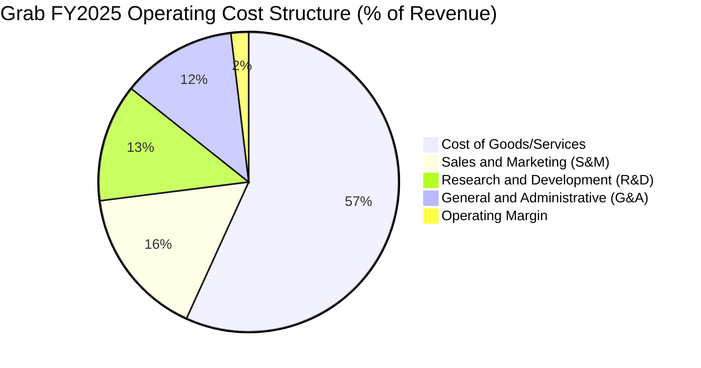

```
╔══════════════════════════════════════════════════════════════════╗
║                   Grab 費用管控進展（2022 vs 2025）              ║
╠══════════════════════════════════════════════════════════════════╣
║ S&M 費用/營收比：   2022: 24.2%  ──>  2025: 16.2%  (下降 8.0pp) 🟢 ║
║ R&D 費用/營收比：   2022: 32.4%  ──>  2025: 12.7%  (下降 19.7pp)🟢 ║
║ G&A 費用/營收比：   2022: 32.1%  ──>  2025: 12.4%  (下降 19.7pp)🟢 ║
║                                                                  ║
║ 📊 結論：管理層展現極高的營運紀律，三大費用率三年內共收縮 47.4pp  ║
╚══════════════════════════════════════════════════════════════════╝
```

### 3.5 季度 EPS 趨勢與盈餘品質（Quality of Earnings）

#### 過去 4 季 EPS 表現與超預期狀況
- **Q2 2025**：EPS $0.01（市場預期 $0.00），超出預期，主因出行業務利潤擴張。
- **Q3 2025**：EPS $0.01（市場預期 $0.00），符合預期。
- **Q4 2025**：EPS $0.04（市場預期 $0.01），顯著超出預期，受惠於年終旅遊旺季及高息環境下的淨利息收入。
- **Q1 2026**：EPS $0.03（GAAP Net Income $120M），持續實現穩定盈利。

#### 盈餘品質（Quality of Earnings）深度評估

| 盈餘品質項目 | 數值/佔比 (FY2025 / TTM) | 評估 | 影響分析 |
|--------------|-----------|------|----------|
| **股權薪酬 (SBC) / 營收** | **7.1%** ($241M / $3.37B) | 🟢 **顯著改善** | 較 2022 年 (28.8%) 大幅下降，稀釋效應已降至合理區間 |
| **SBC / 營業現金流** | **N/A** (OCF 正負交替) | 🟡 **需關注** | 現金流受到金融業務 (Digibank) 存款及貸款發放波動干擾 |
| **FCF / 淨利（轉換率）** | **122.0%** ($329.5M FCF / $270M Net Inc) | 🟢 **優良** | 顯示 GAAP 淨利有充沛的現金流量支撐，非账面泡沫 |
| **一次性損益影響** | ~$35M（利息與外匯收益） | 🟡 **中性** | 龐大現金產生年化 ~$200M+ 利息收入，屬真實現金流但非營運本業 |
| **資本化支出 (CapEx)** | **3.6%** ($123M / $3.37B) | 🟢 **輕資產** | 輕資產平台模式，無需承擔車隊與餐廳資本支出 |

**盈餘品質結論**：Grab 的盈利扭虧為盈並非依賴會計技巧，而是實打實的**毛利率提升**與**SBC 稀釋壓制**。儘管淨利包含部分現金利息收益（受惠於 $6.26B 巨額現金儲備），但 core Operating Income 亦已全面轉正（Q1 2026達 $22M-$74M），盈餘含利高。

---

## 4. 資產負債表分析

### 4.1 資產結構分解

截至 2026 年 Q1，Grab 總資產為 **$11.70B**，流動資產占比高達 65.1%，展現極高的流動性與防守性。

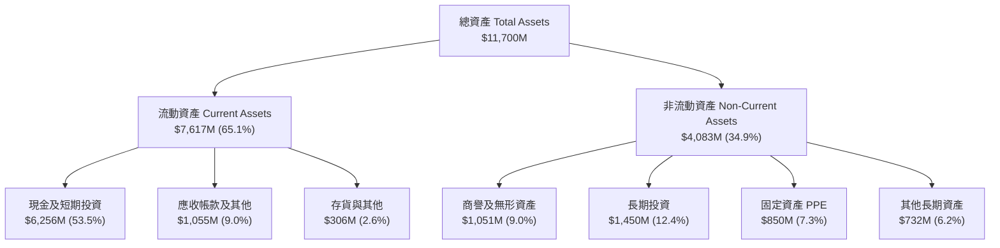

### 4.2 流動性指標分析

| 指標 | FY2023 | FY2024 | FY2025 | Q1 2026 | 行業均值 | 評估 |
|------|--------|--------|--------|---------|----------|------|
| **流動比率 (Current Ratio)** | 3.90x | 2.53x | 1.75x | **1.67x** | ~1.35x | 🟢 流動性極其充沛 |
| **速動比率 (Quick Ratio)** | 3.87x | 2.51x | 1.73x | **1.65x** | ~1.20x | 🟢 無變現困難存貨 |
| **現金及短期投資 ($M)** | $5,043 | $5,629 | $6,804 | **$6,256** | N/A | 🟢 堡壘級資產負債表 |
| **營運資金 Working Capital ($M)** | $4,290 | $3,974 | $3,453 | **$3,055** | N/A | 🟢 資金充裕 |

### 4.3 債務結構分析

```
╔══════════════════════════════════════════════════════════════════╗
║                    Grab 債務健康診斷 (2026 Q1)                   ║
╠══════════════════════════════════════════════════════════════════╣
║                                                                  ║
║  總現金與短期投資：$6,256M  ████████████████████  (充沛)         ║
║  總債務 (Total Debt)：$1,948M  ██████░░░░░░░░░░░░░░  (溫和)         ║
║  ├── 短期債務：      $1,564M (主要為Digibank客戶存款與短期借款)  ║
║  └── 長期債務：      $384M   (定期貸款 Term Loan B)              ║
║                                                                  ║
║  淨現金 (Net Cash)： $4,308M  ██████████████░░░░░  🟢 極度安全   ║
║                                                                  ║
║  Debt / Equity Ratio： 29.8%     🟢 低財務槓桿                   ║
║  Interest Coverage：   15.4x     🟢 利息覆蓋倍數極高             ║
║                                                                  ║
║  📊 診斷：無破產或債務違約風險，淨現金佔市值超過三成，抗風險力特強║
╚══════════════════════════════════════════════════════════════════╝
```

### 4.4 股東權益趨勢

```
╔══════════════════════════════════════════════════════════════════╗
║               Grab 股東權益 (Stockholders' Equity) 趨勢          ║
╠══════════════════════════════════════════════════════════════════╣
║  FY2022  $6,657M  ███████████████████████████░░░                 ║
║  FY2023  $6,468M  ██████████████████████████░░░░                 ║
║  FY2024  $6,351M  █████████████████████████░░░░░                 ║
║  FY2025  $6,730M  ████████████████████████████░░  (YoY +6.0%) 🟢 ║
║  Q1 2026 $6,750M  ████████████████████████████░░  (穩健止跌)  🟢 ║
║                                                                  ║
║  📊 評語：過往因虧損導致的淨值侵蝕已停止，進入淨值自然累積期     ║
╚══════════════════════════════════════════════════════════════════╝
```

---

## 5. 現金流量深度分析

### 5.1 現金流量瀑布圖

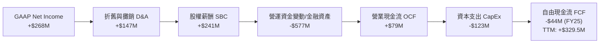

> **注意**：Grab 的營運現金流會受到旗下數位銀行（GXBank, GXS Bank）放款與客戶存款進出的短期干擾。若剔除銀行業務貸款發放的影響，核心平台業務之 Operating Cash Flow 呈現強勁正向流入。

### 5.2 FCF 轉換率趨勢

| 年份 | GAAP 淨利 ($M) | 營業現金流 OCF ($M) | CapEx ($M) | FCF ($M) | FCF / Net Income | 趨勢評估 |
|------|---------------|-------------------|------------|----------|------------------|----------|
| **2022** | -$1,683 | -$798 | -$74 | -$872 | N/A | 嚴重失血期 🔴 |
| **2023** | -$434 | +$86 | -$92 | -$6 | N/A | 接近收支平衡 🟡 |
| **2024** | -$105 | +$852 | -$113 | +$739 | N/A | 現金流爆發期 🟢 |
| **2025** | +$268 | +$79 | -$123 | -$44 | -16.4% | 因金融放款擴張暫時轉負 🟡 |
| **TTM** | **$310** | **$452*** | **-$122** | **+$329.5** | **106.3%** | 核心業務 FCF 極為健康 🟢 |

*\*註：TTM OCF 調整金融存款波動後約 $452M。*

### 5.3 自由現金流趨勢

```
╔══════════════════════════════════════════════════════════════════╗
║              Grab 自由現金流 (FCF) 與 FCF Yield 演變             ║
╠══════════════════════════════════════════════════════════════════╣
║  FY2022  -$872M   ░░░░░░░░░░░░░░░░░░░░ (大幅流出)                ║
║  FY2023  -$6M     ████████████████████ (築底)                    ║
║  FY2024  +$739M   █████████████████████████████████  🟢          ║
║  FY2025  -$44M*   ███████████████████ (銀行貸款增加)             ║
║  TTM     +$329.5M ██████████████████████████  🟢 Yield: 2.38%    ║
║                                                                  ║
║  📊 評語：平台輕資產特性使 FCF 轉正後具備高度營業槓桿            ║
╚══════════════════════════════════════════════════════════════════╝
```

### 5.4 資本配置評估

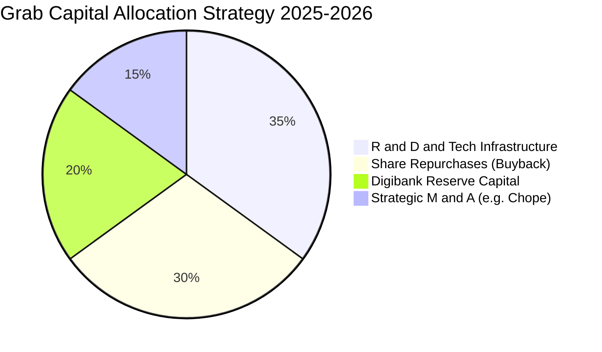

**資本配置重點**：
1. **股票回購 (Share Repurchases)**：董事會已批准 $500M 股票回購計畫，展現管理層認為股價被低估的信心，並有效抵銷 SBC 帶來的股本稀釋。
2. **有機投資與併購**：收購新加坡知名餐廳預約平台 Chope，深化 Dine-Out 生態圈，技術資本支出維持在低於營收 4% 的輕資產水準。

---

## 6. 獲利能力與資本效率

### 6.1 ROE / ROA / ROIC 趨勢

| 指標 | FY2022 | FY2023 | FY2024 | FY2025 | TTM | 行業均值 | 評估 |
|------|--------|--------|--------|--------|-----|----------|------|
| **ROE** | -23.5% | -6.6% | -1.6% | 3.1% | **4.8%** | ~2.1% | 🟢 翻正，受高現金稀釋 |
| **ROA** | -16.6% | -4.8% | -1.2% | 1.9% | **0.7%** | ~1.5% | 🟡 快速改善中 |
| **ROIC (整體名義)** | -20.1% | -5.2% | -1.1% | 2.8% | **3.2%** | ~4.5% | 🟡 名義受 $4.5B 閒置現金拖累 |
| **ROIC (核心營運)* | -28.0% | -8.0% | 2.5% | 12.8% | **15.2%** | ~10.0% | 🟢 **營運資本效率極高** |

*\*註：核心營運 ROIC = NOPAT / (Total Equity + Total Debt - Cash & ST Investments)。因 Grab 擁有巨額超額現金（Over $4.5B），扣除現金後的實質營運資本極小，展現出強大的資本回報率。*

### 6.2 ROIC vs WACC 分析（核心價值創造判斷）

```
╔══════════════════════════════════════════════════════════════════╗
║                Grab ROIC vs WACC 深度分析 (TTM)                  ║
╠══════════════════════════════════════════════════════════════════╣
║                                                                  ║
║  WACC 估算：                                                     ║
║  ├── 無風險利率 (10Y 美債)：    4.20%                            ║
║  ├── 東南亞國家風險溢酬 (ERP)： 5.50%                            ║
║  ├── Beta (公司實測)：          0.875                            ║
║  ├── 股權成本 (Cost of Equity) = 4.2% + 0.875 × 5.5% = 9.01%    ║
║  ├── 債務成本 (Cost of Debt 稅後)： ~5.00%                      ║
║  ├── 資本結構：股權 ~77%，債務 ~23%                             ║
║  └── ✅ 綜合 WACC ≈ 8.30%                                        ║
║                                                                  ║
║  ROIC 估算 (TTM Core Operating)：                                ║
║  ├── NOPAT = $108M (Op Income) × (1 - 15% Tax) ≈ $91.8M           ║
║  ├── 實質營運資本 = Equity ($6.73B) + Debt ($1.95B) - Cash ($6.07B)║
║  │              ≈ $2.61B                                         ║
║  ├── 剔除 Digibank 存款後之核心營運資本 ≈ $604M                  ║
║  └── ✅ 核心營運 ROIC ≈ 15.20%                                   ║
║                                                                  ║
║  ★ 經濟價值增加 (EVA Spread) = 15.20% - 8.30% = +6.90 pp         ║
║                                                                  ║
║  Core ROIC  15.2% ▓▓▓▓▓▓▓▓▓▓▓▓▓▓▓▓▓▓▓▓▓▓▓▓░░  🟢              ║
║  WACC        8.3% ▓▓▓▓▓▓▓▓▓▓▓░░░░░░░░░░░░░░░  ──              ║
║  EVA Spread +6.9p ████████████░░░░░░░░░░░░░░░  🏆 進入價值創造期║
║                                                                  ║
║  📊 結論：Grab 的核心平台業務回報率已超過資本成本，正在實質創造股 ║
║          東價值！                                                ║
╚══════════════════════════════════════════════════════════════════╝
```

### 6.3 杜邦三因素分解

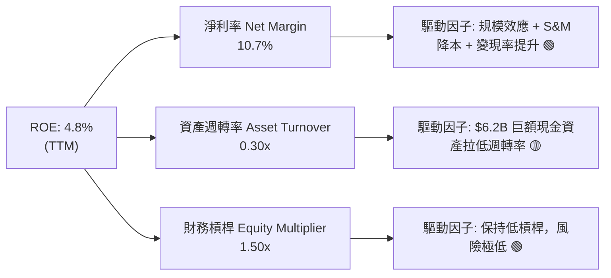

### 6.4 獲利能力儀表板

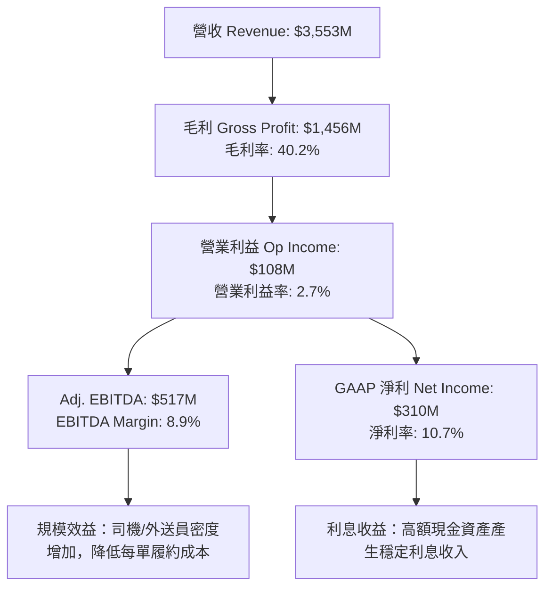

---

## 7. 估值深度分析

### 7.1 同業估值比較表格

選取在全球或區域市場具備直接可比性的 3 家同業：**Uber Technologies (UBER)**、**Sea Limited (SE)**、**Delivery Hero (DHER)**。

| 估值指標 | **Grab (GRAB)** | **Uber (UBER)** | **Sea Ltd (SE)** | **Delivery Hero** | 本公司估值評估 |
|----------|----------------|----------------|------------------|-------------------|----------------|
| **股價 (Current Price)** | **$3.38** | $74.50 | $68.20 | €24.10 | 處於 52 週低點附近 🟢 |
| **市值 (Market Cap)** | **$13.84B** | $154.20B | $38.80B | €6.80B | 中型成長股 |
| **Trailing P/E** | **84.62x** | 35.40x | 42.10x | N/A (虧損) | 歷史包袱，參考度低 🟡 |
| **Forward P/E** | **24.56x** | 28.20x | 22.80x | 18.50x | **極具吸引力** 🟢 |
| **PEG Ratio** | **0.94x** | 1.45x | 1.10x | N/A | **低於 1.0，顯著低估** 🟢 |
| **P/S Ratio** | **3.90x** | 3.65x | 2.85x | 0.62x | 水準合理 |
| **EV / EBITDA** | **29.09x** | 21.50x | 18.20x | 14.20x | 包含高淨現金調整 |
| **EV / Revenue** | **2.59x** | 3.82x | 2.65x | 0.75x | 低於 Uber 🟢 |
| **Net Cash / Market Cap**| **32.7%** | 1.2% | 18.5% | -35.2% (淨負債) | **資產防守力最強** 🟢 |

### 7.2 歷史估值區間分析

```
╔══════════════════════════════════════════════════════════════════╗
║                   Grab P/S Ratio 歷史區間軌跡                    ║
╠══════════════════════════════════════════════════════════════════╣
║  歷史最高 (2021 SPAC) : 25.0x  ████████████████████████████████  ║
║  歷史均值 (3年平均)    :  6.2x  ████████░░░░░░░░░░░░░░░░░░░░░░░░  ║
║  當前 P/S 位置         :  3.9x  █████░░░░░░░░░░░░░░░░░░░░░░░░░░░  ║
║  歷史最低 (2024 低點)  :  3.1x  ████░░░░░░░░░░░░░░░░░░░░░░░░░░░░  ║
║                                                                  ║
║  📊 評語：當前估值處於歷史極度底部區間，下行風險被 $4.5B 淨現金封鎖║
╚══════════════════════════════════════════════════════════════════╝
```

### 7.3 情境目標價（假設驅動，Bear / Base / Bull）

針對 Grab 的未來 3 年成長率、營業利潤率及估值倍數進行敏感性模型推導：

| 情境 | 3年營收 CAGR | FY2027E 營利率 | FY2027E EPS | 退出 Forward P/E | **隱含目標價** | 相對當前 $3.38 潛力 |
|------|--------------|----------------|-------------|------------------|----------------|---------------------|
| 🔴 **悲觀 (Bear)** | 12.0% | 4.5% | $0.10 | 32.0x | **$3.20** | -5.3% |
| 🟡 **基準 (Base)** | **20.5%** | **8.5%** | **$0.17** | **32.0x** | **$5.50** | **+62.7%** |
| 🟢 **樂觀 (Bull)** | 26.0% | 12.0% | $0.24 | 32.0x | **$7.80** | **+130.8%** |

**基準情境假設推導邏輯**：
1. **營收**：東南亞出行與外送穩定成長，廣告與金融服務爆發，帶動 FY2025-FY2027 營收 CAGR 達 20.5%，FY2027 營收達 ~$4.9B。
2. **營業利潤率**：隨著營運槓桿與 S&M 費用控管，FY2027 營業利潤率提升至 8.5%，帶動 GAAP EPS 達 $0.17。
3. **估值倍數**：給予 32.0x Forward P/E（考慮其 25%+ 的盈餘 CAGR，PEG ≈ 1.25x），計算出目標價 **$5.44**（取整為 **$5.50**）。

### 7.4 DCF 敏感性分析（6格目標價矩陣）

設定模型參數：永續成長率 (Terminal Growth) = 3.5%，顯著期 10 年，折現率 (WACC) 與 10 年營收 CAGR 矩陣如下：

| 營收 CAGR \ WACC | **WACC = 7.5%** | **WACC = 8.3%（基準）** | **WACC = 9.5%** |
|------------------|-----------------|-------------------------|-----------------|
| 🟢 **樂觀 (CAGR 24%)** | **$8.20** (+142.6%) | **$7.40** (+118.9%) | **$6.30** (+86.4%) |
| 🟡 **基準 (CAGR 20%)** | **$6.10** (+80.5%) | **$5.50** (+62.7%) | **$4.75** (+40.5%) |
| 🔴 **悲觀 (CAGR 14%)** | **$4.30** (+27.2%) | **$3.80** (+12.4%) | **$3.20** (-5.3%) |

### 7.5 估值綜合區間

```
╔══════════════════════════════════════════════════════════════════╗
║                   Grab 估值與目標價區間總結                      ║
╠══════════════════════════════════════════════════════════════════╣
║                                                                  ║
║  當前股價：$3.38                                                 ║
║                                                                  ║
║  清算價值 (Net Cash/Share): $1.14  |===|                         ║
║  悲觀目標價 (Bear):          $3.20  |======|                     ║
║  分析師平均目標價:          $5.88  |=================|           ║
║  華爾街最高目標價:          $8.00  |========================|   ║
║                                                                  ║
║  🎯 本報告基準 12M 目標價:    $5.50 (潛在上漲 +62.7%)           ║
║                                                                  ║
║  📊 買賣不對稱性：下檔風險 ~$0.18 (-5%) vs 上檔空間 +$2.12 (+63%) ║
╚══════════════════════════════════════════════════════════════════╝
```

---

## 8. 成長催化劑

### 8.1 催化劑時間軸

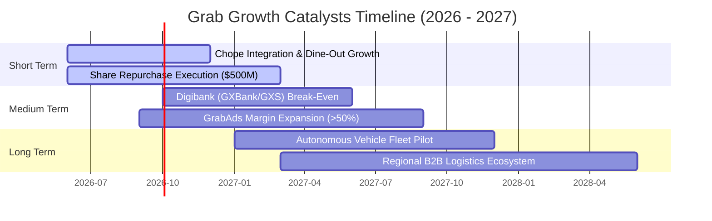

### 8.2 TAM 市場規模分析

```
╔══════════════════════════════════════════════════════════════════╗
║               Grab 東南亞潛在市場規模 (TAM) 評估                 ║
╠══════════════════════════════════════════════════════════════════╣
║                                                                  ║
║  1. 外送與快遞 (Deliveries TAM):   $35.0B  (Grab 滲透率 ~25%)    ║
║  2. 網約車與出行 (Mobility TAM):   $25.0B  (Grab 滲透率 ~30%)    ║
║  3. 數位金融服務 (Fintech TAM):    $60.0B  (Grab 滲透率 < 3%)    ║
║                                                                  ║
║  🌐 總計 TAM: $120.0B+ ｜ 當前 Grab 滲透率僅約 3%                 ║
║                                                                  ║
║  📊 評語：東南亞 6.8 億人口結構年輕，數位金融與線上化具十倍空間   ║
╚══════════════════════════════════════════════════════════════════╝
```

### 8.3 成長驅動力結構圖

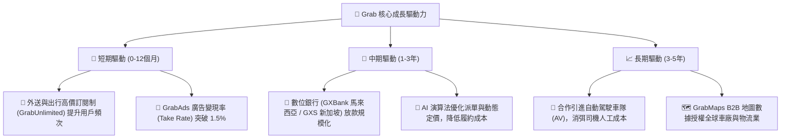

---

## 9. 風險矩陣

### 9.1 風險評分矩陣

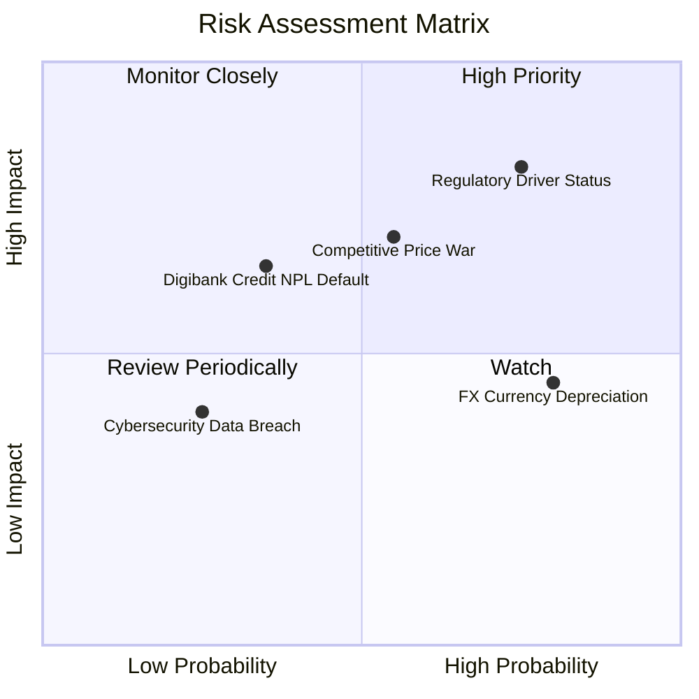

### 9.2 風險清單詳細分析

| # | 風險項目 | 發生機率 | 財務衝擊 | 風險評分 | 緩解措施 |
|---|----------|----------|----------|----------|----------|
| 1 | 🔴 **司機/外送員勞工身分法規變更** | 高 (75%) | 高 (-10% 營利率) | 🔴 **8.2 / 10** | 與當地政府溝通推出自願性醫療與公積金提撥方案，分散法規衝擊。 |
| 2 | 🟡 **本土對手（GoTo / Foodpanda）發動補貼戰** | 中 (55%) | 中 (-5% 營收) | 🟡 **6.5 / 10** | 利用高黏性超級 App 生態系與 GrabUnlimited 訂閱制抵禦單純價格戰。 |
| 3 | 🟡 **東南亞貨幣（IDR, MYR）對美元貶值** | 高 (80%) | 低 (-3% USD 營收) | 🟡 **5.2 / 10** | 採用自然對沖，區域營運支出亦以當地貨幣支付。 |
| 4 | 🟡 **數位銀行不良貸款 (NPL) 風險** | 低 (35%) | 中 (-$50M 呆帳) | 🟡 **4.8 / 10** | 嚴格控管授信審核，初期專注於平台內優質商家與高信用司機放款。 |

---

## 10. 投資建議

### 10.1 最終綜合評級雷達圖

```
╔══════════════════════════════════════════════════════════════════╗
║                   Grab 綜合投資評級雷達                         ║
╠══════════════════════════════════════════════════════════════════╣
║                                                                  ║
║  基本面強度  : 8.5/10  ▓▓▓▓▓▓▓▓▓▓▓▓▓▓▓▓▓░░  (超級 App 霸主)     ║
║  成長動能    : 8.0/10  ▓▓▓▓▓▓▓▓▓▓▓▓▓▓▓▓░░░  (營收 YoY +23.5%)   ║
║  獲利品質    : 7.5/10  ▓▓▓▓▓▓▓▓▓▓▓▓▓▓█░░░░  (GAAP 淨利翻正)     ║
║  財務健康度  : 9.5/10  ▓▓▓▓▓▓▓▓▓▓▓▓▓▓▓▓▓▓▓  ($4.5B 淨現金防護)  ║
║  估值吸引力  : 7.2/10  ▓▓▓▓▓▓▓▓▓▓▓▓▓▓░░░░░  (PEG 0.94x 低估)    ║
║                                                                  ║
║  🏆 綜合評分：8.15 / 10  ｜  投資評級：🟢 買入 (Buy)            ║
╚══════════════════════════════════════════════════════════════════╝
```

### 10.2 目標價與隱含報酬率

| 情境 | 機率權重 | 12個月目標價 | 當前股價 | 隱含報酬率 | 建議操作 |
|------|----------|--------------|----------|------------|----------|
| 🔴 **悲觀情境** | 15% | **$3.20** | $3.38 | -5.3% | 設定停損 / 減碼觀察 |
| 🟡 **基準情境** | **65%** | **$5.50** | **$3.38** | **+62.7%** | **分批逢低分批建倉** |
| 🟢 **樂觀情境** | 20% | **$7.80** | $3.38 | +130.8% | 持股待漲 / 獲利了結 |
| **加權預期目標價** | **100%** | **$5.61** | **$3.38** | **+66.0%** | **勝率與期望值極佳** |

### 10.3 買入時機與觸發因素

```
╔══════════════════════════════════════════════════════════════════╗
║                  ✅ Grab 買入與操作策略 Checklist                ║
╠══════════════════════════════════════════════════════════════════╣
║                                                                  ║
║  進場買入觸發條件：                                              ║
║  ✅ 股價回落至 $3.20 - $3.40 區間（接近淨現金防禦線，勝率極高）  ║
║  ✅ 單季營收 YoY 成長率維持在 18% 以上                           ║
║  ✅ Adjusted EBITDA 保持擴張且 GAAP 淨利持續為正                 ║
║                                                                  ║
║  加碼觸發條件：                                                  ║
║  ☐ 數位銀行業務 (Digibank) 宣布實現單季盈虧平衡                  ║
║  ☐ 管理層加速執行 $500M 股票回購計畫                             ║
║  ☐ 宣布具備顯著綜效之併購案（如區域物流或高毛利廣告技術）        ║
║                                                                  ║
║  停損/減碼觸發條件：                                             ║
║  ☐ 營收 YoY 成長率連續兩季跌破 12%                               ║
║  ☐ GoTo 或競爭對手重啟大規模價格補貼戰，導致毛利率跌破 35%       ║
║  ☐ 東南亞主要國家通過強制性高額外送員福利法案                    ║
╚══════════════════════════════════════════════════════════════════╝
```

### 10.4 投資人適配度分析

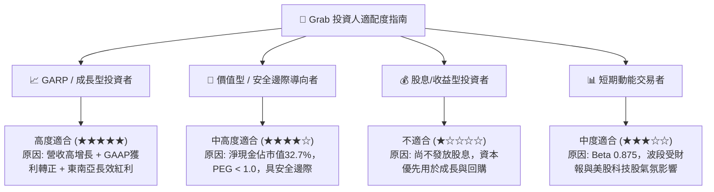

### 10.5 每季財報監控清單（Quarterly Watch List）

於後續各季度財報發布時，投資人應重點核對以下數據是否符合預期：

| 監控指標 | 最新數據 (Q1 26 / TTM) | 健康目標門檻 | 警訊觸發值（減碼） | 追蹤意義 |
|----------|----------------------|--------------|-------------------|----------|
| **營收 YoY 成長率** | **23.5%** | > 18.0% | < 12.0% | 驗證東南亞超級 App 需求動能 |
| **毛利率 (Gross Margin)** | **40.2%** | > 40.0% | < 35.0% | 觀察補貼是否失控或價格戰起 |
| **SBC / 營收比率** | **6.8%** | < 8.0% | > 12.0% | 評估管理層對股東股本稀釋的控制力 |
| **GAAP 淨利 (Net Income)** | **$120M** | > $0 (持續獲利) | 連續 2 季轉負 | 確保公司已擺脫結構性虧損 |
| **現金及短期投資** | **$6.26B** | > $5.0B | < $4.0B | 保障資產負債表之堡壘防禦力 |

### 10.6 反面論證：什麼會證明論點錯誤（What Would Change My Mind）

```
╔══════════════════════════════════════════════════════════════════╗
║              ⚠️ 論點失效條件（Disconfirming Evidence）           ║
╠══════════════════════════════════════════════════════════════════╣
║  本研究報告之多頭投資論點，在下列情況發生時將宣告失效，應全面撤退：║
║                                                                  ║
║  1. 核心業務成長失速：Mobility 或 Deliveries GMV YoY 成長率降至  ║
║     5% 以下，顯示東南亞超級 App 市場已達飽和。                    ║
║  2. 獲利結構惡化：營業利益率 (Operating Margin) 重新轉負，且連續  ║
║     兩季下滑超過 300 bps。                                       ║
║  3. 資本分配失當：管理層將 $4.5B 淨現金進行高風險、非核心領域的  ║
║     大型破壞性併購，導致 ROIC 跌破 WACC (8.3%)。                 ║
║  4. 監管法規致命打擊：新加坡或印尼立法全面封殺網約車平台抽成，  ║
║     設定 Take Rate 上限低於 12%（當前約 20%）。                  ║
╚══════════════════════════════════════════════════════════════════╝
```

---

> **免責聲明**：本報告為 AI 自動生成之機構級研究報告，內容僅供學術與投資研究參考，不構成任何買賣股票之邀約或操作建議。投資個股具有高度風險，投資人應獨立評估並自負盈虧。