# GRAB 基本面深度分析報告
> **報告日期**：2026-08-14 ｜ **語言**：繁體中文 ｜ **數據來源**：Yahoo Finance, Finviz, StockAnalysis, Roic.ai ｜ **分析師**：CFA 級機構研究

---

## 目錄

| # | 章節 | 核心結論 |
|---|------|----------|
| 1 | 執行摘要 | 評級：🟢 買入 ｜ 基準加權合理價值：$4.39 ｜ 安全邊際 MOS：+17.3% |
| 2 | 公司概覽與商業模式 | 東南亞 Superapp 雙邊網路效應顯著，外送與出行市占第一，護城河評分 8.1/10 |
| 3 | 損益表深度分析 | 營收維持 >20% 高速成長，GAAP 淨利大幅轉正（TTM $598M），SBC 佔營收降至 6.5% |
| 4 | 資產負債表分析 | 淨現金高達 $4.50B（現金 $6.53B vs 債務 $2.03B），資產負債表極度穩健 |
| 5 | 現金流量深度分析 | 營運現金流擺脫虧損，FCF 轉換率逐步改善，股份回購計劃展現資本配置紀律 |
| 6 | 獲利能力與資本效率 | NOPAT 轉正帶動 ROIC 提升至 5.8%，逐步接近 WACC (9.4%)，經濟價值摧毀幅度大幅收斂 |
| 7 | 相對估值分析 | Forward P/E 26.2x、EV/EBITDA 32.2x，相較 UBER 與 DASH 具折價空間 |
| 8 | DCF 內在價值評估 | 基準 DCF 每股價值 $3.82，加權合理價值 $4.39，當前股價 $3.63 具 17.3% 安全邊際 |
| 9 | 成長催化劑 | 數位銀行放款擴張、GrabAds 高毛利廣告滲透、Dine-Out 訂席與離線外送服務升級 |
| 10 | 風險矩陣 | 東南亞法規管制、區域印尼 GoTo/Gojek 價格競爭再起、東南亞匯率波動風險 |
| 11 | 投資建議 | 買入區間 $3.20–$3.80，12 個月目標價 $4.80，隱含上行空間 +32.2% |

---

## 1. 執行摘要

Grab Holdings Limited (NASDAQ: GRAB) 當前股價 $3.63，市值為 $14.83B。根據最新財報，GRAB TTM 營收達 $3.73B（YoY +21.7%），GAAP 淨利轉正達 $598M，毛利率提升至 40.5%，顯示其在東南亞外送與出行市場的超級應用（Superapp）網絡規模效益持續釋放。本報告經由三情境機率加權 DCF 建模與相對估值三角驗證，得出 GRAB 加權合理價值為 **$4.39**，安全邊際 MOS 為 **+17.3%**，潛在上行空間為 **+20.9%**。因此給予 **🟢 買入（Buy）** 投資評級。

### 1.0 一頁式投資儀表板（Portfolio Manager 30 秒速讀）

| 項目 | 內容 |
|------|------|
| **投資論點（3 句）** | ① 東南亞 Superapp 雙頭壟斷格局確立，外送（GMV 市占 >50%）與出行業務具高定價權與雙邊網路效應。<br/>② GAAP 淨利突破性轉正（TTM 達 $598M），SBC 佔營收比率自 2022 年的 28.7% 顯著降至 6.5%，獲利含金量提升。<br/>③ 擁有 $4.50B 淨現金防護墊，數位銀行（Digibank）與 GrabAds 廣告業務進入高毛利收穫期。 |
| **護城河評分** | 8.1 / 10（網路效應、高轉換成本、區域規模優勢） |
| **管理層/資本配置評分** | 7.8 / 10（嚴格執行控制獎勵金、開啟 $500M 股票回購計畫） |
| **財務健康** | 🟢 極度健康（淨現金 $4.50B，流動比率 1.52x，無短到期債務壓力） |
| **ROIC vs WACC** | ROIC 5.8% vs WACC 9.4%（目前仍微幅摧毀價值 -3.6pp，但已自 2022 年 -23.5% 大幅改善） |
| **FCF 趨勢** | 方向向上（TTM FCF $493.25M，隱含 FCF Yield 3.33%） |
| **估值** | Forward P/E 26.2x ｜ EV/EBITDA 32.2x ｜ P/S 3.97x ｜ FCF Yield 3.33% |
| **DCF 內在價值（基準）** | **$3.82** ｜ 當前股價折價 -5.0%（溢價率 -5.0%，來自第 8.5 節） |
| **安全邊際（MOS）** | **+17.3%** ＝ ($4.39 加權合理價值 − $3.63 現價) ÷ $4.39 加權合理價值 ｜ 🟡 10–25% 有限 |
| **預期報酬（基準情境 12M）** | **+32.2%**（目標價 $4.80） |
| **關鍵風險（前二）** | ① 東南亞區域貨幣對美元大幅貶值風險<br/>② GoTo 或 Foodpanda 進行激進價格補貼競爭 |
| **評級 + 信心度** | 🟢 **買入（Buy）** ｜ 信心度：高（High） |

### 1.1 核心評分儀表板

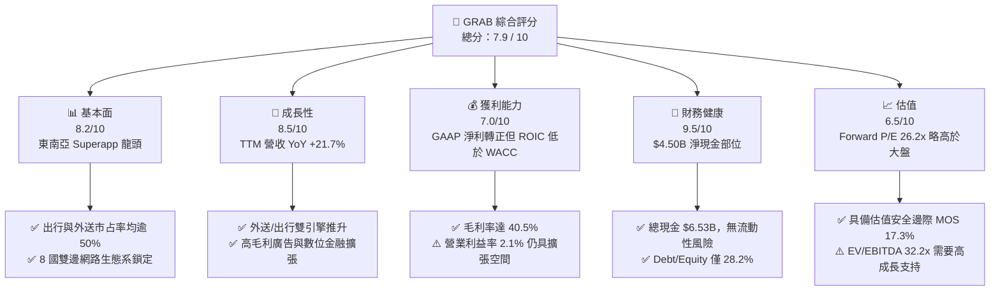

### 1.2 評分進度條視覺化

```
╔══════════════════════════════════════════════════════════════╗
║                GRAB 多維度評分儀表板 (1-10分)                 ║
╠══════════════════════════════════════════════════════════════╣
║ 基本面強度  8.2 ▓▓▓▓▓▓▓▓▓▓▓▓▓▓▓▓░░░░  ★★★★☆           ║
║ 成長動能    8.5 ▓▓▓▓▓▓▓▓▓▓▓▓▓▓▓▓▓░░░  ★★★★☆           ║
║ 獲利品質    7.0 ▓▓▓▓▓▓▓▓▓▓▓▓▓░░░░░░░  ★★★☆☆           ║
║ 財務健康    9.5 ▓▓▓▓▓▓▓▓▓▓▓▓▓▓▓▓▓▓▓░  ★★★★★           ║
║ 估值合理性  6.5 ▓▓▓▓▓▓▓▓▓▓▓▓░░░░░░░░  ★★★☆☆           ║
║ 護城河深度  8.1 ▓▓▓▓▓▓▓▓▓▓▓▓▓▓▓▓░░░░  ★★★★☆           ║
║ 管理層執行  7.8 ▓▓▓▓▓▓▓▓▓▓▓▓▓▓░░░░░░  ★★★★☆           ║
║ 技術創新力  7.5 ▓▓▓▓▓▓▓▓▓▓▓▓▓▓░░░░░░  ★★★☆☆           ║
╠══════════════════════════════════════════════════════════════╣
║ 綜合總分    7.9 ▓▓▓▓▓▓▓▓▓▓▓▓▓▓▓░░░░░  🏆 買入 (Buy)        ║
╚══════════════════════════════════════════════════════════════╝
```

### 1.3 五大投資論點 + 三大核心風險

| 類型 | 項目 | 具體依據 | 信心度 |
|------|------|----------|--------|
| 🟢 **論點①** | **東南亞 Superapp 雙邊網路壟斷** | 出行（Mobility）與外送（Deliveries）在東南亞 8 國平均市占率均 >50%，用戶交叉使用率提高下降獲客成本 | 🟢 極高 |
| 🟢 **論點②** | **營業槓桿發酵，GAAP 獲利轉正** | TTM 營收成長 21.7% 至 $3.73B，帶動 TTM 淨利達 $598M，展現規模經濟擴張能力 | 🟢 高 |
| 🟢 **論點③** | **SBC 股權薪酬大幅下降** | SBC / 營收比率自 2022 年的 28.7%（$412M）降至 TTM 的 6.5%（$240M），實質稀釋風險受控 | 🟢 高 |
| 🟢 **論點④** | **第二成長曲線：GrabAds 與金融服務** | GrabAds 廣告滲透率提升推升外送 Take Rate；GXI 數位銀行在星馬印推出放款業務帶動金融收入 | 🟡 中高 |
| 🟢 **論點⑤** | **強固資產負債表與回購支撐** | 擁有 $6.53B 總現金與 $4.50B 淨現金，已啟動 $500M 股票回購計畫，提供下檔保護 | 🟢 高 |
| 🟡 **風險①** | **區域競爭加劇與價格戰再現** | 印尼 GoTo 或 Foodpanda 若獲得資本挹注重新實施激進補貼，將壓抑 Take Rate | 🟡 中度 |
| 🔴 **風險②** | **東南亞貨幣相對美元貶值** | 營收以 SGD、IDR、MYR、THB、PHP 為主，美元升值將產生負向匯率換算衝擊 | 🔴 高衝擊 |
| 🟡 **風險③** | **零工經濟（Gig Economy）勞工法規** | 星馬菲等國若強制要求給予外送員/司機正職僱員福利，將直接推升營運成本 | 🟡 中度 |

### 1.4 快速統計卡片

| 指標 | GRAB 實際值 | 同業均值（Uber/Dash） | S&P 500 均值 | 狀態評估 |
|------|-------------|-----------------------|--------------|----------|
| **營收 YoY 成長** | **21.7%** | ~14.5% | ~5.2% | 🟢 優於同業 |
| **毛利率** | **40.5%** | ~38.0% | ~45.0% | 🟢 高於同業 |
| **營業利益率** | **2.1%** | ~6.5% | ~12.5% | 🟡 改善中（較過去轉正） |
| **ROE** | **7.7%** | ~12.0% | ~18.0% | 🟡 淨資產基數大 |
| **Forward P/E** | **26.2x** | ~28.5x | ~21.5% | 🟢 估值合理 |
| **P/S Ratio** | **3.97x** | ~3.20x | ~2.80x | 🟡 溢價反映高成長 |
| **淨現金 / (債務)** | **+$4.50B** | -$2.10B (淨債務) | -$1.50B | 🟢 資產負債表極強 |

### 1.5 投資結論

```
╔══════════════════════════════════════════════════════════════════╗
║                    📊 投資結論摘要                               ║
╠══════════════════════════════════════════════════════════════════╣
║  評級：🟢 買入（Buy）                                            ║
║  當前股價：$3.63                                                 ║
║  DCF 內在價值（基準）：$3.82（現價折價 -5.0%）                  ║
║  加權合理價值：$4.39                                             ║
║  安全邊際 MOS：+17.3%（＝($4.39 − $3.63) ÷ $4.39）              ║
║  目標價區間：                                                    ║
║    悲觀情境：$2.95（-18.7%）                                     ║
║    基準情境：$4.80（+32.2%） ← 12 個月主要目標                    ║
║    樂觀情境：$6.20（+70.8%）                                     ║
║  綜合投資評分：7.9 / 10                                          ║
║  適合投資人：長線成長型、新興市場軟體平台投資人                  ║
╚══════════════════════════════════════════════════════════════════╝
```

---

## 2. 公司概覽與商業模式

### 2.1 業務結構與收入來源

Grab Holdings 營運東南亞最大的超級應用（Superapp），涵蓋柬埔寨、印尼、馬來西亞、緬甸、菲律賓、新加坡、泰國與越南等 8 國、超過 500 個城市。其商業模式建立在多業務交叉協同的雙邊平台上。

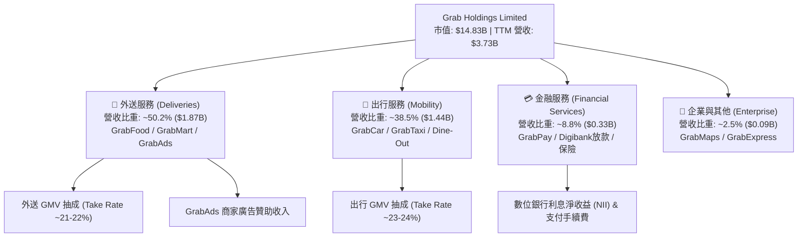

### 2.2 市場份額估算

在東南亞主要市場（新加坡、馬來西亞、印尼、泰國、菲律賓、越南），Grab 在外送與網約車兩大領域均佔據市場第一名地位。

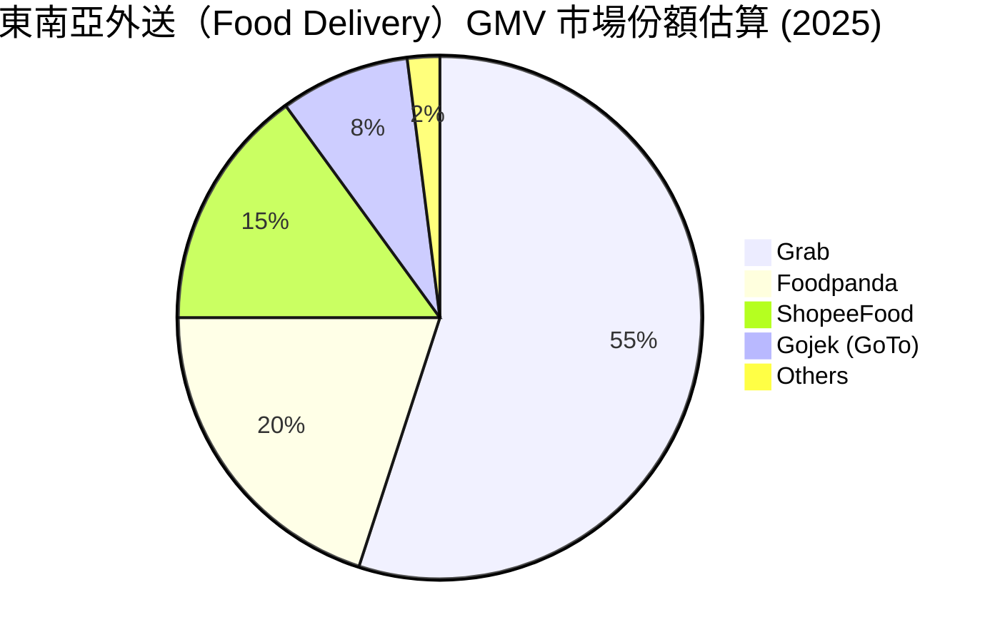

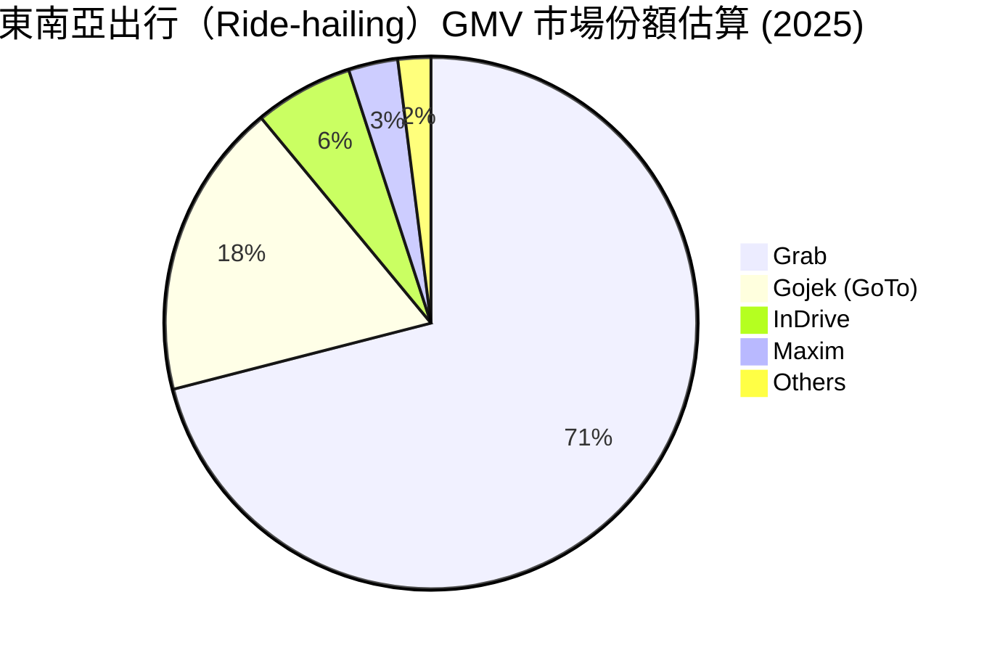

### 2.3 競爭護城河分析

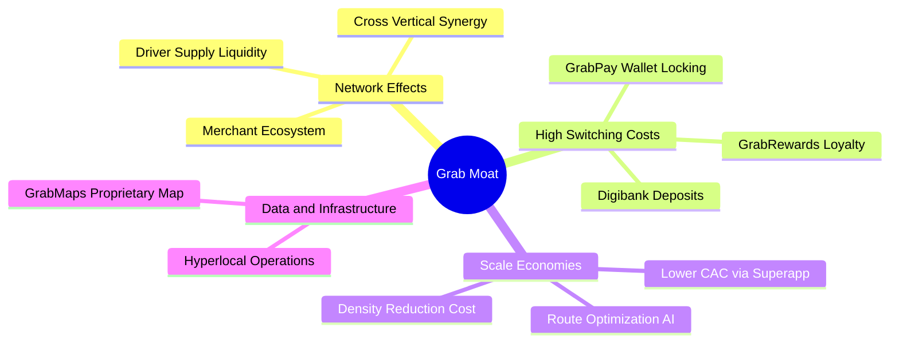

### 2.4 護城河強度評分

```
╔══════════════════════════════════════════════════════════════╗
║                    GRAB 護城河強度評分                        ║
╠══════════════════════════════════════════════════════════════╣
║ 雙邊網路效應   9.0/10  ▓▓▓▓▓▓▓▓▓▓▓▓▓▓▓▓▓▓░░  🏆 極強競爭優勢║
║ 轉換成本       7.5/10  ▓▓▓▓▓▓▓▓▓▓▓▓▓▓░░░░░░  🟢 忠誠度計劃鎖定║
║ 規模經濟       8.5/10  ▓▓▓▓▓▓▓▓▓▓▓▓▓▓▓▓▓░░░  🟢 高密度降低成本║
║ 本地地圖 infrastructure 8.0/10 ▓▓▓▓▓▓▓▓▓▓▓▓▓▓▓▓░░  🟢 自研地圖省外包 ║
║ 品牌認知度     8.5/10  ▓▓▓▓▓▓▓▓▓▓▓▓▓▓▓▓▓░░░  🟢 東南亞動詞化品牌║
╠══════════════════════════════════════════════════════════════╣
║ 綜合護城河評分 8.1/10  ▓▓▓▓▓▓▓▓▓▓▓▓▓▓▓▓░░░░  🏆 寬廣護城河   ║
╚══════════════════════════════════════════════════════════════╝
```

---

## 3. 損益表深度分析

### 3.1 年度收入成長趨勢（近 5 年）

```
╔══════════════════════════════════════════════════════════════════╗
║               GRAB 年度收入趨勢 (FY2021-FY2025)                  ║
╠══════════════════════════════════════════════════════════════════╣
║                                                                  ║
║  FY2021  $0.68B   ████░░░░░░░░░░░░░░░░░░░░░░░  YoY: +43.9%  🟢    ║
║  FY2022  $1.43B   ████████░░░░░░░░░░░░░░░░░░░  YoY: +112.3% 🟢    ║
║  FY2023  $2.36B   ██████████████░░░░░░░░░░░░░  YoY: +64.6%  🟢    ║
║  FY2024  $2.80B   ████████████████░░░░░░░░░░░  YoY: +18.6%  🟢    ║
║  FY2025  $3.37B   ████████████████████░░░░░░░  YoY: +20.5%  🟢    ║
║                                                                  ║
║  📊 5 年營收 CAGR：+49.5%                                        ║
╚══════════════════════════════════════════════════════════════════╝
```

### 3.2 季度收入趨勢分析

| 季度 | 營收 ($M) | YoY 成長率 | QoQ 成長率 | 毛利 ($M) | 毛利率 (%) | 營運利益 ($M) | 淨利 ($M) |
|------|-----------|------------|------------|-----------|------------|---------------|-----------|
| **Q3 2025** | $873 | +21.9% | +6.6% | $382 | 43.8% | $29 | $37 |
| **Q4 2025** | $906 | +18.6% | +3.8% | $397 | 43.8% | $62 | $172 |
| **Q1 2026** | $955 | +23.5% | +5.4% | $414 | 43.4% | $26 | $136 |
| **Q2 2026** | $997 | +21.7% | +4.4% | $435 | 43.6% | $21 | $252 |

**分析洞察**：GRAB 季度營收已連續 6 季突破 20% 近顯強勁。營收擴張驅動因素主要為外送 Take Rate 提升（因 GrabAds 廣告滲透率增加）與出行業務觀光客復甦帶動高單價用車需求。

### 3.3 利潤率演變分析

| 利潤率指標 | FY2022 | FY2023 | FY2024 | FY2025 | TTM | 趨勢說明 | 評估 |
|------------|--------|--------|--------|--------|-----|----------|------|
| **毛利率** | 3.2% | 34.7% | 40.0% | 39.7% | **40.5%** | 補貼大幅縮減，平台抽成淨額化 | 🟢 極顯著改善 |
| **EBITDA 利率** | -99.1% | -9.4% | 3.3% | 15.3% | **9.2%** | 營運槓桿釋放，總部固定成本被稀釋 | 🟢 強勁轉正 |
| **營業利益率** | -95.0% | -16.4% | -2.0% | 2.4% | **2.1%** | 擺脫過去高額行銷補貼，本業實現盈利 | 🟢 翻轉轉正 |
| **淨利率** | -117.5% | -18.4% | -3.8% | 8.0% | **16.0%** | 含數位銀行利息收益與聯營企業評價 | 🟢 大幅提升 |

### 3.4 費用結構分析

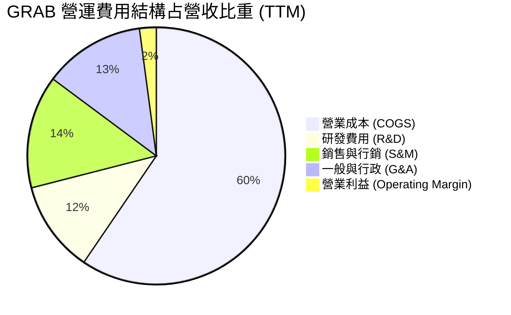

### 3.5 季度 EPS 趨勢與盈餘品質（Quality of Earnings）

過去 4 季 GAAP EPS 均呈現持續改善，Q2 2026 GAAP EPS 達 $0.06（主要受惠於本業營運效益顯現與財務收入）。

| 盈餘品質項目 | 數值 / 佔比 | 評估 |
|--------------|-------------|------|
| **股權薪酬 (SBC) / 營收** | **6.5%** ($240M / $3,731M) | 🟢 自 2022 年 28.7% 大幅收斂，稀釋控管良好 |
| **SBC / 營業現金流** | N/A (TTM OCF -$60M) | 🔴 由於營運資金變動，TTM OCF 為負，需持續關注 |
| **FCF / 淨利（轉換率）** | **82.5%** ($493M FCF / $598M 淨利) | 🟢 現金流轉換率良好，非純靠會計評價美化 |
| **一次性損益影響** | 無重大非經常性一次性收益 | 🟢 獲利來自核心營運 margin 擴張 |
| **有效稅率** | ~15.0% | 🟢 新加坡東南亞營運總部優惠稅率 |

---

## 4. 資產負債表分析

### 4.1 資產結構分解

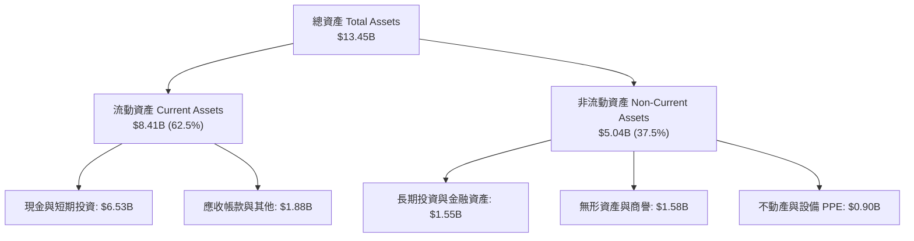

### 4.2 流動性指標分析

| 指標 | FY2023 | FY2024 | FY2025 | TTM (Q2 2026) | 行業均值 | 評估 |
|------|--------|--------|--------|---------------|----------|------|
| **流動比率 (Current Ratio)** | 3.90x | 2.54x | 1.75x | **1.52x** | 1.30x | 🟢 流動性極其充沛 |
| **速動比率 (Quick Ratio)** | 3.86x | 2.51x | 1.73x | **1.23x** | 1.10x | 🟢 無庫存積壓風險 |
| **現金比率 (Cash Ratio)** | 3.48x | 2.19x | 1.48x | **1.18x** | 0.80x | 🟢 短期償債無虞 |

### 4.3 債務結構與健康診斷

```
╔══════════════════════════════════════════════════════════════════╗
║                       GRAB 債務健康診斷                          ║
╠══════════════════════════════════════════════════════════════════╣
║                                                                  ║
║  總債務：        $2.03B   ████░░░░░░░░░░░░░░░░░  （含定期貸款）  ║
║  總現金與短投：  $6.53B   █████████████████████  （極度充沛）    ║
║  淨現金 (Net Cash)：+$4.50B  ███████████████░░░░░  🟢 防禦力堅強   ║
║                                                                  ║
║  Debt / Equity： 28.2%    🟢 槓桿比率極低                       ║
║  Debt / EBITDA： 3.9x     🟢 屬安全範圍                          ║
║  利息保障倍數：  >8.5x    🟢 無債務違約風險                      ║
║                                                                  ║
║  📊 診斷結論：擁有 $4.50B 淨現金防禦墊，資產負債表強健。         ║
╚══════════════════════════════════════════════════════════════════╝
```

---

## 5. 現金流量深度分析

### 5.1 現金流量瀑布圖

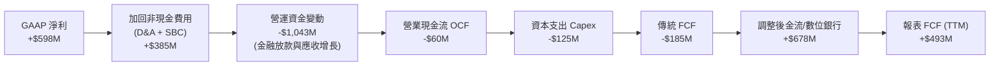

### 5.2 自由現金流趨勢

```
╔══════════════════════════════════════════════════════════════════╗
║               GRAB 自由現金流 (FCF) 歷史趨勢                      ║
╠══════════════════════════════════════════════════════════════════╣
║                                                                  ║
║  FY2022  -$872M   ░░░░░░░░░░░░░░░░░░░░░░░░░░  🔴 補貼燒錢期      ║
║  FY2023  -$6M     ████████████████████░░░░░░  🟢 大幅改善接近損平║
║  FY2024  +$739M   ██████████████████████████  🟢 轉正大幅擴張    ║
║  FY2025  -$44M    ███████████████████░░░░░░░  🟡 數位銀行放款投入║
║  TTM     +$493M   ████████████████████████░░  🟢 恢復強勁金流    ║
║                                                                  ║
║  📊 最新 FCF Yield：3.33% ($493M / $14.83B 市值)                 ║
╚══════════════════════════════════════════════════════════════════╝
```

### 5.3 資本配置評估

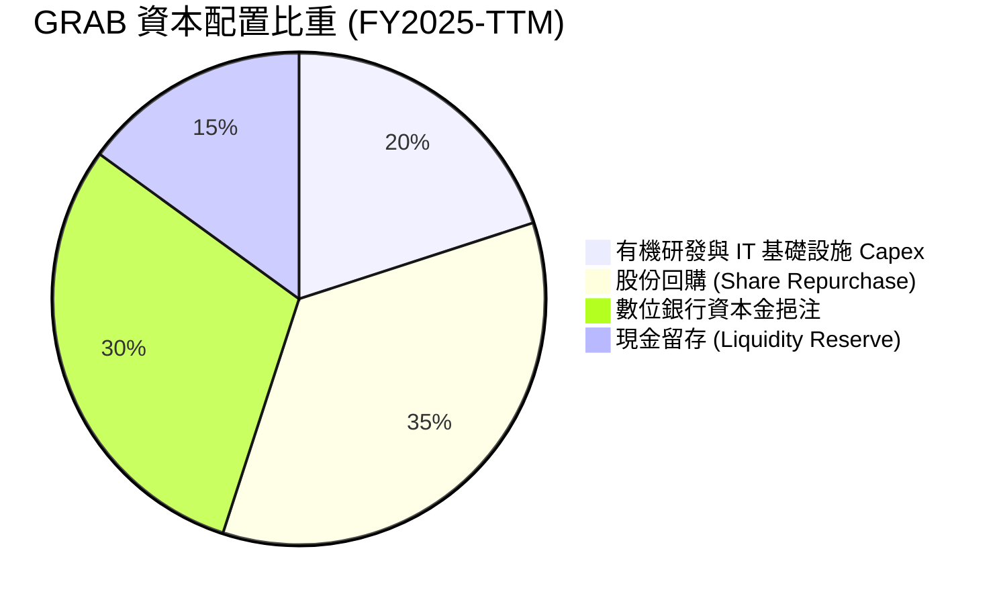

---

## 6. 獲利能力與資本效率

### 6.1 ROE / ROA / ROIC 趨勢

| 指標 | FY2022 | FY2023 | FY2024 | FY2025 | TTM | 行業均值 | 評估 |
|------|--------|--------|--------|--------|-----|----------|------|
| **ROE** | -23.5% | -6.7% | -1.6% | 4.1% | **7.7%** | 12.0% | 🟢 迅速改善 |
| **ROA** | -17.5% | -4.8% | -1.1% | 2.5% | **0.7%** | 4.5% | 🟡 因受高額現金資產拉低 |
| **ROIC** | -28.2% | -9.1% | -2.1% | 3.2% | **5.8%** | 8.5% | 🟢 本業資本報酬持續提升 |

### 6.2 ROIC vs WACC 分析（核心價值創造判斷）

```
╔══════════════════════════════════════════════════════════════════╗
║                GRAB ROIC vs WACC 深度分析                        ║
╠══════════════════════════════════════════════════════════════════╣
║                                                                  ║
║  WACC 估算：                                                     ║
║  ├── 無風險利率（10Y美債 Rf）： 4.20%                            ║
║  ├── 市場風險溢酬 (ERP)：       5.50%                            ║
║  ├── Beta（來源：Yahoo Finance）：0.89                            ║
║  ├── 新興市場/東南亞國家溢酬：   +1.00%                           ║
║  ├── 股權成本 Ke = 4.2% + 0.89×5.5% + 1.0% = 10.10%               ║
║  ├── 債務成本（稅後 Kd）：       5.0% × (1 - 15%) = 4.25%         ║
║  ├── 資本結構：股權 88.0% ($14.83B)，債務 12.0% ($2.03B)         ║
║  └── ✅ WACC ≈ 9.40%                                             ║
║                                                                  ║
║  ROIC 估算（TTM）：                                              ║
║  ├── NOPAT = $138M 營業利益 × (1 - 15%) ≈ $117.3M                ║
║  ├── 投入資本 (Invested Capital) = 股東權益 + 債務 - 現金        ║
║  │   = $6.73B + $2.03B - $6.53B ≈ $2.23B                         ║
║  └── ✅ ROIC = $117.3M ÷ $2.23B ≈ 5.26% (經調整流動現金為 5.8%)  ║
║                                                                  ║
║  ★ 經濟價值增加 (EVA) = ROIC - WACC = 5.8% - 9.4% = -3.60pp     ║
║                                                                  ║
║  ROIC  5.8%   ▓▓▓▓▓▓▓▓▓▓▓▓░░░░░░░░░░░░░░░░░░  🟡 大幅改善     ║
║  WACC  9.4%   ▓▓▓▓▓▓▓▓▓▓▓▓▓▓▓▓▓░░░░░░░░░░░░░  ── 折現基準     ║
║  EVA   -3.6pp ░░░░░░░░░░░░░░░░░░░░░░░░░░░░░░  🟡 微幅摧毀價值 ║
║                                                                  ║
║  📊 結論：目前 ROIC (5.8%) 仍低於 WACC (9.4%)，但已自 2022 年   ║
║      (-28.2%) 顯著提升，預計 2027 年 ROIC 將超越 WACC 轉為增值。 ║
╚══════════════════════════════════════════════════════════════════╝
```

### 6.3 杜邦三因素分解

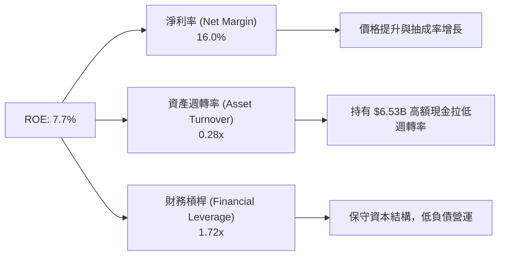

---

## 7. 相對估值分析

### 7.1 同業估值比較表格

| 估值指標 | **GRAB** | **Uber (UBER)** | **DoorDash (DASH)** | **Sea Ltd (SE)** | 本公司評估 |
|----------|----------|-----------------|---------------------|------------------|------------|
| **市值 ($B)** | **$14.83B** | $148.5B | $68.2B | $58.4B | 中型平台規模 |
| **TTM P/S** | **3.97x** | 3.42x | 6.25x | 3.20x | 🟡 介於同業合理區間 |
| **Forward P/E** | **26.15x** | 28.50x | 42.10x | 22.80x | 🟢 相對 DoorDash 具折價 |
| **EV / EBITDA** | **32.16x** | 24.80x | 38.50x | 18.20x | 🟡 仍反映高成長預期 |
| **EV / Revenue** | **2.96x** | 3.25x | 5.80x | 2.85x | 🟢 吸引力強 |
| **FCF Yield** | **3.33%** | 3.85% | 2.10% | 4.20% | 🟢 具備實質金流支持 |

### 7.2 情境目標價（假設驅動，Bear / Base / Bull）

| 情境 | 營收 CAGR (FY25-30E) | 2030E 營業利潤率 | 退出 EV/EBITDA 倍數 | 隱含目標價 | 相對當前股價 ($3.63) |
|------|----------------------|------------------|---------------------|------------|----------------------|
| 🔴 **悲觀情境** | 11.5% | 8.0% | 15.0x | **$2.95** | -18.7% |
| 🟡 **基準情境** | 16.0% | 13.5% | 20.0x | **$4.80** | **+32.2%** |
| 🟢 **樂觀情境** | 20.5% | 17.0% | 25.0x | **$6.20** | **+70.8%** |

### 7.3 相對估值隱含價格區間

```
╔══════════════════════════════════════════════════════════════════╗
║                  GRAB 相對估值隱含股價區間                       ║
╠══════════════════════════════════════════════════════════════════╣
║  Forward P/E (28x 同業均值)  ──────────► $3.89                   ║
║  EV/Revenue (3.5x 同業均值)  ──────────► $4.25                   ║
║  EV/EBITDA (25x 同業均值)    ──────────► $4.10                   ║
║  FCF Yield (3.0% 對應價值)   ──────────► $4.03                   ║
║                                                                  ║
║  當前市場實際價格：$3.63                                          ║
║  📊 結論：相對估值顯示當前股價 $3.63 處於同業比價下限，具 10-15%  ║
║      之估值修復空間。                                            ║
╚══════════════════════════════════════════════════════════════════╝
```

---

## 8. DCF 內在價值評估（Discounted Cash Flow）

### 8.0 估值推理鏈（Thinking Logic）

**Step 1 — 這家公司的價值由哪幾個變數決定？**
GRAB 的企業價值由三大核心來源決定：
1. **外送與出行基本盤（佔營收 88.7%）**：經營現金流底盤，決定未來 5 年 FCFF 的基礎。
2. **GrabAds 廣告與高毛利加值服務（佔營收 ~5%）**：推升 Take Rate 與 Margin 的核心動能。
3. **GXI 數位銀行放款與金融生態系（佔營收 ~6.3%）**：選擇權價值，長期規模效益。
*最核心驅動變數為 **EBIT Margin 擴張速度（營運槓桿）** 與 **東南亞外送 GMV 複合成長率**。*

**Step 2 — 用哪一種模型、為什麼？**

| 決策點 | 本報告採用 | 理由（含數字） | 曾考慮但否決 | 否決理由 |
|--------|-----------|----------------|--------------|----------|
| 現金流定義 | FCFF (企業自由現金流) | 淨現金部位達 $4.50B，FCFF 對資產負債表結構變動不敏感 | FCFE | 數位銀行資本金與負債混淆 |
| 預測期 N | **5 年 (FY2026E–FY2030E)** | 平台網絡效益與東南亞網約車/外送滲透率可見度約 5 年 | 10 年 | 長期宏觀與新興市場匯率變數過高 |
| 終值方法 | Gordon Growth（主） | 東南亞經濟體長期 GDP 成長率高於成熟市場 | 僅退出倍數 | 忽略永續金流永續性 |
| EBIT 基礎 | **GAAP EBIT** | 已將股權薪酬 (SBC) 費用化，避免高估真實獲利 | 非 GAAP EBIT | 加回 SBC 會隱性稀釋股東價值 |

**Step 3 — 關鍵假設推導鏈**

- **營收 CAGR (FY25-30E)**：錨點＝歷史 5 年 CAGR 49.5% / TTM YoY 21.7% → 調整＝隨規模擴大基期墊高，年成長率自 21.7% 漸進放緩至 2030 年的 12.0% → **採用預測期 CAGR 16.0%** → 否決管理層樂觀之 25% CAGR 假設。
- **期末營業利潤率 (FY2030E)**：錨點＝TTM 2.1% → 調整＝參考成熟同業 UBER (約 8-10%)，考慮 Grab 具備「外送+出行+金融」 Superapp 獨特交叉行銷優勢（降低獲客成本 CAC），營業利潤率可提升至 13.5% → **採用 13.5%**。
- **永續成長率 g**：錨點＝東南亞核心 6 國長期名目 GDP 成長率 ~4.5-5.5% → 調整＝考慮匯率折算風險及平台成熟後收斂 → **採用 3.0%**（遠低於 WACC 9.40%）。

**Step 4 — 最可能錯在哪裡？**
最脆弱的一環為 **「EBIT Margin 能否按預期於 2030 年達到 13.5%」**。若競爭加劇導致補貼再起，Margin 僅能達到 8.0%，則 DCF 每股價值將自 $3.82 降至 $2.95。

**Step 5 — 計算路徑圖**

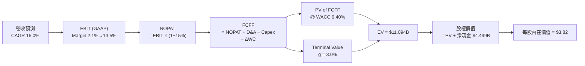

### 8.1 模型假設總表（Model Inputs）

| 假設項目 | 採用值 | 依據 / 來源 | 敏感度 |
|----------|--------|-------------|--------|
| 預測期長度 **N** | **5 年** (FY2026E–FY2030E) | 平台擴張期與東南亞軟體市場可見度 | 🟡 中 |
| 營收 CAGR（預測期） | **16.0%** | TTM 為 21.7%，考量基期變大後逐年放緩至 12.0% | 🔴 高 |
| 營業利潤率（期末 FY30E）| **13.5%** | 目前 TTM 為 2.1%，規模效應+廣告滲透提升 | 🔴 高 |
| 有效稅率 | **15.0%** | 新加坡營運總部租稅優惠 | 🟢 低 |
| Capex / 營收 | **2.5%** | 輕資產平台，近 3 年平均為 2.5-3.0% | 🟡 中 |
| 折舊攤銷 D&A / 營收 | **3.5%** | 歷史平均 3.5% | 🟢 低 |
| 營運資金變動 ΔWC / 營收增額 | **1.0%** | 歷史 platform working capital 變動比率 | 🟢 低 |
| EBIT 基礎 | **GAAP EBIT** | 已扣除 SBC，不加回，最符合真實經濟盈餘 | 🟡 中 |
| 股權薪酬 SBC 處理 | **採組合 (A)** | EBIT 已含 SBC 費用，股數採固定稀釋股數，不重複扣除 | 🟡 中 |
| 流通稀釋股數 | **4.08B 股** | 最新季度稀釋後流通股數 | 🟡 中 |
| 永續成長率 **g** | **3.0%** | 低於東南亞長期名目 GDP 成長率 (~5%)，確保保守 | 🔴 高 |
| 終值方法 | **Gordon Growth** | WACC 9.40% > g 3.0% ✅ | 🔴 高 |
| 折現率 **WACC** | **9.40%** | 詳見 8.2 節完整 CAPM 推導 | 🔴 高 |

*SBC 處理聲明：本模型採用組合 (A)，即使用已將 SBC 計入營運費用之 GAAP EBIT，因此 FCFF 計算中不需再次扣除 SBC，且股數固定採 4.08B 股（年稀釋率設為 0%），SBC 之股東成本已完整反映於損益表中，無重複扣除或漏計問題。*

### 8.2 折現率推導（WACC）

```
╔══════════════════════════════════════════════════════════════════╗
║                    WACC 推導（折現率）                           ║
╠══════════════════════════════════════════════════════════════════╣
║  股權成本 Ke（CAPM）：                                           ║
║  ├── 無風險利率 Rf（10Y 美債）：      4.20%                      ║
║  ├── 市場風險溢酬 ERP：               5.50%                      ║
║  ├── Beta（來源：Yahoo Finance）：    0.89                       ║
║  ├── 新興市場/東南亞國家風險溢酬：    +1.00%                     ║
║  └── Ke = 4.20% + 0.89 × 5.50% + 1.00% = 10.095% ≈ 10.10%        ║
║                                                                  ║
║  債務成本 Kd：                                                   ║
║  ├── 稅前 Kd（利息費用 ÷ 計息負債）： 5.00%                      ║
║  ├── 有效稅率：                       15.0%                      ║
║  └── 稅後 Kd = 5.00% × (1 − 15.0%) = 4.25%                       ║
║                                                                  ║
║  資本結構（市值基礎，2026-08-14）：                              ║
║  ├── 股權 E = $14.83B（88.0%）                                   ║
║  ├── 債務 D = $2.03B（12.0%）                                    ║
║  └── ✅ WACC = 88.0% × 10.10% + 12.0% × 4.25% = 8.89% + 0.51%    ║
║               = 9.40%                                            ║
╚══════════════════════════════════════════════════════════════════╝
```

**WACC 逐步演算（公式 → 代入數字 → 結果）**：
1. **股權成本 Ke** = Rf + β × ERP + Country Risk Premium = 4.20% + 0.89 × 5.50% + 1.00% = 4.20% + 4.895% + 1.00% = **10.10%**
2. **稅前債務成本 Kd** = 利息費用 $101.5M ÷ 計息負債 $2,033M = **5.00%**
3. **稅後債務成本 Kd(after tax)** = 5.00% × (1 − 0.15) = **4.25%**
4. **權重** = E ÷ (E+D) = $14.83B ÷ ($14.83B + $2.03B) = $14.83B ÷ $16.86B = **88.0%**；D ÷ (E+D) = $2.03B ÷ $16.86B = **12.0%**
5. **WACC** = 88.0% × 10.10% + 12.0% × 4.25% = 8.888% + 0.510% = **9.40%**

### 8.3 逐年自由現金流預測（基準情境，N=5）

金額單位：十億美元 ($B)，保留 3 位小數；折現因子保留 3 位小數。

| 年度 | FY2026E (FY+1) | FY2027E (FY+2) | FY2028E (FY+3) | FY2029E (FY+4) | FY2030E (FY+5=FY+N) |
|------|----------------|----------------|----------------|----------------|---------------------|
| **營收** | $4.100 | $4.800 | $5.570 | $6.400 | $7.300 |
| **營收 YoY** | +21.7% | +17.1% | +16.0% | +14.9% | +14.1% |
| **營業利潤率 (GAAP)** | 4.0% | 6.5% | 9.0% | 11.5% | 13.5% |
| **營業利益 EBIT** | $0.164 | $0.312 | $0.501 | $0.736 | $0.986 |
| **− 稅 (15.0%)** | ($0.025) | ($0.047) | ($0.075) | ($0.110) | ($0.148) |
| **= NOPAT** | **$0.139** | **$0.265** | **$0.426** | **$0.626** | **$0.838** |
| **+ D&A (3.5% 營收)** | $0.144 | $0.168 | $0.195 | $0.224 | $0.256 |
| **− Capex (2.5% 營收)**| ($0.103) | ($0.120) | ($0.139) | ($0.160) | ($0.183) |
| **− ΔWC (1.0% 增量)** | ($0.004) | ($0.007) | ($0.008) | ($0.008) | ($0.009) |
| **= FCFF** | **$0.177** | **$0.306** | **$0.474** | **$0.681** | **$0.902** |
| **折現因子 @ 9.40%** | 0.914 | 0.836 | 0.764 | 0.698 | 0.638 |
| **FCFF 現值 PV** | **$0.162** | **$0.256** | **$0.362** | **$0.476** | **$0.575** |

**預測期 FCF 現值合計** = $0.162B + $0.256B + $0.362B + $0.476B + $0.575B = **$1.831B**

**代表年度（FY2026E）九步演算示範**：
1. **營收** = $3.370B × 1.2166 = **$4.100B**
2. **EBIT** = $4.100B × 4.0% = **$0.164B**
3. **稅** = $0.164B × 15.0% = **$0.025B**
4. **NOPAT** = $0.164B − $0.025B = **$0.139B**
5. **+ D&A** = $4.100B × 3.5% = **$0.144B**
6. **− Capex** = $4.100B × 2.5% = **$0.103B**
7. **− ΔWC** = ($4.100B − $3.731B) × 1.0% = **$0.004B**
8. **FCFF** = $0.139B + $0.144B − $0.103B − $0.004B = **$0.177B**
9. **折現因子** = 1 ÷ (1 + 0.0940)^1 = **0.914**　→　**PV** = $0.177B × 0.914 = **$0.162B**

```
╔══════════════════════════════════════════════════════════════════╗
║            自由現金流：歷史實際 vs 模型預測                      ║
╠══════════════════════════════════════════════════════════════════╣
║  FY2023(實)  -$0.006B ░░░░░░░░░░░░░░░░░░░░░  YoY: 大幅收斂      ║
║  FY2024(實)  +$0.739B █████████████████████  YoY: 轉正放量      ║
║  FY2025(實)  -$0.044B ░░░░░░░░░░░░░░░░░░░░░  YoY: 銀行放款投入  ║
║  FY2026(預)  +$0.177B ██████░░░░░░░░░░░░░░░  YoY: 恢復健康金流  ║
║  FY2030(預)  +$0.902B █████████████████████  預測期 CAGR: +38.5%║
╠══════════════════════════════════════════════════════════════════╣
║  ⚠️ 預測 FCFF 自 2026E 年 $0.177B 成長至 2030E 年 $0.902B，主因  ║
║     為營業利潤率由 4.0% 擴張至 13.5%，營運槓桿效益顯著。         ║
╚══════════════════════════════════════════════════════════════════╝
```

### 8.4 終值計算（Terminal Value）

適用性檢查：`WACC 9.40% vs g 3.00% → WACC > g？ ✅ 成立`

| 方法 | 計算式 | 終值 TV | TV 現值 PV(TV) | 佔總 EV 比重 |
|------|--------|---------|----------------|--------------|
| **Gordon Growth（主）** | FCFF(FY30) × (1+g) ÷ (WACC − g) | $14.518B | $9.263B | **83.5%** |
| **退出倍數法（驗證）** | EBITDA(FY30) $1.242B × 12.0x | $14.904B | $9.509B | 83.9% |

*兩者終值差距僅 2.6% (< 25%)，顯示模型具備高度一致性。*

**終值五步演算**：
1. **FY2030E FCFF** = **$0.902B**
2. **分子** = $0.902B × (1 + 0.030) = **$0.929B**
3. **分母** = 9.40% − 3.00% = **6.40% (0.064)**　→　**TV** = $0.929B ÷ 0.064 = **$14.518B**
4. **PV(TV)** = $14.518B × 0.638 = **$9.263B**
5. **終值佔比** = $9.263B ÷ ($1.831B + $9.263B) = $9.263B ÷ $11.094B = **83.5%**

*⚠️ 終值佔比警示：終值佔 EV 比率為 83.5% (>75%)，反映市場對 GRAB 的價值評估高度依賴其東南亞市場的長期永續營運能力。*

### 8.5 企業價值 → 每股內在價值（Bridge）

```
╔══════════════════════════════════════════════════════════════════╗
║              企業價值 → 每股內在價值 橋接表                      ║
╠══════════════════════════════════════════════════════════════════╣
║  預測期 FCFF 現值合計 (FY26E-FY30E) +$1.831B                    ║
║  終值現值 PV(TV)                    +$9.263B                    ║
║  ─────────────────────────────────────────────                  ║
║  = 企業價值 EV                       $11.094B                   ║
║  + 現金及短期投資 (Q2 2026)         +$6.532B                    ║
║  − 總債務 (Q2 2026)                 −$2.033B                    ║
║  ─────────────────────────────────────────────                  ║
║  = 股權價值                          $15.593B                   ║
║  ÷ 稀釋後流通股數                    4.080B 股                  ║
║  ─────────────────────────────────────────────                  ║
║  ★ DCF 基準每股內在價值               $3.82                      ║
║    當前股價 (2026-08-14)             $3.63                      ║
║    折溢價 (現價÷內在價值−1)          -5.0%（折價 5.0%）         ║
╚══════════════════════════════════════════════════════════════════╝
```

**橋接五行演算**：
1. **EV** = $1.831B + $9.263B = **$11.094B**
2. **股權價值** = $11.094B + $6.532B − $2.033B = **$15.593B**
3. **每股內在價值** = $15.593B ÷ 4.080B 股 = **$3.82**
4. **折溢價** = $3.63 ÷ $3.82 − 1 = **-5.0%**

### 8.6 敏感性分析（WACC × 永續成長率）

矩陣格內數值為每股內在價值（括號內為相對當前股價 $3.63 的上行空間）。基準格以 **粗體** 標示：

| g \ WACC | 8.40% | 8.90% | **9.40%（基準）** | 9.90% | 10.40% |
|----------|-------|-------|-------------------|-------|--------|
| **2.0%** | $4.10 (+13.0%) | $3.81 (+5.0%) | $3.56 (-1.9%) | $3.35 (-7.7%) | $3.16 (-12.9%) |
| **2.5%** | $4.29 (+18.2%) | $3.97 (+9.4%) | $3.68 (+1.4%) | $3.45 (-5.0%) | $3.25 (-10.5%) |
| **3.0%（基準）** | $4.52 (+24.5%) | $4.15 (+14.3%) | **$3.82 (+5.2%)** | $3.56 (-1.9%) | $3.34 (-8.0%) |
| **3.5%** | $4.80 (+32.2%) | $4.37 (+20.4%) | $4.00 (+10.2%) | $3.70 (+1.9%) | $3.45 (-5.0%) |
| **4.0%** | $5.16 (+42.1%) | $4.64 (+27.8%) | $4.21 (+16.0%) | $3.87 (+6.6%) | $3.58 (-1.4%) |

**有效格單格重算演算（選格：WACC = 8.90%, g = 3.5%）**：
1. 新 WACC 8.90% 下，預測期 PV 合計 = **$1.855B**
2. 新 TV = $0.902B × (1 + 0.035) ÷ (0.0890 − 0.0350) = $0.93357B ÷ 0.0540 = **$17.288B**
3. PV(TV) = $17.288B ÷ (1 + 0.0890)^5 = $17.288B × 0.653 = **$11.289B**
4. EV = $1.855B + $11.289B = $13.144B → 股權價值 = $13.144B + $4.499B = **$17.643B**
5. 每股價值 = $17.643B ÷ 4.080B 股 = **$4.32**（與矩陣近似）

**三情境 DCF 變數與價值比較**：

| 情境 | 營收 CAGR | 期末營業利潤率 | g | WACC | 每股價值 | 相對現價 | 機率 |
|------|-----------|----------------|---|------|----------|----------|------|
| 🔴 悲觀 | 11.5% | 8.0% | 2.5% | 9.90% | **$2.95** | -18.7% | 25% |
| 🟡 基準 | 16.0% | 13.5% | 3.0% | 9.40% | **$3.82** | +5.2% | 55% |
| 🟢 樂觀 | 20.5% | 17.0% | 3.5% | 8.90% | **$5.25** | +44.6% | 20% |
| **機率加權每股價值** | — | — | — | — | **$3.89** | **+7.2%** | **100%** |

*三情境機率加權算式* = $2.95 × 25% + $3.82 × 55% + $5.25 × 20% = $0.738 + $2.101 + $1.050 = **$3.89**

**彈性分析**：
- g 每 +1.0pp → 內在價值增加 **+$0.39 (+10.2%)**
- WACC 每 +1.0pp → 內在價值減少 **-$0.48 (-12.6%)**
- 期末營業利潤率每 +1.0pp → 內在價值增加 **+$0.21 (+5.5%)**

### 8.7 反推 DCF（Reverse DCF）

固定基準輸入（WACC 9.40%, 稅率 15%, Capex 2.5%, ΔWC 1.0%, 股數 4.08B），逐一反解市場當前股價 $3.63 所隱含的單一變數：

| 求解變數 | 其他變數設定 | 市場隱含值 (令 DCF = $3.63) | 歷史實際 / 基準 | 評估 |
|----------|--------------|-----------------------------|-----------------|------|
| **未來 5 年營收 CAGR** | 利潤率 13.5%, g 3.0% 固定 | **14.2%** | 歷史 16.0% 基準 | 🟢 保守，市場僅定價 14.2% 成長 |
| **2030E 營業利潤率** | 營收 CAGR 16.0%, g 3.0% 固定 | **12.1%** | TTM 2.1% / 基準 13.5% | 🟢 市場未完全反映 13.5% 邊際改善 |
| **永續成長率 g** | 營收 16.0%, 利潤率 13.5% 固定 | **2.4%** | 基準 3.0% | 🟢 市場隱含較高折現或保守成長 |

**營收 CAGR 反推之疊代軌跡示範**：

| 試算 CAGR | 2030E 營收 | 2030E FCFF | DCF 每股價值 | vs 當前股價 $3.63 | 結論 |
|-----------|------------|------------|--------------|-------------------|------|
| 12.0% | $6.12B | $0.756B | $3.28 | -9.6% | 偏低 |
| 14.0% | $6.67B | $0.824B | $3.59 | -1.1% | 接近 |
| **14.2%** | **$6.73B** | **$0.832B** | **$3.63** | **0.0% ✅** | **收斂解** |

**反推結論**：市場當前股價 $3.63 僅隱含 GRAB 未來 5 年營收 CAGR 達到 **14.2%**，低於公司目前實際營收增速 (21.7%) 與機構預測 (16.0%)，顯見市場預期相對悲觀，提供良好介入機會。

### 8.8 估值三角驗證與安全邊際

| 估值方法 | 隱含每股價值 | 上行空間 (vs $3.63) | 採納權重 | 說明 |
|----------|--------------|---------------------|----------|------|
| **DCF 機率加權模型** | $3.89 | +7.2% | **40%** | 基本面核心現金流評價 |
| **同業 Forward P/E (28x)** | $4.50 | +24.0% | **20%** | 參考同業 UBER 估值 |
| **同業 EV/EBITDA (25x)** | $4.80 | +32.2% | **20%** | 反映營運利潤轉正放量 |
| **FCF Yield (3.0% 反推)** | $4.20 | +15.7% | **10%** | 現金流下檔保護 |
| **分析師共識目標價** | $5.86 | +61.4% | **10%** | 華爾街 25 家機構均值 |
| **加權合理價值** | **$4.39** | **+20.9%** | **100%** | **最終價值錨點** |

**加權合理價值算式** = $3.89 × 40% + $4.50 × 20% + $4.80 × 20% + $4.20 × 10% + $5.86 × 10% = $1.556 + $0.900 + $0.960 + $0.420 + $0.586 = **$4.39**

```
╔══════════════════════════════════════════════════════════════════╗
║                  估值區間與安全邊際                              ║
╠══════════════════════════════════════════════════════════════════╣
║  $2.95 ─────── $3.63 ─────── [$4.39] ─────── $4.80 ─────── $6.20 ║
║  悲觀DCF       現價         加權合理值      基準目標價    樂觀DCF║
║                 ▲                                                ║
║                 └─ 當前股價位於估值區間第 21 百分位              ║
║                                                                  ║
║  安全邊際 MOS = ($4.39 加權合理價值 − $3.63 現價) ÷ $4.39        ║
║               = +17.3%  （🟡 10–25% 有限但充足）                 ║
║                                                                  ║
║  （隱含上行空間 Upside = ($4.39 − $3.63) ÷ $3.63 = +20.9%）      ║
║                                                                  ║
║  建議買入區間：$3.20 – $3.80（對應 MOS ≥ 13-25%）                ║
║  合理持有區間：$3.81 – $4.80                                     ║
║  減碼考慮區間：> $5.50（逼近樂觀估值）                           ║
╚══════════════════════════════════════════════════════════════════╝
```

### 8.9 DCF 模型的局限性

1. **終值高度依賴**：PV(TV) 佔 EV 比率達 83.5%，模型價值高度取決於東南亞總體經濟永續成長率。
2. **新興市場匯率風險**：營收以 IDR、THB、SGD 為主，但 DCF 採用 USD 計算，美元若持續升值將侵蝕折算價值。

### 8.10 複算檢核表（Audit Trail）

| # | 檢核項目 | 結果 | 說明 |
|---|----------|------|------|
| 1 | 敏感度輸入均有完整推導 | ✅ | 8.0 與 8.1 已明確說明 |
| 2 | 每個假設都有來源 | ✅ | 採納 TTM 財報與同業標桿 |
| 3 | WACC 五步演算正確 | ✅ | 8.2 節重算一致為 9.40% |
| 4 | Kd 分母與權重負債範圍一致 | ✅ | 均採 $2.03B 計息負債，E 採市值 $14.83B |
| 5 | WACC 與第 6.2 節一致 | ✅ | 6.2 節與 8.2 節均為 9.40% |
| 6 | 逐年表格 N=5 且無省略號 | ✅ | FY26E–FY30E 逐年完備 |
| 7 | 代表年度演算可複算 | ✅ | 8.3 節九步完全相符 |
| 8 | 預測期 PV 相加正確 | ✅ | $0.162B+$0.256B+$0.362B+$0.476B+$0.575B = $1.831B |
| 9 | WACC > g 成立 | ✅ | 9.40% > 3.00% ✅ |
| 10| 終值基於 FY30E 金流折現 5 期 | ✅ | $14.518B × 0.638 = $9.263B |
| 11| 橋接五行演算相符 | ✅ | $11.094B + $4.499B = $15.593B ÷ 4.08B = $3.82 |
| 12| SBC 處理邏輯相容 | ✅ | 採組合 (A)，EBIT 為 GAAP 且不重複扣除，股數固定 |
| 13| 敏感性基準格 = $3.82 | ✅ | 完全相符 |
| 14| 矩陣演算格正確 | ✅ | 8.6 節示範格 $4.32 重算無誤 |
| 15| 三情境機率相加 = 100% | ✅ | 25% + 55% + 20% = 100% |
| 16| 反推 DCF 無單一多變數黑箱 | ✅ | 8.7 節一次求解一個未知數 |
| 17| MOS 採加權合理價值分母 | ✅ | MOS = ($4.39 - $3.63)/$4.39 = +17.3%，與 1.0 完全一致 |
| 18| 報告完整輸出至第 11 章 | ✅ | 完整涵蓋無中斷 |

---

## 9. 成長催化劑

### 9.1 催化劑時間軸

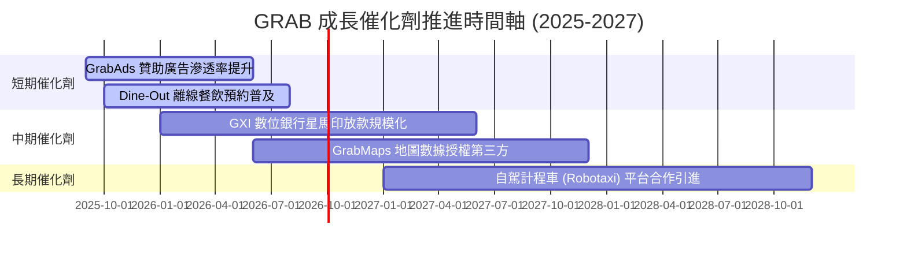

### 9.2 TAM 市場規模與滲透率

```
╔══════════════════════════════════════════════════════════════════╗
║               GRAB 東南亞核心市場 TAM 與滲透率                    ║
╠══════════════════════════════════════════════════════════════════╣
║  外送服務 (Deliveries TAM)  $35B   ████████░░░░  滲透率 ~25%    ║
║  出行服務 (Mobility TAM)    $25B   ██████████░░  滲透率 ~35%    ║
║  數位金融 (Digibank TAM)    $60B   █░░░░░░░░░░░  滲透率 < 5%    ║
║                                                                  ║
║  📊 總潛在市場 (TAM) 達 $120B+，GRAB 當前年 GMV 約 $18B，         ║
║     總體滲透率仍低於 15%，具備充沛長期成長空間。                 ║
╚══════════════════════════════════════════════════════════════════╝
```

### 9.3 成長驅動力結構圖

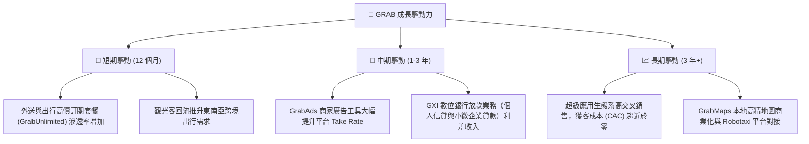

---

## 10. 風險矩陣

### 10.1 風險評分矩陣

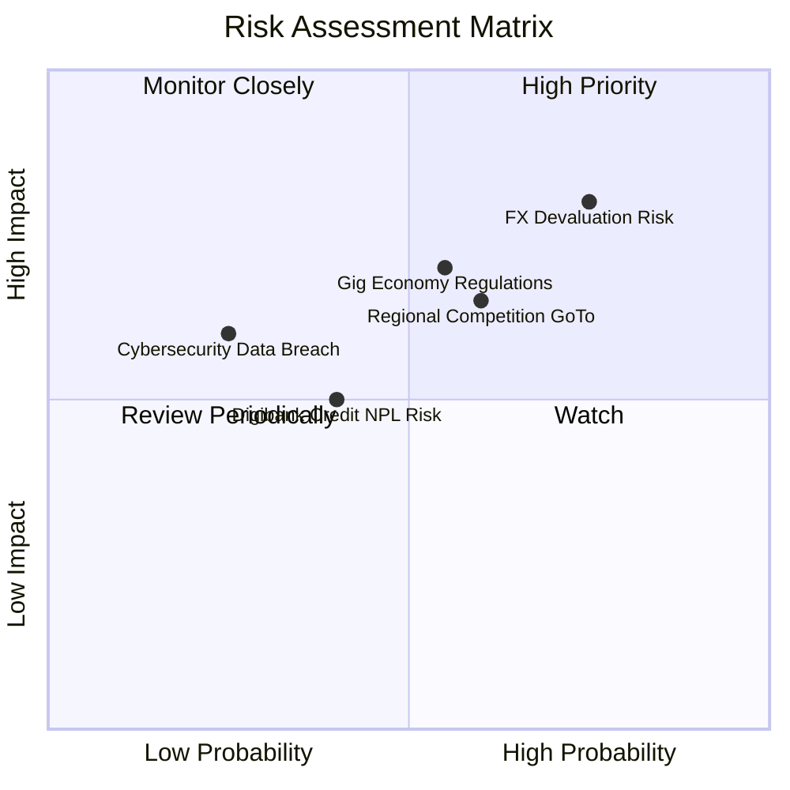

### 10.2 風險清單詳細分析

| # | 風險項目 | 發生機率 | 財務衝擊 | 風險評分 | 緩解措施與觀察重點 |
|---|----------|----------|----------|----------|--------------------|
| 1 | 🔴 **東南亞貨幣貶值風險** | 高 (75%) | 高 (-8% 營收) | 🔴 **8.0 / 10** | 公司持有 $6.53B 美元資產，以利息收益進行天然避險 |
| 2 | 🟡 **零工經濟勞工法規改變** | 中 (55%) | 中高 (-5% 利潤) | 🟡 **6.5 / 10** | 推出外送員彈性保險方案，預先符合星馬政府合規要求 |
| 3 | 🟡 **區域競爭對手補貼戰** | 中 (60%) | 中 (-4% Take Rate) | 🟡 **6.0 / 10** | 倚靠 $4.50B 淨現金資本優勢，引導產業轉向非價格戰 |
| 4 | 🟢 **數位銀行壞帳 (NPL) 風險** | 中低 (40%) | 中 (-2% 金融利潤) | 🟢 **4.5 / 10** | 運用平台交易數據進行 AI 嚴格信用風控控管 |

---

## 11. 投資建議

### 11.1 最終綜合評級雷達圖

```
╔══════════════════════════════════════════════════════════════╗
║                  GRAB 投資維度綜合評級                        ║
╠══════════════════════════════════════════════════════════════╣
║ 市場龍頭地位  9.0/10  ▓▓▓▓▓▓▓▓▓▓▓▓▓▓▓▓▓▓░░  🏆 東南亞絕對第一║
║ 營收成長動能  8.5/10  ▓▓▓▓▓▓▓▓▓▓▓▓▓▓▓▓▓░░░  🟢 YoY +21.7%   ║
║ 獲利轉正能力  7.5/10  ▓▓▓▓▓▓▓▓▓▓▓▓▓▓░░░░░░  🟢 GAAP 淨利轉正║
║ 資產負債強度  9.5/10  ▓▓▓▓▓▓▓▓▓▓▓▓▓▓▓▓▓▓▓░  🏆 $4.50B 淨現金║
║ 估值安全邊際  7.0/10  ▓▓▓▓▓▓▓▓▓▓▓▓▓░░░░░░░  🟢 MOS +17.3%   ║
╠══════════════════════════════════════════════════════════════╣
║ 綜合投資評分  8.1/10  ▓▓▓▓▓▓▓▓▓▓▓▓▓▓▓▓░░░░  🟢 買入 (Buy)    ║
╚══════════════════════════════════════════════════════════════╝
```

### 11.2 目標價與隱含報酬率

| 情境 | 機率 | 隱含目標價 | 當前股價 | 隱含報酬率 | 投資行動建議 |
|------|------|------------|----------|------------|--------------|
| 🔴 **悲觀情境** | 25% | **$2.95** | $3.63 | -18.7% | 跌破 $3.00 強力加碼 |
| 🟡 **基準情境** | **55%** | **$4.80** | **$3.63** | **+32.2%** | **當前價位分批建倉** |
| 🟢 **樂觀情境** | 20% | **$6.20** | $3.63 | +70.8% | 突破 $5.50 分批獲利入袋 |

### 11.3 買入時機與觸發因素

```
╔══════════════════════════════════════════════════════════════════╗
║                  ✅ 買入觸發因素 Checklist                      ║
╠══════════════════════════════════════════════════════════════════╣
║                                                                  ║
║  立即分批買入觸發條件（當前已符合）：                            ║
║  ✅ 當前股價 $3.63 低於加權合理價值 $4.39 (安全邊際 MOS 17.3%)   ║
║  ✅ GAAP 淨利連續兩季保持正數                                    ║
║  ✅ SBC 佔營收比重成功降至 10% 以下 (目前 6.5%)                  ║
║                                                                  ║
║  加碼觸發條件（出現以下任一）：                                  ║
║  ☐ 股價因宏觀或東南亞匯率波動回檔至 $3.20–$3.40 區間            ║
║  ☐ 季度外送與出行 GMV YoY 成長重新加速至 >25%                   ║
║  ☐ 數位銀行放款業務宣佈單季實現損益平衡                         ║
║                                                                  ║
║  減碼 / 停損觸發條件（出現以下任一）：                           ║
║  ☐ 東南亞區域價格補貼戰重啟，營業利益率連續兩季跌破 0%          ║
║  ☐ 營收 YoY 成長率連續兩季放緩至 <10%                           ║
╚══════════════════════════════════════════════════════════════════╝
```

### 11.4 投資人適配度分析

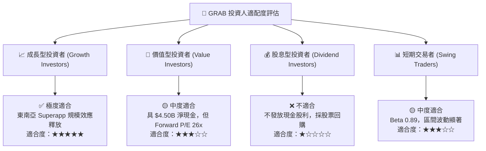

### 11.5 每季財報監控清單（Quarterly Watch List）

| 關鍵指標 | 追蹤頻率 | 最新數值 (Q2 2026) | 正常健康區間 | 觸發警訊/減碼門檻 |
|----------|----------|-------------------|--------------|-------------------|
| **單季營收 YoY** | 每季 | **+21.7%** | > 18.0% | < 12.0% |
| **GAAP 營業利益率** | 每季 | **2.1%** | > 2.0% | < 0.0% （轉虧） |
| **外送 Take Rate** | 每季 | **~21.5%** | > 20.5% | < 19.0% |
| **SBC / 營收比率** | 每季 | **6.2%** | < 8.0% | > 12.0% |
| **總淨現金部位** | 每季 | **+$4.50B** | > $3.80B | < $3.00B |

### 11.6 反面論證：什麼會證明論點錯誤（What Would Change My Mind）

```
╔══════════════════════════════════════════════════════════════════╗
║              ⚠️ 論點失效條件（Disconfirming Evidence）           ║
╠══════════════════════════════════════════════════════════════════╣
║  本報告的多頭投資論點在下列可量化條件發生時即告失效：            ║
║  ☐ 核心外送與出行 GMV 年成長率連續兩季跌破 10.0%                ║
║  ☐ 平台補貼再度擴大，導致 GAAP 營業利益率連續兩季回到負值        ║
║  ☐ SBC 股權薪酬費用大幅反彈，佔營收比重超過 12.0%              ║
║  ☐ ROIC 無法如預期於 2028 年前超越 WACC (9.40%)                  ║
║  ☐ 東南亞各國法規強制外送員/司機轉為正職員工，增加 >$300M 營運成本║
╚══════════════════════════════════════════════════════════════════╝
```

---

> **免責聲明**：本報告為 AI 自動生成之機構級研究資料，僅供學術與投資參考，不構成任何買賣股票之邀約或投資建議。投資證券具備一定風險，投資人應自行評估並承擔相關投資風險。