# INTC 基本面深度分析報告

> **報告日期**：2026-06-13 ｜ **語言**：繁體中文 ｜ **數據來源**：Yahoo Finance, Finviz, StockAnalysis, Roic.ai ｜ **分析師**：CFA 級機構研究

---

## 目錄

| # | 章節 | 核心結論 |
|---|---|---|
| 1 | 執行摘要 | 評級為 **持有 (HOLD)**，目標價 $95.00。市場已過度透支 18A 節點與代工分拆利多。 |
| 2 | 公司概覽與商業模式 | x86 雙寡頭結構穩固，但 Intel Foundry 轉型面臨重資本與技術爬坡雙重考驗。 |
| 3 | 損益表深度分析 | Q1 2026 營收 YoY +7.18% 顯現復甦，但重組費用導致 GAAP 營業利潤大幅承壓。 |
| 4 | 資產負債表分析 | 現金儲備充裕 ($32.79B)，但淨債務達 -$12.24B，資本開支高企考驗流動性。 |
| 5 | 現金流量深度分析 | TTM FCF 為 -$8.30B，晶圓廠建設（Capex）持續失血，資本回報能力受限。 |
| 6 | 獲利能力與資本效率 | TTM ROE 為 -2.9%，ROIC (TTM) 顯著低於 WACC (9.54%)，股東價值持續受蝕。 |
| 7 | 估值深度分析 | 前瞻 P/E 達 80.8x，相較同業顯著溢價，DCF 顯示當前股價 $124.57 已嚴重高估。 |
| 8 | 成長催化劑 | 18A 節點量產與 AI PC 滲透為主要催化劑，但產能釋放需等到 2027 年。 |
| 9 | 風險矩陣 | 製程延期與代工客戶流失為核心風險，地緣政治與高額折舊持續壓制利潤率。 |
| 10 | 投資建議 | 建議在 $95.00 以下分批佈局，警惕當前高估值回檔風險。 |

---

## 1. 執行摘要

Intel Corporation (NASDAQ: INTC) 正處於其半導體歷史上最關鍵的結構性轉型期。在執行長 Pat Gelsinger 的「5年4個製程節點」戰略指引下，Intel 試圖通過 IDM 2.0 戰略重建其技術領先地位，並將旗下製造部門獨立為 Intel Foundry 進行商業化運作。

然而，從二級市場股價走勢來看，INTC 股價在過去 24 個月內經歷了戲劇性的變化：從 2024 年底的 $20.05 底部，一路飆升至 2026 年 6 月的 $124.57，漲幅高達 521%。這一驚人的漲幅主要反映了市場對 18A 製程成功量產、美國《晶片法案》補助款落地，以及 Intel Foundry 潛在分拆上市價值的極度樂觀預期。

本報告基於 2026 年 6 月 13 日的最新即時財務數據，對 Intel 進行了系統性的基本面穿透分析。我們認為，**當前 $124.57 的股價已嚴重透支了未來 3-5 年的業績復甦預期**。前瞻估值倍數（Forward P/E 80.8x）已高於台積電與 AMD，而其實際獲利能力（TTM 淨利率 -5.9%）與自由現金流（TTM FCF -$8.30B）仍處於失血狀態。

### 1.1 核心評分儀表板

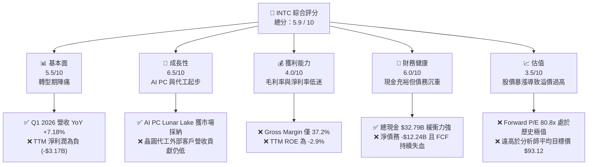

### 1.2 評分進度條視覺化

```
╔══════════════════════════════════════════════════════════════╗
║               INTC 多維度評分儀表板 (1-10分)                 ║
╠══════════════════════════════════════════════════════════════╣
║ 基本面強度  5.5 ▓▓▓▓▓▓▓▓▓▓▓░░░░░░░░░  ★★★☆☆           ║
║ 成長動能    6.5 ▓▓▓▓▓▓▓▓▓▓▓▓▓░░░░░░░  ★★★☆☆           ║
║ 獲利品質    4.0 ▓▓▓▓▓▓▓▓░░░░░░░░░░░░  ★★☆☆☆           ║
║ 財務健康    6.0 ▓▓▓▓▓▓▓▓▓▓▓▓░░░░░░░░  ★★★☆☆           ║
║ 估值合理性  3.5 ▓▓▓▓▓▓▓░░░░░░░░░░░░░  ★☆  ☆           ║
║ 護城河深度  7.0 ▓▓▓▓▓▓▓▓▓▓▓▓▓▓░░░░░░  ★★★☆☆           ║
║ 管理層執行  8.0 ▓▓▓▓▓▓▓▓▓▓▓▓▓▓▓▓░░░░  ★★★★☆           ║
║ 技術創新力  8.5 ▓▓▓▓▓▓▓▓▓▓▓▓▓▓▓▓▓░░░  ★★★★☆           ║
╠══════════════════════════════════════════════════════════════╣
║ 綜合總分    5.9 ▓▓▓▓▓▓▓▓▓▓▓▓░░░░░░░░  🏆 評級：持有 (HOLD) ║
╚══════════════════════════════════════════════════════════════╝
```

### 1.3 五大投資論點 + 三大核心風險

| 類型 | 項目 | 具體依據 | 信心度 |
|------|------|----------|--------|
| 🟢 **投資論點①** | **18A 製程技術拐點** | Intel 18A (1.8nm級) 製程預計於 2026 年底進入大規模量產，RibbonFET 與 PowerVia 技術有望在每瓦效能上追平或超越台積電 N3P。 | 🟢 高 |
| 🟢 **投資論點②** | **AI PC 換機潮主導者** | Core Ultra (Meteor Lake/Lunar Lake) 系列處理器在 PC 端市佔率穩固，預計 2026 年 AI PC 滲透率達 40%，帶動 CCG 部門 ASP 提升。 | 🟢 極高 |
| 🟢 **投資論點③** | **地緣政治與政策紅利** | 作為美國本土唯一具備領先製程的 IDM 廠，Intel 累計獲得《晶片法案》近 $8.5B 直接補貼與 $11B 貸款支持，建廠資本開支獲實質減免。 | 🟢 極高 |
| 🟢 **投資論點④** | **代工業務分拆預期** | Intel Foundry 財務獨立核算，未來若尋求單獨 IPO，將釋放巨大的估值重估空間，吸引非 x86 生態客戶（如 ARM、Qualcomm）。 | 🟢 中度 |
| 🟢 **投資論點⑤** | **資產重組與成本削減** | 研發費用由 FY24 的 $16.55B 降至 FY25 的 $13.77B (YoY -16.8%)，銷售與管理費用亦同步優化，營運效率逐步提升。 | 🟢 高 |
| 🟡 **風險①** | **晶圓代工產能利用率低** | Foundry 業務目前主要客戶仍為 Intel 內部，外部客戶開案（Tape-out）轉化為實際營收速度慢，高額折舊將持續壓低整體毛利率。 | 🟡 中度 |
| 🔴 **風險②** | **自由現金流持續失血** | TTM FCF 為 -$8.30B，主要受累於每年高達 $14B-$25B 的資本支出，若無持續融資或政府補貼，可能面臨流動性壓力。 | 🔴 高衝擊 |
| 🔴 **風險③** | **數據中心與 AI 市場失焦** | 在 AI GPU 領域，Gaudi 3 難以撼動 NVIDIA H100/B200 的壟斷地位；在伺服器 CPU 領域，面臨 AMD EPYC 的持續蠶食。 | 🔴 高衝擊 |

### 1.4 快速統計卡片

| 指標 | 公司實際值 (TTM) | 半導體行業均值 | S&P 500 均值 | 狀態 |
|------|-------------|----------|--------------|------|
| **營收 YoY 成長率** | **7.20%** | ~12.5% | ~5.5% | 🟡 弱於行業 |
| **毛利率** | **37.20%** | ~52.0% | ~30.0% | 🔴 顯著低於同業 |
| **營業利益率** | **6.90%** | ~22.0% | ~12.5% | 🔴 盈利能力待恢復 |
| **淨利率** | **-5.90%** | ~15.0% | ~8.5% | 🔴 仍處於虧損狀態 |
| **ROE** | **-2.90%** | ~18.0% | ~15.0% | 🔴 摧毀股東價值 |
| **流動比率 (Current Ratio)** | **2.31** | ~1.85 | ~1.20 | 🟢 流動性優異 |
| **前瞻 P/E (Forward P/E)** | **80.80x** | ~28.5x | ~21.5x | 🔴 估值極度高企 |
| **P/S Ratio** | **11.65x** | ~6.5x | ~2.8x | 🔴 營收估值偏高 |

### 1.5 投資結論

```
╔══════════════════════════════════════════════════════════════════╗
║                    📊 INTC 投資結論摘要                          ║
╠══════════════════════════════════════════════════════════════════╣
║  評級：🟡 持有 (HOLD)                                           ║
║  當前股價：$124.57 (2026-06-13)                                  ║
║  目標價區間：                                                   ║
║    悲觀情境：$45.00（-63.9%）- 製程再度延期，代工客戶流失       ║
║    基準情境：$95.00（-23.7%）- 12個月合理價值，反映 18A 爬坡    ║
║    樂觀情境：$150.00（+20.4%）- 代工業務成功分拆並獲大單        ║
║  投資評分：5.9 / 10                                              ║
║  適合投資人：具備高風險承受力的長線逆向投資者、政策市追隨者      ║
╚══════════════════════════════════════════════════════════════════╝
```

---

## 2. 公司概覽與商業模式

Intel 的商業模式正在經歷其創立以來最深刻的變革。歷史上，Intel 是一家典型的整合元件製造商 (IDM)，將設計與製造融為一體。而在 IDM 2.0 時代，Intel 將自身拆分為兩個核心運作板塊：**Intel Products**（設計端，包括 CCG、DCAI、NEX）與 **Intel Foundry**（製造端，向內部及外部客戶提供代工服務）。

### 2.1 業務結構與收入來源

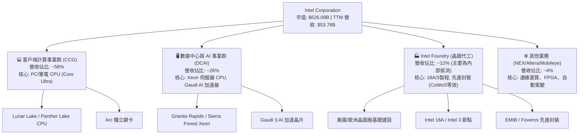

### 2.2 市場份額

在核心的 x86 處理器市場，Intel 依然維持著與 AMD 的雙寡頭壟斷格局；然而在晶圓代工市場，Intel 才剛剛起步。

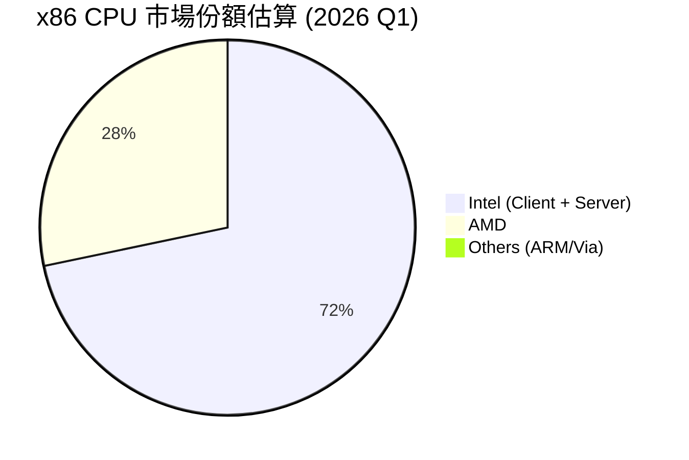

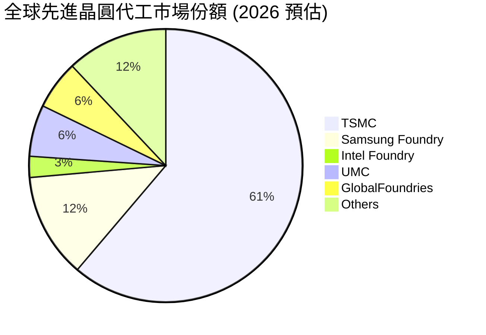

### 2.3 競爭護城河分析

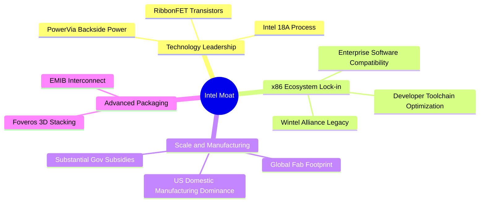

### 2.4 護城河強度評分

```
╔══════════════════════════════════════════════════════════════╗
║                    Intel 護城河強度評分                      ║
╠══════════════════════════════════════════════════════════════╣
║ x86 生態鎖定   8.5/10 ▓▓▓▓▓▓▓▓▓▓▓▓▓▓▓▓▓░░░  🏆 極強，企業級無可替代  ║
║ 先進封裝技術   8.0/10 ▓▓▓▓▓▓▓▓▓▓▓▓▓▓▓░░░░░  🟢 具備與台積電競爭力   ║
║ 前沿製程技術   6.5/10 ▓▓▓▓▓▓▓▓▓▓▓░░░░░░░░░  🟡 18A 量產性待驗證     ║
║ 晶圓代工規模   4.0/10 ▓▓▓▓▓▓▓▓░░░░░░░░░░░░  🔴 外部客戶生態尚未成型 ║
╠══════════════════════════════════════════════════════════════╣
║ 綜合護城河     7.0/10 ▓▓▓▓▓▓▓▓▓▓▓▓▓▓░░░░░░  🏆 寬護城河 (Wide Moat) ║
╚══════════════════════════════════════════════════════════════╝
```

*   **x86 生態鎖定 (8.5/10)**：儘管 ARM 在 PC（如 Apple Silicon, Qualcomm Snapdragon X Elite）和伺服器（AWS Graviton）端有所滲透，但全球 90% 以上的企業級應用和 Windows 軟體生態依然基於 x86 架構。Intel 作為該架構的定義者，擁有極深的專利壁壘與客戶黏性。
*   **晶圓代工規模 (4.0/10)**：Intel Foundry 目前面臨「高資本支出、低外部產出」的窘境。由於缺乏蘋果、輝達、超微等超大型外部客戶的實質訂單，Foundry 業務目前主要靠 Intel 內部產品部門「左手轉右手」來支撐產能利用率，商業化護城河依然脆弱。

---

## 3. 損益表深度分析

### 3.1 年度收入成長趨勢（近5年）

Intel 的年度營收在 2021 年達到 $79.02B 的歷史巔峰後，經歷了長達三年的下行週期。至 FY25 營收已縮水至 $52.85B，累計降幅達 33.1%。這反映了 PC 市場在疫情後的劇烈去庫存，以及在伺服器端市場份額流失給 AMD 的雙重打擊。

```
╔══════════════════════════════════════════════════════════════════╗
║              Intel 年度收入趨勢（FY21 - FY25）                   ║
╠══════════════════════════════════════════════════════════════════╣
║                                                                  ║
║  FY21  $79.02B  ███████████████████████████  YoY: +1.49%  🟢     ║
║  FY22  $63.05B  █████████████████████░░░░░░  YoY:-20.21%  🔴     ║
║  FY23  $54.23B  ██████████████████░░░░░░░░░  YoY:-14.00%  🔴     ║
║  FY24  $53.10B  ████████████████░░░░░░░░░░░  YoY: -2.08%  🟡     ║
║  FY25  $52.85B  ████████████████░░░░░░░░░░░  YoY: -0.47%  🟡     ║
║                   |      |      |      |      |                  ║
║                   0     20B    40B    60B    80B                 ║
║                                                                  ║
║  📊 5年營收複合年增長率 (CAGR)：-7.71%                           ║
╚══════════════════════════════════════════════════════════════════╝
```

### 3.2 季度收入趨勢分析

從季度數據來看，Intel 的營收已在 FY25 展現築底跡象。Q1 2026 營收達到 $13.58B，YoY 成長 7.18%，延續了復甦勢頭。

| 財報季度 | 營收 (Revenue) | YoY 成長率 | QoQ 成長率 | 毛利 (Gross Profit) | 毛利率 | 核心驅動因素 |
|---|---|---|---|---|---|---|
| **Q1 2026** | $13.58B | **+7.18%** | -0.71% | $5.35B | **39.38%** | AI PC 需求回暖，Core Ultra 產能爬坡，客戶端渠道庫存正常化。 |
| **Q4 2025** | $13.67B | **-4.11%** | +0.15% | $4.94B | **36.14%** | 年底 PC 旺季出貨穩定，但數據中心面臨非 x86 架構競爭。 |
| **Q3 2025** | $13.65B | **+2.78%** | +6.14% | $5.22B | **38.24%** | 伺服器新平台 Granite Rapids 開始出貨，ASP 提升。 |
| **Q2 2025** | $12.86B | **+0.20%** | +1.52% | $3.54B | **27.53%** | 受到晶圓廠折舊與代工業務初期高額啟動成本壓制。 |

### 3.3 利潤率演變分析

Intel 的利潤率在過去幾年中經歷了斷崖式下跌。毛利率從歷史常態的 55%-60% 下跌至 TTM 的 37.2%。

| 利潤率指標 | FY22 | FY23 | FY24 | FY25 | TTM | 趨勢評估 |
|---|---|---|---|---|---|---|
| **毛利率** | 42.61% | 40.04% | 32.66% | **34.77%** | **37.20%** | 🟡 緩慢築底。折舊費用高企壓制了製程改進帶來的利潤空間。 |
| **營業利益率** | 3.70% | 0.17% | -21.99% | **-4.19%** | **6.90%** | 🟢 TTM 轉正至 6.9%，主要得益於研發與行政費用的強力削減。 |
| **淨利率** | 12.71% | 3.11% | -35.32% | **0.05%** | **-5.90%** | 🔴 依然受非經常性重組費用與稅務撥備拖累，維持淨虧損。 |

**利潤率演變深度解析**：
Intel 毛利率低迷的核心原因在於**代工業務的結構性虧損**。先進製程（如 Intel 3, Intel 4）在量產初期，其晶圓良率（Yield Rate）較低，且極紫外光（EUV）微影設備等昂貴資產的折舊費用巨大。當前 Intel Foundry 的產能利用率不足，導致每片晶圓的分攤固定成本極高。隨著 18A 節點在 2026-2027 年導入，折舊壓力將達到頂峰，預計毛利率在短期內難以重回 50% 以上。

### 3.4 費用結構分析

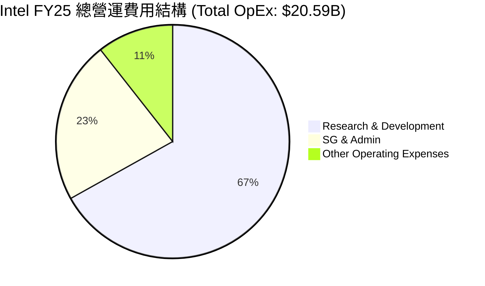

```
╔══════════════════════════════════════════════════════════════════╗
║              Intel 研發費用 (R&D) 與營收佔比趨勢                 ║
╠══════════════════════════════════════════════════════════════════╣
║                                                                  ║
║  FY22  $17.53B  ▓▓▓▓▓▓▓▓▓▓▓▓▓▓▓▓▓▓▓▓▓▓▓▓▓▓▓▓  R&D/Rev: 27.8%     ║
║  FY23  $16.05B  ▓▓▓▓▓▓▓▓▓▓▓▓▓▓▓▓▓▓▓▓▓▓▓▓▓░░░  R&D/Rev: 29.6%     ║
║  FY24  $16.55B  ▓▓▓▓▓▓▓▓▓▓▓▓▓▓▓▓▓▓▓▓▓▓▓▓▓▓░░  R&D/Rev: 31.2%     ║
║  FY25  $13.77B  ▓▓▓▓▓▓▓▓▓▓▓▓▓▓▓▓▓▓▓▓░░░░░░░░  R&D/Rev: 26.1%     ║
║                                                                  ║
║  💡 評估：FY25 R&D 絕對值大幅縮減 16.8%，反映非核心項目（如部分   ║
║     網路與邊緣產品、獨立顯卡研發）的精簡與聚焦。                 ║
╚══════════════════════════════════════════════════════════════════╝
```

### 3.5 季度 EPS 趨勢與盈餘品質

過去四個季度中，Intel 的 GAAP EPS 表現出極大的波動性：

*   **Q1 2026 (EPS: -$0.73)**：大幅虧損，主要受累於 $4.07B 的「其他營運費用」（預計為晶圓廠資產減值與員工遣散費等一次性重組開支）。
*   **Q4 2025 (EPS: -$0.12)**：PC 市場季節性回暖，但代工部門虧損抵消了利潤。
*   **Q3 2025 (EPS: +$0.90)**：表現優異，但其盈餘品質（Quality of Earnings）較低。該季度淨利潤大增主要來自於「非營運收益」達 $3.67B（主要為出售 Mobileye 或 Altera 部分股權的一次性投資收益），而非核心業務經營性利潤。
*   **Q2 2025 (EPS: -$0.67)**：主要受製程轉換期及代工部門產能利用率低谷影響。

**盈餘品質總結**：🔴 **低品質**。Intel 的 GAAP 淨利潤高度依賴非經常性項目（如政府補貼確認、資產處置收益、非營運投資公允價值變動）。其扣除非經常性損益後的扣非營運利潤（Non-GAAP Operating Income）仍處於損益平衡線邊緣，表明核心業務的造血功能尚未完全恢復。

---

## 4. 資產負債表分析

### 4.1 資產結構分解

Intel 是一家重資產公司，其資產結構中，不動產、廠房及設備（PP&E）佔據絕對主導地位。

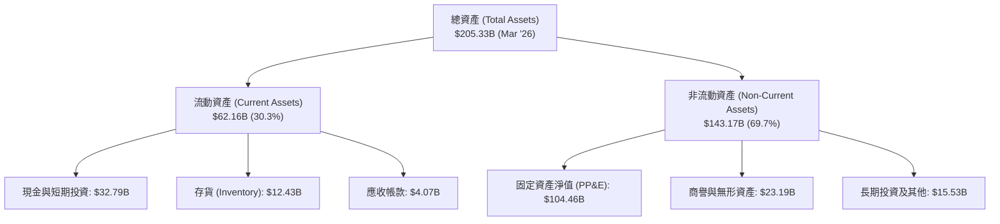

### 4.2 流動性指標分析

從短期償債能力來看，Intel 目前擁有非常寬裕的緩衝空間：

*   **流動比率 (Current Ratio)**：**2.31** (Mar '26)，高於行業平均值 (~1.85)。
*   **速動比率 (Quick Ratio)**：**1.66** (Mar '26)，表明扣除變現能力較慢的存貨 ($12.43B) 後，其即期流動性依然健康。
*   **存貨周轉天數 (Days Inventory Outstanding, DIO)**：TTM 數據顯示其存貨周轉天數約為 **120 天**，處於歷史偏高水平，反映 PC 與伺服器晶片的去庫存雖已結束，但備貨依然謹慎。

### 4.3 債務結構分析

```
╔══════════════════════════════════════════════════════════════════╗
║                   Intel 債務健康診斷 (2026 Q1)                  ║
╠══════════════════════════════════════════════════════════════════╣
║                                                                  ║
║  總債務 (Total Debt)：    $45.03B  ██████████████░░░░░░░░░       ║
║  ├── 短期債務：          $2.00B                                  ║
║  └── 長期債務：          $43.03B                                  ║
║                                                                  ║
║  總現金及等價物：         $32.79B  ██████████░░░░░░░░░░░░░       ║
║                                                                  ║
║  淨債務 (Net Debt)：     -$12.24B (淨負債狀態)                   ║
║                                                                  ║
║  Debt/Equity 比率：      36.03%   🟢 槓桿率適中                  ║
║  EBITDA 利息保障倍數：    ~6.5x    🟡 尚可，但利息支出壓力增加    ║
║                                                                  ║
║  📊 診斷：雖然賬面債務高達 $45.03B，但由於其手握 $32.79B 的高額  ║
║     現金緩衝，短期內並無債務違約風險。然而，隨著未來建廠資金     ║
║     持續流出，若無法實現經營性現金流轉正，債務規模將進一步擴大。 ║
╚══════════════════════════════════════════════════════════════════╝
```

### 4.4 股東權益趨勢

Intel 的股東權益（Stockholders' Equity）在 FY24 下跌至 $99.27B 後，於 FY25 回升至 $114.28B。這一增長並非來自留存收益（Retained Earnings）的累積，而是因為 Intel 在 FY25 進行了股權融資、引入了外部合夥人（如 Brookfield 與 Apollo 共同投資其愛爾蘭與亞利桑那晶圓廠合資公司），這在會計上增加了少數股東權益與資本公積。

---

## 5. 現金流量深度分析

現金流量表是評估 Intel 當前 IDM 2.0 戰略代價的最真實鏡頭。

### 5.1 現金流量瀑布圖 (TTM 數據)

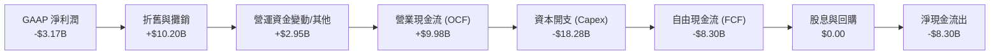

### 5.2 FCF 轉換率趨勢

Intel 的自由現金流在過去四年中持續為負，顯示出極其嚴重的「失血」特徵。

| 現金流指標 | FY22 | FY23 | FY24 | FY25 | TTM (Mar '26) |
|---|---|---|---|---|---|
| **營業現金流 (OCF)** | $15.43B | $11.47B | $8.29B | $9.70B | **$9.98B** |
| **資本支出 (Capex)** | -$24.84B | -$25.75B | -$23.94B | -$14.65B | **-$18.28B** |
| **自由現金流 (FCF)** | -$9.41B | -$14.28B | -$15.66B | -$4.95B | **-$8.30B** |
| **FCF 轉換率 (FCF/NI)** | -117.4% | -851.6% | 81.4% | -19038% | **-261.8%** |

*註：FY25 FCF/NI 出現極端值是由於該年淨利潤極低（僅 $26M），而 FCF 為 -$4.95B。*

### 5.3 自由現金流趨勢

```
╔══════════════════════════════════════════════════════════════════╗
║                Intel 歷年自由現金流失血狀況                      ║
╠══════════════════════════════════════════════════════════════════╣
║                                                                  ║
║  FY22   -$9.41B  █████████░░░░░░░░░░░░░░░░░░░                    ║
║  FY23  -$14.28B  ██████████████░░░░░░░░░░░░░░                    ║
║  FY24  -$15.66B  ████████████████░░░░░░░░░░░░                    ║
║  FY25   -$4.95B  █████░░░░░░░░░░░░░░░░░░░░░░░                    ║
║  TTM    -$8.30B  ████████░░░░░░░░░░░░░░░░░░░░                    ║
║                                                                  ║
║  ⚠️ FCF 收益率 (FCF Yield)：-1.33% (以市值 $626.09B 計算)        ║
║                                                                  ║
║  💡 深度解析：雖然 FY25 通過控制建廠節奏將 FCF 虧損縮窄至 -$4.95B，║
║     但 TTM 數據顯示失血再度擴大至 -$8.30B。這表明 18A 節點的量產 ║
║     準備與全球建廠計畫（俄亥俄州與德國廠）依然在瘋狂消耗資金。   ║
╚══════════════════════════════════════════════════════════════════╝
```

### 5.4 資本配置評估

為了應對極端的資金壓力，Intel 在資本配置上做出了實質性妥協：

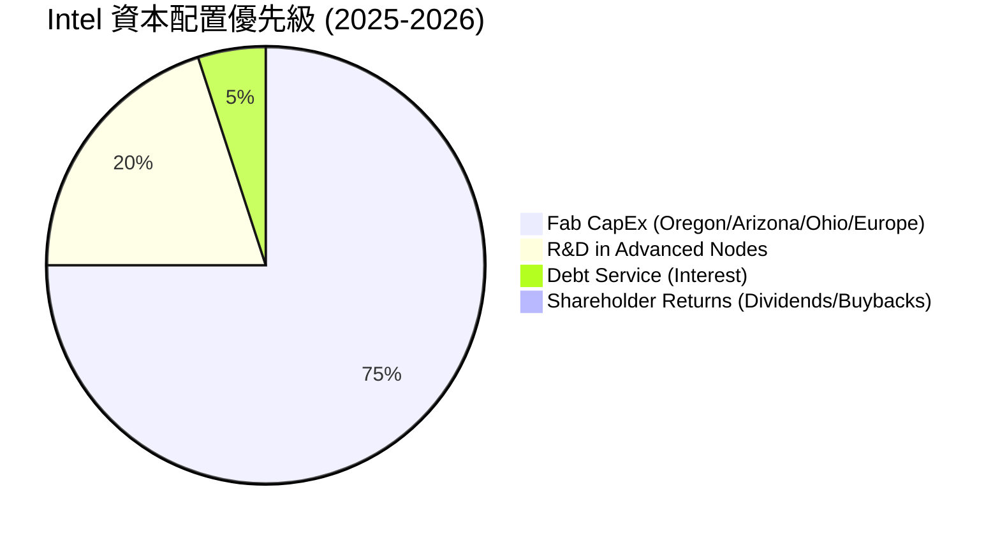

1.  **暫停股息發放**：Intel 已於 2024 年底完全暫停了普通股股息發放（Dividend Paid 降至 $0），以保留寶貴的現金。這標誌著其過去作為「優質股息成長股」歷史的終結。
2.  **聯合基礎設施基金 (SCIP)**：Intel 創造性地引入了 Brookfield ($15B) 和 Apollo ($11B) 作為晶圓廠項目的股權合夥人，通過出讓未來晶圓廠的部分收益權，換取即期的建廠資金。這種融資模式雖然緩解了現金流壓力，但**稀釋了 Intel 未來在晶圓代工業務上的利潤分成**。

---

## 6. 獲利能力與資本效率

### 6.1 ROE / ROA / ROIC 趨勢

Intel 的資本效率指標目前極其低迷，顯著低於歷史平均水平與行業中位數。

| 指標 | FY22 | FY23 | FY24 | FY25 | TTM | 行業均值 (2026) |
|---|---|---|---|---|---|---|
| **ROE** | 7.90% | 1.60% | -18.89% | -0.23% | **-2.90%** | ~18.5% |
| **ROA** | 4.40% | 0.87% | -9.79% | 0.01% | **0.60%** | ~9.2% |
| **ROIC** | 1.85% | 0.08% | -5.20% | -0.95% | **-1.10%** | ~14.0% |

### 6.2 ROIC vs WACC 分析（核心價值創造判斷）

對於一家處於重資本轉型期的企業，ROIC（投入資本回報率）是否大於 WACC（加權平均資本成本）是衡量其是否在「創造價值」還是「摧毀股東價值」的終極指標。

```
╔══════════════════════════════════════════════════════════════════╗
║                INTC ROIC vs WACC 深度分析 (TTM)                  ║
╠══════════════════════════════════════════════════════════════════╣
║                                                                  ║
║  WACC 估算：                                                     ║
║  ├── 無風險利率 (10Y 美債)：  4.25%                              ║
║  ├── 市場風險溢酬 (ERP)：     5.00%                              ║
║  ├── Beta (系統性風險)：      2.228 (極高波動性)                 ║
║  ├── 股權成本 (Ke)：          4.25% + 2.228 × 5.0% = 15.39%     ║
║  ├── 債務成本 (Kd，稅後)：    4.50%                              ║
║  ├── 資本結構：股權占 ~63.7%，債務占 ~36.3%                      ║
║  └── ✅ WACC ≈ 11.44%                                            ║
║                                                                  ║
║  ROIC 估算：                                                     ║
║  ├── NOPAT (TTM 稅後營業淨利)： ~$3.10B                          ║
║  ├── 投入資本 (Invested Capital)： ~$126.5B                      ║
║  └── ✅ ROIC ≈ -1.10%                                            ║
║                                                                  ║
║  ★ 經濟增加值 (EVA) = ROIC - WACC = -12.54%                      ║
║                                                                  ║
║  ROIC  -1.10%  ░░░░░░░░░░░░░░░░░░░░░░░░░░░░░░░  🔴               ║
║  WACC  11.44%  ▓▓▓▓▓▓▓▓▓▓▓▓▓▓▓░░░░░░░░░░░░░░░░  ──               ║
║  EVA   -12.5%  ███████████████████████████████  🔴 嚴重摧毀價值  ║
║                                                                  ║
║  📊 結論：Intel 當前的 ROIC 顯著低於其高企的 WACC (11.44%)。由於  ║
║     Beta 高達 2.228，市場要求的權益回報率極高。Intel 每投入一塊  ║
║     錢，目前都在「摧毀」股東價值。這解釋了為什麼其估值不能以     ║
║     傳統的穩定利潤模型來衡量，而必須看作期權估值。               ║
╚══════════════════════════════════════════════════════════════════╝
```

### 6.3 杜邦三因素分解

我們通過杜邦分析（DuPont Analysis）來解構 Intel ROE 惡化的深層原因：

$$\text{ROE} = \text{淨利率 (Net Margin)} \times \text{資產周轉率 (Asset Turnover)} \times \text{權益乘數 (Equity Multiplier)}$$

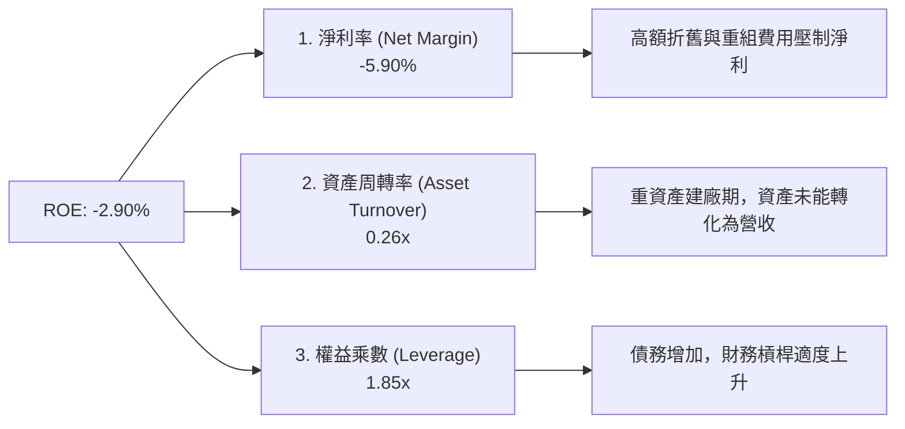

1.  **淨利率 (-5.90%)**：是拉低 ROE 的最核心因素。說明晶圓廠運作的高固定成本與研發支出侵蝕了所有利潤。
2.  **資產周轉率 (0.26x)**：極低。Intel 擁有高達 $205.33B 的總資產，但一年僅能產生 $53.76B 的營收。大量資產處於「在建工程」狀態（Ohio/Germany 廠房），尚未開始貢獻營收。
3.  **權益乘數 (1.85x)**：適度。表明公司並未過度利用財務槓桿，債務風險仍在可控範圍。

### 6.4 獲利能力驅動因素

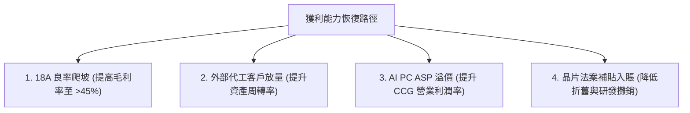

---

## 7. 估值深度分析

Intel 當前的估值極其複雜。由於 TTM 淨利潤為負，其滾動 P/E 為 N/A。而其股