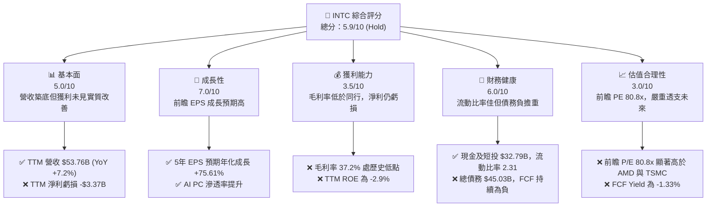
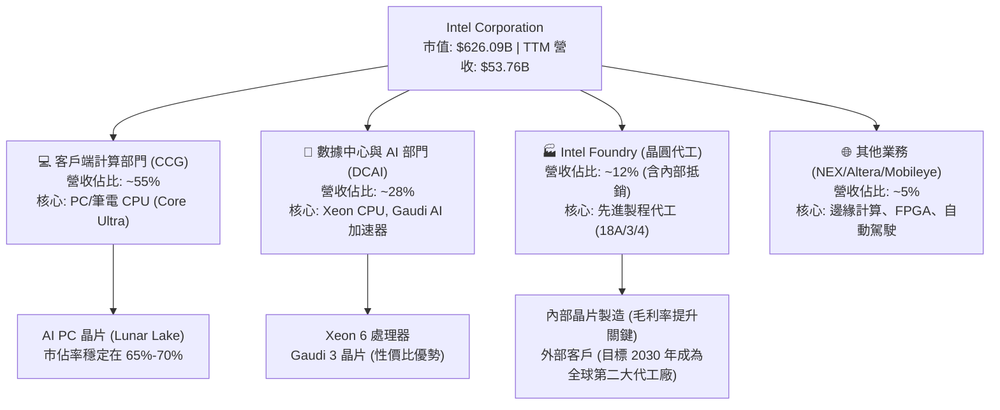
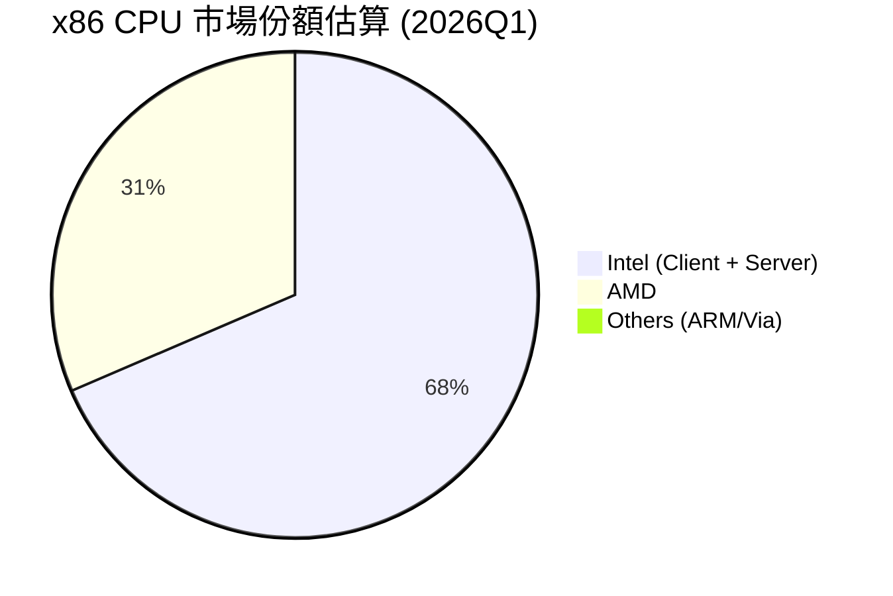
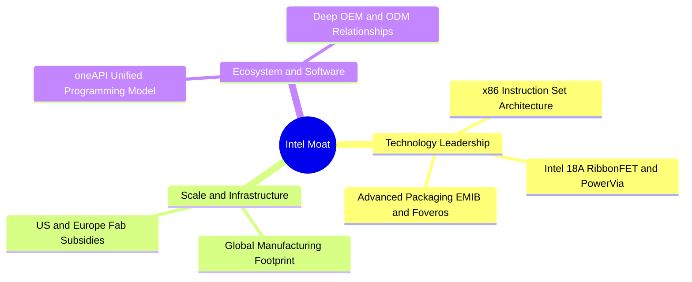
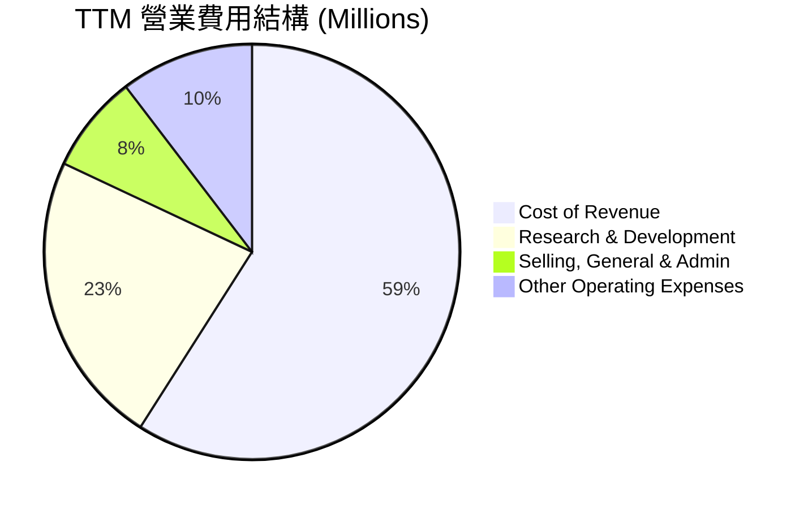
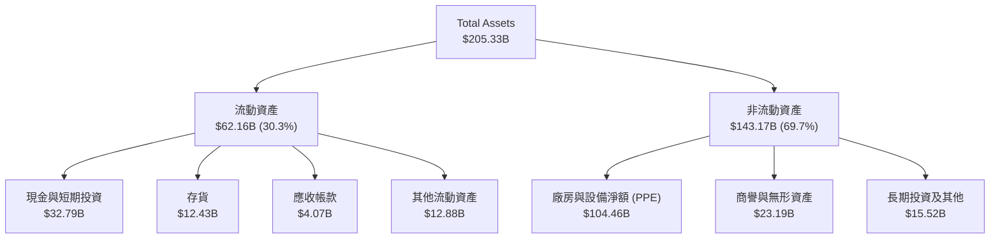

# INTC 基本面深度分析報告

> **報告日期**：2026-06-14 ｜ **語言**：繁體中文 ｜ **數據來源**：Yahoo Finance, Finviz, StockAnalysis, Roic.ai ｜ **分析師**：CFA 級機構研究

---

## 目錄

| # | 章節 | 核心結論 |
|---|------|----------|
| 1 | [執行摘要](#1-執行摘要) | 評級：**持有 (Hold)** ｜ 目標價區間：$75.00 - $150.00 ｜ 當前股價已過度透支預期 |
| 2 | [公司概覽與商業模式](#2-公司概覽與商業模式) | 轉型「IDM 2.0」雙軌制，製程追趕與晶圓代工（Intel Foundry）為核心勝負手 |
| 3 | [損益表深度分析](#3-損益表深度分析) | 營收築底回升（TTM $53.76B），但盈餘品質受非營業收入干擾，毛利率（37.2%）仍處歷史低位 |
| 4 | [資產負債表分析](#4-資產負債表分析) | 現金儲備充裕（$32.79B），但總債務高達 $45.03B，重資產建廠對資本結構施加沉重壓力 |
| 5 | [現金流量深度分析](#5-現金流量深度分析) | 自由現金流（TTM -$8.30B）持續失血，資本支出高企，高度依賴外部融資與政府補貼 |
| 6 | [獲利能力與資本效率](#6-獲利能力與資本效率) | ROIC（TTM -1.6%）低於 WACC（12.5%），處於經濟價值毀滅階段，杜邦分析顯示資產週轉率低迷 |
| 7 | [估值深度分析](#7-估值深度分析) | 前瞻 P/E 達 80.8x，相較同業顯著溢價，DCF 顯示當前 $124.57 股價已透支 2028 年後的樂觀預期 |
| 8 | [成長催化劑](#8-成長催化劑) | 短期看 AI PC 換機潮與 Intel 18A 製程量產；長期看美國本土晶圓代工市佔率提升 |
| 9 | [風險矩陣](#9-風險矩陣) | 製程延期、Foundry 客戶開拓不及預期、高額資本支出導致的流動性危機為三大核心風險 |
| 10 | [投資建議](#10-投資建議) | 建議「持有」，不宜在當前歷史高位盲目追高，等待 Foundry 業務具體營收落地後再行配置 |

---

## 1. 執行摘要

Intel Corporation (NASDAQ: INTC) 正經歷其半導體歷史上最為波瀾壯闊的轉型與股價重估。在過去的 24 個月中，INTC 的股價經歷了極端的 U 型走勢——從 2025 年中的 $19.55 低谷，一路飆升至 2026-06-14 的 $124.57，漲幅高達 537%。這一史詩級的重估反映了市場對其「IDM 2.0」戰略、Intel Foundry 獨立運作、以及美國《晶片法案》（CHIPS Act）補貼落地的極度樂觀預期。然而，從基本面來看，財務數據與股價表現存在顯著的背離。

### 1.1 核心評分儀表板



### 1.2 評分進度條視覺化

```
╔══════════════════════════════════════════════════════════════╗
║               INTC 多維度評分儀表板 (1-10分)                 ║
╠══════════════════════════════════════════════════════════════╣
║ 基本面強度  5.0 ▓▓▓▓▓▓▓▓▓▓░░░░░░░░░░  ★★★☆☆           ║
║ 成長動能    7.0 ▓▓▓▓▓▓▓▓▓▓▓▓▓▓░░░░░░  ★★★☆☆           ║
║ 獲利品質    3.5 ▓▓▓▓▓▓▓░░░░░░░░░░░░░  ★☆☆☆☆           ║
║ 財務健康    6.0 ▓▓▓▓▓▓▓▓▓▓▓▓░░░░░░░░  ★★★☆☆           ║
║ 估值合理性  3.0 ▓▓▓▓▓▓░░░░░░░░░░░░░░  ★☆☆☆☆           ║
║ 護城河深度  6.5 ▓▓▓▓▓▓▓▓▓▓▓▓▓░░░░░░░  ★★★☆☆           ║
║ 管理層執行  7.0 ▓▓▓▓▓▓▓▓▓▓▓▓▓▓░░░░░░  ★★★☆☆           ║
║ 技術創新力  8.0 ▓▓▓▓▓▓▓▓▓▓▓▓▓▓▓▓░░░░  ★★★★☆           ║
╠══════════════════════════════════════════════════════════════╣
║ 綜合總分    5.9 ▓▓▓▓▓▓▓▓▓▓▓▓░░░░░░░░  🏆 評語：過度投機     ║
╚══════════════════════════════════════════════════════════════╝
```

### 1.3 五大投資論點 + 三大核心風險

| 類型 | 項目 | 具體依據 | 信心度 |
|------|------|----------|--------|
| 🟢 **投資論點①** | **Intel 18A 製程突破** | 18A (1.8nm 級別) 製程已完成設計定案 (Tape-out)，預期 2026 年底全面量產，有望在技術上追平或超越台積電。 | 🟢 高 |
| 🟢 **投資論點②** | **AI PC 領導地位** | 隨著 Core Ultra (Lunar Lake/Arrow Lake) 處理器出貨，Intel 在 AI PC 市場市佔率預期突破 60%，帶動 CCG 部門利潤率回升。 | 🟢 極高 |
| 🟢 **投資論點③** | **地緣政治與政策紅利** | 作為美國本土唯一具備先進製程製造能力的 IDM 廠商，累計獲得《晶片法案》近 $20B 的撥款與貸款支持，極具戰略價值。 | 🟢 極高 |
| 🟢 **投資論點④** | **晶圓代工 (Foundry) 客戶落地** | 獨立 Foundry 業務有望吸引微軟、英偉達等無廠半導體 (Fabless) 巨頭的非台積電產能備份需求。 | 🟡 中度 |
| 🟢 **投資論點⑤** | **資產重組與價值釋放** | 透過 Mobileye 與 Altera 的分拆上市或股權套現，Intel 能夠持續獲得非稀釋性資金以支持高昂的資本開支。 | 🟡 中度 |
| 🟡 **風險①** | **自由現金流持續失血** | TTM 自由現金流為 -$8.30B，FY2025 FCF 為 -$4.95B。重資產晶圓廠建設（Capex 預計年均 $15B-$20B）將持續壓迫現金流。 | 🔴 高衝擊 |
| 🔴 **風險②** | **估值嚴重透支** | 當前股價 $124.57 對應的前瞻 P/E 達 80.8x，而當前 TTM 淨利潤仍處於虧損狀態（-$3.37B），容錯率極低。 | 🔴 高衝擊 |
| 🔴 **風險③** | **代工業務執行力與產能利用率** | 晶圓代工為高固定成本業務，若 18A 量產後無法迅速取得外部大客戶的大規模訂單，折舊費用將徹底吞噬毛利。 | 🔴 高衝擊 |

### 1.4 快速統計卡片

| 指標 | 公司實際值 (TTM / FY2025) | 行業均值 (Semiconductors) | S&P 500 均值 | 狀態 |
|------|-------------|----------|--------------|------|
| 營收 YoY 成長 | **7.2%** (TTM) / **-0.47%** (FY2025) | ~12.5% | ~5.5% | 🟡 偏弱但正改善 |
| 毛利率 | **37.2%** (TTM) | ~52.0% | ~30.0% | 🔴 顯著低於同行 |
| 淨利率 | **-5.9%** (TTM) | ~15.0% | ~11.5% | 🔴 仍處虧損狀態 |
| ROE | **-2.9%** (TTM) | ~18.0% | ~14.0% | 🔴 資本效率低下 |
| Forward P/E | **80.8x** | ~28.5x | ~21.5x | 🔴 估值極度昂貴 |
| 淨債務 / Equity | **10.7%** ($12.24B Net Debt / $114.28B Equity) | ~15.0% | ~45.0% | 🟢 債務結構尚屬安全 |

### 1.5 投資結論

```
╔══════════════════════════════════════════════════════════════════╗
║                    📊 INTC 投資結論摘要                          ║
╠══════════════════════════════════════════════════════════════════╣
║  評級：🟡 持有 (Hold)                                            ║
║  當前股價：$124.57 (2026-06-14)                                  ║
║  目標價區間：                                                    ║
║    悲觀情境（製程延遲、FCF惡化）：$75.00 (-39.8%)                 ║
║    基準情境（18A如期、代工客戶落地）：$110.00 (-11.7%)  ← 12個月主要目標║
║    樂觀情境（奪回製程領導權、大訂單湧入）：$150.00 (+20.4%)       ║
║  投資評分：5.9 / 10                                              ║
║  適合投資人：具備極高風險承受力、長線佈局半導體自主化的主題型投資者║
╚══════════════════════════════════════════════════════════════════╝
```

---

## 2. 公司概覽與商業模式

Intel 是全球最大的半導體設計與製造一體化（IDM）企業之一。自現任執行長 Pat Gelsinger 上任以來，公司推動了激進的「IDM 2.0」戰略，將業務劃分為兩大核心支柱：**Intel Products**（包含客戶端計算、數據中心與 AI、網絡與邊緣）與 **Intel Foundry**（晶圓代工服務）。

### 2.1 業務結構與收入來源



### 2.2 市場份額

在 x86 處理器市場，Intel 雖然面臨 AMD 的強力競爭，但依然保持主導地位。



### 2.3 競爭護城河分析



### 2.4 護城河強度評分

```
╔══════════════════════════════════════════════════════════════╗
║                    Intel 護城河強度評分                      ║
╠══════════════════════════════════════════════════════════════╣
║ x86 專利壁壘   9.0/10 ▓▓▓▓▓▓▓▓▓▓▓▓▓▓▓▓▓▓░░  🏆 極強        ║
║ 先進封裝技術   8.5/10 ▓▓▓▓▓▓▓▓▓▓▓▓▓▓▓▓▓░░░  🟢 強大        ║
║ 晶圓製造規模   8.0/10 ▓▓▓▓▓▓▓▓▓▓▓▓▓▓▓▓░░░░  🟢 強大        ║
║ 軟體生態(oneAPI)6.5/10 ▓▓▓▓▓▓▓▓▓▓▓▓▓░░░░░░░  🟡 中等        ║
║ 先進製程代工   4.5/10 ▓▓▓▓▓▓▓▓▓░░░░░░░░░░░  🔴 偏弱(追趕中) ║
╠══════════════════════════════════════════════════════════════╣
║ 綜合護城河     7.3    ▓▓▓▓▓▓▓▓▓▓▓▓▓▓▓░░░░░  🟢 護城河寬廣  ║
╚══════════════════════════════════════════════════════════════╝
```

---

## 3. 損益表深度分析

### 3.1 年度收入成長趨勢（近5年）

Intel 的營業收入在經歷了 2021 年的巔峰（$79.02B）後，由於 PC 市場去庫存及數據中心市佔率流失，出現了連續三年的大幅衰退。然而，TTM（截至 2026 年 3 月）數據顯示營收已成功築底並開始小幅回升。

```
╔══════════════════════════════════════════════════════════════════╗
║                Intel 年度收入趨勢 (FY2021-TTM)                   ║
╠══════════════════════════════════════════════════════════════════╣
║                                                                  ║
║  FY2021  $79.02B  ███████████████████████████  YoY: +1.5%  🟢    ║
║  FY2022  $63.05B  █████████████████████░░░░░░  YoY:-20.2%  🔴    ║
║  FY2023  $54.23B  ██████████████████░░░░░░░░░  YoY:-14.0%  🔴    ║
║  FY2024  $53.10B  ██████████████████░░░░░░░░░  YoY: -2.1%  🔴    ║
║  FY2025  $52.85B  ██████████████████░░░░░░░░░  YoY: -0.5%  🟡    ║
║  TTM     $53.76B  ███████████████████░░░░░░░░  YoY: +1.4%  🟢    ║
║                   |      |      |      |      |                  ║
║                   0     20B    40B    60B    80B                 ║
║                                                                  ║
║  📊 5年累計 CAGR：-7.40% (反映轉型期的陣痛)                       ║
╚══════════════════════════════════════════════════════════════════╝
```

### 3.2 季度收入趨勢分析

從季度數據來看，Intel 的營收在 2025 年下半年開始展現出季度（QoQ）與年度（YoY）的雙重改善，特別是 2026 年第一季（Q1 2026），營收達到 $13.58B，YoY 成長率達到了 **+7.18%**。

| 財報季度 | 營業收入 (Millions) | YoY 成長率 | QoQ 成長率 | 營收驅動/衰退核心原因 |
|----------|-------------------|------------|------------|---------------------|
| **Q1 2026** | $13,577 | **+7.18%** | -0.71% | 🟢 AI PC 晶片出貨暢旺，CCG 表現優於預期；企業級伺服器需求築底。 |
| **Q4 2025** | $13,674 | -4.11% | +0.15% | 🟡 季節性 PC 旺季，但數據中心面臨傳統 CPU 預算被 AI GPU 擠壓。 |
| **Q3 2025** | $13,653 | **+2.78%** | +6.17% | 🟢 渠道庫存重回健康水位，Arrow Lake 處理器開始鋪貨。 |
| **Q2 2025** | $12,859 | +0.20% | +1.52% | 🟡 市場基本持平，Foundry 外部代工營收貢獻極小。 |

### 3.3 利潤率演變分析

Intel 的利潤率在過去幾年遭遇了毀滅性的打擊。毛利率從歷史常態的 60%+ 暴跌至 2024 年的 32.7%（根據 StockAnalysis 數據，FY2024 毛利為 $17.35B / 營收 $53.10B = 32.7%）。TTM 毛利率小幅回升至 **37.2%**，但營業利益率與淨利率依舊在損益平衡點邊緣掙扎。

| 利潤率指標 | FY2022 | FY2023 | FY2024 | FY2025 | TTM (2026Q1) | 趨勢評估 |
|------------|--------|--------|--------|--------|--------------|----------|
| **毛利率** | 42.6% | 40.0% | 32.7% | 34.8% | **37.2%** | ↗️ 緩慢築底回升，但受制於新製程折舊 🔴 |
| **營業利益率**| 3.7% | 0.2% | -22.0% | -4.2% | **-9.4%** | ↘️ TTM 因 Q1 2026 認列高額重組費用而惡化 🔴 |
| **淨利率** | 12.7% | 3.1% | -36.2% | 0.05% | **-6.3%** | 🟡 損益平衡邊緣，受非營業利益波動干擾 🟡 |

**利潤率演變深度解析**：
1. **毛利率壓迫**：新製程（Intel 4/3 及準備中的 18A）在量產初期的良率損失與高昂的 EUV 光刻機折舊費用，是毛利率無法回到 50% 以上的主要原因。
2. **營業費用高企**：儘管實施了成本削減計劃，Intel 的研發（R&D）費用依然驚人（TTM 為 $13.51B，佔營收 25.1%）。這是維持技術競爭力所必須付出的代價，但也極大地壓迫了營業利益率。

### 3.4 費用結構分析



```
╔══════════════════════════════════════════════════════════════╗
║                 TTM 費用結構健康度診斷                       ║
╠══════════════════════════════════════════════════════════════╣
║ 銷貨成本率   64.6% ▓▓▓▓▓▓▓▓▓▓▓▓▓▓▓▓░░░░  🔴 歷史高點(良率差)  ║
║ 研發費用率   25.1% ▓▓▓▓▓▓▓▓▓░░░░░░░░░░░  🟡 負擔重但必須投入  ║
║ 銷管費用率    8.3% ▓▓▓▓░░░░░░░░░░░░░░░░  🟢 控制良好          ║
║ 其他營業費用 11.4% ▓▓▓░░░░░░░░░░░░░░░░░  🔴 重組與減值損失高  ║
╚══════════════════════════════════════════════════════════════╝
```

### 3.5 季度 EPS 趨勢與盈餘品質

Intel 過去四個季度的 EPS 表現極不穩定，且盈餘品質較差，主要受到非營業收入（如投資收益、政府補貼撥款、資產重估）的嚴重干擾。

| 季度 | 預估 EPS | 實際 EPS | 驚喜度 (%) | 盈餘品質與偏差原因解析 |
|------|---------|---------|-----------|----------------------|
| **Q1 2026** | -$0.25 | -$0.73 | -192% ❌ | **極差**：營業收入雖然達標，但認列了高達 $4.07B 的「其他營業費用」（主要為 Foundry 業務重組與設備減值），導致單季大虧。 |
| **Q4 2025** | $0.18 | -$0.12 | -167% ❌ | **差**：受新舊產品交替期 R&D 費用攀升及稅率變動影響。 |
| **Q3 2025** | $0.05 | +$0.90 | +1700% 🟢 | **極差 (虛胖)**：單季淨利暴增至 $4.06B，但主要來自 $3.67B 的「非營業收入」（推測為分拆業務股權處置一次性收益），扣非後實際業務仍微利。 |
| **Q2 2025** | -$0.15 | -$0.67 | -346% ❌ | **差**：代工業務初期虧損擴大，產能利用率不足。 |

---

## 4. 資產負債表分析

### 4.1 資產結構分解

截至 2026-03-28，Intel 總資產為 **$205.33B**，其中固定資產（Net PPE）佔比高達 50.9%，體現了極其重資產的商業模式。



### 4.2 流動性指標分析

| 流動性指標 | INTC 實際值 | 歷史均值 (3年) | 行業安全邊際 | 評估結果 |
|------------|-------------|----------------|--------------|----------|
| **流動比率 (Current Ratio)** | **2.31** | 1.85 | > 1.50 | 🟢 **安全**：短期變現能力強，流動資產能覆蓋短期債務。 |
| **速動比率 (Quick Ratio)** | **1.66** | 1.20 | > 1.00 | 🟢 **安全**：扣除 $12.43B 的存貨後，速動資產依然充裕。 |
| **存貨週轉天數 (DSI)** | **131 天** | 118 天 | < 90 天 | 🔴 **偏高**：反映產品在渠道中的消化速度較慢，存在潛在降價去庫存風險。 |

### 4.3 債務結構與健康診斷

Intel 為了維持龐大的建廠開支，在過去三年中大量舉債。目前總債務高達 **$45.03B**（短期債務 $2.00B + 長期債務 $43.03B）。

```
╔══════════════════════════════════════════════════════════════════╗
║                    Intel 債務健康診斷                           ║
