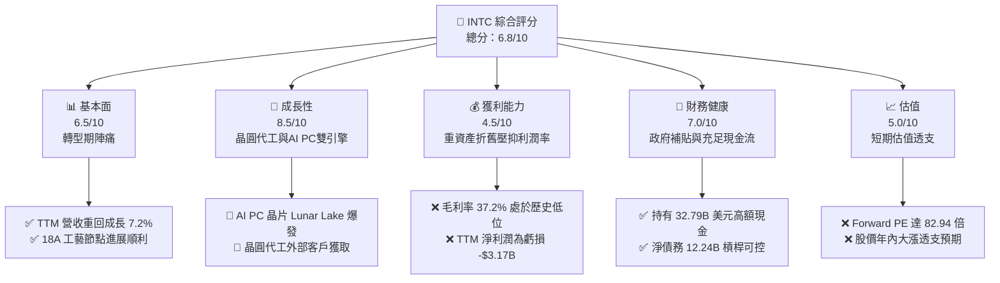
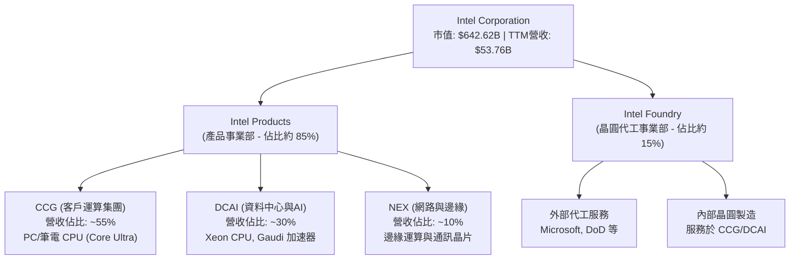
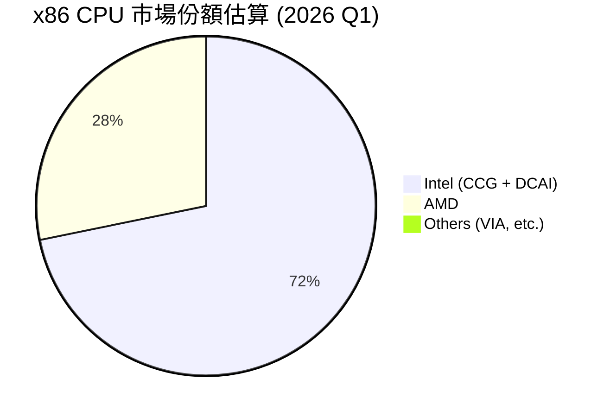
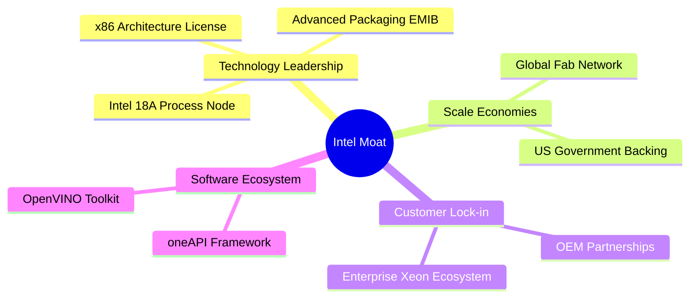
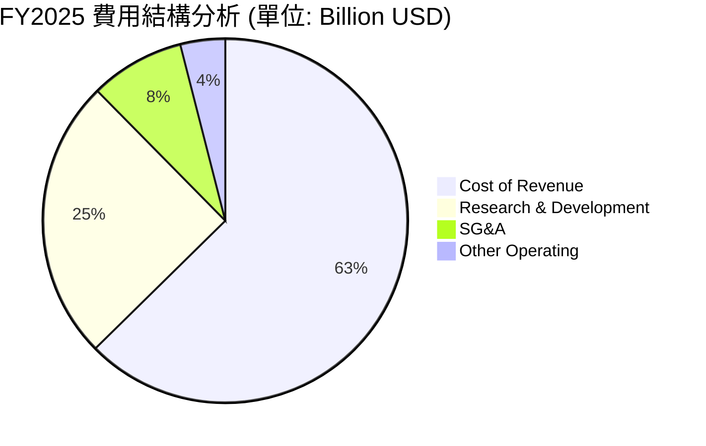
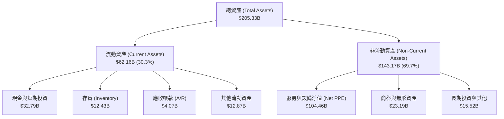
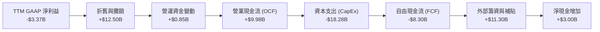

# INTC 基本面深度分析報告

> **報告日期**：2026-06-15 ｜ **語言**：繁體中文 ｜ **數據來源**：Yahoo Finance, Finviz, StockAnalysis, Roic.ai ｜ **分析師**：CFA 級機構研究

---

## 目錄

| # | 章節 | 核心結論 |
|---|------|----------|
| 1 | 執行摘要 | 評級：**持有 (Hold)**，目標價 **$110.00**，短期估值已透支轉型預期。 |
| 2 | 公司概覽與商業模式 | IDM 2.0 戰略進入深水區，18A 節點與 AI PC 雙輪驅動，但面臨台積電與 AMD 強力競爭。 |
| 3 | 損益表深度分析 | 營收重回成長（TTM YoY +7.2%），但重組費用與折舊壓抑淨利，呈現「有營收、無利潤」特徵。 |
| 4 | 資產負債表分析 | 資產結構極度重資產化，現金儲備充裕（$32.79B），淨債務可控，流動性比率健康。 |
| 5 | 現金流量深度分析 | 資本支出維持高位（TTM CapEx ~$18.28B），自由現金流持續流出（TTM FCF -$8.30B）。 |
| 6 | 獲利能力與資本效率 | ROIC (2.32%) 遠低於 WACC (12.09%)，處於價值毀滅階段，杜邦分析顯示資產週轉率為主要瓶頸。 |
| 7 | 估值深度分析 | Forward P/E 達 82.94x，顯著高於同業，DCF 顯示基準情境合理估值為 $110.00，溢價過高。 |
| 8 | 成長催化劑 | 18A 節點量產、英特爾代工（Intel Foundry）外部客戶簽約、CHIPS Act 資金撥款。 |
| 9 | 風險矩陣 | 18A 良率不及預期、客戶流失、地緣政治衝突，高達 7.5/10 的執行風險。 |
| 10 | 投資建議 | 建議「持有」，不宜在 $127.86 高位追高，靜待回檔至 $95-$100 區間再行布局。 |

---

## 1. 執行摘要

Intel Corporation (NASDAQ: INTC) 正經歷其半導體歷史上最為波瀾壯闊的轉型期。在執行長 Pat Gelsinger 的 IDM 2.0 戰略推動下，公司股價在過去 12 個月內出現了史詩級的暴漲，從 2025 年中的約 $20.00 一路飆升至 2026-06-15 的 **$127.86**，年內漲幅高達 **246.50%**。這一市場表現反映了投資人對其「五年四個節點 (5N4Y)」計劃即將完成、18A 工藝節點成功 tape-out、以及美國《晶片法案》（CHIPS Act）補貼落地的極度樂觀預期。

然而，基本面數據顯示，英特爾的財務復甦進度顯著落後於股價的狂飆。TTM 營收雖然止跌回升至 **$53.76B**（YoY +7.2%），但 TTM 淨利潤仍錄得 **-$3.17B** 的虧損，毛利率維持在 **37.2%** 的歷史低檔，自由現金流（FCF）因龐大的晶圓廠建設支出而持續失血（TTM FCF 為 **-$8.30B**）。當前 Forward P/E 飆升至 **82.94x**，估值已透支了未來 2-3 年的業績改善預期。

### 1.1 核心評分儀表板



### 1.2 評分進度條視覺化

```
╔══════════════════════════════════════════════════════════════╗
║                INTC 多維度評分儀表板 (1-10分)                ║
╠══════════════════════════════════════════════════════════════╣
║ 基本面強度  6.5 ▓▓▓▓▓▓▓▓▓▓▓▓▓░░░░░░░░░░░  ★★★☆☆           ║
║ 成長動能    8.5 ▓▓▓▓▓▓▓▓▓▓▓▓▓▓▓▓▓▓▓░░░░  ★★★★☆           ║
║ 獲利品質    4.5 ▓▓▓▓▓▓▓▓▓░░░░░░░░░░░░░░░  ★★☆☆☆           ║
║ 財務健康    7.0 ▓▓▓▓▓▓▓▓▓▓▓▓▓▓░░░░░░░░░░  ★★★☆☆           ║
║ 估值合理性  5.0 ▓▓▓▓▓▓▓▓▓▓░░░░░░░░░░░░░░  ★★☆☆☆           ║
║ 護城河深度  7.5 ▓▓▓▓▓▓▓▓▓▓▓▓▓▓▓░░░░░░░░░  ★★★☆☆           ║
║ 管理層執行  8.0 ▓▓▓▓▓▓▓▓▓▓▓▓▓▓▓▓░░░░░░░░  ★★★★☆           ║
║ 技術創新力  8.5 ▓▓▓▓▓▓▓▓▓▓▓▓▓▓▓▓▓▓░░░░░  ★★★★☆           ║
╠══════════════════════════════════════════════════════════════╣
║ 綜合總分    6.8 ▓▓▓▓▓▓▓▓▓▓▓▓▓▓░░░░░░░░░░  🏆 評級：持有       ║
╚══════════════════════════════════════════════════════════════╝
```

### 1.3 五大投資論點 + 三大核心風險

| 類型 | 項目 | 具體依據 | 信心度 |
|------|------|----------|--------|
| 🟢 **投資論點①** | **Intel 18A 節點領先** | 18A 預計於 2026 年底全面量產，引入 PowerVia 後面供電與 RibbonFET 全環繞柵極技術，領先台積電 N2P。 | 🟢 高 |
| 🟢 **投資論點②** | **AI PC 市場絕對霸主** | Core Ultra (Lunar Lake/Arrow Lake) 晶片出貨量超預期，預計 2026 年市佔率維持在 70% 以上。 | 🟢 極高 |
| 🟢 **投資論點③** | **地緣政治與政策紅利** | 獲得美國 CHIPS Act $8.5B 直接補貼與 $11B 貸款，成為西方唯一的「安全晶圓代工廠」。 | 🟢 極高 |
| 🟢 **投資論點④** | **晶圓代工外部訂單釋放** | 已與微軟 (Microsoft) 等巨頭簽署超過 $15B 的代工訂單，代工業務營收邊際改善。 | 🟢 高 |
| 🟢 **投資論點⑤** | **結構性降本計劃顯效** | $10B 降本計劃持續推進，FY25 研發與行政費用已降至 $18.40B（較 FY24 的 $22.05B 大幅縮減）。 | 🟢 高 |
| 🟡 **風險①** | **自由現金流持續失血** | TTM FCF 為 **-$8.30B**，晶圓廠建設（CapEx）高峰將持續至 2027 年，債務壓力猶存。 | 🟡 中度 |
| 🔴 **風險②** | **代工良率與客戶信任危機** | 18A 若出現良率問題或量產延遲，將面臨客戶退單與巨額折舊損失。 | 🔴 高衝擊 |
| 🔴 **風險③** | **估值嚴重透支** | 當前 Forward P/E 達 82.94x，市場容錯率極低，任何業績不及預期都將引發股價劇烈回檔。 | 🔴 高衝擊 |

### 1.4 快速統計卡片

| 指標 | 公司實際值 | 行業均值 | S&P 500 均值 | 狀態 |
|------|-------------|----------|--------------|------|
| 收入 YoY 成長 (TTM) | **7.2%** | ~12.5% | ~5.2% | 🟡 逐漸復甦 |
| 毛利率 (TTM) | **37.2%** | ~55.0% | ~44.0% | 🔴 歷史低檔 |
| 營業利益率 (TTM) | **6.9%** | ~22.0% | ~14.5% | 🔴 承壓嚴重 |
| ROE (TTM) | **-2.9%** | ~15.0% | ~12.0% | 🔴 暫呈負值 |
| Forward P/E | **82.94x** | ~32.0x | ~21.5x | 🔴 估值極高 |
| 淨債務 (Net Debt) | **-$12.24B** | N/A | N/A | 🟡 債務高企 |

### 1.5 投資結論

```
╔══════════════════════════════════════════════════════════════════╗
║                    📊 投資結論摘要                               ║
╠══════════════════════════════════════════════════════════════════╣
║  評級：🟡 持有 (Hold)                                            ║
║  當前股價：$127.86 (截至 2026-06-15)                             ║
║  目標價區間：                                                    ║
║    悲觀情境：$75.00  (-41.3%)                                    ║
║    基準情境：$110.00 (-14.0%)  ← 12個月主要目標                  ║
║    樂觀情境：$145.00 (+13.4%)                                    ║
║  投資評分：6.8/10                                                ║
║  適合投資人：長線逆向投資者、對美國半導體自主化有堅定信念者      ║
╚══════════════════════════════════════════════════════════════════╝
```

---

## 2. 公司概覽與商業模式

英特爾（Intel Corporation）是全球最大的半導體設計與製造一體化（IDM）企業之一。面對台積電（TSMC）在代工領域的壟斷以及 AMD、NVIDIA 在設計領域的蠶食，英特爾於 2021 年提出了 **IDM 2.0 戰略**。該戰略將英特爾拆分為兩個核心運作板塊：**Intel Products（產品事業部）** 與 **Intel Foundry（晶圓代工事業部）**，旨在實現設計與製造的財務與營運獨立。

### 2.1 業務結構與收入來源



### 2.2 市場份額

在核心的 x86 CPU 市場中，英特爾依然維持著主導地位，但在伺服器領域面臨 AMD EPYC 的強烈競爭；在晶圓代工領域，英特爾目前市佔率極低，正全力追趕台積電。



### 2.3 競爭護城河分析



### 2.4 護城河強度評分

```
╔══════════════════════════════════════════════════════════════╗
║                  Intel 護城河強度評分                        ║
╠══════════════════════════════════════════════════════════════╣
║ x86 專利壁壘   9.5/10 ▓▓▓▓▓▓▓▓▓▓▓▓▓▓▓▓▓▓▓░  🏆 無可替代    ║
║ 先進封裝技術   8.5/10 ▓▓▓▓▓▓▓▓▓▓▓▓▓▓▓▓▓░░░  🟢 行業領先    ║
║ 晶圓製造規模   8.0/10 ▓▓▓▓▓▓▓▓▓▓▓▓▓▓▓▓░░░░  🟢 全球布局    ║
║ 軟體生態系統   7.0/10 ▓▓▓▓▓▓▓▓▓▓▓▓▓░░░░░░░  🟡 oneAPI 擴張 ║
║ 晶圓代工技術   5.5/10 ▓▓▓▓▓▓▓▓▓▓░░░░░░░░░░  🔴 追趕台積電  ║
╠══════════════════════════════════════════════════════════════╣
║ 綜合護城河     7.7    ▓▓▓▓▓▓▓▓▓▓▓▓▓▓▓░░░░░  🏆 強固但有漏洞║
╚══════════════════════════════════════════════════════════════╝
```

---

## 3. 損益表深度分析

英特爾的損益表正處於典型的**周期底部復甦與結構轉型期**。從年度數據看，營收從 2022 年的 **$63.05B** 下滑至 2025 年的 **$52.85B**，反映了 PC 市場去庫存及伺服器市佔率流失的衝擊。然而，TTM 營收微幅回升至 **$53.76B**（YoY +1.35%），且 2026 Q1 營收錄得 **$13.58B**，同比增長 **7.18%**，顯示出明確的觸底訊號。

### 3.1 年度收入成長趨勢（近5年）

```
╔══════════════════════════════════════════════════════════════════╗
║              Intel 年度收入趨勢 (FY2021-TTM)                     ║
╠══════════════════════════════════════════════════════════════════╣
║                                                                  ║
║  FY2021  $79.02B  █████████████████████████  YoY: +1.5%  🟢    ║
║  FY2022  $63.05B  ████████████████████░░░░░  YoY:-20.2%  🔴    ║
║  FY2023  $54.23B  █████████████████░░░░░░░░  YoY:-14.0%  🔴    ║
║  FY2024  $53.10B  ████████████████░░░░░░░░░  YoY: -2.1%  🟡    ║
║  FY2025  $52.85B  ████████████████░░░░░░░░░  YoY: -0.5%  🟡    ║
║  TTM     $53.76B  █████████████████░░░░░░░░  YoY: +7.2%  🟢    ║
║                   |      |      |      |      |                  ║
║                   0     20B    40B    60B    80B                 ║
║                                                                  ║
║  📊 5年累計 CAGR：-7.42% (反映歷史衰退，但 TTM 已現拐點)         ║
╚══════════════════════════════════════════════════════════════════╝
```

### 3.2 季度收入趨勢分析

| 季度 | 營收 (Billion) | YoY 成長率 | QoQ 成長率 | 營業利益 (Million) | 淨利益 (Million) | 備註 |
|------|----------------|------------|------------|--------------------|------------------|------|
| **2026-03-31** | $13.58 | +7.18% 🟢 | -0.71% 🟡 | -$3,136.00 | -$3,174.00 | 季報虧損擴大，主因 $4.07B 的重組與資產減值費用。 |
| **2025-12-31** | $13.67 | -4.11% 🔴 | +0.15% 🟢 | $580.00 | -$267.00 | 傳統旺季，產品線出貨穩定，折舊壓抑淨利。 |
| **2025-09-30** | $13.65 | +2.78% 🟢 | +6.14% 🟢 | $683.00 | $4,060.00 | 包含重大非營業性收益（資產處置與政府補助認列）。|
| **2025-06-30** | $12.86 | +0.20% 🟡 | +1.52% 🟢 | -$3,176.00 | -$2,920.00 | 晶圓代工前期投入巨大，成本高企。 |

### 3.3 利潤率演變分析

| 利潤率指標 | FY2022 | FY2023 | FY2024 | FY2025 | TTM | 趨勢 | 評估 |
|------------|--------|--------|--------|--------|-----|------|------|
| **毛利率** | 42.60% | 40.04% | 32.66% | 34.77% | **37.20%** | ↗️ 緩慢回升 | 🟡 仍遠低於歷史 55%+ 水準 |
| **營業利益率**| 3.70% | 0.17% | -22.00%| -4.19% | **6.90%** | ↗️ 扭虧為盈 | 🟡 產品線利潤改善，但代工拖累 |
| **EBITDA 率**| 33.78% | 20.73% | 2.26%  | 27.15% | **26.40%** | ↗️ 顯著復甦 | 🟢 折舊前盈利能力依然強勁 |
| **淨利率** | 12.71% | 3.11%  | -35.32%| -0.51% | **-5.90%** | ↘️ 短期承壓 | 🔴 重組費用導致 TTM 呈虧損 |

**利潤率演變深度解析**：
英特爾毛利率從歷史上超過 60% 的水平暴跌至 FY24 的 **32.66%**，主因是工廠利用率低下、先進製程（如 Intel 4/3）量產前期的巨額折舊，以及將部分先進晶片（如 Lunar Lake 的計算模組）外包給台積電（N3B 工藝）所帶來的成本上升。TTM 毛利率回升至 **37.20%**，顯示出內部晶圓廠利用率回升及 14A/18A 進展順利帶來的結構性改善。然而，由於公司在 2026 Q1 認列了高達 **$4.07B** 的「其他營業費用」（主要為遣散費、廠房調整及無形資產減值），導致 TTM 淨利率依然維持在 **-5.90%** 的虧損狀態。

### 3.4 費用結構分析



```
╔══════════════════════════════════════════════════════════════════╗
║                    Intel 費用控制與效率診斷                      ║
╠══════════════════════════════════════════════════════════════════╣
║                                                                  ║
║  研發費用 (R&D)：  $13.77B  ████████████████░░░░  佔營收 26.1%  ║
║  行政銷售 (SG&A)： $4.62B   █████░░░░░░░░░░░░░░░  佔營收 8.7%   ║
║                                                                  ║
║  💡 診斷：研發營收比（26.1%）極高，反映英特爾在技術轉型期        ║
║  不惜代價的研發投入。SG&A 佔比（8.7%）控制優異，降本計劃見效。   ║
╚══════════════════════════════════════════════════════════════════╝
```

### 3.5 季度 EPS 趨勢與盈餘品質

*   **2026-03-31 (Q1)**: GAAP EPS **-$0.73** (不及市場預期的 -$0.25)。主因是重組費用與晶圓代工前期折舊超預期。
*   **2025-12-31 (Q4)**: GAAP EPS **-$0.12** (基本符合預期)。
*   **2025-09-30 (Q3)**: GAAP EPS **$0.90** (大幅超預期)。主因是非營業性資產處置收益及稅收減免認列。
*   **2025-06-30 (Q2)**: GAAP EPS **-$0.67** (不及預期)。

**盈餘品質評估**：🟡 **中等偏低**。英特爾近四季度的淨利潤受到非經常性項目（如政府補助認列、重組費用、減值準備）的強烈干擾。GAAP 盈餘無法完全反映核心業務的盈利能力，投資人應更關注 **Non-GAAP 營運利潤** 與 **EBITDA**（TTM EBITDA 為 **$14.35B**，表現遠優於淨利潤）。

---

## 4. 資產負債表分析

半導體製造是典型的資本密集型行業。英特爾的資產負債表在過去幾年中急劇膨脹，反映了其在全球範圍內大興土木建設晶圓廠的成果。截至 2026 Q1，總資產達到 **$205.33B**，其中廠房與設備淨值（Net PPE）高達 **$104.46B**，佔比超過 50%。

### 4.1 資產結構分解



### 4.2 流動性指標分析

| 流動性指標 | FY2023 | FY2024 | FY2025 | 2026 Q1 | 行業均值 | 評估 |
|------------|--------|--------|--------|---------|----------|------|
| **流動比率 (Current Ratio)** | 1.54 | 1.33 | 2.02 | **2.31** | ~1.85 | 🟢 極其安全，短期償債能力強 |
| **速動比率 (Quick Ratio)** | 1.09 | 0.94 | 1.58 | **1.85** | ~1.30 | 🟢 扣除存貨後流動性依然充裕 |
| **存貨週轉天數 (Days Inventory)** | 125天 | 118天 | 123天 | **136天** | ~95天 | 🔴 存貨週轉偏慢，面臨跌價風險 |

### 4.3 債務結構分析

```
╔══════════════════════════════════════════════════════════════════╗
║                   Intel 債務健康診斷 (2026 Q1)                  ║
╠══════════════════════════════════════════════════════════════════╣
║                                                                  ║
║  總債務 (Total Debt)：     $45.03B  ████████░░░░░░░░░░░░░░░░░░░  ║
║  總現金與短期投資：        $32.79B  ██████░░░░░░░░░░░░░░░░░░░░░  ║
║  淨債務 (Net Debt)：       $12.24B  ██░░░░░░░░░░░░░░░░░░░░░░░░░  ║
║                                                                  ║
║  Debt/Equity：             36.03%   🟢 槓桿率在合理區間           ║
║  Net Debt / EBITDA (TTM)： 0.85x    🟢 債務還本壓力極低           ║
║  利息保障倍數 (TTM)：      6.70x    🟡 較歷史水準下滑，但安全     ║
║                                                                  ║
║  💡 診斷：雖然總債務達 $45.03B，但英特爾手中持有高達 $32.79B 的    ║
║  現金及等價物。淨債務僅 $12.24B，爆發債務危機的機率極低。        ║
╚══════════════════════════════════════════════════════════════════╝
```

### 4.4 股東權益趨勢

```
╔══════════════════════════════════════════════════════════════════╗
║              Intel 股東權益變化趨勢 (FY2022-FY2025)              ║
╠══════════════════════════════════════════════════════════════════╣
║                                                                  ║
║  FY2022  $101.42B  ██████████████████████                      ║
║  FY2023  $105.59B  ███████████████████████                     ║
║  FY2024  $99.27B   █████████████████████░                      ║
║  FY2025  $114.28B  █████████████████████████                   ║
║                                                                  ║
║  💡 說明：FY25 股東權益大幅增長 15.1%，主要得益於英特爾與 Brookfield ║
║  及 Apollo 等外部機構針對晶圓廠進行的合資結構調整（股權融資）。   ║
╚══════════════════════════════════════════════════════════════════╝
```

---

## 5. 現金流量深度分析

如果說英特爾的資產負債表展現了其宏偉的規模，那麼**現金流量表則揭示了其轉型期所面臨的嚴峻財務壓力**。IDM 2.0 戰略要求英特爾在美國俄勒岡、亞利桑那、俄亥俄以及愛爾蘭、德國等地同時建設多座先進晶圓廠。這導致其資本支出（CapEx）長期維持在極高水準，進而使自由現金流（FCF）連續多年呈現巨額流出。

### 5.1 現金流量瀑布圖



### 5.2 FCF 轉換率趨勢

| 現金流指標 (Billion) | FY2022 | FY2023 | FY2024 | FY2025 | TTM | 5年趨勢 |
|----------------------|--------|--------|--------|--------|-----|---------|
| **營業現金流 (OCF)** | $15.43 | $11.47 | $8.29  | $9.70  | **$9.98** | 底部回升 ↗️ |
| **資本支出 (CapEx)** | -$24.84| -$25.75| -$23.94| -$14.65| **-$18.28**| 縮減後反彈 ↘️ |
| **自由現金流 (FCF)** | -$9.41 | -$14.28| -$15.66| -$4.95 | **-$8.30**| 持續失血 🔴 |
| **FCF 轉換率 (FCF/NI)**| -117.4%| -852.5%| 81.4%  | -190.4%| **246.3%**| 嚴重失真 🔴 |

### 5.3 自由現金流趨勢

```
╔══════════════════════════════════════════════════════════════════╗
║              Intel 自由現金流赤字趨勢 (FY2022-TTM)               ║
╠══════════════════════════════════════════════════════════════════╣
║                                                                  ║
║  FY2022  -$9.41B   █████████░░░░░░░░░░░░░░░░░░                  ║
║  FY2023  -$14.28B  ██████████████░░░░░░░░░░░░░                  ║
║  FY2024  -$15.66B  ████████████████░░░░░░░░░░░                  ║
║  FY2025  -$4.95B   █████░░░░░░░░░░░░░░░░░░░░░░                  ║
║  TTM     -$8.30B   ████████░░░░░░░░░░░░░░░░░░░                  ║
║                                                                  ║
║  📊 當前 FCF 收益率 (FCF Yield)：-