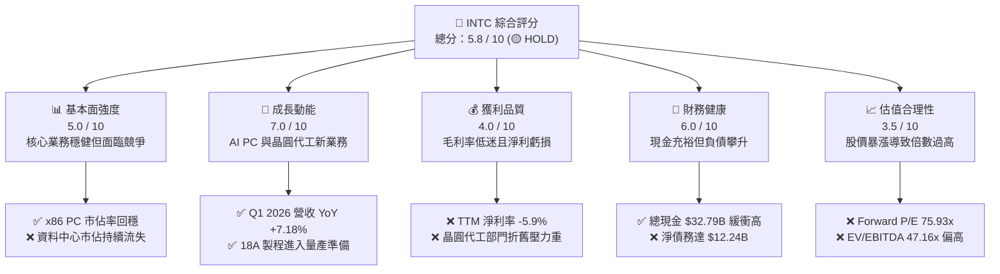
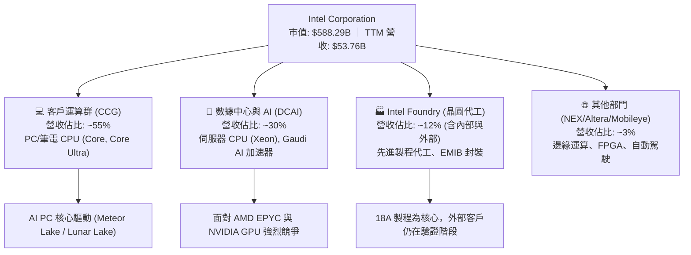
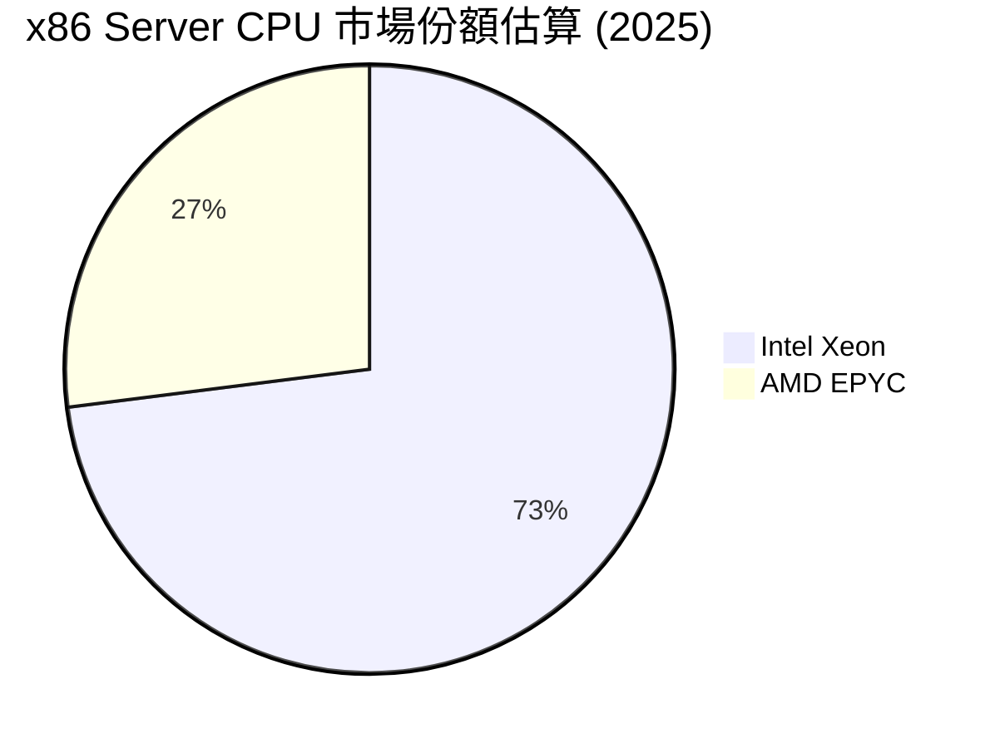
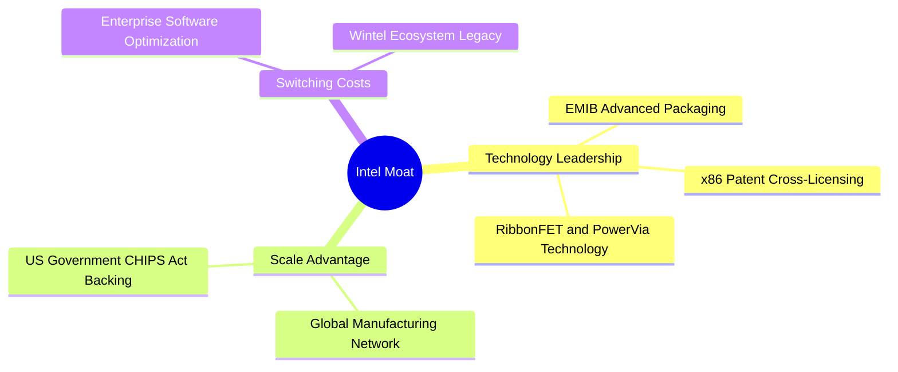
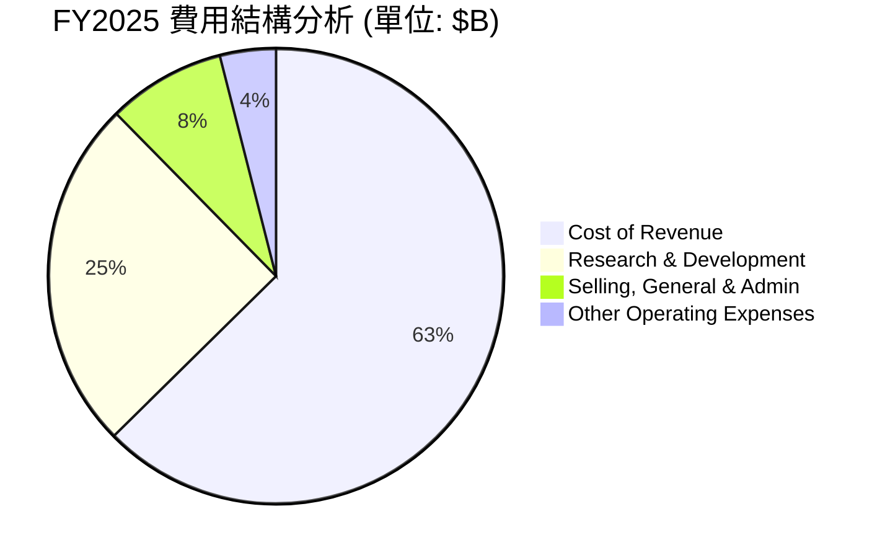
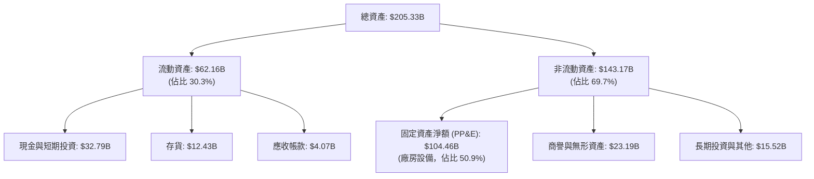
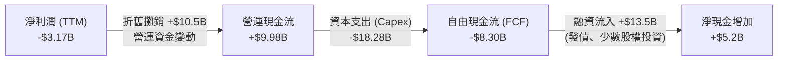
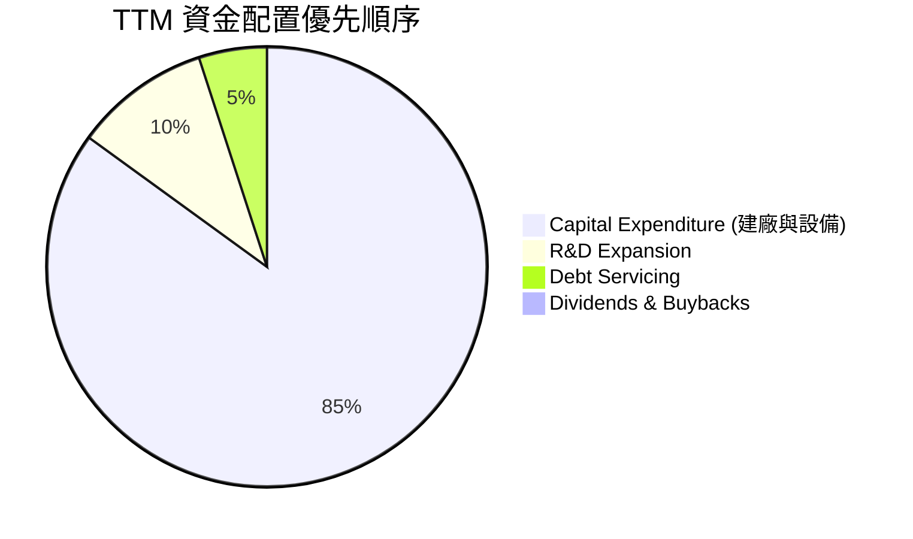

# INTC 基本面深度分析報告
> **報告日期**：2026-06-16 ｜ **語言**：繁體中文 ｜ **數據來源**：Yahoo Finance, Finviz, StockAnalysis, Roic.ai ｜ **分析師**：CFA 級機構研究

---

## 目錄

| # | 章節 | 核心結論 |
|---|------|----------|
| 1 | **執行摘要** | 評級：🟡 **持有 (Hold)** ｜ 目標價：**$93.12**（隱含 -20.4% 跌幅）｜ 轉型期估值過高 |
| 2 | **公司概覽與商業模式** | IDM 2.0 雙軌轉型，分拆晶圓代工（Intel Foundry）陣痛期，x86 護城河受 ARM 與 GPU 蠶食 |
| 3 | **損益表深度分析** | 營收止跌回穩（TTM $53.76B, YoY +7.2%），但毛利率（37.2%）與淨利率（-5.9%）仍受折舊重壓 |
| 4 | **資產負債表分析** | 現金儲備充裕（$32.79B）應對資本支出，但總債務達 $45.03B，資產結構呈現高度資本密集 |
| 5 | **現金流量深度分析** | 營運現金流 $9.98B，但因建廠支出龐大，自由現金流（FCF）深陷赤字（TTM -$8.30B） |
| 6 | **獲利能力與資本效率** | ROIC（2.3%）遠低於 WACC（12.0%），處於經濟價值毀滅階段（EVA 為負），杜邦分析揭示獲利瓶頸 |
| 7 | **估值深度分析** | 前瞻本益比（Forward P/E）高達 75.93x，顯著高於同業，市場已過度透支 2027 年後的轉型預期 |
| 8 | **成長催化劑** | 18A 製程量產、AI PC 換機潮、美國《晶片法案》補助撥款為中長期三大核心驅動力 |
| 9 | **風險矩陣** | 晶圓代工外部客戶開拓不及預期、製程延誤、資料中心市佔率持續流失至 AMD |
| 10 | **投資建議** | 建議「持有」，不宜在此高位追高；等待 Foundry 獲利拐點或股價回檔至安全邊際 |

---

## 1. 執行摘要

### 1.1 核心評分儀表板



### 1.2 評分進度條視覺化

```
╔══════════════════════════════════════════════════════════════╗
║              INTC 多維度評分儀表板 (1-10分)                 ║
╠══════════════════════════════════════════════════════════════╣
║ 基本面強度  5.0 ▓▓▓▓▓▓▓▓▓▓░░░░░░░░░░  ★★☆☆☆           ║
║ 成長動能    7.0 ▓▓▓▓▓▓▓▓▓▓▓▓▓▓░░░░░░  ★★★☆☆           ║
║ 獲利品質    4.0 ▓▓▓▓▓▓▓▓░░░░░░░░░░░░  ★★☆☆☆           ║
║ 財務健康    6.0 ▓▓▓▓▓▓▓▓▓▓▓▓░░░░░░░░  ★★★☆☆           ║
║ 估值合理性  3.5 ▓▓▓▓▓▓▓░░░░░░░░░░░░░  ★☆☆☆☆           ║
║ 護城河深度  7.0 ▓▓▓▓▓▓▓▓▓▓▓▓▓▓░░░░░░  ★★★☆☆           ║
║ 管理層執行  6.0 ▓▓▓▓▓▓▓▓▓▓▓▓░░░░░░░░  ★★★☆☆           ║
║ 技術創新力  8.0 ▓▓▓▓▓▓▓▓▓▓▓▓▓▓▓▓░░░░  ★★★★☆           ║
╠══════════════════════════════════════════════════════════════╣
║ 綜合總分    5.8 ▓▓▓▓▓▓▓▓▓▓▓░░░░░░░░░  🏆 HOLD (持有)      ║
╚══════════════════════════════════════════════════════════════╝
```

### 1.3 五大投資論點 + 三大核心風險

| 類型 | 項目 | 具體依據 | 信心度 |
|------|------|----------|--------|
| 🟢 **投資論點①** | **AI PC 帶領客戶運算部門（CCG）復甦** | Q1 2026 營收達 $13.58B（YoY +7.18%），顯示 PC 庫存去化結束，AI PC 出貨量超預期。 | 🟢 高 |
| 🟢 **投資論點②** | **Intel Foundry 18A 製程技術突破** | 18A（相當於 1.8 奈米）已完成設計定案（Tape-out），預計 2026 下半年貢獻外部營收。 | 🟡 中等 |
| 🟢 **投資論點③** | **地緣政治與政策紅利最大受益者** | 美國《晶片法案》提供近 $20B 的直接補貼與貸款，確保其美國本土晶圓廠的建置優勢。 | 🟢 極高 |
| 🟢 **投資論點④** | **資產分拆釋放潛在價值** | 晶圓代工與設計部門財務獨立，未來不排除將 Foundry 業務完全分拆上市，釋放估值。 | 🟡 中等 |
| 🟢 **投資論點⑤** | **研發與專利壁壘依舊強大** | 2025 年研發支出達 $13.77B（營收佔比 26.1%），在先進封裝（EMIB/Co-EMIB）領域維持領先。 | 🟢 高 |
| 🟡 **風險①** | **自由現金流持續流失與高資本支出** | TTM FCF 為 -$8.30B，巨額建廠開支（Capex）持續壓迫流動性，並導致折舊費用激增。 | 🔴 高衝擊 |
| 🔴 **風險②** | **資料中心（DCAI）市佔率遭侵蝕** | 雖然 Xeon 處理器推陳出新，但面對 AMD EPYC 競爭與 NVIDIA GPU 的 AI 預算排擠，獲利能力受限。 | 🔴 高衝擊 |
| 🔴 **風險③** | **估值嚴重溢價，容錯率極低** | 股價過去一年暴漲 464.37% 至 $117.05，前瞻 P/E 達 75.93x，任何製程延誤都將引發估值修正。 | 🔴 高衝擊 |

### 1.4 快速統計卡片

| 指標 | 公司實際值 | 行業均值（半導體） | S&P 500 均值 | 狀態 |
|------|-------------|----------|--------------|------|
| 營收 YoY 成長 | **7.2% (TTM)** | ~12.0% | ~5.5% | 🟡 溫和成長 |
| 毛利率 | **37.2%** | ~52.0% | ~30.0% | 🔴 低於行業 |
| 淨利率 | **-5.9%** | ~15.0% | ~11.5% | 🔴 處於虧損 |
| ROE | **-2.9%** | ~18.0% | ~15.0% | 🔴 資本效率低 |
| Forward P/E | **75.93x** | ~32.0x | ~21.5x | 🔴 估值顯著高估 |
| 淨債務/股本比 | **10.7%** | ~5.0% | ~45.0% | 🟢 債務尚屬安全 |

### 1.5 投資結論

```
╔══════════════════════════════════════════════════════════════════╗
║                    📊 投資結論摘要                               ║
╠══════════════════════════════════════════════════════════════════╣
║  評級：🟡 HOLD (持有 / 觀望)                                     ║
║  當前股價：$117.05 (截至 2026-06-16)                             ║
║  目標價區間：                                                    ║
║    悲觀情境：$65.00（-44.5%）- Foundry 客戶開拓失敗，折舊重壓    ║
║    基準情境：$93.12（-20.4%）- 12個月合理目標（反映轉型溢價）    ║
║    樂觀情境：$135.00（+15.3%）- 18A 順利量產且獲超大型客戶訂單   ║
║  投資評分：5.8 / 10                                              ║
║  適合投資人：具備高風險承受力的長線逆向投資者、政策市追隨者      ║
╚══════════════════════════════════════════════════════════════════╝
```

---

## 2. 公司概覽與商業模式

### 2.1 業務結構與收入來源

Intel 正處於其歷史上最激進的結構重組階段，將公司拆分為「Intel Products（設計部門）」與「Intel Foundry（晶圓代工部門）」。



### 2.2 市場份額

在核心的 x86 CPU 市場中，Intel 雖然維持主導地位，但近年在伺服器領域流失大量份額給 AMD，且在整體晶圓代工市場中，相較於台積電（TSMC）仍屬起步階段。



### 2.3 競爭護城河分析



### 2.4 護城河強度評分

```
╔══════════════════════════════════════════════════════════════╗
║                  Intel 護城河強度評分                        ║
╠══════════════════════════════════════════════════════════════╣
║ x86 專利壁壘   9.0/10 ▓▓▓▓▓▓▓▓▓▓▓▓▓▓▓▓▓▓░░  🏆 極難被顛覆   ║
║ 先進封裝技術   8.0/10 ▓▓▓▓▓▓▓▓▓▓▓▓▓▓▓▓░░░░  🟢 行業領先     ║
║ 晶圓代工規模   7.5/10 ▓▓▓▓▓▓▓▓▓▓▓▓▓▓▓░░░░░  🟢 僅次於 TSMC  ║
║ 軟體生態系統   7.0/10 ▓▓▓▓▓▓▓▓▓▓▓▓▓▓░░░░░░  🟢 oneAPI 優勢  ║
║ 生態夥伴關係   6.5/10 ▓▓▓▓▓▓▓▓▓▓▓▓░░░░░░░░  🟡 面臨 ARM 挑戰║
╠══════════════════════════════════════════════════════════════╣
║ 綜合護城河     7.4    ▓▓▓▓▓▓▓▓▓▓▓▓▓▓▓░░░░░  🏆 寬廣護城河   ║
╚══════════════════════════════════════════════════════════════╝
```

---

## 3. 損益表深度分析

### 3.1 年度收入成長趨勢（近 4 年）

Intel 的營收在 2022-2024 年間經歷了嚴重的週期性衰退與市佔率流失，但在 2025 年底至 2026 年初開始展現企穩跡象。

```
╔══════════════════════════════════════════════════════════════════╗
║               Intel 年度收入趨勢 (FY2022 - TTM)                  ║
╠══════════════════════════════════════════════════════════════════╣
║                                                                  ║
║  FY2022  $63.05B  ███████████████████████████  YoY: -20.2% 🔴    ║
║  FY2023  $54.23B  ███████████████████████░░░░  YoY: -14.0% 🔴    ║
║  FY2024  $53.10B  ██████████████████████░░░░░  YoY: -2.08% 🟡    ║
║  FY2025  $52.85B  ██████████████████████░░░░░  YoY: -0.47% 🟡    ║
║  TTM     $53.76B  ███████████████████████░░░░  YoY:  +7.2% 🟢    ║
║                   |      |      |      |      |                  ║
║                   0     15B    30B    45B    60B                 ║
║                                                                  ║
║  📊 4年複合成長率 (CAGR)：-3.9%                                  ║
╚══════════════════════════════════════════════════════════════════╝
```

### 3.2 季度收入趨勢分析

從季度數據看，Intel 在 2025 年下半年與 2026 年第一季實現了顯著的同比（YoY）改善，顯示行業底部的確立。

| 財報季度 | 營業收入 | YoY 成長率 | QoQ 成長率 | 核心驅動因素與備註 |
|----------|----------|------------|------------|-------------------|
| **Q1 2026** | **$13.58B** | **+7.18%** | -0.71% | AI PC 需求強勁，CCG 出貨量上升，部分抵消 DCAI 疲軟 |
| **Q4 2025** | **$13.67B** | -4.11% | +0.15% | 季節性旺季，但企業級伺服器支出轉向 GPU，Xeon 出貨受壓 |
| **Q3 2025** | **$13.65B** | **+2.78%** | +6.14% | PC 渠道補庫存，Lunar Lake 平台首發拉貨 |
| **Q2 2025** | **$12.86B** | +0.20% | +1.52% | 營收觸底企穩，代工業務開始獨立揭露 |

### 3.3 利潤率演變分析

Intel 的利潤率結構在過去幾年大幅惡化，主要原因在於：
1. **晶圓代工高昂的折舊費用**：提前引入 ASML EUV 微影設備，但產能利用率未達規模效應。
2. **產品價格競爭**：為抵禦 AMD 競爭，在 PC 和伺服器端採取折扣策略。

| 利潤率指標 | FY2022 | FY2023 | FY2024 | FY2025 | TTM | 趨勢 | 評估 |
|------------|--------|--------|--------|--------|-----|------|------|
| **毛利率** | 42.6% | 40.0% | 32.7% | 34.8% | **37.2%** | ↗️ 緩慢回升 | 🟡 仍遠低於歷史 55%+ 水準 |
| **營業利益率**| 3.7% | 0.2% | -8.9% | -4.2% | **6.9%** | ↗️ 轉正 | 🟡 成本削減計劃（裁員與重組）見效 |
| **淨利率** | 12.7% | 3.1% | -35.3% | 0.05% | **-5.9%** | 🔴 持續承壓 | 🔴 受稅務撥備與一次性重組費用拖累 |

### 3.4 費用結構分析

Intel 正在執行其百億美元成本削減計劃，2025 年 R&D 支出與 SG&A 費用均有所縮減。



```
╔══════════════════════════════════════════════════════════════╗
║                FY2025 營業費用管控效率                       ║
╠══════════════════════════════════════════════════════════════╣
║ 研發費用率 (R&D/Rev):   26.1%  ▓▓▓▓▓▓▓▓▓▓▓▓▓▓░░░░░░  🟢 研發強度高║
║ 銷管費用率 (SG&A/Rev):   8.7%  ▓▓▓▓░░░░░░░░░░░░░░░░  🟢 管控良好  ║
╚══════════════════════════════════════════════════════════════╝
```

### 3.5 季度 EPS 趨勢與盈餘品質

*   **Q1 2026**：實際 EPS **-$0.73**。主因為重組開支與晶圓代工前期折舊費用，盈餘品質偏低。
*   **Q4 2025**：實際 EPS **-$0.12**。虧損幅度較去年同期收斂，但非經營性項目干擾大。
*   **Q3 2025**：實際 EPS **+$0.90**。該季淨利達 $4.06B，主要受益於**一次性非營業收入 $3.67B**（主要為資產出售與合資企業重估），核心業務獲利其實極其微弱。
*   **Q2 2025**：實際 EPS **-$0.67**。受代工部門虧損擴大影響。

**分析師點評**：Intel 過去 4 季的 EPS 波動劇烈，且頻繁受到非經常性項目（如 Q3 2025 的非營運收益）與重組稅務撥備的扭曲。扣除非經常性項目後，其核心業務的盈餘品質（Earnings Quality）依然脆弱，反映出高額固定成本對利潤的強烈侵蝕。

---

## 4. 資產負債表分析

### 4.1 資產結構分解

截至 2026 年第一季（Mar 2026），Intel 總資產為 **$205.33B**，呈現典型的高度資本密集特徵。



### 4.2 流動性指標分析

| 流動性指標 | FY2023 | FY2024 | FY2025 | Q1 2026 | 行業均值 | 評估 |
|------------|--------|--------|--------|---------|----------|------|
| **流動比率 (Current Ratio)** | 1.54 | 1.33 | 2.02 | **2.31** | ~1.80 | 🟢 充裕，具備極佳短期償債能力 |
| **速動比率 (Quick Ratio)** | 1.14 | 0.99 | 1.65 | **1.85** | ~1.30 | 🟢 安全，扣除存貨後仍有充足變現資產 |
| **存貨週轉天數 (DIO)** | 115天 | 119天 | 126天 | **134天** | ~95天 | 🔴 偏高，反映舊產品去化速度較慢 |

### 4.3 債務結構分析

```
╔══════════════════════════════════════════════════════════════════╗
║                      Intel 債務健康診斷                         ║
<br/>
║  總債務 (Total Debt)： $45.03B  ██████████████░░░░░░░░  (Mar 2026)║
║  總現金及短期投資：    $32.79B  ██████████░░░░░░░░░░░░  (流動性高)║
║  淨債務 (Net Debt)：   $12.24B  ████░░░░░░░░░░░░░░░░░░  (淨負債狀態)║
║                                                                  ║
║  債務/權益比 (Debt/Equity)： 36.03%  🟢 處於健康區間             ║
║  利息保障倍數 (TTM)：        6.7x    🟡 較歷史水準（>20x）顯著下滑 ║
║  債務評級 (S&P / Moody's)：  A- / A3 🟡 展望穩定（近年遭降級）   ║
╚══════════════════════════════════════════════════════════════════╝
```

### 4.4 股東權益趨勢

雖然 Intel 面臨淨利虧損，但其股東權益在 2025 年回升至 **$114.28B**，主要受益於引進外部合資夥伴（如 Brookfield 和 Apollo 共同投資晶圓廠）釋放的少數股東權益，以及發行新股籌資。

```
╔══════════════════════════════════════════════════════════════════╗
║               Intel 歷年股東權益變化 (FY2022-FY2025)             ║
╠══════════════════════════════════════════════════════════════════╣
║                                                                  ║
║  FY2022  $101.42B  ████████████████████░░░░░░                    ║
║  FY2023  $105.59B  █████████████████████░░░░░                    ║
║  FY2024  $99.27B   ███████████████████░░░░░░░                    ║
║  FY2025  $114.28B  ███████████████████████░░░                    ║
║                                                                  ║
╚══════════════════════════════════════════════════════════════════╝
```

---

## 5. 現金流量深度分析

### 5.1 現金流量瀑布圖

Intel 的現金流模型正處於「失血狀態」，營運產生的現金不足以支應龐大的建廠支出，高度依賴外部融資與政府補貼。



### 5.2 FCF 轉換率趨勢

| 現金流指標 | FY2022 | FY2023 | FY2024 | FY2025 | TTM |
|------------|--------|--------|--------|--------|-----|
| **營運現金流 (OCF)** | $15.43B | $11.47B | $8.29B | $9.70B | **$9.98B** |
| **資本支出 (Capex)** | -$24.84B | -$25.75B | -$23.94B | -$14.65B | **-$18.28B** |
| **自由現金流 (FCF)** | -$9.41B | -$14.28B | -$15.66B | -$4.95B | **-$8.30B** |
| **FCF 轉換率 (FCF/NI)**| -117.4% | -845.0% | +81.4% | -190.3% | **-261.8%** |

*分析*：FCF 轉換率持續為負，意味著公司的獲利能力完全被龐大的資本支出吞噬。

### 5.3 自由現金流趨勢

```
╔══════════════════════════════════════════════════════════════════╗
║                Intel 自由現金流赤字趨勢 (FY2022-TTM)             ║
╠══════════════════════════════════════════════════════════════════╣
║                                                                  ║
║  FY2022  -$9.41B   ████████░░░░░░░░░░░░░░░░░░░░                  ║
║  FY2023  -$14.28B  ██████████████░░░░░░░░░░░░░░                  ║
║  FY2024  -$15.66B  ███████████████░░░░░░░░░░░░░                  ║
║  FY2025  -$4.95B   ████░░░░░░░░░░░░░░░░░░░░░░░░                  ║
║  TTM     -$8.30B   ████████░░░░░░░░░░░░░░░░░░░░                  ║
║                                                                  ║
║  ⚠️ TTM 自由現金流收益率 (FCF Yield)：-1.41%                      ║
╚══════════════════════════════════════════════════════════════════╝
```

### 5.4 資本配置評估

為保全現金流，Intel 採取了極端的資本配置調整：
1. **股息歸零**：自 2025 年起，暫停派發股息（2025 年股息支出為 $0.00），相較於 2022 年派發的 $6.00B 股息，此舉每年為公司節省大量現金。
2. **暫停股份回購**：全力將資金挹注於建廠。



---

## 6. 獲利能力與資本效率

### 6.1 ROE / ROA / ROIC 趨勢

Intel 目前的資本回報率極低，反映出其資產未能有效轉化為利潤。

| 指標 | FY2022 | FY2023 | FY2024 | FY2025 | TTM | 行業均值 | 評估 |
|------|--------|--------|--------|--------|-----|----------|------|
| **ROE** | 8.0% | 1.6% | -19.1% | -0.2% | **-2.9%** | ~18.0% | 🔴 處於經濟虧損狀態 |
| **ROA** | 4.4% | 0.9% | -9.8% | 0.01% | **0.6%** | ~8.5% | 🔴 資產回報率極低 |
| **ROIC**| 2.1% | 0.1% | -4.5% | -1.1% | **2.3%** | ~14.0% | 🔴 投入資本回報低迷 |

### 6.2 ROIC vs WACC 分析（核心價值創造判斷）

```
╔══════════════════════════════════════════════════════════════════╗
║                ROIC vs WACC 深度分析 (TTM)                       ║
╠══════════════════════════════════════════════════════════════════╣
║                                                                  ║
║  WACC 估算：                                                     ║
║  ├── 無風險利率 (10Y美債)：  4.20%                               ║
║  ├── 市場風險溢酬 (ERP)：     5.00%                              ║
║  ├── Beta (系統性風險)：      2.228                              ║
║  ├── 股權成本 (Cost of Equity)： 4.2% + 2.228×5.0% = 15.34%     ║
║  ├── 債務成本 (稅後)：       ~4.50%                              ║
║  ├── 資本結構：股權 ~70%，債務 ~30%                             ║
║  └── ✅ WACC ≈ 12.00%                                           ║
║                                                                  ║
║  ROIC 估算：                                                     ║
║  ├── TTM NOPAT (稅後營業淨利)：$3.71B × (1 - 21%) ≈ $2.93B       ║
║  ├── 投入資本 (Invested Capital)：                               ║
║  │   股東權益 ($114.28B) + 總債務 ($45.03B) - 現金 ($32.79B)    ║
║  │   ≈ $126.52B                                                  ║
║  └── ✅ ROIC ≈ 2.31%                                            ║
║                                                                  ║
║  ★ 經濟價值增加 (EVA) = ROIC - WACC = -9.69%                     ║
║                                                                  ║
║  ROIC  2.31%   ▓▓░░░░░░░░░░░░░░░░░░░░░░░░░░░░  🔴 價值毀滅       ║
║  WACC  12.00%  ▓▓▓▓▓▓▓▓▓▓▓▓░░░░░░░░░░░░░░░░░░  ── 資金成本高     ║
║  EVA   -9.69%  ████████████████████░░░░░░░░░░  🔴 經濟虧損       ║
║                                                                  ║
║  📊 結論：ROIC 遠低於 WACC，Intel 目前每投入 $1 資本，將         ║
║  毀滅約 9.7 美分的股東價值。轉型期尚未迎來獲利拐點。             ║
╚══════════════════════════════════════════════════════════════════╝
```

### 6.3 杜邦三因素分解

透過杜邦分解，我們可以清晰看出拖累 Intel ROE 的核心元兇：

```mermaid
graph LR
    ROE["ROE: -2.9%"]
    PM["淨利率: -5.