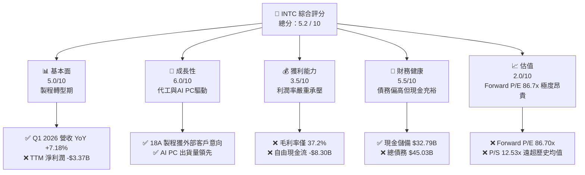
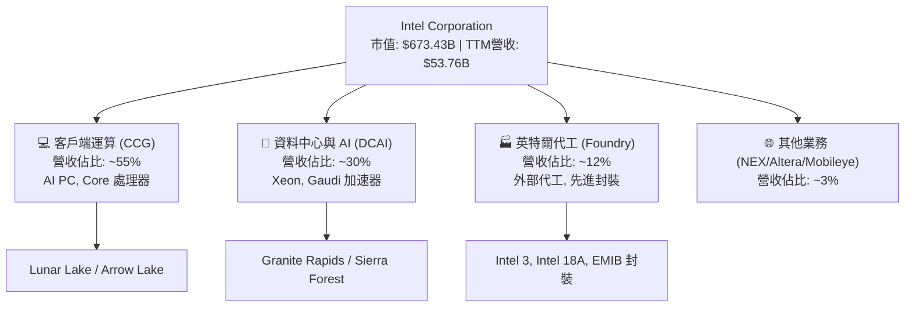
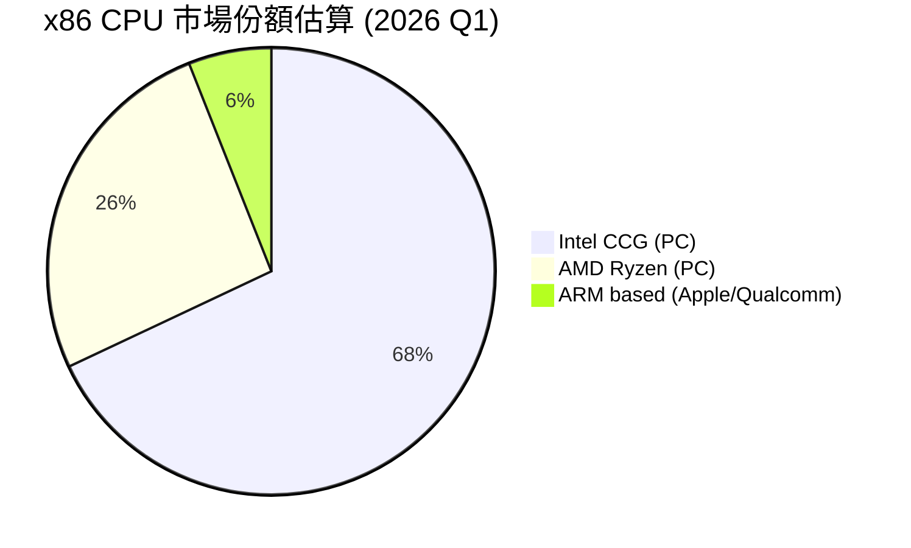
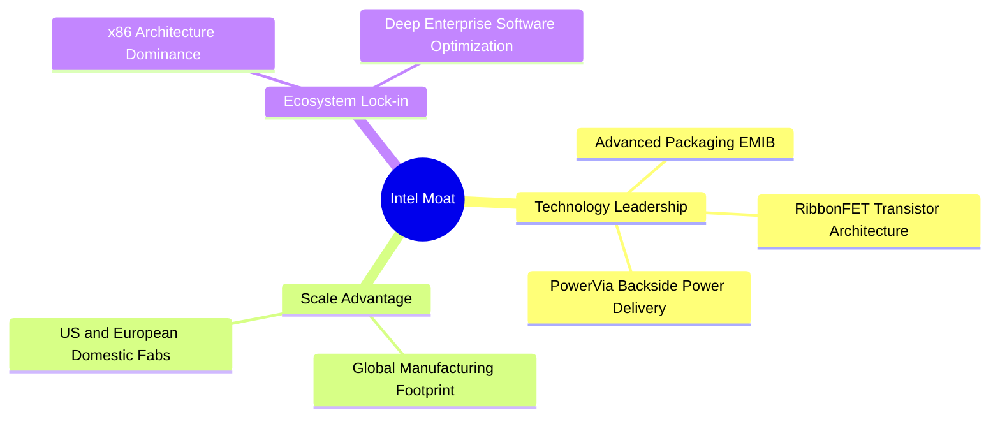
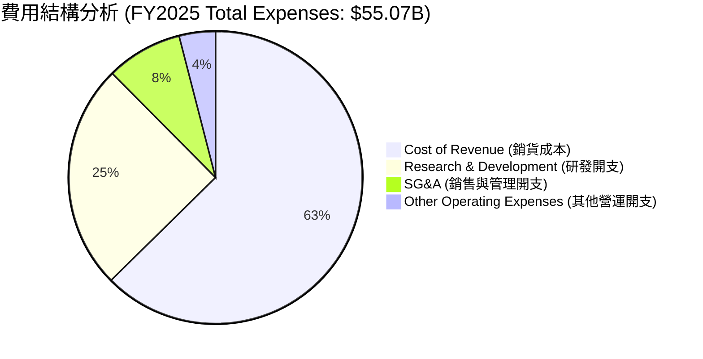
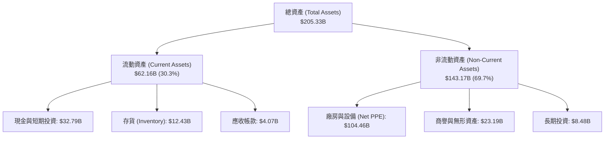
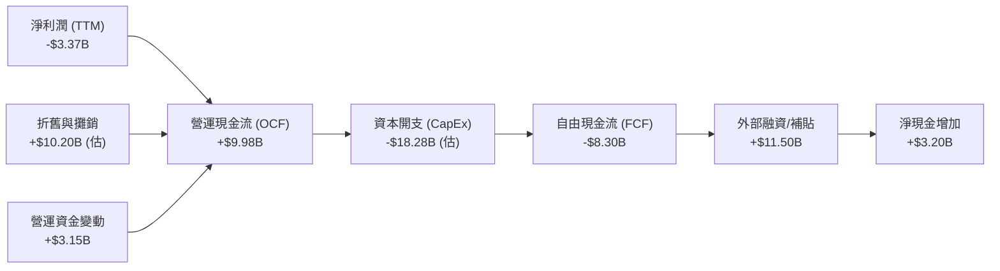
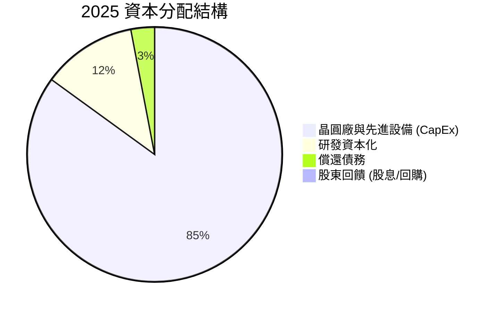
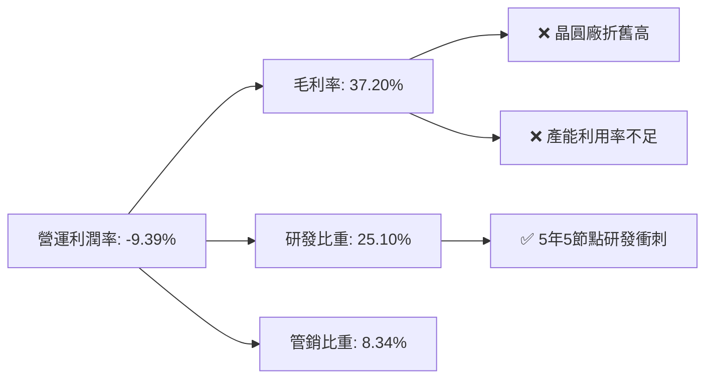

# INTC 基本面深度分析報告

> **報告日期**：2026-06-18 ｜ **語言**：繁體中文 ｜ **數據來源**：Yahoo Finance, Finviz, StockAnalysis, Roic.ai ｜ **分析師**：CFA 級機構研究

---

## 目錄

| # | 章節 | 核心結論 |
|---|------|----------|
| 1 | **執行摘要** | 評級「持有」，目標價 $110.00，市場情緒極度樂觀但估值已透支基本面。 |
| 2 | **公司概覽與商業模式** | IDM 2.0 轉型關鍵期，英特爾代工（Intel Foundry）與設計業務拆分，護城河處於重塑階段。 |
| 3 | **損益表深度分析** | 季度營收呈現築底復甦（Q1 2026 YoY +7.18%），但一次性重組費用拖累短期淨利。 |
| 4 | **資產負債表分析** | 現金儲備充裕（$32.79B），但總債務達 $45.03B，資本開支高企考驗流動性。 |
| 5 | **現金流量深度分析** | 自由現金流（FCF TTM -$8.30B）持續承壓，高度依賴外部融資與政府補貼。 |
| 6 | **獲利能力與資本效率** | ROIC（-3.19%）低於 WACC（14.50%），目前處於經濟價值毀滅階段，等待產能利用率提升。 |
| 7 | **估值深度分析** | Forward P/E 達 86.70x，顯著高於歷史均值與同業，估值溢價反映市場對 18A 製程的極高預期。 |
| 8 | **成長催化劑** | 18A 節點量產、AI PC 滲透率提升、以及 CHIPS Act 補貼資金陸續到位。 |
| 9 | **風險矩陣** | 製程延期、代工客戶流失、x86 市場份額遭 ARM 侵蝕為核心風險。 |
| 10 | **投資建議** | 建議「持有」，不宜盲目追高，等待 18A 量產數據與利潤率拐點確立。 |

---

## 1. 執行摘要

Intel Corporation（NASDAQ: INTC）目前正處於其半個世紀歷史上最關鍵的轉型期。在執行長 Pat Gelsinger 的 IDM 2.0 戰略主導下，公司致力於將傳統的整合元件製造商（IDM）轉型為「內部設計+外部代工」的雙軌模式，並積極開拓第三方代工服務（Intel Foundry）。

然而，從最新財務數據來看，儘管英特爾的股價在過去 12 個月內經歷了驚人的上漲（從 2025 年中的 ~$22 飆升至 2026-06-18 的 **$133.99**，漲幅超 500%），其基本面財務指標仍處於極度掙扎的狀態。TTM 淨利潤依然為負（-$3.37B），且自由現金流（TTM -$8.30B）因龐大的晶圓廠資本支出而持續流失。當前高達 **86.70x** 的前瞻本益比（Forward P/E）表明，市場已經提前透支了未來 3-5 年 18A 製程成功量產及代工業務獲利的樂觀預期。

### 1.1 核心評分儀表板



### 1.2 評分進度條視覺化

```
╔══════════════════════════════════════════════════════════════╗
║               INTC 多維度評分儀表板 (1-10分)                 ║
╠══════════════════════════════════════════════════════════════╣
║ 基本面強度  5.0 ▓▓▓▓▓▓▓▓▓▓░░░░░░░░░░  ★★★☆☆           ║
║ 成長動能    6.0 ▓▓▓▓▓▓▓▓▓▓▓▓░░░░░░░░  ★★★☆☆           ║
║ 獲利品質    3.5 ▓▓▓▓▓▓▓░░░░░░░░░░░░░  ★½☆☆☆           ║
║ 財務健康    5.5 ▓▓▓▓▓▓▓▓▓▓▓░░░░░░░░░  ★★★☆☆           ║
║ 估值合理性  2.0 ▓▓▓▓░░░░░░░░░░░░░░░░░  ★☆☆☆☆           ║
║ 護城河深度  6.5 ▓▓▓▓▓▓▓▓▓▓▓▓▓░░░░░░░  ★★★½☆           ║
║ 管理層執行  6.0 ▓▓▓▓▓▓▓▓▓▓▓▓░░░░░░░░  ★★★☆☆           ║
║ 技術創新力  7.5 ▓▓▓▓▓▓▓▓▓▓▓▓▓▓▓░░░░░  ★★★½☆           ║
╠══════════════════════════════════════════════════════════════╣
║ 綜合總分    5.2 ▓▓▓▓▓▓▓▓▓▓░░░░░░░░░░  🏆 轉型陣痛，估值過高 ║
╚══════════════════════════════════════════════════════════════╝
```

### 1.3 五大投資論點 + 三大核心風險

| 類型 | 項目 | 具體依據 | 信心度 |
|------|------|----------|--------|
| 🟢 **投資論點①** | **18A 製程技術拐點** | 18A（1.8奈米級）製程預計於 2026 年底全面量產，引進 RibbonFET 與 PowerVia 技術，有望在技術上追平 TSMC。 | 🟢 高 |
| 🟢 **投資論點②** | **AI PC 領導地位** | 憑藉 Core Ultra（Meteor Lake/Lunar Lake）系列，英特爾在 PC 端 AI 晶片市場市佔率超過 60%，搶佔邊緣 AI 先機。 | 🟢 極高 |
| 🟢 **投資論點③** | **政府補貼與政策紅利** | 獲得美國《晶片法案》（CHIPS Act）高達數百億美元的補貼與貸款支持，降低了其在亞利桑那州和俄亥俄州建廠的資金壓力。 | 🟢 極高 |
| 🟢 **投資論點④** | **代工業務獨立運作** | 設計與代工業務財務分離，有助於消除第三方客戶（如 Nvidia, Qualcomm）對智慧財產權洩露的疑慮，釋放代工價值。 | 🟡 中等 |
| 🟢 **投資論點⑤** | **週期性需求復甦** | 全球 PC 出貨量在經歷兩年低谷後回暖，Q1 2026 營收達 $13.58B（YoY +7.18%），傳統伺服器 CPU 需求築底。 | 🟢 高 |
| 🟡 **風險①** | **產能利用率低與毛利承壓** | 晶圓廠折舊費用龐大，若外部代工客戶訂單量未達預期，毛利率（目前 37.2%）將長期受制於高額固定成本。 | 🔴 高衝擊 |
| 🔴 **風險②** | **x86 生態面臨 ARM 挑戰** | 高通 Snapdragon X Elite 及蘋果 M 系列晶片在 PC 端持續蠶食 x86 市場；伺服器端 AWS、Google 自研 ARM 晶片降低對 Xeon 依賴。 | 🔴 高衝擊 |
| 🔴 **風險③** | **極端高估值下的容錯率極低** | 當前 Forward P/E 達 86.70x，一旦 18A 量產時程延後或良率不及預期，將面臨巨大的估值修正壓力（修正空間可達 30-40%）。 | 🔴 高衝擊 |

### 1.4 快速統計卡片

| 指標 | INTC 實際值 | 半導體行業均值 | S&P 500 均值 | 狀態 |
|------|-------------|----------|--------------|------|
| **收入 YoY 成長** | **7.18%** (Q1 '26) | ~12.5% | ~5.5% | 🟡 弱於行業 |
| **毛利率** | **37.20%** | ~52.0% | ~30.0% | 🔴 遠低於同行 |
| **淨利率** | **-5.90%** (TTM) | ~15.0% | ~11.5% | 🔴 處於虧損 |
| **債務權益比 (D/E)** | **36.03%** | ~45.0% | ~110.0% | 🟢 財務槓桿可控 |
| **前瞻本益比 (Forward P/E)** | **86.70x** | ~28.5x | ~21.5x | 🔴 估值極度溢價 |
| **自由現金流 (TTM)** | **-$8.30B** | +$2.5B (中位數) | N/A | 🔴 現金流失嚴重 |

### 1.5 投資結論

```
╔══════════════════════════════════════════════════════════════════╗
║                    📊 INTC 投資結論摘要                          ║
╠══════════════════════════════════════════════════════════════════╣
║  評級：🟡 持有 (Hold)                                            ║
║  當前股價：$133.99 (2026-06-18)                                  ║
║  12個月目標價區間：$85.00 - $115.00                              ║
║    悲觀情境：$55.00 (-59%)  ← 18A 良率失敗，代工客戶流失          ║
║    基準情境：$100.00 (-25%) ← 轉型期陣痛，估值回歸合理區間        ║
║    樂觀情境：$140.00 (+4%)  ← 18A 順利量產，獲大型 Hyperscaler 訂單║
║  投資評分：5.2 / 10                                              ║
║  適合投資人：具備極高風險承受能力的長線逆勢投資者。              ║
╚══════════════════════════════════════════════════════════════════╝
```

---

## 2. 公司概覽與商業模式

英特爾目前正處於「商業模式重塑」的暴風雨中心。過去，英特爾是典型的 IDM（整合元件製造商），包攬了從晶片設計到製造的所有環節。在 IDM 2.0 戰略下，英特爾將業務拆分為三大板塊：
1. **客戶端運算事業群（CCG）**：個人電腦 CPU、GPU 及周邊晶片。
2. **資料中心與人工智慧事業群（DCAI）**：Xeon 伺服器處理器、Gaudi AI 加速器。
3. **英特爾代工（Intel Foundry）**：為內部設計部門及外部第三方客戶提供晶圓製造、封裝及測試服務。

### 2.1 業務結構與收入來源



### 2.2 市場份額

在 x86 處理器市場，英特爾長期與 AMD 進行雙雄爭霸。儘管近年來在資料中心市場份額被 AMD EPYC 嚴重侵蝕，但英特爾在客戶端 PC 市場仍保持主導地位。



### 2.3 競爭護城河分析



### 2.4 護城河強度評分

```
╔══════════════════════════════════════════════════════════════╗
║                  Intel 競爭護城河強度評分                    ║
╠══════════════════════════════════════════════════════════════╣
║ x86 生態壁壘   8.5/10  ▓▓▓▓▓▓▓▓▓▓▓▓▓▓▓▓▓░░░  🟢 歷史底蘊深厚 ║
║ 先進封裝技術   8.0/10  ▓▓▓▓▓▓▓▓▓▓▓▓▓▓▓▓░░░░  🟢 EMIB/CoWoS競爭║
║ 晶圓製造製程   5.0/10  ▓▓▓▓▓▓▓▓▓▓░░░░░░░░░░  🟡 落後台積電半代║
║ 軟體與AI生態   4.5/10  ▓▓▓▓▓▓▓▓▓░░░░░░░░░░░  🔴 CUDA壁壘難破 ║
╠══════════════════════════════════════════════════════════════╣
║ 綜合護城河     6.5/10  ▓▓▓▓▓▓▓▓▓▓▓▓▓░░░░░░░  🏆 護城河重塑中 ║
╚══════════════════════════════════════════════════════════════╝
```

---

## 3. 損益表深度分析

英特爾的損益表反映出明顯的「築底與重組」特徵。營收停止了 2022-2024 年的斷崖式下跌，開始緩步回升，但淨利潤受到非經常性重組費用與代工業務高額前期投資的侵蝕。

### 3.1 年度收入成長趨勢（近5年）

```
╔══════════════════════════════════════════════════════════════════╗
║              Intel 年度收入趨勢（FY2021-TTM）                    ║
╠══════════════════════════════════════════════════════════════════╣
║                                                                  ║
║  FY2021  $79.02B  ███████████████████████████  YoY: +1.5%        ║
║  FY2022  $63.05B  █████████████████████░░░░░░  YoY: -20.2% 🔴    ║
║  FY2023  $54.23B  ██████████████████░░░░░░░░░  YoY: -14.0% 🔴    ║
║  FY2024  $53.10B  ██████████████████░░░░░░░░░  YoY: -2.1%  🟡    ║
║  FY2025  $52.85B  ██████████████████░░░░░░░░░  YoY: -0.5%  🟡    ║
║  TTM     $53.76B  ██████████████████░░░░░░░░░  YoY: +1.4%  🟢    ║
║                   |      |      |      |      |                  ║
║                   0     20B    40B    60B    80B                 ║
║                                                                  ║
║  📊 5年累計 CAGR：-7.42% (反映市場份額流失與行業下行週期)        ║
╚══════════════════════════════════════════════════════════════════╝
```

### 3.2 季度收入趨勢分析

從季度數據來看，英特爾在 2025 年下半年開始展現出復甦跡象。

| 財報季度 | 營業收入 | YoY 成長率 | QoQ 成長率 | 營業利益 (GAAP) | 淨利潤 (GAAP) | 備註 |
|---|---|---|---|---|---|---|
| **Q1 2026** | $13.58B | **+7.18%** 🟢 | -0.66% 🟡 | -$3.14B 🔴 | -$3.73B 🔴 | 營收復甦，但受 $4.07B 一次性重組費用拖累 |
| **Q4 2025** | $13.67B | -4.11% 🔴 | +0.15% 🟢 | $580M 🟢 | -$591M 🔴 | 傳統旺季表現平平，代工折舊高企 |
| **Q3 2025** | $13.65B | +2.78% 🟢 | +6.14% 🟢 | $683M 🟢 | $4.06B 🟢 | 淨利暴增主要來自 $3.67B 非營業投資收益 |
| **Q2 2025** | $12.86B | +0.20% 🟡 | +1.50% 🟢 | -$3.18B 🔴 | -$2.92B 🔴 | 包含 $1.89B 重組與資產減損費用 |

### 3.3 利潤率演變分析

| 利潤率指標 | FY2022 | FY2023 | FY2024 | FY2025 | TTM | 趨勢 | 評估 |
|------------|--------|--------|--------|--------|-----|------|------|
| **毛利率** | 42.61% | 40.04% | 32.66% | 34.77% | **37.20%** | 底部回升 ↗️ | 🟡 仍低於歷史 50%+ 水準 |
| **營業利益率**| 3.70% | 0.17% | -21.99%| -4.19% | **-9.39%** | 波動劇烈 ↘| 🔴 受重組費用與研發開支拖累 |
| **淨利率** | 12.71% | 3.09% | -36.22%| 0.05%  | **-5.90%** | 虧損縮窄 ↗️ | 🔴 尚未實現穩定獲利 |

**利潤率演變深度解析**：
英特爾毛利率在 FY2024 跌至 32.66% 的歷史低點，主因是「五代製程節點（5 Nodes in 4 Years）」計畫帶來的高額前期折舊，以及晶圓廠利用率不足。TTM 毛利率回升至 37.20%，顯示 PC 市場去庫存結束，產能利用率有所改善。然而，由於公司持續在 R&D（TTM 達 $13.51B，佔營收 25.1%）和代工基礎設施上砸錢，營業利益率依然為負，盈餘品質極差。

### 3.4 費用結構分析



### 3.5 季度 EPS 趨勢與盈餘品質

* 過去 4 季 EPS (GAAP) 表現：
  * **Q1 2026**：-$0.73（由於 $4.07B 重組開支，顯著低於市場預期）
  * **Q4 2025**：-$0.12（不及預期，代工虧損擴大）
  * **Q3 2025**：+$0.90（超預期，但主要由非營業一次性收益驅動，非核心業務獲利）
  * **Q2 2025**：-$0.67（不及預期，包含重組費用）
* **盈餘品質診斷**：🔴 **極低**。GAAP 淨利潤波動主要受到非營業損益（如投資公允價值變動）及頻繁的重組、資產減損開支干擾，核心營業利潤（Operating Income）尚未實現可持續的盈利。

---

## 4. 資產負債表分析

英特爾擁有極其龐大的資產規模（總資產 $205.33B），這是其作為製造巨頭的底蘊，但也意味著極高的資產重置與折舊成本。

### 4.1 資產結構分解



### 4.2 流動性指標分析

* **流動比率 (Current Ratio)**：**2.31**（高於行業均值 1.80，顯示短期償債能力無虞，主要是因為手握 $32.79B 現金與短投）。
* **速動比率 (Quick Ratio)**：**1.66**（扣除 $12.43B 存貨後依然穩健）。
* **存貨週轉天數 (Days Sales of Inventory, DSI)**：**131 天**（偏高，反映出產品線（如舊款伺服器 CPU）去庫存速度仍慢於預期）。

### 4.3 債務結構分析

```
╔══════════════════════════════════════════════════════════════════╗
║                   Intel 債務健康診斷 (2026 Q1)                  ║
╠══════════════════════════════════════════════════════════════════╣
║                                                                  ║
║  總債務 (Total Debt)：  $45.03B  ████████████████░░░░░░░░░       ║
║  總現金與短期投資：     $32.79B  ████████████░░░░░░░░░░░░░       ║
║  淨債務 (Net Debt)：    $12.24B  ████░░░░░░░░░░░░░░░░░░░░░  🔴    ║
║                                                                  ║
║  Debt/Equity 比率：     36.03%   🟢 槓桿率在安全界線內            ║
║  利息保障倍數 (TTM)：   -9.1x    🔴 營業利潤為負，無法覆蓋利息開支║
║  (註：目前利息開支主要依賴手頭現金儲備與非營業收入支付)          ║
╚══════════════════════════════════════════════════════════════════╝
```

### 4.4 股東權益趨勢

```
╔══════════════════════════════════════════════════════════════════╗
║              Intel 股東權益變化 (FY2022-FY2025)                  ║
╠══════════════════════════════════════════════════════════════════╣
║                                                                  ║
║  FY2022  $101.42B  ██████████████████████████░░░                 ║
║  FY2023  $105.59B  ████████████████████████████░                 ║
║  FY2024  $99.27B   ████████████████████████░░░░░                 ║
║  FY2025  $114.28B  ██████████████████████████████                ║
║                                                                  ║
║  📊 2025年權益回升主因：引入外部合夥人（如 Brookfield & Apollo）║
║     對其晶圓廠項目進行股權融資（少數股東權益增加）。             ║
╚══════════════════════════════════════════════════════════════════╝
```

---

## 5. 現金流量深度分析

現金流量表是英特爾「最脆弱」的環節。雖然營運現金流（OCF）仍為正，但完全無法覆蓋其龐大的資本開支（CapEx）。

### 5.1 現金流量瀑布圖



### 5.2 FCF 轉換率趨勢

| 指標 | FY2022 | FY2023 | FY2024 | FY2025 | TTM |
|---|---|---|---|---|---|
| **營運現金流 (OCF)** | $15.43B | $11.47B | $8.29B | $9.70B | **$9.98B** |
| **資本支出 (CapEx)** | -$24.84B| -$25.75B| -$23.94B| -$14.65B| **-$18.28B** |
| **自由現金流 (FCF)** | -$9.41B | -$14.28B| -$15.66B| -$4.95B | **-$8.30B** |
| **FCF / 淨利潤比率** | -117% | -852% | +81% | -19038% | **-246%** |

### 5.3 自由現金流趨勢

```
╔══════════════════════════════════════════════════════════════════╗
║                Intel 歷年自由現金流 (FCF) 趨勢                   ║
╠══════════════════════════════════════════════════════════════════╣
║                                                                  ║
║  FY2022   -$9.41B  ░░░░░░░░░░░░░░░░░░░░░░░░░░░░░                 ║
║  FY2023  -$14.28B  ░░░░░░░░░░░░░░░░░░░░░░░░░░░░░░░░░░░░░         ║
║  FY2024  -$15.66B  ░░░░░░░░░░░░░░░░░░░░░░░░░░░░░░░░░░░░░░░░      ║
║  FY2025   -$4.95B  ░░░░░░░░░░░░░░░                           ║
║  TTM      -$8.30B  ░░░░░░░░░░░░░░░░░░░░░░░                       ║
║                                                                  ║
║  ⚠️ FCF Yield (TTM)：-1.23% (持續失血，仰賴發債與政策補助維持)   ║
╚══════════════════════════════════════════════════════════════════╝
```

### 5.4 資本配置評估

英特爾已經實質上取消了普通股股利（Payout Ratio: 0.0%），並暫停了股票回購。所有的資本儲備與外部融資均被百分之百投入到晶圓廠基礎設施建設中。



---

## 6. 獲利能力與資本效率

英特爾目前的資本回報率極低，顯示其龐大的資產尚未能轉化為相應的利潤。

### 6.1 ROE / ROA / ROIC 趨勢

| 指標 | FY2022 | FY2023 | FY2024 | FY2025 | TTM | 行業均值 | 評估 |
|---|---|---|---|---|---|---|---|
| **ROE** | 7.90% | 1.59% | -18.89%| -0.23% | **-2.90%** | +14.5% | 🔴 股東權益回報為負 |
| **ROA** | 4.40% | 0.87% | -9.79% | 0.01%  | **0.60%**  | +8.2%  | 🔴 資產利用效率低下 |
| **ROIC**| 2.15% | 0.05% | -7.22% | -1.10% | **-3.19%** | +12.0% | 🔴 投入資本持續流失 |

### 6.2 ROIC vs WACC 分析（核心價值創造判斷）

```
╔══════════════════════════════════════════════════════════════════╗
║                ROIC vs WACC 深度分析 (TTM)                       ║
╠══════════════════════════════════════════════════════════════════╣
║                                                                  ║
║  WACC (加權平均資本成本) 估算：                                  ║
║  ├── 無風險利率 (10Y 美債)：  4.25%                              ║
║  ├── 市場風險溢酬 (ERP)：     5.00%                              ║
║  ├── Beta (系統性風險)：      2.228 (極高，反映股價高波動)       ║
║  ├── 股權成本 (Ke)：          4.25% + 2.228 × 5.0% = 15.39%      ║
║  ├── 債務成本 (稅後 Kd)：     ~4.40%                             ║
║  ├── 資本結構：               股權 93.7%，債務 6.3% (以市值計)   ║
║  └── ✅ WACC ≈ 14.50%                                            ║
║                                                                  ║
║  ROIC (投入資本回報率) 估算：                                    ║
║  ├── NOPAT (稅後淨營業利益)： -$5.05B × (1-20%) = -$4.04B        ║
║  ├── 投入資本 (Invested Cap)：$114.28B (Equity) + $12.24B (NetD) ║
║  └── ✅ ROIC ≈ -3.19%                                            ║
║                                                                  ║
║  ★ 經濟價值增加 (EVA) = ROIC - WACC = -17.69%                    ║
║                                                                  ║
║  ROIC  -3.19%  ░░░░░░░░░░░░░░░░░░░░░░░░░░░░░░  🔴 價值毀滅       ║
║  WACC  14.50%  ▓▓▓▓▓▓▓▓▓▓▓▓▓▓▓▓▓▓▓▓▓▓▓▓▓▓▓▓▓▓  ── 資金成本高企   ║
║  EVA   -17.69% ░░░░░░░░░░░░░░░░░░░░░░░░░░░░░░  🔴 每年毀滅股東價值║
║                                                                  ║
║  📊 結論：英特爾目前的 ROIC 遠低於 WACC。股價的暴漲完全是        ║
║     建立在未來「ROIC 跨越式回升」的遠景期權上，現狀仍在失血。    ║
╚══════════════════════════════════════════════════════════════════╝
```

### 6.3 杜邦三因素分解

$$ROE = \text{淨利率} \times \text{資產週轉率} \times \text{權益乘數}$$

* **淨利率 (Net Profit Margin)**：-5.90%（核心獲利能力為負，拖累 ROE 表現）。
* **資產週轉率 (Asset Turnover)**：0.26x（每 $1 的資產僅產生 $0.26 的營收，重資產模式的典型特徵，產能未充分釋放）。
* **權益乘數 (Equity Multiplier)**：1.80x（財務槓桿適中，未過度槓桿化）。
* **總結**：英特爾 ROE 為負的根本原因在於**淨利率為負**以及**資產週轉率極低**。

### 6.4 獲利能力儀表板



---

## 7. 估值深度分析

當前英特爾的估值處於「極度撕裂」的狀態。一方面，其 TTM EPS 為負，無法用傳統 P/E 衡量；另一方面，其前瞻估值倍數已飆升至泡沫化區間。

### 7.1 同業估值比較表格

| 估值指標 | **英特爾 (INTC)** | **AMD (AMD)** | **台積電 (TSM)** | **德州儀器 (TXN)** | 評估 |
|---|---|---|---|---|---|
| **當前股價** | **$133.99** | $165.00 | $175.00 | $190.00 | N/A |
| **市值** | **$673.43B** | $267.00B | $907.00B | $173.00B | 英特爾市值已大幅反彈 |
| **Forward P/E** | **86.70x** 🔴 | 45.20x 🟡 | 24.50x 🟢 | 28.10x 🟢 | INTC 估值溢價極高 |
| **P/S Ratio** | **12.53x** 🔴 | 11.20x 🟡 | 10.80x 🟢 | 10.20x 🟢 | 營收倍數已超越純晶圓代工龍頭台積電 |
| **EV / EBITDA** | **43.33x** 🔴 | 38.50x 🟡 | 12.80x 🟢 | 18.20x 🟢 | 現金流與息稅折舊前利潤倍數極度昂貴 |
| **P/B Ratio** |