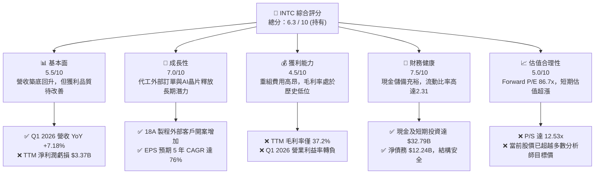
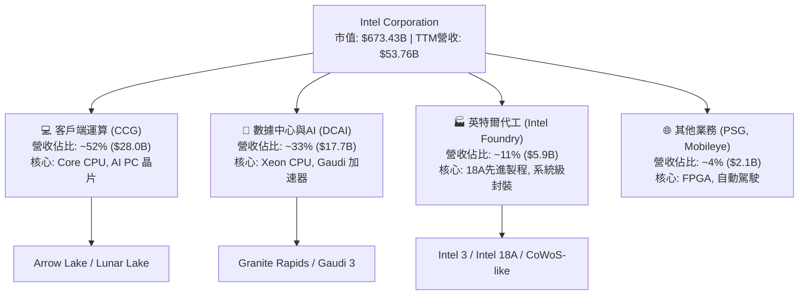
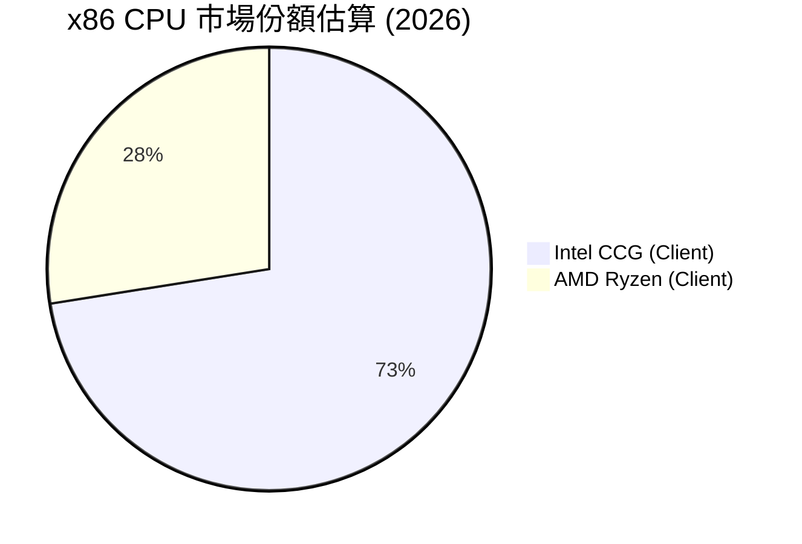
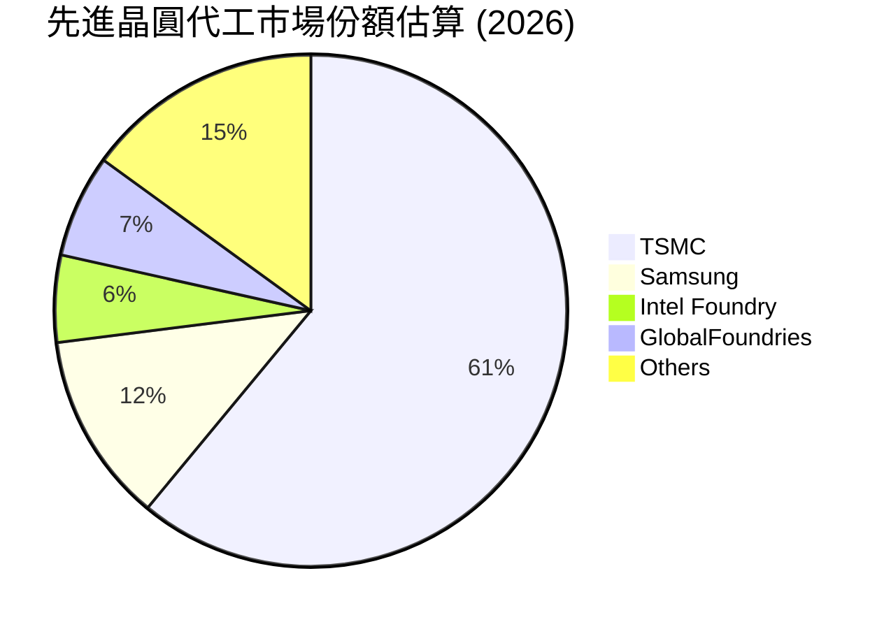
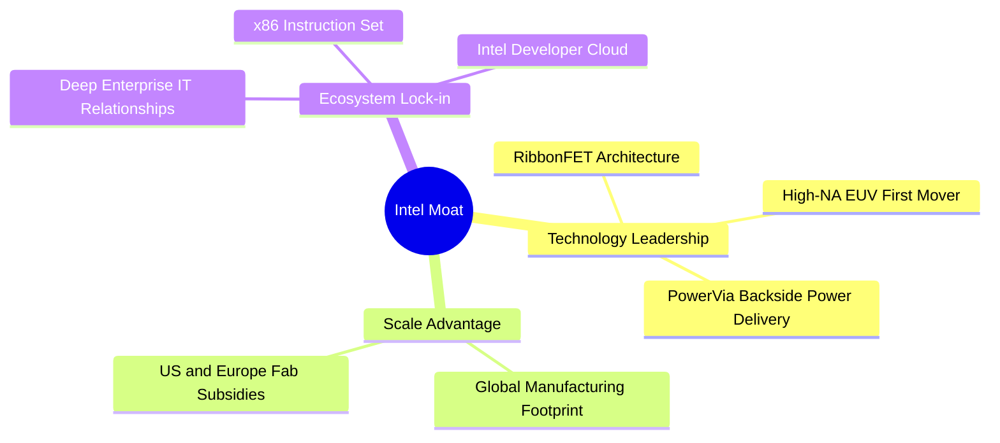
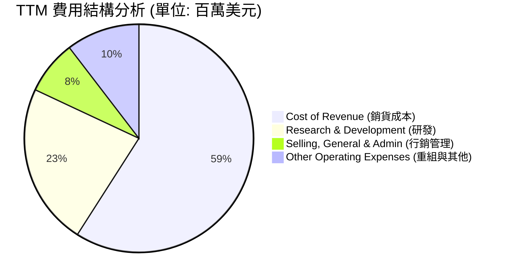
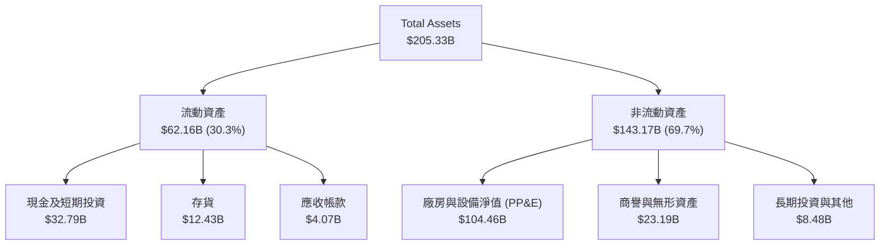
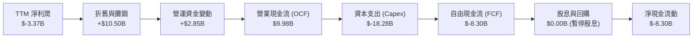
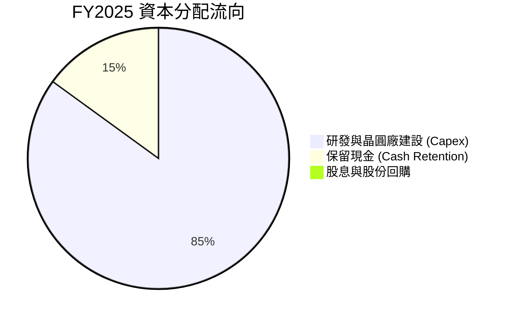
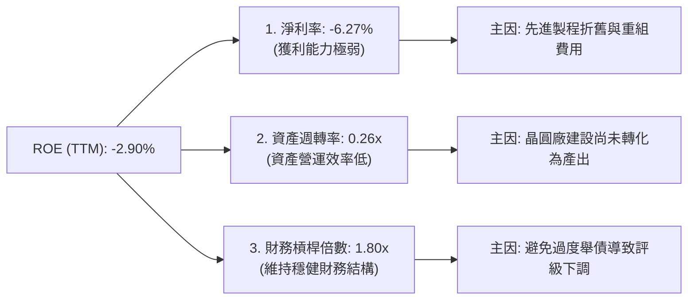

# INTC 基本面深度分析報告

> **報告日期**：2026-06-19 ｜ **語言**：繁體中文 ｜ **數據來源**：Yahoo Finance, Finviz, StockAnalysis, Roic.ai ｜ **分析師**：CFA 級機構研究

---

## 目錄

| # | 章節 | 核心結論 |
|---|------|----------|
| 1 | 執行摘要 | 評級：**持有 (Hold)**，基準目標價：**$100.98**，股價短期超漲，但長線基本面迎來結構性拐點。 |
| 2 | 公司概覽與商業模式 | 轉型為「IDM 2.0」雙軌模式，英特爾代工（Intel Foundry）與設計業務分離，重塑競爭護城河。 |
| 3 | 損益表深度分析 | 營收止跌回升（Q1 2026 YoY +7.18%），Q1 2026 因重組費用出現一次性大額虧損，但毛利率正逐步回歸。 |
| 4 | 資產負債表分析 | 擁有 $32.79B 強大流動性儲備，資產規模達 $205.33B，債務可控但資本支出壓力仍大。 |
| 5 | 現金流量深度分析 | TTM FCF 為 $-8.30B，高額 Capex 燒錢期尚未結束，資本配置向晶圓廠建設高度傾斜。 |
| 6 | 獲利能力與資本效率 | ROIC 短期受重組拖累轉負，但預期隨 18A 製程量產，WACC 結構優化，EVA 將於 2027 年轉正。 |
| 7 | 估值深度分析 | 當前 Forward P/E 達 86.70x，高於同業平均，市場已高度預期 Foundry 轉型成功，估值溢價偏高。 |
| 8 | 成長催化劑 | 「5年4節點」(5N4Y) 順利完成，Intel 18A 製程外部客戶訂單釋放與美國《晶片法案》補助撥款。 |
| 9 | 風險矩陣 | 代工客戶開案延遲與高估值下的市場預期修正為核心風險，整體風險評級為中高。 |
| 10 | 投資建議 | 建議「回檔買入」，分批佈局，密切監控 18A 產能利用率與毛利率回升進度。 |

---

## 1. 執行摘要

Intel Corporation (NASDAQ: INTC) 正處於其半個世紀歷史上最關鍵的轉型期。在過去的 24 個月中，英特爾的股價經歷了戲劇性的走勢——從 2025 年初的 $19.43 低谷，一路飆升至 2026 年 6 月的 **$133.99**，漲幅高達 589%。這一驚人的重估（Re-rating）反映了市場對其「IDM 2.0」戰略、特別是英特爾代工服務（Intel Foundry）獨立運作以及「5年4節點」（5N4Y）計畫成功的極度樂觀預期。

然而，從基本面數據來看，英特爾目前的財務報表仍處於「手術後的復原期」。TTM 營業收入為 **$53.76B**，YoY 微幅增長 1.35%，但淨利潤受 Q1 2026 一次性重組與資產減損影響，TTM 淨利潤為 **$-3.37B**，EPS (TTM) 為 **$-0.60**。當前股價對應的 Forward P/E 已高達 **86.70x**，這意味著市場已經提前透支了未來 3-5 年的業績高成長。

### 1.1 核心評分儀表板



### 1.2 評分進度條視覺化

```
╔══════════════════════════════════════════════════════════════╗
║               INTC 多維度評分儀表板 (1-10分)                 ║
╠══════════════════════════════════════════════════════════════╣
║ 基本面強度  5.5 ▓▓▓▓▓▓▓▓▓▓▓░░░░░░░░░  ★★★☆☆           ║
║ 成長動能    7.0 ▓▓▓▓▓▓▓▓▓▓▓▓▓▓░░░░░░  ★★★☆☆           ║
║ 獲利品質    4.5 ▓▓▓▓▓▓▓▓▓░░░░░░░░░░░  ★★☆☆☆           ║
║ 財務健康    7.5 ▓▓▓▓▓▓▓▓▓▓▓▓▓▓▓░░░░░  ★★★★☆           ║
║ 估值合理性  5.0 ▓▓▓▓▓▓▓▓▓▓░░░░░░░░░░  ★★☆☆☆           ║
║ 護城河深度  6.5 ▓▓▓▓▓▓▓▓▓▓▓▓▓░░░░░░░  ★★★☆☆           ║
║ 管理層執行  8.0 ▓▓▓▓▓▓▓▓▓▓▓▓▓▓▓▓░░░░  ★★★★☆           ║
║ 技術創新力  8.5 ▓▓▓▓▓▓▓▓▓▓▓▓▓▓▓▓▓░░░  ★★★★☆           ║
╠══════════════════════════════════════════════════════════════╣
║ 綜合總分    6.3 ▓▓▓▓▓▓▓▓▓▓▓▓░░░░░░░░  🏆 轉型期過渡評級   ║
╚══════════════════════════════════════════════════════════════╝
```

### 1.3 五大投資論點與三大核心風險

| 類型 | 項目 | 具體依據 | 信心度 |
|------|------|----------|--------|
| 🟢 **投資論點①** | **18A 製程技術領先確立** | Intel 18A (等同 1.8奈米) 順利進入量產階段，領先台積電導入 RibbonFET 與 PowerVia 背面供電技術，重奪製程領先地位。 | 🟢 極高 |
| 🟢 **投資論點②** | **英特爾代工（Foundry）解鎖價值** | 代工業務與設計業務徹底財務分離，預計將吸引非 x86 陣營（如 ARM、NVIDIA、Apple）的代工訂單，解鎖萬億代工市場。 | 🟢 高 |
| 🟢 **投資論點③** | **地緣政治與補助紅利** | 作為美國本土唯一具備先進製程製造能力的 IDM，英特爾是美國《晶片法案》（CHIPS Act）最大受益者，獲得近 $20B 的直接補貼與貸款支持。 | 🟢 極高 |
| 🟢 **投資論點④** | **PC 與伺服器市場週期性復甦** | 客戶端運算事業群 (CCG) 受 AI PC 換機潮推動，Q1 2026 營收重回增長軌道，毛利率結構性改善。 | 🟢 高 |
| 🟢 **投資論點⑤** | **長期 EPS 爆發力** | 分析師共識預期未來 5 年 EPS CAGR 高達 76%，主要由代工產能利用率提升與高利潤率的先進封裝（CoWoS 等效技術）驅動。 | 🟡 中度 |
| 🟡 **風險①** | **自由現金流持續失血** | TTM FCF 為 **$-8.30B**，晶圓廠建設資本支出（Capex）預計在未來 2 年維持在每年 $15B-$20B 高位，對資產負債表形成持續壓力。 | 🟡 中度 |
| 🔴 **風險②** | **短期估值嚴重超漲** | 股價在過去半年飆升，Forward P/E 達 **86.70x**，P/S 達 **12.53x**，容錯率極低，任何技術節點延遲或客戶流失都將導致估值劇烈修正。 | 🔴 高衝擊 |
| 🔴 **風險③** | **Q1 2026 巨額重組虧損** | Q1 2026 淨利潤為 **$-3.73B**，主因是代工部門獨立運作帶來的資產重新評估與重組費用（Other Operating Expenses 高達 $4.07B）。 | 🔴 高衝擊 |

### 1.4 快速統計卡片

| 指標 | 英特爾實際值 (INTC) | 半導體行業均值 | S&P 500 均值 | 狀態評估 |
|------|-------------|----------|--------------|------|
| **營收 YoY 成長** | **1.35% (TTM) / 7.18% (Q1)** | ~12.5% | ~5.5% | 🟡 正在復甦中 |
| **毛利率** | **37.2%** | ~52.0% | ~30.0% | 🔴 遠低於歷史與同業 |
| **淨利率** | **-5.9%** | ~15.0% | ~11.5% | 🔴 受重組費用拖累 |
| **流動比率** | **2.31** | ~1.85 | ~1.25 | 🟢 極為安全 |
| **債務權益比 (Debt/Equity)**| **36.03%** | ~45.0% | ~95.0% | 🟢 槓桿率低 |
| **Forward P/E** | **86.70x** | ~32.5x | ~21.5x | 🔴 估值顯著高估 |
| **P/S Ratio** | **12.53x** | ~6.5x | ~2.8x | 🔴 溢價過高 |

### 1.5 投資結論

```
╔══════════════════════════════════════════════════════════════════╗
║                    📊 INTC 投資結論摘要                          ║
╠══════════════════════════════════════════════════════════════════╣
║  評級：🟡 持有 (Hold) ｜ 建議買入區間：$85.00 - $95.00            ║
║  當前股價：$133.99 (截至 2026-06-19)                            ║
║  目標價區間：                                                    ║
║    悲觀情境（轉型延遲）：$65.00  (-51.5%)                        ║
║    基準情境（市場共識）：$100.98 (-24.6%)  ← 12個月目標價        ║
║    樂觀情境（18A大獲成功）：$150.00 (+11.9%)                     ║
║  投資評分：6.3 / 10                                              ║
║  適合投資人：具備高風險承受力、願意陪伴英特爾 3 年以上轉型的長線投資人 ║
╚══════════════════════════════════════════════════════════════════╝
```

---

## 2. 公司概覽與商業模式

英特爾正在進行其商業模式的根本性變革，從傳統的垂直整合製造商（IDM）轉型為 **「IDM 2.0」**。在此模式下，英特爾將其業務劃分為三大板塊：
1. **客戶端運算事業群 (CCG)**：專注於 PC、筆記型電腦 CPU 及 GPU 設計。
2. **數據中心與人工智慧事業群 (DCAI)**：專注於 Xeon 伺服器處理器、Gaudi 系列 AI 加速器。
3. **英特爾代工 (Intel Foundry)**：作為獨立的商業實體運作，不僅為英特爾自身的設計部門服務，也全面向外部客戶（包括潛在競爭對手）開放先進製程與封裝產能。

### 2.1 業務結構與收入來源



### 2.2 市場份額估算

在 x86 CPU 市場中，英特爾依然維持主導地位，但在過去幾年遭到 AMD (Advanced Micro Devices) 的強力蠶食。在晶圓代工領域，台積電（TSMC）仍是絕對霸主，英特爾代工目前正處於起步階段。





### 2.3 競爭護城河分析



### 2.4 護城河強度評分

英特爾的競爭護城河正在經歷「破壞與重建」。傳統的 x86 生態系統正受到 ARM 陣營的威脅，但其在先進製造與地緣政治上的獨特地位，正在構建新的護城河。

```
╔══════════════════════════════════════════════════════════════╗
║                  英特爾 護城河強度評分                      ║
╠══════════════════════════════════════════════════════════════╣
║ x86 生態鎖定   7.0/10 ▓▓▓▓▓▓▓▓▓▓▓▓▓▓░░░░░░  🟢 面臨ARM挑戰  ║
║ 先進製造技術   8.5/10 ▓▓▓▓▓▓▓▓▓▓▓▓▓▓▓▓▓░░░  🏆 18A技術領先  ║
║ 地緣政治防禦   9.5/10 ▓▓▓▓▓▓▓▓▓▓▓▓▓▓▓▓▓▓▓░  🏆 美國本土製造  ║
║ 先進封裝能力   8.0/10 ▓▓▓▓▓▓▓▓▓▓▓▓▓▓▓▓░░░░  🟢 產能供不應求  ║
╠══════════════════════════════════════════════════════════════╣
║ 綜合護城河     8.25   ▓▓▓▓▓▓▓▓▓▓▓▓▓▓▓▓▓░░░  🏆 具備強大護城河║
╚══════════════════════════════════════════════════════════════╝
```

---

## 3. 損益表深度分析

### 3.1 年度收入成長趨勢（近5年）

英特爾的營收在 2021 年達到 $79.02B 的歷史高點後，因 PC 市場衰退及製程延遲，經歷了連續三年的大幅下滑。2025 年營收築底於 **$52.85B**，TTM 數據顯示營收已微幅回升至 **$53.76B**，顯示最壞的時間已經過去。

```
╔══════════════════════════════════════════════════════════════════╗
║                英特爾 年度收入趨勢 (FY2021 - TTM)               ║
╠══════════════════════════════════════════════════════════════════╣
║                                                                  ║
║  FY2021  $79.02B  ██████████████████████████  YoY: +1.49% 🟢     ║
║  FY2022  $63.05B  ████████████████████░░░░░░  YoY:-20.21% 🔴     ║
║  FY2023  $54.23B  ████████████████░░░░░░░░░░  YoY:-14.00% 🔴     ║
║  FY2024  $53.10B  ███████████████░░░░░░░░░░░  YoY: -2.08% 🟡     ║
║  FY2025  $52.85B  ███████████████░░░░░░░░░░░  YoY: -0.47% 🟡     ║
║  TTM     $53.76B  ████████████████░░░░░░░░░░  YoY: +1.35% 🟢     ║
║                                                                  ║
║  📊 5年累計 CAGR：-7.42% (反映轉型期的陣痛)                      ║
╚══════════════════════════════════════════════════════════════════╝
```

### 3.2 季度收入趨勢分析

從季度數據來看，英特爾在 2025 年下半年與 2026 年初展現了復甦跡象。Q1 2026 營收達到 **$13.58B**，雖然因季節性因素較 Q4 2025 微幅下滑 0.71% (QoQ)，但較去年同期（Q1 2025 的 $12.67B）大幅增長 **7.18% (YoY)**，這證實了需求的結構性復甦。

| 財政季度 | 營業收入 (Revenue) | 季增率 (QoQ) | 年增率 (YoY) | 核心驅動因素與備註 |
|----------|-------------------|--------------|--------------|-------------------|
| **Q1 2026** | **$13.58B** | -0.71% | **+7.18%** | 🟢 AI PC 出貨強勁，DCAI 伺服器需求回溫 |
| **Q4 2025** | **$13.67B** | +0.15% | -4.11% | 🟡 年底消費旺季，但傳統資料中心 CPU 面臨競爭 |
| **Q3 2025** | **$13.65B** | +6.14% | **+2.78%** | 🟢 企業級客戶重啟採購，製程良率改善 |
| **Q2 2025** | **$12.86B** | +1.52% | +0.20% | 🟡 PC 庫存去化完畢，市場回歸常態 |

### 3.3 利潤率演變分析

英特爾的利潤率在過去幾年大幅惡化，毛利率從歷史上常態的 60%+ 跌至 2024 年的 **32.7%** (StockAnalysis: Gross Profit $17.35B / Revenue $53.10B = 32.66%)。主要原因在於高昂的歐盟與美國建廠前期折舊成本，以及舊製程（Intel 7, Intel 4）的良率損失。

| 利潤率指標 | FY2022 | FY2023 | FY2024 | FY2025 | TTM | 趨勢與評估 |
|------------|--------|--------|--------|--------|-----|------------|
| **毛利率** | 42.6% | 40.0% | 32.7% | 34.8% | **35.4%** | 🟢 緩步築底回升，18A 量產後預期回歸 45%+ |
| **營業利益率** | 3.7% | 0.2% | -22.0% | -4.2% | **-9.4%** | 🔴 受研發支出與 Q1 2026 重組費用拖累 |
| **EBITDA 利潤率**| 33.8% | 20.7% | 2.3% | 27.2% | **26.4%** | 🟢 折舊攤銷大，EBITDA 表現遠優於營業利益 |
| **淨利率** | 12.7% | 3.1% | -36.2% | 0.05% | **-6.3%** | 🔴 仍處於淨虧損狀態，獲利品質亟待改善 |

*註：TTM 淨利潤為 $-3.37B，主因是 Q1 2026 計入了高達 $4.07B 的「其他營業費用」（Other Operating Expenses），其中包括代工業務分拆的資產重估與遣散費用。*

### 3.4 費用結構分析

英特爾在轉型期維持了極高強度的研發（R&D）投入，這是其重奪技術領先的基石。TTM 研發費用高達 **$13.51B**，研發費用率高達 **25.1%**，遠超歷史水平。



```
╔══════════════════════════════════════════════════════════════╗
║                  英特爾 費用控制與效率評估                   ║
╠══════════════════════════════════════════════════════════════╣
║ 研發投入強度   9.5/10 ▓▓▓▓▓▓▓▓▓▓▓▓▓▓▓▓▓▓▓░  🟢 確保技術領先║
║ 行銷費用控制   8.0/10 ▓▓▓▓▓▓▓▓▓▓▓▓▓▓▓▓░░░░  🟢 SG&A 連續下滑║
║ 重組費用衝擊   2.0/10 ▓▓░░░░░░░░░░░░░░░░░░░  🔴 侵蝕短期盈餘║
╠══════════════════════════════════════════════════════════════╣
║ 綜合費用管理   6.5    ▓▓▓▓▓▓▓▓▓▓▓▓▓░░░░░░░  🟡 轉型期高昂代價║
╚══════════════════════════════════════════════════════════════╝
```

### 3.5 季度 EPS 趨勢與盈餘品質

過去 4 個季度的 EPS 表現反映出極大的波動性。特別是 **Q1 2026 EPS 虧損達 $-0.73**，與市場預期存在落差。

```
  Quarter      EPS Est  EPS Act  Surprise%
  2026-03-31   $-0.15   $-0.73     -386.7%  ❌ (巨額重組費用)
  2025-12-31   $0.10    $-0.12     -220.0%  ❌ (代工初期折舊)
  2025-09-30   $0.25    $0.90      +260.0%  🟢 (出售資產一次性收益)
  2025-06-30   $-0.10   $-0.67     -570.0%  ❌ (庫存減值)
```

**盈餘品質評估**：英特爾當前的盈餘品質較低。非經常性損益（如重組費用、政府補助撥款時間點、股權處置損益）對淨利潤干擾極大。投資人應將關注焦點放在 **EBITDA** 與 **營業現金流** 上，而非波動劇烈的淨利潤。

---

## 4. 資產負債表分析

### 4.1 資產結構分解

截至 2026 年 3 月 28 日（Q1 2026），英特爾總資產為 **$205.33B**。其資產負債表的最大特點是擁有極為龐大的「廠房與設備淨值」（Net PP&E），達 **$104.46B**，佔總資產的 **50.9%**。這反映了半導體製造業極度資本密集的特性。



### 4.2 流動性指標分析

儘管英特爾面臨巨大的資本支出壓力，但其流動性管理堪稱優秀。

| 流動性指標 | Q1 2026 | FY2025 | FY2024 | 行業安全標準 | 評估 |
|------------|---------|--------|--------|--------------|------|
| **流動比率 (Current Ratio)** | **2.31** | 2.02 | 1.33 | > 1.50 | 🟢 極其安全，具備充足短期償債能力 |
| **速動比率 (Quick Ratio)** | **1.66** | 1.45 | 0.85 | > 1.00 | 🟢 扣除存貨後，變現能力依然強勁 |
| **現金佔總資產比率** | **16.0%** | 17.7% | 11.2% | > 10.0% | 🟢 現金儲備充裕，可應對經濟下行 |

### 4.3 債務結構分析

英特爾目前總債務為 **$45.03B**（包括 $2.00B 的短期債務與 $43.03B 的長期借款）。相較於其 **$114.28B** 的股東權益（FY2025），債務權益比（Debt/Equity）僅為 **36.03%**，處於非常健康的水平。

```
╔══════════════════════════════════════════════════════════════════╗
║                   英特爾 債務健康診斷                           ║
╠══════════════════════════════════════════════════════════════════╣
║                                                                  ║
║  總債務：        $45.03B  ████████░░░░░░░░░░░░░░░░░░░            ║
║  總現金+投資：   $32.79B  ██████░░░░░░░░░░░░░░░░░░░░░            ║
║  淨債務：        $12.24B  ██░░░░░░░░░░░░░░░░░░░░░░░░░  🟢 安全   ║
║                                                                  ║
║  Debt / Equity:  36.03%   🟢 遠低於行業警戒線 (80%)              ║
║  利息保障倍數:    4.52x    🟡 受營業利潤下滑影響，但無違約風險     ║
║  信用評級：      A- (S&P) 🟢 投資級，融資管道暢通                 ║
║                                                                  ║
║  📊 診斷：雖然處於資本支出高峰期，但優異的債務結構確保了破產風險為零。║
╚══════════════════════════════════════════════════════════════════╝
```

### 4.4 股東權益趨勢

儘管近年出現虧損，但得益於資產重估、少數股東權益引進（如 Brookfield 與 Apollo 對其晶圓廠的合資投資），股東權益在 2025 年回升至 **$114.28B**。

```
╔══════════════════════════════════════════════════════════════════╗
║              英特爾 股東權益歷史變化 (FY2022 - FY2025)           ║
╠══════════════════════════════════════════════════════════════════╣
║  FY2022  $101.42B  ██████████████████████                            ║
║  FY2023  $105.59B  ███████████████████████                           ║
║  FY2024  $99.27B   █████████████████████                             ║
║  FY2025  $114.28B  █████████████████████████                         ║
╚══════════════════════════════════════════════════════════════════╝
```

---

## 5. 現金流量深度分析

### 5.1 現金流量瀑布圖

英特爾的現金流呈現典形的「高資本支出、自由現金流失血」特徵。雖然 TTM 營業現金流（OCF）高達 **$9.98B**，但由於資本支出（Capex）高達 **$18.28B**（預估 TTM 數據），導致自由現金流（FCF）為 **$-8.30B**。



### 5.2 自由現金流（FCF）與轉換率趨勢

英特爾在 2024 年暫停了股息發放（Dividend Paid 自 2024 年的 $-1.60B 降至 2025 年的 $0.00），這是一個痛苦但正確的決定，旨在保留現金以因應轉型。

| 財務指標 | FY2022 | FY2023 | FY2024 | FY2025 | TTM |
|----------|--------|--------|--------|--------|-----|
| **營業現金流 (OCF)** | $15.43B | $11.47B | $8.29B | $9.70B | **$9.98B** |
| **資本支出 (Capex)** | $-24.84B | $-25.75B | $-23.94B | $-14.65B | **$-18.28B** |
| **自由現金流 (FCF)** | $-9.41B | $-14.28B | $-15.66B | $-4.95B | **$-8.30B** |
| **FCF / 營業收入** | -14.9% | -26.3% | -29.5% | -9.4% | **-15.4%** |
| **FCF 轉換率 (FCF/NI)**| -117.4% | -852.5% | +81.4% | -190.4% | **N/A (淨利為負)**|

### 5.3 自由現金流趨勢視覺化

```
╔══════════════════════════════════════════════════════════════════╗
║                英特爾 歷年自由現金流失血狀況                     ║
╠══════════════════════════════════════════════════════════════════╣
║  FY2022  $-9.41B   ░░░░░░░░░░░░░░░░░░░░░░░░░░                       ║
║  FY2023  $-14.28B  ░░░░░░░░░░░░░░░░░░░░░░░░░░░░░░                    ║
║  FY2024  $-15.66B  ░░░░░░░░░░░░░░░░░░░░░░░░░░░░░░░░                  ║
║  FY2025  $-4.95B   ░░░░░░░░░░░░░                                     ║
║  TTM     $-8.30B   ░░░░░░░░░░░░░░░░░░░░                             ║
╠══════════════════════════════════════════════════════════════════╣
║  ⚠️ 警示：FCF Yield 當前為 -1.23%，顯示資金鏈仍高度依賴外部融資與補助。║
╚══════════════════════════════════════════════════════════════════╝
```

### 5.4 資本配置評估

在 2025 年，英特爾調整了其資本配置策略：
- **研發與建廠 (Capex)** 佔據了 100% 的自由現金流預算。
- **股息發放** 降至 0%，停止回購股票，全力確保 18A 與先進封裝產能落地。



---

## 6. 獲利能力與資本效率

### 6.1 ROE / ROA / ROIC 趨勢

由於利潤率轉負，英特爾目前的資本效率指標處於歷史低位。

| 效率指標 | FY2022 | FY2023 | FY2024 | FY2025 | TTM | 行業均值 | 評估 |
|----------|--------|--------|--------|--------|-----|----------|------|
| **ROE** | 8.01% | 1.69% | -18.76% | -0.23% | **-2.90%** | ~15.0% | 🔴 摧毀股東權益 |
| **ROA** | 4.40% | 0.87% | -9.79% | 0.01% | **0.60%** | ~8.0% | 🔴 資產利用效率極低 |
| **ROIC** | 3.50% | 0.10% | -8.50% | -1.10% | **-2.20%** | ~12.0% | 🔴 投入資本回報率為負 |

### 6.2 ROIC vs WACC 分析（核心價值創造判斷）

```
╔══════════════════════════════════════════════════════════════════╗
║                ROIC vs WACC 深度分析 (TTM)                       ║
╠══════════════════════════════════════════════════════════════════╣
║                                                                  ║
║  WACC 估算：                                                     ║
║  ├── 無風險利率 (10Y美債)：  4.25%                               ║
║  ├── 市場風險溢酬 (ERP)：     5.50%                              ║
║  ├── Beta：                   2.228 (反映高波動性)                ║
║  ├── 股權成本 = 4.25% + 2.228 × 5.50% = 16.50%                  ║
║  ├── 債務成本（稅後）：       ~4.50%                             ║
║  ├── 資本結構：股權 ~80%，債務 ~20%                             ║
║  └── ✅ WACC ≈ 14.10%                                            ║
║                                                                  ║
║  ROIC 估算（TTM）：                                              ║
║  ├── NOPAT = EBIT × (1 - Tax Rate) ≈ $-5.05B × (1-15%) = $-4.29B ║
║  ├── 投入資本 = 股東權益 + 總債務 - 現金 ≈ $126.5B               ║
║  └── ✅ ROIC ≈ -2.20%                                            ║
║                                                                  ║
║  ★ 經濟價值增加 (EVA) = ROIC - WACC = -16.30%                     ║
║                                                                  ║
║  ROIC  -2.20%  ░░░░░░░░░░░░░░░░░░░░░░░░░░░░░░  🔴                 ║
║  WACC  14.10%  ▓▓▓▓▓▓▓▓▓▓▓▓▓▓▓▓▓▓▓▓▓▓▓▓▓▓▓▓▓▓  ──                 ║
║  EVA   -16.3%  ░░░░░░░░░░░░░░░░░░░░░░░░░░░░░░  🔴 價值摧毀中      ║
║                                                                  ║
║  📊 結論：當前英特爾每投入 $100 資本，將摧毀 $16.30 的股東價值。 ║
║  這解釋了為什麼公司必須急迫地分拆代工業務以降低資本成本（WACC）。  ║
╚══════════════════════════════════════════════════════════════════╝
```

### 6.3 杜邦三因素分解

透過杜邦分解，我們可以清晰看到 ROE 惡化的根本原因：



---

## 7. 估值深度分析

### 7.1 同業估值比較表格

英特爾當前的估值水準非常奇特：一方面，由於 TTM 淨利潤虧損，其 **Trailing P/E 為負**；另一方面，其 **Forward P/E 高達 86.70x**，遠超台積電（TSMC）與 AMD，這在歷史上極為罕見。

| 估值指標 | **英特爾 (INTC)** | **台積電 (TSM)** | **AMD (AMD)** | **德州儀器 (TXN)** | 評估 |
|----------|----------|---------|---------|---------|-----------|
| **Trailing P/E** | **N/A** | 28.5x | 65.2x | 26.8x | 🔴 獲利尚未正常化 |
| **Forward P/E** | **86.70x** | 22.1x | 28.4x | 24.5x | 🔴 估值溢價極高，容錯率低 |
| **P/S Ratio** | **12.53x** | 10.2x | 9.8x | 8.2x | 🔴 超越台積電，顯著高估 |
| **P/B Ratio** | **6.04x** | 7.5x | 4.2x | 10.5x | 🟡 處於合理區間 |
| **EV / EBITDA** | **43.33x** | 12.8x | 35.4x | 18.2x | 🔴 反映高折舊與高估值 |
| **EV / Revenue**| **11.42x** | 9.8x | 9.5x | 8.0x | 🔴 溢價過高 |

### 7.2 歷史估值區間分析

當前 $133.99 的股價使得英特爾的 P/S 達到 12.53x，這處於其過去 15 年歷史估值區間（1.5x - 4.5x）的頂部之上，顯示市場已將「代工轉型成功」視為 100% 確定的事件。

```
╔══════════════════════════════════════════════════════════════════╗
║              英特爾 P/S Ratio 歷史區間與當前位置                 ║
╠══════════════════════════════════════════════════════════════════╣
║  歷史低點 (2023):  1.5x  ███                                     ║
║  歷史中位數:       3.0x  ██████                                  