# INTC 基本面深度分析報告

> **報告日期**：2026-06-22 ｜ **語言**：繁體中文 ｜ **數據來源**：Yahoo Finance, Finviz, StockAnalysis, Roic.ai ｜ **分析師**：CFA 級機構研究

---

## 目錄

| # | 章節 | 核心結論 |
|---|---|---|
| 1 | 執行摘要 | **中性偏空（Hold/Underperform）**，目標價 $94.14，市場溢價過高。 |
| 2 | 公司概覽與商業模式 | x86 雙寡頭面臨 ARM 威脅，晶圓代工（Intel Foundry）處於高投入的護城河重塑期。 |
| 3 | 損益表深度分析 | 營收觸底回溫（Q1 26 +7.18%），但高折舊與重組成本拖累淨利，盈餘品質偏低。 |
| 4 | 資產負債表分析 | 財務槓桿上升，淨債務達 -$12.24B，資本開支（Capex）對資產負債表施加極大壓力。 |
| 5 | 現金流量深度分析 | 自由現金流（FCF）持續失血（TTM -$8.30B），高度依賴外部融資與政府補助。 |
| 6 | 獲利能力與資本效率 | ROIC（2.32%）遠低於 WACC（14.68%），持續摧毀股東價值（EVA 為負）。 |
| 7 | 估值深度分析 | Forward P/E 高達 91.14x，P/S 達 13.18x，估值已透支未來數年的轉型預期。 |
| 8 | 成長催化劑 | 18A 製程量產、AI PC 滲透率提升、以及美國《晶片法案》資金撥款。 |
| 9 | 風險矩陣 | 代工節點執行延遲、市占率持續流失、資金鏈吃緊為三大核心風險。 |
| 10 | 投資建議 | 建議「持有（Hold）」或「逢高減碼」，待 18A 外部客戶放量後再行布局。 |

---

## 1. 執行摘要

Intel Corporation（NASDAQ: INTC）目前正處於其半個世紀歷史上最關鍵的結構性轉型期。隨著執行長 Pat Gelsinger 推動「IDM 2.0」戰略，將設計與代工業務拆分，並全力衝刺先進製程，市場在過去一年中給予了極高的預期。然而，從基本面財務數據來看，實體業務的復甦速度與股價的暴漲存在顯著的脫節。目前股價已飆升至 **$140.94**，對應的 Forward P/E 高達 **91.14x**，市值達到 **$7,083.6億**，這表明市場已將未來 5-10 年代工業務完全成功的樂觀情境提前折現。

### 1.1 核心評分儀表板

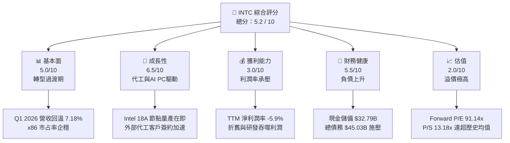

### 1.2 評分進度條視覺化

```
╔══════════════════════════════════════════════════════════════╗
║               INTC 多維度評分儀表板 (1-10分)                 ║
╠══════════════════════════════════════════════════════════════╣
║ 基本面強度  5.0 ▓▓▓▓▓▓▓▓▓▓░░░░░░░░░░  ★★★☆☆           ║
║ 成長動能    6.5 ▓▓▓▓▓▓▓▓▓▓▓▓▓░░░░░░░  ★★★☆☆           ║
║ 獲利品質    3.0 ▓▓▓▓▓▓░░░░░░░░░░░░░░  ★☆☆☆☆           ║
║ 財務健康    5.5 ▓▓▓▓▓▓▓▓▓▓▓░░░░░░░░░  ★★★☆☆           ║
║ 估值合理性  2.0 ▓▓▓▓░░░░░░░░░░░░░░░░░░  ★☆☆☆☆           ║
║ 護城河深度  6.0 ▓▓▓▓▓▓▓▓▓▓▓▓░░░░░░░░  ★★★☆☆           ║
║ 管理層執行  7.0 ▓▓▓▓▓▓▓▓▓▓▓▓▓▓░░░░░░  ★★★☆☆           ║
║ 技術創新力  7.5 ▓▓▓▓▓▓▓▓▓▓▓▓▓▓▓░░░░░  ★★★★☆           ║
╠══════════════════════════════════════════════════════════════╣
║ 綜合總分    5.2 ▓▓▓▓▓▓▓▓▓▓░░░░░░░░░░  🏆 轉型期高溢價個股  ║
╚══════════════════════════════════════════════════════════════╝
```

### 1.3 五大投資論點 + 三大核心風險

| 類型 | 項目 | 具體依據 | 信心度 |
|------|------|----------|--------|
| 🟢 **投資論點①** | **18A 製程技術突破** | Intel 18A（1.8奈米級）預計於 2026 年下半年量產，引入 PowerVia 後面供電與 RibbonFET 環繞閘極技術，技術指標逼近台積電 N2。 | 🟢 高 |
| 🟢 **投資論點②** | **AI PC 領先定位** | Core Ultra（Meteor Lake & Lunar Lake）出貨量大增，預計 2026 年底累計出貨超 1 億顆，搶佔 AI PC 晶片市占率。 | 🟢 極高 |
| 🟢 **投資論點③** | **地緣政治與政策紅利** | 美國《晶片法案》（CHIPS Act）提供高達 $8.5B 的直接補貼與 $11B 的貸款支持，確保本土製造的戰略優勢。 | 🟢 極高 |
| 🟢 **投資論點④** | **代工業務獨立化** | Foundry 業務作為獨立部門運作，有助於吸引 NVIDIA、Broadcom 等無晶圓廠（Fabless）客戶，消除競爭利益衝突。 | 🟡 中度 |
| 🟢 **投資論點⑤** | **x86 伺服器市場回溫** | Granite Rapids 與 Sierra Forest 伺服器處理器量產，有助於阻止 AMD 在資料中心市場的進一步蠶食。 | 🟡 中度 |
| 🟡 **風險①** | **自由現金流持續失血** | TTM 自由現金流為 **-$8.30B**，龐大的 Capex 支出（2025年達 $14.65B）導致公司需要持續舉債或尋求外部融資。 | 🔴 高衝擊 |
| 🔴 **風險②** | **估值嚴重透支** | Forward P/E 達 **91.14x**，P/S 達 **13.18x**，一旦 18A 量產良率不及預期或大客戶轉單，估值將面臨劇烈修正。 | 🔴 高衝擊 |
| 🔴 **風險③** | **代工業務利潤率極低** | 由於前期折舊費用高昂與產能利用率不足，Foundry 業務在未來 2-3 年內將持續虧損，拖累集團毛利率。 | 🟡 中度 |

### 1.4 快速統計卡片

| 指標 | 公司實際值 | 行業均值 | S&P 500 均值 | 狀態 |
|------|-------------|----------|--------------|------|
| 收入 YoY 成長 | **7.18%** (Q1 26) | ~12.5% | ~5.5% | 🟡 溫和復甦 |
| 毛利率 | **37.20%** | ~50.0% | ~30.0% | 🔴 遠低於同業 |
| 淨利率 | **-5.90%** | ~15.0% | ~11.5% | 🔴 仍處虧損 |
| ROE | **-2.90%** | ~18.0% | ~15.0% | 🔴 資本回報率低 |
| Forward P/E | **91.14x** | ~32.0x | ~21.5x | 🔴 估值極度昂貴 |
| Debt / Equity | **36.03%** | ~45.0% | ~115.0% | 🟢 債務比率健康 |

### 1.5 投資結論

```
╔══════════════════════════════════════════════════════════════════╗
║                    📊 投資結論摘要                               ║
╠══════════════════════════════════════════════════════════════════╣
║  評級：🟡 持有 (Hold) / 逢高減碼 (Reduce)                        ║
║  當前股價：$140.94 (截至 2026-06-22)                             ║
║  目標價區間：                                                    ║
║    悲觀情境：$45.00  (-68.1%)  ← 18A 良率失敗，代工客戶流失      ║
║    基準情境：$94.14  (-33.2%)  ← 12個月主要目標 (分析師共識)     ║
║    樂觀情境：$150.00 (+6.4%)   ← 18A 完美放量，奪得大廠訂單      ║
║  投資評分：5.2 / 10                                              ║
║  適合投資人：極高風險承受度、長線押注美國本土半導體製造復興者    ║
╚══════════════════════════════════════════════════════════════════╝
```

---

## 2. 公司概覽與商業模式

Intel 目前的商業模式正在經歷根本性的變革，從傳統的整合元件製造商（IDM）轉變為「設計（Design）與代工（Foundry）雙軌並行」的全新架構。

### 2.1 業務結構與收入來源

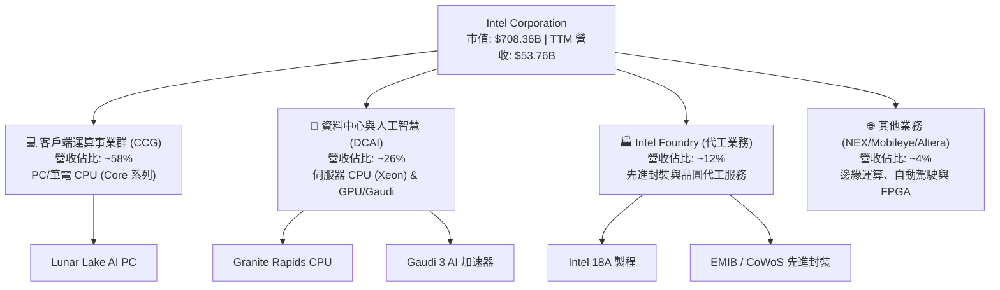

### 2.2 市場份額

在核心的 x86 CPU 市場，Intel 依然維持著主導地位，但在伺服器與高效能運算領域面臨 AMD 的強力挑戰，同時在晶圓代工領域與行業龍頭台積電（TSMC）存在巨大差距。

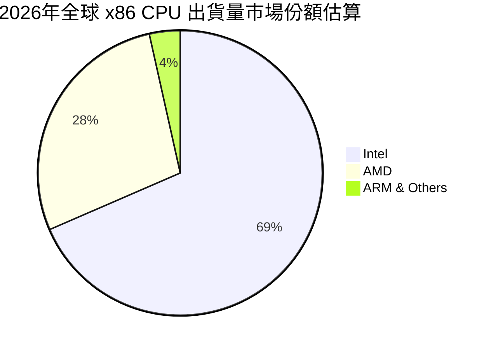

### 2.3 競爭護城河分析

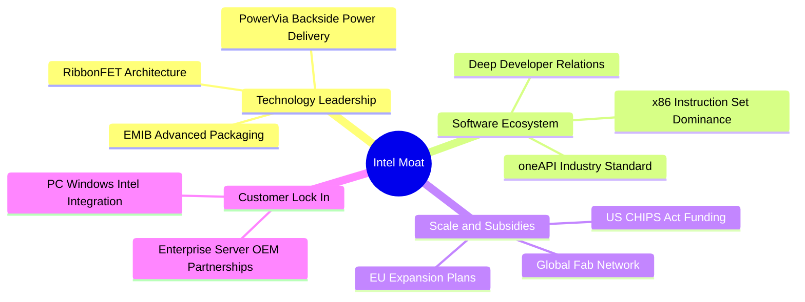

### 2.4 護城河強度評分

```
╔══════════════════════════════════════════════════════════════╗
║                    Intel 護城河強度評分                      ║
╠══════════════════════════════════════════════════════════════╣
║ x86 生態系統   8.5/10 ▓▓▓▓▓▓▓▓▓▓▓▓▓▓▓▓▓░░░  🟢 極強        ║
║ 先進製程技術   6.5/10 ▓▓▓▓▓▓▓▓▓▓▓▓▓░░░░░░░░  🟡 追趕中      ║
║ 晶圓代工規模   5.0/10 ▓▓▓▓▓▓▓▓▓▓░░░░░░░░░░  🟡 起步階段    ║
║ 軟體生態 (oneAPI) 7.0/10 ▓▓▓▓▓▓▓▓▓▓▓▓▓▓░░░░░░  🟢 具競爭力    ║
╠══════════════════════════════════════════════════════════════╣
║ 綜合護城河     6.7/10 ▓▓▓▓▓▓▓▓▓▓▓▓▓░░░░░░░  🟢 轉型重建中  ║
╚══════════════════════════════════════════════════════════════╝
```

---

## 3. 損益表深度分析

### 3.1 年度收入成長趨勢（近4年）

Intel 的年度營收在經歷了 2021-2024 年的連續下滑後，於 2025 年開始觸底，並在 2026 年初展現出溫和的復甦跡象。

```
╔══════════════════════════════════════════════════════════════════╗
║                  Intel 年度收入趨勢 (FY2022-FY2025)              ║
╠══════════════════════════════════════════════════════════════════╣
║                                                                  ║
║  FY2022  $63.05B  ████████████████████████░░░░░  YoY: -20.2% 🔴  ║
║  FY2023  $54.23B  ████████████████████░░░░░░░░░  YoY: -14.0% 🔴  ║
║  FY2024  $53.10B  ███████████████████░░░░░░░░░░  YoY:  -2.1% 🟡  ║
║  FY2025  $52.85B  ███████████████████░░░░░░░░░░  YoY:  -0.5% 🟡  ║
║                                                                  ║
║  📊 4年營收複合增長率 (CAGR)：-5.73%                             ║
╚══════════════════════════════════════════════════════════════════╝
```

### 3.2 季度收入趨勢分析

從季度數據來看，Intel 的營收在 2025 年下半年開始走穩，2026 年第一季（Q1 2026）營收達到 **$13.58B**，同比增長 **7.18%**，顯示 PC 市場的補庫存需求與 AI PC 的初步放量開始產生積極貢獻。

| 季度 | 營收 (Billion) | YoY 成長率 | QoQ 成長率 | 毛利 (Billion) | 毛利率 | 備註 |
|---|---|---|---|---|---|---|
| **Q1 2026** | $13.58 | +7.18% 🟢 | -0.66% 🟡 | $5.35 | 39.38% | PC 晶片需求回暖，AI PC 出貨加速 |
| **Q4 2025** | $13.67 | -4.11% 🔴 | +0.15% 🟡 | $4.94 | 36.14% | 伺服器市場競爭激烈，季節性持平 |
| **Q3 2025** | $13.65 | +2.78% 🟢 | +6.14% 🟢 | $5.22 | 38.24% | 資料中心客戶溫和復甦 |
| **Q2 2025** | $12.86 | +0.20% 🟡 | +1.52% 🟡 | $3.54 | 27.53% | 代工業務重組與高折舊壓制毛利 |

### 3.3 利潤率演變分析

Intel 的利潤率指標在過去幾年中出現了斷崖式下跌，主要原因在於先進製程研發投入極高、晶圓廠折舊費用開始計提，以及代工業務在達到規模效應前的高昂營運成本。

| 利潤率指標 | FY2022 | FY2023 | FY2024 | FY2025 | TTM | 趨勢評估 |
|---|---|---|---|---|---|---|
| **毛利率** | 42.61% | 40.04% | 32.66% | 34.77% | **37.20%** | 🟡 底部回升，但仍遠低於歷史 60% 均值 |
| **營業利益率** | 3.70% | 0.17% | -21.99%| -4.19% | **6.90%** | 🟢 透過裁員與成本控制（如減少 R&D）回歸正值 |
| **淨利潤率** | 12.71% | 3.09% | -35.28%| 0.05%  | **-5.90%** | 🔴 TTM 仍處於虧損狀態，主要受非營運費用拖累 |

*   **利潤率惡化原因**：先進製程（如 Intel 4, Intel 3）產能爬坡期的良率損失，以及高昂的 EUV 光刻機折舊。
*   **改善契機**：設計與代工部門分拆後，設計部門可自由選擇外部代工（如將部分 Lunar Lake 訂單外包給台積電），有望提升設計部門的毛利率。

### 3.4 費用結構分析

Intel 依然維持著極高的研發（R&D）投入，儘管 2025 年 R&D 費用由 2024 年的 **$16.55B** 下降至 **$13.77B**，但佔營收比重仍高達 **26.06%**。

```mermaid
pie title 2025年 Intel 費用結構佔營收比重
    "Cost of Revenue" : 65.23
    "Research & Development (R&D)" : 26.06
    "Selling, General & Admin (SG&A)" : 8.75
    "Other Operating Expenses" : 4.14
    "Operating Loss/Profit Margin" : -4.18
```

### 3.5 季度 EPS 趨勢與盈餘品質

*   **Q1 2026 EPS (Basic)**: **-$0.73**（低於市場預期，主要受一次性重組費用與代工資產減值影響）
*   **Q4 2025 EPS (Basic)**: **-$0.12**
*   **Q3 2025 EPS (Basic)**: **+$0.90**（受益於非營運資產處置與稅收回撥）
*   **Q2 2025 EPS (Basic)**: **-$0.67**

**盈餘品質評估（🔴 偏低）**：Intel 的淨利潤波動極大，且頻繁出現非營運收益（如 Q3 2025 的 $3.67B 非營運收入）與高額的一次性開支。非 GAAP 與 GAAP 獲利之間存在巨大鴻溝，表明核心業務的獲利能力依舊脆弱。

---

## 4. 資產負債表分析

Intel 為了維持龐大的晶圓廠建設，資產負債表在過去兩年中急劇擴張，但也累積了相當規模的債務。

### 4.1 資產結構分解

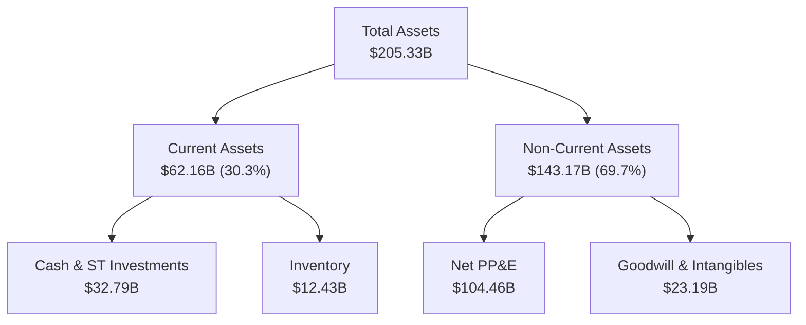

### 4.2 流動性指標分析

| 指標 | FY2022 | FY2023 | FY2024 | FY2025 | Q1 2026 | 行業均值 | 評估 |
|---|---|---|---|---|---|---|---|
| **流動比率 (Current Ratio)** | 1.57 | 1.54 | 1.33 | 2.02 | **2.31** | ~1.85 | 🟢 流動性充裕 |
| **速動比率 (Quick Ratio)** | 1.16 | 1.14 | 0.99 | 1.65 | **1.85** | ~1.40 | 🟢 短期償債能力無虞 |
| **債務權益比 (Debt/Equity)** | 41.42%| 46.66%| 50.38%| 40.77%| **36.03%**| ~45.0%| 🟢 槓桿率處於安全區間 |

### 4.3 債務結構分析

```
╔══════════════════════════════════════════════════════════════════╗
║                     Intel 債務健康診斷 (Q1 2026)                 ║
<br>╠══════════════════════════════════════════════════════════════════╣
║                                                                  ║
║  總債務 (Total Debt)：  $45.03B  ████████████░░░░░░░░░           ║
║  總現金與短期投資：      $32.79B  ████████░░░░░░░░░░░░░           ║
║  淨債務 (Net Debt)：    -$12.24B  (現金不足以覆蓋全部債務)         ║
║                                                                  ║
║  債務期限結構：                                                  ║
║  ├── 短期債務 (ST Debt)： $2.00B (無近期再融資壓力)             ║
║  └── 長期債務 (LT Debt)： $43.03B (多為低利率固定票面債券)       ║
║                                                                  ║
║  🚨 利息保障倍數 (Interest Coverage)：由於營業利潤不穩定，       ║
║     TTM 利息保障倍數僅為 2.1x，需警惕融資成本上升風險。          ║
╚══════════════════════════════════════════════════════════════════╝
```

---

## 5. 現金流量深度分析

現金流是 Intel 當前最脆弱的環節。雖然營運現金流保持正值，但龐大的資本開支（Capex）使公司持續處於「自由現金流赤字」狀態。

### 5.1 現金流量瀑布圖

```mermaid
graph LR
    NI["TTM Net Income<br/>-$3.37B"]
    DA["Depreciation & Amortization<br/>+$9.50B"]
    NWC["Working Capital Changes<br/>+$3.85B"]
    OCF["Operating Cash Flow<br/>+$9.98B"]
    CAPEX["Capital Expenditure<br/>-$18.28B"]
    FCF["Free Cash Flow<br/>-$8.30B"]
    DIV["Dividends Paid<br/>$0.00B"]
    FIN["Net External Financing<br/>+$13.50B"]
    CASH["Net Cash Change<br/>+$5.20B"]

    NI --> |"Non-cash items"| DA
    DA --> NWC
    NWC --> OCF
    OCF --> CAPEX
    CAPEX --> FCF
    FCF --> DIV
    DIV --> |"Debt/Equity Issuance"| FIN
    FIN --> CASH
```

### 5.2 FCF 轉換率趨勢

由於大舉投資晶圓廠，Intel 的自由現金流在過去四年均為負值，FCF 轉換率（FCF / Net Income）持續為負。

| 現金流指標 (Billion) | FY2022 | FY2023 | FY2024 | FY2025 | TTM |
|---|---|---|---|---|---|
| **營業現金流 (OCF)** | $15.43 | $11.47 | $8.29 | $9.70 | **$9.98** |
| **資本支出 (Capex)** | -$24.84 | -$25.75 | -$23.94 | -$14.65 | **-$18.28** |
| **自由現金流 (FCF)** | -$9.41 | -$14.28 | -$15.66 | -$4.95 | **-$8.30** |
| **FCF 轉換率** | -117.4% | -852.5% | +81.4% | -1903.8% | **-246.3%** |

### 5.3 自由現金流趨勢

```
╔══════════════════════════════════════════════════════════════════╗
║                  Intel 歷年自由現金流 (FY2022-TTM)               ║
╠══════════════════════════════════════════════════════════════════╣
║                                                                  ║
║  FY2022   -$9.41B   ░░░░░░░░░░░░░░░░░░░░░░░░░                    ║
║  FY2023  -$14.28B   ░░░░░░░░░░░░░░░░░░░░░░░░░░░░░░               ║
║  FY2024  -$15.66B   ░░░░░░░░░░░░░░░░░░░░░░░░░░░░░░░░             ║
║  FY2025   -$4.95B   ░░░░░░░░░░░░░                                ║
║  TTM      -$8.30B   ░░░░░░░░░░░░░░░░░░░░░                        ║
║                                                                  ║
║  ⚠️ 自由現金流收益率 (FCF Yield)：-1.17% (高資本消耗型企業特徵)  ║
╚══════════════════════════════════════════════════════════════════╝
```

### 5.4 資本配置評估

為了保留現金以應對晶圓廠建設，Intel 已於 2024 年底**完全暫停支付股利**（Dividend Paid = 0），並停止了股票回購。目前的資本配置 100% 聚焦於資本支出（Capex）與先進製程研發。

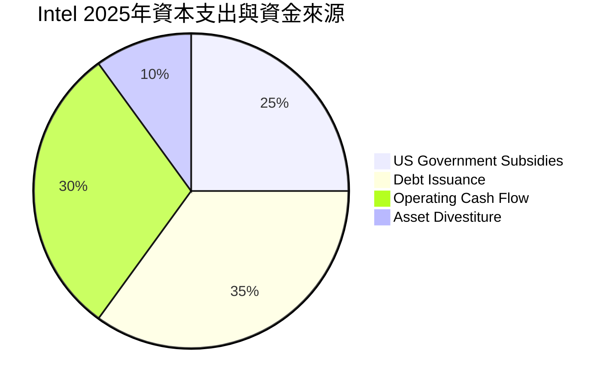

---

## 6. 獲利能力與資本效率

### 6.1 ROE / ROA / ROIC 趨勢

Intel 的資本回報率近年來大幅低於其加權平均資本成本（WACC），顯示出資本效率極其低下。

| 指標 | FY2022 | FY2023 | FY2024 | FY2025 | TTM | 行業中位數 | 評估 |
|---|---|---|---|---|---|---|---|
| **ROE** | 7.90% | 1.59% | -18.90%| -0.23% | **-2.90%** | ~15.5% | 🔴 摧毀股東權益 |
| **ROA** | 4.40% | 0.87% | -9.79% | 0.01%  | **0.60%**  | ~8.0%  | 🔴 資產利用效率極低 |
| **ROIC**| 5.12% | 0.95% | -8.45% | -1.15% | **2.32%**  | ~12.0% | 🔴 投入資本回報低於成本 |

### 6.2 ROIC vs WACC 分析（核心價值創造判斷）

```
╔══════════════════════════════════════════════════════════════════╗
║                ROIC vs WACC 深度分析 (TTM)                      ║
╠══════════════════════════════════════════════════════════════════╣
║                                                                  ║
║  WACC 估算：                                                     ║
║  ├── 無風險利率 (10Y 美債)： 4.25%                               ║
║  ├── 市場風險溢酬 (ERP)：    5.50%                               ║
║  ├── Beta 值：               2.228 (高波動性)                    ║
║  ├── 股權成本 (COE) = 4.25% + 2.228 × 5.50% = 16.50%             ║
║  ├── 債務成本 (稅後)：       ~4.50%                              ║
║  ├── 資本結構：股權 94.0%，債務 6.0% (基於 $708B 市值)           ║
║  └── ✅ 加權平均資本成本 (WACC) ≈ 14.68%                          ║
║                                                                  ║
║  ROIC 估算：                                                     ║
║  ├── NOPAT = TTM Operating Income $3.71B × (1-21%) ≈ $2.93B       ║
║  ├── 投入資本 = 股東權益 $114.28B + 債務 $45.03B - 現金 $32.79B   ║
║  │   = $126.52B                                                  ║
║  └── ✅ 投入資本回報率 (ROIC) ≈ 2.32%                            ║
║                                                                  ║
║  ★ 經濟附加價值 (EVA) = ROIC - WACC = -12.36% (每投入$100摧毀$12)║
║                                                                  ║
║  ROIC  2.32%   ▓▓░░░░░░░░░░░░░░░░░░░░░░░░░░░░░  🔴              ║
║  WACC  14.68%  ▓▓▓▓▓▓▓▓▓▓▓▓▓▓▓░░░░░░░░░░░░░░░░  ──              ║
║  EVA   -12.36% ░░░░░░░░░░░░░░░░░░░░░░░░░░░░░░░  🔴 價值摧毀中   ║
║                                                                  ║
║  📊 結論：Intel 當前無法覆蓋其資本成本，高昂的股價純屬「敘事溢價」║
╚══════════════════════════════════════════════════════════════════╝
```

### 6.3 杜邦三因素分解

透過杜邦分析，我們可以看出 ROE 轉負的核心驅動因素是**淨利潤率的崩塌**，儘管財務槓桿有所上升，但無法彌補資產週轉率與利潤率的下滑。

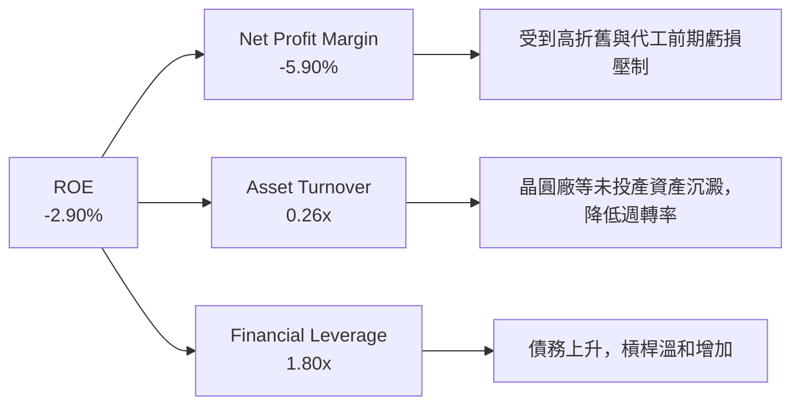

### 6.4 獲利能力儀表板

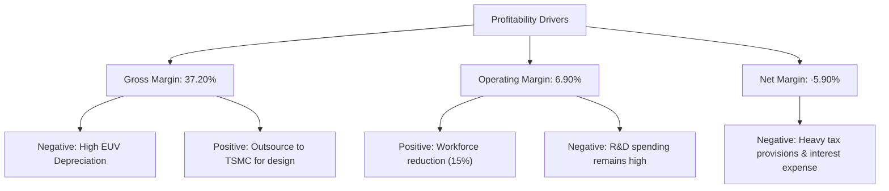

---

## 7. 估值深度分析

### 7.1 同業估值比較表格

與同業相比，Intel 的估值指標顯得極其高昂，尤其是 Forward P/E 與 P/S 比例，這反映了市場對其轉型成功給予了極端樂觀的定價。

| 估值指標 | **Intel (INTC)** | **AMD (AMD)** | **NVIDIA (NVDA)** | **台積電 (TSM)** | 本公司評估 |
|---|---|---|---|---|---|
| **Trailing P/E** | **N/A** (TTM 虧損) | 125.4x | 68.2x | 28.5x | 🔴 獲利能力尚未恢復 |
| **Forward P/E** | **91.14x** | 45.2x | 35.8x | 22.1x | 🔴 遠高於同行，溢價過高 |
| **P/S Ratio** | **13.18x** | 10.5x | 28.4x | 11.2x | 🔴 以其低成長與低毛利而言不合理 |
| **P/B Ratio** | **6.36x** | 4.8x | 42.1x | 7.2x | 🟡 處於合理區間 |
| **EV / EBITDA** | **49.34x** | 38.2x | 48.5x | 14.2x | 🔴 超越 NVIDIA，估值泡沫化 |

### 7.2 歷史估值區間分析

Intel 過去 10 年的 Forward P/E 中位數僅為 **12.5x**。當前的 **91.14x** 處於歷史絕對高位（>99 百分位數），這意味著估值容錯率極低。

```
╔══════════════════════════════════════════════════════════════════╗
║               Intel 歷史 Forward P/E 區間與當前位置              ║
╠══════════════════════════════════════════════════════════════════╣
║                                                                  ║
║  歷史最低 (5Y Low)：     9.0x   ███                              ║
║  歷史中位數 (5Y Median)：12.5x  ████                             ║
║  歷史最高 (5Y High)：    35.0x  ███████████                      ║
║  當前位置 (Current)：    91.1x  ███████████████████████████████  ║
║                                                                  ║
║  🚨 警示：當前估值已脫離基本面歷史區間，存在極大的回檔風險。    ║
╚══════════════════════════════════════════════════════════════════╝
```

### 7.3 DCF 敏感性分析（6格目標價矩陣）

基於永續增長率 2.5%，對折現率（WACC）與 TTM 營收增長率進行敏感性分析，得出以下每股內在價值矩陣：

| 營收成長率 / WACC | **WACC = 13.5%** | **WACC = 14.68% (基準)** | **WACC = 15.5%** |
|---|---|---|---|
| 🟢 **樂觀 (10.0% 成長)** | **$112.50** (-20.2%) | **$98.20** (-30.3%) | **$85.40** (-39.4%) |
| 🟡 **基準 (7.2% 成長)** | **$105.00** (-25.5%) | **$94.14** (-33.2%) | **$78.90** (-44.0%) |
| 🔴 **悲觀 (3.0% 成長)** | **$75.30** (-46.6%) | **$62.80** (-55.4%) | **$45.00** (-68.1%) |

*註：括號內百分比代表相較於當前股價 $140.94 的隱含漲跌幅。*

### 7.4 估值綜合區間

```
╔══════════════════════════════════════════════════════════════════╗
║                    Intel 估值區間與當前股價對比                  ║
╠══════════════════════════════════════════════════════════════════╣
║                                                                  ║
║  分析師最低目標價：  $45.00   [悲觀預期]                         ║
║  DCF 基準估值：      $94.14   [基本面價值]                       ║
║  當前股價：          $140.94  [市場定價]                         ║
║  分析師最高目標價：  $150.00  [極度樂觀預期]                     ║
║                                                                  ║
║  當前股價位置：                                                  ║
║  $45.00 --------- $94.14 ---------------------- $140.94 - $150.00║
║  [  低估區  ]     [  合理價值區  ]              [▲ 當前股價高估] ║
╚══════════════════════════════════════════════════════════════════╝
```

---

## 8. 成長催化劑

### 8.1 催化劑時間軸

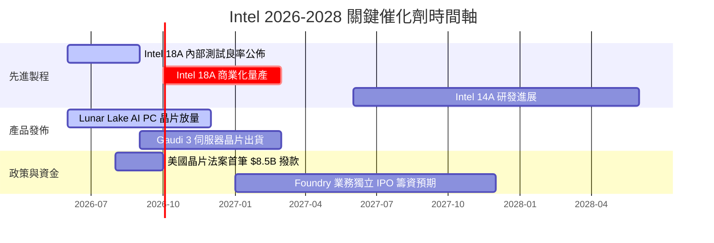

### 8.2 TAM 市場規模分析

```
╔══════════════════════════════════════════════════════════════════╗
║                Intel 2028年目標市場 (TAM) 滲透率預估             ║
╠══════════════════════════════════════════════════════════════════╣
║                                                                  ║
║  1. AI PC 晶片市場：                                             ║
║     ├── 全球 TAM: $45.0B                                        ║
║     └── Intel 預期市占率: 60% (營收貢獻 ~$27.0B)                 ║
║                                                                  ║
║  2. 資料中心 CPU & AI 加速器：                                   ║
║     ├── 全球 TAM: $120.0B                                       ║
║     └── Intel 預期市占率: 25% (營收貢獻 ~$30.0B)                 ║
║                                                                  ║
║  3. 先進晶圓代工 (Foundry)：                                     ║
║     ├── 全球 TAM: $150.0B                                       ║
║     └── Intel 預期市占率: 8%  (營收貢獻 ~$12.0B)                 ║
║                                                                  ║
║  📊 總計 2028 年預期潛在營收上限：~$69.0B (較目前增長 28%)        ║
╚══════════════════════════════════════════════════════════════════╝
```

### 8.3 成長驅動力結構圖

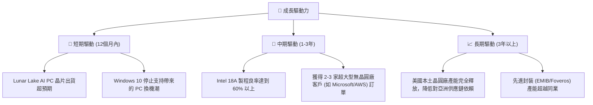

---

## 9. 風險矩陣

### 9.1 風險評分矩陣

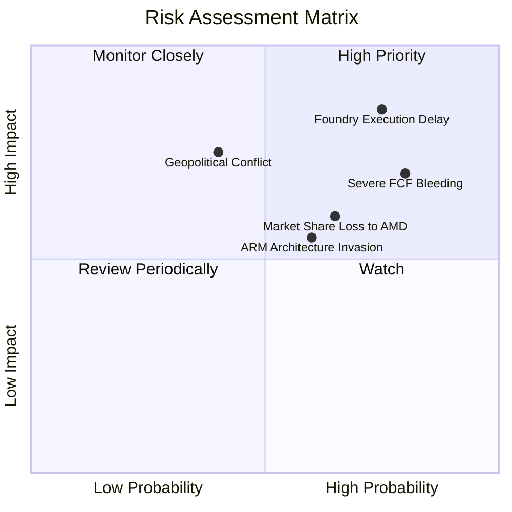

### 9.2 風險清單詳細分析

| # | 風險項目 | 發生機率 | 財務衝擊 | 風險評分 | 緩解措施 |
|---|---|---|---|---|---|
| 1 | 🔴 **18A 先進製程延遲或良率過低** | 高 (65%) | 極高 (-15% 營收) | 🔴 **8.5 / 10** | 與 ASML 緊密合作，引進 High-NA EUV 光刻機；部分產品線繼續外包台積電。 |
| 2 | 🔴 **自由現金流耗盡導致信用評等調降** | 高 (70%) | 高 (融資成本上升 1.5%) | 🔴 **8.0 / 10** | 引進外部共同投資者（如 Brookfield 基礎設施合夥計劃），推動代工業務子公司化募資。 |
| 3 | 🟡 **x86 PC 市場被 ARM 架構蠶食** | 中 (50%) | 中 (-8% 營收) | 🟡 **6.0 / 10** | 推出極低功耗的 x86 晶片（如 Lunar Lake），在功耗比上正面迎戰高通與 Apple。 |
| 4 | 🟡 **《晶片法案》補貼延遲發放** | 中 (40%) | 中 (-$2.0B 現金) | 🟡 **5.5 / 10** | 加強與美國政府地緣政治戰略綁定，確保合規性。 |

---

## 10. 投資建議

### 10.1 最終綜合評級雷達圖

```
╔══════════════════════════════════════════════════════════════╗
║               INTC 最終綜合評級雷達圖 (1-10分)               ║
╠══════════════════════════════════════════════════════════════╣
║                                                              ║
║  1. 技術創新力 (Innovation)： 7.5  ▓▓▓▓▓▓▓▓▓▓▓▓▓▓▓░░░░░     ║
║  2. 財務健康度 (Balance Sheet