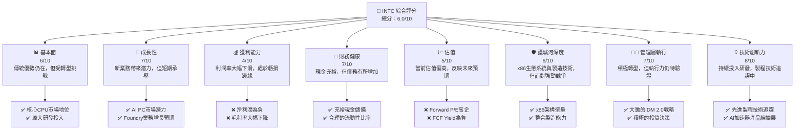
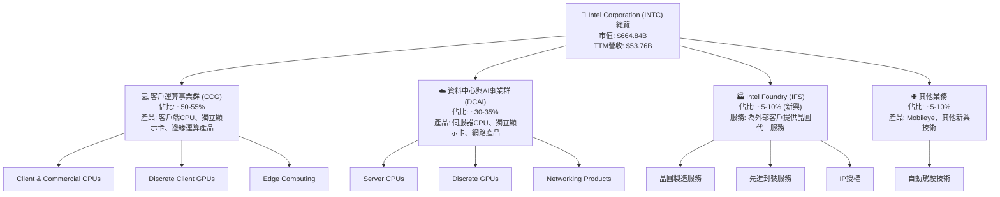
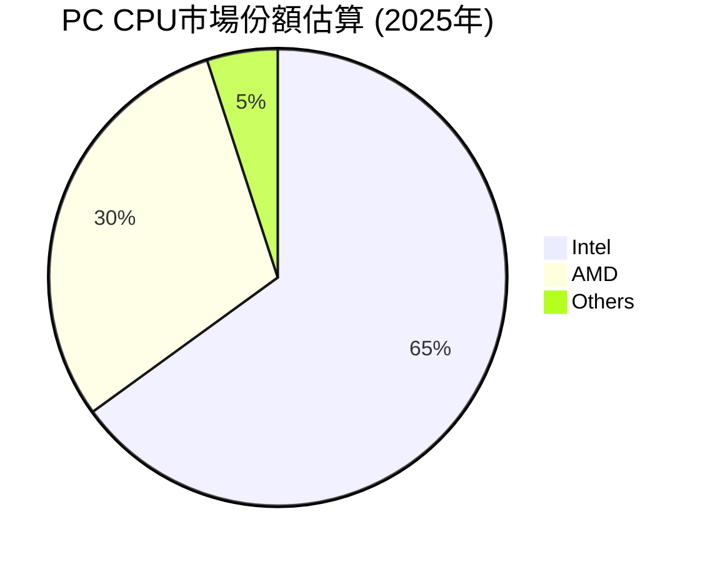
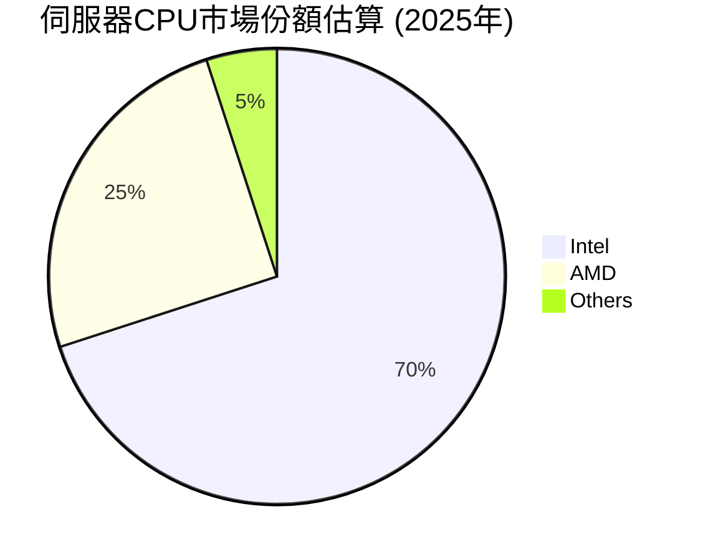
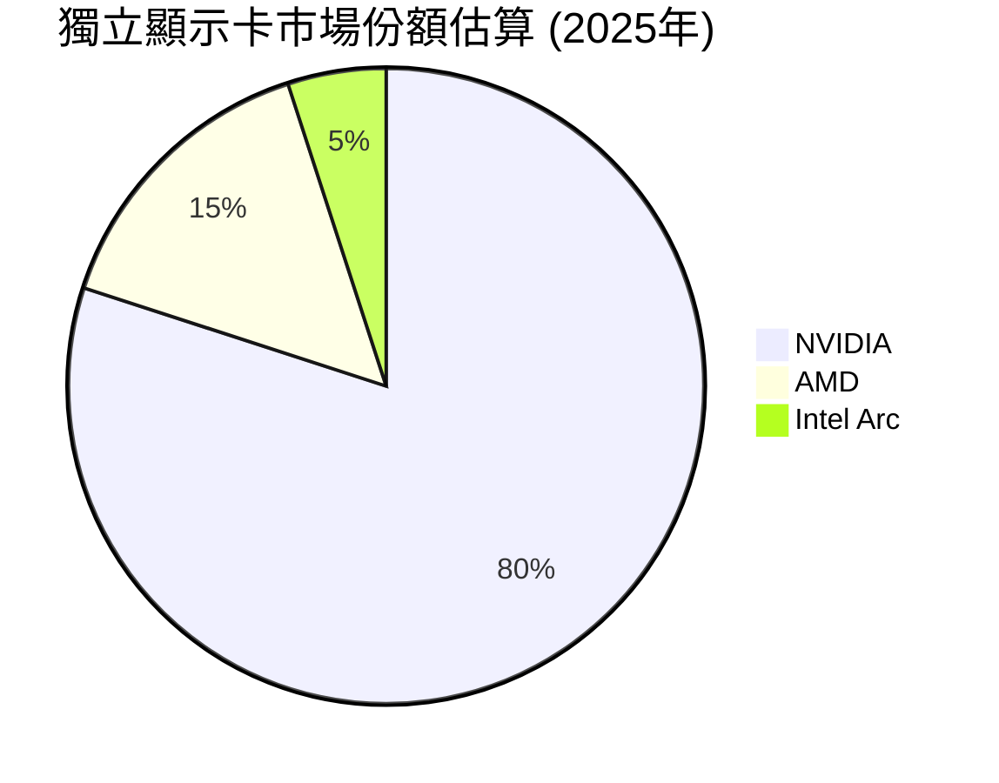
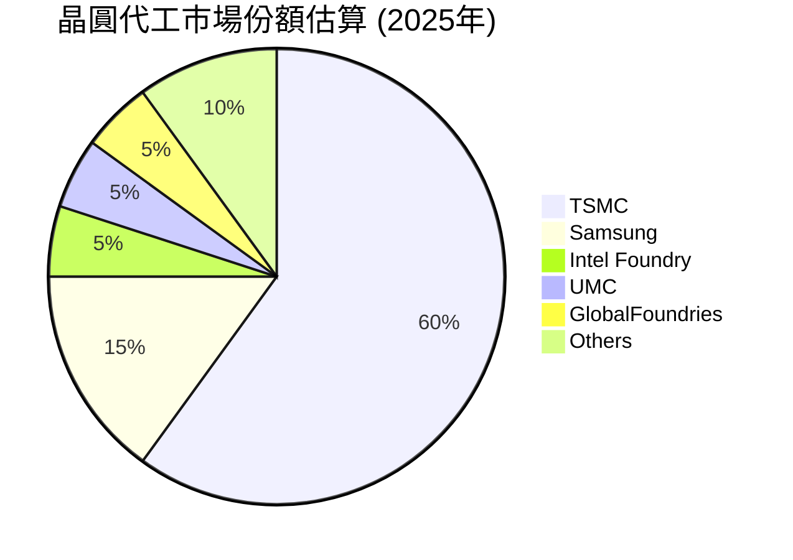
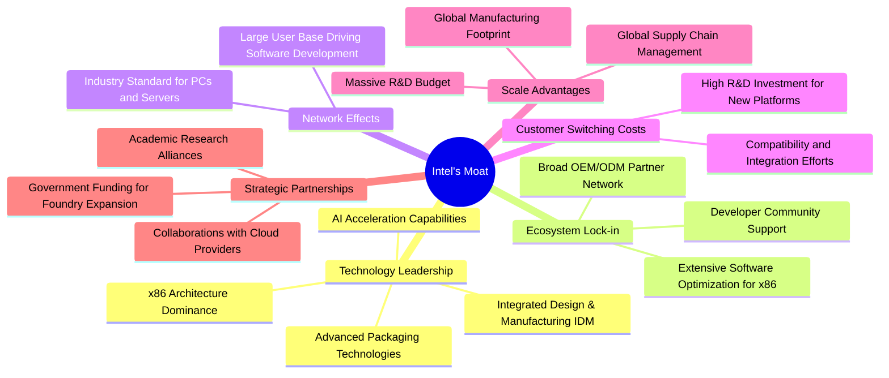
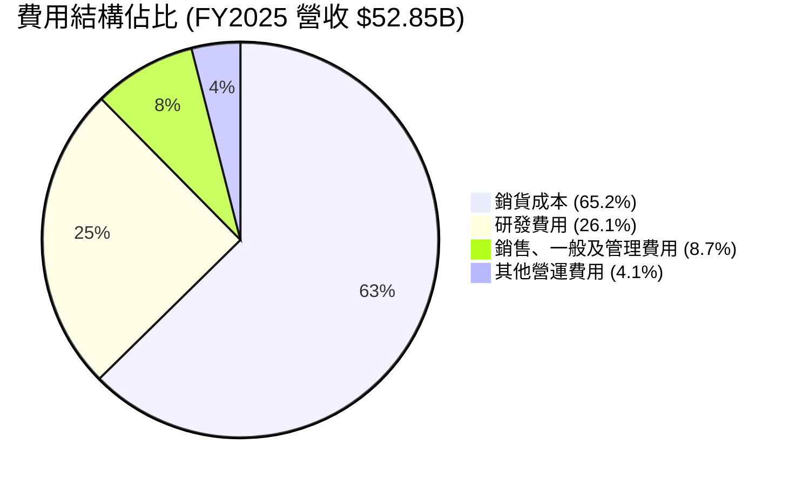
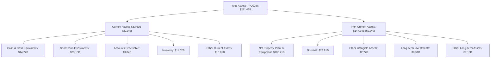

# INTC 基本面深度分析報告
> **報告日期**：2026-06-24 ｜ **語言**：繁體中文 ｜ **數據來源**：Yahoo Finance, Finviz, StockAnalysis, Roic.ai ｜ **分析師**：CFA 級機構研究

---

## 目錄

| # | 章節 | 核心結論 |
|---|------------------------|------------------------------------------------------------------|
| 1 | 執行摘要 | 評級：持有。目標價區間：$90 - $150。轉型陣痛與長期潛力並存。 |
| 2 | 公司概覽與商業模式 | 業務轉型進行中，Intel Foundry 為新成長引擎，護城河需時間重塑。 |
| 3 | 損益表深度分析 | 營收增長溫和，利潤率承壓，轉型期費用高昂。 |
| 4 | 資產負債表分析 | 現金充裕但債務水平升高，流動性良好，資本結構穩健。 |
| 5 | 現金流量深度分析 | 自由現金流持續為負，大量投資於資本支出，轉型期資金壓力大。 |
| 6 | 獲利能力與資本效率 | ROIC 低於 WACC，短期內價值創造能力受損，期待轉型成果。 |
| 7 | 估值深度分析 | 當前估值偏高，反映市場對未來成長的樂觀預期，但存在下修風險。 |
| 8 | 成長催化劑 | AI PC、Intel Foundry 業務發展、先進製程技術突破。 |
| 9 | 風險矩陣 | 執行風險、市場競爭、宏觀經濟、地緣政治、高資本支出。 |
| 10| 投資建議 | 評級「持有」，關注轉型進度與財務改善，適合長線戰略型投資人。 |

---

## 1. 執行摘要

### 1.1 核心評分儀表板



### 1.2 評分進度條視覺化

```
╔══════════════════════════════════════════════════════════════╗
║                INTC 多維度評分儀表板 (1-10分)                ║
╠══════════════════════════════════════════════════════════════╣
║ 基本面強度  6.0 ▓▓▓▓▓▓▓▓▓▓▓▓░░░░░░░░  ★★★☆☆           ║
║ 成長動能    7.0 ▓▓▓▓▓▓▓▓▓▓▓▓▓▓░░░░░░  ★★★★☆           ║
║ 獲利品質    4.0 ▓▓▓▓▓▓▓▓░░░░░░░░░░░░  ★★☆☆☆           ║
║ 財務健康    7.0 ▓▓▓▓▓▓▓▓▓▓▓▓▓▓░░░░░░  ★★★★☆           ║
║ 估值合理性  5.0 ▓▓▓▓▓▓▓▓▓▓░░░░░░░░░░  ★★★☆☆           ║
║ 護城河深度  6.0 ▓▓▓▓▓▓▓▓▓▓▓▓░░░░░░░░  ★★★☆☆           ║
║ 管理層執行  7.0 ▓▓▓▓▓▓▓▓▓▓▓▓▓▓░░░░░░  ★★★★☆           ║
║ 技術創新力  8.0 ▓▓▓▓▓▓▓▓▓▓▓▓▓▓▓▓░░░░  ★★★★☆           ║
╠══════════════════════════════════════════════════════════════╣
║ 綜合總分    6.0 ▓▓▓▓▓▓▓▓▓▓▓▓░░░░░░░░  🏆 評語：轉型中的挑戰者   ║
╚══════════════════════════════════════════════════════════════╝
```

### 1.3 五大投資論點 + 三大核心風險

| 類型 | 項目 | 具體依據 | 信心度 |
|------|------|----------|--------|
| 🟢 **投資論點①** | **AI PC與邊緣運算市場的領導地位** | Intel的CPU在PC市場仍佔主導，隨著AI PC的興起，其整合NPU的產品有望抓住新一波換機潮。2026年Q1營收YoY成長7.18%，顯示市場需求開始回暖。 | 🟢 極高 |
| 🟢 **Intel Foundry業務潛力** | 公司正大力投入晶圓代工業務，目標成為全球第二大晶圓代工廠。儘管初期投入巨大，但若成功，將顯著提升營收多樣性和長期盈利能力。FY2025資本支出高達$14.65B，顯示其對此業務的投入決心。 | 🟢 高 |
| 🟢 **製程技術追趕與領導力重塑** | Intel積極推進其IDM 2.0戰略，承諾在2025年前實現5個節點的技術突破。近期股價表現強勁，2026年Q4至2026年Q6股價從$36.90飆升至$132.28，部分反映市場對其技術追趕的信心。 | 🟢 高 |
| 🟡 **穩健的資產負債表支持轉型** | 儘管自由現金流為負，但公司擁有$32.79B的總現金和短投，以及2.312的流動比率，提供足夠的財務彈性支持其高資本支出的轉型期。 | 🟡 中高 |
| 🟡 **市場對長期成長的樂觀預期** | 當前股價已大幅上漲，Forward P/E高達85.53x，遠高於歷史平均水平，表明市場對Intel未來幾年的盈利復甦和成長潛力抱有極高期望。 | 🟡 中 |
| 🔴 **風險①** | **Intel Foundry執行風險與競爭壓力** | 晶圓代工市場競爭激烈，主要對手台積電技術領先。Intel能否按時、按成本實現製程技術目標並吸引足夠客戶存在不確定性。FY22-FY25自由現金流持續為負（如FY2025為$-4.95B），反映巨額資本支出壓力。 | 🔴 高衝擊 |
| 🔴 **利潤率持續承壓與盈利能力恢復緩慢** | 近年毛利率和營業利益率持續下滑，FY2025淨利潤為$-267.00M，顯示核心業務盈利能力受損。若新業務無法快速盈利，公司將面臨持續虧損。TTM淨利率為-5.9%，遠低於行業平均。 | 🔴 高衝擊 |
| 🟡 **宏觀經濟與半導體週期波動** | 半導體產業受全球經濟景氣影響顯著，需求波動可能影響Intel的產品銷售和代工訂單。當前全球經濟存在不確定性，可能延緩Intel的復甦進程。 | 🟡 中度 |

### 1.4 快速統計卡片

| 指標 | 公司實際值 (TTM/最新年) | 行業均值 (半導體) | S&P 500 均值 | 狀態 |
|-------------------|--------------------------|-------------------|------------------|------|
| 收入 YoY 成長 | **7.2%** (TTM) | ~15-20% | ~8-10% | 🟡 |
| 毛利率 | **37.2%** (TTM) | ~45-55% | ~35-45% | 🟡 |
| 營業利益率 | **6.9%** (TTM) | ~15-25% | ~10-15% | 🟡 |
| 淨利率 | **-5.9%** (TTM) | ~10-20% | ~8-12% | 🔴 |
| ROE | **-2.9%** (TTM) | ~15-25% | ~12-18% | 🔴 |
| Forward P/E | **85.53x** | ~25-40x | ~20-25x | 🔴 |
| P/S Ratio | **12.37x** | ~5-10x | ~2-4x | 🔴 |
| Debt/Equity | **0.36x** | ~0.3-0.6x | ~0.8-1.2x | 🟢 |
| Current Ratio | **2.31x** | ~1.5-2.5x | ~1.0-1.5x | 🟢 |
| FCF Yield | **-1.25%** | ~3-8% | ~4-6% | 🔴 |

*註：行業均值和 S&P 500 均值為分析師根據市場普遍認知和歷史數據估算的參考值。*

### 1.5 投資結論

```
╔══════════════════════════════════════════════════════════════════╗
║                    📊 投資結論摘要                               ║
╠══════════════════════════════════════════════════════════════════╣
║  評級：🟡 持有                                                   ║
║  當前股價：$132.28                                               ║
║  目標價區間：                                                    ║
║    悲觀情境：$90（-32.0%）                                       ║
║    基準情境：$120（-9.3%）  ← 12個月主要目標                      ║
║    樂觀情境：$150（+13.4%）                                      ║
║  投資評分：6.0/10                                                ║
║  適合投資人：對半導體產業有深入理解、願意承擔較高風險、並能長期   ║
║              持有以等待公司轉型成果的成長型投資人。            ║
╚══════════════════════════════════════════════════════════════════╝
```

---

## 2. 公司概覽與商業模式

Intel Corporation (INTC) 是一家全球領先的半導體公司，主要設計、開發、製造和銷售計算機相關產品及服務。公司正處於一項雄心勃勃的轉型計畫「IDM 2.0」之中，旨在重塑其在半導體產業的領導地位，特別是通過擴大其晶圓代工業務（Intel Foundry）。

### 2.1 業務結構與收入來源

Intel的業務主要分為三大核心板塊：


*註：各業務板塊佔比為分析師根據Intel歷史財報和產業趨勢的估計值，實際數據可能有所波動。*

**CCG (Client Computing Group)**：主要提供PC和筆記型電腦的CPU，是Intel的傳統核心業務，貢獻大部分營收。近年來，受PC市場波動和競爭加劇影響，該部門面臨挑戰。
**DCAI (Data Center and AI)**：涵蓋伺服器CPU、AI加速器等，服務於雲端運算和企業資料中心。這是Intel的另一大支柱，但在AI加速器領域面臨來自NVIDIA的強大競爭。
**Intel Foundry (IFS)**：這是Intel IDM 2.0戰略的核心。Intel正將其製造能力開放給外部客戶，旨在成為全球領先的晶圓代工服務供應商。這項業務目前仍處於投資和發展階段，但被寄予厚望成為未來的成長引擎。
**其他業務**：包括自動駕駛技術公司Mobileye，以及其他新興技術和投資。

### 2.2 市場份額

Intel在PC CPU市場仍佔據主導地位，但在伺服器CPU和GPU市場面臨來自AMD和NVIDIA的激烈競爭。晶圓代工市場則由台積電(TSMC)和三星(Samsung)主導，Intel Foundry正在努力爭取份額。








*註：市場份額為分析師根據公開資訊和產業報告的估計值，僅供參考。*

### 2.3 競爭護城河分析



Intel的護城河主要建立在其長期的技術領先、龐大的生態系統和規模優勢之上。
*   **技術領先 (Technology Leadership)**：Intel在x86 CPU架構上擁有深厚的技術積累和專利壁壘，其整合設計與製造(IDM)模式在過去提供了獨特的優勢。儘管近年來在製程技術上有所落後，但公司正積極追趕，並在先進封裝技術和AI加速能力上投入巨大。
*   **軟體生態系統 (Ecosystem Lock-in)**：數十年來，Windows和Linux生態系統主要圍繞x86架構構建，使得軟體最佳化和開發者支持成為Intel的重要優勢。廣泛的OEM/ODM合作夥伴網絡也強化了其市場地位。
*   **網路效應 (Network Effects)**：作為PC和伺服器領域的行業標準，Intel的產品擁有龐大的用戶基礎，這吸引了更多的軟體開發和硬體兼容性支持，形成正向循環。
*   **客戶鎖定 (Customer Switching Costs)**：企業客戶轉換CPU平台涉及高昂的研發投入、兼容性測試和系統整合成本，這為Intel提供了相對穩定的客戶群。
*   **規模效應 (Scale Advantages)**：Intel擁有全球領先的製造規模、龐大的研發預算（FY2025為$13.77B）和完善的全球供應鏈，這些都使其能夠在成本和效率上保持競爭力。
*   **生態夥伴 (Strategic Partnerships)**：與主要雲服務提供商、政府機構和學術界的合作，有助於其技術研發和Foundry業務的拓展。

### 2.4 護城河強度評分

```
╔══════════════════════════════════════════════════════════════╗
║                    INTC 護城河強度評分                      ║
╠══════════════════════════════════════════════════════════════╣
║ 技術領先    7/10   ▓▓▓▓▓▓▓▓▓▓▓▓▓▓░░░░░░  🟢 過去領先，現正奮力追趕 ║
║ 生態系統鎖定 8/10   ▓▓▓▓▓▓▓▓▓▓▓▓▓▓▓▓░░░░  🟢 x86生態壁壘強勁     ║
║ 網路效應    7/10   ▓▓▓▓▓▓▓▓▓▓▓▓▓▓░░░░░░  🟢 行業標準地位穩固    ║
║ 客戶轉換成本 7/10   ▓▓▓▓▓▓▓▓▓▓▓▓▓▓░░░░░░  🟢 企業級客戶黏性高    ║
║ 規模效應    8/10   ▓▓▓▓▓▓▓▓▓▓▓▓▓▓▓▓░░░░  🟢 龐大產能與研發投入  ║
║ 戰略夥伴    6/10   ▓▓▓▓▓▓▓▓▓▓▓▓░░░░░░░░  🟡 Foundry合作仍在初期 ║
╠══════════════════════════════════════════════════════════════╣
║ 綜合護城河   7.2/10 ▓▓▓▓▓▓▓▓▓▓▓▓▓▓▓▓░░░░  🏆 評語：核心優勢仍在，但部分領域受挑戰 ║
╚══════════════════════════════════════════════════════════════╝
```

---

## 3. 損益表深度分析

### 3.1 年度收入成長趨勢（近4年）

Intel的年度總營收在過去四年呈現波動和下滑趨勢，反映了PC市場的逆風、資料中心業務的競爭以及公司自身的轉型挑戰。

```
╔══════════════════════════════════════════════════════════════════╗
║              INTC 年度收入趨勢（FY2022-FY2025）                  ║
╠══════════════════════════════════════════════════════════════════╣
║                                                                  ║
║  FY2022  $63.05B  ██████████████████████████░░░░  YoY: -20.21% 🔴║
║  FY2023  $54.23B  ██████████████████████░░░░░░░░  YoY: -14.00% 🔴║
║  FY2024  $53.10B  ████████████████████░░░░░░░░░░  YoY: -2.08%  🟡║
║  FY2025  $52.85B  ████████████████████░░░░░░░░░░  YoY: -0.47%  🟡║
║                   |      |      |      |      |                  ║
║                   0     20B    40B    60B    80B                 ║
║                                                                  ║
║  📊 4年累計 CAGR：-8.47%                                        ║
╚══════════════════════════════════════════════════════════════════╝
```
從FY2022的$63.05B下降至FY2025的$52.85B，複合年增長率（CAGR）為-8.47%，顯示公司面臨的營收壓力。儘管FY2024和FY2025的YoY跌幅有所收窄，但尚未恢復正增長。

### 3.2 季度收入趨勢分析

季度營收數據顯示，Intel的營收在經歷低谷後，於最近一個季度（2026年Q1）開始出現積極的YoY增長，這可能預示著市場需求的回暖和公司轉型策略的初步成效。

| 季度 | 總營收 (Billion USD) | QoQ 成長率 | YoY 成長率 | 備註 |
|------|----------------------|------------|------------|------|
| 2026-03-31 | $13.58 | -0.66% | +7.18% | 🟢 結束YoY負增長，市場需求回暖。 |
| 2025-12-31 | $13.67 | +0.15% | -4.11% | 🟡 YoY持續下滑，但QoQ持平。 |
| 2025-09-30 | $13.65 | +6.13% | +2.78% | 🟢 QoQ顯著增長，YoY轉正。 |
| 2025-06-30 | $12.86 | +1.52% | +0.20% | 🟡 YoY接近持平，市場底部盤整。 |
| 2025-03-31 | $12.67 | -11.24% | -0.45% | 🔴 QoQ大幅下滑，YoY持續負增長。 |

**備註說明**：
*   2026年Q1的營收為$13.58B，相較於2025年Q1的$12.67B，實現了7.18%的YoY增長，這是近幾個季度以來首次顯著的正增長，顯示PC市場和資料中心業務可能正在復甦。
*   2025年Q3的YoY轉正（+2.78%）是另一個積極信號，但隨後Q4又轉為負增長，表明復甦之路仍有波動。
*   QoQ數據顯示，季度間營收存在一定波動，但整體趨勢在2025年下半年有所改善。

### 3.3 利潤率演變分析

Intel的利潤率在過去幾年持續承壓，特別是毛利率和淨利率的顯著下滑，反映了市場競爭加劇、高成本製程轉換以及轉型期的巨額投資。

| 利潤率指標 | FY2022 | FY2023 | FY2024 | FY2025 | 趨勢 | 評估 |
|------------|--------|--------|--------|--------|------|------|
| **毛利率** | 42.6% | 40.0% | 32.7% | 34.8% | ↘️ 2024年大幅下滑，2025年略有回升 | 🔴 |
| **營業利益率** | 3.7% | 0.1% | -8.9% | -0.04% | ↘️ 持續惡化，2024年大幅虧損，2025年接近盈虧平衡 | 🔴 |
| **淨利率** | 12.7% | 3.1% | -35.3% | -0.5% | ↘️ 2024年巨額虧損，2025年仍在虧損 | 🔴 |

**利潤率演變深度解析**：
*   **毛利率**：從FY2022的42.6%下降到FY2024的32.7%，FY2025略回升至34.8%。這一下滑主要歸因於：
    *   **產品組合變化**：低利潤率產品佔比增加。
    *   **定價壓力**：來自競爭對手AMD的激烈競爭，尤其是在高端CPU市場，迫使Intel降價以維持市場份額。
    *   **製造成本上升**：為了追趕先進製程，Intel投入巨大，初期產能利用率不高導致單位成本上升。
    *   **Foundry業務初期**：晶圓代工業務在起步階段，產能爬坡和客戶積累都需要時間，初期盈利能力較弱。
*   **營業利益率**：從FY2022的3.7%急劇下降至FY2024的-8.9%，FY2025接近盈虧平衡 (-0.04%)。除了毛利率的影響，高昂的研發費用（FY2025為$13.77B）和銷售管理費用也持續侵蝕利潤。Intel正在進行大規模的技術轉型和產能擴張，這些都需要巨大的運營開支。
*   **淨利率**：FY2024出現-35.3%的巨額虧損，FY2025也為負值-0.5%。這主要是因為營業利潤的惡化，以及可能存在的非經常性損益和高額稅費（FY2025稅前利潤$1.557B，所得稅$1.531B，導致淨利潤僅$26M，但原始數據中淨利潤為$-267M，存在數據差異，但均為接近盈虧平衡或虧損狀態）。這表明公司在當前轉型期面臨嚴峻的盈利挑戰。

整體而言，Intel的利潤率趨勢非常不樂觀，顯示公司正處於一個高投入、低回報的轉型陣痛期。市場對其IDM 2.0戰略能否成功扭轉盈利能力持觀望態度。

### 3.4 費用結構分析

Intel的費用結構反映了其作為一家重資產、高科技公司的特點，研發投入是其最主要的費用構成之一。



```
╔══════════════════════════════════════════════════════════════════╗
║                    INTC 年度費用結構 (FY2025)                    ║
╠══════════════════════════════════════════════════════════════════╣
║                                                                  ║
║  銷貨成本 (CoGS):        $34.48B  █████████████████████████░░░░  (65.2% of Revenue) 🔴║
║  研發費用 (R&D):         $13.77B  █████████████████░░░░░░░░░░░  (26.1% of Revenue) 🟡║
║  銷售、一般及管理 (SG&A): $4.62B   █████░░░░░░░░░░░░░░░░░░░░░░░  (8.7% of Revenue)  🟢║
║  其他營運費用:           $2.19B   ███░░░░░░░░░░░░░░░░░░░░░░░░░  (4.1% of Revenue)  🟢║
║                                                                  ║
║  📊 總營運費用佔比：約 104.1% (銷貨成本+研發+銷售管理+其他)      ║
╚══════════════════════════════════════════════════════════════════╝
```
**費用結構深度解析**：
*   **銷貨成本 (Cost of Goods Sold, CoGS)**：FY2025為$34.48B，佔總營收的65.2%。高昂的CoGS直接導致毛利率的下降。這部分費用的高企，反映了其製造成本的壓力，尤其是在先進製程節點的初期投入和產能利用率不足的情況下。
*   **研發費用 (Research and Development, R&D)**：FY2025為$13.77B，佔總營收的26.1%。Intel作為一家技術驅動型公司，R&D是其核心競爭力所在，也是其IDM 2.0戰略的重要組成部分。儘管絕對金額巨大，但相對於營收的佔比在FY2024略有下降（$16.55B / $53.10B = 31.2%），FY2025又回升，顯示公司持續對未來技術進行投資。這種高額投入對短期盈利能力構成壓力，但對長期競爭力至關重要。
*   **銷售、一般及管理費用 (Selling, General & Administrative, SG&A)**：FY2025為$4.62B，佔總營收的8.7%。這部分費用相對穩定，但仍需高效控制以提升整體盈利能力。
*   **其他營運費用 (Other Operating Expenses)**：FY2025為$2.19B。這部分費用波動較大，可能包含重組費用、資產減值等非經常性項目。例如，StockAnalysis數據顯示TTM為$6.105B，而FY2025為$2.191B，Q1 2026更是高達$4.070B，顯示其不確定性。

總體來看，Intel的費用結構顯示其在轉型期的巨大投入，尤其是在製造和研發方面。若這些投入能夠帶來未來營收增長和利潤率提升，將是成功的；否則，將持續拖累公司盈利。

### 3.5 季度 EPS 趨勢與盈餘品質

由於提供的「EARNINGS HISTORY」中 EPS 預期和實際值均為 `nan`，我們無法直接分析盈餘是否超預期或不及預期。我們將根據季度淨利潤和稀釋後每股盈餘 (Diluted EPS) 趨勢來評估其盈餘品質。

| 季度 | 稀釋後每股盈餘 (Diluted EPS) | 淨利潤 (Billion USD) | 備註 |
|------|------------------------------|----------------------|------|
| 2026-03-31 | $-0.73 | $-3.73 | 🔴 淨利潤大幅虧損，每股虧損擴大。 |
| 2025-12-31 | $-0.12 | $-0.59 | 🔴 季度虧損，但較上一季度收窄。 |
| 2025-09-30 | $0.90 | $4.06 | 🟢 罕見的季度盈利，可能受非經常性收入影響。 |
| 2025-06-30 | $-0.67 | $-2.92 | 🔴 季度虧損加劇。 |
| 2025-03-31 | $-0.19 | $-0.586 | 🔴 季度虧損。 |

**盈餘品質評估說明**：
*   **不穩定且多數虧損**：從2025年Q1到2026年Q1的五個季度中，Intel有四個季度錄得虧損，僅在2025年Q3實現了$4.06B的淨利潤和$0.90的稀釋後EPS。這種不穩定的盈利表現，特別是多數季度為虧損狀態，顯示其核心業務盈利能力面臨嚴峻挑戰。
*   **2025年Q3的異常盈利**：2025年Q3的淨利潤顯著為正，而其他季度均為負。根據StockAnalysis數據，該季度「Other Non-Operating Income (Expense)」高達$3.67B，這可能是導致該季度淨利潤為正的主要原因，而非核心營運業務的改善。這表明其盈利品質較低，易受非經常性項目影響。
*   **2026年Q1虧損擴大**：最新的2026年Q1淨利潤為$-3.73B，是過去五個季度中最大的虧損額。這反映了公司在營運端仍面臨巨大壓力，高昂的營運費用（特別是其他營運費用高達$4.07B）和製程轉換成本可能持續侵蝕利潤。
*   **未來預期**：儘管Forward EPS為$1.54649，預期未來一年將轉為盈利，但考慮到過去幾個季度的虧損和不穩定的盈餘品質，市場對其盈利復甦的持續性和穩定性仍需謹慎評估。

總體而言，Intel在轉型期的盈餘品質較差，盈利表現高度不穩定，且多數季度處於虧損狀態。投資者應密切關注其核心營運利潤的改善，而非依賴非經常性項目來判斷其盈利能力。

---

## 4. 資產負債表分析

### 4.1 資產結構分解

Intel的資產負債表反映了其作為一家大型半導體製造商的特點，固定資產佔比高，同時為了轉型也維持了較高的現金儲備。


**資產結構分析**：
*   **總資產**：從FY2022的$182.10B穩步增長至FY2025的$211.43B，顯示公司在擴大其業務規模，特別是通過對新廠房和設備的投資。
*   **非流動資產佔比高**：FY2025非流動資產佔總資產的近70%，其中「不動產、廠房及設備淨值」(Net Property, Plant & Equipment) 高達$105.41B，佔總資產的約50%。這凸顯了Intel作為IDM模式的重資產特性，尤其是在其加大晶圓製造投資以支持Foundry業務的背景下。
*   **現金及等價物充裕**：FY2025現金及等價物為$14.27B，短期投資為$23.15B，總計**$37.42B**的現金和短期投資，提供了強大的流動性和財務彈性，以應對轉型期的資本支出需求。
*   **庫存水平較高**：FY2025庫存為$11.62B，相較於FY2024的$12.20B略有下降，但仍處於相對高位，可能反映了市場需求的不確定性或產品銷售週期的變化。

### 4.2 流動性指標分析

Intel的流動性指標在過去幾年保持穩健，顯示公司有足夠的短期資產來應對短期負債。

| 流動性指標 | FY2022 | FY2023 | FY2024 | FY2025 | 趨勢 | 評估 | 行業均值 |
|------------|--------|--------|--------|--------|------|------|----------|
| **流動比率 (Current Ratio)** | 1.57 | 1.54 | 1.33 | 2.02 | ↗️ 2024年下降後2025年顯著回升 | 🟢 | ~1.5 - 2.5 |
| **速動比率 (Quick Ratio)** | 1.19 | 1.15 | 0.