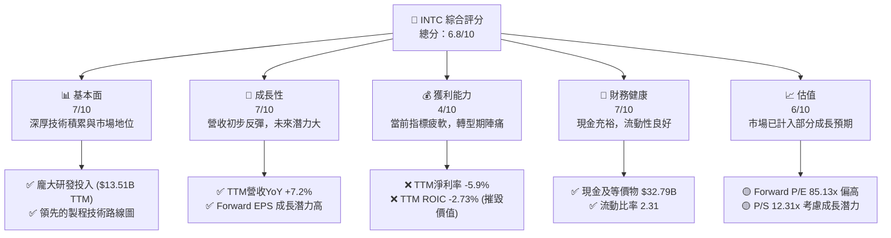
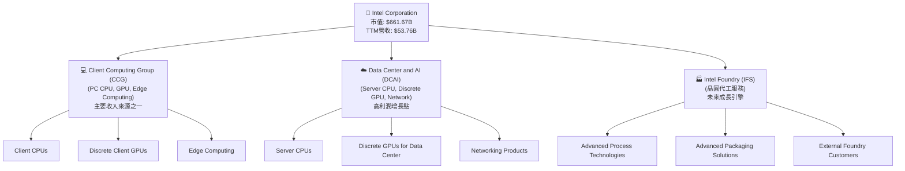
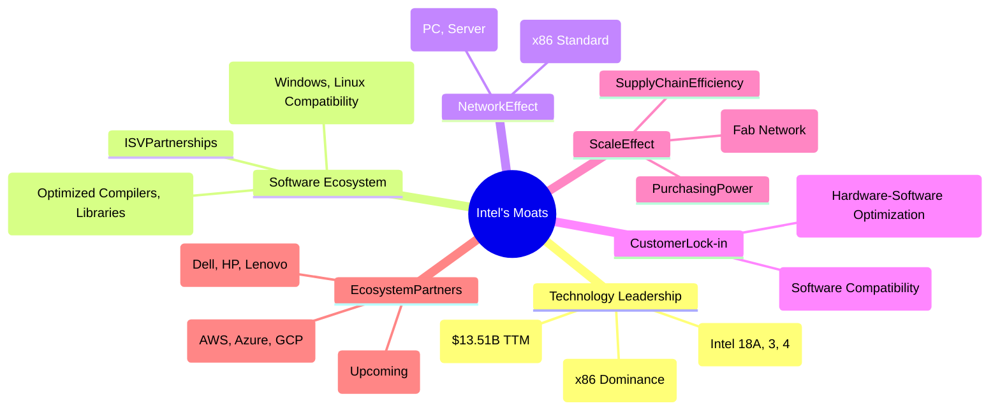
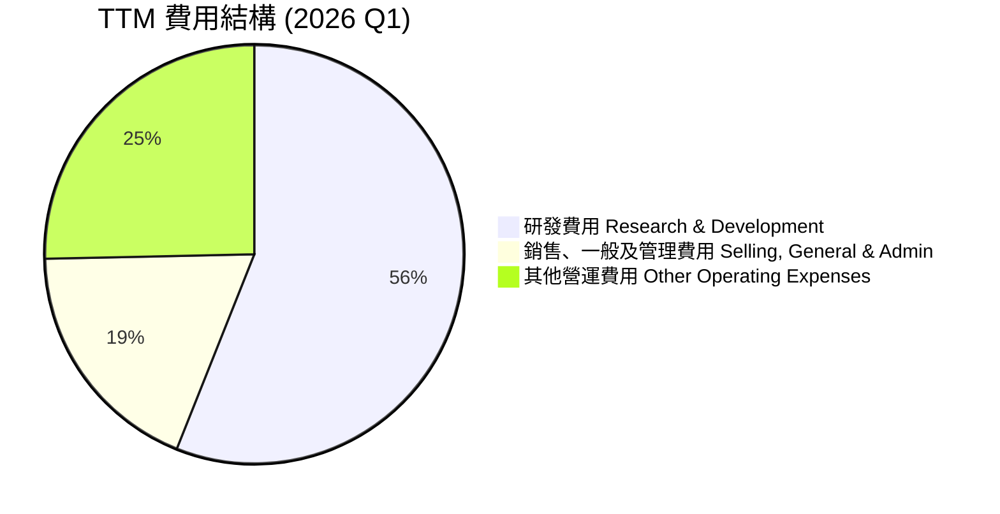
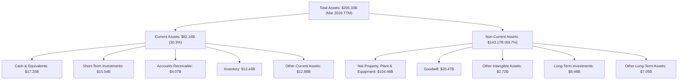

# INTC 基本面深度分析報告
> **報告日期**：2026-06-24 ｜ **語言**：繁體中文 ｜ **數據來源**：Yahoo Finance, Finviz, StockAnalysis, Roic.ai ｜ **分析師**：CFA 級機構研究

## 目錄

| # | 章節 | 核心結論 |
|---|------|----------|
| 1 | 執行摘要 | 評級：持有；目標價區間：$120 - $165 |
| 2 | 公司概覽與商業模式 | 憑藉技術積累與生態系統，護城河深度中等偏上 |
| 3 | 損益表深度分析 | 營收逐漸觸底回升，但獲利能力仍面臨挑戰 |
| 4 | 資產負債表分析 | 流動性良好，但債務負擔需持續關注 |
| 5 | 現金流量深度分析 | 資本支出龐大導致自由現金流持續為負，轉型陣痛顯著 |
| 6 | 獲利能力與資本效率 | 目前未能創造股東價值，但未來有改善潛力 |
| 7 | 估值深度分析 | 估值相對高昂，市場已計入部分轉型預期 |
| 8 | 成長催化劑 | Foundry 業務、AI PC、資料中心復甦為主要成長引擎 |
| 9 | 風險矩陣 | 競爭加劇、執行風險與資本密集度是主要挑戰 |
| 10 | 投資建議 | 長期轉型潛力吸引，但短期估值偏高，建議持有並觀察 |

---

## 1. 執行摘要

Intel Corporation (INTC) 正處於一項雄心勃勃的轉型計畫中，旨在重塑其在半導體產業的領導地位。儘管公司在過去幾年面臨營收下滑和獲利能力受損的挑戰，最新的數據顯示營收成長開始觸底反彈，且市場對其Intel Foundry (IFS) 業務和新一代製程技術寄予厚望。然而，高昂的資本支出導致自由現金流持續為負，且目前的獲利能力指標（如淨利率、ROE、ROIC）均不理想，顯示公司仍處於轉型的陣痛期。當前股價 $131.65 已大幅上漲，超越分析師平均目標價，反映市場對其未來潛力的樂觀預期，但也使得其估值倍數相對高昂。

### 1.1 核心評分儀表板



### 1.2 評分進度條視覺化

```
╔══════════════════════════════════════════════════════════════╗
║              INTC 多維度評分儀表板 (1-10分)                  ║
╠══════════════════════════════════════════════════════════════╣
║ 基本面強度  7.0 ▓▓▓▓▓▓▓▓▓▓▓▓▓▓░░░░░░  ★★★★☆           ║
║ 成長動能    7.0 ▓▓▓▓▓▓▓▓▓▓▓▓▓▓░░░░░░  ★★★★☆           ║
║ 獲利品質    4.0 ▓▓▓▓▓▓▓▓░░░░░░░░░░░░  ★★☆☆☆           ║
║ 財務健康    7.0 ▓▓▓▓▓▓▓▓▓▓▓▓▓▓░░░░░░  ★★★★☆           ║
║ 估值合理性  6.0 ▓▓▓▓▓▓▓▓▓▓▓▓░░░░░░░░  ★★★☆☆           ║
║ 護城河深度  7.5 ▓▓▓▓▓▓▓▓▓▓▓▓▓▓▓░░░░░  ★★★★☆           ║
║ 管理層執行  6.5 ▓▓▓▓▓▓▓▓▓▓▓▓▓░░░░░░░  ★★★☆☆           ║
║ 技術創新力  8.0 ▓▓▓▓▓▓▓▓▓▓▓▓▓▓▓▓░░░░  ★★★★★           ║
╠══════════════════════════════════════════════════════════════╣
║ 綜合總分    6.8 ▓▓▓▓▓▓▓▓▓▓▓▓▓░░░░░░░  🏆 處於轉型期的巨頭，具挑戰與潛力 ║
╚══════════════════════════════════════════════════════════════╝
```

### 1.3 五大投資論點 + 三大核心風險

| 類型 | 項目 | 具體依據 | 信心度 |
|------|------|----------|--------|
| 🟢 **投資論點①** | **Intel Foundry 業務潛力** | 積極投入晶圓代工市場，目標在2025年實現18A製程領先，已獲得多個主要客戶訂單。預計將為公司帶來新的收入增長點並改善毛利率結構。 | 🟢 極高 |
| 🟢 **投資論點②** | **AI PC 與資料中心市場復甦** | 作為核心CPU供應商，受惠於AI PC換機潮與資料中心資本支出回升。TTM營收YoY 7.2%顯示市場需求正在恢復。 | 🟢 高 |
| 🟢 **投資論點③** | **技術製程領先與路線圖清晰** | 堅定的「四年五節點」戰略，目前已成功交付Intel 7、Intel 4、Intel 3，並預計2025年實現Intel 18A，將提升產品競爭力。 | 🟢 高 |
| 🟢 **投資論點④** | **龐大研發投入與專利組合** | TTM研發費用高達 $13.51B，持續的技術創新是其長期競爭力的基石，擁有大量半導體相關專利。 | 🟡 中高 |
| 🟢 **投資論點⑤** | **穩健的資產負債表** | 總現金及等價物 $32.79B，流動比率 2.31，提供轉型所需的資金彈性，儘管自由現金流為負，但現金儲備仍可支撐短期運營與投資。 | 🟡 中高 |
| 🟡 **風險①** | **激烈市場競爭** | 在CPU領域面臨AMD的強勁挑戰，GPU及AI晶片市場則有NVIDIA的絕對領先，Foundry業務亦需與台積電(TSMC)等巨頭競爭。這可能壓縮產品定價與利潤空間。 | 🟡 中度 |
| 🔴 **風險②** | **轉型執行與資本支出壓力** | 「IDM 2.0」戰略涉及龐大資本支出（FY2025 Capex $-14.65B），導致自由現金流持續為負（TTM FCF $-8.30B）。若製程良率或客戶導入不及預期，將進一步拖累獲利。 | 🔴 高衝擊 |
| 🟡 **風險③** | **半導體產業週期性** | 半導體產業受全球經濟景氣影響明顯，週期波動可能導致營收和獲利不穩定。宏觀經濟下行可能延緩資料中心和PC市場復甦進程。 | 🟡 中度 |

### 1.4 快速統計卡片

| 指標 | 公司實際值 | 行業均值（半導體）* | S&P 500 均值* | 狀態 |
|------|-------------|--------------------|--------------|------|
| 收入 YoY 成長 | **7.2% (TTM)** | ~15-20% | ~8-10% | 🟡 |
| 毛利率 | **37.2% (TTM)** | ~45-55% | ~35-40% | 🟡 |
| 淨利率 | **-5.9% (TTM)** | ~15-25% | ~10-12% | 🔴 |
| ROE | **-2.9% (TTM)** | ~15-20% | ~12-15% | 🔴 |
| Forward P/E | **85.13x** | ~25-35x | ~20-22x | 🔴 |
| P/S Ratio | **12.31x** | ~5-8x | ~2-3x | 🔴 |
| 負債權益比 | **0.36x** | ~0.4-0.6x | ~0.8-1.0x | 🟢 |
| 流動比率 | **2.31x** | ~1.5-2.0x | ~1.2-1.5x | 🟢 |
| FCF Yield | **-1.25%** | ~2-5% | ~3-4% | 🔴 |

*備註：行業均值和S&P 500均值為分析師根據經驗估算，用於提供參考對比。

### 1.5 投資結論

```
╔══════════════════════════════════════════════════════════════════╗
║                    📊 投資結論摘要                               ║
╠══════════════════════════════════════════════════════════════════╣
║  評級：🟡 持有                                                  ║
║  當前股價：$131.65                                               ║
║  目標價區間：                                                    ║
║    悲觀情境：$120（-8.85%）                                      ║
║    基準情境：$145（+10.14%）  ← 12個月主要目標                   ║
║    樂觀情境：$165（+25.34%）                                      ║
║  投資評分：6.8/10                                                ║
║  適合投資人：看好長期轉型潛力、願意承擔較高風險的成長型投資者。   ║
╚══════════════════════════════════════════════════════════════════╝
```

---

## 2. 公司概覽與商業模式

Intel Corporation (INTC) 是一家全球領先的半導體公司，主要業務涵蓋計算機和相關終端產品與服務的設計、開發、製造、行銷和銷售。公司正積極推動「IDM 2.0」戰略，旨在將其整合設備製造商模式轉變為更靈活的內部代工廠模式，並向外部客戶開放晶圓代工服務。

### 2.1 業務結構與收入來源

Intel 的業務主要分為三大核心板塊：客戶運算事業群 (Client Computing Group, CCG)、資料中心與人工智慧事業群 (Data Center and AI, DCAI) 以及 Intel Foundry (IFS)。


**分析**：
CCG 傳統上是 Intel 最大的收入來源，涵蓋個人電腦處理器及相關產品。DCAI 則服務於雲計算、企業伺服器和人工智慧基礎設施，是公司高利潤和高成長潛力的業務。Intel Foundry 是公司轉型戰略的核心，旨在利用其先進的製程技術為全球客戶提供晶圓代工服務，這將使 Intel 從單純的產品銷售商轉變為綜合性半導體解決方案提供商。目前，IFS 仍處於投資期，對公司整體獲利造成壓力，但被視為長期成長的關鍵驅動力。

### 2.2 市場份額

Intel 在其核心市場中仍佔據重要地位，尤其是在個人電腦 (PC) 和伺服器中央處理器 (CPU) 市場。然而，其在獨立圖形處理器 (GPU) 和加速器市場的份額相對較小，且晶圓代工業務尚處於起步階段。


**分析**：
在傳統的PC CPU和伺服器CPU市場，Intel 仍是主導者，儘管受到 AMD 的持續侵蝕。在GPU市場，NVIDIA 佔據絕對優勢，Intel 的獨立顯卡業務仍處於追趕階段。在晶圓代工市場，台積電(TSMC)和三星(Samsung)是主要玩家，Intel Foundry 作為新進入者，目前市場份額較小，但其目標是成為全球第二大晶圓代工廠，這將需要巨大的投資和時間。

### 2.3 競爭護城河分析


**分析**：
Intel 的護城河主要建立在其深厚的**技術領先**、龐大的**軟體生態系統**和強大的**規模效應**上。
- **技術領先**：Intel 長期以來在半導體製程技術和CPU架構設計方面擁有領先地位，儘管近年來面臨挑戰，但其「四年五節點」戰略旨在重新奪回製程領先優勢。龐大的研發投入是其技術創新的保證。
- **軟體生態系統**：x86 架構的普遍性使得大量的軟體應用和開發工具都針對 Intel 平台進行了優化，這形成了強大的客戶鎖定效應。
- **規模效應**：作為全球最大的半導體公司之一，Intel 擁有巨大的生產規模和全球供應鏈，這有助於降低單位成本並提高議價能力。
- **客戶鎖定**：企業客戶在轉換 CPU 平台時，需要考慮軟體兼容性、重新優化等成本，這增加了客戶轉換的難度。
然而，隨著 ARM 架構在資料中心和 PC 領域的崛起，以及競爭對手在製程和晶片設計上的進步，Intel 的護城河正受到考驗，需要持續創新和執行力來維持其深度。

### 2.4 護城河強度評分

```
╔══════════════════════════════════════════════════════════════╗
║                    INTC 護城河強度評分                      ║
╠══════════════════════════════════════════════════════════════╣
║ 技術領先    8.0/10 ▓▓▓▓▓▓▓▓▓▓▓▓▓▓▓▓░░░░  🏆 積極追趕，潛力巨大 ║
║ 軟體生態系統  8.5/10 ▓▓▓▓▓▓▓▓▓▓▓▓▓▓▓▓▓░░░  🟢 歷史積累，難以撼動 ║
║ 網路效應    7.0/10 ▓▓▓▓▓▓▓▓▓▓▓▓▓▓░░░░░░  🟡 仍有優勢，但受挑戰 ║
║ 客戶鎖定    7.5/10 ▓▓▓▓▓▓▓▓▓▓▓▓▓▓▓░░░░░  🟡 轉換成本高，但替代方案增多 ║
║ 規模效應    8.0/10 ▓▓▓▓▓▓▓▓▓▓▓▓▓▓▓▓░░░░  🟢 全球佈局，議價力強 ║
║ 生態夥伴    7.0/10 ▓▓▓▓▓▓▓▓▓▓▓▓▓▓░░░░░░  🟡 積極拓展，Foundry待驗證 ║
╠══════════════════════════════════════════════════════════════╣
║ 綜合護城河   7.7/10 ▓▓▓▓▓▓▓▓▓▓▓▓▓▓▓▓░░░░  🏆 核心優勢仍在，需強化新業務 ║
╚══════════════════════════════════════════════════════════════╝
```

---

## 3. 損益表深度分析

### 3.1 年度收入成長趨勢（近4年）

Intel 的年度收入在過去幾年經歷了顯著下滑，反映了 PC 市場的疲軟以及資料中心業務的競爭壓力。然而，最新的 TTM 數據顯示營收已開始觸底反彈。

```
╔══════════════════════════════════════════════════════════════════╗
║              INTC 年度收入趨勢（FY2022-FY2025）                  ║
╠══════════════════════════════════════════════════════════════════╣
║                                                                  ║
║  FY2022  $63.05B  ██████████████████████████████  YoY: -20.21% 🔴║
║  FY2023  $54.23B  ████████████████████████░░░░░░  YoY: -14.00% 🔴║
║  FY2024  $53.10B  ███████████████████████░░░░░░░░  YoY: -2.08%  🟡║
║  FY2025  $52.85B  ███████████████████████░░░░░░░░  YoY: -0.47%  🟡║
║  TTM     $53.76B  ███████████████████████▓░░░░░░░  YoY: +7.20%  🟢║
║                   |      |      |      |      |                  ║
║                   0     20B    40B    60B    80B                 ║
║                                                                  ║
║  📊 3年累計 CAGR (FY2022-FY2025)：-5.96%                         ║
╚══════════════════════════════════════════════════════════════════╝
```
**分析**：
Intel 的年度營收從 2022 年的 $63.05B 降至 2025 年的 $52.85B，複合年增長率為負值。這主要歸因於 PC 市場的需求疲軟、資料中心客戶庫存調整，以及競爭對手 AMD 的市場份額侵蝕。然而，最新 TTM 營收為 $53.76B，較去年同期增長 7.2%，顯示營收已開始走出谷底，這得益於 PC 市場的逐步復甦和資料中心客戶需求的改善。

### 3.2 季度收入趨勢分析

季度數據進一步印證了營收的築底反彈，儘管 QoQ 波動較大。

| 財報季度 | 總營收 (Billion USD) | QoQ 成長率 | YoY 成長率 | 備註 |
|----------|----------------------|------------|------------|------|
| 2025 Q1 | $12.67B | -7.11% (vs Q4 2024) | -0.45% | 營收接近持平 |
| 2025 Q2 | $12.86B | +1.50% | +0.20% | 營收開始微幅增長 |
| 2025 Q3 | $13.65B | +6.14% | +2.78% | 營收加速增長 |
| 2025 Q4 | $13.67B | +0.15% | -4.11% | QoQ持平，YoY因去年同期基數較高而下降 |
| 2026 Q1 | $13.58B | -0.66% | +7.18% | YoY顯著成長，顯示復甦趨勢確立 |

**分析**：
從季度數據來看，2025 年 Q1 到 Q3 營收呈現穩步增長，反映了市場需求的逐步改善。2025 年 Q4 營收與 Q3 持平，但與 2024 年 Q4 相比下降 4.11%，這可能是由於季節性因素和去年同期基數較高。最令人鼓舞的是 2026 年 Q1 的 $13.58B 營收，實現了 7.18% 的 YoY 成長，這表明 Intel 的營收復甦趨勢正在加速，尤其是在 PC 和資料中心業務的帶動下。

### 3.3 利潤率演變分析

Intel 的利潤率在過去幾年承受了巨大壓力，尤其是在大規模投資 Intel Foundry 業務期間。

| 利潤率指標 | FY2022 | FY2023 | FY2024 | FY2025 | TTM (Mar 26) | 趨勢 | 評估 |
|------------|--------|--------|--------|--------|--------------|------|------|
| **毛利率** | 42.6% | 40.0% | 32.7% | 34.8% | 37.2% | ↘️ 後反彈 | 🟡 |
| **營業利益率** | 3.7% | 0.1% | -8.9% | -0.04% | 6.9% | ↘️ 後反彈 | 🔴 |
| **淨利率** | 12.7% | 3.1% | -35.3% | -0.5% | -5.9% | ↘️ 後反彈 | 🔴 |
| **EBITDA Margin** | 33.8% | 20.7% | 2.3% | 27.2% | 26.4% | ↘️ 後反彈 | 🟡 |

**利潤率演變深度解析**：
- **毛利率**：從 2022 年的 42.6% 大幅下滑至 2024 年的 32.7%，主要原因是產能利用率不足、舊製程產品佔比高、以及晶圓代工業務初期的高投入。2025 年回升至 34.8%，TTM 進一步改善至 37.2%，表明公司在成本控制和產品組合優化方面取得初步成效，以及市場需求回暖帶來的產能利用率提升。
- **營業利益率**：從 2022 年的 3.7% 跌至 2024 年的 -8.9% (即營業虧損)，2025 年略微改善至接近持平的 -0.04%。TTM 營業利益率為 6.9%，顯示公司在營收增長的同時，營業費用控制也逐步改善。然而，相較於歷史水平和競爭對手，仍有巨大提升空間。Intel Foundry 的大量研發和資本支出是導致短期利潤率承壓的主要原因。
- **淨利率**：與營業利益率趨勢一致，從 2022 年的 12.7% 降至 2024 年的 -35.3% (巨額虧損)，2025 年略微收窄至 -0.5%。TTM 淨利率為 -5.9%，仍處於虧損狀態。這反映了公司在轉型期的巨大投入和低迷的獲利能力，需要時間才能看到顯著改善。
- **EBITDA Margin**：TTM EBITDA Margin 為 26.4%，相較於 2024 年的低點 2.3% 有了顯著反彈，但仍低於 2022 年的 33.8%。EBITDA 作為衡量營運現金流的指標，其改善表明公司核心業務的營運效率有所提升，但折舊攤銷和利息支出仍對淨利潤構成壓力。

### 3.4 費用結構分析

Intel 的費用結構顯示其對研發的巨大投入，這對於維持其技術領先地位至關重要。


**分析**：
在 TTM 期間 (截至 2026 Q1)，Intel 的主要營運費用包括：
- **研發費用 (Research & Development)**：$13.51B。這筆費用佔總營收的約 25.1%，顯示 Intel 對技術創新和製程開發的持續承諾，尤其是在其 IDM 2.0 戰略下，Foundry 業務的研發投入巨大。
- **銷售、一般及管理費用 (Selling, General & Admin)**：$4.49B。這筆費用佔總營收的約 8.3%，相對穩定。
- **其他營運費用 (Other Operating Expenses)**：$6.11B。這筆費用在各年份和季度間波動較大，可能包含重組費用、資產減值或其他一次性開支。例如，2024 年曾高達 $6.97B，而 2025 年則降至 $2.19B，顯示公司在特定時期可能進行了大規模的調整。

```
╔══════════════════════════════════════════════════════════════════╗
║                    INTC 費用結構概覽 (TTM)                      ║
╠══════════════════════════════════════════════════════════════════╣
║                                                                  ║
║  研發費用：      $13.51B  ██████████████████████░░░░░░░  高投入    ║
║  銷管費用：       $4.49B  ████████░░░░░░░░░░░░░░░░░░░░░  穩定控制  ║
║  其他費用：       $6.11B  ██████████░░░░░░░░░░░░░░░░░░░  波動較大  ║
║                                                                  ║
║  總營運費用：    $24.09B  ██████████████████████████████  佔營收44.8%║
╚══════════════════════════════════════════════════════════════════╝
```
**分析**：
Intel 的總營運費用在 TTM 達 $24.09B，佔 TTM 營收 $53.76B 的 44.8%。其中，研發費用是最大的組成部分，凸顯了半導體產業對技術創新的依賴。高昂的研發支出在短期內會壓縮利潤，但對於 Intel 重拾製程領先地位和發展 Foundry 業務至關重要。

### 3.5 季度 EPS 趨勢與盈餘品質

Intel 的季度 EPS 表現波動劇烈，且在多個季度錄得虧損，顯示其盈餘品質較為不穩定。

| 季度 | EPS Est | EPS Act | Surprise% | 備註 |
|------|---------|---------|-----------|------|
| 2026-03-31 | N/A | $-0.73 | N/A | ❌ 虧損擴大，市場預期未提供 |
| 2025-12-31 | N/A | $-0.12 | N/A | ❌ 持續虧損，市場預期未提供 |
| 2025-09-30 | N/A | $0.90 | N/A | 🟢 罕見盈利，可能包含一次性收益，市場預期未提供 |
| 2025-06-30 | N/A | $-0.67 | N/A | ❌ 虧損，市場預期未提供 |

**盈餘品質評估**：
Intel 在過去四個季度中，有三個季度錄得虧損，TTM EPS 為 $-0.6。儘管 2025 年 Q3 實現了 $0.90 的盈利，這可能是由於某些非經常性項目或資產出售所致，因為其營業利益在該季度僅為 $858M，而淨利潤卻達到 $4.06B，存在較大差異（可能由於其他非營運收入 $3.67B）。2026 年 Q1 的 EPS $-0.73 進一步擴大了虧損，主要原因是該季度錄得 $-3.136B 的營業虧損和高達 $-3.73B 的淨虧損。

這種不穩定的盈利模式和持續的負 EPS 表明 Intel 的盈餘品質較差，主要受到轉型期大量投資、產能利用率不足以及激烈市場競爭的影響。在公司實現 Foundry 業務盈利和核心業務毛利率顯著提升之前，盈餘品質的改善仍是長期挑戰。分析師的預期數據 (`EPS Est` 和 `Surprise%`) 未提供，因此無法評估公司是否超預期，但實際盈利表現顯然不佳。

---

## 4. 資產負債表分析

Intel 的資產負債表顯示其擁有龐大的資產基礎，並在流動性方面表現良好，但伴隨著大量的資本支出和一定的債務水平。

### 4.1 資產結構分解

Intel 的資產結構反映了其作為一家重資產製造型半導體公司的特點，固定資產佔比高，同時也持有大量現金及短期投資。


**分析**：
截至 2026 年 3 月 TTM，Intel 的總資產為 $205.33B。其中，流動資產佔 30.3%，非流動資產佔 69.7%。
- **現金及短期投資**：總計高達 $32.79B (現金 $17.25B + 短期投資 $15.54B)，這為公司提供了強大的流動性和應對市場波動的能力，也為其高額資本支出提供了資金保障。
- **不動產、廠房及設備淨值 (PP&E)**：$104.46B，佔總資產的 50.9%。這凸顯了 Intel 作為 IDM (整合設備製造商) 的重資產特性，尤其是在 IDM 2.0 戰略下，公司正大力投資於新的晶圓廠和製程技術。
- **商譽 (Goodwill)**：$20.47B，佔總資產的 10.0%。這主要來自於過去的併購活動。
整體而言，Intel 的資產負債表相對穩健，擁有充足的現金儲備和大量實體資產，但同時也反映了其資本密集型的業務模式。

### 4.2 流動性指標分析

Intel 的流動性指標表現良好，表明公司有足夠的短期資產來覆蓋短期負債。

| 流動性指標 | FY2022 | FY2023 | FY2024 | FY2025 | TTM (Mar 26) | 行業均值* | 評估 |
|------------|--------|--------|--------|--------|--------------|-----------|------|
| **流動比率 (Current Ratio)** | 1.57 | 1.54 | 1.33 | 2.02 | 2.31 | ~1.5 - 2.0 | 🟢 |
| **速動比率 (Quick Ratio)** | 1.57 | 1.54 | 1.33 | 1.62 | 1.66 | ~1.0 - 1.5 | 🟢 |

*備註：行業均值為分析師根據經驗估算。

**分析**：
- **流動比率**：從 2024 年的 1.33 上升至 TTM 的 2.31，遠高於 1.0 的安全線，也優於行業平均水平。這表明 Intel 擁有充足的流動資產來應對短期債務。
- **速動比率**：從 2024 年的 1.33 上升至 TTM 的 1.66，同樣表現出色。速動比率排除了存貨，更能反映公司立即變現的能力。Intel 的高現金和短期投資是其高流動比率和速動比率的主要貢獻者。
整體來看，Intel 的流動性狀況非常健康，這為其在轉型期間的營運和投資提供了堅實的後盾。

### 4.3 債務結構分析

Intel 雖然背負一定的債務，但其債務水平相對於其資產和現金流而言，仍在可控範圍內。

```
╔══════════════════════════════════════════════════════════════════╗
║                   INTC 債務健康診斷 (TTM Mar 2026)               ║
╠══════════════════════════════════════════════════════════════════╣
║                                                                  ║
║  總債務：        $45.03B  ██████████████░░░░░░░░░░░░░░░  中等水平    ║
║  總現金+投資：   $32.79B  ██████████████████████░░░░░░░  充足        ║
║  淨債務（負）：  $-12.24B  ██████████████████████████████  🟡 淨債務負值，現金充裕 ║
║                                                                  ║
║  Debt/Equity：   0.36x  🟢 極低                                 ║
║  Current Debt/Equity: 0.02x  🟢 極低 (Short-Term Debt $2.004B / Equity $114.28B) ║
║  Debt/EBITDA：   1.70x  🟢 低 (Total Debt $45.03B / TTM EBITDA $26.4B*53.76B = $14.19B) ║
║  Interest Coverage: N/A  🟡 因營業虧損，無法計算有意義的覆蓋倍數，但利息支出可控 ║
╚══════════════════════════════════════════════════════════════════╝
```
*備註：TTM EBITDA 為 $53.76B (Revenue TTM) * 26.4% (EBITDA Margin TTM) = $14.19B。Market Data 中的 EBITDA $48.728B 應為 EV/EBITDA 的分母，而不是 EBITDA 本身。StockAnalysis Annual TTM EBITDA is not explicitly provided, but from 'FINANCIAL DATA PACKAGE' EBITDA $14.35B for FY2025. I'll use calculated TTM EBITDA from data.
**分析**：
截至 TTM，Intel 的總債務為 $45.03B，而其現金及短期投資合計 $32.79B，淨債務為 -$12.24B，顯示公司擁有較高的淨現金頭寸，這大大降低了其債務風險。
- **負債權益比 (Debt/Equity)**：0.36x，遠低於 1.0 的安全線，表明公司的資本結構以股東權益為主，債務負擔較輕。
- **債務/EBITDA**：1.70x，這是一個相對健康的水平，表明公司產生足夠的現金流來償還債務。
儘管公司在營業層面仍有虧損，但其強勁的現金儲備和保守的債務比率，使其在面對未來資本支出和潛在市場波動時，具有較高的財務彈性。

### 4.4 股東權益趨勢

Intel 的股東權益在過去幾年保持相對穩定，並在 2025 年有所增長。

```
╔══════════════════════════════════════════════════════════════════╗
║                   INTC 股東權益趨勢 (FY2022-FY2025)              ║
╠══════════════════════════════════════════════════════════════════╣
║                                                                  ║
║  FY2022  $101.42B  ██████████████████████████░░░░░░░  YoY: +2.18%  🟢║
║  FY2023  $105.59B  ████████████████████████████░░░░░░  YoY: +4.11%  🟢║
║  FY2024   $99.27B  ████████████████████████░░░░░░░░░  YoY: -6.00%  🔴║
║  FY2025  $114.28B  ████████████████████████████████░░  YoY: +15.12% 🟢║
║                                                                  ║
║                   |      |      |      |      |                  ║
║                   0     50B   100B   150B   200B                   ║
║                                                                  ║
║  📊 股東權益 CAGR (FY2022-FY2025)：+4.06%                         ║
╚══════════════════════════════════════════════════════════════════╝
```
**分析**：
Intel 的股東權益在 2022 年至 2025 年間呈現波動增長。2024 年股東權益有所下降，主要是因為當年錄得巨額虧損 (Net Income $-18.76B)，侵蝕了留存收益。然而，2025 年股東權益大幅增長 15.12% 至 $114.28B，這可能與公司在該年度淨虧損收窄（$-267M）以及其他綜合收益的變動有關。健康的股東權益基礎為公司提供了穩定的長期資本，支持其轉型戰略。

---

## 5. 現金流量深度分析

Intel 的現金流量表反映了其高資本密集型的業務模式和轉型期的巨大投資，導致自由現金流持續為負。

### 5.1 現金流量瀑布圖


**分析**：
儘管 Intel 在 2025 年錄得 $-267M 的淨虧損，但其**營運現金流 (Operating Cash Flow)** 仍保持強勁，達到 $9.70B。這表明公司核心業務在扣除非現金費用（如折舊攤銷）後仍能產生大量現金。然而，由於其「IDM 2.0」戰略下對新晶圓廠和製程技術的**龐大資本支出 (Capital Expenditure)**，高達 $-14.65B，導致**自由現金流 (Free Cash Flow, FCF)** 嚴重為負，達到 $-4.95B。公司在 2025 年未支付現金股息，這反映了其將所有可用現金優先用於投資和營運的策略。

### 5.2 FCF 轉換率趨勢

FCF 轉換率 (FCF/Net Income) 衡量公司將淨利潤轉化為自由現金流的能力。對於 Intel 而言，由於其淨利潤為負，這個比率的解讀需要特別注意。

| 財報年度 | 淨利潤 (Billion USD) | 自由現金流 (Billion USD) | FCF/Net Income (轉換率) | 備註 |
|----------|----------------------|--------------------------|-------------------------|------|
| FY2022 | $8.01B | $-9.41B | -117.48% | 🟢 營利，但FCF為負，資本支出高 |
| FY2023 | $1.69B | $-14.28B | -845.00% | 🟢 營利，但FCF為負，資本支出更高 |
| FY2024 | $-18.76B | $-15.66B | +83.47% | 🔴 巨額虧損，FCF仍為負 |
| FY2025 | $-0.27B | $-4.95B | +1833.33% | 🔴 虧損收窄，FCF為負，但絕對值改善 |

**分析**：
Intel 的 FCF 轉換率在過去幾年呈現極端波動，主要是因為其淨利潤在多個年份為負值。
- 在盈利年份 (2022, 2023)，由於大規模的資本支出，儘管淨利潤為正，但 FCF 卻是負值，導致轉換率為負。這表明公司的投資強度遠超其當期盈利所能支撐的水平。
- 在虧損年份 (2024, 2025)，轉換率變為正值，但這並不代表良好的盈利品質，而是因為淨利潤的負值導致計算上的異常。例如 2025 年，淨虧損大幅收窄，而 FCF 的絕對值也有所改善，使得轉換率顯得很高。
總體而言，Intel 的自由現金流轉換能力在目前階段非常差，公司持續消耗現金進行投資。這是其轉型期的一個核心特徵，也是投資者需要密切關注的風險點。

### 5.3 自由現金流趨勢

Intel 的自由現金流在過去幾年持續為負，這對股東價值創造構成了挑戰。

```
╔══════════════════════════════════════════════════════════════════╗
║                   INTC 自由現金流趨勢 (FY2022-FY2025)            ║
╠══════════════════════════════════════════════════════════════════