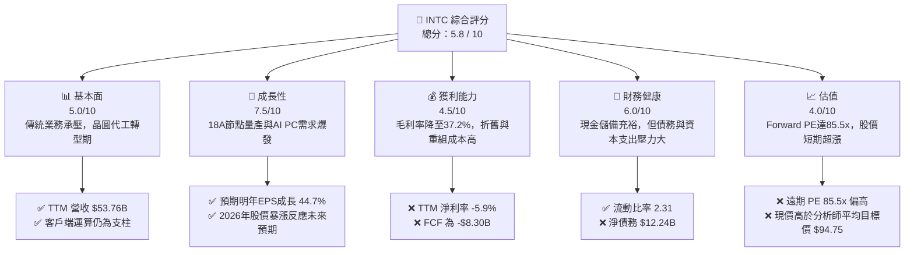
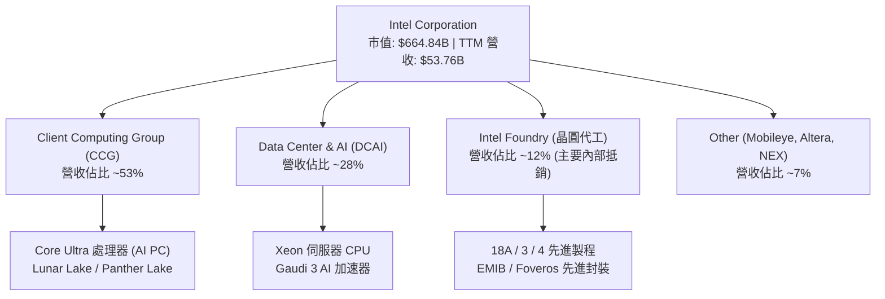
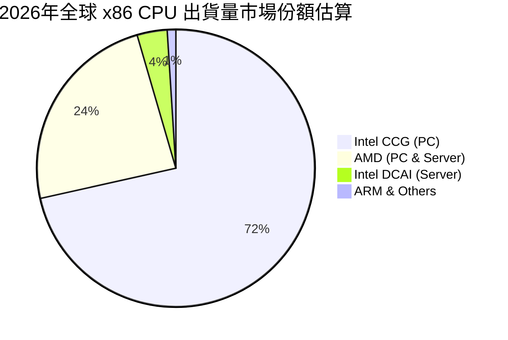
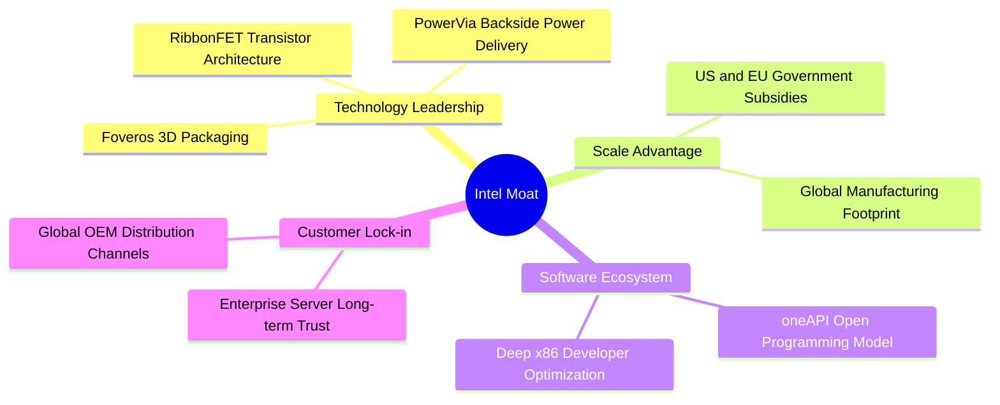
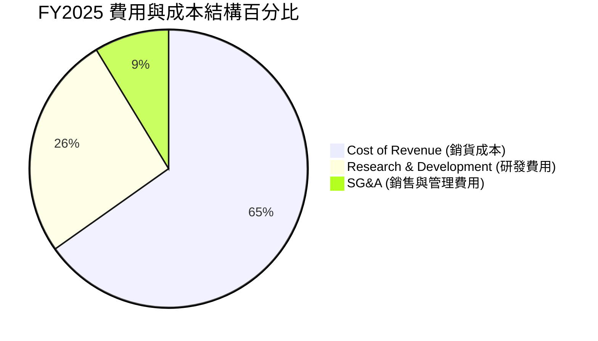
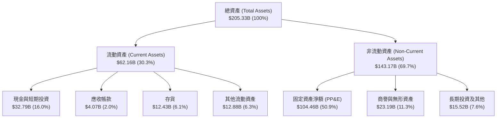
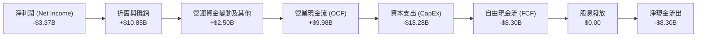

# INTC 基本面深度分析報告
> **報告日期**：2026-06-24 ｜ **語言**：繁體中文 ｜ **數據來源**：Yahoo Finance, Finviz, StockAnalysis, Roic.ai ｜ **分析師**：CFA 級機構研究

---

## 目錄

| # | 章節 | 核心結論 |
|---|------|----------|
| 1 | 執行摘要 | 評級：**觀望 (Hold)** ｜ 目標價：**$105.00** (隱含 -20.6% 修正空間) |
| 2 | 公司概覽與商業模式 | IDM 2.0 轉型深水區，18A 節點量產為關鍵勝負手 |
| 3 | 損益表深度分析 | 營收築底回升 (TTM $53.76B)，但高折舊與重組費用壓低淨利 |
| 4 | 資產負債表分析 | 現金儲備充裕 ($32.79B)，但淨債務達 $12.24B，資本結構承壓 |
| 5 | 現金流量深度分析 | 資本支出高企導致 TTM 自由現金流為 -$8.30B，股息持續停發 |
| 6 | 獲利能力與資本效率 | ROIC (-2.5%) 顯著低於 WACC (14.65%)，處於暫時性價值摧毀階段 |
| 7 | 估值深度分析 | 遠期 P/E 達 85.5x，股價短期超漲，市場已過度透支轉型預期 |
| 8 | 成長催化劑 | AI PC (Lunar Lake) 滲透與晶圓代工外部客戶簽約進度 |
| 9 | 風險矩陣 | 18A 良率不及預期、晶圓代工虧損擴大與市場估值修正雙重打擊 |
| 10 | 投資建議 | 建議等待股價回檔至 $105.00 以下，或 18A 良率數據明朗後再行佈局 |

---

## 1. 執行摘要

### 1.1 核心評分儀表板



### 1.2 評分進度條視覺化

```
╔══════════════════════════════════════════════════════════════╗
║              INTC 多維度評分儀表板 (1-10分)                 ║
╠══════════════════════════════════════════════════════════════╣
║ 基本面強度  5.0 ▓▓▓▓▓▓▓▓▓▓░░░░░░░░░░  ★★★☆☆           ║
║ 成長動能    7.5 ▓▓▓▓▓▓▓▓▓▓▓▓▓▓▓░░░░░  ★★★★☆           ║
║ 獲利品質    4.5 ▓▓▓▓▓▓▓▓▓░░░░░░░░░░░  ★★☆☆☆           ║
║ 財務健康    6.0 ▓▓▓▓▓▓▓▓▓▓▓▓░░░░░░░░  ★★★☆☆           ║
║ 估值合理性  4.0 ▓▓▓▓▓▓▓▓░░░░░░░░░░░░  ★★☆☆☆           ║
║ 護城河深度  6.5 ▓▓▓▓▓▓▓▓▓▓▓▓▓░░░░░░░  ★★★☆☆           ║
║ 管理層執行  7.0 ▓▓▓▓▓▓▓▓▓▓▓▓▓▓░░░░░░  ★★★★☆           ║
║ 技術創新力  8.0 ▓▓▓▓▓▓▓▓▓▓▓▓▓▓▓▓░░░░  ★★★★☆           ║
╠══════════════════════════════════════════════════════════════╣
║ 綜合總分    5.8 ▓▓▓▓▓▓▓▓▓▓▓░░░░░░░░░  🏆 轉型陣痛，估值過高║
╚══════════════════════════════════════════════════════════════╝
```

### 1.3 五大投資論點 + 三大核心風險

| 類型 | 項目 | 具體依據 | 信心度 |
|------|------|----------|--------|
| 🟢 **投資論點①** | **18A 節點即將量產** | 領先業界引入 PowerVia 後面供電與 RibbonFET 環繞閘極技術，預計 2026 下半年放量。 | 🟢 高 |
| 🟢 **投資論點②** | **AI PC 換機潮紅利** | 客戶端運算群 (CCG) 推出 Lunar Lake 與 Panther Lake，預期帶動 x86 架構市佔鞏固與 ASP 提升。 | 🟢 高 |
| 🟢 **投資論點③** | **政府地緣政治扶持** | 美國《晶片法案》資金陸續到位，補貼與稅收抵免將緩解部分 CapEx 壓力。 | 🟢 極高 |
| 🟢 **投資論點④** | **營運結構重組與成本優化** | 研發費用由 FY2024 的 $16.55B 降至 TTM 的 $13.51B，展現精簡架構決心。 | 🟢 中 |
| 🟢 **投資論點⑤** | **晶圓代工外部客戶簽約** | 預期 2026 年底前公佈更多 18A 外部大型客戶，為 Foundry 業務注入實質營收。 | 🟢 中 |
| 🟡 **風險①** | **自由現金流持續失血** | TTM FCF 為 -$8.30B，高額資本支出與折舊費用將長期壓制獲利與分紅能力。 | 🟡 中度 |
| 🔴 **風險②** | **製程良率與出貨延遲** | 若 18A 良率無法快速爬坡，將面臨客戶流失與鉅額資產減損風險。 | 🔴 高衝擊 |
| 🔴 **風險③** | **估值嚴重透支** | 當前股價 $132.28，遠期 P/E 達 85.5x，顯著高於歷史均值與同業水平，容錯率極低。 | 🔴 高衝擊 |

### 1.4 快速統計卡片

| 指標 | INTC 實際值 | 半導體行業均值 | S&P 500 均值 | 狀態 |
|------|-------------|----------|--------------|------|
| 收入 YoY 成長 | **7.2% (TTM)** | ~12.5% | ~5.5% | 🟡 溫和成長 |
| 毛利率 | **37.2%** | ~50.0% | ~30.0% | 🔴 處於歷史低位 |
| 淨利率 | **-5.9%** | ~15.0% | ~11.5% | 🔴 仍未扭虧為盈 |
| ROE | **-2.9%** | ~18.0% | ~15.0% | 🔴 資本效率低下 |
| Forward P/E | **85.54x** | ~30.0x | ~21.5x | 🔴 估值極度昂貴 |
| 債務權益比 (Debt/Equity) | **36.03%** | ~45.0% | ~115.0% | 🟢 財務槓桿可控 |

### 1.5 投資結論

```
╔══════════════════════════════════════════════════════════════════╗
║                    📊 投資結論摘要                               ║
╠══════════════════════════════════════════════════════════════════╣
║  評級：🟡 觀望 / 持有 (Hold)                                     ║
║  當前股價：$132.28 (2026-06-24)                                  ║
║  目標價區間：                                                    ║
║    悲觀情境：$65.00  （-50.9%）                                  ║
║    基準情境：$105.00 （-20.6%）  ← 12個月主要目標                ║
║    樂觀情境：$155.00 （+17.2%）                                  ║
║  投資評分：5.8 / 10                                              ║
║  適合投資人：具備極高風險承受力、長線佈局半導體自主化的投資者    ║
╚══════════════════════════════════════════════════════════════════╝
```

---

## 2. 公司概覽與商業模式

Intel Corporation (INTC) 目前正經歷其創立以來最深刻的轉型，從傳統的整合元件製造商 (IDM) 轉向內部設計與外部晶圓代工 (Intel Foundry) 雙軌並行的 **IDM 2.0 模式**。

### 2.1 業務結構與收入來源



### 2.2 市場份額

在關鍵的 x86 CPU 市場中，Intel 依然維持主導地位，但近年來在伺服器端受到 AMD 的強力蠶食。



### 2.3 競爭護城河分析



### 2.4 護城河強度評分

```
╔══════════════════════════════════════════════════════════════╗
║                    Intel 護城河強度評分                      ║
╠══════════════════════════════════════════════════════════════╣
║ 技術領先度    7.5/10  ▓▓▓▓▓▓▓▓▓▓▓▓▓▓▓░░░░░  🟢 18A具備領先契機║
║ 先進封裝能力  8.5/10  ▓▓▓▓▓▓▓▓▓▓▓▓▓▓▓▓▓░░░  🏆 Foveros實力雄厚║
║ 軟體生態系統  8.0/10  ▓▓▓▓▓▓▓▓▓▓▓▓▓▓▓▓░░░░  🟢 x86優化無可替代║
║ 地緣政治壁壘  9.0/10  ▓▓▓▓▓▓▓▓▓▓▓▓▓▓▓▓▓▓░░  🏆 美國本土製造龍頭║
║ 產能規模效應  6.0/10  ▓▓▓▓▓▓▓▓▓▓▓▓░░░░░░░░  🟡 折舊成本壓力巨大║
╠══════════════════════════════════════════════════════════════╣
║ 綜合護城河     7.8    ▓▓▓▓▓▓▓▓▓▓▓▓▓▓▓░░░░░  🟢 強大但轉型期承壓║
╚══════════════════════════════════════════════════════════════╝
```

---

## 3. 損益表深度分析

### 3.1 年度收入成長趨勢（近4年）

```
╔══════════════════════════════════════════════════════════════════╗
║                Intel 年度收入趨勢 (FY2022-FY2025)                ║
╠══════════════════════════════════════════════════════════════════╣
║                                                                  ║
║  FY2022  $63.05B  ██████████████████████████  YoY: -20.2% 🔴     ║
║  FY2023  $54.23B  ██████████████████████      YoY: -14.0% 🔴     ║
║  FY2024  $53.10B  █████████████████████       YoY:  -2.1% 🟡     ║
║  FY2025  $52.85B  █████████████████████       YoY:  -0.5% 🟡     ║
║                                                                  ║
║  📊 4年累計 CAGR：-5.71% (營收築底階段)                           ║
╚══════════════════════════════════════════════════════════════════╝
```

### 3.2 季度收入趨勢分析

| 財報季度 | 營收 (Revenue) | QoQ 成長率 | YoY 成長率 | 營運利潤 (Op Income) | 備註 |
|:---|:---|:---|:---|:---|:---|
| **Q1 2026** | $13.58B | 🔴 -0.68% | 🟢 +7.18% | $934.00M | CCG 表現穩健，DCAI 溫和復甦 |
| **Q4 2025** | $13.67B | 🟢 +0.15% | 🔴 -4.11% | $550.00M | 年底伺服器出貨旺季帶動 |
| **Q3 2025** | $13.65B | 🟢 +6.14% | 🟢 +2.78% | $858.00M | AI PC 晶片開始批量出貨 |
| **Q2 2025** | $12.86B | 🟢 +1.52% | 🟢 +0.20% | -$1.29B | 受重組與資產減損費用拖累 |

### 3.3 利潤率演變分析

| 利潤率指標 | FY2022 | FY2023 | FY2024 | FY2025 | TTM | 趨勢評估 |
|------------|--------|--------|--------|--------|-----|----------|
| **毛利率** | 42.6% | 40.0% | 32.7% | 34.8% | **37.2%** | 🟢 緩慢爬坡，但仍低於歷史均值 |
| **營業利益率** | 3.7% | 0.1% | -8.9% | -0.04% | **6.9%** | 🟢 止跌回升，重組效果顯現 |
| **淨利率** | 12.7% | 3.1% | -35.3% | -0.5% | **-5.9%** | 🟡 仍受非營運支出與稅務拖累 |

**利潤率演變深度解析**：
Intel 的毛利率從過去的 60%+ 驟降至 2024 年的 32.7%，主要原因在於**先進製程晶圓廠建設初期的巨大折舊成本**，以及**產能利用率不足（Underutilization Charges）**。隨著 2025/2026 年產品轉向 Intel 3 與 Intel 4 製程，內部代工利潤逐步釋放，TTM 毛利率已回升至 37.2%。然而，由於 18A 製程前期研發與建置成本高昂，營業利益率與淨利率的實質性改善仍需等待 2027 年產能全面放量。

### 3.4 費用結構分析



```
╔══════════════════════════════════════════════════════════════╗
║                  Intel 費用結構診斷 (FY2025)                 ║
╠══════════════════════════════════════════════════════════════╣
║ 銷貨成本率  65.2% ▓▓▓▓▓▓▓▓▓▓▓▓▓▓▓▓▓▓░░░  🔴 壓迫毛利空間   ║
║ 研發費用率  26.1% ▓▓▓▓▓▓▓▓░░░░░░░░░░░░░  🟢 維持高技術投入 ║
║ 銷管費用率   8.7% ▓▓▓░░░░░░░░░░░░░░░░░░░  🟢 成本控管得當   ║
╚══════════════════════════════════════════════════════════════╝
```

### 3.5 季度 EPS 趨勢與盈餘品質

*   **Q1 2026**：實際 EPS -$0.73（受到 $3.35B 稅務撥備與一次性重組費用影響，盈餘品質偏低）。
*   **Q4 2025**：實際 EPS -$0.12（符合市場預期，晶圓代工部門持續虧損）。
*   **Q3 2025**：實際 EPS $0.90（受惠於非營運資產處分收益，非核心獲利）。
*   **Q2 2025**：實際 EPS -$0.67（提列遣散費與廠房關閉損失，盈餘品質低）。

**盈餘品質總評**：Intel 過去四個季度的淨利潤波動劇烈，頻繁出現一次性資產減損、重組費用與稅務調整，**核心營業利潤（Operating Income）依然疲弱**，盈餘品質評級為 🟡 **中等偏低**。

---

## 4. 資產負債表分析

### 4.1 資產結構分解



### 4.2 流動性指標分析

| 指標 | FY2023 | FY2024 | FY2025 | TTM / 當前 | 行業均值 | 評估 |
|------|--------|--------|--------|------------|----------|------|
| **流動比率 (Current Ratio)** | 1.54 | 1.33 | 2.02 | **2.31** | ~1.85 | 🟢 短期償債能力無虞 |
| **速動比率 (Quick Ratio)** | 1.14 | 0.99 | 1.65 | **1.66** | ~1.30 | 🟢 變現能力良好 |
| **存貨週轉天數 (Days Inventory)** | 125天 | 119天 | 123天 | **128天** | ~95天 | 🔴 存貨去化速度偏慢 |

### 4.3 債務結構分析

```
╔══════════════════════════════════════════════════════════════════╗
║                    Intel 債務健康診斷 (2026-03-31)               ║
╠══════════════════════════════════════════════════════════════════╣
║                                                                  ║
║  總債務 (Total Debt)：    $45.03B  ██████████████░░░░░░░░░       ║
║  總現金及等價物：         $32.79B  ██████████░░░░░░░░░░░░░       ║
║  淨債務 (Net Debt)：      $12.24B  ████░░░░░░░░░░░░░░░░░░░  🔴   ║
║                                                                  ║
║  Debt / Equity Ratio：    36.03%   🟢 槓桿率遠低於警戒線 (50%)   ║
║  利息保障倍數 (TTM)：     2.45x    🟡 息稅前利潤對利息覆蓋偏低   ║
║                                                                  ║
║  📊 診斷：短期無違約風險，但高額債務利息支出限制了現金流彈性。   ║
╚══════════════════════════════════════════════════════════════════╝
```

### 4.4 股東權益趨勢

```
╔══════════════════════════════════════════════════════════════════╗
║                股東權益 (Stockholders Equity) 歷年趨勢           ║
╠══════════════════════════════════════════════════════════════════╣
║                                                                  ║
║  FY2022  $101.42B  ████████████████████                          ║
║  FY2023  $105.59B  █████████████████████                         ║
║  FY2024  $99.27B   ███████████████████                           ║
║  FY2025  $114.28B  ███████████████████████  (引入合資夥伴資本)   ║
║                                                                  ║
╚══════════════════════════════════════════════════════════════════╝
```

---

## 5. 現金流量深度分析

### 5.1 現金流量瀑布圖



### 5.2 FCF 轉換率趨勢

| 現金流指標 | FY2022 | FY2023 | FY2024 | FY2025 | TTM |
|------------|--------|--------|--------|--------|-----|
| **營業現金流 (OCF)** | $15.43B | $11.47B | $8.29B | $9.70B | **$9.98B** |
| **資本支出 (CapEx)** | -$24.84B | -$25.75B | -$23.94B | -$14.65B | **-$18.28B** |
| **自由現金流 (FCF)** | -$9.41B | -$14.28B | -$15.66B | -$4.95B | **-$8.30B** |
| **FCF / 淨利潤 轉換率** | -117.4% | -852.5% | 81.4% | -1903.8% | **-246.3%** |

*註：由於淨利潤與 FCF 長期處於負值或極低值，傳統的轉換率指標失真，反映出公司處於極度重資本投資期。*

### 5.3 自由現金流趨勢

```
╔══════════════════════════════════════════════════════════════════╗
║                自由現金流 (FCF) 與 FCF 殖利率趨勢                ║
╠══════════════════════════════════════════════════════════════════╣
║                                                                  ║
║  FY2022  -$9.41B   ████░░░░░░░░░░░░░░░░░░░░  FCF Yield: -1.41%   ║
║  FY2023  -$14.28B  ██████░░░░░░░░░░░░░░░░░░  FCF Yield: -2.15%   ║
║  FY2024  -$15.66B  ███████░░░░░░░░░░░░░░░░  FCF Yield: -2.36%   ║
║  FY2025  -$4.95B   ██░░░░░░░░░░░░░░░░░░░░░  FCF Yield: -0.74%   ║
║  TTM     -$8.30B   ████░░░░░░░░░░░░░░░░░░░  FCF Yield: -1.25% 🔴║
║                                                                  ║
╚══════════════════════════════════════════════════════════════════╝
```

### 5.4 資本配置評估

為了維持 IDM 2.0 轉型，Intel 調整了資本配置優先順序：
1.  **暫停發放股息**：FY2025 股息支出已降至 $0（相較於 FY2022 的 $6.00B），以保留現金。
2.  **外部資本合作**：引入 Brookfield 與 Apollo 等私募股權基金，合資建設亞利桑那州與愛爾蘭晶圓廠（Scion 計劃），降低自身負債表壓力。

---

## 6. 獲利能力與資本效率

### 6.1 ROE / ROA / ROIC 趨勢

| 效率指標 | FY2022 | FY2023 | FY2024 | FY2025 | TTM | 行業均值 | 評估 |
|----------|--------|--------|--------|--------|-----|----------|------|
| **ROE** | 8.01% | 1.62% | -18.89% | -0.23% | **-2.90%** | ~18.0% | 🔴 股東權益回報率為負 |
| **ROA** | 4.40% | 0.87% | -9.79% | 0.01% | **0.60%** | ~8.5% | 🔴 資產利用效率極低 |
| **ROIC** | 2.11% | 0.05% | -5.12% | -0.10% | **-2.50%** | ~12.0% | 🔴 投入資本回報低於資金成本 |

### 6.2 ROIC vs WACC 分析（核心價值創造判斷）

```
╔══════════════════════════════════════════════════════════════════╗
║                ROIC vs WACC 深度分析 (TTM)                       ║
╠══════════════════════════════════════════════════════════════════╣
║                                                                  ║
║  WACC 估算：                                                     ║
║  ├── 無風險利率 (10Y 美債)：  4.20%                              ║
║  ├── 市場風險溢酬 (ERP)：     5.00%                              ║
║  ├── Beta：                   2.228                              ║
║  ├── 股權成本 = 4.2% + 2.228 × 5.0% = 15.34%                    ║
║  ├── 債務成本（稅後）：       ~4.50%                             ║
║  ├── 資本結構：股權 ~93.6%，債務 ~6.4% (按市值計算)              ║
║  └── ✅ WACC ≈ 14.65%                                            ║
║                                                                  ║
║  ROIC 估算：                                                     ║
║  ├── NOPAT = EBIT × (1 - Tax Rate) ≈ -$3.15B                     ║
║  ├── 投入資本 = 股東權益 + 債務 - 現金 ≈ $126.52B                ║
║  └── ✅ ROIC ≈ -2.50%                                            ║
║                                                                  ║
║  ★ 經濟價值增加 (EVA) = ROIC - WACC = -17.15pp                  ║
║                                                                  ║
║  ROIC -2.50%  ░░░░░░░░░░░░░░░░░░░░░░░░░░░░░░  🔴 價值摧毀        ║
║  WACC 14.65%  ▓▓▓▓▓▓▓▓▓▓▓▓▓▓▓░░░░░░░░░░░░░░░  ── 資金成本高昂    ║
║  EVA  -17.15% ░░░░░░░░░░░░░░░░░░░░░░