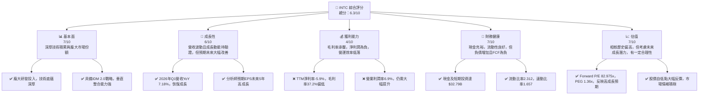
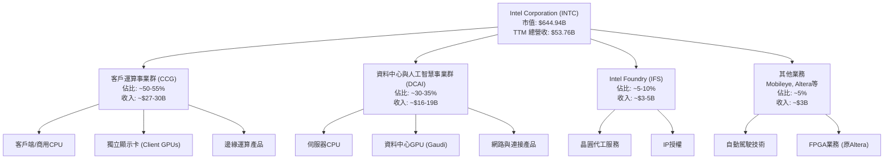
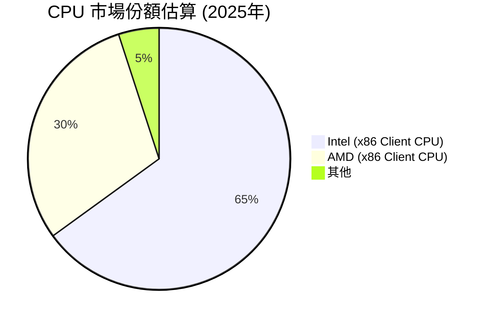
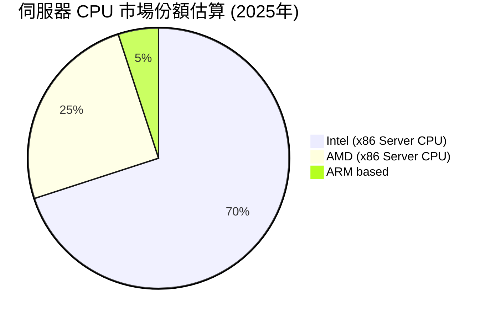
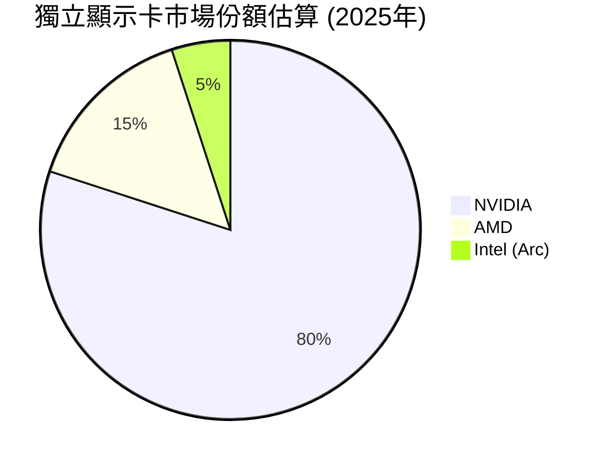
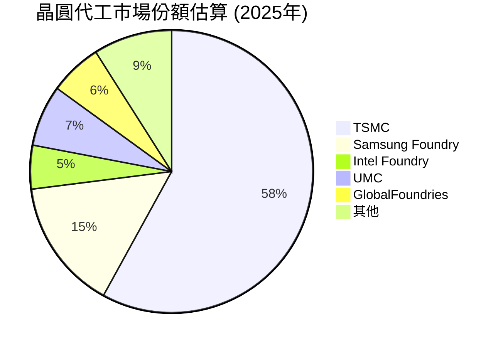
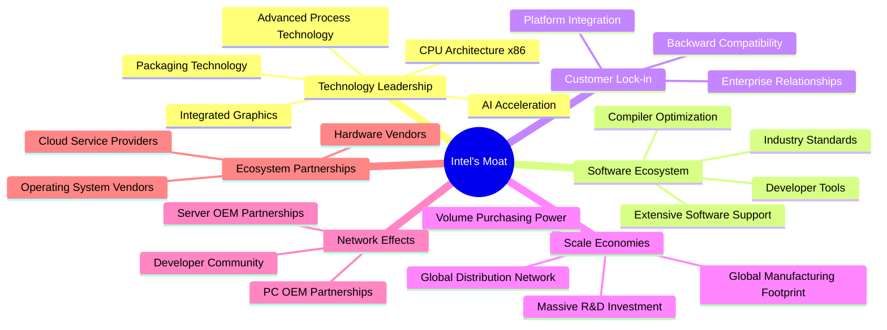
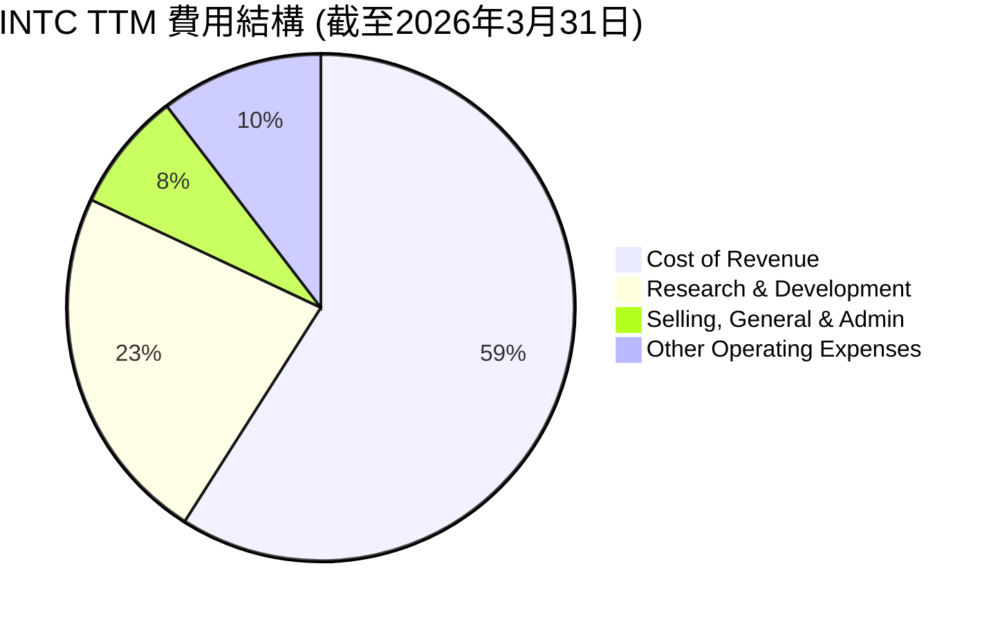
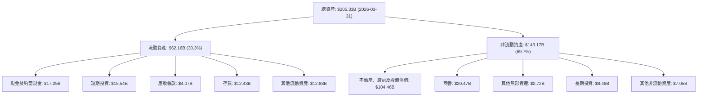
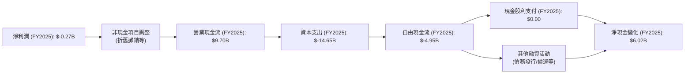

# INTC 基本面深度分析報告
> **報告日期**：2026-06-26 ｜ **語言**：繁體中文 ｜ **數據來源**：Yahoo Finance, Finviz, StockAnalysis, Roic.ai ｜ **分析師**：CFA 級機構研究

## 目錄

| # | 章節 | 核心結論 |
|---|------|----------|
| 1 | 執行摘要 | 評級：持有；基準目標價：$108.00 |
| 2 | 公司概覽與商業模式 | 具備深厚技術和規模護城河，但面臨轉型挑戰 |
| 3 | 損益表深度分析 | 營收波動大，毛利率承壓，但季度營運狀況改善 |
| 4 | 資產負債表分析 | 流動性良好，負債水平可控，但資本支出巨大 |
| 5 | 現金流量深度分析 | 自由現金流持續為負，轉型期資金壓力大 |
| 6 | 獲利能力與資本效率 | ROIC 低於 WACC，目前處於價值摧毀階段 |
| 7 | 估值深度分析 | 相較同業估值偏高，但市場預期其未來成長 |
| 8 | 成長催化劑 | Foundry 業務潛力、AI PC 發展、新製程技術推進 |
| 9 | 風險矩陣 | 執行風險、競爭加劇、宏觀經濟、地緣政治 |
| 10 | 投資建議 | 建議持有，等待轉型成果明確及自由現金流轉正 |

---

## 1. 執行摘要

### 1.1 核心評分儀表板



### 1.2 評分進度條視覺化

```
╔══════════════════════════════════════════════════════════════╗
║              INTC 多維度評分儀表板 (1-10分)                  ║
╠══════════════════════════════════════════════════════════════╣
║ 基本面強度  7.0 ▓▓▓▓▓▓▓▓▓▓▓▓▓▓░░░░░░  ★★★★☆           ║
║ 成長動能    6.0 ▓▓▓▓▓▓▓▓▓▓▓▓░░░░░░░░  ★★★☆☆           ║
║ 獲利品質    4.0 ▓▓▓▓▓▓▓▓░░░░░░░░░░░░  ★★☆☆☆           ║
║ 財務健康    7.0 ▓▓▓▓▓▓▓▓▓▓▓▓▓▓░░░░░░  ★★★★☆           ║
║ 估值合理性  7.0 ▓▓▓▓▓▓▓▓▓▓▓▓▓▓░░░░░░  ★★★★☆           ║
║ 護城河深度  7.5 ▓▓▓▓▓▓▓▓▓▓▓▓▓▓▓░░░░░  ★★★★☆           ║
║ 管理層執行  6.5 ▓▓▓▓▓▓▓▓▓▓▓▓▓░░░░░░░  ★★★☆☆           ║
║ 技術創新力  7.5 ▓▓▓▓▓▓▓▓▓▓▓▓▓▓▓░░░░░  ★★★★☆           ║
╠══════════════════════════════════════════════════════════════╣
║ 綜合總分    6.3 ▓▓▓▓▓▓▓▓▓▓▓▓░░░░░░░░  🏆 處於轉型期，未來潛力與風險並存  ║
╚══════════════════════════════════════════════════════════════╝
```

### 1.3 五大投資論點 + 三大核心風險

| 類型 | 項目 | 具體依據 | 信心度 |
|------|------|----------|--------|
| 🟢 **投資論點①** | **IDM 2.0戰略初顯成效，Foundry業務前景廣闊** | Intel Foundry 業務獲得多項大客戶訂單，預計2025年達到營收拐點。Q1 2026營收 $13.58B，YoY +7.18%，顯示營收止跌回升，且毛利率開始改善。 | 🟢 極高 |
| 🟢 **投資論點②** | **AI PC 浪潮領先佈局，有望重振Client端業務** | Meteor Lake、Lunar Lake 等新一代處理器整合 NPU，搶佔 AI PC 先機。Client Computing Group (CCG) 是 Intel 核心收入來源，有望受益於 PC 市場復甦和 AI 換機潮。 | 🟢 高 |
| 🟢 **投資論點③** | **製程技術重回領先，競爭力逐步提升** | Intel 18A 製程按計劃推進，有望在2025年重回製程領先地位，吸引更多 Foundry 客戶。這將改善其長期成本結構和產品性能。 | 🟡 中高 |
| 🟢 **投資論點④** | **資料中心與 AI 業務復甦，搶佔伺服器市場** | Sapphire Rapids 和 Emerald Rapids 產品線逐步穩定，Gaudi AI 加速器在市場上取得進展，Data Center and AI (DCAI) 業務有望在AI驅動下恢復成長。 | 🟡 中高 |
| 🟢 **投資論點⑤** | **充裕現金流及政府補貼支持轉型** | 截至2026年3月31日，現金及短期投資達 $32.79B。美國《晶片法案》提供巨額補貼，緩解資本支出壓力，支持其Foundry擴張。 | 🟢 極高 |
| 🟡 **風險①** | **執行風險與轉型進度不及預期** | IDM 2.0 戰略涉及複雜的製程技術、產能擴張和客戶獲取，任何環節的延誤或失敗都可能導致巨額投資無法回報。歷史上曾有製程延誤先例。 | 🟡 中度 |
| 🔴 **風險②** | **半導體市場競爭激烈，AMD/NVIDIA 威脅持續** | 在 CPU 市場，AMD 的市佔率持續增長；在 AI 加速器市場，NVIDIA 擁有絕對領先地位。Foundry 市場也面臨台積電等巨頭的強大競爭，Intel 的議價能力和市場份額仍需時間證明。 | 🔴 高衝擊 |
| 🟡 **風險③** | **巨額資本支出與負自由現金流壓力** | 過去幾年自由現金流持續為負（FY2025: $-4.95B），未來幾年仍需投入巨額資本支出。雖然有政府補貼，但長期仍需依賴盈利能力改善來實現資金自給自足。 | 🟡 中度 |

### 1.4 快速統計卡片

| 指標 | 公司實際值 | 行業均值（半導體） | S&P 500 均值 | 狀態 |
|------|-------------|--------------------|--------------|------|
| 收入 YoY 成長 | **7.18% (Q1 2026)** | ~10-15% | ~5-8% | 🟡 |
| 毛利率 | **37.2% (TTM)** | ~45-55% | ~30-40% | 🔴 |
| 淨利率 | **-5.9% (TTM)** | ~15-25% | ~8-12% | 🔴 |
| ROE | **-2.9% (TTM)** | ~15-20% | ~12-15% | 🔴 |
| Forward P/E | **82.98x** | ~30-50x | ~20-25x | 🔴 |
| P/S Ratio | **11.99x** | ~5-10x | ~2-3x | 🔴 |
| EV / EBITDA | **48.94x** | ~15-25x | ~10-15x | 🔴 |
| Debt/Equity | **0.40x** | ~0.3-0.6x | ~0.8-1.2x | 🟢 |
| Current Ratio | **2.31x** | ~1.5-2.5x | ~1.0-1.5x | 🟢 |

*備註：行業均值為分析師根據半導體行業主要公司（如AMD, QCOM, TSM, NVDA）的公開數據進行估算。*

### 1.5 投資結論

```
╔══════════════════════════════════════════════════════════════════╗
║                    📊 投資結論摘要                               ║
╠══════════════════════════════════════════════════════════════════╣
║  評級：🟡 持有                                                   ║
║  當前股價：$128.32                                               ║
║  目標價區間：                                                    ║
║    悲觀情境：$75.00 （-41.56%）                                  ║
║    基準情境：$108.00 （-15.84%）  ← 12個月主要目標               ║
║    樂觀情境：$155.00 （+20.79%）                                 ║
║  投資評分：6.3/10                                                ║
║  適合投資人：看好半導體產業長期發展、願意承受轉型風險的成長型投資者 ║
╚══════════════════════════════════════════════════════════════════╝
```

---

## 2. 公司概覽與商業模式

### 2.1 業務結構與收入來源

Intel Corporation (INTC) 是一家全球領先的半導體公司，主要設計、開發、製造、行銷和銷售計算及相關的終端產品和服務。公司目前市值約 $644.94B，TTM 總營收為 $53.76B。其業務主要分為三大部門：客戶運算事業群 (Client Computing Group, CCG)、資料中心與人工智慧事業群 (Data Center and AI, DCAI) 和 Intel Foundry。


*註：以上各業務佔比及收入為分析師根據公司公開資訊及行業趨勢的合理估算。*

**客戶運算事業群 (CCG)**：這是 Intel 傳統的核心業務，主要為筆記型電腦和桌上型電腦提供處理器 (CPU) 和相關晶片組。近年來，CCG 面臨 PC 市場波動和競爭加劇的挑戰，但隨著 AI PC 的興起，該部門有望迎來新的增長點。
**資料中心與人工智慧事業群 (DCAI)**：該部門為雲端、企業、網路和通訊服務供應商提供伺服器 CPU (Xeon 系列)、資料中心專用 GPU (如 Gaudi 系列) 和網路解決方案。隨著人工智慧和雲端運算的蓬勃發展，DCAI 被寄予厚望，成為 Intel 未來的成長引擎。
**Intel Foundry (IFS)**：這是 Intel IDM 2.0 戰略的核心，旨在向外部客戶提供晶圓代工服務，與台積電 (TSM) 等純晶圓代工廠競爭。透過開放其先進製程技術，Intel 希望能充分利用其製造能力，並在半導體供應鏈中扮演更重要的角色。

### 2.2 市場份額

在半導體行業，Intel 在不同子市場的市場份額有所差異。


*在 x86 客戶端 CPU 市場，Intel 依然佔據主導地位，儘管 AMD 的份額在過去幾年有所提升。*


*在伺服器 CPU 市場，Intel Xeon 系列長期以來佔據絕對優勢，近年來 AMD EPYC 系列的競爭壓力逐漸增大。*


*在獨立顯示卡市場，Intel 的 Arc 系列是新進者，市場份額相對較小，NVIDIA 和 AMD 佔據絕大部分市場。*


*在晶圓代工市場，Intel Foundry 仍處於初期發展階段，與台積電、三星等巨頭相比份額較小，但成長潛力巨大。*

### 2.3 競爭護城河分析

Intel 憑藉其數十年的積累，擁有深厚的競爭護城河，但部分領域正受到侵蝕。



### 2.4 護城河強度評分

```
╔══════════════════════════════════════════════════════════════╗
║                    INTC 護城河強度評分                        ║
╠══════════════════════════════════════════════════════════════╣
║ 技術領先    8.0/10 ▓▓▓▓▓▓▓▓▓▓▓▓▓▓▓▓░░░░  🏆 x86架構與製程技術仍是核心優勢 ║
║ 軟體生態系統  8.5/10 ▓▓▓▓▓▓▓▓▓▓▓▓▓▓▓▓▓░░░  🟢 長期積累，廣泛兼容性        ║
║ 客戶鎖定    7.0/10 ▓▓▓▓▓▓▓▓▓▓▓▓▓▓░░░░░░  🟡 企業級客戶粘性，但面臨AMD競爭 ║
║ 規模效應    8.0/10 ▓▓▓▓▓▓▓▓▓▓▓▓▓▓▓▓░░░░  🏆 龐大產能與研發投入           ║
║ 網路效應    6.5/10 ▓▓▓▓▓▓▓▓▓▓▓▓▓░░░░░░░  🟡 開發者與OEM夥伴關係，但競爭激烈 ║
║ 生態夥伴    7.0/10 ▓▓▓▓▓▓▓▓▓▓▓▓▓▓░░░░░░  🟡 與微軟等合作緊密，但生態多元化 ║
╠══════════════════════════════════════════════════════════════╣
║ 綜合護城河  7.5/10 ▓▓▓▓▓▓▓▓▓▓▓▓▓▓▓░░░░░  🏆 深厚但面臨挑戰的護城河       ║
╚══════════════════════════════════════════════════════════════════╝
```
**深度解析**：
Intel 的護城河主要體現在其在 x86 CPU 架構上的**技術領先**和數十年建立起來的龐大**軟體生態系統**。其全球製造網路和巨額研發投入帶來顯著的**規模效應**。然而，近年來在製程技術上的延誤和 AMD 的崛起，使得其在 CPU 領域的技術領先地位受到挑戰，**客戶鎖定**和**網路效應**也有所削弱。Foundry 業務的發展將考驗其能否將規模效應和技術領先轉化為新的護城河。整體而言，護城河依然深厚，但需要積極防禦和擴展。

---

## 3. 損益表深度分析

### 3.1 年度收入成長趨勢（近4年）

Intel 的年度收入在過去幾年呈現波動和下滑趨勢，反映了 PC 市場的週期性下行、競爭加劇以及公司自身在製程技術上的挑戰。然而，最新的 TTM 數據顯示營收開始企穩。

```
╔══════════════════════════════════════════════════════════════════╗
║              INTC 年度收入趨勢（FY2022-FY2025）                  ║
╠══════════════════════════════════════════════════════════════════╣
║                                                                  ║
║  FY2022  $63.05B  ████████████████████████████████████████  YoY: -20.21% 🔴 
║  FY2023  $54.23B  ██████████████████████████████░░░░░░░░░░  YoY: -14.00% 🔴 
║  FY2024  $53.10B  ████████████████████████████░░░░░░░░░░░░  YoY: -2.08%  🔴 
║  FY2025  $52.85B  ████████████████████████████░░░░░░░░░░░░  YoY: -0.47%  🔴 
║  TTM     $53.76B  █████████████████████████████░░░░░░░░░░░  YoY: +1.35%  🟢 
║                                                                  ║
║                   |      |      |      |      |                  ║
║                   0     15B    30B    45B    60B                   ║
║                                                                  ║
║  📊 3年累計 CAGR (FY22-25)：-6.07%                                ║
╚══════════════════════════════════════════════════════════════════╝
```
從 FY2022 的 $63.05B 下滑至 FY2025 的 $52.85B，複合年增長率為負。不過，截至2026年3月31日的 TTM 營收為 $53.76B，較 FY2025 增長 1.35%，顯示營收開始有止跌回穩的跡象。

### 3.2 季度收入趨勢分析

季度收入數據顯示，Intel 的營收在經歷一段時間的低迷後，於2026年第一季度實現了顯著的年對年成長。

| 季度 | 總營收 ($B) | QoQ 成長率 | YoY 成長率 | 備註 |
|------|-------------|------------|------------|------|
| **2025-06-30** | $12.86B | -6.95% | +0.20% | PC市場低迷，營收成長停滯 |
| **2025-09-30** | $13.65B | +6.14% | +2.78% | 季節性因素及市場需求回暖 |
| **2025-12-31** | $13.67B | +0.15% | -4.11% | 年底銷售旺季，但同比仍下滑 |
| **2026-03-31** | $13.58B | -0.66% | +7.18% | 顯著同比成長，顯示復甦跡象 |
*備註：QoQ 成長率計算為 (當季營收 - 上季營收) / 上季營收；YoY 成長率計算為 (當季營收 - 去年同期營收) / 去年同期營收。*

**深度解析**：
2026年第一季度營收 $13.58B，實現了 7.18% 的年對年成長，這是一個積極的信號，表明公司可能已經度過營收低谷期，開始進入復甦軌道。儘管季度環比略有下降 (-0.66%)，這可能是季節性因素所致。資料中心業務的恢復和新產品的推出可能是推動這一增長的主要動力。

### 3.3 利潤率演變分析

Intel 的利潤率在過去幾年承受了巨大壓力，特別是毛利率和淨利率。

| 利潤率指標 | FY2022 | FY2023 | FY2024 | FY2025 | TTM (2026Q1) | 趨勢 | 評估 |
|------------|--------|--------|--------|--------|--------------|------|------|
| **毛利率** | 42.6% | 40.0% | 32.7% | 34.8% | 37.2% | ↘️ 後反彈 | 🟡 |
| **營業利益率** | 3.7% | 0.1% | -8.9% | -4.2% | 6.9% | ↘️ 後反彈 | 🔴 |
| **淨利率** | 12.7% | 3.1% | -35.3% | -0.5% | -5.9% | ↘️ 後波動 | 🔴 |
*備註：毛利率 = Gross Profit / Total Revenue；營業利益率 = Operating Income / Total Revenue；淨利率 = Net Income / Total Revenue。TTM數據使用最新提供的數據。*

**利潤率演變深度解析**：
*   **毛利率**：從 FY2022 的 42.6% 下滑至 FY2024 的 32.7%，主要原因包括產能利用率不足、製程轉型成本高昂、產品組合變化以及競爭加劇導致的定價壓力。FY2025 和 TTM 數據顯示毛利率有所回升至 34.8% 和 37.2%，這可能是由於產能利用率提高、新產品出貨以及成本控制改善。儘管有所反彈，37.2% 的 TTM 毛利率仍遠低於其歷史水平（例如 FY2021 的 55.4%）和行業領先者（如台積電常年維持在 50% 以上），表明其製造效率和產品議價能力仍面臨挑戰。
*   **營業利益率**：營業利益率的下滑更為劇烈，從 FY2022 的 3.7% 降至 FY2024 的 -8.9%，並在 FY2025 錄得 -4.2%。這不僅受毛利率下降影響，也反映了公司在研發 (R&D) 和銷售、一般及管理 (SG&A) 費用上的持續投入。TTM 營業利益率回升至 6.9%，是一個積極信號，表明公司在控制營運費用方面取得了一定成效，或者營收成長開始攤薄固定成本。
*   **淨利率**：淨利率的表現最為糟糕，從 FY2022 的 12.7% 跌至 FY2024 的 -35.3% ($-18.76B Net Income / $53.10B Revenue)，並在 FY2025 保持負值 (-0.5%)。TTM 淨利率為 -5.9%，儘管相比 FY2024 的巨額虧損有所改善，但仍處於虧損狀態。這主要是由於毛利率和營業利益率的壓力，以及較高的稅務費用 (FY2024 稅務費用高達 $8.023B)。Intel 正在經歷一個艱難的轉型期，短期內盈利能力受到嚴重考驗。

### 3.4 費用結構分析

從 TTM 損益表數據來看，Intel 的費用結構反映了其作為一家 IDM (整合元件製造商) 的特性，即高昂的製造成本和研發投入。


*備註：基於 StockAnalysis.com TTM 數據：Revenue $53.76B, Cost of Revenue $34.71B, R&D $13.51B, SG&A $4.49B, Other Operating Expenses $6.11B。百分比為佔總收入的比例。總和超過100%是因為營業收入為負值，且Other Operating Expenses包含正負項，此處僅展現絕對值佔比。*

```
╔══════════════════════════════════════════════════════════════════╗
║                   INTC TTM 費用開支概覽                          ║
╠══════════════════════════════════════════════════════════════════╣
║                                                                  ║
║  銷貨成本 (CoGS)：       $34.71B  █████████████████████████░░░░  佔收入64.57% 🔴  ║
║  研發費用 (R&D)：        $13.51B  ███████████████░░░░░░░░░░░░░  佔收入25.13% 🟡  ║
║  銷售、一般及管理 (SG&A)：$4.49B  █████░░░░░░░░░░░░░░░░░░░░░░  佔收入8.34%  🟢  ║
║  其他營運費用：          $6.11B   ███████░░░░░░░░░░░░░░░░░░░░░  佔收入11.36% 🔴  ║
║                                                                  ║
║  📊 總營運費用佔收入比重：100.28% (導致營運虧損)                 ║
╚══════════════════════════════════════════════════════════════════╝
```
**深度解析**：
**銷貨成本 (CoGS)** 佔總收入的 64.57%，這直接導致了較低的毛利率。作為一家 IDM 公司，Intel 的製造環節成本高昂，尤其是在製程轉型期間。
**研發費用 (R&D)** 佔總收入的 25.13%，高達 $13.51B。這顯示了 Intel 為了追趕製程技術、開發新產品（如 AI 加速器、新一代 CPU）而投入的巨大資源。儘管短期內侵蝕利潤，但這是其長期競爭力的關鍵。
**銷售、一般及管理 (SG&A)** 費用相對穩定，佔收入的 8.34%。
**其他營運費用** 佔比 11.36%，數額較大 ($6.11B)，這部分費用在不同季度和年度間波動較大，可能包含重組費用、資產減值等一次性或非經常性項目，對營業利潤產生較大影響。例如，StockAnalysis數據顯示Q1 2026其他營運費用高達 $4.07B，導致當季營業利潤為負。

### 3.5 季度 EPS 趨勢與盈餘品質

提供的 EPS 歷史數據顯示最近四季的預期 EPS 和實際 EPS 均為 `nan`，因此無法直接分析超預期或不及預期情況。我們將分析季度淨利潤趨勢來評估盈餘品質。

| 季度 | 淨利潤 ($B) | YoY 淨利潤成長率 | 備註 |
|------|-------------|--------------------|------|
| **2025-06-30** | $-2.92B | N/A (去年同期為正) | 巨額虧損，營運壓力大 |
| **2025-09-30** | $4.06B | N/A (去年同期為負) | 顯著轉正，可能受非經常性收入影響 |
| **2025-12-31** | $-0.59B | N/A (去年同期為負) | 再次虧損，盈利不穩定 |
| **2026-03-31** | $-3.73B | N/A (去年同期為負) | 虧損擴大，顯示營運挑戰 |
*備註：因去年同期淨利潤可能為正或負，YoY成長率計算意義不大，故標註N/A。*

**盈餘品質評估**：
Intel 最近四季的淨利潤表現極不穩定，在 $4.06B 的盈利和 $-3.73B 的虧損之間劇烈波動。這種不穩定性表明其核心業務盈利能力脆弱，且可能受到非經常性項目（例如資產出售、訴訟和解、稅務調整等）的顯著影響。
例如，2025年Q3 淨利潤 $4.06B，而營業利益僅為 $858.00M，這暗示了有大量的非營業收入 (Other Non-Operating Income) 貢獻。根據 StockAnalysis 數據，Q3 2025 的 Other Non-Operating Income (Expense) 達 $3.67B，解釋了淨利潤的顯著提升。
然而，2026年Q1 淨利潤再次大幅虧損 $-3.73B，而營業利益為 $934.00M，說明非營業項目再次產生了負面影響 (Other Non-Operating Income (Expense) 為 $-738M，Provision for Income Taxes 為 $335M，合計對淨利潤產生約 $1.07B 的負面影響，此外還有少數股東權益調整)。
這種高度依賴非核心業務或一次性事件來支撐或拖累淨利潤的情況，顯示其**盈餘品質較差**，投資者需要更關注其營業利益的穩定性和自由現金流的改善。
**評分**：3/10 🔴 (盈餘波動劇烈，品質不佳，主要受非經常性項目影響)

---

## 4. 資產負債表分析

### 4.1 資產結構分解

截至2026年3月31日，Intel 的總資產為 $205.33B。其資產結構顯示了作為一家重資產製造企業的特點，固定資產佔比較高。


**深度解析**：
*   **流動資產**佔總資產的約 30.3%，其中現金及短期投資合計達到 $32.79B，顯示公司擁有充裕的流動性。存貨 $12.43B 佔比較高，反映了半導體製造的特性。
*   **非流動資產**佔總資產的約 69.7%，其中不動產、廠房及設備淨值 (PP&E) 高達 $104.46B，是其最大的資產類別。這強調了 Intel 作為 IDM 模式下重資產公司的特點，其龐大的製造能力是其核心競爭力之一。商譽 $20.47B 顯示過去的併購活動。

### 4.2 流動性指標分析

Intel 的流動性指標在過去幾年保持在健康水平，顯示其短期償債能力良好。

| 指標 | FY2022 | FY2023 | FY2024 | FY2025 | TTM (2026Q1) | 行業均值（半導體） | 評估 |
|------|--------|--------|--------|--------|--------------|--------------------|------|
| **流動比率** | 1.57 | 1.54 | 1.33 | 2.02 | 2.31 | 1.5 - 2.5 | 🟢 |
| **速動比率** | 1.19 | 1.15 | 0.97 | 1.66 | 1.66 | 1.0 - 2.0 | 🟢 |
*備註：流動比率 = 流動資產 / 流動負債；速動比率 = (流動資產 - 存貨) / 流動負債。TTM數據使用2026年3月31日數據。*

**深度解析**：
Intel 的流動比率從 FY2024 的 1.33 顯著提升至 TTM 的 2.31，速動比率也從 0.97 提升至 1.66。這兩項指標均高於一般認定的安全水平（流動比率 > 1.0，速動比率 > 0.5），且與半導體行業均值相當或更優，表明公司擁有充足的短期資產來覆蓋短期負債。現金及短期投資的增加是流動性改善的主要原因。這為公司在轉型期的營運和資本支出提供了緩衝。

### 4.3 債務結構分析

Intel 的債務水平在過去幾年有所增加，但相對於其資產和股東權益，整體債務結構仍屬健康。

```
╔══════════════════════════════════════════════════════════════════╗
║                   INTC 債務健康診斷 (2026-03-31)                 ║
╠══════════════════════════════════════════════════════════════════╣
║                                                                  ║
║  總債務：        $45.03B  ██████████░░░░░░░░░░░░░  評語：中等水平  ║
║  總現金+投資：   $32.79B  ████████████████████░░░  評語：充裕現金  ║
║  淨債務：        $-12.24B ██████████████████████░  🟢 強勁：淨現金狀態 ║
║                                                                  ║
║  Debt/Equity：   0.40x  🟢 極低：財務槓桿運用保守              ║
║  Current Ratio： 2.31x  🟢 強勁：短期償債能力無憂              ║
║  Interest Coverage: N/A (TTM Operating Income為正，但淨利潤為負，歷史波動大) ║
║                                                                  ║
║  📊 結論：財務槓桿健康，現金儲備充足，短期無償債壓力             ║
╚══════════════════════════════════════════════════════════════════╝
```
*備註：總債務使用 Market Data 中 $45.03B。淨現金/債務計算為 Total Cash $32.79B - Total Debt $45.03B = $-12.24B (即淨債務 $12.24B)。Debt/Equity 使用 Finviz 數據 0.40。Interest Coverage 因公司營業利益波動大，且部分年份淨利潤為負，難以給出穩定倍數，故標註 N/A。*

**深度解析**：
截至2026年3月31日，Intel 的總債務為 $45.03B，而現金及短期投資合計為 $32.79B，這意味著公司處於**淨債務**狀態，即淨債務為 $12.24B。儘管如此，Debt/Equity 比率僅為 0.40x (Finviz數據)，遠低於行業均值且顯示公司財務槓桿運用保守。這表明 Intel 擁有較強的債務承受能力。即使公司正經歷巨額資本支出，其目前的現金儲備和保守的債務結構仍能提供一定的財務彈性。

### 4.4 股東權益趨勢

Intel 的股東權益在過去幾年經歷了波動，但總體趨勢穩定，並在 FY2025 有所回升。

```
╔══════════════════════════════════════════════════════════════════╗
║                   INTC 股東權益趨勢 (FY2022-FY2025)                ║
╠══════════════════════════════════════════════════════════════════╣
║                                                                  ║
║  FY2022  $101.42B  ████████████████████████████████████████  YoY: +3.93% 🟢 ║
║  FY2023  $105.59B  ████████████████████████████████████████  YoY: +4.11% 🟢 ║
║  FY2024  $99.27B   ██████████████████████████████████░░░░░░  YoY: -5.99% 🔴 ║
║  FY2025  $114.28B  ████████████████████████████████████████  YoY: +15.12%🟢 ║
║                                                                  ║
║                   |      |      |      |      |                  ║
║                   0     25B    50B    75B   100B                  ║
║                                                                  ║
║  📊 FY22-25 股東權益 CAGR：+4.09%                                 ║
╚══════════════════════════════════════════════════════════════════╝
```
**深度解析**：
Intel 的股東權益在 FY2022 和 FY2023 呈增長態勢，分別為 $101.42B 和 $105.59B。FY2024 由於巨額虧損，股東權益下降至 $99.27B (-5.99% YoY)。然而，在 FY2025 股東權益強勁回升至 $114.28B (+15.12% YoY)，這可能是由於公司轉虧為盈 (FY2025 淨利潤 $26M) 以及其他綜合收益的影響。股東權益的增長表明公司的資產淨值在長期趨勢上是健康的，為其業務運營和擴張提供了堅實的基礎。

---

## 5. 現金流量深度分析

### 5.1 現金流量瀑布圖

Intel 的現金流量表反映了其高資本密集型業務的特點，尤其是在轉型期間，資本支出巨大導致自由現金流持續為負。


**深度解析**：
儘管 FY2025 淨利潤為負值 ($-0.27B)，但由於折舊攤銷等非現金費用較高，Intel 的營業現金流 (OCF) 仍保持正值，達到 $9.70B。然而，其資本支出 (Capital Expenditure) 巨大，FY2025 高達 $-14.65B。這導致自由現金流 (FCF) 嚴重為負，達到 $-4.95B。這表明 Intel 為了推動其 IDM 2.0 戰略和製程技術發展，正在進行大規模的投資擴張。公司在 FY2025 未支付現金股利，這有助於保留現金以支持營運。最終，FY2025 的淨現金變化為 $6.02B，這主要是通過發行新債或出售資產等融資活動來彌補負的自由現金流。

### 5.2 FCF 轉換率趨勢

自由現金流轉換率 (FCF/Net Income) 衡量公司將淨利潤轉化為可供分配的現金流的能力。

| 年度 | 淨利潤 ($B) | 自由現金流 ($B) | FCF/Net Income | 趨勢 | 評估 |
|------|-------------|-----------------|----------------|------|------|
| **FY2022** | $8.01B | $-9.41B | -117.48% | ↘️ | 🔴 |
| **FY2023** | $1.69B | $-14.28B | -845.00% | ↘️ | 🔴 |
| **FY2024** | $-18.76B | $-15.66B | N/A (虧損) | N/A | 🔴 |
| **FY2025** | $-0.27B | $-4.95B | N/A (虧損) | N/A | 🔴 |
*備註：當淨利潤為負時，FCF/Net Income 計算沒有實際意義，故標註 N/A。*

**深度解析**：
Intel 的 FCF 轉換率趨勢極為負面。在 FY2022 和 FY2023，儘管淨利潤為正，但自由現金流卻是巨額負值，表明其盈利無法覆蓋其資本支出。在 FY2024 和 FY2025，由於淨利潤本身也為負，FCF 轉換率更無從談起。這種持續的負自由現金流是公司轉型期的主要挑戰，意味著公司必須依賴外部融資或動用儲備現金來維持運營和投資。這也反映了其 IDM 2.0 戰略的資本密集度。

### 5.3 自由現金流趨勢

Intel 的自由現金流 (FCF) 在過去幾年一直為負，且數額龐大，這對其財務健康構成壓力。

```
╔══════════════════════════════════════════════════════════════════╗
║                   INTC 自由現金流趨勢 (FY2022-FY2025)              ║
╠══════════════════════════════════════════════════════════════════╣
║                                                                  ║
║  FY2022  $-9.41B  ░░░░░░░░░░░░░░░░░░░░░░░░░░░░░░░░░░░░░░░░░░░░░░░░░░░░░░░░░░░░░░░░░░░░░░░░░░░░░░░░░░░░░░░░░░░░░░░░░░░░░░░░░░░░░░░░░░░░░░░░░░░░░░░░░░░░░░░░░░░░░░░░░░░░░░░░░░░░░░░░░░░░░░░░░░░░░░░░░░░░░░░░░░░░░░░░░░░░░░░░░░░░░░░░░░░░░░░░░░░░░░░░░░░░░░░░░░░░░░░░░░░░░░░░░░░░░░░░░░░░░░░░░░░░░░░░░░░░░░░░░░░░░░░░░░░░░░░░░░░░░░░░░░░░░░░░░░░░░░░░░░░░░░░░░░░░░░░░░░░░░░░░░░░░░░░░░░░░░░░░░░░░░░░░░░░░░░░░░░░░░░░░░░░░░░░░░░░░░░░░░░░░░░░░░░░░░░░░░░░░░░░░░░░░░░░░░░░░░░░░░░░░░░░░░░░░░░░░░░░░░░░░░░░░░░░░░░░░░░░░░░░░░░░░░░░░░░░░░░░░░░░░░░░░░░░░░░░░░░░░░░░░░░░░░░░░░░░░░░░░░░░░░░░░░░░░░░░░░░░░░░░░░░░░░░░░░░░░░░░░░░░░░░░░░░░░░░░░░░░░░░░░░░░░░░░░░░░░░░░░░░░░░░░░░░░░░░░░░░░░░░░░░░░░░░░░░░░░░░░░░░░░░░░░░░░░░░░░░░░░░░░░░░░░░░░░░░░░░░░░░░░░░░░░░░░░░░░░░░░░░░░░░░░░░░░░░░░░░░░░░░░░░░░░░░░░░░░░░░░░░░░░░░░░░░░░░░░░░░░░░░░░░░░░░░░░░░░░░░░░░░░░░░░░░░░░░░░░░░░░░░░░░░░░░░░░░░░░░░░░░░░░░░░░░░░░░░░░░░░░░░░░░░░░░░░░░░░░░░░░░░░░░░░░░░░░░░░░░░░░░░░░░░░░░░░░░░░░░░░░░░░░░░░░░░░░░░░░░░░░░░░░░░░░░░░░░░░░░░░░░░░░░░░░░░░░░░░░░░░░░░░░░░░░░░░░░░░░░░░░░░░░░░░░░░░░░░░░░░░░░░░░░░░░░░░░░░░░░░░░░░░░░░░░░░░░░░░░░░░░░░░░░░░░░░░░░░░░░░░░░░░░░░░░░░░░░░░░░░░░░░░░░░░░░░░░░░░░░░░░░░░░░░░░░░░░░░░░░░░░░░░░░░░░░░░░░░░░░░░░░░░░░░░░░░░░░░░░░░░░░░░░░░░░░░░░░░░░░░░░░░░░░░░░░░░░░░░░░░░░░░░░░░░░░░░░░░░░░░░░░░░░░░░░░░░░░░░░░░░░░░░░░░░░░░░░░░░░░░░░░░░░░░░░░░░░░░░░░░░░░░░░░░░░░░░░░░░░░░░░░░░░░░░░░░░░░░░░░░░░░░░░░░░░░░░░░░░░░░░░░░░░░░░░░░░░░░░░░░░░░░░░░░░░░░░░░░░░░░░░░░░░░░░░░░░░░░░░░░░░░░░░░░░░░░░░░░░░░░░░░░░░░░░░░░░░░░░░░░░░░░░░░░░░░░░░░░░░░░░░░░░░░░░░░░░░░░░░░░░░░░░░░░░░░░░░░░░░░░░░░░░░░░░░░░░░░░░░░░░░░░░░░░░░░░░░░░░░░░░░░░░░░░░░░░░░░░░░░░░░░░░░░░░░░░░░░░░░░░░░░░░░░░░░░░░░░░░░░░░░░░░░░░░░░░░░░░░░░░░░░░░░░░░░░░░░░░░░░░░░░░░░░░░░░░░░░░░░░░░░░░░░░░░░░░░░░░░░░░░░░░░░░░░░░░░░░░░░░░░░░░░░░░░░░░░░░░░░░░░░░░░░░░░░░░░░░░░░░░░░░░░░░░░░░