# INTC 基本面深度分析報告
> **報告日期**：2026-06-26 ｜ **語言**：繁體中文 ｜ **數據來源**：Yahoo Finance, Finviz, StockAnalysis, Roic.ai ｜ **分析師**：CFA 級機構研究

## 目錄

| # | 章節 | 核心結論 |
|---|------|----------|
| 1 | 執行摘要 | 評級：觀望，目標價區間：$38.43 - $72.77 |
| 2 | 公司概覽與商業模式 | 護城河：技術、生態系統與規模效應，但面臨挑戰 |
| 3 | 損益表深度分析 | 營收波動，獲利能力承壓，但毛利率近期有所改善 |
| 4 | 資產負債表分析 | 流動性良好，債務水平可控，但股東權益近期增長 |
| 5 | 現金流量深度分析 | 自由現金流持續為負，資本支出龐大，影響現金生成 |
| 6 | 獲利能力與資本效率 | ROIC 遠低於 WACC，目前處於價值摧毀階段 |
| 7 | 估值深度分析 | 相較於保守預期，當前估值顯著偏高 |
| 8 | 成長催化劑 | Foundry 業務、AI 晶片、PC 市場復甦為主要驅動力 |
| 9 | 風險矩陣 | 產業競爭、執行風險、巨額資本支出為主要風險 |
| 10 | 投資建議 | 鑑於當前股價大幅上漲且存在估值泡沫，建議觀望 |

---

## 1. 執行摘要

### 1.1 核心評分儀表板

```mermaid
graph TD
    INTC["🎯 INTC 綜合評分<br/>總分：5.2/10"]

    F["📊 基本面<br/>6/10<br/>技術積累深厚，但市場地位受挑戰"]
    G["🚀 成長性<br/>5/10<br/>過去營收承壓，未來成長具不確定性"]
    P["💰 獲利能力<br/>4/10<br/>利潤率大幅下滑，近期有所改善但仍為負"]
    B["🏦 財務健康<br/>7/10<br/>流動性良好，債務槓桿適中"]
    V["📈 估值<br/>3/10<br/>當前股價遠超保守估值，存在高估風險"]

    INTC --> F
    INTC --> G
    INTC --> P
    INTC --> B
    INTC --> V

    F --> F1["✅ 龐大的研發投入與專利組合"]
    F --> F2["✅ 具備IDM 2.0戰略轉型潛力"]
    F --> F3["⚠️ 核心PC市場份額受到侵蝕"]

    G --> G1["✅ 預期未來AI與Foundry業務帶來高增長"]
    G --> G2["⚠️ 近4年營收呈下降趨勢"]
    G --> G3["⚠️ 轉型過程存在執行風險"]

    P --> P1["⚠️ TTM淨利率為-5.9%，ROE為-2.9%"]
    P --> P2["✅ 毛利率從低點35.9%回升至37.2%"]
    P --> P3["⚠️ 營業利益率波動劇烈，長期承壓"]

    B --> B1["✅ 流動比率2.312，速動比率1.657，表現穩健"]
    B --> B2["✅ 淨負債為-12.24B，現金充裕"]
    B --> B3["⚠️ 巨額資本支出導致自由現金流持續為負"]

    V --> V1["⚠️ 當前股價$132.87，遠超分析師平均目標價$96.07"]
    V --> V2["⚠️ DCF估值區間$38.43-$72.77，顯示顯著高估"]
    V --> V3["⚠️ 負P/E，Forward P/E高達85.92x，估值昂貴"]
```



### 1.2 評分進度條視覺化

```
╔══════════════════════════════════════════════════════════════╗
║              INTC 多維度評分儀表板 (1-10分)                  ║
╠══════════════════════════════════════════════════════════════╣
║ 基本面強度  6.0 ▓▓▓▓▓▓▓▓▓▓▓▓░░░░░░░░  ★★★☆☆           ║
║ 成長動能    5.0 ▓▓▓▓▓▓▓▓▓▓░░░░░░░░░░  ★★☆☆☆           ║
║ 獲利品質    4.0 ▓▓▓▓▓▓▓▓░░░░░░░░░░░░  ★★☆☆☆           ║
║ 財務健康    7.0 ▓▓▓▓▓▓▓▓▓▓▓▓▓▓░░░░░░  ★★★☆☆           ║
║ 估值合理性  3.0 ▓▓▓▓▓▓░░░░░░░░░░░░░░  ★☆☆☆☆           ║
║ 護城河深度  6.5 ▓▓▓▓▓▓▓▓▓▓▓▓▓░░░░░░░  ★★★☆☆           ║
║ 管理層執行  6.0 ▓▓▓▓▓▓▓▓▓▓▓▓░░░░░░░░  ★★★☆☆           ║
║ 技術創新力  7.0 ▓▓▓▓▓▓▓▓▓▓▓▓▓▓░░░░░░  ★★★☆☆           ║
╠══════════════════════════════════════════════════════════════╣
║ 綜合總分    5.2 ▓▓▓▓▓▓▓▓▓▓▓░░░░░░░░░  🏆 觀望，估值過高      ║
╚══════════════════════════════════════════════════════════════╝
```

### 1.3 五大投資論點 + 三大核心風險

| 類型 | 項目